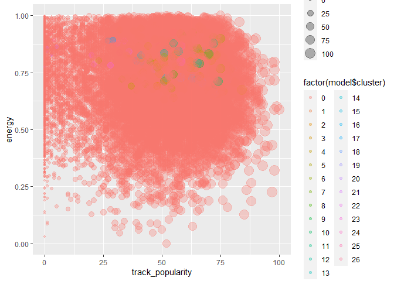
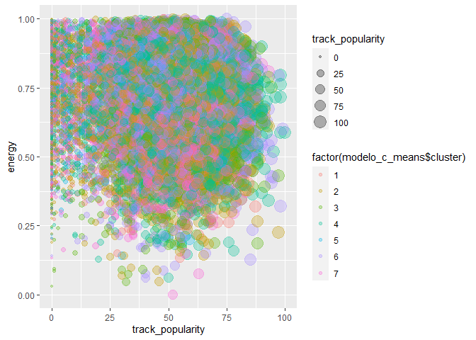
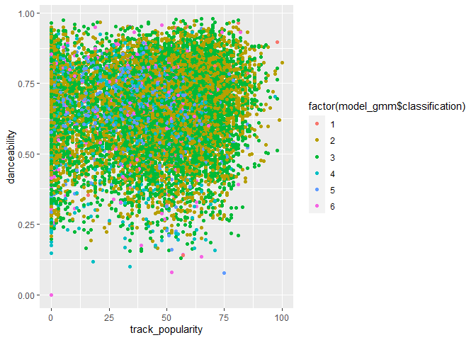
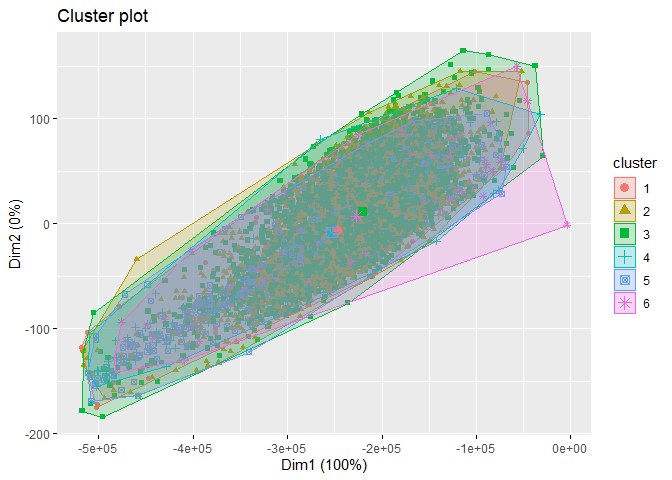
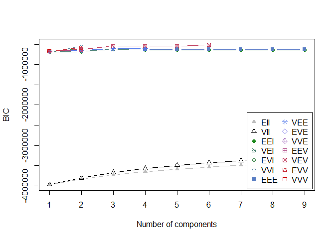

actividad 8
================

Sebastian Herrera Para esta ayudantia utilizaremos un dataset que
contiene la calidad de diversos vinos que se evaluaron

## Importar Librerias

``` r
library(tidyverse)
library(cluster)
library(factoextra)
library(mclust)
```

Para un primer intento tomaremos todas las variables del dataset, ver
que cluster obtenemos y como se comportan los indicadores de cada modelo

## Cargar Datos

``` r
setwd("C:/Users/sebah/Desktop/U/mineria de datos/ayudantia 6")

data <- read.csv("Spotify_Songs.csv")

summary(data)
```

    ##    track_id          track_name        track_artist       track_popularity  
    ##  Length:15630       Length:15630       Length:15630       Length:15630      
    ##  Class :character   Class :character   Class :character   Class :character  
    ##  Mode  :character   Mode  :character   Mode  :character   Mode  :character  
    ##  track_album_id     track_album_name   track_album_release_date
    ##  Length:15630       Length:15630       Length:15630            
    ##  Class :character   Class :character   Class :character        
    ##  Mode  :character   Mode  :character   Mode  :character        
    ##  playlist_name      playlist_id        playlist_genre     playlist_subgenre 
    ##  Length:15630       Length:15630       Length:15630       Length:15630      
    ##  Class :character   Class :character   Class :character   Class :character  
    ##  Mode  :character   Mode  :character   Mode  :character   Mode  :character  
    ##  danceability          energy              key              loudness        
    ##  Length:15630       Length:15630       Length:15630       Length:15630      
    ##  Class :character   Class :character   Class :character   Class :character  
    ##  Mode  :character   Mode  :character   Mode  :character   Mode  :character  
    ##      mode           speechiness        acousticness       instrumentalness  
    ##  Length:15630       Length:15630       Length:15630       Length:15630      
    ##  Class :character   Class :character   Class :character   Class :character  
    ##  Mode  :character   Mode  :character   Mode  :character   Mode  :character  
    ##    liveness           valence             tempo           duration_ms       
    ##  Length:15630       Length:15630       Length:15630       Length:15630      
    ##  Class :character   Class :character   Class :character   Class :character  
    ##  Mode  :character   Mode  :character   Mode  :character   Mode  :character

# Pre Procesamiento de los Datos

## Limpieza Datos:

Primero verificaremos la existencia de valores NA o valores faltantes
faltantes

``` r
# Para las observaciones incompletas, le asignamos el valor NA para eliminarlos en el siguiente paso
data[data == ""] <- NA

# Verificamos donde hay valores NAs
data %>% 
  summarise_all(funs(sum(is.na(.))))
```

    ## Warning: `funs()` was deprecated in dplyr 0.8.0.
    ## Please use a list of either functions or lambdas: 
    ## 
    ##   # Simple named list: 
    ##   list(mean = mean, median = median)
    ## 
    ##   # Auto named with `tibble::lst()`: 
    ##   tibble::lst(mean, median)
    ## 
    ##   # Using lambdas
    ##   list(~ mean(., trim = .2), ~ median(., na.rm = TRUE))

    ##   track_id track_name track_artist track_popularity track_album_id
    ## 1        0          7            8                4              5
    ##   track_album_name track_album_release_date playlist_name playlist_id
    ## 1                9                        5             6           7
    ##   playlist_genre playlist_subgenre danceability energy key loudness mode
    ## 1              8                 8            8      9  10       11   12
    ##   speechiness acousticness instrumentalness liveness valence tempo duration_ms
    ## 1          12           12               12       13      13    15          15

``` r
# Eliminamos todas las observaciones que presenten NA
data_pre <- data %>% 
  filter(!(is.na(track_name)|is.na(track_artist)|is.na(track_album_name)|is.na(duration_ms)))

# Corroboramos que no queden datos NA
data_pre %>% 
  summarise_all(funs(sum(is.na(.))))
```

    ##   track_id track_name track_artist track_popularity track_album_id
    ## 1        0          0            0                0              0
    ##   track_album_name track_album_release_date playlist_name playlist_id
    ## 1                0                        0             0           0
    ##   playlist_genre playlist_subgenre danceability energy key loudness mode
    ## 1              0                 0            0      0   0        0    0
    ##   speechiness acousticness instrumentalness liveness valence tempo duration_ms
    ## 1           0            0                0        0       0     0           0

\#Filtro y duplicados filtrar y remover datos duplicados

``` r
data_pre <- data_pre[!duplicated(data_pre$track_id),]
```

verificamos la existencia de errores

``` r
# Al explorar la base de datos podemos darnos cuenta de que hay varias observaciones que tiene mal ingresado los datos
# la columna track_popularity la transformaremos de factor a numerico, por lo que todas las observaciones que no sean numeros se ingresara NA por defecto

data_pre$track_popularity <- as.numeric(as.character(data_pre$track_popularity))
```

    ## Warning: NAs introducidos por coerción

``` r
# Como generamos nuevos valores NA dentro de nuestra BBDD, debemos volver a ejecutar el paso uno de la limpieza de datos

data_pre <- data_pre %>% 
  filter(!(is.na(track_popularity)))

# Eliminamos el <U que aparece en algunas observaciones en track_name y track_artist

data_pre <- data_pre[!grepl("<U",data_pre$track_name),]
data_pre <- data_pre[!grepl("<U",data_pre$track_artist),]

# Ahora veremos si existen canciones duplicadas

data_pre %>% count(duplicated(data_pre$track_name))
```

    ##   duplicated(data_pre$track_name)     n
    ## 1                           FALSE 12244
    ## 2                            TRUE  1623

``` r
# Como existen canciones duplicadas realizamos la consulta para obtener los valores distintos, pero este hecho obvia que hayan canciones con el mismo nombre pero de distinto artistas  
data_pre %>% distinct(track_name, .keep_all = TRUE, )
```

    ##                    track_id
    ## 1    6f807x0ima9a1j3VPbc7VN
    ## 2    0r7CVbZTWZgbTCYdfa2P31
    ## 3    1z1Hg7Vb0AhHDiEmnDE79l
    ## 4    75FpbthrwQmzHlBJLuGdC7
    ## 5    1e8PAfcKUYoKkxPhrHqw4x
    ## 6    7fvUMiyapMsRRxr07cU8Ef
    ## 7    2OAylPUDDfwRGfe0lYqlCQ
    ## 8    6b1RNvAcJjQH73eZO4BLAB
    ## 9    7bF6tCO3gFb8INrEDcjNT5
    ## 10   1IXGILkPm0tOCNeq00kCPa
    ## 11   3eFJI470ALf1EYjywPRsJy
    ## 12   3iJeF2izF1QcpCgUc97BLl
    ## 13   6e0CvGZf7CouOpYF8toXHC
    ## 14   3eLdNmnRWr9gIyBcqTSSti
    ## 15   55nMnifaQWKe3f9cbwOXwx
    ## 16   1EJgymgJHcjSOGSHcYaxvW
    ## 17   5WaXMQMlQpq8pwIdaFP43L
    ## 18   3TjLsDgL0bTbSQIF6M5Ki8
    ## 19   0GfS3y8Jd7SHWd9R51s7Fo
    ## 20   2v3DuCVBbopteJqdM7aKQK
    ## 21   4QAUGy6k7c3IOAhgWz52r7
    ## 22   3Ciaf6WgvG95TGRGxQ1yO8
    ## 23   1mC2UjWt25Oixtqu7C6suL
    ## 24   2wenGTypSYHXl1sN1pNC7X
    ## 25   4sqABRRGU7CzcHXCyxUzFw
    ## 26   5dy3WUywjZcalTno1io8TQ
    ## 27   2M9GeaCQXrV12J0wzBxIwi
    ## 28   1zzOMDmkRZy0g9f4JTAZKn
    ## 29   4OFFY6L5ywYM1TwhXX69wQ
    ## 30   1hr5Y2i4NlE3LPvQZ9Q5Ao
    ## 31   1aT7vltGhkjyMI3F3aO3A4
    ## 32   4YaU1EjXIkdRdkOI4cCZys
    ## 33   0Fc9QSMX6fgEBgDjUax7t7
    ## 34   7AasLZ4TYgh7dbJXZxcZVE
    ## 35   7p4jpmyBnOpqQ3rSGJzZ7w
    ## 36   4sLtguRBis05qfsBgJ1IdN
    ## 37   508lUjbGcPrL0CfvHC7UvI
    ## 38   7FDaS1k08rwMoAThmzUkOZ
    ## 39   6m8SIT10j41SPpPFOknTmP
    ## 40   5Vwgf4MVO0vLv8fbxaGGiW
    ## 41   5scxjvcdozadBoRRN0UMaM
    ## 42   6oJ6le65B3SEqPwMRNXWjY
    ## 43   2tilX6FUl0IwFgiOYjuc6V
    ## 44   3yNZ5r3LKfdmjoS3gkhUCT
    ## 45   478QYNLw6dhTTx4oEkhBeq
    ## 46   3C4fzUgIP3ahkhOBdP38GM
    ## 47   2k4c9ZAlIYHyXiJ4i20FO7
    ## 48   79zGYOcAe2VmJsyQiJX31a
    ## 49   6B2NRQjtSOtqi67d72r5cx
    ## 50   08rBIlTMXlF5uEHobZglxv
    ## 51   1BmdqDrBU5eohtRwHBls6C
    ## 52   5rxKInBVj0QE87KenyDiLf
    ## 53   3kgKVcBpBGuSeaEC0AZGlb
    ## 54   5qCrT9lVmIGxqB8i6bb83P
    ## 55   3Lv3frZVXU7Q0JEFvLIzWW
    ## 56   2bZYJvVRN5EqIvAUFhUNls
    ## 57   3utdq3dPLVD4r7Vv9BnCAI
    ## 58   1ppOGANOzMT01Cxh9jx4hN
    ## 59   5Shjuje8PRcX7ueEVajrLH
    ## 60   6wKJjrWWP4qpzYbE8oQkc4
    ## 61   6EDH26ppl7R8oV4tGilCkS
    ## 62   4RaN7556EogBfF80klMEX2
    ## 63   1nwoWaqzB30bD4IPqRNuex
    ## 64   4fDBElPGDqZQ3rJorZTm2w
    ## 65   6AZ21kPj2a0INgf3uCviVu
    ## 66   3uXHSf9sSIpOJWuC1H8DiU
    ## 67   4Q9iBGT9b9CVTtDwsgQWnl
    ## 68   6LCsZ8ARrIq0n9nr6gM2ru
    ## 69   27F9FlipD657qYRQT3qxFm
    ## 70   6B9cqNooxIyPfr3P5EB8LA
    ## 71   05CwHjIk71RXVU40boRMnR
    ## 72   0qc4QlcCxVTGyShurEv1UU
    ## 73   5icOoE6VgqFKohjWWNp0Ac
    ## 74   6GIRtKNXokeu25nn7U6Hu8
    ## 75   4PkIDTPGedm0enzdvilLNd
    ## 76   5PYQUBXc7NYeI1obMKSJK0
    ## 77   4Gcv5SsxnQWpmOnUI19EJk
    ## 78   5YkmS18BehACOhIIeUqe6l
    ## 79   3vQhEd4lOg4mAV6CHCgoHW
    ## 80   6wo37KVqFJhtuxPTpLCcfe
    ## 81   3OTSBoYKO7HzGVj8Bu2OH9
    ## 82   4NSW0Km5ZG60L8FthUebPJ
    ## 83   1xK7enJZVdv37fnnxoZlPq
    ## 84   1z1XegUChLLQfcbtIK8ABn
    ## 85   6aoGtdWXBkYQ2O2wnyIz2x
    ## 86   5tAa8Uaqr4VvA3693mbIhU
    ## 87   18W92Zm1KjLCbUIszOhpkD
    ## 88   3D37T7euWvVJ45evRmriIh
    ## 89   3y3brCCecHC3Db18aIOnny
    ## 90   6XqvFyJGdUD5IWee02ARKU
    ## 91   575NJxNUVDqwJGdzBrlLbv
    ## 92   70YPzqSEwJvAIQ6nMs1cjY
    ## 93   7Ht0v0LWBCOEjmNQ0iMpNr
    ## 94   6nDKrPlXdpomGBgAlO7UdP
    ## 95   2b1BwUGGyKq0CoJd8G1B6M
    ## 96   09IStsImFySgyp0pIQdqAc
    ## 97   1lGVyEkGHUz7Pg78QGaS4a
    ## 98   6ksMjdec8b6C45TUawkAdu
    ## 99   1vsQb8n0icvMsFnL9663LM
    ## 100  6pooRNiLyYpxZeIA5kJ5EX
    ## 101  5WHTFyqSii0lmT9R21abT8
    ## 102  1pBO9JDqh1y3TbCKEO1OvG
    ## 103  1LjxmkW3xRQP2HzswhYyyc
    ## 104  7FCZhkhzEUVNUAlGauNKIe
    ## 105  2JoIjuzRplpYGvvLpSW2on
    ## 106  4PUWpNtDejQwwa80LjvxXl
    ## 107  1nufXiTCTTAeJfO9hLHvO8
    ## 108  1NDxZ7cFAo481dtYWdrUnR
    ## 109  1ahVFh0ViDZr8LvkEVlq3B
    ## 110  0Ev562zA4pmUsBqjxsxxdx
    ## 111  5l8AUgBTWuOECwVgYtaUyE
    ## 112  35MKhw2YBKApmD7fAnPERC
    ## 113  3Kuu5vASpXK8oRsxOvau6P
    ## 114  7KW3XQV5Or5CF57MYVj5h4
    ## 115  3M9Apu4OZfylLTFKvgEtKa
    ## 116  5N4erncE7kuUccm7zEmwzk
    ## 117  6QcrReLyoun4xrPVsZ5OJE
    ## 118  1kQhi22kyluRCnIPAXtxEZ
    ## 119  5cE201rNvIkryS8N1dJ5nR
    ## 120  4AkCyd9Nlbt8JprQq9V6o2
    ## 121  48GmVZwvkoVC5StfMLfNJE
    ## 122  01iyINEYgPQ7ThMZuHUsqS
    ## 123  6BwClo5W3VvTzJv8bvZXDD
    ## 124  108r6pnZHStBIktpyyps9w
    ## 125  24Hzd4FPhz0HPx9jhM9cap
    ## 126  4aTtHoSBB0CuQGA6vXBNyp
    ## 127  0gIZLyF3MWQVcspzrLWYod
    ## 128  6y1UtRcHQU07aUs3oxZ8Yn
    ## 129  54z0kLF0skj0Hdb9wCqPJt
    ## 130  6mPstbtzhyqKmwefY4eVWD
    ## 131  6uBhi9gBXWjanegOb2Phh0
    ## 132  1Pe3Tnahd3nNcKrTvNvNvW
    ## 133  4w8niZpiMy6qz1mntFA5uM
    ## 134  7BKLCZ1jbUBVqRi2FVlTVw
    ## 135  2IDHoSlbG0CKH9rhq68wTb
    ## 136  60wwxj6Dd9NJlirf84wr2c
    ## 137  6kPJZM97LwdG9QIsT7khp6
    ## 138  3ebXMykcMXOcLeJ9xZ17XH
    ## 139  7iNIg7XDEaYECfWD5dJ9Va
    ## 140  6cy3ki60hLwimwIje7tALf
    ## 141  5N5k9nd479b1xpDZ4usjrg
    ## 142  0qaWEvPkts34WF68r8Dzx9
    ## 143  6jq6rcOikCZAmjliAgAmfT
    ## 144  762UXiwEHYY97VL45sAUPR
    ## 145  6RUKPb4LETWmmr3iAEQktW
    ## 146  7ef4DlsgrMEH11cDZd32M6
    ## 147  3zU9rdflI65tK4dkkNSp77
    ## 148  12GEpg2XOPyqk03JZEZnJs
    ## 149  4kte3OcW800TPvOVgrLLj8
    ## 150  0lYBSQXN6rCTvUZvg9S0lU
    ## 151  3vv9phIu6Y1vX3jcqaGz5Z
    ## 152  2QtJA4gbwe1AcanB2p21aP
    ## 153  1BltsyC5W3SAABdxyrDXwi
    ## 154  3tTYxjYYcXFqFXA0AZ1Fav
    ## 155  0azC730Exh71aQlOt9Zj3y
    ## 156  4h8VwCb1MTGoLKueQ1WgbD
    ## 157  0E9ZjEAyAwOXZ7wJC0PD33
    ## 158  0lHAMNU8RGiIObScrsRgmP
    ## 159  0n8ob8S72lvznoVfiwz4qL
    ## 160  4r6eNCsrZnQWJzzvFh4nlg
    ## 161  0GzmMQizDeA2NVMUaZksv0
    ## 162  1MlAkYV0nbRKWhhfvTt3zc
    ## 163  1WkMMavIMc4JZ8cfMmxHkI
    ## 164  7C7yqFTM0ncyJ04GIKrxdV
    ## 165  0WfKDYeUAoLA3vdvLKKWMW
    ## 166  22mek4IiqubGD9ctzxc69s
    ## 167  61ZM92T2zaXIVsqncThQzC
    ## 168  6TnxdnJcZIwCWiCHq5Qds0
    ## 169  2aFAmDBycyEnj3lcS95JMe
    ## 170  0Npijoc6ZcUe1devUugKvI
    ## 171  5gwLIRjGFf3hXuHoKEsWLg
    ## 172  3d4lc8esnUl7Bx9J9d9oty
    ## 173  0U6bQIAh6MCGo1xjbIIx2S
    ## 174  3oIVK7arAFuUOCGafPLxSC
    ## 175  2I4jAMEOEUQD5V1byYCqNS
    ## 176  59QmL8ygKtVfMHmPx3GaBX
    ## 177  5EdYlCWou17k0N1PADLKfO
    ## 178  5MvsfUN0H79C24t3fPepeL
    ## 179  7CHi4DtfK4heMlQaudCuHK
    ## 180  1CW7tYkpJ95c7bQkRf6CcK
    ## 181  4bSFPMXKYaCoBhzJv276zl
    ## 182  5AFrctm65wWIqJsjHPPx85
    ## 183  3DsjHcLYMExprXJECT4QQP
    ## 184  7FjZU7XFs7P9jHI9Z0yRhK
    ## 185  5ijpy4l0nKZPIKHui6SQfE
    ## 186  6j8eH9frh703HaGBaSRS6u
    ## 187  79Vz5MNH7Qe4F7hPKT8tPz
    ## 188  65mOk4n0tfrMysFXu12ufx
    ## 189  4w5Grfxx5Rpup6mo5v6bW0
    ## 190  3uiQZlSlSDRduWLFBTSEot
    ## 191  29ikXeGM6kScvhvqfvgiwO
    ## 192  2Eld7kejX6FH9OptVyKQak
    ## 193  4YhN72dRYL2Z3MsaKyT7rS
    ## 194  7DQ5CZjAQdhgDgdnSXxJ7Z
    ## 195  2aXA9aQfrqaOi1Wy3NfSZI
    ## 196  62XCV3AmCMkPa9X5mCim8O
    ## 197  5llPdGZJjJFJv9aL6ZaiLY
    ## 198  7pWK1kMgHy5lNNiIfuRbkP
    ## 199  2W9pBY75aWOV39S73mqqbn
    ## 200  1JxQmgCEipmHCUiJS568pE
    ## 201  6pu5jQqenr37n0z6eBKOh0
    ## 202  3RBk0P36O7wCMxF263jRJL
    ## 203  4uRx3SdWG2cNVfRNVPwHDS
    ## 204  3ZRgqoTb7pVO11IxcKGtMo
    ## 205  0DhkTGjEaIHaSxTfC14BFm
    ## 206  4nx4h17pRj1ikT0hZecR8z
    ## 207  1tq4UL9BB7BHuT6eorlX3X
    ## 208  4P7F3kb2Ze1YleD6lUYwJo
    ## 209  3qeJ84Y6PRS9LtliOuT94Z
    ## 210  7sYAS4CpbV90oSemgaEQat
    ## 211  1CRy08G60mS5jvhB27xMpS
    ## 212  02itaCXOdC54J0ISjqqFAp
    ## 213  52EB2Gk1nkxZmbomJOXUde
    ## 214  4Jwp3yjIQfudmjuctLQlfJ
    ## 215  7N06jo3EnV792VFaG8vuW6
    ## 216  517cAnPxsaxfrkKHHY41wB
    ## 217  3GT2CBmJWIEdCpHiB31WYK
    ## 218  7fPuWrlpwDcHm5aHCH5D9t
    ## 219  1rRWFc2p77FYyb67m5YeVO
    ## 220  1LDDUVvutZ3qxvnOrulCBM
    ## 221  2wOVXsIRIoniqipE9I5ZVx
    ## 222  0byab45cmZntz74RxcASrf
    ## 223  4ciBIS83LHQpKf4noVKP51
    ## 224  19TOAlTFq0NDHvUPQR0tkr
    ## 225  6VP3410weACXiPCVLKSkOb
    ## 226  5ql2mP9FUhB3SgMzv2akuO
    ## 227  3jwQwGVERUXo7eaAgL1xAo
    ## 228  46W9iEjOg5nkMvb6lo4Jwz
    ## 229  0GRoERSBBky3YgdKW2w2Vc
    ## 230  4fK2NU9UyQJV74ZGiSVYsr
    ## 231  0jlpHhGUFn4aAWLsRRnwep
    ## 232  2pMntGuRgHAHVtrpC6kgGy
    ## 233  7EHCt2jdVwHp557sfMPosf
    ## 234  5YN0zHycJ0Yxz31A5QsVov
    ## 235  14nIFzHQf1OBWf6VHVR8DF
    ## 236  14sOS5L36385FJ3OL8hew4
    ## 237  23FHa9lYnG6Dr8OzombPkS
    ## 238  06BrHnTVDOydsfg0LZ6mQb
    ## 239  1YSwQvw1NrEPfA0j1iY8eV
    ## 240  1FlIzyCvRFQUE4pc7PiaIo
    ## 241  3eW2EDwNRAiQKkgom96dUa
    ## 242  1k08GK7ox8SDmEMvn81TwU
    ## 243  4raMIjIjMc8JohHth7l9lG
    ## 244  52Y5nYBQgqawttJxxtUv1e
    ## 245  4R7ZSlYoJOIaxHJFHszQCR
    ## 246  3N9YuL395rE4qNyHMsvOWC
    ## 247  6dX62wjTHi9F1srVTjV89X
    ## 248  0JumfyG7GUshFjxouEXwhw
    ## 249  3Iee2uf8UXOrOupQzfs1z5
    ## 250  6jreFSOTUAViWjKyzOC4Kg
    ## 251  5Qnk8vP5g9l5SDQKU3qyYQ
    ## 252  3Mong1BzxMKwTZ0SbfLdcQ
    ## 253  4huh5oqBz9RkgpzAkyuEAs
    ## 254  4Nu8sEejt46770gDUvFcrF
    ## 255  1IjuevPDJ8Sa97wFwQ5j4V
    ## 256  4d3cCNTG3PUgWhPButc4N7
    ## 257  7r4nPsLToVIPdsiEeZKF6Y
    ## 258  4Tvw0lweq9l2JPQKFbpbBQ
    ## 259  1yAPglN5AGf7UoLK062ZYq
    ## 260  4IAd7Vdwcc1E86P15tXjca
    ## 261  5qiQbOa6AFEO3P111y9Jry
    ## 262  7nbVbGjifh0m2fhPYqcI1R
    ## 263  5NeFmsnXBy6xVbz8pesM5l
    ## 264  6fvbl9D9VjMtLRQsuWPyYt
    ## 265  1MgpEKnO6sgMTb5zumAsgn
    ## 266  06Z7Hy2LUzbcSFmWzwkun1
    ## 267  0EdgK7ASb4kfRkW8pVMN02
    ## 268  2gqzTQEn4g5ly0n5ScdMx0
    ## 269  6DuE8kXIDJ3oiCibWXmgeN
    ## 270  5up5uXChMJLKyuop9HwtCb
    ## 271  4AMY0oGSt7vZwgxDnHCJBr
    ## 272  0VQUyufAldw4Eitv71TPmg
    ## 273  0EQeui6OBMzqJ3Z3wCOzZh
    ## 274  1o9D0rUusi2V5idyOEOPII
    ## 275  2neq77lIMkitQwBwy1EDng
    ## 276  5ow0sNF1zSqp71Ix5jEXWU
    ## 277  0vrmHPfoBadXVr2n0m1aqZ
    ## 278  0o9bHFc8Lt5tZFvTjNZTNf
    ## 279  3oN9prOZJ8jR6rFP4YMJF9
    ## 280  0Qew3aYvQPGPjfL7gbe6x1
    ## 281  5naYe7rLMZcLfO1DKg48MK
    ## 282  3LaQ1GajOXoUeiTA9UAcCK
    ## 283  3DGar7krWlmrXRFHBcQF6z
    ## 284  5VGBgPVFO3e0lWz4WHYntQ
    ## 285  6sYJuVcEu4gFHmeTLdHzRz
    ## 286  3eS1VMcEmq2IUgpaeDysCb
    ## 287  4fCAOaMs0PYL58OijKp2IS
    ## 288  31OqWK8Lc6GnUbnLG3GqPX
    ## 289  5CpkVOosLFc83LbwqO6hnI
    ## 290  3cJEgWbsBmGkvXz906tgut
    ## 291  3ZqKbMO9UasuKgQeGT7QZS
    ## 292  6SRWhUJcD2YKahCwHavz3X
    ## 293  7Feaw9WAEREY0DUOSXJLOM
    ## 294  7K7MUBCnzgBAvMVW2RTWNs
    ## 295  47dABAPyBgKB3iQCrC4Vrv
    ## 296  6vRCKJDtnrJEcyyzIMa0w0
    ## 297  4BM4ml3TgBFALLaCaJtVhi
    ## 298  4D3o6Hh3GydRpTTlyLP3D9
    ## 299  3R6dPfF2yBO8mHySW1XDAa
    ## 300  164C9bSF4ryqWXI4XgxTE0
    ## 301  4fC6tDEFmSBBCRBUOPeQ8b
    ## 302  7lPo7aUbqNz5qmcan9Oj3F
    ## 303  1HvCFAUIWQsWV9zud3UhDl
    ## 304  76WNl0hDHHxTUhfLrEIBSm
    ## 305  6xTU6B6nFwKKTSZ9ySXS80
    ## 306  0jvqmWRCyv7xnxqrtinbHJ
    ## 307  5itOtNx0WxtJmi1TQ3RuRd
    ## 308  1uuUnsWpJwqBh5GRQ8uxla
    ## 309  4DfxFGwreu9BquiLRClwh8
    ## 310  6Pgkp4qUoTmJIPn7ReaGxL
    ## 311  3R8lr1Y1kPgXEbnXkcMMlT
    ## 312  4ESPuOrSsRcBISzcMlzmY5
    ## 313  0Zbbxnx4SGGHoIow4PpISP
    ## 314  72gv4zhNvRVdQA0eOenCal
    ## 315  2kLf4myxQME1Nd0voeKZri
    ## 316  4q8PHoRsPUB52LFylX8Ulz
    ## 317  2devxXJUTEIFmgt8cXaqmO
    ## 318  0ct6r3EGTcMLPtrXHDvVjc
    ## 319  7dOeiXeTSfA1ixaYmQcWu7
    ## 320  7jEyX4bqaCSdMN4D4JNnVj
    ## 321  6ULQ6ZRc7JuVutRMy6gfgc
    ## 322  0FlnsBDwPglenLJoQjPd4K
    ## 323  4Vbz3osCh6DwHYv5gVv5H2
    ## 324  4OgwXdylh75fHfwUzJTUqg
    ## 325  4kWO6O1BUXcZmaxitpVUwp
    ## 326  0A5gdlrpAuQqZ2iFgnqBFW
    ## 327  0BiGd2FNDQ0eh79ZHfp6tS
    ## 328  25sgk305KZfyuqVBQIahim
    ## 329  3xE7LrW7P54CYNQYqLhl6J
    ## 330  4ut5G4rgB1ClpMTMfjoIuy
    ## 331  0uUNN1nSoUx1A4fkDCWDQ7
    ## 332  1byydVLDAt7An5Pk3SuL5j
    ## 333  1RxlBxlaJpSEVnLk4Gtvym
    ## 334  7IWTIkiWGWNQyYfOLdMrGD
    ## 335  67FPUOM5Q2sSvS3iqLxSFs
    ## 336  0Qmqhtqco9ifi7ScZh1095
    ## 337  2Fxmhks0bxGSBdJ92vM42m
    ## 338  0FC7eAz8CW9HAWnBr8Yo42
    ## 339  7LYMT7ZaJC6KaKaXod9qNq
    ## 340  6fIgsZFtGXiIvxb2Y6oCc7
    ## 341  47knrBbYhqtrggWYSkU6h1
    ## 342  46x4SztssOJ1KzRjPqVUPk
    ## 343  0AKxkfd5NLlWMXCVgH6a6X
    ## 344  43ZeyBuql1TboyWE3ElHXj
    ## 345  3EKKIR8be1kfAAwaz1fzyS
    ## 346  4u6chQOq3h6g03cnPzAxcz
    ## 347  5UaEBgRvUPFf5CEDhaTdp7
    ## 348  6wigvUlHft5QfkbxmAG5uC
    ## 349  3b0cJPguhWOh2hjY6Lu192
    ## 350  3QC33AxvY2sdxq22ym3aSL
    ## 351  6nsLzJfvp5OLd4mgqUJkpq
    ## 352  1fN2cemf6ByT2WKqtumwR5
    ## 353  6RnkFd8Fqqgk1Uni8RgqCQ
    ## 354  5fEpuvcNvERP7EHtLe28Zy
    ## 355  45NYp6HaMbhHNtn8sTnztn
    ## 356  7HdHOGbA7uyepn1jbPKqOx
    ## 357  3kGfazcbVvVkuZunzlLgTD
    ## 358  2ZEqEHPOhJdkI9pCCW9pBD
    ## 359  35ARq65zezGBwA7EHBXm2w
    ## 360  1N4n7soiQQ8TRsntrkItyA
    ## 361  0XOFJ634crTl8z9N5Gxh2S
    ## 362  2OlWBmSjf1aUPGLNf0UI5A
    ## 363  6UiDiFJUGEDzkGpZBL8IYq
    ## 364  5WvAo7DNuPRmk4APhdPzi8
    ## 365  4b2tcjrG1qUkSdsqEFP2dB
    ## 366  0KsB4TwgATg88aXCMBoO3Y
    ## 367  23L5CiUhw2jV1OIMwthR3S
    ## 368  3OEF72iu0qSN75kiw0qP1o
    ## 369  4zdQmfTLWgGd5mAX4MUIaX
    ## 370  5KVxCdOVauTncDKgK426XN
    ## 371  7tegFBOVAZADytMG3YIR9o
    ## 372  4eycOo0qKubeGx3g29dcHZ
    ## 373  3gMJMSrU2QETbsILNuybIh
    ## 374  1gdrNesoUadTXNdVaKS2t3
    ## 375  0j6HZwmFLvxSoYUrg29IgP
    ## 376  2MbrVxNKpsg0bu9LMlPiri
    ## 377  2gApWgkuisXedOcS9Tligs
    ## 378  5Zjge6yCThuBMdnJdOBp9A
    ## 379  2qpuYv59RVgLKcA0DPl9Tt
    ## 380  1SV5ys0BGnN6aEsbS7prwt
    ## 381  3t5I7uoAOyRtzkAVaHgmfL
    ## 382  56FtGMGdOoONvc0XpP4Bm6
    ## 383  0HGSn0eFH5LF1MWdE9FOUC
    ## 384  2WSYYbEdxtGGo0VVP4jNjb
    ## 385  3fzCO5mdnxKvxOT03Ao0RI
    ## 386  7Bh4dzYrbYtXbbuvK8M8yE
    ## 387  6nfiboYmeoHMxPU05yEQvg
    ## 388  4ccp9ytoMerEU0967Okhu6
    ## 389  6dKOpmTOzAVnaHqq7hqkJa
    ## 390  74P2i9IIx0nkki1GVQqx3R
    ## 391  3CLKvDKiVgbgfWj3fyyibl
    ## 392  00bc7A2CLjp40XNd6ZPZNa
    ## 393  7Gb3OZFw2IiNk08fSN7MrR
    ## 394  5SubtShpNoLYiVG4oLSpOG
    ## 395  5VBMFkU9emR1HDLPoXuOUQ
    ## 396  5QOg6uut1ybakHajEfBL8K
    ## 397  7auKfEOsSVCeYHn2pOu6uY
    ## 398  64XUlDULbJtK6xDL4mEB0Q
    ## 399  0FVUs7Kb4KKl3vsssgZCud
    ## 400  0lHYQoSwhIKqUjUsbQygyl
    ## 401  0azhsizFhBepOGgcQ3EKaL
    ## 402  3b1TJu58AWEiGvnUwDdhag
    ## 403  2TFJVb9LL54V5W53qGWDSv
    ## 404  7EdnZLYzleCTG6eVJnZbR8
    ## 405  1JSkwWA4e3OXlnOEcn0MXf
    ## 406  6GvK5IObiZJs4PyTFJTELk
    ## 407  0qnp1W6FnL9qoadgaQdsT8
    ## 408  4vid1h1wAzoZoEKJVXoUgB
    ## 409  34Yb5ldkgXMieDcFIRQPdh
    ## 410  7MsgiyWoerebFF0zaahmCr
    ## 411  4EyjvMJ6llJ5stWDlwo8v6
    ## 412  5L3FE4WEDdQ0xZYVdN7uvE
    ## 413  63f9E8ZTvtcEdqZKHj5Vzv
    ## 414  5uHl2eYaITSX6xEX8bmaXy
    ## 415  1PNb8pRsZGa8XN1m5nJe70
    ## 416  3v5BOhyPrVQN7PYE6JnY7j
    ## 417  7JCi89HGiURxFpr6NITY7q
    ## 418  6k67RdkVjTZj79c1cRz7IQ
    ## 419  7b8YOVV5quZcSKEijDgyWB
    ## 420  1Jr8RbuOnvMHsMHcWgZ9Do
    ## 421  3IdPtyJHB1WVPM4eCiCAKM
    ## 422  1UThkKR8w3WnA6lWCRhOJn
    ## 423  5WrEilrRI5cIW0DxMvQYPZ
    ## 424  24nK8tW7Pt3Inh2utttuoG
    ## 425  3BPoSr2pO34Aan6alFfVto
    ## 426  00emjlCv9azBN0fzuuyLqy
    ## 427  5sbooPcNgIE22DwO0VNGUJ
    ## 428  06mzeP9GQNSHWd1Nh2C5FM
    ## 429  5KawlOMHjWeUjQtnuRs22c
    ## 430  06Pvy98db25O7wlfFFFIRM
    ## 431  6E7jAJN2e3znSHyPCdQqx8
    ## 432  2AIWoHr9DF6y4KALCBKWQS
    ## 433  7Ed6BkggCS2KaKY5YlINaF
    ## 434  27kB4qLUCV8nZd2eOgj1Tk
    ## 435  7LJjWqhqK594nN7qJzLVXE
    ## 436  4WuKHgxdCJsaOBIh7yndty
    ## 437  3rOEipqoZpjyn8PtOMeV8k
    ## 438  0ErzcmZ2gIwX7X0xSMQPix
    ## 439  5Z4aqpT39KpY8gbHoJWdou
    ## 440  2U6RSyXFnDVNYoD9iUgi09
    ## 441  5SE57ljOIUJ1ybL9U6CuBH
    ## 442  6DIW7GJbuGZdHolRcPWprP
    ## 443  1S6zXoXhfalX2ETKo337Md
    ## 444  1q3C6brbmRrULTyo2mseKF
    ## 445  7gr57cYekMWriyJYbT7oZ4
    ## 446  7w3mCZJZbfXzNebD5vktMI
    ## 447  4Is1b37KJY9XVCgzp81FBW
    ## 448  3nXUfNbkv8ikaSdHwEp0oY
    ## 449  5MaDeMdqsPsZTxNWdEZPVH
    ## 450  1gsb4CFzUMERAkfzAKwrZu
    ## 451  0xHgclG2TeqIzB8N3Wb5rP
    ## 452  5gA9Xn8oPts2aewPgxVkPD
    ## 453  3NxuezMdSLgt4OwHzBoUhL
    ## 454  5unCIQfJLMtcsiU6MP5zmB
    ## 455  0dSE54vYYvRNWzVTxE2xTL
    ## 456  3sygLAUhHsJsQ0cBk6fxRd
    ## 457  1LShDXXs40R8bQFNBBupI3
    ## 458  0aLG42zaidNkblhiQgJknP
    ## 459  7qDbAc6xMW07T7yyMnQqS8
    ## 460  4lt4QTuoYOEEOhrNDZJ1o8
    ## 461  381g0b6QZxC13SzA2HRMIc
    ## 462  1IzuuPDzqh3dfKxilHbGYU
    ## 463  4knqZHNHlEBBEmfETcpTyr
    ## 464  0dHWWPN5XGWotUnM57QQZK
    ## 465  0m3W71Oliiv3gQWXi2YAmJ
    ## 466  0gxkqxGiLg1ylKzgToCcHY
    ## 467  2WDhYlm5gBepkMZHBk0LN7
    ## 468  3eOrrreH5zbp4xpfiFqy2D
    ## 469  4tYLk5axtAxynbehhU4uJn
    ## 470  7yT71nE6bb9vzdYz78iITu
    ## 471  63BGyvr6NuhA0q5NimghaG
    ## 472  1ZtG48NtqQdyN1AnXiiYL0
    ## 473  6u8epWzzk3CsJ05sqExF6T
    ## 474  7K0trO4bMEWjSiFGPG5LTQ
    ## 475  0PCRR19Pf4iiuvSrPxtQ0x
    ## 476  6TgLQJ87xq6adrAU6HzaTW
    ## 477  3pWcj8hxj3fsb9TDAcMpEl
    ## 478  4sh506lJZac1T4o4NqtIuS
    ## 479  7a4aFs6bW7TUySQviVERSI
    ## 480  4aJdmCHGL6KrrvuSXgr8Jp
    ## 481  50RJdoxw8iajGNtHQe6QeS
    ## 482  5gjhnWVBIBgoWzv3SIQdwW
    ## 483  6iC7vapdKp0XlKhxOkp8QJ
    ## 484  5kOWncnXJOC1LRH0rk8SGy
    ## 485  69zxj1EFDfAouZu9JDmQld
    ## 486  5EwwwdsQfKI8ZnFG93j5Zu
    ## 487  2M1mqcNUBIAfRoD2Puhejf
    ## 488  0FDzzruyVECATHXKHFs9eJ
    ## 489  15BlympuVSfZFROojEMY2M
    ## 490  6xUy203RnyyOfbqf96Nven
    ## 491  5Iy2Jj87Ha0C0IBlNE1I4y
    ## 492  1vvNmPOiUuyCbgWmtc6yfm
    ## 493  11Fo4dAH31K7UZHGqCkCmE
    ## 494  0kHyKhJMukHEPfeh8s7rdM
    ## 495  2tpWsVSb9UEmDRxAl1zhX1
    ## 496  36Z5wae28KlrJ4wL3KuGOe
    ## 497  5ypiGNhYY1GUoVB1kVZmc8
    ## 498  5GjnIpUlLGEIYk052ISOw9
    ## 499  1YDJ2f1JuKzYWZpRYiBYHu
    ## 500  6F1kPSgdnlSzZRfskE9vaV
    ## 501  07nH4ifBxUB4lZcsf44Brn
    ## 502  2i2zYdN4KCkTCDscdMYr87
    ## 503  2BVVmJQZv4fOPWavI9mkIj
    ## 504  5L2l7mI8J1USMzhsmdjat9
    ## 505  24tVqMiAtv8jmpNPhBEsDY
    ## 506  1sh6lL6cmlcwhqZKGiKBua
    ## 507  3P7qStX3ECFOLfjrXuLzbc
    ## 508  0bMbDctzMmTyK2j74j3nF3
    ## 509  3TKpJrY9q49Mj1JOsM9zGL
    ## 510  6Fvhy9aaBvsLBzC7vDEhIr
    ## 511  2a3dopgTF1q4rMVDJ1rwBU
    ## 512  7C1trmcQQ5n5RNy4l6ziCv
    ## 513  2sxjVSDvymkn264oDZCrl2
    ## 514  6j3MJ0jtsReAgwRwqsHC7T
    ## 515  1mzARUs2kMMxcKh1ome5aX
    ## 516  0JIcWmxwEpv740agHLbVB5
    ## 517  35mMXfym6C9VOTUVrcKKZp
    ## 518  06mg22JLouk02orwxz0UfD
    ## 519  2kJIiIqbzYVtv2iTpbQts9
    ## 520  3UIGE2FXaUUcYWA31Og0XO
    ## 521  3KKrA8p6gzpYC44JmThaEq
    ## 522  7vLR7NDAadIXfWjl2nw5Nr
    ## 523  4dSS4hwl81hvbfMsIogJGZ
    ## 524  7M9w4C8WenlvWfNRAulZOX
    ## 525  5MvLsT03RBp67RLoeISCdl
    ## 526  7CthsM57gIgD2S8xyL8coq
    ## 527  4esEsg9IxiTAGMBQLe9XOu
    ## 528  3wWRbRa3OFIFRs4gNywkdd
    ## 529  5TgS4dcUAU8EEb506d8wAT
    ## 530  05P4BYqVauVxy0w9g6w2D9
    ## 531  3XEdqQtGHAM5huMrs3RaKN
    ## 532  1Pz3QmQFBFuI60rxCQBeW6
    ## 533  0SDgPPSjRPdGD3hyrCTG2S
    ## 534  7hzjWGFi2HKUGOXp1LiQ3V
    ## 535  1LZbNPkZE39WeytrhcoVD2
    ## 536  18KjYhghq6K3ZmfcewWDp6
    ## 537  2qv6LU59qyGRzm4X2TFYMl
    ## 538  5yzzy7Hevww3RDntQM5mG1
    ## 539  3O0e0LHTpza0rYVDbZfQ4r
    ## 540  4n7jnSxVLd8QioibtTDBDq
    ## 541  4466tjT4xLDhIdmsMymUHk
    ## 542  7hrnaeVvXFAkvQOmjHJglY
    ## 543  5OJJF2HA089n5T0ugmXCrk
    ## 544  7aQeWViSfRWSEwtJD86Eq0
    ## 545  1TVEPho7uQub2pMJyzO8JD
    ## 546  1WSGTYKLEpKfNQYYW5Oymt
    ## 547  2VDTgXwf3F6kcpX4HI0BKy
    ## 548  6TaqooOXAEcijL6G1AWS2K
    ## 549  6Qs4SXO9dwPj5GKvVOv8Ki
    ## 550  4jp4Z02kzzg8gK0NmDGgml
    ## 551  2Fap2zMMINCLylSCSGQLEa
    ## 552  0nrWZWkJM62ftQJSI8fDc0
    ## 553  15vzANxN8G9wWfwAJLLMCg
    ## 554  5masKPHeAOVNgxdLebIcK7
    ## 555  5CMjjywI0eZMixPeqNd75R
    ## 556  0YammaEkYSeo9vQYZ1OwS6
    ## 557  4jin3VK3FfPc7l3LFLxt0e
    ## 558  4qqArAiTPueDxIp7cf87h7
    ## 559  43tgC5pTYJpc5D3C9HRwEg
    ## 560  7vFoFDWqTX0mHzLfrF1Cfy
    ## 561  13qqdlSeF8FcxsRyapDMZ0
    ## 562  79T9m6YkRCgP0955CE4UCd
    ## 563  6hmhG1b4LEyNuashVvuIAo
    ## 564  7b4vbqgzMhbFa0wdjfftQJ
    ## 565  5bcTCxgc7xVfSaMV3RuVke
    ## 566  6LCrqs85q61pfZCXYvW63B
    ## 567  4M8x1TR36VMQMFMbGCdoyA
    ## 568  6gpcs5eMhJwax4mIfKDYQk
    ## 569  2Foc5Q5nqNiosCNqttzHof
    ## 570  7ew2yVscivQRemp0MPPWtS
    ## 571  15DwFznkBJir7AK9PyMyRR
    ## 572  11cDEev79fPKi6uJCjUhu8
    ## 573  0M0FvSNRZmDz0Z769rewlI
    ## 574  16q3ZjCy9TFLKReke8ul1I
    ## 575  4UuGBDjt8gLXsANZqZxMBz
    ## 576  3fNuYHHay5uUISA3fePcTH
    ## 577  5FhYGAbUG4fgK0Q8eQZocT
    ## 578  2wuDt464E6oTVNHq48fEVP
    ## 579  492edpLhOflovry0RJRQ4J
    ## 580  7dkhaBy2KuMGR9SDtUyXZ1
    ## 581  3JmyDWiGoQ37jZlU7tU9Pu
    ## 582  7dLOOzJGQnsgqFcflWiEcZ
    ## 583  1O7LD3kX8b75oLmHdCvGRb
    ## 584  4Gy6pnhY9GGE3nqD3d0CmU
    ## 585  36pYPsbeDZTNLFhDJbVv9b
    ## 586  4h2ohOfzR74qDhUmeYE2za
    ## 587  3g1MMelMBxLjtKwcIVFe0N
    ## 588  5QWsDMeukgzBiUYAVlZvhA
    ## 589  2bR6LkOC10pZ3udHdZiENF
    ## 590  5X73AYzzEE5Di0JwcQKt9N
    ## 591  66SfFlsxFNT1NI6PZDN9oy
    ## 592  4eMKEM3m4sO62SUVCxqnVI
    ## 593  2s1tFUAu7atdMKuThwOJu7
    ## 594  721s1WVdSDXkTIo1WYR8jW
    ## 595  5IxHVYf5BRnwcAUtgI4Hvy
    ## 596  1cGmFQQ2YtFFeRDZdDPvR8
    ## 597  2TZ9kaTiLewawHZK7yylSC
    ## 598  430efk5Jc5wGay4EWP4snS
    ## 599  6stXqwqZiO3JUYe6Sb1oPp
    ## 600  33PZBbcUCJkXIEzalNdnG2
    ## 601  2Lh9Vp6Bi83hNe5RFYh8SA
    ## 602  6XeMrBUyR2aNGI93l9Z27u
    ## 603  4dIrGLTW8OJ0pJNLMJG2vJ
    ## 604  0iBOGfVW1T08dRqtqnMYK0
    ## 605  0mRDCsoHDP9vbEK9MOuY7n
    ## 606  1i3zEm2BKa6N2aCtPx8br3
    ## 607  6U6gLFgQVsZKybsknbxtdZ
    ## 608  2pkYhGilLJDAX4jGGOsE8f
    ## 609  5VlYmXVnGycwv2eaDpyS5Q
    ## 610  2tnVG71enUj33Ic2nFN6kZ
    ## 611  2OEr2lzItRFTQvtzXT0wOm
    ## 612  12gG0QAqYFNZNVi5YAruLB
    ## 613  4BX9utrulgT68sAqwWjrkZ
    ## 614  263vZeewsC57W2EYZfzejA
    ## 615  71UYuIZf0TeXAjyy72COVr
    ## 616  48X9IcdoKdIlNIzHLtZ8D5
    ## 617  4xEgZDzeVtQqZhamdBpXDN
    ## 618  4qYpRB4HChh1T9GPIrgYJw
    ## 619  72MNORxPoYqbnaEKJArZod
    ## 620  1wsT0yP7uhXJ26ZqtgpEhW
    ## 621  0rIAC4PXANcKmitJfoqmVm
    ## 622  1MI3mljRwv2P9Nt3devOTF
    ## 623  3zysdGd91RB2oMEkSQVYno
    ## 624  4hPpVbbakQNv8YTHYaOJP4
    ## 625  1S7hEPenrIVKVTuEjtXKz9
    ## 626  1lrxKnhETdtGBk5BecESRD
    ## 627  7o9SNYNMZTLtWo5W0IH6PI
    ## 628  2Q3uUxPpTKY4MjY5SRFSHK
    ## 629  1Pu0gOLF3enqyti4alKaad
    ## 630  58tYBkyFprVpfe0HtJqH27
    ## 631  33WaAIUnrgkyeosXb0iXNu
    ## 632  43JztBwps5nHk69OqYOv9D
    ## 633  7ka24WdTm5OWlE9FmzgfTw
    ## 634  2Wb7cfgUCj3C95H5vCrsGg
    ## 635  7Lw5FXm8nhQPvezIpA6jK5
    ## 636  56JyMaElW79S7TDWh1Zw1m
    ## 637  1aSarrHE1TK9vSmyozuo4K
    ## 638  35v112YYfNoXGOggxVlp40
    ## 639  7979U8R0HwkgpuRjcDpch2
    ## 640  5CQ6McE86ztNSOhQwRwgSf
    ## 641  5lAMOiZhF8pq4wO3uHREaY
    ## 642  2adBJEXBiScnmdgqZe5OMM
    ## 643  0XO1KK7qiUGVK8t3FZdM4w
    ## 644  7k4t7uLgtOxPwTpFmtJNTY
    ## 645  5Cbo7oz78gqkzV3EAM63VA
    ## 646  3ZCTVFBt2Brf31RLEnCkWJ
    ## 647  5fmXWEFh8vMXzKTHN9ezKV
    ## 648  6RyuoOJXNzlVWpfC5xQyeI
    ## 649  671sG3ETDxC3L6qcGIrHRM
    ## 650  3mQ6SLdxxaL52Yte7KF2Ks
    ## 651  41L3O37CECZt3N7ziG2z7l
    ## 652  6RyaV7owmVU6fzEPE17sF1
    ## 653  2usxQITOSDqvkYiI0oIwao
    ## 654  4punHldq7Jfx0Plu7SdjQ0
    ## 655  59s0s39NFWScuHDbHytI14
    ## 656  0OP1RzrglC008kj79Httv3
    ## 657  5QXQy0f2q8wJNpPwJtjifx
    ## 658  4wNIkl5XGiAACjFBlDWuSd
    ## 659  2ksOAxtIxY8yElEWw8RhgK
    ## 660  60TClTKDePeUjKyfotkLEg
    ## 661  0rsRJOlDJxfNPNTEALa2t3
    ## 662  0Cn8NxJZz7zUlsaA3rXoIU
    ## 663  7FIWs0pqAYbP91WWM0vlTQ
    ## 664  3jbT1Y5MoPwEIpZndDDwVq
    ## 665  2rc7BkzO8qepMFAxHtOrXc
    ## 666  0TK2YIli7K1leLovkQiNik
    ## 667  1sviDBcAqVOxMXq4xITVEs
    ## 668  2b8fOow8UzyDFAE27YhOZM
    ## 669  2g2N78BH9x4iAzeSvjG7dU
    ## 670  6uzGmmQ4CuG9HvZktEy0LF
    ## 671  0uW9gZMn6SVBSVp39umUy7
    ## 672  7nHUD2xhqkehsYk3PT6QDs
    ## 673  0sf12qNH5qcw8qpgymFOqD
    ## 674  7bsqRe39lKOYX45FZpzP9o
    ## 675  7qEHsqek33rTcFNT9PFqLf
    ## 676  4piZ5m1vZGDkfyHga5U97m
    ## 677  6Gg1gjgKi2AK4e0qzsR7sd
    ## 678  4500Dr4dVfnQiMjaTC4oIq
    ## 679  7IzbHY75UhGztauT7U5eKb
    ## 680  4VginDwYTP2eaHJzO0QMjG
    ## 681  6Nqi1fWKYXrVXmF3RtQbSf
    ## 682  0fea68AdmYNygeTGI4RC18
    ## 683  3mN2DtljBhnrIpc3Nu2pJ8
    ## 684  2qON8SpeBDBSoWCvDKuwbU
    ## 685  3cphb8kdsjElYR7r5icK3H
    ## 686  7tQ24skemknA6PPh6gwFi1
    ## 687  57vxBYXtHMk6H1aD29V7PU
    ## 688  4AyvLHET4Zl794yQiQvxmp
    ## 689  5w9c2J52mkdntKOmRLeM2m
    ## 690  0gcOnIUKIG6JF56iFUfE0p
    ## 691  1CPAiHBpTTtHPAlOcVWIwT
    ## 692  3i9UVldZOE0aD0JnyfAZZ0
    ## 693  4R0sTxCaskwCPbzkfXHfWg
    ## 694  7BuSE9uTIw931wtZYzvZcQ
    ## 695  5o3pP3SWueoHRCytmwaL52
    ## 696  1HfMVBKM75vxSfsQ5VefZ5
    ## 697  3dWpRjCmaHbroNahuSeX11
    ## 698  1WMfmBKlRTUGafwEjtJIhN
    ## 699  7ce20yLkzuXXLUhzIDoZih
    ## 700  5O3uMYHZpppwOrAglPoydO
    ## 701  1c0hsvHLELX6y8qymnpLKL
    ## 702  7zH4rnKKGm5vACoSEXBEDe
    ## 703  6uW0PIRcyZLvkoonm763xD
    ## 704  3a94DkjR4idw3bp8yzai59
    ## 705  24CXuh2WNpgeSYUOvz14jk
    ## 706  77j9HOrxUpWcjwra9jgvio
    ## 707  6rQ9qJPvInEqSzlh89LsPJ
    ## 708  5FgtdSf7I5lClThz2ptWvl
    ## 709  2ZCTP54O2dMSbVrdsg60to
    ## 710  2ahnofp2LbBWDXcJbMaSTu
    ## 711  0wP3e5PzSxafy2TRtlayq9
    ## 712  7cG3wfohoNDSp2M8FWrgTg
    ## 713  1bttWPpJQmn9zdi951BcAZ
    ## 714  7znm8mn8oac6FKfmLuvPZa
    ## 715  3MjUtNVVq3C8Fn0MP3zhXa
    ## 716  5dle7lDSqNS2AcFtbvgkud
    ## 717  0MhkdVUCf8ZttUXzZ3J9J6
    ## 718  5rDsAMjmB4Qa5WNciJPsfK
    ## 719  12BbMJsJi65mxneq6c9Lm7
    ## 720  3L9RIFcNF9IDGPRE96EO7N
    ## 721  270MuyUHPJJUXWApRk2Py8
    ## 722  2goLsvvODILDzeeiT4dAoR
    ## 723  36sAHywEsh50kaM6CpENHp
    ## 724  3DYVWvPh3kGwPasp7yjahc
    ## 725  6YZpyZ4gmK4VQWvN6230A2
    ## 726  4RybvT8lyLLjkWXqmAuZnX
    ## 727  4q7HqgwzTAK332xEbzuBVm
    ## 728  6JFyoWiWW69dTjPrJ0RxQ1
    ## 729  4yEXem27DzCg8xytvvO3E9
    ## 730  5a6WvCvpzP3flz3ZG0aAMp
    ## 731  5p0rUHicpwMZil8RlNGGth
    ## 732  6xjmujeAeuBznFjdKhZQNY
    ## 733  0kwENjv9F98MZLPEN3gCQT
    ## 734  0XVikcHfkoBvJ5ZU8xQBWn
    ## 735  4wtR6HB3XekEengMX17cpc
    ## 736  4lDKORchTM8Rd0PFQFXTLX
    ## 737  12DVGoYMPBebItALnmaNdT
    ## 738  5jOvmh1DYmaiBPETL6HCRY
    ## 739  4Fqm5rqB0WMx0hPOwgRjFr
    ## 740  1vuz46T61qINYeGeN93AKZ
    ## 741  6X5nB9TR6EK9ABabYAzcQ8
    ## 742  0b8PKDeFc2T5u9cRbLLv2r
    ## 743  2wz5weI4PREzpexKfrKgwv
    ## 744  2es5efbIHrLOLcdmBmpoiR
    ## 745  2Ld2LehpgQNREMxl9LlIzm
    ## 746  0JXXm3RqxU8EKzX4P8M0n3
    ## 747  40WzXFabdkT1KCgRYwoz8X
    ## 748  0ibYVniVLMJWvc3eNfYk8T
    ## 749  0DURckDH8F3pzTz7KKFLz7
    ## 750  5LskeIhrR7YqlbrPWZJRLe
    ## 751  1GwdUrz7DujSedNxnzVfqI
    ## 752  4mSRaJAwIZOhdxFQF4ryZa
    ## 753  7kWmT6l911OFlkhhSV6KlM
    ## 754  6JXghpembwocSY1Ky0TxTt
    ## 755  69jRUfC6ZjhiY88OySXqoj
    ## 756  32PCjJw8mk1FrJT2FcqRtT
    ## 757  7vHkU1H73z5NVbGTIyI1DG
    ## 758  0weAUscowxeqDtpCgtbpgp
    ## 759  5Jcv891JICGnMkkP7Lr3Ju
    ## 760  71Cid4UeolaHRzdbmMDAVb
    ## 761  3f2pJ9Mb9EcaCLJjm1aevz
    ## 762  3XVozq1aeqsJwpXrEZrDJ9
    ## 763  1B95cw0Rjg96AKLfxxUSnb
    ## 764  0yx5eBLk3AGOH5EruCqLDx
    ## 765  72lAIcldZMBgaeF6XwjAnC
    ## 766  3DdCb7EyPUcUD0LKWkJ0L7
    ## 767  2foOeJLKSvepjHEkb4NR8N
    ## 768  2QbuqnxPaHCsYnlbAZDxvV
    ## 769  4KjXkB31IrgmVimunoVrts
    ## 770  5YTMRAT4yKgFrepF8Hi3mY
    ## 771  5hDPWrf12qJQ2pFGTbputX
    ## 772  1gyaphIqlNbfhlQTUJ8iNr
    ## 773  4kFmRFE9YzjKnUCbXQKnag
    ## 774  34zbPJOhBLVd4sYbHSV7nr
    ## 775  6PUzxtIHkv346yP89NzP9X
    ## 776  4cjHy6TwppuNZ05yrP8Fic
    ## 777  2Biy0tRkZTGxGH8axDwnqP
    ## 778  1CJbLAkUiPXrttszpQhnO6
    ## 779  1SssFw74DdHVjRa6ADggdD
    ## 780  7dIa8yS7HIPKkBvOmERSZ7
    ## 781  44o1MQVbm8S827avRs4RHc
    ## 782  1M9HkdNJ9ArhHc4ueJ5tVm
    ## 783  09nxdcY2oYo57fJrG6CCCT
    ## 784  3cOnQmSQuEUie603kZp82h
    ## 785  0KT6DLAELYSbgfUemzwGPX
    ## 786  5unmsMTn84dE2kb3kz4wfe
    ## 787  3vV2Gu4JlRaeHfJxg2Z1dk
    ## 788  5Klo65Y9uouLjNVDV3pqh7
    ## 789  1ohbjkuczl6hEoYEo931PH
    ## 790  1pUFYb9peWkK8m1WCKNRjp
    ## 791  5npMYgysWSKOIVXj2szeLn
    ## 792  6FP4peicCGnib7asns71fs
    ## 793  5WtbtCmPbr8a9TkFSCx7nF
    ## 794  4cqiLvFRDuV8ClE61eMmZx
    ## 795  1IWzfq3sLedGQ3fb2hAMBA
    ## 796  3v1W3lS40jrAyGerzF3igy
    ## 797  6dugx9WBSS8TDxbKqp9zmj
    ## 798  2rTYgHxgcndkUrRoU7x0Sv
    ## 799  0FkLMOUTkSTPSAYkIXQ579
    ## 800  0nQLxiNGbbUoSGrxksETLm
    ## 801  12N5Qmt5TAs881z17sWUvV
    ## 802  4356Typ82hUiFAynbLYbPn
    ## 803  4DMKwE2E2iYDKY01C335Uw
    ## 804  5WpNa4vUaruzh0KISY4NkN
    ## 805  46RVKt5Edm1zl0rXhPJZxz
    ## 806  16Of7eeW44kt0a1M0nitHM
    ## 807  2Z8WuEywRWYTKe1NybPQEW
    ## 808  4G8gkOterJn0Ywt6uhqbhp
    ## 809  7s0lDK7y3XLmI7tcsRAbW0
    ## 810  3znPiywA0q1VK2jgAZFDoI
    ## 811  46Kcradxrva9Dny4lHU1b3
    ## 812  6Qn5zhYkTa37e91HC1D7lb
    ## 813  7HGTkn2aX7MNdKs7nV2xBt
    ## 814  7LcfRTgAVTs5pQGEQgUEzN
    ## 815  0IkKz2J93C94Ei4BvDop7P
    ## 816  67wABU4SjBlnDHB0KiU3HL
    ## 817  0PdM2a6oIjqepoEfcJo0RO
    ## 818  0gV0Ogr3400hgZrWOG7Di1
    ## 819  0upLyFR8Rr52ZpMp5esQoq
    ## 820  4aVuWgvD0X63hcOCnZtNFA
    ## 821  43eBgYRTmu5BJnCJDBU5Hb
    ## 822  0PP933bHgvV0eD19dG3ms5
    ## 823  27L8sESb3KR79asDUBu8nW
    ## 824  4BP3uh0hFLFRb5cjsgLqDh
    ## 825  7azo4rpSUh8nXgtonC6Pkq
    ## 826  5qFPs70nZD1fQZOi7u7cIZ
    ## 827  1Mxl69ygEVGdc155dYiHmr
    ## 828  3ctoHckjyd13eBi2IDw2Ip
    ## 829  3KYiA4vq6RPO1dE2XROXd8
    ## 830  66S14BkJDxgkYxLl5DCqOz
    ## 831  7HX9f8AMBl0vQxAoAzLqhS
    ## 832  6t6oULCRS6hnI7rm0h5gwl
    ## 833  0i5el041vd6nxrGEU8QRxy
    ## 834  3528IXKpbb7OMjdjWYlbfD
    ## 835  57bgtoPSgt236HzfBOd8kj
    ## 836  1fBl642IhJOE5U319Gy2Go
    ## 837  0XIvZ82aDF7JiSi3ZE320u
    ## 838  71SvEDmsOwIWw1IozsZoMA
    ## 839  72ahyckBJfTigJCFCviVN7
    ## 840  4ECNtOnqzxutZkXP4TE3n3
    ## 841  59CLe8stbcx4XYBWdsfbwK
    ## 842  2xYlyywNgefLCRDG8hlxZq
    ## 843  49rpdsNYJirTTf6p6mMvag
    ## 844  2bL2gyO6kBdLkNSkxXNh6x
    ## 845  7M68YTelBnT9P1eO1idOOs
    ## 846  3FCto7hnn1shUyZL42YgfO
    ## 847  1RwwmiVtLAtPmxAqKVfwgG
    ## 848  29hBRadFZf9QTGRHZmxm65
    ## 849  1hlveB9M6ijHZRbzZ2teyh
    ## 850  0YPXkQthLWrhNGoKTbwCJ8
    ## 851  7hQJA50XrCWABAu5v6QZ4i
    ## 852  1QEEqeFIZktqIpPI4jSVSF
    ## 853  1OOtq8tRnDM8kG2gqUPjAj
    ## 854  31AOj9sFz2gM0O3hMARRBx
    ## 855  5dRQUolXAVX3BbCiIxmSsf
    ## 856  5Q41NLTmGbVPozwHKK7bk2
    ## 857  08mG3Y1vljYA6bvDt4Wqkj
    ## 858  0J6mQxEZnlRt9ymzFntA6z
    ## 859  7DVzPVfsZsItLxOBPrz5Hh
    ## 860  7lQWRAjyhTpCWFC0jmclT4
    ## 861  1D2L6MefbXon28PzIk9I3r
    ## 862  59JtQ8mThUAnRGValaExhc
    ## 863  44anLRFhwsFuwG5T7JvOWY
    ## 864  5cInnHweXJJrRsHxwihgkK
    ## 865  3CQqY9BxLZE6HmieR7fvNM
    ## 866  3MTk8zTFCHgMei64ycr6GH
    ## 867  7sJwGtoWgkVRwzujlyT3cp
    ## 868  2hZX3Q6LFqTqfKowIthBhE
    ## 869  1jhKwtdCZ7qFoTYTtZQxxB
    ## 870  18nA47glcIiZkFJZXghTnn
    ## 871  6ZahaGPhyiXTi1pLEtGM6e
    ## 872  12wAQ0HNbJWVrVJA3woXDb
    ## 873  1ydOxBgLmEMfWffu6t4H5x
    ## 874  4IhKLu7Vk3j2TLmnFPl6To
    ## 875  4L4c5BHrDWFucpAv8uO1kr
    ## 876  4NfXgo4x0UACKhLL1RkTnE
    ## 877  75ylrnob5O80WTKi9ugZ1Z
    ## 878  3j6UBmJfSgecyUA2yXQF4M
    ## 879  1qbXrxctv75pm1lWCn6Zw3
    ## 880  610Al36tfn77Ywq226UZ59
    ## 881  4ccKliPoo6GU5qCVbss4rt
    ## 882  6PFyGdWw0qnstR8KJAWrrr
    ## 883  4ghhaqVoXMuoruwM4PfJl5
    ## 884  53HUxlAstNtpgKVU6VV2JL
    ## 885  06ZIzHhJFWf0mDyEylIPf0
    ## 886  0lchLc0vSyRRqKSPIkFtJI
    ## 887  5Dppch79zXwS5tby41izQM
    ## 888  0cVaY6PNGxCPi1gOIapr26
    ## 889  3mTEYjm3kIm4YzJ5zxJZjs
    ## 890  4I7JZeUvLMf83q6qIztQB4
    ## 891  69XfuvMn6utux2Qd7uSyrA
    ## 892  6Fqt1uyiOdKrCCR3mBSGTy
    ## 893  3kE5NmMUCPLw5sbWxUQToU
    ## 894  0ruIkQUmeazYSLkoNQOTJv
    ## 895  2uN2mZSuco0qklwUJgvwwd
    ## 896  2y3urHFZrNxndGp2tDKgoG
    ## 897  4Kfz0zXPH8VcZyqKX27xQU
    ## 898  6IeueXSreqvmsS724iNuZQ
    ## 899  2dgrDGAgqmV0bPKKz7sWld
    ## 900  6yWj4eeqBg8krCLRleanPG
    ## 901  5lBP49wdNHz8eMTIbi3bfb
    ## 902  587KkUDbQ0XHigC1fdFOFk
    ## 903  6USr5TbC0KUgCgj540HWwS
    ## 904  0ulX0SQ58c1OGrwya6AnRB
    ## 905  0qBug5X3DaJv2zgXtp55wn
    ## 906  19BYIOXaBbcvnJYNWKRwqN
    ## 907  56LdO5geVLy9oOezeTT7HW
    ## 908  3IpYb4BekvsgmZKwI2ZDu0
    ## 909  2deLi2PFpCOYv68KuFmiFW
    ## 910  77o1HdXHm1hLd7Ebe9ygd0
    ## 911  6cjSh516BbrNUs213jDAGm
    ## 912  7hJCwbaLSp0cDraXG91oAW
    ## 913  20JtELGPfOAMq7FpUt8eSM
    ## 914  7KQ8sdFIWCCDXIcQDEeuzC
    ## 915  0BlcnJ36zeJTr1wn2OCYnt
    ## 916  3IqwOIVNLdBs7av6n8Plrt
    ## 917  28z5NTRP3n4O0zkZ5WY2sZ
    ## 918  5jR7e3KPKVq54PC63Bcgky
    ## 919  4PMLEEYw4mblYsPlDSHKyu
    ## 920  37ihcbpKwRGlZqmSeLx0Gx
    ## 921  4JV1uisNtkANI5qsIv0k7n
    ## 922  0rbUh0I28jFr3uXf5MOXEU
    ## 923  0UFIw542loJPZV4q8pFqdT
    ## 924  4nKVDs33yIuL1OhOBfzH65
    ## 925  0QNmyQRKrAZ15vdi9QUnXp
    ## 926  2x3HyOx0Jd9MnlnAQRtIL3
    ## 927  5IHtXUJu5Wqu3vwsjSzWBU
    ## 928  3eorMV6czNJXcThtrtVpxf
    ## 929  77OweUKV2752QnHqq9mMOE
    ## 930  71Y7iZlkbQU9dyflFPJDCO
    ## 931  7w8ny8jC7EtDyl5g35JmZX
    ## 932  6FtCJnJB1NefRXvOTOPsop
    ## 933  3zjw3EZfvgjuR4AQhVlNq7
    ## 934  1MijKOgtIl3uK70qYrZnoy
    ## 935  3KZbkri5QEz6VUUzk8PrgF
    ## 936  20hGTzgOu6U8WPgYg9AtXr
    ## 937  3GRSqlALWISqLeNncZMbpX
    ## 938  3AHqaOkEFKZ6zEHdiplIv7
    ## 939  7EGAB9F26KVQ6TQCy4G6eW
    ## 940  1xOk2APOzMfBBGUpMIUgve
    ## 941  6k0eaZimYD82ZfYXxg9s9E
    ## 942  21Inw73u4UXeKZpdjYNvZz
    ## 943  7ojcE2P8pXoM3lB5DG5iTy
    ## 944  1xNJMrHwYGKX4esmYxkPUY
    ## 945  478J9iKJwF4ZGOFYEYz8s9
    ## 946  3I1dBcU36DdnR9cjK0li2I
    ## 947  3Ae2o4djhhgBJ7R1gkJpZv
    ## 948  1aorpj6PO7NFDjWwDF8AG3
    ## 949  1F4d5gMbJu7JIINZUqRnS6
    ## 950  06wxsDleir1dIlqeNv6m2M
    ## 951  78yJRJeR6frnaW4C2UdrQF
    ## 952  0MB1SdL3rOWOchIQOSOmAu
    ## 953  5x5JM1BSB6vollcIzDocqT
    ## 954  1YaVmBh7EAeR54FIjuFcb5
    ## 955  6sDP4912wjwB7BJhbSnjS1
    ## 956  0SiywuOBRcynK0uKGWdCnn
    ## 957  6FB3v4YcR57y4tXFcdxI1E
    ## 958  6naxalmIoLFWR0siv8dnQQ
    ## 959  45hOioMDJktr86iKDHC8gr
    ## 960  5InWRmnfgjVwQWoXHNBATu
    ## 961  2dLLR6qlu5UJ5gk0dKz0h3
    ## 962  4LyvsPgJtjUQQtw0FJ6Jys
    ## 963  2hrUO4drrO63i7FYbCLBl2
    ## 964  4w1lzcaoZ1IC2K5TwjalRP
    ## 965  37f4ITSlgPX81ad2EvmVQr
    ## 966  6otiaV2fagE3s8IvP6WkwG
    ## 967  1JURww012QnWAw0zZXi6Aa
    ## 968  6SpLc7EXZIPpy0sVko0aoU
    ## 969  0M9VqYG0wVun054JIdwFO8
    ## 970  2OsEJFTfzfjG4oC92cuP2c
    ## 971  6MmGGt46TqCOVFHuahd5Ai
    ## 972  3SMxd9vNy41n9Xk4UFw36S
    ## 973  4bb2UdCvi9LynD4rWvE06T
    ## 974  6YoYLN155MLavQcl3bHmvY
    ## 975  4PFAm88FBkY7IFtvCaGctZ
    ## 976  1mKXFLRA179hdOWQBwUk9e
    ## 977  43H3q2NWT9LCuYS1B5IUvV
    ## 978  0KztjtD3ytzgYjUKIVfBnW
    ## 979  4cluDES4hQEUhmXj6TXkSo
    ## 980  3DamFFqW32WihKkTVlwTYQ
    ## 981  1hGy2eLcmC8eKx7qr1tOqx
    ## 982  4HlFJV71xXKIGcU3kRyttv
    ## 983  0qOnSQQF0yzuPWsXrQ9paz
    ## 984  3S0OXQeoh0w6AY8WQVckRW
    ## 985  4llK75pXNWZz6KAho2Gp16
    ## 986  7x5xYW5W42OGPAdHUyyguy
    ## 987  386RUes7n1uM1yfzgeUuwp
    ## 988  2CEgGE6aESpnmtfiZwYlbV
    ## 989  7lWUJpax919G4JdaFEVmCy
    ## 990  1lkvpmrCaXK8QtliFDcHBO
    ## 991  0K1M6vTh1VvhwtGgQj3uNq
    ## 992  4Oz9NAlujs00kYGL4WTUNw
    ## 993  3ZFTkvIE7kyPt6Nu3PEa7V
    ## 994  6VrLYoQKdhu1Jruei06t65
    ## 995  6M6lsQB4OhqL41eld29PeC
    ## 996  7xWbvQCz53GlVL4xSXKqPy
    ## 997  4g3Ax56IslQkI6XVfYKVc5
    ## 998  5u7JGFtQNT0Zj7TOykBS7s
    ## 999  2WfaOiMkCvy7F5fcp2zZ8L
    ## 1000 7723JnKU2R15Iv4T7OJrly
    ## 1001 6HA97v4wEGQ5TUClRM0XLc
    ## 1002 1eRqy8jW4ZLMJR6dl3xsgI
    ## 1003 5QRAfvKPyQpwt897Jc0glg
    ## 1004 4FP0feSGbkdt7DfT6YTM69
    ## 1005 1TfqLAPs4K3s2rJMoCokcS
    ## 1006 2WpCr1ls4bjL54NAcN5DAA
    ## 1007 0dCr3qIupWh36ilLjRHi4P
    ## 1008 0b9oOr2ZgvyQu88wzixux9
    ## 1009 2ypT0w7jeCwcEQQvNE5o92
    ## 1010 5OMwQFBcte0aWFJFqrr5oj
    ## 1011 6RX5iL93VZ5fKmyvNXvF1r
    ## 1012 3JA9Jsuxr4xgHXEawAdCp4
    ## 1013 0tBRo4P60DgKmg4jt48upm
    ## 1014 3TjgJxFacZYhKorTBvL1xf
    ## 1015 5bPvKo7mH5ZETLSbdP1oHo
    ## 1016 3B23etXBXxq1aCmFB8dby9
    ## 1017 0TwBtDAWpkpM3srywFVOV5
    ## 1018 6YZdkObH88npeKrrkb8Ggf
    ## 1019 1dzQoRqT5ucxXVaAhTcT0J
    ## 1020 02XnQdf7sipaKBBHixz3Zp
    ## 1021 44XBLYMVEt5vJcb5qXfQ7V
    ## 1022 2Y2ud3awMZHDxOCpDebiv3
    ## 1023 5BoIP8Eha5hwmRVURkC2Us
    ## 1024 6xCNYRfzZtoQRo1xruPmNq
    ## 1025 5YuZQg9r1qdAgF86TnrIHy
    ## 1026 7pNC5ZIKtwUK0ReSpM3P9f
    ## 1027 2Oaq2Q6JFS1xIXGL9TVryY
    ## 1028 6G41AeVgQkpvEbTxN5fNkW
    ## 1029 636vdFAufIda3oSxnafrDI
    ## 1030 7LqjznQwfrax7MjQXmxqdQ
    ## 1031 3twQx3psUMJKj4wna5d1zU
    ## 1032 76P07ei8drjrenqtvDbefy
    ## 1033 0ofbQMrRDsUaVKq2mGLEAb
    ## 1034 3wPPWcVuinAU7dXcJXtCID
    ## 1035 1sfHrhNl6yvVsPlbh3e7fg
    ## 1036 4J4fFMrP25pj6uKOyTIpcG
    ## 1037 1waTVUMM4yAMG09Z1kw9LU
    ## 1038 4KuS9s0fuqLznp9AJTqTm7
    ## 1039 0SmGNsRrydgF19xlWl1UpB
    ## 1040 7lMolzqOLrv0J0R8yjy1cU
    ## 1041 59h79itmIRXyUXemC3z9Hf
    ## 1042 2MDEiwNwrXkZzx0LRjcF3g
    ## 1043 4m5n2dnmOyaMJhrivbJWRt
    ## 1044 0idc0XRnLRovVqpWnGQ6hC
    ## 1045 0tICYNayWWhH9GPeFrfjfD
    ## 1046 7ltEDsGu3Zggmpay2RFCOL
    ## 1047 3ybxat8TsO193VjQKjo5aM
    ## 1048 5HFPfp2p6V4pycGKaIMlIH
    ## 1049 0Dtwxkkn8fJKtqtea7fd1C
    ## 1050 67lnQ6r4oWKZcM8VxSwHq2
    ## 1051 4jLjklc4xQOqKH4SCWFIfj
    ## 1052 5rgy6ghBq1eRApCkeUdJXf
    ## 1053 2NjhV99ncY4A5lSkTHvTtU
    ## 1054 2SDx0PooHZI1SQKR0y44bs
    ## 1055 00lNx0OcTJrS3MKHcB80HY
    ## 1056 22wKQbMH8n7wZfso2VcLJL
    ## 1057 69uxyAqqPIsUyTO8txoP2M
    ## 1058 61dCUoMCg28qEBzrW6htYM
    ## 1059 0XzkemXSiXJa7VgDFPfU4S
    ## 1060 3RiPr603aXAoi4GHyXx0uy
    ## 1061 3dhjNA0jGA8vHBQ1VdD6vV
    ## 1062 6nek1Nin9q48AVZcWs9e9D
    ## 1063 32DGGj6KlNuBr6WaqRxpxi
    ## 1064 7bre6yd84LZ6MFoTppmHja
    ## 1065 3fCicSFX1SFnFK8sfRdArh
    ## 1066 7ujx3NYtwO2LkmKGz59mXp
    ## 1067 0zMxL4BTjSqCsUtfdlcL8G
    ## 1068 3gVaOBlP4CaRqfUttZ4Avd
    ## 1069 5hsA5ceZSbJcb0JKrIIHEo
    ## 1070 05bXOQTUxou0BaZ6XteJo0
    ## 1071 6rZssCJPEdQnyeEdNLKsr8
    ## 1072 1vffte5WTHIik37ePfJdo4
    ## 1073 45oDOw8InylWBtszEH8pWm
    ## 1074 4qEwtfyeCZkAsqLIkSFxO3
    ## 1075 2WRFD9WczJ975X2K1Y9YVs
    ## 1076 6kwAbEjseqBob48jCus7Sz
    ## 1077 3gNNXc7GUgKRPR15W77eDR
    ## 1078 6CO62sXA0V1JhdgE7E2VeW
    ## 1079 5afHIkEcVhCF1Z1CTqMUXB
    ## 1080 085XpQzAKm4nAfcfRp2get
    ## 1081 7FESgYLcOufHqKlwrvJN60
    ## 1082 1WGUqMaTj8MN7QYZErtsVv
    ## 1083 0xOsIqxmLswEsKFGLwE5c5
    ## 1084 3CRDbSIZ4r5MsZ0YwxuEkn
    ## 1085 1n0VqMms2yoTGVvunXenQA
    ## 1086 76cy1WJvNGJTj78UqeA5zr
    ## 1087 2K87XMYnUMqLcX3zvtAF4G
    ## 1088 7JJmb5XwzOO8jgpou264Ml
    ## 1089 2P91MQbaiQOfbiz9VqhqKQ
    ## 1090 5cF0dROlMOK5uNZtivgu50
    ## 1091 1JbR9RDP3ogVNEWFgNXAjh
    ## 1092 6gj08XDlv9Duc2fPOxUmVD
    ## 1093 27SdWb2rFzO6GWiYDBTD9j
    ## 1094 3W3KtDwAIg3mAruSpnfG3Q
    ## 1095 3eng6TJxpqjvDkxRpnfnhB
    ## 1096 0KKkJNfGyhkQ5aFogxQAPU
    ## 1097 4NiehSBQthimPzRsVeOgCT
    ## 1098 0PDUDa38GO8lMxLCRc4lL1
    ## 1099 1rqqCSm0Qe4I9rUvWncaom
    ## 1100 7F9vK8hNFMml4GtHsaXui6
    ## 1101 5Z3GHaZ6ec9bsiI5BenrbY
    ## 1102 6ie2Bw3xLj2JcGowOlcMhb
    ## 1103 3BwR5psKNxcyqWoc80eOuq
    ## 1104 1NEV2pt7AJSHWadhfCZ48t
    ## 1105 1CQ2cMfrmFM1YdfmjENKVE
    ## 1106 2NjO87HyT80fsgejd3PLYW
    ## 1107 1RGcxEKlVL5TSMHqV13etr
    ## 1108 6tS3XVuOyu10897O3ae7bi
    ## 1109 60XMmxciP1qewvkcD16qKQ
    ## 1110 732x2Fy6jbt7qC70Zg463q
    ## 1111 1DfASEEKVByFKTgCArlkS5
    ## 1112 4rHmKlFRiFzabiVO6e9w2e
    ## 1113 7qvxFz3JodM0A7xEM7k3YD
    ## 1114 6EzuVdWmzgOBmqHpzbbzfQ
    ## 1115 7BZSIG9TyowrVzSdZJpmeI
    ## 1116 6HtHyWKAzwFwrSnnTunDMl
    ## 1117 1e4rwBPVI32vZtTJu7mJ4J
    ## 1118 3tqwKg0W8XfYORNrP4aIhu
    ## 1119 5SwEgzUFDHwpWHKrbnP32Z
    ## 1120 73ucpKq91TuejrLHgzDNHK
    ## 1121 1ChPiAIS5RGNUQY4ohyfXG
    ## 1122 5sT3app9Wcu4FAGnNs9oZR
    ## 1123 4wZqeCVR3fwS5MFoRtAnia
    ## 1124 0Tf9Mwk7DwysEajSNGa8n2
    ## 1125 6NPK12AruoBw2PPBQuku95
    ## 1126 14msK75pk3pA33pzPVNtBF
    ## 1127 1xWH8zYtDeS9mW1JJG23VZ
    ## 1128 12WvaS3V4dPRBU2o37vX69
    ## 1129 02Qo5DFgoGTiBGo4ZUvjXm
    ## 1130 1rNNOKF4kiaNmdkpIKNsvd
    ## 1131 4uTvPEr01pjTbZgl7jcKBD
    ## 1132 2vdBo4ALPYbHRUPKgtE5iC
    ## 1133 4kV4N9D1iKVxx1KLvtTpjS
    ## 1134 39LmTF9RgyakzSYX8txrow
    ## 1135 7evPpWWu01Klxi0KlPxR17
    ## 1136 7CKR3FcBqSsGcgce0ECe1z
    ## 1137 2uNre8fPMLoYIVj1P93qVE
    ## 1138 6euozmIGRL6aVin2ksJEJ2
    ## 1139 2adTfABiJJQpZWlujYO3Qo
    ## 1140 5zZJ9yrJw4bxoPTLoRXfIl
    ## 1141 51NrdlQOSTeq0d6U7xRKsz
    ## 1142 1UtGcsbiqHtzxaTe3OgvlG
    ## 1143 6ItQEfwYvHRHABIiPBL5N1
    ## 1144 5vTPxzm4h2bY9rYyVrGEU5
    ## 1145 2Bs4jQEGMycglOfWPBqrVG
    ## 1146 6LoQHIo74tOzQ8EsLEkhgF
    ## 1147 4pbrp5dxpqjfaf4GiS6YuO
    ## 1148 5qgAvjSTbjkTfICvUMH9WS
    ## 1149 6Pkr54WuIlay68ljfFKpwe
    ## 1150 7krtdt69mHq3MNAzRDpep9
    ## 1151 03teNQu8rWlFnNzF1ULXIq
    ## 1152 5ecZWU5uQOiCVSnPxBZNmT
    ## 1153 1YekSxsAlGlYvm9zjLsKdh
    ## 1154 1nIDYHvLaZnD5lEf66SH80
    ## 1155 1GBknQ67DCfKTPms1dw9EW
    ## 1156 4EnwhEyuVrC1CgvSur5YL4
    ## 1157 4QjtDLNwfcniKaGrQNOtlZ
    ## 1158 4Xt0OKNJtbyqx5GEX2XpVF
    ## 1159 5e3UWcbvTaF5CJWu81MqlQ
    ## 1160 75a5fcQSduYyC93gXtgGhk
    ## 1161 6gDPf8eJIRQ73rUktH17P3
    ## 1162 0IvaxIhE6z3QGtQZoDDfFl
    ## 1163 5eEmVNuqo4oKDh9MDeCAmt
    ## 1164 1oLcpJA9TfwwejiEM9C5gi
    ## 1165 74tQaH4CxM5Rs9BzerEbHr
    ## 1166 3RuXekS5criwismaaj87iF
    ## 1167 6p6TjiJHc1kJQt5dXzkdrs
    ## 1168 0oo5zVjH4CyTsm5FctRlnL
    ## 1169 7smCjIc7MoUM4ay55LQrdu
    ## 1170 6jyXQ8HGI7ikECGA0670uo
    ## 1171 6SyPnh5ysbRjmZHIlOKp4r
    ## 1172 0Jcnr8HUGQdaOiSkqpdEKX
    ## 1173 29j9n05zrPl5ZXwfKiA0Jx
    ## 1174 2desihxwutc3Mfjb0dRG8y
    ## 1175 3cU2wBxuV6nFiuf6PJZNlC
    ## 1176 18vVJsD68uh386vlZWwO3d
    ## 1177 5avDeYm5YWTj3xj2ysccWu
    ## 1178 0hOAqVCzjzNpZgZZmt30HE
    ## 1179 1bFY36a62kXGJqNcN5aJkW
    ## 1180 1Owj3xBILXYdVfSXp23EL2
    ## 1181 41JVdEgTBhLaTc1Vca5pFy
    ## 1182 6B7PtnEt7ClcEPtNv1kNoT
    ## 1183 2yDmQbe1no8CHP386Oltyl
    ## 1184 5gXDkRhBRe29vJeafMPNlM
    ## 1185 1mRBJdpIgc3jZH8C3cN2WV
    ## 1186 5lEsM6qpuzuZwij6jIZPvP
    ## 1187 1r299qCKBLgUS9XJ9m1kEx
    ## 1188 6ECp64rv50XVz93WvxXMGF
    ## 1189 2ihCaVdNZmnHZWt0fvAM7B
    ## 1190 6cpk00i5TxCqSeqNi2HuIe
    ## 1191 7qiZfU4dY1lWllzX7mPBI3
    ## 1192 14iN3o8ptQ8cFVZTEmyQRV
    ## 1193 1nZzRJbFvCEct3uzu04ZoL
    ## 1194 6wJwkMo278iWVlWl1XQ4WA
    ## 1195 6T27IN7Ai94BeDv6PPCmoC
    ## 1196 2fTsFCKRFQ5M0igJgabnLA
    ## 1197 31QRCKy7JIwPBaQl9ArGBz
    ## 1198 4jOtC832PyIXlCVPRElfQu
    ## 1199 3oDFtOhcN08qeDPAK6MEQG
    ## 1200 6jizk5lOUnfpaZXYMdfeC6
    ## 1201 4XmzLwV6BIiJJci4O1J4pc
    ## 1202 1NkwZ9TnIs8js6G0M6M7RU
    ## 1203 02pf9lLM8Nb8l4u4ts1GWb
    ## 1204 7MXVkk9YMctZqd1Srtv4MB
    ## 1205 0VwNdo84DaVYLIkbVO86ND
    ## 1206 6VrAgFXBbRX2PkT92lAoKK
    ## 1207 7FYH5AW3bVfZHJIQpq3UOA
    ## 1208 60nZcImufyMA1MKQY3dcCH
    ## 1209 0UQAkAVNk3tubJYlOHyG3q
    ## 1210 0pwYLVXVknPSGUQb39cePC
    ## 1211 6ce41JVa6KFaryfmC2bu2W
    ## 1212 2GgxS8bUT5G25QJTsfSv0R
    ## 1213 0Cy7wt6IlRfBPHXXjmZbcP
    ## 1214 72C7aUQECOhNtnD0AC36ua
    ## 1215 7Lf7oSEVdzZqTA0kEDSlS5
    ## 1216 52vS7mJ0a70Z4uRCfl8SjH
    ## 1217 127uq83uGFapbddqiMUKky
    ## 1218 13plQdOoWSSXPRUSZc5FuM
    ## 1219 2a1o6ZejUi8U3wzzOtCOYw
    ## 1220 36JWGQRW85mJYLXvnryEzL
    ## 1221 3zrYNl1aMdFrQkcOjKVr5u
    ## 1222 7wMq5n8mYSKlQIGECKUgTX
    ## 1223 3bidbhpOYeV4knp8AIu8Xn
    ## 1224 7cWNahjynBEP4wuXXhU0m6
    ## 1225 4YMqbFcDIFiCBd02PzUBcM
    ## 1226 77ePeF9L2QKvKrSsWpJXBF
    ## 1227 2iJuuzV8P9Yz0VSurttIV5
    ## 1228 3LZWJX8I30bnAUv9IEP6y3
    ## 1229 2bZMOs3RjmhhGca6MEzjyl
    ## 1230 0eqH0ALoDQevq59YcQ53KE
    ## 1231 1nAGuIZXz6vb8XW0xiMqic
    ## 1232 40YcuQysJ0KlGQTeGUosTC
    ## 1233 3bC1ahPIYt1btJzSSEyyrF
    ## 1234 6habFhsOp2NvshLv26DqMb
    ## 1235 6vc2Jq2vaGu8z326kSrw92
    ## 1236 2HjSNjbx7XiFMmrRl3LirT
    ## 1237 0HgIbfeOw6dLuGmPippTlh
    ## 1238 2iuZJX9X9P0GKaE93xcPjk
    ## 1239 5HOpkTTVcmZHnthgyxrIL8
    ## 1240 7xapw9Oy21WpfEcib2ErSA
    ## 1241 1lgN0A2Vki2FTON5PYq42m
    ## 1242 1V6gIisPpYqgFeWbMLI0bA
    ## 1243 1ulXmqjktxSdrdT1bzc69H
    ## 1244 6JY1IdkZGeIcPegKxjSKeb
    ## 1245 0Ryd8975WihbObpp5cPW1t
    ## 1246 1pKeFVVUOPjFsOABub0OaV
    ## 1247 6F5c58TMEs1byxUstkzVeM
    ## 1248 0OwX5aROoW1Iip8FV51Efg
    ## 1249 7BqBn9nzAq8spo5e7cZ0dJ
    ## 1250 6RtPijgfPKROxEzTHNRiDp
    ## 1251 4esOae7i4rqTbAu9o5Pxco
    ## 1252 2oENJa1T33GJ0w8dC167G4
    ## 1253 3avYqdwHKEq8beXbeWCKqJ
    ## 1254 4rHZZAmHpZrA3iH5zx8frV
    ## 1255 1Slwb6dOYkBlWal1PGtnNg
    ## 1256 5jE48hhRu8E6zBDPRSkEq7
    ## 1257 1z9kQ14XBSN0r2v6fx4IdG
    ## 1258 67T6l4q3zVjC5nZZPXByU8
    ## 1259 5NQJnRpJHRaupdegphntQT
    ## 1260 7oGZAicScQt96OAW4AruYy
    ## 1261 22VdIZQfgXJea34mQxlt81
    ## 1262 34ceTg8ChN5HjrqiIYCn9Q
    ## 1263 1gv4xPanImH17bKZ9rOveR
    ## 1264 5rb9QrpfcKFHM1EUbSIurX
    ## 1265 0iYebKFUSfF72fUu2OW6ZT
    ## 1266 6ebkx7Q5tTxrCxKq4GYj0Y
    ## 1267 7LP4Es66zdY7CyjepqmvAg
    ## 1268 5jzX4dWVQeBTtfBaXnMRt5
    ## 1269 1ARJhjuI6TNYZCxYygFQ4F
    ## 1270 06EL94D0TA27Ik0Ke5usbj
    ## 1271 17tDv8WA8IhqE8qzuQn707
    ## 1272 695iHg9s9rzNh1yk0YKk0V
    ## 1273 7yXibbAYi4to5oQTeO738f
    ## 1274 11mwFrKvLXCbcVGNxffGyP
    ## 1275 1u0l8zWpQeMYStFkc2mLD7
    ## 1276 5jzKL4BDMClWqRguW5qZvh
    ## 1277 1gZ7i4qxXkHZb1r6eioaAP
    ## 1278 2VEsmoek0sol9MnJFyoG9e
    ## 1279 02jcEwywffn3Tsb48fXmlW
    ## 1280 0jTTjg6q4jsd2RhuHwTvLj
    ## 1281 4z4PB23xYTg1oANmyZovsw
    ## 1282 7ijMo6K6uLdgJqGdj9H7nG
    ## 1283 3LUWWox8YYykohBbHUrrxd
    ## 1284 7uYl7xgDeAOHP98obvrJvB
    ## 1285 2lnzGkdtDj5mtlcOW2yRtG
    ## 1286 1d6KS9GH06JAd19uiBy9IE
    ## 1287 4zP7ADsgJgHGY6VzxbNp1z
    ## 1288 6GyFP1nfCDB8lbD2bG0Hq9
    ## 1289 5O6pHvBKgAKX8FyhE6vwon
    ## 1290 3m71siVDw8qXKAdpO9zLiT
    ## 1291 3FtYbEfBqAlGO46NUDQSAt
    ## 1292 7D8FSBD6E2KT2DvRgMbycS
    ## 1293 6h9pD79iUxNJxce6BBuuQK
    ## 1294 0R2HfrviMaDTkM0u9GUXYV
    ## 1295 0u7jABgfx6EHQHxpFOeyNS
    ## 1296 6BwR8E925bOoGHFPS5tEOE
    ## 1297 0RNZpZIzKcR0UOpxlXznNj
    ## 1298 5yM5T514epudM57zi4jlL0
    ## 1299 2vyACbL11HoiWTcA6Ri7wU
    ## 1300 59njiesB9hjz0i9JRKYbkT
    ## 1301 52AWuNH7rgcyRdEM0lQzPz
    ## 1302 5n1vrINZxJdumoHrj73FXU
    ## 1303 2DIz72LR20nQMxbamMMore
    ## 1304 60zL77NbhjuCrbjqmaSHrq
    ## 1305 7ACCDmXvdV7alpC7Cb0ush
    ## 1306 6HwXuMnv69uBUKUjm66Kek
    ## 1307 2B9xGEfOdM5meCXc2KM7Ij
    ## 1308 7MKz0cVNK5cGImTwxyECkm
    ## 1309 3EirtNjVMXgkR3zbrdE2FD
    ## 1310 7842zYQFXX4Usx3HkSq4Sm
    ## 1311 0LzkyidnSi4N2k4CVm9Jrn
    ## 1312 3ZWJpOtUrMh67QRLXEkqGF
    ## 1313 4nDgDOKfK1MFJymFNPwiDX
    ## 1314 7lxw3IBFL1tzODZr3KFHa8
    ## 1315 4VyZJLK6KWv2SYCYxCqafR
    ## 1316 0MiVpeOfOLGgrEoxWzsaFl
    ## 1317 1CmpcrpU2E5SzjxntU8KM7
    ## 1318 1lrspG06rzOUUGpdX3DrN1
    ## 1319 5o7gm4RXsakRzue0iRcAlv
    ## 1320 1R5hsuowHJztnQE2lvLTJq
    ## 1321 1NT0GM48rhAQLYXQbCj5oH
    ## 1322 4e1PkxNMtK2BXBJBgzsNTl
    ## 1323 3euEV5zHI4OBlxeGhtP1br
    ## 1324 77BIrjVC4G4YRXUlc51Awl
    ## 1325 5bqwpjoSR0rvWWp7QZuXfi
    ## 1326 0e6hcK4XocCDoOg32qoSif
    ## 1327 2GcFA2lRvsiq83UnWMGGeB
    ## 1328 4V7yVMtfa4dHlnhCgU3TQC
    ## 1329 2AY0DkXUfA4Q7YQJtEryJN
    ## 1330 2BVjchpnuivyc9rG0macnn
    ## 1331 4TWAV0boWqxniFSWjfXA7Z
    ## 1332 068LmtzI6xJJDPfPnMje0U
    ## 1333 1i1fxkWeaMmKEB4T7zqbzK
    ## 1334 40MkEbKzuSW9ET6HBngqnK
    ## 1335 1xznGGDReH1oQq0xzbwXa3
    ## 1336 1QNoKVgA758HFLu3TW2q7R
    ## 1337 4Ce37cRWvM1vIGGynKcs22
    ## 1338 4tCtwWceOPWzenK2HAIJSb
    ## 1339 46lFttIf5hnUZMGvjK0Wxo
    ## 1340 3NdDpSvN911VPGivFlV5d0
    ## 1341 2HNcNd5RPZ7DSRNbIl6JsP
    ## 1342 3cFsmM51N5zMAuu1nNY4Tw
    ## 1343 0AKejOKlGdiB53QpwAeenO
    ## 1344 1ssmjAYSU5PbmsjLq5yrNH
    ## 1345 5IpKZbfJNefqY6nMejBHjr
    ## 1346 19RevBdb9MKUaBIvxSbGd4
    ## 1347 2Gl0FzuLxflY6nPifJp5Dr
    ## 1348 1ox2Drazo4RGeEEA2COaOL
    ## 1349 7oY3KqKUERINrawkzIqTgx
    ## 1350 1FUViuNSldssMIawrOXF2i
    ## 1351 5CtI0qwDJkDQGwXD1H1cLb
    ## 1352 4z8ssgZfs5TzKiO8HaGWXO
    ## 1353 6XOYVSmNDjKUNMXooU4s4z
    ## 1354 6Alp0TKptNKc1vkdr8LvVJ
    ## 1355 2CPqh63wRVscbceKcPxwvv
    ## 1356 7nD9nN3jord9wWcfW3Gkcm
    ## 1357 2Fjz5ZC5BvFdCqcnTZ3ilH
    ## 1358 0JiVRyTJcJnmlwCZ854K4p
    ## 1359 6kex4EBAj0WHXDKZMEJaaF
    ## 1360 0fg8CqpjdojMyXLNzM2PaJ
    ## 1361 3A7qX2QjDlPnazUsRk5y0M
    ## 1362 0Oa9mHOnH14GZ4toWwkf4c
    ## 1363 3eR23VReFzcdmS7TYCrhCe
    ## 1364 6g1NlCpW7fgqDnWbCCDrHl
    ## 1365 0JhKJg5ejeQ8jq89UQtnw8
    ## 1366 5UJshy5HDHdNEVqlJwzsQB
    ## 1367 2Oj5BXOY01EDuJhVYNlEoq
    ## 1368 2Fn3coxd0xAZ09JtrgcgHa
    ## 1369 11KJSRSgaDxqydKYiD2Jew
    ## 1370 1sNSG13fsK6KPKKNIQXXrh
    ## 1371 3Eid8tDXUjwPDXgWqKR26D
    ## 1372 16NOHRm0OEjmg55OZAxVmV
    ## 1373 7MmG8p0F9N3C4AXdK6o6Eb
    ## 1374 1gihuPhrLraKYrJMAEONyc
    ## 1375 4mxWSdf71VFO52qFeY0fZt
    ## 1376 2VoJe7vkKkigs7C3CGnSXL
    ## 1377 0Vh3WTuakZ6SSwmZqyLqGO
    ## 1378 2jghFigDjVie6Ogwt2hVGb
    ## 1379 1NpW5kyvO4XrNJ3rnfcNy3
    ## 1380 1AguHaKOuggrVTebp7cZEI
    ## 1381 5WfhXulggG0c6WoVeMPA8N
    ## 1382 3D4QFgYa3P9P0gjmv4eX6I
    ## 1383 0Wv5wuenRLI3BcwgT3HPIP
    ## 1384 3w3y8KPTfNeOKPiqUTakBh
    ## 1385 5jrdCoLpJSvHHorevXBATy
    ## 1386 5OOkp4U9P9oL23maHFHL1h
    ## 1387 6D5pfooPP6hi99RaXjkDsP
    ## 1388 2ekn2ttSfGqwhhate0LSR0
    ## 1389 0W363qrIc4GwuwOqa0WAEO
    ## 1390 2ZyTRSsgglwv1hyoZzX02Z
    ## 1391 5ysBPkopQGiMIl6zDYGZTn
    ## 1392 7w87IxuO7BDcJ3YUqCyMTT
    ## 1393 5tf1VVWniHgryyumXyJM7w
    ## 1394 5NetSTs4dgiR6GLrZOQcwJ
    ## 1395 1MtUq6Wp1eQ8PC6BbPCj8P
    ## 1396 42ftjU4cTN5UTRksyqBKZJ
    ## 1397 6YUTL4dYpB9xZO5qExPf05
    ## 1398 66hayvUbTotekKU3H4ta1f
    ## 1399 3N03MS9KHbonPzDQAZ5kfM
    ## 1400 53Y0kdCa1CZ9gRqEuknfwy
    ## 1401 6kyhJvTKWQzlcYywNZRDsy
    ## 1402 7dt6x5M1jzdTEt8oCbisTK
    ## 1403 2rPE9A1vEgShuZxxzR2tZH
    ## 1404 1A6OTy97kk0mMdm78rHsm8
    ## 1405 15kQGEy89K8deJcZVFEn0N
    ## 1406 2rYyq0b3XWwmWl0k727OVG
    ## 1407 2oljJbP2VVGt057AlH9MtU
    ## 1408 6zeeWid2sgw4lap2jV61PZ
    ## 1409 4OafepJy2teCjYJbvFE60J
    ## 1410 2Ig1hAuqb0dsBJ20cRd6EK
    ## 1411 5p7ujcrUXASCNwRaWNHR1C
    ## 1412 7vGuf3Y35N4wmASOKLUVVU
    ## 1413 2dpaYNEQHiRxtZbfNsse99
    ## 1414 0d2iYfpKoM0QCKvcLCkBao
    ## 1415 6xtcFXSo8H9BZN637BMVKS
    ## 1416 6rrTr2HEAzlpC4KWZxF3S1
    ## 1417 5JEx7HbmvHQQswJCsoo9rA
    ## 1418 7wFybC8jBH3zE139OpCtpG
    ## 1419 6MWtB6iiXyIwun0YzU6DFP
    ## 1420 7y7fPt0Tbv7IW4NLjrIpG4
    ## 1421 5mTJcvxRxq3uF5wUjjciDw
    ## 1422 4BiiOzZCrXEzHRLYcYFiD5
    ## 1423 1erDNx55IWAE9OYuBTRYgc
    ## 1424 27rdGxbavYJeBphck5MZAF
    ## 1425 3KTVQGLS2np8dWe5s4F9EN
    ## 1426 49ATdDBSasXb6wsHdrB2xQ
    ## 1427 5lzHDkFLN01bKatvKQC0lO
    ## 1428 3WDIhWoRWVcaHdRwMEHkkS
    ## 1429 61sqsOPon94ecMskeEXwev
    ## 1430 1t3HCpt49x27PE1uuy06md
    ## 1431 1uru26I2JKd2mQZt0MDCUe
    ## 1432 6fZpcVRr45Z6fLtciswBBU
    ## 1433 6lZe9DbvrcHZ3Ot2O9BPRc
    ## 1434 4gnZPWL9c1ZunZuqc8Asbu
    ## 1435 4XAxQKMOR9scxNT43lBGgL
    ## 1436 2L1CvihtseniGV9XsDnNZj
    ## 1437 7KY4hAPXXg9aeYczem8JBo
    ## 1438 2okVT9JU7CLQKy1vtDcCo2
    ## 1439 5600nq7TiBraBX2jobyJ3l
    ## 1440 155EsNGoXo7XSVF84oTPam
    ## 1441 4qaa8K8DVVRR50Fnwugiil
    ## 1442 6KQxGfOdjHMh5wT15t0gJj
    ## 1443 4AhSkRYioEIfGvCV19peYN
    ## 1444 7COXchtUOMd6uIT6HvmRaI
    ## 1445 23OXdR7YuUBVWh5hSnYJau
    ## 1446 3gicyfiEVMGONgzygpWjNT
    ## 1447 1pfgsjmxVZhoZpeDx6POKv
    ## 1448 7e4KQkp5ZR1gXCAalRjX6B
    ## 1449 1gdMKFGWrI34ZTO8k7Hfg6
    ## 1450 0cge96qsW6ifXppeiiRIGd
    ## 1451 3SEupjP7CBdIoNPrFrMozG
    ## 1452 3Iqbhajo4nRQJU7ThH77Rt
    ## 1453 2dLxWmivrCHjJbYAkVNFyH
    ## 1454 09yhMTRqQ1I1dniu3PoIQi
    ## 1455 0lG6QM1jjbbX5UUn3DPmrZ
    ## 1456 2A06KcgNNc493lQELJypJF
    ## 1457 1rCcsYnmqbMYdkG7kS9GC5
    ## 1458 4VUwkH455At9kENOfzTqmF
    ## 1459 3u1S1OmAUhx5DRlLrXqyp3
    ## 1460 05mAIVLkIWc2d1UBYZBCp8
    ## 1461 43wzy7JxMEfvCh8ZFeZKYk
    ## 1462 2rZfKyWzXoxQe2DBlvZ2sP
    ## 1463 5Z6JNzQNHrBFdi31XAbAR4
    ## 1464 28nrOocj11pS0UVH2VM6b5
    ## 1465 6LEdMwnQo6sZAhN5rTSQ9l
    ## 1466 6uThor8zg7TzTFNDj5q0mO
    ## 1467 38yBBH2jacvDxrznF7h08J
    ## 1468 5SHhPFh68OhUmuRPymKX9d
    ## 1469 1GxHeBvQ9935Dd3cSfsfBa
    ## 1470 3T4UodGkfZObJ43RtA5KFU
    ## 1471 67UemSl8cVyWC9mFKUEhJj
    ## 1472 6AkFxZzBfyzV5RF7mGkASM
    ## 1473 72b0ANL1ZiV71OiZRs0Lny
    ## 1474 6tsOcBnaKgzK22yEiqRh8P
    ## 1475 2AaF78iCWISMWYog5RnSi5
    ## 1476 53hNIcq8OLj9OUNvQ4ulFM
    ## 1477 25OE5Bx7Vjo3aVmQjJWXGG
    ## 1478 4q0eobn8Fm4b3NLRUX7hIi
    ## 1479 73CwTBSXNt4ORdXYD5dbUJ
    ## 1480 0HVj61S4pQJdQhgZP61G65
    ## 1481 2cGxRwrMyEAp8dEbuZaVv6
    ## 1482 1uWqDjZATn502optPrBt4S
    ## 1483 0DiWol3AO6WpXZgp0goxAV
    ## 1484 1kiEueR1jHSW2dD4LSD6X0
    ## 1485 3VAeTjREoKPY1exOXR4oBm
    ## 1486 06KyNuuMOX1ROXRhj787tj
    ## 1487 0uqPG793dkDDN7sCUJJIVC
    ## 1488 46NBoIAHrmR7qcUGCIFEjR
    ## 1489 6lDo13SSgTv0WbyUQKgnjk
    ## 1490 6DNtNfH8hXkqOX1sjqmI7p
    ## 1491 0r4SsYcwvd8URat6AS2m6f
    ## 1492 2jfmh71b4cFtelf8KOJT60
    ## 1493 0gb1J5UrTpzaU1s3nupgCd
    ## 1494 6i0V12jOa3mr6uu4WYhUBr
    ## 1495 7K5dzhGda2vRTaAWYI3hrb
    ## 1496 4dASQiO1Eoo3RJvt74FtXB
    ## 1497 0z8yrlXSjnI29Rv30RssNI
    ## 1498 26rdOwwjC2UnweK3xeS58u
    ## 1499 02M6vucOvmRfMxTXDUwRXu
    ## 1500 7r15j439zkGhA3KRksbwuv
    ## 1501 7pqgMEKsDMOHUdFQ7n0N9K
    ## 1502 7KIbDUwumrpG5f30kEYW1v
    ## 1503 4BHzQ9C00ceJxfG16AlNWb
    ## 1504 1SgdUjvppHnIp6L7DZSnwc
    ## 1505 31RuuWQ8XpyLNp5iKMyxWq
    ## 1506 6eIacmhkE82vZlMDnGS7aP
    ## 1507 4oyWrvyORD6uCSYCLSRF6W
    ## 1508 63CSozvYUEudPp12679UVF
    ## 1509 2bJvI42r8EF3wxjOuDav4r
    ## 1510 4f3uZW3Wc1uO2cN4WJs5nu
    ## 1511 6qVXkG01rBYGfxIndGOQ3z
    ## 1512 285HeuLxsngjFn4GGegGNm
    ## 1513 7ks6AZmFcm3Y6PGGxGSmlB
    ## 1514 5YHR8wBR5jXfGtP766NiAT
    ## 1515 0SJPThTy7ynySPF4euczx7
    ## 1516 3zHq9ouUJQFQRf3cm1rRLu
    ## 1517 6OZh916QF8XNunWaP97WEZ
    ## 1518 3rKYiySCDMUKTw5kGVVhaa
    ## 1519 2FiSTH0GYpIioUgjfzMIja
    ## 1520 6s3GEN8wK0OMzzzZbXj0fu
    ## 1521 4WjH9Bzt3kx7z8kl0awxh4
    ## 1522 2P61EK6DMGyVyssLWS4fKy
    ## 1523 4eLSCSELtKxZwXnFbNLXT5
    ## 1524 5a7NdkF09AfD0H607eiOkX
    ## 1525 05SBRd4fXgn8FX7bf8BCAE
    ## 1526 2bRXehD283NioREYxlohc4
    ## 1527 5XzmZjXhMjDHr7ZfJ6DELQ
    ## 1528 4QNpBfC0zvjKqPJcyqBy9W
    ## 1529 4Y7XAxTANhu3lmnLAzhWJW
    ## 1530 1kSfJ6FTfXou4dAw51xbc1
    ## 1531 1eiDotla9wv9hYQlYT7YcU
    ## 1532 4gObdragjvGLJgIaWE3SuG
    ## 1533 0NiI7OybxWYrAtTTzKx9Yl
    ## 1534 1XmOeniR3n1685OGZrXLtX
    ## 1535 2LGxHl5fWiCTjkRv9vIGUD
    ## 1536 0uNXGT1QyWLb9fyteWopRb
    ## 1537 1OBD6ZyBF8oYm4PRHt42zv
    ## 1538 0SibPl0V9rpSmaqx4mXzmV
    ## 1539 1Km67XnxHrmFchlhwI7kKr
    ## 1540 7sKMSfuvMyVNVwc3YhWifk
    ## 1541 2HzMIJjLgXGbfSWzQlrKtZ
    ## 1542 2q6uZVUxOUIoYTufzsiyHW
    ## 1543 46SLrzs7kkBROQpgpWPOTo
    ## 1544 3SADw9igVOXqZkvyrjfYiq
    ## 1545 0mG5rhH4TE9Gkb1BHqahJR
    ## 1546 4s9daMgGFI0uvCIygEnkU8
    ## 1547 09Y1WTdCYfvdJegsPte1A2
    ## 1548 0PZVhSVqZz9kyTHjPaMRtU
    ## 1549 4OIUiGAPgvkfMpR0MDaaTi
    ## 1550 6z23ntQL96zhacGOqQO87c
    ## 1551 2qJn3uK8F2OQ7PyKGDk7AM
    ## 1552 2sZG75vxCe2L2ReZPz48kj
    ## 1553 49ET87ppwodJiY7TVafBDx
    ## 1554 4m7NFWPPmR5Lk2F0KLDKUL
    ## 1555 0QRSW7kFbDloM7ksDqWMjM
    ## 1556 5Kfa5hAXdQ6YoK0eSJmuaB
    ## 1557 5HOu1kvCt19iZsfO6VSalZ
    ## 1558 57Xc3ZPLp3TPMxzUCOSmSc
    ## 1559 1udmmE0jgD8xLIDW3Bb7Y5
    ## 1560 2WlhuSMAqGiuApjY0XU5WG
    ## 1561 2Bt71zKOpBZWPA5vhrc0E8
    ## 1562 2y2sEBR4Jby9NYkh8Sqp89
    ## 1563 4Qz67YCR3wSW6xf15x45aA
    ## 1564 38rSSynmRf2kxslXKS50u8
    ## 1565 6tDZTggJtaF6nwAmvmABEw
    ## 1566 0dtSNgQP0hY5Ar5XvJ6WMv
    ## 1567 0uQN3WSDQIRXHlAe7odEri
    ## 1568 5mwDZftg2j8k0fKZGbZjVc
    ## 1569 67LgNrbDlweZBZ8EtIpHgu
    ## 1570 3BASVV5qZWarRhl9IhAiA7
    ## 1571 5JtCyvuNSFF7p5y5rC0LLp
    ## 1572 20KUYM6olLYPmbzLaGHfyD
    ## 1573 2iK285C3qHKjlVd2sstkTT
    ## 1574 4QVklFvCXMu4rLEGHJ46Ua
    ## 1575 6bH8JA6yLDH5gAbSBKTvlh
    ## 1576 5XMQVjropZM9sjmxCo2UnR
    ## 1577 257netJMcq74uicLY08DNB
    ## 1578 56BUKn55eYo6V5gqzSgmAX
    ## 1579 43XPrpHjKSkCgVQgerQkvn
    ## 1580 3WRQUvzRvBDr4AxMWhXc5E
    ## 1581 500mvzh7TRZ0YdnVeHhj8b
    ## 1582 6Fba9RZtC6vTY814JToDtP
    ## 1583 2E01JGJGMa5gW1PmqAWYXG
    ## 1584 1I8tHoNBFTuoJAlh4hfVVE
    ## 1585 6mDTcLsheIzu5tvaF25kl4
    ## 1586 1ZXffPGPbWP81GL6J4c6jD
    ## 1587 3PTao61OJ8S09gxWLsXT6e
    ## 1588 1NHmcD7dVRn3RAB98wcgIa
    ## 1589 1oIdcFtf58sZbS7QyZQJ2P
    ## 1590 4scpF6J5uMBvoh6sFB7EL1
    ## 1591 6WkJ2OK163XXS2oARUC9JM
    ## 1592 0tZkVZ9DeAa0MNK2gY5NtV
    ## 1593 3P3pw6C19j31Rnzgo3JG7o
    ## 1594 1louJpMmzEicAn7lzDalPW
    ## 1595 1A8j067qyiNwQnZT0bzUpZ
    ## 1596 6Skaff5sYdMaqq7p3Cx2Zm
    ## 1597 3DXncPQOG4VBw3QHh3S817
    ## 1598 1zB4vmk8tFRmM9UULNzbLB
    ## 1599 0tBbt8CrmxbjRP0pueQkyU
    ## 1600 0afhq8XCExXpqazXczTSve
    ## 1601 39cmB3ZoTOLwOTq7tMNqKa
    ## 1602 5Gu0PDLN4YJeW75PpBSg9p
    ## 1603 1wgqttlPacpvmX5DKVboOa
    ## 1604 67YkHJvLYOR1mKdpQSTsUr
    ## 1605 4coVboSNkToRTBRqxXk4vr
    ## 1606 1e8g8Zypak1hTK8l12olYd
    ## 1607 7zsXy7vlHdItvUSH8EwQss
    ## 1608 7boPPE857KEqCIHNwFkDop
    ## 1609 1Sl3njkhhz8nrSPZroDQ82
    ## 1610 5NmENli4oodYuWrI0vSGK4
    ## 1611 6ce17pZwsMcYNab5IaC5MQ
    ## 1612 2rizacJSyD9S1IQUxUxnsK
    ## 1613 3aLWuWKHaTV4Ok7LKvXRYn
    ## 1614 5dyDkXi1bnQKSyIdO0JXp8
    ## 1615 0OlnLZY4cmQzT6ZGttvWBM
    ## 1616 1CkvWZme3pRgbzaxZnTl5X
    ## 1617 3nc420PXjTdBV5TN0gCFkS
    ## 1618 2dBA6iMhxf29tkaHjiQzuq
    ## 1619 3YJlTDtUXu1sGh8lunblkG
    ## 1620 41Fflg7qHiVOD6dEPvsCzO
    ## 1621 1NhPKVLsHhFUHIOZ32QnS2
    ## 1622 6YwLgicpvVuMt1eE2OldwQ
    ## 1623 6UW9S0skvWZ9PUvLti7aZP
    ## 1624 3caMfJGFp53NAH2TuigdNj
    ## 1625 0dA2Mk56wEzDgegdC6R17g
    ## 1626 1SBj3BmNJ5SNCoC0VtlR9Z
    ## 1627 4J7CKHCF3mdL4diUsmW8lq
    ## 1628 2BJiH5COSZTEmadUV1xRQ0
    ## 1629 5NHn7UwIgpLQls7LhwF955
    ## 1630 008MceT31RotUANsKuzy3L
    ## 1631 5uImkHXfTLkNYwemtGH7kB
    ## 1632 4Wnuuio7FS5u69EYM0mD4o
    ## 1633 31xtjNp79v34J5YLFUsVfH
    ## 1634 1aKsg5b9sOngINaQXbB0P7
    ## 1635 2J0X46UkpfLlWbuCXFgDLr
    ## 1636 3LxFqieGoMcJSnDVHokSLp
    ## 1637 4PdJSsESm34djLfBde9Pr2
    ## 1638 2Oehrcv4Kov0SuIgWyQY9e
    ## 1639 6HUeSTt2RaKYIiJrnjzaCd
    ## 1640 5YdDUZDac60DEHfaGlGBIh
    ## 1641 16Cs9KsHzgunxaEfGrXysG
    ## 1642 70cTMpcgWMcR18t9MRJFjB
    ## 1643 3cHyrEgdyYRjgJKSOiOtcS
    ## 1644 7LpT54RUvN0IvDGIxiwHwS
    ## 1645 55VzNhbcf0Gxf6qRCUAV01
    ## 1646 5l3CML2OnzfNs5RfVgbcLt
    ## 1647 3AFfyUXTfj12PgrOkZiiJo
    ## 1648 6jA8HL9i4QGzsj6fjoxp8Y
    ## 1649 5nUJym1qItTzwWx2zfSxUb
    ## 1650 1Zr7O3ECzDlfLpF6XCv7wO
    ## 1651 6nLctpnQJiPTxkaSgbPKiw
    ## 1652 35HNMw0QuZdapDulrvLch5
    ## 1653 7iORJqhbZUXC8WAXK6geT0
    ## 1654 2Y0yBNDLT7BXPGRd96aBd2
    ## 1655 48nmKZkd67ATPI8ROOJhkK
    ## 1656 1D3ODoXHBLpdxolZRHWV1j
    ## 1657 1cG0umU5TKStygKsPFZ9pY
    ## 1658 4CoM21pk8SxQh4L7ijqhRu
    ## 1659 5nASGGi1QarKyMmGg2fhaB
    ## 1660 79GsUxLyzxgnN4I1E11dtO
    ## 1661 1tAoLzNNXRabfHHzSqdk3R
    ## 1662 1ljzHUgt2SU2ADkhfa9eBC
    ## 1663 3HW030T8eqPs8wpsgZqCGM
    ## 1664 3IJCSQoLF4YzPAKaxq2JLb
    ## 1665 5al9is1AQnaI3lTi20DUG6
    ## 1666 3JI2mIJto0JuYbrq87aFqu
    ## 1667 5dzV75f9qVXVvdXLTqIG4L
    ## 1668 5xok0LRntz8qY9ljEwPV9L
    ## 1669 5eKwaeINlNEX3aMlfpmUtw
    ## 1670 4WehxcnPTxouLdfQhqANb3
    ## 1671 69vzkewKl2LPquyEiqD8BB
    ## 1672 1GavpIO07KcErSjy84IejT
    ## 1673 4t18Py5qQvK6DriDoPkPrO
    ## 1674 06I6iDFVtZDGcRu9BgHraA
    ## 1675 3dUMuxNadGxCE3qXuhCwqa
    ## 1676 5ich6a21YmjkV62EHpQ90O
    ## 1677 5zdljOuxFgbkVgVgOXbSIE
    ## 1678 4F1ODe06Zg6i276BkNtkGg
    ## 1679 4BDb93hwHyVwWbci7CzeDE
    ## 1680 5Y3d8TTZXRfhrGGVoKAeNP
    ## 1681 5v6suM7KET9x01oE8T1snC
    ## 1682 0DgOmXeyDY7mMqcjelEqse
    ## 1683 3vSQ77N9hFsXQDG9OqmEJK
    ## 1684 40EUCFbvUNtqZSA6YcWlUB
    ## 1685 3SOYvrYaTvK803DD6saJ7H
    ## 1686 6hHDO5Pk0Dh8k3U0F7bdXG
    ## 1687 3nbi8TqJu1eLHYWJefcJp4
    ## 1688 4THeHY8ygdtjShn2NHOh0S
    ## 1689 0S9xsXyJUk0MlUjWdFyKDm
    ## 1690 5oE58M5Yvljoz1zUtQf1XX
    ## 1691 5Ouiwst9S16DLzDinM0J4R
    ## 1692 1tSARQ02QRdFAkd4oMQNbc
    ## 1693 24b8gSiQEgo1XFdwM04AbX
    ## 1694 1f8qvpRcmCIDavCcgi2wFI
    ## 1695 5cM2ZqITAAPPfTfs3s5Ngp
    ## 1696 63ouCvRO1W9dpCl4D9Iotz
    ## 1697 7rfiXyFb5M9BqdkvKvVEiB
    ## 1698 7FCfMXYTIiQ9b4hDYs4Iol
    ## 1699 0VgkVdmE4gld66l8iyGjgx
    ## 1700 2G7V7zsVDxg1yRsu7Ew9RJ
    ## 1701 6DCZcSspjsKoFjzjrWoCdn
    ## 1702 19SEn5eUuuixwxFPNtrq7D
    ## 1703 1leXuBiWQMgbvOIIedqbLB
    ## 1704 57p8CBvPOxrvyCbn6ttl5r
    ## 1705 65ES1qwOB577ZnTkizMXJJ
    ## 1706 6JyuJFedEvPmdWQW0PkbGJ
    ## 1707 3UgSQu6WwrXfKKDq019IHE
    ## 1708 2RpKh7kXSdO8NLrW9VQ46p
    ## 1709 48bSfSZaq9Aizbu4AWn4st
    ## 1710 08bNPGLD8AhKpnnERrAc6G
    ## 1711 4EAV2cKiqKP5UPZmY6dejk
    ## 1712 3ZbJMlEL4Kcme0ONRO7Slx
    ## 1713 7fEfIU4ZVvB5Wb6xg2zcvx
    ## 1714 0P6AWOA4LG1XOctzaVu5tt
    ## 1715 5xcXVUm3JiXR3OAuZHqW04
    ## 1716 1UZOjK1BwmwWU14Erba9CZ
    ## 1717 6m3ZWIXhjoV76syT1j2oE9
    ## 1718 3oZoXyU0SkDldgS7AcN4y4
    ## 1719 1wTx8XqC5HnsppDY3sWWaE
    ## 1720 3PmTsGAtqKSjWGC2J68wGx
    ## 1721 2nsORFTaQPlc9FBqXuNYSW
    ## 1722 6kK9Z4lWFzxeINjzcr90Nr
    ## 1723 1hVb2D8BQCuwh1YPopmUQS
    ## 1724 5mC4THighaz8No4EYw59ZC
    ## 1725 4V8rSuUKDUK6fUukbr1Ah6
    ## 1726 10APf4gHZ7oLusw6oBteLQ
    ## 1727 4Y3mmrkY9ChgPGlOUvUhBA
    ## 1728 7uSZPbd8DxdkmSauCKnITY
    ## 1729 4AqH4V7PEC5BTK29FVmXQd
    ## 1730 7hDc8b7IXETo14hHIHdnhd
    ## 1731 4gbVRS8gloEluzf0GzDOFc
    ## 1732 3AJwUDP919kvQ9QcozQPxg
    ## 1733 7LVHVU3tWfcxj5aiPFEW4Q
    ## 1734 1mea3bSkSGXuIRvnydlB5b
    ## 1735 3O8NlPh2LByMU9lSRSHedm
    ## 1736 4PTPZeJlK1rYlYr6bf11hk
    ## 1737 2xmrfQpmS2iJExTlklLoAL
    ## 1738 2LD2gT7gwAurzdQDQtILds
    ## 1739 1pKYYY0dkg23sQQXi0Q5zN
    ## 1740 69kOkLUCkxIZYexIgSG8rq
    ## 1741 1CKtxKqyFsFITCH4SpDrWj
    ## 1742 7kbTZWt7DnzIzbkyzFE1PW
    ## 1743 5GayeBzzXIEl6fY0cP42Z1
    ## 1744 5IZg7Ngm3CTOj9l00YSrt9
    ## 1745 3H3cOQ6LBLSvmcaV7QkZEu
    ## 1746 2VEZx7NWsZ1D0eJ4uv5Fym
    ## 1747 5W3cjX2J3tjhG8zb6u0qHn
    ## 1748 78RIER8V6EhrqVPOBi2GYa
    ## 1749 78CKs2sQgviSRHygJHrhEh
    ## 1750 0YvxEWGDqNacGa2RuPqD4H
    ## 1751 3AuZWQOfnRt6xS4iAj9MWO
    ## 1752 0SsPcietYXn1Mns3zpW4C2
    ## 1753 6vYK729O29XnvQqPWyLPfe
    ## 1754 07ABETRdek3ACMpRPvQuaT
    ## 1755 3BZGi1yUqQyCNC868AqUGG
    ## 1756 1K3RzyzlBhMzOZtR0yepeb
    ## 1757 39lSeqnyjZJejRuaREfyLL
    ## 1758 0ULPav7qqKTHn7vgi9v42k
    ## 1759 0qi4b1l0eT3jpzeNHeFXDT
    ## 1760 72a9JWKqJ8SGo0OdyCS12P
    ## 1761 0ZfM5XfJTtFPhOxAERRnNY
    ## 1762 3dTmgecC7MCMbteWjf8Ls7
    ## 1763 6uBDgLalRT3Ume0WyYae8f
    ## 1764 1y4jsQt7MjnZhiD1L6qFBC
    ## 1765 3bnVBN67NBEzedqQuWrpP4
    ## 1766 6WaogiItGdUTm490XN4QKJ
    ## 1767 5dW1VZPcFqB4n0P08rGDgm
    ## 1768 68poZGRClFTzLdeRz9X0M2
    ## 1769 0y1QJc3SJVPKJ1OvFmFqe6
    ## 1770 4lYxJPxy3jMEADaFhtcWRV
    ## 1771 53CJANUxooaqGOtdsBTh7O
    ## 1772 3hENlPbIlUZXQ3MiosF87Q
    ## 1773 2v5JTeM6hSmi5wWy7jiwrI
    ## 1774 64pTtwiDSYx4Y8ozBc38jo
    ## 1775 4ZLzoOkj0MPWrTLvooIuaa
    ## 1776 2R81XYNFqkLyemIxYb9aF7
    ## 1777 2MaLYAd1Uy8284d47Aj6cz
    ## 1778 62RSes0whPp11JG2lfQ3QK
    ## 1779 7DtU5wN2b4dgOvcb5HNtxI
    ## 1780 4KZmeozm1jZ3nr0zfylVqb
    ## 1781 43Xz4flGpXV5JUc5jH7Q05
    ## 1782 0bXAswe1VUws7gog2mKF8c
    ## 1783 5UEmKZKhsC9SizDy7xn2lT
    ## 1784 1V8c3uV6p7uTsfQof5oRXg
    ## 1785 79bj6j7yTkU13sFA1yNjzV
    ## 1786 2xzqIuW15EVWvLB3yP6jkI
    ## 1787 3Q3myFA7q4Op95DOpHplaY
    ## 1788 7aiClxsDWFRQ0Kzk5KI5ku
    ## 1789 4ZD0AEXiF152JlPZRj4mzL
    ## 1790 1nMYtxDrONcoGnKRvxTwPv
    ## 1791 13JyykwyYQ3T5QxxL34ukQ
    ## 1792 1AKGJQIHP3dIPuhOjdxD6a
    ## 1793 6gBFPUFcJLzWGx4lenP6h2
    ## 1794 1VJwtWR6z7SpZRwipI12be
    ## 1795 5ln5yQdUywVbf8HhFsOcd6
    ## 1796 4JuZQeSRYJfLCqBgBIxxrR
    ## 1797 4sHR2dZb1GkdgLHS2zTxrm
    ## 1798 7JAGL0wjf2lHoPUJ2oZF7w
    ## 1799 5C0ivQMxes2lWuOANhvVAm
    ## 1800 7MiZjKawmXTsTNePyTfPyL
    ## 1801 0IK8y0vAO0sM630HsxwLht
    ## 1802 0AUyNF6iFxMNQsNx2nhtrw
    ## 1803 4KymXbJweU4DZGKLy3JR0p
    ## 1804 01vv2AjxgP4uUyb8waYO5Y
    ## 1805 1DkX0AcEDzuFeh4TEAl143
    ## 1806 5HXTSRCFYcLtxnOzp9FHiH
    ## 1807 0wErDMQQMhwO1DTbE6kpkt
    ## 1808 7EJV4G8HLzJvuQjRGWrnqD
    ## 1809 1Rpj9CZE7cGSXUCfiBf0eA
    ## 1810 3iARls5EH6Q4fks2tWJStQ
    ## 1811 2iLGveANIUf2UmYTKENlm6
    ## 1812 00WIXhVVhswHuS6dlkScuw
    ## 1813 3cuW0sgJND4ZkdN1m7m7Gg
    ## 1814 3BtA1koBtnClfirgg4BpjI
    ## 1815 15tmP0QsT9Vv8eQBbj7ZZi
    ## 1816 56LYsQITV7nEggGBVuu846
    ## 1817 68rVGSTnCiFOET9k5Vd8Se
    ## 1818 4fc8mRy5dOvy4H6YiVXzKC
    ## 1819 6Nle9hKrkL1wQpwNfEkxjh
    ## 1820 7GX5flRQZVHRAGd6B4TmDO
    ## 1821 3y6ugr45Zgutz2nHMKecyT
    ## 1822 0rRjGruFonCGOt0S5zAJNQ
    ## 1823 6TqoydI7ZJdRkwBgPYy7eb
    ## 1824 6UVZo6UKUZC1J2KPP3IIwQ
    ## 1825 5feuWfAXA4rEKH9pXCjOV2
    ## 1826 1ZPWWSwCkxKfqdp4H0RFCo
    ## 1827 0Fc7ESmkM02PDH5NnPaS5S
    ## 1828 4dZTZbmJBCCofAExHwefda
    ## 1829 3gZUflBBfgS3QiTSTg0hk0
    ## 1830 2W4smyeMF0Zhr2KZhAsl99
    ## 1831 59pC3ONM6ggVn0CYi0l1KD
    ## 1832 6E37j4b44JGpdk297urpKM
    ## 1833 4ZT9FnbFu1PaBfV3itxiqT
    ## 1834 0mke2MXjPsEipNCtDUu7m6
    ## 1835 3BViBwNtaG9ObwJCaBKaWN
    ## 1836 2Dnb6yPGUq0vmGtxzm3bwi
    ## 1837 3h3pOvw6hjOvZxRUseB7h9
    ## 1838 1VFObW6RUUrKjWY0SahdMa
    ## 1839 3ekZOKyYPanieZuumAFVHb
    ## 1840 2iUXsYOEPhVqEBwsqP70rE
    ## 1841 4TnjEaWOeW0eKTKIEvJyCa
    ## 1842 70B5oP5ng1QYClkJ9CeWly
    ## 1843 1trLI0S0vx58WgYa4CX8ef
    ## 1844 43DnalVz4tL1pR1GWCpfCj
    ## 1845 7HewMuViUJP2QcfiaUnyOl
    ## 1846 5xLfQuX5YAfog2JgPz0dpA
    ## 1847 2upFJKo7EvWdMx5732mhuc
    ## 1848 1oDqDCVfT6zd7WsYiJ6esA
    ## 1849 7s56ykjZI6HkIBjpRw5Qv7
    ## 1850 6SAxZVn2L3IsSXf5iQrnwK
    ## 1851 26hRqgXP6NQrxObiueeOZJ
    ## 1852 0kPWjVyvas9lc4oXakOiBj
    ## 1853 3ewW5NHyOadguuYlu0LmEY
    ## 1854 5GVonz0OiMTTLgit6hCqDf
    ## 1855 73pgrMq57KzuEDSpUtEDw2
    ## 1856 3mEb1rDaVl13swOcpkItwJ
    ## 1857 4ZTLOAIfUjJ6jDQj63owM0
    ## 1858 2fycu38G0FXDv0890YVS2M
    ## 1859 4Qz9GBK1FKWPW8lAToCuKQ
    ## 1860 2MT38CFvDK7qQjLMixkNoP
    ## 1861 5D59kJUcYmJPLDcx0Co2ol
    ## 1862 3vZK2rdDmMW2W11S8dFHYh
    ## 1863 2MnAs40kO1izWTF63MW5uM
    ## 1864 3LCXApiAIIvSzM03Aemhoi
    ## 1865 12fKpb9QgcHegCQYvKhejP
    ## 1866 5VJVEQSX5Sa3Jvl57F5sxN
    ## 1867 6zFOtRDPGngLjOA9q5pJaj
    ## 1868 4cR5xGjVMuiGJXXsr5fhvE
    ## 1869 6GmxgltuKkp0uxHvTeNFa4
    ## 1870 4KqunuQGZ25YDDSoZUnMR9
    ## 1871 2iOUaAoZgZYImCz6LIQBxe
    ## 1872 2ipc1OACP7BEltKn0g3t7C
    ## 1873 3TjBuYxZqsO5jirM0rujRO
    ## 1874 4SWHKerZ68wx0fmjtXwRRE
    ## 1875 24G3gIRBrI94XfUyjc0pxI
    ## 1876 1BwVIIKOb2jv5Cbgau61v3
    ## 1877 6h0UKzcHd8s5xjFIghKOHK
    ## 1878 41ZcBumDBhCqSCWTH4KVdq
    ## 1879 2VpWQNy9Ywa6rIPX4l54A2
    ## 1880 7B2DS5uAjGp3QB1gSz1XmP
    ## 1881 1fbuWhPQIH1NxU3iATVGJZ
    ## 1882 3GBQNAsF37XS3r31EJqS7T
    ## 1883 2bHpNAMEsB3Wc00y87JTdn
    ## 1884 6sbOGldEofWsQlq1GjdHJK
    ## 1885 40WtTONaslQRFLBaSna3zL
    ## 1886 5gFW8TiJAyPwjQAMuwR2dB
    ## 1887 6zpGlMguCiKeoUMMe4NUce
    ## 1888 7FlwylpJSe3ea6m1IrkizS
    ## 1889 5zXPfLfG8lpiwk8UqXKUlQ
    ## 1890 7Hqc9EvCMrnBHa1srU6kiL
    ## 1891 3xG8Xcrke8F1gfYjzQE1Le
    ## 1892 1oDmijc0b8mzn2Z4bW6gOS
    ## 1893 0wQwka6aD8i7gyhpGFNHLm
    ## 1894 3L5OGCMGh4Vhql02c2zHcW
    ## 1895 1UENUkRkZdAYZHx54lC83S
    ## 1896 5YAISSnKcPrBT5W4zOwfPv
    ## 1897 53qC3HBsGWTcG64jWdXGlY
    ## 1898 4aIJTTtSttQM9n9L9ovESD
    ## 1899 0j978lVkhYkv80fPBGUUms
    ## 1900 4U6GYrZi0xvNkUmFitCDED
    ## 1901 7hsRTk36qhFTSzmBoAZHdI
    ## 1902 4i4QN9Zs5s7OZRRLIYHMmP
    ## 1903 3xtZcACMmu4abI3xswUbsU
    ## 1904 53Kf1deIW8fcRaulTzQTRO
    ## 1905 2qTy3hGSbxoSenKmlKGHFw
    ## 1906 4ck5sxsVVOxOhqgaKf6RId
    ## 1907 37BIYtAvkJdUnudWXLkF8w
    ## 1908 5UrCArd6UDDR2EPFOeWCxb
    ## 1909 4r5s340LOiyEZTqNJglbzH
    ## 1910 1h4LSPG9N4t2Ct6frvnNQN
    ## 1911 5UFXAE1QXIGnmALcrQ4DgZ
    ## 1912 4OSEE9iEHADmTSCpxl87GJ
    ## 1913 55rIKGbcna1oD0v3BdIo4B
    ## 1914 4iNljnJPDFYXyaLVpr7tbe
    ## 1915 7hhePWBHR8oNZGDV7Xz16b
    ## 1916 1afuAgWlDOD48Ue3B3XjJu
    ## 1917 5DzMRynZilaNPx4epDKqM2
    ## 1918 3GTK9nWsjEOSRTVyeKygch
    ## 1919 5sPkgogsCQFYKnYZMwkODz
    ## 1920 6ME1VoSzgeICC3LERDfq0d
    ## 1921 5T0d89LbQ8b4F4aQshhPH1
    ## 1922 7di4QTqNCZjX4JUFKhWQsr
    ## 1923 1xH3C10MTwvwRVf6jlgdH2
    ## 1924 68L2LNyLnWfBw7c2nR6OVk
    ## 1925 5VtqYOQrtrBoaZKMaY0HcK
    ## 1926 4kDl3770KCqW0FComaO3TV
    ## 1927 1H85F0Iv9LNEJBgVZDVFYH
    ## 1928 3PcKtoPhJZNwvpiXsttX3l
    ## 1929 56YEjxJpTxgwvmYxtWm16G
    ## 1930 10zzmoWQkfiUfZRBDS88i9
    ## 1931 3TXs81YKTl1IRAeajsgyaJ
    ## 1932 0FE8gz0tOBbAnOp90WbzsK
    ## 1933 5VKEsChbUowEF2BT0gJSGX
    ## 1934 5EFQmntseMD5F4FkwLoND0
    ## 1935 0ak9xScGzG7JaA1BUlLb7S
    ## 1936 4ABfaDgFSkYhGeek6db2L9
    ## 1937 6XE0F3KRAm0Ld17pyE9UDP
    ## 1938 4gKfuzqb1o1uAXr2xCMSQ7
    ## 1939 6QNkLUwipUu4QMGyCeJQd0
    ## 1940 6FRLCMO5TUHTexlWo8ym1W
    ## 1941 75JFxkI2RXiU7L9VXzMkle
    ## 1942 1XGmzt0PVuFgQYYnV2It7A
    ## 1943 0BCPKOYdS2jbQ8iyB56Zns
    ## 1944 28jHD8xBLnN8esbroQ6zz8
    ## 1945 2nvC4i2aMo4CzRjRflysah
    ## 1946 7rn94fZKrOwHunAgWtvJUs
    ## 1947 64j3Bd62HTe0pclk8Aq9BE
    ## 1948 5Sf3GyLEAzJXxZ5mbCPXTu
    ## 1949 57gkpm9dZdFfp1xoBvcZTx
    ## 1950 40AYRnDKhhrH4JZO4KS9Dj
    ## 1951 06Hdbxh6NCy6TIhjdXTchB
    ## 1952 2KrHwwnKAfSDdOStftigJm
    ## 1953 4XDOe9QBH7lqTsRHPdAbeG
    ## 1954 54ZPmGE1uOG9IYoUBSRSp7
    ## 1955 2Kl1E3NdbzT7vVi93TffoX
    ## 1956 6EsH66Uto1zwZlDGQ6RokU
    ## 1957 1trC8L8YpawkU553ymy2zC
    ## 1958 2hr7myxuDCoXsKyVfh4ue0
    ## 1959 1mzGywacjpeik00PVLBPpF
    ## 1960 73TU1voolT9RHWGLOHyM0J
    ## 1961 0LEJw1t60xUxevqvqySYFC
    ## 1962 1a8tAQAzHIPQ00OPBXGWPz
    ## 1963 6wp5tGVNQYpKJPo1s3WUEY
    ## 1964 44Ju9snxuhY5ZKS3KHA407
    ## 1965 2AhV6GW8sUFpcEuDy5EOln
    ## 1966 6XGSfNAbSjcnTkdvBqhYyg
    ## 1967 5WxtmHAcrDbghHVGupu18h
    ## 1968 6pGZOkEi79wdJ7x2dPBy4w
    ## 1969 6ADSaE87h8Y3lccZlBJdXH
    ## 1970 2x0RZdkZcD8QRI53XT4GI5
    ## 1971 65hRZOQkVjmBdusz1N7aOv
    ## 1972 18VfHIPaCo0s6FTi1Fnp6T
    ## 1973 11BAVEGi1ivJ6JWLqKUNrZ
    ## 1974 6PkzXU8dlwtfrwyTlUyVnv
    ## 1975 7EVk9tRb6beJLTHrg6AkY9
    ## 1976 1KtD0xaLAikgIt5tPbteZQ
    ## 1977 6SqX9J8tXk7rXaspk7GWX1
    ## 1978 38TlYe1miTAL6r1FyJj7PS
    ## 1979 1foeacjwgWD6UMmirTXwL5
    ## 1980 7EzQpS56OD25OuAU0HMivB
    ## 1981 7G1GeydTuGnGUvqbSFUW9q
    ## 1982 7De6b4XLpncmtmhh0rztDh
    ## 1983 7y4Hse34qteEfJTfNBkVyF
    ## 1984 0badUCyexkIKRDWbBV9pgc
    ## 1985 3fBzXNIRUnHl80OFhB0jo7
    ## 1986 3uotsVdKcolpIxr0WHnaPe
    ## 1987 3mU0DbuWtUX5KCaovOQZVK
    ## 1988 2LyrufB6lwhwHq0mT3Dihs
    ## 1989 57MWRhMsRLm394pOeYup4n
    ## 1990 4XTRWWCbB68WDeAHLfv2HP
    ## 1991 6QFIhhGf2T54UzNlVb2eee
    ## 1992 16J6wH4Evm97ta1hDQIYQC
    ## 1993 1moKeSb5S4eeFEwxy8l1vU
    ## 1994 4Z3RyalTDADxdK5LKEl8Ys
    ## 1995 4u8snuKA78YNkJujLeh7Ht
    ## 1996 0cjE7wclBOfoqID5ja0yHy
    ## 1997 4wZA1pt80ZQxzpuAB6mnHb
    ## 1998 49EAN1FCYDbxfEHS3xJvby
    ## 1999 7JRO6Gc9H3j0EY3Tsdsft4
    ## 2000 0km1p3GNNdLkXaC6m6CBBc
    ## 2001 5OyWvQ2kuOdNTMoxZI1fnu
    ## 2002 4cLH3uzf8tV1YNVpQkrjd8
    ## 2003 5qTWewFdT4gI0hJet8HKJW
    ## 2004 2NLPvOCyPHN2CHwIHYTUsA
    ## 2005 63U6DJ2Q7alA97eUkFdwDv
    ## 2006 63mlCw3VtGUOoR6LI6UwZb
    ## 2007 6GOS3P4JnjGLk6xVdHPY9x
    ## 2008 6z1VtU0MCGo666iKiajfhp
    ## 2009 3sU4ZMokIz6q0lfbe4aqFE
    ## 2010 26IUp4TTVCohWw7PC3SZoB
    ## 2011 5LciLoxa1gK70yIUeoHgRx
    ## 2012 2YiqBesMJpszYU6raDOG0R
    ## 2013 35u3Isd3DuXKAEC7JCC0lB
    ## 2014 06FhHrnpYCmIxIxIGUehxQ
    ## 2015 7MvG7Xx4ehlvnevemZIXfq
    ## 2016 0SmVMgeAawZGAER3ojBfXj
    ## 2017 0bqfNDZvqXB10fUKSfj6mY
    ## 2018 0eaSdnDwPCoXMwPMwko4Ne
    ## 2019 330sg1eKlLIvWRJCAttThK
    ## 2020 6d950ki41uXbRI4aQKjjnp
    ## 2021 6yUeqED14PUT2GQDBS1cFS
    ## 2022 3qcHQP6CmA2Grs3baKLiMB
    ## 2023 0P9uFnsHlwafDAZ0i3k9nX
    ## 2024 4Gf68vwxa69hCiXmJ1jvgj
    ## 2025 4BidnF0FAjHSUqWhtQYZDI
    ## 2026 3lTcHFrN025UJJwyAFYy1p
    ## 2027 6ANFW8xkfJczrlblnAk77k
    ## 2028 10NnNz4U15BNgWDc2xLYpS
    ## 2029 2UAz1uQZR4OKfa55uBPmwl
    ## 2030 77eDrs7w2utSdbBdpbefol
    ## 2031 1WWVPLllFytUxx5yoG3csG
    ## 2032 58HfaJinOwdtvIusPS04Im
    ## 2033 0i0pCRaivPYaX9cK3psmdc
    ## 2034 1SVm64B4Ry7dqFSxHY8e65
    ## 2035 6RTlokHIiobtIsthCLm3as
    ## 2036 4TkfJCHscikJlsxzh1ow9h
    ## 2037 2WrPfK9mtiMLhWvohO9VNx
    ## 2038 0rX7mbNXYmAolFCY2TYVPH
    ## 2039 1ORb6uGvpjsFwZK8FUpzWy
    ## 2040 0ajxZXbCw3XJRlSVH25wVM
    ## 2041 1dQJiFYTqToVTf179hwiSM
    ## 2042 0WEv09ugUmm35vJ8mGDepn
    ## 2043 4TlhItSfdcIkWIOEEnyfZ7
    ## 2044 2yM8HMUjwhpCMiti6rCbON
    ## 2045 0U8hIG64PnssFf6y9w35di
    ## 2046 32FD8hyKXzhkt2wyBCUxGs
    ## 2047 1nULBrlzWatdcjA2ZctIMv
    ## 2048 4o08qQ64xGYK6r7ee6HAAO
    ## 2049 0NLWuhQ5gZmFauGarAPdol
    ## 2050 4qHbFA1kxJaTkyCxbRombH
    ## 2051 2iQecdm9sXeYFg9uem5hmt
    ## 2052 2p8c2mMKZ4Rdmw40Oe83fq
    ## 2053 3OgmD7U0OBKsGk8Iqm5mps
    ## 2054 36ND2j1I4fAwsIcQJXka3P
    ## 2055 3cc0FHJApouanbqTyFuEjY
    ## 2056 1mVyW9yfPHVp8n6iDMTJyK
    ## 2057 0X3AXpz0M67gO6vtmAqdqa
    ## 2058 7hDVN6GisA47ym0H93NA1Z
    ## 2059 1iLBWOFDhSgyzJZ4gTGpnh
    ## 2060 5jCOeqjJRnRo27b9Hb8xHp
    ## 2061 6Nabz5Gsy80XL0MJoOmgF8
    ## 2062 1K3UKlvqsfWt2rjZ7909g9
    ## 2063 65TPre8PWZmmoPzLm15wjK
    ## 2064 1FqKB0qnhosf94ggp3BCFO
    ## 2065 3HCDGtLZabH3umLgwCBpDB
    ## 2066 4eJsGX9rhsU33HVz0hXGLS
    ## 2067 4OwMnNi3kC2DEIrxMTHc3M
    ## 2068 1PelBdlzW0xREInIHMfeUC
    ## 2069 3F8aTQzmKovktFcR7MCGFW
    ## 2070 6FwMGM0Dtmf0vz6BdIc8uP
    ## 2071 5aQfUmnxj8x1zYc37Wit9w
    ## 2072 2GRL794l2R1SFJc3Z0pIlr
    ## 2073 60qjwCGifJ8I8s4Iztef1r
    ## 2074 23M7cQkNJLiddeubvVgaQl
    ## 2075 4pEXlAqaJXQUKDteKRLun9
    ## 2076 4YMjssjl6JWPF4ZIcvcwkg
    ## 2077 0gnddNB2gbyN8VC7uqr6ns
    ## 2078 5gUQMCRhjHM3bxdC67KbVx
    ## 2079 6kURXiIFcBrvfh11Soiwqv
    ## 2080 3W6WaJa1wRQfbhqotaHtyM
    ## 2081 709ffFK4o4MtG1NKoLvOma
    ## 2082 752q3k1ds8JckA7tIakICn
    ## 2083 0CFIH3diqmPfa6FRXEILLF
    ## 2084 4MdvgmBT9wxfpgFziA7ZHl
    ## 2085 5rvY5aFTSvQAo2VNUR1Fxy
    ## 2086 6wVViUl2xSRoDK2T7dMZbR
    ## 2087 5jVJAojK3LFKETjI2gYb8O
    ## 2088 3WIg3fd3W8I5HU8g3Y6P0k
    ## 2089 0BPTTsnnfz44XmZn3EE0oo
    ## 2090 2fdfsGuqb6SBX5ocoBWHUd
    ## 2091 6JifQymydeuqrgE7KhjHAM
    ## 2092 0A4PZuepTcIQVvA5m7R0M1
    ## 2093 7mLatcwUn8BLmVrgfFnzqC
    ## 2094 3L7RtEcu1Hw3OXrpnthngx
    ## 2095 3SndrpimYzXF5D2qRoHIeb
    ## 2096 7eX6sFVLkso3diMS52w5Vj
    ## 2097 10BQIOZ8dhGwOOGBVA97qz
    ## 2098 0I0CVZi0p78WJMDftfXeGM
    ## 2099 41bdgBL7tjwQOl7RpwubKU
    ## 2100 48p5E25cFPanxuwCTmTpuL
    ## 2101 3mIkPJ47lUFnc9KRO635KE
    ## 2102 4r4VwcBtZWLgBn0ucRYlEz
    ## 2103 1gpHMfSpviLSP9CNAeb5xt
    ## 2104 0i5LBaRAugIBpBMEfNvN0e
    ## 2105 7BCrpOMsSnVpDgzQefNsyH
    ## 2106 3SVXhtxFCNJnA4MkWF7sJp
    ## 2107 6amZm52SfS7d6oCEu9NDMl
    ## 2108 6SsP9PE7JT83QZA8kEYHVV
    ## 2109 6eTZyUjg4ZoGElNcAINIwJ
    ## 2110 2l4Wcuw1Q4TU5iFGthCCHM
    ## 2111 6ZMda6mscE8eRkuwlw8yFB
    ## 2112 5ft1GmMZA4uNX7afvQfDLn
    ## 2113 6Xj6oGbozYdpPFLBdbweTY
    ## 2114 3v50OifHjOMubmGAc0QBmL
    ## 2115 5x4Xj6R8aYqgj2mEZ5Xy1P
    ## 2116 3yP2kjL5SR32FEhpCUrNKB
    ## 2117 25HfgP3A0Jkh5ALR2wRG0o
    ## 2118 5cQffjWJzgnmEtTzKW6dnh
    ## 2119 1KZ0Xo6Mmeprp1Sw5xCHYz
    ## 2120 5V1QsNSEDF7YmNBhSKhE75
    ## 2121 7jn2nokiUvPr350Sds0xjo
    ## 2122 2Vc9sEG0AbbaBychRrv7oz
    ## 2123 1rbhZEID2UYfUxECEMefyM
    ## 2124 192ovE1eNtAV3lqHuSb6CJ
    ## 2125 21tYlvGRZLDTWuvISGJEoi
    ## 2126 2OmjhVnagJ8SVJDbj9eWrL
    ## 2127 17Pea9QvHpcISu7gg5TiDJ
    ## 2128 2sYcQS3ShXfMsxW3BDFHzD
    ## 2129 4896HPn6QMuJsu1Oh2oN38
    ## 2130 0kymzJsB4BWaqq1DhOrM8a
    ## 2131 36HYTXQ1SRGK0GnlIEzSND
    ## 2132 0vbHHNHVwuEUSMpHppE21F
    ## 2133 7rk2jwf7IL06qe0jxjpupP
    ## 2134 3OKdgFt9VxoUYpUXPGqowk
    ## 2135 0e6Je5EfLQ7uS9eVqvKTHW
    ## 2136 4PQOIfA2YlJW12UL9NOCa8
    ## 2137 4FIUGSvwYUNiacopdF94Cf
    ## 2138 5uQdp0GLfj6K1wTdKuSkwR
    ## 2139 0DPNRRkWkye2ZHTqAiClRH
    ## 2140 5qXDMDeaGVoWIRAIQ7aCcd
    ## 2141 2ORxCzIYVvQYzAUv3iLFfx
    ## 2142 1ssocj8vt5NQANQgfCkVI1
    ## 2143 5zHXpOhaBlL0FrXGmIRrjO
    ## 2144 6m1w1Jyu8L6XNHNLCzC0OC
    ## 2145 3JEzGRDUsozrehZTq3dKE8
    ## 2146 4A6CndGv4pjCQKxkIWIGoB
    ## 2147 6mugUzJVrs2wfUUbKywyrn
    ## 2148 5PrHp3PRK78k18zrwgyxS9
    ## 2149 62NQ8JoW3yfJ2WSmlnaogw
    ## 2150 6AcMShL9nO1oQHsmVhiKPn
    ## 2151 1TT9cxHxX2C2F4g6oiwBLI
    ## 2152 2MxNYlKFPTZvx9xeG4HQgq
    ## 2153 1YmF9PvLhIISIANoMLIYGq
    ## 2154 7ycWLEP1GsNjVvcjawXz3z
    ## 2155 0U7Hho5psdKZwyC8HMHxfq
    ## 2156 5ybAmUhA1Fr6Uzz5YEsrpu
    ## 2157 07lqfibBtpw1ud24u0uULj
    ## 2158 0NknHNafFWgMRaVplKqLu8
    ## 2159 2QtiS6vQQHXU7E98o7943w
    ## 2160 0kXvGrU1xtobBAkQ1sf2uQ
    ## 2161 7fifwiZlUkN4h1V7Ahu3E8
    ## 2162 7onDf2suCU2YfIvhZse6r4
    ## 2163 6VpwX2LWXHFbblt00zPCCh
    ## 2164 1TwMtZTceqLHR3aAiqVCOx
    ## 2165 61GSr6DLZ1z1aBtPxyAwLB
    ## 2166 62GXGpd73vslqIBHq8XqOx
    ## 2167 7r9n8i6kikpwxEomUFujzY
    ## 2168 6WDo5KoqkteS4p0xGn9W9L
    ## 2169 1ulmJh7abgw27HTLIyfDSS
    ## 2170 7CJQUfl628ppAuH2MnTptQ
    ## 2171 7y1RCeyDE960067hEVlpjJ
    ## 2172 2VpTT9dmZapkRO61WFxs3m
    ## 2173 6VQyZAaoeyMP1tvaQwdst0
    ## 2174 6XEv3sRDhL5BYh3TSev6kO
    ## 2175 1EzniRQ6UM9Y5xGrmfqCgy
    ## 2176 4DxaBl7XTThDb9zRZjIWOB
    ## 2177 13thLit2vmo1qePjSFP01c
    ## 2178 5TM4UBorSpaZaQaZOdsEhc
    ## 2179 7qvzMcbBIoG3nrTSqKVn9Q
    ## 2180 5TYiF7dKX5fuScSnIgz8IY
    ## 2181 6WQi91716ppIvo9QqaPTxK
    ## 2182 7eZT4U188WHdgkOfB4VYzL
    ## 2183 6iuoLH4plEeIebSk3tVgmP
    ## 2184 2qqwaTbY2FwR6SBWMbHcU0
    ## 2185 4WqRkiwm47iNEGdJgOo90m
    ## 2186 6L0aZ8wJC5uw2kAYIU82Ol
    ## 2187 1FLZRn9a9x8GIuWorOIetk
    ## 2188 74hmG1k2ASLQHYdljwM2Oy
    ## 2189 35ngDYO5CXM5bnidQqXajm
    ## 2190 6ioeundMi72DPscKqrFGPS
    ## 2191 3xHtha4xrGjF7Xr4sdWgTE
    ## 2192 4StoN1KQjgJd9FdkZyPUqx
    ## 2193 2VqENTRXPasmXSLPPjJ9gF
    ## 2194 4gDtGK7uVjYaY7oh7dFbbv
    ## 2195 6hlQPubiZgtogGjN54M6Qe
    ## 2196 5cYZm4KeDKM8Pw8z5XRKJt
    ## 2197 6KM0MPPSPGjBlQgdwIeJLc
    ## 2198 29ZSk6XmWPx3DX69xBb7Yi
    ## 2199 1j6kDJttn6wbVyMaM42Nxm
    ## 2200 6br4Pc0BzU6dTD5fEmks2i
    ## 2201 71DQycRGgmTXwBAO62jo3B
    ## 2202 5Rkbnhwkb6oiqq1HQcXirN
    ## 2203 6M9bu6nqmwSFRRGW2bdwWI
    ## 2204 4n3i8iYdTpOHUTf3BmGmaF
    ## 2205 7bn5WFv9CmhcrsYb3Krgun
    ## 2206 6QffQWx4dzqk7rL57A4FMB
    ## 2207 2Cp9l9oeQl5DAK2AAS0V1S
    ## 2208 0zRpsXMbE1oBv58A22BhKN
    ## 2209 7uhhAebHqfptyvnrS4Wifg
    ## 2210 3tQnH83OR5LgMkPqGrnZo5
    ## 2211 5FEBritagmW6iAy5wL5uXg
    ## 2212 5GR1vgM7Pppp888xQ0Db63
    ## 2213 7zKZwfo5J4KA2vBpQHfQWp
    ## 2214 0vVjqQTBDkbBnpduKrOHcx
    ## 2215 0KPzS5YoxH3Et4UlktrzBX
    ## 2216 6UI26v6VGW0enF6naVzQKC
    ## 2217 3zagi2b65in52cZnFSnyAG
    ## 2218 362ychdHc0vMXhUE50PuoN
    ## 2219 304vkfDKAnllQXWmbwZrEn
    ## 2220 3yjYId62mEKEy9QwbCGoEa
    ## 2221 4KegtKX6D86OmNy8xCXsow
    ## 2222 55oYSMee1hEvnQrQBEELnO
    ## 2223 40ZJO9wlOsxwldhSPqshHL
    ## 2224 1Qbca84SoalSDtwF73xbxG
    ## 2225 3KcsyKN0GyGQYGZJJhIx3L
    ## 2226 7L3Cy0EUBxNRdftb2IoX2n
    ## 2227 0x7bpdy4ACNf7kOcWIHbKe
    ## 2228 7cUoXJUcbba7lzQ937Mq7M
    ## 2229 4edZCE9G5hMfScEpLNZqFL
    ## 2230 6PLIfPaILNJRw8k3VyKpu5
    ## 2231 4gDhGCMUfeL9gAOzEzXVTZ
    ## 2232 0LcnHlfLbVG3GWhKXQgj3S
    ## 2233 2OIhccZyCQWRnPOvZXQgCT
    ## 2234 3hUXBzW8zP2koWrxG5fNeL
    ## 2235 4yCoB7NLTxHQoNclRnbGav
    ## 2236 5dVdllwQxufHF5c2LhEbL6
    ## 2237 63MtsInu01ReWF9M4rl7dq
    ## 2238 6Y6f7LSvHxUA61ItYiSMKE
    ## 2239 78QR3Wp35dqAhFEc2qAGjE
    ## 2240 72LlwJM24dWKpFLVB3PWWQ
    ## 2241 5o4Kal1PbEg8VbVjDoCx80
    ## 2242 5Gx2SIkIWdSzdxnvfO3TJy
    ## 2243 6p2BLkl2KM6jlpN85Sks93
    ## 2244 5cYZ5msSztsVKkaSYIoZ3b
    ## 2245 25rMWDcZtRw4HBiYby4tBK
    ## 2246 2ECnUolDjMUwVVwpK2HRyH
    ## 2247 0MnD6a0XiPC44N5yrEpD74
    ## 2248 0HaAoQJ1PgF0gIm1o6JYIM
    ## 2249 5Zl7kQk7IHp1OV8gM9YLLm
    ## 2250 6YziRRY7UY6rZDim35Dolo
    ## 2251 5ykwvtHx36Z6xGNO1b4lxF
    ## 2252 3fJ6qG1m6zOFOo1HfU9Pxt
    ## 2253 2wksUyr9N2dwxS60RzI9Nz
    ## 2254 2qw63SLgNzQhEUwyVfnSvv
    ## 2255 2NR2i4RnPZNKs85Anpyqel
    ## 2256 67eSn1vaBoNuv0OwOrja7L
    ## 2257 1o6AE0zzRZ9Z4tKVFu9ZDJ
    ## 2258 17husT8tMWaBHcQqUpYDZQ
    ## 2259 6NRbf3JfdWOR6H4H2A3Sfc
    ## 2260 4IeUAegXVbETb7FpgNDnSM
    ## 2261 7BpxBMNYNYguGWZZk2zOKe
    ## 2262 6YmPSmsQqU5PWS5M8b21K1
    ## 2263 3XGjdoFg8NuxftxFChDAej
    ## 2264 10xadaGYk2aXuMjpvwSmo7
    ## 2265 1qoGmzgGtLrYZOps9UZXml
    ## 2266 7LAYk3333i3Z3ekJpR3lTq
    ## 2267 5YwXPMiMoCfGkrIgaJQkij
    ## 2268 44yaNjr9eyZsNsg3R9Arzv
    ## 2269 4Oi5LdwWqDUCwTTjNXnnyL
    ## 2270 39ANtyofTUt08iQ3k6FMYS
    ## 2271 5EecdlKnu3NtOrnJkGpUqw
    ## 2272 3fBnGiW7icFsAZvdYTCmQp
    ## 2273 4NeOWqHmlrGRuBvsLJC9rL
    ## 2274 62cYasTwBy6Y7pstdSTmHu
    ## 2275 0NrK4sqr5wcvgSIaYcxSID
    ## 2276 2emsHMLGBFHEbd6Z2svnF0
    ## 2277 6klLvorLoo1sxvZcjJIY8I
    ## 2278 57IRaiAB4hBZu3gnNVZC0v
    ## 2279 39pS70eeDvyCAF3t8NAlVV
    ## 2280 5PHxnRNat0vsS2Vnb5wpKb
    ## 2281 0I6wh8pETh9PS7dVTzykQd
    ## 2282 5XVgni83u3RSftZc52Gatd
    ## 2283 2poeTeH4ystQaVualzuBrk
    ## 2284 7AuM5Mu5LXtD2LR23njjBW
    ## 2285 4Ma6PJzFccAJOXy0vbDxcU
    ## 2286 0fTx5ET8US1Bh33OBFeugm
    ## 2287 2QNrHrOPHc92ZTf7InJp5Q
    ## 2288 0onGoqbOulLD4FgxSuTYcu
    ## 2289 0YeZCdHQDDV8DEA9oXwi6K
    ## 2290 15wgxJBck7rS18pK5FfuNQ
    ## 2291 28B02YJaBMp2byqoM9H92n
    ## 2292 6ZifCCNZnqWrtIeBp7RWP9
    ## 2293 6NnILJkCwAHyeXywYiuGBu
    ## 2294 2vDfGmj1miRaaTD25N31bR
    ## 2295 3A7ZEigu5aHOHFs1lwfSJx
    ## 2296 3VwrrEtbqrlvJlv91u3vHE
    ## 2297 3zCaLPp9kr22wW4yLsTPd3
    ## 2298 6ECavWiIYWE2Anxm81t06u
    ## 2299 1aebwb9QAyVQmxZttwROWU
    ## 2300 2APxijdVoN8AIrS1AuCMAT
    ## 2301 4IIe0nhbucP0cFONORgX5p
    ## 2302 5CJzig6FYq9fs2auN7ODWn
    ## 2303 6g1F0aDjD33iNh7ZfGx7oI
    ## 2304 6J9mEyi5F13mvjxtqLGtya
    ## 2305 7dIB8pFLlM9fHHj8VcjDer
    ## 2306 1NbRWGX7hybvzBU1Y5ysVa
    ## 2307 53UXJ9NlgwfE8oOVFhinrS
    ## 2308 2lFrU5wsc4o8Jgpb8TpHQp
    ## 2309 18PS18Yfpzysb5W7HOUtA0
    ## 2310 07pBDImHZhH5XW6xz9Wob6
    ## 2311 0j7KzELB5SlmxTOQRdvYGR
    ## 2312 7nTB9LCOAhfcvx2cZ1Hx4g
    ## 2313 70qmp46oXjH8hapj9l1lbE
    ## 2314 1b4KQGFYbRqRe2Bx818Kqb
    ## 2315 6yHPr8gtLv7hGhtZN6N3Xc
    ## 2316 7CxWLI6FDroqte3DbucNx9
    ## 2317 2pDgan1hrEIgjFU21MOLf6
    ## 2318 04fLpmqdp4zlT9FRpkV64v
    ## 2319 1T233PFtvNuqMH8hAsF4NF
    ## 2320 5A9VzqsC7DdNevB7EHnVA6
    ## 2321 06ILvvMXRF1iDNcmrdhSZb
    ## 2322 7IRQl8neWUlBT7UFcLg6n6
    ## 2323 3scAjDdskrwS9KoTQrvvs9
    ## 2324 3hliI7ammMC4VmlphaL4TH
    ## 2325 4mN9kmasHST2unDEhRfNm5
    ## 2326 4gVDIy0NE9PQ0Z9LqUhcmO
    ## 2327 6bXSfLBuqFQtVHNLxXbqbk
    ## 2328 46l4jIghBuLjDzUqYXY5Oo
    ## 2329 5ELEsgMwvWJald9BQbIgsV
    ## 2330 274yAEeC1QztB3gCyDWtgc
    ## 2331 36SWxJRBeW8D2Ndl3AGUDj
    ## 2332 7lPaEd1BqOycaFRo05WIwK
    ## 2333 1EZY58thqOAb5MGf1mNvU7
    ## 2334 2LZnKHIeVzQUFQtC5j1Gr2
    ## 2335 13EqDaY8tAIrf0dmLdSPmU
    ## 2336 1ASnB3qoqmfqi1XUkr3tEc
    ## 2337 216UyrLEp3uqVwncJjja93
    ## 2338 0bqbHSWQShDF7sv8DFMcAA
    ## 2339 6tWKhX3wI5EDpnyBTWLX9s
    ## 2340 0tGmt2K3YvmCmvl4yV6InX
    ## 2341 5M1tisy2u4mI5jXjX4h1Is
    ## 2342 12gyuchWPAK33h5OAnkK9A
    ## 2343 1XgUpqFzrZenm43U5qFx7I
    ## 2344 1sn5BUxIt6IoO37DajirqR
    ## 2345 7x6fPxHJlgBhZHGF2UEbCf
    ## 2346 6aiap0DxIpyscSAIaPp9kk
    ## 2347 18mOjXq43khmSOLfR1rSws
    ## 2348 2ymxfdsb9HKSVF2U1JPhOT
    ## 2349 1YdrrsnOMgOS92mD5xTsBs
    ## 2350 4RHlcNRXerWF5rmBe4KNUa
    ## 2351 6jjDWwbSERXkQREjxohc9v
    ## 2352 59bx5emG4yTKWzAxwxgrKv
    ## 2353 4ZuiBNRL7M6ZIICenuF0zm
    ## 2354 3K90t1MhVMqcpgd95fq6mp
    ## 2355 4cJwPE5HUXStHq6i28OM8m
    ## 2356 5EhuUGepJFcGRNub9mk1iV
    ## 2357 5BzDjeCZYxDd35rYSWY0yk
    ## 2358 1kuf58pPX4pLciPhLhIlfT
    ## 2359 3yp9bZjCLb8E8Lqi01Sxz4
    ## 2360 5mUwRVKlJvIqn1bM9Lxzq5
    ## 2361 0vNdaYu1MDw6ykRsce4NAc
    ## 2362 0UVlkA6WKBYkEGZbUMHczw
    ## 2363 4Xd9Bjd3MkjJ1v02z80jFZ
    ## 2364 0ZeKNVRQEuF1U9a1hJIgtJ
    ## 2365 5801f9g6Kb8D4qNjXWBusY
    ## 2366 5nRje4jZZDcGsPVowaEwsw
    ## 2367 4ioAA5k5UMFnRaFmk7T7Jw
    ## 2368 3YX0i8qUHRWHnZLd5Yy7WY
    ## 2369 0Lc8GyUK7i6DWn6fL4Za22
    ## 2370 0cfgMbqcqdDVkooYMhnrV2
    ## 2371 68R5ta83kcPebZs9Ru5L6Z
    ## 2372 0PzZvi3PwXMuNlhaokdxfg
    ## 2373 1q6hVQoOco1LXvGiQFTvI4
    ## 2374 2L7mrYVvjtTssCK2hDI1zJ
    ## 2375 2QH5EcYTJZywjgnW8JbG3Z
    ## 2376 51OjUIiXdsPCr52oB5ntX8
    ## 2377 64U9IT7LnMDLIF32xuKKEZ
    ## 2378 0yaMn1bb6b5gJwR3eVudOK
    ## 2379 2JDWDQCzd0K9mI5GEaToA8
    ## 2380 6sT92lWDQbnGNuPlEbygaR
    ## 2381 6RUpJeXT6U4SPEafnr9Wr7
    ## 2382 3hQCHzkE5oSA3F1xM8bpcM
    ## 2383 48A3iXuphgaaQ3yoLeV5RJ
    ## 2384 37HlozQACAXm12NSaZIxF7
    ## 2385 35gufW50WoHlkh67uYA3bc
    ## 2386 7rcZHRL3DrRtAy83R3nZVY
    ## 2387 7q8BhxU2ZpUlXqmEy6nKFb
    ## 2388 6Uw77XfBxwg7VX6mMdqAmT
    ## 2389 598yNsG1JFrGd4n2kMoz7F
    ## 2390 2iObjOsy2vpsariW4Y7hQg
    ## 2391 5GO45r4u84nc3QvdoVw4YP
    ## 2392 65fnx3Vbi6xdTWzy5zjx5N
    ## 2393 40CzF4QRkG1XAYonnuNeVp
    ## 2394 5YT6EzwPldMABUP2C2mAAz
    ## 2395 6MeXp6CHAwZ3FhqgZ9XMha
    ## 2396 7rBc6rDOew4pAoVczLwb3I
    ## 2397 2foRfwGVxB9LTnsihcrWiu
    ## 2398 0EYZTPdmYkj9Z2q95SepDx
    ## 2399 67jrhonxy8Bgdqs3BxeHZb
    ## 2400 4x9sU0rsrZZynHpRebIxJs
    ## 2401 4vLRgSxcRmhnhAl9dKb0jl
    ## 2402 0MO8aVNj5cHI7je07TamaY
    ## 2403 4EYF6ZVVDS3l2HnRiGXqYN
    ## 2404 54l1COHmPabpaKkc2LbYar
    ## 2405 3py7p5bZY9Wme45qQDQ0v7
    ## 2406 3rnDyg4f2oRsWmXdZVFD1Y
    ## 2407 2lAOxB26frBq3K9RA3cjS5
    ## 2408 6m37YblnnlJ1x7DfTc3Vj0
    ## 2409 47dwmBX3P67PZj8147Oqbd
    ## 2410 6jJjAgqZ9Nh9NAaPuvDTHm
    ## 2411 3HvUqhm69q0l2TUnXRjJfK
    ## 2412 1mUFR57zGeoooGf22RZysa
    ## 2413 4ZlAmYFjBTeuegxaC8kvgb
    ## 2414 6vcIFbbIOVfek0Npl2t1qq
    ## 2415 2m6xdtPjzwNtmqGXPsidxl
    ## 2416 4qp6Tw7bIMWezyz2pTNVWm
    ## 2417 2JxeAupAiJdB8I2cieG4rP
    ## 2418 0ctMHnma5rklnfurOKFXV0
    ## 2419 09OO7Q2aOnwUA1as7cgiaP
    ## 2420 6pEROStfGkIV1sOAeWkUid
    ## 2421 4KGMWul1fFHccT8SWhaGYp
    ## 2422 4Jp4T5gbCLQzGz545Jb3NY
    ## 2423 3gPNwPKf0rFbRG9FVxS82Y
    ## 2424 4Tyv7nnNTHC6mR1pTubIrw
    ## 2425 7wch5iJo4JFtmrRfPVUBr1
    ## 2426 2ej6iCFQWQDD7c1DE4lmGq
    ## 2427 0kntLHZ5xlkNLN6CWPetOK
    ## 2428 6fjhjCbGxCJJtpyLmGhfYv
    ## 2429 6gQaf0ANLks2uWl2AHhU26
    ## 2430 39SQnz9u6zd91nZdaPmmJK
    ## 2431 1OKPQF7iS8TVxY4gwvBZ3n
    ## 2432 6yr8GiTHWvFfi4o6Q5ebdT
    ## 2433 5yMZU1xolje7E1xGmezcuj
    ## 2434 2urL6rzs1bdZTtDGvPdYVt
    ## 2435 1FvOiE8MGWB8MUCAPvro3h
    ## 2436 5VRxcsBgrwQj4naQHU2kM6
    ## 2437 0j5X6DrzkgY64Mm8NQp5mi
    ## 2438 4j8rtQdkL8iXIgaraXjbs4
    ## 2439 1UcVr8cmBFNc7kcRPH7xWd
    ## 2440 6m3blCKBMVimP5y8bTndD5
    ## 2441 3fGn4vhiwSZB6SabYaol81
    ## 2442 0Mr2nNmm3OH8QAT5UGOLbA
    ## 2443 0Zh5U48tZNeAzzLTV1CVBE
    ## 2444 6zTfkjNNQKcGfjJa5cKTkq
    ## 2445 0gDh8XfKdq9of5fxuyayq2
    ## 2446 5OY8EtE7tt2nM4c0oxhJY8
    ## 2447 3otXXK647gcQHcy6Mu5aGy
    ## 2448 5N4av3FvMyJcMRsjnx5TYk
    ## 2449 3PDO7rJONWwJBcYEwC7GVb
    ## 2450 2Gnif8YLgt23hXwF9bJaOL
    ## 2451 3SdWlGRIuwSeD7F5BychVN
    ## 2452 6C781pluv3BPxGHHCUJNYc
    ## 2453 2JlNSTfEJzX8JrMA3q5AB8
    ## 2454 6zAg9sjgtmbVdRJ7S0YeYh
    ## 2455 6uP0XLqjRqFx8HAfesdcAg
    ## 2456 32SFvZODywPBVDYSYtqxCj
    ## 2457 4MxZW1XEcPuIZmkANsJabC
    ## 2458 35QGdv6aFbIaLM0Ozr3rHt
    ## 2459 0t8FEAs1I7v2PLPMHS4mgv
    ## 2460 2l6sQvgAOtvpkmN5MD4qPA
    ## 2461 75zgOqcFLD5xWmm4wbTMsE
    ## 2462 4HsL5A46wa0O2jQ0ngj3H7
    ## 2463 0RIHDrcRAXtUlnkvTYPW1a
    ## 2464 1BfhP6zvuPyM9u8xFrQGC4
    ## 2465 5GgmaSJiVylNjuRnzodXv5
    ## 2466 62KoomDvjFXidGPpCsfW3Q
    ## 2467 1YrHyDbH17btvI2rFTkbCQ
    ## 2468 0vM2JGnMt1wBsufvvVrgDi
    ## 2469 52IOqxpm6hNJpiybAdCKeL
    ## 2470 7aS6cyqiIzITFwyiOhcepj
    ## 2471 3BaridxR3bsmZw3F8ERWPj
    ## 2472 3yDQCV4v257L3R8iaS9GGb
    ## 2473 6WyMmaOWMwvj2MqudQJxVe
    ## 2474 5ltdcgEflWut0osW0ZzLhM
    ## 2475 12MDB5ARcX4wYVS1RnnRA1
    ## 2476 3jGnPHFrBCTdtEXbfweXgH
    ## 2477 38mndEUsA9kxpIAjeVbYfj
    ## 2478 3YrcUQYqtaBcbgjOXI5FZv
    ## 2479 65iyI1iybyv5ecsfBHSdUf
    ## 2480 25Ril0FCw9THikD42bdOI7
    ## 2481 1xIxMz1sNQ4b6svH1GuTtF
    ## 2482 5ZY8CsGBDp8AJ31fPx6qds
    ## 2483 2TF5z78mdoObRtPW9GhNzV
    ## 2484 2jNlqJV2GnmKosuuvJS8RY
    ## 2485 7ktPfqU1DTV6I3DTuLa5f7
    ## 2486 1b4oehAiKqRh5uDMNJfz60
    ## 2487 5SaXgo5XteGjNWOUGKzwfA
    ## 2488 0Z2J91b2iTGLVTZC4fKgxf
    ## 2489 3gAvYSeYWyBMqGuLmrZs23
    ## 2490 6mZcNu9i8uhOYMiEAyEx81
    ## 2491 5UbJK7IHuc6BSZCwagzp3L
    ## 2492 2Ks9TtFe2AD6kK2GX211Ie
    ## 2493 31ZkEyJlfJtCjyMhmZxLEd
    ## 2494 7sjwaBQ6M3aVigYfBjm1sL
    ## 2495 2npw9XuCQpHXM9ramYL4HR
    ## 2496 2b7FqlHc3JrzlYtGEkzq22
    ## 2497 5o5KX1f1JBQ2SxGzE8RQQA
    ## 2498 2mvOTgcGE2RagkpO0ETdAK
    ## 2499 6uj1ZCdrSLRF8e35bsiQqA
    ## 2500 1leLsQMjBo5bILYjyqPcjI
    ## 2501 2bXI4Rbw1D7aVeHWLjn1Lb
    ## 2502 6H7w7e8zC8QYJyqe7fZHVa
    ## 2503 5STdMlrBf6pqWiNE7WqxSi
    ## 2504 2wzMOVWqLMBNx7wVvJ7tt0
    ## 2505 1XsIY6Pnj0xRZ84dHCXZfP
    ## 2506 23kyUPJdiHQwmAH4NfCGvf
    ## 2507 31VM9uxtem39xmT0dfDiSU
    ## 2508 3sgTiqsN5eNNGTBl1VsO44
    ## 2509 3remNAnjEnr4QukFZJyMX6
    ## 2510 6jCGzZn0gFeRlbqdaJhw6T
    ## 2511 5bh0ZC4XO0VJuH0NPGkqlH
    ## 2512 0PrLodAzseOnN1EACxuAfV
    ## 2513 7vwkKw2Xd7Pks1X712Au0T
    ## 2514 0Uk0IyLPghlYD4M3rniAmA
    ## 2515 7uDGc9o2aRDrIwqrSgViDX
    ## 2516 5MYFw4T2gy52pOGBN4EYHS
    ## 2517 3cSuhzV7wKX5diQ8hos78P
    ## 2518 3Uo9e1WaAuk4CEcSWIKxuj
    ## 2519 1A35w9OSTTVXw3c6tj6AiV
    ## 2520 1QTeMDnelf4xkKY5ONSnda
    ## 2521 4vC68M5G8aMAR3wsefrBnX
    ## 2522 0uPMnrUKbk2fjhv8uF8uPV
    ## 2523 28jIn3exiIQxo2lLUlXQJs
    ## 2524 54hFBqrtiWfrh5WQJZwguj
    ## 2525 48tybOd2kxWaMjnYrEWTvY
    ## 2526 589Y5xhSccSNjd4qi9nktS
    ## 2527 33CRyVka4ZEHeJ02w7nT2L
    ## 2528 74OqjT3PMVWlZAyqUt4FgG
    ## 2529 3V8zitLu3UTaYmflW0iCco
    ## 2530 7oW0rVleNLx2sSDbe5lLLy
    ## 2531 4TJ9nwEzieWKR5wOePK5zf
    ## 2532 0RURdPb5FeKDxrl26KSUV1
    ## 2533 4xqPB7sGQYd05MC2nS3E1V
    ## 2534 0rOAtBvCSsHDWxMlev6Bil
    ## 2535 1ZpDPZU5LeMqqLAAOxqPMh
    ## 2536 4GW1YB8tJ2fDcKQftYd7We
    ## 2537 3QZgmLxDNni6OK6585IH6S
    ## 2538 12k0ULCKBLP1CpscxX1Y4w
    ## 2539 2wjJrxQMrQ7thWQQ62NmV8
    ## 2540 742YUMNQUsopCisdXbnFhL
    ## 2541 2tvP8pZhPhUrlvZNH9GTH3
    ## 2542 5tzr9EB0ZUToxk79Q9mVkP
    ## 2543 3CwylNBnGIfYLy0pbCTL76
    ## 2544 7k9XAKJp28xmRnPPCkWOKn
    ## 2545 40F7OAth7dEziY0Uyx5I2k
    ## 2546 27qsmQQ83Foxt653rfDMsh
    ## 2547 3OkORslI7AcejLNnMVM92o
    ## 2548 49WcLDJOqgpl3yYkRM8AHL
    ## 2549 0RU8DZzOPoLgZzEa5wQkq2
    ## 2550 1WMKmnOvZYouMzaeEDxYUu
    ## 2551 3UtViEaas0MMrCM00nO61w
    ## 2552 3B6cZYrdB9e6DGYV5st3J5
    ## 2553 11Tfxz9hfGSoc9Mv3egU3B
    ## 2554 16LnNR25rqcvQVNv5UEQ7g
    ## 2555 5ngSGTy4Tw8cIBCMeIgoc9
    ## 2556 65kcG8CSOM1WkhhOcufHU2
    ## 2557 3DvXCbvkyzyfRYiWOJKWEr
    ## 2558 27jrbPwbrJJllGqvmid5fc
    ## 2559 3i1B1PnsfnOQPGVIzhf1lr
    ## 2560 1CIBeW2oIIXfECP1KwVbKb
    ## 2561 7nGxjom5uIQeZs5SuQAlt5
    ## 2562 1FIjV1MDzgtRoXP7FaSkbr
    ## 2563 4L3hja5ROnBDN5So4bUEo3
    ## 2564 0fjZCWrP7r0Gzar4lLId62
    ## 2565 24poDm4fvzXqt74loxSKdn
    ## 2566 61QSuw5VlC0LTS8WMO356g
    ## 2567 1foA2rJVr7vaBfFIDVeexw
    ## 2568 6EaLyLT4d2bvzX2XYYztQb
    ## 2569 6LH6IWKmglYak5gTQAAg3f
    ## 2570 2Dts49OexROL2KvCK2sokf
    ## 2571 4f6EmVhrIZpKr4cRyCi3Jk
    ## 2572 1IHfyBtCyWwjnZHnAhN22F
    ## 2573 77dC7dKzMm65Y9jkJs0Ssd
    ## 2574 4lDnze4JwIxRlN77meRYue
    ## 2575 1sL25mF0g1qMJbAPDfacum
    ## 2576 2vaVXGQMA2Gtvi67xLjv9h
    ## 2577 4hFV8xf1MD6Tmg2g0XltTY
    ## 2578 1afAuu13OoyHaNqVRgNm92
    ## 2579 4OsMiEQ5hyP0cXMpLAaVHe
    ## 2580 0GCh3K0s5opTzyU1mpdsSU
    ## 2581 7uE5g6xnf80YRfavpReowD
    ## 2582 0KbIwqCAHmXWu7hrszXY6j
    ## 2583 4Li2WHPkuyCdtmokzW2007
    ## 2584 2lCdyF2a9EcdBD7C6c99iI
    ## 2585 4VzCNmuj3f8RtWpSKFZiLp
    ## 2586 5oc70i45QAxUeE9mj5dAsB
    ## 2587 3GaYENEtvaA1lpI9DEG0Cr
    ## 2588 2caf8plDefqF1DXxAFWzgx
    ## 2589 6bc5RKT0IZyUnyfOaH4eNl
    ## 2590 4H0dBxR0oAj3SWItssU4JN
    ## 2591 2mVdGXEfBzV1yJNq64nvVy
    ## 2592 7hi2T35u4em3FUtakLNb0V
    ## 2593 3QazdB2A3e0NcJpNtQmz20
    ## 2594 7JgG9KxAl0uhCPOLSdQjlg
    ## 2595 3nU6ip6YOygqR3MJjFEb4Z
    ## 2596 16PmczUxlX7dpr6ror6pXd
    ## 2597 1JXMGldyq6kP7gubarTwG1
    ## 2598 6AFzla9oPYEXdP8zf2GfdN
    ## 2599 6fGjvkhTXsV5II8ynoSSfG
    ## 2600 7L7JF5RZ2s5Pb0qSV3V5cW
    ## 2601 53hVPJEU8QOtEkHekMVFNU
    ## 2602 2oJzaSnfdaF5NilLDgAvLd
    ## 2603 3c8UX4JbU8uNtcammOIFvo
    ## 2604 6aQOdVS4SLBoCk4ZDfFEPg
    ## 2605 5CE1jL4dkfZlX5CiHZh5ap
    ## 2606 1nDOeWBfRKA5YNQ8bKWzMM
    ## 2607 72xXeUmBQDakumKfsTn3io
    ## 2608 4P3L9MQSsM5OMtQjEaYt0I
    ## 2609 6h3icF7e362cGSEOut34PQ
    ## 2610 3JkSuHgKAa9l49gpJPGQBC
    ## 2611 2qOm7ukLyHUXWyR4ZWLwxA
    ## 2612 6cTLMb7FncAoQNMUZPFrCT
    ## 2613 4udc6XovxThag5LUUZfbiX
    ## 2614 5UeZsDGv8sYztBH8FJaPRD
    ## 2615 3NGT0Td7H4Is1qrlDQJxma
    ## 2616 014V6u9VubefjaPPl1QkTJ
    ## 2617 3V608tXKQzlFg59P1ddJ0x
    ## 2618 5CBuIC7TMAIN82W9bJRePd
    ## 2619 2MC3kUK90yY3Agkw9jHAuF
    ## 2620 61AX466Hnmc8yrG87MJFZe
    ## 2621 5rieca2NXyJrhqjQi1hRdD
    ## 2622 0HjdsfmhSJmGYt2L3BO5jR
    ## 2623 2Dr76N76UX0xtZoLvwe3WY
    ## 2624 1MYlx4dBtiyjn7K8YSyfzT
    ## 2625 7w9bgPAmPTtrkt2v16QWvQ
    ## 2626 2Q7sv9S6AaKBjNn7DKIJKD
    ## 2627 42LiXQn3xibOEodtBMoJp3
    ## 2628 0mwXfPCm4AMaz9J0Cn7FXJ
    ## 2629 2Zuv8yMOYeF2TFERAOWJgS
    ## 2630 0eJzykWzPq1TW7hrvMxKc9
    ## 2631 3YoW2uHZvtHg6WPUVuJNtx
    ## 2632 6Js75PRS6otkphpPKtIrcp
    ## 2633 76v0OHTbZGeOZYmaLtEDhQ
    ## 2634 1bhMShL0zpfdU9ipnjFt3v
    ## 2635 56j240KFU0V3pm1FVRVHTT
    ## 2636 4UwtMoKBvYi0mMbH2ZI3uB
    ## 2637 1XvHiCTd0MDb16S8bQNl74
    ## 2638 6axmyjkLHvdunPgr3lArhQ
    ## 2639 3YCxqkIRn0PY8sC7AAGghF
    ## 2640 5zR3bhyD2fUZISRHRGGGJe
    ## 2641 7gVC9FXLXlMla0p34PEhFI
    ## 2642 4poHz6pNdkjXD3BrBd9Uk2
    ## 2643 3ZaLT1Rul6a66jqg14JNlU
    ## 2644 075NNuZU6IxC7Us3L7ylep
    ## 2645 5fQxYrN6RSIxRV7oIus8IF
    ## 2646 5m8AOU4gnuD0zuC5TJUc1J
    ## 2647 6LzaAy52SxEIOoGj7kpkXR
    ## 2648 1i35F26CqncnGG3MNO4K00
    ## 2649 5RJ6LmF7ElAfQuCAQ8QDI1
    ## 2650 7bf1epka4dxVC6JOa5QGBC
    ## 2651 4wNoRqV13QFo0ioevVaP1W
    ## 2652 3xLJfPdE8ovTZ0Helln3eV
    ## 2653 7z9Ze7S4jm9q8gUQGQVsHt
    ## 2654 35ng4paFFvY2YiacXUP6PW
    ## 2655 2FtSe0anJxhhwmWPX8g1ri
    ## 2656 6c2jIWLPZwoVF1JGWUDfE5
    ## 2657 45HLLpRSeVRURm88lAKYbq
    ## 2658 15Q7CNhQ3ljqUO8e8loEq0
    ## 2659 1DUsMfwwgEEyOYBXaZNVs3
    ## 2660 27nk9YiJMIjxL4jFU6Tmen
    ## 2661 2vJIpJnJk1UILrjEXFnKfZ
    ## 2662 2K1mELiqdNYk5cl6LNwqCp
    ## 2663 3MlUVikrHnIEKGY9Ya2wQx
    ## 2664 1OydelxPGurQL1QZDSpP9U
    ## 2665 4QuiVI7U8XvAu1gnONGNq6
    ## 2666 5ja8KwfwvnFf3Q7AEk4lua
    ## 2667 4w5lLpNddC9X05bBxddqFT
    ## 2668 1BTJe38JAhmCvsnX3age5j
    ## 2669 0W7iVjbLbE9yDDBeV45mAI
    ## 2670 2AXOg2WMjJt8Os7M3b589T
    ## 2671 0l8muCpDUF4r5xFZOPf0Fk
    ## 2672 1JEme3LPa3PqqVqshasC40
    ## 2673 1itdjHXFxPQUje5AsI5e9P
    ## 2674 77Xr7wLQCoBVzg2rMbCi3C
    ## 2675 0T6VlW1YjEskHYnWacdTBP
    ## 2676 5GPfIFxXgGtX0GenuJhYOZ
    ## 2677 7cWeepjrwHswyR0lRPJxQC
    ## 2678 0bOwePluW3m4oMa9LR7kdy
    ## 2679 6Q1InNFgkxVH3MXWtQofrv
    ## 2680 2IkyuNAeE6WNkKZZB22k2h
    ## 2681 1ZU6gtKny8alXlok1haqVf
    ## 2682 67frY4XkQx4nHlQh0tlul9
    ## 2683 4o3EgUJNsviwmugy8w0Sda
    ## 2684 5IJvdH1wDlJtMhG0hXRhWq
    ## 2685 0Wyw4EtWEyZ2ZEj4qoTfhM
    ## 2686 0ZQRaf4WBQhWREQjlE4WwC
    ## 2687 6diNIDVm0xuLUp2tYDkCoE
    ## 2688 0BP7uJvIKL26tsRut1VZML
    ## 2689 72rvJAszkpWxwsTlvl7v5m
    ## 2690 6glqOjvvv1aOwX1LeFaRtw
    ## 2691 1ttzorSv4Dzn8U5wuY2tOW
    ## 2692 4E6KKBjrsR5lu4mHPCVPfs
    ## 2693 17dHqzRsRD7jA6JReeGsX8
    ## 2694 2FNdRtwXmvT6sPJBxHX3M8
    ## 2695 4oqoLxAFZsOVNsz8GncVRI
    ## 2696 3nUqzhvYQK4VEbioFZKFw0
    ## 2697 19tG5zpcB0oWnLyVtwR5SO
    ## 2698 0krFHPgZshdjyNNKwIodcU
    ## 2699 48VqjlOsSBUxCnx3jEpPut
    ## 2700 6JVn2NEZ3JQLaHX5qG2Yho
    ## 2701 1OnbbH3s2c77QYqjmJugQh
    ## 2702 0LIBpB6hgEmPyWaMoaMfBQ
    ## 2703 5lcfY0MhQh7BnIIArU3Xvt
    ## 2704 04JmxH2IpgpIeZdbYswRq1
    ## 2705 2nmTOIMQDRErGNlXRv6Z3N
    ## 2706 0EaBAVmfrZbl8TNlLRzLhV
    ## 2707 7MOjajQlgTRJlgqoSeb73X
    ## 2708 2nMp5qXV1XylcwpfwHGKDK
    ## 2709 21lQkxmBJNOtVjfEWeohet
    ## 2710 4WGv2uh5zowr2IHKVwLcQ2
    ## 2711 2dRuZopi29Ob4jsxdESrcf
    ## 2712 5aDy7kSgepddFpgvzbfVoq
    ## 2713 5Mms2ZT9lU6NpOM2dDNhey
    ## 2714 6bFFjmQROkra391KS8GUqK
    ## 2715 233bKjb007eeHGDhK3uKit
    ## 2716 75o7z16lEhLQFk1B9GkbHG
    ## 2717 0LMdYkvJ4gcNr3d0D5dnt1
    ## 2718 0vti3nT1A5mKi1kgIu0ceg
    ## 2719 0BryGBaXMKkNapnKtbJJnb
    ## 2720 4D7DNBqLovDRh4kqYEjAqR
    ## 2721 3qBHrfOyCLOs3Oe2a9BN9H
    ## 2722 5ceEaDSTtQR6HQ9yfEB6Sj
    ## 2723 6Mu2zk6QIdBF1t7rZ3moBD
    ## 2724 5iQk6iWdOd8A93ps8P0lKG
    ## 2725 3HIXYQQ6PJXF3JtqTUm8uD
    ## 2726 0XWUWw7ovSHf1YFuwH3GVD
    ## 2727 3ZpTL6e7kJq5AKJZvIu2gi
    ## 2728 0al9yd2pRDUY7GIYUnlxH3
    ## 2729 6rgVLbCb90OOlZjMN2t2zE
    ## 2730 6koN0NiH2bb5FnEKKKUKbo
    ## 2731 4Y1t8CoEPuwSLAD9Av2mUw
    ## 2732 2eLExJdkvt1FoMEKjDB75K
    ## 2733 5cByFZR42O1uMjRk7RTrHs
    ## 2734 2TsWCaWq1uestFUgZ1Dlqw
    ## 2735 1USZs8RE7s5DlI2gfb8FLP
    ## 2736 4od3o9g3lRGDJBgu4MXt2N
    ## 2737 1EuGnWfngnsE9FvvHCVYpE
    ## 2738 4j6XP3V95njpFk6dJ7xLBP
    ## 2739 503OTo2dSqe7qk76rgsbep
    ## 2740 5n8Aro6j1bEGIy7Tpo7FV7
    ## 2741 4LwU4Vp6od3Sb08CsP99GC
    ## 2742 7laxpWXzfcZV54p1bNRYek
    ## 2743 4SZ3B3y1TbwTK4OIXMOVEy
    ## 2744 6phmKeRhJUsiSBJgMkgjg8
    ## 2745 3zCg6CUmhxHukbUs0nd7ar
    ## 2746 5jG3djnKEjdcJwidjYWtxL
    ## 2747 6KIKRz9eSTXdNsGUnomdtW
    ## 2748 2EMauqGtcQBe2WpALvKh3j
    ## 2749 5vrUTmUF0mDNE8lZWEmU9J
    ## 2750 4IYKjN1DrYzxKXt0umJqsG
    ## 2751 5ByAIlEEnxYdvpnezg7HTX
    ## 2752 7nYvUtkQMx1v80S2FH2s9J
    ## 2753 6QJOEIPT8g3fjdFxibpy2F
    ## 2754 0WKYRFtH6KKbaNWjsxqm70
    ## 2755 7kQQwRj3bzpibsKqyxCnLA
    ## 2756 2g8HN35AnVGIk7B8yMucww
    ## 2757 6l4wMAXzI8RxIysQMYZY0w
    ## 2758 63LiOsvf1w1DSbmjbxjh4b
    ## 2759 0tVSehz9YkXjtlMjtmQwLz
    ## 2760 3B6WDceNe6lUQnczntRIuf
    ## 2761 5XhkV07Vou38wnrzwURUOC
    ## 2762 3ssX20QT5c3nA9wk78V1LQ
    ## 2763 0e7ipj03S05BNilyu5bRzt
    ## 2764 3eekarcy7kvN4yt5ZFzltW
    ## 2765 2Vx8E3K5icPZR7OCklWBXX
    ## 2766 6UFEJuDXQMWhL5UH5f9fUR
    ## 2767 5ry2OE6R2zPQFDO85XkgRb
    ## 2768 2t8yVaLvJ0RenpXUIAC52d
    ## 2769 4qKcDkK6siZ7Jp1Jb4m0aL
    ## 2770 2IRZnDFmlqMuOrYOLnZZyc
    ## 2771 1ThmUihH9dF8EV08ku5AXN
    ## 2772 7C39RtGhnEw7cyf0Pyw7PV
    ## 2773 119c93MHjrDLJTApCVGpvx
    ## 2774 6Ozh9Ok6h4Oi1wUSLtBseN
    ## 2775 7KwZNVEaqikRSBSpyhXK2j
    ## 2776 0fySG6A6qLE8IvDpayb5bM
    ## 2777 1xbtojAZsQjOgiGdGX6ChU
    ## 2778 79s5XnCN4TJKTVMSmOx8Ep
    ## 2779 6rEEEGy8HsXszt4mQfJGTw
    ## 2780 5j1yOqWONR9T6l43AzJ6Es
    ## 2781 3mgfxXdvKRLlo2X1mmp10j
    ## 2782 1gFMfqyVSXHMgvRloH2gDL
    ## 2783 5hDAT527wXWNBnJlujhuUs
    ## 2784 13hXU6vGPBfVJhTMkOMPEm
    ## 2785 5ravc2aiNoYmu9m37diYXW
    ## 2786 5OYYacWV45MGBnFakswH5d
    ## 2787 5TX09uRsvBU0V7ipk8hZ0g
    ## 2788 02TmyBZCgcVihv9PVK9Mw2
    ## 2789 7CSMDQAaEC9SCpEG1UrL86
    ## 2790 3JERoo6pokCgQ81z79Jpmo
    ## 2791 5wfyoR8XOkw45QRtFOoxyi
    ## 2792 6tiE0a2f8Z7CZeFRvOWeoi
    ## 2793 3aQV6E290SJvasp2VOgvBz
    ## 2794 6qNV0Y3qiJ4nOoOtzxIu1S
    ## 2795 0nbXyq5TXYPCO7pr3N8S4I
    ## 2796 5FkoSXiJPKTNyYgALRJFhD
    ## 2797 3VyjsVV24RmBIbWJAeUJNu
    ## 2798 7h0d2h0fUmzbs7zeFigJPn
    ## 2799 1iQ5E4z6CJ38dIzvMI9Wdo
    ## 2800 04Rz403IY7QUqgfrTWX6OU
    ## 2801 3bOvAqhaZNSWpGVIvHEx8B
    ## 2802 4TK1fmhOkCxVXfBGcqGrhz
    ## 2803 6nwAubYnLGl7F7cDuOoVLp
    ## 2804 4GYWNXDrG5wWOJteicSy7b
    ## 2805 7hdOchAKFm6FwzyevcQ56y
    ## 2806 0BHRbisnHAEU4DtPyyMJDO
    ## 2807 7KYL4ZSKTKzzlLbWsGBfDM
    ## 2808 10IBstzGdLMMwtxTiefXtm
    ## 2809 22t3RGAjsN5qaUD3GmaGHx
    ## 2810 3De3KVdbrudp6xIThohCde
    ## 2811 1kFyVRbMT4JJynQgTFWKZj
    ## 2812 05KCB1XhTrdEASLYqbESny
    ## 2813 25XphFUCyqVtIz9mI0Bqi4
    ## 2814 5DTQC1UhuhvQ6NFKV99kI8
    ## 2815 6YYd5MLpu45J0uLrMdivF7
    ## 2816 34MRi5GRWHFUa731JBxFEl
    ## 2817 3odZdERAbBVzLelo2K3j1A
    ## 2818 7N1Vjtzr1lmmCW9iasQ8YO
    ## 2819 4qfUlchVD7WM4JhA5xio6m
    ## 2820 0W5M10Od3wY9GnS3MVa8x7
    ## 2821 1BZm0t49YEhM8xbTINoQKp
    ## 2822 4LOoPg7TavHtNmCTOfd9XQ
    ## 2823 6AGeNvFocf46EqQgP3wzGv
    ## 2824 4UyqvzVO1qVf4gx8y2cZpj
    ## 2825 2pMAmZdHfQHyqJCXJbfhK3
    ## 2826 1MHtFj66arQ3vD4ZNK1RYy
    ## 2827 1yeHVJsVPN3ZskQ398be1E
    ## 2828 6WQ6UeU3OAflPdPGZTv0uH
    ## 2829 5bPjleBV2VtjRnc0ogJ5ib
    ## 2830 6tc1IhhVqycGqPOmlU6rB6
    ## 2831 3ToCwT51GYA1HTDJxy7ZZX
    ## 2832 6JI5wNWYdBw68GZjOMmgK5
    ## 2833 5e5hRYVA6SatSjvDiq9WXs
    ## 2834 5YPLdtq3s1eEwYYwmxQTsV
    ## 2835 0MRpNFMPvo8bqhWhCGf1jK
    ## 2836 5PZvQeHocidnZ73a3pHO76
    ## 2837 6SI4JD7iyQ0rrudhCNtMv0
    ## 2838 3UQAKY0SUEonxneROvv4jy
    ## 2839 2tNmhDlMbwQZLxQtWMt2EU
    ## 2840 0Ed7MeXx64f6OcIuoTRCg1
    ## 2841 67ncYmW29pNJJY2yXuLPwT
    ## 2842 6KDHudERIEJMFAR76XJrZ1
    ## 2843 2oLwDI8tZUOh6SmTMRRfKs
    ## 2844 6yZAdQyPJtXjATvAT8ERQg
    ## 2845 4RRvVSpreSh8psHZodRUU7
    ## 2846 7DRG5fvwk3fLH8IsR6AJaT
    ## 2847 3LklW07tvdx2AHsgfi1Mng
    ## 2848 05VHidqx1tV6V7MsCdAIby
    ## 2849 1yFORmqWN4bKhboS8inzzv
    ## 2850 4TOzKNgRp7BZHUyptr0cHw
    ## 2851 0gEF7HzO1mYr9Hp4pdKalV
    ## 2852 1dJNuQQ5Zp06oBlnwpiNzT
    ## 2853 1AHfovSnGPVYKaahRtA0U6
    ## 2854 38fJv1GvxHkHlgbERUuBCJ
    ## 2855 5YGLiu7ebWcnqoghFBk3yy
    ## 2856 6Xio661Y2iL7SDKFFOG9cv
    ## 2857 13XHuE00ElL5thSxkaEXxK
    ## 2858 1ei4Cg4zYN2y17CAvjETSM
    ## 2859 1z3Q1tjW3b8HndGACUWDcM
    ## 2860 6RgS0GRNijUbyXlugK3W8Z
    ## 2861 3Ti0GdlrotgwsAVBBugv0I
    ## 2862 5FGs2enRe23RODlTmGYbX6
    ## 2863 63nLTE8alkNlpudCkxUnd1
    ## 2864 1RXEb6UTxJ05RffnAWfUOE
    ## 2865 74Yw8aWE60rlSAeT49h9BS
    ## 2866 0wiBYsf6AMo2oIMIubtqOT
    ## 2867 6FMbRkntFOPQOiB059MQ4x
    ## 2868 2HoDr1yVksl19omOhc1zWy
    ## 2869 4UmD5AZJ6fiNBmq6aB351F
    ## 2870 3p50PUgtBHM6rwUuD3RfFV
    ## 2871 2Ik0sIJPSV8aau7fDS9jJv
    ## 2872 5t3FYiaVQ9c5wqt9RwQDFQ
    ## 2873 2eIRE17ugmqHEjDbXWCalr
    ## 2874 6f2xulX5HzsHMMh9BWUS7g
    ## 2875 4dTtYVQzlwBMpVyQ4h3wy2
    ## 2876 1or40eH5JXm4JE2WqSVKKW
    ## 2877 3GKL13lkM5nRc4zC1lIOrR
    ## 2878 7vrbpecXeRa2GxHWwot58B
    ## 2879 6Ij42HHAMo8ZsvdAMTWTpU
    ## 2880 6cfvxVx2PZFSFeghhmciy6
    ## 2881 2FWmKZ3kNbVsKGhuNHsltW
    ## 2882 22Yq5tkMN8JE7h1Bq3pWHS
    ## 2883 3cuy0jpSxGAoTuJE0KORoR
    ## 2884 2HvCL8hgJoHrrGAZEjQ3mM
    ## 2885 37hqGqe1Btdp6xuljIm4zL
    ## 2886 2XncSBceg7BwEpbWVI6FLi
    ## 2887 26q6YTrXt9l8qshIveiTX9
    ## 2888 20s3FayrStM8GY0m4dRFsw
    ## 2889 0cSJGFChou7M6u2ju9SWN1
    ## 2890 5jAeM4WKpqDX9wDJGa7IFq
    ## 2891 3QbglwFgPJDHq7TbmUb3IE
    ## 2892 2jv5jGgC1iFQ9Ury2ci9Y4
    ## 2893 33OjMQub4EtjwxY4Pi0g3U
    ## 2894 7JXLHs3JxQ0sibWrYeV1co
    ## 2895 6AFWx8JqsslV2MsWhpGjnR
    ## 2896 1fG01hFiFGXZKRMHXsBlyf
    ## 2897 1VAFud1nSkqa7efJBxONAz
    ## 2898 1aj1Qg7QvZJ7GZuSY9ISea
    ## 2899 4owRIrDAJPqNWGf2SGC3H8
    ## 2900 3OueBUZsmQERpu4hSF0jCr
    ## 2901 3BYY2756aaf3cCfrqaVRAt
    ## 2902 5HEm9RTM8fIuzKa1RBj6xZ
    ## 2903 5sH7vJ3shCpWGpsHMjwkfN
    ## 2904 0uYmQ3X53P03KWj83u5I59
    ## 2905 3PgRUeQuuY94FkKdDBbKvq
    ## 2906 1RqpijoxxQJ9FWS1V56DeE
    ## 2907 1ISiF8S1Yehu7OrSJU8Kct
    ## 2908 5LUNEABcjkQ7jCSpu3uBPq
    ## 2909 3cyJAZm2r79wdzrsQtv5Ob
    ## 2910 3YreXzJAZRrchO72v5G5K9
    ## 2911 0zLXP2PI5JG3pZ2KaqEWS6
    ## 2912 4D2pxxPpgyJdowXmebsXKs
    ## 2913 4mTtMweEZoyyjq7emPX5hQ
    ## 2914 3N5XOukuZ6JCJHoHVRowS7
    ## 2915 7ucZwIC4XrQZf8L1yqCOGD
    ## 2916 3i2GE43eD2KiN0B5bWNvo2
    ## 2917 6djzhYE1NxgS7YgnZZEqnN
    ## 2918 0Lfz9oMafqp2UFH8xkZgDY
    ## 2919 5PQmSHzWnlgG4EBuIqjac2
    ## 2920 2D1hlMwWWXpkc3CZJ5U351
    ## 2921 3u9fHuAtjMY1RW2mZfO4Cf
    ## 2922 2c7uynLkfT2HVPg8xuXxZp
    ## 2923 1N9JazWqQEGOtcDfL0IAaK
    ## 2924 5vWwuFTSoPdyY8rH1mui8W
    ## 2925 1JIok1fu3Du7Sv8QLwklyd
    ## 2926 5vBs51lDuNru58PBmWmrDM
    ## 2927 6BX3nIZqQ9Ji0ZK8QCDpCs
    ## 2928 6iGSLWmAj6E4GGnSzLxBJf
    ## 2929 7nh0HBrSbnmCfAraHcg7vK
    ## 2930 6CWiDYxP6pZg2WwYuYg4Ol
    ## 2931 2eU63GLRBeMOszGRTCEE9E
    ## 2932 5yfpdBo6QggnG9liGh4PsE
    ## 2933 7CmZmiCqn9xKG3rLnr1GKD
    ## 2934 31H7LPONnW6megZrmnN5th
    ## 2935 5TE1sg1crzw1skiAyRb5Pm
    ## 2936 47wFMd4PgA5zq5USEGLGpG
    ## 2937 0pIFcfwoeZ8w4eqEUk9mWh
    ## 2938 358r2r4JrLyIEhZ8MQVpO7
    ## 2939 6lk4Nhg2jo5rAh5EYCBH1e
    ## 2940 33ZXjLCpiINn8eQIDYEPTD
    ## 2941 3jFTsobEff1Cz8DlIAisYY
    ## 2942 6a9LBz9XcjkfyDptahGIO5
    ## 2943 2xTft6GEZeTyWNpdX94rkf
    ## 2944 1gnwmsTBXCw5Lyxt1UxM8s
    ## 2945 63BokRfXSQhEU6Qi2dSJpZ
    ## 2946 3eGBESLT08agei7veoLLlz
    ## 2947 7DCPsy8KEB4mwcvUGqlhzK
    ## 2948 53BZ6XygAoubR5DU5w38Vq
    ## 2949 7jLbTp3qZzah9kMIdW8e5M
    ## 2950 6EElYDYyvvohMNDbYnrvn4
    ## 2951 158DIbrVt4YbqNnWyRCS3P
    ## 2952 29VrHhpC5AS9b7XJYDPhqb
    ## 2953 4EOpol0K5u620R2OLfoJ1B
    ## 2954 09EwNbGvUyu7BDEYG0cJro
    ## 2955 0YImOCkIJ2PWhCXaURCZnY
    ## 2956 24vNw0Z0srb4zYXwrakw8E
    ## 2957 1Sgj10byiGzPpI2IrXSFEn
    ## 2958 7aopCwdw4qfpROhF34RGlF
    ## 2959 4WlL3AyvRv4xErrPlKx9M0
    ## 2960 1RjU7UhRICmdFPKxCucLgq
    ## 2961 3MQLYKlNxsk7csGVEcw0R6
    ## 2962 2XhTVuXI1bQ3CkEY2raQMw
    ## 2963 19FsxX4RthRMZGfXkImdCb
    ## 2964 2h8mtZXFfkxcDNO52gvsMY
    ## 2965 12G1TYIfbpvC0mdFFn4Pbg
    ## 2966 5zwz05jkQVT68CjUpPwFZe
    ## 2967 33zmZuUrpdbwgXL0U8ylIl
    ## 2968 5ZPzHLzi0ohJbMAKkJ8APZ
    ## 2969 1rylJ0VXvhOzLGNm401iaI
    ## 2970 14Ai4sTxWbQpNymhpQKuES
    ## 2971 40q2gLHiAqU7EO5pkhPTE9
    ## 2972 7AlBO4BbMo2MYwpqIwLNGJ
    ## 2973 0XmigPQY1jq9GxHK4kW6uk
    ## 2974 2a9yoHHUk5dRdq5GU8KvU2
    ## 2975 1PgHDUdXBgqCyp0Aefn2no
    ## 2976 6zo4iy2sdLMWeDf2b7dpPg
    ## 2977 3x7Wt94A0GV4Kv4igBF5lJ
    ## 2978 4vbJFkIF8TFCOwqZRI5C2Q
    ## 2979 4fvMIe2hj5aB6IDSjLCml8
    ## 2980 5sHSDi9HNoHT2pXNd61Pw6
    ## 2981 2DtYTsG1U625KM0TS59c0F
    ## 2982 1j9Ps8QdrngyB0RzFK1Qwc
    ## 2983 3A2a0y5rcJWhm1GJq04tuV
    ## 2984 6P5NQwfFIjhEUl8reqff8R
    ## 2985 2daVglxoTtUKTwyJuagqya
    ## 2986 6WCggwf8lwufz9ZoIVggJn
    ## 2987 63JtyRFsZqi6Rf61T48YRJ
    ## 2988 4eWjRezM47ITKWpB5r2jVv
    ## 2989 0U0Rk6KwSKt0tOrtB4FmA7
    ## 2990 5L56aF7d720ZaytO5UMEtb
    ## 2991 5pbP0GwvyeEzxBuO3GSf3o
    ## 2992 3qDw4xCDcN6zPwvcSlkEeN
    ## 2993 1txD1EHvjPKAp7VeOw7YXz
    ## 2994 0opxSp0Jw0RgsQBy1qDwNb
    ## 2995 6N22ySkUN6TD8qYGml6003
    ## 2996 53x0TUbZcKihVOhDXxVIdc
    ## 2997 7HmTLjnYmafbdou5yRPeDJ
    ## 2998 7a9KN84HehzsVv1dlbnnNb
    ## 2999 4rBl0asdNK9Qq7PB8S4VIU
    ## 3000 4WnwGiP22c2TwC1kaiDHzQ
    ## 3001 2wpM3OKjVNtvZz56nEWrHH
    ## 3002 5v0YIZrodtd3zeC5voI2by
    ## 3003 68cje2NtCyi0iRqFkdzjwq
    ## 3004 3l9eJDpanLvBIPhw6F8oIb
    ## 3005 5m4rKNB8wf2Q4oMupdmXFQ
    ## 3006 27lm3yIbCVK72Sxzg2bC2q
    ## 3007 38mwJAySCI0sxFWJvN3KbC
    ## 3008 4TYzLLeRQfs3t3AUSRK3pM
    ## 3009 2nvUC76Xju4HuqIFXeiCyI
    ## 3010 4vHTCgx5Y9TZaWUjIyuLvo
    ## 3011 4pqCienGuMIbOdsHaOpf7V
    ## 3012 3gppA9cIA46C4nomcRq1NF
    ## 3013 1EPtSITu19y0DQvbIvs6Jz
    ## 3014 24QLjRdXiJdhuzzaXg9mqK
    ## 3015 137VK6DhNh2f6qhx1CaQ4g
    ## 3016 3dA1Z1MFUVbdY796jNEjr2
    ## 3017 0cD95iBmLYrI92Tfdr1coS
    ## 3018 7qLqv48Sl8JTFRlqotyvfY
    ## 3019 5gVkQehV7dXjnau9jjfJ7a
    ## 3020 15puTooEPaB3CTeFsNCqst
    ## 3021 0Q4UnABWc02jPFQwzx96EJ
    ## 3022 2Qp0C3AWVnsh9BdanL2Hkx
    ## 3023 639uCLPslNZLSWWMenLli1
    ## 3024 1mBOHsHxrCYuxkTBfEQQd0
    ## 3025 2oW8pBaoHKnG2zf7auryUH
    ## 3026 6Gpj4BUL7EnCHdm5a1WLPy
    ## 3027 0RtlVbd43hv2XWgygGRDPz
    ## 3028 5cchJci8fb4K0b0i66s5pA
    ## 3029 5OdBi3RisDymZXw0oEr8xV
    ## 3030 1nP69R7Nc3yIbiN6EUNyZi
    ## 3031 2TKXBTeElco8EEnXtRkFdQ
    ## 3032 6GMeUoXO7Xm9q0U1OziRjq
    ## 3033 05SgVqTnF4qEMvKSGPeRSD
    ## 3034 4f8AcONRDFSTj0eanWITR1
    ## 3035 4oSSxi6b7YcKMeo5KsED1m
    ## 3036 5mCndxGz2kVjrIG1X8yLvc
    ## 3037 3P5ZMbUFyv5XnJ8WYi0vdZ
    ## 3038 0EBgUmVGz4bWLyOw19y81z
    ## 3039 0KR3kva01902glhgaqlzp0
    ## 3040 67m9pQTDkmKFdmqgi1E6YO
    ## 3041 5hqelGWfhBo8On7e7Kk5HD
    ## 3042 6X0pg9AHaLYLq8Cy5j8Suz
    ## 3043 3AaZtZVrkVvE7fnLP80LLh
    ## 3044 77gDRPAzYMjjocOGmPBW8M
    ## 3045 5daPTPtcS7LZMDRVPbOZwo
    ## 3046 3KfgsB1luDK9XHJ8e4Hx6h
    ## 3047 3KIojVo2dIYpClKTlAiLjA
    ## 3048 1iSctFzf915OKMmqu6M65o
    ## 3049 3H8n2CHfv2tV1UYsIO0OwG
    ## 3050 5M9hgyDRcMzotYHEXvqhtC
    ## 3051 38yO5JuwYujWm8XBvMOOrk
    ## 3052 3v1ypIgbtMEzYf3mxNFokn
    ## 3053 1kAsrCFSZvPfhQKwkXTNOV
    ## 3054 1jaVHAdoEONRCrcNvRtCFY
    ## 3055 4vOVlcGbOLDYlYIpZkU6VU
    ## 3056 7JDyBLjOijEpNJGXn3F7MN
    ## 3057 60RpCIrhpFyxXE8foFsFaL
    ## 3058 2ujbOwvdiH020TO5EucGiX
    ## 3059 1VvsWao3Tx3QjkWgr6sTaO
    ## 3060 5tsho1yIhRDcLGtua06lFb
    ## 3061 3dbCYM0LJR8tiL0W1XXmpK
    ## 3062 0Bd3oaSitY4a57zlwV9sG6
    ## 3063 0HOqINudNgQFpg1le5Hnqe
    ## 3064 4oDcVoJb3xYz5RDyBzkRJY
    ## 3065 3UmaczJpikHgJFyBTAJVoz
    ## 3066 7i1nzuzVU0y6XzGdVMJDoI
    ## 3067 7pf6YT5CmmQxs6Uz7dABNB
    ## 3068 4rLpAOk5KVNcqEMK3m6Lje
    ## 3069 0R2FmhqwRokQSAqIelysy7
    ## 3070 3LE6oaTvpfu3nN4t9U0DmJ
    ## 3071 4INDiWSKvqSKDEu7mh8HFz
    ## 3072 2ImuQo1g14CTR9hZAZD3aQ
    ## 3073 63KcYWznO0w3J5wymiT9QK
    ## 3074 7HFl64GKBtPTa5YoW7j4jL
    ## 3075 3AYFNoXF0xw5Shsg0lHvBn
    ## 3076 1eduDdsjMO7Or4EXnMf2iS
    ## 3077 4NrG279pDVphLmS1e2JVWp
    ## 3078 0ZDcLapel9chZ15ZNuOdD4
    ## 3079 2Vpj5colB0MPy3Zg5SITEC
    ## 3080 0JVoSlwaXTn3l67xhCwYml
    ## 3081 3X414ZlCf5U7pcpIaIcUkT
    ## 3082 1IXa70EPedlpafPL7Ood2z
    ## 3083 3RmKpob8xzv1pzHEQrMJah
    ## 3084 3UYuDTslR35thjQzaVwRMe
    ## 3085 1dizvxctg9dHEyaYTFufVi
    ## 3086 00ReeHCY0FQUyuAUyPJdnk
    ## 3087 2vytyWClpsahqcL6NibSE3
    ## 3088 2eRmjYHL0FGtzUBW3S5l6x
    ## 3089 4XoP1AkbOurU9CeZ2rMEz2
    ## 3090 4Ce3D3E4RBqaur4dZiYioD
    ## 3091 6gWN49vPb0J0Rxesdvh5sv
    ## 3092 7iaw359G2XT14uTfV9feip
    ## 3093 24BSTATmWEmrPOgEM17bfN
    ## 3094 49zD0wr2S3d0lZPib0K4e1
    ## 3095 20fAoPjfYltmd3K3bO7gbt
    ## 3096 7givkGZW1cwM8MJYzMd2Na
    ## 3097 3qX1dqmDdmMvvfMVfsx4Bh
    ## 3098 59PL9AwYjIrIpP04n9gmMR
    ## 3099 2OyEj7Xha6eRhaARY1AKbs
    ## 3100 3ZfACixzMNAbRcpGwEkLRe
    ## 3101 6d27FONQsGs46bwJyCpqBP
    ## 3102 3vWtNiug49addenxdTmDXf
    ## 3103 3e67tA2GrEHOq6Nz9ucrzY
    ## 3104 6uQQryGUd1GjojoC0Tp5bd
    ## 3105 1KGBPon18X4TsQRMxJM6RH
    ## 3106 5uBNMdSk5d4xgwLbfGmq9S
    ## 3107 0hdiDzQu1FsfaYM1NIL8ma
    ## 3108 7tk5tOCj84jine8kKJkPYs
    ## 3109 4cg1yakyRSIOjxKM2I7J1q
    ## 3110 6o4nVtywF4F75RkOcDxrtd
    ## 3111 5J5PXmMdQ2nh1lZOal8KmK
    ## 3112 39qSXklPEyvZRzMwU1yZkg
    ## 3113 1FvU97lrWOG2NRxErh6OZz
    ## 3114 4qdgv45EPcQqpQ08tF34f8
    ## 3115 0PyWKgNmGiYTFe6MXN5U4K
    ## 3116 6sUTGZ7OuabFggXBP62tJK
    ## 3117 24b20V609aI0WJ8LyxR8qx
    ## 3118 2ExePm1EBdSJkr4Y4Nc50z
    ## 3119 4JGypFKEHrlufSjF8DPl9X
    ## 3120 00YAhmYqomnoWd7ogDUtXU
    ## 3121 2QJnTfMpNG05KFf2E3gVIJ
    ## 3122 00QyLmjxaSEE8qIZQjBXBj
    ## 3123 7sO0dVFCfixpLshm4daMH3
    ## 3124 2eMwDehkIC1j68U6FA3Eiq
    ## 3125 0B8QzDH7YWih85V5SEMnyJ
    ## 3126 7a9QBLlQOunA6KvPcVDIMt
    ## 3127 6kig1UFggPUyZBCvXD3Wod
    ## 3128 1GUz4aRpp2qq0h33pwzrAr
    ## 3129 05hXrqBkWkAdl4kG0iNksE
    ## 3130 1XAIClKMS3S2wkGBdN91uB
    ## 3131 0HRSsZiisdMuUrWhzb8ewK
    ## 3132 0nq6sfr8z1R5KJ4XUk396e
    ## 3133 2Xqd0wUttjueBfdcltADOv
    ## 3134 43ZyHQITOjhciSUUNPVRHc
    ## 3135 46gjYTEK7W8ZTABcglGP2f
    ## 3136 5lFDtgWsjRJu8fPOAyJIAK
    ## 3137 4E92bmgFiHxvy2SNjXjC3b
    ## 3138 4W598w0KcHVG5Nwqk0qMpj
    ## 3139 3lyeSiAIdLoZUHhV8psOTI
    ## 3140 7r6LNJT2LqpLpEyZQJPygt
    ## 3141 06Gyf2pFDVmN5K8XAawG96
    ## 3142 0nhVrTiCGiGRCoZOJiWzm1
    ## 3143 50SmHk0eKtiMT8QPt4dJkN
    ## 3144 5eqK0tbzUPo2SoeZsov04s
    ## 3145 7sO5G9EABYOXQKNPNiE9NR
    ## 3146 7HNiUkrlU7nJeVi2YCq8ZX
    ## 3147 5u6vkDnOyaf8LsteDAj2ub
    ## 3148 6iq4lMooC2s4RkJpcDNFsW
    ## 3149 4iEpZuwhEuoilKaZjXQPbF
    ## 3150 6fwdbPMwP1zVStm8FybmkO
    ## 3151 0tdCy39PgWN8LFWu34ORn3
    ## 3152 17QaCiTklVj0c7VLqErDGu
    ## 3153 2yUbCEiaolfSMluDo9RMmG
    ## 3154 2VKf0WEOpq06JE5PTNr9wa
    ## 3155 7oregTERsq3KGexzIqWhqW
    ## 3156 0N9aO27StVncd3rCpMuOpB
    ## 3157 60SdxE8apGAxMiRrpbmLY0
    ## 3158 2jt2WxXMCD4zjACthkJQVE
    ## 3159 04MLEeAMuV9IlHEsD8vF6A
    ## 3160 1Jl21sidRpEdlVBvYbssLx
    ## 3161 3edzl4zvKFi0D3iuF6cs2f
    ## 3162 0u695M7KyzXaPIjpEbxOkB
    ## 3163 6crUbvaaSSMuLwgq63Iwdp
    ## 3164 74L0PAlLQe33gbO3Wq1Fe7
    ## 3165 4txe3BLayIygRdwSQp9itf
    ## 3166 23dwrzeJtEEGl2U4CPWSor
    ## 3167 2jTujnt0y344ai1rNOywgr
    ## 3168 1AtJv3Zzf4DA9UfX822V6D
    ## 3169 0CR60XwKbzgohE3I6NMjlR
    ## 3170 1bFlyIMhjyZavdg5PXrkLs
    ## 3171 5QbzvnhnS0CZMHjFGIwfHd
    ## 3172 5r7WvQtyPfy1xch5zMgGRp
    ## 3173 59q0gDvWPoL2DQ1SAt5ZLY
    ## 3174 4SDgTLDYrJ2UrHbkRkg7MD
    ## 3175 4IO8X9W69dIQe0EC5ALXhq
    ## 3176 56AMYGJzxBO6p8v0wEe9de
    ## 3177 6gBezoyVnuoGr1rkGHRX95
    ## 3178 02U7tu5WRzrzUPgWMAxiFK
    ## 3179 4iZTKgbKY0eFANql05avMY
    ## 3180 1kU7R70RdjUqZyKTmWuqFr
    ## 3181 0KkrT0y1iht0tqgh9vrGd3
    ## 3182 6hWxL0tpZm0QOLNSpT6Qra
    ## 3183 2vfvGlqCB7oertO5VLE0sz
    ## 3184 52IuMfbQa9aqRPz2oYPAI8
    ## 3185 5FHXxdJeq1iAE9PjDTEgyd
    ## 3186 0VdZ7t50K2asjY5hsABTDI
    ## 3187 1dF5Y2dd7Wm4wZKvVjWBpr
    ## 3188 53oWwSxPuyH2cjYKXH8fgO
    ## 3189 79hH8RuVS9af6ixS97wREx
    ## 3190 679RG1vQ3m1liChyglObX9
    ## 3191 287tdUcso07UAu5jxXB2BQ
    ## 3192 6M3lqzrkzSKrBehkeAxTXc
    ## 3193 1ohwrBQrxIlqMYfkoYERiN
    ## 3194 3Mzqw2mz9YMKjjCEmypYfZ
    ## 3195 2OCTC6cPRdI3Dvdb25jRDC
    ## 3196 2RTXQxmxGfG6yLBvA0hULI
    ## 3197 6KMoKU9mRNthObqYAMrXnD
    ## 3198 3dmnVNKCxtohL1FJsM7xWr
    ## 3199 4Cg05r39aFjzN1UN9jTK4O
    ## 3200 7y9yjpRtZajYzVpXHRjwGz
    ## 3201 4voEoczU7Ijborps9XF1n3
    ## 3202 23trPalTVGb4H4CzyHrQ9W
    ## 3203 3Q9QGamJUf6y6DU0MJ8jBd
    ## 3204 3Ye4lLxSc4Sbnqc8mCxAqS
    ## 3205 1n6pgjMma0nsl4jyMzmjxQ
    ## 3206 7CMAwm7mEkZkkaBl82DicE
    ## 3207 4ykIW49ZO7UnmKbancsDIV
    ## 3208 2gwkD6igEhQbDQegRCcdoB
    ## 3209 4dAMdQ6g4kGmnc1MDHsg77
    ## 3210 14PlDNjNh3pXyHXzkhX8n5
    ## 3211 3wGXyJGsCf1myH5MooQIqE
    ## 3212 01Lr5YepbgjXAWR9iOEyH1
    ## 3213 3P9P3Lq1IGsyhmNrnank0v
    ## 3214 1KjQPDJQCUuqDj3AmfSBCa
    ## 3215 1JGaV39uhSQd2eAteOxFlF
    ## 3216 6ByJDHUIqR8pnOKLCaxUP6
    ## 3217 6ya8ejoKgw906Y8LWclqrp
    ## 3218 6l4qV9VNeCOesvcLPJMO9y
    ## 3219 6oV5zsbz9V2nZ79PYam9yC
    ## 3220 3S8hI4RwB6vQ8fgZZihtpv
    ## 3221 5JxZZiXd8rVwHu0xEFvxr2
    ## 3222 1eqdujVtIXHzWa9czBc0o0
    ## 3223 6vN77lE9LK6HP2DewaN6HZ
    ## 3224 4sWuPniHClkInYAnzXAYUF
    ## 3225 7eBqSVxrzQZtK2mmgRG6lC
    ## 3226 21kOVEG3bDCVphKhXL8XmQ
    ## 3227 577YBGuskWkVDCxZrLRB4v
    ## 3228 6V4KHt9xu4TPEnDFoBeacT
    ## 3229 0OsYwz3SCLD98IvWfdLeRQ
    ## 3230 5MPPttjfGap2C6j6eKcO6J
    ## 3231 29ZXwWOOLz9t5fa3eT3i7T
    ## 3232 1Rc8CHWbFlUZ79jbGZlk9g
    ## 3233 0rrVn0KMlLHtAklzUrrfoj
    ## 3234 6SOBCABlykuNrO04rmXpLs
    ## 3235 16YQkGOiqsATntjuZCq52X
    ## 3236 3AP0eD0OkIVTIoymrJgQMH
    ## 3237 2zkCbezif5Vb2XeCyFaEwn
    ## 3238 0hwkukpHcBJfGcIUxi1tK2
    ## 3239 2UguK8EKNaq2uNLlhrnU8G
    ## 3240 1lDnr10iH0O5sURL5JlGig
    ## 3241 6YfTl5YupXOQBKiJJLrxcw
    ## 3242 3cuykPS9TJOWufYPvTUOTN
    ## 3243 0G1HcY6dlx8yjJBMCO9rOc
    ## 3244 74lnM5V6ecvoTPV0fvptx9
    ## 3245 3ngpmF7yiqVMesqqGuepX1
    ## 3246 67XyC1GdSkKb9sbRRkUDXS
    ## 3247 6uFn47ACjqYkc0jADwEdj1
    ## 3248 7f1zjZG77S891Uv4O68yfk
    ## 3249 570fgRkd58jDYC4uYAg74V
    ## 3250 39WVsfrPyaLCx04khGj3fN
    ## 3251 6ox6GMJt3WP2QghksDa6UO
    ## 3252 0VtxQUpwnkeedz0QhhuOgA
    ## 3253 2yAaWyAs1w5MIZc7njKPEJ
    ## 3254 2InEG9es2ySrY184fVeyN5
    ## 3255 4Ac0Vqx7C72W4GbmyqQxNQ
    ## 3256 6gNTUALYq5cQXVCwXR7snp
    ## 3257 2KEux6D75xjj6fdabXpeAu
    ## 3258 6x5ZPe5LrKcLefZ2obbwSZ
    ## 3259 2HczRHTr4YgT9W6tRs4j1m
    ## 3260 0QnGI4OgY8ReggLWvEXdgD
    ## 3261 2ntj6zoYOXfdQDzxo2kHrD
    ## 3262 0cYzIKaobR7yaxjMTRvO6P
    ## 3263 2dieHErJLwG7fOzD8WAtFO
    ## 3264 5GSiW5PowBQibaKHFCxY9Y
    ## 3265 6xQZuh6E5I7Ga9RNTXUM9k
    ## 3266 3GMR3hyv8BccozoebVMve3
    ## 3267 6pGMEaR9abfB03jcoFSQID
    ## 3268 1siDRjAa8MdxNoCHTiiQ7B
    ## 3269 4h1T8pUzl9VtudWWlVAxxz
    ## 3270 0BknVuf853LEmEzTEO3LY4
    ## 3271 1R9eRTaQx2HxQ3HoyAVDJo
    ## 3272 3b0dX6Q2lxp7OX5lFt0nba
    ## 3273 2tOcVe1pLOXWVnDg1mARvM
    ## 3274 5fsjS6L83RSJBqRJKL0BTY
    ## 3275 3PA9dH8cT0wR5UW4XkC44Y
    ## 3276 2bUojZta7GJTjGAqo064jo
    ## 3277 34GfAO0JtCmZP6567yODfc
    ## 3278 1EM23A621Z0QyTlWKu7T1l
    ## 3279 1YQ7BbJR8HqAolfprvxGKu
    ## 3280 2yX2u7VsiaYJPncqwcmyur
    ## 3281 5PbFD3AIyunz5HxocduA9e
    ## 3282 6Tsu3OsuMz4KEGKbOYd6A0
    ## 3283 4fxOCTCTQtsrbK6y1K9JH4
    ## 3284 14uaE0Tb2fGEw4nUtEPHuo
    ## 3285 7o7rrKyfqGo5xw318JNFUb
    ## 3286 0shK5iZQppbHPQYiy60xs9
    ## 3287 28yT0sZlkqStSByo1j58J4
    ## 3288 6o2g1BJvtYQssH84kBYs7y
    ## 3289 4j4f7WyMV9fkpgFenajDuI
    ## 3290 0DfqzZnW2KhiyXjVQiFioT
    ## 3291 62raUKrBFGTw6OcrdI3c1T
    ## 3292 6g1PQiyoaop6ktk2TLchtR
    ## 3293 11nNgQrRDnRZNGrgx1Nl7U
    ## 3294 2kM3gIkHRiikiaIUFk3Fje
    ## 3295 3Y3kf1ipHR6rgqCRJoZOAK
    ## 3296 6lEIjrQNwJPecJ7mMXjhjo
    ## 3297 6ReA6ibkmZ2cV8nMAnZZ8b
    ## 3298 6dQJI4hFolhMnZhSHxkuGc
    ## 3299 3ivJymJnoceuUUe7wTP6m4
    ## 3300 2Uvl2lg2PKadatoNJAjv88
    ## 3301 0Qp37xG9JmIpYURi8xJl3E
    ## 3302 0UUSebzzrC8hKiVcX8fBsz
    ## 3303 2CPturRUlpvirYr7VpkXCV
    ## 3304 4Tttv4p2xuAq1LpQ7LI95E
    ## 3305 1ozdRCYFVt8Ui0dba1520D
    ## 3306 1g0XWggBPVc8BMQERcxVBK
    ## 3307 4iMoo46H6kGhX0pFpYnCVu
    ## 3308 7hfRrdFJgFKK3cJ4rmkecE
    ## 3309 4LGMSdeKOUoy5Wf75Je0Hl
    ## 3310 4tzStSrQFCWoNU82ozFBhs
    ## 3311 2B9aYvlGefTIgKLhM6ia8t
    ## 3312 37zQVgP3aTLKNvluXLB5Ii
    ## 3313 3Y6XWs8xMlCngyIxNOFnsp
    ## 3314 2p9sprAX27D6U5cuSE9NsM
    ## 3315 07plBjARJU1Itic3kQuV4Z
    ## 3316 5badBrcNvFub5If1Mz93uL
    ## 3317 2x35MVBSpQwBP9ZzQfPhvt
    ## 3318 401Wpcw5VRjNOmsPpvKlfJ
    ## 3319 7vDqM9MFCCAdeSSWQQdzT5
    ## 3320 5LaFx91BE5YY9DpXml7L3Y
    ## 3321 11DLmgnvdCJ0xMYp6r8Ja2
    ## 3322 1VRtV2JlMRo4ZrAyCKTb2v
    ## 3323 7nJ40UNjFW1SD9jDMajM1H
    ## 3324 3f04ysVYLQoaKFHLHjezws
    ## 3325 1yshNtExWJOfvjfvUqGcnu
    ## 3326 2KUuvz45mQcuNdyB2x196e
    ## 3327 5oYQ84f7jWY90pblm2XJAO
    ## 3328 4uCRg4dM7mnDvJgdTm5pBB
    ## 3329 1XB2YcW0XQDXLilwLOqWtH
    ## 3330 4uW7wQZ3i4RivW2yoh11vq
    ## 3331 3khnrlaj5CiXZgRLRiHsI8
    ## 3332 2llz8SyoIxy09C2pOnsyAW
    ## 3333 5zMhnddQonZvMO5kSMPCBw
    ## 3334 5JdZoKXupuTx3zykXxbriP
    ## 3335 6UnSa9JjesARBpfUCHTmVQ
    ## 3336 4tTBDyNwQm9dyh6DS3spB5
    ## 3337 2HOJ3zg25d5veWGlUe203L
    ## 3338 4wseRLZqlHX0svfp0btZD5
    ## 3339 6EoiDyFLeF4QX5IfFKXSYF
    ## 3340 5qVF2rEf75oPrZHhmZmDKk
    ## 3341 4fIjxAZjZLcJNygHWsFrLl
    ## 3342 2iCSw0Nd7ioPh7TdF3T37N
    ## 3343 4YPoYAJ41g1ErPWuoaZZyw
    ## 3344 1oF0YS90jzk4M4Qxdk0gho
    ## 3345 0iOsLardygHDqlTMExp9ak
    ## 3346 1EcPiu9yccqlIGYdAjXiRT
    ## 3347 14qnJ3HKmlKo1hwBQKJaB8
    ## 3348 57DZJLuPk9a5ULzdER3ZFy
    ## 3349 2pfJsufl4kJ0kMT5C1nlwj
    ## 3350 6WunLSy2T9dGLdW30ibt8s
    ## 3351 3BCDmMe7Kw2xEskxpVn2uF
    ## 3352 7dEEQh0zrmar2UZmeazj6T
    ## 3353 5VKN4j9rW1xkgrOk3PIUPK
    ## 3354 7yJj4umZ3DgeLU3LiU5TN3
    ## 3355 7JxTp4HrI99hr6L3VMCZbj
    ## 3356 3A1CiVw4NdW6dKuMjftnJc
    ## 3357 4wPHioK5H2wDivqGWEwfaq
    ## 3358 1TkdFLhO4yRxwcqOjvT6MO
    ## 3359 1gTzghZ42RCmFTPVTWvOIb
    ## 3360 5XMRDVl28VdvfqL0IFIiss
    ## 3361 1crTf4RvraCjcPoqsaT9hd
    ## 3362 54cOByTOIGV1XhhNm5e52z
    ## 3363 2gABnPYOMsyxThmsOQ4uWK
    ## 3364 7iEHCU1oYlqg3PloCa9uXW
    ## 3365 5GkHz6iL6D20kI3bUG5PcI
    ## 3366 5SzC5keyEryoV7tc7IX2Cy
    ## 3367 60EKSZLqpbybeB1D3ocwXr
    ## 3368 3Jw774vf185xkKIUZWySx5
    ## 3369 4mqnIo3Yus6PL4S8P5t1MQ
    ## 3370 4F5gOJZ0wHGK8rnd8jVUcz
    ## 3371 5T8UclXfLOhYln4Q7GiQHU
    ## 3372 0iXhrFJCj6fDocBueze7Yg
    ## 3373 1pEMBjgNevArI6xnSKmLT9
    ## 3374 0QY9hUVBMtftQ6pVP0KGqV
    ## 3375 17lCCiD4GknuLyXi8m1DV5
    ## 3376 1rd6O7sdQfKtBrnmeZQlRq
    ## 3377 2kZQOcg3c838TB1C90pvc8
    ## 3378 7qhVj3rxC6PWL97f7fBqGq
    ## 3379 4qLbn0Vn0wXB6g7B0tOKy7
    ## 3380 26ScWsyaN8pG45CcRQV4tz
    ## 3381 1cucFzR8tzyEO1pxgPxYF9
    ## 3382 05DOYX9MB5oUQbr6RPa6dH
    ## 3383 6bR8iWWmjxvkn8vbWSkebG
    ## 3384 2VXwsXy85H7wIpapJ2Btyu
    ## 3385 2m7KKQhYK3hYpC9izt1JCR
    ## 3386 2onVQGTfFV5bH8jyGP9yq8
    ## 3387 3o8mSFsqG44paFc9iFJ3yd
    ## 3388 53dvB3Csl9Wk5EMmUPpL8Z
    ## 3389 7EuYb5wYgWhJIdzf38lebZ
    ## 3390 4058DPUoC7sLPQ05pr3e4C
    ## 3391 1XeaBc0qxmiu1LdxIThsbf
    ## 3392 5lxvAURhqgI1qrNmJHB69k
    ## 3393 2vzrNeaqW3rWYAgBO3YSZH
    ## 3394 6GUA71tYDtRw2odqa0rteC
    ## 3395 1seFxVgAnzOHHBDQgLkdmj
    ## 3396 1PRXZfUbOszL7rlHg1sZh5
    ## 3397 1nSPlJY53DG3avK6UfpDpZ
    ## 3398 1lGKVCGOgKSiDJbnvNUMyU
    ## 3399 1WzGNtDrvt0fQ75gpr06m5
    ## 3400 1SB2YU92hrqaxRvjISlHWk
    ## 3401 6IvOJYhT1frsjHtYQYHKhl
    ## 3402 3zIWKwDZU8loj68URlEQAf
    ## 3403 0gA859UaqGLyvudBURgcGC
    ## 3404 3dm3f4nyxuUH5KX6ZdR7nW
    ## 3405 1tFzqZXa4T2WzwLsTCouNa
    ## 3406 5R5ZrfJo1M67NAamKMIVto
    ## 3407 3rFQdyT9s0sg1zEaYQmJ45
    ## 3408 0cLFOTlDp9lJOfBxPyHbYC
    ## 3409 2i6MtkMmJOSumupuJOTebM
    ## 3410 72zGvvuFPiSXze3nqHJm7k
    ## 3411 4Sv51IrvdBPZeG6Lbx2cIc
    ## 3412 6Qd2OmDq4rPFQi7qCHapTx
    ## 3413 4LfZGbBkFJW0KF44vNoVjU
    ## 3414 6TJDIi4bBYRRvOx0b75XmE
    ## 3415 6oyeeA0sHwHM1pPpZaIsrD
    ## 3416 7pu5jnOlS1k4fmigtRaXvG
    ## 3417 4eaXSrScP9VdnF4G0KaeDh
    ## 3418 7aDtncONHeoXQqZoieo1rE
    ## 3419 5NlUfFPL2z3RWAXy8NcRs8
    ## 3420 463wzr2cC6HK1j1QxeT25v
    ## 3421 4BPJpGU3OHQVxMYnY2vBLZ
    ## 3422 4Hep6vGkBN5w9BL46omYBs
    ## 3423 5AVOViGgI5gHeLhTqs9iXH
    ## 3424 5TTOE0AG2peRUOE5iNdLXO
    ## 3425 5s6JRth3XYtu6d23IqFRle
    ## 3426 4yORBk6ZyYsJpnJchyZevc
    ## 3427 51z11zCSSgW3OsL6UE2xcS
    ## 3428 5BaRniURmLYghvDSUu8VcB
    ## 3429 0EGZZ4mm5BTBrHspq3cODC
    ## 3430 2iNjzjmZPOojZ2AP00Ww92
    ## 3431 06QrplzAr03nfX0DX7vZEl
    ## 3432 1TWnMN7Cb9HwoI3Ac3DDzo
    ## 3433 2TB24lCBq8JwTkFk9QjjmF
    ## 3434 1jWJcuTUgO99gntArSPmrB
    ## 3435 2FAWeznU75CzuaKogazioo
    ## 3436 2fP8na7DF7yTad97eEJ6pZ
    ## 3437 2T5YxViSy8Znu6vsE1j0Fm
    ## 3438 13QgW9JCyps7LAytEqGZZw
    ## 3439 2md42KIaIVMCsyJW7Z99TJ
    ## 3440 6SN1WX0OVZP2TRMnqfggVx
    ## 3441 6VGGUt2yqHqrEnEeKrIkJM
    ## 3442 6m2yzFxphk64CLYkDgl4qs
    ## 3443 00p85inzGeXRXgqDVn7Ftq
    ## 3444 0QQuVktDgYFDK9rNZAkS4S
    ## 3445 0SjI6eZTjcpbXACDHhjBom
    ## 3446 0WEI3cNqwQ1nyWYsBw3n7f
    ## 3447 0Xvrvpn9ZR609eeCbgjEE8
    ## 3448 0f7cMUms0ChZDWFxgrFWrS
    ## 3449 0fyBYsrmpihh1mfalssDlB
    ## 3450 0hNXSYtNpYVtfeME1wZq5r
    ## 3451 0jakaHRU7ubOzJTseh6tJu
    ## 3452 10mgRnVLwgGuQdTrRZsnQt
    ## 3453 17vw87cdrPSRkeB565wJH5
    ## 3454 1EwmhTKFcQ9EZESRRDmOes
    ## 3455 1H4m7QplN58h3J1AsPVY7W
    ## 3456 1JJ3n9lj9c05ehwl3seVNl
    ## 3457 1N7LOfeXaVkCzRSSUNW6W2
    ## 3458 1QeWiDiPXHfRd2zbHgK5GR
    ## 3459 1Qhq3Tkbj68i5aRPySso5n
    ## 3460 1Qiwr9npNlx3noE0P2AMQs
    ## 3461 1a78NcLp9rwEqODj96YevQ
    ## 3462 0OlLxqpcMutBKFZctsRWHK
    ## 3463 0kWIaKRtIBA4jre7JwWTwZ
    ## 3464 06KGsnrJI4Fd6V3rpSKDwi
    ## 3465 0NurtsK6qk4qwDfxmfC2YL
    ## 3466 0kCfKToIFZFQQAaSQHcjRL
    ## 3467 0xpc0CPl0kAawaoe2Aq8st
    ## 3468 1BrJYaaZLPg06NewOf4LYB
    ## 3469 1tGXJ9OsD1lChHxcI6FA4b
    ## 3470 0rKWOuuXBUi3jBGptuOy9S
    ## 3471 19TcIDECdjNCWOW4itYJLc
    ## 3472 0vtxnsqQPd3ctEOq20U8q0
    ## 3473 0blBnxZjYFjP1DsyAuBo1O
    ## 3474 0vXBObhGFYhTSIMpuoXm3p
    ## 3475 1MxhhFSot6l3CI4abdhPMG
    ## 3476 0p22RyiPGFA1xGWPjAvuDB
    ## 3477 00t7QTffOR3SA3L1BvSQVq
    ## 3478 12usFLwN711AuYx2HMWDSI
    ## 3479 1upfW4S5eXLwC8PaTZFjKe
    ## 3480 1va2rmvHBHJNXmtmq5shS0
    ## 3481 1ydufXtanCmeNzx5EKB3dB
    ## 3482 2Vc6NJ9PW9gD9q343XFRKx
    ## 3483 0vSWgAlfpye0WCGeNmuNhy
    ## 3484 0VSXnJqQkwuH2ei1nOQ1nu
    ## 3485 0XfQbq7DaMOmVXgQ71eA6E
    ## 3486 0LLeuNBWPOg3XA73yab3PT
    ## 3487 37gqBnUAZe8BY8WR56kDNk
    ## 3488 2ggqfj97qyiORmXoVFzP5j
    ## 3489 7EL7ifncK2PWFYThJjzR25
    ## 3490 1umsRbM7L4ju7rn9aU8Ju6
    ## 3491 4SKqOHKYU5pgHr5UiVKiQN
    ## 3492 4Ag89Y7qSUrpxcgRtSzSam
    ## 3493 0QiF3l617bIKVrkBqgdMHE
    ## 3494 3KJrwOuqiEwHq6QTreZT61
    ## 3495 2SZLtfY7dz7NLSxxnvDDis
    ## 3496 3uE1swbcRp5BrO64UNy6Ex
    ## 3497 0KRKqIJPX6LT9v1ZQGbfn7
    ## 3498 0jsbEBnXWgHLkvjV49vYVG
    ## 3499 0wxwXyrJYHyGUKlBaCIhgp
    ## 3500 0vUhboOWxdj97denl4T91p
    ## 3501 6xEnbXM1us9fDJy2LC0lru
    ## 3502 4ZOxwKHoHlhIZPzucOUVoY
    ## 3503 2AoJ1NSLrqfppo6oT5Bqc8
    ## 3504 30Q5BsSJBLb9SGm0BtuJj4
    ## 3505 3Xi5SYx5pOqte5tLKHEmPb
    ## 3506 2bmSQxuradc103RXzvjTkE
    ## 3507 2Tu4kHEeIVFn6Re2ybm2lQ
    ## 3508 0QVG9r2otIXoWCHyh09SqU
    ## 3509 78w3kPqUAwDjADBY3xAGHl
    ## 3510 02803el8p3mKqcJzJ3Agpp
    ## 3511 5Njf3sGQoxQJqcR4gUbttZ
    ## 3512 7BLFY8GsDyUkaARTv0uwKH
    ## 3513 2bmjoUqk5ELqted5imBtMd
    ## 3514 4Uk53I7Lz6bzctGoyNxf8W
    ## 3515 7FoW7q7uZGOHlGi9w5mUxN
    ## 3516 6dm3aVYUAfZtdFeLAG6R9F
    ## 3517 5QArbhcHhpW48U4cK3Joj9
    ## 3518 2Bkfvi3pCcwoJwnmd45OnA
    ## 3519 2XLdbJRfl2UHHzIurEFgAA
    ## 3520 2Iwf4sAnEgkuxxnJ61du8z
    ## 3521 04MKRNwoX7TqQkA0ZrtMbC
    ## 3522 5DV8yoddFyjLVfRT6pfAht
    ## 3523 1XKlzwkRZmyrz2OjVqNIyl
    ## 3524 78SOPBLZeBjDQ9NVTePOPE
    ## 3525 1NJel5c5LSc9Ac7UAeoJtp
    ## 3526 04xhIz4DiBGDECn7kIFodv
    ## 3527 3uvKXKQxcmjPT7letWh3Pf
    ## 3528 1K86gziny1mnNIisKBqzhH
    ## 3529 7yvTs8trSYMtNNisA0nT73
    ## 3530 3Pk6O7DndRfH1q6UFsCaWm
    ## 3531 5mPUo1HP5K4H6hepYHqbZx
    ## 3532 2x7mBK5ozd9hwneRKMVpkD
    ## 3533 3kBa1eXqkSvfCLmG8VqQ10
    ## 3534 5XAPpyIoYF3QXP34Hv8Pvx
    ## 3535 3NSgQjYihV40pOmn8AQevz
    ## 3536 3SCVHoGHV7GL0hmqcOIpqh
    ## 3537 70nmZhHZLNVYWP4NON41Zw
    ## 3538 6yK9kwo8cBoVRNOylq0yNc
    ## 3539 599cYawsBthDvauPoXNr7U
    ## 3540 2I12vOWeJU5ayhr6ha6esf
    ## 3541 4XQDrALwqj4J1YPqg58sDV
    ## 3542 0AQXOzjEG2ofwGrDyqUY7H
    ## 3543 3cQPyVlnrmmWU5fQJxl0q9
    ## 3544 2wzpr7E2FkOISAbYQOtPmZ
    ## 3545 7EnGzsqQi0bAVGQw8i4WIQ
    ## 3546 3mRBSk7h2Vr0D0yott8VhC
    ## 3547 7ae2GdeXS5Tvo5RvdNwgaz
    ## 3548 5o7ZDvfOry1MNhNLBOJulo
    ## 3549 7tUXZgLbOCvRJ9FBlairoU
    ## 3550 7m1oRKYiZCfuKXRMWGefWR
    ## 3551 1AADsJz09BwnKW4yYFQwXU
    ## 3552 5zjdL4aLh3D3wOKeRkZSL6
    ## 3553 1e0HLyx0SlmAhwTm2un9ft
    ## 3554 0SbKWYPENsANEIIgnCK45e
    ## 3555 1k31A67B0r2PDytoPR283x
    ## 3556 7vNYfMAh3bvHGmRxve1YAg
    ## 3557 4Ao4XHlqBTKsCil8R6e8fD
    ## 3558 6rF4PCqJq0p4MAWgecwfIl
    ## 3559 0K1fOHUHEsv1lnq2yU1VG5
    ## 3560 5dBP9gDiDlsXiitxvB4HGb
    ## 3561 0kHEr6iF9m7mrkTjv9pbZ6
    ## 3562 5twSsmNWVzQ5VNA6GzwtHn
    ## 3563 7lnCmYYscC0mijoPe3Blx8
    ## 3564 4Qwnjgav8p1B2F1EgcMQRW
    ## 3565 73IDzojzHitmvwVovPG7V2
    ## 3566 0FP2R9giDksk3a1GUQLfOz
    ## 3567 1PeIKwD4ifLR2jYWCsUgnX
    ## 3568 0efgEM1LQDbK43rqPH2Iyd
    ## 3569 3lTAwJ7GAsm6mFkRejOXIm
    ## 3570 2U03OmZKC7YIPkYBgJnJfA
    ## 3571 3jnTBMdckWNzC7PJV96kQ1
    ## 3572 164uPGiUKnYHwJOHcgfy1e
    ## 3573 1j82fFDqVM2Sgb8tfMidBv
    ## 3574 1Xm2e1vDwOMeJJioWuG1s7
    ## 3575 5YxP1CkunbhUQVvctFOHa7
    ## 3576 4KilYheWwxakB1L43ECTeP
    ## 3577 020wG4EHTwBy5h2rbpxqvK
    ## 3578 5mn8bU8IjYqr8ZqTDmLtSO
    ## 3579 5l93giGtSBNAJUVj8hPygt
    ## 3580 2yuYI5NFhevxa05se7Qht9
    ## 3581 0oR0Wr9N52K1vbAOuGvMJz
    ## 3582 2Yd6hF9rBSibtF4hlcnBEw
    ## 3583 4tchNSV4eZQ9vG4GNA4iJa
    ## 3584 4jiCUUfjuJoG03gnw3jj1r
    ## 3585 2PQuj6TMxl5hcgMG30e2Ij
    ## 3586 1MtmXPxXP4ntSjfF5xnOyM
    ## 3587 2665YLaM0dLaIhkjpUHT7k
    ## 3588 3CwocqtW6g2rCqsI8PQCf4
    ## 3589 28ZiptPMVab1reyfj4hNwt
    ## 3590 3jtslodAuHKSHlVYQLRAYu
    ## 3591 66lsHFgvKb6H28JRQ9vTPK
    ## 3592 15hXSWGLcvtUZLtzCY7E0Q
    ## 3593 2UsAeEA2JH7kKSOflP23zY
    ## 3594 7gRPkCEa3YMaxET5ZYT7Ni
    ## 3595 1OGORI9Hx45AEYqxkndMhN
    ## 3596 0c6mLXIsBWgwAAqkagxY5w
    ## 3597 6a2Xgy3nTIHI37bj5RIKqx
    ## 3598 1E5m92fn5c92TUH6NP7HDX
    ## 3599 500c6DLy4ag8gFAnkuzTxP
    ## 3600 75UNZ7tjYzsoTMgmpWdzw6
    ## 3601 7xwOv1FJd8iqnCoj3BDjpV
    ## 3602 4x67awdGDlWB3eIpQdkzqE
    ## 3603 3Rmv3h4ovgt9xVgWOfMlLx
    ## 3604 0TAt3c8KXb1D3sWT8ENar8
    ## 3605 05mrU7mN3c1822bpY58UBC
    ## 3606 7yYegdhi4lwCPPmyROOr4O
    ## 3607 7KksdXBhdufqWDxGxyt4I7
    ## 3608 2985JpMNKG1QT5i4RSjehz
    ## 3609 2TxDcppMX95JQv9WB5rtuB
    ## 3610 34UHhwlly3SHryWuVfMOJm
    ## 3611 2guNhJXjJVCHO5rYBVcm5H
    ## 3612 7ztN8tfXYaC8LBRyLZJLA1
    ## 3613 6PX2GtCt8YJzOQ4ulJM41k
    ## 3614 2Ddvo2ioNuRn9NwMhiIyTf
    ## 3615 7hHf4gz7kGmkuwa6XMc88W
    ## 3616 0Rsfm3UqHkNzKsb6L0Yz3Y
    ## 3617 0uwW1Duv6xlk2bNutlc7tu
    ## 3618 3bcduSxypEUxlM5UawQ3kD
    ## 3619 26NEo4Ar57Ph1daWpZX4ke
    ## 3620 3vG5tTQZsAPTDqMiXFhKJy
    ## 3621 0yNT55PxVoLMHb75JaF2s0
    ## 3622 0RiKAq1SfF6rfYcWpjB2T5
    ## 3623 3MkdA6vwF0ifRl86yzTlJW
    ## 3624 2G7vVF2QPQtlnQ7EQntij8
    ## 3625 563yuGweEqRVQtjfsDVRyK
    ## 3626 3IoMFT989cZDnmv8ubiUY2
    ## 3627 7fO8Ok3rByqDqGc0MmBsj9
    ## 3628 1DdEU9f7uXklMx6Dm0Mdwq
    ## 3629 2hgfeYKzJIaUlrhk6oP3wc
    ## 3630 61vDGoB9k3ximR5YNzjmBc
    ## 3631 5sC9NS6j4aLaFN26zCHXHe
    ## 3632 0TlPl8HWxUNFWNEtxB7Ou0
    ## 3633 5GILvZyGhTZ9z39AdIsB57
    ## 3634 61DpiQz5Jli2KNwJZn6s4r
    ## 3635 3UEm2avDtIIaT3UvuvsxES
    ## 3636 17rF54WvGGqPVxDheq8PP8
    ## 3637 7sTOV05i0Qtyn4sLOUvlc4
    ## 3638 2jSusUF3coQykgybOU7sqy
    ## 3639 4CPhkF6SboNZoZfjgaEYME
    ## 3640 0JM7QnigP9A1jijogNpun0
    ## 3641 2WEni6RxGtoWaask5A6Kok
    ## 3642 0lfiCykYr1kvnZyZxGN0rB
    ## 3643 1f9lD5VdRIGdSihiIwOFSx
    ## 3644 6eK68flOp1XqQtbWohsdNE
    ## 3645 7mtGQwe1XBh3A9BgVainvb
    ## 3646 62vwXXITnuKIaCabwWXyhm
    ## 3647 3CgZi8DMUftJHK6WL2gKc1
    ## 3648 5G3NKZf1Gqs7dQnY4Miliy
    ## 3649 12x8BhnvB1W4uk3VEHOXqa
    ## 3650 0uv71i1waQbyRjZT86Fctu
    ## 3651 6nc3d5wRTTzkZo29kZRr5r
    ## 3652 5uMrI6S3YpzJ6xjS6h8oVX
    ## 3653 2WVhK2P0nqOIs9eERV7j80
    ## 3654 5x9FUcABwqYAOMptRedOku
    ## 3655 7jl65cMmrserp2QNDhifOC
    ## 3656 29UavGPcPDfUp1w4P1BXYV
    ## 3657 3hCzQ8c7PCcPfa9qe95ITg
    ## 3658 3Ot04s80MZBhiYP2wHo0is
    ## 3659 5cijUS3npQh4PSZzyT7Fng
    ## 3660 7MPQNyAX02uIEQCRsC4sgc
    ## 3661 3AB0wf9nh9lDanoFRcKHKB
    ## 3662 6TLHo63Z3wqHkW6adVeEwZ
    ## 3663 4RJyGUzds4e11hAFJmavOY
    ## 3664 3HOlhweyZyyD8QSTZjI63I
    ## 3665 5kuUOpHZlZjL8b7HXkxRsm
    ## 3666 0kTCZWErCBvYrM9CNjQaRT
    ## 3667 3TTWvQKBMt1SfsPHSnHJTS
    ## 3668 4ESkG5iVSKtUANJK0NPz1w
    ## 3669 4aAtZsGjzdMfWSKh5DM4sI
    ## 3670 1PuQBTDZ6WntifoXDrUXRg
    ## 3671 5pFmgdBYYVWFWgMi03jl69
    ## 3672 6skR4ZtK9TWsLpbxTbectM
    ## 3673 5ttl4eMRPuixvadA3JRNHD
    ## 3674 2aRdz1goHRuJ2FkDw3vpVX
    ## 3675 4qqT68UURRP6lPHiI9TApM
    ## 3676 4mKa1LcRNQILp6xSr9s1S0
    ## 3677 27qRmG3zOWPvMYUkpPdQ1g
    ## 3678 6kN06eEOblRAuWI0xUUS91
    ## 3679 0olw5nqq5I9MNbVo9Z1S2S
    ## 3680 0e0BqjHEcb6pJAVJ7WZA7V
    ## 3681 2f237byd0A2w0fLlnVDOV4
    ## 3682 68mG1MySxGueYJFvuF1ikP
    ## 3683 0D3wXKkXF8EskL5ipBnYl7
    ## 3684 668JOhJXCQeUkAsjfREN78
    ## 3685 4yZI69ElgxddAUGNJjzc0j
    ## 3686 2vX3rTKKQCK4a86PKINYw6
    ## 3687 70zg99pT51vB4wlMS7e4q7
    ## 3688 6K7V47wFpfam2aeE893rbL
    ## 3689 2YfOp1cJeaPwJCKe0gjo7y
    ## 3690 7KAveXwQ5xzdHT6GDlNIBu
    ## 3691 3wZGqsIjAMd9w0nrxG4xby
    ## 3692 7gkHUletkecTClqfRLKboa
    ## 3693 4etV43Qb0OBbMcxiLDVwSo
    ## 3694 7fXl3E41dDq3dfcC07VOgs
    ## 3695 4giDe2KY99YzVocsSWYscZ
    ## 3696 4ADL2wPwh8HwoWT6M9fjsz
    ## 3697 7q3NthaBqFI6s0WnAlnIvq
    ## 3698 5KFx45L84KmBINWLh6TEiL
    ## 3699 3ahC30o4eQOsfQ6uHhkr0g
    ## 3700 3R1yxKhYKoXqaztyQflEH8
    ## 3701 0uIfrUwwg0Z7KTitul7E3T
    ## 3702 7JCp9oPXLc8Akz9bZpYZ09
    ## 3703 5J64qSSq0VZuh0CiI9o9Nq
    ## 3704 07yM5vxBxAIXWzNqu1BnF6
    ## 3705 3Rg28MEI3rkePjjLrrw9ys
    ## 3706 3FKkbn11xHnb2XOsqsX3Sa
    ## 3707 4TynLuBe1VGcFJ5nUC0mmf
    ## 3708 6COzxYGgNRD5bP2TGZ0vSB
    ## 3709 7AeZLGFFa1CYSret0vadfy
    ## 3710 3cg9A9GVyZAT2CPevqWr65
    ## 3711 0WDbx06MrYKdtB4fROrdIF
    ## 3712 38kLHBjtWJaPXcyFhwRVtI
    ## 3713 2GPKfK5j1xVDDqhIHIx4li
    ## 3714 2Cz3yDcBoePfcJCYdpYZCC
    ## 3715 4wW7B71eJl85oeq0G2Qfd7
    ## 3716 66BJaWvpA3jvXpM5Hjwzz1
    ## 3717 53rkN7z3bKorDSIxDvqXNt
    ## 3718 7alOsNr36sJ8CyOEP4aILq
    ## 3719 0l3spI1eHvv7iyMRSeOgJZ
    ## 3720 46F5O39iDmdRuwRAS7KR6B
    ## 3721 3GCLIIJdXvcKfmJlICkTVL
    ## 3722 4mjfRYk0fLap5v6no1Aujw
    ## 3723 0bCPJsVGDxPYwQMDZMi4NW
    ## 3724 73Al6Axo6ji5BBqzI68g2A
    ## 3725 20pJKlNIU3J1CrvhBr1kQ8
    ## 3726 0hAxyVU6Nro3equjEQdFq2
    ## 3727 7rwX0O3RlxqqIjQM8evm5E
    ## 3728 1NgpsJbbpHcFg9j88eb3TK
    ## 3729 2CRbiMK0W14l71SpDKqKZM
    ## 3730 47yCngqUUSQVpw0U4S2yeO
    ## 3731 3jUBszAaGpZq2Nw12j6bVR
    ## 3732 78i2QPC8prEzftYZrBjKOM
    ## 3733 4S8wmEZy12C5UJUU0IQUee
    ## 3734 4WzsycqZkpkS48H9AAAGux
    ## 3735 4n050GO5qafy6WP3aDcnDr
    ## 3736 4zbwGwOFXOSRhdh4C0LLgW
    ## 3737 7BF6s1W1W9filnjQkNYasL
    ## 3738 1v1rXgg6cJjkm2S08HkY9t
    ## 3739 2Hw578ePKAt2ilvQWWOxo8
    ## 3740 1mMCe8c6iNVLu6fzJl2tIi
    ## 3741 248wm0QJjthcaWCCXoXfDf
    ## 3742 5SbVVTaws2wPaqtscvg1JG
    ## 3743 59uSPFpJeWSUddwtJo9Jd6
    ## 3744 6gj9PMazlwq99Z4dXMT8kN
    ## 3745 3vlOANhOOpJxiCWUzq4DnK
    ## 3746 0sXotOhh2L1FmVbr2IKmq9
    ## 3747 48PG7tNmMOEcyTKXpP3ti0
    ## 3748 7du3YUjOcmIsIBvByjkvYa
    ## 3749 22qY0aRjhuzUUaH9WrvZI0
    ## 3750 0r0UDwngm74U5ccMQ9gMBM
    ## 3751 20aJKTqPC3SQ1u0pqUbtMO
    ## 3752 6ZVXZ9Dfd70tZ8ZAkHUToE
    ## 3753 3FTyo5TQN1C3ssgvKahEDA
    ## 3754 4xCW2ITZ9DTDa8iUv3aGuq
    ## 3755 7qFQ3hgxF4E2zHzMoFCHBg
    ## 3756 206jQRISTbK1vN8GE4k95S
    ## 3757 6xOya0bBsNi6pwBef1eyQG
    ## 3758 3CQ4zMzqUGSxD0GX3fEJ1G
    ## 3759 5T3iMVUMq34Oy8DwBzPvJy
    ## 3760 6Q55uUPNZoep73rSzsjqMx
    ## 3761 6kVuMP4u1WDFPmGxi1429F
    ## 3762 2LSt534Q45ncwgyd2sh2kK
    ## 3763 7ILNaXjTXNJAksRhMhvthz
    ## 3764 0yuyFNfF1d0G7yH9lhoHEW
    ## 3765 3tvxoYBfRkpXNEeqovOJju
    ## 3766 0Uu0e8qXr1HeEhUY0utaB8
    ## 3767 3nzga73CbLw9dguYHOwVfI
    ## 3768 3XtJwOJQroFfY98WJwzzep
    ## 3769 7DqrY4tkiK3Nm1DLdYQ5NQ
    ## 3770 37eLs34jDlgH0h4cUmoZHW
    ## 3771 2RFINeQiVYWfpo10rF28gi
    ## 3772 05jTNENU8jrsyAXmvEtcyo
    ## 3773 1a7Y5p1Ie1kawhy2hV18Me
    ## 3774 4M2wPuAl7FgUIrUvlJBMOU
    ## 3775 46L8w4fxIgJFyxLZjaJE1V
    ## 3776 4DVPJXPqKLIon9BHklap1w
    ## 3777 45fB0PhuWRLYK2teusTMt2
    ## 3778 5ZUYlw6DIVzPjbL4H7fG7c
    ## 3779 4U4LEUWV8sFtos5PdjfDA7
    ## 3780 0BRnrH5giRwt9bjriA9JKi
    ## 3781 3EQDJ0MHppNeqOtAVoJqJH
    ## 3782 3oFWiOzoO6D46cwupbGqUA
    ## 3783 6YnvT0ToBvUTWjhFwvIgeF
    ## 3784 4JUJAAWpMMOEASId0N0aVQ
    ## 3785 6uIynqVA0BicAxnCCRlaRX
    ## 3786 2diowB7koPDAVSm7RITLbx
    ## 3787 1ynZh1jVEOyOhlbjHbIUZe
    ## 3788 7GMszPpwzW9Yehj9Ox2QLD
    ## 3789 1XKN3VuJB5MvRSlqfxzqnH
    ## 3790 3nC2W3WTuja8r5XDFSWg3Y
    ## 3791 1PqD4a8qULq7TNqBYJTGS3
    ## 3792 2Zu0RM1e8qBQDfVIm072ki
    ## 3793 6hSD8X3O97Lsqnnm9rKPdv
    ## 3794 1XCxN2Y9WwLkBb0Pple8af
    ## 3795 5vBtQYXPl3doQwnlFHwknb
    ## 3796 6qO9lB5HScamYEOddv0Km0
    ## 3797 7lhISVP7d3AByvq3KBlvH4
    ## 3798 0U5TPIPvd8iAWsQ48Vb2Dp
    ## 3799 3wngJxsQ68D5k6GOWEJsXl
    ## 3800 63cd4JkwGgYJrbOizbfmsp
    ## 3801 710n65RKfq0DtcRxxoQoV4
    ## 3802 61u7CLDwOodpdENZTTsxUd
    ## 3803 3hk7R2aaNlFhhepP7CsfvO
    ## 3804 7eDlTzIJfAsbUtvlfkxRgk
    ## 3805 4ogDI1pxczM40LfveHO188
    ## 3806 7r3oAZHfnjuPNOsp8S8NvP
    ## 3807 2hyh9YvwFB0cGjvyGk6Sxo
    ## 3808 4mm8Ia1SKncoc2CKN5OEhN
    ## 3809 0dw5cuCL6pnmBE1y2LcOQi
    ## 3810 7C5CJmbJiTv8sRV9uY5qpN
    ## 3811 4I0R7t0kvVTlqQGpDp0GXl
    ## 3812 7KMMRJ4dtn1rFXCXseKzYc
    ## 3813 4cIEQ6n11b04xjMqZri4ui
    ## 3814 54NQP70Bn4nAspwZODu732
    ## 3815 0Ha2AZQ1cHCxycIpmLyKeg
    ## 3816 4JfmN8cwHrE4sxXrAPPPNV
    ## 3817 55GiOwtxNajXVbpjjIzMnD
    ## 3818 75uMCtWUBM6OnmqKSG3WGD
    ## 3819 6DB2KOEwHnjkgEnBt5SdeJ
    ## 3820 3ee8Jmje8o58CHK66QrVC2
    ## 3821 7FYHbpT005CqRulSFkBC81
    ## 3822 4M1McbiEQSJmMyaGjWDXJm
    ## 3823 6gR20bwZSjSEeXrCMBEOsy
    ## 3824 3OUPJPD1OmFd8gL7ztY9v8
    ## 3825 4jLFEYbIYqNWnxbuLEf7z5
    ## 3826 2b6i9zx3ULzKrNWmyP0ePD
    ## 3827 2H2pkZBzWDX2TzGW7sp014
    ## 3828 5WFgOLufm9ZVXwVhFy6OoJ
    ## 3829 2wK7D7i9bfVt3uLjFsZSEU
    ## 3830 2XGU82Lx8urLynWSdJ2ehz
    ## 3831 0WgQzf1vVHq7qMHbD3y528
    ## 3832 1WRIN4Liz3nmoE5njV8aNO
    ## 3833 5xdcexmwIyI4PaQmCW9sfC
    ## 3834 1EoEU4HY57qaITp06TkC6B
    ## 3835 51CmC2Dx6cvWJxbsdcpu76
    ## 3836 0MM4gg000HQECKoUwko5nO
    ## 3837 0mNeYPJ73C5d4vLG8X2gp2
    ## 3838 1lrXyBS39TE6tOoYgS6I5x
    ## 3839 4bdYtEW0Zb859oQWYjeVmC
    ## 3840 278kSqsZIiYp8p3QjYAqa8
    ## 3841 2Zbw0nOYZoKU27sOYbrsv7
    ## 3842 4FIlIWvpVffjZMkzhW1VhJ
    ## 3843 5c5nIaR4AlqYK1cZhCBOKH
    ## 3844 3Yk1AGCMd0y14z6t1dQ549
    ## 3845 7xRWmHZ2wt3zDgM5mAL0JU
    ## 3846 52SDL4dHqN4YtBslw8o49E
    ## 3847 6JFR03uLMNMmZ3vgiXwskq
    ## 3848 7EehFSuTqX5ufeVwajlnNa
    ## 3849 2sGAug5sVVIZPbKRZs1nKs
    ## 3850 1zzaawknHz9bMofpqN1wVS
    ## 3851 3KQq8oz9Ww2ksC2T6Ma1gp
    ## 3852 4oAigy8x31z6Rno1EIxfND
    ## 3853 290een9dkW2WikhYNqsMgH
    ## 3854 2J3jxgfp6GWoBsMPIa20oC
    ## 3855 6TesHoNPZGdcVjllhAuKJh
    ## 3856 13wxWKNLmPCPHmmAkpDNcc
    ## 3857 4pAKlCNFJE6di1TQYk0N0i
    ## 3858 4YnxNg5lHjLuBzm2uNy26K
    ## 3859 2p89F5HPntIfuJ1SnuPoeK
    ## 3860 6ehHyisIFQg3yrZM0VBzH6
    ## 3861 5YF2z4WThIpLNNcByTimJA
    ## 3862 5W6445TK7A4ZU0WR6iGKZz
    ## 3863 57x0IGrEHEdoy5QMBlcitJ
    ## 3864 6onJ9L9XvgDuXJab5LtQTI
    ## 3865 1KfIZjptrvN6jUpUzzRYiD
    ## 3866 2IpcmLHyI2eOtFpZLRgomq
    ## 3867 6MbSMSXrSlvsyHf4kcaLQi
    ## 3868 5UKKau8AB449VK4xnWLg0B
    ## 3869 624AL3EwsrgGIp6bdwmXgo
    ## 3870 1VwHD3Rxkh9GlV7MoDzVDz
    ## 3871 1j44jBqva5YwRKsbYF3tPA
    ## 3872 0OWcpVA83HI8Pb5DybDuoX
    ## 3873 2QnK6yqqcI4Q25DGlDNc9Y
    ## 3874 6it15CsDlkqB7N4lF0C1qM
    ## 3875 3ZSJ9dq65zznUM20jfZqbu
    ## 3876 0jeS8PyyIRAG0A3t5DtL71
    ## 3877 5nLJL6DLanZaAq8DVkBs62
    ## 3878 4ECPtHdw6cJcSXcfsXRZ9r
    ## 3879 0kELB413kQh5WBO2acvnfW
    ## 3880 3dLiBBKbeUIhzGNeuo5JGS
    ## 3881 1wdAd6JuFOaFfLbzNXPR0Y
    ## 3882 73I8DHgYBcQ2MzvfByHKUd
    ## 3883 6kIjEtjnuvhGuHPhYW7WhB
    ## 3884 4gETXGy39voJGFbvyYJ6gC
    ## 3885 1zMiePWukCo5o7LfvmAFfI
    ## 3886 4qajjURlmtTy1dRrZ3qowl
    ## 3887 3HgTImJQaKLT4jCOsWjrJB
    ## 3888 08fDeQNLTu0bZnT6tRcXUP
    ## 3889 5a2dsl9XD05WBQtSCAkTdF
    ## 3890 5VXe4JgzaRi49RgFhVFfuQ
    ## 3891 3daKw0CwgbuSvRkseIMiTK
    ## 3892 3Zk7RiAdIeNoRS4aSDuBA0
    ## 3893 1EDp2rxkQSznqL2u5H5Z5U
    ## 3894 5ATPmYmebwGW0BhUMI1taA
    ## 3895 44nqAv5AJsgNuMoBkgtl1a
    ## 3896 57GORlpaqvtmt7KsEup7UU
    ## 3897 4eex3lCsrRlUgwue8C3R0O
    ## 3898 0rG2BChMZVu4thkwM7i7Y1
    ## 3899 5jaCENu4mOuHJoAyAbVLba
    ## 3900 4wQSqT7IwKU60WqXs0qLdO
    ## 3901 7Iace73p6DR3nzZPmwnjpX
    ## 3902 3SmytDq4CeZ3nKE9777qEx
    ## 3903 0Czg21zFuXypqp9S76d4TC
    ## 3904 7yle4EK9gfIin6lQsAjCL9
    ## 3905 6CnxdpRiwZHxWFzeEkPRHv
    ## 3906 4xoHBWqRYCxRFvAoDV4YDt
    ## 3907 48lOCW4IXLIS1h4nzA0tV0
    ## 3908 3bW9ziSoYVMIAB7izmxKSF
    ## 3909 03RgUMMhlJNQdKKMpWogIt
    ## 3910 5OLFWs2w0Rbujg02HIDmip
    ## 3911 4ZkoVCql1LeggKfufm6PG7
    ## 3912 7lmWLVGB3A8w62J6opghk0
    ## 3913 35a8WpjqbsqmjHO3BL3W9N
    ## 3914 53OLyqsuHE2Kzhex8FdBQu
    ## 3915 6m0ea8JV7U0pkCV7UAPOL9
    ## 3916 3NivHilTTTs8SQwp51yG0X
    ## 3917 2b9l0MfkLgkBIi4Ee8iinZ
    ## 3918 0PjIiWo8wKw6frO33VXdOC
    ## 3919 5by13EceSIj3JLbSQDvDR0
    ## 3920 5GHYC1l4PPPfL30CoOuCvE
    ## 3921 4MHQS0NA1D6vUsepLzi1ox
    ## 3922 78IafDC0fc0WB2NmUTZ7xe
    ## 3923 2f9DXoTIgCp7XroN5jY3qc
    ## 3924 39f1irYFzZL2QKcHFe2zFY
    ## 3925 29a1MGb3WfxfPUUQl40gYA
    ## 3926 3RTpju2fAuGPRLRW19zRDC
    ## 3927 13UKSWQZOcHltJ7QBiR1Xt
    ## 3928 0OVuPydvNK0mYkv9F1379v
    ## 3929 1GTltgLJcpidR2q2Hlz3B2
    ## 3930 380kqOLJFYOciv38ELm3jr
    ## 3931 19UgUdi5wEziJJg239wPYU
    ## 3932 0WEgOlUCB9nHPsoD8Ae4Zz
    ## 3933 7MD5qMLhP1Xll1yACGFR2h
    ## 3934 6GMpuTTdPQSfgLaES3istZ
    ## 3935 5ZV4DlvKZQ6QHbvKWKtnhj
    ## 3936 1cp8YZVfVimXJc2LcaFjK4
    ## 3937 3DTGSsmqbK9wIkdse6aWfY
    ## 3938 2UXd7o203nuQXQiZRbYCQp
    ## 3939 1epsUiCmy5UvIIeN5QpKwP
    ## 3940 3dHJZqFEepODAStr62WGPD
    ## 3941 0OsylRd3BPdrqKcy06am1w
    ## 3942 7rfAUubPk9BrBNFApLJZcy
    ## 3943 75AFr8ZiYTy5hxON1bHlwB
    ## 3944 4ghPCY4RiRSFdkMhZDAwjd
    ## 3945 6IzDxUO89KXpmw5Oqt1vcz
    ## 3946 5G126blI4eRnbpb8PbPSH2
    ## 3947 5IUUqAHVeuy5z1gjcVifJo
    ## 3948 0OMQmKShxeq6osRrukRwId
    ## 3949 4K9xid96G3YmIvQZXN9SXg
    ## 3950 0wpTXkivIBjIw9YfmiDLi2
    ## 3951 5jO0lrPKHfhqRl2NcCTiGC
    ## 3952 2ua4WUIpQEciGWVUTPiCo4
    ## 3953 1HtqhI19YOBclfQvyOO9HQ
    ## 3954 6U491CbWdIA9xjsMS6LhKp
    ## 3955 1s2xUbLU0bcNRWKK04X9NO
    ## 3956 3QgbEaUUK0sQsDzpqsS1No
    ## 3957 0RTS8C9bflJF1f2aZh5muX
    ## 3958 41knNw2OhgF9gouyy1squL
    ## 3959 3GWomAWy6PxtyzlfqKhTIl
    ## 3960 55OVm2ZfT6oj0WdN64tSws
    ## 3961 6ACRvx5KyZARgR9jwbPhlh
    ## 3962 5qBcafzXycpvGKiKCfTQjd
    ## 3963 5cZxMH8hF5NtPu5VINBmVr
    ## 3964 1GRylyYKY3M9IRreLN8d0Z
    ## 3965 3Jz9ElQlyRUxuS1K2kMb6B
    ## 3966 2YaSzINHB1xDU4zigrtR5f
    ## 3967 4fxeVw0mf5eHVvunUtcVZG
    ## 3968 6lvaLDCPjbxhC8EmNVHfIO
    ## 3969 6HVDEt5JIvH2VAvz0AtB6r
    ## 3970 7qqoKikbfX9KvlVUCY9qKO
    ## 3971 4poqovyJtmlKMDnSz6QwsE
    ## 3972 1W3PmIlBplo5X5T67yLmY5
    ## 3973 7JUvz8eMJTJYJ1dHYUcK7y
    ## 3974 74j34STf8L6uADnTN69ohv
    ## 3975 3WnFulxNJtoANf4r0FVkD6
    ## 3976 4whKi0lMYWNiV2IZBkTbYB
    ## 3977 7wQQLVAxrmY4fox5GKasHX
    ## 3978 3YntiCUU0Xqq0B68FM3YAt
    ## 3979 4MxYiw28F30NGOaTZ1ySqd
    ## 3980 4RaWbMItxVbuUExNkFsITP
    ## 3981 3iQOfefMGDVDwo8dZoco8T
    ## 3982 2sS5cCGcwXrSl7hQ8AL3Oc
    ## 3983 5NOHsDSfLIH45y3i9PfRyh
    ## 3984 45tGi5L8jSUDHy1RC714jl
    ## 3985 64IRsSyqwD0CBbFAfrR0rT
    ## 3986 14Q3OrXMvSTCJvqeSNXovU
    ## 3987 3C4KPCcAUNRviPtazWy39H
    ## 3988 6AWKtjjv0R9WnYXqbokH12
    ## 3989 0iQmZXv7e8EHcmJmHpZX3o
    ## 3990 0oeF5V2gTRUnAdG7BtaABA
    ## 3991 7vE3nlnirKZ21FRqhVDyxa
    ## 3992 7tjlKy75efLaSz5JYJq9Ru
    ## 3993 2y6EbYibgxMVQ0T5YjZYWN
    ## 3994 0qZ7oronoocHdFDKGBdgLQ
    ## 3995 3EfqlNLh9HHLh8YkmezU5h
    ## 3996 1NkNSncDRaf3VSlNjQHTa8
    ## 3997 3rZxzqH3vl8yY0BTL4lzxL
    ## 3998 3TcHjpCQ1s2l5JErq5Goki
    ## 3999 1UPv6g8BKczPfZpqztTTiT
    ## 4000 4aN4QlhHVjgvXYkF3hlW2b
    ## 4001 6W7rpcXo9vWeDKY0HWM2e6
    ## 4002 4mOXPQEZLD85vyLCfOWV7Z
    ## 4003 7bKssEnDzj8sNo5gOuyJDl
    ## 4004 0lbhKycRyqkOMKZ6thzfU4
    ## 4005 6xKajuvfA6d4mfv7HhxYp2
    ## 4006 6qhgi3McyMuwZv2GLR2aHP
    ## 4007 4EnBmpGjcTOG5FEZa6rz83
    ## 4008 7busfkOzRWvXsi009i3FUO
    ## 4009 3khq8mtUyzJ0PHrHMItjsy
    ## 4010 0qkSoNs7zsJDOhsgORAzEf
    ## 4011 7vVBHIVPewg2rCkiSMFquc
    ## 4012 7IzzrvxEKHgdxn3DIAlrfe
    ## 4013 0CVX3h1ogdgdnG9QdJGIyQ
    ## 4014 6yUFTkvNvLbDR3g0tHmQhx
    ## 4015 66HnjBqHKWinYBFkOBJkTs
    ## 4016 4xwSha5SLJKvwftqZ2gky2
    ## 4017 3ys72Tl1Texh8GM1OKaKor
    ## 4018 17XGbXoJok4ePlRZM5wWOm
    ## 4019 6OWwrGLVeyTgVqJK5j0rT9
    ## 4020 10fj46VSvjIqMVOcJl6Jsx
    ## 4021 4hyZR3YZVYH2jJewwke9ja
    ## 4022 02fPJUlHDeH46EB1dHrgmZ
    ## 4023 2fY4RMsZUohBLEIH308TDT
    ## 4024 45qpVdZAbONKliwh1ZD8nK
    ## 4025 3vFbJ2n0sNzZG2HCww0BF9
    ## 4026 6DCGoIjwGDCb8EqmclJnRU
    ## 4027 1JY48zKQs16W0necdEl0M8
    ## 4028 7dEaRbHa20D14l1w55MOnk
    ## 4029 42UNOIiUgrUFvwZrVDGxvo
    ## 4030 7jJV6hcqjD76gbu7TG67k8
    ## 4031 42NACeANuRucHuCOFL5umq
    ## 4032 09QZhXZMOAWdOvNFZnJwQ9
    ## 4033 29Nzo1DUgMGtxU6op3ZI9n
    ## 4034 6F9BrSf6kqJkV6Uyq589uj
    ## 4035 3aozFlnbP7zhcJKi9O0FUz
    ## 4036 2eKhpw28jNtU4y6gViw1of
    ## 4037 5Z4t58Sjs5fFj8LhlaQu8d
    ## 4038 7791eaHScobUflcXYVvxpt
    ## 4039 4OocfNloIRk77ncIKBdYwb
    ## 4040 4jVl2SVUJP3vDsfHo0JDuL
    ## 4041 7HLHYxRkEAWr90BGYxk15F
    ## 4042 6S3yaMAF7jB4GfjXdYLsD0
    ## 4043 07VwdDnNr05uJGgpM1IG40
    ## 4044 2Z4VK9otSeq3MxWcEgptUa
    ## 4045 44CVGn84afMnxEW1qKylzj
    ## 4046 0mAkTqg7vQ8YmpQ7o1I6gR
    ## 4047 7emaYglDWhc3lznTFTHUI4
    ## 4048 1uARbfg2RXPtyr6sqVQUif
    ## 4049 6ovp1nCwIAOSMotiCF7pjk
    ## 4050 5QfIdFbxudo54CxtXD0taZ
    ## 4051 4hiPAavWW94X0KkBBgjuZa
    ## 4052 6cmHSmje6WbmoOA05vqAY8
    ## 4053 4PNKgqXRmLMPC14Xc0RxME
    ## 4054 3hflsANR6DqnHfZ2Tiv5Jl
    ## 4055 2p1AlnJxp15v7ohNuLwjbl
    ## 4056 0pbuqDgYF9EdakzDzbUwj1
    ## 4057 3JleotllRQS4U3mtnU1bcm
    ## 4058 60AUuYrFbCBnPvDfofMfVF
    ## 4059 32wu5s9tP1nLebcwWpMzVJ
    ## 4060 6ORBymYSqdRRqAyZvybcXq
    ## 4061 6QtHFf8596NM5x7Y4eruD6
    ## 4062 78JOgfFQR1SV1ccX27Nt3U
    ## 4063 1OY4ildJ63lTrXdBXsD2J8
    ## 4064 5HrDKcCbir3Wh7quStaXxW
    ## 4065 0j05vXv8kjUAg0rlhTvXCJ
    ## 4066 5i7bwIFZhhj90GjgJJnNvj
    ## 4067 1ZxoxIitY7eNa4miQ0YIws
    ## 4068 3dhhGh3asfF8Aq1uHzkWy6
    ## 4069 6lwxNGjvD1pFlXyNI2h9aH
    ## 4070 0nXVUxGyjGsyrIQzHRVesF
    ## 4071 2oGgraHvZukQ8DSYivYF4C
    ## 4072 3T5mo7mlf8vtRrtEPpOFmY
    ## 4073 4G7zxD9wKSKeAEjbKF0fHs
    ## 4074 1Z3mmjXCO6hplvu6l6JVoY
    ## 4075 2tk7Ss2XmoafVuzg16OSjP
    ## 4076 72XViAl7vmQCa8liuVZjtg
    ## 4077 7cVaF9J51UOzVIKzIdLqNn
    ## 4078 6gHG0T5lelj7EluTAnJ2ox
    ## 4079 2W9QUD9YJ4SERyzu25IwbU
    ## 4080 1ek8QU4pMSmCp7gVOWQn7Y
    ## 4081 434qhYDxNYCvwimHtlSNvF
    ## 4082 42bzfcGVgYcpjo2kebQZXh
    ## 4083 0kpTzI6X2woiehn1E1POPL
    ## 4084 2EnQi0R57tCOrvQKLsEQX0
    ## 4085 7lqwJUdXahWpA2lTb9FUNM
    ## 4086 0PCCk7RBQUE7RsoUq66nuW
    ## 4087 0HAzYEBoIzW1xlrYPGqgMi
    ## 4088 0maasxZd5vifqAQRl2zRJB
    ## 4089 3E1tT3qkd1wXEUtFLf6Nqd
    ## 4090 2MEl4kuNaZZZrVSaKQW8gy
    ## 4091 5qQf5CL5g0MBV4wqNes6f8
    ## 4092 0NzzaQ0u505zpG8IAZQyT7
    ## 4093 4rXcWSOHjExlnXCCbAPxIK
    ## 4094 2nTT6AoxJnuVrncBzbyWnk
    ## 4095 06GeXUP9wtq9ERhjx56Blz
    ## 4096 5N5hZYTM1yEFUw29fLWuaI
    ## 4097 1K9QXJtypYRMVrfHixmHh3
    ## 4098 13nCtj8Sf65eLh3MswcxkX
    ## 4099 5IeK0mLstlvIiXdiE9AfbN
    ## 4100 1YAl8UoW0jppOPAGugF2Kr
    ## 4101 00ppj2gGs8oxhGnTdejkzD
    ## 4102 61vWNSNihrBo2LvAfipWae
    ## 4103 0BDmyy2xonhhvcl2QDg2Xh
    ## 4104 2N5Tom7kOk3RUfhKrsPLOg
    ## 4105 2sM5KAvI1jQPcTJk9ov60k
    ## 4106 1Ezrl79QX3LqBk9v3qIdCl
    ## 4107 3A1fJKVctpV28WnnW5xOsX
    ## 4108 3vxNh1kdvZ1nUHYUwKNStI
    ## 4109 7j5RnZGuY3b15moXb9QH1B
    ## 4110 1vN4JlO0tfGJG3Jm6tnuEk
    ## 4111 74leCkl7rVK7GcycRrc9wq
    ## 4112 2SauOAYxHXtx70OJpQ5ZD5
    ## 4113 249tZu7AvA3NtVUn6QroPQ
    ## 4114 1sMk0UopjQ6CCGkELtY3VK
    ## 4115 26h1Bo0lH3MWIBYhRYnrwC
    ## 4116 1VBZP9N1jmYxjqKcq7fSqV
    ## 4117 7r3tmo5lZ7Byl87hHiWtIw
    ## 4118 5J2drMLuVDrrRr6nQBn7Zp
    ## 4119 6O1Bitx3ED63QfidpF5yHm
    ## 4120 5NPAcNocjto49aEwOauQJq
    ## 4121 2AIRjuG5CsnyfmLU0LhjgT
    ## 4122 55dObqJybLWm9O06FBDLCP
    ## 4123 7rSG1epHwcN45WaysXjH4i
    ## 4124 0mF0qafXLfwpz00zxHpsKG
    ## 4125 4wfQ0EygzWz2v8kbseZKOZ
    ## 4126 6e0QDCVxZQTEQaQJWcgo74
    ## 4127 4E7DVqv5jomWyJJB2MdONv
    ## 4128 7ahXFdM1H3hcm4cbVzQqii
    ## 4129 7uaSDIL9QzabF2Je0FyDZ7
    ## 4130 2Z1qVWjEyUipTbgUKOKuGo
    ## 4131 3KP9WKBC0RiV32LIFv0ofP
    ## 4132 5Q5wAESjio6RyY8Cfhn6b0
    ## 4133 03pdIdVHMM3KImjsHN5R58
    ## 4134 6Plaj4PIEiwnBwJAtKehdy
    ## 4135 56hnDNuxqfaOPTCR3dEZ70
    ## 4136 0j0W1kwvSblvih5W5nMz6B
    ## 4137 5mvXiroNv8swMbCaKOwuuN
    ## 4138 5lHpSim9oK1BqhJZrG58k6
    ## 4139 3O2Ebqm1ILOHYTB1Nvw3wP
    ## 4140 1axYKkAUrZbB1axBahVM2J
    ## 4141 3QP4PFk6ExkTlHQgfOHppJ
    ## 4142 4lDYedHtcFwkMTVwpdSRUN
    ## 4143 12VuH6dRLKCULFpmT4I0R5
    ## 4144 6GAhe3wXCDJP1RK5lZLyjX
    ## 4145 233z7HPqgZKkWxKboFWHJx
    ## 4146 4aAPfEpk7aZitHRZamhptK
    ## 4147 3LFIaHSrgvoK2K24WFpdZP
    ## 4148 0gsDBm94QELEJAcGS59f1b
    ## 4149 2qHLzgKfeVZebpQLtFzLkN
    ## 4150 58rSkwn0cgv9r9K7HII9u0
    ## 4151 453dGhtRLuvY2UHAiItW1U
    ## 4152 2yomYD3EFTO8OBr2BYUW5l
    ## 4153 13g2BZK5DFHcHYRCPLiIDD
    ## 4154 456w57RBY3nDKMs82h0SJC
    ## 4155 2TyGVInCFqKCNflq2WcQZW
    ## 4156 0trI4oy0dayuYLeZioJHQg
    ## 4157 2oUKQWucHUVXPV3IJWayk7
    ## 4158 5XXRjZSyd19EH48njq5fsq
    ## 4159 0uiacvQPCC2C5OdPOnyIJy
    ## 4160 1RQ6Y5q1673elHQHYRfssF
    ## 4161 7rwW1Si2yr1dlLj6G2eDnU
    ## 4162 46DRoNt9pP9zbSJGQr2tLT
    ## 4163 5qLfYEIyjFZ4OSoaVGOcZ6
    ## 4164 3SsWKfFrXaJrjjeAQOx3fh
    ## 4165 3ptqFmz9Ssl084W1mkz5JT
    ## 4166 4vSQiyuTOUHvKM043BGqa4
    ## 4167 75IY9nZFmsCI73jFsX26BO
    ## 4168 5WivaHVpx0a1bPcqrRlUy7
    ## 4169 6vVqy8Tn3l2yJqBgPU5g3D
    ## 4170 1jBmW1fRXgLhy1XwE0SJTN
    ## 4171 69SpbQaXZIJBpRTGpzGERQ
    ## 4172 54ogQbfYHleYBHKY98byI5
    ## 4173 5ujyPj2JacvOyTunOQZbiW
    ## 4174 3tT2PZgfllewMTwzFLCnbq
    ## 4175 1G00DZUnE6AxNnaeayp9HB
    ## 4176 0lUDUlWyQp8mIK02GrHGIn
    ## 4177 1HsxZYc9fjXxAlO55ONF6w
    ## 4178 2upeA1eDVdtH4t7zUdGULn
    ## 4179 2rgc1noO20topqTWiBxUyJ
    ## 4180 4oV7hMDK5c0AAaLJycnT8F
    ## 4181 6Kin4bZcZM5xMUlgWnr2XH
    ## 4182 5zdbfjCVtrAUwWeNFsE54s
    ## 4183 6ynx5dW3xNgZsFI3L5iKfS
    ## 4184 18fBHoqfGBMsp0CnuNwm6y
    ## 4185 2jsoYU8alMsW4RUPqMW0Lp
    ## 4186 06cX5CpHPVUYnEJ2UupXXp
    ## 4187 6aYuoXa9VleoNqiq3vZ9wf
    ## 4188 1nKklxNyHet9zYDrLsYufT
    ## 4189 7gYwLhNCMY8JHsnmXh8gOm
    ## 4190 3ZN0KYVn1Ibfat7x3lwIAT
    ## 4191 6VAbBF9tzYLq7BJJax9fEH
    ## 4192 21XSuhXrp3G5bXixJB12LK
    ## 4193 1kg8WVYDnes58GOJgwQVFR
    ## 4194 17arbOEI0m070vJ9ILOmAR
    ## 4195 5EXE6f9AOYgavIAcUfBK2t
    ## 4196 4VFld1U9CQV3PIGRfZWt9n
    ## 4197 6RTcqvVW3VDuHtwJ6ScvOW
    ## 4198 42G4V7gX7cbV2O1HBVanEv
    ## 4199 7sqnI7oQSdaA12yXYKmjZR
    ## 4200 0BRakNJ3ZTNYKGsJGQpBc4
    ## 4201 7D3kr6L55Biy8oLus7MkQ1
    ## 4202 4Kd0Q69gdruXcMsTEsErMP
    ## 4203 39prUqVo8l2P4fynUxkRpx
    ## 4204 4bItHSfKpxbbVnbqHBwuqJ
    ## 4205 7y5TBbPugOXsBZK0ZxNxDN
    ## 4206 43XDaKoXkyETHM6FrJbfHg
    ## 4207 35BgOIy3nEkEOsIAu6A0aV
    ## 4208 33HlbgacEu6HqVln64Qkz5
    ## 4209 5bgLqAfunEaExdIzaZVh2t
    ## 4210 4zZ2rPOa8itw3VuusVSicv
    ## 4211 5jXbLSVG6PDWzVisByy32z
    ## 4212 47FQoQWiyf6SCn2tRkrOX1
    ## 4213 3oIr6neILMnPkN8AhyHjKU
    ## 4214 6KbcU0uIDHFnOSMIO5mPiG
    ## 4215 1i8RYYpVX98dL2rJyPo4sB
    ## 4216 36isOggheKbLhjSVJtUnnS
    ## 4217 4UTdS9XCIesvyWqof7PBKd
    ## 4218 7MvJpa1J0PV3gqkkIBCMpg
    ## 4219 2tgTqKVSIgg1Jhgv8d6iYg
    ## 4220 2hRecZEvSXfGkSB40d4CaL
    ## 4221 4bvuahcw0Xj29K92NKLms5
    ## 4222 50UCuqOKxSCm2mU6Ci0lp8
    ## 4223 0ASiR17kpfgI59yiu7lw99
    ## 4224 7L3m2Z8yi0ZQbWViF541RC
    ## 4225 49p8H214EdeK34rrqCXwi9
    ## 4226 0fDXd6UXam6MUuaK8lihwJ
    ## 4227 3G79AJm9H5lKnngSgBT21L
    ## 4228 1Ini2DN0NNL1rlz4zIovJ6
    ## 4229 3b2TIh9kTfeCS2ISmFTNVJ
    ## 4230 6vqQdAqNwmS87sjgiaIcK5
    ## 4231 6zXjPUNosoQfTR2t4wgP8s
    ## 4232 6LfDw4nhA9zQVwRfxT516u
    ## 4233 2S9UiaHpsdB2s3ZNzCObLQ
    ## 4234 2pU1CpdWAAfMQgOljmb1MW
    ## 4235 1G4YEBaXWOxCRBNASQPoMv
    ## 4236 62d06HzJFX4rtnv39L4uUI
    ## 4237 1hw5UuO6s1DRAJmCn4Nc1H
    ## 4238 41mqrgHlbSBA3LPypIfUoi
    ## 4239 4AjRsbjQbXWkXXCzzqcq5u
    ## 4240 4oH03lpFiysmcWex1AyddD
    ## 4241 2ef6K7WCV8khtntJW81S7R
    ## 4242 7750AqOWNuuDLxLjXzDMX0
    ## 4243 3LvPRA6n1Hr3ia6tGfScg6
    ## 4244 1uiTlWuuuznQ3cWFIRAPU2
    ## 4245 2qEugvU0hYkAkf3IPWlUps
    ## 4246 3TsRqBTufb4Q699WyhanVC
    ## 4247 2r77vqSZkOktTSgmAOoHsV
    ## 4248 5VsHkOtg0Llpa6mTGZhp5e
    ## 4249 4COGASZEbAxmH6k5gYMo6G
    ## 4250 5I2I0xdHPV5opTDQbItBIb
    ## 4251 7glCSQqV5o6NU88Cn4zPZn
    ## 4252 3TnhQSRwT3AVMdXw5JPq0x
    ## 4253 3PkLiVZFchdmUluS9QL8fv
    ## 4254 5gFAT2DbEt4TOMXyAMEixG
    ## 4255 7H6OwsBoSI4BVWm5M7MTOQ
    ## 4256 7dNwJbsT0sg1le5kVugGJb
    ## 4257 2nmkKucRDKr5jIBEvg6X0z
    ## 4258 2OxUtaKYeahAGNaBiahXtR
    ## 4259 5gkSbR9E0jDgv65XeT5v5R
    ## 4260 1kK7yrknQvA2wEU5zyG41m
    ## 4261 0K0soSt52EhMS9FohRObdK
    ## 4262 7LeQ55Z5jPBB0ggYJtAiYO
    ## 4263 5hcisvFMidkMJlElTO9Qmw
    ## 4264 0bk8xQ2zIokFe0GoW6ZERx
    ## 4265 0BMXB8USeC2zVufRWBcMuY
    ## 4266 5UjhWsB5rddZEPlNUcGDLV
    ## 4267 17NW5LLmN6PXrUdknZ6iT1
    ## 4268 0zY4kXv0OOKLFh33DH2cSv
    ## 4269 4DS7HoqrKq1dDjeYOKBlu9
    ## 4270 7aq4mn7HqjIWeEn3YReKWV
    ## 4271 3iDPALl8BoUbuXZgy6EOWY
    ## 4272 4zBVbv2SUaA6LON2nxtPEj
    ## 4273 1uihSnDxZidO3IMM2hmUBW
    ## 4274 0RHazYjaRGLIYPvn6mtRWY
    ## 4275 3juYl7RDkfwMGX5a17ach5
    ## 4276 0RFFFGtPn6a58RHY3ccVYX
    ## 4277 66pK7thQ0yw1xlqw8AQSlw
    ## 4278 1tkikMrqW4NvmzIfIyNXw7
    ## 4279 5jGUJXnELDaDTgiRjD9lsg
    ## 4280 6EylLZvd69kYDDtT35gZOB
    ## 4281 1SRkUC6I28rxLS3XX5DDqE
    ## 4282 4uJL26cmM5HEiGlqE2YhoE
    ## 4283 0vnrhysrKKRdNYFKLAGzRc
    ## 4284 0QQNA8bZqefrGfsShzlZkb
    ## 4285 6LfwUHqd9XiRKVbmVXqVd0
    ## 4286 5qNdv1WPksgm2F87wzznPi
    ## 4287 2IiNgBjUpVl06PPgjhTP2x
    ## 4288 6gItxgLiMUYV5n3ityPec4
    ## 4289 4Ilhu67UnrkeG5gtGytsij
    ## 4290 3G6fFwzSObu9BS5XhkJzWA
    ## 4291 6mhiCvUbK5Jq2Ho05kgaa5
    ## 4292 1MitUwnaR9yfZghi4Qzf8M
    ## 4293 4M92m8y6WXm0xHzWBY3tJJ
    ## 4294 4qg5zuCvEWTeOb3ON0qLuc
    ## 4295 17r16Atqljpae7Jggjds2W
    ## 4296 2oUAGVmjS4FMaHKxa7KQDh
    ## 4297 0DMzkDvrWz7GaTNf3257uZ
    ## 4298 7mjsDtb6oMFXi6IL069UED
    ## 4299 0iwr5Kp0R2RVpBUOVIzMCs
    ## 4300 5aZaJ7puWEEwKDJg0GjsIb
    ## 4301 4w4N4zM2uM4MMsr8Nsi4Nb
    ## 4302 2RORNOS5sDvSXwHbOOh1xV
    ## 4303 2R2H8r2X1MCJFvvLx6DYZy
    ## 4304 39qUZ7zIlDXziDOvRE2UCN
    ## 4305 1gAYsbY37gNkUVWKyHd7sb
    ## 4306 6MeVDDXO3BPR0X2o0KLgeP
    ## 4307 2DBU3G7bYWcLKxKNtsXJ5h
    ## 4308 31jM1k905s5TpVflu5KH2d
    ## 4309 2IEzElQ5KAtXDoJAGixG2R
    ## 4310 3BUFuwaRaRDc2GIKNVkwmI
    ## 4311 3CrDFdN7MKM3Mx9T3znBts
    ## 4312 4LI2D3GbfBTeFt0ftOLvxc
    ## 4313 78NWG8vFrAehpsCJr1SLvq
    ## 4314 1C3PeqYtCFVFxUBdFZoxeT
    ## 4315 4wm54RgVLbAtk5v4A9I9x5
    ## 4316 54w6HSR0vBATL3XLN6KW7K
    ## 4317 38n8scVMRubWOn1rIN2hfr
    ## 4318 63EtlVp4DuYE9YEcjmIlbk
    ## 4319 09Ltdtsh3FFIGAppCJj0HD
    ## 4320 2yxfQyA2fAfkE8r13br2qb
    ## 4321 2Mma8mPkMGvFljxKORvySU
    ## 4322 7ons06QtOzzgDpbFhbFjRc
    ## 4323 2APpdfoLJELmv3sh8T4Ve8
    ## 4324 5UUYrmyLJ3ZmmDrvyQHyeC
    ## 4325 4tDlB4iuEuXaVOcDVh9N9v
    ## 4326 4FvTKZ0ZTuHcj9QZfWKlC9
    ## 4327 20apZJRGImKXGa6jXHbuMd
    ## 4328 532pwqddzkT5I9j4jgVOhb
    ## 4329 5RT3eHdbNtK7xZouzaH0in
    ## 4330 33XbI355jYdBpCabA0wp6U
    ## 4331 03Rac7rITePpSgheEsFoMz
    ## 4332 6JTUikvtPRHUhcg0K3eXid
    ## 4333 4BLFw6EbBWHvKe7uTokPe5
    ## 4334 1uuMXHUeVR6sZ4CwnkvlQ4
    ## 4335 4BiiDQtijdt0WdtiyIPhnO
    ## 4336 7BdlyzVvOqmwPH9dYtZfsx
    ## 4337 4sSu9BtWSCWRNjGD2AvqbG
    ## 4338 1iSqfoUFnQwV0QW1EfUit8
    ## 4339 1VCdgndmMisCUlCveqNeJt
    ## 4340 69dXVFCMiz3SL1L7M24NdX
    ## 4341 3wwo0bJvDSorOpNfzEkfXx
    ## 4342 7bJSEMDbVDb5OZU85wpPkw
    ## 4343 0gXjaxw5A3iAbzU3vF5bxS
    ## 4344 2E3iBt2YI8AjaN11CH9xly
    ## 4345 6NhoabChWRPxubbN5W9Js2
    ## 4346 6Hj9jySrnFppAI0sEMCZpJ
    ## 4347 26bstLPzCvzYu6A8beXhdl
    ##                                                                                                                       track_name
    ## 1                                                                          I Don't Care (with Justin Bieber) - Loud Luxury Remix
    ## 2                                                                                                Memories - Dillon Francis Remix
    ## 3                                                                                                All the Time - Don Diablo Remix
    ## 4                                                                                              Call You Mine - Keanu Silva Remix
    ## 5                                                                                        Someone You Loved - Future Humans Remix
    ## 6                                                                              Beautiful People (feat. Khalid) - Jack Wins Remix
    ## 7                                                                                                Never Really Over - R3HAB Remix
    ## 8                                                                                       Post Malone (feat. RANI) - GATTÜSO Remix
    ## 9                                                                                         Tough Love - Tiësto Remix / Radio Edit
    ## 10                                                                                           If I Can't Have You - Gryffin Remix
    ## 11                                                                    Cross Me (feat. Chance the Rapper & PnB Rock) - M-22 Remix
    ## 12                                                                                                         Hate Me - R3HAB Remix
    ## 13                                                                                                                    Body On My
    ## 14                                                                                SOS - Laidback Luke Tribute Remix / Radio Edit
    ## 15                                                 Summer Days (feat. Macklemore & Patrick Stump of Fall Out Boy) - Tiësto Remix
    ## 16                                                      South of the Border (feat. Camila Cabello & Cardi B) - Andy Jarvis Remix
    ## 17                                                                                            All My Friends - Eden Prince Remix
    ## 18                                                               Say My Name (feat. Bebe Rexha & J Balvin) - Lucas & Steve Remix
    ## 19                                                                    Dancing With A Stranger (With Normani) - Cheat Codes Remix
    ## 20                                                                                                    Let It Be Me - Sondr Remix
    ## 21                                                                                          Heaven - David Guetta & MORTEN Remix
    ## 22                                                                                All Around The World (La La La) - Marnik Remix
    ## 23                                                           Don't Leave Me Alone (feat. Anne-Marie) - EDX's Indian Summer Remix
    ## 24                                                                                  Slow Dance (feat. Ava Max) - Sam Feldt Remix
    ## 25                                                                        Do You Mean (feat. Ty Dolla $ign & bülow) - Myon Remix
    ## 26                                                                                     Hold Me While You Wait - Steve Void Remix
    ## 27                                                                                             One Thing Right - Firebeatz Remix
    ## 28                                                                         Close To Me (with Diplo) (feat. Swae Lee) - CID Remix
    ## 29                                                                                                    So Am I - Toby Green Remix
    ## 30                                                                                       When You Leave - Breathe Carolina Remix
    ## 31                                                                                                 Mother - Fedde Le Grand Remix
    ## 32                                                                                                     Signs - Eden Prince Remix
    ## 33                                                                                              Ruin My Life - Steve James Remix
    ## 34                                                                                                            Torn - KREAM Remix
    ## 35                                                                                            Quite Miss Home - Steve Void Remix
    ## 36                                                                          Love Me Less (feat. Quinn XCII) - Party Pupils Remix
    ## 37                                                                                                   Happier - Matt Medved Remix
    ## 38                                                                                           Side Effects - Fedde Le Grand Remix
    ## 39                                                           Good Things Fall Apart (with Jon Bellion) [Tiësto's Big Room Remix]
    ## 40                                                                                       Paradise - Bazzi vs. Black Caviar Remix
    ## 41                                                                                     White Mercedes - EDX's Miami Sunset Remix
    ## 42                                                                                                                   Higher Love
    ## 43                                                                                                                    Unlove You
    ## 44                                                                                                  bad guy (with Justin Bieber)
    ## 45                                                                                           Freaking Me Out - Keanu Silva Remix
    ## 46                                                                                     Heaven Can Wait - The Aston Shuffle Remix
    ## 47                                                                          When It Comes To You - Benny Benassi & BB Team Remix
    ## 48                                                                                                         Gone - The Wild Remix
    ## 49                                                                                                   American Boy - Brooks Remix
    ## 50                                                                                                   Million Pieces - M-22 Remix
    ## 51                                                                                                            joy. (R3HAB Remix)
    ## 52                                                                                Crash Into Me - Settle Down Steavis Aoki Remix
    ## 53                                                                                                   Old Town Road - Diplo Remix
    ## 54                                                                                            Lovers + Strangers - GATTÜSO Remix
    ## 55                                                                                Promises (with Sam Smith) - David Guetta Remix
    ## 56                                                                                Flames (with ZAYN) - R3HAB & Skytech VIP Remix
    ## 57                                                                                                       What Am I - SONDR Remix
    ## 58                                                                                                                     Cool Kids
    ## 59                                                                   Loco Contigo (with J. Balvin & Tyga) - Cedric Gervais Remix
    ## 60                                                                                             All Star - Breathe Carolina Remix
    ## 61                                                                                                  Trampoline - Dave Audé Remix
    ## 62                                                                         Stay (Don't Go Away) [feat. Raye] - Mark Knight Remix
    ## 63                                                                                                       With You - Dexter Remix
    ## 64                                                                                  Safety (feat. DJ Snake) - Dark Heart 2am Mix
    ## 65                                                        Beautiful (feat. Camila Cabello) - Bazzi vs. EDX's Ibiza Sunrise Remix
    ## 66                                                                                                         Talk - Disclosure VIP
    ## 67                                                                                                        Spicy - Majestic Remix
    ## 68                                                                          Don't Leave Me Lonely (feat. Yebba) - Claptone Remix
    ## 69                                                                                                       Treehouse - R3HAB Remix
    ## 70                                                                                    Hearts Ain't Gonna Lie - Eden Prince Remix
    ## 71                                                                                                                 Call You Mine
    ## 72                                                                                                      Post Malone (feat. RANI)
    ## 73                                                                                                                  Here With Me
    ## 74                                                                                                           Easier - Seeb Remix
    ## 75                                                                                                                       Sixteen
    ## 76                                                                                                             Never Really Over
    ## 77                                                                                    All You Need To Know (feat. Calle Lehmann)
    ## 78                                                                                                     I Miss Myself (with HRVY)
    ## 79                                                        South of the Border (feat. Camila Cabello & Cardi B) - Sam Feldt Remix
    ## 80                                                                                                Takeaway (feat. Lennon Stella)
    ## 81                                                                                                                  All the Time
    ## 82                                                                                     What I Like About You (feat. Theresa Rex)
    ## 83                                                                                                                      With You
    ## 84                                                                                                 Body Back (feat. Maia Wright)
    ## 85                                                                                                                        Not Ok
    ## 86                                                                                                                  Ruin My Life
    ## 87                                                                                               I Wanna Know (feat. Bea Miller)
    ## 88                                                                                                               Better With You
    ## 89                                                     Carry On (from the Original Motion Picture \\POKÉMON Detective Pikachu\\)
    ## 90                                                                                                                      Polaroid
    ## 91                                                                                                         Lost In Japan - Remix
    ## 92                                                                                             In Your Arms (with X Ambassadors)
    ## 93                                                                                                               I'm Not Alright
    ## 94                                                                                                                           SOS
    ## 95                                                                                                                        Harder
    ## 96                                                                                                                    The Middle
    ## 97                                                                                                                        Wanted
    ## 98                                                                                                                 Crash Into Me
    ## 99                                                                                              Need Your Love (with Noah Kahan)
    ## 100                                                                                    Good Things Fall Apart (with Jon Bellion)
    ## 101                                                                                                             Don't Call Me Up
    ## 102                                                                                                                    Nostalgic
    ## 103                                                                                                                 Let It Be Me
    ## 104                                                                                                           Lovers + Strangers
    ## 105                                                                                                        Sad Song (feat. TINI)
    ## 106                                                                                                             Sleepless Nights
    ## 107                                                                                                              Save Me Tonight
    ## 108                                                                                       Pretty Girl - Cheat Codes X CADE Remix
    ## 109                                                                                                        No Sleep (feat. Bonn)
    ## 110                                                                                                       Feel Good (feat. Daya)
    ## 111                                                                                                               Endless Summer
    ## 112                                                                                  Faith (with Dolly Parton) [feat. Mr. Probz]
    ## 113                                                                                                              Think About You
    ## 114                                                                                                                Party For One
    ## 115                                                                                                                       Ritual
    ## 116                                                                                                  Electricity (with Dua Lipa)
    ## 117                                                                                                                          Lie
    ## 118                                                                                             I Found You (with Calvin Harris)
    ## 119                                                                                                         Now That I Found You
    ## 120                                                                                                        All Comes Back To You
    ## 121                                                                                                                       Need U
    ## 122                                                                                                                   First Love
    ## 123                                                                                                               Something Real
    ## 124                                                                                                                         TIME
    ## 125                                                                                        Something About You (with Rudimental)
    ## 126                                                                                                            Home (feat. Bonn)
    ## 127                                                                                                          Simple (STVW Remix)
    ## 128                                                                                                                        Sorry
    ## 129                                                                                              Spicy (with Diplo & Charli XCX)
    ## 130                                                                                                 The Upside (feat. Elle King)
    ## 131                                                                                                                         Stay
    ## 132                                                                                                               Million Voices
    ## 133                                                                               Taki Taki (with Selena Gomez, Ozuna & Cardi B)
    ## 134                                                                                                        Closer (feat. Halsey)
    ## 135                                                                                           Say My Name (feat. Zyra) - RAC Mix
    ## 136                                                                                                                      Clarity
    ## 137                                                                                                     Solo (feat. Demi Lovato)
    ## 138                                                                                                          Scared to Be Lonely
    ## 139                                                                                                     Friends (with BloodPop®)
    ## 140                                                                                                    RITMO (Bad Boys For Life)
    ## 141                                                                                                    Promises (with Sam Smith)
    ## 142                                                                                                      Turn Me On (feat. Vula)
    ## 143                                                                                                                        Light
    ## 144                                                                                                                           2U
    ## 145                                                                                                     Something Just Like This
    ## 146                                                                                                     One Kiss (with Dua Lipa)
    ## 147                                                                                                         Heroes (we could be)
    ## 148                                                                                              It Ain’t Me (with Selena Gomez)
    ## 149                                                                           Let Me Love You (Until You Learn To Love Yourself)
    ## 150                                                                                                              Let Me Love You
    ## 151                                                                                                                        Roses
    ## 152                                                                       Stay The Night - Featuring Hayley Williams Of Paramore
    ## 153                                                                                                                        Latch
    ## 154                                                                                                                       Flames
    ## 155                                                                                                    This Is What You Came For
    ## 156                                                                                                                   Wake Me Up
    ## 157                                                                                                                   In My Mind
    ## 158                                                                                                         Titanium (feat. Sia)
    ## 159                                                                                                              Where Are Ü Now
    ## 160                                                                                                                     Firework
    ## 161                                                                                                     Mi Gente (feat. Beyoncé)
    ## 162                                                                                           Don't You Worry Child - Radio Edit
    ## 163                                               CAN'T STOP THE FEELING! (Original Song from DreamWorks Animation's \\TROLLS\\)
    ## 164                                                                                                        Anything Could Happen
    ## 165                                                                                                                   Poker Face
    ## 166                                                                                                        How Deep Is Your Love
    ## 167                                                                                                   In Your Eyes (feat. Alida)
    ## 168                                                                                                  Wish You Well (with Sigala)
    ## 169                                                                                                       With You - LöKii Remix
    ## 170                                                                                                                         Dive
    ## 171                                                                                                                   No Goodbye
    ## 172                                                                                                                         Work
    ## 173                                                                                                                    Instagram
    ## 174                                                                                     Better Off Without You (feat. Shift K3Y)
    ## 175                                                                                                                    Butterfly
    ## 176                                                                                                         All The Love You Got
    ## 177                                                                                   Call You Mine - Asketa & Natan Chaim Remix
    ## 178                                                                                                           Love Is Not Enough
    ## 179                                                                                                                 Lose Control
    ## 180                                                                                                                I Wanna Dance
    ## 181                                                                                             After The Landslide - Club Remix
    ## 182                                                                                Midnight Hour with Boys Noize & Ty Dolla $ign
    ## 183                                                                                                                Pon de Replay
    ## 184                                                                                                                     So Close
    ## 185                                                                                                            Look Into My Eyes
    ## 186                                                                                                               Not in Control
    ## 187                                                                                                                         BLUE
    ## 188                                                                                                          Don't Waste My Time
    ## 189                                                                                                             Beat Of My Heart
    ## 190                                                                                                Don't Start Now - Kungs Remix
    ## 191                                                                                                                Drunken Truth
    ## 192                                                                                                                      Jacques
    ## 193                                                                                            Stay (Don't Go Away) [feat. Raye]
    ## 194                                                                                                                   Solid Gold
    ## 195                                                                                                                     One Life
    ## 196                                                                                                          All ‘Bout The Money
    ## 197                                                                                                             Never Letting Go
    ## 198                                                                                               Used To Love (with Dean Lewis)
    ## 199                                                                                                                       Giulia
    ## 200                                                                                          What Do I Do? - Benny Benassi Remix
    ## 201                                                                                             Dreams Of You (feat. Rae Morris)
    ## 202                                                                                            I Will Let You Down (feat. KLARA)
    ## 203                                                                                                Carillon (with Achille Lauro)
    ## 204                                                                                                     La Vie - Gabry Ponte Mix
    ## 205                                                                                                                      Lullaby
    ## 206                                                                                                                       Say It
    ## 207                                                                                                                All This Time
    ## 208                                                                                                                     Acordeão
    ## 209                                                                                                                    My Friend
    ## 210                                                                                                                      On & On
    ## 211                                                                                                               Juliet & Romeo
    ## 212                                                                                              All Around The World (La La La)
    ## 213                                                                                                  Are You Lonely (feat. ISÁK)
    ## 214                                                                                  No More (feat. Brenda Mullen) - Bottai Edit
    ## 215                                                                                                              Close Your Eyes
    ## 216                                                                                                         Buzzing (with Nevve)
    ## 217                                                                                            Never Be Alone (feat. Aloe Blacc)
    ## 218                                                                                                        Roses - Imanbek Remix
    ## 219                                                                                                                       Insane
    ## 220                                                                            Daydreams - Sultan + Shepard Echoes Of Life Remix
    ## 221                                                                                              Only Want You - Sam Feldt Remix
    ## 222                                                               Close To Me (with Diplo) (feat. Swae Lee) - Felix Cartal Remix
    ## 223                                                                      Woke Up Late (feat. Hailee Steinfeld) - Sam Feldt Remix
    ## 224                                                     South of the Border (feat. Camila Cabello & Cardi B) - Cheat Codes Remix
    ## 225                                                                                                  Not Ok - Frank Walker Remix
    ## 226                                                                                                      Heaven (feat. Veronica)
    ## 227                                                                                                   Sixteen - Don Diablo Remix
    ## 228                                                                                  Don’t Give Up On Me Now (with Julie Bergan)
    ## 229                                                                                                                        Brave
    ## 230                                                                                                Carry On - Nicky Romero Remix
    ## 231                                                                                               Magnets (feat. Sophie Simmons)
    ## 232                                                                                                          Don't Give Up On Me
    ## 233                                                                                                Found Love (feat. Lovespeake)
    ## 234                                                                                              These Are The Times (feat. JRM)
    ## 235                                                                                                              Wherever You Go
    ## 236                                                                                                                    Happy Now
    ## 237                                                                                                                        Roots
    ## 238                                                                                                     Talk - Alle Farben Remix
    ## 239                                                                                 All The Lies - Toby Romeo Remix / Radio Edit
    ## 240                                                                                                High Hopes - Don Diablo Remix
    ## 241                                                                                            Summer Air (feat. Trevor Guthrie)
    ## 242                                                                              Can We Pretend (feat. Cash Cash) - Sigala Remix
    ## 243                                                                                                   Bruises - Steve Void Remix
    ## 244                                                                                                 Insomnia - King Arthur Remix
    ## 245                                                                                       Don't Worry Bout Me - Rudimental Remix
    ## 246                                                                                                  I Miss Myself - R3HAB Remix
    ## 247                                                                                                      8 Letters - R3HAB Remix
    ## 248                                                                                          You Deserve Better - Andrelli Remix
    ## 249                                                                                                       Remember (with ZOHARA)
    ## 250                                                                                                                       REMEDY
    ## 251                                                                                                                        Leave
    ## 252                                                                        Mama (feat. Ellie Goulding) - Tiësto’s Big Room Remix
    ## 253                                                                                                                I'm Not Sorry
    ## 254                                                                                                 Tequila - Robin Schulz Remix
    ## 255                                                                                                 Happier - Frank Walker Remix
    ## 256                                                                                               Sing It With Me - Embody Remix
    ## 257                                                                                                Thursday - Nicky Romero Remix
    ## 258                                                                                                      Better When You're Gone
    ## 259                                                                                                                Wish You Well
    ## 260                                                                                                           Only When It Rains
    ## 261                                                                                                     Mad Love - Blinkie Remix
    ## 262                                                                                   Sweet but Psycho - Morgan Page Dance Remix
    ## 263                                                                                                Better Day (feat. Aloe Blacc)
    ## 264                                                                                         Rescue Me (with BUNT.) - BUNT. Remix
    ## 265                                                                                                                    Discovery
    ## 266                                                                                                With You - Frank Walker Remix
    ## 267                                                                                                    2 Hearts (feat. Gia Koka)
    ## 268                                                                                                             Love You Forever
    ## 269                                                                                                                       Thorns
    ## 270                                                                                                     Shotgun (The Wild Remix)
    ## 271                                                                                              True Colors (feat. Maya Avedis)
    ## 272                                                                                                            Crying In The Sun
    ## 273                                                                                                                     Need You
    ## 274                                                                                              Sweet Dreams (Are Made of This)
    ## 275                                                                                                               Million Lights
    ## 276                                                                                                     Dancing in the Moonlight
    ## 277                                                                                                                       Heaven
    ## 278                                                                                                                Forever Young
    ## 279                                                                                                                          eoh
    ## 280                                                                                                                       Nobody
    ## 281                                                                                                            All Day And Night
    ## 282                                                                    There's No Way (feat. Julia Michaels) - Alle Farben Remix
    ## 283                                                                                               Whenever (feat. Conor Maynard)
    ## 284                                                                                                                 All For Love
    ## 285                                                                                   Bittersweet Symphony (feat. Emily Roberts)
    ## 286                                                                                                                    One Touch
    ## 287                                                                          fuck, i’m lonely (with Anne-Marie) - Ofenbach Remix
    ## 288                                                                                             Happier - Breathe Carolina Remix
    ## 289                                                                                                                Just Got Paid
    ## 290                                                                                                    No One - Jonas Blue Remix
    ## 291                                                                                 Speechless (feat. Erika Sirola) - MOTi Remix
    ## 292                                                                                                                     Darkside
    ## 293                                                               Summer Days (feat. Macklemore & Patrick Stump of Fall Out Boy)
    ## 294                                                                                                          Body (feat. brando)
    ## 295                                                                                                          Who's Got Your Love
    ## 296                                                                                           Never Go Back - Robin Schulz Remix
    ## 297                                                                                                                    Pumped Up
    ## 298                                                                                                                   California
    ## 299                                                                                                                   Solo Dance
    ## 300                                                                                                                       Replay
    ## 301                                                                                             Think About You - Galantis Remix
    ## 302                                                                                                                 Love No More
    ## 303                                                                                             All Falls Down (feat. Juliander)
    ## 304                                                                                             Lonely Together (feat. Rita Ora)
    ## 305                                                                                                          Remind Me to Forget
    ## 306                                                                                                                   Next To Me
    ## 307                                                                                                  Giant (with Rag'n'Bone Man)
    ## 308                                                                                            Happier - Tiësto’s AFTR:HRS Remix
    ## 309                                                                                                                  Hum With Me
    ## 310                                                                                           Without You (feat. Sandro Cavazza)
    ## 311                                                                                               Call On Me - Ryan Riback Remix
    ## 312                                                                                                         Sad (feat. Afrojack)
    ## 313                                                                                                                   Stargazing
    ## 314                                                                                                Symphony (feat. Zara Larsson)
    ## 315                                                                                                                   Stay Young
    ## 316                                                                                                           More Than You Know
    ## 317                                                                                                                      Why Boy
    ## 318                                                                                                                   The Nights
    ## 319                                                                                                        Rich Love (with Seeb)
    ## 320                                                                                                                         Mama
    ## 321                                                                                                                    Feel Good
    ## 322                                                                                                         IDGAF - Hazers Remix
    ## 323                                                                                                 Breathe (feat. Ina Wroldsen)
    ## 324                                                                                                                     Rockstar
    ## 325                                                                                                                  Jackie Chan
    ## 326                                                                                                                    Moonlight
    ## 327                                                                                                               All I Wanna Do
    ## 328                                                                                                             Sweet but Psycho
    ## 329                                                                                                        Melody - ANGEMI Remix
    ## 330                                                                                                    High On Life (feat. Bonn)
    ## 331                                                                                                                      So Am I
    ## 332                                                                                                  I Know You - Vigiland Remix
    ## 333                                                                                                               Through To You
    ## 334                                                                                             Burn Out (feat. Dewain Whitmore)
    ## 335                                                                                                                        Penny
    ## 336                                                                                                                  Wait For Me
    ## 337                                                                                                                      bad guy
    ## 338                                                                                           Daylight (Airbeat One Anthem 2018)
    ## 339                                                                                                                      Imagine
    ## 340                                                                                Apple Juice (feat. Carla Monroe) - MOTi Remix
    ## 341                                                                                                                       Glitch
    ## 342                                                                                                           Brand New (Helium)
    ## 343                                                                                              Shades Of Voices (Original Mix)
    ## 344                                                                                                                      In Time
    ## 345                                                                                              Halfway There (feat. Lena Leon)
    ## 346                                                                                                            Spirit Of Freedom
    ## 347                                                                                                          Mama Look at Me Now
    ## 348                                                                                                  Toxic Rain - No Class Remix
    ## 349                                                                                                                     The Beat
    ## 350                                                                                                                Wild Wild Son
    ## 351                                                                                                             Waiting For Love
    ## 352                                                                                         Shelter (Mix Cut) - Yoel Lewis Remix
    ## 353                                                                                                                    Like I Do
    ## 354                                                                                                                      Skyline
    ## 355                                                                                                       Callin' - Extended Mix
    ## 356                                                                                                                        Roads
    ## 357                                                                                                           Came Here for Love
    ## 358                                                                                              Kids in Love - Don Diablo Remix
    ## 359                                                                                             Let You Down - Chris Royal Remix
    ## 360                                                                                                                      Mercury
    ## 361                                                                                                              Different Place
    ## 362                                                                                                                One Last Time
    ## 363                                                                                                              I Feel The Love
    ## 364                                                                                                                   No Brainer
    ## 365                                                                                                               Sun Is Shining
    ## 366                                                                                                                      Breathe
    ## 367                                                                                                          In the Name of Love
    ## 368                                                                                                                    Pure Gold
    ## 369                                                                                                                   Turning Up
    ## 370                                                                                                 Winter Hitori feat. ASOBOiSM
    ## 371                                                                                                                 Nobody Knows
    ## 372                                                                                                                  Gimme GImme
    ## 373                                                                                                          Make A Move - Pt. 2
    ## 374                                                                                                                 ZONE OF GOLD
    ## 375                                                                                                                 LOVE + PARTY
    ## 376                                                                                                                   WAKE ME UP
    ## 377                                                                                                                     New Page
    ## 378                                                                                                                  Easy Breezy
    ## 379                                                                                                                        taste
    ## 380                                                                                                             I don’t wanna do
    ## 381                                                                                                              A-RA-SHI:Reborn
    ## 382                                                                                                                   Night Ship
    ## 383                                                                                                                     Fly me 2
    ## 384                                                                                                                   Not Enough
    ## 385                                                                                                                    COLORLESS
    ## 386                                                                                               New Shoes - feat.Shun Murakami
    ## 387                                                                                                         MarudeSaturday Night
    ## 388                                                                                                               FUTARI x PARTY
    ## 389                                                                                                              Be on the Stage
    ## 390                                                                                                                     Amazing!
    ## 391                                                                                                                     TO-KE-TE
    ## 392                                                                                                JAM fo'freedom (SASUKE Remix)
    ## 393                                                                                             You're the Reason - English ver.
    ## 394                                                                                                                  Made In JPN
    ## 395                                                                                                                See You Later
    ## 396                                                                                                                 All Over You
    ## 397                                                                                                          Where Would You Go?
    ## 398                                                                                                         Call My Name - Remix
    ## 399                                                                                                                         DAYZ
    ## 400                                                                                                                Simple Things
    ## 401                                                                                               SUN DAY - Shinichi Osawa Remix
    ## 402                                                                                                                    SPOTLIGHT
    ## 403                                                                                                                  let me know
    ## 404                                                                                                                        Y.E.S
    ## 405                                                                                                Rich&Famous - feat. Sean Paul
    ## 406                                                                                                                    EASY LOVE
    ## 407                                                                                                                       PARADE
    ## 408                                                                                                                        Shine
    ## 409                                                                                                                  Upside Down
    ## 410                                                                                                                     B.S.G.S.
    ## 411                                                                                                                Bitten By You
    ## 412                                                                                                                       For Me
    ## 413                                                                                                                         Sway
    ## 414                                                                                                                        Adios
    ## 415                                                                                                                         Dumb
    ## 416                                                                                                                     THURSDAY
    ## 417                                                                                                                     Snapping
    ## 418                                                                                                                   WONDERLAND
    ## 419                                                                                                                DDU-DU DDU-DU
    ## 420                                                                                                                  Like always
    ## 421                                                                                                                       Answer
    ## 422                                                                                                                         DRIP
    ## 423                                                                                                                      Jopping
    ## 424                                                                                                                          HIP
    ## 425                                                                                                                  BBoom BBoom
    ## 426                                                                                                                   Dumb Litty
    ## 427                                                                                                                    POP/STARS
    ## 428                                                                                                          MIDDLE OF THE NIGHT
    ## 429                                                                                                  Boy With Luv (feat. Halsey)
    ## 430                                                                                                             Bon Bon Chocolat
    ## 431                                                                                                                     gogobebe
    ## 432                                                                                                                         IDOL
    ## 433                                                                                MIC Drop (feat. Desiigner) [Steve Aoki Remix]
    ## 434                                                                                                                   KILLING ME
    ## 435                                                                                                         As If It's Your Last
    ## 436                                                                                                                        MIROH
    ## 437                                                                                                                 Forever Love
    ## 438                                                                                                                         BOSS
    ## 439                                                                                                                    Egotistic
    ## 440                                                                                                                    Bomb Bomb
    ## 441                                                                                                                          DNA
    ## 442                                                                                                               Roller Coaster
    ## 443                                                                                                                   YES or YES
    ## 444                                                                                                                        FLASH
    ## 445                                                                                                                 HANN (Alone)
    ## 446                                                                                                                           ME
    ## 447                                                                                                                         BAAM
    ## 448                                                                                                                          DDD
    ## 449                                                                                                                 Starry Night
    ## 450                                                                                                                        Siren
    ## 451                                                                                                                          HIT
    ## 452                                                                                                                      Heroine
    ## 453                                                                                                                Way Back Home
    ## 454                                                                                                                   I’m So Hot
    ## 455                                                                                                                     Me & You
    ## 456                                                                                                                           No
    ## 457                                                                                                                      PICK ME
    ## 458                                                                                                                         WANT
    ## 459                                                                                                                        Fever
    ## 460                                                                                                                  Room Shaker
    ## 461                                                                                                                     Power Up
    ## 462                                                                                                                  8282(Party)
    ## 463                                                                                                                        D.D.D
    ## 464                                                                                                                Not That Type
    ## 465                                                                                                                       Humph!
    ## 466                                                                                                                 Play It Cool
    ## 467                                                                                                                      AH YEAH
    ## 468                                                                                                                    SHA LA LA
    ## 469                                                                                                                       SUNDAY
    ## 470                                                                                                                    BEEP BEEP
    ## 471                                                                                         The Only (feat. IRENE of Red Velvet)
    ## 472                                                                                                           Break the Distance
    ## 473                                                                                                     I Could Get Used To This
    ## 474                                                                                                                      Therapy
    ## 475                                                                                                                     Sunshine
    ## 476                                                                                                   Giant - Robin Schulz Remix
    ## 477                                                                                                                     Somebody
    ## 478                                                                                                              Like I Love You
    ## 479                                                                                                                    Walk Away
    ## 480                                                                                                                   I Need You
    ## 481                                                                                      Something Just Like This - Alesso Remix
    ## 482                                                                                                                     Fine Day
    ## 483                                                                                                                         BOOM
    ## 484                                                                                                                     Whispers
    ## 485                                                                                                         Secrets - Radio Edit
    ## 486                                                                                                                      Forever
    ## 487                                                                                             Carry Me Home (feat. Jake Reese)
    ## 488                                                                                                          A Sky Full of Stars
    ## 489                                                                                           Don't Let Me Down - Illenium Remix
    ## 490                                                                                                                      Selfish
    ## 491                                                                                                                     The Days
    ## 492                                                                                                                       My Way
    ## 493                                                                                                                   I Love You
    ## 494                                                                                                             Born To Be Yours
    ## 495                                                                                                               Counting Stars
    ## 496                                                                                                                    Recognise
    ## 497                                                                                                      Bromance - Avicii Remix
    ## 498                                                                                                   This Is What It Feels Like
    ## 499                                                                                     If I Lose Myself - Alesso vs OneRepublic
    ## 500                                                                                                            Lions in the Wild
    ## 501                                                                                                                        Blame
    ## 502                                                                                         Lovers on the Sun (feat. Sam Martin)
    ## 503                                                                                                                Broken Arrows
    ## 504                                                                                                                   Red Lights
    ## 505                                                                                                      Now That I've Found You
    ## 506                                                                    I Could Be The One (Avicii Vs. Nicky Romero) - Radio Edit
    ## 507                                                                                                                Something New
    ## 508                                                                                                                Alone, Pt. II
    ## 509                                                                                                                       Family
    ## 510                                                                                                           All That She Wants
    ## 511                                                                                                                 Push My Luck
    ## 512                                                                                                 Some Say - Felix Jaehn Remix
    ## 513                                                                                                           Here Comes The Sun
    ## 514                                                                                                                          Sad
    ## 515                                                                                                      Safety (feat. DJ Snake)
    ## 516                                                                                    Summer Lover (feat. Devin & Nile Rodgers)
    ## 517                                                                                                                  We Got Love
    ## 518                                                                                                                Mr Todd Terry
    ## 519                                                                                                        As Far as Feelings Go
    ## 520                                                                                        Summer Fade (feat. Anna of the North)
    ## 521                                                                                              Loving Myself (feat. Raphaella)
    ## 522                                                                                                                       Haloes
    ## 523                                                                                                                 Gotta Let Go
    ## 524                                                                                                                     Narcotic
    ## 525                                                                                    Do You Mean (feat. Ty Dolla $ign & bülow)
    ## 526                                                              My One (feat. Tory Lanez, Kranium & Dappy) (Todd Edwards Remix)
    ## 527                                                                                                                   Be Someone
    ## 528                                                                                           Do You Miss Me Much - Wookie Remix
    ## 529                                                                                                                        Ghost
    ## 530                                                                                         Stand By (feat. Rudimental) [#CWC19]
    ## 531                                                                                                                  Acid Dreams
    ## 532                                                                                                             Kills You Slowly
    ## 533                                                                                      Don't Worry Bout Me - Alle Farben Remix
    ## 534                                                                                              Spicy - with Diplo & Charli XCX
    ## 535                                                                     Summer Lover (feat. Devin & Nile Rodgers) - Moguai Remix
    ## 536                                                                                                   Mistaken (feat. Alex Aris)
    ## 537                                                                         Instagram - Dimitri Vegas & Like Mike VS Trobi Remix
    ## 538                                                                                                                  Do It Again
    ## 539                                                                                             Can We Pretend (feat. Cash Cash)
    ## 540                                                                                                                    On My Way
    ## 541                                                                                                                  Body 2 Body
    ## 542                                                                         Late Night Feelings - Jax Jones Midnight Snack Remix
    ## 543                                                                                                                      Shy Guy
    ## 544                                                                                         Late Night Feelings (feat. Lykke Li)
    ## 545                                                                                             No New Friends - Dombresky Remix
    ## 546                                                             I Can’t Get Enough (benny blanco, Selena Gomez, J Balvin, Tainy)
    ## 547                                                                             Heaven Can Wait (feat. Sia, Diplo, and Labrinth)
    ## 548                                                                           All My Friends (feat. Tinashe & Chance the Rapper)
    ## 549                                                                                       Dancing With A Stranger (with Normani)
    ## 550                                                                                                                         Play
    ## 551                                                                                                          Say You'll Be There
    ## 552                                                                                                                Diamond Heart
    ## 553                                                                                                                        Paris
    ## 554                                                                                                               Stole the Show
    ## 555                                                                                                       Lose Yourself to Dance
    ## 556                                                                                                                  Say My Name
    ## 557                                                                                           Hold My Girl - Martin Jensen Remix
    ## 558                                                                                                                   Final Song
    ## 559                                                                                               Slow Down (with Calvin Harris)
    ## 560                                                                                   Cheerleader - Felix Jaehn Remix Radio Edit
    ## 561                                                                                                                      Changes
    ## 562                                                                                                                   No Diggity
    ## 563                                                                                                             Never Forget You
    ## 564                                                                              One Kiss (with Dua Lipa) - Oliver Heldens Remix
    ## 565                                                                       Feels (feat. Pharrell Williams, Katy Perry & Big Sean)
    ## 566                                                                                      Praise You - Purple Disco Machine Remix
    ## 567                                                                                                                 Back & Forth
    ## 568                                                                                            Slide (feat. Frank Ocean & Migos)
    ## 569                                                              Get Lucky (feat. Pharrell Williams & Nile Rodgers) - Radio Edit
    ## 570                                                                                             Giving Up (feat. Jaden Michaels)
    ## 571                                                                                                                           17
    ## 572                                                                                                              Who Do You Love
    ## 573                                                                                                              Fire In My Soul
    ## 574                                                                                                                We Don't Talk
    ## 575                                                                                                              Love You Better
    ## 576                                                                                          Top of the World - Erlandsson Remix
    ## 577                                                                                                         The Rest Will Follow
    ## 578                                                                                                                   So It Goes
    ## 579                                                                                                                 Unbelievable
    ## 580                                                                                                                   Photograph
    ## 581                                                                                                                        Faded
    ## 582                                                                                                                     Only You
    ## 583                                                                                                                 I Don't Know
    ## 584                                                                                                                    Too Close
    ## 585                                                                                                             Hole in the Roof
    ## 586                                                                                                                  Nobody Else
    ## 587                                                                                                                 Dance Monkey
    ## 588                                                                                                                         Free
    ## 589                                                                                                                 My Own Dance
    ## 590                                                                                                                  Bigger Than
    ## 591                                                                                                                   I Got Eyes
    ## 592                                                                                                                        Bleed
    ## 593                                                                                                                Hold on Tight
    ## 594                                                                                                             Once and for All
    ## 595                                                                                                                      Fantasy
    ## 596                                                                                                             We Are the Young
    ## 597                                                                                                              No Fear No More
    ## 598                                                                                                                       Baianá
    ## 599                                                                                                                  Coming Home
    ## 600                                                                                                                        Boots
    ## 601                                                                                                                 Heading Home
    ## 602                                                                                                           Somebody Out There
    ## 603                                                                                              Better Half of Me - R3HAB Remix
    ## 604                                                                                                                 Say It Again
    ## 605                                                                                                                      You & I
    ## 606                                                                                                                        Alive
    ## 607                                                                                                                    Amsterdam
    ## 608                                                                                                               Cross My Heart
    ## 609                                                                                                                what happened
    ## 610                                                                                                                      Ride It
    ## 611                                                                                                             Thinkin Bout You
    ## 612                                                                                                              Summertime Love
    ## 613                                                                                                             LA & The Parties
    ## 614                                                                                                                      Fallin'
    ## 615                                                                                           Tear Me Down (feat. Philip Rustad)
    ## 616                                                                                                                  Perspective
    ## 617                                                                                                                    Cali Girl
    ## 618                                                                                                                Choir - Remix
    ## 619                                                                                                             Cut to the Chase
    ## 620                                                                                                             You Keep Calling
    ## 621                                                                                                                   Motivation
    ## 622                                                                                           Like I Love You - Small Talk Remix
    ## 623                                                                                                         Punching in the Dark
    ## 624                                                                                                              One Thing Right
    ## 625                                                                                                                   Letting Go
    ## 626                                                                           Don't Leave Me Lonely - Purple Disco Machine Remix
    ## 627                                                                                                                      Hold On
    ## 628                                                                                                                          Try
    ## 629                                                                                           A Dream Is A Wish Your Heart Makes
    ## 630                                                                                                        Lucky One (feat. ILY)
    ## 631                                                                                                                       Closer
    ## 632                                                                                                                      Wannabe
    ## 633                                                                                                               Sending Me You
    ## 634                                                                                                                 Room for Two
    ## 635                                                                                                                         Lost
    ## 636                                                                                                                    On A Roll
    ## 637                                                                                                    Calma - Alan Walker Remix
    ## 638                                                                                                                     Bad Look
    ## 639                                                                                             Here I Am (feat. Michael Shynes)
    ## 640                                                                                                     Can't Say No (feat. PJZ)
    ## 641                                                                                                             Somebody I'm Not
    ## 642                                                                                                               Nobody To Love
    ## 643                                                                                                                 PAY ME BACK!
    ## 644                                                                                                                         Tusa
    ## 645                                                                                                                            +
    ## 646                                                                                                          everything i wanted
    ## 647                                                                                                                En Tus Planes
    ## 648                                                                                                       Alocao (With Bad Gyal)
    ## 649                                                                                                                A Dónde Vamos
    ## 650                                                                                                                       Morado
    ## 651                                                                                                                        Yummy
    ## 652                                                                                                            Que Tire Pa Lante
    ## 653                                                                                                            You should be sad
    ## 654                                                                                                                 Pegamos Tela
    ## 655                                                                                                                     Indeciso
    ## 656                                                                                                                        Zorra
    ## 657                                  Loco Contigo (with J. Balvin & Ozuna feat. Nicky Jam, Natti Natasha, Darell & Sech) - REMIX
    ## 658                                                                                                          What A Man Gotta Do
    ## 659                                                                                                                        China
    ## 660                                                                                                                    Celébrate
    ## 661                                                                                                                         Rare
    ## 662                                                                                                                 Easy - Remix
    ## 663                                                                                                  Godzilla (feat. Juice WRLD)
    ## 664                                                                                               Adicto (with Anuel AA & Ozuna)
    ## 665                                                                                                                       Blanco
    ## 666                                                                                                                     Señorita
    ## 667                                                                                         Que Calor (feat. J Balvin & El Alfa)
    ## 668                                                                                                                     Memories
    ## 669                                                                                              All I Want For Christmas Is You
    ## 670                                                                                                         Qué Bonito Es Querer
    ## 671                                                                                                                      Revival
    ## 672                                                                                                                    Presiento
    ## 673                                                                                                              Blinding Lights
    ## 674                                                                                                            Fuera De Mi Mente
    ## 675                                                                                                            Someone You Loved
    ## 676                                                                                                                       Hookah
    ## 677                                                                                     Bandit (with YoungBoy Never Broke Again)
    ## 678                                                                                                                Me Equivocaré
    ## 679                                                                                                                   Lola Bunny
    ## 680                                                                                                                      Circles
    ## 681                                                                                                                     Me Quedo
    ## 682                                                                                                                   LA CANCIÓN
    ## 683                                                                                                                Déjate Querer
    ## 684                                                                                                                       Bésame
    ## 685                                                                                                              Nice To Meet Ya
    ## 686                                                                                                               Mejores Amigos
    ## 687                                                                                                                    Heartless
    ## 688                                                                                                                Push It On Me
    ## 689                                                                                                                    Con Calma
    ## 690                                                                                                                       Bonita
    ## 691                                                                                                                         LUNA
    ## 692                                                                                           Lover (Remix) [feat. Shawn Mendes]
    ## 693                                                                                              Santa María (Feat. Busy Signal)
    ## 694                                                                                                                      Runaway
    ## 695                                                                                                                      caronte
    ## 696                                                                                                          Lose You To Love Me
    ## 697                                                                                                               Rebota - Remix
    ## 698                                                                                             Mucho más allá - De \\Frozen 2\\
    ## 699                                                                                                                Before You Go
    ## 700                                                                                                                      Mama No
    ## 701                                                                                                              Soltera - Remix
    ## 702                                                                                                                  nana triste
    ## 703                                                                                         Contando Lunares (feat. Cruz Cafuné)
    ## 704                                                                                             Mambo No. 5 (A Little Bit of...)
    ## 705                                                                                                       Sandstorm - Radio Edit
    ## 706                                                                                                We like to Party! (Six Flags)
    ## 707                                                                                                  Coco Jamboo - Radio Version
    ## 708                                                                                                             Blue (Da Ba Dee)
    ## 709                                                                                                                  Barbie Girl
    ## 710                                                                                                                 What Is Love
    ## 711                                                                                              Scatman (ski-ba-bop-ba-dop-bop)
    ## 712                                                                                                        Bailando - Video Edit
    ## 713                                                                                                                  Be My Lover
    ## 714                                                                                                    The Riddle (Original Mix)
    ## 715                                                                                                        ...Baby One More Time
    ## 716                                                                                            Rhythm Is A Dancer - 12'' Version
    ## 717                                                                                                                Another Night
    ## 718                                                                                                                  Tubthumping
    ## 719                                                                                              All That She Wants - Remastered
    ## 720                                                                                                      The Rhythm Of The Night
    ## 721                                                                                                Macarena - Bayside Boys Remix
    ## 722                                                                                                                      Believe
    ## 723                                                                                                         (You Drive Me) Crazy
    ## 724                                                                                                                     The Sign
    ## 725                                                                                                                  Will I Ever
    ## 726                                                                                              Happy People (feat. Marky Mark)
    ## 727                                                                                              Sex On The Beach - Original Mix
    ## 728                                                                                                    When You Wish Upon A Star
    ## 729                                                                                                          Lollipop (Candyman)
    ## 730                                                                                                    Rock My Heart - Radio Mix
    ## 731                                                                                                           This Is Your Night
    ## 732                                                                                                               The Other Side
    ## 733                                                                                   Gonna Make You Sweat (Everybody Dance Now)
    ## 734                                                                                          Come and Get Your Love - Radio Edit
    ## 735                                                                                                                     Children
    ## 736                                                                                                                    Baby Baby
    ## 737                                                                                                              Pump Up the Jam
    ## 738                                                                                                          Waiting for Tonight
    ## 739                                                                                                     Dreams (Will Come Alive)
    ## 740                                                                                                            Life - Radio Edit
    ## 741                                                                                         Ride Wit Me - Album Version (Edited)
    ## 742                                                                                                        We’re Going to Ibiza!
    ## 743                                                                                                                 Sweet Dreams
    ## 744                                                                                                              Back in My Life
    ## 745                                                                                                     Boom, Boom, Boom, Boom!!
    ## 746                                                                                               More And More - Single Version
    ## 747                                                                                                           Generation Of Love
    ## 748                                                                                                                     Run Away
    ## 749                                                                                                                      Call Me
    ## 750                                                                          (You Drive Me) Crazy [The Stop Remix!] - Remastered
    ## 751                                                                                                               Beautiful Life
    ## 752                                                                                                                  Celebration
    ## 753                                                                                                                Got to Get It
    ## 754                                                                                                   No More (I Can't Stand It)
    ## 755                                                                                                      Let the Dream Come True
    ## 756                                                                                                         Let's Talk About Sex
    ## 757                                                                                                             Around The World
    ## 758                                                                                                         Gettin' Jiggy Wit It
    ## 759                                                                                                               Cotton Eye Joe
    ## 760                                                                                                                    Get A Way
    ## 761                                                                                                          I Give You My Heart
    ## 762                                                                                                                 Ice Ice Baby
    ## 763                                                                                                         Lost in Someone Else
    ## 764                                                                                                               Hardcore Vibes
    ## 765                                                                                              Better Off Alone - Hitradio Mix
    ## 766                                                                                             Roses Are Red - Original Version
    ## 767                                                                                                          Think About The Way
    ## 768                                                                                                                   Try Me Out
    ## 769                                                                                              Max Don´t Have Sex With Your Ex
    ## 770                                                                                                 I Want You Back - Radio Edit
    ## 771                                                                                                Ecuador - Original Radio Edit
    ## 772                                                                                                  Saturday Night - Radio Edit
    ## 773                                                                                                                      Nessaja
    ## 774                                                                                                                    Dub-I-Dub
    ## 775                                                                                                                Kernkraft 400
    ## 776                                                                                                    Think of You - Radio Edit
    ## 777                                                                                    The Bomb (These Sounds Fall Into My Mind)
    ## 778                                                                                                 Mr. Vain Recall - Radio Edit
    ## 779                                                                                                   Sweat (A La La La La Long)
    ## 780                                                                                         U Got 2 Let The Music - Brescia Edit
    ## 781                                                                                      Feel the heat of the night - Radio Edit
    ## 782                                                                                                     Captain Jack - Short Mix
    ## 783                                                                                Dragostea Din Tei - Original Romanian Version
    ## 784                                                                                                       Somebody Dance with Me
    ## 785                                                                                                        Heaven (featuring Do)
    ## 786                                                                            Around the World (La La La La La) - Radio Version
    ## 787                                                                                                                     My Oh My
    ## 788                                                                                                      Go West - 2003 Remaster
    ## 789                                                                                                             Sing Hallelujah!
    ## 790                                                                                                                  God Is a DJ
    ## 791                                                                                                                 Vogue - Edit
    ## 792                                                                                                      The Launch - Radio Edit
    ## 793                                                                                                 Not over Yet - Perfecto Edit
    ## 794                                                                                                                  Never Alone
    ## 795                                                                                                           Rhythm Is A Dancer
    ## 796                                                                                                                    Up & Down
    ## 797                                                                                                              Scatman's World
    ## 798                                                                                                                     Mr. Vain
    ## 799                                                                                                 L'amour Toujours (Small Mix)
    ## 800                                                                                                                    The Power
    ## 801                                                                                                                    Run To Me
    ## 802                                                                                    DJ Got Us Fallin' In Love (feat. Pitbull)
    ## 803                                                                                                         Carry on Wayward Son
    ## 804                                                                                                                        Glory
    ## 805                                                                                                                   Down Under
    ## 806                                                                                             You Make Me Feel... (feat. Sabi)
    ## 807                                                                                                                         Ride
    ## 808                                                                                                                  Radioactive
    ## 809                                                                         My Songs Know What You Did In The Dark (Light Em Up)
    ## 810                                                                                                                 Irresistible
    ## 811                                                                                                    Miss Jackson (feat. LOLO)
    ## 812                                                                                                            Whatever It Takes
    ## 813                                                                                                             Somebody Told Me
    ## 814                                                              Moves Like Jagger - Studio Recording From The Voice Performance
    ## 815                                                                                                            Party Rock Anthem
    ## 816                                                                                                                        Flaws
    ## 817                                                                                      Pour Some Sugar On Me - Remastered 2017
    ## 818                                                                                                          Deja Vu (Initial D)
    ## 819                                                                                            You Really Got Me - 2015 Remaster
    ## 820                                                                                                                Hold the Line
    ## 821                                                                                                          Rio - 2009 Remaster
    ## 822                                                                                 Here I Go Again 87 - 2017 Remastered Version
    ## 823                                                                                                                  Stacy's Mom
    ## 824                                                                                                                Fortunate Son
    ## 825                                                                                                                     Thriller
    ## 826                                                                                     Wake Me Up Before You Go-Go - Remastered
    ## 827                                                                                       Life Is A Highway - Remastered Version
    ## 828                                                                                                            Seven Nation Army
    ## 829                                                                                                     You Give Love A Bad Name
    ## 830                                                                                                     I'm Gonna Be (500 Miles)
    ## 831                                                                                              You Make My Dreams - Remastered
    ## 832                                                                                                                  Some Nights
    ## 833                                                                                                                       Cruise
    ## 834                                                                                                              Everybody Talks
    ## 835                                                                                                                Thunderstruck
    ## 836                                                                                                                       Animal
    ## 837                                                                                                    Rock You Like A Hurricane
    ## 838                                                                                                          Any Way You Want It
    ## 839                                                                                                          Don't Bring Me Down
    ## 840                                                                                                 Separate Ways (Worlds Apart)
    ## 841                                                                                                           One Way Or Another
    ## 842                                                                                     Take Me Home, Country Roads - Rerecorded
    ## 843                                                                                                         Angel With A Shotgun
    ## 844                                                                                                                      Animals
    ## 845                                                                                                           Blame It On Waylon
    ## 846                                                                                                                    Piano Man
    ## 847                                                                                                           I Wanna Get Better
    ## 848                                                                                                                     One Week
    ## 849                                                                                                      We're Not Gonna Take It
    ## 850                                                                                                   (I Just) Died In Your Arms
    ## 851                                                                                                 Don't Stop Me Now - 2011 Mix
    ## 852                                                                                                          More Than a Feeling
    ## 853                                                                                                     Beat It - Single Version
    ## 854                                                                                                           Losing My Religion
    ## 855                                                                                                                    Your Love
    ## 856                                                                                                                Paradise City
    ## 857                                                                                                                Back In Black
    ## 858                                                                                                           Livin' On A Prayer
    ## 859                                                                                                                 American Pie
    ## 860                                                                                                           Gangsta's Paradise
    ## 861                                                                                                                  92 Explorer
    ## 862                                                                                                              I Believe in Us
    ## 863                                                                                                                  Another One
    ## 864                                                                                                                    Good News
    ## 865                                                                                                                    Adore You
    ## 866                                                                                                          There Will Be Blood
    ## 867                                                                                                                         Sims
    ## 868                                                                                                                        9 2 5
    ## 869                                                                                                                      Burnout
    ## 870                                                                                                               Stole Your Car
    ## 871                                                                                                            Sweet Little Lies
    ## 872                                                                                                                         Safe
    ## 873                                                                                                                          Bad
    ## 874                                                                                                               Water Fountain
    ## 875                                                                                                                      Perfect
    ## 876                                                                                                                      Nervous
    ## 877                                                                                                                     Problems
    ## 878                                                                                                            King of the Doves
    ## 879                                                                                       Walking (feat. Swae Lee & Major Lazer)
    ## 880                                                                                                                      BATSHiT
    ## 881                                                                                                               Waste My Youth
    ## 882                                                                                                                    Afterlife
    ## 883                                                                                                        Not Going Out Tonight
    ## 884                                                                                                              American Spirit
    ## 885                                                                                                                  Peachy Keen
    ## 886                                                                                                  Superlove (feat. Oh Wonder)
    ## 887                                                                                                                 Bachelorette
    ## 888                                                                                                                   Playground
    ## 889                                                                                                                       Flares
    ## 890                                                                                                                 Hungover You
    ## 891                                                                                                        Picture (In My Brain)
    ## 892                                                                                                         Never Gonna Get Away
    ## 893                                                                                                                       Losers
    ## 894                                                                                                                  Middle Name
    ## 895                                                                                                                         Wait
    ## 896                                                                                                                 Out of Place
    ## 897                                                                                                                  Love Me Too
    ## 898                                                                                                                      Mad Man
    ## 899                                                                                                                    Lemontree
    ## 900                                                                                                                          365
    ## 901                                                                                                                      Joyride
    ## 902                                                                                                           FOR YOUR EYES ONLY
    ## 903                                                                                                      Thought We Were in Love
    ## 904                                                                                                                Anywhere u go
    ## 905                                                                                                                  Home To You
    ## 906                                                                                                The Way I Loved You (RAC Mix)
    ## 907                                                                                                              On & On - Mixed
    ## 908                                                                                                                   colorblind
    ## 909                                                                                                                  Black Heart
    ## 910                                                                                                                   THAT BITCH
    ## 911                                                                                                 Graduation (with Juice WRLD)
    ## 912                                                                                                                    Over That
    ## 913                                                                                                                Yellow Hearts
    ## 914                                                                                                                      useless
    ## 915                                                                                                             Deliriously Good
    ## 916                                                                                                                    Wild Girl
    ## 917                                                                                                                 Do You Ever?
    ## 918                                                                                                        Be Fine (feat. Wafia)
    ## 919                                                                                                                   Get Stüpid
    ## 920                                                                                                                  Back To You
    ## 921                                                                                                                Workin' On It
    ## 922                                                                                                                    Sleepless
    ## 923                                                                                                                     Regulars
    ## 924                                                                                                     Straight From The Bottle
    ## 925                                                                                                              Margaret's Hymn
    ## 926                                                                                                         Kissing Other People
    ## 927                                                                                                                       Minute
    ## 928                                                                                                                     Criminal
    ## 929                                                                                                                      So Good
    ## 930                                                                                                                   FUCK IT UP
    ## 931                                                                                                                     Trippin'
    ## 932                                                                                        Sweettalk my Heart - Team Salut Remix
    ## 933                                                                                                                       Lovely
    ## 934                                                                                                      Sad Songs In The Summer
    ## 935                                                                                                                 Born to Rule
    ## 936                                                                                      Tongue Tied (with YUNGBLUD & blackbear)
    ## 937                                                                                                                      Mean It
    ## 938                                                                                           Tokyo Drifting (with Denzel Curry)
    ## 939                                                                                                                  Gold Jacket
    ## 940                                                                                                                       Misery
    ## 941                                                                                                                      4runner
    ## 942                                                                                                           Crazy Stupid Bitch
    ## 943                                                                                                             About Last Night
    ## 944                                                                                                                  Unstoppable
    ## 945                                                                                                              Rolling Thunder
    ## 946                                                                                                                   One Second
    ## 947                                                                                                                   Hotel Room
    ## 948                                                                                                 Your Call Is Important to Us
    ## 949                                                                                                                     All I Do
    ## 950                                                                                                                     You Said
    ## 951                                                                                                                      Fuckboy
    ## 952                                                                                                                         Glue
    ## 953                                                                                                                    The Climb
    ## 954                                                                                                                    Naturally
    ## 955                                                                                                                       S.O.S.
    ## 956                                                                                                                  Bad Romance
    ## 957                                                                                                     I Knew You Were Trouble.
    ## 958                                                                                                       Oops!...I Did It Again
    ## 959                                                                                                                   Girlfriend
    ## 960                                                                                                                  Want U Back
    ## 961                                                                                                                       Royals
    ## 962                                                                                                                      So What
    ## 963                                                                                      Rockabye (feat. Sean Paul & Anne-Marie)
    ## 964                                                                                                             A Thousand Miles
    ## 965                                                                                                                   Fight Song
    ## 966                                                                                                               I'm Just a Kid
    ## 967                                                                                                                Just the Girl
    ## 968                                                                                                              Misery Business
    ## 969                                                                                                                   La La Land
    ## 970                                                                                                                    Slow Down
    ## 971                                                                                                          Gotta Go My Own Way
    ## 972                                                                                    Just Wanna Be With You - Original Version
    ## 973                                                                                                            Turn Up the Music
    ## 974                                                                                         The Boys Are Back - Original Version
    ## 975                                                                                                                    Breakaway
    ## 976                                                                                     Just Give Me a Reason (feat. Nate Ruess)
    ## 977                                                                                                                     Our Song
    ## 978                                                                                                                         Mean
    ## 979                                                                                                     What Makes You Beautiful
    ## 980                                                                                                                    Fireflies
    ## 981                                                                                                              Beautiful Girls
    ## 982                                                                                                             Hey, Soul Sister
    ## 983                                                                                            Stereo Hearts (feat. Adam Levine)
    ## 984                                                                                                                    I'm Yours
    ## 985                                                                                                She Will Be Loved - Radio Mix
    ## 986                                                                                                                  Locked Away
    ## 987                                                                                                                The Lazy Song
    ## 988                                                                                                                     Dynamite
    ## 989                                                                                                 Blah Blah Blah (feat. 3OH!3)
    ## 990                                                                                                                       Bubbly
    ## 991                                                                                                         Heart Made Up On You
    ## 992                                                                                                                        Smile
    ## 993                                                                                           Hips Don't Lie (feat. Wyclef Jean)
    ## 994                                                                                                              Somebody To You
    ## 995                                                                                       Love The Way You Lie (Part II) - Pt. 2
    ## 996                                                                                                         Piano's On The Beach
    ## 997                                                                                                   The Less I Know The Better
    ## 998                                                                                                                    White Sky
    ## 999                                                                                                                   Take on Me
    ## 1000                                                                                                                  Funky Town
    ## 1001                                                                                                              99 Luftballons
    ## 1002                                                                                                       Lovefool - Radio Edit
    ## 1003                                                                                Blue (Da Ba Dee) - Gabry Ponte Ice Pop Radio
    ## 1004                                                                                        Dragostea Din Tei - Romanian Version
    ## 1005                                                                                Sweet Dreams (Are Made of This) - Remastered
    ## 1006                                                                                                                     Finally
    ## 1007                                                                                               Virtual Insanity - Remastered
    ## 1008                                                                                                             This Is America
    ## 1009                                                                                                               The Bad Touch
    ## 1010                                                                                                                     TiK ToK
    ## 1011                                                                                                               Irreplaceable
    ## 1012                                                                                                       Just Can’t Get Enough
    ## 1013                                                                                                                  Bumpy Ride
    ## 1014                                                                                                 Cha Cha Slide - Hardino Mix
    ## 1015                                                                                                                    AM To PM
    ## 1016                                                                                                                      Pompen
    ## 1017                                                                                                 Crazy In Love (feat. Jay-Z)
    ## 1018                                                                                                            DUELE EL CORAZON
    ## 1019                                                                                                                  Just Dance
    ## 1020                                                                                                                   Paparazzi
    ## 1021                                                                                                                   Alejandro
    ## 1022                                                                                                                    Umbrella
    ## 1023                                                                                                                  In My Head
    ## 1024                                                                                                                     Problem
    ## 1025                                                                                                  Ai Se Eu Te Pego - Ao Vivo
    ## 1026                                                                                                                 Black Widow
    ## 1027                                                                                                                Watskeburt?!
    ## 1028                                                                                                                      Habiba
    ## 1029                                                                                                               The Way I Are
    ## 1030                                                     Jenny from the Block (feat. Jadakiss & Styles P.) - Track Masters Remix
    ## 1031                                                                                                                  Trap Queen
    ## 1032                                                                                                               Hotline Bling
    ## 1033                                                                                                                      Havana
    ## 1034                                                                                                                    La La La
    ## 1035                                                                                         I Follow Rivers (You Deep Sea Baby)
    ## 1036                                                                                                 Nobody To Love - Radio Edit
    ## 1037                                                                                                      There is no other time
    ## 1038                                                                                           I Loved You (feat. Melissa Steel)
    ## 1039                                                                                 My head is a Jungle - MK Remix [Radio Edit]
    ## 1040                                                                                             Every Single Piece - Radio Edit
    ## 1041                                                                                                                  Freestyler
    ## 1042                                                                                                     Together - Extended Mix
    ## 1043                                                                                                                  Right Here
    ## 1044                                                                                                                     My Love
    ## 1045                                                 This Girl (Kungs Vs. Cookin' On 3 Burners) - Kungs Vs. Cookin' On 3 Burners
    ## 1046                                                                                                   I Wanna Feel - Radio Edit
    ## 1047                                                                                   We Can Only Live Today (Puppy) - Original
    ## 1048                                                                                                                    Make Luv
    ## 1049                                                                                                  Intoxicated - Original Mix
    ## 1050                                                                                            Say Something - Zac Samuel Remix
    ## 1051                                                                               The Party (This Is How We Do It) - Radio Edit
    ## 1052                                                                                          We Are Young (feat. Janelle Monáe)
    ## 1053                                                                                                                    Lollipop
    ## 1054                                                                                                                 Grace Kelly
    ## 1055                                                                                              You Don't Know Me - Radio Edit
    ## 1056                                                                                                          Opposite Of Adults
    ## 1057                                                                                                     Adventure of a Lifetime
    ## 1058                                                                                               Rather Be (feat. Jess Glynne)
    ## 1059                                                                                                               Blurred Lines
    ## 1060                                                                                                        Hymn for the Weekend
    ## 1061                                                                                                            I Feel It Coming
    ## 1062                                                                                                                    Paradise
    ## 1063                                                                                                                    How Long
    ## 1064                                                                                                      Swimming Pools (Drank)
    ## 1065                                                                                                               Liquor Locker
    ## 1066                                                                                                                     HUMBLE.
    ## 1067                                                                                                               Tiimmy Turner
    ## 1068                                                                                                     Oh My Darling Don't Cry
    ## 1069                                                                                                                Probleemkind
    ## 1070                                                                                                                 Krantenwijk
    ## 1071                                                                                                                    ELEMENT.
    ## 1072                                                                                                                  King Kunta
    ## 1073                                                                                                           Boogie Wonderland
    ## 1074                                                                                                              Make U Love Me
    ## 1075                                                                                                             Heads Will Roll
    ## 1076                                                                                                               Elastic Heart
    ## 1077                                                                     One Day / Reckoning Song (Wankelmut Remix) [Radio Edit]
    ## 1078                                                                                                                     Pompeii
    ## 1079                                                                                              Ain't Nobody (Loves Me Better)
    ## 1080                                                                                              Get Free (feat. Amber Coffman)
    ## 1081                                                                                                               Feel It Still
    ## 1082                                                                                                             Rhyme Or Reason
    ## 1083                                                                                                                   Love Game
    ## 1084                                                                                                                Stressed Out
    ## 1085                                                                                                               Rain Or Shine
    ## 1086                                                                                                                       IDGAF
    ## 1087                                                                                                                Drag Me Down
    ## 1088                                                                                             There's Nothing Holdin' Me Back
    ## 1089                                                                                                            I Like Me Better
    ## 1090                                                                                                                   Attention
    ## 1091                                                                                                    Look What You Made Me Do
    ## 1092                                                                                                              Lips Are Movin
    ## 1093                                                                                                               Cheap Thrills
    ## 1094                                                                                                                       Fancy
    ## 1095                                                                                                                   Big Plans
    ## 1096                                                                                                          That's What I Like
    ## 1097                                                                                                                   My My My!
    ## 1098                                                                                                                  PILLOWTALK
    ## 1099                                                                                                                  High Hopes
    ## 1100                                                                       Back to You (feat. Bebe Rexha & Digital Farm Animals)
    ## 1101                                                                                                          Young Dumb & Broke
    ## 1102                                                                                                                 Green Light
    ## 1103                                                                                                                       ILYSB
    ## 1104                                                                                              I Don't Wanna Love You Anymore
    ## 1105                                                                                                        She Looks So Perfect
    ## 1106                                                                                         Dance To This (feat. Ariana Grande)
    ## 1107                                                                                                       I'm a Mess - Acoustic
    ## 1108                                                                                                            California Gurls
    ## 1109                                                                                                                     Déjà Vu
    ## 1110                                                                                                               Save As Draft
    ## 1111                                                                                                                       Miami
    ## 1112                                                                                                                 Bon appétit
    ## 1113                                                                                                       Chained To The Rhythm
    ## 1114                                                                                                                     Witness
    ## 1115                                                                                                               Miss You More
    ## 1116                                                                                                                  Act My Age
    ## 1117                                                                                                                     Chun-Li
    ## 1118                                                                                                                 Hey Hey Hey
    ## 1119                                                                                                          Youth feat. Khalid
    ## 1120                                                                                                                      Poison
    ## 1121                                                                                                              God is a woman
    ## 1122                                                                                                                   sweetener
    ## 1123                                                                                                        no tears left to cry
    ## 1124                                                                                                              goodnight n go
    ## 1125                                                                                                                  successful
    ## 1126                                                                                                                     7 rings
    ## 1127                                                                                                                       R.E.M
    ## 1128                                                                                                                    Gorgeous
    ## 1129                                                                                                               pete davidson
    ## 1130                                                                                                  raindrops (an angel cried)
    ## 1131                                                                                                                        NASA
    ## 1132                                                                                                                     ghostin
    ## 1133                                                                                    break up with your girlfriend, i'm bored
    ## 1134                                                                                                                     imagine
    ## 1135                                                                                                                       Mercy
    ## 1136                                                                                                                         LLC
    ## 1137                                                                                     the light is coming (feat. Nicki Minaj)
    ## 1138                                                                                                               get well soon
    ## 1139                                                                                                          Can't Stop Singing
    ## 1140                                                                                                              Falling for Ya
    ## 1141                                                                       Can't Back Down - From \\Camp Rock 2: The Final Jam\\
    ## 1142                                                                                                             Not A Love Song
    ## 1143                                                                                                                  Me and You
    ## 1144                                                                                                           Really Don't Care
    ## 1145                                                                                                               Steal My Girl
    ## 1146                                                                                                               Come & Get It
    ## 1147                                                                                                              Eyes Wide Open
    ## 1148                                                                                                                    Watch Me
    ## 1149                                                                         Something Real - From \\How to Build a Better Boy\\
    ## 1150                                                                                                               Breaking Free
    ## 1151                                                                                                                  Starstruck
    ## 1152                                                                                                   7 Things - Single Version
    ## 1153                                                                                                               Did I Mention
    ## 1154                                                                                                                     TTYLXOX
    ## 1155                                                                                                            Nobody's Perfect
    ## 1156                                                               Bet On It - From \\High School Musical 2\\/Soundtrack Version
    ## 1157                                                 You Are the Music in Me - From \\High School Musical 2\\/Soundtrack Version
    ## 1158                                                                                                                  Surf Crazy
    ## 1159                                                                         Cruisin' for a Bruisin' - From \\Teen Beach Movie\\
    ## 1160                                                                                                                     Like Me
    ## 1161                                                                                                                 Meant to Be
    ## 1162                                                                                                           Surf Crazy Finale
    ## 1163                                                                               It's On - From \\Camp Rock 2: The Final Jam\\
    ## 1164                                                                                          Shake It Up - From \\Shake It Up\\
    ## 1165                                                                        Introducing Me - From \\Camp Rock 2: The Final Jam\\
    ## 1166                                                                                      A Night to Remember - Original Version
    ## 1167                                                           I Don't Dance - From \\High School Musical 2\\/Soundtrack Version
    ## 1168                                                                                                  What I've Been Looking For
    ## 1169                                                                                                                   Rock Star
    ## 1170                                                                Fabulous - From \\High School Musical 2\\/Soundtrack Version
    ## 1171                                                                      This is Our Song - From \\Camp Rock 2: The Final Jam\\
    ## 1172                                                                                                Something About the Sunshine
    ## 1173                                                                                                                    Too Much
    ## 1174                                                                                                      Start of Something New
    ## 1175                                                                                                         Dear Future Husband
    ## 1176                                                                                                                   Worldwide
    ## 1177                                                                                                                    Breakout
    ## 1178                                                                                                              Make Your Mark
    ## 1179                                                                                                                        BAMM
    ## 1180                                                                                                                      Shades
    ## 1181                                                                                                               New Boyfriend
    ## 1182                                                                                                                Make a Movie
    ## 1183                                                                                                 Nothing’s Gonna Stop Me Now
    ## 1184                                                                                                                      Oxygen
    ## 1185                                                                                                                     If Only
    ## 1186                                                                                                               Big Time Rush
    ## 1187                                                                                                           Moves Like Jagger
    ## 1188                                                                                                                   This Love
    ## 1189                                                                                                                Little Talks
    ## 1190                                                                                                              One More Night
    ## 1191                                                                                                                Shape of You
    ## 1192                                                                                                             I Kissed A Girl
    ## 1193                                                                                                                  Part Of Me
    ## 1194                                                                                               The Heart Wants What It Wants
    ## 1195                                                                                              Turn Me On (feat. Nicki Minaj)
    ## 1196                                                                                                                   Price Tag
    ## 1197                                                                                                          Who's Laughing Now
    ## 1198                                                                                               Troublemaker (feat. Flo Rida)
    ## 1199                                                                                                               Boom Boom Pow
    ## 1200                                                                                                                    Trumpets
    ## 1201                                                                                                       Can You Love Me Again
    ## 1202                                                                                                           Kissing Strangers
    ## 1203                                                                                                                    My Nigga
    ## 1204                                                                                                                     Starboy
    ## 1205                                                                                     We Are Never Ever Getting Back Together
    ## 1206                                                                                                  Can't Help Falling in Love
    ## 1207                                                                                                       I Don't Fuck With You
    ## 1208                                                                                            Happy - From \\Despicable Me 2\\
    ## 1209                                                                                                                All About Us
    ## 1210                                                                                                      As Long As You Love Me
    ## 1211                                                                                                                          22
    ## 1212                                                                                                                        Burn
    ## 1213                                                                                                         Love Me Like You Do
    ## 1214                                                                                                    They Don't Know About Us
    ## 1215                                                                                                              Cry Me a River
    ## 1216                                                                                                             What About Love
    ## 1217                                                                                                     Sexy Bitch (feat. Akon)
    ## 1218                                                                                             I Know You Want Me (Calle Ocho)
    ## 1219                                                                                                                Danza Kuduro
    ## 1220                                                                                                                Day 'N' Nite
    ## 1221                                                                                                                       I Cry
    ## 1222                                                                                                                Hall of Fame
    ## 1223                                                                                            Can't Hold Us - feat. Ray Dalton
    ## 1224                                                                                                                       Shots
    ## 1225                                                                                                    Thrift Shop (feat. Wanz)
    ## 1226                                                                                   Suave (Kiss Me) (feat. Mohombi & Pitbull)
    ## 1227                                                                                                              Scream & Shout
    ## 1228                                                                                                                        Bump
    ## 1229                                                                                                           Bitch I'm Madonna
    ## 1230                                                                                                              Hollaback Girl
    ## 1231                                                                                                                        Papi
    ## 1232                                                                                                              Me, Myself & I
    ## 1233                                                                                                                     Whistle
    ## 1234                                                                                                                   Despacito
    ## 1235                                                                                                        Your Love Is My Drug
    ## 1236                                                                                                 Please Don't Stop the Music
    ## 1237                                                                                                                   Rather Be
    ## 1238                                                                                                                       Sugar
    ## 1239                                                                                            The Fox (What Does the Fox Say?)
    ## 1240                                                                                                                   Mistletoe
    ## 1241                                                                                                                    Warriors
    ## 1242                                                                                                                Heart Attack
    ## 1243                                                                                                                  Hot N Cold
    ## 1244                                                                                                           Since U Been Gone
    ## 1245                                                                                               boyfriend (with Social House)
    ## 1246                                                                                                                Side To Side
    ## 1247                                                                                                                        Roar
    ## 1248                                                                                                                       Alarm
    ## 1249                                                                                                        Just the Way You Are
    ## 1250                                                                                                                        Rude
    ## 1251                                                                                                                Girl On Fire
    ## 1252                                                                                                                Fire Burning
    ## 1253                                                                                                Last Friday Night (T.G.I.F.)
    ## 1254                                                                                                                     Mirrors
    ## 1255                                                                                                           Thinking out Loud
    ## 1256                                                                                                         All About That Bass
    ## 1257                                                                                                                    Diamonds
    ## 1258                                                                                                                 Whatcha Say
    ## 1259                                                                                                             Jealous - Remix
    ## 1260                                                                                                             Want to Want Me
    ## 1261                                                                                                          Can't Feel My Face
    ## 1262                                                                                                            Miss Independent
    ## 1263                                                                                                            Raise Your Glass
    ## 1264                                                                                            Yeah! (feat. Lil Jon & Ludacris)
    ## 1265                                                                                                                  Super Bass
    ## 1266                                                                                   Club Can't Handle Me (feat. David Guetta)
    ## 1267                                                                                                                        Down
    ## 1268                                                                                                                 DONTTRUSTME
    ## 1269                                                                                                        Right Now (Na Na Na)
    ## 1270                                                                                                                     The Way
    ## 1271                                                                                                 My First Kiss - feat. Ke$ha
    ## 1272                                                                                                                  Pass Me By
    ## 1273                                                                                                                Pieces Of Me
    ## 1274                                                                                                           Genie In a Bottle
    ## 1275                                                                                                                  Everywhere
    ## 1276                                                                                                               Teenage Dream
    ## 1277                                                                                                                   Don't Cha
    ## 1278                                                                                                                  Burnin' Up
    ## 1279                                                                                                       Get the Party Started
    ## 1280                                                                                                            He Said She Said
    ## 1281                                                                                                                Why Can't I?
    ## 1282                                                                                  Drama Queen (That Girl) - Original Version
    ## 1283                                                                                                               We R Who We R
    ## 1284                                                                                                                    Who Knew
    ## 1285                                                                                                          Whenever, Wherever
    ## 1286                                                                                                      Ironic - 2015 Remaster
    ## 1287                                                                                                                   Year 3000
    ## 1288                                                                                                               Midnight City
    ## 1289                                                                                                                  Hold Tight
    ## 1290                                                                                                                 Someone New
    ## 1291                                                                                                               Electric Feel
    ## 1292                                                                                                                Dream Of You
    ## 1293                                                                                                                        Rush
    ## 1294                                                                                                                        Home
    ## 1295                                                                                                                     Open Up
    ## 1296                                                                                                                Megaton Mile
    ## 1297                                                                                                                   Moving On
    ## 1298                                                                                                                     Synchro
    ## 1299                                                                                                     In the End (Lost Tapes)
    ## 1300                                                                                                           Jerusalem - Pt. 2
    ## 1301                                                                                            Long Shot - Mount Pleasant Remix
    ## 1302                                                                                                              parallel world
    ## 1303                                                                                                                On Your Mind
    ## 1304                                                                                                                      A Part
    ## 1305                                                                                                                      Vermin
    ## 1306                                                                                                                        Mono
    ## 1307                                                                                                           Dead of the Night
    ## 1308                                                                                                                   Hourglass
    ## 1309                                                                                                                   Innocence
    ## 1310                                                                                                                   Lone Wolf
    ## 1311                                                                                                                      P.D.R.
    ## 1312                                                                                                                Home Tonight
    ## 1313                                                                                                              Damage Control
    ## 1314                                                                                                                 Deliverance
    ## 1315                                                                                                                      Higher
    ## 1316                                                                                                              Free Your Soul
    ## 1317                                                                                                           Make Up Your Mind
    ## 1318                                                                                                                      Arrive
    ## 1319                                                                                                        Time to Find Someone
    ## 1320                                                                                                               Breaking Kind
    ## 1321                                                                                                                     Monster
    ## 1322                                                                                                                Crazy Eights
    ## 1323                                                                                                                   Nightride
    ## 1324                                                                                                             City Vocabulary
    ## 1325                                                                                             On the Weekend - Phantoms Remix
    ## 1326                                                                                                                 The Highway
    ## 1327                                                                                                                     Sundown
    ## 1328                                                                                                                 Body Double
    ## 1329                                                                                                           Painting Pictures
    ## 1330                                                                                                        Highlight of My Week
    ## 1331                                                                                                                    She Said
    ## 1332                                                                                                               Let It Happen
    ## 1333                                                                                                           Don't Let Me Down
    ## 1334                                                                                 Light It Up (feat. Nyla & Fuse ODG) [Remix]
    ## 1335                                                                                                                   One Dance
    ## 1336                                                                                                       Kill Em With Kindness
    ## 1337                                                                                                                    Starving
    ## 1338                                                                                        Work from Home (feat. Ty Dolla $ign)
    ## 1339                                                                                                             Runaway (U & I)
    ## 1340        I Don’t Wanna Live Forever (Fifty Shades Darker) - From \\Fifty Shades Darker (Original Motion Picture Soundtrack)\\
    ## 1341                                                                                                                   The Hills
    ## 1342                                                                                                                      No Lie
    ## 1343                                                                                                            Don't Wanna Know
    ## 1344                                                                                                               Never Give Up
    ## 1345                                                                                                   Love You Like A Love Song
    ## 1346                                                                                                          I Want You To Know
    ## 1347                                                                                                                  First Time
    ## 1348                                                                                                      Policeman - Radio Edit
    ## 1349                                                                                                                    Hey Baby
    ## 1350                                                                                                                   I Got You
    ## 1351                                                                                                           Despacito - Remix
    ## 1352                                                                                                                        E.T.
    ## 1353                                                                                                                  No Vacancy
    ## 1354                                                                 Know No Better (feat. Travis Scott, Camila Cabello & Quavo)
    ## 1355                                                                                                The Ocean (feat. Shy Martin)
    ## 1356                                                                                     All In My Head (Flex) (feat. Fetty Wap)
    ## 1357                                                                                                            Sing Me to Sleep
    ## 1358                                                                                                                       Alone
    ## 1359                                                                                  Swalla (feat. Nicki Minaj & Ty Dolla $ign)
    ## 1360                                                                                  Run Up (feat. PARTYNEXTDOOR & Nicki Minaj)
    ## 1361                                                                                                    2U (feat. Justin Bieber)
    ## 1362                                                                                           Good Life (with G-Eazy & Kehlani)
    ## 1363                                                                                             It Ain't Me (with Selena Gomez)
    ## 1364                                                                                                     Wake Me Up - Radio Edit
    ## 1365                                                                                                         Levels - Radio Edit
    ## 1366                                                                          Versace On The Floor (Bruno Mars vs. David Guetta)
    ## 1367                                                                                                              Safe And Sound
    ## 1368                                                                                                                      Middle
    ## 1369                                                                                                                    Too Good
    ## 1370                                                                                                        You Know You Like It
    ## 1371                                                                                                    Voodoo Song - Radio Edit
    ## 1372                                                                                                              I'm In Control
    ## 1373                                                                                                                     Outside
    ## 1374                                                                                                  Feel So Close - Radio Edit
    ## 1375                                                                                                  What Lovers Do (feat. SZA)
    ## 1376                                                                                                                  Hurtin' Me
    ## 1377                                                                                                  Trumpets (feat. Sean Paul)
    ## 1378                                                                                           Let Me Love You - Sean Paul Remix
    ## 1379                                                                                                       Wild Ones (feat. Sia)
    ## 1380                                                                                                    Stereo Love - Radio Edit
    ## 1381                                                                                                                Shake It Off
    ## 1382                                                                                                                  Chandelier
    ## 1383                                                                                                 A Different Way (with Lauv)
    ## 1384                                                                                                        Locked Out of Heaven
    ## 1385                                                                                                                  Dark Horse
    ## 1386                                                                                                                       Panda
    ## 1387                                                 Summertime Sadness [Lana Del Rey vs. Cedric Gervais] - Cedric Gervais Remix
    ## 1388                                                                                                                   New Rules
    ## 1389                                                                                                      Nobody Compares To You
    ## 1390                                                  Particula (feat. DJ Maphorisa, Nasty C, Ice Prince, Patoranking & Jidenna)
    ## 1391                                                                                              Options (feat. Stephen Marley)
    ## 1392                                                                                                             Pumped Up Kicks
    ## 1393                                                                                               Sugar (feat. Francesco Yates)
    ## 1394                                                                                                          Can't Stop Dancin'
    ## 1395                                                                                         I Took A Pill In Ibiza - Seeb Remix
    ## 1396                                                                                                           Cake By The Ocean
    ## 1397                                                                                                                      Summer
    ## 1398                                                                                        Where Are Ü Now (with Justin Bieber)
    ## 1399                                                                                                         You Don't Want Love
    ## 1400                                                                                        Bang My Head (feat. Sia & Fetty Wap)
    ## 1401                                                                                                             Heartbreak Back
    ## 1402                                                                                                                  Better Now
    ## 1403                                                                                                               thank u, next
    ## 1404                                                                               Sunflower - Spider-Man: Into the Spider-Verse
    ## 1405                                                                                       This Feeling (feat. Kelsea Ballerini)
    ## 1406                                                                                                         Nuh Ready Nuh Ready
    ## 1407                                                                                                                      Guilty
    ## 1408                                                                                                                      Better
    ## 1409                                                                                                                    breathin
    ## 1410                                                                                                 Wish You Well (feat. Trove)
    ## 1411                                                                                                                  Without Me
    ## 1412                                                                                                                     Silence
    ## 1413                                                                                                                     Happier
    ## 1414                                                                                             Eastside (with Halsey & Khalid)
    ## 1415                                                                                                             Let You Love Me
    ## 1416                                                                                           Woman Like Me (feat. Nicki Minaj)
    ## 1417                                                                                   Close To Me (with Diplo) (feat. Swae Lee)
    ## 1418                                                                                                            Lost in the Fire
    ## 1419                                                                                                                        Wow.
    ## 1420                                                                                          San Francisco (feat. Sofia Carson)
    ## 1421                                                                                                                Lucky Strike
    ## 1422                                                                                                                        Hope
    ## 1423                                                                                                                    Bad Liar
    ## 1424                                                                             Nothing Breaks Like a Heart (feat. Miley Cyrus)
    ## 1425                                                                                                                     Move On
    ## 1426                                                                                      No Candle No Light (feat. Nicki Minaj)
    ## 1427                                                                                              Treat You Better - Single Edit
    ## 1428                                                                                                 Mama (feat. Ellie Goulding)
    ## 1429                                                                                       Better To Lie (with Jesse & Swae Lee)
    ## 1430                                                                                   Should've Known Better (feat. Anne-Marie)
    ## 1431                                                                                                                 Empty Space
    ## 1432                                                                                                                      Dreams
    ## 1433                                                                                                          Feeling of Falling
    ## 1434                                                                                                                   Mountains
    ## 1435                                                                                                     My Way (ft. Alice Berg)
    ## 1436                                                                                             Blow That Smoke (feat. Tove Lo)
    ## 1437                                                                                        Never Let You Go (feat. Sofia Reyes)
    ## 1438                                                                                                                  Twenty One
    ## 1439                                                                                                                   Swan Song
    ## 1440                                                                                                               There You Are
    ## 1441                                                                                        How You've Been - Black Caviar Remix
    ## 1442                                                                                                            All Into Nothing
    ## 1443                                                                                                  Suncity (feat. Empress Of)
    ## 1444                                                                                                             i'm so tired...
    ## 1445                                                                                                                    Chlorine
    ## 1446                                                                                                                        Grip
    ## 1447                                                                                                   Bones (feat. OneRepublic)
    ## 1448                                                                                      Nights Like This (feat. Ty Dolla $ign)
    ## 1449                                                                                            Call You (feat. Nasri of MAGIC!)
    ## 1450                                                                          How You Love Me (feat. Conor Maynard & Snoop Dogg)
    ## 1451                                                                                                   Bye Bye (feat. Ivy Adara)
    ## 1452                                                                                                You Remind Me (feat. Stanaj)
    ## 1453                                                                                                              Scared of Love
    ## 1454                                                                                                          Don't Kill My High
    ## 1455                                                                                                                Lost Control
    ## 1456                                                                                                                  Done Da Da
    ## 1457                                                                                             Speechless (feat. Erika Sirola)
    ## 1458                                                                                            Beautiful (feat. Camila Cabello)
    ## 1459                                                                                                                        Rise
    ## 1460                                                                                                                        1999
    ## 1461                                                                                                                   Right Now
    ## 1462                                                                                                                    No Place
    ## 1463                                                                                              Hold Me (feat. Frank Kadillac)
    ## 1464                                                                                                            LET YOU BE RIGHT
    ## 1465                                                                                                             Night Like This
    ## 1466                                                                                                         High School Dropout
    ## 1467                                                                                                                  Slow Hands
    ## 1468                                                                                                                     Undrunk
    ## 1469                                                                                                             Best I Ever Had
    ## 1470                                                                                                                  Connection
    ## 1471                                                                                                                       Yours
    ## 1472                                                                                                                   8 Letters
    ## 1473                                                                                                                     You Say
    ## 1474                                                                                              MONOPOLY (with Victoria Monét)
    ## 1475                                                                                                                      Preach
    ## 1476                                                                                                                     Love Me
    ## 1477                                                                                                               Can't Breathe
    ## 1478                                                                                                                  Doin’ Dirt
    ## 1479                                                                                                   DCMO (Don't Count Me Out)
    ## 1480                                                                                                                I Would Like
    ## 1481                                                                                                               Instant Crush
    ## 1482                                                                                                   Faded - Dash Berlin Remix
    ## 1483                                                                                                               One More Time
    ## 1484                                                                                                              Smash the Funk
    ## 1485                                                                                                            Go Fuck Yourself
    ## 1486                                                                                                       We Don't Talk Anymore
    ## 1487                                                                                                          Where Is The Love?
    ## 1488                                                      This One's for You (feat. Zara Larsson) (Official Song UEFA EURO 2016)
    ## 1489                                                                                 Light It Up (feat. Nyla & Fuse ODG) - Remix
    ## 1490                                                                                       Cold Water (feat. Justin Bieber & MØ)
    ## 1491                                                                                                                   Lush Life
    ## 1492                                                                                                                         Sex
    ## 1493                                                                                                                    No Money
    ## 1494                                                                                                                    Heathens
    ## 1495                                       Just Like Fire (From the Original Motion Picture \\Alice Through The Looking Glass\\)
    ## 1496                              Sucker For Pain (with Wiz Khalifa, Imagine Dragons, Logic & Ty Dolla $ign feat. X Ambassadors)
    ## 1497                                                                                                       Shots - Broiler Remix
    ## 1498                                                                                       GDFR (feat. Sage the Gemini & Lookas)
    ## 1499                                                                                                                        7/11
    ## 1500                                                                                                 Watch Out For This (Bumaye)
    ## 1501                                                                                                Dangerous (feat. Sam Martin)
    ## 1502                                                                                                                     Pump It
    ## 1503                                                                                            Send My Love (To Your New Lover)
    ## 1504                                                                                    She Wolf (Falling to Pieces) (feat. Sia)
    ## 1505                                                                                                    Rise (feat. Skylar Grey)
    ## 1506                                                                                              Bad (feat. Vassy) - Radio Edit
    ## 1507                                                                              Powerful (feat. Ellie Goulding & Tarrus Riley)
    ## 1508                                                                                  Don't Worry (with Ray Dalton) - Radio Edit
    ## 1509                                                                                                           Time of Our Lives
    ## 1510                                                                          I Can Only Imagine (feat. Chris Brown & Lil Wayne)
    ## 1511                                                                               Shot Me Down (feat. Skylar Grey) - Radio Edit
    ## 1512                                                                         Hey Mama (feat. Nicki Minaj, Bebe Rexha & Afrojack)
    ## 1513                                                                          Where Them Girls At (feat. Nicki Minaj & Flo Rida)
    ## 1514                                                                                                            If It Ain't Love
    ## 1515                                                                                                              Work from Home
    ## 1516                                                                         Love Me Like You Do - From \\Fifty Shades Of Grey\\
    ## 1517                                                                                                                    Fast Car
    ## 1518                                                                                                                 Marvin Gaye
    ## 1519                                                                                                     Stay (feat. Maty Noyes)
    ## 1520                                                                                           Hymn for the Weekend - Seeb Remix
    ## 1521                                                                                               Lean On (feat. MØ & DJ Snake)
    ## 1522                                                                                                                    Lane Boy
    ## 1523                                                                                                         On Top Of The World
    ## 1524                                                                                                                  On My Mind
    ## 1525                                                                                     I Need Your Love (feat. Ellie Goulding)
    ## 1526                                                                                                     Lights - Single Version
    ## 1527                                                                                                             FourFiveSeconds
    ## 1528                                                                                                          Give Me Everything
    ## 1529                                                                                                  Fireball (feat. John Ryan)
    ## 1530                                                                                                                    Otra Era
    ## 1531                                                                                                                      Espada
    ## 1532                                                                                                           Sincronía, Pegaso
    ## 1533                                                                                                 Intuición (feat. Li Saumet)
    ## 1534                                                                                                       Luz de Piedra de Luna
    ## 1535                                                                                                             Hasta la Verdad
    ## 1536                                                                                                                     La Joya
    ## 1537                                                                                                                Dentro de ti
    ## 1538                                                                                                                      Espejo
    ## 1539                                                                                                       Yo No Te Pido la Luna
    ## 1540                                                                                                             Sol de Invierno
    ## 1541                                                                                                                      Sufrir
    ## 1542                                                                                                        Que Me Tome la Noche
    ## 1543                                                                                                                 El Amanecer
    ## 1544                                                                                                                  Esa Fuerza
    ## 1545                                                                                                                Cámara Lenta
    ## 1546                                                                                                                        Alma
    ## 1547                                                                                                       Los Olores de Tu Alma
    ## 1548                                                                                                                    Escalera
    ## 1549                                                                                                                        Aire
    ## 1550                                                                                                                       Cerca
    ## 1551                                                                                                                       Noche
    ## 1552                                                                                                            Primera Estrella
    ## 1553                                                                                                          Esquemas Juveniles
    ## 1554                                                                                                       Quédate un Ratito Más
    ## 1555                                                                                                          Al Siguiente Nivel
    ## 1556                                                                                                                  Acá Entera
    ## 1557                                                                                                                  Todas Aquí
    ## 1558                                                                                                           Como Siempre Soñé
    ## 1559                                                                                                                La Carretera
    ## 1560                                                                                                             Cuando Hablamos
    ## 1561                                                                                                                        Pide
    ## 1562                                                                                                        Cuando no la esperas
    ## 1563                                                                                                           No Te Cuesta Nada
    ## 1564                                                                                              Un Audífono Tú, un Audífono Yo
    ## 1565                                                                                                                      I.O.A.
    ## 1566                                                                                                                       Amiga
    ## 1567                                                                                                               Ahondar en Ti
    ## 1568                                                                                                           Está en Tus Manos
    ## 1569                                                                                                  Culebra, Columna y Estatua
    ## 1570                                                                                                                       Vivir
    ## 1571                                                                                 Casan (No Puedo Bloquear Lo Que Quiero Dar)
    ## 1572                                                                                                                        Nada
    ## 1573                                                                                                                    Ausencia
    ## 1574                                                                                             Ya No Quieras Comprenderlo Todo
    ## 1575                                                                                                               La Risa Lenta
    ## 1576                                                                                                            Necesito Cambiar
    ## 1577                                                                                                                      Novias
    ## 1578                                                                                                        La Vida No Es Eterna
    ## 1579                                                                                                              Nubes de Fuego
    ## 1580                                                                                                                Sunset Lover
    ## 1581                                                                                                         Light It Up - Remix
    ## 1582                                                                                                                        Jump
    ## 1583                                                                                                                    Overtime
    ## 1584                                                                                             Firestone (feat. Conrad Sewell)
    ## 1585                                                                                                                 It Ain't Me
    ## 1586                                                                                            The Summer Is Magic (Remix Edit)
    ## 1587                                                                                                                 Set Me Free
    ## 1588                                                                                                      My Life Be Like(Grits)
    ## 1589                                                                                                                    Run Free
    ## 1590                                                                                                                     No Type
    ## 1591                                                                                          Dancin (feat. Luvli) - Krono Remix
    ## 1592                                                                                               Baby I'm Yours - feat. Irfane
    ## 1593                                                                                                           Perfect Strangers
    ## 1594                                                                                             No Promises (feat. Demi Lovato)
    ## 1595                                                                                  This Girl (Kungs Vs. Cookin' On 3 Burners)
    ## 1596                                                                                                       Rattle - Original Mix
    ## 1597                                                     I'm the One (feat. Justin Bieber, Quavo, Chance the Rapper & Lil Wayne)
    ## 1598                                                                                                                     Thunder
    ## 1599                                                                                                                      Wolves
    ## 1600                                                                                                                 Galway Girl
    ## 1601                                                                                                                 Hear Me Now
    ## 1602                                                                        Let Me Go (with Alesso, Florida Georgia Line & watt)
    ## 1603                                                                                                                Paper Planes
    ## 1604                                                                                                              Never Be Alone
    ## 1605                                                                                                                   Limitless
    ## 1606                                                                                                                  Revolution
    ## 1607                                                                                                                  Cold Water
    ## 1608                                                                                                                       Audio
    ## 1609                                                                                                  Complicated (feat. Kiiara)
    ## 1610                                                                                                                 Why We Lose
    ## 1611                                                                               I'd Love To Change The World - Matstubs Remix
    ## 1612                                                                                                                 All We Know
    ## 1613                                                                                                Let Me Hold You (Turn Me On)
    ## 1614                                                                                                               Hundred Miles
    ## 1615                                                                                  So Far Away (feat. Jamie Scott & Romy Dya)
    ## 1616                                                                                                         Rolling in the Deep
    ## 1617                                                                                                        Ocean (feat. Khalid)
    ## 1618                                                                                                                   The Spark
    ## 1619                                                                                                    Only Girl (In The World)
    ## 1620                                                                                                                    Worth It
    ## 1621                                                                                                                     Secrets
    ## 1622                                                                                      Five More Hours - Deorro x Chris Brown
    ## 1623                                                                                                               Somebody Else
    ## 1624                                                                                                                      Hunter
    ## 1625                                                                                                    Stay (with Alessia Cara)
    ## 1626                                                                                                     No Vacancy (feat. Amir)
    ## 1627                                                                                                               Under Control
    ## 1628                                                                                                               Make It Right
    ## 1629                                                                                        House Of Cards (feat. Sidnie Tipton)
    ## 1630                                                                                                                 Liquid Blue
    ## 1631                                                                                                               We Found Love
    ## 1632                                                                                                      When The Sun Goes Down
    ## 1633                                                                                                                   Bad Chick
    ## 1634                                                                                                              Love Me Harder
    ## 1635                                                                                                  Waste It On Me (feat. BTS)
    ## 1636                                                                                                  Colors (feat. Andreas Moe)
    ## 1637                                                                                             Would I Lie to You - Radio Edit
    ## 1638                                                                                                                      Demons
    ## 1639                                                                                                               Ten Feet Tall
    ## 1640                                                                                                Show Me the Way - Radio Edit
    ## 1641                                                                                   Play Hard (feat. Ne-Yo & Akon) - New Edit
    ## 1642                                                                                                             I Gotta Feeling
    ## 1643                                                                                                        Timber (feat. Ke$ha)
    ## 1644                                                                    Sweat (Snoop Dogg vs. David Guetta) - David Guetta Remix
    ## 1645                                                                                Little Bad Girl (feat. Taio Cruz & Ludacris)
    ## 1646                                                                                                 Talk Dirty (feat. 2 Chainz)
    ## 1647                                                                                                            Treat You Better
    ## 1648                                                                                                               There for You
    ## 1649                                                                                              Follow Me (feat. Jason Derulo)
    ## 1650                                                                                             Wish You Were Here - Radio Edit
    ## 1651                                                                                                                    Together
    ## 1652                                                                                                                       Mandy
    ## 1653                                                                                                          when u come around
    ## 1654                                                                                                              Into Your Arms
    ## 1655                                                                                                        Lady (feat. Pitbull)
    ## 1656                                                                                                                By Your Side
    ## 1657                                                                                                                Shed a Light
    ## 1658                                                                                                                 I Like That
    ## 1659                                                                                                         Pynk (feat. Grimes)
    ## 1660                                                                                                                Make Me Feel
    ## 1661                                                                                                                 Django Jane
    ## 1662                                                                              Tightrope (feat. Big Boi) - Big Boi Vocal Edit
    ## 1663                                                                                                                  Q.U.E.E.N.
    ## 1664                                                                                                                        Yoga
    ## 1665                                                                                                                    Cold War
    ## 1666                                                                                                                   Venus Fly
    ## 1667                                                                                                                   Primetime
    ## 1668                                                                                                                       Gabby
    ## 1669                                                                                                                   Oh, Maker
    ## 1670                                                                                                     Many Moons - EP Version
    ## 1671                                                                                                               Electric Lady
    ## 1672                                                                                                                      Safari
    ## 1673                                                                                          Dance or Die (feat. Saul Williams)
    ## 1674                                                                                                Sincerely, Jane - EP Version
    ## 1675                                                                                                           Dance Apocalyptic
    ## 1676                                                                                                  Lettin Go! (Album Version)
    ## 1677                                                                                                               Locked Inside
    ## 1678                                                                 Violet Stars Happy Hunting! (feat. The Skunks) - EP Version
    ## 1679                                                                                                       We Were Rock and Roll
    ## 1680                                                                                              The Kids (feat. Janelle Monáe)
    ## 1681                                                                                                                      Faster
    ## 1682                                                                                                  Mr. President - EP Version
    ## 1683                                                                                                Can't Live without Your Love
    ## 1684                                                                                                                    Jalapeño
    ## 1685                                                                                               Fashion (feat. Janelle Monáe)
    ## 1686                                                                                          Cybertronic Purgatory - EP Version
    ## 1687                                                                                                                 Do My Thing
    ## 1688                                                                                                        Isn't This The World
    ## 1689                                                                                      Call The Law - Main Version - Explicit
    ## 1690                                                                                                          Smile - EP Version
    ## 1691                                                                         Pressure Off (feat. Janelle Monáe and Nile Rodgers)
    ## 1692                                                                                                                  Sweet Life
    ## 1693                                                                                        Hum Along And Dance (Gotta Get Down)
    ## 1694                                                                                    In Your Dreams - Main Version - Explicit
    ## 1695                                                                                                                    Be Still
    ## 1696                                                                                                                      Heroes
    ## 1697                                                                               My Love (feat. Major Lazer, WizKid, Dua Lipa)
    ## 1698                                                                                                                  Be the One
    ## 1699                                                                                                                    Mask Off
    ## 1700                                                                                                              In My Feelings
    ## 1701                                                                                                                  God's Plan
    ## 1702                                                                This Town (feat. Sasha Sloan & Gucci Mane) - Gucci Mane Edit
    ## 1703                                                                                                              Kangaroo Court
    ## 1704                                                                                                              Would You Ever
    ## 1705                                                                                                    HUMBLE. - SKRILLEX REMIX
    ## 1706                                                                                         Purple Lamborghini (with Rick Ross)
    ## 1707                                                                                                    To Ü (feat. AlunaGeorge)
    ## 1708                                                                                                 Take Ü There (feat. Kiesza)
    ## 1709                                                                                                    Febreze (feat. 2 Chainz)
    ## 1710                                                                                                                     FRIENDS
    ## 1711                                                                                                                    Everyday
    ## 1712                                                                                                                 You Can Cry
    ## 1713                                                                                                                   Paralyzed
    ## 1714                                                                                                The Weekend - Funk Wav Remix
    ## 1715                                                                                                                     Options
    ## 1716                                                                                                                      Malibu
    ## 1717                                                                                                                 Coming Over
    ## 1718                                                                                                                     Get Low
    ## 1719                                                                                       Drunk All the Time (feat. Simon Lord)
    ## 1720                                                                                                                        Kiwi
    ## 1721                                                                                                    Liquid Blue - Radio Edit
    ## 1722                                                                                              Me, Myself & I - Viceroy Remix
    ## 1723                                                                                             Sweet Lies (Featuring Sam Gray)
    ## 1724                                                                                                    Deixe-Me Ir - LIVA Remix
    ## 1725                                                                         Lean On (feat. MØ & DJ Snake) - Tiësto & MOTi Remix
    ## 1726                                                                                              Coastline (feat. Hollow Coves)
    ## 1727                                                                                                     lift me from the ground
    ## 1728                                                                                                                     We Rise
    ## 1729                                                                                                         Lines of the Broken
    ## 1730                                                                                                                Passionfruit
    ## 1731                                                                                                                        Maps
    ## 1732                                                                                                                      Yellow
    ## 1733                                                                                                                     Fix You
    ## 1734                                                                                                                Viva La Vida
    ## 1735                                                                                                                   Controlla
    ## 1736                                                                                                      You're On (feat. Kyan)
    ## 1737                                                                                           I Miss You (feat. Julia Michaels)
    ## 1738                                                                                                                 Veridis Quo
    ## 1739                                                                                                            Around the World
    ## 1740                                                                                                                   Get Lucky
    ## 1741                                                                                                                 You Make Me
    ## 1742                                                                                                            For A Better Day
    ## 1743                                                                                                             Addicted To You
    ## 1744                                                                                                              Talk To Myself
    ## 1745                                                                                                                 Aerodynamic
    ## 1746                                                                                                                Digital Love
    ## 1747                                                                                            Harder, Better, Faster, Stronger
    ## 1748                                                                              Here Comes the Rain Again - Remastered Version
    ## 1749                                                                                                               Blue Savannah
    ## 1750                                                                                          A Little Respect (Remastered 2009)
    ## 1751                                                                                                                  Oh L'Amour
    ## 1752                                                                                                            Love to Hate You
    ## 1753                                                                                                  It's a Sin - 2001 Remaster
    ## 1754                                                                                                           Always on My Mind
    ## 1755                                                                                                                Big in Japan
    ## 1756                                                                                                                       Relax
    ## 1757                                                                                        Hungry Like the Wolf - 2009 Remaster
    ## 1758                                                                                                           Enjoy the Silence
    ## 1759                                                                                                       Just Can't Get Enough
    ## 1760                                                                                                              Personal Jesus
    ## 1761                                                                                                                    The Look
    ## 1762                                                                                                          Can't Get Over You
    ## 1763                                                                                                                     Bottles
    ## 1764                                                                                                                     Cradles
    ## 1765                                                                                                            Tear in My Heart
    ## 1766                                                                                                             Congratulations
    ## 1767                                                                                                                  The Git Up
    ## 1768                                                                                                                      Panini
    ## 1769                                                                                                              Way Down We Go
    ## 1770                                                                                                             Mister Glassman
    ## 1771                                                                                                               Old Town Road
    ## 1772                                                                                                              Cutting Shapes
    ## 1773                                                                         I've Been Waiting (w/ ILoveMakonnen & Fall Out Boy)
    ## 1774                                                                                                Wassup (Listen To The Horns)
    ## 1775                                                                                               Get You The Moon (feat. Snøw)
    ## 1776                                                                                                                Fire Blazing
    ## 1777                                                                                                                  Rob A Bank
    ## 1778                                                                                                                 People Suck
    ## 1779                                                                                                              When I Grow Up
    ## 1780                                                                                                                        You?
    ## 1781                                                                                                  Sex (Let's Talk About Sex)
    ## 1782                                                                                                                In Your Head
    ## 1783                                                                                                       I'll Be There For You
    ## 1784                                                                                                            make daddy proud
    ## 1785                                                                                                                Mine All Day
    ## 1786                                                            Night Riders (feat. Travi$ Scott, 2 Chainz, Pusha T & Mad Cobra)
    ## 1787                                                                                                                    do re mi
    ## 1788                                                                                                             hot girl bummer
    ## 1789                                                                                                                    Dear God
    ## 1790                                                                                                            i miss the old u
    ## 1791                                                                                                                     chateau
    ## 1792                                                                                                               Bitch Lasagna
    ## 1793                                                                                                                  goosebumps
    ## 1794                                                                                                                       Candy
    ## 1795                                                                                                            Walls Could Talk
    ## 1796                                                                                                Ocean Eyes - Blackbear Remix
    ## 1797                                                                                                                    Run Wild
    ## 1798                                                                                                          Revolution - Remix
    ## 1799                                                                                                                      GIANTS
    ## 1800                                                                                                                  Devil Eyes
    ## 1801                                                                                                               Middle Finger
    ## 1802                                                                                                              Blood // Water
    ## 1803                                                                                                                    Stronger
    ## 1804                                                                                                                       Morph
    ## 1805                                                                                                                      GRRRLS
    ## 1806                                                                                                             Crocodile Tears
    ## 1807                                                                                                                     goodbye
    ## 1808                                                                                                            tired of my life
    ## 1809                                                                                                                      Ghosts
    ## 1810                                                                                                                 Bury Me Low
    ## 1811                                                                                                                     Riptide
    ## 1812                                                                                                                         Hot
    ## 1813                                                                                                                   Deadroses
    ## 1814                                                                                                                       Thief
    ## 1815                                                                                                                     Pull Up
    ## 1816                                                                                                                       Wing$
    ## 1817                                                                                                                     parents
    ## 1818                                                                                                              Supposed to Be
    ## 1819                                                                                                                      Chanel
    ## 1820                                                                                                               XO Tour Llif3
    ## 1821                                                                                                                 Silly of Me
    ## 1822                                                                                                  The Other Side Of Paradise
    ## 1823                                                                                                              Little Poor Me
    ## 1824                                                                                                                    yes & no
    ## 1825                                                                                                               Birthday Suit
    ## 1826                                                                                                                     ROXANNE
    ## 1827                                                                                                                 Rock Bottom
    ## 1828                                                                                                          Lottery (Renegade)
    ## 1829                                                                                                                   Movements
    ## 1830                                                                                                                         FML
    ## 1831                                                                                SLOW DANCING IN THE DARK - Loud Luxury Remix
    ## 1832                                                                                                                   like that
    ## 1833                                                                                                                           I
    ## 1834                                                                                                                      so sad
    ## 1835                                                                                                                   Clockwise
    ## 1836                                                                                                                    The Wall
    ## 1837                                                                                                  i wanna be your girlfriend
    ## 1838                                                                                                                Are We Cool?
    ## 1839                                                                                                                     Layaway
    ## 1840                                                                                                                  Youngblood
    ## 1841                                                                                                                     Falling
    ## 1842                                                                                  World In My Eyes - 2006 Remastered Version
    ## 1843                                                                                                                     Dreamer
    ## 1844                                                                                                           Delorean Dynamite
    ## 1845                                                                                                             Office Politics
    ## 1846                                                                                                            Moving in Stereo
    ## 1847                                                                                                                5 8 6 - Live
    ## 1848                                                                                                                The Long Run
    ## 1849                                                                                                                Rebel, Rebel
    ## 1850                                                                                                                  BB's Theme
    ## 1851                                                                                                        Runnin' Down a Dream
    ## 1852                                                                                                                  Swing Tree
    ## 1853                                                                                                         Million Dollar Doll
    ## 1854                                                                                             These Days (Don't Make Me Wait)
    ## 1855                                                                                                               Electric Blue
    ## 1856                                                                                                                    La forêt
    ## 1857                                                                                                                      Casina
    ## 1858                                                                                                         Don't Stop The Rock
    ## 1859                                                                                                                 Lake Zurich
    ## 1860                                                                                                                  Quiet Life
    ## 1861                                                                                                             Designs for You
    ## 1862                                                                                                                Night Sweats
    ## 1863                                                                                                              America Online
    ## 1864                                                                                             Denise, Don’t Wanna See You Cry
    ## 1865                                                                                                   A Dream Away - Remastered
    ## 1866                                                                                                         I Need a Connection
    ## 1867                                                                                                           This Island Earth
    ## 1868                                                                                              Cello Song Feat. Jose Gonzales
    ## 1869                                                                                                                        Rest
    ## 1870                                                                                                     Are ‘Friends’ Electric?
    ## 1871                                                                                             Chemistry - Llewellyn's Retouch
    ## 1872                                                                                                                 Amanda Lear
    ## 1873                                                                                                     The Drone Racing League
    ## 1874                                                                                                                      Drives
    ## 1875                                                                                        Metropolis - 2009 Remastered Version
    ## 1876                                                                                    Get The Balance Right! - Combination Mix
    ## 1877                                                                                                                       Alles
    ## 1878                                                                                                                        Wave
    ## 1879                                                                                                                   Let Me Go
    ## 1880                                                                                                                 Recto Verso
    ## 1881                                                                                                                   Telegraph
    ## 1882                                                                                                                   Blue Girl
    ## 1883                                                                                                         In The Face Of Evil
    ## 1884                                                                                                          Journal of Ardency
    ## 1885                                                                                                                 30'000 Days
    ## 1886                                                                                                             Perfect Machine
    ## 1887                                                                                                              Motorcycle Cop
    ## 1888                                                                                              West End Girls - 2001 Remaster
    ## 1889                                                                                                                Fleur de Lys
    ## 1890                                                                                               Venq Tolep - Hit Club Version
    ## 1891                                                                                                                     Implant
    ## 1892                                                                                                           Telecommunication
    ## 1893                                                                                                                  Bombs Away
    ## 1894                                                                                                        Black Blood Red Kiss
    ## 1895                                                                                                    Children of the New Dawn
    ## 1896                                                                                                              Midnight Drivn
    ## 1897                                                                                                                    Milk Run
    ## 1898                                                                                                                  Salton Sea
    ## 1899                                                                                                       4am (The Fauns Remix)
    ## 1900                                                                                                                      Tilted
    ## 1901                                                                                                                    Thrasher
    ## 1902                                                                                                  Souvenir - Remastered 2003
    ## 1903                                                                                                                    Pleasure
    ## 1904                                                                                                                     Le perv
    ## 1905                                                                                                                 Los Ageless
    ## 1906                                                                                                         Corrupted by Design
    ## 1907                                                                                                                  Real Thing
    ## 1908                                                                                                                  Futureland
    ## 1909                                                                                                                 Tail Lights
    ## 1910                                                                                      Kilometer (Aeroplane 'Italo 84' Remix)
    ## 1911                                                                                                                        Dust
    ## 1912                                                                                                     Paris (Aeroplane Remix)
    ## 1913                                                                                                               Remember When
    ## 1914                                                                                                                  SILHOUETTE
    ## 1915                                                                                                                Turbo Killer
    ## 1916                                                                                                                     VHS Sex
    ## 1917                                                                                                               Leather Teeth
    ## 1918                                                                                                             Palmer's Arcade
    ## 1919                                                                                                             The Arcane Arts
    ## 1920                                                                                                           Drive-by Stalking
    ## 1921                                                                                                                 Black Waves
    ## 1922                                                                                                                 Overpowered
    ## 1923                                                                                                                T69 collapse
    ## 1924                                                                                                                 Interceptor
    ## 1925                                                                                             Georgia - 2003 Digital Remaster
    ## 1926                                                                                                           Light in Darkness
    ## 1927                                                                                                    Ocean (feat. Dave Gahan)
    ## 1928                                                                                                                  Fault Line
    ## 1929                                                                                                                      stakra
    ## 1930                                                                                                                   I Believe
    ## 1931                                                                                                              Hand Hold Hero
    ## 1932                                                                                                             Psychic Driving
    ## 1933                                                                                                                   Tech Noir
    ## 1934                                                                                                              Become The One
    ## 1935                                                                                                                     Severed
    ## 1936                                                                                                        First Day on the Job
    ## 1937                                                                                                                    Magazine
    ## 1938                                                                                                                      tonite
    ## 1939                                                                                                                  Mastermind
    ## 1940                                                                                              Girls Like You (feat. Cardi B)
    ## 1941                                                                                                               The Scientist
    ## 1942                                                                                                                    Payphone
    ## 1943                                                                                                                      Clocks
    ## 1944                                                                                                        Let's Get It Started
    ## 1945                                                                                                                 In My Place
    ## 1946                                                                                                   Memories (feat. Kid Cudi)
    ## 1947                                                                                                                   Open Wide
    ## 1948                                                                                             Waves - Robin Schulz Radio Edit
    ## 1949                                                                                     A Sky Full of Stars - Robin Schulz Edit
    ## 1950                                                                                         Reload - Vocal Version / Radio Edit
    ## 1951                                                                                                    Headlights (feat. Ilsey)
    ## 1952                                                                                                                       Years
    ## 1953                                                                                   Pressure (Alesso Remix) [feat. Nadia Ali]
    ## 1954                                                                                                 City Of Dreams - Radio Edit
    ## 1955                                                                                                      Pompeii - Audien Remix
    ## 1956                                                                                                            Forbidden Voices
    ## 1957                                                                                         Calling (Lose My Mind) - Radio Edit
    ## 1958                                                                       Do Or Die - Afrojack vs. THIRTY SECONDS TO MARS Remix
    ## 1959                                                                  All of Me (Tiësto's Birthday Treatment Remix) - Radio Edit
    ## 1960                                                                                         Titanium (feat. Sia) - Alesso Remix
    ## 1961                                                                                                                   Heartbeat
    ## 1962                                                                                                        No Eyes - Radio Edit
    ## 1963                                                                                              Liquid Spirit - Claptone Remix
    ## 1964                                                                                                              Under the Moon
    ## 1965                                                                                                              Puppet Theatre
    ## 1966                                                                                                                La Esperanza
    ## 1967                                                                                                        Save Me (feat. MKLA)
    ## 1968                                                                                                         Goodnight Goodnight
    ## 1969                                                                                            With Or Without You - Remastered
    ## 1970                                                                                                      SOS (feat. Aloe Blacc)
    ## 1971                                                                                                              Save The World
    ## 1972                                                                                                            Don't Wake Me Up
    ## 1973                                                                                             Catch & Release - Deepend Remix
    ## 1974                                                                                       Show Me Love - EDX Remix / Radio Edit
    ## 1975                                                                                            Tuesday (feat. Danelle Sandoval)
    ## 1976                                                                                       Thinking About You (feat. Ayah Marar)
    ## 1977                                                                                                               I Feel So Bad
    ## 1978                                                                                    I Wanna Know - Alesso & Deniz Koyu Remix
    ## 1979                                                                                                                      Por Ti
    ## 1980                                                                                                            Baila Mi Corazón
    ## 1981                                                                                                                        Luna
    ## 1982                                                                                                             No Hay Palabras
    ## 1983                                                                                                                Sólo Para Mí
    ## 1984                                                                                                                     A Donde
    ## 1985                                                                                                       La Fuerza Del Destino
    ## 1986                                                                                                                   Mariposas
    ## 1987                                                                                                                 Rosa Pastel
    ## 1988                                                                                                                No Dices Mas
    ## 1989                                                                                                                        Niño
    ## 1990                                                                                                                    Tus Ojos
    ## 1991                                                                                                          No Me Importa Nada
    ## 1992                                                                                                              Ni Tú Ni Nadie
    ## 1993                                                                                        Quedate feat. LouisaFer (Radio Edit)
    ## 1994                                                                                                            Secreto Perfecto
    ## 1995                                                                                                            El Eco de Tu Voz
    ## 1996                                                                                                                       Tania
    ## 1997                                                                      Sea Lo Que Sea Será - feat. Miguel Bosé [Original Mix]
    ## 1998                                                                                                                 Me Pregunto
    ## 1999                                                                                                            Turista del Amor
    ## 2000                                                                                                                     El Beso
    ## 2001                                                                                                          Las Pequeñas Cosas
    ## 2002                                                                                                          Hasta Contar a Mil
    ## 2003                                                                                                           No Me Voy A Morir
    ## 2004                                                                                                                   Perdóname
    ## 2005                                                                                                                    Sucédeme
    ## 2006                                                                                                                Piensa en Mí
    ## 2007                                                                                                               Llegaste a Mi
    ## 2008                                                                                                                  To My Love
    ## 2009                                                                                                        Hombre Lobo En París
    ## 2010                                                                                                               A Fuego Lento
    ## 2011                                                                                                    To My Love - Tainy Remix
    ## 2012                                                                                                                       Hielo
    ## 2013                                                                                                                   Somos Dos
    ## 2014                                                                                                                      Palmar
    ## 2015                                                                                                                Te Voy a Dar
    ## 2016                                                                                                             Nunca Es Tarde.
    ## 2017                                                                                                                      Tu Luz
    ## 2018                                                                                                                  De Repente
    ## 2019                                                                                                           Por Estar Contigo
    ## 2020                                                                                                  Horizonte de las Estrellas
    ## 2021                                                                                                           Quisiera Adivinar
    ## 2022                                                                                              No Importa Que el Sol Se Muera
    ## 2023                                                                                                                     Tú y Yo
    ## 2024                                                                                                               Azúcar Amargo
    ## 2025                                                                                Historias (feat. Chela Rivas) - Original Mix
    ## 2026                                                                                Historias (feat. Chela Rivas) - Extended Mix
    ## 2027                                                                                        Bailando - Jose Spinnin Cortes Remix
    ## 2028                                                                                                            En Algún Momento
    ## 2029                                                                                                                         TBC
    ## 2030                                                                                                          No me importa nada
    ## 2031                                                                                                       No Puedo Estar Sin Ti
    ## 2032                                                                                                               Manto Estelar
    ## 2033                                                                                          Mis Impulsos Sobre Ti - Remastered
    ## 2034                                                                                                     La Calle De Las Sirenas
    ## 2035                                                                                                               Amor De Papel
    ## 2036                                                                                                                        Pepe
    ## 2037                                                                                      Quedate feat. LouisaFer (Original Mix)
    ## 2038                                                                                                   Como un lobo (Dueto 2007)
    ## 2039                                                                                            Aire soy (feat. Ximena Sariñana)
    ## 2040                                                                                                              Juegos de Amor
    ## 2041                                                                                                                    Enséñame
    ## 2042                                                                                                                         Hoy
    ## 2043                                                                                                                 Se Me Acaba
    ## 2044                                                                                                                       Falaz
    ## 2045                                                                                                                 Lejos de Ti
    ## 2046                                                                                                                Dame la Luna
    ## 2047                                                                                                         Labios Rotos - Live
    ## 2048                                                                                                              No Es Lo Mismo
    ## 2049                                                                                                              No Me Encontré
    ## 2050                                                                                                                 Tengo De Ti
    ## 2051                                                                                                         No Te Puedo Olvidar
    ## 2052                                                                                           I Ran (So Far Away) - Re-Recorded
    ## 2053                                                                                                                  Solidarity
    ## 2054                                                                                                                     Strange
    ## 2055                                                                                                                 Metalhammer
    ## 2056                                                                                                           The Fashion Party
    ## 2057                                                                                                 Do You Really Want Me Back?
    ## 2058                                                                                                                     Running
    ## 2059                                                                                                     Nowhere Girl (Extended)
    ## 2060                                                                                                       \\This Is Seagull….\\
    ## 2061                                                                                               Beds Are Burning - Remastered
    ## 2062                                                                                                  A Question of Time - Remix
    ## 2063                                                                                                             Headhunter V1.0
    ## 2064                                                                                               All Night Long - (Remastered)
    ## 2065                                                                                                            Send Me An Angel
    ## 2066                                                                                                              What Will I Do
    ## 2067                                                                                                             Johnny And Mary
    ## 2068                                                                                                                       Flesh
    ## 2069                                                                                              Big in Japan - Best of-Version
    ## 2070                                                                                                                  Tarzan Boy
    ## 2071                                                                                                              Sunday Morning
    ## 2072                                                                                                                        Away
    ## 2073                                                                                                                     Eisbaer
    ## 2074                                                                                                               The Wild Boys
    ## 2075                                                                                              Rock Me Amadeus - The Gold Mix
    ## 2076                                                                                                     Are 'Friends' Electric?
    ## 2077                                                                                   Hey Little Girl (Single Mix) - Remastered
    ## 2078                                                                                            Great Southern Land - Remastered
    ## 2079                                                                                                               Golden Dreams
    ## 2080                                                                                                                Fantasy Girl
    ## 2081                                                                                                     Major Tom - Coming Home
    ## 2082                                                                                                               Terra Titanic
    ## 2083                                                                                                              Something Good
    ## 2084                                                                                                   Es Imposible No Puede Ser
    ## 2085                                                                                            Blue Monday - 2011 Total Version
    ## 2086                                                                                                       Bizarre Love Triangle
    ## 2087                                                                                                           I Promised Myself
    ## 2088                                                                                                                   Enola Gay
    ## 2089                                                                                              Song To The Siren (Remastered)
    ## 2090                                                                                                 The One I Love - Remastered
    ## 2091                                                                                                    Painted Moon (Blues Mix)
    ## 2092                                                                                    Don't You (Forget About Me) - Remastered
    ## 2093                                                                                                                   Love Song
    ## 2094                                                                                                           Don't You Want Me
    ## 2095                                                                                                       Diamonds - Radio Edit
    ## 2096                                                                                                                    A Mirage
    ## 2097                                                                                          Always The Sun - Sunny Side Up Mix
    ## 2098                                                                                                                    Big Area
    ## 2099                                                                                                                   Vagabonds
    ## 2100                                                                                                                 The Promise
    ## 2101                                                                                           The Sparrows And The Nightingales
    ## 2102                                                                            It Hurts (There Must Be a Taste of Murder in It)
    ## 2103                                                                                     Poem Without Words 2 - Journey By Night
    ## 2104                                                                                                         Let Your Body Learn
    ## 2105                                                                                               The Motive - Greg Walsh Remix
    ## 2106                                                                                        There Is a Light That Never Goes Out
    ## 2107                                                                                                                    So Alive
    ## 2108                                                                                                              More Than This
    ## 2109                                                                                                                Tainted Love
    ## 2110                                                                                                                   The Stand
    ## 2111                                                                                                                   Bedsitter
    ## 2112                                                                                                            Just Like Heaven
    ## 2113                                                                                                                  Brown Guys
    ## 2114                                                                                                                 Money Dance
    ## 2115                                                                                                                  Carol City
    ## 2116                                                                                                                   One Of Us
    ## 2117                                                                                                           Smile Mama, Smile
    ## 2118                                                                                                         Idols Become Rivals
    ## 2119                                                                                                              Trap Trap Trap
    ## 2120                                                                                                         I Think She Like Me
    ## 2121                                                                                                                 Scientology
    ## 2122                                                                                                            Hood Billionaire
    ## 2123                                                                                                              Quintessential
    ## 2124                                                                                                             Rich Is Gangsta
    ## 2125                                                                                                          The Devil Is A Lie
    ## 2126                                                                                                                  Sanctified
    ## 2127                                                                                                        Blessing In Disguise
    ## 2128                                                                                                                     Pirates
    ## 2129                                                                                                                     3 Kings
    ## 2130                                                                                                                     Ashamed
    ## 2131                                                                                                            Maybach Music IV
    ## 2132                                                                                                                         911
    ## 2133                                                                                                            So Sophisticated
    ## 2134                                                                                                                Presidential
    ## 2135                                                                                                                 Touch'N You
    ## 2136                                                                                                            Ten Jesus Pieces
    ## 2137                                                                                                                You The Boss
    ## 2138                                                                                                                Hold Me Back
    ## 2139                                                                                                            Good Cop Bad Cop
    ## 2140                                                                                                         True Colors/It's On
    ## 2141                                                                                                                   The Juice
    ## 2142                                                                                                                Young Niggas
    ## 2143                                                                                                              The Soundtrack
    ## 2144                                                                                               Baby You (feat. Jason Derulo)
    ## 2145                                                                                      All Eyez (feat. Jeremih) [Bonus Track]
    ## 2146                                                                                                        I Grew Up On Wu-Tang
    ## 2147                                                                                                                     92 Bars
    ## 2148                                                                                                                  Red Nation
    ## 2149                                                                                                            Born In The Trap
    ## 2150                                                                                                                  Ali Bomaye
    ## 2151                                                                                                                 Jesus Piece
    ## 2152                                                                                                                  I Remember
    ## 2153                                                                                                                A$AP Forever
    ## 2154                                                                                   Praise The Lord (Da Shine) (feat. Skepta)
    ## 2155                                                                                                           Ruckus in B Minor
    ## 2156                                                                                           40th Street Black / We Will Fight
    ## 2157                                                                                                                  Keep Watch
    ## 2158                                                                                                    The Genesis of the Omega
    ## 2159                                                                                                                       Pyrex
    ## 2160                                                                                                       Price & Shining Armor
    ## 2161                                                                                                              Straight Music
    ## 2162                                                                                                                        Hush
    ## 2163                                                                                                              Solomon Grundy
    ## 2164                                                                                                                   BBQ Sauce
    ## 2165                                                                                                              Battering Bars
    ## 2166                                                                                                                     APESHIT
    ## 2167                                                                                                                Very Special
    ## 2168                                                            Mr. Williams (feat. THEMXXNLIGHT & Curren$y) / Where is the Love
    ## 2169                                                                                                                BLACK EFFECT
    ## 2170                                                                                                                   LOVEHAPPY
    ## 2171                                                                                                              Gonna Miss You
    ## 2172                                                                                                                       Crown
    ## 2173                                                                                                                 Tina Turner
    ## 2174                                                                                                                Tree of Life
    ## 2175                                                                                                              Laila’s Wisdom
    ## 2176                                                                                                                       Power
    ## 2177                                                                                                                       Sassy
    ## 2178                                                                                                                Black & Ugly
    ## 2179                                                                                          The Drums (feat. Heather Victoria)
    ## 2180                                                                                              Ballin' Hot (Prod. by Khrysis)
    ## 2181                                                                                      Rollercoaster - Bonus Track (Explicit)
    ## 2182                                                                                                             Feelin' So Sexy
    ## 2183                                                                                                               That New York
    ## 2184                                                                                                               Everyday Hell
    ## 2185                                                                                                                   The Truth
    ## 2186                                                                                                           This Ain't My Day
    ## 2187                                                                                                                 My Universe
    ## 2188                                                                                                       Creed Of The Greedier
    ## 2189                                                                                                          Mind Your Business
    ## 2190                                                                                                          Electronic Funeral
    ## 2191                                                                                                            Letter To Ouisch
    ## 2192                                                                                                    The Eyes Of Santa Muerte
    ## 2193                                                                                                                Murder World
    ## 2194                                                                                                              The Lion Roars
    ## 2195                                                                                           The Lion Roars - Mayfield Version
    ## 2196                                                                                                                    Wavybone
    ## 2197                                                                                                                      Angels
    ## 2198                                                                                                       M'$ (feat. Lil Wayne)
    ## 2199                                                                                          Lord Pretty Flacko Jodye 2 (LPFJ2)
    ## 2200                                                                                                               Electric Body
    ## 2201                                                                                                                 Who Dat Mad
    ## 2202                                                                                                             Rubber Band Man
    ## 2203                                                                                                                     Choppaz
    ## 2204                                                                                                             Comin' Out Hard
    ## 2205                                                                                                                 Head Motion
    ## 2206                                                                                                          It Was All a Dream
    ## 2207                                                                                                               City Of Syrup
    ## 2208                                                                                                              I Must Be High
    ## 2209                                                                                                          Confidential Playa
    ## 2210                                                                                                                   Tops Drop
    ## 2211                                                                                                             The Way We Ball
    ## 2212                                                                                                   I'm Going to Live My Life
    ## 2213                                                                                                          Heart Of A Hustler
    ## 2214                                                                              Where I’m From - (Huggin’ Da Block) Feat. Z-ro
    ## 2215                                                                           All About My Doe - Feat. Ronnie Spencer & Fat Pat
    ## 2216                                                                                                               What’s Happen
    ## 2217                                                                                       Hell Yeah - Feat. D-wreck & Tyte Eyez
    ## 2218                                                                                                        I'm Bout It, Bout It
    ## 2219                                                                                                               Fat Freestyle
    ## 2220                                                                                                        The Screwed Up Click
    ## 2221                                                                                                                Pimp Tha Pen
    ## 2222                                                                                                                    Anythang
    ## 2223                                                                                                                 Payin' Dues
    ## 2224                                                                                                    The Way You Make Me Feel
    ## 2225                                                                                                                  Turn It Up
    ## 2226                                                                                                                 Drop Yo Top
    ## 2227                                                                                                      Wanna Know Who You Are
    ## 2228                                                                                                             Sailin Da South
    ## 2229                                                                                                                  Barre Baby
    ## 2230                                                                                       If You Only Knew - Feat. Celicia Ward
    ## 2231                                                                                                                Jammin Screw
    ## 2232                                                                                                          N Luv Wit My Money
    ## 2233                                                                                                            Full Time Player
    ## 2234                                                                                                                  Just A Dog
    ## 2235                                                                                                                    Body Roc
    ## 2236                                                                                                         Can You Feel Me Now
    ## 2237                                                                                                                      I'm Me
    ## 2238                                                                                                            Money On My Mind
    ## 2239                                                                                            Drip Too Hard (Lil Baby & Gunna)
    ## 2240                                                                                             Sold Out Dates (feat. Lil Baby)
    ## 2241                                                                                              What I Did (feat. Kevin Gates)
    ## 2242                                                                                  Heartless (feat. Rick Ross & Bigga Rankin)
    ## 2243                                                                                                      Thick (feat. 2 Chainz)
    ## 2244                                                                                               Drop It Off (Feat. Eva Trill)
    ## 2245                                                                                                                  Trap House
    ## 2246                                                                                                                SportsCenter
    ## 2247                                                                                                              Who, Want, War
    ## 2248                                                                                                       Where Them Niggaz At?
    ## 2249                                                                                                      Equipped in This Game?
    ## 2250                                                                                                                 Dis Morning
    ## 2251                                                                                                               Let Me Get Em
    ## 2252                                                                                     6 Minutes (feat. Lil' Wayne & Fabolous)
    ## 2253                                                                                                                   Superhero
    ## 2254                                                                                                                   Yeen Hard
    ## 2255                                                                                                              Blah Blah Blah
    ## 2256                                                                                                                     Tell Em
    ## 2257                                                                                                                Foot Soldier
    ## 2258                                                                                                                Make It Rain
    ## 2259                                                                                                               Swing My Door
    ## 2260                                                                                                             I Luv This Shit
    ## 2261                                                                                                    Mister (feat. 21 Savage)
    ## 2262                                                                                                           Bottom Of The Map
    ## 2263                                                                         Undertaker (feat. Young Buck, Young Dro & DJ Drama)
    ## 2264                                                                                                                  Murder Man
    ## 2265                                                                                                                     Yeah!!!
    ## 2266                                                                                                                 Well Uh Huh
    ## 2267                                                                                                                  Street Law
    ## 2268                                                                                                            No Mo Play In GA
    ## 2269                                                                                                                   Ridin Big
    ## 2270                                                                                                        Tell 'Em I Said That
    ## 2271                                                                                                                         Raw
    ## 2272                                                                                                                 Told You So
    ## 2273                                                                                                        My Love (feat. T.I.)
    ## 2274                                                                                    LoveStoned / I Think She Knows Interlude
    ## 2275                                                                                                                       Rider
    ## 2276                                                                                                                       Intro
    ## 2277                                                                                                               Make No Sense
    ## 2278                                                                                                                    No Smoke
    ## 2279                                                                                                                  Good Drank
    ## 2280                                                            Here I Go (feat. Young Dro, Shad Da God, T.I., Spodee, Mystikal)
    ## 2281                                                                                                    Ran off on Da Plug Twice
    ## 2282                                                                                                            Top Back - Remix
    ## 2283                                                                                                         Throw Your Flags Up
    ## 2284                                                                                                            Campfire Cologne
    ## 2285                                                                                         Old Train (feat. Struggle Jennings)
    ## 2286                                                                                                                  Crossroads
    ## 2287                                                                                                                  Born Alone
    ## 2288                                                                                                  Hourglass (feat. Struggle)
    ## 2289                                                                                           The Old Days (feat. Justin Adams)
    ## 2290                                                                                                    Red White and Blue Jeans
    ## 2291                                                                                                              Rolling Stoned
    ## 2292                                                                                                    Livin' in a Country Song
    ## 2293                                                                                                                     Tonight
    ## 2294                                                                                                           Tennessee Dreamin
    ## 2295                                                                                               Loveless (feat. Robert James)
    ## 2296                                                                                                                   Radio Jam
    ## 2297                                                                                                             Buzz Won't Last
    ## 2298                                                                                             Lord Knows (feat. Justin Adams)
    ## 2299                                                                                                                    How High
    ## 2300                                                                                                                 Dirty South
    ## 2301                                                                                                                       Bells
    ## 2302                                                                                                        Phantom of the Pines
    ## 2303                                                                                                                      Smilin
    ## 2304                                                                                                                  God's Work
    ## 2305                                                                                                        My Neck of the Woods
    ## 2306                                                                                                                      No One
    ## 2307                                                                                                                      Cowboy
    ## 2308                                                                                                                  Lake House
    ## 2309                                                                                                                Feeling Good
    ## 2310                                                                                                              The Beard Song
    ## 2311                                                                                                       Death Before Dishonor
    ## 2312                                                                                                                       Fifty
    ## 2313                                                                                                                   The Dance
    ## 2314                                                                                                                Same Asshole
    ## 2315                                                                                                                  No Worries
    ## 2316                                                                                                                Double Crown
    ## 2317                                                                                               Train Tracks (feat. Struggle)
    ## 2318                                                                                                          In It for Yourself
    ## 2319                                                                                                          They Don't Love Me
    ## 2320                                                                                                                  Killin' Me
    ## 2321                                                                                                              Lose Your Soul
    ## 2322                                                                                                             Dearly Departed
    ## 2323                                                                                                                     Cowboys
    ## 2324                                                                                                              Long Long Time
    ## 2325                                                                                                                 Be That Way
    ## 2326                                                                                                                       Proud
    ## 2327                                                                                                            Fall in the Fall
    ## 2328                                                                                                               Can't Go Home
    ## 2329                                                                                                             Smoking Section
    ## 2330                                                                                        I'm Still Here (feat. Corey Crowder)
    ## 2331                                                                                  Livin A Country Song (feat. Corey Crowder)
    ## 2332                                                                                                                Cause We Can
    ## 2333                                                                                                       One (feat. Jay Allen)
    ## 2334                                                                                                               When I'm Gone
    ## 2335                                                                                                                        1965
    ## 2336                                                                                                         All They Wanna Hear
    ## 2337                                                                                                           Down to the River
    ## 2338                                                                                                               My Small Town
    ## 2339                                                                                              Don’t Take the Whiskey from Me
    ## 2340                                                                                                                    Who I Am
    ## 2341                                                                                                              From the Radio
    ## 2342                                                                                                               Raise a Toast
    ## 2343                                                                                                              Let's Get Lost
    ## 2344                                                                                                            Drowning Tonight
    ## 2345                                                                                                         Whatcha Waiting For
    ## 2346                                                                                         Just Another Thing (feat. Crucifix)
    ## 2347                                                                                                          Poor Man's Mansion
    ## 2348                                                                                                                 New Orleans
    ## 2349                                                                                                               Love is a War
    ## 2350                                                                                                      Shot Through the Heart
    ## 2351                                                                                                                Take it Slow
    ## 2352                                                                                         Answer to No One (feat. JJ Lawhorn)
    ## 2353                                                                                                                        Only
    ## 2354                                                                                                                    Fly Away
    ## 2355                                                                                                                   Long Road
    ## 2356                                                                                            Bourbon Blues (feat. Jason Hust)
    ## 2357                                                                                    Drivin’ Around Song (feat. Jason Aldean)
    ## 2358                                                                                                                 Hard 2 Love
    ## 2359                                                                                                                 Steer Clear
    ## 2360                                                                                                                   Gassed Up
    ## 2361                                                                                                                 Ghost Ranch
    ## 2362                                                                                                            Alcoholic Shrink
    ## 2363                                                                                                            Hillbilly Psycho
    ## 2364                                                                                                                Forever Fame
    ## 2365                                                                                                         Legend of the South
    ## 2366                                                                                                                 Dirty Elvis
    ## 2367                                                                                                       Like Father, Like Son
    ## 2368                                                                                                                    One Shot
    ## 2369                                                                                                        The Struggle Is Real
    ## 2370                                                                              Outlaw Shit (feat. Waylon Jennings & Yelawolf)
    ## 2371                                                                                                                  Lady Karma
    ## 2372                                                                                               Darlin Angel (feat. Upchurch)
    ## 2373                                                                                                      Livin' on Closing Time
    ## 2374                                                                                 Country to the City (feat. Jg Made Um Look)
    ## 2375                                                                                                                   Spud Webb
    ## 2376                                                                                                                      Echoes
    ## 2377                                                            Bartender Song (Sittin' at a Bar) (Remix) [feat. Cypress Spring]
    ## 2378                                                                                                               We The People
    ## 2379                                                                                                       Back (with Jake Owen)
    ## 2380                                                                                                                  In My Hood
    ## 2381                                                                                                           Where The Hood At
    ## 2382                                                                                                                    Hustlin'
    ## 2383                                                                                                               We Right Here
    ## 2384                                                                                                                    No Games
    ## 2385                                                                                                                Best For You
    ## 2386                                                                                                                  Talk To Me
    ## 2387                                                                                                                You Tried It
    ## 2388                                                                                         ARROGANT AMERiCAN FREESTYLE - REMIX
    ## 2389                                                                                                                        Woah
    ## 2390                                                                                                                  Costa Rica
    ## 2391                                                                                                                   Pinocchio
    ## 2392                                                                                                                Fell In Love
    ## 2393                                                                                                                 Step Harder
    ## 2394                                                                                                               My Gun Go Off
    ## 2395                                                                                                               Jimmy Neutron
    ## 2396                                                                                          Nun 2 Fuck Wit (feat. Young Dolph)
    ## 2397                                                                                                                Fake Bitches
    ## 2398                                                                                                               I Smell Pussy
    ## 2399                                                                                                                      Hustle
    ## 2400                                                                                                 Gryndin (feat. Young Marco)
    ## 2401                                                                                                                     McQueen
    ## 2402                                                                                                               I Don't Dance
    ## 2403                                                                                                                    Downfall
    ## 2404                                                                                                         Trapper of the Year
    ## 2405                                                                                                                 Remember Me
    ## 2406                                                                                                             Chase The Money
    ## 2407                                                                                                          Surrounded By Hoes
    ## 2408                                                                                                                 Floor Seats
    ## 2409                                                                                                                  I Got Swag
    ## 2410                                                                                                                      Old Me
    ## 2411                                                                                                                  Baby By Me
    ## 2412                                                                                                       Outta Control - Remix
    ## 2413                                                                                                                Making Moves
    ## 2414                                                                                                                  If I Can't
    ## 2415                                                                                                                 Close To Me
    ## 2416                                                                                                               Communicating
    ## 2417                                                                                                              Just A Lil Bit
    ## 2418                                                                                    Disco Inferno - Live from Sessions @ AOL
    ## 2419                                                                                                                  In Da Club
    ## 2420                                                                                                                  Candy Shop
    ## 2421                                                                                                               A Little More
    ## 2422                                                                                                           High All The Time
    ## 2423                                                                                                                    Handsome
    ## 2424                                                                                                       Drop It Like It's Hot
    ## 2425                                                                                                              Youth Memories
    ## 2426                                                                                                                 Eyes Closed
    ## 2427                                                                                                 Collapse - G-Unit Freestyle
    ## 2428                                                                                                       Professor the Teacher
    ## 2429                                                                                                          Hate It Or Love It
    ## 2430                                                                                                                     Push It
    ## 2431                                                                                                         Poppin' Them Thangs
    ## 2432                                                                                                            'Till I Collapse
    ## 2433                                                                                                      Cleanin' Out My Closet
    ## 2434                                                                                                                        BADU
    ## 2435                                                                                                                     Flowers
    ## 2436                                                                                                              Westside Story
    ## 2437                                                                                          Lose Yourself - Soundtrack Version
    ## 2438                                                                                                    I Like The Way She Do It
    ## 2439                                                                                                                      Boomin
    ## 2440                                                                                                                      Outlaw
    ## 2441                                                                                                                So Seductive
    ## 2442                                                                                                                     Low Low
    ## 2443                                                                                                            Forgot About Dre
    ## 2444                                                                                                            I Just Wanna Say
    ## 2445                                                                                                                  Crime Wave
    ## 2446                                                                                                                 Fight Music
    ## 2447                                                                                                                       Racks
    ## 2448                                                                                                               Keep It on Me
    ## 2449                                                                                                               Can You Spit?
    ## 2450                                                                                                       Do You Think About Me
    ## 2451                                                                                                                  Shark Tank
    ## 2452                                                                                                           Patiently Waiting
    ## 2453                                                                                                               Dead or Alive
    ## 2454                                                                                                               Beg For Mercy
    ## 2455                                                                                                        X Gon' Give It To Ya
    ## 2456                                                                                           Ruff Ryders' Anthem - Re-Recorded
    ## 2457                                                                                                                    Party Up
    ## 2458                                                                                                 B.M.F. (Blowin' Money Fast)
    ## 2459                                                                                                                       Ether
    ## 2460                                                                                                                       I Can
    ## 2461                                                                                                            Bridging the Gap
    ## 2462                                                                                                                 99 Problems
    ## 2463                                                            All I Do Is Win - Feat. T-Pain, Ludacris, Snoop Dogg & Rick Ross
    ## 2464                                                                                               Ante Up (Robbin Hoodz Theory)
    ## 2465                                                                                                                   Bang Bang
    ## 2466                        Biggie/Tupac Live Freestyle (Funkmaster Flex & Big Kap Feat. DJ Mister Cee, Notorious B.I.G & Tupac)
    ## 2467                                                                                                                Bitch Please
    ## 2468                                                                                                             Bitch Please II
    ## 2469                                                                                               Black Magic (feat. Rick Ross)
    ## 2470                                                                                                                        Boom
    ## 2471                                                                                                       Burn (feat. Big Sean)
    ## 2472                                                                                                                  Chin Check
    ## 2473                                                                                                    Click, Clack - Get Back!
    ## 2474                                                                                                               Da Rockwilder
    ## 2475                                                                                                               Disco Inferno
    ## 2476                                                                                                                   Dope Boys
    ## 2477                                                                                                                    Dope Man
    ## 2478                                                                                                                      Future
    ## 2479                                                                                                              Gangsta Nation
    ## 2480                                                                                                         Get It On The Floor
    ## 2481                                                                                              Gimme the Loot - 2005 Remaster
    ## 2482                                                                                                       Go Getta - (Explicit)
    ## 2483                                                                                                            Got Ur Self A...
    ## 2484                                                                                                                   Hail Mary
    ## 2485                                                                                             Hate Me Now (feat.- Puff Daddy)
    ## 2486                                                                                                                        Heat
    ## 2487                                                                                                             Heavy Artillery
    ## 2488                                                                                                 Hit 'Em Up - Single Version
    ## 2489                                                                                                          Hustler's Ambition
    ## 2490                                                                                                                   How We Do
    ## 2491                                                                                                                 I Get Money
    ## 2492                                                                                                                 I'm So Hood
    ## 2493                                                                                                             I'll Still Kill
    ## 2494                                                                                                  Ima Boss (feat. Rick Ross)
    ## 2495                                              Ima Boss (feat. T.I., Birdman, Lil' Wayne, DJ Khaled, Rick Ross & Swizz Beatz)
    ## 2496                                                                                                       Juicy - 2007 Remaster
    ## 2497                                                                                                                   It's Good
    ## 2498                                                                                                            Kick In The Door
    ## 2499                                                                                                       It's Okay (One Blood)
    ## 2500                                                                                                                  Let's Ride
    ## 2501                                                                                            Machine Gun Funk - 2006 Remaster
    ## 2502                                                                                                                   Lean Back
    ## 2503                                                                                                       Many Men (Wish Death)
    ## 2504                                                Murder Was The Case (Death After Visualizing Eternity) (feat. Dat Nigga Daz)
    ## 2505                                                                                                                    My Buddy
    ## 2506                                                                                                         Martians Vs Goblins
    ## 2507                                                                                                               Muthaf**ka Up
    ## 2508                                                                                                                      Oh Boy
    ## 2509                                                                                        Pandemonium (feat. Wale & Rick Ross)
    ## 2510                                                                                          Party and Bullshit - 2008 Remaster
    ## 2511                                                                                                                      Put On
    ## 2512                                                                                                                    Renegade
    ## 2513                                                                                  Remember the Name (feat. Styles of Beyond)
    ## 2514                                                                                                         Ruff Ryders' Anthem
    ## 2515                                                                                                     Runnin' (Dying To Live)
    ## 2516                                                                                           Stay Fly - Explicit Album Version
    ## 2517                                                                                                               Steady Mobbin
    ## 2518                                                                                                                   Stunt 101
    ## 2519                                                             Swagga Like Us - T.I. and Jay-Z feat. Kanye West and Lil' Wayne
    ## 2520                                                                                                                    The City
    ## 2521                                                                                                                 Thug 4 Life
    ## 2522                                                                                                                    The Rain
    ## 2523                                                                                                                  Toss It Up
    ## 2524                                                                                                             Troublesome '96
    ## 2525                                                                                                Tupac Back (feat. Rick Ross)
    ## 2526                                                                                                             Top Down - Main
    ## 2527                                                                                                                        Vato
    ## 2528                                                                                                              We Takin' Over
    ## 2529                                                                                                          Welcome To My Hood
    ## 2530                                                                                                    Welcome To New York City
    ## 2531                                                                                                                 Darth Vader
    ## 2532                                                                                                                          9H
    ## 2533                                                                                                                     Jannaya
    ## 2534                                                                                                                     My Gang
    ## 2535                                                                                                                    Marlboro
    ## 2536                                                                                                                         M16
    ## 2537                                                                                                               Do It Like Me
    ## 2538                                                                                                               Outta Control
    ## 2539                                                                                                            Jimmy Crack Corn
    ## 2540                                                                                                               U Not Like Me
    ## 2541                                                                                                            Party Ain't Over
    ## 2542                                                                                                                Chase Da Cat
    ## 2543                                                                                                                   Shot Down
    ## 2544                                                                                 Realest N*ggas - Notorious B.I.G. & 50 Cent
    ## 2545                                                                                                                  South Side
    ## 2546                                                                                                                          OJ
    ## 2547                                                                                                         Put You On The Game
    ## 2548                                                                                                                 Go To Sleep
    ## 2549                                                                                                                         ATF
    ## 2550                                                                                                           Say It To My Face
    ## 2551                                                                                                               Buss Yo' Head
    ## 2552                                                                                                               Gangsta Music
    ## 2553                                                                                                         Thug Motivation 101
    ## 2554                                                                                                                           X
    ## 2555                                                                                                                Why We Thugs
    ## 2556                                                                                                            All For The Cash
    ## 2557                                                                                                            Who Do You Love?
    ## 2558                                                                                                                     My Life
    ## 2559                                                                           That's My N**** (with Meek Mill, YG & Snoop Dogg)
    ## 2560                                                                                                           Meet The Flockers
    ## 2561                                                                                                                 Left, Right
    ## 2562                                                                                                          I Just Wanna Party
    ## 2563                                                                                                                Sacrilegious
    ## 2564                                                                                                                  Don't Trip
    ## 2565                                                                                                        Standing on Ferraris
    ## 2566                                                                                                              All The Way Up
    ## 2567                                                                                                                        Cake
    ## 2568                                                                                                                   Let Me In
    ## 2569                                                                                                                      WW III
    ## 2570                                                                                                       What's The Difference
    ## 2571                                                                                                                  Piggy Bank
    ## 2572                                                                                                              Warrior Part 2
    ## 2573                                                                                                                  Move Bitch
    ## 2574                                                                                                               Wait A Minute
    ## 2575                                                                                                                    Get Buck
    ## 2576                                                                                            N****, What's Up (feat. 50 Cent)
    ## 2577                                                                                                                        Thug
    ## 2578                                                                                                          We All Die One Day
    ## 2579                                                                                                          Don't Need No Help
    ## 2580                                                                                                       I'll Whip Ya Head Boy
    ## 2581                                                                                                             Smoke Some Weed
    ## 2582                                                                                                    Party We Will Throw Now!
    ## 2583                                                                                                             Ni**as In Paris
    ## 2584                                                                                                                    Breathin
    ## 2585                                                                                                Who Shot Ya? - 2005 Remaster
    ## 2586                                                                                                                  Ghetto Vet
    ## 2587                                                                                                                       Smoke
    ## 2588                                                                                                                       Pilot
    ## 2589                                                                                                   My Life (feat. YK Osiris)
    ## 2590                                                                                                               Digital Scale
    ## 2591                                                                                                           Holdin on All Day
    ## 2592                                                                                                               Sweet Victory
    ## 2593                                                                                                         Fried for the Night
    ## 2594                                                                                                                Trust Issues
    ## 2595                                                                                                       Detroit Vs. Everybody
    ## 2596                                                                                                                  Nike Ticks
    ## 2597                                                                                                                        Dirt
    ## 2598                                                                                                                   Good Girl
    ## 2599                                                                                                      When It Rains It Pours
    ## 2600                                                                                                                 No Vaseline
    ## 2601                                                                                                                    Catch Up
    ## 2602                                                                                                               Upper Echelon
    ## 2603                                                                                                                         EMG
    ## 2604                                                                                                             Arabian Knights
    ## 2605                                                                                                          No Romeo No Juliet
    ## 2606                                                                                                                  head first
    ## 2607                                                                                                   Nuthin' But A \\G\\ Thang
    ## 2608                                                                                                    Shut Up - Studio Version
    ## 2609                                                                                                            I'm So Juiced Up
    ## 2610                                                                                                                 Best Friend
    ## 2611                                                                                                           It Was A Good Day
    ## 2612                                                                                                                   Fast Lane
    ## 2613                                                                                                                     Ante Up
    ## 2614                                                                                                                     Loyalty
    ## 2615                                                                                                       Check Yo Self - Remix
    ## 2616                                                                                                                  Phenomenal
    ## 2617                                                                                                                    How Come
    ## 2618                                                                         Y'all Know How I Am Feat. Omg, Doughboy, Wc, Maylay
    ## 2619                                                                                                                       Lotto
    ## 2620                                                                                                                Take From Me
    ## 2621                                                                                                                        Echo
    ## 2622                                                                                                                  My Darling
    ## 2623                                                                                                                       Hello
    ## 2624                                                                                                         The Real Slim Shady
    ## 2625                                                                                  Lose Yourself - From \\8 Mile\\ Soundtrack
    ## 2626                                                                                                             Spend Some Time
    ## 2627                                                                                                        Drop The Bomb On 'Em
    ## 2628                                                                                                              Beautiful Pain
    ## 2629                                                                                                          American Psycho II
    ## 2630                                                                                               I Made It (feat. Trick Trick)
    ## 2631                                                                                                                       Girls
    ## 2632                                                                                                                Pimp Like Me
    ## 2633                                                                                                            This Could Be Us
    ## 2634                                                                                                                        DOPE
    ## 2635                                                                                                                 Gangsta Bop
    ## 2636                                                                                         That's All She Wrote (feat. Eminem)
    ## 2637                                                                                                           All Of The Lights
    ## 2638                                                                                                                Proud Of You
    ## 2639                                                                                                                      Got It
    ## 2640                                                                                                                      Kunden
    ## 2641                                                                                                                        1441
    ## 2642                                                                                                                 Ketten tief
    ## 2643                                                                                                                 Intro - TBB
    ## 2644                                                                                                               Guardia Civil
    ## 2645                                                                                                               Zérosechsneun
    ## 2646                                                                                                                 Panzaknacka
    ## 2647                                                                                                                     Gib ihm
    ## 2648                                                                                                         Verliebt in den Tod
    ## 2649                                                                                                                    Kristall
    ## 2650                                                                                                                       Dahab
    ## 2651                                                                                                                  BMW Alpina
    ## 2652                                                                                                                     Kuku187
    ## 2653                                                                                                                Was 2 hol 10
    ## 2654                                                                                                              Vladimir Putin
    ## 2655                                                                                                                Alles kaputt
    ## 2656                                                                                                             Gangsta Gangsta
    ## 2657                                                                                                        Illegaller Lifestyle
    ## 2658                                                                                                                      N.T.M.
    ## 2659                                                                                                            Runde um Pudding
    ## 2660                                                                                                                      Fizzle
    ## 2661                                                                                                                 Hokus Pokus
    ## 2662                                                                                                                 Kranichstil
    ## 2663                                                                                                           Sound für den Hof
    ## 2664                                                                                                              Bugs & Bunnies
    ## 2665                                                                                                               Lieblingszahl
    ## 2666                                                                                                                     Compton
    ## 2667                                                                                                                  Ballermann
    ## 2668                                                                                                                    Schnapp!
    ## 2669                                                                                                                 Ebbe & Flut
    ## 2670                                                                                     Ich rolle mit meim Besten - Babos Remix
    ## 2671                                                                                        Saudi Arabi Money Rich - Babos Remix
    ## 2672                                                                                                                 In der Hood
    ## 2673                                                                                                                  Hände hoch
    ## 2674                                                                                                       2 Schüsse in die Luft
    ## 2675                                                                                                      Endlich wieder asozial
    ## 2676                                                                                                              Echte Berliner
    ## 2677                                                                                                            Butterfly Effect
    ## 2678                                                                                                                Is' mir egal
    ## 2679                                                                                                                     Nuttööö
    ## 2680                                                                                                                   Zahnlücke
    ## 2681                                                                                                       Bleib mal locker, Lan
    ## 2682                                                                                                                  GMT Master
    ## 2683                                                                                                                    District
    ## 2684                                                                                                                Julius Cesar
    ## 2685                                                                                                          Kein Rückwärtsgang
    ## 2686                                                                                                             Waffenfreiezone
    ## 2687                                                                                                                     Molotov
    ## 2688                                                                                                         Von unten nach oben
    ## 2689                                                                                                                      Hustla
    ## 2690                                                                                                                   Geht Los!
    ## 2691                                                                                           Kletter nicht durchs Fenster rein
    ## 2692                                                                                           Kanax in Tokyo (feat. Farid Bang)
    ## 2693                                                                                                             Kanax in Moskau
    ## 2694                                                                                                                    A nach B
    ## 2695                                                                                                                   Fick dich
    ## 2696                                                                                                                    Headshot
    ## 2697                                                                                                              Haramstufe Rot
    ## 2698                                                                                                                   Akhi Side
    ## 2699                                                                                                        Steuerfrei & Illegal
    ## 2700                                                                                                                 111 Prozent
    ## 2701                                                                                                                      Hublot
    ## 2702                                                                                                                      Bandit
    ## 2703                                                                                                                 Hot Pursuit
    ## 2704                                                                                                              Azzlack Harami
    ## 2705                                                                                                                        WLSS
    ## 2706                                                                                                                       Läuft
    ## 2707                                                                                                          Lass mal dein Film
    ## 2708                                                                                                              Becher & Blunt
    ## 2709                                                                                                                       Leise
    ## 2710                                                                                                                    Krokodil
    ## 2711                                                                                                     Mike Tyson - Bonustrack
    ## 2712                                                                                                                        Boss
    ## 2713                                                                                                                Lass rauchen
    ## 2714                                                                                                                         Tot
    ## 2715                                                                                                       Alte Schule Frankfurt
    ## 2716                                                                                                                Black Friday
    ## 2717                                                                                                           Realtalk Infinity
    ## 2718                                                                                                                      Guzman
    ## 2719                                                                                                             Kannste ma sehn
    ## 2720                                                                                                            Halbes Kilo Gold
    ## 2721                                                                                                                   Speedboat
    ## 2722                                                                                                    Yamamoto - KMN Street EP
    ## 2723                                                                                                            Zackig die Patte
    ## 2724                                                                                                                 Mit dem BMW
    ## 2725                                                                                                            Titanic Thompson
    ## 2726                                                                                                   Friedhof der Kuscheltiere
    ## 2727                                                                                                               Meros überall
    ## 2728                                                                                                     Schreibe mein Schicksal
    ## 2729                                                                                                                       1,2,3
    ## 2730                                                                                                                 Stara Škola
    ## 2731                                                                                                            Ghetto Prominenz
    ## 2732                                                                                                        Panther im Dschungel
    ## 2733                                                                                                             Vollspannschuss
    ## 2734                                                                                                                      Medusa
    ## 2735                                                                                 Avanti Avanti (feat. Celo & Abdi & Hanybal)
    ## 2736                                                                                                               Wer bist du?!
    ## 2737                                                                                                               Ghettotourist
    ## 2738                                                                                                                       Zenci
    ## 2739                                                                                                                Still D.R.E.
    ## 2740                                                                                                             Fuck Tha Police
    ## 2741                                                                                                            The Next Episode
    ## 2742                                                                                                            Children's Story
    ## 2743                                                                                                             Boyz-N-The-Hood
    ## 2744                                                                                                       Alwayz Into Somethin'
    ## 2745                                                                                                                     La Raza
    ## 2746                                                                                                      Eazy-er Said Than Dunn
    ## 2747                                                                                                      Straight Outta Compton
    ## 2748                                                                                                         I Don't Give A Fuck
    ## 2749                                                                                                       Rebel Without A Pause
    ## 2750                                                                                                               I Got 5 On It
    ## 2751                                                                                                       Juicy - 2005 Remaster
    ## 2752                                                                                                                    Regulate
    ## 2753                                                                                                          Hood Took Me Under
    ## 2754                                                                                         Gin And Juice (feat. Dat Nigga Daz)
    ## 2755                                                                                                         I Know You Got Soul
    ## 2756                                                                                                   Big Poppa - 2005 Remaster
    ## 2757                                                                                                 How I Could Just Kill a Man
    ## 2758                                                                                       It's Funky Enough - Remastered Single
    ## 2759                                                                                                                  Murder Rap
    ## 2760                                                                                                                  The Ghetto
    ## 2761                                                                                                  Who Am I (What's My Name)?
    ## 2762                                                                                                        Ambitionz Az A Ridah
    ## 2763                                                                                                  rockstar (feat. 21 Savage)
    ## 2764                                                                                                         HIGHEST IN THE ROOM
    ## 2765                                                                                                                     Nonstop
    ## 2766                                                                                                      Enemies (feat. DaBaby)
    ## 2767                                                                                    Money In The Grave (Drake ft. Rick Ross)
    ## 2768                                                                                                                       a lot
    ## 2769                                                                                                    Look Alive (feat. Drake)
    ## 2770                                                                                                     Going Bad (feat. Drake)
    ## 2771                                                                                                              Faucet Failure
    ## 2772                                                                                                                Saint-Tropez
    ## 2773                                                                                                                  C.R.E.A.M.
    ## 2774                                                                                                                         BOP
    ## 2775                                                                                                   Hypnotize - 2014 Remaster
    ## 2776                                                                                                                       VIBEZ
    ## 2777                                                                                                                      Ransom
    ## 2778                                                                                                                        Dior
    ## 2779                                                                                                                      6 Kiss
    ## 2780                                                                                      Tip Toe (feat. A Boogie Wit da Hoodie)
    ## 2781                                                                                       Kings & Queens (feat. Run The Jewels)
    ## 2782                                                                                                                  Paper Cuts
    ## 2783                                                                                              Stuck In A Dream (feat. Gunna)
    ## 2784                                                                                                              Who Needs Love
    ## 2785                                                                                                  Start Wit Me (feat. Gunna)
    ## 2786                                                                                                                     Audi II
    ## 2787                                                                               Riot (with Lil Durk & Booka600 feat. G Herbo)
    ## 2788                                                                                                                       iunno
    ## 2789                                                                                                 Blunt (feat. Blac Youngsta)
    ## 2790                                                                                                   That's Tuff (feat. Quavo)
    ## 2791                                                                                                                 Professor X
    ## 2792                                                                             High Tolerance (with Lil Durk feat. NLE Choppa)
    ## 2793                                                                                          What I Please (feat. Denzel Curry)
    ## 2794                                                                                                                 Yank Riddim
    ## 2795                                                                                                                     The Box
    ## 2796                                                                                                                 ORANGE SODA
    ## 2797                                                                                                                     No Idea
    ## 2798                                                                      HIGHEST IN THE ROOM (feat. ROSALÍA & Lil Baby) - REMIX
    ## 2799                                                                                                                 The Watcher
    ## 2800                                                                                                                Da Graveyard
    ## 2801                                                                                           Everyday Struggle - 2005 Remaster
    ## 2802                                                                                                         Code Of The Streets
    ## 2803                                                                                                                 Quiet Storm
    ## 2804                                                                                                               '98 Freestyle
    ## 2805                                                                                         Things Done Changed - 2005 Remaster
    ## 2806                                                                                                            I Seen A Man Die
    ## 2807                                                                                                               How Many Mics
    ## 2808                                                                                                      Can't Knock The Hustle
    ## 2809                                                                                                         Played Like a Piano
    ## 2810                                                                                                           Dollars And Sense
    ## 2811                                                                                                          What You Wanna Do?
    ## 2812                                                                                                    Nothin' But The Cavi Hit
    ## 2813                                                                                                          Straight Up Menace
    ## 2814                                                                                                                      C-Walk
    ## 2815                                                                                                Got Your Money (feat. Kelis)
    ## 2816                                                                                                                 Chief Rocka
    ## 2817                                                                                                                 Iron Maiden
    ## 2818                                                                                                     Survival of the Fittest
    ## 2819                                                                                                                 4th Chamber
    ## 2820                                                                                                                  Auditorium
    ## 2821                                                                                                                 Tha Shiznit
    ## 2822                                                                                                                Ready or Not
    ## 2823                                                                                                       Twinz (Deep Cover 98)
    ## 2824                                                                                     Life's A Bitch - Explicit Album Version
    ## 2825                                                                                             Southernplayalisticadillacmuzik
    ## 2826                                                                                                                 Criminology
    ## 2827                                                                                                                         One
    ## 2828                                                                                                              Bring The Pain
    ## 2829                                                                                                         Who You Think I Am?
    ## 2830                                                                                                 My Mind Playin Tricks On Me
    ## 2831                                                                                                               I Gotcha Back
    ## 2832                                                                                                                   Put It On
    ## 2833                                                                                                                           ?
    ## 2834                                                                                                         No Shame In My Game
    ## 2835                                                                                                                    No Tears
    ## 2836                                                                                                                  Gas Drawls
    ## 2837                                                                 Ice Cream (feat. Ghostface Killah, Method Man & Cappadonna)
    ## 2838                                                                                                Ready to Die - 2006 Remaster
    ## 2839                                                                                                                  Gravel Pit
    ## 2840                                                                                                                   Xxplosive
    ## 2841                                                                                                       You Know How We Do It
    ## 2842                                                                                                                  All I Need
    ## 2843                                                                                                        Elevators (Me & You)
    ## 2844                                                                                                                 Coolie High
    ## 2845                                                                                                           Severe Punishment
    ## 2846                                                                                           Gangsta Gangsta - Remastered 2002
    ## 2847                                                                                                                      I Wish
    ## 2848                                                                                                                     Lucifer
    ## 2849                                                                                          Represent - Explicit Album Version
    ## 2850                                                                                                So You Want To Be A Gangster
    ## 2851                                                                                                     All About the Benjamins
    ## 2852                                                                                                                 Mass Appeal
    ## 2853                                                                                                                 The Message
    ## 2854                                                                                                                        Slam
    ## 2855                                                                                                    Appetite For Destruction
    ## 2856                                                                                                            Who Got Da Props
    ## 2857                                                                                                       Only God Can Judge Me
    ## 2858                                                                                                So You Want to Be a Gangster
    ## 2859                                                                                                            One In A Million
    ## 2860                                                                                                                 Won't Trade
    ## 2861                                                                                                              Can I Kick It?
    ## 2862                                                       Stay Fly (feat. Young Buck, Eightball & MJG) - Explicit Album Version
    ## 2863                                                                                                                        Mash
    ## 2864                                                                                                               Player's Ball
    ## 2865                                                                                                                    Foe Life
    ## 2866                                                                                                               Platinum Plus
    ## 2867                                                                                           Get It Together - Remastered 2009
    ## 2868                                                                                                                     Hip Hop
    ## 2869                                                                                                                     Step Up
    ## 2870                                                                                                        One Time 4 Your Mind
    ## 2871                                                                                                               Heaven & Hell
    ## 2872                                                                                                         Long Kiss Goodnight
    ## 2873                                                                                                              Beautiful Mind
    ## 2874                                                                                                                   All Black
    ## 2875                                                                                                                    The What
    ## 2876                                                                                                                        Beef
    ## 2877                                                                              Still Not a Player (feat. Joe) - Radio Version
    ## 2878                                                                                                   Casualties Of A Dice Game
    ## 2879                                                                                                                   The Heist
    ## 2880                                                                                                                      Damage
    ## 2881                                                                                                                Brooklyn Zoo
    ## 2882                                                                                                    Wreckonize - Remix Vocal
    ## 2883                                                                                                                     Visionz
    ## 2884                                                                                                              Mighty Healthy
    ## 2885                                                                                           Fish (feat. Raekwon & Cappadonna)
    ## 2886                                                                              Mo Money Mo Problems (feat. Mase & Puff Daddy)
    ## 2887                                                                                            Rebirth Of Slick (Cool Like Dat)
    ## 2888                                                                                                                Paid In Full
    ## 2889                                                                                                            Microphone Fiend
    ## 2890                                                                                                    314 (feat. Night Lovell)
    ## 2891                                                     Worldwide (feat. Curtis Heron, Night Lovell, Fifty Grand & Dylan Brady)
    ## 2892                                                                                                                So Much Pain
    ## 2893                                                                                                             PLEASE DON’T GO
    ## 2894                                                                                                                    Bankroll
    ## 2895                                                                                                                I LIKE BLOOD
    ## 2896                                                                                                              CAN'T LOSE YOU
    ## 2897                                                                                                                    WATCH ME
    ## 2898                                                                                                                     THE SUN
    ## 2899                                                                                                                 Mount Sinai
    ## 2900                                                                                                                    Deep End
    ## 2901                                                                                                                 Ghost Rider
    ## 2902                                                                                                                     BAD KID
    ## 2903                                                                                                                   Chernobyl
    ## 2904                                                                                                                Trust Nobody
    ## 2905                                                                                                                        PAIN
    ## 2906                                                                                                                   MARY JANE
    ## 2907                                                                                                                  Underworld
    ## 2908                                                                                                                       Petty
    ## 2909                                                                                                         PINK WITCH / LESSON
    ## 2910                                                                                                                    RedRover
    ## 2911                                                                           Built for This (feat. Freddie Gibbs & Streetlife)
    ## 2912                                                                                                                   Mangroves
    ## 2913                                                                                                                     Lowlife
    ## 2914                                                                                                                       Sober
    ## 2915                                                                                                                         Fly
    ## 2916                                                                                                       DeadInDesignerClothes
    ## 2917                                                                                                                  DyingLight
    ## 2918                                                                                                                SameOldStory
    ## 2919                                                                     If I Ruled the World (Imagine That) (feat. Lauryn Hill)
    ## 2920                                                                                                                    P.I.M.P.
    ## 2921                                                                                             Gangsta's Paradise (feat. L.V.)
    ## 2922                                                                                                             Bow Down - Edit
    ## 2923                                                                                                              Window Shopper
    ## 2924                                                                                            My 64 (feat. Bun B & Snoop Dogg)
    ## 2925                                                                                                    Hoo-Bangin' (WSCG Style)
    ## 2926                                                                                                         Sing For The Moment
    ## 2927                                                                                                                  Call 9-1-1
    ## 2928                                                                                  The Gangsta, The Killa And The Dope Dealer
    ## 2929                                                                                                               Don't Push Me
    ## 2930                                                                                             Hard Knock Life (Ghetto Anthem)
    ## 2931                                                                                          California Love - Original Version
    ## 2932                                                                                                             Soldier Like Me
    ## 2933                                                                                                             Old Time's Sake
    ## 2934                                                                                                              Crack A Bottle
    ## 2935                                                                                                         Insane in the Brain
    ## 2936                                                                                                                The Way I Am
    ## 2937                                                                                                                   Dear Mama
    ## 2938                                                                                                                Ready Or Not
    ## 2939                                                                                                        Nuthin But A G Thang
    ## 2940                                                                                                          Shook Ones, Pt. II
    ## 2941                                                                                          You Know How We Do It - Remastered
    ## 2942                                                                                                       Real Niggaz Don't Die
    ## 2943                                                                                                              All Eyez On Me
    ## 2944                                                                                                   2 Of Amerikaz Most Wanted
    ## 2945                                                                                                   Mind Playing Tricks on Me
    ## 2946                                                                                Straight Outta Compton - Extended Mix / Edit
    ## 2947                                                                                                             California Love
    ## 2948                                                                                                     Real Muthaphuckkin' G's
    ## 2949                                                                                                               Ghetto Gospel
    ## 2950                                                                                                                  Simon Says
    ## 2951                                                                                              Hate Me Now (feat. Puff Daddy)
    ## 2952                                                                                                                  Funkdafied
    ## 2953                                                                                                                Purple Pills
    ## 2954                                                                                                                  Can't C Me
    ## 2955                                                                                 I Know What You Want (feat. Flipmode Squad)
    ## 2956                                                                                         Wu-Tang Clan Aint Nuthing ta F' Wit
    ## 2957                                                                                                             Protect Ya Neck
    ## 2958                                                                                                           Potential Victims
    ## 2959                                                                                               That's That S*** - Radio Edit
    ## 2960                                                                                                 Hell on Earth (Front Lines)
    ## 2961                                                                                            Hello - Feat. Dr. Dre And MC Ren
    ## 2962                                                                                          If It Ain't Ruff - Remastered 2002
    ## 2963                                                                                             Notorious Thugs - 2014 Remaster
    ## 2964                                                                                                                     It's On
    ## 2965                                                                                                             Dopeman - Remix
    ## 2966                                                                                                          N.Y. State of Mind
    ## 2967                                                                                      Hit 'Em Up - Single Version (Explicit)
    ## 2968                                                                                                             Ole School Shit
    ## 2969                                                                                                    Keep Their Heads Ringin'
    ## 2970                                                                                                          You Ain't a Killer
    ## 2971                                                                                                                Fick die Hoe
    ## 2972                                                                               Stress mit Grund (feat. Bushido & Haftbefehl)
    ## 2973                                                                                           Stress ohne Grund (feat. Bushido)
    ## 2974                                                                                         American Express (feat. Farid Bang)
    ## 2975                                                                                                                        1312
    ## 2976                                                                                                  Cazal (feat. Miami Yacine)
    ## 2977                                                                                                                    Bankster
    ## 2978                                                                                                                      CCNDNA
    ## 2979                                                                                                                Black Bombay
    ## 2980                                                                                                                 Gangsta Rap
    ## 2981                                                                                                            Unter der Brücke
    ## 2982                                                                              Wahre Begebenheiten (feat. AK Ausserkontrolle)
    ## 2983                                                                                                                  Die Echten
    ## 2984                                                                                                                    A.S.S.N.
    ## 2985                                                                                                                        Koka
    ## 2986                                                                                                         Hol'mir dein Cousin
    ## 2987                                                                                                              Nur noch Gucci
    ## 2988                                                                                                 Mit Dem Kopf Durch Die Wand
    ## 2989                                                                                                                   MS Siskat
    ## 2990                                                                                                               Mit den Jungz
    ## 2991                                                                                                                        Sirp
    ## 2992                                                                                                                        2065
    ## 2993                                                                                                             Es rollt wieder
    ## 2994                                                                                                                   Unterwegs
    ## 2995                                                                                                            36 Bars Reloaded
    ## 2996                                                                                                                 Flexscheibe
    ## 2997                                                                                                           Gib mir 2 Minuten
    ## 2998                                                                                                                        Flow
    ## 2999                                                                                                                    Gangland
    ## 3000                                                                                                              Ostblocknutten
    ## 3001                                                                                                                  Königsaura
    ## 3002                                                                                                                    Bossaura
    ## 3003                                                                                                                 Dieses Boot
    ## 3004                                                                                                       Bleib auf dem Teppich
    ## 3005                                                                                                                          38
    ## 3006                                                                                                                        HSHC
    ## 3007                                                                                                          Großstadtdschungel
    ## 3008                                                                                         Sie wollen meine Loui$ (Don Dollar)
    ## 3009                                                                                                      Sturmmaske Auf [Intro]
    ## 3010                                                                                                          Paff Paff weiter 2
    ## 3011                                                                                                            Das Leben ist so
    ## 3012                                                                                                                Mister Dardy
    ## 3013                                                                                                    Zweistellige Haftstrafen
    ## 3014                                                                                                                Patte fließt
    ## 3015                                                                                                               Umsatzfixiert
    ## 3016                                                                                                              Schnell machen
    ## 3017                                                                                                                Für die Gang
    ## 3018                                                                                                                  Mondsichel
    ## 3019                                                                                                                 Gamechanger
    ## 3020                                                                                                                Meister Yoda
    ## 3021                                                                                                                      Bunker
    ## 3022                                                                                                            Dreh's wie 'ne 8
    ## 3023                                                                                                                    Allstars
    ## 3024                                                                                                         Die Straße ein Teil
    ## 3025                                                                                                                   Fast Life
    ## 3026                                                                                                             Ghetto Panorama
    ## 3027                                                                                                                Ready to Die
    ## 3028                                                                                                                      Mufasa
    ## 3029                                                                                                Best Friends (feat. Bushido)
    ## 3030                                                                                                                      Gjynah
    ## 3031                                                                                                                         MOB
    ## 3032                                                                                                               Mayday Mayday
    ## 3033                                                                                                                 Ich Binnezz
    ## 3034                                                                                         Knast Oder Tod (remix feat. Dardan)
    ## 3035                                                                                                           Lebendig Begraben
    ## 3036                                                                                                             Ich komm allein
    ## 3037                                                                                                       Ich weiss was gut ist
    ## 3038                                                                                                            Saftige Schluhas
    ## 3039                                                                                                                      Gopnik
    ## 3040                                                                                                                         AMG
    ## 3041                                                                                                                     Magisch
    ## 3042                                                                                                                     Qa bone
    ## 3043                                                                                                                    Verkauft
    ## 3044                                                                                                             Fress mich satt
    ## 3045                                                                                          Komm ins Cafe 2 (feat. Farid Bang)
    ## 3046                                                                                                     ¿ Was hast du gedacht ?
    ## 3047                                                                                                              Czech Republic
    ## 3048                                                                                                       Treppenhaus Authentic
    ## 3049                                                                                                                  Balenciaga
    ## 3050                                                                                                     Geld spielt keine Rolex
    ## 3051                                                                                                                         BWA
    ## 3052                                                                                                          Schüsse aus'm Benz
    ## 3053                                                                                                                   Fake Love
    ## 3054                                                                                                                 Vorankommen
    ## 3055                                                                                                           Airmax gegen Kopf
    ## 3056                                                                                                       Bossaura - Remastered
    ## 3057                                                                               Auf einmal sind alle korrekt (feat. Bonez MC)
    ## 3058                                                                                                                   Hypnotize
    ## 3059                                                                                                            Fantastic Voyage
    ## 3060                                                                                              California Love - Original Mix
    ## 3061                                                                                                   Big Poppa - 2007 Remaster
    ## 3062                                                                                                             Notorious Thugs
    ## 3063                                                                                          Damn It Feels Good to Be a Gangsta
    ## 3064                                                                                                                 Bury Me A G
    ## 3065                                                                                                                        Stan
    ## 3066                                                                                                        Been There Done That
    ## 3067                                                                     Doggy Dogg World (feat. The Dramatics & Tha Dogg Pound)
    ## 3068                                            Ain't No Fun (If the Homies Cant Have None) (feat. Nate Dogg, Warren G & Kurupt)
    ## 3069                                                                                                         I'd Rather Fuck You
    ## 3070                                                                       Serial Killa (feat. The D.O.C., Tha Dogg Pound & RBX)
    ## 3071                                                              Mo Money Mo Problems (feat. Puff Daddy & Mase) - 2014 Remaster
    ## 3072                                                                                                                   This D.J.
    ## 3073                                                                                                                  Indo Smoke
    ## 3074                                                                                                                 All About U
    ## 3075                                                                                                         Got My Mind Made Up
    ## 3076                                                                                                          How Do You Want It
    ## 3077                                                                                                               Heartz Of Men
    ## 3078                                                                                                          I Ain't Mad At Cha
    ## 3079                                                                                                                    Bow Down
    ## 3080                                                                                                               Blowjob Betty
    ## 3081                                                                                                             Flava in Ya Ear
    ## 3082                                                                                                After Laughter (Comes Tears)
    ## 3083                                                                                                         Let Me Blow Ya Mind
    ## 3084                                                                                                                    Get Down
    ## 3085                                                                                       Gz And Hustlas (feat. Nancy Fletcher)
    ## 3086                                                                                             Ain't No Future In Yo' Frontin'
    ## 3087                                                                                            Gangstas Make The World Go Round
    ## 3088                                                                                                 The Wrong Nigga To Fuck Wit
    ## 3089                                                                   F**kin' Problems (feat. Drake, 2 Chainz & Kendrick Lamar)
    ## 3090                                                                                                                    Want Her
    ## 3091                                                                                                                   Face Down
    ## 3092                                                                                                 Lockjaw (feat. Kodak Black)
    ## 3093                                                                                                                 No Shopping
    ## 3094                                                                                                         F*ck Up Some Commas
    ## 3095                                                                                                                  Stick Talk
    ## 3096                                                                                                               Ain't No Time
    ## 3097                                                                                                                m.A.A.d city
    ## 3098                                                                                                                    Ride Out
    ## 3099                                                                                                            Trap Back Jumpin
    ## 3100                                                                                                                   Go Get It
    ## 3101                                                                                                Poppin Bottles (feat. Drake)
    ## 3102                                                                                                                  Stimulated
    ## 3103                                                                                                           Bussin Out Da Bag
    ## 3104                                                                                                                  Shaka Zulu
    ## 3105                                                                                                                    God Talk
    ## 3106                                                                                                                     40 Mill
    ## 3107                                                                                                                       Molly
    ## 3108                                                                                                                        Memo
    ## 3109                                                                                                                      Digits
    ## 3110                                                                                                      With That (feat. Duke)
    ## 3111                                                                                                    Litty (feat. Tory Lanez)
    ## 3112                                                                           My Moment (feat. 2 Chainz, Meek Mill and Jeremih)
    ## 3113                                                                                         Bad and Boujee (feat. Lil Uzi Vert)
    ## 3114                                                                                                                Skateboard P
    ## 3115                                                                                                                 Bounce Back
    ## 3116                                                                                                                  Milly Rock
    ## 3117                                                                                               The Game & Skrillex: El Chapo
    ## 3118                                                                                                                 Gyalchester
    ## 3119                                                                                                       Yeah Ya Know (Takers)
    ## 3120                                                                                                                    I'm Back
    ## 3121                                                                                                          Go Hard or Go Home
    ## 3122                                                                                                  We Own It (Fast & Furious)
    ## 3123                                                                                                              What The Price
    ## 3124                                                                                                               XO TOUR Llif3
    ## 3125                                                                                                                Money Longer
    ## 3126                                                                                                          Look Alive - Remix
    ## 3127                                                                                                               No Complaints
    ## 3128                                                                                                              Teterboro Flow
    ## 3129                                                                                                  Feel Me (feat. Kanye West)
    ## 3130                                                                                                                 Chandeliers
    ## 3131                                                                                             Bout Me (feat. Problem & Iamsu)
    ## 3132                                                                                                                Stay Schemin
    ## 3133                                                                                                                    No Limit
    ## 3134                                                                                                                  Gucci Gang
    ## 3135                                                                                                                     Jumpman
    ## 3136                                                                                                                Back To Back
    ## 3137                                                                                                                   Blessings
    ## 3138                                                                                                                       Three
    ## 3139                                                                                                                Feed Me Dope
    ## 3140                                                                                                                 Patek Water
    ## 3141                                                                                                                      No Cap
    ## 3142                                                                                            Danger (with Migos & Marshmello)
    ## 3143                                                                                                                     I Do...
    ## 3144                                                                                                                Bank Account
    ## 3145                                                                                             Ric Flair Drip (& Metro Boomin)
    ## 3146                                                                                                                 Never Tired
    ## 3147                                                                                                           Ghostface Killers
    ## 3148                                                                                                                  Open It Up
    ## 3149                                                                                                   X (with 2 Chainz & Saudi)
    ## 3150                                                                                                            X (feat. Future)
    ## 3151                                                                                                                Rap Saved Me
    ## 3152                                                                                                                   Plug Walk
    ## 3153                                                                                                  Powerglide (feat. Juicy J)
    ## 3154                                                                                           Jettski Grizzley (feat. Lil Pump)
    ## 3155                                                                                                                        Dope
    ## 3156                                                                                          2 Seater (feat. Quavo & 21 Savage)
    ## 3157                                                                                              Lucky You (feat. Joyner Lucas)
    ## 3158                                                                                                                  The Ringer
    ## 3159                                                                                                                  No Stylist
    ## 3160                                                                                                     Sin (feat. Jaden Smith)
    ## 3161                                                                                                  PASS OUT (feat. 21 Savage)
    ## 3162                                                                                                 SICKO MODE - Skrillex Remix
    ## 3163                                                                                                               Memphis to La
    ## 3164                                                                                          Captain (feat. Smokepurpp) - Remix
    ## 3165                                                                                                                 Taylor Gang
    ## 3166                                                                           Runnin (with A$AP Rocky, A$AP Ferg & Nicki Minaj)
    ## 3167                                                                                                                         KMT
    ## 3168                                                                                                                      Baby 8
    ## 3169                                                                                                                    Too Many
    ## 3170                                                                                                      Stash (feat. Blueface)
    ## 3171                                                                                                                On the River
    ## 3172                                                                                                         Behind Barz - Bonus
    ## 3173                                                                                                             What Up Gangsta
    ## 3174                                                                                                       Panini - DaBaby Remix
    ## 3175                                                                                                                    Immortal
    ## 3176                                                                                  Hot (Remix) [feat. Gunna and Travis Scott]
    ## 3177                                                                                                          Brigada (Epilogue)
    ## 3178                                                                                                                       Chiki
    ## 3179                                                                                                          Bratva iv - Hololo
    ## 3180                                                                                                            2Kaiser (Street)
    ## 3181                                                                                                      Just Don't Give A Fuck
    ## 3182                                                                                                           Guilty Conscience
    ## 3183                                                                                                                     ATLiens
    ## 3184                                                                                                            Express Yourself
    ## 3185                                                                                                          The World Is Yours
    ## 3186                                                                                                              Dollaz + Sense
    ## 3187                                                                                                            1st of Tha Month
    ## 3188                                                                                                                   Get Money
    ## 3189                                                                                                             Late Night Hype
    ## 3190                                                                                                                We Roll Deep
    ## 3191                                                                                                                  Afro Puffs
    ## 3192                                                                                                    Ghetto Bird - Remastered
    ## 3193                                                                                                                 Eazy-Duz-It
    ## 3194                                                                                                   The Nigga Ya Love To Hate
    ## 3195                                                                                                             We Can Freak It
    ## 3196                                                                                                              Black Superman
    ## 3197                                                                                                            Jus Lyke Compton
    ## 3198                                                                                                            King Of The Hill
    ## 3199                                                                                                           Ruthless For Life
    ## 3200                                                                                                                 No More ?'s
    ## 3201                                                                                                                I Get Around
    ## 3202                                                                                                  Born and Raised In Compton
    ## 3203                                                                                                             Who Ride Wit Us
    ## 3204                                                                        Get Your Grind On (feat. Big Pun, Fat Joe & Freeway)
    ## 3205                                                                                                               Watch Out Now
    ## 3206                                                                                      2 Of Amerikaz Most Wanted - (Explicit)
    ## 3207                                                                                                                     Part II
    ## 3208                                                                                                                        Suge
    ## 3209                                                                                                                 Shotta Flow
    ## 3210                                                                                                                        KEKE
    ## 3211                                                                                                                    The Race
    ## 3212                                                                                                                   Love Sosa
    ## 3213                                                                                                          SOLVED THE PROBLEM
    ## 3214                                                                                                                        CAPO
    ## 3215                                                                                                                    Bleed It
    ## 3216                                                                                                                     No Hook
    ## 3217                                                                         Racks In The Middle (feat. Roddy Ricch and Hit-Boy)
    ## 3218                                                                                                                      Faneto
    ## 3219                                                                                                               Shotta Flow 2
    ## 3220                                                                                                                   FIND HIM!
    ## 3221                                                                                                             Talkin' My Shit
    ## 3222                                                                                                                       STAND
    ## 3223                                                                                                                  Yes Indeed
    ## 3224                                                                                                                     Camelot
    ## 3225                                                                                                           Murder On My Mind
    ## 3226                                                                                                                        Walk
    ## 3227                                                                                                                Pure Cocaine
    ## 3228                                                                                                        Rubbin off the Paint
    ## 3229                                                                                                               Shotta Flow 3
    ## 3230                                                                                                Baby (Lil Baby feat. DaBaby)
    ## 3231                                                                                                     223's (feat. 9lokknine)
    ## 3232                                                                                                                BLOCC IS HOT
    ## 3233                                                                                                                   Next Song
    ## 3234                                                                                                                        TATI
    ## 3235                                                                                                                 Stop Cappin
    ## 3236                                                                                      I Don't Need No Help - Glokknine Remix
    ## 3237                                                                                                                 I BE DAMNED
    ## 3238                                                                                         Freddy Krueger (feat. Tee Grizzley)
    ## 3239                                                                                                               Straight Thru
    ## 3240                                                                                                            Stick By My Side
    ## 3241                                                                                                        Death (feat. DaBaby)
    ## 3242                                                                                                               Free Youngboy
    ## 3243                                                                                                                  Want Beef?
    ## 3244                                                                                                 Nuketown (feat. Juice WRLD)
    ## 3245                                                                                                                     BIRDBOY
    ## 3246                                                                                        Shotta Flow (Feat. Blueface) [Remix]
    ## 3247                                                                                                    Pop Out (feat. Lil Tjay)
    ## 3248                                                                                                  Baby Sitter (feat. Offset)
    ## 3249                                                                                  Stop Calling (feat. Key Glock & Tay Money)
    ## 3250                                                                                                              Bust Down Deux
    ## 3251                                                                                            Smoke My Dope (feat. Smokepurpp)
    ## 3252                                                                                                                       GUMMO
    ## 3253                                                                                                               I Got A Stick
    ## 3254                                                                                                                  Elm Street
    ## 3255                                                                                                                        @ ME
    ## 3256                                                                                                                 JUST SAYING
    ## 3257                                                                                                                      Mac 10
    ## 3258                                                                                                       Thuggish Ruggish Bone
    ## 3259                                                                                                               Gin and Juice
    ## 3260                                                                                                               Street Dreams
    ## 3261                                                                                              Still Not a Player (feat. Joe)
    ## 3262                                                                                                                     One Day
    ## 3263                                                                                            Lookin' at Me (feat. Puff Daddy)
    ## 3264                                                                                                            Shimmy Shimmy Ya
    ## 3265                                                                                            Lodi Dodi (feat. Nancy Fletcher)
    ## 3266                                       It's All About the Benjamins (feat. The Notorious B.I.G., Lil' Kim & The Lox) - Remix
    ## 3267                                                                                                     Make 'Em Say Uhh - Edit
    ## 3268                                                                   Been Around the World (feat. The Notorious B.I.G. & Mase)
    ## 3269                                                              Mo Money Mo Problems (feat. Puff Daddy & Mase) - 2005 Remaster
    ## 3270                                                                                                      Ten Crack Commandments
    ## 3271                                                                                                         Money Ain't A Thang
    ## 3272                                                                                                                          Ha
    ## 3273                                                                                                            Gimmie That Nutt
    ## 3274                                                                                                              Got Your Money
    ## 3275                                                                         Get Money (feat. Junior M.A.F.I.A.) - 2007 Remaster
    ## 3276                                                                                                                Life Goes On
    ## 3277                                                                                                         Natural Born Killaz
    ## 3278                                                                                      Can't Nobody Hold Me Down (feat. Mase)
    ## 3279                                                              Notorious B.I.G. (feat. Lil' Kim & Puff Daddy) - 2005 Remaster
    ## 3280                                                                               Me Against The World - Album Version (Edited)
    ## 3281                                          Flava in Ya Ear Remix (feat. Notorious B.I.G., L.L. Cool J, Busta Rhymes, Rampage)
    ## 3282                                                                                                   Hypnotize - 2007 Remaster
    ## 3283                                                                                           Fuck Tha Police - Remastered 2006
    ## 3284                                                                                                    Keep Their Heads Ringing
    ## 3285                                                          Only You (feat. Notorious B.I.G. and Mase) - Greatest Hits Version
    ## 3286                                                                                                                  Rosa Parks
    ## 3287                                                                                                               Baby Got Back
    ## 3288                                                                                                            Back That Azz Up
    ## 3289                                                                                                          Going Back To Cali
    ## 3290                                                                               California Love - Original Version (Explicit)
    ## 3291                                                                                                                    Mo'Murda
    ## 3292                                                                                                               You Can Do It
    ## 3293                                                                                                                 What's Beef
    ## 3294                                                                                                Who Shot Ya? - 2007 Remaster
    ## 3295                                                          I'll Be There For You/You're All I Need To Get By (Puff Daddy Mix)
    ## 3296                                                                                                           Wanna Be A Baller
    ## 3297                                                                                                             Diamonds & Wood
    ## 3298                                                                                                     Mama Said Knock You Out
    ## 3299                                                                                                       To Live & Die In L.A.
    ## 3300                                                                                                                   SuperThug
    ## 3301                                                                                          Express Yourself - Remastered 2000
    ## 3302                                                                                                              Tha Crossroads
    ## 3303                                                                                                       It Ain't Hard to Tell
    ## 3304                                                                                                             Keep Ya Head Up
    ## 3305                                                                Notorious Thugs (feat. Bone Thugs-n-Harmony) - 2007 Remaster
    ## 3306                                                                                                              Ain't No Nigga
    ## 3307                                                                                                           Foe Tha Love Of $
    ## 3308                                                                                                                Feel so Good
    ## 3309                                                                                                              Can I Get A...
    ## 3310                                                                                                              Pushin' Weight
    ## 3311                                                                         Victory (feat. The Notorious B.I.G. & Busta Rhymes)
    ## 3312                                                                                                          Picture Me Rollin'
    ## 3313                                                                                                          Sound of da Police
    ## 3314                                                                                                         When I B On Tha Mic
    ## 3315                                Siempre Peligroso (feat. Fermin IV Caballero) - feat. Fermin IV Caballero of Control Machete
    ## 3316                                                                                                                Tantas Veces
    ## 3317                                                                                                                    Presente
    ## 3318                                                                                                                       Ileso
    ## 3319                                                                                                              Suena Mamal***
    ## 3320                                                                                                   Me Alegro de Su Odio 2014
    ## 3321                                                                                                              Alv la Policia
    ## 3322                                                                                                                 M-E-X-I-C-O
    ## 3323                                                                                                                    Choleros
    ## 3324                                                                                                             Un Par De Balas
    ## 3325                                                                                                         Comprendes, Mendes?
    ## 3326                                                                                                                    Si Señor
    ## 3327                                                                                                                      Hit Me
    ## 3328                                                                                                         Asesino de Acesinos
    ## 3329                                                                                                                    Cannabis
    ## 3330                                                                                                                         NTN
    ## 3331                                                                                                                  Super MC's
    ## 3332                                                                                                                Santa Muerte
    ## 3333                                                                                                           Himno a la Jauria
    ## 3334                                                                                                                     Escucha
    ## 3335                                                                                                         Súbele a la Greibol
    ## 3336                                                                                                                 Volar Volar
    ## 3337                                                                             Marijuano Locos (Stoned Raiders) - Spanish Edit
    ## 3338                                                                                                         Here Come the Horns
    ## 3339                                                                                                   Tres Delinquentes - Radio
    ## 3340                                                                                                          Return Of The Tres
    ## 3341                                                                                                                 Shed a Tear
    ## 3342                                                                                                            Think You're Bad
    ## 3343                                                                    Get Up, Get On It (feat. Rude, Mellow Man Ace & Sen Dog)
    ## 3344                                                                                                                    The Kind
    ## 3345                                                                                                                   Coronamos
    ## 3346                                                                                                                    Burreros
    ## 3347                                                                                                                      Perros
    ## 3348                                                                                                         Todas Mueren por Mí
    ## 3349                                                                                                           Anda Y Ve Lo Dudo
    ## 3350                                                                                                Por Tus Pujidos Nos Hallaron
    ## 3351                                                                                                                No Hay Falla
    ## 3352                                                                                                      Crees Que Son Mentiras
    ## 3353                                                                                                    El Ambiente Huele a Mota
    ## 3354                                                                                                                  La Llamada
    ## 3355                                                                                                      México Lindo y Bandido
    ## 3356                                                                                       Conexión Vieja Escuela (feat. Sinful)
    ## 3357                                                                                                            Cosas de la Vida
    ## 3358                                                                                                      De México el Auténtico
    ## 3359                                                                                                            Traficando Rimas
    ## 3360                                                                                                              Con el Corazon
    ## 3361                                                                                                                   Illusions
    ## 3362                                                                                                                    Highlife
    ## 3363                                                                                        Tequila Sunrise (feat. Barron Ricks)
    ## 3364                                                                                           Latin Thugs (feat. Tego Calderón)
    ## 3365                                                                                                                   Esperanza
    ## 3366                                                                                                                       Grita
    ## 3367                                                                                                             Control Machete
    ## 3368                                                                                                            Asi Son Mis Dias
    ## 3369                                                                                                               Homegrizzlies
    ## 3370                                                                                                                Como Debe De
    ## 3371                                                                                                    La Feria Drogas y Muerte
    ## 3372                                                                                                        Se Les Cae el Canton
    ## 3373                                                                                                           Adictos Por R.a.P
    ## 3374                                                                                                                    Carnales
    ## 3375                                                                                                      Tenemos Callo Amarillo
    ## 3376                                                                                                         Andamos en el Vuelo
    ## 3377                                                                                                              Vida de Ghetto
    ## 3378                                                                                                            Aquí en la Calle
    ## 3379                                                                                                        Nos Llaman Malandros
    ## 3380                                                                                                          La Vuelta al Mundo
    ## 3381                                                                                                      Welcome to Guadalajara
    ## 3382                                                                                                                Déjame Volar
    ## 3383                                                                                                                   Mi Barrio
    ## 3384                                                                                     Everybody Must Get Stoned - Bonus Track
    ## 3385                                                                                                          Vengo Con los Mios
    ## 3386                                                                                                                        Hola
    ## 3387                                                                                                                  Falsedades
    ## 3388                                                                                                                    Gaminart
    ## 3389                                                                                                                 Las Tetas D
    ## 3390                                                                                                       Si Te Vienen a Contar
    ## 3391                                                                                                         Drogadicto en Serie
    ## 3392                                                                                                      Shook Ones - Freestyle
    ## 3393                                                                                                               Alcoholizados
    ## 3394                                                                                                                Crealo Mi So
    ## 3395                                                                                                                    Envidias
    ## 3396                                                                                                          Levantando Bandera
    ## 3397                                                                                                               Jeremías 17-5
    ## 3398                                                                                                        Aqui no dominas nada
    ## 3399                                                                                                                 Pow Wow Wow
    ## 3400                                                                                 Mi Clika La Rifa - Mas Locos que Simpaticos
    ## 3401                                                                                                         De la Cuna al Ataud
    ## 3402                                                                                                                Carlitos Way
    ## 3403                                                                                                                     SureÑos
    ## 3404                                                                                                                    Enrredoz
    ## 3405                                                                                                                 Rivera Loca
    ## 3406                                                                                                                  Mi Familia
    ## 3407                                                                                                                        Deja
    ## 3408                                                                                                           Mama Dejame Fumar
    ## 3409                                                                                                                     Pintura
    ## 3410                                                                                                                     2 Pound
    ## 3411                                                                                                                   Brand New
    ## 3412                                                                                                                  LooseScrew
    ## 3413                                                                                             All My Life I've Wanted A Chevy
    ## 3414                                                                                                               DarknessFalls
    ## 3415                                                                                                              Phantom Menace
    ## 3416                                                                                                     Marlboros & White Widow
    ## 3417                                                                                          MustBeARealDragWakingUpAndBeingYou
    ## 3418                                                                                                              I Felt Nothing
    ## 3419                                                                                                              Gimme The Loot
    ## 3420                                                                                                                 Daddy Saber
    ## 3421                                                                                                                    I'm Good
    ## 3422                                                                                                                     High Up
    ## 3423                                                                            I Told You I Wouldn't Go Through This Shit Again
    ## 3424                                                                                                                  Irrelevant
    ## 3425                                                                                                                  Mr. Miyagi
    ## 3426                                                                                                                    2nd Hand
    ## 3427                                                                                                                  Fuck It Up
    ## 3428                                                                                                                  Fast Money
    ## 3429                                                                                                                       Lungs
    ## 3430                                                                                                             Signs Of Gemini
    ## 3431                                                                                                             Wasting My Time
    ## 3432                                                                                                              Ghost of Tupac
    ## 3433                                                                                                  I Guess You Missed My Call
    ## 3434                                                                                                                  BUMBLE BEE
    ## 3435                                                                                                                          C4
    ## 3436                                                                                                                        Fbgm
    ## 3437                                                                                          Everything OK (feat. Night Lovell)
    ## 3438                                                                                                                      INSIDE
    ## 3439                                                                                                                IRLNightmare
    ## 3440                                                                                                                     HIBACHI
    ## 3441                                                                                                                 Dyin Slowly
    ## 3442                                                                                                                   Slitwrist
    ## 3443                                                                                                                        Laps
    ## 3444                                                                                                                   Catacombs
    ## 3445                                                                                                              Nowhere to Run
    ## 3446                                                                                    \\I TRIED FOR YEARS... NOBODY LISTENED\\
    ## 3447                                                                                               Bitchigotabulletwityonameonit
    ## 3448                                                                                                                        Numb
    ## 3449                                                                                                                  King Tulip
    ## 3450                                                                                                           I Just Wanna Know
    ## 3451                                                                                                                   Stick Out
    ## 3452                                                                                                                  Lost Count
    ## 3453                                                                                                                     The Map
    ## 3454                                                                                                             War in the East
    ## 3455                                                                                                                    Motorola
    ## 3456                                                                                                                      Go Out
    ## 3457                                                                                                                    The Road
    ## 3458                                                                                                                     Bughuul
    ## 3459                                                                                                            King Kais Planet
    ## 3460                                                                                             Insomnia (feat. TheRealVspence)
    ## 3461                                                                                                           Midnight Marauder
    ## 3462                                                                                                                         XLR
    ## 3463                                                                                                  Pesticide (feat. Cat Soup)
    ## 3464                                                                                                                        Fuoh
    ## 3465                                                                                                                  The Sacred
    ## 3466                                                                                                                         LTE
    ## 3467                                                                                                                   Day 2 Day
    ## 3468                                                                                                                   Surf Club
    ## 3469                                                                                                               Back & Fourth
    ## 3470                                                                                                            Van Gogh's Crows
    ## 3471                                                                                                   Okay,ButThisIsTheLastTime
    ## 3472                                                                                                                         Why
    ## 3473                                                                                                             Rxdical Forever
    ## 3474                                                                                                                       Rukus
    ## 3475                                                                                                                         Yen
    ## 3476                                                                                                                       Tired
    ## 3477                                                                                           Suicidal Thoughts - 2005 Remaster
    ## 3478                                                                                                    We'll Try Again Tomorrow
    ## 3479                                                                                                               Laid to Waste
    ## 3480                                                                                                              McDonalds Rich
    ## 3481                                                                                                             Boarding Passes
    ## 3482                                                                                                         Mercury: Retrograde
    ## 3483                                                                                                                    Symbiote
    ## 3484                                                                               ProductOfDrugs (Prod. The Virus and Antidote)
    ## 3485                                                                                                          kamikaze (+ pulse)
    ## 3486                                                                                         T.R.U. (Totally Rotten Underground)
    ## 3487                                                                                                I Put My Dick in Your Mental
    ## 3488                                                                                                                   Andromeda
    ## 3489                                                                                                                   BRAINFOOD
    ## 3490                                                                                                                   Sacrifice
    ## 3491                                                                                                                    Backpack
    ## 3492                                                                                                                     D(R)Own
    ## 3493                                                                                                      Troll Under the Bridge
    ## 3494                                                                                                                 Io sono qui
    ## 3495                                                                                                                  Euronymous
    ## 3496                                                                                                           TakingOutTheTrash
    ## 3497                                                                                                                       Hades
    ## 3498                                                                                                                       Nails
    ## 3499                                                                                                                     Squeeze
    ## 3500                                                                                                                    No Teeth
    ## 3501                                                                                                        Bang Ya Fucking Head
    ## 3502                                                                                                                  BLUE JUICE
    ## 3503                                                                                                                   Loch Ness
    ## 3504                                                                                                                     Hold Uh
    ## 3505                                                                                                                    Bone Saw
    ## 3506                                                                                                                 Coffin Wave
    ## 3507                                                                                                                       OhNo!
    ## 3508                                                                                                           TheArtOfCremation
    ## 3509                                                                                                                OakGroveRoad
    ## 3510                                                                                                                 WhatWasThat
    ## 3511                                                                                                           FunnyToSeeYouHere
    ## 3512                                                                                                                    John Dee
    ## 3513                                                                                                                    Kybalion
    ## 3514                                                                                                                      Killer
    ## 3515                                                                                                                         608
    ## 3516                                                                                                              Eternal Dreams
    ## 3517                                                                                    Nightmare Choir (I Been Asleep Too Long)
    ## 3518                                                                                                                      Exodus
    ## 3519                                                                                                                   Vengeance
    ## 3520                                                                                                              Claustrophobia
    ## 3521                                                                                                                  Rearranged
    ## 3522                                                                                                                     Paralax
    ## 3523                                                                                                              Exsanguination
    ## 3524                                                                                                                      Mutiny
    ## 3525                                                                                                                   Centipede
    ## 3526                                                                                                          This World Is Sick
    ## 3527                                                                                                                        2:45
    ## 3528                                                                                                                   who is he
    ## 3529                                                                                                                    Sleeping
    ## 3530                                                                                                                    Timeless
    ## 3531                                                                                                             Pound for Pound
    ## 3532                                                                                                            Finger Trembling
    ## 3533                                                                                                                    Overload
    ## 3534                                                                                                    Kill Yourself (Part III)
    ## 3535                                                                                                                  Antarctica
    ## 3536                                                                                                        Memoirs Of A Gorilla
    ## 3537                                                                                        Runnin' Thru The 7th With My Woadies
    ## 3538                                                                                                           FUCKTHEPOPULATION
    ## 3539                                                                                                2 Hot 4 U (feat. $Uicdeboy$)
    ## 3540                                                                                                                     O Pana!
    ## 3541                                                                                                           Champion Of Death
    ## 3542                                                                                        Seppuku (feat. Suicideboy$ & Jgrxxn)
    ## 3543                                            You're Now Tuning Into 66.6 FM With DJ Rapture (The Hottest Hour Of The Evening)
    ## 3544                                                                                                       Slip On A Banana Clip
    ## 3545                                                                                     A Death In The Ocean Would Be Beautiful
    ## 3546                                                                                                          Shattered Amethyst
    ## 3547                                                                                                                  Goosebumps
    ## 3548                                                                                                                 1000 Rounds
    ## 3549                                                                                                                       Venom
    ## 3550                                                                                                                     Bury Me
    ## 3551                                                                                                                  Hack Slash
    ## 3552                                                                                                                 2000 Rounds
    ## 3553                                                                                                                    Sea Sick
    ## 3554                                                                                                                       Grain
    ## 3555                                                                                                          Beware, the Sirens
    ## 3556                                                                                                                   Kali Yuga
    ## 3557                                                                                                                      Hexada
    ## 3558                                                                                                                    Caligula
    ## 3559                                                                                                    Niagara (feat. Lil Peep)
    ## 3560                                                                                             Scrying Through Shattered Glass
    ## 3561                                                                                                                     Polaris
    ## 3562                                                                                                                     Rapture
    ## 3563                                                                                                                   Blackmage
    ## 3564                                                                                                                    Tartarus
    ## 3565                                                                                                    Until the Light Takes Us
    ## 3566                                                                                                  As Above so Look out Below
    ## 3567                                                                                                                        Swan
    ## 3568                                                                                                    Sneak Diss (feat. So6ix)
    ## 3569                                                                                                          Plague Doctor Mask
    ## 3570                                                                                          Some of Us May Never See the World
    ## 3571                                                                                                                       Filth
    ## 3572                                                                                                                  Homecoming
    ## 3573                                                                                                                       Blood
    ## 3574                                                                                         Soldi in Nero - feat. Sfera Ebbasta
    ## 3575                                                                                                                     fuck 3x
    ## 3576                                                                                   Gigolò (feat. Sfera Ebbasta & Capo Plaza)
    ## 3577                                                                         SUPREME - L'ego (feat. tha Supreme & Sfera Ebbasta)
    ## 3578                                                                                                                     Bossoli
    ## 3579                                                                                                                C'est La Vie
    ## 3580                                                                                                                    ANSIA NO
    ## 3581                                                                                                           blun7 a swishland
    ## 3582                                                                                                        GANG (feat. Geolier)
    ## 3583                                                                                    Holly & Benji (feat. Capo Plaza & Shiva)
    ## 3584                                                                                                       Twerk (con Boro Boro)
    ## 3585                                                                                                         Non sto più in zona
    ## 3586                                                                                           Pookie (feat. Capo Plaza) - Remix
    ## 3587                                                                                    SCACCIACANI - prod. Crookers & Nic Sarno
    ## 3588                                                                                                                      NIENTE
    ## 3589                                                                                                             Ho Fatto Strada
    ## 3590                                                                                                       Cometa (feat. Dosseh)
    ## 3591                                                                                             Glock (feat. DrefGold & Giaime)
    ## 3592                                                                                                                LOVE BANDANA
    ## 3593                                                                                              MI AMI O NO (feat. Capo Plaza)
    ## 3594                                                                                              occh1 purpl3 - feat. Marracash
    ## 3595                                                                                                          Mwaka Moon - Remix
    ## 3596                                                                                                                     Bandito
    ## 3597                                                                                                      Mc Drive (feat. Shiva)
    ## 3598                                                                                            Tutto apposto (feat. Capo Plaza)
    ## 3599                                                                                                                       FIORI
    ## 3600                                                                                           pers0na2 - feat. Gemitaiz, Madman
    ## 3601                                                                                                       Rip RMX (feat. Shiva)
    ## 3602                                                                                         CAPI DELLA TRAP (feat. Guè Pequeno)
    ## 3603                                                                                                                     Toradol
    ## 3604                                                                                                                 Porto Cervo
    ## 3605                                                                                                   48H (feat. Sfera Ebbasta)
    ## 3606                                                                                                                  Tuta Black
    ## 3607                                                                                                      no14 - feat. Dani Faiv
    ## 3608                                                                                      MAI (feat. Lele Blade & Fred De Palma)
    ## 3609                                                                                                                     NO SPIE
    ## 3610                                                                                          Fuori E Dentro (feat. tha Supreme)
    ## 3611                                                                                   Mea Muri Tu (feat. MV Killa & Yung Snapp)
    ## 3612                                                                                                                   Limousine
    ## 3613                                                                                                         Guarda Come Flexo 2
    ## 3614                                                                                                          Follia Del Mattino
    ## 3615                                                                                            Stamm Fort (feat. Sfera Ebbasta)
    ## 3616                                                                                                       Esagono (feat. Salmo)
    ## 3617                                                                                                                    Bassotto
    ## 3618                                                                                                                  Mitsubishi
    ## 3619                                                                                                             Love And Choppa
    ## 3620                                                                                                                       Avião
    ## 3621                                                                                                                     Na Onda
    ## 3622                                                                                                             Primeiro Milhão
    ## 3623                                                                                                                     Kenny G
    ## 3624                                                                                                                   Kallidade
    ## 3625                                                                                                       Não Me Sinto Mal Mais
    ## 3626                                                                                                                  Com a Mala
    ## 3627                                                                                                                     Porsche
    ## 3628                                                                                                           Acende o Isqueiro
    ## 3629                                                                                                                      Bailão
    ## 3630                                                                                                                     Surtada
    ## 3631                                                                                                                     Hortelã
    ## 3632                                                                                                           Marginais Trap #1
    ## 3633                                                                                                                 Bad Bad Bad
    ## 3634                                                                                                                      Jordan
    ## 3635                                                                                                                       Flash
    ## 3636                                                                                                                      Mantém
    ## 3637                                                                                                                  Multiplica
    ## 3638                                                                                                                       Tango
    ## 3639                                                                                                              Irmão DQbrada!
    ## 3640                                                                                                                      Dababy
    ## 3641                                                                                                                      Flutuo
    ## 3642                                                                                                            Brisadão Na Dela
    ## 3643                                                                                                                  Malvadão 2
    ## 3644                                                                                                        Sessão do Descarrego
    ## 3645                                                                                                                   Baby Hair
    ## 3646                                                                                                                Jovem Tralha
    ## 3647                                                                                                                   Um Pedido
    ## 3648                                                                                                              Olha Pro Oclin
    ## 3649                                                                                                                       Fácil
    ## 3650                                                                                                              Tipo uma Glock
    ## 3651                                                                                                                       Balão
    ## 3652                                                                                                                        Pipe
    ## 3653                                                                                                                   Novo Drip
    ## 3654                                                                                                                 30 Bandido!
    ## 3655                                                                                                                     Petalaz
    ## 3656                                                                                                        Cabelinho Disfarçado
    ## 3657                                                                                                                    Tipo Gta
    ## 3658                                                                                                                          07
    ## 3659                                                                                                                  Jogo Virou
    ## 3660                                                                                                                       Banco
    ## 3661                                                                                                             Sucesso Na Vida
    ## 3662                                                                                                                   Plaqtudum
    ## 3663                                                                                                                Nicole Bahls
    ## 3664                                                                                                                   Sommelier
    ## 3665                                                                                                                     Luxúria
    ## 3666                                                                                                                Rock N' Roll
    ## 3667                                                                                                       Chega de Falar de Ice
    ## 3668                                                                                                                         10K
    ## 3669                                                                                                                Kylie Jenner
    ## 3670                                                                                                                       Money
    ## 3671                                                                                                                     Espanha
    ## 3672                                                                                                              Obrigado, Mãe.
    ## 3673                                                                                                                  Preto Rico
    ## 3674                                                                                                                    Anos Luz
    ## 3675                                                                                                                      Scotch
    ## 3676                                                                                                          Pinky Ring - Remix
    ## 3677                                                                                                              Gan-Ga - Remix
    ## 3678                                                                                                             ¿Quien Tu Eres?
    ## 3679                                                                                                                        2020
    ## 3680                                                                                                        Si Me Gano Un Grammy
    ## 3681                                                                                                                       Patek
    ## 3682                                                                                                           Subiendo De Nivel
    ## 3683                                                                                                                       Canam
    ## 3684                                                                                                                      Cereza
    ## 3685                                                                                                            Subimos de Rango
    ## 3686                                                                                                                        FEKA
    ## 3687                                                                                                            La Playa - Remix
    ## 3688                                                                                                               Suave - Remix
    ## 3689                                                                                                              Champagne Rose
    ## 3690                                                                                            5 Stars (feat. Polima Westcoast)
    ## 3691                                                                                       No Me Ronke (with Miky Woodz & Jon Z)
    ## 3692                                                                                                                   Disimulas
    ## 3693                                                                                                                Memoria Rota
    ## 3694                                                                                                                    El Final
    ## 3695                                                                                         Días Lluviosos (with Lenny Tavarez)
    ## 3696                                                                                     No Le Baje (Como en los Viejos Tiempos)
    ## 3697                                                                                                                     Velitas
    ## 3698                                                                                                             Demasiado Tarde
    ## 3699                                                                                                                        Lalu
    ## 3700                                                                        Tengo 30 (feat. Duki, Cazzu, Neo Pistea & Tali Goya)
    ## 3701                                                                                                                 YO LE LLEGO
    ## 3702                                                                                                          Vamos Pa' Encimota
    ## 3703                                                                                                                  Tú No Amas
    ## 3704                                                                                                   Por Contarle Los Secretos
    ## 3705                                                                                                               Te Di Primero
    ## 3706                                                                                                            Salgo a Buscarte
    ## 3707                                                                                                                    Me Pagan
    ## 3708                                                                                                              Deja Que Fluya
    ## 3709                                                                                                                    Adelanto
    ## 3710                                                                                                                      Cambio
    ## 3711                                                                                                             Peleamos Mañana
    ## 3712                                                                                                                Kemba Walker
    ## 3713                                                                                                                  Otro Round
    ## 3714                                                                                                                    Hennessy
    ## 3715                                                                                                                  El Proceso
    ## 3716                                                                                                                         24H
    ## 3717                                                                      Solo Pienso En Ti (feat. De La Ghetto & Justin Quiles)
    ## 3718                                                                                                                        ODIO
    ## 3719                                                                                                                 Camara Roll
    ## 3720                                                                                                              Ven y Hazlo Tú
    ## 3721                                                                                                                     Por Ley
    ## 3722                                                                                                                 Los Que Son
    ## 3723                                                                                                              Estamos Arriba
    ## 3724                                                                                                                   Perdoname
    ## 3725                                                                                                                  La Ocasión
    ## 3726                                                                                                                Encima De Mi
    ## 3727                                                                                                                      Solita
    ## 3728                                                                                                            El Día Que Muera
    ## 3729                                                                                                                  Loca Remix
    ## 3730                                                                                                           Feliz Año Nuevo 2
    ## 3731                                                                                                        Vuelva A Ver - Remix
    ## 3732                                                                                                          Mi Llamada (Remix)
    ## 3733                                                                                                        Dios Bendiga (Remix)
    ## 3734                                                                                                                     Bipolar
    ## 3735                                                                                                        LHNA (with Anuel AA)
    ## 3736                                                                                                              DOOKOLA BLOKÓW
    ## 3737                                                                                                  Wschód (lubie zapierdalac)
    ## 3738                                                                                                                       flaga
    ## 3739                                                                                                                     LO'REAL
    ## 3740                                                                                                                        Ptak
    ## 3741                                                                                                                       NICKI
    ## 3742                                                                                                                      K4FLE!
    ## 3743                                                                                                             Brzydkie rzeczy
    ## 3744                                                                                                            Floyd Mayweather
    ## 3745                                                                                                                      Chemia
    ## 3746                                                                                                                     Mitoman
    ## 3747                                                                                                                        PLIK
    ## 3748                                                                                                                        Faza
    ## 3749                                                                                                         rower (joint lover)
    ## 3750                                                                                                                         007
    ## 3751                                                                                                                     Mr.drip
    ## 3752                                                                                                                Trzy Butelki
    ## 3753                                                                                                                       TORBA
    ## 3754                                                                                                           teczowy music box
    ## 3755                                                                                                                Inny Gatunek
    ## 3756                                                                                                 Mona Lisa (prod.Dio Mudara)
    ## 3757                                                                                                                        styl
    ## 3758                                                                                                       1998 (mam to we krwi)
    ## 3759                                                                                                                       jolka
    ## 3760                                                                                                                     Gwiazda
    ## 3761                                                                                                     Skiety & Klapki - Remix
    ## 3762                                                                                                                         YSL
    ## 3763                                                                                                                Mata Montana
    ## 3764                                                                                                          Idealne Polaczenie
    ## 3765                                                                                                                      Radosc
    ## 3766                                                                                                   Opowiesci z Doliny Smoków
    ## 3767                                                                                             BlaBlaCar (feat. Malik Montana)
    ## 3768                                                                                                           Moge dzis umierac
    ## 3769                                                                                                              wowowo - remix
    ## 3770                                                                                                                      Apollo
    ## 3771                                                                                                        VvsNike (Prod. Olek)
    ## 3772                                                                                                                Pamietnik EX
    ## 3773                                                                                                             Ucieknij ze mna
    ## 3774                                                                              Jestes ladniejsza niz na zdjeciach (na zawsze)
    ## 3775                                                                                                                    Toskania
    ## 3776                                                                                                            LECI NOWY FUTURE
    ## 3777                                                                                                                       SPORT
    ## 3778                                                                                                              Small Town Boy
    ## 3779                                                                                                                  hot coffee
    ## 3780                                                                                                                   Chili Hot
    ## 3781                                                                                                                           @
    ## 3782                                                                                                                 Klapia Geba
    ## 3783                                                                                            Pistolet (prod. by Abel de Jong)
    ## 3784                                                                                                                   Ukladanki
    ## 3785                                                                                                                      SenSei
    ## 3786                                                                                                            Promienie Slonca
    ## 3787                                                                                                                     Twister
    ## 3788                                                                                                                     Rainman
    ## 3789                                                                                                                 Sny z ulicy
    ## 3790                                                                                                                      Yakuza
    ## 3791                                                                                 9 Zyc (feat. Otsochodzi, schafter & PlanBe)
    ## 3792                                                                                          Jagodzianki (prod.by Abel de Jong)
    ## 3793                                                                                                          Pomaranczowe Niebo
    ## 3794                                                                                                                Klubowa Suka
    ## 3795                                                                                                                      Surfer
    ## 3796                                                                                                             Biblioteka Trap
    ## 3797                                                                                                                         Mów
    ## 3798                                                                                                               Sikam Szampan
    ## 3799                                                                                                              Bonnie & Clyde
    ## 3800                                                                                                     Pure Water (with Migos)
    ## 3801                                                                                                             Oznaka Mezczyzn
    ## 3802                                                                                                                       7 5 0
    ## 3803                                                                                                               Poza Kontrola
    ## 3804                                                                                                                 Ghetto Flex
    ## 3805                                                                                                                  candy.doll
    ## 3806                                                                                         Bad Boy (feat. Beteo, ReTo & Siles)
    ## 3807                                                                                                 Robie Yeah (prod.by FRNKIE)
    ## 3808                                                                                                                       Sezon
    ## 3809                                                                                                                         Dvd
    ## 3810                                                                                                                 San Andreas
    ## 3811                                                                                                                      Bestia
    ## 3812                                                                                                                     Euforia
    ## 3813                                                                                                                  Nowy Kolor
    ## 3814                                                                                                                  Casablanca
    ## 3815                                                                                                                    Superman
    ## 3816                                                                                                                La vida loca
    ## 3817                                                                                                                       SWISH
    ## 3818                                                                                                                     Usmiech
    ## 3819                                                                                                            Mask Off - Remix
    ## 3820                                                                                                                        SAD!
    ## 3821                                                                                                                         Noc
    ## 3822                                                                                                                        Visa
    ## 3823                                                                                                                    MINIMINI
    ## 3824                                                                                                                        Yelo
    ## 3825                                                                                                                   Malportau
    ## 3826                                                                                                                 C90 (Remix)
    ## 3827                               Like Boss - Remix (feat. Duki, Bizarrap, Akapellah, Polima Westcoast, Moonkey, Zanto, Santoz)
    ## 3828                                                                              Polimá Westcoast: Bzrp Music Sessions, Vol. 19
    ## 3829                                                                                                  FULL ICE (prod. ORODEMBOW)
    ## 3830                                                                                                                        Sake
    ## 3831                                                                                                                     Flashes
    ## 3832                                                                                                                  Viernes 13
    ## 3833                                                                                                                     Mentira
    ## 3834                                                                                                                       Goteo
    ## 3835                                                                                                  Ánimo (feat. Duki & Midel)
    ## 3836                                                                                                                       Simón
    ## 3837                                                                                                                   En Bajita
    ## 3838                                                                                                         Chico, Qué Te Pasa?
    ## 3839                                                                                                              Cara de Diablo
    ## 3840                                                                                                              NI BIEN NI MAL
    ## 3841                                                                                                                      Fresko
    ## 3842                                                                                                                  Tamo Lindo
    ## 3843                                                                                         Plaqtudum - Frijo & Negro Dub Remix
    ## 3844                                                                                                                    Buscando
    ## 3845                                                                                        Aleman: Bzrp Music Sessions, Vol. 15
    ## 3846                                                                                             DESFILAR MIS PENAS (prod. ASAN)
    ## 3847                                                                                                                      Perdón
    ## 3848                                                                                                                 Cómo Dímelo
    ## 3849                                                                                     NEGOCIANDO POR TIEMPO (prod. SHIGANT-G)
    ## 3850                                                                                                                  OTRO CHEKE
    ## 3851                                                                                                    Samurai (feat. Big Soto)
    ## 3852                                                                                                           A Punta de Espada
    ## 3853                                                                                                          ALMA (prod. 0-600)
    ## 3854                                                                                                                      Gan-Ga
    ## 3855                                                                                                                        A$AP
    ## 3856                                                                                                                 A Mi Manera
    ## 3857                                                                                                               Te Lo Advertí
    ## 3858                                                                                                                  Titi Flaco
    ## 3859                                                                                                       ¿CÓMO TE VA, QUERIDA?
    ## 3860                                                                                                                   LA LATINA
    ## 3861                                                                                                                     No Creo
    ## 3862                                                                                                                    Detenido
    ## 3863                                                                                                                  Mucha Data
    ## 3864                                                                                                                      Zigzag
    ## 3865                                                                         TRAPPERZ A Mafia Da Sicilia (feat. MC Davo & Fuego)
    ## 3866                                                                                                                   Superglue
    ## 3867                                                                                                                    No Puedo
    ## 3868                                                                                                                 Un Minutito
    ## 3869                                                                                                                      Hitboy
    ## 3870                                                                                                                        Toma
    ## 3871                                                                                      Pekeño 77: Bzrp Music Sessions, Vol. 5
    ## 3872 Tumbando el Club (feat. C.R.O., Obiewanshot, Ysy A, Cazzu, Khea, Lucho SSJ, Coqeéin Montana, Marcianos Crew & Duki) - Remix
    ## 3873                                                                                                                      Rangos
    ## 3874                                                                                                                        Caro
    ## 3875                                                                                                                 Todo de Oro
    ## 3876                                                                                                                    La Playa
    ## 3877                                                                                                                    La Clase
    ## 3878                                                                                                                        MOSH
    ## 3879                                                                                                             Calientito Boyz
    ## 3880                                                                                                 Sin Culpa (feat. DrefQuila)
    ## 3881                                                                                                               Si No Fue Asi
    ## 3882                                                                                                                     Tsunami
    ## 3883                                                                                                                Me Despierto
    ## 3884                                                                                                           Humo en la Trampa
    ## 3885                                                                                                                   Free Life
    ## 3886                                                                                                                  Sigo Fresh
    ## 3887                                                                                                           BEACH WITH MY BIX
    ## 3888                                                                                                                      Osiris
    ## 3889                                                                                                                Disconnected
    ## 3890                                                                                                      911 - Tom Wilson Remix
    ## 3891                                                                                                                     ANXIETY
    ## 3892                                                                                                                      Inside
    ## 3893                                                                                                                       ERROR
    ## 3894                                                                                                                    Virtuoso
    ## 3895                                                                                                                Better Times
    ## 3896                                                                                                               You Dont Know
    ## 3897                                                                                                        Hollywood's Bleeding
    ## 3898                                                                                                                  Astronomia
    ## 3899                                                                                                                    Destined
    ## 3900                                                                                                         Lies - ATLAST Remix
    ## 3901                                                                                                                   Lava Lamp
    ## 3902                                                                                                               Save My Grave
    ## 3903                                                                                                                   different
    ## 3904                                                                                                     Oops!... I Did It Again
    ## 3905                                                                                                       Chasing Light - Pt. 2
    ## 3906                                                                                                    Come Back - Revoke Remix
    ## 3907                                                                                                                   On My Own
    ## 3908                                                                                                                  Blood Moon
    ## 3909                                                                                                                     Animate
    ## 3910                                                                                                              All in My Head
    ## 3911                                                                                                                     Eclypse
    ## 3912                                                                                                                       Awake
    ## 3913                                                                                                                        Lies
    ## 3914                                                                                                                    I’m Fine
    ## 3915                                                                                                                   Satellite
    ## 3916                                                                                                                       Angst
    ## 3917                                                                                                                Keep Working
    ## 3918                                                                                                                     Signals
    ## 3919                                                                                       lift me from the ground - Jaron Remix
    ## 3920                                                                                                             Hurts Like Hell
    ## 3921                                                                                                                  Heartbeats
    ## 3922                                                                                                                 Back to You
    ## 3923                                                                                                                Out of Sight
    ## 3924                                                                                                                Planet Earth
    ## 3925                                                                                                                       Ruins
    ## 3926                                                                                                                     Control
    ## 3927                                                                                                            When You Need Me
    ## 3928                                                                                                                    Calamity
    ## 3929                                                                                                                     Castles
    ## 3930                                                                                                           Lost in the Space
    ## 3931                                                                                              Drifting - Tim Schaufert Remix
    ## 3932                                                                                                                  The Voices
    ## 3933                                                                                                               Back Together
    ## 3934                                                                                                                          Go
    ## 3935                                                                                                                     Fallout
    ## 3936                                                                                                                   Fall Hard
    ## 3937                                                                                                                    Distance
    ## 3938                                                                                                           Hole in the Earth
    ## 3939                                                                                                                   No Escape
    ## 3940                                                                                                               Back to Black
    ## 3941                                                                         A Little Less Conversation (feat. The Great Escape)
    ## 3942                                                                                                                        Lion
    ## 3943                                                                                                                  Pull Me In
    ## 3944                                                                                                                  W.Y.L.I.G.
    ## 3945                                                                                                                   Insidious
    ## 3946                                                                                                              Infected Brain
    ## 3947                                                                                                              Bring You Down
    ## 3948                                                                                                                   Earned It
    ## 3949                                                                                                                 Overthinker
    ## 3950                                                                                                                    Find You
    ## 3951                                                                                                                  Say It Now
    ## 3952                                                                                                           I Don't Want That
    ## 3953                                                                                                                  By My Side
    ## 3954                                                                                                                     Eternal
    ## 3955                                                                                             The Bottom (feat. Kellin Quinn)
    ## 3956                                                                                                                     Stay Up
    ## 3957                                                                                                Back Down - Price Park Remix
    ## 3958                                                                                                                        Hard
    ## 3959                                                                                                                    Drifting
    ## 3960                                                                                                         What You're Made Of
    ## 3961                                                                                                         Believe I'm Leaving
    ## 3962                                                                                                                       Arena
    ## 3963                                                                                                  Vans - King Kavalier Remix
    ## 3964                                                                                                                     Olympia
    ## 3965                                                                                                                   Labyrinth
    ## 3966                                                                                                               We Don't Care
    ## 3967                                                                                                           What You Promised
    ## 3968                                                                                                                         Dig
    ## 3969                                                                                                              Where We Goin'
    ## 3970                                                                                                                    Patience
    ## 3971                                                                                                      The Kid I Used to Know
    ## 3972                                                                                                                       Rehén
    ## 3973                                                                                                              Loco por Verte
    ## 3974                                                                                                           El Efecto - Remix
    ## 3975                                                                                                  Solo (with Rauw Alejandro)
    ## 3976                                                                                                                La Mas Linda
    ## 3977                                                                                                               Video Llamada
    ## 3978                                                                                                                      Rutina
    ## 3979                                                       BOTA FUEGO (feat. Dímelo Flow, Justin Quiles & Lenny Tavárez) - Remix
    ## 3980                                                                                                                  La Jeepeta
    ## 3981                                                                                                                       Porfa
    ## 3982                                                                                                             Mis Días Sin Ti
    ## 3983                                                                                                          Fantasmita - Remix
    ## 3984                                                                                                                 Perriandote
    ## 3985                                                                                                                        Mami
    ## 3986                                                                                                               Nadie Como Tu
    ## 3987                                                                                                Trampa (feat. Zion & Lennox)
    ## 3988                                                                                                                 No Te Dejas
    ## 3989                                                                                                                    Eres Top
    ## 3990                                                                                                                   Me Pichea
    ## 3991                                                                                                                   Ya No Más
    ## 3992                                                                                                                   Perriando
    ## 3993                                                                                                                   TE SUPERÉ
    ## 3994                                                                                                                     Sistema
    ## 3995                                                                                                                   Una Noche
    ## 3996                                                                                                                       Lento
    ## 3997                                                                                                             En Cero - Remix
    ## 3998                                                                                                                     Vacilón
    ## 3999                                                                                                                     Tu Boca
    ## 4000                                                                                                      Otra Noche Más - Remix
    ## 4001                                                                                                                  La Prision
    ## 4002                                                                                                                 Bailame Así
    ## 4003                                                                                                                     Difícil
    ## 4004                                                                                                            Mi Error - Remix
    ## 4005                                                                                                         Desde Que Te Conocí
    ## 4006                                                                                                                    MIAmi Ye
    ## 4007                                                                                                                   Evidencia
    ## 4008                                                                                                                    Fanático
    ## 4009                                                                                                             Guerra y Hambre
    ## 4010                                                                                                              Orange Cookies
    ## 4011                                                                                          PARA SACARMELO (prod. OMAR VARELA)
    ## 4012                                                                                                                       Nivel
    ## 4013                                                                                                                Trippie Redd
    ## 4014                                                                                              Bhavi - BZRP Music Sessions #1
    ## 4015                                                                                                                 $$$ - Remix
    ## 4016                                                                                                                  Me Extraña
    ## 4017                                                                                                                         C90
    ## 4018                                                                                                                Jimmy Fallon
    ## 4019                                                                                                             Te Traje Flores
    ## 4020                                                                                                                   Two 1 Two
    ## 4021                                                                                                                 Super Human
    ## 4022                                                                                                                       Crema
    ## 4023                                                                                                           Traje unos tangos
    ## 4024                                                                                                             Calle 2 - Remix
    ## 4025                                                                                                                   Pentakill
    ## 4026                                                                                                                     Verrako
    ## 4027                                                                                         Dillom: Bzrp Music Sessions, Vol. 9
    ## 4028                                                                                                                     Rappers
    ## 4029                                                                                                           Budokai Tenkaichi
    ## 4030                                                                                    Kiddo Toto: Bzrp Music Sessions, Vol. 11
    ## 4031                                                                                            Buenos Aires (feat. Khea, Bhavi)
    ## 4032                                                                                                                       Fre$h
    ## 4033                                                                                                                       Tussi
    ## 4034                                                                                                B.U.H.O (feat. Duki & Klave)
    ## 4035                                                                              TRAP.N.EXPORT (feat. Duki, Ysy A & Neo Pistea)
    ## 4036                                                                                                                Puesta Pa Mí
    ## 4037                                                                                                                       Ahora
    ## 4038                                                                                                                     Glitter
    ## 4039                                                                                              Parte de Mi (feat. Lit Killah)
    ## 4040                                                                                                                  Empresario
    ## 4041                                                                                                           Quavo #Mododiablo
    ## 4042                                                                                                         She Don't Give a Fo
    ## 4043                                                                                                                         Ice
    ## 4044                                                                                                           Si Te Sentis Sola
    ## 4045                                                                                                                  Tres Rosas
    ## 4046                                                                                                                      LeBron
    ## 4047                                                                                                           Tony Love - Remix
    ## 4048                                                                                                               Ella es una G
    ## 4049                                                                                                                       Bufón
    ## 4050                                                                                         Ponte Pa' Mi (feat. Eladio Carrion)
    ## 4051                                                                                                          Recién Me Desperte
    ## 4052                                                                                                                   Tamo Loco
    ## 4053                                                                                                           Mi Chain de Roque
    ## 4054                                                                                                                 Pa' Brillar
    ## 4055                                                                                                            Hijo De La Noche
    ## 4056                                                                                          Break of Dawn - Duke & Jones Remix
    ## 4057                                                                                                    Hero (feat. David Shane)
    ## 4058                                                                                                                   SouthSide
    ## 4059                                                                                                                   Holdin On
    ## 4060                                                                                                                      Schism
    ## 4061                                                                                                                 Danger Days
    ## 4062                                                                                                             Can You Hear Me
    ## 4063                                                                                                   GERONIMO (feat. Ace Hood)
    ## 4064                                                                                                                    Gasoline
    ## 4065                                                                                                                       Jundo
    ## 4066                                                                                                                    Invasion
    ## 4067                                                                                                                      ANTHEM
    ## 4068                                                                                                                Reach For Me
    ## 4069                                                                                          2 MUCH (feat. 24hrs) (feat. 24hrs)
    ## 4070                                                                                                                     Tep Tep
    ## 4071                                                                                                                    Pressure
    ## 4072                                                                                                                        Back
    ## 4073                                                                                                                 Work It Out
    ## 4074                                                                                                                  The Groove
    ## 4075                                                                                                                 The Machine
    ## 4076                                                                                                               Losing Myself
    ## 4077                                                                                                        Blame - Tisoki Remix
    ## 4078                                                                                                                 Losing Time
    ## 4079                                                                                                                  Earthquake
    ## 4080                                                                                                 Diamonds (feat. Micky Blue)
    ## 4081                                                                                                                        2012
    ## 4082                                                                                                                   Marrakech
    ## 4083                                                                                                                     SO HIGH
    ## 4084                                                                                                                     Tension
    ## 4085                                                                                                              Barrows Ballad
    ## 4086                                                                                                  Lowkey (feat. Lil Traffic)
    ## 4087                                                                                                                       Dubai
    ## 4088                                                                                                                       POWER
    ## 4089                                                                                                                          ID
    ## 4090                                                                                                                        Life
    ## 4091                                                                                                                   Follow Me
    ## 4092                                                                                                                       Helix
    ## 4093                                                                                                                  Take A Sip
    ## 4094                                                                                                                        Fire
    ## 4095                                                                                                                      Exhale
    ## 4096                                                                                                                   Everybody
    ## 4097                                                                                              No Smoke - Benzi & Blush Remix
    ## 4098                                                                                                                 Tender Lies
    ## 4099                                                                                                                    Flatline
    ## 4100                                                                                                                    Basquiat
    ## 4101                                                                                                                         Ooh
    ## 4102                                                                                                                      Fright
    ## 4103                                                                                                                       Cobra
    ## 4104                                                                                                                    Level Up
    ## 4105                                                                                                                Ham Sandwich
    ## 4106                                                                                                                    Mistakes
    ## 4107                                                                                                                       Tribe
    ## 4108                                                                                                                     Anymore
    ## 4109                                                                                                                       Horus
    ## 4110                                                                                                            Out Of My System
    ## 4111                                                                                                                   Insomniac
    ## 4112                                                                                                                   Keep Calm
    ## 4113                                                                                                                      Highly
    ## 4114                                                                                                                   Prodigium
    ## 4115                                                                                                                      Legacy
    ## 4116                                                                                                                    Leave It
    ## 4117                                                                                                                   Neo Tokyo
    ## 4118                                                                                                                   Oh My God
    ## 4119                                                                                                                      Switch
    ## 4120                                                                                                                     Warrior
    ## 4121                                                                                                                   UNDERGRND
    ## 4122                                                                                                                       Major
    ## 4123                                                                                                         Burn - Original Mix
    ## 4124                                                                                                                      Shenai
    ## 4125                                                                                                                       Creed
    ## 4126                                                                                                            Hear Dem Talking
    ## 4127                                                                               Love Me Less (feat. Quinn XCII) - Ookay Remix
    ## 4128                                                                                           All About It (GTA & Cimo Fränkel)
    ## 4129                                                                                                                   Lacrimosa
    ## 4130                                                                                                                Nothing Less
    ## 4131                                                                                                                      Swings
    ## 4132                                                                                                                     Explode
    ## 4133                                                                                                                    Blessin'
    ## 4134                                                                                                                         AVA
    ## 4135                                                                                                                    Show You
    ## 4136                                                                                                                        Tear
    ## 4137                                                                                                                     Pop Dat
    ## 4138                                                                                                             DJ Tool 8 - VIP
    ## 4139                                                                                                                       Guava
    ## 4140                                                                                                Supernatural (feat. Anjulie)
    ## 4141                                                                                                                     The Cat
    ## 4142                                                                                                 No Option (feat. Burna Boy)
    ## 4143                                                                                                                       Baton
    ## 4144                                                                                                                     Came Up
    ## 4145                                                                                                             Bring That Back
    ## 4146                                                                                                    Flute Loop (feat. Ouici)
    ## 4147                                                                                        Stockholm White - Perk Pietrek Remix
    ## 4148                                                                                                                  Flashbacks
    ## 4149                                                                                                                Tudo por Nós
    ## 4150                                                                                                            Sou Rock N' Roll
    ## 4151                                                                                                                  Cicatrizes
    ## 4152                                                                                                                       HIGH.
    ## 4153                                                                                                                Fogo de Chão
    ## 4154                                                                                                                    Blow Job
    ## 4155                                                                                                         Um Drink no Inferno
    ## 4156                                                                                                                    Disfarce
    ## 4157                                                                                                                       Dados
    ## 4158                                                                                                                  Equilíbrio
    ## 4159                                                                                                                        Nemo
    ## 4160                                                                                                           Pianista da Rua 6
    ## 4161                                                                                                               Segundo Andar
    ## 4162                                                                                                                    Máscaras
    ## 4163                                                                                                                        Sumô
    ## 4164                                                                                                                  Modo Avião
    ## 4165                                                                                                               Jovem Estrela
    ## 4166                                                                                                               Eu Tenho Drip
    ## 4167                                                                                                                      Outlet
    ## 4168                                                                                                                         X.T
    ## 4169                                                                                                                      Relaxa
    ## 4170                                                                                                                      $ENHOR
    ## 4171                                                                                                                Vários Flash
    ## 4172                                                                                                                     Do Nada
    ## 4173                                                                                                                Fé Pros Real
    ## 4174                                                                                                                    Meu Drip
    ## 4175                                                                                                                    Shopping
    ## 4176                                                                                                                      Função
    ## 4177                                                                                                                 Sangue Ruim
    ## 4178                                                                                                                  Não Demora
    ## 4179                                                                                                                    Ai Droga
    ## 4180                                                                                                            Divisor de Águas
    ## 4181                                                                                                          Preto Todo de Ouro
    ## 4182                                                                                                                     Deja Vu
    ## 4183                                                                                                Não Quero Mais Falar de Amor
    ## 4184                                                                                                                    Surprise
    ## 4185                                                                                                                         Lua
    ## 4186                                                                                                                      Popeye
    ## 4187                                                                                                                  Long Spoon
    ## 4188                                                                                                                   Sucrilhos
    ## 4189                                                                                                                    Hoje Tem
    ## 4190                                                                                                                     6 Horas
    ## 4191                                                                                                                 Não Dá Mais
    ## 4192                                                                                                                       Privê
    ## 4193                                                                                                                 Os Clínicos
    ## 4194                                                                       Como ela vem (feat. Luccas Carlos, Xamã, PK e Orochi)
    ## 4195                                                                                                             Chamei Chamando
    ## 4196                                                                                                               Relaxa E Fica
    ## 4197                                                                                                     Quando Te Vejo no Baile
    ## 4198                                                                                                              Deus e família
    ## 4199                                                                                                          Princesa - Ao Vivo
    ## 4200                                                                                                                     Se Joga
    ## 4201                                                                                                                  Sentimento
    ## 4202                                                                                                                  Vem Mulher
    ## 4203                                                                                                              Só Moleque Bom
    ## 4204                                                                                                    Do Jeito Que Você Quiser
    ## 4205                                                                                                                         TBT
    ## 4206                                                                                                                   Assassina
    ## 4207                                                                                                                      Favela
    ## 4208                                                                                                                     Love 66
    ## 4209                                                                                                                 Nas Alturas
    ## 4210                                                                                                                       Deixa
    ## 4211                                                                                                        Sua Amiga Vai Querer
    ## 4212                                                                                                            La Bela do Baile
    ## 4213                                                                                                                   ÓhUhLança
    ## 4214                                                                                                                   Senta Vai
    ## 4215                                                                                                               Melanina Pura
    ## 4216                                                                                                              Pode Confessar
    ## 4217                                                                                                                Foda-Se a Ex
    ## 4218                                                                                                                Pode Confiar
    ## 4219                                                                                                                    Lambe Lá
    ## 4220                                                                                                                       Assim
    ## 4221                                                                                                                       Fresh
    ## 4222                                                                                                              Maria Gasolina
    ## 4223                                                                                                          Festa das Delícias
    ## 4224                                                                                                          Ela Me Usa e Abusa
    ## 4225                                                                                 Nossa Que Isso (feat. Mc Rebecca & MC Rogê)
    ## 4226                                                                                                        Não Pisa no Meu Boot
    ## 4227                                                                                                               Ela Tá Que Tá
    ## 4228                                                                                                           De Queixo no Chão
    ## 4229                                                                                                                  Grave Bate
    ## 4230                                                                      Dois copos (feat. Ferrugem, MC Kevin O Chris e L7NNON)
    ## 4231                                                                                                                      Em Off
    ## 4232                                                                            Sensual Girl - Malik Mustache & Cool Keedz Remix
    ## 4233                                                                   Sensacional (feat. Cacife Clandestino & MC Kevin o Chris)
    ## 4234                                                                                                          Quarteto Fodástico
    ## 4235                                                                                                                 Black Lança
    ## 4236                                                                                                                    É o Trem
    ## 4237                                                                                                                   Meu Mundo
    ## 4238                                                                                                Plaqtudum - Tropkillaz Remix
    ## 4239                                                                                                                   Meu Olhar
    ## 4240                                                                                                             Me Negaram Amor
    ## 4241                                                                                                                      SEXTOU
    ## 4242                                                                                                                   Meu baile
    ## 4243                                                                                                                    Me Chama
    ## 4244                                                                                                              Trabalho Lindo
    ## 4245                                                                                                                      Caviar
    ## 4246                                                                                                                 Lejos de Tí
    ## 4247                                                                                                            Chica Paranormal
    ## 4248                                                                                                                   Si Te Vas
    ## 4249                                                  0 Sentimientos (Remix) [feat. Noriel, Darkiel, Lyan, Messiah & Baby Rasta]
    ## 4250                                                                                                                Buenos Genes
    ## 4251                                                                                                                Estamos Bien
    ## 4252                                                                                        Nena Maldicion (feat. Lenny Tavarez)
    ## 4253                                                                                                                  Euromillón
    ## 4254                                                                                                                   Netflixxx
    ## 4255                                                                                                            Percocet - Remix
    ## 4256                                                                                                                      Bubalu
    ## 4257                                                                                                                    Es Mejor
    ## 4258                                                                                                     Diabla - Official Remix
    ## 4259                                                                                                                     A fuego
    ## 4260                                                                                                                  Luna Llena
    ## 4261                                                                                                                Cómo Le Digo
    ## 4262                                                                                                                   Brindemos
    ## 4263                                                                                                                 Sensualidad
    ## 4264                                                                                                                     Secreto
    ## 4265                                                                                                                        Vete
    ## 4266                                                                                                    Condenado Para el Millon
    ## 4267                                                                                                                      Miss U
    ## 4268                                                                                                                   Recuerdos
    ## 4269                                                                                       De las 2 (feat. Bad Bunny & Arcángel)
    ## 4270                                                                                                                   Lo Siento
    ## 4271                                                                                             Sexto Sentido (feat. Bad Bunny)
    ## 4272                                                                                                                  No Sé Nada
    ## 4273                                                                                                                Nunca Me Amo
    ## 4274                                                                                                                     PURPURA
    ## 4275                                                                                                 B.U.H.O (feat. Duki, Klave)
    ## 4276                                                                                                    Si Tu Novio Te Deja Sola
    ## 4277                                                                                                                 Tacos Altos
    ## 4278                                                                                                                 Hello Cotto
    ## 4279                                                                                                                     200 Mph
    ## 4280                                                                                                                 Te Necesito
    ## 4281                                                                                                                       Abuso
    ## 4282                                                                                                  Toma Bebe - Official Remix
    ## 4283                                                                                                    Loca (feat. Duki, Cazzu)
    ## 4284                                                        Tu No Metes Cabra Remix (feat. Daddy Yankee, Anuel AA & Cosculluela)
    ## 4285                                                                                                                        High
    ## 4286                                                                                                               Arabian Drift
    ## 4287                                                                                                                      Manama
    ## 4288                                                                                                                      Golden
    ## 4289                                                                                                    Tomb (feat. Rasha Kamal)
    ## 4290                                                                                                                      Kyojin
    ## 4291                                                                                                                       Lambo
    ## 4292                                                                                                                       Galbi
    ## 4293                                                                                                                       Royal
    ## 4294                                                                                                                        Ankh
    ## 4295                                                                                                             Qarabag (Remix)
    ## 4296                                                                                                                      Izdaja
    ## 4297                                                                                                                      Mirror
    ## 4298                                                                                                                      Mirage
    ## 4299                                                                                                                Earif Habibi
    ## 4300                                                                                                                     Caspian
    ## 4301                                                                                                                   Ya Habibi
    ## 4302                                                                                                                Resurrection
    ## 4303                                                                                                                     Odyssey
    ## 4304                                                                                                                Token Baashi
    ## 4305                                                                                                                       Duhan
    ## 4306                                                                                                                      Wasary
    ## 4307                                                                                                    Arab Trap: Made in Egypt
    ## 4308                                                                                                                      PYRMYD
    ## 4309                                                                                                                      Raabta
    ## 4310                                                                                                                     Outlaws
    ## 4311                                                                                                                      Katyar
    ## 4312                                                                                                            Love in Damascus
    ## 4313                                                                                                                         End
    ## 4314                                                                                                                    Oriental
    ## 4315                                                                                                                    La Câlin
    ## 4316                                                                                                Ya Bnayya - Bad Royale Remix
    ## 4317                                                                                                                 Sailor Mars
    ## 4318                                                                                                             La Yare (Remix)
    ## 4319                                                                                                                        Ares
    ## 4320                                                                                                                       Sahar
    ## 4321                                                                                                                       Menak
    ## 4322                                                                                                                       Rebel
    ## 4323                                                                                                                    Maqlooba
    ## 4324                                                                                                                         Çöl
    ## 4325                                                                                                        Arab Trap 2 / Habibi
    ## 4326                                                                                                                          Iz
    ## 4327                                                                                                                        Wild
    ## 4328                                                                                                                   Leil Nhar
    ## 4329                                                                                                                   Qarabag 2
    ## 4330                                                                                                                        Omri
    ## 4331                                                                                                                    Oblivion
    ## 4332                                                                                               Kobra (feat. Pouvoir Magique)
    ## 4333                                                                                                                      Sargon
    ## 4334                                                                                                                    Mia Cara
    ## 4335                                                                                                              Magenta Riddim
    ## 4336                                                                                                                   Dead Eyes
    ## 4337                                                                                                                     Psycho!
    ## 4338                                                                                                                    Suicidal
    ## 4339                                                                                                                    only one
    ## 4340                                                                                                           bad vibes forever
    ## 4341                                                                                        Let Me Know (I Wonder Why Freestyle)
    ## 4342                                                                                                                     make up
    ## 4343                                                                                                            IT WAS ALL A LIE
    ## 4344                                                                                                                    Insecure
    ## 4345                                                                                                              Barbwire Smile
    ## 4346                                                                                                                     Robbery
    ## 4347                                                                                                                    Nuisance
    ##                                                               track_artist
    ## 1                                                               Ed Sheeran
    ## 2                                                                 Maroon 5
    ## 3                                                             Zara Larsson
    ## 4                                                         The Chainsmokers
    ## 5                                                            Lewis Capaldi
    ## 6                                                               Ed Sheeran
    ## 7                                                               Katy Perry
    ## 8                                                                Sam Feldt
    ## 9                                                                   Avicii
    ## 10                                                            Shawn Mendes
    ## 11                                                              Ed Sheeran
    ## 12                                                          Ellie Goulding
    ## 13                                                             Loud Luxury
    ## 14                                                                  Avicii
    ## 15                                                           Martin Garrix
    ## 16                                                              Ed Sheeran
    ## 17                                                             AJ Mitchell
    ## 18                                                            David Guetta
    ## 19                                                               Sam Smith
    ## 20                                                              Steve Aoki
    ## 21                                                                  Avicii
    ## 22                                                                   R3HAB
    ## 23                                                            David Guetta
    ## 24                                                             AJ Mitchell
    ## 25                                                        The Chainsmokers
    ## 26                                                           Lewis Capaldi
    ## 27                                                              Marshmello
    ## 28                                                          Ellie Goulding
    ## 29                                                                 Ava Max
    ## 30                                                            Nikki Vianna
    ## 31                                                            Charlie Puth
    ## 32                                                                 Starley
    ## 33                                                            Zara Larsson
    ## 34                                                                 Ava Max
    ## 35                                                            James Arthur
    ## 36                                                                     MAX
    ## 37                                                              Marshmello
    ## 38                                                        The Chainsmokers
    ## 39                                                                ILLENIUM
    ## 40                                                               Bazzi vs.
    ## 41                                                              Charli XCX
    ## 42                                                                    Kygo
    ## 43                                                        Armin van Buuren
    ## 44                                                           Billie Eilish
    ## 45                                                                 Ava Max
    ## 46                                                                     Sia
    ## 47                                                               Sean Paul
    ## 48                                                              Charli XCX
    ## 49                                                                 Estelle
    ## 50                                                                Bastille
    ## 51                                                      for KING & COUNTRY
    ## 52                                                              Steve Aoki
    ## 53                                                               Lil Nas X
    ## 54                                                                 Starley
    ## 55                                                           Calvin Harris
    ## 56                                                                   R3HAB
    ## 57                                                            Why Don't We
    ## 58                                                                 Olympis
    ## 59                                                                DJ Snake
    ## 60                                                             Smash Mouth
    ## 61                                                                   SHAED
    ## 62                                                            David Guetta
    ## 63                                                                 Kaskade
    ## 64                                                                   GASHI
    ## 65                                                               Bazzi vs.
    ## 66                                                                  Khalid
    ## 67                                                             Herve Pagez
    ## 68                                                             Mark Ronson
    ## 69                                                            James Arthur
    ## 70                                                                 Arlissa
    ## 71                                                        The Chainsmokers
    ## 72                                                               Sam Feldt
    ## 73                                                              Marshmello
    ## 74                                                     5 Seconds of Summer
    ## 75                                                          Ellie Goulding
    ## 76                                                              Katy Perry
    ## 77                                                                 Gryffin
    ## 78                                                                    NOTD
    ## 79                                                              Ed Sheeran
    ## 80                                                        The Chainsmokers
    ## 81                                                            Zara Larsson
    ## 82                                                              Jonas Blue
    ## 83                                                                 Kaskade
    ## 84                                                                 Gryffin
    ## 85                                                                    Kygo
    ## 86                                                            Zara Larsson
    ## 87                                                                    NOTD
    ## 88                                                                    3LAU
    ## 89                                                                    Kygo
    ## 90                                                              Jonas Blue
    ## 91                                                            Shawn Mendes
    ## 92                                                                ILLENIUM
    ## 93                                                             Loud Luxury
    ## 94                                                                  Avicii
    ## 95                                                               Jax Jones
    ## 96                                                                    Zedd
    ## 97                                                                    NOTD
    ## 98                                                              Steve Aoki
    ## 99                                                                 Gryffin
    ## 100                                                               ILLENIUM
    ## 101                                                                  Mabel
    ## 102                                                          A R I Z O N A
    ## 103                                                             Steve Aoki
    ## 104                                                                Starley
    ## 105                                                                 Alesso
    ## 106                                                                 ayokay
    ## 107                                                                   ARTY
    ## 108                                                       Maggie Lindemann
    ## 109                                                          Martin Garrix
    ## 110                                                                Gryffin
    ## 111                                                                 Cashae
    ## 112                                                               Galantis
    ## 113                                                                   Kygo
    ## 114                                                       Carly Rae Jepsen
    ## 115                                                                 Tiësto
    ## 116                                                              Silk City
    ## 117                                                                Shallou
    ## 118                                                           benny blanco
    ## 119                                                       Carly Rae Jepsen
    ## 120                                                                  R3HAB
    ## 121                                                                  DVBBS
    ## 122                                                             Lost Kings
    ## 123                                                       Armin van Buuren
    ## 124                                                                 Alesso
    ## 125                                                             Elderbrook
    ## 126                                                          Martin Garrix
    ## 127                                                              FANNYPACK
    ## 128                                                             Joel Corry
    ## 129                                                            Herve Pagez
    ## 130                                                       Lindsey Stirling
    ## 131                                                                   Zedd
    ## 132                                                       Armin van Buuren
    ## 133                                                               DJ Snake
    ## 134                                                       The Chainsmokers
    ## 135                                                                 ODESZA
    ## 136                                                                   Zedd
    ## 137                                                           Clean Bandit
    ## 138                                                          Martin Garrix
    ## 139                                                          Justin Bieber
    ## 140                                                    The Black Eyed Peas
    ## 141                                                          Calvin Harris
    ## 142                                                                  Riton
    ## 143                                                               San Holo
    ## 144                                                           David Guetta
    ## 145                                                       The Chainsmokers
    ## 146                                                          Calvin Harris
    ## 147                                                                 Alesso
    ## 148                                                                   Kygo
    ## 149                                                                  Ne-Yo
    ## 150                                                               DJ Snake
    ## 151                                                       The Chainsmokers
    ## 152                                                                   Zedd
    ## 153                                                             Disclosure
    ## 154                                                           David Guetta
    ## 155                                                          Calvin Harris
    ## 156                                                                 Avicii
    ## 157                                                                 Dynoro
    ## 158                                                           David Guetta
    ## 159                                                               Skrillex
    ## 160                                                             Katy Perry
    ## 161                                                               J Balvin
    ## 162                                                    Swedish House Mafia
    ## 163                                                      Justin Timberlake
    ## 164                                                         Ellie Goulding
    ## 165                                                              Lady Gaga
    ## 166                                                          Calvin Harris
    ## 167                                                           Robin Schulz
    ## 168                                                                 Sigala
    ## 169                                                                Kaskade
    ## 170                                                              Hot Shade
    ## 171                                                       Paul Kalkbrenner
    ## 172                                                                   MOTi
    ## 173                                              Dimitri Vegas & Like Mike
    ## 174                                                             Becky Hill
    ## 175                                                                Molella
    ## 176                                                                   MOTi
    ## 177                                                       The Chainsmokers
    ## 178                                                                GATTÜSO
    ## 179                                                                 MEDUZA
    ## 180                                                             Jonas Blue
    ## 181                                                            Matt Simons
    ## 182                                                               Skrillex
    ## 183                                                             Ed Marquis
    ## 184                                                                   NOTD
    ## 185                                                                 Brando
    ## 186                                                                 Glaceo
    ## 187                                                                 Tiësto
    ## 188                                                                 Kharfi
    ## 189                                                       Lost Frequencies
    ## 190                                                               Dua Lipa
    ## 191                                                             Steve Void
    ## 192                                                              Jax Jones
    ## 193                                                           David Guetta
    ## 194                                                                   PNAU
    ## 195                                                             Mike Perry
    ## 196                                                              FAULHABER
    ## 197                                                                 Audien
    ## 198                                                          Martin Garrix
    ## 199                                                           Prince Paris
    ## 200                                                             Georgia Ku
    ## 201                                                                 Icarus
    ## 202                                                           Madison Mars
    ## 203                                                                 Nahaze
    ## 204                                                                DJ Ross
    ## 205                                                                  R3HAB
    ## 206                                                               Phantoms
    ## 207                                                                 Deorro
    ## 208                                                                 Tiësto
    ## 209                                                                 Yves V
    ## 210                                                                   Alok
    ## 211                                                         Martin Solveig
    ## 212                                                                  R3HAB
    ## 213                                                             Steve Aoki
    ## 214                                                           Alex Gaudino
    ## 215                                                            Felix Jaehn
    ## 216                                                                 Audien
    ## 217                                                           David Guetta
    ## 218                                                              SAINt JHN
    ## 219                                                               Ofenbach
    ## 220                                                                   ARTY
    ## 221                                                               Rita Ora
    ## 222                                                         Ellie Goulding
    ## 223                                                           Drax Project
    ## 224                                                             Ed Sheeran
    ## 225                                                                   Kygo
    ## 226                                                                  Dzeko
    ## 227                                                         Ellie Goulding
    ## 228                                                                  R3HAB
    ## 229                                                             Don Diablo
    ## 230                                                                   Kygo
    ## 231                                                              Sam Feldt
    ## 232                                                           Andy Grammer
    ## 233                                                                   MOTi
    ## 234                                                          Martin Garrix
    ## 235                                                             Jonas Blue
    ## 236                                                                   Kygo
    ## 237                                                      Valerie Broussard
    ## 238                                                                 Khalid
    ## 239                                                                   Alok
    ## 240                                                    Panic! At The Disco
    ## 241                                                               Hardwell
    ## 242                                                                   P!nk
    ## 243                                                          Lewis Capaldi
    ## 244                                                                   Daya
    ## 245                                                           Zara Larsson
    ## 246                                                                   NOTD
    ## 247                                                           Why Don't We
    ## 248                                                           James Arthur
    ## 249                                                                Gryffin
    ## 250                                                                 Alesso
    ## 251                                                               Borgeous
    ## 252                                                           Clean Bandit
    ## 253                                                               Hardwell
    ## 254                                                             Dan + Shay
    ## 255                                                             Marshmello
    ## 256                                                              JP Cooper
    ## 257                                                            Jess Glynne
    ## 258                                                           David Guetta
    ## 259                                                                 Sigala
    ## 260                                                           Frank Walker
    ## 261                                                                  Mabel
    ## 262                                                                Ava Max
    ## 263                                                            Young Bombs
    ## 264                                                            OneRepublic
    ## 265                                                               Syn Cole
    ## 266                                                             Tyler Shaw
    ## 267                                                              Sam Feldt
    ## 268                                                           Nicky Romero
    ## 269                                                                Faustix
    ## 270                                                            George Ezra
    ## 271                                                               XO Cupid
    ## 272                                                                Faustix
    ## 273                                                                Faustix
    ## 274                                                                 Winati
    ## 275                                                     Tungevaag & Raaban
    ## 276                                                                  Jubël
    ## 277                                                                 Avicii
    ## 278                                                           John De Sohn
    ## 279                                                                Olympis
    ## 280                                                          Martin Jensen
    ## 281                                                              Jax Jones
    ## 282                                                                   Lauv
    ## 283                                                   Kris Kross Amsterdam
    ## 284                                                     Tungevaag & Raaban
    ## 285                                                        GAMPER & DADONI
    ## 286                                                            Jess Glynne
    ## 287                                                                   Lauv
    ## 288                                                             Marshmello
    ## 289                                                                 Sigala
    ## 290                                                            Jess Glynne
    ## 291                                                           Robin Schulz
    ## 292                                                            Alan Walker
    ## 293                                                          Martin Garrix
    ## 294                                                            Loud Luxury
    ## 295                                                            Cheat Codes
    ## 296                                                           Dennis Lloyd
    ## 297                                                              Klingande
    ## 298                                                              Hot Shade
    ## 299                                                          Martin Jensen
    ## 300                                                                  Davai
    ## 301                                                                   Kygo
    ## 302                                                            Loud Luxury
    ## 303                                                            Alan Walker
    ## 304                                                                 Avicii
    ## 305                                                                   Kygo
    ## 306                                                         Axel Johansson
    ## 307                                                          Calvin Harris
    ## 308                                                             Ed Sheeran
    ## 309                                                           John De Sohn
    ## 310                                                                 Avicii
    ## 311                                                                Starley
    ## 312                                                             Chico Rose
    ## 313                                                                   Kygo
    ## 314                                                           Clean Bandit
    ## 315                                                             Mike Perry
    ## 316                                                    Axwell /\\ Ingrosso
    ## 317                                                         Steff da Campo
    ## 318                                                                 Avicii
    ## 319                                                            OneRepublic
    ## 320                                                             Jonas Blue
    ## 321                                                            Felix Jaehn
    ## 322                                                               Dua Lipa
    ## 323                                                              Jax Jones
    ## 324                                                           Ilkay Sencan
    ## 325                                                                 Tiësto
    ## 326                                                                Gaullin
    ## 327                                                          Martin Jensen
    ## 328                                                                Ava Max
    ## 329                                                       Lost Frequencies
    ## 330                                                          Martin Garrix
    ## 331                                                                Ava Max
    ## 332                                                            Craig David
    ## 333                                                                 Lyente
    ## 334                                                          Martin Garrix
    ## 335                                               Dimitri Vangelis & Wyman
    ## 336                                                            Steve Brian
    ## 337                                                          Billie Eilish
    ## 338                                                                  Fluex
    ## 339                                                              Rob Tirea
    ## 340                                                                 SLATIN
    ## 341                                                          Martin Garrix
    ## 342                                                                   Lvly
    ## 343                                                                 PULLER
    ## 344                                                               CAZZETTE
    ## 345                                                                 Tiësto
    ## 346                                                                Dropgun
    ## 347                                                               Galantis
    ## 348                                                         Alicia Madison
    ## 349                                                          Mike Williams
    ## 350                                                       Armin van Buuren
    ## 351                                                                 Avicii
    ## 352                                                            Dash Berlin
    ## 353                                                           David Guetta
    ## 354                                                                 Catiso
    ## 355                                                           Lush & Simon
    ## 356                                                        Vargas & Lagola
    ## 357                                                                 Sigala
    ## 358                                                                   Kygo
    ## 359                                                             Bombs Away
    ## 360                                                                 Catiso
    ## 361                                                                 STVCKS
    ## 362                                                          Ariana Grande
    ## 363                                                               Tritonal
    ## 364                                                              DJ Khaled
    ## 365                                                    Axwell /\\ Ingrosso
    ## 366                                                              Jax Jones
    ## 367                                                          Martin Garrix
    ## 368                                                                 oomiee
    ## 369                                                                 ARASHI
    ## 370                                                           Shinn Yamada
    ## 371                                                         Hiroomi Tosaka
    ## 372                                                                iamSHUM
    ## 373                                                            EMMA WAHLIN
    ## 374                                                          Ryuji Imaichi
    ## 375                                                                  CREAM
    ## 376                                           THE RAMPAGE from EXILE TRIBE
    ## 377                                                           INTERSECTION
    ## 378                                                               chelmico
    ## 379                                                               FlowBack
    ## 380                                                                   SARM
    ## 381                                                                 ARASHI
    ## 382                                                                 Yo-Sea
    ## 383                                                                   eill
    ## 384                                                             Rei Yasuda
    ## 385                                                           Daichi Miura
    ## 386                                                                   phai
    ## 387                                                                 BABY-T
    ## 388                                                                  CREAM
    ## 389                                                                  KEITA
    ## 390                                                         Sakurako Ohara
    ## 391                                                                HAN-KUN
    ## 392                                                          RUN THE FLOOR
    ## 393                                                           INTERSECTION
    ## 394                                                           DEAN FUJIOKA
    ## 395                                                             Chocoholic
    ## 396                                                          Boys Get Hurt
    ## 397                                                               SkyLogic
    ## 398                                                                   YUTO
    ## 399                                                                AAAMYYY
    ## 400                                                                HarukiD
    ## 401                                                               HIRAIDAI
    ## 402                                                                   eill
    ## 403                                                             blanchehor
    ## 404                                                                  KEITA
    ## 405                                                              Kumi Koda
    ## 406                                                               Gear 2nd
    ## 407                                                                Miliyah
    ## 408                                                               DJ PIGER
    ## 409                                                               RYPPHYPE
    ## 410                                                              sooogood!
    ## 411                                                           Monkey Majik
    ## 412                                                                 WAPLAN
    ## 413                                                                   AATA
    ## 414                                                               EVERGLOW
    ## 415                                                                 BVNDIT
    ## 416                                                                   GOT7
    ## 417                                                               CHUNG HA
    ## 418                                                                  ATEEZ
    ## 419                                                              BLACKPINK
    ## 420                                                                     X1
    ## 421                                                                  ATEEZ
    ## 422                                                                HINAPIA
    ## 423                                                                 SuperM
    ## 424                                                                Mamamoo
    ## 425                                                               MOMOLAND
    ## 426                                                                   KARD
    ## 427                                                                   K/DA
    ## 428                                                               Monsta X
    ## 429                                                                    BTS
    ## 430                                                               EVERGLOW
    ## 431                                                                Mamamoo
    ## 432                                                                    BTS
    ## 433                                                                    BTS
    ## 434                                                                   iKON
    ## 435                                                              BLACKPINK
    ## 436                                                             Stray Kids
    ## 437                                                               YOUNGJAE
    ## 438                                                                    NCT
    ## 439                                                                Mamamoo
    ## 440                                                                   KARD
    ## 441                                                                    BTS
    ## 442                                                               CHUNG HA
    ## 443                                                                  TWICE
    ## 444                                                                     X1
    ## 445                                                               (G)I-DLE
    ## 446                                                                    CLC
    ## 447                                                               MOMOLAND
    ## 448                                                                   EXID
    ## 449                                                                Mamamoo
    ## 450                                                                  SUNMI
    ## 451                                                              SEVENTEEN
    ## 452                                                                  SUNMI
    ## 453                                                                  SHAUN
    ## 454                                                               MOMOLAND
    ## 455                                                                   EXID
    ## 456                                                                    CLC
    ## 457                                                             PRODUCE 48
    ## 458                                                                 TAEMIN
    ## 459                                                                GFRIEND
    ## 460                                                                  Ailee
    ## 461                                                             Red Velvet
    ## 462                                                                   twlv
    ## 463                                                               THE BOYZ
    ## 464                                                                gugudan
    ## 465                                                               PENTAGON
    ## 466                                                               Monsta X
    ## 467                                                                 WINNER
    ## 468                                                               PENTAGON
    ## 469                                                               FANATICS
    ## 470                                                                  RUANN
    ## 471                                                                 Raiden
    ## 472                                                                  ELYAZ
    ## 473                                                             Becky Hill
    ## 474                                                       Armin van Buuren
    ## 475                                                           David Guetta
    ## 476                                                          Calvin Harris
    ## 477                                                       The Chainsmokers
    ## 478                                                       Lost Frequencies
    ## 479                                                            Alle Farben
    ## 480                                                       Armin van Buuren
    ## 481                                                       The Chainsmokers
    ## 482                                                            Keanu Silva
    ## 483                                                                 Tiësto
    ## 484                                                                  ELYAZ
    ## 485                                                                 Tiësto
    ## 486                                                          Martin Garrix
    ## 487                                                                  KSHMR
    ## 488                                                               Coldplay
    ## 489                                                       The Chainsmokers
    ## 490                                              Dimitri Vegas & Like Mike
    ## 491                                                                 Avicii
    ## 492                                                          Calvin Harris
    ## 493                                                    Axwell /\\ Ingrosso
    ## 494                                                                   Kygo
    ## 495                                                            OneRepublic
    ## 496                                                       Lost Frequencies
    ## 497                                                               Tim Berg
    ## 498                                                       Armin van Buuren
    ## 499                                                            OneRepublic
    ## 500                                                          Martin Garrix
    ## 501                                                          Calvin Harris
    ## 502                                                           David Guetta
    ## 503                                                                 Avicii
    ## 504                                                                 Tiësto
    ## 505                                                          Martin Garrix
    ## 506                                                                 Avicii
    ## 507                                                    Axwell /\\ Ingrosso
    ## 508                                                            Alan Walker
    ## 509                                                       The Chainsmokers
    ## 510                                                         Campsite Dream
    ## 511                                                       The Chainsmokers
    ## 512                                                                    Nea
    ## 513                                                         Campsite Dream
    ## 514                                                               Aivarask
    ## 515                                                                  GASHI
    ## 516                                                         Oliver Heldens
    ## 517                                                                 Sigala
    ## 518                                                                  Riton
    ## 519                                                            Alle Farben
    ## 520                                                              Snakehips
    ## 521                                                              Henri PFR
    ## 522                                                           Ina Wroldsen
    ## 523                                                                Hypanda
    ## 524                                                               Younotus
    ## 525                                                       The Chainsmokers
    ## 526                                                                  Wiley
    ## 527                                                              CamelPhat
    ## 528                                                            Craig David
    ## 529                                                                  Au/Ra
    ## 530                                                                  LORYN
    ## 531                                                                    MAX
    ## 532                                                       The Chainsmokers
    ## 533                                                           Zara Larsson
    ## 534                                                            Herve Pagez
    ## 535                                                         Oliver Heldens
    ## 536                                                          Martin Garrix
    ## 537                                              Dimitri Vegas & Like Mike
    ## 538                                                             Steve Aoki
    ## 539                                                                   P!nk
    ## 540                                                            Alan Walker
    ## 541                                                                     MK
    ## 542                                                            Mark Ronson
    ## 543                                                         Campsite Dream
    ## 544                                                            Mark Ronson
    ## 545                                                                    Sia
    ## 546                                                           benny blanco
    ## 547                                                                    Sia
    ## 548                                                              Snakehips
    ## 549                                                              Sam Smith
    ## 550                                                                  K-391
    ## 551                                                         Campsite Dream
    ## 552                                                            Alan Walker
    ## 553                                                       The Chainsmokers
    ## 554                                                                   Kygo
    ## 555                                                              Daft Punk
    ## 556                                                           David Guetta
    ## 557                                                            George Ezra
    ## 558                                                                     MØ
    ## 559                                                                Normani
    ## 560                                                                    OMI
    ## 561                                                          Faul & Wad Ad
    ## 562                                                         Campsite Dream
    ## 563                                                           Zara Larsson
    ## 564                                                          Calvin Harris
    ## 565                                                          Calvin Harris
    ## 566                                                            Fatboy Slim
    ## 567                                                                     MK
    ## 568                                                          Calvin Harris
    ## 569                                                              Daft Punk
    ## 570                                                                   QUIX
    ## 571                                                                     MK
    ## 572                                                       The Chainsmokers
    ## 573                                                         Oliver Heldens
    ## 574                                                               Wiktoria
    ## 575                                                           John De Sohn
    ## 576                                                                   Vide
    ## 577                                                             Ludvigsson
    ## 578                                                             Caj Morgan
    ## 579                                                           Andrew Roman
    ## 580                                                                  Ljung
    ## 581                                                           John De Sohn
    ## 582                                                                Hogland
    ## 583                                                                  Ericé
    ## 584                                                                Ria Mae
    ## 585                                                              AronChupa
    ## 586                                                              Wahlstedt
    ## 587                                                                Skylike
    ## 588                                                                    JRL
    ## 589                                                                  Kesha
    ## 590                                                           Justin Jesso
    ## 591                                                           John De Sohn
    ## 592                                                          Haze & Mellow
    ## 593                                                                Sterkøl
    ## 594                                                                Moe Aly
    ## 595                                                               Laureano
    ## 596                                                                  Addal
    ## 597                                                                 Madeon
    ## 598                                                               Bakermat
    ## 599                                                       TooManyLeftHands
    ## 600                                                         Greyson Chance
    ## 601                                                             Ludvigsson
    ## 602                                                             Lost Kings
    ## 603                                                             Tom Walker
    ## 604                                                            AJ Mitchell
    ## 605                                                                   TRXD
    ## 606                                                                henrikz
    ## 607                                                                  Frans
    ## 608                                                                Hogland
    ## 609                                                                jayover
    ## 610                                                                 Regard
    ## 611                                                                 Jonasu
    ## 612                                                           Captain Cuts
    ## 613                                                             Lost Kings
    ## 614                                                       Sick Individuals
    ## 615                                                                  Davai
    ## 616                                                                AMAANDA
    ## 617                                                                Papa Ya
    ## 618                                                          Guy Sebastian
    ## 619                                                           Roman Müller
    ## 620                                                                  BAARD
    ## 621                                                                Normani
    ## 622                                                            Theresa Rex
    ## 623                                                               Hellberg
    ## 624                                                             Marshmello
    ## 625                                                                Hogland
    ## 626                                                            Mark Ronson
    ## 627                                                                   Foxa
    ## 628                                                             Lost Kings
    ## 629                                                                  Vinil
    ## 630                                                              Tom Ferry
    ## 631                                                          Haze & Mellow
    ## 632                                                                 Jonasu
    ## 633                                                                henrikz
    ## 634                                                                Moe Aly
    ## 635                                                       End of the World
    ## 636                                                               Ashley O
    ## 637                                                             Pedro Capó
    ## 638                                                        Charming Horses
    ## 639                                                                   Le P
    ## 640                                                           Alex Mattson
    ## 641                                                                  Davai
    ## 642                                                           Out Of Sound
    ## 643                                                                  ILIRA
    ## 644                                                                KAROL G
    ## 645                                                                 Aitana
    ## 646                                                          Billie Eilish
    ## 647                                                           David Bisbal
    ## 648                                                            Omar Montes
    ## 649                                                                  Morat
    ## 650                                                               J Balvin
    ## 651                                                          Justin Bieber
    ## 652                                                           Daddy Yankee
    ## 653                                                                 Halsey
    ## 654                                                                 Lérica
    ## 655                                                                   Reik
    ## 656                                                               Bad Gyal
    ## 657                                                               DJ Snake
    ## 658                                                         Jonas Brothers
    ## 659                                                               Anuel AA
    ## 660                                                             Miki Núñez
    ## 661                                                           Selena Gomez
    ## 662                                                            Jhay Cortez
    ## 663                                                                 Eminem
    ## 664                                                                  Tainy
    ## 665                                                               J Balvin
    ## 666                                                           Shawn Mendes
    ## 667                                                            Major Lazer
    ## 668                                                               Maroon 5
    ## 669                                                           Mariah Carey
    ## 670                                                        Manuel Carrasco
    ## 671                                                         Gregory Porter
    ## 672                                                                  Morat
    ## 673                                                             The Weeknd
    ## 674                                                                 Lérica
    ## 675                                                          Lewis Capaldi
    ## 676                                                               Bad Gyal
    ## 677                                                             Juice WRLD
    ## 678                                                           Antonio José
    ## 679                                                            Lola Indigo
    ## 680                                                            Post Malone
    ## 681                                                                 Aitana
    ## 682                                                               J Balvin
    ## 683                                                            Lalo Ebratt
    ## 684                                                           David Bisbal
    ## 685                                                            Niall Horan
    ## 686                                                                   Yera
    ## 687                                                             The Weeknd
    ## 688                                                                 Damien
    ## 689                                                           Daddy Yankee
    ## 690                                                                 Juanes
    ## 691                                                            Lola Indigo
    ## 692                                                           Taylor Swift
    ## 693                                                               Bad Gyal
    ## 694                                                        Sebastian Yatra
    ## 695                                                             Alba Reche
    ## 696                                                           Selena Gomez
    ## 697                                                                Guaynaa
    ## 698                                                           David Bisbal
    ## 699                                                          Lewis Capaldi
    ## 700                                                            Pablo López
    ## 701                                                                  Lunay
    ## 702                                                        Natalia Lacunza
    ## 703                                                           Don Patricio
    ## 704                                                               Lou Bega
    ## 705                                                                 Darude
    ## 706                                                              Vengaboys
    ## 707                                                          Mr. President
    ## 708                                                              Eiffel 65
    ## 709                                                                   Aqua
    ## 710                                                               Haddaway
    ## 711                                                           Scatman John
    ## 712                                                              Paradisio
    ## 713                                                              La Bouche
    ## 714                                                        Gigi D'Agostino
    ## 715                                                         Britney Spears
    ## 716                                                                  SNAP!
    ## 717                                                             Real McCoy
    ## 718                                                            Chumbawamba
    ## 719                                                            Ace of Base
    ## 720                                                                 Corona
    ## 721                                                            Los Del Rio
    ## 722                                                                   Cher
    ## 723                                                         Britney Spears
    ## 724                                                            Ace of Base
    ## 725                                                               Alice DJ
    ## 726                                                        Prince Ital Joe
    ## 727                                                                T-Spoon
    ## 728                                                              The Mamas
    ## 729                                                                   Aqua
    ## 730                                                               Haddaway
    ## 731                                                                  Amber
    ## 732                                                           Grace Gracie
    ## 733                                                    C & C Music Factory
    ## 734                                                             Real McCoy
    ## 735                                                           Robert Miles
    ## 736                                                                 Corona
    ## 737                                                           Technotronic
    ## 738                                                         Jennifer Lopez
    ## 739                                            2 Brothers On The 4th Floor
    ## 740                                                                Des'ree
    ## 741                                                                  Nelly
    ## 742                                                              Vengaboys
    ## 743                                                              La Bouche
    ## 744                                                               Alice DJ
    ## 745                                                              Vengaboys
    ## 746                                              Captain Hollywood Project
    ## 747                                                              Masterboy
    ## 748                                                             Real McCoy
    ## 749                                                              Deee-Lite
    ## 750                                                         Britney Spears
    ## 751                                                            Ace of Base
    ## 752                                                          Kylie Minogue
    ## 753                                                           Culture Beat
    ## 754                                                                   Maxx
    ## 755                                                                DJ Bobo
    ## 756                                                            Salt-N-Pepa
    ## 757                                                                   Aqua
    ## 758                                                             Will Smith
    ## 759                                                                 Rednex
    ## 760                                                                   Maxx
    ## 761                                                          Mr. President
    ## 762                                                            Vanilla Ice
    ## 763                                                           Casey Derhak
    ## 764                                                                   Dune
    ## 765                                                           Alice Deejay
    ## 766                                                                   Aqua
    ## 767                                                                 Ice Mc
    ## 768                                                                 Corona
    ## 769                                                                E-Rotic
    ## 770                                                                 *NSYNC
    ## 771                                                                  Sash!
    ## 772                                                              Whigfield
    ## 773                                                                Scooter
    ## 774                                                                Me & My
    ## 775                                                          Zombie Nation
    ## 776                                                              Whigfield
    ## 777                                                        The Bucketheads
    ## 778                                                           Culture Beat
    ## 779                                                           Inner Circle
    ## 780                                                               Cappella
    ## 781                                                              Masterboy
    ## 782                                                           Captain Jack
    ## 783                                                                 O-Zone
    ## 784                                                                DJ Bobo
    ## 785                                                               DJ Sammy
    ## 786                                                       A Touch Of Class
    ## 787                                                                   Aqua
    ## 788                                                          Pet Shop Boys
    ## 789                                                              Dr. Alban
    ## 790                                                              Faithless
    ## 791                                                                Madonna
    ## 792                                                                DJ Jean
    ## 793                                                                  Grace
    ## 794                                            2 Brothers On The 4th Floor
    ## 795                                                                  SNAP!
    ## 796                                                              Vengaboys
    ## 797                                                           Scatman John
    ## 798                                                           Culture Beat
    ## 799                                                        Gigi D'Agostino
    ## 800                                                                  SNAP!
    ## 801                                                             Double You
    ## 802                                                                  Usher
    ## 803                                                                 Kansas
    ## 804                                                               Bastille
    ## 805                                                            Men At Work
    ## 806                                                         Cobra Starship
    ## 807                                                      Twenty One Pilots
    ## 808                                                        Imagine Dragons
    ## 809                                                           Fall Out Boy
    ## 810                                                           Fall Out Boy
    ## 811                                                    Panic! At The Disco
    ## 812                                                        Imagine Dragons
    ## 813                                                            The Killers
    ## 814                                                               Maroon 5
    ## 815                                                                  LMFAO
    ## 816                                                               Bastille
    ## 817                                                            Def Leppard
    ## 818                                                               Tsuko G.
    ## 819                                                              Van Halen
    ## 820                                                                   TOTO
    ## 821                                                            Duran Duran
    ## 822                                                             Whitesnake
    ## 823                                                     Fountains Of Wayne
    ## 824                                           Creedence Clearwater Revival
    ## 825                                                        Michael Jackson
    ## 826                                                                  Wham!
    ## 827                                                          Rascal Flatts
    ## 828                                                      The White Stripes
    ## 829                                                               Bon Jovi
    ## 830                                                        The Proclaimers
    ## 831                                                Daryl Hall & John Oates
    ## 832                                                                   fun.
    ## 833                                                   Florida Georgia Line
    ## 834                                                             Neon Trees
    ## 835                                                                  AC/DC
    ## 836                                                             Neon Trees
    ## 837                                                              Scorpions
    ## 838                                                                Journey
    ## 839                                               Electric Light Orchestra
    ## 840                                                                Journey
    ## 841                                                                Blondie
    ## 842                                                            John Denver
    ## 843                                                                The Cab
    ## 844                                                               Maroon 5
    ## 845                                                          Josh Thompson
    ## 846                                                             Billy Joel
    ## 847                                                              Bleachers
    ## 848                                                       Barenaked Ladies
    ## 849                                                         Twisted Sister
    ## 850                                                           Cutting Crew
    ## 851                                                                  Queen
    ## 852                                                                 Boston
    ## 853                                                        Michael Jackson
    ## 854                                                                 R.E.M.
    ## 855                                                           The Outfield
    ## 856                                                          Guns N' Roses
    ## 857                                                                  AC/DC
    ## 858                                                               Bon Jovi
    ## 859                                                    The Deep Dixie Boys
    ## 860                                                                 Coolio
    ## 861                                                            Post Malone
    ## 862                                                                   LÉON
    ## 863                                                             Kim Petras
    ## 864                                                                 K.Flay
    ## 865                                                          Maisie Peters
    ## 866                                                             Kim Petras
    ## 867                                                                   Lauv
    ## 868                                                              Terror Jr
    ## 869                                                                   EXES
    ## 870                                                     Charlotte Lawrence
    ## 871                                                                  bülow
    ## 872                                                                   Daya
    ## 873                                                          Lennon Stella
    ## 874                                                          Alec Benjamin
    ## 875                                                           Brooke Alexx
    ## 876                                                              Evan Blum
    ## 877                                                          A R I Z O N A
    ## 878                                                          Mating Ritual
    ## 879                                                               88rising
    ## 880                                                             Girl Wilde
    ## 881                                                                GALXARA
    ## 882                                                       Hailee Steinfeld
    ## 883                                                           Jack Newsome
    ## 884                                                              Meg & Dia
    ## 885                                                               L Devine
    ## 886                                                                Whethan
    ## 887                                                                   Ashe
    ## 888                                                          More Giraffes
    ## 889                                                             The Script
    ## 890                                                             Hazey Eyes
    ## 891                                                                Trynket
    ## 892                                                                   Refs
    ## 893                                                                Frawley
    ## 894                                                               Thomston
    ## 895                                                                   IRIS
    ## 896                                                          Brooke Sierra
    ## 897                                                          Joseph Tilley
    ## 898                                                              Jena Rose
    ## 899                                                          Julian Daniel
    ## 900                                                              Ben Zaidi
    ## 901                                                                  SONIA
    ## 902                                                           Cashmere Cat
    ## 903                                                             CALI JEWLS
    ## 904                                                                Tove Lo
    ## 905                                                                 Sigrid
    ## 906                                                                  REYNA
    ## 907                                                                     MØ
    ## 908                                                                 Mokita
    ## 909                                                            James Quick
    ## 910                                                             Bea Miller
    ## 911                                                           benny blanco
    ## 912                                                           Emily Vaughn
    ## 913                                                           Ant Saunders
    ## 914                                                                  RUFUS
    ## 915                                                               Rat City
    ## 916                                                                   Kito
    ## 917                                                              Phil Good
    ## 918                                                                  Ekali
    ## 919                                                                  bülow
    ## 920                                                                 Wells*
    ## 921                                                         Meghan Trainor
    ## 922                                                                 Chymes
    ## 923                                                                Allie X
    ## 924                                                              Terror Jr
    ## 925                                                        Deborah's Child
    ## 926                                                          Lennon Stella
    ## 927                                                           Parson James
    ## 928                                                                   Grey
    ## 929                                                           Dove Cameron
    ## 930                                                        Hearts & Colors
    ## 931                                                         Becoming Young
    ## 932                                                                Tove Lo
    ## 933                                                        Fly By Midnight
    ## 934                                                         Olivia O'Brien
    ## 935                                                            Transviolet
    ## 936                                                             Marshmello
    ## 937                                                                   Lauv
    ## 938                                                          Glass Animals
    ## 939                                                               Sam Tsui
    ## 940                                                                 Cashae
    ## 941                                                          prettyboyshav
    ## 942                                                           Annika Grace
    ## 943                                                             Kid Elliot
    ## 944                                                            AJ Mitchell
    ## 945                                                           Yoshi Flower
    ## 946                                                              Josh Arce
    ## 947                                                       Lauren Sanderson
    ## 948                                                            Oscar Louis
    ## 949                                                                   ÊMIA
    ## 950                                                                  Olmos
    ## 951                                                             Dillistone
    ## 952                                                              Lee Bowie
    ## 953                                                            Miley Cyrus
    ## 954                                               Selena Gomez & The Scene
    ## 955                                                         Jonas Brothers
    ## 956                                                              Lady Gaga
    ## 957                                                           Taylor Swift
    ## 958                                                         Britney Spears
    ## 959                                                          Avril Lavigne
    ## 960                                                             Cher Lloyd
    ## 961                                                                  Lorde
    ## 962                                                                   P!nk
    ## 963                                                           Clean Bandit
    ## 964                                                        Vanessa Carlton
    ## 965                                                         Rachel Platten
    ## 966                                                            Simple Plan
    ## 967                                                         The Click Five
    ## 968                                                               Paramore
    ## 969                                                            Demi Lovato
    ## 970                                                           Selena Gomez
    ## 971                                                         Melodyia Music
    ## 972                                               High School Musical Cast
    ## 973                                                             Adam Hicks
    ## 974                                               High School Musical Cast
    ## 975                                                         Kelly Clarkson
    ## 976                                                                   P!nk
    ## 977                                                           Taylor Swift
    ## 978                                                           Taylor Swift
    ## 979                                                          One Direction
    ## 980                                                               Owl City
    ## 981                                                          Sean Kingston
    ## 982                                                                  Train
    ## 983                                                       Gym Class Heroes
    ## 984                                                             Jason Mraz
    ## 985                                                               Maroon 5
    ## 986                                                                R. City
    ## 987                                                             Bruno Mars
    ## 988                                                              Taio Cruz
    ## 989                                                                  Kesha
    ## 990                                                         Colbie Caillat
    ## 991                                                                     R5
    ## 992                                                                     R5
    ## 993                                                                Shakira
    ## 994                                                              The Vamps
    ## 995                                                                Rihanna
    ## 996                                                        Jacques Renault
    ## 997                                                            Tame Impala
    ## 998                                                        Vampire Weekend
    ## 999                                                                   a-ha
    ## 1000                                                            Lipps Inc.
    ## 1001                                                                  Nena
    ## 1002                                                         The Cardigans
    ## 1003                                                             Eiffel 65
    ## 1004                                                                O-Zone
    ## 1005                                                            Eurythmics
    ## 1006                                                         CeCe Peniston
    ## 1007                                                            Jamiroquai
    ## 1008                                                      Childish Gambino
    ## 1009                                                       Bloodhound Gang
    ## 1010                                                                 Kesha
    ## 1011                                                               Beyoncé
    ## 1012                                                   The Black Eyed Peas
    ## 1013                                                               Mohombi
    ## 1014                                                             DJ Casper
    ## 1015                                                      Christina Milian
    ## 1016                                                       Kraantje Pappie
    ## 1017                                                               Beyoncé
    ## 1018                                                      Enrique Iglesias
    ## 1019                                                             Lady Gaga
    ## 1020                                                             Lady Gaga
    ## 1021                                                             Lady Gaga
    ## 1022                                                               Rihanna
    ## 1023                                                          Jason Derulo
    ## 1024                                                         Ariana Grande
    ## 1025                                                           Michel Teló
    ## 1026                                                           Iggy Azalea
    ## 1027                                             De Jeugd Van Tegenwoordig
    ## 1028                                                                  Boef
    ## 1029                                                             Timbaland
    ## 1030                                                        Jennifer Lopez
    ## 1031                                                             Fetty Wap
    ## 1032                                                                 Drake
    ## 1033                                                        Camila Cabello
    ## 1034                                                           Naughty Boy
    ## 1035                                                           Café Amargo
    ## 1036                                                                 Sigma
    ## 1037                                                               Klaxons
    ## 1038                                                                Blonde
    ## 1039                                                             Wankelmut
    ## 1040                                                               Redondo
    ## 1041                                                          Bomfunk MC's
    ## 1042                                                          The Magician
    ## 1043                                                           Jess Glynne
    ## 1044                                                              Route 94
    ## 1045                                                                 Kungs
    ## 1046                                                            Secondcity
    ## 1047                                                                Netsky
    ## 1048                                                                Room 5
    ## 1049                                                        Martin Solveig
    ## 1050                                                         Karen Harding
    ## 1051                                                             Joe Stone
    ## 1052                                                                  fun.
    ## 1053                                                                  MIKA
    ## 1054                                                                  MIKA
    ## 1055                                                             Jax Jones
    ## 1056                                                           Chiddy Bang
    ## 1057                                                              Coldplay
    ## 1058                                                          Clean Bandit
    ## 1059                                                          Robin Thicke
    ## 1060                                                              Coldplay
    ## 1061                                                            The Weeknd
    ## 1062                                                              Coldplay
    ## 1063                                                          Charlie Puth
    ## 1064                                                        Kendrick Lamar
    ## 1065                                                             Vic Mensa
    ## 1066                                                        Kendrick Lamar
    ## 1067                                                             Desiigner
    ## 1068                                                        Run The Jewels
    ## 1069                                                                  Esko
    ## 1070                                                            Lil Kleine
    ## 1071                                                        Kendrick Lamar
    ## 1072                                                        Kendrick Lamar
    ## 1073                                                      Mr. Belt & Wezol
    ## 1074                                                                Tujamo
    ## 1075                                                       Yeah Yeah Yeahs
    ## 1076                                                                   Sia
    ## 1077                                               Asaf Avidan & the Mojos
    ## 1078                                                              Bastille
    ## 1079                                                           Felix Jaehn
    ## 1080                                                           Major Lazer
    ## 1081                                                     Portugal. The Man
    ## 1082                                                                Eminem
    ## 1083                                                                Eminem
    ## 1084                                                     Twenty One Pilots
    ## 1085                                                         Young Fathers
    ## 1086                                                              Dua Lipa
    ## 1087                                                         One Direction
    ## 1088                                                          Shawn Mendes
    ## 1089                                                                  Lauv
    ## 1090                                                          Charlie Puth
    ## 1091                                                          Taylor Swift
    ## 1092                                                        Meghan Trainor
    ## 1093                                                                   Sia
    ## 1094                                                           Iggy Azalea
    ## 1095                                                          Why Don't We
    ## 1096                                                            Bruno Mars
    ## 1097                                                           Troye Sivan
    ## 1098                                                                  ZAYN
    ## 1099                                                   Panic! At The Disco
    ## 1100                                                       Louis Tomlinson
    ## 1101                                                                Khalid
    ## 1102                                                                 Lorde
    ## 1103                                                                  LANY
    ## 1104                                                                  LANY
    ## 1105                                                   5 Seconds of Summer
    ## 1106                                                           Troye Sivan
    ## 1107                                                            Bebe Rexha
    ## 1108                                                            Katy Perry
    ## 1109                                                            Katy Perry
    ## 1110                                                            Katy Perry
    ## 1111                                                           Nicki Minaj
    ## 1112                                                            Katy Perry
    ## 1113                                                            Katy Perry
    ## 1114                                                            Katy Perry
    ## 1115                                                            Katy Perry
    ## 1116                                                            Katy Perry
    ## 1117                                                           Nicki Minaj
    ## 1118                                                            Katy Perry
    ## 1119                                                          Shawn Mendes
    ## 1120                                                              Rita Ora
    ## 1121                                                         Ariana Grande
    ## 1122                                                         Ariana Grande
    ## 1123                                                         Ariana Grande
    ## 1124                                                         Ariana Grande
    ## 1125                                                         Ariana Grande
    ## 1126                                                         Ariana Grande
    ## 1127                                                         Ariana Grande
    ## 1128                                                          Taylor Swift
    ## 1129                                                         Ariana Grande
    ## 1130                                                         Ariana Grande
    ## 1131                                                         Ariana Grande
    ## 1132                                                         Ariana Grande
    ## 1133                                                         Ariana Grande
    ## 1134                                                         Ariana Grande
    ## 1135                                                          Shawn Mendes
    ## 1136                                                           Nicki Minaj
    ## 1137                                                         Ariana Grande
    ## 1138                                                         Ariana Grande
    ## 1139                                                            Ross Lynch
    ## 1140                                                         Jordan Fisher
    ## 1141                                                           Demi Lovato
    ## 1142                                                           Austin Moon
    ## 1143                                                          Laura Marano
    ## 1144                                                           Demi Lovato
    ## 1145                                                         One Direction
    ## 1146                                                          Selena Gomez
    ## 1147                                                     Sabrina Carpenter
    ## 1148                                                          Bella Thorne
    ## 1149                                                    China Anne McClain
    ## 1150                                                        Melodyia Music
    ## 1151                                                     Christopher Wilde
    ## 1152                                                           Miley Cyrus
    ## 1153                                                            Jeff Lewis
    ## 1154                                                          Bella Thorne
    ## 1155                                                        Hannah Montana
    ## 1156                                                                  Troy
    ## 1157                                                                  Troy
    ## 1158                                                           Spencer Lee
    ## 1159                                                            Ross Lynch
    ## 1160                                                         Maia Mitchell
    ## 1161                                                            Ross Lynch
    ## 1162                                                 Teen Beach Movie Cast
    ## 1163                                                           Demi Lovato
    ## 1164                                                          Selena Gomez
    ## 1165                                                            Nick Jonas
    ## 1166                                              High School Musical Cast
    ## 1167                                                                  CHAD
    ## 1168                                                        Ashley Tisdale
    ## 1169                                                        Hannah Montana
    ## 1170                                                         Sharpay Evans
    ## 1171                                                           Demi Lovato
    ## 1172                                                         Anna Margaret
    ## 1173                                                               Zendaya
    ## 1174                                                        Melodyia Music
    ## 1175                                                        Meghan Trainor
    ## 1176                                                         Big Time Rush
    ## 1177                                                      Margaret Durante
    ## 1178                                                       Drew Ryan Scott
    ## 1179                                                          Milo Manheim
    ## 1180                                                     Christopher Wilde
    ## 1181                                                         Anna Margaret
    ## 1182                                                    Jasmine Sagginario
    ## 1183                                                           Olivia Holt
    ## 1184                                                         Maia Mitchell
    ## 1185                                                          Dove Cameron
    ## 1186                                                         Big Time Rush
    ## 1187                                                              Maroon 5
    ## 1188                                                              Maroon 5
    ## 1189                                                   Of Monsters and Men
    ## 1190                                                              Maroon 5
    ## 1191                                                            Ed Sheeran
    ## 1192                                                            Katy Perry
    ## 1193                                                            Katy Perry
    ## 1194                                                          Selena Gomez
    ## 1195                                                          David Guetta
    ## 1196                                                              Jessie J
    ## 1197                                                              Jessie J
    ## 1198                                                             Olly Murs
    ## 1199                                                   The Black Eyed Peas
    ## 1200                                                          Jason Derulo
    ## 1201                                                                 Shake
    ## 1202                                                                  DNCE
    ## 1203                                                                    YG
    ## 1204                                                            The Weeknd
    ## 1205                                                          Taylor Swift
    ## 1206                                                       Christian Leave
    ## 1207                                                              Big Sean
    ## 1208                                                     Pharrell Williams
    ## 1209                                                              He Is We
    ## 1210                                                         Justin Bieber
    ## 1211                                                          Taylor Swift
    ## 1212                                                        Ellie Goulding
    ## 1213                                                        Ellie Goulding
    ## 1214                                                         One Direction
    ## 1215                                                     Justin Timberlake
    ## 1216                                                         Austin Mahone
    ## 1217                                                          David Guetta
    ## 1218                                                               Pitbull
    ## 1219                                                              Don Omar
    ## 1220                                                              Kid Cudi
    ## 1221                                                              Flo Rida
    ## 1222                                                            The Script
    ## 1223                                               Macklemore & Ryan Lewis
    ## 1224                                                               Lil Jon
    ## 1225                                               Macklemore & Ryan Lewis
    ## 1226                                                                 Nayer
    ## 1227                                                             will.i.am
    ## 1228                                                             Baby Blue
    ## 1229                                                               Madonna
    ## 1230                                                          Gwen Stefani
    ## 1231                                                        Jennifer Lopez
    ## 1232                                                                G-Eazy
    ## 1233                                                              Flo Rida
    ## 1234                                                            Luis Fonsi
    ## 1235                                                                 Kesha
    ## 1236                                                    Dolapdere Big Gang
    ## 1237                                                          Clean Bandit
    ## 1238                                                              Maroon 5
    ## 1239                                                                 Ylvis
    ## 1240                                                         Justin Bieber
    ## 1241                                                       Imagine Dragons
    ## 1242                                                           Demi Lovato
    ## 1243                                                            Katy Perry
    ## 1244                                                        Kelly Clarkson
    ## 1245                                                         Ariana Grande
    ## 1246                                                         Ariana Grande
    ## 1247                                                            Katy Perry
    ## 1248                                                            Anne-Marie
    ## 1249                                                            Bruno Mars
    ## 1250                                                                MAGIC!
    ## 1251                                                           Alicia Keys
    ## 1252                                                         Sean Kingston
    ## 1253                                                            Katy Perry
    ## 1254                                                     Justin Timberlake
    ## 1255                                                            Ed Sheeran
    ## 1256                                                        Meghan Trainor
    ## 1257                                                               Rihanna
    ## 1258                                                          Jason Derulo
    ## 1259                                                            Nick Jonas
    ## 1260                                                          Jason Derulo
    ## 1261                                                            The Weeknd
    ## 1262                                                                 Ne-Yo
    ## 1263                                                                  P!nk
    ## 1264                                                                 Usher
    ## 1265                                                           Nicki Minaj
    ## 1266                                                              Flo Rida
    ## 1267                                                              Jay Sean
    ## 1268                                                                 3OH!3
    ## 1269                                                                  Akon
    ## 1270                                                         Ariana Grande
    ## 1271                                                                 3OH!3
    ## 1272                                                                    R5
    ## 1273                                                        Ashlee Simpson
    ## 1274                                                    Christina Aguilera
    ## 1275                                                       Michelle Branch
    ## 1276                                                            Katy Perry
    ## 1277                                                    The Pussycat Dolls
    ## 1278                                                        Jonas Brothers
    ## 1279                                                                  P!nk
    ## 1280                                                        Ashley Tisdale
    ## 1281                                                             Liz Phair
    ## 1282                                                         Lindsay Lohan
    ## 1283                                                                 Kesha
    ## 1284                                                                  P!nk
    ## 1285                                                               Shakira
    ## 1286                                                     Alanis Morissette
    ## 1287                                                        Jonas Brothers
    ## 1288                                                                   M83
    ## 1289                                                          Josha Daniel
    ## 1290                                                               Quentyn
    ## 1291                                                                  MGMT
    ## 1292                                                          Josha Daniel
    ## 1293                                                               Quentyn
    ## 1294                                                             New Spell
    ## 1295                                                          Josha Daniel
    ## 1296                                                         Local Natives
    ## 1297                                                               Quentyn
    ## 1298                                                       The Able Bodies
    ## 1299                                                              Röyksopp
    ## 1300                                                               Quentyn
    ## 1301                                                           Transviolet
    ## 1302                                                                teepee
    ## 1303                                                               Quentyn
    ## 1304                                                                 INTET
    ## 1305                                                            dolorifics
    ## 1306                                                        Sacred Animals
    ## 1307                                                                Strath
    ## 1308                                                  Imitating Aeroplanes
    ## 1309                                                               Quentyn
    ## 1310                                                     Nathaniel Stewart
    ## 1311                                                          The Bergamot
    ## 1312                                                               Quentyn
    ## 1313                                                                Perttu
    ## 1314                                                              CHVRCHES
    ## 1315                                                               Quentyn
    ## 1316                                                          Devin Farney
    ## 1317                                                                   KEV
    ## 1318                                                               Quentyn
    ## 1319                                                               Bildjan
    ## 1320                                                         Steve Angello
    ## 1321                                                               Quentyn
    ## 1322                                                              Futurist
    ## 1323                                                            Carl Louis
    ## 1324                                                          Hause Plants
    ## 1325                                                                  Moli
    ## 1326                                                      The Restless Age
    ## 1327                                                               EAUXMAR
    ## 1328                                                  Dance Yourself Clean
    ## 1329                                                                 TOFFE
    ## 1330                                                           East Harbor
    ## 1331                                                        Michael Moawad
    ## 1332                                                           Tame Impala
    ## 1333                                                      The Chainsmokers
    ## 1334                                                           Major Lazer
    ## 1335                                                                 Drake
    ## 1336                                                          Selena Gomez
    ## 1337                                                      Hailee Steinfeld
    ## 1338                                                         Fifth Harmony
    ## 1339                                                              Galantis
    ## 1340                                                                  ZAYN
    ## 1341                                                            The Weeknd
    ## 1342                                                             Sean Paul
    ## 1343                                                              Maroon 5
    ## 1344                                                                   Sia
    ## 1345                                              Selena Gomez & The Scene
    ## 1346                                                                  Zedd
    ## 1347                                                                  Kygo
    ## 1348                                                            Eva Simons
    ## 1349                                             Dimitri Vegas & Like Mike
    ## 1350                                                            Bebe Rexha
    ## 1351                                                            Luis Fonsi
    ## 1352                                                            Katy Perry
    ## 1353                                                           OneRepublic
    ## 1354                                                           Major Lazer
    ## 1355                                                            Mike Perry
    ## 1356                                                         Fifth Harmony
    ## 1357                                                           Alan Walker
    ## 1358                                                           Alan Walker
    ## 1359                                                          Jason Derulo
    ## 1360                                                           Major Lazer
    ## 1361                                                          David Guetta
    ## 1362                                                                G-Eazy
    ## 1363                                                                  Kygo
    ## 1364                                                                Avicii
    ## 1365                                                                Avicii
    ## 1366                                                            Bruno Mars
    ## 1367                                                        Capital Cities
    ## 1368                                                              DJ Snake
    ## 1369                                                                 Drake
    ## 1370                                                              DJ Snake
    ## 1371                                                         Willy William
    ## 1372                                                           AlunaGeorge
    ## 1373                                                         Calvin Harris
    ## 1374                                                         Calvin Harris
    ## 1375                                                              Maroon 5
    ## 1376                                                          Stefflon Don
    ## 1377                                                              Sak Noel
    ## 1378                                                              DJ Snake
    ## 1379                                                              Flo Rida
    ## 1380                                                           Edward Maya
    ## 1381                                                          Taylor Swift
    ## 1382                                                                   Sia
    ## 1383                                                              DJ Snake
    ## 1384                                                            Bruno Mars
    ## 1385                                                            Katy Perry
    ## 1386                                                             Desiigner
    ## 1387                                                          Lana Del Rey
    ## 1388                                                              Dua Lipa
    ## 1389                                                               Gryffin
    ## 1390                                                           Major Lazer
    ## 1391                                                               Pitbull
    ## 1392                                                     Foster The People
    ## 1393                                                          Robin Schulz
    ## 1394                                                               Becky G
    ## 1395                                                           Mike Posner
    ## 1396                                                                  DNCE
    ## 1397                                                         Calvin Harris
    ## 1398                                                                Jack Ü
    ## 1399                                                              Heikki L
    ## 1400                                                          David Guetta
    ## 1401                                                          Frank Walker
    ## 1402                                                           Post Malone
    ## 1403                                                         Ariana Grande
    ## 1404                                                           Post Malone
    ## 1405                                                      The Chainsmokers
    ## 1406                                                         Calvin Harris
    ## 1407                                                           Neon Dreams
    ## 1408                                                                Khalid
    ## 1409                                                         Ariana Grande
    ## 1410                                                                 Famba
    ## 1411                                                                Halsey
    ## 1412                                                            Marshmello
    ## 1413                                                            Marshmello
    ## 1414                                                          benny blanco
    ## 1415                                                              Rita Ora
    ## 1416                                                            Little Mix
    ## 1417                                                        Ellie Goulding
    ## 1418                                                         Gesaffelstein
    ## 1419                                                           Post Malone
    ## 1420                                                              Galantis
    ## 1421                                                           Troye Sivan
    ## 1422                                                      The Chainsmokers
    ## 1423                                                       Imagine Dragons
    ## 1424                                                           Mark Ronson
    ## 1425                                                           Mike Posner
    ## 1426                                                                  ZAYN
    ## 1427                                                          RÜFÜS DU SOL
    ## 1428                                                          Clean Bandit
    ## 1429                                                          benny blanco
    ## 1430                                                          Clean Bandit
    ## 1431                                                          James Arthur
    ## 1432                                                                 Bazzi
    ## 1433                                                           Cheat Codes
    ## 1434                                                                   Sia
    ## 1435                                                          Nicky Romero
    ## 1436                                                           Major Lazer
    ## 1437                                                               Slushii
    ## 1438                                                        Greyson Chance
    ## 1439                                                              Dua Lipa
    ## 1440                                                                  ZAYN
    ## 1441                                                                 R3HAB
    ## 1442                                                                 R3HAB
    ## 1443                                                                Khalid
    ## 1444                                                                  Lauv
    ## 1445                                                     Twenty One Pilots
    ## 1446                                                                  Seeb
    ## 1447                                                              Galantis
    ## 1448                                                               Kehlani
    ## 1449                                                             Cash Cash
    ## 1450                                                              Hardwell
    ## 1451                                                               Gryffin
    ## 1452                                                               Gryffin
    ## 1453                                                            Rudimental
    ## 1454                                                            Lost Kings
    ## 1455                                                           Alan Walker
    ## 1456                                                               Massari
    ## 1457                                                          Robin Schulz
    ## 1458                                                                 Bazzi
    ## 1459                                                            Jonas Blue
    ## 1460                                                            Charli XCX
    ## 1461                                                            Nick Jonas
    ## 1462                                                       Backstreet Boys
    ## 1463                                                               Ria Mae
    ## 1464                                                        Meghan Trainor
    ## 1465                                                          Shawn Desman
    ## 1466                                                           Neon Dreams
    ## 1467                                                           Niall Horan
    ## 1468                                                              FLETCHER
    ## 1469                                                                 Drake
    ## 1470                                                           OneRepublic
    ## 1471                                                                 Lo Lo
    ## 1472                                                          Why Don't We
    ## 1473                                                         Lauren Daigle
    ## 1474                                                         Ariana Grande
    ## 1475                                                           John Legend
    ## 1476                                                          Felix Cartal
    ## 1477                                                           Fefe Dobson
    ## 1478                                                              Maroon 5
    ## 1479                                                               LU KALA
    ## 1480                                                          Zara Larsson
    ## 1481                                                             Daft Punk
    ## 1482                                                           Alan Walker
    ## 1483                                                             Daft Punk
    ## 1484                                                                  GRiZ
    ## 1485                                                              Two Feet
    ## 1486                                                          Charlie Puth
    ## 1487                                                   The Black Eyed Peas
    ## 1488                                                          David Guetta
    ## 1489                                                           Major Lazer
    ## 1490                                                           Major Lazer
    ## 1491                                                          Zara Larsson
    ## 1492                                                           Cheat Codes
    ## 1493                                                              Galantis
    ## 1494                                                     Twenty One Pilots
    ## 1495                                                                  P!nk
    ## 1496                                                             Lil Wayne
    ## 1497                                                       Imagine Dragons
    ## 1498                                                              Flo Rida
    ## 1499                                                               Beyoncé
    ## 1500                                                           Major Lazer
    ## 1501                                                          David Guetta
    ## 1502                                                   The Black Eyed Peas
    ## 1503                                                                 Adele
    ## 1504                                                          David Guetta
    ## 1505                                                          David Guetta
    ## 1506                                                          David Guetta
    ## 1507                                                           Major Lazer
    ## 1508                                                                Madcon
    ## 1509                                                               Pitbull
    ## 1510                                                          David Guetta
    ## 1511                                                          David Guetta
    ## 1512                                                          David Guetta
    ## 1513                                                          David Guetta
    ## 1514                                                          Jason Derulo
    ## 1515                                                         Fifth Harmony
    ## 1516                                                        Ellie Goulding
    ## 1517                                                            Jonas Blue
    ## 1518                                                          Charlie Puth
    ## 1519                                                                  Kygo
    ## 1520                                                              Coldplay
    ## 1521                                                           Major Lazer
    ## 1522                                                     Twenty One Pilots
    ## 1523                                                       Imagine Dragons
    ## 1524                                                        Ellie Goulding
    ## 1525                                                         Calvin Harris
    ## 1526                                                        Ellie Goulding
    ## 1527                                                               Rihanna
    ## 1528                                                               Pitbull
    ## 1529                                                               Pitbull
    ## 1530                                                          Javiera Mena
    ## 1531                                                          Javiera Mena
    ## 1532                                                          Javiera Mena
    ## 1533                                                          Javiera Mena
    ## 1534                                                          Javiera Mena
    ## 1535                                                          Javiera Mena
    ## 1536                                                          Javiera Mena
    ## 1537                                                          Javiera Mena
    ## 1538                                                          Javiera Mena
    ## 1539                                                          Javiera Mena
    ## 1540                                                          Javiera Mena
    ## 1541                                                          Javiera Mena
    ## 1542                                                          Javiera Mena
    ## 1543                                                          Javiera Mena
    ## 1544                                                          Javiera Mena
    ## 1545                                                          Javiera Mena
    ## 1546                                                          Javiera Mena
    ## 1547                                                          Javiera Mena
    ## 1548                                                          Javiera Mena
    ## 1549                                                          Javiera Mena
    ## 1550                                                          Javiera Mena
    ## 1551                                                          Javiera Mena
    ## 1552                                                          Javiera Mena
    ## 1553                                                          Javiera Mena
    ## 1554                                                          Javiera Mena
    ## 1555                                                          Javiera Mena
    ## 1556                                                          Javiera Mena
    ## 1557                                                          Javiera Mena
    ## 1558                                                          Javiera Mena
    ## 1559                                                          Javiera Mena
    ## 1560                                                          Javiera Mena
    ## 1561                                                          Javiera Mena
    ## 1562                                                          Javiera Mena
    ## 1563                                                          Javiera Mena
    ## 1564                                                          Javiera Mena
    ## 1565                                                          Javiera Mena
    ## 1566                                                           Pol Del Sur
    ## 1567                                                          Javiera Mena
    ## 1568                                                          Javiera Mena
    ## 1569                                                      El Último Vecino
    ## 1570                                                                  Gepe
    ## 1571                                                          Javiera Mena
    ## 1572                                                                 Ruzzi
    ## 1573                                                          Javiera Mena
    ## 1574                                                          Javiera Mena
    ## 1575                                                          Javiera Mena
    ## 1576                                                           Dapuntobeat
    ## 1577                                                            El Guincho
    ## 1578                                                          Javiera Mena
    ## 1579                                                           LOS PILOTOS
    ## 1580                                                         Petit Biscuit
    ## 1581                                                           Major Lazer
    ## 1582                                                             Van Halen
    ## 1583                                                             Cash Cash
    ## 1584                                                                  Kygo
    ## 1585                                                                  Kygo
    ## 1586                                                                  Fuff
    ## 1587                                                                 Diplo
    ## 1588                                                              L. Starz
    ## 1589                                                           Deep Chills
    ## 1590                                                          Rae Sremmurd
    ## 1591                                                           Aaron Smith
    ## 1592                                                              Breakbot
    ## 1593                                                            Jonas Blue
    ## 1594                                                           Cheat Codes
    ## 1595                                                                 Kungs
    ## 1596                                                         Bingo Players
    ## 1597                                                             DJ Khaled
    ## 1598                                                       Imagine Dragons
    ## 1599                                                          Selena Gomez
    ## 1600                                                            Ed Sheeran
    ## 1601                                                                  Alok
    ## 1602                                                      Hailee Steinfeld
    ## 1603                                                                M.I.A.
    ## 1604                                                             TheFatRat
    ## 1605                                                          Elektronomia
    ## 1606                                                                 Diplo
    ## 1607                                                           Major Lazer
    ## 1608                                                                   Sia
    ## 1609                                             Dimitri Vegas & Like Mike
    ## 1610                                                               Cartoon
    ## 1611                                                                 Jetta
    ## 1612                                                      The Chainsmokers
    ## 1613                                                           Cheat Codes
    ## 1614                                                                  Yall
    ## 1615                                                         Martin Garrix
    ## 1616                                                                 Adele
    ## 1617                                                         Martin Garrix
    ## 1618                                                              Afrojack
    ## 1619                                                               Rihanna
    ## 1620                                                         Fifth Harmony
    ## 1621                                                           OneRepublic
    ## 1622                                                                Deorro
    ## 1623                                                                Zonoma
    ## 1624                                                              Galantis
    ## 1625                                                                  Zedd
    ## 1626                                                           OneRepublic
    ## 1627                                                         Calvin Harris
    ## 1628                                                      Armin van Buuren
    ## 1629                                                                 KSHMR
    ## 1630                                                    The.madpix.project
    ## 1631                                                               Rihanna
    ## 1632                                                    The.madpix.project
    ## 1633                                                    The.madpix.project
    ## 1634                                                         Ariana Grande
    ## 1635                                                            Steve Aoki
    ## 1636                                                              Hardwell
    ## 1637                                                          David Guetta
    ## 1638                                                       Imagine Dragons
    ## 1639                                                              Afrojack
    ## 1640                                                    The.madpix.project
    ## 1641                                                          David Guetta
    ## 1642                                                   The Black Eyed Peas
    ## 1643                                                               Pitbull
    ## 1644                                                            Snoop Dogg
    ## 1645                                                          David Guetta
    ## 1646                                                          Jason Derulo
    ## 1647                                                          Shawn Mendes
    ## 1648                                                         Martin Garrix
    ## 1649                                                              Hardwell
    ## 1650                                                    The.madpix.project
    ## 1651                                                         Martin Garrix
    ## 1652                                                             Ian Storm
    ## 1653                                                                 Jay-C
    ## 1654                                                                   Kxa
    ## 1655                                                         Austin Mahone
    ## 1656                                                            Jonas Blue
    ## 1657                                                          Robin Schulz
    ## 1658                                                         Janelle Monáe
    ## 1659                                                         Janelle Monáe
    ## 1660                                                         Janelle Monáe
    ## 1661                                                         Janelle Monáe
    ## 1662                                                         Janelle Monáe
    ## 1663                                                         Janelle Monáe
    ## 1664                                                         Janelle Monáe
    ## 1665                                                         Janelle Monáe
    ## 1666                                                                Grimes
    ## 1667                                                         Janelle Monáe
    ## 1668                                                          The Internet
    ## 1669                                                         Janelle Monáe
    ## 1670                                                         Janelle Monáe
    ## 1671                                                         Janelle Monáe
    ## 1672                                                               Jidenna
    ## 1673                                                         Janelle Monáe
    ## 1674                                                         Janelle Monáe
    ## 1675                                                         Janelle Monáe
    ## 1676                                                         Janelle Monáe
    ## 1677                                                         Janelle Monáe
    ## 1678                                                         Janelle Monáe
    ## 1679                                                         Janelle Monáe
    ## 1680                                                                 B.o.B
    ## 1681                                                         Janelle Monáe
    ## 1682                                                         Janelle Monáe
    ## 1683                                                         Janelle Monáe
    ## 1684                                                         Janelle Monáe
    ## 1685                                                          Paolo Nutini
    ## 1686                                                         Janelle Monáe
    ## 1687                                                               Estelle
    ## 1688                                                         Janelle Monáe
    ## 1689                                                               OutKast
    ## 1690                                                         Janelle Monáe
    ## 1691                                                           Duran Duran
    ## 1692                                                                 Jeezy
    ## 1693                                                         Janelle Monáe
    ## 1694                                                               OutKast
    ## 1695                                                               Big Boi
    ## 1696                                                         Janelle Monáe
    ## 1697                                                                  Wale
    ## 1698                                                              Dua Lipa
    ## 1699                                                                Future
    ## 1700                                                                 Drake
    ## 1701                                                                 Drake
    ## 1702                                                                  Kygo
    ## 1703                                                        Capital Cities
    ## 1704                                                              Skrillex
    ## 1705                                                              Skrillex
    ## 1706                                                              Skrillex
    ## 1707                                                                Jack Ü
    ## 1708                                                                Jack Ü
    ## 1709                                                                Jack Ü
    ## 1710                                                            Marshmello
    ## 1711                                                                 Logic
    ## 1712                                                            Marshmello
    ## 1713                                                            Marshmello
    ## 1714                                                                   SZA
    ## 1715                                                               Mr. Pig
    ## 1716                                                           Miley Cyrus
    ## 1717                                                        Dillon Francis
    ## 1718                                                        Dillon Francis
    ## 1719                                                        Dillon Francis
    ## 1720                                                                Fanvel
    ## 1721                                                             Papa Wave
    ## 1722                                                                G-Eazy
    ## 1723                                                                SOLANO
    ## 1724                                                                 1Kilo
    ## 1725                                                           Major Lazer
    ## 1726                                                                   Liu
    ## 1727                                                              San Holo
    ## 1728                                                              San Holo
    ## 1729                                                               DROELOE
    ## 1730                                                                 Drake
    ## 1731                                                              Maroon 5
    ## 1732                                                              Coldplay
    ## 1733                                                              Coldplay
    ## 1734                                                              Coldplay
    ## 1735                                                                 Drake
    ## 1736                                                                Madeon
    ## 1737                                                          Clean Bandit
    ## 1738                                                             Daft Punk
    ## 1739                                                             Daft Punk
    ## 1740                                                             Daft Punk
    ## 1741                                                                Avicii
    ## 1742                                                                Avicii
    ## 1743                                                                Avicii
    ## 1744                                                                Avicii
    ## 1745                                                             Daft Punk
    ## 1746                                                             Daft Punk
    ## 1747                                                             Daft Punk
    ## 1748                                                            Eurythmics
    ## 1749                                                               Erasure
    ## 1750                                                               Erasure
    ## 1751                                                               Erasure
    ## 1752                                                               Erasure
    ## 1753                                                         Pet Shop Boys
    ## 1754                                                         Pet Shop Boys
    ## 1755                                                            Alphaville
    ## 1756                                             Frankie Goes To Hollywood
    ## 1757                                                           Duran Duran
    ## 1758                                                          Depeche Mode
    ## 1759                                                          Depeche Mode
    ## 1760                                                          Depeche Mode
    ## 1761                                                               Roxette
    ## 1762                                                                  KVSH
    ## 1763                                                                Jacala
    ## 1764                                                             Sub Urban
    ## 1765                                                     Twenty One Pilots
    ## 1766                                                             pewdiepie
    ## 1767                                                          Blanco Brown
    ## 1768                                                             Lil Nas X
    ## 1769                                                                 KALEO
    ## 1770                                                           Scotty Sire
    ## 1771                                                             Lil Nas X
    ## 1772                                                            Don Diablo
    ## 1773                                                              Lil Peep
    ## 1774                                                         Timmy Trumpet
    ## 1775                                                                  Kina
    ## 1776                                                               Dropgun
    ## 1777                                                              Confetti
    ## 1778                                                              Confetti
    ## 1779                                                              Confetti
    ## 1780                                                              Two Feet
    ## 1781                                                                Bleeke
    ## 1782                                                           Mike Vallas
    ## 1783                                                          Silent Child
    ## 1784                                                             blackbear
    ## 1785                                                             pewdiepie
    ## 1786                                                           Major Lazer
    ## 1787                                                             blackbear
    ## 1788                                                             blackbear
    ## 1789                                                              Confetti
    ## 1790                                                             blackbear
    ## 1791                                                             blackbear
    ## 1792                                                             pewdiepie
    ## 1793                                                          Travis Scott
    ## 1794                                                              Doja Cat
    ## 1795                                                                Halsey
    ## 1796                                                         Billie Eilish
    ## 1797                                                              Thutmose
    ## 1798                                                             Sean&Bobo
    ## 1799                                                           True Damage
    ## 1800                                                       Hippie Sabotage
    ## 1801                                                                Bohnes
    ## 1802                                                              grandson
    ## 1803                                                                Prismo
    ## 1804                                                     Twenty One Pilots
    ## 1805                                                                 AViVA
    ## 1806                                                          Unlike Pluto
    ## 1807                                                                 updog
    ## 1808                                                                 updog
    ## 1809                                                        Jacob Tillberg
    ## 1810                                                              8 Graves
    ## 1811                                                          Unlike Pluto
    ## 1812                                                              Confetti
    ## 1813                                                             blackbear
    ## 1814                                                          Ansel Elgort
    ## 1815                                                                 MEMBA
    ## 1816                                               Macklemore & Ryan Lewis
    ## 1817                                                              YUNGBLUD
    ## 1818                                                             Sangarang
    ## 1819                                                           Frank Ocean
    ## 1820                                                          Lil Uzi Vert
    ## 1821                                                              8 Graves
    ## 1822                                                         Glass Animals
    ## 1823                                                                 Layto
    ## 1824                                                                  XYLØ
    ## 1825                                                       Cosmo Sheldrake
    ## 1826                                                        Arizona Zervas
    ## 1827                                                              grandson
    ## 1828                                                                K CAMP
    ## 1829                                                                  Pham
    ## 1830                                                        Arizona Zervas
    ## 1831                                                                  Joji
    ## 1832                                                            Bea Miller
    ## 1833                                                             Lil Skies
    ## 1834                                                           Mike Vallas
    ## 1835                                                       Alexander Lewis
    ## 1836                                                                  Alok
    ## 1837                                                           girl in red
    ## 1838                                                           Mike Vallas
    ## 1839                                                       Alexander Lewis
    ## 1840                                                   5 Seconds of Summer
    ## 1841                                                         Trevor Daniel
    ## 1842                                                          Depeche Mode
    ## 1843                                                              Four Tet
    ## 1844                                                            Todd Terje
    ## 1845                                                     The Divine Comedy
    ## 1846                                                              The Cars
    ## 1847                                                             New Order
    ## 1848                                                             Llewellyn
    ## 1849                                                         Shaun Cassidy
    ## 1850                                                       Ludvig Forssell
    ## 1851                                                       Isobel Campbell
    ## 1852                                                             Discovery
    ## 1853                                                       Britta Phillips
    ## 1854                                                             Llewellyn
    ## 1855                                                         Satin Jackets
    ## 1856                                                                Lescop
    ## 1857                                                       Run River North
    ## 1858                                                             Freestyle
    ## 1859                                                              Gorillaz
    ## 1860                                                                 Japan
    ## 1861                                                              Phantoms
    ## 1862                                                            Lloyd Cole
    ## 1863                                                          The Midnight
    ## 1864                                                           Night Moves
    ## 1865                                                              The Cars
    ## 1866                                                           Jane Weaver
    ## 1867                                                           Bryan Ferry
    ## 1868                                                             The Books
    ## 1869                                                  Charlotte Gainsbourg
    ## 1870                                                            Gary Numan
    ## 1871                                                        Jennifer Touch
    ## 1872                                                             Baustelle
    ## 1873                                                               Gunship
    ## 1874                                            Sid Luscious and The Pants
    ## 1875                                                             Kraftwerk
    ## 1876                                                          Depeche Mode
    ## 1877                                                         COMPUTER DATA
    ## 1878                                                          The Midnight
    ## 1879                                                             Heaven 17
    ## 1880                                                               Paradis
    ## 1881                                     Orchestral Manoeuvres In The Dark
    ## 1882                                                            Chromatics
    ## 1883                                                           Magic Sword
    ## 1884                                                         Class Actress
    ## 1885                                                                 Yello
    ## 1886                                                        Herbie Hancock
    ## 1887                                                           Power Glove
    ## 1888                                                         Pet Shop Boys
    ## 1889                                                               Phoenix
    ## 1890                                                          Robag Wruhme
    ## 1891                                                 Makeup And Vanity Set
    ## 1892                                                   A Flock Of Seagulls
    ## 1893                                                  Charlotte Gainsbourg
    ## 1894                                                               Gunship
    ## 1895                                                     Jóhann Jóhannsson
    ## 1896                                                          Luscious-235
    ## 1897                                                          Mitch Murder
    ## 1898                                                            Josh Rouse
    ## 1899                                                           Power Glove
    ## 1900                                              Christine and the Queens
    ## 1901                                                               Gunship
    ## 1902                                     Orchestral Manoeuvres In The Dark
    ## 1903                                                           Baxter Dury
    ## 1904                                                        Carpenter Brut
    ## 1905                                                           St. Vincent
    ## 1906                                                           Perturbator
    ## 1907                                                                 Stars
    ## 1908                                                          Sonic Mayhem
    ## 1909                                                 Makeup And Vanity Set
    ## 1910                                                     Sébastien Tellier
    ## 1911                                                               M|O|O|N
    ## 1912                                                        Friendly Fires
    ## 1913                                                          Mitch Murder
    ## 1914                                                                  Lorn
    ## 1915                                                        Carpenter Brut
    ## 1916                                                            Com Truise
    ## 1917                                                        Carpenter Brut
    ## 1918                                                          Mitch Murder
    ## 1919                                                                 Arcis
    ## 1920                                                             Nightstop
    ## 1921                                                            Lost Years
    ## 1922                                                         Róisín Murphy
    ## 1923                                                            Aphex Twin
    ## 1924                                                          Mitch Murder
    ## 1925                                     Orchestral Manoeuvres In The Dark
    ## 1926                                                YELLOW MAGIC ORCHESTRA
    ## 1927                                                             Goldfrapp
    ## 1928                                                              Loom:ngs
    ## 1929                                                      Ryuichi Sakamoto
    ## 1930                                                   Simian Mobile Disco
    ## 1931                                                         Laura Marling
    ## 1932                                                           Soft Metals
    ## 1933                                                               Gunship
    ## 1934                                                             Goldfrapp
    ## 1935                                                      The Decemberists
    ## 1936                                                        Paul Haslinger
    ## 1937                                                                  Hajk
    ## 1938                                                       LCD Soundsystem
    ## 1939                                                         Róisín Murphy
    ## 1940                                                              Maroon 5
    ## 1941                                                              Coldplay
    ## 1942                                                              Maroon 5
    ## 1943                                                              Coldplay
    ## 1944                                                   The Black Eyed Peas
    ## 1945                                                              Coldplay
    ## 1946                                                          David Guetta
    ## 1947                                                         Calvin Harris
    ## 1948                                                             Mr. Probz
    ## 1949                                                              Coldplay
    ## 1950                                                    Sebastian Ingrosso
    ## 1951                                                          Robin Schulz
    ## 1952                                                                Alesso
    ## 1953                                                            Alex Kenji
    ## 1954                                                           Dirty South
    ## 1955                                                              Bastille
    ## 1956                                                         Martin Garrix
    ## 1957                                                    Sebastian Ingrosso
    ## 1958                                                              Afrojack
    ## 1959                                                           John Legend
    ## 1960                                                          David Guetta
    ## 1961                                                              Claptone
    ## 1962                                                              Claptone
    ## 1963                                                        Gregory Porter
    ## 1964                                                              Claptone
    ## 1965                                                              Claptone
    ## 1966                                                              Claptone
    ## 1967                                                       Vintage Culture
    ## 1968                                                              Maroon 5
    ## 1969                                                                    U2
    ## 1970                                                                Avicii
    ## 1971                                                   Swedish House Mafia
    ## 1972                                                           Chris Brown
    ## 1973                                                           Matt Simons
    ## 1974                                                             Sam Feldt
    ## 1975                                                           Burak Yeter
    ## 1976                                                         Calvin Harris
    ## 1977                                                                 Kungs
    ## 1978                                                                Alesso
    ## 1979                                                              Belanova
    ## 1980                                                              Belanova
    ## 1981                                                              Belanova
    ## 1982                                                                 Mœnia
    ## 1983                                                              Belanova
    ## 1984                                                     Sentidos Opuestos
    ## 1985                                                                   Fey
    ## 1986                                                              Belanova
    ## 1987                                                              Belanova
    ## 1988                                                                 Mœnia
    ## 1989                                                              Belanova
    ## 1990                                                              Belanova
    ## 1991                                                                  Byte
    ## 1992                                                                 Mœnia
    ## 1993                                                            Cesar Vilo
    ## 1994                                                                Jotdog
    ## 1995                                                           Playa Limbo
    ## 1996                                                                  Fase
    ## 1997                                                        Above & Beyond
    ## 1998                                                              Belanova
    ## 1999                                                                Jotdog
    ## 2000                                                                Jotdog
    ## 2001                                                                Jotdog
    ## 2002                                                                Jotdog
    ## 2003                                                              Belanova
    ## 2004                                                                Jotdog
    ## 2005                                                                Jotdog
    ## 2006                                                                Jotdog
    ## 2007                                                                 Mœnia
    ## 2008                                                         Bomba Estéreo
    ## 2009                                                               Valeria
    ## 2010                                                               Valeria
    ## 2011                                                         Bomba Estéreo
    ## 2012                                                                   Zoé
    ## 2013                                                         Bomba Estéreo
    ## 2014                                                              Caloncho
    ## 2015                                                              Pau Muro
    ## 2016                                                        The Guadaloops
    ## 2017                                                          Azul Violeta
    ## 2018                                                                Soraya
    ## 2019                                                                 JEANS
    ## 2020                                                           Miguel Bosé
    ## 2021                                                                 Mœnia
    ## 2022                                                                 Mœnia
    ## 2023                                                                 Motel
    ## 2024                                                                   Fey
    ## 2025                                                        Tony Dark Eyes
    ## 2026                                                        Tony Dark Eyes
    ## 2027                                                                 Chela
    ## 2028                                                         Ulises Hadjis
    ## 2029                                                               Ragazzi
    ## 2030                                                             Luz Casal
    ## 2031                                                                 Mœnia
    ## 2032                                                                 Mœnia
    ## 2033                                                          Aleks Syntek
    ## 2034                                                                 Kabah
    ## 2035                                                     Sentidos Opuestos
    ## 2036                                                                 JEANS
    ## 2037                                                            Cesar Vilo
    ## 2038                                                           Miguel Bosé
    ## 2039                                                           Miguel Bosé
    ## 2040                                                                 Mœnia
    ## 2041                                                                 Morbo
    ## 2042                                                                 Morbo
    ## 2043                                                                 Morbo
    ## 2044                                                                 Morbo
    ## 2045                                                       María Barracuda
    ## 2046                                                       María Barracuda
    ## 2047                                                                   Zoé
    ## 2048                                                                 Morbo
    ## 2049                                                                 Morbo
    ## 2050                                                                 Morbo
    ## 2051                                                        Camilo Séptimo
    ## 2052                                                   A Flock Of Seagulls
    ## 2053                                                      Angelic Upstarts
    ## 2054                                                            Interfront
    ## 2055                                                               And One
    ## 2056                                                    The Neon Judgement
    ## 2057                                                        Broken English
    ## 2058                                                   Information Society
    ## 2059                                                               B-Movie
    ## 2060                                                       The Snake Corps
    ## 2061                                                          Midnight Oil
    ## 2062                                                          Depeche Mode
    ## 2063                                                             Front 242
    ## 2064                                                          Peter Murphy
    ## 2065                                                             Real Life
    ## 2066                                                               Timmy T
    ## 2067                                                         Robert Palmer
    ## 2068                                                        A Split Second
    ## 2069                                                            Alphaville
    ## 2070                                                             Baltimora
    ## 2071                                                           The Bolshoi
    ## 2072                                                           The Bolshoi
    ## 2073                                                            Groovezone
    ## 2074                                                           Duran Duran
    ## 2075                                                                 Falco
    ## 2076                                             Gary Numan / Tubeway Army
    ## 2077                                                              ICEHOUSE
    ## 2078                                                              ICEHOUSE
    ## 2079                                                      Invisible Limits
    ## 2080                                                             Johnny O.
    ## 2081                                                       Peter Schilling
    ## 2082                                                       Peter Schilling
    ## 2083                                                             Paul Haig
    ## 2084                                                              Megabeat
    ## 2085                                                             New Order
    ## 2086                                                             New Order
    ## 2087                                                            Nick Kamen
    ## 2088                                     Orchestral Manoeuvres In The Dark
    ## 2089                                                      This Mortal Coil
    ## 2090                                                                R.E.M.
    ## 2091                                                         The Silencers
    ## 2092                                                          Simple Minds
    ## 2093                                                          Simple Minds
    ## 2094                                                      The Human League
    ## 2095                                                      Hard Rain London
    ## 2096                                                           The Essence
    ## 2097                                                        The Stranglers
    ## 2098                                                           Then Jerico
    ## 2099                                                        New Model Army
    ## 2100                                                          When In Rome
    ## 2101                                                             Wolfsheim
    ## 2102                                                      The Lotus Eaters
    ## 2103                                                            Anne Clark
    ## 2104                                                            Nitzer Ebb
    ## 2105                                                           Then Jerico
    ## 2106                                                            The Smiths
    ## 2107                                                      Love and Rockets
    ## 2108                                                            Roxy Music
    ## 2109                                                             Soft Cell
    ## 2110                                                                 Joolz
    ## 2111                                                             Soft Cell
    ## 2112                                                              The Cure
    ## 2113                                                           Talib Kweli
    ## 2114                                                             Rick Ross
    ## 2115                                                             Rick Ross
    ## 2116                                                             Rick Ross
    ## 2117                                                             Rick Ross
    ## 2118                                                             Rick Ross
    ## 2119                                                             Rick Ross
    ## 2120                                                             Rick Ross
    ## 2121                                                             Rick Ross
    ## 2122                                                             Rick Ross
    ## 2123                                                             Rick Ross
    ## 2124                                                             Rick Ross
    ## 2125                                                             Rick Ross
    ## 2126                                                             Rick Ross
    ## 2127                                                             Rick Ross
    ## 2128                                                             Rick Ross
    ## 2129                                                             Rick Ross
    ## 2130                                                             Rick Ross
    ## 2131                                                             Rick Ross
    ## 2132                                                             Rick Ross
    ## 2133                                                             Rick Ross
    ## 2134                                                             Rick Ross
    ## 2135                                                             Rick Ross
    ## 2136                                                             Rick Ross
    ## 2137                                                             Rick Ross
    ## 2138                                                             Rick Ross
    ## 2139                                                              Ice Cube
    ## 2140                                                              The Game
    ## 2141                                                              The Game
    ## 2142                                                              The Game
    ## 2143                                                              The Game
    ## 2144                                                              The Game
    ## 2145                                                              The Game
    ## 2146                                                              The Game
    ## 2147                                                              The Game
    ## 2148                                                              The Game
    ## 2149                                                              The Game
    ## 2150                                                              The Game
    ## 2151                                                              The Game
    ## 2152                                                              The Game
    ## 2153                                                            A$AP Rocky
    ## 2154                                                            A$AP Rocky
    ## 2155                                                          Wu-Tang Clan
    ## 2156                                                          Wu-Tang Clan
    ## 2157                                                          Wu-Tang Clan
    ## 2158                                                            Sean Price
    ## 2159                                                            Sean Price
    ## 2160                                                            Sean Price
    ## 2161                                                            Sean Price
    ## 2162                                                            Sean Price
    ## 2163                                                            Sean Price
    ## 2164                                                            Sean Price
    ## 2165                                                            Sean Price
    ## 2166                                                           The Carters
    ## 2167                                                           Wiz Khalifa
    ## 2168                                                           Wiz Khalifa
    ## 2169                                                           The Carters
    ## 2170                                                           The Carters
    ## 2171                                                               Rapsody
    ## 2172                                                               Rapsody
    ## 2173                                                               Rapsody
    ## 2174                                                               Ab-Soul
    ## 2175                                                               Rapsody
    ## 2176                                                               Rapsody
    ## 2177                                                               Rapsody
    ## 2178                                                               Rapsody
    ## 2179                                                               Rapsody
    ## 2180                                                               Rapsody
    ## 2181                                                              Ludacris
    ## 2182                                                              Ludacris
    ## 2183                                                          Fredro Starr
    ## 2184                                                          Fredro Starr
    ## 2185                                                          Fredro Starr
    ## 2186                                                          Fredro Starr
    ## 2187                                                        La Coka Nostra
    ## 2188                                                        La Coka Nostra
    ## 2189                                                        La Coka Nostra
    ## 2190                                                        La Coka Nostra
    ## 2191                                                        La Coka Nostra
    ## 2192                                                        La Coka Nostra
    ## 2193                                                        La Coka Nostra
    ## 2194                                                        Stephen Marley
    ## 2195                                                        Stephen Marley
    ## 2196                                                            A$AP Rocky
    ## 2197                                                            A$AP Rocky
    ## 2198                                                            A$AP Rocky
    ## 2199                                                            A$AP Rocky
    ## 2200                                                            A$AP Rocky
    ## 2201                                                             Big Steve
    ## 2202                                                                  T.I.
    ## 2203                           Big Moe featuring D-Gotti, Noke D & D-Wreck
    ## 2204                                                           8Ball & MJG
    ## 2205                                                      Wreckshop Family
    ## 2206                                       DJ Screw & The Screwed Up Click
    ## 2207                                                               Big Moe
    ## 2208                                                    South Park Mexican
    ## 2209                                                               Big Moe
    ## 2210                                                               Fat Pat
    ## 2211                                                             Lil' Flip
    ## 2212                                       DJ Screw & The Screwed Up Click
    ## 2213                                                               Fat Pat
    ## 2214                                                             Big Pokey
    ## 2215                                                             Pymp Tyte
    ## 2216                                                             Big Steve
    ## 2217                                                               Big Moe
    ## 2218                                                                   TRU
    ## 2219                                                               Fat Pat
    ## 2220                                       DJ Screw & The Screwed Up Click
    ## 2221                                                              DJ Screw
    ## 2222                                                        Devin The Dude
    ## 2223                                                Big Moe featuring Z-Ro
    ## 2224                                       DJ Screw & The Screwed Up Click
    ## 2225                                                        Chamillionaire
    ## 2226                                              E.S.G. featuring Big Moe
    ## 2227                                       DJ Screw & The Screwed Up Click
    ## 2228                                                              DJ Screw
    ## 2229                                    Big Moe featuring Ronnetta Spencer
    ## 2230                                                               Fat Pat
    ## 2231                                                               Fat Pat
    ## 2232                                                             Paul Wall
    ## 2233                                                               Fat Pat
    ## 2234                                                               Big Moe
    ## 2235                                                               Fat Pat
    ## 2236                                       DJ Screw & The Screwed Up Click
    ## 2237                                                             Lil Wayne
    ## 2238                                                             Lil Wayne
    ## 2239                                                              Lil Baby
    ## 2240                                                                 Gunna
    ## 2241                                                           Yella Beezy
    ## 2242                                                             YFN Lucci
    ## 2243                                                          O.T. Genasis
    ## 2244                                                            Gucci Mane
    ## 2245                                                            Gucci Mane
    ## 2246                                                            Gucci Mane
    ## 2247                                                           Pastor Troy
    ## 2248                                                           Pastor Troy
    ## 2249                                                           Pastor Troy
    ## 2250                                                                 Rocko
    ## 2251                                                            Soulja Boy
    ## 2252                                                               Cassidy
    ## 2253                                        Tapemasters Inc and Gucci Mane
    ## 2254                                                                T-Rock
    ## 2255                                                       Rich Homie Quan
    ## 2256                                                       Rich Homie Quan
    ## 2257                                                       Rich Homie Quan
    ## 2258                                                               Fat Joe
    ## 2259                                                            Gucci Mane
    ## 2260                                                         August Alsina
    ## 2261                                                            Young Nudy
    ## 2262                                                                 Jeezy
    ## 2263                                                                  T.I.
    ## 2264                                                           Pastor Troy
    ## 2265                                                           Pastor Troy
    ## 2266                                                           Pastor Troy
    ## 2267                                                           Pastor Troy
    ## 2268                                                           Pastor Troy
    ## 2269                                                           Pastor Troy
    ## 2270                                                                  T.I.
    ## 2271                                                                  T.I.
    ## 2272                                                                  T.I.
    ## 2273                                                     Justin Timberlake
    ## 2274                                                     Justin Timberlake
    ## 2275                                                                Future
    ## 2276                                                              DJ Drama
    ## 2277                                            YoungBoy Never Broke Again
    ## 2278                                            YoungBoy Never Broke Again
    ## 2279                                                              2 Chainz
    ## 2280                                                           Hustle Gang
    ## 2281                                                                 Plies
    ## 2282                                                                  T.I.
    ## 2283                                                           Pastor Troy
    ## 2284                                                           Demun Jones
    ## 2285                                                          Adam Calhoun
    ## 2286                                                          Adam Calhoun
    ## 2287                                                          Adam Calhoun
    ## 2288                                                              Upchurch
    ## 2289                                                              Upchurch
    ## 2290                                                              Upchurch
    ## 2291                                                              Upchurch
    ## 2292                                                              Upchurch
    ## 2293                                                              Upchurch
    ## 2294                                                              Upchurch
    ## 2295                                                              Upchurch
    ## 2296                                                              Upchurch
    ## 2297                                                              Upchurch
    ## 2298                                                              Upchurch
    ## 2299                                                              Upchurch
    ## 2300                                                              Upchurch
    ## 2301                                                              Upchurch
    ## 2302                                                              Upchurch
    ## 2303                                                           Demun Jones
    ## 2304                                                           Demun Jones
    ## 2305                                                              Upchurch
    ## 2306                                                              Upchurch
    ## 2307                                                              Upchurch
    ## 2308                                                           Demun Jones
    ## 2309                                                           Demun Jones
    ## 2310                                                           Demun Jones
    ## 2311                                                            Jelly Roll
    ## 2312                                                        Franklin Embry
    ## 2313                                                     Struggle Jennings
    ## 2314                                                            Jelly Roll
    ## 2315                                                            Jelly Roll
    ## 2316                                                            Jelly Roll
    ## 2317                                                            Jelly Roll
    ## 2318                                                            Jelly Roll
    ## 2319                                                            Jelly Roll
    ## 2320                                                            Jelly Roll
    ## 2321                                                            Jelly Roll
    ## 2322                                                            Jelly Roll
    ## 2323                                                            Jelly Roll
    ## 2324                                                            Jelly Roll
    ## 2325                                                            Jelly Roll
    ## 2326                                                            Jelly Roll
    ## 2327                                                            Jelly Roll
    ## 2328                                                            Jelly Roll
    ## 2329                                                            Jelly Roll
    ## 2330                                                                   SMO
    ## 2331                                                                   SMO
    ## 2332                                                                   SMO
    ## 2333                                                                   SMO
    ## 2334                                                                  I4NI
    ## 2335                                                           Danny Boone
    ## 2336                                                           Danny Boone
    ## 2337                                                           Danny Boone
    ## 2338                                                           Danny Boone
    ## 2339                                                           Danny Boone
    ## 2340                                                           Danny Boone
    ## 2341                                                           Danny Boone
    ## 2342                                                           Danny Boone
    ## 2343                                                            Jelly Roll
    ## 2344                                                            Jelly Roll
    ## 2345                                                            Jelly Roll
    ## 2346                                                              The Lacs
    ## 2347                                                            Jelly Roll
    ## 2348                                                            Jelly Roll
    ## 2349                                                            Jelly Roll
    ## 2350                                                            Jelly Roll
    ## 2351                                                            Jelly Roll
    ## 2352                                                             Colt Ford
    ## 2353                                                            Jelly Roll
    ## 2354                                                              CRUCIFIX
    ## 2355                                                              Big Matt
    ## 2356                                                        Franklin Embry
    ## 2357                                                             Colt Ford
    ## 2358                                                               Haystak
    ## 2359                                                              Upchurch
    ## 2360                                                              Upchurch
    ## 2361                                                              Upchurch
    ## 2362                                                              Upchurch
    ## 2363                                                              Upchurch
    ## 2364                                                              Upchurch
    ## 2365                                                              Upchurch
    ## 2366                                                              Upchurch
    ## 2367                                                     Struggle Jennings
    ## 2368                                                     Struggle Jennings
    ## 2369                                                     Struggle Jennings
    ## 2370                                                     Struggle Jennings
    ## 2371                                                            Sonny Bama
    ## 2372                                                            Bottleneck
    ## 2373                                                            Bottleneck
    ## 2374                                                         Bubba Sparxxx
    ## 2375                                                           Danny Boone
    ## 2376                                                            Jelly Roll
    ## 2377                                                           Danny Boone
    ## 2378                                                             Colt Ford
    ## 2379                                                             Colt Ford
    ## 2380                                                               50 Cent
    ## 2381                                                                   DMX
    ## 2382                                                             Rick Ross
    ## 2383                                                                   DMX
    ## 2384                                                             Rick Ross
    ## 2385                                                               Lil Muk
    ## 2386                                                            F$O Dinero
    ## 2387                                                            City Girls
    ## 2388                                                             Riff Raff
    ## 2389                                                              Lil Baby
    ## 2390                                                        Bankrol Hayden
    ## 2391                                                              Ron Suno
    ## 2392                                                           Maredatruth
    ## 2393                                                           Yungeen Ace
    ## 2394                                                               50 Cent
    ## 2395                                                              ABG Neal
    ## 2396                                                                1PLAYY
    ## 2397                                                     Justina Valentine
    ## 2398                                                                G-Unit
    ## 2399                                                     Billy Marchiafava
    ## 2400                                                             Jae Mansa
    ## 2401                                                             TrifeDrew
    ## 2402                                                                   DMX
    ## 2403                                                            Mikey Polo
    ## 2404                                                               PashaPG
    ## 2405                                                              DA Image
    ## 2406                                                                  E-40
    ## 2407                                                               50 Cent
    ## 2408                                                                 Moxas
    ## 2409                                                               50 Cent
    ## 2410                                                         Michael Kraun
    ## 2411                                                               50 Cent
    ## 2412                                                               50 Cent
    ## 2413                                                             YBS Skola
    ## 2414                                                               50 Cent
    ## 2415                                                                G-Unit
    ## 2416                                                             YBS Skola
    ## 2417                                                               50 Cent
    ## 2418                                                               50 Cent
    ## 2419                                                               50 Cent
    ## 2420                                                               50 Cent
    ## 2421                                                         Moosh & Twist
    ## 2422                                                               50 Cent
    ## 2423                                                           Rafi Malice
    ## 2424                                                            Snoop Dogg
    ## 2425                                                                Fljúga
    ## 2426                                                              Curren$y
    ## 2427                                                                G-Unit
    ## 2428                                                                 Gyyps
    ## 2429                                                              The Game
    ## 2430                                                             Rick Ross
    ## 2431                                                                G-Unit
    ## 2432                                                                Eminem
    ## 2433                                                                Eminem
    ## 2434                                                                  Phay
    ## 2435                                                        Jacob Tillberg
    ## 2436                                                              The Game
    ## 2437                                                                Eminem
    ## 2438                                                                G-Unit
    ## 2439                                                         Moosh & Twist
    ## 2440                                                               50 Cent
    ## 2441                                                             Tony Yayo
    ## 2442                                                                  Kuda
    ## 2443                                                               Dr. Dre
    ## 2444                                                         Weisser Quiff
    ## 2445                                                               50 Cent
    ## 2446                                                                   D12
    ## 2447                                                               YUCIFER
    ## 2448                                                          Dewey da Don
    ## 2449                                                                 NJayC
    ## 2450                                                               50 Cent
    ## 2451                                                             Rob Level
    ## 2452                                                               50 Cent
    ## 2453                                                              J. Loree
    ## 2454                                                                G-Unit
    ## 2455                                                                   DMX
    ## 2456                                                                   DMX
    ## 2457                                                                   DMX
    ## 2458                                                             Rick Ross
    ## 2459                                                                   Nas
    ## 2460                                                                   Nas
    ## 2461                                                                   Nas
    ## 2462                                                                 JAY-Z
    ## 2463                                                             DJ Khaled
    ## 2464                                                                M.O.P.
    ## 2465                                                               Dr. Dre
    ## 2466                                                       Funkmaster Flex
    ## 2467                                                            Snoop Dogg
    ## 2468                                                                Eminem
    ## 2469                                                             Meek Mill
    ## 2470                                                            Snoop Dogg
    ## 2471                                                             Meek Mill
    ## 2472                                                                N.W.A.
    ## 2473                                                              Ice Cube
    ## 2474                                                            Method Man
    ## 2475                                                               50 Cent
    ## 2476                                                              The Game
    ## 2477                                                                N.W.A.
    ## 2478                                                             DJ Khaled
    ## 2479                                                   Westside Connection
    ## 2480                                                                   DMX
    ## 2481                                                  The Notorious B.I.G.
    ## 2482                                                                 Jeezy
    ## 2483                                                                   Nas
    ## 2484                                                                  2Pac
    ## 2485                                                                   Nas
    ## 2486                                                               50 Cent
    ## 2487                                                              The Game
    ## 2488                                                                  2Pac
    ## 2489                                                               50 Cent
    ## 2490                                                              The Game
    ## 2491                                                               50 Cent
    ## 2492                                                             DJ Khaled
    ## 2493                                                               50 Cent
    ## 2494                                                             Meek Mill
    ## 2495                                                             Meek Mill
    ## 2496                                                  The Notorious B.I.G.
    ## 2497                                                             Lil Wayne
    ## 2498                                                  The Notorious B.I.G.
    ## 2499                                                              The Game
    ## 2500                                                              The Game
    ## 2501                                                  The Notorious B.I.G.
    ## 2502                                                          Terror Squad
    ## 2503                                                               50 Cent
    ## 2504                                                            Snoop Dogg
    ## 2505                                                                G-Unit
    ## 2506                                                              The Game
    ## 2507                                                                  Tyga
    ## 2508                                                               Cam’ron
    ## 2509                                                             Meek Mill
    ## 2510                                                  The Notorious B.I.G.
    ## 2511                                                                 Jeezy
    ## 2512                                                                 JAY-Z
    ## 2513                                                            Fort Minor
    ## 2514                                                                   DMX
    ## 2515                                                                  2Pac
    ## 2516                                                         Three 6 Mafia
    ## 2517                                                           Young Money
    ## 2518                                                                G-Unit
    ## 2519                                                                  T.I.
    ## 2520                                                              The Game
    ## 2521                                                                  2Pac
    ## 2522                                                                   DMX
    ## 2523                                                                  2Pac
    ## 2524                                                                  2Pac
    ## 2525                                                             Meek Mill
    ## 2526                                                           Swizz Beatz
    ## 2527                                                            Snoop Dogg
    ## 2528                                                             DJ Khaled
    ## 2529                                                             DJ Khaled
    ## 2530                                                               Cam’ron
    ## 2531                                                       Blow Money Fast
    ## 2532                                                             Blvckross
    ## 2533                                                                Orheyn
    ## 2534                                                         Chester Nebro
    ## 2535                                                                MiyaGi
    ## 2536                                                                 MACAN
    ## 2537                                                            Young Buck
    ## 2538                                                               50 Cent
    ## 2539                                                                Eminem
    ## 2540                                                               50 Cent
    ## 2541                                                                G-Unit
    ## 2542                                                                G-Unit
    ## 2543                                                                   DMX
    ## 2544                                            Notorious B.I.G. & 50 Cent
    ## 2545                                                  50 Cent, DJ Whoo Kid
    ## 2546                                                                G Unit
    ## 2547                                                              The Game
    ## 2548                                                                Eminem
    ## 2549                                                                   DMX
    ## 2550                                                            Young Buck
    ## 2551                                                            Young Buck
    ## 2552                                                                 Jeezy
    ## 2553                                                                 Jeezy
    ## 2554                                                                Xzibit
    ## 2555                                                              Ice Cube
    ## 2556                                                            Gang Starr
    ## 2557                                                                    YG
    ## 2558                                                              The Game
    ## 2559                                                             Meek Mill
    ## 2560                                                                    YG
    ## 2561                                                                    YG
    ## 2562                                                                    YG
    ## 2563                                                           ScHoolboy Q
    ## 2564                                                              The Game
    ## 2565                                                              The Game
    ## 2566                                                               Fat Joe
    ## 2567                                                           Lloyd Banks
    ## 2568                                                            Young Buck
    ## 2569                                                           Ruff Ryders
    ## 2570                                                               Dr. Dre
    ## 2571                                                               50 Cent
    ## 2572                                                           Lloyd Banks
    ## 2573                                                  Disturbing Tha Peace
    ## 2574                                                                G Unit
    ## 2575                                                            Young Buck
    ## 2576                                                           Lil Scrappy
    ## 2577                                                             Slim Thug
    ## 2578                                                            Obie Trice
    ## 2579                                                            Young Buck
    ## 2580                                                               50 Cent
    ## 2581                                                              Ice Cube
    ## 2582                                                              Warren G
    ## 2583                                                                 JAY-Z
    ## 2584                                                                  2Pac
    ## 2585                                                  The Notorious B.I.G.
    ## 2586                                                              Ice Cube
    ## 2587                                                               50 Cent
    ## 2588                                                               50 Cent
    ## 2589                                                             Jae Mansa
    ## 2590                                                                G-Unit
    ## 2591                                                                Jeriqo
    ## 2592                                                                R-Mean
    ## 2593                                                            TOKiMONSTA
    ## 2594                                                              SGE Kash
    ## 2595                                                                Eminem
    ## 2596                                                            YNG Martyr
    ## 2597                                                                  SASH
    ## 2598                                                             Jamballaz
    ## 2599                                                               50 Cent
    ## 2600                                                              Ice Cube
    ## 2601                                                          Pasto Flocco
    ## 2602                                                              DA Image
    ## 2603                                                                  El-P
    ## 2604                                                               Mishaal
    ## 2605                                                               50 Cent
    ## 2606                                                      Christian French
    ## 2607                                                               Dr. Dre
    ## 2608                                                               Stormzy
    ## 2609                                                               DJ Paul
    ## 2610                                                               50 Cent
    ## 2611                                                              Ice Cube
    ## 2612                                                        Bad Meets Evil
    ## 2613                                                                 M O P
    ## 2614                                                                   D12
    ## 2615                                                              Ice Cube
    ## 2616                                                                Eminem
    ## 2617                                                                   D12
    ## 2618                                                              Ice Cube
    ## 2619                                                                Rotimi
    ## 2620                                                        Bad Meets Evil
    ## 2621                                                        Bad Meets Evil
    ## 2622                                                                Eminem
    ## 2623                                                                Eminem
    ## 2624                                                                Eminem
    ## 2625                                                                Eminem
    ## 2626                                                                Eminem
    ## 2627                                                                Eminem
    ## 2628                                                                Eminem
    ## 2629                                                                   D12
    ## 2630                                                                   D12
    ## 2631                                                                   D12
    ## 2632                                                                   D12
    ## 2633                                                          Rae Sremmurd
    ## 2634                                                                  T.I.
    ## 2635                                                                  Akon
    ## 2636                                                                  T.I.
    ## 2637                                                            Kanye West
    ## 2638                                                                Skooly
    ## 2639                                                        Block Scholars
    ## 2640                                                                Nate57
    ## 2641                                                           KASIMIR1441
    ## 2642                                                               DJ Razé
    ## 2643                                                            Reda Rwena
    ## 2644                                                            Reda Rwena
    ## 2645                                                            Reda Rwena
    ## 2646                                                    AK Ausserkontrolle
    ## 2647                                                    AK Ausserkontrolle
    ## 2648                                                    AK Ausserkontrolle
    ## 2649                                                    AK Ausserkontrolle
    ## 2650                                                    AK Ausserkontrolle
    ## 2651                                                           Capital Bra
    ## 2652                                                           Capital Bra
    ## 2653                                                           Capital Bra
    ## 2654                                                           Capital Bra
    ## 2655                                                           Capital Bra
    ## 2656                                                              18 Karat
    ## 2657                                                              18 Karat
    ## 2658                                                          LX & Maxwell
    ## 2659                                                              AchtVier
    ## 2660                                                              AchtVier
    ## 2661                                                               Olexesh
    ## 2662                                                               Olexesh
    ## 2663                                                               Olexesh
    ## 2664                                                               Olexesh
    ## 2665                                                                Hasuna
    ## 2666                                                                    LX
    ## 2667                                                     187 Strassenbande
    ## 2668                                                                  Gzuz
    ## 2669                                                                  Gzuz
    ## 2670                                                            Haftbefehl
    ## 2671                                                            Haftbefehl
    ## 2672                                                                  Azad
    ## 2673                                                             Baba Saad
    ## 2674                                                             Baba Saad
    ## 2675                                                             Baba Saad
    ## 2676                                                               Bushido
    ## 2677                                                               Bushido
    ## 2678                                                               Hanybal
    ## 2679                                                                  SSIO
    ## 2680                                                                Veysel
    ## 2681                                                              Milonair
    ## 2682                                                              AchtVier
    ## 2683                                                    AK Ausserkontrolle
    ## 2684                                                            Haftbefehl
    ## 2685                                                           Celo & Abdi
    ## 2686                                                                Nate57
    ## 2687                                                              AchtVier
    ## 2688                                                                 TaiMO
    ## 2689                                                              18 Karat
    ## 2690                                                                   Sa4
    ## 2691                                                                  Haze
    ## 2692                                                             KC Rebell
    ## 2693                                                             KC Rebell
    ## 2694                                                              LOKO BEN
    ## 2695                                                               Hanybal
    ## 2696                                                                  BTNG
    ## 2697                                                               Hanybal
    ## 2698                                                                  Sami
    ## 2699                                                                  Fard
    ## 2700                                                                 TaiMO
    ## 2701                                                              18 Karat
    ## 2702                                                                 Hemso
    ## 2703                                                               Hasan.K
    ## 2704                                                              Milonair
    ## 2705                                                                Veysel
    ## 2706                                                                 Kurdo
    ## 2707                                                            Reda Rwena
    ## 2708                                                                  Haze
    ## 2709                                                                  Haze
    ## 2710                                                                   Sa4
    ## 2711                                                                 Kurdo
    ## 2712                                                               Bushido
    ## 2713                                                            Haftbefehl
    ## 2714                                                                  BTNG
    ## 2715                                                              Dú Maroc
    ## 2716                                                               Bushido
    ## 2717                                                                Jigzaw
    ## 2718                                                                Gringo
    ## 2719                                                             Baba Saad
    ## 2720                                                              Milonair
    ## 2721                                                                  Payy
    ## 2722                                                                  Noah
    ## 2723                                                                 Nazar
    ## 2724                                                                  Fler
    ## 2725                                                              Milonair
    ## 2726                                                            Manuellsen
    ## 2727                                                          Sero El Mero
    ## 2728                                                                  Haze
    ## 2729                                                               Hanybal
    ## 2730                                                                  Haze
    ## 2731                                                              18 Karat
    ## 2732                                                            Reda Rwena
    ## 2733                                                                  JURI
    ## 2734                                                              Kollegah
    ## 2735                                                            Reda Rwena
    ## 2736                                                                  Haze
    ## 2737                                                                   Sa4
    ## 2738                                                              LOKO BEN
    ## 2739                                                               Dr. Dre
    ## 2740                                                                N.W.A.
    ## 2741                                                               Dr. Dre
    ## 2742                                                            Slick Rick
    ## 2743                                                                Eazy-E
    ## 2744                                                                N.W.A.
    ## 2745                                                             Kid Frost
    ## 2746                                                                Eazy-E
    ## 2747                                                                N.W.A.
    ## 2748                                                                  2Pac
    ## 2749                                                          Public Enemy
    ## 2750                                                                 Luniz
    ## 2751                                                  The Notorious B.I.G.
    ## 2752                                                              Warren G
    ## 2753                                                 Compton's Most Wanted
    ## 2754                                                            Snoop Dogg
    ## 2755                                                       Eric B. & Rakim
    ## 2756                                                  The Notorious B.I.G.
    ## 2757                                                          Cypress Hill
    ## 2758                                                            The D.O.C.
    ## 2759                                                         Above The Law
    ## 2760                                                             Too $hort
    ## 2761                                                            Snoop Dogg
    ## 2762                                                                  2Pac
    ## 2763                                                           Post Malone
    ## 2764                                                          Travis Scott
    ## 2765                                                                 Drake
    ## 2766                                                           Post Malone
    ## 2767                                                                 Drake
    ## 2768                                                             21 Savage
    ## 2769                                                            BlocBoy JB
    ## 2770                                                             Meek Mill
    ## 2771                                                Ski Mask The Slump God
    ## 2772                                                           Post Malone
    ## 2773                                                          Wu-Tang Clan
    ## 2774                                                                DaBaby
    ## 2775                                                  The Notorious B.I.G.
    ## 2776                                                                DaBaby
    ## 2777                                                             Lil Tecca
    ## 2778                                                             Pop Smoke
    ## 2779                                                          Trippie Redd
    ## 2780                                                           Roddy Ricch
    ## 2781                                                             DJ Shadow
    ## 2782                                                                  Dave
    ## 2783                                                             Lil Mosey
    ## 2784                                                          Trippie Redd
    ## 2785                                                           Roddy Ricch
    ## 2786                                                            Smokepurpp
    ## 2787                                                       Only The Family
    ## 2788                                                            Yung Gravy
    ## 2789                                                               Kid Buu
    ## 2790                                                          Rich The Kid
    ## 2791                                                                  Dave
    ## 2792                                                       Only The Family
    ## 2793                                                            Smokepurpp
    ## 2794                                                                snowsa
    ## 2795                                                           Roddy Ricch
    ## 2796                                                             Baby Keem
    ## 2797                                                           Don Toliver
    ## 2798                                                          Travis Scott
    ## 2799                                                               Dr. Dre
    ## 2800                                                                 Big L
    ## 2801                                                  The Notorious B.I.G.
    ## 2802                                                            Gang Starr
    ## 2803                                                             Mobb Deep
    ## 2804                                                                 Big L
    ## 2805                                                  The Notorious B.I.G.
    ## 2806                                                              Scarface
    ## 2807                                                                Fugees
    ## 2808                                                                 JAY-Z
    ## 2809                                                                King T
    ## 2810                                                               DJ Quik
    ## 2811                                                               Kausion
    ## 2812                                                               Mack 10
    ## 2813                                                     Menace ll Society
    ## 2814                                                                Kurupt
    ## 2815                                                     Ol' Dirty Bastard
    ## 2816                                              Lords Of The Underground
    ## 2817                                                      Ghostface Killah
    ## 2818                                                             Mobb Deep
    ## 2819                                                                   GZA
    ## 2820                                                               Mos Def
    ## 2821                                                            Snoop Dogg
    ## 2822                                                                Fugees
    ## 2823                                                               Big Pun
    ## 2824                                                                   Nas
    ## 2825                                                               OutKast
    ## 2826                                                               Raekwon
    ## 2827                                                      Ghostface Killah
    ## 2828                                                            Method Man
    ## 2829                                                               MF DOOM
    ## 2830                                                             Geto Boys
    ## 2831                                                                   GZA
    ## 2832                                                                 Big L
    ## 2833                                                               MF DOOM
    ## 2834                                                            Gang Starr
    ## 2835                                                              Scarface
    ## 2836                                                               MF DOOM
    ## 2837                                                               Raekwon
    ## 2838                                                  The Notorious B.I.G.
    ## 2839                                                          Wu-Tang Clan
    ## 2840                                                               Dr. Dre
    ## 2841                                                              Ice Cube
    ## 2842                                                            Method Man
    ## 2843                                                               OutKast
    ## 2844                                                               Camp Lo
    ## 2845                                                          Wu-Tang Clan
    ## 2846                                                                N.W.A.
    ## 2847                                                               Skee-Lo
    ## 2848                                                                 JAY-Z
    ## 2849                                                                   Nas
    ## 2850                                   Juice The Motion Picture Soundtrack
    ## 2851                                                                 Diddy
    ## 2852                                                            Gang Starr
    ## 2853                                                                   Nas
    ## 2854                                                                  Onyx
    ## 2855                                                                N.W.A.
    ## 2856                                                            Black Moon
    ## 2857                                                                  2Pac
    ## 2858                                                             Too $hort
    ## 2859                                                             Pete Rock
    ## 2860                                                                 Q-Tip
    ## 2861                                                  A Tribe Called Quest
    ## 2862                                                         Three 6 Mafia
    ## 2863                                                               J Dilla
    ## 2864                                                               OutKast
    ## 2865                                                               Mack 10
    ## 2866                                                                 Big L
    ## 2867                                                          Beastie Boys
    ## 2868                                                             Dead Prez
    ## 2869                                                             Pete Rock
    ## 2870                                                                   Nas
    ## 2871                                                               Raekwon
    ## 2872                                                  The Notorious B.I.G.
    ## 2873                                                               Cormega
    ## 2874                                                                 Big L
    ## 2875                                                  The Notorious B.I.G.
    ## 2876                                                               Mos Def
    ## 2877                                                               Big Pun
    ## 2878                                                                 Big L
    ## 2879                                                                 Big L
    ## 2880                                                     Ol' Dirty Bastard
    ## 2881                                                     Ol' Dirty Bastard
    ## 2882                                                         Smif-N-Wessun
    ## 2883                                                          Wu-Tang Clan
    ## 2884                                                      Ghostface Killah
    ## 2885                                                      Ghostface Killah
    ## 2886                                                  The Notorious B.I.G.
    ## 2887                                                       Digable Planets
    ## 2888                                                       Eric B. & Rakim
    ## 2889                                                       Eric B. & Rakim
    ## 2890                                                           Dylan Brady
    ## 2891                                                                MISOGI
    ## 2892                                                               Ja Rule
    ## 2893                                                          Night Lovell
    ## 2894                                                                   Taz
    ## 2895                                                          Night Lovell
    ## 2896                                                          Night Lovell
    ## 2897                                                          Night Lovell
    ## 2898                                                          Night Lovell
    ## 2899                                                           $uicideBoy$
    ## 2900                                                                   Taz
    ## 2901                                                                   Taz
    ## 2902                                                          Night Lovell
    ## 2903                                                        Unaverage Gang
    ## 2904                                                       Hippie Sabotage
    ## 2905                                                          Night Lovell
    ## 2906                                                          Night Lovell
    ## 2907                                                        Unaverage Gang
    ## 2908                                                                   Taz
    ## 2909                                                          Night Lovell
    ## 2910                                                                 BONES
    ## 2911                                                            Method Man
    ## 2912                                                               Shahmen
    ## 2913                                                                Josh A
    ## 2914                                                              2Scratch
    ## 2915                                                                 Prznt
    ## 2916                                                                 BONES
    ## 2917                                                                 BONES
    ## 2918                                                                 BONES
    ## 2919                                                                   Nas
    ## 2920                                                               50 Cent
    ## 2921                                                                Coolio
    ## 2922                                                   Westside Connection
    ## 2923                                                               50 Cent
    ## 2924                                                            Mike Jones
    ## 2925                                                   Westside Connection
    ## 2926                                                                Eminem
    ## 2927                                                   Westside Connection
    ## 2928                                                   Westside Connection
    ## 2929                                                               50 Cent
    ## 2930                                                                 JAY-Z
    ## 2931                                                                  2Pac
    ## 2932                                                                  2Pac
    ## 2933                                                                Eminem
    ## 2934                                                                Eminem
    ## 2935                                                          Cypress Hill
    ## 2936                                                                Eminem
    ## 2937                                                                  2Pac
    ## 2938                                                                  2Pac
    ## 2939                                                            Snoop Dogg
    ## 2940                                                             Mobb Deep
    ## 2941                                                              Ice Cube
    ## 2942                                                                N.W.A.
    ## 2943                                                                  2Pac
    ## 2944                                                                  2Pac
    ## 2945                                                             Geto Boys
    ## 2946                                                                N.W.A.
    ## 2947                                                                  2Pac
    ## 2948                                                                Eazy-E
    ## 2949                                                                  2Pac
    ## 2950                                                        Pharoahe Monch
    ## 2951                                                                   Nas
    ## 2952                                                               Da Brat
    ## 2953                                                                   D12
    ## 2954                                                                  2Pac
    ## 2955                                                          Busta Rhymes
    ## 2956                                                          Wu-Tang Clan
    ## 2957                                                          Wu-Tang Clan
    ## 2958                                                   Westside Connection
    ## 2959                                                            Snoop Dogg
    ## 2960                                                             Mobb Deep
    ## 2961                                                              Ice Cube
    ## 2962                                                                N.W.A.
    ## 2963                                                  The Notorious B.I.G.
    ## 2964                                                                Eazy-E
    ## 2965                                                                N.W.A.
    ## 2966                                                                   Nas
    ## 2967                                                                  2Pac
    ## 2968                                                                Eazy-E
    ## 2969                                                               Dr. Dre
    ## 2970                                                               Big Pun
    ## 2971                                                    AK Ausserkontrolle
    ## 2972                                                                Shindy
    ## 2973                                                                Shindy
    ## 2974                                                              Kollegah
    ## 2975                                                                  Vega
    ## 2976                                                                  Zuna
    ## 2977                                                    AK Ausserkontrolle
    ## 2978                                                               Bushido
    ## 2979                                                                   AJÉ
    ## 2980                                                          LX & Maxwell
    ## 2981                                                               Olexesh
    ## 2982                                                              18 Karat
    ## 2983                                                           Capital Bra
    ## 2984                                                    AK Ausserkontrolle
    ## 2985                                                                  Azet
    ## 2986                                                                  Zuna
    ## 2987                                                           Capital Bra
    ## 2988                                                     187 Strassenbande
    ## 2989                                                                   AJÉ
    ## 2990                                                     187 Strassenbande
    ## 2991                                                              Bonez MC
    ## 2992                                                    AK Ausserkontrolle
    ## 2993                                                                P.M.B.
    ## 2994                                                                  Fler
    ## 2995                                                                Mosh36
    ## 2996                                                    AK Ausserkontrolle
    ## 2997                                                    AK Ausserkontrolle
    ## 2998                                                                  Gzuz
    ## 2999                                                            Manuellsen
    ## 3000                                                              Kollegah
    ## 3001                                                              Kollegah
    ## 3002                                                              Kollegah
    ## 3003                                                                  Gzuz
    ## 3004                                                                Ufo361
    ## 3005                                                                 KALIM
    ## 3006                                                             PA Sports
    ## 3007                                                          Miami Yacine
    ## 3008                                                      Kulturerbe Achim
    ## 3009                                                              Kollegah
    ## 3010                                                           Capital Bra
    ## 3011                                                           Capital Bra
    ## 3012                                                                Dardan
    ## 3013                                                           Capital Bra
    ## 3014                                                                  Azet
    ## 3015                                                           Capital Bra
    ## 3016                                                                   Sa4
    ## 3017                                                                 Bosca
    ## 3018                                                           Celo & Abdi
    ## 3019                                                              Kollegah
    ## 3020                                                                  Azet
    ## 3021                                                                   Sa4
    ## 3022                                                                  Gzuz
    ## 3023                                                                   Sa4
    ## 3024                                                               Luciano
    ## 3025                                                                  Azet
    ## 3026                                                                Anonym
    ## 3027                                                              18 Karat
    ## 3028                                                             Azzi Memo
    ## 3029                                                            Ali Bumaye
    ## 3030                                                                  Azet
    ## 3031                                                               Olexesh
    ## 3032                                                              Bonez MC
    ## 3033                                                              Bonez MC
    ## 3034                                                                Nate57
    ## 3035                                                               Olexesh
    ## 3036                                                               Olexesh
    ## 3037                                                               Olexesh
    ## 3038                                                               Olexesh
    ## 3039                                                               Olexesh
    ## 3040                                                                  Fler
    ## 3041                                                               Olexesh
    ## 3042                                                                  Azet
    ## 3043                                                            RAF Camora
    ## 3044                                                            Joshi Mizu
    ## 3045                                                              18 Karat
    ## 3046                                                                  Gzuz
    ## 3047                                                                  Zuna
    ## 3048                                                               Olexesh
    ## 3049                                                                Ufo361
    ## 3050                                                               Olexesh
    ## 3051                                                               Olexesh
    ## 3052                                                               Olexesh
    ## 3053                                                               Olexesh
    ## 3054                                                               Luciano
    ## 3055                                                                Dardan
    ## 3056                                                              Kollegah
    ## 3057                                                              18 Karat
    ## 3058                                                  The Notorious B.I.G.
    ## 3059                                                                Coolio
    ## 3060                                                                  2Pac
    ## 3061                                                  The Notorious B.I.G.
    ## 3062                                                  The Notorious B.I.G.
    ## 3063                                                             Geto Boys
    ## 3064                                                             Thug Life
    ## 3065                                                                Eminem
    ## 3066                                                               Dr. Dre
    ## 3067                                                            Snoop Dogg
    ## 3068                                                            Snoop Dogg
    ## 3069                                                                N.W.A.
    ## 3070                                                            Snoop Dogg
    ## 3071                                                  The Notorious B.I.G.
    ## 3072                                                              Warren G
    ## 3073                                                           Mista Grimm
    ## 3074                                                                  2Pac
    ## 3075                                                                  2Pac
    ## 3076                                                                  2Pac
    ## 3077                                                                  2Pac
    ## 3078                                                                  2Pac
    ## 3079                                                   Westside Connection
    ## 3080                                                             Too $hort
    ## 3081                                                            Craig Mack
    ## 3082                                                            Wendy Rene
    ## 3083                                                                   Eve
    ## 3084                                                                   Nas
    ## 3085                                                            Snoop Dogg
    ## 3086                                                              MC Breed
    ## 3087                                                   Westside Connection
    ## 3088                                                              Ice Cube
    ## 3089                                                            A$AP Rocky
    ## 3090                                                               Mustard
    ## 3091                                                               Mustard
    ## 3092                                                        French Montana
    ## 3093                                                        French Montana
    ## 3094                                                                Future
    ## 3095                                                                Future
    ## 3096                                                                Future
    ## 3097                                                        Kendrick Lamar
    ## 3098                                                               Kid Ink
    ## 3099                                                                  T.I.
    ## 3100                                                                  T.I.
    ## 3101                                                                  T.I.
    ## 3102                                                                  Tyga
    ## 3103                                                                  Tyga
    ## 3104                                                                  Tyga
    ## 3105                                                                  Tyga
    ## 3106                                                                  Tyga
    ## 3107                                                                  Tyga
    ## 3108                                                            Young Thug
    ## 3109                                                            Young Thug
    ## 3110                                                            Young Thug
    ## 3111                                                             Meek Mill
    ## 3112                                                              DJ Drama
    ## 3113                                                                 Migos
    ## 3114                                                             MadeinTYO
    ## 3115                                                              Big Sean
    ## 3116                                                                2milly
    ## 3117                                                              The Game
    ## 3118                                                                 Drake
    ## 3119                                                                  T.I.
    ## 3120                                                                  T.I.
    ## 3121                                                           Wiz Khalifa
    ## 3122                                                              2 Chainz
    ## 3123                                                                 Migos
    ## 3124                                                          Lil Uzi Vert
    ## 3125                                                          Lil Uzi Vert
    ## 3126                                                          Rae Sremmurd
    ## 3127                                                          Metro Boomin
    ## 3128                                                                  Tyga
    ## 3129                                                                  Tyga
    ## 3130                                                                  Tyga
    ## 3131                                                           Wiz Khalifa
    ## 3132                                                             Rick Ross
    ## 3133                                                                G-Eazy
    ## 3134                                                              Lil Pump
    ## 3135                                                                 Drake
    ## 3136                                                                 Drake
    ## 3137                                                              Big Sean
    ## 3138                                                                Future
    ## 3139                                                                Future
    ## 3140                                                                Future
    ## 3141                                                                Future
    ## 3142                                                                 Migos
    ## 3143                                                               Mustard
    ## 3144                                                             21 Savage
    ## 3145                                                                Offset
    ## 3146                                                             Yung Skii
    ## 3147                                                             21 Savage
    ## 3148                                                                 Migos
    ## 3149                                                           ScHoolboy Q
    ## 3150                                                             21 Savage
    ## 3151                                                             21 Savage
    ## 3152                                                          Rich The Kid
    ## 3153                                                          Rae Sremmurd
    ## 3154                                                          Tee Grizzley
    ## 3155                                                               PashaPG
    ## 3156                                                            DJ Holiday
    ## 3157                                                                Eminem
    ## 3158                                                                Eminem
    ## 3159                                                        French Montana
    ## 3160                                                            Young Thug
    ## 3161                                                                 Quavo
    ## 3162                                                          Travis Scott
    ## 3163                                                          Chris Travis
    ## 3164                                                           Wiz Khalifa
    ## 3165                                                           Wiz Khalifa
    ## 3166                                                     Mike WiLL Made-It
    ## 3167                                                                 Drake
    ## 3168                                                            YBN Nahmir
    ## 3169                                                                  Tyga
    ## 3170                                                                  Tyga
    ## 3171                                                           Young Dolph
    ## 3172                                                                 Drake
    ## 3173                                                               50 Cent
    ## 3174                                                             Lil Nas X
    ## 3175                                                             21 Savage
    ## 3176                                                            Young Thug
    ## 3177                                                       Alexey Shelygin
    ## 3178                                                               Seryoga
    ## 3179                                                             Tovaritch
    ## 3180                                                               Seryoga
    ## 3181                                                                Eminem
    ## 3182                                                                Eminem
    ## 3183                                                               OutKast
    ## 3184                                                                N.W.A.
    ## 3185                                                                   Nas
    ## 3186                                                               DJ Quik
    ## 3187                                                  Bone Thugs-N-Harmony
    ## 3188                                                     Junior M.A.F.I.A.
    ## 3189                                                 Compton's Most Wanted
    ## 3190                                               The Conscious Daughters
    ## 3191                                                      The Lady Of Rage
    ## 3192                                                              Ice Cube
    ## 3193                                                                Eazy-E
    ## 3194                                                              Ice Cube
    ## 3195                                                                Kurupt
    ## 3196                                                         Above The Law
    ## 3197                                                               DJ Quik
    ## 3198                                                   Westside Connection
    ## 3199                                                                MC Ren
    ## 3200                                                                Eazy-E
    ## 3201                                                                  2Pac
    ## 3202                                                               DJ Quik
    ## 3203                                                                Kurupt
    ## 3204                                                  The Notorious B.I.G.
    ## 3205                                                          The Beatnuts
    ## 3206                                                                  2Pac
    ## 3207                                                            Method Man
    ## 3208                                                                DaBaby
    ## 3209                                                            NLE Choppa
    ## 3210                                                               6ix9ine
    ## 3211                                                                 Tay-K
    ## 3212                                                            Chief Keef
    ## 3213                                                           Comethazine
    ## 3214                                                            NLE Choppa
    ## 3215                                                              Blueface
    ## 3216                                                            YBN Nahmir
    ## 3217                                                         Nipsey Hussle
    ## 3218                                                            Chief Keef
    ## 3219                                                            NLE Choppa
    ## 3220                                                           Comethazine
    ## 3221                                                              Quin Nfn
    ## 3222                                                           Comethazine
    ## 3223                                                              Lil Baby
    ## 3224                                                            NLE Choppa
    ## 3225                                                             YNW Melly
    ## 3226                                                           Comethazine
    ## 3227                                                              Lil Baby
    ## 3228                                                            YBN Nahmir
    ## 3229                                                            NLE Choppa
    ## 3230                                                       Quality Control
    ## 3231                                                             YNW Melly
    ## 3232                                                            NLE Choppa
    ## 3233                                                                DaBaby
    ## 3234                                                               6ix9ine
    ## 3235                                                              Blueface
    ## 3236                                                            NLE Choppa
    ## 3237                                                           Comethazine
    ## 3238                                                             YNW Melly
    ## 3239                                                              Quin Nfn
    ## 3240                                                                Clever
    ## 3241                                                          Trippie Redd
    ## 3242                                                            NLE Choppa
    ## 3243                                                              YSN Flow
    ## 3244                                                Ski Mask The Slump God
    ## 3245                                                            NLE Choppa
    ## 3246                                                            NLE Choppa
    ## 3247                                                                Polo G
    ## 3248                                                                DaBaby
    ## 3249                                                             MadeinTYO
    ## 3250                                                          Trippie Redd
    ## 3251                                                              Lil Pump
    ## 3252                                                               6ix9ine
    ## 3253                                                            YBN Nahmir
    ## 3254                                                            Jimmy Wopo
    ## 3255                                                              Antwillz
    ## 3256                                                           Comethazine
    ## 3257                                                          Trippie Redd
    ## 3258                                                  Bone Thugs-N-Harmony
    ## 3259                                                            Snoop Dogg
    ## 3260                                                                   Nas
    ## 3261                                                               Big Pun
    ## 3262                                                                   UGK
    ## 3263                                                                  Mase
    ## 3264                                                     Ol' Dirty Bastard
    ## 3265                                                            Snoop Dogg
    ## 3266                                                                 Diddy
    ## 3267                                                              Master P
    ## 3268                                                                 Diddy
    ## 3269                                                  The Notorious B.I.G.
    ## 3270                                                  The Notorious B.I.G.
    ## 3271                                                                 JAY-Z
    ## 3272                                                              Juvenile
    ## 3273                                                                Eazy-E
    ## 3274                                                     Ol' Dirty Bastard
    ## 3275                                                  The Notorious B.I.G.
    ## 3276                                                                  2Pac
    ## 3277                                                               Dr. Dre
    ## 3278                                                                 Diddy
    ## 3279                                                  The Notorious B.I.G.
    ## 3280                                                                  2Pac
    ## 3281                                                            Craig Mack
    ## 3282                                                  The Notorious B.I.G.
    ## 3283                                                                N.W.A.
    ## 3284                                                        Friday/Dr. Dre
    ## 3285                                                                   112
    ## 3286                                                               OutKast
    ## 3287                                                         Sir Mix-A-Lot
    ## 3288                                                              Juvenile
    ## 3289                                                  The Notorious B.I.G.
    ## 3290                                                                  2Pac
    ## 3291                                                  Bone Thugs-N-Harmony
    ## 3292                                                              Ice Cube
    ## 3293                                                  The Notorious B.I.G.
    ## 3294                                                  The Notorious B.I.G.
    ## 3295                                                            Method Man
    ## 3296                                                             Lil' Troy
    ## 3297                                                                   UGK
    ## 3298                                                             LL Cool J
    ## 3299                                                                  2Pac
    ## 3300                                                              N.O.R.E.
    ## 3301                                                                N.W.A.
    ## 3302                                                  Bone Thugs-N-Harmony
    ## 3303                                                                   Nas
    ## 3304                                                                  2Pac
    ## 3305                                                  The Notorious B.I.G.
    ## 3306                                                                 JAY-Z
    ## 3307                                                  Bone Thugs-N-Harmony
    ## 3308                                                                  Mase
    ## 3309                                                                 JAY-Z
    ## 3310                                                              Ice Cube
    ## 3311                                                                 Diddy
    ## 3312                                                                  2Pac
    ## 3313                                                               KRS-One
    ## 3314                                                                 Rakim
    ## 3315                                                          Cypress Hill
    ## 3316                                                                Aleman
    ## 3317                                                       Control Machete
    ## 3318                                                       Control Machete
    ## 3319                                                       Cartel De Santa
    ## 3320                                                       Cartel De Santa
    ## 3321                                                        Remik Gonzalez
    ## 3322                                                                 C-Kan
    ## 3323                                                           TREN LOKOTE
    ## 3324                                                                 C-Kan
    ## 3325                                                       Control Machete
    ## 3326                                                       Control Machete
    ## 3327                                                               Molotov
    ## 3328                                                       Cartel De Santa
    ## 3329                                                       Cartel De Santa
    ## 3330                                                       Cartel De Santa
    ## 3331                                                       Cartel De Santa
    ## 3332                                                       Cartel De Santa
    ## 3333                                                       Cartel De Santa
    ## 3334                                                       Cartel De Santa
    ## 3335                                                       Cartel De Santa
    ## 3336                                                       Cartel De Santa
    ## 3337                                                          Cypress Hill
    ## 3338                                                     Delinquent Habits
    ## 3339                                                     Delinquent Habits
    ## 3340                                                     Delinquent Habits
    ## 3341                                                     Delinquent Habits
    ## 3342                                                     Delinquent Habits
    ## 3343                                                     Delinquent Habits
    ## 3344                                                     Delinquent Habits
    ## 3345                                                           Lito Kirino
    ## 3346                                                       Cartel De Santa
    ## 3347                                                       Cartel De Santa
    ## 3348                                                       Cartel De Santa
    ## 3349                                                                 Akwid
    ## 3350                                                                 Akwid
    ## 3351                                                           TREN LOKOTE
    ## 3352                                                           TREN LOKOTE
    ## 3353                                                           TREN LOKOTE
    ## 3354                                                       Cartel De Santa
    ## 3355                                                       Cartel De Santa
    ## 3356                                                       Cartel De Santa
    ## 3357                                                       Cartel De Santa
    ## 3358                                                       Cartel De Santa
    ## 3359                                                       Cartel De Santa
    ## 3360                                                       Cartel De Santa
    ## 3361                                                          Cypress Hill
    ## 3362                                                          Cypress Hill
    ## 3363                                                          Cypress Hill
    ## 3364                                                          Cypress Hill
    ## 3365                                                       Control Machete
    ## 3366                                                       Control Machete
    ## 3367                                                       Control Machete
    ## 3368                                                       Control Machete
    ## 3369                                                       Homegrown Mafia
    ## 3370                                                        Remik Gonzalez
    ## 3371                                                        Remik Gonzalez
    ## 3372                                                        Remik Gonzalez
    ## 3373                                                               Maniako
    ## 3374                                                             KLOEF TJR
    ## 3375                                                             KLOEF TJR
    ## 3376                                                             KLOEF TJR
    ## 3377                                                             KLOEF TJR
    ## 3378                                                     Berbal La 4 Verde
    ## 3379                                                     Berbal La 4 Verde
    ## 3380                                                                Aczino
    ## 3381                                                       Little el Crack
    ## 3382                                                                Aleman
    ## 3383                                                           TREN LOKOTE
    ## 3384                                                          Cypress Hill
    ## 3385                                                        La Santa Grifa
    ## 3386                                                                Damaco
    ## 3387                                                          Tres Coronas
    ## 3388                                                          Crack Family
    ## 3389                                                          Crack Family
    ## 3390                                                       Cartel De Santa
    ## 3391                                                          Crack Family
    ## 3392                                                             Mobb Deep
    ## 3393                                                        La Santa Grifa
    ## 3394                                                          Cejaz Negraz
    ## 3395                                                          Tres Coronas
    ## 3396                                                        Remik Gonzalez
    ## 3397                                                            Canserbero
    ## 3398                                                             W. Corona
    ## 3399                                                                Aleman
    ## 3400                                                        El Pinche Mara
    ## 3401                                                             La Etnnia
    ## 3402                                                              Asilo 38
    ## 3403                                                           TREN LOKOTE
    ## 3404                                                          Cejaz Negraz
    ## 3405                                                                Zimple
    ## 3406                                                              Aerophon
    ## 3407                                                          Ali Aka Mind
    ## 3408                                                              Asilo 38
    ## 3409                                                          Yoky Barrios
    ## 3410                                                                   Taz
    ## 3411                                                                 $ANFI
    ## 3412                                                                 BONES
    ## 3413                                                           $uicideBoy$
    ## 3414                                                                 BONES
    ## 3415                                                           $uicideBoy$
    ## 3416                                                           $uicideBoy$
    ## 3417                                                                 BONES
    ## 3418                                                       Prince of falls
    ## 3419                                                         Big Baby Tape
    ## 3420                                                            Bill $Aber
    ## 3421                                                             Anfa Rose
    ## 3422                                                        Arizona Zervas
    ## 3423                                                                 Tvbuu
    ## 3424                                                                Somber
    ## 3425                                                                andrei
    ## 3426                                                           $uicideBoy$
    ## 3427                                                            Jay Portal
    ## 3428                                                               Nik $ix
    ## 3429                                                               Tazdied
    ## 3430                                                       Prince of falls
    ## 3431                                                                 Tvbuu
    ## 3432                                                                Beamon
    ## 3433                                                                 Tvbuu
    ## 3434                                                          Night Lovell
    ## 3435                                                                 BONES
    ## 3436                                                               Ramirez
    ## 3437                                                         Aaron Cartier
    ## 3438                                                          Night Lovell
    ## 3439                                                                 BONES
    ## 3440                                                                 $ANFI
    ## 3441                                                            Bill $Aber
    ## 3442                                                               Nik $ix
    ## 3443                                                               Zotiyac
    ## 3444                                                        Unaverage Gang
    ## 3445                                                        Brennan Savage
    ## 3446                                                         Iceberg Black
    ## 3447                                                            Bill $Aber
    ## 3448                                                            John Nonny
    ## 3449                                                           $uicideBoy$
    ## 3450                                                              2Scratch
    ## 3451                                                                 Pouya
    ## 3452                                                            Walden Ash
    ## 3453                                                                 Seyon
    ## 3454                                                              Anonymuz
    ## 3455                                                              Anonymuz
    ## 3456                                                               Lil Toe
    ## 3457                                                               Shahmen
    ## 3458                                                        Unaverage Gang
    ## 3459                                                              11 LIT3S
    ## 3460                                                             Rob Curly
    ## 3461                                                               Ramirez
    ## 3462                                                                 BONES
    ## 3463                                                                 BONES
    ## 3464                                                               Zotiyac
    ## 3465                                                           $uicideBoy$
    ## 3466                                                           $uicideBoy$
    ## 3467                                                            Jay Portal
    ## 3468                                                             SAINt JHN
    ## 3469                                                                 $ANFI
    ## 3470                                                               Shahmen
    ## 3471                                                                 BONES
    ## 3472                                                                anders
    ## 3473                                                              Anonymuz
    ## 3474                                                           $uicideBoy$
    ## 3475                                                          Night Lovell
    ## 3476                                                                 Tvbuu
    ## 3477                                                  The Notorious B.I.G.
    ## 3478                                                                 Tvbuu
    ## 3479                                                        Unaverage Gang
    ## 3480                                                             SAINt JHN
    ## 3481                                                                 Belve
    ## 3482                                                            Ghostemane
    ## 3483                                                                 gizmo
    ## 3484                                                             Kamiyada+
    ## 3485                                                                  goth
    ## 3486                                                           $uicideBoy$
    ## 3487                                                                 gizmo
    ## 3488                                                            Ghostemane
    ## 3489                                                                 gizmo
    ## 3490                                                                 gizmo
    ## 3491                                                                 gizmo
    ## 3492                                                            Ghostemane
    ## 3493                                                                 gizmo
    ## 3494                                                                 Salmo
    ## 3495                                                            Ghostemane
    ## 3496                                                                 BONES
    ## 3497                                                            Ghostemane
    ## 3498                                                            Ghostemane
    ## 3499                                                            Ghostemane
    ## 3500                                                                 gizmo
    ## 3501                                                                 gizmo
    ## 3502                                                                 gizmo
    ## 3503                                                                 gizmo
    ## 3504                                                                 gizmo
    ## 3505                                                                 gizmo
    ## 3506                                                            CPsilencer
    ## 3507                                                                 BONES
    ## 3508                                                                 BONES
    ## 3509                                                                 BONES
    ## 3510                                                                 BONES
    ## 3511                                                                 BONES
    ## 3512                                                            Ghostemane
    ## 3513                                                            Ghostemane
    ## 3514                                                            Ghostofblu
    ## 3515                                                            Ghostofblu
    ## 3516                                                            Ghostofblu
    ## 3517                                                           $uicideBoy$
    ## 3518                                                           $uicideBoy$
    ## 3519                                                           Killstation
    ## 3520                                                           Killstation
    ## 3521                                                           Killstation
    ## 3522                                                           Killstation
    ## 3523                                                           Killstation
    ## 3524                                                           Killstation
    ## 3525                                                           Killstation
    ## 3526                                                               IC3PEAK
    ## 3527                                                                 Auxxk
    ## 3528                                                                 Auxxk
    ## 3529                                                                 Auxxk
    ## 3530                                                                 Auxxk
    ## 3531                                                                 Auxxk
    ## 3532                                                                 Auxxk
    ## 3533                                                                 Auxxk
    ## 3534                                                           $uicideBoy$
    ## 3535                                                           $uicideBoy$
    ## 3536                                                           $uicideBoy$
    ## 3537                                                           $uicideBoy$
    ## 3538                                                           $uicideBoy$
    ## 3539                                                              Fat Nick
    ## 3540                                                           $uicideBoy$
    ## 3541                                                           $uicideBoy$
    ## 3542                                                            Ghostemane
    ## 3543                                                           $uicideBoy$
    ## 3544                                                           $uicideBoy$
    ## 3545                                                           $uicideBoy$
    ## 3546                                                           $uicideBoy$
    ## 3547                                                           $uicideBoy$
    ## 3548                                                                 Pouya
    ## 3549                                                            Ghostemane
    ## 3550                                                                Getter
    ## 3551                                                                Getter
    ## 3552                                                                 Pouya
    ## 3553                                                              Fat Nick
    ## 3554                                                                Getter
    ## 3555                                                                Getter
    ## 3556                                                            Ghostemane
    ## 3557                                                            Ghostemane
    ## 3558                                                            Ghostemane
    ## 3559                                                            Ghostemane
    ## 3560                                                            Ghostemane
    ## 3561                                                            Ghostemane
    ## 3562                                                            Ghostemane
    ## 3563                                                            Ghostemane
    ## 3564                                                            Ghostemane
    ## 3565                                                            Ghostemane
    ## 3566                                                            Ghostemane
    ## 3567                                                            Ghostemane
    ## 3568                                                            Ghostemane
    ## 3569                                                            Ghostemane
    ## 3570                                                            Ghostemane
    ## 3571                                                           Killstation
    ## 3572                                                           Killstation
    ## 3573                                                            Thepoolboi
    ## 3574                                                                 Shiva
    ## 3575                                                           tha Supreme
    ## 3576                                                                 Lazza
    ## 3577                                                             Marracash
    ## 3578                                                                 Shiva
    ## 3579                                                                   TY1
    ## 3580                                                         FSK SATELLITE
    ## 3581                                                           tha Supreme
    ## 3582                                                           Samurai Jay
    ## 3583                                                                   AVA
    ## 3584                                                            MamboLosco
    ## 3585                                                                 Shiva
    ## 3586                                                          Aya Nakamura
    ## 3587                                                             Ketama126
    ## 3588                                                                Giaime
    ## 3589                                                            Capo Plaza
    ## 3590                                                                   Izi
    ## 3591                                                        Dark Polo Gang
    ## 3592                                                             Ketama126
    ## 3593                                                                Giaime
    ## 3594                                                           tha Supreme
    ## 3595                                                                Kalash
    ## 3596                                                             Enzo Dong
    ## 3597                                                            MamboLosco
    ## 3598                                                                Philip
    ## 3599                                                                Giaime
    ## 3600                                                           tha Supreme
    ## 3601                                                             Side Baby
    ## 3602                                                         FSK SATELLITE
    ## 3603                                                              Gemitaiz
    ## 3604                                                                 Lazza
    ## 3605                                                                   Izi
    ## 3606                                                                  Paky
    ## 3607                                                           tha Supreme
    ## 3608                                                                Giaime
    ## 3609                                                         FSK SATELLITE
    ## 3610                                                              Gemitaiz
    ## 3611                                                            Vale Lambo
    ## 3612                                                             Enzo Dong
    ## 3613                                                            MamboLosco
    ## 3614                                                           Vegas Jones
    ## 3615                                                                 Luche
    ## 3616                                                              Gemitaiz
    ## 3617                                                        Dark Polo Gang
    ## 3618                                                                Orochi
    ## 3619                                                             NGC Daddy
    ## 3620                                                          MC Caverinha
    ## 3621                                                                Orochi
    ## 3622                                                       Hungria Hip Hop
    ## 3623                                                                 Matuê
    ## 3624                                                                 Kalli
    ## 3625                                                                Sidoka
    ## 3626                                                            Costa Gold
    ## 3627                                                             Jovem Dex
    ## 3628                                                                Orochi
    ## 3629                                                             Meno Tody
    ## 3630                                                             Neo Beats
    ## 3631                                                            JayA Luuck
    ## 3632                                                       Marginal Supply
    ## 3633                                                                 Kalli
    ## 3634                                                                  Kawe
    ## 3635                                                          MC Caverinha
    ## 3636                                                                   WIU
    ## 3637                                                             Meno Tody
    ## 3638                                                             Jovem Dex
    ## 3639                                                            Costa Gold
    ## 3640                                                              Dfideliz
    ## 3641                                                                Leozin
    ## 3642                                                                  Xang
    ## 3643                                                                  Xamã
    ## 3644                                                            Filipe Ret
    ## 3645                                                            Recayd Mob
    ## 3646                                                               Felp 22
    ## 3647                                                       Hungria Hip Hop
    ## 3648                                                                Sidoka
    ## 3649                                                                 Krawk
    ## 3650                                                             Jovem Dex
    ## 3651                                                                Orochi
    ## 3652                                                                MC Igu
    ## 3653                                                            Recayd Mob
    ## 3654                                                            Costa Gold
    ## 3655                                                                Sidoka
    ## 3656                                                            Bonde R300
    ## 3657                                                          MC Caverinha
    ## 3658                                                                Sidoka
    ## 3659                                                    Cacife Clandestino
    ## 3660                                                                 Matuê
    ## 3661                                                                Choice
    ## 3662                                                            Recayd Mob
    ## 3663                                                                MC Igu
    ## 3664                                                                Sidoka
    ## 3665                                                                  Xamã
    ## 3666                                                              Dfideliz
    ## 3667                                                                Leozin
    ## 3668                                                         Raffa Moreira
    ## 3669                                                                 Derek
    ## 3670                                                             Jovem Dex
    ## 3671                                                                Sidoka
    ## 3672                                                              Dfideliz
    ## 3673                                                              Dfideliz
    ## 3674                                                                 Matuê
    ## 3675                                                                Sidoka
    ## 3676                                                            Miky Woodz
    ## 3677                                                          Bryant Myers
    ## 3678                                                             Bad Bunny
    ## 3679                                                                 KEVVO
    ## 3680                                                                 Jon Z
    ## 3681                                                                 Ozuna
    ## 3682                                                           Jhay Cortez
    ## 3683                                                               Farruko
    ## 3684                                                                 Fuego
    ## 3685                                                            Omy de Oro
    ## 3686                                                          De La Ghetto
    ## 3687                                                           Myke Towers
    ## 3688                                                          Jey Blessing
    ## 3689                                                              Amenazzy
    ## 3690                                                            C. Tangana
    ## 3691                                                             Jay Menez
    ## 3692                                                             Alex Rose
    ## 3693                                                              Arcangel
    ## 3694                                                             J Alvarez
    ## 3695                                                                  Juhn
    ## 3696                                                            Miky Woodz
    ## 3697                                                                Darell
    ## 3698                                                             Micro Tdh
    ## 3699                                                            Omy de Oro
    ## 3700                                                                  Khea
    ## 3701                                                              J Balvin
    ## 3702                                                                 D.OZI
    ## 3703                                                           Mambo Kingz
    ## 3704                                                                 Jon Z
    ## 3705                                                                Mathew
    ## 3706                                                                 Jon Z
    ## 3707                                                                Aleman
    ## 3708                                                             Lary Over
    ## 3709                                                         Chris Wandell
    ## 3710                                                                 Ozuna
    ## 3711                                                                 Jon Z
    ## 3712                                                        Eladio Carrion
    ## 3713                                                              Brytiago
    ## 3714                                                         Neutro Shorty
    ## 3715                                                                HANSEL
    ## 3716                                                              Kidd Keo
    ## 3717                                                          Paulo Londra
    ## 3718                                                              J Balvin
    ## 3719                                                              Leebrian
    ## 3720                                                             Nicky Jam
    ## 3721                                                              Anuel AA
    ## 3722                                                         Jamby el Favo
    ## 3723                                                             Bad Bunny
    ## 3724                                                                  Mora
    ## 3725                                                              DJ Luian
    ## 3726                                                        Rauw Alejandro
    ## 3727                                                                 Ozuna
    ## 3728                                                                  Ñejo
    ## 3729                                                                  Khea
    ## 3730                                                      Ele A El Dominio
    ## 3731                                                                 Dalex
    ## 3732                                                                Lyanno
    ## 3733                                                              Amenazzy
    ## 3734                                                           Chris Jeday
    ## 3735                                                                 RobGz
    ## 3736                                                                  Kabe
    ## 3737                                                                Bedoes
    ## 3738                                                            chillwagon
    ## 3739                                                         TUZZA Globale
    ## 3740                                                                 Deemz
    ## 3741                                                             Trill Pem
    ## 3742                                                           Young Multi
    ## 3743                                                                Bedoes
    ## 3744                                                                Zabson
    ## 3745                                                                BLACHA
    ## 3746                                                         Malik Montana
    ## 3747                                                               DZIARMA
    ## 3748                                                            Mr. Polska
    ## 3749                                                            chillwagon
    ## 3750                                                                Be Vis
    ## 3751                                                                Zabson
    ## 3752                                                            White 2115
    ## 3753                                                           Young Multi
    ## 3754                                                            chillwagon
    ## 3755                                                             Young Igi
    ## 3756                                                         Malik Montana
    ## 3757                                                                Be Vis
    ## 3758                                                                Bedoes
    ## 3759                                                            chillwagon
    ## 3760                                                            Mr. Polska
    ## 3761                                                                  Kabe
    ## 3762                                                                Be Vis
    ## 3763                                                                  Mata
    ## 3764                                                             Young Igi
    ## 3765                                                                 Tymek
    ## 3766                                                                Bedoes
    ## 3767                                                                   DMN
    ## 3768                                                            White 2115
    ## 3769                                                            chillwagon
    ## 3770                                                                BLACHA
    ## 3771                                                         Malik Montana
    ## 3772                                                             Young Igi
    ## 3773                                                                Zabson
    ## 3774                                                                Bedoes
    ## 3775                                                                  Kizo
    ## 3776                                                        Taco Hemingway
    ## 3777                                                              Zeamsone
    ## 3778                                                                Zabson
    ## 3779                                                              schafter
    ## 3780                                                              Wac Toja
    ## 3781                                                            chillwagon
    ## 3782                                                                 Tymek
    ## 3783                                                            Mr. Polska
    ## 3784                                                             Young Igi
    ## 3785                                                             Trill Pem
    ## 3786                                                             Young Igi
    ## 3787                                                                Zabson
    ## 3788                                                                 Tymek
    ## 3789                                                                 Beteo
    ## 3790                                                           Szymi Szyms
    ## 3791                                                        Kubi Producent
    ## 3792                                                         Malik Montana
    ## 3793                                                                BLACHA
    ## 3794                                                                 C0PIK
    ## 3795                                                                Be Vis
    ## 3796                                                                  Mata
    ## 3797                                                            Otsochodzi
    ## 3798                                                            Mr. Polska
    ## 3799                                                                BLACHA
    ## 3800                                                               Mustard
    ## 3801                                                             Young Igi
    ## 3802                                                         Malik Montana
    ## 3803                                                                 Tymek
    ## 3804                                                                  Kabe
    ## 3805                                                              schafter
    ## 3806                                                        Kubi Producent
    ## 3807                                                                K Koke
    ## 3808                                                            Otsochodzi
    ## 3809                                                            Mlodyskiny
    ## 3810                                                              Zeamsone
    ## 3811                                                             Young Igi
    ## 3812                                                            Otsochodzi
    ## 3813                                                            Otsochodzi
    ## 3814                                                                BLACHA
    ## 3815                                                        Kubi Producent
    ## 3816                                                            White 2115
    ## 3817                                                                  Tyga
    ## 3818                                                                 Siles
    ## 3819                                                                Future
    ## 3820                                                          XXXTENTACION
    ## 3821                                                            White 2115
    ## 3822                                                            TACONAFIDE
    ## 3823                                                                    2K
    ## 3824                                                            C. Tangana
    ## 3825                                                              Big Soto
    ## 3826                                                                John C
    ## 3827                                                                 Frijo
    ## 3828                                                              Bizarrap
    ## 3829                                                                 Ysy A
    ## 3830                                                            WE$T DUBAI
    ## 3831                                                             ODDLIQUOR
    ## 3832                                                                KAKTOV
    ## 3833                                                           Kinder Malo
    ## 3834                                                                  Duki
    ## 3835                                                                  Khea
    ## 3836                                                           Yung Sarria
    ## 3837                                                         Young Martino
    ## 3838                                                             Pekeño 77
    ## 3839                                                                 Midel
    ## 3840                                                             Bad Bunny
    ## 3841                                                                 Bhavi
    ## 3842                                                             Pekeño 77
    ## 3843                                                            Recayd Mob
    ## 3844                                                           Yung Sarria
    ## 3845                                                              Bizarrap
    ## 3846                                                                 Ysy A
    ## 3847                                                                  Duki
    ## 3848                                                          Nicki Nicole
    ## 3849                                                                 Ysy A
    ## 3850                                                                Rels B
    ## 3851                                                            Lit Killah
    ## 3852                                                                  Duki
    ## 3853                                                                 Ysy A
    ## 3854                                                          Bryant Myers
    ## 3855                                                                Dillom
    ## 3856                                                           Seven Kayne
    ## 3857                                                                  Ecko
    ## 3858                                                             Pekeño 77
    ## 3859                                                                Rels B
    ## 3860                                                                Rels B
    ## 3861                                                              Big Soto
    ## 3862                                                             Pekeño 77
    ## 3863                                                                 Cazzu
    ## 3864                                                                 Bhavi
    ## 3865                                                               Felp 22
    ## 3866                                                                Dillom
    ## 3867                                                          Paulo Londra
    ## 3868                                                                Aleman
    ## 3869                                                                  Duki
    ## 3870                                                         Neutro Shorty
    ## 3871                                                              Bizarrap
    ## 3872                                                            Neo Pistea
    ## 3873                                                             Pekeño 77
    ## 3874                                                             Bad Bunny
    ## 3875                                                                 Ysy A
    ## 3876                                                           Myke Towers
    ## 3877                                                                 Cazzu
    ## 3878                                                      Polimá Westcoast
    ## 3879                                                            Young Eiby
    ## 3880                                                                  Duki
    ## 3881                                                                 Midel
    ## 3882                                                          Bipo Montana
    ## 3883                                                                  Ecko
    ## 3884                                                                Aleman
    ## 3885                                                                 K-Y-O
    ## 3886                                                                 Fuego
    ## 3887                                                          Young Cister
    ## 3888                                                              Matstubs
    ## 3889                                                               Lucchii
    ## 3890                                                                Ellise
    ## 3891                                                                 KLOUD
    ## 3892                                                                 Jagsy
    ## 3893                                                                 KLOUD
    ## 3894                                                                  Sace
    ## 3895                                                                Psylla
    ## 3896                                                               Sweeper
    ## 3897                                                                 Egzod
    ## 3898                                                            32Stitches
    ## 3899                                                              Matstubs
    ## 3900                                                                 KLOUD
    ## 3901                                                                 Luude
    ## 3902                                                             Zeds Dead
    ## 3903                                                          Jaydon Lewis
    ## 3904                                                              why mona
    ## 3905                                                                 MEMBA
    ## 3906                                                      Sarcastic Sounds
    ## 3907                                                                  BRAN
    ## 3908                                                                 Tarro
    ## 3909                                                               Sweeper
    ## 3910                                                               xChenda
    ## 3911                                                             BEATSMASH
    ## 3912                                                             TWO LANES
    ## 3913                                                             BEATSMASH
    ## 3914                                                         William Black
    ## 3915                                                                Cozmoe
    ## 3916                                                                  INZO
    ## 3917                                                                 Vaski
    ## 3918                                                              TRY Deny
    ## 3919                                                              San Holo
    ## 3920                                                              Evernone
    ## 3921                                                              Fairlane
    ## 3922                                                             TWO LANES
    ## 3923                                                               N3WPORT
    ## 3924                                                                 Jinco
    ## 3925                                                         William Black
    ## 3926                                                              Levianth
    ## 3927                                                          Silent Child
    ## 3928                                                                Psylla
    ## 3929                                                                  LEVR
    ## 3930                                                                Coopex
    ## 3931                                                             TWO LANES
    ## 3932                                                            dreamEater
    ## 3933                                                         William Black
    ## 3934                                                                Uplink
    ## 3935                                                         The FifthGuys
    ## 3936                                                                 Bruer
    ## 3937                                                               Squired
    ## 3938                                                                  AWAY
    ## 3939                                                              2nd Life
    ## 3940                                                             Besomorph
    ## 3941                                                                Nebbra
    ## 3942                                                           Alban Chela
    ## 3943                                                              Inukshuk
    ## 3944                                                         The FifthGuys
    ## 3945                                                           TRVNSPORTER
    ## 3946                                                              Levianth
    ## 3947                                                                 KDrew
    ## 3948                                                              Despotem
    ## 3949                                                                  INZO
    ## 3950                                                             Badrapper
    ## 3951                                                                Coopex
    ## 3952                                                                 Attom
    ## 3953                                                                T-Mass
    ## 3954                                                             Ericovich
    ## 3955                                                               YULTRON
    ## 3956                                                            Gill Chang
    ## 3957                                                             TWO LANES
    ## 3958                                                           Noah Neiman
    ## 3959                                                             TWO LANES
    ## 3960                                                        Arrested Youth
    ## 3961                                                                 Egzod
    ## 3962                                                          Fabian Mazur
    ## 3963                                                        Arrested Youth
    ## 3964                                                         Falling North
    ## 3965                                                                Convex
    ## 3966                                                            Matt Rysen
    ## 3967                                                              Fairlane
    ## 3968                                                        Arrested Youth
    ## 3969                                                                 Jinco
    ## 3970                                                                 Egzod
    ## 3971                                                        Arrested Youth
    ## 3972                                                              Arcangel
    ## 3973                                                            Los Hitmen
    ## 3974                                                        Rauw Alejandro
    ## 3975                                                             Jay Menez
    ## 3976                                                         Casper Magico
    ## 3977                                                              Arcangel
    ## 3978                                                           Myke Towers
    ## 3979                                                           Mau y Ricky
    ## 3980                                                            Nio Garcia
    ## 3981                                                                  Feid
    ## 3982                                                        Rauw Alejandro
    ## 3983                                                         Casper Magico
    ## 3984                                                           Myke Towers
    ## 3985                                                           Paloma Mami
    ## 3986                                                              Amenazzy
    ## 3987                                                          Prince Royce
    ## 3988                                               D-Note The Beatllionare
    ## 3989                                                                 Ozuna
    ## 3990                                                         Casper Magico
    ## 3991                                                                 Nacho
    ## 3992                                                                Reykon
    ## 3993                                                               Becky G
    ## 3994                                                         Zion & Lennox
    ## 3995                                                        Rauw Alejandro
    ## 3996                                                            Nio Garcia
    ## 3997                                                                Yandel
    ## 3998                                                                 iZaak
    ## 3999                                                                 Beéle
    ## 4000                                                           Jay Wheeler
    ## 4001                                                            Nengo Flow
    ## 4002                                                           Myke Towers
    ## 4003                                                                  ICON
    ## 4004                                                        Eladio Carrion
    ## 4005                                                          Jonna Torres
    ## 4006                                                                  Roco
    ## 4007                                                   Baby Rasta & Gringo
    ## 4008                                                              Maxiolly
    ## 4009                                                                 Midel
    ## 4010                                                             Joven BTZ
    ## 4011                                                                 Ysy A
    ## 4012                                                             Lucho SSJ
    ## 4013                                                       Coqeéin Montana
    ## 4014                                                                 Bhavi
    ## 4015                                                          Saramalacara
    ## 4016                                                                  Owin
    ## 4017                                                                John C
    ## 4018                                                             Lucho SSJ
    ## 4019                                                                  Duki
    ## 4020                                                            Kiddo Toto
    ## 4021                                                                  Tobi
    ## 4022                                                                  Owin
    ## 4023                                                                 Ysy A
    ## 4024                                                                   FMK
    ## 4025                                                                 Neelo
    ## 4026                                                       Coqeéin Montana
    ## 4027                                                              Bizarrap
    ## 4028                                                            Lil Whigga
    ## 4029                                                          Saramalacara
    ## 4030                                                              Bizarrap
    ## 4031                                                           Seven Kayne
    ## 4032                                                            Lil Whigga
    ## 4033                                                        Marcianos Crew
    ## 4034                                                                 Midel
    ## 4035                                                           Modo Diablo
    ## 4036                                                       Coqeéin Montana
    ## 4037                                                                 Zanto
    ## 4038                                                                 Bhavi
    ## 4039                                                                   FMK
    ## 4040                                                                  Khea
    ## 4041                                                                  Duki
    ## 4042                                                                  Duki
    ## 4043                                                                  Ecko
    ## 4044                                                                  Duki
    ## 4045                                                           Seven Kayne
    ## 4046                                                                  Duki
    ## 4047                                                             Pekeño 77
    ## 4048                                                                 C.R.O
    ## 4049                                                            Lit Killah
    ## 4050                                                            Neo Pistea
    ## 4051                                                             Lucho SSJ
    ## 4052                                                                 Ysy A
    ## 4053                                                                  Duki
    ## 4054                                                             Lucho SSJ
    ## 4055                                                                  Duki
    ## 4056                                                           Yellow Claw
    ## 4057                                                                  QUIX
    ## 4058                                                              DJ Snake
    ## 4059                                                           Party Favor
    ## 4060                                                             Take/Five
    ## 4061                                                           Yellow Claw
    ## 4062                                                                 Ookay
    ## 4063                                                             BLVK JVCK
    ## 4064                                                           Party Favor
    ## 4065                                                                 Ekali
    ## 4066                                                                Kaivon
    ## 4067 Lukrative, hyperforms, COSMIC, Night Grind, Noax, SYNC, vowl., NOIXES
    ## 4068                                                           Party Favor
    ## 4069                                                         Flosstradamus
    ## 4070                                                                Baauer
    ## 4071                                                                  EBEN
    ## 4072                                                             Rickyxsan
    ## 4073                                                           Party Favor
    ## 4074                                                          Fabian Mazur
    ## 4075                                                             Take/Five
    ## 4076                                                              Cesqeaux
    ## 4077                                                           Party Favor
    ## 4078                                                           Drew Wilken
    ## 4079                                                            Marshmello
    ## 4080                                                                Tiësto
    ## 4081                                                           Party Favor
    ## 4082                                                                Türküm
    ## 4083                                                        BONNIE X CLYDE
    ## 4084                                                            Onur Ormen
    ## 4085                                                           Dion Timmer
    ## 4086                                                              Godlands
    ## 4087                                                                   SWU
    ## 4088                                                                Türküm
    ## 4089                                                        Boombox Cartel
    ## 4090                                                            Noise Cans
    ## 4091                                                              Levianth
    ## 4092                                                                  KRMA
    ## 4093                                                       sumthin sumthin
    ## 4094                                                                Türküm
    ## 4095                                                                  EBEN
    ## 4096                                                              Borgeous
    ## 4097                                            YoungBoy Never Broke Again
    ## 4098                                                                Türküm
    ## 4099                                                             Blueprint
    ## 4100                                                        Milano The Don
    ## 4101                                                             SAYMYNAME
    ## 4102                                                         Dav the Ninja
    ## 4103                                                            Formal One
    ## 4104                                                          Fabian Mazur
    ## 4105                                                                Getter
    ## 4106                                                          Mike Hawkins
    ## 4107                                                         Dav the Ninja
    ## 4108                                                                Brevis
    ## 4109                                                            bassReaper
    ## 4110                                                        BONNIE X CLYDE
    ## 4111                                                          AJ Salvatore
    ## 4112                                                                 Lucha
    ## 4113                                                              P.A.F.F.
    ## 4114                                                                 Azide
    ## 4115                                                            Onur Ormen
    ## 4116                                                                    UZ
    ## 4117                                                               Kelypso
    ## 4118                                                              2nd Life
    ## 4119                                                                 CLRFL
    ## 4120                                                                 Hopex
    ## 4121                                                                    UZ
    ## 4122                                                                 Dabow
    ## 4123                                                       Joseph Crawford
    ## 4124                                                                 Lucha
    ## 4125                                                                Türküm
    ## 4126                                                            Dread Pitt
    ## 4127                                                                   MAX
    ## 4128                                                      Good Times Ahead
    ## 4129                                                                Apashe
    ## 4130                                                              Knapsack
    ## 4131                                                             Lit Lords
    ## 4132                                                              Killrude
    ## 4133                                                                  redz
    ## 4134                                                                 Jinco
    ## 4135                                                           Noah Neiman
    ## 4136                                                                  EBEN
    ## 4137                                                                    4B
    ## 4138                                                      Good Times Ahead
    ## 4139                                                         Flosstradamus
    ## 4140                                                        Boombox Cartel
    ## 4141                                                                 Eprom
    ## 4142                                                              DJ Snake
    ## 4143                                                              Xinister
    ## 4144                                                         Flosstradamus
    ## 4145                                                         Kennedy Jones
    ## 4146                                                         Keys N Krates
    ## 4147                                                                    UZ
    ## 4148                                                            Marshmello
    ## 4149                                                                 Knust
    ## 4150                                                              Dfideliz
    ## 4151                                                             Meno Tody
    ## 4152                                                             Menestrel
    ## 4153                                                            Costa Gold
    ## 4154                                                                  UCLÃ
    ## 4155                                                                  Xamã
    ## 4156                                                                Thiago
    ## 4157                                                                  Dudu
    ## 4158                                                                 Krawk
    ## 4159                                                     Pineapple StormTv
    ## 4160                                                    Tribo da Periferia
    ## 4161                                                                  Kiaz
    ## 4162                                                                Choice
    ## 4163                                                           Jé Santiago
    ## 4164                                                             MC Hariel
    ## 4165                                                                 Knust
    ## 4166                                                                 Derek
    ## 4167                                                             Menestrel
    ## 4168                                                                Dalsin
    ## 4169                                                              Altamira
    ## 4170                                                                   FBC
    ## 4171                                                              mayklove
    ## 4172                                                                 Derek
    ## 4173                                                                 Kalli
    ## 4174                                                            Lucas Muto
    ## 4175                                                             Meno Tody
    ## 4176                                                                L7NNON
    ## 4177                                                             NGC Daddy
    ## 4178                                                                  Mati
    ## 4179                                                     Pineapple StormTv
    ## 4180                                                                  Zeus
    ## 4181                                                              Dfideliz
    ## 4182                                                                 Dolla
    ## 4183                                                                 Goude
    ## 4184                                                                Leozin
    ## 4185                                                           Mc Pedrinho
    ## 4186                                                                MC Igu
    ## 4187                                                          Entre Linhas
    ## 4188                                                                   WIU
    ## 4189                                                            WC no Beat
    ## 4190                                                          MC Cabelinho
    ## 4191                                                           Mc Don Juan
    ## 4192                                                         Thiaguinho MT
    ## 4193                                                          MC Cabelinho
    ## 4194                                                             Papatinho
    ## 4195                                                           Mc Don Juan
    ## 4196                                                                 Shark
    ## 4197                                                             BlakkStar
    ## 4198                                                                Delano
    ## 4199                                                         Nego do Borel
    ## 4200                                                             3 Tenores
    ## 4201                                                   Dj Gabriel do Borel
    ## 4202                                                            Mc Rebecca
    ## 4203                                                                  NGKS
    ## 4204                                                            Fe Ribeiro
    ## 4205                                                             Caverinha
    ## 4206                                                               Malharo
    ## 4207                                                          MC Cabelinho
    ## 4208                                                               Mc Davi
    ## 4209                                                                  UCLÃ
    ## 4210                                                                 Mc Th
    ## 4211                                                               Funk-Se
    ## 4212                                                                  Tavo
    ## 4213                                                            Recayd Mob
    ## 4214                                                                Mãolee
    ## 4215                                                       Rodrigo Cartier
    ## 4216                                                              PK Delas
    ## 4217                                                          MC Cabelinho
    ## 4218                                                     Mc Leo da Baixada
    ## 4219                                                                  Azzy
    ## 4220                                                           Felipe Flip
    ## 4221                                                                Choice
    ## 4222                                                             MC Hariel
    ## 4223                                                                Raufão
    ## 4224                                          MC Loma e As Gêmeas Lacração
    ## 4225                                                            WC no Beat
    ## 4226                                                          MC Caverinha
    ## 4227                                                               Mc Davi
    ## 4228                                                            Duas Doses
    ## 4229                                                             3 Tenores
    ## 4230                                                             Papatinho
    ## 4231                                                       Matheus Queiroz
    ## 4232                                                               Mc Davi
    ## 4233                                                            WC no Beat
    ## 4234                                                             Perera DJ
    ## 4235                                                 Dj Rogerinho do Quero
    ## 4236                                                         MC Maneirinho
    ## 4237                                                            WC no Beat
    ## 4238                                                            Recayd Mob
    ## 4239                                                            WC no Beat
    ## 4240                                                           Cynthia Luz
    ## 4241                                                    Cacife Clandestino
    ## 4242                                                             Papatinho
    ## 4243                                                         MC Maneirinho
    ## 4244                                                            WC no Beat
    ## 4245                                                         Lenny Tavárez
    ## 4246                                                                Rels B
    ## 4247                                                          Paulo Londra
    ## 4248                                                            Lit Killah
    ## 4249                                                                 Jon Z
    ## 4250                                                                Rels B
    ## 4251                                                             Bad Bunny
    ## 4252                                                          Paulo Londra
    ## 4253                                                                Rels B
    ## 4254                                                              Brytiago
    ## 4255                                                             Alex Rose
    ## 4256                                                               Becky G
    ## 4257                                                                Rels B
    ## 4258                                                               Farruko
    ## 4259                                                             DrefQuila
    ## 4260                                                          Paulo Londra
    ## 4261                                                                  Khea
    ## 4262                                                              Anuel AA
    ## 4263                                                             Bad Bunny
    ## 4264                                                         Lenny Tavárez
    ## 4265                                                                  Khea
    ## 4266                                                          Paulo Londra
    ## 4267                                                              Kidd Keo
    ## 4268                                                               Kelmitt
    ## 4269                                                            Trap Capos
    ## 4270                                                            Kaydy Cain
    ## 4271                                                      Gigolo Y La Exce
    ## 4272                                                         Lenny Tavárez
    ## 4273                                                                 Jon Z
    ## 4274                                                                   WOS
    ## 4275                                                                 Midel
    ## 4276                                                              J Balvin
    ## 4277                                                               Farruko
    ## 4278                                                                  Duki
    ## 4279                                                             Bad Bunny
    ## 4280                                                                 Bhavi
    ## 4281                                                              Brytiago
    ## 4282                                                         Lenny Tavárez
    ## 4283                                                                  Khea
    ## 4284                                                             Bad Bunny
    ## 4285                                                              Brytiago
    ## 4286                                                             VFM Style
    ## 4287                                                            URUS Squad
    ## 4288                                                              BoyPanda
    ## 4289                                                            Adrinaline
    ## 4290                                                                MVGMVR
    ## 4291                                                             VFM Style
    ## 4292                                                                 Amorf
    ## 4293                                                                Nextro
    ## 4294                                                                Gagexa
    ## 4295                                                               Cricced
    ## 4296                                                                  NIN9
    ## 4297                                                         Serhat Durmus
    ## 4298                                                                Nextro
    ## 4299                                                                 Amorf
    ## 4300                                                                 ASADI
    ## 4301                                                                  AxLi
    ## 4302                                                                  YZKN
    ## 4303                                                                Zwirek
    ## 4304                                                               CryJaxx
    ## 4305                                                           Mazlum Uruc
    ## 4306                                                                  AxLi
    ## 4307                                                              DJ KABOO
    ## 4308                                                                 Inkyz
    ## 4309                                                               CryJaxx
    ## 4310                                                                  Adro
    ## 4311                                                                MVGMVR
    ## 4312                                                                Zwirek
    ## 4313                                                                  YZKN
    ## 4314                                                                  OSAK
    ## 4315                                                         Serhat Durmus
    ## 4316                                                        Omar Souleyman
    ## 4317                                                                  AxLi
    ## 4318                                                               Cricced
    ## 4319                                                                  TORU
    ## 4320                                                             VFM Style
    ## 4321                                                                 Amorf
    ## 4322                                                                Zwirek
    ## 4323                                                             VFM Style
    ## 4324                                                               Cricced
    ## 4325                                                              DJ KABOO
    ## 4326                                                                    FG
    ## 4327                                                                  YZKN
    ## 4328                                                                  AxLi
    ## 4329                                                           corandcrank
    ## 4330                                                           FEARSTbeats
    ## 4331                                                                Naffar
    ## 4332                                                                Fakear
    ## 4333                                                                  AxLi
    ## 4334                                                                Salimo
    ## 4335                                                              DJ Snake
    ## 4336                                                      Promoting Sounds
    ## 4337                                                                  MASE
    ## 4338                                                             YNW Melly
    ## 4339                                                      Promoting Sounds
    ## 4340                                                          XXXTENTACION
    ## 4341                                                            Juice WRLD
    ## 4342                                                             POORSTACY
    ## 4343                                                            Dutch Revz
    ## 4344                                                         Billy Bueffer
    ## 4345                                                             SinceWhen
    ## 4346                                                            Juice WRLD
    ## 4347                                                                  Tafi
    ##      track_popularity         track_album_id
    ## 1                  66 2oCs0DGTsRO98Gh5ZSl2Cx
    ## 2                  67 63rPSO264uRjW1X5E6cWv6
    ## 3                  70 1HoSmj2eLcsrR0vE9gThr4
    ## 4                  60 1nqYsOef1yKKuGOVchbsk6
    ## 5                  69 7m7vv9wlQ4i0LFuJiE2zsQ
    ## 6                  67 2yiy9cd2QktrNvWC2EUi0k
    ## 7                  62 7INHYSeusaFlyrHSNxm8qH
    ## 8                  69 6703SRPsLkS4bPtMFFJes1
    ## 9                  68 7CvAfGvq4RlIwEbT9o8Iav
    ## 10                 67 4QxzbfSsVryEQwvPFEV5Iu
    ## 11                 58 49bXZtlI5kQSqQMSCnSaWO
    ## 12                 67 6e6RVFWdZaoTiLAZOCMnps
    ## 13                 67 2R66I0nzp3NnuUlzIGWQ5P
    ## 14                 68 7Al4TIo0c5twNLfdOh1y1u
    ## 15                 63 2vx3BtBMn8Ed3ygEg1OT2t
    ## 16                 66 1imXAvLuowvPYIsFMYUPY0
    ## 17                 60 4lXBBbiEgwTzcfAkqdXJV1
    ## 18                 65 19z3vpbBT09lZ54neDfuFL
    ## 19                 69 2LDzwN4iZ4qbSA32E9CG4Q
    ## 20                 35 097kyycr5ZuLS2cPwwUHwt
    ## 21                 70 37bCTD5iLWMpDcBanNkkXB
    ## 22                 64 5r998zJ0MNYb2TTxyQmjxT
    ## 23                 62 1WhPuMFm5VaTJqe9rl3C5Q
    ## 24                 70 6Ol6C42O7AWnTkj8pHMHWv
    ## 25                 58 5vf16sRhXB2f3sS5kteU2T
    ## 26                 63 1LTVUVJQ9wNArrbm02ZOVL
    ## 27                 66 13pvchQvJxxpvvtsasA4NG
    ## 28                  8 5bMicFMWsZlRZNTDq9h3oA
    ## 29                 62 4pl2838fY2YPaqiT2yWuMo
    ## 30                 30 6MhbDWEsAP9Xsgoj0TuEOc
    ## 31                 56 2Ryw2kkGP0VecGM9b4kjgo
    ## 32                 56 249wM0bMES3O4nFuwARq9i
    ## 33                 58 6rWRg6yLGcLdG0IRaCB9LN
    ## 34                 60 6gKLNSKPll9DAG5xiygMxD
    ## 35                 60 4H87kr1cjR2CSUkTFopYEK
    ## 36                 55 3E3l9Ae226bVoSwoPNuwWv
    ## 37                 59 44iw4l4Syoi5HZgCQzNSKJ
    ## 38                 63 3Yb3f9PL7aBpjuJPyiV0ot
    ## 39                 67 1r4KIEhxQJ7o3b5Fbv2sRe
    ## 40                 55 0TLVzJLOGaY5j7UdKskpMx
    ## 41                 56 37vNU8L52IJZuO7e9hqBd9
    ## 42                 87 4wquJImu8RtyEuDtIAsfcE
    ## 43                 62 6k63cIUizpLu0h5hhIg8LG
    ## 44                 83 6lMlX68jJrx67hiCqdiDvW
    ## 45                 55 6sOIjQyLBuivHFkEBttj5J
    ## 46                 61 6fUjIqkNJY56xS62ild7D1
    ## 47                 56 13u5uffEUZZBoaI5kn5Zqd
    ## 48                 57 2QVWSdvejmRHBaK1mroxPL
    ## 49                 56 2oUf4rrrptVC50h75WzjmI
    ## 50                 53 4lzn3ikjb2HPZM6U6Y1IRL
    ## 51                 56 2gGMD56Y8DAvIzpoYfA014
    ## 52                 34 6GXIqRarFMaBWoF4N33foM
    ## 53                 74 66FxETmTBazRMZNbvGtGQl
    ## 54                 46 3BnKoWIFRdfjSmxfQPOHuK
    ## 55                 63 7g15PlMnaKmFMUsSpR8aZt
    ## 56                 55 04MEXjH1XyMV7O0IWDXN5p
    ## 57                 52 1UmAfO69MdjI20N6etueHb
    ## 58                 67 1ZmJJdNN2BAnVqoiU4xtZe
    ## 59                 63 4shNfMW19y4WnkuhCHum19
    ## 60                 60 5lsHOl5P5mWLHeslZCLSaQ
    ## 61                 45 2ms8D5cy72qBtVnxKlXtP3
    ## 62                 58 5DInvPwtc0gzZuZjpu1BHc
    ## 63                 51 5cHgBxHHpJLjMWGBBiJEVJ
    ## 64                 58 393WHbcQ36YL7O87MqYZzJ
    ## 65                 56 6KGnQuHVrsfblNq0ekXp3y
    ## 66                 60 3zKB8eOzx6nPOnKUf0A4CS
    ## 67                 48 1PbOvsQE07RzhUzeaZTldw
    ## 68                 56 7kDHIbujnNBfCxe0KhYkZ3
    ## 69                 56 6T3Bfp49DNsclv7kq9eqP2
    ## 70                 65 00wIfIEWOqJ2RFrRazVl0i
    ## 71                 39 1ONuDpN0a3zhCUyKCgtuzK
    ## 72                 83 41S9bfzXTSGK4HU2mp5qXH
    ## 73                 83 6NHS3hV16MZyfcp0nSHdrd
    ## 74                 71 1N3m1ZId0DMGaCN83haJLs
    ## 75                 81 5AXNN75OmMjFrwst6ExNPx
    ## 76                 85 3KjXg0MDej2pG9fv6I22lT
    ## 77                 76 0xLM3GiU0ZSstvhmeV0hmf
    ## 78                 71 0G0ho2sdOWIRRAh1PDTVFd
    ## 79                 65 05Bru0ZVTxp4orAyrZIA77
    ## 80                 67 1JawI0XkEwmQ5Bwef3RMbq
    ## 81                 74 4x79GTZCS7XsmxK9qxxMmV
    ## 82                 81 6gPZmYBSipug1asf4zu9jh
    ## 83                 71 03Rd91m56yw4XklwHF9FHq
    ## 84                 75 3VCPQRcHVxiVaePlQ6TwoF
    ## 85                 73 3GTuto6NDtZegL6idSk183
    ## 86                 79 2BM5FQCILC33Va2jOZ11Mu
    ## 87                 74 2xqSl9X8ulJayI0KxABaLV
    ## 88                 63 4CoLHunP23dUcORSP1Nfzb
    ## 89                 79 1Z7WbPmn7QFoJ2DrNfEehz
    ## 90                 16 6x8gRx7RDvPckYBzPodW8w
    ## 91                 75 3ynoYncFXzo2OfPT8j93Pw
    ## 92                 75 60xcVwuQJAOyu11xf9mObS
    ## 93                 55 3AaYBMcqoBYcZLfBsNDLri
    ## 94                 30 7Jx7doYIXITyR2LQB0Hvbc
    ## 95                 62 1fYOToOfdZXY5hrOra8z2Z
    ## 96                 84 7nEiwcUSwycvC77kZ9ub7c
    ## 97                 70 5sPC6RYCERdNCzHLRf9zHb
    ## 98                 37 2dRuXHSYXjRubjTkjMFZFD
    ## 99                 70 5CaTHgZaRvb2vCK1mVbCR1
    ## 100                74 4IYvXJnU8zPRzPPTu4dJUl
    ## 101                85 0syM7OUAhV7S6XmOa4nLUZ
    ## 102                36 1mfUDy3N3YIHDlJp42IKmY
    ## 103                52 6nPJEALAjWKOE1jWPws7jj
    ## 104                58 25sQqb9Bw2zbBLXQGJwFRG
    ## 105                72 0D26ZmfHtg7309j2TEKxnR
    ## 106                64 7arFGGWl2p1FTC3LPTw7Dz
    ## 107                63 0wQCkA93jbaOowF6bHsDfz
    ## 108                77 1XYA8eDvomdYTbQBzk0jT1
    ## 109                76 7KJTuTXYSnBGNgAxte3CSg
    ## 110                74 1fP5UnRB0WNWNHSZRHsRCR
    ## 111                56 7zygyMUltFYOvHoT3NOTsj
    ## 112                77 1QrYKuMTMLwpTwzOFhfnOk
    ## 113                71 5vZy4cohzmdhOUGCdsUNpt
    ## 114                64 25it7uSpNFuRoD6uNc0Tfu
    ## 115                82 0efvl0HsK2xxttk4IVOJry
    ## 116                81 429B3se6xtZuvblNnS2iy7
    ## 117                41 4v1f4kZMvCpwCSwkxC82ia
    ## 118                62 7dQ734EW0iLvQfF6vBFNiZ
    ## 119                 5 1xqz6l2gObcbw25EqODDCt
    ## 120                72 5sF8cTLQirqDYQWJwzxq87
    ## 121                24 2yBTjWwQLEr2i0LTIcUmwT
    ## 122                58 7syMmofF2t1xI0RFCtrSG9
    ## 123                65 42Q6dojwO2PInszaHUFjly
    ## 124                64 3d0kltye1eEt6vbHZJSJVE
    ## 125                53 0xiqgV5gVnjsKVWpBqXyaO
    ## 126                72 1cL51Zp86zgzMDTXRiq8w9
    ## 127                39 3FGJOM0PZMpQUZ3CkUSDld
    ## 128                75 1PvEp0qeU6o2rm0i2qUC2N
    ## 129                60 7J5VpxOH7WctwtGuFYydUz
    ## 130                18 1B9rsSz0Prc3R2NtDrs5nN
    ## 131                79 1I4W7JKzYbl8VKRfD61DIS
    ## 132                60 5cqwXF2j9LkvFInBFlnQd3
    ## 133                83 0ZHyvPke0EcVt6rYA8Ins3
    ## 134                85 0rSLgV8p5FzfnqlEk4GzxE
    ## 135                47 7Eg6srmG6BVIEiUmiRjzI4
    ## 136                74 7juWTdmjo0vYywWu8HiQxs
    ## 137                80 1q7a5wZeti0neU2jDn8Dz3
    ## 138                81 2v9rQe4F8fVSh5v8bAq0jF
    ## 139                76 7huML9zDbY4thKH0xSuZTP
    ## 140                96 6EobpC5SDFy5DF50dWNVGF
    ## 141                84 2tpWgbBdzjkaJVJzR4T8y1
    ## 142                86 7mtnp7B5yFt3D3PAznGzc8
    ## 143                68 4k2ygY7kW4n1eVtR2i0F0H
    ## 144                66 0EYVu7ginQ5nPsQj3woBAQ
    ## 145                83 4JPguzRps3kuWDD5GS6oXr
    ## 146                85 7GEzhoTiqcPYkOprWQu581
    ## 147                73 0tRVSbmOwilUucqjzU0fQw
    ## 148                69 4VNy5ifZtW3E9SgffbGEti
    ## 149                69 4HPdvrPf9RGfJ2hNYrODpC
    ## 150                81 02sEJTj1sye1JaqxqpcSCp
    ## 151                73 2GFflENKz28RcMoSuulPZC
    ## 152                61 4xak0izXQHOMV9Wu1mDAAy
    ## 153                19 1ZFGRj11NnZHos8DUbbpF1
    ## 154                57 2Sq9AIsIrad2GygwB6QLPt
    ## 155                79 3pEgGUv379EDinvg1TN7Kt
    ## 156                84 1s9tU91VJt4sU5owi29GD3
    ## 157                84 1c79SozES9Eb3Lzf9KVaIa
    ## 158                66 5aprcHwM1KJhaY9Kbxkfkn
    ## 159                 8 6Fr2rQkZ383FcMqFyT7yPr
    ## 160                64 2eQMC9nJE3f3hCNKlYYHL1
    ## 161                61 55228F4QRlYDzJ4H02tDHA
    ## 162                27 2OW1FFaG8vgbRl0WilKz1B
    ## 163                74 65ayND23IInUPHJKsaAqe7
    ## 164                57 4754Cgv1sdfwTpdVX83xAC
    ## 165                69 2FBA8NCSuQNi8jaR2Xjbal
    ## 166                77 3cG32DOXJoYlOHMmJIaQsm
    ## 167                74 7Aq8cN8Br8AHcDqC327dlV
    ## 168                 5 1vlHG5JJCSsWBuA5vPTY7Q
    ## 169                57 5cHgBxHHpJLjMWGBBiJEVJ
    ## 170                68 2DUrw9sLe99AbZ8cRbsXk8
    ## 171                65 1ix4O6SU7i8W2H6RYb3O8R
    ## 172                58 7G0zAdOGlZALLj0yIu1b7j
    ## 173                81 7FTzcNdsKhMe53orWXsai8
    ## 174                68 6ItQBh0GYXQc3jYGP79Ww9
    ## 175                43 34WpdPTXdf5kPoDShF9Nsv
    ## 176                57 7iCEc635CaDogFMA6NPmUc
    ## 177                58 1nqYsOef1yKKuGOVchbsk6
    ## 178                58 4pMsuhPZP44rMBrgDQKGFL
    ## 179                91 1qSOaTvsCOyFJya3v1UzkP
    ## 180                67 3niF8tyjfJw8pmfc6VYKGa
    ## 181                42 5dUclWPRHUknlqyiffoqfE
    ## 182                70 65Xj1lewlRP7RB5LiCeNBV
    ## 183                64 3D74WUurXHavsASBjlxONT
    ## 184                79 4ZIaWbFnkMozASM1CA59K6
    ## 185                48 7DnfkpW8qZvwrd5juFewce
    ## 186                53 5oePvMoJsFArZDomjsTzlk
    ## 187                75 1WjspDqwIlXKkI7QWGifZ2
    ## 188                46 4n7kOauHRMuQ97McSDr0zm
    ## 189                67 6NQRmMazNOKi0IiIXlNzGh
    ## 190                65 4mzsZJ8apTlyqRRJgJcFY9
    ## 191                56 2BWk9BoPaXaMi93wZsSoXk
    ## 192                42 4ka7Gqb1T5lWqbtPUxiLsC
    ## 193                74 581MrXg5n979mmvZaC6AOE
    ## 194                65 3g0mfsWlOOUNheV5L3kQKs
    ## 195                64 2GlcDrDfKOtb2EQPFFGISo
    ## 196                51 3droSng2pOwou8B3UlZVHW
    ## 197                63 7wufuX5VOkpdsAMxXIekGT
    ## 198                83 3YD1qyD9KPFzzTK1UC1Gvo
    ## 199                55 7DgJKMKFWmgXxaLBeQQPq6
    ## 200                39 1D0ELNaChtO3Dv3eI5Ces1
    ## 201                48 26et8vS0ynfWtbIFKKtZi4
    ## 202                59 260cikvVyA0LdY9qMt2Lsd
    ## 203                64 5m6qywwXbrvheftV15bf4q
    ## 204                42 39OTG6vCVZ01IHgUH9QgTR
    ## 205                70 2Y5NgR5CQJeqAz5iYN5agm
    ## 206                57 0xIhw2XT55ZWZvXT2ZKQ3w
    ## 207                21 0gJoQZxblePiQK1nBisINs
    ## 208                63 3s0VDNOSXqUsCg1IPIvD6B
    ## 209                54 4pW42SzwGvQ2VjFOnNXXX3
    ## 210                79 2a9AGivapFES2j2ElI3odn
    ## 211                72 4ndTH1x8j5zYaidYSO5MXh
    ## 212                80 0Y59j5oCvwTM2aNyPb6YpJ
    ## 213                47 7kfaArlpn1f192XMoWQs5U
    ## 214                19 72KW8nIFEscnr5wwEQKVGS
    ## 215                79 0PhTTyRWpJVlg4F5RC0xmE
    ## 216                59 2On33uhLKdn7nhqYtWvxhX
    ## 217                68 2bSuTiPTy8EhtwWbbmiPdK
    ## 218                72 1p5rgTwzlrhJnSdi93zpbd
    ## 219                66 6xZas36HIne9hYQsXfySUi
    ## 220                59 7L70aUHrZBbccNjXOl8vCz
    ## 221                64 7c9f6egxXKmO7tb0Hrhgrt
    ## 222                 9 5bMicFMWsZlRZNTDq9h3oA
    ## 223                41 7l7qbsJMfxuAci9hS0Gftr
    ## 224                69 3BjxjIkTZKUpeZ6n5MYMNx
    ## 225                66 0i8D6axM9VFpS6A6Pu4M7Z
    ## 226                68 0YChiWq0EY70A7kYenRHyI
    ## 227                66 3J9P04H2RDPOt9rhKqr5Oz
    ## 228                63 3c75BN83lBpZC0sPBiSycu
    ## 229                68 1vlt3ZZeHbtRWKOFu45TEJ
    ## 230                67 14BprFzfLNat9osGVdFmXM
    ## 231                62 6IUzDCyxwQG7OpLtR7b1Kq
    ## 232                 9 4g1vikZzxSQv4GJjfca3sj
    ## 233                59 2iDiLocF5KAJfxDz7p5c68
    ## 234                71 2OkqLVAw949KZZ8lgMMIdj
    ## 235                21 6x8gRx7RDvPckYBzPodW8w
    ## 236                81 6nAjd2MlBY1f1mNu6BsWLO
    ## 237                69 4p0nrJ3SXAtZVaCnY0C0kM
    ## 238                56 0N3tXBqOxFYcmrYRe8HDvr
    ## 239                56 2FdyKqNeEX2H7gUhtlmJDC
    ## 240                60 1cBoBrARkIfC4wGhxlK2qB
    ## 241                40 7aagqlOIxgnH5uvBs87f8s
    ## 242                57 0I9UedpOOvAbt7MsHe1X6U
    ## 243                70 3bAq5agU2IUDfDuO4w50aR
    ## 244                63 50HIbfbrQemacUUAD9UfNX
    ## 245                65 7094we3M30fGknUwYLiT5f
    ## 246                56 4GLkE3fryp0Zp6C2AaOuBj
    ## 247                 2 1Wb0Ne9QaY136uNR6x0ObE
    ## 248                53 1UHf0Mm7wZ6CPspgzTo5uA
    ## 249                11 7dethH7KZ5wo79ocoVX2AK
    ## 250                77 0LOJHhz9ybWLVMLucHYtCe
    ## 251                56 1Vv1feUAbvzBKe6kjhcJOp
    ## 252                65 4CdWEwelJIofGEEjSc62N9
    ## 253                34 4LNq2mMRI63zl6qzML1JHO
    ## 254                54 3VzF9guTGtfqq9SAyjnHrn
    ## 255                51 16M1uToqnw9bPO8wv8ypeE
    ## 256                50 2CSqme9HhEuoriPpNzwUiJ
    ## 257                52 0PMD7JbA1zLWuiC4ikRYxR
    ## 258                76 4ZoXNDicq0MrsGk1pM883o
    ## 259                75 1yZZdubJ2rovC4QIBP8riQ
    ## 260                52 1cCNxRCbzZyZPfWdNfXiHd
    ## 261                62 0o9d312clt8gVtz1uZZkBW
    ## 262                65 6pZkOJtEaENfW9IURljzSh
    ## 263                62 5f5QrP11Otp3kH67kC9tTa
    ## 264                10 6TjDh702PCfRZjJreFlgkz
    ## 265                55 3lEnnkcv3BuCf8tUsNvqlC
    ## 266                49 7mgxrTvbIw7k1Vaij5EPbE
    ## 267                70 798RdmwmE3IZcZnW0jT7kc
    ## 268                61 6HiujSCdsYuCXdd759w2kr
    ## 269                60 57ATyOS7Gud3uEjzIbMp7Y
    ## 270                63 3pjsiMldUHVmgQCPVyVXAY
    ## 271                73 4oWDDk4LhzvUe3FIwUqoyf
    ## 272                60 23d1NJtxGxLlsE6PWuJLYi
    ## 273                62 1IqpPKPKVpu1VWZ67VnHPB
    ## 274                67 6j3DvP1XrNbx0FtXBu5N4B
    ## 275                61 4xIKirq98Qelfsl2l3ZnaM
    ## 276                71 47hMwqG7KVLVzyMjgYUqxM
    ## 277                80 6Ad1E9vl75ZB3Ir87zwXIJ
    ## 278                68 0nLD2ahCOhs0ovmz6ZfFdE
    ## 279                60 0gJOTfFxUvUkqlHcgtEN4z
    ## 280                66 0eMIuQHirCneY8uw37o03y
    ## 281                75 16H9XbDP9IxeyOohsXkKXb
    ## 282                58 2n704ob50ZCvay9I2W9Cwi
    ## 283                74 5so9rCf7p2L6w6o4KZahE9
    ## 284                68 7HIBYcRPuix4vb4C3d6F0C
    ## 285                72 4kFCmKMq1c6gl8eema7wkg
    ## 286                70 7GCY1J01hcEpdgeY0vtSsN
    ## 287                58 1vtHFX1NTE4awfd2sR1VGP
    ## 288                62 16M1uToqnw9bPO8wv8ypeE
    ## 289                65 5rr0xAQfk01cPi1N37jX11
    ## 290                51 7xEh3nCOKbIlVwu3v7IDSM
    ## 291                54 1rSXRmFlK9LVJySoVIdZyV
    ## 292                76 3nzuGtN3nXARvvecier4K0
    ## 293                83 0xbuJLlb5afBcmCpdOaszR
    ## 294                63 7fesgWyA3ehM0OFK14B9xR
    ## 295                70 6d4dRmGQEOf0EAZepURdbY
    ## 296                70 4GxEU2Ff0UjkBPJRguxz5Q
    ## 297                56 6pCYWWK3GomeTRX2SlxhHc
    ## 298                65 6dftjHiL3zcmIivOvehjPP
    ## 299                61 7J6SYqcOQ705IYA0DUec38
    ## 300                60 5PA89MT2uA7FYVcjcI9but
    ## 301                63 2wXZfNTNqANPvIG3mXhn7I
    ## 302                54 577DyqNxualYzG6mnJRXOb
    ## 303                70 3nzuGtN3nXARvvecier4K0
    ## 304                 6 6Vn8F3hERVHYYz5RfKmsAN
    ## 305                70 47oyrKaeobswT4T8zyaxdM
    ## 306                54 2vmWPG2zs3LXAMsfkMOXh6
    ## 307                83 4PwXTHenZZx7ebgsnTM65K
    ## 308                53 5GpwroXObdnETiIpVb1l23
    ## 309                55 2BlKfvaFNecIDsjTybbT8X
    ## 310                81 1m3mf7xkXIwssVriaaTjOS
    ## 311                58 3PznGvjYhmK2jeTA1pdxkK
    ## 312                75 3iyLP2ce8hthgd4ygzLRJD
    ## 313                73 2sPYPyDFwgi1jrRTGhoxq2
    ## 314                73 1MvF4ulZKH7SaDQs9rE5nc
    ## 315                57 5sOd5q1iOb5gkBAX2F4LKn
    ## 316                25 5wtHzowB37Fre3iXWQW5v5
    ## 317                55 2POadj9PRm2V5QbVuVPDUo
    ## 318                80 0h2knr6qpiAq0tV5ri5JMF
    ## 319                69 0fLgNovzjpxE13hCIWa0sL
    ## 320                74 2xZSrcBmvMw9Y8hac6xU7L
    ## 321                65 2S56F6bIk01HboGbJJJ1IQ
    ## 322                50 6FbzwQExjva7Whs6v79JW9
    ## 323                66 16H9XbDP9IxeyOohsXkKXb
    ## 324                71 1US66auJ538TiXGeUf24yL
    ## 325                79 0vRcQquqBlFvnezWldWfmt
    ## 326                76 4IU5ADOJ9DnVa9clXVhrEE
    ## 327                55 5iTIgNz59Z4j1wtX0I29z8
    ## 328                87 7CdLU3GgPy1PH5FVsrPlyA
    ## 329                35 3or60SQHzxbuZkNqkzeAas
    ## 330                77 1GUfof1gHsqYjoHFym3aim
    ## 331                83 2XvFk3xrG7dV6GhqcJSQHX
    ## 332                51 2WhixOxit7FV5fyM3XQTwo
    ## 333                 2 1Zyv63VwNJhwo11H18lFjH
    ## 334                68 3feYPmyPH7tqh1ZfsU0D0i
    ## 335                50 19TAr9aIXmY4TGm1V5HrIK
    ## 336                42 08ydaEEAwxumFQjkRHx3Sa
    ## 337                95 0S0KGZnfBGSIssfF54WSJh
    ## 338                50 2Rd9MkQmupPCqDMpHWFapL
    ## 339                21 5MtAwnYs9ZkvgymX5BVLh5
    ## 340                63 3CMNZWxeWDe6lSnZq5hnoD
    ## 341                56 1Vb1gttHEF1ehOTvga4VSM
    ## 342                 2 6l0qcKAJyMEcpjKwIOy1sT
    ## 343                 2 7aiGXCtPcD85kpHMkLamxg
    ## 344                49 3FDjCuh7MQxohzIfMV93Mq
    ## 345                60 1o7RMlwMagNna98i4e8VpN
    ## 346                45 2NYNdxFqVUDLMTNfJAJbcc
    ## 347                56 7sYMi1QPQnCL99k1VCaWTZ
    ## 348                41 0iY2E7FcjTHyQUCsnrm7D3
    ## 349                70 4JNPld6nm2eS65WsyjFl5r
    ## 350                57 3ZNgupDRFynxar0tTeyYE4
    ## 351                16 5ttIIMPWCp2bvwsdAPcEXC
    ## 352                48 6Reti1cBTL0xRbD7ISFbRb
    ## 353                72 5oU1ROIHS6IOWnb87GWhqU
    ## 354                 2 1bxLxGgBm9Cy1yhm6n7y67
    ## 355                 2 2qYpzBWHF5ueyOzPGejsas
    ## 356                66 3ltAYQxLWZzfUmMPKMZeMr
    ## 357                68 22x1g0NEicPMxuEOXlGUw5
    ## 358                50 6qLA2cyWhZXDOCBkTpf1zc
    ## 359                39 2bmyS94EwnrcODUWQvfsG4
    ## 360                 1 1bxLxGgBm9Cy1yhm6n7y67
    ## 361                 4 007354CLF8nvIbRN7Gwns9
    ## 362                16 5AMOKSM1ftb3opIbGT2d4q
    ## 363                58 11t999cj3x48JaRSde6s8p
    ## 364                77 02drHFQa59AoJWU6DXSSjd
    ## 365                71 6Ei5WWek37m1x9AjpSXTcJ
    ## 366                65 3NTHQYWOxCJ05u8fc80RNt
    ## 367                80 1FOJ5IXGXe8dl0cXvCU6wK
    ## 368                 1 03kKV2X9NVW2rT1PhPWSML
    ## 369                67 7gjEsXMd3aQgwWCqDjvNsB
    ## 370                28 5BtqMqzU2kBP4f3oBg0aky
    ## 371                39 7llwdzqjvqs5bc1VNuLTH3
    ## 372                21 7nh1r0aHtiyb0mMPJ2GovI
    ## 373                17 5Z1moi6b6T4njtHjepFZ9q
    ## 374                31 0mryXIUqGiL2N4xj3CJnZd
    ## 375                37 20y3NUwao6fWGdNNylbOhu
    ## 376                35 2NVdnRipucQ7968VRc58ib
    ## 377                49 3IqJDQ3RL9oV6a91m9FCZE
    ## 378                42 2vkXnSLOX1bp1Ue7ZWJ6T4
    ## 379                34 2iKcHPjowr0aocynTxXPfV
    ## 380                27 6XVrMILrX3enEl9HW9D99w
    ## 381                60 58OuXkuT2jvW2PHXRsDsKr
    ## 382                30 7i1rpVKpqYqBJ2OJtv8pHT
    ## 383                41 0BswQmCfVFxm9fJslwiVnp
    ## 384                29 75UhEgDZsJoB9yUiemiOY5
    ## 385                54 5ERwX5kZbk3EUqgYqkTaNw
    ## 386                21 7Mrelyrb3nTLEmxw3exXX9
    ## 387                21 73Etgttf15RugtBh9X5Ja1
    ## 388                40 1D3mTz3srVTGuyCP9RDuyy
    ## 389                26 5EzHlBlGg0zJx8uGr6hj5I
    ## 390                32 3d6xkK0efdhbbQ5Welmpdr
    ## 391                34 7u2Jz8zspBBfDjzkMabkRk
    ## 392                21 7fJ5bWDXYnd7slOCnbTgqJ
    ## 393                36 5uDGBSyiC2ZDcqk5hzHCP3
    ## 394                36 1ZOtAZVCso82bDUjQmvUwH
    ## 395                42 5Si8dJ0DoBGpbZDkaCiboA
    ## 396                12 30jTmRcGjXt2XI7C7wZ1jS
    ## 397                16 6qBNkpelkx3832rO9uKxV5
    ## 398                27 6hcjsNf35tn3TvlAwNPPDv
    ## 399                44 6rysSkOPyvMpDYLiYz26pv
    ## 400                21 5RCmomigCb0VuGdltjtU1i
    ## 401                41 7FE6Mj1GPYoEa6NgIBzlqk
    ## 402                44 0BswQmCfVFxm9fJslwiVnp
    ## 403                39 1jJcjFNob1gMtgji8KMnP7
    ## 404                21 6wi6w72EhFXg2UwZtcmjou
    ## 405                35 2lUaOBI7XsWz8MBGfpVjMt
    ## 406                27 61dkquTQitHZ110cEOzdHq
    ## 407                37 566EAKqr8SyzdbZaOpIzdY
    ## 408                35 31KdOeRhAbAPMizIrujMdy
    ## 409                26 7cu8fQWplGxQOcncMNOpA4
    ## 410                30 0k7LlIHVWjsVCMZwi7Wqm2
    ## 411                40 15fTuTLuGBLEjZCb35WZNQ
    ## 412                31 12ecSuUDUR3oeALAZfwQC1
    ## 413                27 0uEjveH3fRkIckHh4cdEJC
    ## 414                74 7tMpbKXDLlHPSCoPdF2OBv
    ## 415                59 6DX33GTGhfTLpQWzmHHgHA
    ## 416                63 76B3bEVEuCnZTkwhOXdjmg
    ## 417                73 1lNM7RF1SVUs66OtLj4MQh
    ## 418                72 4HGhzqQEY1X6WWZw6MhjlO
    ## 419                68 1HwIUaaEuRsxsIyssqtGLH
    ## 420                58 09sGMSeeP4bZQOCTpgKGX8
    ## 421                72 3TTkDOcSzRQCvGMT7VmmPE
    ## 422                59 79I7ijWthvkwe4xOW0zzQh
    ## 423                75 1C1qYeSC9RdgbrKXpZCTSJ
    ## 424                81 7CucpzwxAZ6kHmctI9eo4X
    ## 425                70 5vt2sEP5J0VNbYXoA7h2k4
    ## 426                65 7h5X3xhh3peIK9Y0qI5hbK
    ## 427                75 0UnBZ8laFgLUq5Ty5vbikQ
    ## 428                69 2EUxUCoJz0ZUdzsjj94WxR
    ## 429                85 1AvXa8xFEXtR3hb4bgihIK
    ## 430                72 34jrFDbWiepwHN4L1pZmCr
    ## 431                72 60m09rutmwj5ewOJoFIAVY
    ## 432                75 2lATw9ZAVp7ILQcOKPCPqp
    ## 433                65 2TpvJhw6RYTTn4eDrAb3eJ
    ## 434                63 2yUTAuGu8Xu7xoTdASjClx
    ## 435                 2 3nvfNC0tnGcFXGHrJpqQ6m
    ## 436                71 79Bjt5oUy1183RJw1bJyF5
    ## 437                48 5Neadmcb4axpmEmMKFJA1n
    ## 438                68 3KAJvo62RNQEtXwIyB5rzX
    ## 439                70 6GhELYbXRo1LOqRPOCsQrF
    ## 440                66 61X9zu44fHnOjjqIYu05Rc
    ## 441                71 2FTS6a6DLXMNp8flyA0HGO
    ## 442                 2 04TsF8IFb70DdBYDT8egvw
    ## 443                 7 38QQgShZFuEAJJw1A6hz3x
    ## 444                69 09sGMSeeP4bZQOCTpgKGX8
    ## 445                66 4VLR1cDqRIeS86GYSJvlmZ
    ## 446                64 3STCVlFXF9KGz3ATBo56a3
    ## 447                66 75dkh8s39e7txjNe9cODH3
    ## 448                60 2ejJVhXC1pgVgROMsetsUL
    ## 449                67 4G9qMxS9c4W5PPNdPrTaLn
    ## 450                 0 75eIP5pPvtQCB0bAz2TEsU
    ## 451                66 36HsGgJsOHL4cHqR4J2GEU
    ## 452                62 4lWDPUQmrZPyO9T9pWfZc2
    ## 453                66 1NgwpxtZFd1x4DbC74V9bO
    ## 454                61 2olU5yGGjXxgOt9GrFEtLo
    ## 455                61 6Epnn9sgvvUrHdEf7JKjQb
    ## 456                61 6xSUUpa9LBZYwJFMJOr8M6
    ## 457                58 2bl024XQdz3Pd4jQLNyaZg
    ## 458                63 7E01VOJ7gyYPz9HXUVeQeq
    ## 459                67 653wpLLPgri15mVNwJOTVR
    ## 460                57 7klpmNtYwM5Q0fCRIdC21I
    ## 461                65 5zWa1ZEUBctbKqvwXbFawo
    ## 462                40 0CWYqBGKChAJge2xUYICpY
    ## 463                55 4T7BOMEuEfIMsDfomppwtW
    ## 464                54 1eztr3rLc24EvhtvIdRjkl
    ## 465                63 4hlhRlDPvdfc7hQoD8gxZ1
    ## 466                56 2zLSiu6FFxav0kHP2mUUzM
    ## 467                60 52epM8aF5xCLAtDwbGPeP2
    ## 468                56 6kK0jSVRfNCJ1Ya0mwT6bl
    ## 469                42 3MtR8BHU3OYHYBCPTnCXXh
    ## 470                45 73KuBzi9iBoXm2PQPJpTr0
    ## 471                54 4uXskh6wXrlNDZ4UrSF8Lh
    ## 472                30 316BuofZWIbWwMGqSBODx0
    ## 473                64 7zprQiHCzlyXnqKbkfCUTs
    ## 474                52 1S1CmT0hfOWXyL96OTl28c
    ## 475                54 4bTjdxhRRUiWfwj200f9Kl
    ## 476                16 6iWzYN6YR6Myd2XHSaHzaW
    ## 477                13 4Mli74klkx5jMSZlqYa3Lh
    ## 478                58 56mP4ipdgYC7y4CJnHC0Vl
    ## 479                61 5R8Mu4RDqJ32ZvlaThOx05
    ## 480                24 5Q4INkkU4kbuemSARAGVH8
    ## 481                56 4uRfYhBBaSX8N3amojmMBE
    ## 482                 2 74ackj8DJk6yaBk0hZ9Hj7
    ## 483                70 47wyCwrChF50ZTFNOuWx99
    ## 484                 9 0Lra1fh2ys84qnWL8mY7d9
    ## 485                65 4p3CULd5VeCSikL0PYkoP3
    ## 486                62 7zFHC5p1ylePX7dNxln5iJ
    ## 487                64 102DnoxN7Wrs46tdgNI080
    ## 488                78 2G4AUqfwxcV1UdQjm2ouYr
    ## 489                64 5yhNY3zM1Vx1oaL3GYTWIZ
    ## 490                69 23RN2ZUUWMissFUhN7qgv8
    ## 491                67 0h2knr6qpiAq0tV5ri5JMF
    ## 492                77 0dzeoQhVNzKkwM5ieOJC54
    ## 493                 7 7dD0CWyYodWcV0fjglqDgG
    ## 494                75 31J0UqxAkl9utyC0L59Mae
    ## 495                80 20lOt6G8MHv8ZO7ViOmiP7
    ## 496                36 01IaGgpoFhPrIKPE3fAbps
    ## 497                 7 0Aw2fh7MQbvnTiTJjnvHcE
    ## 498                65 5ZsK5SUsZilbAJ4B0vRVxF
    ## 499                44 4fWOVzenXaEAEpEb8mMR2U
    ## 500                 2 39GUANQpkDHusLAAJPPS7z
    ## 501                75 48zisMeiXniWLzOQghbPqS
    ## 502                47 3UEEPh5wsdhP7SKC31yvhu
    ## 503                10 5ttIIMPWCp2bvwsdAPcEXC
    ## 504                69 4SHlBT6B3kL8bdj6X2xHRp
    ## 505                57 38DkYeBW88ThKrbi21eRLB
    ## 506                66 0sOrbRnJcNod63r49kmGVb
    ## 507                 4 3lhqigNRLd5xdnFDF6gJg3
    ## 508                85 700MviIgFKNTldTXmOAFOr
    ## 509                85 01GR4NL5O5CZM51k0aejKD
    ## 510                50 0qq08x58qBEUp5IinYYJm3
    ## 511                66 3Gm1gQdIyBEPJVQUs7rYfr
    ## 512                63 3HE3e3QqmuhAsxcJGtxyEr
    ## 513                43 1TuaxIqNc3FWvAZMOMlCxr
    ## 514                56 69o5UxAU7fhu1suuhxOPJZ
    ## 515                63 1uezDIjS9R7NxGNy2wGlUS
    ## 516                61 4pQNg7e4O3XJ8tuVpuslGM
    ## 517                76 4GtslEn7rHERVWRlqrYehy
    ## 518                50 3BltvvE3Kp6AX3Otr6SQgU
    ## 519                66 7wN2FvcizhjkzuT3MvAGZI
    ## 520                64 5bB44dDIsNlLs2vRUMsrWd
    ## 521                59 4vNe0IDoB5T3r1aFqZfhl5
    ## 522                64 4OkA09FvGYrV1cwJghn0BW
    ## 523                56 2PoKnh9999RydFOKgKbFt6
    ## 524                77 5J3cTpJJ1EgXK8ZCEylSZO
    ## 525                17 17knWaxhmQjegn5eJgGVyL
    ## 526                38 2oSfjj0NbhzK660glLOdbA
    ## 527                66 7x3X4EQy3RgIS4AGopCyEH
    ## 528                30 4B0rji5C6OuSdublYV0jiN
    ## 529                72 0ol5Chz853Na284gRXNVvJ
    ## 530                58 2RhRVX61dIP4z7T5cgAXzi
    ## 531                65 5k1l2dCZ6WnBrIUMYC5jZk
    ## 532                12 26sv3HCM3uiEK4vzaK2gsQ
    ## 533                48 3oEW0zWluwima7PXrGi8aF
    ## 534                59 0PiWf1iYUUTHDEPnPTFxqs
    ## 535                38 7w82NzY2ZaBHdRTEhq9jZu
    ## 536                68 36EtVEn1SVViW6Pi8rD9n8
    ## 537                41 154K5houWcuFT0xqGKEMC1
    ## 538                 5 6acTY4Yc5cTTrhN6IHD6vf
    ## 539                75 1CXDHsSaA7UgUPvRm2AVRH
    ## 540                83 1bcvtuHyO79DNAOOhHEkEm
    ## 541                61 7kNBaJubrbgmTJR8LUjB0N
    ## 542                58 0OYFUfqJASICH465pB7zXu
    ## 543                48 6e3ftExfn4zDOwLm5x6Yph
    ## 544                69 0kTSclkPCKfANMfQmUSFW5
    ## 545                55 32xFYr17qgtcvVsDqVZHf7
    ## 546                79 2IUVG5x1G7l0TW1LA61Eyy
    ## 547                62 0ujHQ5WCLuKJQXOqXpGtpf
    ## 548                74 5cOhR878H8hC3UsxYq5Xyv
    ## 549                87 1V9oE8bVilClrk5naqyyvL
    ## 550                78 4uIhRJj1Au4TiyHhCOZys5
    ## 551                40 6C9yPDGpWDwXvoyeAQXUhG
    ## 552                69 3nzuGtN3nXARvvecier4K0
    ## 553                75 64vx3cUb97lQGlgt8zozWL
    ## 554                75 0uMIzWh1uEpHEBell4rlF8
    ## 555                71 4m2880jivSbbyEGAKfITCa
    ## 556                78 5rbJtzuXtpIP0Ykk7ewIit
    ## 557                54 3anZxW27ZZHQZwT1QTUor2
    ## 558                71 2gcqSlK5xTxcpuLZ1iik3Z
    ## 559                55 3OKTeMekMHZCvwlp7uttPE
    ## 560                76 7cVXH4slEYzGjDh498OFyL
    ## 561                39 2TQZYFed2I2ajTSzwZV7ag
    ## 562                55 42vpQq9br7zBjdcX1cGiIA
    ## 563                76 5YLRVHDVRw3QqWbeTGpC5B
    ## 564                66 5vH3ugictBcayQWRWgfvpN
    ## 565                76 2HaqChIDc5go3qxVunBDK0
    ## 566                62 0Zw6ZJaKDTfbDG8jVj8IC3
    ## 567                72 2WqGsuxmIREkcArxbp5IK0
    ## 568                74 1UIlzhqJLiA3f6OVw7QKn6
    ## 569                76 2ePFIvZKMe8zefATp9ofFA
    ## 570                38 4v5hfgvkPmnZK9Q1oCxWfH
    ## 571                69 0K1826JxL1dViQBsEKApN5
    ## 572                23 7D7hZbj2cLXwozxYePDF6d
    ## 573                70 06TsYXlEgyZa8Z8DkguJy5
    ## 574                42 5mWxRqWzQoUIqUwYFbs7k3
    ## 575                67 6eYxEOCIiUy763yQwd9Glm
    ## 576                46 5gtWCP8NSYjUQm3hu7sROF
    ## 577                51 6trPoySmxwy3WWIZB0yS8q
    ## 578                41 1SI5H6ma3o0YmKj2zFykMK
    ## 579                47 5DRtnXvDNb7eYZgyb7dTJy
    ## 580                45 3heObVYitQ7SxazBsAIUuF
    ## 581                54 7hbJvHvSUMfXoALTNkNd7z
    ## 582                54 2IgoG92BBQMm6mB6ZjiQX9
    ## 583                47 1rfUwzULy9A6KPJPAMRW8G
    ## 584                66 1qndvyChhfvNmTWNi7eLiE
    ## 585                61 0rt7VD0KtLP64aPNVJA8Bq
    ## 586                53 2ZqMhkbspVAsie11ovkCb0
    ## 587                63 2iU9q30hhHCSN6Anlj3E5K
    ## 588                44 2sETcAhdWof9bdjhW2ZGS1
    ## 589                62 03nFqJg2FeAuZ1bIE91ZJ4
    ## 590                70 0ryzyI2FzzvGCjoysiWMW0
    ## 591                49 6mW6XTtzKav1QL9vBfAquf
    ## 592                44 4RiSDXCqBFG8KFuGemAPCO
    ## 593                50 4axHgjENevcklzGEabyFWG
    ## 594                44 09j7iQmH2uS76yWMZsn4Jo
    ## 595                34 59Lnh9eXaE9yy1k0s1PIPM
    ## 596                57 3P2QflQcFMFPfNmgXBGXmf
    ## 597                60 6Lq1lrCfkpxKa4jCo5gKWr
    ## 598                76 0ddPcZRUIUj8HvgY3nhaVu
    ## 599                49 3GDjjNPjXZG00cAcQ3C0S4
    ## 600                55 6v7Xuhl2sLFs0dfeZUL3T4
    ## 601                49 5axYeuvwIhNRxajMkwr3cY
    ## 602                54 5UBzIfCY1kn7YW83C4AyWa
    ## 603                45 2p0BJp2pH0YVkYmGHzGY1C
    ## 604                62 66W7W38MosX0x2VSq3N7g1
    ## 605                50 5lAYF6xbupcd0O1amp1OzB
    ## 606                37 4C2Oqixo5sEegGiPMxe6Lc
    ## 607                44 5EmSx1hh3GY5A559CM5kz3
    ## 608                53 15u852nzMfezttLtFvXzJG
    ## 609                34 106XQVyuqKuW1mFE2ER7bZ
    ## 610                94 4zOhjJfe0dwqsNdDYk622E
    ## 611                51 2NSafcBSIFQVzG16GR13Ni
    ## 612                55 78mJr1P0Iaf3A5vXt7saFt
    ## 613                60 4w93xIU3AFd4X2ZkNfniz9
    ## 614                52 5zeaSbMMoIi594N5UoYXC8
    ## 615                57 0RUNbRdWfIcWw8cawHYi1K
    ## 616                32 6WDwj78J1txGtqJ7rWepJv
    ## 617                40 78ZFM4avv5VxAJlqcrWGRN
    ## 618                54 4epSU0uCEGr8GAtQZq3v7O
    ## 619                41 4FfXfTCFF0zbkAfs5rZ5Ox
    ## 620                42 6j0VPDkceEpxQ0ws63JuCM
    ## 621                83 2r6BEK0wzXbL8JHyCkeJkG
    ## 622                40 0DLHtBxna4crZeklOgksi6
    ## 623                52 4aZuPw1y1PUIcvEuAlW8ON
    ## 624                85 4QAC6FquY8D0RXom13iE5J
    ## 625                66 6veielpwGAJ4FKG7w3q69H
    ## 626                58 0PL6WfKSYj0qQN06K3BvXn
    ## 627                45 5IlCD8sInMKVGdpHRfFk3T
    ## 628                55 6GPLPBLhIg3iluCRV84Pyj
    ## 629                22 596jGnAqfjbChxMfVa6Wby
    ## 630                47 1uKVN6em3v0d90GJFG7II9
    ## 631                38 2v7iFhygXOzHiPFXpF5Oat
    ## 632                51 3f2VKL7FYE0C7qApp6veOH
    ## 633                28 7icp3CtLwFXTHOYUkZKaaq
    ## 634                38 6ZIuGnWaIbnA7kcxiZP9aH
    ## 635                65 2Qf8hCpYFhiHI3sQcgse78
    ## 636                70 6eV8O8De1mibErM1XM1tEc
    ## 637                63 7dcAhwEKq6RGTDbMYYsMW6
    ## 638                39 65PwHujyN5NqhdlAEijNt7
    ## 639                35 3i8Fx7JfZqDceAzze9S5CB
    ## 640                44 1sddQ5bzBhPAISVWJoxa9t
    ## 641                47 0IcjW1HatBdzIdkFfKnSqH
    ## 642                45 0QPwsgwfES0hA7y07JEqnO
    ## 643                48 0FdEEw1vJvO8hCUJUoYjRd
    ## 644                98 7mKevNHhVnZER3BLgI8O4F
    ## 645                81 6zardvJflEyoRedCUCBUw9
    ## 646                97 4i3rAwPw7Ln2YrKDusaWyT
    ## 647                66 63cRlzjRihSdheA6lKonRy
    ## 648                82 6pEhppkTzrKKGkQw4fNqOD
    ## 649                77 1rZx9sSqtP2gy4jmIZwVYc
    ## 650                82 7ynTaSXD9esXkgY0GG8UFd
    ## 651                95 1SN6N3fNkZk5oXQ9X46QZ3
    ## 652                90 155yGQqPxsYkhV7zQyL95t
    ## 653                86 1gBDGPFz9v93dxE3fUU9eO
    ## 654                49 3frb0kzyPtfEblL13PrmHQ
    ## 655                88 4qecT0ZJrf35thz2WaEm6P
    ## 656                77 6Syxhy1xpKZXWO8KPm34G3
    ## 657                80 3CrpfLi8E2VWFf7ZLjgpNt
    ## 658                73 3SgvmlSsTrMuqICaOTlo0p
    ## 659                93 1PTTAq0OxggVgqP5WTYWDh
    ## 660                57 28J7X3YF7SyRGoCvPJv1O9
    ## 661                73 0CQPSBCo1cLsEEJPfmsPmy
    ## 662                81 3Y00aLNDKDq9rXR3cIcbDo
    ## 663                79 4otkd9As6YaxxEkIjXPiZ6
    ## 664                90 7nqA49hzXJWPH4cnM8nk6x
    ## 665                88 5mcUbpuVL0i5q4cECQ6cV4
    ## 666                93 2ZaX1FdZCwchXl1QZiD4O4
    ## 667                84 2epUYHJteejHG4trbc8drd
    ## 668                98 3nR9B40hYLKLcR0Eph3Goc
    ## 669                18 63OsyEW79JFEVI8k4Abuo6
    ## 670                72 1FwsOQLBtsdLjy2OGsCZZa
    ## 671                51 045wnruBIjG8IPdPbJHSVh
    ## 672                71 4AoZ74lY9YRMaPaEPSCxnF
    ## 673                98 2ZfHkwHuoAZrlz7RMj0PDz
    ## 674                74 21BjFhK6keinj4hTWQ9xnn
    ## 675                94 5658aM19fA3JVwTK6eQX70
    ## 676                70 0xLKGRXpMLJ9wNpAJZwbVJ
    ## 677                92 3t6Z2qoBVCS4NHNI25XECH
    ## 678                69 3kJtYTn44STQqsO6A1vF2b
    ## 679                69 6ZzTJncT5EwHp5Pa4xwFpS
    ## 680                49 75n7rjlC1fxezRtoMQmtL5
    ## 681                70 0UMkp3B0Dqf3t0HkLmoX0j
    ## 682                91 6ylFfzx32ICw4L1A7YWNLN
    ## 683                77 1BqgA0LjVFVKEbiCyqIjah
    ## 684                70 4RvfXzwyyTmAGfjW4WFAsE
    ## 685                87 3KrYBAbfxlssMirZLs6HzZ
    ## 686                75 4JFLZE2lAjETtE7uvms4Fo
    ## 687                93 7vRcickwa6GCfY1qKKe4lK
    ## 688                56 7eMw66z2V2W4LelK493lXS
    ## 689                87 1otwHKoQ5KPaiekpYk4tWh
    ## 690                78 6lPRVKGP5WnFGI46c4LVik
    ## 691                62 1gmighJ1w3l8qJL8hd7LsA
    ## 692                85 2UfvnX1YYeC2cExMQTMbXC
    ## 693                65 44I3wnIjshc9lxW23HXMW6
    ## 694                80 0PijZTpKNGUvL12y7w4tZF
    ## 695                50 5m9csUiQbZ0OSSnVgbeCrQ
    ## 696                93 3tBkjgxDqAwss76O1YHsSY
    ## 697                78 4HoYhLOpFgJECemzKIEhvM
    ## 698                57 2HpjCcz1zgMiFJBLesaqc9
    ## 699                90 0488X5veBK6t3vSmIiTDJY
    ## 700                59 55vt962wziM1oVJ1H4lTNc
    ## 701                85 2m9Vuc9Q19qhSm6RQmBgsR
    ## 702                59 6piXewR2Si4LT96r9mUXl2
    ## 703                79 507EX6i0GGn2b4l2DGcl2y
    ## 704                10 0F2v1g7RUEmK077TfZGeoS
    ## 705                61 3EWyQlR8LFyu6FImQT49bv
    ## 706                51 0R44mmTKUE1XCuGVVrPfTZ
    ## 707                18 2t8Bc4qBseswbwOoHGHK8d
    ## 708                16 65DySolRDG1LNSvRXcWQWN
    ## 709                 5 2vb252Haz9iX4iOd7vP8kX
    ## 710                70 0qTVjeVP70YvQG4GctetOf
    ## 711                10 0lZJ8KTq6WzIrOM1KWWCxe
    ## 712                59 3iJwt0Sq44ZBzR7kNCxf0y
    ## 713                13 4iRt5STyQudfgvq3Gt2ki6
    ## 714                48 5MJTJqEYDDTXhA0qriUnB8
    ## 715                75 3WNxdumkSMGMJRhEgK80qx
    ## 716                12 5NZ0wQA1HzBSDSyOWEU96k
    ## 717                 2 3lH40SlojmDYl4muKywyoa
    ## 718                53 6DUy5QdkKXI15NFbk3pYAZ
    ## 719                16 6cpOIdpPfGaazHsh5eYz0k
    ## 720                56 385wsbH2dVjZDB9rdVOHUH
    ## 721                38 0F2v1g7RUEmK077TfZGeoS
    ## 722                76 0jZfbz0dNfDjPSg0hYJNth
    ## 723                 2 7e2tD25UffSO1019rrrRPe
    ## 724                55 0nQFgMfnmWrcWDOQqIgJL7
    ## 725                49 5oPKlo7IBFXlh12tqDVoAU
    ## 726                50 3Vvt7b5z4GVIaK14CfKF88
    ## 727                 3 0AqYdbMMsucUfiXV9mCp8O
    ## 728                55 0RwaotyCpvAytYj5WaH96L
    ## 729                 0 2vb252Haz9iX4iOd7vP8kX
    ## 730                44 1LAx7yCVbGwskdnGDof8SC
    ## 731                52 5NNCWaLHgcwPrWSPsp86ph
    ## 732                35 7yoBhbkKWO2Z1D8ejHTSng
    ## 733                 2 3DFnN7SaYffZ6BrSmIhtkR
    ## 734                41 0m4EUHpp4mVnV8AWHT7T7x
    ## 735                67 5vwm8dEf7xGTqUAas8zGdC
    ## 736                55 6rrPmmb2lQd5pNRL6HKBZx
    ## 737                38 1k1nZFZj8nOI5Yugc6hQs6
    ## 738                55 7LN1DM2rLG5GFezakJF4vk
    ## 739                61 3us11hQQJX1JXSIOz98bGG
    ## 740                27 1suw2wSUQSR9ZJxL2xkh3e
    ## 741                 2 6pHCHKNM0hRDgKRR52tW7X
    ## 742                60 5t02mTYT9ks9sOC1ihea4a
    ## 743                62 7hP1XPeFjOYTM2xgruJZyo
    ## 744                45 6dPOi4Pi89IJ4zk7Xh911S
    ## 745                62 44BtGGBJohrvoKVzmi1wij
    ## 746                60 01ChjoiBlN7bBmsvrzuzlo
    ## 747                 1 0y01fluOw7z4BxN06InlRr
    ## 748                49 0m4EUHpp4mVnV8AWHT7T7x
    ## 749                33 1sozEjvFpn72ZGQtPrLTa1
    ## 750                40 2ti2e8J05nwg9ikcMjW8aS
    ## 751                 4 3BSPr0MAvO0iTCkxPs1vIA
    ## 752                27 3qblPGf60yPkkYaBwDg6ig
    ## 753                48 4WiN45TcjcmOnnk8ZPzIIO
    ## 754                48 0DtX7zwNKLUtDWpDFHRVsG
    ## 755                40 42iXHnNCzEOJ3Ik0J5OEJz
    ## 756                 2 4eKi4PJuybybkSbE6nNQnD
    ## 757                 0 2vb252Haz9iX4iOd7vP8kX
    ## 758                70 2esWeP8Ln1sXA0jbDmi3Zq
    ## 759                 5 3DFnN7SaYffZ6BrSmIhtkR
    ## 760                60 0DtX7zwNKLUtDWpDFHRVsG
    ## 761                 4 2t8Bc4qBseswbwOoHGHK8d
    ## 762                70 20O6lfaDAoMhUj5TAvVbb6
    ## 763                39 02tI1RemCJ8dW5aab1zqHj
    ## 764                57 5hAcH6CTDKGj43pMhp4iwR
    ## 765                 3 4nfa816hAo6qoIHzrVsELJ
    ## 766                 2 58F319Pyj5Pb2jCB5oBLoT
    ## 767                59 3fSQDORWIQuhjPWZOptkML
    ## 768                48 6rrPmmb2lQd5pNRL6HKBZx
    ## 769                46 46uw8uMUqyfb4tRAGd2L89
    ## 770                54 0CADmCXbIx4F9m6TBwLtFd
    ## 771                45 0hMDjyMROTrvRaCygtpWU3
    ## 772                 6 0PpDjwX93DRxVmakubuAtN
    ## 773                47 3y02W7Qv7zFB85ApapWbVt
    ## 774                49 4WmrKyFBuGY2ygFrRqMUVH
    ## 775                47 2qmrRoUZQemrKFr9PBMDHd
    ## 776                50 13pJUleJn57jkWQFZ3b6lj
    ## 777                50 7AvNbRsfa2B0Hwf4bfcABj
    ## 778                 7 7KmBBdhWW33xFdfaoV0iVv
    ## 779                70 0zLd8jpRt4m6FWCu81Fb9n
    ## 780                46 5WnAHnV4xlvxZXEDOtISxX
    ## 781                50 73rwjoMZxrGQdbe5rPK7EY
    ## 782                48 5l3oBATLEoSIqIbLyrEH90
    ## 783                 8 4I8dkoKeszRKl3UqT89l7R
    ## 784                43 42iXHnNCzEOJ3Ik0J5OEJz
    ## 785                64 15UjVcCwrMwAEPzAoVrZ55
    ## 786                 5 5Coqq6ulj1Q4EBnDzyuY9l
    ## 787                43 7uYn7ZSrXOVlmITyocZs9F
    ## 788                63 5IVJbSDDWbGjKbBczyifFl
    ## 789                21 5YPI9qfm2uuMxlq4CEUOFu
    ## 790                57 2Vcq2BbEjHFdfodZ8hlcZL
    ## 791                51 38nngL1nidjNYdHvJ3xJED
    ## 792                53 2mf2kFapmGUkmAVWvjjzr0
    ## 793                20 3g4niytYg05bBFEApZ1LVs
    ## 794                55 3us11hQQJX1JXSIOz98bGG
    ## 795                57 2TrNT4qm7qDIRTUVn9jBW4
    ## 796                61 5t02mTYT9ks9sOC1ihea4a
    ## 797                54 2MRWFajfjxfLAF3wwmdv5j
    ## 798                54 4WiN45TcjcmOnnk8ZPzIIO
    ## 799                69 3dvjLo2u1kao2ikKIJa6KP
    ## 800                59 40dT7brCvniJawDHpBCE4A
    ## 801                53 4FFAbrXcMye0H2wPesW81W
    ## 802                78 6A1F3Fkq5dYeYYNkXflcTX
    ## 803                74 7MejfRSNnrpcLZIxkeZDqR
    ## 804                50 1qKjUIVG8KmtYceDBWjfqE
    ## 805                73 6GYIy1SuhPDrugCZ5yNeQy
    ## 806                66 5gXDrzBIzmAhiE0dNKwy0i
    ## 807                81 3cQO7jp5S9qLBoIVtbkSM1
    ## 808                73 6htgf3qv7vGcsdxLCDxKp8
    ## 809                68 0EVJX4RlYKuApsAN5CaDa3
    ## 810                64 022DrG7Wp2PSCwzuD0bSzT
    ## 811                68 1hxraaWEf3wFnJxADf8Dge
    ## 812                81 33pt9HBdGlAbRGBHQgsZsU
    ## 813                69 4undIeGmofnAYKhnDclN1w
    ## 814                70 7strNUlU6xZqlVWBNUdOYv
    ## 815                67 1MbBSfcqLg2OjkeZ1RMSIq
    ## 816                51 64fQ94AVziavTPdnkCS6Nj
    ## 817                74 31oeDyCOLhgeZyktfxo0pE
    ## 818                61 4h3DSnf1WwpRVeaH2RtG0u
    ## 819                64 7DdEbYFPKTZ8KB4z6L4UnQ
    ## 820                75 1mnu4hYvdwQgZXcNvtJ3D3
    ## 821                61 02tfQwJSOLP77oCd9U8bqm
    ## 822                19 0CCJc4HNZTsrGFQfI7lnx9
    ## 823                73 6TZp52tXShLQbq8yNMxqNT
    ## 824                80 31q47gQszFt0CddSyMksgO
    ## 825                68 2X8UOIkZQdcz2Hi5Ynt2uk
    ## 826                54 5HaOXSCK1IlwzV4ve7CUKY
    ## 827                46 0dhV385nfDhsWNdN25kyuv
    ## 828                15 0VXcqDD3sHdOIGtO6oYv3d
    ## 829                16 5uU2uM1RGHfzlA12opjqol
    ## 830                74 7hPq9fDWwXPo1tT0oi3XcM
    ## 831                66 4tUyNf5dGXwY4TaMaxwhqF
    ## 832                70 7iycyHwOW2plljYIK6I1Zo
    ## 833                70 5MH765pytbQasmDxXArTah
    ## 834                65 7hPNlDBLv1EW8GakiIzFnn
    ## 835                81 4vu7F6h90Br1ZtYYaqfITy
    ## 836                68 7xpjpdislqMXOCw5xsDt4g
    ## 837                14 6d4dgGamepehj0WwsYXTKi
    ## 838                71 2OyVtIEp7O7a6o82DF4Ba5
    ## 839                70 1CvVSn2MtKDBR6aWMkNkem
    ## 840                67 2EFUNYmwxe0AOGxBORrfaw
    ## 841                55 4M6s2jbhKWEcOdXZ8WiHts
    ## 842                44 5erROp1lRW31aNxj9PbAUf
    ## 843                64 27kmprYNLOGnR8roobHW5D
    ## 844                75 2Auw0pTT6EcQdvHNimhLQI
    ## 845                58 3Ba07fAhwq2tLy6CrJYnNq
    ## 846                70 7r36rel1M4gyBavfcJP6Yz
    ## 847                53 4JaTMQFdRy5TfEKs8M9Doq
    ## 848                69 0DuFDnZcj7B4R0Jik1aDmY
    ## 849                73 0dzqapIToiOhULGvzDKpXm
    ## 850                68 6P6YSjfWz53suf41Bqt9BH
    ## 851                75 21HMAUrbbYSj9NiPPlGumy
    ## 852                78 2QLp07RO6anZHmtcKTEvSC
    ## 853                77 1C2h7mLntPSeVYciMRTF4a
    ## 854                81 6yEuIwTQpciH1qtj7mP5GK
    ## 855                70 5FfkiNcXAvagExRCLd8nn4
    ## 856                16 5JKFiC2WVi9HtvJEm8CUB8
    ## 857                83 6mUdeDZCsExyJLMdAfDuwh
    ## 858                24 5uU2uM1RGHfzlA12opjqol
    ## 859                35 4JpPMfD1WkIJtmLTsfcOkJ
    ## 860                80 0fYctMs4EvoEqzDh8Kmg5g
    ## 861                74 6trNtQUgC8cgbWcqoMYkOR
    ## 862                62 3m61NACPLHynQ8JHZpPXd4
    ## 863                47 3IcJmQcFPkitObupYRNgd7
    ## 864                51 1CJDBCPg27ASz4eWE7oeNz
    ## 865                64 1sbCW0I7rP05Zyru3gSyiH
    ## 866                60 1DHYrQEevTTen4mqPgaxfH
    ## 867                55 2ASTOinfP52bAbWPzXmjYz
    ## 868                41 3p9iKM1jYy6mox3qQBy3Ov
    ## 869                39 1zXL7Q0obTkD8XiRRnBGSw
    ## 870                61 4nYhsrhId4Kd2li3cj0N2P
    ## 871                66 0qSNBMGUgtdmmP46p4DTwU
    ## 872                61 0qrB9JjkcCjQQK7S1eFrcX
    ## 873                69 3OIuzwZjpwUwyvFhSHYjj6
    ## 874                78 6jKZplJpy21R5lHaYHHjmZ
    ## 875                26 4jJD3EzkXsFnIMDU1dJtQp
    ## 876                16 5eULlmRwvPKKPbAd5gMwXe
    ## 877                72 1qnAzDoa24ZYCZDzmP74sL
    ## 878                33 7JyPdxUX0aMq1qWeRxh9LV
    ## 879                71 7bOpX6Ilc9UCFmH9uGyUDy
    ## 880                12 74imh8ehOwGL7vdpgnvKzS
    ## 881                38 6Ehkpd03CT98UVJHan7c9o
    ## 882                71 5172ZzQfuoa0joJIekZCDa
    ## 883                28 4UK8qSCQWGusl6P2s9IFmH
    ## 884                14 0EeIcV1RSt8LNSnEpTIY2I
    ## 885                52 1HuhZISAiGWrdFQsOTpTKF
    ## 886                66 4oN0HoJVDsVKwJmquYy7d2
    ## 887                42 2pc66ttskM8EIKuKUuWm3D
    ## 888                46 0uVhMIPB5oi4TB6oFvaNPQ
    ## 889                59 6yd9yk8nFcHalXzy7mgaDx
    ## 890                45 7kGYlIyyQ5NQ40DkHo56U0
    ## 891                24 6dWzeIsOUc6SzKKIbZlvXa
    ## 892                31 1Puwg5JWgZtawWFEUp9Yqg
    ## 893                33 3C4CuoxXaLkRAEiQnM4cop
    ## 894                34 6UTnGeYgeZX3B13Gsz2OUO
    ## 895                36 4FK2MT1rCgBAHtqReY8I65
    ## 896                33 1N2USe3CRxVocpJq8ikshn
    ## 897                40 1EnXxSwNlaOYsWutXvMjgC
    ## 898                 6 3L3cNeFUnYoxUGnb5eUsZ0
    ## 899                29 4CKUiax6FQj5udjvpdsXZK
    ## 900                32 55AmPXIntruvTT2vxbIMTV
    ## 901                61 5iFHeYRX4PbuKZcM1qBh3M
    ## 902                51 5DFEo8Nh5N6BYScoCDKvkh
    ## 903                24 4W8NZMqypx8IyMKFU4gTZx
    ## 904                55 5kaCqETtik8oE7M9D8wxrW
    ## 905                58 2GI67nlY6eFPjXDwLjp6Wy
    ## 906                31 5pUROCPDaLcp5Q1fJN86CR
    ## 907                53 3iKRdUhmUujuJr9BuINdxd
    ## 908                61 3lsIenWjfNw2cfbqIXbidE
    ## 909                23 48x1YKSykvh7xU8ksjSPcv
    ## 910                66 0kP7zWftghSBU2HVkjzcnP
    ## 911                82 669dgT2kmrAMrrPaEEHWyE
    ## 912                44 3AIHxvVK8pt0iv2rgAFT7f
    ## 913                62 0ahjnylJzSIfobrUbMZnmL
    ## 914                44 3Y9SgjeoJPTRImcJaYqYKm
    ## 915                45 3ll1uzNKwbNLIC3gO4nooq
    ## 916                60 5gjaKIotnXLPTsb9lvp5vT
    ## 917                57 4D7z82Wsbd3yynOjO7XHtd
    ## 918                56 3hLXUQ4xaskr2YFE00DUfe
    ## 919                67 1RAujeeZfUbofVGJUJ0qb8
    ## 920                44 4PKI170FGqEaKQ0HjMLrDe
    ## 921                64 2JTk5A2zzjmg06JDGOqJWQ
    ## 922                36 0wjGlp8W02ymKGYEBWL5r9
    ## 923                52 3R0Y9fcNx7GIGXkbNqKoPz
    ## 924                42 5VITzIu5ldONu2hxYtHfYA
    ## 925                34 6HARsVWUmJmT0QKJoCBx9z
    ## 926                74 0TBJKh2NvW9XPSVjTMSXGW
    ## 927                38 2ck80NkSYkOiDsoRSyA8nk
    ## 928                40 3y6qzQ5ff1yK45AhmZqIuf
    ## 929                63 2BPgnIlqHi9kJCcf82n60B
    ## 930                47 4c9gVnui6Y9xyiJDXPyz3z
    ## 931                38 0atoxidEfawrlp74fUJ8wy
    ## 932                51 29YnbTnOmRQe9oLuSS19Kd
    ## 933                61 61PhrZ1QgJCsQSYxlh87RZ
    ## 934                63 3E3BHUrEHQodei0Mtwjtmi
    ## 935                38 0lRmFOT74VmcZfsv7BvM6T
    ## 936                61 2rVnKbApdaLFYRVFpHpvhI
    ## 937                85 4aoWQU2gSUjl4AZeCPSo1b
    ## 938                73 1awYYlPxboJHZqiEFXEdTh
    ## 939                29 67Z4n9mlhlEnbyirTmm7bK
    ## 940                27 374CtZyzh5EmwTPtgUEjJo
    ## 941                46 3AUr3X0sPqg83RcXi0OwqF
    ## 942                29 1wORvCfucWa7suNeeGSCNq
    ## 943                24 2L5vq2kzsA7HfbDCL7TbKz
    ## 944                51 2q3gumdsyFQPcjuOmMp2cl
    ## 945                19 18vkgJI3CTxUI6nbgS41pB
    ## 946                38 3RDhlJd60eASvZ7zKob6AJ
    ## 947                48 3lH21A9TWEa9xD1ACUQfTY
    ## 948                32 7BL1Pq23m7sVgpIlQ1hK2D
    ## 949                36 6KoUCGXDDOMKgNDVjzJrDF
    ## 950                30 0m0mxxISM2gry81e9UtPY4
    ## 951                37 6czSxTVvoQ3R4YEt34LBcl
    ## 952                30 4rZBN5B1pNeDfeJmpzrQHm
    ## 953                72 0IuHVgAvbNDJnJepuSZ8Oz
    ## 954                63 5lm8loAsSpprr19lwSY16V
    ## 955                65 4myOCm6FzD9TMdK7Q0Nzx0
    ## 956                78 6rePArBMb5nLWEaY9aQqL4
    ## 957                76 4jTYApZPMapg56gRycOn0D
    ## 958                76 5PmgtkodFl2Om3hMXONDll
    ## 959                72 6lqE05fiHWJVYYdMVJNj38
    ## 960                62 0z5qKyh9ys3kk9oLEzgG5l
    ## 961                78 0rmhjUgoVa17LZuS8xWQ3v
    ## 962                67 7xA4yujjiiATLqcG8QC2Ix
    ## 963                69 1MvF4ulZKH7SaDQs9rE5nc
    ## 964                76 5e7T2qUigzt0oIr50KsOld
    ## 965                79 0mFDIOqypzHp6Xd0el1hoT
    ## 966                70 3W6TEVlmaP22E4KvWY9HrS
    ## 967                59 7gZilZGYr8M7UwEeYvdAKZ
    ## 968                71 71rziY9eLo1tA2dBMxrwhc
    ## 969                59 0X4XyC6gwsBtEO2iJlSJgw
    ## 970                62 3cGKAHAUhAaTTezK4GbBhQ
    ## 971                59 4N6ylogQ3UJQRQCZ3dbCxq
    ## 972                60 6j8k5gIeWzXapGKTVaZzER
    ## 973                56 6Vsml6sziVKBHxbMEp5wgQ
    ## 974                55 6j8k5gIeWzXapGKTVaZzER
    ## 975                61 20jYcJane0oI7VoMNoEOJU
    ## 976                80 2Q9oTK48eb85waX1fFJsvj
    ## 977                61 2rU7u7C2v5i45MFVxx7xG1
    ## 978                62 6Ar2o9KCqcyYF9J0aQP3au
    ## 979                78 6cunQQ7YZisYOoiFu2ywIq
    ## 980                78 3vf65wfk1EEjVhy6BjENsS
    ## 981                77 71clfVkkopYLrgweVj2cow
    ## 982                82 1CwXS6MAz8Wo7K4TzW9iuR
    ## 983                77 2mumCpGmuE9iDeOvMx6XrB
    ## 984                71 1UwzOp5hn3lAbOqsAfXBw8
    ## 985                80 5zClcGCSWj926AMjvBNSLc
    ## 986                73 4AUTMNSP56xicSznzKgzjB
    ## 987                73 6J84szYCnMfzEcvIcfWMFL
    ## 988                77 0eGvq1J5Ke7VlLLOYIlY4k
    ## 989                61 6fpLLJsDSSAlToEDW2jv4F
    ## 990                71 7a8mrq83VEf0PoFh6pvtsb
    ## 991                48 1WqEP2K5Q0Vei7AVXb8Z1l
    ## 992                49 1WqEP2K5Q0Vei7AVXb8Z1l
    ## 993                80 5ppnlEoj4HdRRdRihnY3jU
    ## 994                69 12gXA8pXYzj9bycyyKSGAa
    ## 995                65 7vN82vd1Vq44fjlhjfvHJp
    ## 996                44 6nr7tzTVQG6GEA0z4JUMLV
    ## 997                18 0rxKf57PZvWEoU8v3m5W2q
    ## 998                50 0zeAijecFGZOS4OaRdPVz5
    ## 999                83 1ER3B6zev5JEAaqhnyyfbf
    ## 1000               70 3r4KvV3xbEN0VAHthWYnAE
    ## 1001               24 0V8ETNFjMiaCoG45ZPWsUs
    ## 1002               17 1pstYUSjG1gM0k1Sn2KYrH
    ## 1003               64 3j90eFnVFEYzOVt024QCTf
    ## 1004               47 2iifr78POMc1ie6oL5TZuo
    ## 1005               81 5jNDWA19BJbE24x1UUJGRY
    ## 1006               56 3r4au6XCgz7VqRPBZsyFfR
    ## 1007               13 20m3xZ4Ro4oE4CpZo8G12m
    ## 1008               76 7arx9qPJexCsDz67El4qvk
    ## 1009               11 4hirIN3Nve0AgH4pxLo80V
    ## 1010               15 4Fts9DL8sj5UQ0TkN4SvMK
    ## 1011               72 0Zd10MKN5j9KwUST0TdBBB
    ## 1012               70 3IpexNXiKbezuY526S4Jvy
    ## 1013                7 2i1sUf4TQEx2aR8a3jF68V
    ## 1014               22 6JuA2mLoXtgbAOxFIDpXVH
    ## 1015               54 7wToXNzrsnCiEbH1OGrDRW
    ## 1016               53 3CeS5U6nCvcFrtWrbsmIJn
    ## 1017               69 06v9eHnqhMK2tbM2Iz3p0Y
    ## 1018               72 5Ouuxga807CPAs81lSloBJ
    ## 1019               73 1qwlxZTNLe1jq3b0iidlue
    ## 1020               69 1qwlxZTNLe1jq3b0iidlue
    ## 1021                8 67j3NJodNRI8USUwKwTZA6
    ## 1022               15 1G2ZRwcqN6warfakvcPgEs
    ## 1023               64 0aVJmVAeEx78nAA1rAKYf7
    ## 1024                9 5AMOKSM1ftb3opIbGT2d4q
    ## 1025                5 2GqR8iV13NN4clyBKmmkgV
    ## 1026               64 3r51pg8BwnjazLJlW6dJIh
    ## 1027               55 29Fo0IBU1ZuyZD5ozPkjAs
    ## 1028               57 5PUULHwxm3XJdr4g3fNRxP
    ## 1029                3 7Eq7oXFdBLwDxV6OCtE6vu
    ## 1030               65 1l8TpRDfjJjKdtbzNtSycM
    ## 1031               48 67ji7he2Wbq7qjF2SeowDz
    ## 1032                0 2e42oY2oFArkkTENT8UVXD
    ## 1033               26 5chBPOVY2I0bG5V3igb5QL
    ## 1034               67 6ubgnzYckmWTNuCpc5Di5i
    ## 1035               42 5z0LOg5QJueFv8AQiBNsbu
    ## 1036                0 2CwHACXpZSV2nRb1mtW4Tm
    ## 1037                0 2V0b0WUOV1XXk2BABPgnuF
    ## 1038               55 7onuwN1E6MPBFMbG4WAOoS
    ## 1039               28 6IaVtZKsmvh35WRvqfhVNT
    ## 1040               23 4U88Ppnt5RbvaunOUerGNW
    ## 1041                8 4XJYvDp7T27ZOHaG8R3IEJ
    ## 1042               11 6K3J2pLBXREIGSGPDTttpx
    ## 1043               50 4NVa5h2qjua0NlxoS9Gg0f
    ## 1044               14 4qugvZbeFLghKN67aQ6PAb
    ## 1045               20 3nxlM2DFwij3JVP55yNRya
    ## 1046                0 2DwOLaF8Q9rRabvx7qfshq
    ## 1047               10 4XJYvDp7T27ZOHaG8R3IEJ
    ## 1048               52 79w6qhBCW7WrtJCNRUFh89
    ## 1049               34 0qKwevOYQD7cdaRlStlMj8
    ## 1050                6 2B89q9xUkRBEgCQcJ4O46X
    ## 1051               24 4em6xNB9P05aabebSaFjMf
    ## 1052               75 7m7F7SQ3BXvIpvOgjW51Gp
    ## 1053               55 6oIaXBTIZ2Q9cJKBgrZ2Ox
    ## 1054               67 6oIaXBTIZ2Q9cJKBgrZ2Ox
    ## 1055               14 4eYnvtB4sTtfGr0903YMn4
    ## 1056               57 5OjzRDl141Fndlh0ex0Bv8
    ## 1057               74 3cfAM8b8KqJRoIzt3zLKqw
    ## 1058               70 0dNt3MfPrvj6mHmajSuahw
    ## 1059               18 2160bNuBZNQmpeBn99Dmis
    ## 1060               77 3cfAM8b8KqJRoIzt3zLKqw
    ## 1061               80 2ODvWsOgouMbaA5xf0RkJe
    ## 1062               77 2R7iJz5uaHjLEVnMkloO18
    ## 1063               17 4dVUvKA6YlFJvIKInOBDcu
    ## 1064                7 0ljGAdQ5EmiJE52O1VsYAM
    ## 1065                1 5k9M4p0uv1BgVBwMe5oIzG
    ## 1066               12 7wbJhbCvhPfbK1CLAkpq25
    ## 1067                4 7egFYhw2ozNWDfQm0P97ez
    ## 1068                1 2lPYlP4eumsjz6LBG8GCbG
    ## 1069                0 1oskz9UZppYrn1iEYTLgoO
    ## 1070                6 43GRi0ZPFhZh76YfO5ZRgD
    ## 1071                4 7wbJhbCvhPfbK1CLAkpq25
    ## 1072               10 5uP9oyMK5lpzbB7K6UeT3X
    ## 1073                1 7vWNBx1gw6qXHX78iQOnY6
    ## 1074                2 48Za6eBh94wS8Ty5McJTsf
    ## 1075               66 6w21zEx5okRPCYJejLVRdR
    ## 1076               72 3xFSl9lIRaYXIYkIn3OIl9
    ## 1077               14 1HskEZDIhBHkpg5AzAL127
    ## 1078                5 7HxQpGRaQXPudaP1t8E6n9
    ## 1079               19 3beitV4REkUMQn4BXZlD8F
    ## 1080                4 67wzb7V0Ko4zjULNHX3INN
    ## 1081               66 2fbps64P1Z4EEktydBn9yZ
    ## 1082                0 22bdIdviOSWmmYEhQxZ7jw
    ## 1083                0 22bdIdviOSWmmYEhQxZ7jw
    ## 1084               83 3cQO7jp5S9qLBoIVtbkSM1
    ## 1085               39 3xtwcBeltPMO0I4PnDfV0k
    ## 1086               82 01sfgrNbnnPUEyz6GZYlt9
    ## 1087               76 1gMxiQQSg5zeu4htBosASY
    ## 1088               82 3wBabo4pmzsYjALMSKY7Iq
    ## 1089               79 7lqieLm717j9Z8JrG7POkS
    ## 1090               82 0mZIUXje90JtHxPNzWsJNR
    ## 1091               74 1Hrs3jLGexOvBoaPMoOQYJ
    ## 1092               67 5W98Ab4VvQEuFEE4TIe5fE
    ## 1093               77 77jAfTh3KH9K2reMOmTgOh
    ## 1094               69 3WUe1HRgE7qoUQ3oejofGf
    ## 1095               80 085TF4mnNbXQT0m2X05cb0
    ## 1096               82 4PgleR09JVnm3zY1fW3XBA
    ## 1097               75 3MYJYd73u0SatCnRVvRJ3M
    ## 1098               78 5amj9zNeZ3B2EdpBgXrOZ0
    ## 1099               86 6ApYSpXF8GxZAgBTHDzYge
    ## 1100               74 4sBgGazGb7S9ZUQJu2Y0qa
    ## 1101               83 6kf46HbnYCZzP6rjvQHYzg
    ## 1102               73 2B87zXm9bOWvAJdkJBTpzF
    ## 1103               54 4sldmS76FbpIaO2sEsZlBh
    ## 1104                5 00lk0dGMhyu40RBQGKiTr0
    ## 1105               69 6GKIr03B2yvdP0TkWiGJVV
    ## 1106               74 3MYJYd73u0SatCnRVvRJ3M
    ## 1107               58 6zmhW2TRItWgBM3WBVR9Gn
    ## 1108               71 5BvgP623rtvlc0HDcpzquz
    ## 1109               53 0UlbGi4oAth8s6rwaGSU8Z
    ## 1110               50 0UlbGi4oAth8s6rwaGSU8Z
    ## 1111               46 2acDkDTWdNFie1HjcFa4Ny
    ## 1112               67 0UlbGi4oAth8s6rwaGSU8Z
    ## 1113               71 0UlbGi4oAth8s6rwaGSU8Z
    ## 1114               52 0UlbGi4oAth8s6rwaGSU8Z
    ## 1115               49 0UlbGi4oAth8s6rwaGSU8Z
    ## 1116               41 0UlbGi4oAth8s6rwaGSU8Z
    ## 1117               72 2acDkDTWdNFie1HjcFa4Ny
    ## 1118               55 0UlbGi4oAth8s6rwaGSU8Z
    ## 1119               11 6AjREacSERvnQTe6GFTx3c
    ## 1120               60 6hKHpD9mnIjiJWmAunnQT8
    ## 1121               46 5KOu62BJwwCJTfyyAaEbZk
    ## 1122               40 5KOu62BJwwCJTfyyAaEbZk
    ## 1123               40 5KOu62BJwwCJTfyyAaEbZk
    ## 1124               39 5KOu62BJwwCJTfyyAaEbZk
    ## 1125               36 5KOu62BJwwCJTfyyAaEbZk
    ## 1126               30 03D36t8ODrA8ATvoTStU9P
    ## 1127               69 3tx8gQqWbGwqIGZHqDNrGe
    ## 1128               67 1Hrs3jLGexOvBoaPMoOQYJ
    ## 1129               36 5KOu62BJwwCJTfyyAaEbZk
    ## 1130               35 5KOu62BJwwCJTfyyAaEbZk
    ## 1131               76 2fYhqwDWXjbpjaIJPEfKFw
    ## 1132               73 2fYhqwDWXjbpjaIJPEfKFw
    ## 1133               84 2fYhqwDWXjbpjaIJPEfKFw
    ## 1134               76 2fYhqwDWXjbpjaIJPEfKFw
    ## 1135               18 2AJaA0is5qbaqFy77tPl7B
    ## 1136               55 2acDkDTWdNFie1HjcFa4Ny
    ## 1137               44 5KOu62BJwwCJTfyyAaEbZk
    ## 1138               36 5KOu62BJwwCJTfyyAaEbZk
    ## 1139               57 5ANe5AfOnYydm3lXELfiHF
    ## 1140               46 1g0o05ehdpvoEYfhMXvW9P
    ## 1141               53 5iK842b9xnZblgZkRxWCFe
    ## 1142               52 5YQqNHp9aG12LrEX978LQC
    ## 1143               44 67ZC4mHfzcyLNFt4w9PiK4
    ## 1144               69 6Kssm2LosQ0WyLukFZkEG5
    ## 1145               73 4gCNyS7pidfK3rKWhB3JOY
    ## 1146               69 3cGKAHAUhAaTTezK4GbBhQ
    ## 1147               57 55huyEjfSVsk9nnmmKp5df
    ## 1148               40 0215X8WQ3ZOnfbt5Djz9xG
    ## 1149               38 4UR8ctUlxu8phdh3bvN1rI
    ## 1150               61 4N6ylogQ3UJQRQCZ3dbCxq
    ## 1151               55 3FmqQtzrqovhBNjJfqTjsx
    ## 1152               61 0Yu3czJNOQ68fZgkvpjuHL
    ## 1153               59 6notdj85QIGeqR1zKqT3Oh
    ## 1154               47 2aZGnLDnhv0tUchnx6pxNB
    ## 1155               56 3BdqKi8c48NUvZ7ppk3wHV
    ## 1156               61 04Xde0FJSo4LVQ1GE36t49
    ## 1157               52 35ePYTgcS2MqdO6vSsu5Eb
    ## 1158               51 5ANe5AfOnYydm3lXELfiHF
    ## 1159               64 5ANe5AfOnYydm3lXELfiHF
    ## 1160               55 5ANe5AfOnYydm3lXELfiHF
    ## 1161               53 5ANe5AfOnYydm3lXELfiHF
    ## 1162               39 5ANe5AfOnYydm3lXELfiHF
    ## 1163               50 5iK842b9xnZblgZkRxWCFe
    ## 1164               50 4RYzLsns7p8y1CA8jUBFoB
    ## 1165               67 5iK842b9xnZblgZkRxWCFe
    ## 1166               58 6j8k5gIeWzXapGKTVaZzER
    ## 1167               60 04Xde0FJSo4LVQ1GE36t49
    ## 1168               34 1NVo4DaE1DagWQuJuMshqr
    ## 1169               52 3BdqKi8c48NUvZ7ppk3wHV
    ## 1170               58 04Xde0FJSo4LVQ1GE36t49
    ## 1171               53 5iK842b9xnZblgZkRxWCFe
    ## 1172               54 3FmqQtzrqovhBNjJfqTjsx
    ## 1173               37 5Ij7zfMbUQqBqgYMCJ8qax
    ## 1174               58 5t3TtafWdQEg3N38GNOx1T
    ## 1175               71 5W98Ab4VvQEuFEE4TIe5fE
    ## 1176               58 2RjFzASjHZG1lUbCKqUahx
    ## 1177               30 18c2h2tjmiJYSFVe144llF
    ## 1178               21 0p9eQfEVJ4Dwc8koh8GFuM
    ## 1179               53 5OZ8rT5NZcYNxkf8jnIAL0
    ## 1180               43 3FmqQtzrqovhBNjJfqTjsx
    ## 1181               32 3FmqQtzrqovhBNjJfqTjsx
    ## 1182               27 3FmqQtzrqovhBNjJfqTjsx
    ## 1183               39 2IZ35W6krTeqEPjAKHh2hk
    ## 1184               46 5ANe5AfOnYydm3lXELfiHF
    ## 1185               64 6notdj85QIGeqR1zKqT3Oh
    ## 1186               57 2RjFzASjHZG1lUbCKqUahx
    ## 1187               61 5NdkVAsSvgUfe3cD8LwSTD
    ## 1188               76 5zClcGCSWj926AMjvBNSLc
    ## 1189               75 4p9dVvZDaZliSjTCbFRhJy
    ## 1190               72 6ijGiBcBfUwkoyHn5VUHU2
    ## 1191               86 3T4tUhGYeRNVUGevb0wThu
    ## 1192               69 3OALgjCs6Lqw41853v4wEQ
    ## 1193               70 5BvgP623rtvlc0HDcpzquz
    ## 1194               70 2iFTxCYwhF5oC1L8s1B0rI
    ## 1195               64 4bTjdxhRRUiWfwj200f9Kl
    ## 1196               70 0BZbTNqpXFg6lxNv78X7Lp
    ## 1197               49 0BZbTNqpXFg6lxNv78X7Lp
    ## 1198               59 2hOuWIWkhIxKXj6dUVI734
    ## 1199               68 1dgbFU08pXJXZhGPlybdMX
    ## 1200               68 1OdcBxCNY52OXH0r4odXqP
    ## 1201               38 3dJohHdc2Rh8HaGKvAgXhL
    ## 1202               65 7FkWQV6ym8OMXBebTRI30R
    ## 1203               69 4F6GGyqtJoF4EOxDgsKzsB
    ## 1204               84 2ODvWsOgouMbaA5xf0RkJe
    ## 1205               74 4jTYApZPMapg56gRycOn0D
    ## 1206               66 58g2PHmbpBfwmBU2SICdxc
    ## 1207               75 1j2x7FJXTgUT0X5hZ8TDXE
    ## 1208               79 0lrmy4pJINsFzycJvttX2W
    ## 1209               55 2TYyy4mug7CIiylNdLZojq
    ## 1210               72 70f70xLCpH7wHaVvB2oZT9
    ## 1211               68 4jTYApZPMapg56gRycOn0D
    ## 1212               70 2Dw4fYqDQnxsgoXDdMbqh3
    ## 1213               64 4w0N1CaZwQ5RPIuawqlYyy
    ## 1214               77 5SxEsi1PNyo1XfEKDYcFKF
    ## 1215               74 6QPkyl04rXwTGlGlcYaRoW
    ## 1216               53 0dcqVluuyFBCScCqH7uAwx
    ## 1217               72 5DJc5qCdB5pPrDO97LXjeW
    ## 1218               63 4RaAjieYFIZRF8uh6GY43r
    ## 1219               75 6mGDfbDErYIJsmSewvccWm
    ## 1220               50 30vOqlZtQShuOOf82gzql2
    ## 1221               57 0wmVf2KCcKnQbAYclahHYb
    ## 1222               78 7JOCOjZTcLysDMkZGWlcIj
    ## 1223               83 76FXHQhTuT4QMIxfL09gX8
    ## 1224               60 49qpwRDGLfNAkUG9UeGoTV
    ## 1225               71 6XO9dbsH9zhuQgFGH0hUrb
    ## 1226               54 4UX2aOcTCIC1D17b0ApqKH
    ## 1227               73 6edYDxspt9uQj21mbAfFIb
    ## 1228               34 0Vbr74cFvy8dSd7MZqn5MS
    ## 1229               60 5TAX07toYGN4AFshlKpmZb
    ## 1230               69 34y7m68F7rN9ou6m5GWohR
    ## 1231               57 3sysiYphqNRQw7VKLCg1yE
    ## 1232               77 09Q3WwGYsQe5ognkvVkmCu
    ## 1233               76 7eLwoxxWs6lfkVYJGkGNbk
    ## 1234               79 5C0YLr4OoRGFDaqdMQmkeH
    ## 1235               68 6fpLLJsDSSAlToEDW2jv4F
    ## 1236               16 0fScxMNMu4eYkPiptIuNzL
    ## 1237               46 4YkybTJIQaDlQubI9TVpzy
    ## 1238               80 2Auw0pTT6EcQdvHNimhLQI
    ## 1239               65 77QwsMRvonZJn7adV47V78
    ## 1240               84 63MKT9hwmiMFFdFp5SdB1p
    ## 1241               68 6ecx4OFG0nlUMqAi9OXQER
    ## 1242               74 6Kssm2LosQ0WyLukFZkEG5
    ## 1243               55 1vFFZPioAu0vrJRcGoyGX8
    ## 1244               68 20jYcJane0oI7VoMNoEOJU
    ## 1245               84 3zVB99XMdbP9HTVNg0GJwV
    ## 1246               79 3OZgEywV4krCZ814pTJWr7
    ## 1247               77 5MQBzs5YlZlE28mD9yUItn
    ## 1248               65 2Z3HQO6NL3812mnNj7htXv
    ## 1249               80 1uyf3l2d4XYwiEqAb7t7fX
    ## 1250               78 0RZ4Ct4vegYBmL9g88TBNi
    ## 1251               75 3zZSz5VOYSu0jE4MkPCOvN
    ## 1252               69 33YSJfsBkjN3yqcq18bdRi
    ## 1253               65 2eQMC9nJE3f3hCNKlYYHL1
    ## 1254               77 0O82niJ0NpcptYRxogeEZu
    ## 1255               67 6NoBzYmh5gUusGPCfg0pct
    ## 1256               70 5W98Ab4VvQEuFEE4TIe5fE
    ## 1257               66 0T23GvNaBUGtMKxZko8LQG
    ## 1258               66 0aVJmVAeEx78nAA1rAKYf7
    ## 1259               69 4G4Azv5cwPBv3vCA0mD6ei
    ## 1260               76 59eUYETmE1zi31ESb3SUkI
    ## 1261               80 0P3oVJBFOv3TDXlYRhGL7s
    ## 1262               68 6dTn9vJSxVTIGm4Cu5dH4x
    ## 1263               76 3uQMzfrf4kUNGsCtmTtjPh
    ## 1264               79 1RM6MGv6bcl6NrAG8PGoZk
    ## 1265               71 51HDsvvActcDmYy7NQl6oL
    ## 1266               72 1TwNATuAqnNjTd5BSvFZlS
    ## 1267               76 3v0AeWgJPrdPPZGt1tS2s0
    ## 1268               68 6MSOHtUiG49Grd7BdZrRUm
    ## 1269               66 7EZP6OSbWvMZTrEmlBt1HX
    ## 1270               67 5xSvNPstcxHtR4ap2vvN8A
    ## 1271               61 1W9toxqtPfieKk6cft0f7R
    ## 1272               46 6397JRE7OBuGKj95VW4x3A
    ## 1273               54 0w11HUk0hE4WZ95Bvp6vNI
    ## 1274               71 6fpPZS13ImRVpr7Tqs6yP9
    ## 1275               64 1agL7TUoZXr0Xd4Irievqi
    ## 1276               64 2eQMC9nJE3f3hCNKlYYHL1
    ## 1277               66 5x8e8UcCeOgrOzSnDGuPye
    ## 1278               71 4jcRw4qVurxoZcfIYPKDpz
    ## 1279               66 57wJKO7qrPw56iOEKhTmg2
    ## 1280               53 18Cdeub4WBPKku92zlsfWp
    ## 1281               55 0rbgxvTKe3Y4VRar4sIYzT
    ## 1282               42 6jOV118zAEVyknQyHv9mnK
    ## 1283               71 0pGumY11G8OGH05ti6jh23
    ## 1284               69 6WlnnRa9jAPXhZEbvBvdxB
    ## 1285               71 4DyMK9x2gnmRkRa16zHaEV
    ## 1286               70 5Ap3F8CxjjsQKZGASDcHNA
    ## 1287               68 6X2HirVqcGXjLBShA8GUW2
    ## 1288               74 6EB14IXV5oyOiItGBv7mtG
    ## 1289               32 0KmyVq8kx8HK2Vbl9cOI1g
    ## 1290               45 6yTaSm8NY1fUrKhusuVYz0
    ## 1291               77 6mm1Skz3JE6AXneya9Nyiv
    ## 1292               41 07gs963f0YlDELZpE0dNv3
    ## 1293               38 1CGuk0F7Pm7VnjDuZgHA2t
    ## 1294               26 2gPL6gShEyraQ0BDA89FaL
    ## 1295               39 7LktlUIPJnyz5IKvvsIHNy
    ## 1296               56 0ORZb7kyr8aaP2LpL3mhuY
    ## 1297               32 2g0Qzfs226IvZ11oh87Qr7
    ## 1298               12 2pxkCBCXYGYMoQ7bUOnri6
    ## 1299               45 13kkNOtZzxG9zDq4IMUdjd
    ## 1300               34 4qhY11z32wEARJpVnUltxA
    ## 1301               45 4L7u6sd4EnYW8KVINHjjOI
    ## 1302               20 1hsoK4Mc1wlawUanMJq5cP
    ## 1303               34 2j7Qa5aUixrUfGrPzjZBsF
    ## 1304               23 7uro8wHlpgX52p3lqAO1UA
    ## 1305               25 2yHJCvsX9VWb2DLPF4gUaM
    ## 1306               39 2zPKTSiAOjhPSJPXKZJxSM
    ## 1307               34 2AJPRFFFgoP4jnIP4TPEDl
    ## 1308                0 0yStJMXwVQHIPNLj86S7ms
    ## 1309               38 5vtuyo9CjlbBq61vdmSev1
    ## 1310               12 3DgCzx2d0dFrTgk9wMtDWm
    ## 1311               18 54giEuxyxwkAFOzxyxTbOK
    ## 1312               36 7aFVMvreRaRBVF6IX9xl61
    ## 1313               41 2khdai3y19H6WakCEawhY3
    ## 1314               36 3lQdoVP35ulzlmHEvxcWKF
    ## 1315               37 5yihnxudQJLzS7qClHANUf
    ## 1316               23 4w08vzR5VQjsqF86GefRC0
    ## 1317                0 0gQnYdtzFFZ4YHJLtjjCRu
    ## 1318               37 3kZ0utec0piJwr5OzhaWsc
    ## 1319               38 62PHYk52qXWlSoEqS3KEsL
    ## 1320               36 3dTB5I85SEZhIferVwuQcT
    ## 1321               33 57A2pgvs3EGAuqjOTLiwYM
    ## 1322               24 0an9lp4xk0aJ0T7VYqzTSa
    ## 1323               23 3G1gLkPifuckJ5FQXSpnaZ
    ## 1324               19 0Rhgm0jh2YlH7WOzouljzb
    ## 1325               44 2aq37KG9DSYNbedvEkgLmN
    ## 1326               18 4pkmQ69jPsYA9ViNmlLNYh
    ## 1327               46 68gDsH0JmcQJhzu7cTaLZf
    ## 1328               33 5kWEJWoBifGdhMip0yBLkB
    ## 1329               29 0qf6w81hIlQN2ogSqeo2X2
    ## 1330               18 09vZfPgGgpSNWcf0rrxdk1
    ## 1331               47 7EJ7XWJQ3YE14lPOSpXJoL
    ## 1332               12 0rxKf57PZvWEoU8v3m5W2q
    ## 1333               81 2SByipSK8eZ2pasaIwwzhf
    ## 1334                8 1zHfDPtlXk2Biq8iVS1I3F
    ## 1335               20 3hARKC8cinq3mZLLAEaBh9
    ## 1336               63 7lDBDk8OQarV5dBMu3qrdz
    ## 1337               77 18pR217SWwBjODSRWFBw0I
    ## 1338               78 0pF0oyuPNdOObniB1Ng0kW
    ## 1339               74 4QcXq4vTVN7dFb7bZa9jG2
    ## 1340               22 5MxXY7DbFMUiHFTPUabgJJ
    ## 1341                6 4FWe1I8h8wcsMtFO3FypV9
    ## 1342               16 0ReJx3ifOevdUt2fXXvgDG
    ## 1343               11 6wALaPGffjfxQnGQUAk7kX
    ## 1344               67 3pOA3oohNOrloauSH9rd8n
    ## 1345                9 3NkZqXMTPlFgbgvifgrhLN
    ## 1346                7 453l82SGKWDAlOpKkUSX1u
    ## 1347               69 6wu7tiTr8zchRG7PWwTOK1
    ## 1348                0 3IoZuCRzSMJOIRhxIYhzhM
    ## 1349                0 4pDgD6zEq9xO7fnUiH3LNW
    ## 1350               62 6IZNCnM8eo8T67i65FrbGA
    ## 1351               24 3smvpv7CdrhVcGYaNDLOqn
    ## 1352               65 5BvgP623rtvlc0HDcpzquz
    ## 1353               10 7GxsxPFTZANnpsAONtZlHQ
    ## 1354                4 3aM83lEPSXKv5RnM43e8T9
    ## 1355               73 4pgNeQfSctryAw4e0uESHe
    ## 1356               66 0pF0oyuPNdOObniB1Ng0kW
    ## 1357               61 4wQNBX0Mp50Q2JFSEDW5G1
    ## 1358               70 4blCxKnK1sGo9D45trrqjt
    ## 1359               76 2e5CxfyEwBW115beiwh7Mc
    ## 1360                7 6H74dJOhawVj8dAv7ZBXKd
    ## 1361               71 1PZviVfBJJxNw5EtAwzdUu
    ## 1362               65 3KDuNEtT7I41hNbzMUakyq
    ## 1363               78 0IUCAsckpNyV4wHKIHQawC
    ## 1364               25 02h9kO2oLKnLtycgbElKsw
    ## 1365               22 4mkvtXQd6rD7zuAHhexEvb
    ## 1366               63 0yDiMZdbFwO5lGB9Dq5wlL
    ## 1367               13 5iXfZywYLQWeUjoLr3Oy5J
    ## 1368                9 0d0vGVA9SEIQF6dok7hnK0
    ## 1369               12 3hARKC8cinq3mZLLAEaBh9
    ## 1370                9 307C8qOXhP1iVcp2MttpmO
    ## 1371               47 19jR8G62OMOmhutpfD3yUb
    ## 1372                5 37mAgcmJfS79CK0lrfTIth
    ## 1373               74 48zisMeiXniWLzOQghbPqS
    ## 1374               75 7w19PFbxAjwZ7UVNp9z0uT
    ## 1375               16 6IlqqqEqp1Qfd6187z3YVG
    ## 1376                6 5HWdfsIN1ixzkWpKHib5Dd
    ## 1377               45 5jcPoJ5Smma5Qae4FLyq9T
    ## 1378                0 26MHQSWHpCXQ8HGQKh3Qa3
    ## 1379               76 7eLwoxxWs6lfkVYJGkGNbk
    ## 1380               65 0tGht9KBhk71vOJCHZzhVk
    ## 1381               18 6w36pmMA5bxECalu5rxQAw
    ## 1382               54 2VawBjnDpK1sa3iEERjiAq
    ## 1383                9 4urwuJbStO1K5ph63U7AZv
    ## 1384               78 58ufpQsJ1DS5kq4hhzQDiI
    ## 1385               77 5MQBzs5YlZlE28mD9yUItn
    ## 1386                6 2SaYqv9d4lxLBm5nYPJHWh
    ## 1387               11 3GljjAP9QIKRQXeKoXHRnH
    ## 1388               83 01sfgrNbnnPUEyz6GZYlt9
    ## 1389                3 3VEooOSpoFi7wCsgldo22o
    ## 1390                0 0EO4NlFj0spotOCn8aWEyj
    ## 1391               51 5hAscAKEb41WewUApzNggC
    ## 1392               83 7Kmmw7Z5D2UD5MVwdm10sT
    ## 1393               76 5XyJzEROSmup2TcWmVjTIt
    ## 1394               56 0fwnH770rSy9L2F172lTMu
    ## 1395               73 1Tz3Ai1guEFf4hV3d9i17K
    ## 1396               10 1sfmaFRbpMEGHH7DGup1wT
    ## 1397               79 48zisMeiXniWLzOQghbPqS
    ## 1398               76 6bfkwBrGYKJFk6Z4QVyjxd
    ## 1399               19 3bytmKpvhlX4EPcGdVNJen
    ## 1400               64 7bpWEp24oHgUs08ImjakfU
    ## 1401               50 3kguA2LG2117EOLM3bQxVm
    ## 1402               87 6trNtQUgC8cgbWcqoMYkOR
    ## 1403               28 684W6NpKllEexqQlGqetCi
    ## 1404               24 47LpgGVshd0tbFSbm9tTLb
    ## 1405               22 1KQiX6KfutAN1UEzZ4BK5Q
    ## 1406               55 5tJjXZhkwWQYginKpNGFte
    ## 1407                0 4cIPsFMRzc6O0jNNXkFwC7
    ## 1408               81 2Qxc2NJ7yPKVFRWi3llRr2
    ## 1409               78 3tx8gQqWbGwqIGZHqDNrGe
    ## 1410               46 1jJWXm6BHBuTHlTXJmNLiI
    ## 1411               88 0zzrCTzvL4ZmR42xF46Afm
    ## 1412               81 2bw00gRKNKbTFOqCkohbSh
    ## 1413               89 78EicdHZr5XBWD7llEZ1Jh
    ## 1414               84 7pkLXlFdpQDfmHujT2AbBK
    ## 1415               72 4INRJMYMJrSPsf5mbW26Fm
    ## 1416               70 0LwHCgw6mequ1dExqQEFpS
    ## 1417               82 4bLCVUEB9YWKEeaJm8FfqQ
    ## 1418               20 3gXi45Aift9hCoB6lvuVJb
    ## 1419               44 5Dcz8PZHKuvTyjbqEPL5VM
    ## 1420               58 3EikTXXdzsTZBUCNljcsu5
    ## 1421                6 1OyADPvYTlmT5hV0mtxLAY
    ## 1422               74 6ZvDJs17O3woQirttKRYCG
    ## 1423               13 77FDbkcDlmgOn4OXbLkiba
    ## 1424               79 2hBfao8GWZwHlUGDB8HVQO
    ## 1425               17 0gI0NIsHae9AQsu6Tmi4M4
    ## 1426                4 5SYsmwLMVdd4dD2SziOHlj
    ## 1427               61 4fSTqJwbIavIZdeWQ7uIUe
    ## 1428               71 1MvF4ulZKH7SaDQs9rE5nc
    ## 1429               51 0289KRg78G6kSjE9tx9sqE
    ## 1430               53 1MvF4ulZKH7SaDQs9rE5nc
    ## 1431               72 2utLlsPJXe11YMuLwH2rf4
    ## 1432               69 5EEkfRgfYHiFu0lGur6Z6M
    ## 1433               63 2ikL8krVI0IBH5nNbyqCeO
    ## 1434                3 3dB0bCgmpEgCSr3aU1bOtv
    ## 1435               12 6D5nkpapD4fXiloc8A2sxe
    ## 1436               46 1WRDhl4B4HBxgfAJGHUYho
    ## 1437               53 2p7Lm9KtGXUlDPA9lYl46V
    ## 1438               49 7FoqKLuJgF5SMHaWO3ZSsl
    ## 1439               70 11u8ZjrMHunQFg7l3nfDaX
    ## 1440               72 37PlDQrSCWOiQlrA1AvUqx
    ## 1441               36 4zmoUW1ueB0aDB5lh8mjeA
    ## 1442               60 6U2nDxHAY0WNfdEdHsToIY
    ## 1443               65 2Qxc2NJ7yPKVFRWi3llRr2
    ## 1444               83 13yMsBNa2femeWzhcDOqFw
    ## 1445               79 621cXqrTSSJi1WqDMSLmbL
    ## 1446               73 1TwCR17ZsRgWTo00mmlzqq
    ## 1447               77 49vus1VCWc7AbgDmKYb8SC
    ## 1448               13 26g9o6rTzxnnrD2VNefpye
    ## 1449               60 06NSyZfCbjedbbZ2Jnv7bW
    ## 1450               61 3kNqyGs0ClVvkU9RECw5xb
    ## 1451               59 4VOj6KgAaOqAUS9bp6z6jp
    ## 1452               51 4VOj6KgAaOqAUS9bp6z6jp
    ## 1453               49 0ORqx9M6ak7kqDwYUBwvdK
    ## 1454               67 6Z0dLHgtpQBXnnQJ0Ykott
    ## 1455               71 3nzuGtN3nXARvvecier4K0
    ## 1456               46 4Xca8ox7sPTxJL9keIt9gO
    ## 1457               78 6c9vwMfJN8ojcFFmPWEPRE
    ## 1458               81 6hCR3zQtRH0IgookOYt771
    ## 1459               76 3KjCdhPbjbLptyJzviKu4P
    ## 1460               71 49Teqcxp4dOBayTBtR3j5W
    ## 1461               73 4UsjjAKbtKzmgEz2pGbv6P
    ## 1462               59 2f4X9NdtXsuviPawMTYm1D
    ## 1463               38 3wgD19wNULOYIkM9d0q8vW
    ## 1464               54 2yaquWkps9rx9tPo3EtobL
    ## 1465               44 1WcBC3GvGpPMvPYRp6thCD
    ## 1466                2 39kp5LRtnwf6ND9kFcjSZk
    ## 1467               14 3QLB5s0MY7ERTwh4GpNMkf
    ## 1468               24 5Skgz8BwS0Lfw2zlQSy1EB
    ## 1469               72 6agmeioaDOBupymziJihgB
    ## 1470               70 6rVOUFV4qi8MgqF7na73rX
    ## 1471               28 2l34u38s3HMena5Y05FIMN
    ## 1472               11 3Ky2Vo4QtYRrMIqIu9Nv3r
    ## 1473               21 7FwfJlq8fHPLqPH01FS6Lw
    ## 1474               72 0MbXjBEw6FrGtcglqEDHpb
    ## 1475               67 32r4o1R9a1lK5DoVXGEC7E
    ## 1476               60 61v9VKrjIIoWWJD2tdVR4J
    ## 1477               24 15qHh5U7v1DrA3Bk9M1jAu
    ## 1478                0 17qutq1SGPzdlAraMeXIhA
    ## 1479                0 4usForjhxgBBuOgwrHaJRn
    ## 1480                8 1ChPmbFVHtAYAEIbdDB4a4
    ## 1481               75 4m2880jivSbbyEGAKfITCa
    ## 1482                2 4PLKkJXTkZSpYswOczm69A
    ## 1483               74 2noRn2Aes5aoNVsU6iWThc
    ## 1484               45 1ZECAGsOPwGB3nwZC8Pqnl
    ## 1485               13 1IH1Oz8jD4hyN3eg8aHdjv
    ## 1486               79 5Nwsra93UQYJ6xxcjcE10x
    ## 1487               20 1bNyYpkDRovmErm4QeDrpJ
    ## 1488               68 7EvlnQaVuUuFLIeSuE6nRq
    ## 1489               52 0OY2WzmmPG8yRZzmMeTX9N
    ## 1490               19 3o99825qhG7K7D07naRs4F
    ## 1491               20 6x3lObhgC3H0KpOfePojFG
    ## 1492                1 23PqviE8qBu4kBdZO1Xv1g
    ## 1493               72 2f7kOrpFos0njurSOi2zqL
    ## 1494               81 3J8W9AOjQhnBLCX33m3atT
    ## 1495               70 09K53TLaJZ156prccNvwuS
    ## 1496               77 704GHNtZhEe9TBgleCNNGv
    ## 1497               15 2XjPrtaAqvviEgSHCpzHmM
    ## 1498               68 5lkNnHVlnCCCV304t89wOH
    ## 1499               71 2UJwKSBUz6rtW4QLK74kQu
    ## 1500                2 5T97jBfFJ0lkrGmc1TZ6Xp
    ## 1501               66 77UW17CZFyCaRLHdHeofZu
    ## 1502               12 6Gdt5ogiuJ9knp8Q5148ea
    ## 1503               71 0K4pIOOsfJ9lK8OjrZfXzd
    ## 1504               67 4bTjdxhRRUiWfwj200f9Kl
    ## 1505               43 77UW17CZFyCaRLHdHeofZu
    ## 1506               65 77UW17CZFyCaRLHdHeofZu
    ## 1507                4 2XBnxKeRZi76u2iyGcMych
    ## 1508               66 7rtYhYGbnV4OPbqIhendi8
    ## 1509               77 4EUf4YyNjuXypWY6W5wEDm
    ## 1510               55 4bTjdxhRRUiWfwj200f9Kl
    ## 1511               60 77UW17CZFyCaRLHdHeofZu
    ## 1512               71 77UW17CZFyCaRLHdHeofZu
    ## 1513               69 4bTjdxhRRUiWfwj200f9Kl
    ## 1514               60 7HoaC5xw6TEBJqZCcBW3Cl
    ## 1515               13 7wFsG5BDL7B2UqoK8FgTfk
    ## 1516               77 20Ol6zZ0nLlc5EGTH1zA0j
    ## 1517               22 5jfuIbTeaLhBZxsCVv3QyM
    ## 1518               63 5Nwsra93UQYJ6xxcjcE10x
    ## 1519               62 0uMIzWh1uEpHEBell4rlF8
    ## 1520               71 0ezwRysfWCrR5tDgpBwkIw
    ## 1521               13 2XBnxKeRZi76u2iyGcMych
    ## 1522               71 3cQO7jp5S9qLBoIVtbkSM1
    ## 1523               19 1vAEF8F0HoRFGiYOEeJXHW
    ## 1524               64 20Ol6zZ0nLlc5EGTH1zA0j
    ## 1525               69 7w19PFbxAjwZ7UVNp9z0uT
    ## 1526                9 6AXqxvuCq4UMmOB1r24mui
    ## 1527               21 3W6dGZZiH1GxBiQWE5CjzK
    ## 1528               79 4rG0MhkU6UojACJxkMHIXB
    ## 1529               65 4EUf4YyNjuXypWY6W5wEDm
    ## 1530                1 3BEtvyK449N9l2NiXsjSmq
    ## 1531                0 3BEtvyK449N9l2NiXsjSmq
    ## 1532                0 3BEtvyK449N9l2NiXsjSmq
    ## 1533               37 4C3iEuPGaKx70a24kTEZmA
    ## 1534                0 6jzhhYnjQP04TPEBVoxM1f
    ## 1535                0 6jzhhYnjQP04TPEBVoxM1f
    ## 1536                0 3BEtvyK449N9l2NiXsjSmq
    ## 1537               40 4C3iEuPGaKx70a24kTEZmA
    ## 1538               35 4C3iEuPGaKx70a24kTEZmA
    ## 1539                0 0xwdGnc7p7WOlIeQLU5mIw
    ## 1540                0 0xwdGnc7p7WOlIeQLU5mIw
    ## 1541                0 6jzhhYnjQP04TPEBVoxM1f
    ## 1542                0 3BEtvyK449N9l2NiXsjSmq
    ## 1543                0 6jzhhYnjQP04TPEBVoxM1f
    ## 1544                0 3BEtvyK449N9l2NiXsjSmq
    ## 1545                0 0xwdGnc7p7WOlIeQLU5mIw
    ## 1546               31 4C3iEuPGaKx70a24kTEZmA
    ## 1547                0 3BEtvyK449N9l2NiXsjSmq
    ## 1548               27 4C3iEuPGaKx70a24kTEZmA
    ## 1549               26 4C3iEuPGaKx70a24kTEZmA
    ## 1550               26 4C3iEuPGaKx70a24kTEZmA
    ## 1551               26 4C3iEuPGaKx70a24kTEZmA
    ## 1552                0 6jzhhYnjQP04TPEBVoxM1f
    ## 1553                0 0xwdGnc7p7WOlIeQLU5mIw
    ## 1554                0 3BEtvyK449N9l2NiXsjSmq
    ## 1555                0 0xwdGnc7p7WOlIeQLU5mIw
    ## 1556                0 6jzhhYnjQP04TPEBVoxM1f
    ## 1557               26 4C3iEuPGaKx70a24kTEZmA
    ## 1558                0 0xwdGnc7p7WOlIeQLU5mIw
    ## 1559                0 3BEtvyK449N9l2NiXsjSmq
    ## 1560                0 0xwdGnc7p7WOlIeQLU5mIw
    ## 1561                0 3BEtvyK449N9l2NiXsjSmq
    ## 1562               25 4C3iEuPGaKx70a24kTEZmA
    ## 1563                0 6jzhhYnjQP04TPEBVoxM1f
    ## 1564                0 6jzhhYnjQP04TPEBVoxM1f
    ## 1565               19 7JLeOEoeKYVKAOa4uK8G3N
    ## 1566               23 6cqp8AL5J1zyYAEgSTurYe
    ## 1567                0 6jzhhYnjQP04TPEBVoxM1f
    ## 1568                0 0xwdGnc7p7WOlIeQLU5mIw
    ## 1569               33 6GNXNgpYeF3X2SYhOP9qby
    ## 1570               31 66dvunbgSWOguy0ZJV653Z
    ## 1571                0 0xwdGnc7p7WOlIeQLU5mIw
    ## 1572                0 4wPCaVIGzYvbEGoGKx2XKT
    ## 1573                0 0KYFOzLNt4xIt62uBp31fd
    ## 1574               18 5ScEO8D1fYF0pMlepcWLt0
    ## 1575                0 0LCoeal6qkFNiXcaEnr9Xy
    ## 1576               17 6x2f8JPmCC6sAvKNg6F3ua
    ## 1577               28 4yXMaAnwTZlKekLCULIIMn
    ## 1578                5 6SXS46MnPESjgIn1qplKrG
    ## 1579               18 2TKmhMhfg8oz24ImydY8h0
    ## 1580               72 6se6q5nk4VCVbWWnZcguCc
    ## 1581               68 4pCLlUxlKj3pNVdBtFyhrU
    ## 1582               56 7ndqT6LH9o6YQ5uA7aT0St
    ## 1583               51 5lLQIsKacRMQwp4tfrocjh
    ## 1584               77 0uMIzWh1uEpHEBell4rlF8
    ## 1585                9 2sPYPyDFwgi1jrRTGhoxq2
    ## 1586               32 0dz5UfbKuai0COepiy7WsJ
    ## 1587               34 6uWykTsVzGS7T8BSbPeyR4
    ## 1588               54 2gPzKl4d42aeLbwjLMTEBK
    ## 1589               60 37QAucQUcm3aCvRLxjtwKj
    ## 1590               74 6eDx949ONWDCN0O22wFZf7
    ## 1591               84 2J2f6vGACFrRghO1Ki74BE
    ## 1592               71 6C9yWt9DLFJixQjOZIkaAT
    ## 1593               76 2xZSrcBmvMw9Y8hac6xU7L
    ## 1594               73 6301sWkK7hVwcrhcEwKPcH
    ## 1595               78 66KCBRiOFSs9bki2A15WlB
    ## 1596               41 2f9sucvfiuMmUIsxnESaog
    ## 1597               76 4JBZ0QHveEpESepanNBG8A
    ## 1598               85 33pt9HBdGlAbRGBHQgsZsU
    ## 1599               82 5gQZvWM1o8NkQndueJtZcP
    ## 1600               80 3T4tUhGYeRNVUGevb0wThu
    ## 1601               75 6fpsA5aYbVNLe6y3P49o2o
    ## 1602               81 3ggBBGRhkDVAu7pQRXRPXO
    ## 1603               71 23vvbZr2ZDlJNZftFAkCqO
    ## 1604               55 143O7KuRDYlHSTzjKtKvHD
    ## 1605               53 1tsFu7U1RLBYKpdda0PUyf
    ## 1606               58 1LfYvibIWM1oqBIzO7XY3c
    ## 1607               69 3Kmo85mapQ2wTaCAHBkKsK
    ## 1608               16 3wX49A4zAxAhQJ0uN5FLsl
    ## 1609               66 6SgTiW8a5BHFXbR03BteCd
    ## 1610               65 3RNJagqH7R68xyYoj2YwFR
    ## 1611               66 6Rrkbe2xgFPfCF2frnzUg3
    ## 1612               70 0xmaV6EtJ4M3ebZUPRnhyb
    ## 1613               66 2APVXYBFX7sOVQ8HLO6kG9
    ## 1614               64 6PEYvIrLYHJ8BvpE5uUChz
    ## 1615               72 3jMnO9ehAlTTCxNeVMu1zY
    ## 1616               75 1azUkThwd2HfUDdeNeT147
    ## 1617               76 1XQ6XbZ6ZM1V5iEtWlYDeH
    ## 1618                1 7eIdlHTVcGUhf6WGGffQES
    ## 1619                8 5R02Ascj55hnaOZgQIzVXD
    ## 1620               74 0zAsh6hObeNmFgFPrUiFcP
    ## 1621               76 2pLAOZiilrhOrTQNqrF8qr
    ## 1622               70 1j4y4oErsQ2dIiZXClg1Zc
    ## 1623               54 4Nrw8ETybU3f1SFV2aEhfB
    ## 1624                8 1RgIfPUFDj361Z6bGhe2zF
    ## 1625               17 0VMGOBhLrC5Q2bfZnrocVN
    ## 1626               27 5GFNkpB5E3L6LFlkqpQvQv
    ## 1627               72 48zisMeiXniWLzOQghbPqS
    ## 1628               43 4viivu4LFPLzm4pgD1gp6q
    ## 1629               46 4NcSr9WZLb3CTSt1iaX30g
    ## 1630               24 1Z4ANBVuhTlS6DprlP0m1q
    ## 1631               19 0MYABBSxz6JqujXq2JBvsF
    ## 1632               20 0tlpk5sko4MOF6el6r7uIZ
    ## 1633                0 3iBUReNgkSBdwaHx4lUffH
    ## 1634                9 5AMOKSM1ftb3opIbGT2d4q
    ## 1635               49 1VFgefav92A6JzlPSUatzV
    ## 1636               35 3QTVsIyjtbHhXGxwh7H6j3
    ## 1637               64 1o9FV0S0KY1kqmYsacy4j8
    ## 1638               20 1vAEF8F0HoRFGiYOEeJXHW
    ## 1639                4 7eIdlHTVcGUhf6WGGffQES
    ## 1640                5 2mv27mUb3M5J9ewfiCYmAc
    ## 1641               66 2RjYiccB99aFRJ8C0QxDf7
    ## 1642               20 5lNzygOpCmzRx4N301icBB
    ## 1643               76 2F7tejLHzTqFq2XLol9ZGy
    ## 1644                3 4bTjdxhRRUiWfwj200f9Kl
    ## 1645               58 4bTjdxhRRUiWfwj200f9Kl
    ## 1646               67 1OdcBxCNY52OXH0r4odXqP
    ## 1647               11 51n1JXEvKgR1AaTnnfA6SS
    ## 1648               74 0OK35duHpTPnvqya2d4pnn
    ## 1649               38 3QTVsIyjtbHhXGxwh7H6j3
    ## 1650               12 7qgDIrQzCLpKLyfmEOv6y6
    ## 1651               61 0f1CZexom6ELxbDZx32fyk
    ## 1652               19 2TRPkJF7JQTDy3lb3NSeCn
    ## 1653               35 1wuWBqPi8jbxfrHFOQQo6p
    ## 1654               37 3NKkvP0OBpje4g6Pc9oI3Y
    ## 1655                3 0PMO0t7hroaEi9A6SX15qZ
    ## 1656                9 6IJVWErYhvWqG41NnLSGMM
    ## 1657               65 6yKhjUoOsHa60DSqpugerw
    ## 1658               48 7f9YpRlnlfhCkCETY5UkMB
    ## 1659               39 2OmFRiWXeN6bo0SavCOyHV
    ## 1660               52 59BJKBIqMxOYMTzV3sAmQY
    ## 1661               37 1hDOTC8RDYkeeQBcdCg2nY
    ## 1662               56 7MvSB0JTdtl1pSwZcgvYQX
    ## 1663               54 3bnHtSmmsgJiG82hGCmsq9
    ## 1664               55 5rzxGeVyCV74SvV5hjLRAU
    ## 1665               44 7MvSB0JTdtl1pSwZcgvYQX
    ## 1666               57 5hB4jVN4ZHpubyiMmW81K1
    ## 1667               53 3bnHtSmmsgJiG82hGCmsq9
    ## 1668               47 69g3CtOVg98TPOwqmI2K7Q
    ## 1669               41 7MvSB0JTdtl1pSwZcgvYQX
    ## 1670               38 3T3bJi3cvwR5U7ihwgEwF1
    ## 1671               48 3bnHtSmmsgJiG82hGCmsq9
    ## 1672               38 6mTxdHN68ChHeURs6cl0OC
    ## 1673               40 7MvSB0JTdtl1pSwZcgvYQX
    ## 1674               36 3T3bJi3cvwR5U7ihwgEwF1
    ## 1675               45 3bnHtSmmsgJiG82hGCmsq9
    ## 1676               31 59cmmV7FmRcOODdEyQxI66
    ## 1677               39 7MvSB0JTdtl1pSwZcgvYQX
    ## 1678               34 3T3bJi3cvwR5U7ihwgEwF1
    ## 1679               38 3bnHtSmmsgJiG82hGCmsq9
    ## 1680               41 7apLPYT8szV1IqTxyVSy5P
    ## 1681               38 7MvSB0JTdtl1pSwZcgvYQX
    ## 1682               30 3T3bJi3cvwR5U7ihwgEwF1
    ## 1683               37 3bnHtSmmsgJiG82hGCmsq9
    ## 1684               33 5ydGsF9Qy1IZsFmLRpJ4oc
    ## 1685               42 0DnxCSZdeApVBVfcWsm3IJ
    ## 1686               30 3T3bJi3cvwR5U7ihwgEwF1
    ## 1687               39 2t8fe6B3SkJQlPgc5MvfFw
    ## 1688               31 5ydGsF9Qy1IZsFmLRpJ4oc
    ## 1689               35 3L6JBfRxhzGzhhRDlTEdBz
    ## 1690               30 3T3bJi3cvwR5U7ihwgEwF1
    ## 1691               40 6k9HWOk2JkS8W08c8HHkJT
    ## 1692               35 5RHakS5UXhhnyT96maP8ic
    ## 1693               30 7ezeSBh9E63ijDAxn8Ke4P
    ## 1694               31 3L6JBfRxhzGzhhRDlTEdBz
    ## 1695               27 1dkvQiAwd1ONpvxAHzLPKl
    ## 1696               30 2M9UR4yuH7VSB4Xy5ueyWg
    ## 1697               64 3X1Ljgkvf2cLwi8mMjhvKy
    ## 1698               68 01sfgrNbnnPUEyz6GZYlt9
    ## 1699               81 17FBoXK1NU2rvJBbzdzw0r
    ## 1700               83 1ATL5GLyefJaxhQzSPVrLX
    ## 1701               86 1ATL5GLyefJaxhQzSPVrLX
    ## 1702               51 7LbyVLGeEWZYOUKCecv3gI
    ## 1703               64 3WrufJir7I61NkvkDwxero
    ## 1704               67 2czvZrAe1DWj6uc4iOqtJX
    ## 1705               72 1X4aaOIXvs6gWtQZQpln4V
    ## 1706               72 3W6iNTF9ajh2btsyxslpCY
    ## 1707               63 6bfkwBrGYKJFk6Z4QVyjxd
    ## 1708               61 6bfkwBrGYKJFk6Z4QVyjxd
    ## 1709               57 6bfkwBrGYKJFk6Z4QVyjxd
    ## 1710               83 1BmxOYHjQv1dKZRr13YRZM
    ## 1711               77 4F87p1aiFwHeU4uu65MaPV
    ## 1712               63 6TvqOieExu0IJb9Q1gOoCz
    ## 1713               52 0xi4cOWPUHjctyYU8ypCOB
    ## 1714               76 5enEsi887wD3qGoMCK4jLr
    ## 1715               45 6JTzzX5cGpeji5YrtpV5bb
    ## 1716               77 5xG9gJcs9ut3qDWezHUlsX
    ## 1717               62 5yscEifoZw3M3abIVCr8ed
    ## 1718               64 0GJ7jQJRIQNDjz54cPo2XI
    ## 1719               32 7fSATLilJGVxzJJUWEfUYU
    ## 1720               26 6DJgBwDuVs7hNMEW2Ys37i
    ## 1721               42 4O2d9V8TGTB55srimOHfyk
    ## 1722                4 5AhLgg90NKqZLxcWc6P6Bm
    ## 1723               25 1mvvsnswange9c5FP9Co3W
    ## 1724               61 0SlUU2CJaYGXHUP3Dwr057
    ## 1725               22 6F5tpbE3rN7Vs24tyHKoJ8
    ## 1726               60 61UfaEaRqEpe3PVcJEpFCO
    ## 1727                1 3BIUqvrdo2lSMJblnQOoJF
    ## 1728               63 1fgSS7d1R3fin79TUkhuxW
    ## 1729               56 025njwSJ67gymZaZ7i3rHh
    ## 1730               15 7Ix0FS4f1lK42C3rix5rHg
    ## 1731               76 2Auw0pTT6EcQdvHNimhLQI
    ## 1732               81 6ZG5lRT77aJ3btmArcykra
    ## 1733               81 4E7bV0pzG0LciBSWTszra6
    ## 1734               78 1CEODgTmTwLyabvwd7HBty
    ## 1735               73 40GMAhriYJRO1rsY4YdrZb
    ## 1736               56 3uKLwDjku2Us0c81LEmftR
    ## 1737               23 78zct4Yn5hwMqrlh5uQedB
    ## 1738               62 2noRn2Aes5aoNVsU6iWThc
    ## 1739               70 5uRdvUR7xCnHmUW8n64n9y
    ## 1740               73 4m2880jivSbbyEGAKfITCa
    ## 1741               67 1s9tU91VJt4sU5owi29GD3
    ## 1742               66 7dqftJ3kas6D0VAdmt3k3V
    ## 1743               69 1s9tU91VJt4sU5owi29GD3
    ## 1744               53 7dqftJ3kas6D0VAdmt3k3V
    ## 1745               59 2noRn2Aes5aoNVsU6iWThc
    ## 1746               64 2noRn2Aes5aoNVsU6iWThc
    ## 1747               70 2noRn2Aes5aoNVsU6iWThc
    ## 1748               62 4pGwe5BW8GVtIP8ruoa1jB
    ## 1749                0 7ciDU0UiqIyh4ZDjZEgdM3
    ## 1750                3 5prDi4TqFGYw01QkWK8sUB
    ## 1751                1 7ciDU0UiqIyh4ZDjZEgdM3
    ## 1752                0 4wTlqU8wp6cBhkQr6GELNA
    ## 1753               38 1rpYTarp7Bam68zdhw7EXG
    ## 1754               70 0Jt2LzWgtGxy3GZH5i2Kcy
    ## 1755               65 2256qKBSQdt53T5dz4Kdcs
    ## 1756               11 1RM3rN15A0HzbItaUZFrNU
    ## 1757               71 02tfQwJSOLP77oCd9U8bqm
    ## 1758               58 0h1RmJe86n74nWpNWWb2dj
    ## 1759               71 0Zp2eVzR9FW6lKX05lRpcu
    ## 1760               56 0h1RmJe86n74nWpNWWb2dj
    ## 1761               72 1iI5YZkqNUV7VmrEi4uOP9
    ## 1762               69 5McVvbere3ujsgUgEp5gGR
    ## 1763               39 07gsuFmG5stL5WcQoS23CT
    ## 1764               78 2fLkonSk9cVovvnRKKYtk5
    ## 1765               73 3cQO7jp5S9qLBoIVtbkSM1
    ## 1766               66 740W56FLv30ANG9f5eHILs
    ## 1767               52 00xSEAMEAPTF17t2rdOFYF
    ## 1768               13 3ubteGlws5KJiIDSn45zz8
    ## 1769               76 4he4SQup02hEIQdwhZlZlk
    ## 1770               57 72xyphE9PoNRwFkATRYwbv
    ## 1771               33 63nQw5QNKBUAh4bvqSz3rJ
    ## 1772               61 2MhMiuJX4tsAFaQDkzPauF
    ## 1773               76 4BQUTZlR3OMrBorJo1ahoY
    ## 1774               32 1wMjDlMc7ncmA5OxOxyLOQ
    ## 1775               86 5LZSpPoBVBsh6kRSEKfPQ8
    ## 1776               60 1OjpBGht6p8FgiitecLkOc
    ## 1777               54 7ja2GeQqsAkyF683R5MkTU
    ## 1778               40 5aGau7m8eh9TBpSpeRB7Dj
    ## 1779               42 2niy6ozouVRVBmxCKqgXXK
    ## 1780               61 0MKvOjcZxFyCEyGb4RJ6uS
    ## 1781               43 0eLwXPMFVQ3PdDztg8ijbJ
    ## 1782               39 4p7Lkgm2jCCtxMBFbUFIJi
    ## 1783               44 793fXU4PJfdym53g1kdaI6
    ## 1784               62 30QoUTsSdpQuZunPNFsLnm
    ## 1785               64 1YWFrh2nyxSalMtE4M4orm
    ## 1786               52 2U0b5MfkMUgzdvRUI69mya
    ## 1787               79 30QoUTsSdpQuZunPNFsLnm
    ## 1788               94 37CqAwxTungNxKpIK5vSgE
    ## 1789               55 4pYduH2hYb1BAwedw52wdw
    ## 1790               74 30QoUTsSdpQuZunPNFsLnm
    ## 1791               71 30QoUTsSdpQuZunPNFsLnm
    ## 1792               71 011iiGYooEuNN0c4770O6q
    ## 1793               86 42WVQWuf1teDysXiOupIZt
    ## 1794               85 54tInqO543zy0Y5F2VsUQI
    ## 1795               74 7GjG91tyHQNGEHzKJaqOi0
    ## 1796               73 44OSkEmvHwdTFhPBCewIks
    ## 1797               54 4BrKIRxZaYEh0ZZutEPPpY
    ## 1798               50 2h8V6CAHtRSDYxS1wNiFnM
    ## 1799               77 1hK1lKNTYUM4wYRIY19CRO
    ## 1800               81 1RVXVo1puacM8aQ6hgQahi
    ## 1801               66 28wghnxxsb5NFcE9P4caeD
    ## 1802               73 2ih65NyzXsPwEsI1sMdyIy
    ## 1803               60 69Iohe9im7tmyCZfvQUUMN
    ## 1804               70 621cXqrTSSJi1WqDMSLmbL
    ## 1805               68 6gek9qiNXrYxqEUHXL4fLZ
    ## 1806               45 3rTB7J5VxiRZtaSytw2EG0
    ## 1807               46 7DLhZSTiYHtQNnvaP4JlMR
    ## 1808               40 0zu9QeIOyjCfeJbf4d7iSY
    ## 1809               58 5Y9i4ZFAG2GM7ugIM916dY
    ## 1810               59 2pmyJxHxpZOYu5XwyJs0Fd
    ## 1811               57 1sfczeTL2xFlbbOsT6ecNy
    ## 1812               51 6nsXqX8wZbkiqSKmSqxsuT
    ## 1813               61 1TkwzY3l4LqAfrQwBAx45Q
    ## 1814               68 670Wu1a5a6gQx7MuasdqOc
    ## 1815               49 2pzQUy20fbPtB0li7GPYyv
    ## 1816               63 6XO9dbsH9zhuQgFGH0hUrb
    ## 1817               75 0kGTcfwQC5nlsubgxUXdwP
    ## 1818               38 7FG2LkHQSK7Wtzi3YkoWpL
    ## 1819               82 6OGzmhzHcjf0uN9j7dYvZH
    ## 1820               84 733e1ZfktLSwj96X5rsMeE
    ## 1821               28 3HcPxww6GQLBeKnZIRX5cl
    ## 1822               68 6qb9MDR0lfsN9a2pw77uJy
    ## 1823               59 6D0H5vjwhAZ7VdL3Ato12q
    ## 1824               61 7oq0WKmeG97JxVBn3ggwp4
    ## 1825               69 1F8fjRWVzdl9HLIZkIGV3h
    ## 1826               71 1BAHbTOKeZ1w0DeFSVi5Tn
    ## 1827               61 2BEKXKj00zOhlIH7OJwkO3
    ## 1828               79 6Z8fenVdNwyQZ9iBFkNyKZ
    ## 1829               67 6LcbhFnEpPsY1JkyA8Sgv8
    ## 1830               71 0GkVBYPRQVXWSXjix6jM9v
    ## 1831               60 5mHiYBTIG4T0Exc5VOy8WA
    ## 1832               73 2rQu10gUgBVYzgsitDZNyU
    ## 1833               81 47FalEKu0of8GExDtZBkxT
    ## 1834               43 6MOHZZMaMEWITBc6ZNJwmD
    ## 1835               39 17My8qJrxLwS53OR6VmU5Y
    ## 1836               65 0hH9tb1b4Z87g7SHmnriKa
    ## 1837               74 3NqbgoETR7lDnlxvTum2vr
    ## 1838               37 0cc7f7pA20slPrte2Goc5I
    ## 1839               52 5N8KJCigy72ODKBg7o09mj
    ## 1840               84 2D0Hi3Jj6RFnpWDcSa0Otu
    ## 1841               97 1Czfd5tEby3DbdYNdqzrCa
    ## 1842               49 5g3Yi15plTSMaq6tYiuw8p
    ## 1843               52 5qLuGXuwKEVR3MbvtZz1aS
    ## 1844               48 4pefQ21iSk8hdnxw3WSB5Y
    ## 1845               31 4pnX8RkztAQj5EgyKKPHyL
    ## 1846               56 4tJPWT4r4FSKwy784Qs1Fq
    ## 1847               19 3mZDjow2ZIxfWewSXum1d8
    ## 1848               14 4CVH96SG1ZTKP4ldhlVyA8
    ## 1849               18 3z2v7xL75pLeil4TTqxq0I
    ## 1850               53 1oQBxTzpH4Hj3fPSobqFtM
    ## 1851               32 4lKicgH6gHwGQIroKVPVIW
    ## 1852               45 3qcXtSsTV6L0Zwf3BpcjDZ
    ## 1853                1 43brGW2fA599FbPHk5Zxdj
    ## 1854               29 6E8q5NkfvALdKr8NZ5ZBhz
    ## 1855               49 7rUfAivZPILOZoyNhohtKp
    ## 1856               41 2SMui95qGl63z09aJA4N6v
    ## 1857               29 13iLPOlKPopaC1BmvJ1NFv
    ## 1858               39 1BP44lGtugp3p0gMGZm0td
    ## 1859               38 3uqZgAgZOY8NyCqY1VmosA
    ## 1860               14 4RTO4w89y5bHj82eQGhJ5o
    ## 1861               48 0xIhw2XT55ZWZvXT2ZKQ3w
    ## 1862               18 4zmFcBMvGqlHi0zaCKH5Jn
    ## 1863                7 7nUIXnRMkRFbyoduYKRnvF
    ## 1864               33 6E06hCaPnbNSR2KhVTa7CJ
    ## 1865               14 7KpSpJbHn3SYZIMHKkdO6V
    ## 1866               34 3fmqnG71JLIZ919Zvr50sd
    ## 1867               15 5jxi1eA2xjJaGYds5f4u5m
    ## 1868               42 66Kr9Edr1C4hWR14MGIQoW
    ## 1869                0 47264R1yLGS90OEOlvAU9E
    ## 1870               29 5rWJPV7LuFdlNMHVhGo1UO
    ## 1871               15 2jQjkT4bO7uJo6aEftFmee
    ## 1872               43 2p4CGlkzgV0Kkpf4WGwr0l
    ## 1873               45 0rXLjiZSS0B7yYqCvz2akm
    ## 1874                6 2VENiEyDpBxMbADjvUO62i
    ## 1875               36 3eyz60xEK5dGEeZF1JJSi9
    ## 1876               24 6oFsq13ql71yK5Gaar7eIy
    ## 1877               45 30FSOpXsED8jBCKSjpOfHA
    ## 1878               45 49ItLbfOzgYIVOeIdxxrnn
    ## 1879               44 7uiDwjlTNmG6chyrlVITf6
    ## 1880               50 4DtD9M009rhD0Q9QtBZvUP
    ## 1881               33 0cfgErKiWFnCFuJ51UMfJJ
    ## 1882               38 7kDL5PICHHrHx0Qn6JmGOA
    ## 1883               56 1EB5Ns21S5txFU4dVOsFNM
    ## 1884               10 5zJe6jrZxxyz19NgnKXIom
    ## 1885               31 0hh7zrCMCZHGqwEi4VOfoi
    ## 1886               12 6ac9qUn5oI8XWVbY1LwszX
    ## 1887               43 7legUBhvWBfAlmbQQYQEyT
    ## 1888               58 3rnhCB65fDQFokoeKHmM0F
    ## 1889                0 08rZ2mw2qwx60vOJtozqbh
    ## 1890               20 52rqxAyOOyU4i5pAT1wKvR
    ## 1891               51 1l7syt0vWShqSgBROokbCt
    ## 1892               29 6cphBfn6beKzazlp3xjftb
    ## 1893               39 1uLv2IHoOWlVkRJn2NePG8
    ## 1894               40 0rXLjiZSS0B7yYqCvz2akm
    ## 1895               14 69HRR9djPNzSvs9vAxoQhY
    ## 1896                7 7Hy17ZjQ7bG6iSe3WShzgU
    ## 1897                0 1ln0cipwqohGR62gIBgpBM
    ## 1898                1 4FFu7x5wya4PXwRAUgrmAB
    ## 1899               38 7legUBhvWBfAlmbQQYQEyT
    ## 1900               54 5qYhFUAumctJEgm6nFJJfO
    ## 1901               39 0rXLjiZSS0B7yYqCvz2akm
    ## 1902               54 6bR98XzGnklTORDvZ7Oc2i
    ## 1903               16 15CaPbM15nfoCTiDzu1hH3
    ## 1904                0 2QORAg8OmbRgswrDPooxKT
    ## 1905               58 4RoOGpdrgfiIUyv0kLaC4e
    ## 1906               40 7ksle1gFTICo9rKw14dvC5
    ## 1907               14 5HKc64TTwVVTc6Xqx0Q7Xi
    ## 1908               47 3PFjjWI0IHpR7Sjo4ackKP
    ## 1909                1 2CINJnbsAiWtzRVYGv3xJg
    ## 1910               32 4OK6qI4SCsRwCpSI0V5KZu
    ## 1911               56 3RxVWDJQBliYc65AFr9IIq
    ## 1912               51 6o5Da716CH8m1im2XiaeE1
    ## 1913               43 41KnTJpTeX2kyJp5qTzVDt
    ## 1914               34 2GYaqE9jZ1IFdWYiFlQNQV
    ## 1915                0 2QORAg8OmbRgswrDPooxKT
    ## 1916               37 3r3xMNOAv4zAlevfVhbWHX
    ## 1917                0 1J3bMeMVhLlIUOHmpfPm0x
    ## 1918                1 1ln0cipwqohGR62gIBgpBM
    ## 1919               41 6Y9N6GkECmc6F8oSsW9vQ5
    ## 1920                1 06rUenebSdb4u81wj4tK8H
    ## 1921                0 2qvqnAPFiEuYMyEjdnn2BF
    ## 1922               52 4VX43pbOazOuTzApLx3ub7
    ## 1923               35 0lF2KZZijwBFHWk6QL4WCF
    ## 1924                0 5CYirz4tCpdKaJzaQWqgH9
    ## 1925               32 6bR98XzGnklTORDvZ7Oc2i
    ## 1926               16 3TgsOtKlwTQzNn71HWcuKH
    ## 1927               18 0VJzaRMzXxF829tEGmNkg6
    ## 1928                4 79QRlvPCbBM8GQJzFAf9rV
    ## 1929               18 2535QNWIvsIszI8AglJQO4
    ## 1930               37 33Egk2iyDKq0eYzTirBTuO
    ## 1931               30 1JeRvTLK1MjFk7VSO0LSyQ
    ## 1932               17 1R5JJa9OEfnXivtuusDLjr
    ## 1933               56 03Rl4TjvJVdR2nBUupV7Wf
    ## 1934               17 68fZGYpsaQuUTfRIyrGJRT
    ## 1935               33 5vCBSz5oH1U7FwlGfqKajV
    ## 1936               26 6SREPA19KJrxIfMhijErlF
    ## 1937               25 45nf8yPkc7XZsqyCeMsI0M
    ## 1938                0 0UFvFM0II2D0971y9r1WjJ
    ## 1939               16 0IACfwNJfwgFmsTSCZoJ30
    ## 1940               81 75iQSBSaztFIAun9qLLCnb
    ## 1941               83 0RHX9XECH8IVI3LNgWDpmQ
    ## 1942               78 6ijGiBcBfUwkoyHn5VUHU2
    ## 1943               75 0RHX9XECH8IVI3LNgWDpmQ
    ## 1944               54 7oQbskcTqXDqVGQ5KwneAp
    ## 1945               70 0RHX9XECH8IVI3LNgWDpmQ
    ## 1946                2 6w2rRSUsQk1e9ALB6ybmlz
    ## 1947               61 48zisMeiXniWLzOQghbPqS
    ## 1948               76 7l4LGPXk2mB80WgXy4VeuB
    ## 1949               51 1SrvubPy1Dg2BWJyTMcmgr
    ## 1950                7 7cNKFmj46OhKkXoaRxUu4i
    ## 1951               63 2ryym6yEc6r3ZuigHBDr1A
    ## 1952               59 5McL4QMcdi5XmBQBAonR1D
    ## 1953               33 5GnSAzPR4ZTwu9KSv9Dyly
    ## 1954               61 3mDXpAc8LCT6ssObfK7mym
    ## 1955               55 4QJKyqHqUUBWEGYD7wekvU
    ## 1956               64 3COyh97TYskmV4cOqPed49
    ## 1957               61 1QL4aGJ6SwMK94EEf8Kdhc
    ## 1958               55 7G1441qDQeERZDyMipQPE8
    ## 1959               64 4c2rSdHI9WUXn0zyXoWtbB
    ## 1960               46 7tmMk6qGP9CmHOkJWEtsdU
    ## 1961               62 2ZDWGFPWueua1EHWvAAwzD
    ## 1962               65 4R4htT1kdyGu2SlOftxZvd
    ## 1963               63 2IeDDT5i132tRkKHrdfWS2
    ## 1964               54 3oGTPoEgDlNxSDMmaWBDS9
    ## 1965               55 2ZDWGFPWueua1EHWvAAwzD
    ## 1966               46 3oGTPoEgDlNxSDMmaWBDS9
    ## 1967               67 7pOKGKmHi9U8NM0aJ49QBo
    ## 1968               59 2RUHJZ3raiIDsR3yX4JXf5
    ## 1969               79 5y6wlw1LnqFnQFruMeiwGU
    ## 1970               83 6Ad1E9vl75ZB3Ir87zwXIJ
    ## 1971               67 728voOLBbJUBgK2vooghcS
    ## 1972               62 4AGQTp6rk7v8fPbFu739l7
    ## 1973               69 58QMygeIUrtywKMkasnDUk
    ## 1974               67 6i0e9955UWeADYG0ZsXBiP
    ## 1975               74 6TvNvQ8DNIFyOMMksmKVDB
    ## 1976               67 7w19PFbxAjwZ7UVNp9z0uT
    ## 1977               64 66KCBRiOFSs9bki2A15WlB
    ## 1978               49 0Txi20q4qjSvZiv0qHzTnN
    ## 1979               57 5aamU0jIrX7bsjUsPCFVAK
    ## 1980               33 4A5xZNLt57Xm0e19OPyNGX
    ## 1981               31 4A5xZNLt57Xm0e19OPyNGX
    ## 1982               23 5J5Ips2LzDrTUaCVB7KZSq
    ## 1983               25 35O4GLVm6F2fa7uRjYdzK5
    ## 1984               30 61QXrezlQ97RAus6JvzCSk
    ## 1985               51 34MR9qwhFATHrBc4kzoYQ8
    ## 1986               40 4A5xZNLt57Xm0e19OPyNGX
    ## 1987               61 5aamU0jIrX7bsjUsPCFVAK
    ## 1988                2 1f34JO0Wtr9YFa4uXM27Vy
    ## 1989               47 5aamU0jIrX7bsjUsPCFVAK
    ## 1990               56 6L2qELGG144WItEUaAwVme
    ## 1991               24 52pSkcbB6gvEtcX9v0TEaS
    ## 1992               68 6y3FTrfW6zFquk2V1qU2as
    ## 1993               38 2ANCtX0P2wXFn9qo2bDfV6
    ## 1994                0 6Ak2kUYSCIr7npHkBilXhK
    ## 1995               59 1s6NvhoX40Ob6g8C5E1C4v
    ## 1996               27 4WHJREBeVS6MBRXmOz0s0P
    ## 1997               27 6mgs9ywhBqW5QSCMyYPC3g
    ## 1998               51 5aamU0jIrX7bsjUsPCFVAK
    ## 1999                1 0WkblI6WGjDtIFphrW4tyI
    ## 2000                0 1MtI85JNVgIxNwqLBZA01x
    ## 2001                0 1MtI85JNVgIxNwqLBZA01x
    ## 2002                0 1MtI85JNVgIxNwqLBZA01x
    ## 2003               53 35O4GLVm6F2fa7uRjYdzK5
    ## 2004                0 0WkblI6WGjDtIFphrW4tyI
    ## 2005                0 0eaya7r75rAc2YbwxExTqL
    ## 2006                0 1MtI85JNVgIxNwqLBZA01x
    ## 2007                8 3llz1tnv9gGwIO7OFFlj2p
    ## 2008               60 7GQzUp6R1CtA9CmsVZg090
    ## 2009               15 1QA1u8gTo0CCknGbYnL6C4
    ## 2010               11 1QA1u8gTo0CCknGbYnL6C4
    ## 2011               72 7jo5KFYHLHpbVX0glLHiIA
    ## 2012               61 0yFFH0eR0XJSoF0S5d5peT
    ## 2013               60 7GQzUp6R1CtA9CmsVZg090
    ## 2014               62 4yLAjcAidjMfi621CSBJTY
    ## 2015               38 1XZDkKV6zRQcecDfnwjTuw
    ## 2016               33 3UrKSz6EIWK9OU3vJAmhIc
    ## 2017               50 3ZmohMIf51g01KO57xm6Zc
    ## 2018               54 0mHG8x3lDk1RaGfHeNQGDV
    ## 2019               17 1n5hqsif1VbvhcWp3UYQe3
    ## 2020               34 29QmPdVjXD0c5DpS4U51di
    ## 2021               34 5J5Ips2LzDrTUaCVB7KZSq
    ## 2022               22 4vp2Ry3d7kEdUfkeJb9DOC
    ## 2023               35 5enlta6rVSuQ2hs4hjM1rc
    ## 2024               61 6okRyANFqFxUmxBcGwRp9Y
    ## 2025               19 29XCnqokIUd00ziZvrObTn
    ## 2026               14 0xKB23WC01UPutorHbXdOW
    ## 2027               31 7xr9qeDv2EUnTTtgNlHj19
    ## 2028                4 51i9KH6mnzP9Ctee44xpUe
    ## 2029               13 7nJmyuc1bf8ek6kd2hBsQu
    ## 2030               56 495PNGzppo3wT27Em5Yy8o
    ## 2031               49 1chnE3bZpMoGkdO2qIpK7V
    ## 2032               65 5J5Ips2LzDrTUaCVB7KZSq
    ## 2033               45 5girPIQV3xn7ayh2rHAbod
    ## 2034               68 3Qe5Ldqub3nZPjq26sS1fS
    ## 2035               60 4z89Bcubl2hpYkaDe17Apz
    ## 2036               52 2giyPD5VKcyV8wG9RwSxXG
    ## 2037               45 2ANCtX0P2wXFn9qo2bDfV6
    ## 2038               55 7l8TCr6788hFRYFPk5QWq5
    ## 2039               63 6mgs9ywhBqW5QSCMyYPC3g
    ## 2040               49 6y3FTrfW6zFquk2V1qU2as
    ## 2041               30 3TALgDWfFnlYTvqYkOwJhh
    ## 2042               29 3TALgDWfFnlYTvqYkOwJhh
    ## 2043               28 3TALgDWfFnlYTvqYkOwJhh
    ## 2044               20 3TALgDWfFnlYTvqYkOwJhh
    ## 2045               26 1bhUnlxM5e8p9jkvHDGGu9
    ## 2046               23 2LhAnqMlxgmMs8FOqOtOqb
    ## 2047               69 5fl6q7SKOuaO2tHXeTaZeV
    ## 2048               18 3TALgDWfFnlYTvqYkOwJhh
    ## 2049               18 3TALgDWfFnlYTvqYkOwJhh
    ## 2050               16 3TALgDWfFnlYTvqYkOwJhh
    ## 2051               55 5Tgu2cu18iufiBiwlE7Fht
    ## 2052               13 6vfsT5w85r64KkRNtQoefi
    ## 2053               33 7CTkHMWxnTnvDzgc0xDDqa
    ## 2054               32 7I1hsi5XVrjFGEZCC0OY9Z
    ## 2055                0 1n4viutxYc7G8DQiK57q66
    ## 2056               20 7fiPofj9McYtqO6YL3xquO
    ## 2057                0 3upFhWfUOjbKWKQejaeC93
    ## 2058                0 1DkvggCdd36Kr3ZtXqLk8l
    ## 2059                0 5Siw6e1yzaXexDWjvwPfIX
    ## 2060               34 60P4s9euug8W1iqDEYVKmL
    ## 2061               63 2H371tT3IIvmqji0iZCp0O
    ## 2062                0 0wItepf3GUBKEW0nZXyGHb
    ## 2063               42 0BkDxAFzIc9lWwRVGQjWid
    ## 2064               26 7dOCg3YdkFYhXYf62Rf1k2
    ## 2065               55 1sGd8pGtXBuBA728U5FSgf
    ## 2066               25 2ChU1JJwMIAMMCYJi6ovMl
    ## 2067                6 5oBVLzqiieS8YgO5my63ol
    ## 2068                0 2jpknEpGcq1CBeJvFPCl10
    ## 2069               57 0d60Pri6GuV9E8jeJrSB33
    ## 2070               51 3z0bIoLOQwn7CYOz0vUePj
    ## 2071                1 1IZ1slyJWQT1BPfrX1u5Bb
    ## 2072                0 1IZ1slyJWQT1BPfrX1u5Bb
    ## 2073                0 0kJJpKz7VFBx6ScZqUYuSB
    ## 2074               54 7xbWtTByfdMWFfxXmeFFl0
    ## 2075               47 68NAVoAetddiH0ZJzU6Zhs
    ## 2076               51 1ZTKKrWwhE0prrfe3AudHz
    ## 2077                0 0fabExSZS76D5tNzW5muli
    ## 2078                0 6UtTv8iAVLPeS2No8GCcNy
    ## 2079                0 59QHQFFBAm92aop20t5r6C
    ## 2080               47 00aPN15QfVpKCu4oCDuBfb
    ## 2081               58 4YHQCvzRhFPYki87AK5Pdg
    ## 2082               49 1rYXSHYaxxQ9HclnAeVhxv
    ## 2083               23 0p4J4nxpzrWHcq5FDH1kXe
    ## 2084               24 6DQpRhxDamnYi95t6rY3I6
    ## 2085               54 3rPC5Y8e9S6dGGkWvRYPRD
    ## 2086               67 0PSWY4XyjTWppfBb0tBtqu
    ## 2087               61 0z5UEm9rbS75WTaSdGwP8N
    ## 2088               17 3uWvHMePGRYbZ1rNKZrprz
    ## 2089               51 6D6C7jGsJdzJpcEaMcxswR
    ## 2090               63 65kIVEdb93smbnC7k4aie7
    ## 2091               23 68jPjVDz3jW8PxecAz0iJm
    ## 2092               44 7dKQCCQnnkqgRQFxKRDqkJ
    ## 2093               42 03EYECAWPAsVJmv5rfT4Dq
    ## 2094               74 3ls7tE9D2SIvjTmRuEtsQY
    ## 2095                0 0qWWmop2WPeI71qtEvHnzi
    ## 2096               20 6x5FNfV1DbJ0X0wSJn3LOv
    ## 2097               50 6vaA6gtaY9kZJT97F2v4zP
    ## 2098                0 7BhkuQP8sVujyP3BaFNwhN
    ## 2099               43 5DPwOvCcqxFeeep1uoSLHx
    ## 2100               63 3kt903x5U5IWJlwHyE481x
    ## 2101               46 0hgVhj0G5OWzGEMjf2AIDk
    ## 2102               21 4J2DcSrNgiSqk2jwiMLrf8
    ## 2103               37 1AesmWlIFVrAiIuvNcZ6nW
    ## 2104               16 73t8cKrie06UIq26e9WsD3
    ## 2105                0 5dHJef30aEsaKPmF4VzQJk
    ## 2106                2 2QVQ9jDMP7FTYMnIhcC4gk
    ## 2107               52 7ySBlv1N2wbYcaIwHBcBuy
    ## 2108               59 6VQZ6NNyt8E6Nj93mkoi0y
    ## 2109                8 0PpEc22k6vwTw82PVIukeT
    ## 2110               23 43AHdDrSeCSwYUvZ8fTb7u
    ## 2111               18 1xza4j8vMQdGqqQdHa30lI
    ## 2112               13 2mJPi0xA1CwMYEemYkuUPK
    ## 2113               13 0XLvZBSbw7LryCmiKa9py7
    ## 2114                0 79qFHCSJ8v5DBHwbHExLOV
    ## 2115                0 79qFHCSJ8v5DBHwbHExLOV
    ## 2116                0 79qFHCSJ8v5DBHwbHExLOV
    ## 2117                0 79qFHCSJ8v5DBHwbHExLOV
    ## 2118               50 08XXyTmAv1vNghZS4p0ng2
    ## 2119               52 08XXyTmAv1vNghZS4p0ng2
    ## 2120               52 08XXyTmAv1vNghZS4p0ng2
    ## 2121               41 08XXyTmAv1vNghZS4p0ng2
    ## 2122               29 5fwdtSABKLaSOMT3UhpWa7
    ## 2123               21 5fwdtSABKLaSOMT3UhpWa7
    ## 2124                0 4gK53NWTrdiH2ZyEX2ZpGL
    ## 2125                1 4gK53NWTrdiH2ZyEX2ZpGL
    ## 2126                0 4gK53NWTrdiH2ZyEX2ZpGL
    ## 2127                0 4gK53NWTrdiH2ZyEX2ZpGL
    ## 2128                0 321URghwSOExYFpFwt7kRh
    ## 2129                0 321URghwSOExYFpFwt7kRh
    ## 2130                0 321URghwSOExYFpFwt7kRh
    ## 2131                0 321URghwSOExYFpFwt7kRh
    ## 2132                0 321URghwSOExYFpFwt7kRh
    ## 2133                0 321URghwSOExYFpFwt7kRh
    ## 2134                0 321URghwSOExYFpFwt7kRh
    ## 2135                0 321URghwSOExYFpFwt7kRh
    ## 2136                0 4M1DyFSpujecY1bz0Tbgwq
    ## 2137                0 4iSsCPQIvyZ199hnUhxzQI
    ## 2138               43 1YSb516nyR6ALY2ji1eCAV
    ## 2139                0 2S3JOm31RM23obHG1cqByJ
    ## 2140               31 0Fn0R9r4naqKNDjCTEg5e7
    ## 2141               35 0Fn0R9r4naqKNDjCTEg5e7
    ## 2142               31 0Fn0R9r4naqKNDjCTEg5e7
    ## 2143               30 0Fn0R9r4naqKNDjCTEg5e7
    ## 2144               39 0Fn0R9r4naqKNDjCTEg5e7
    ## 2145               57 0Fn0R9r4naqKNDjCTEg5e7
    ## 2146               33 0Fn0R9r4naqKNDjCTEg5e7
    ## 2147               44 0Fn0R9r4naqKNDjCTEg5e7
    ## 2148                1 347inOOK4kb02uEpi2LjF0
    ## 2149                0 347inOOK4kb02uEpi2LjF0
    ## 2150                0 09Sk9o4ak6tFAwEhdzF6qN
    ## 2151                0 09Sk9o4ak6tFAwEhdzF6qN
    ## 2152                0 09Sk9o4ak6tFAwEhdzF6qN
    ## 2153               68 67Em0g7VkNZGzICh4SZQdY
    ## 2154               82 3MATDdrpHmQCmuOcozZjDa
    ## 2155               41 1eFLCXEcuThN3QpMffhfvy
    ## 2156               30 1eFLCXEcuThN3QpMffhfvy
    ## 2157               40 1eFLCXEcuThN3QpMffhfvy
    ## 2158               24 75miDNgZQgpD70EV6Bb8pm
    ## 2159               25 75miDNgZQgpD70EV6Bb8pm
    ## 2160               23 75miDNgZQgpD70EV6Bb8pm
    ## 2161               25 75miDNgZQgpD70EV6Bb8pm
    ## 2162               16 75miDNgZQgpD70EV6Bb8pm
    ## 2163               18 75miDNgZQgpD70EV6Bb8pm
    ## 2164               21 75miDNgZQgpD70EV6Bb8pm
    ## 2165               17 75miDNgZQgpD70EV6Bb8pm
    ## 2166               67 7jbdod8XNRfe2nIhppht46
    ## 2167               46 0YFou4SbS16F4GhSADLDfz
    ## 2168               49 0YFou4SbS16F4GhSADLDfz
    ## 2169               48 7jbdod8XNRfe2nIhppht46
    ## 2170               50 7jbdod8XNRfe2nIhppht46
    ## 2171               28 2RpmZvo7tIJsMaxXfj33k2
    ## 2172               27 2RpmZvo7tIJsMaxXfj33k2
    ## 2173               26 2RpmZvo7tIJsMaxXfj33k2
    ## 2174               36 021zMZKO2pUA3yoUQFW2uy
    ## 2175               36 0IkioqpdjITJwhbRliLoCx
    ## 2176               42 0IkioqpdjITJwhbRliLoCx
    ## 2177               30 0IkioqpdjITJwhbRliLoCx
    ## 2178               31 0IkioqpdjITJwhbRliLoCx
    ## 2179               16 3ba0maG8hMe6HY9HX4BWNa
    ## 2180                5 0shBFVpssNQRNgWbYgQgx2
    ## 2181               28 00kSgH9g6nYBQhjnRQFBew
    ## 2182               26 00kSgH9g6nYBQhjnRQFBew
    ## 2183               13 7LyUSP3EvSycIx1omygkm6
    ## 2184               14 7LyUSP3EvSycIx1omygkm6
    ## 2185                7 7LyUSP3EvSycIx1omygkm6
    ## 2186                9 7LyUSP3EvSycIx1omygkm6
    ## 2187               32 52fJldHFVI3HJJFduGIM6u
    ## 2188               38 52fJldHFVI3HJJFduGIM6u
    ## 2189               32 52fJldHFVI3HJJFduGIM6u
    ## 2190               26 52fJldHFVI3HJJFduGIM6u
    ## 2191               22 52fJldHFVI3HJJFduGIM6u
    ## 2192               27 52fJldHFVI3HJJFduGIM6u
    ## 2193               27 52fJldHFVI3HJJFduGIM6u
    ## 2194                1 0kJMrx4gL91xAf7VCQFKKI
    ## 2195                0 0kJMrx4gL91xAf7VCQFKKI
    ## 2196               57 3arNdjotCvtiiLFfjKngMc
    ## 2197                1 1E1eyI5uGllppJZCxNoF9w
    ## 2198               56 3arNdjotCvtiiLFfjKngMc
    ## 2199               68 3arNdjotCvtiiLFfjKngMc
    ## 2200               62 3arNdjotCvtiiLFfjKngMc
    ## 2201                9 4eDQWjg99njINIf0AFebfE
    ## 2202               53 1SloKtrz48mjFA3QIDg7Vl
    ## 2203                0 7hfXAZkTDCoZJuobL8phmN
    ## 2204               37 06SddgnxumQW8eVw2lcn9S
    ## 2205                0 2Duo3nIfApK6qnBvHwNitZ
    ## 2206                2 7K4OQmcNEpZrTjeyJraEul
    ## 2207                0 7hfXAZkTDCoZJuobL8phmN
    ## 2208               13 062AwdcinoKIdI7N5CFUUI
    ## 2209                7 2LiFsIN7TKKCWYXC4u3XDV
    ## 2210                0 6Xf9BDlHP0bnWTonNJH2Zm
    ## 2211               42 5GkzesERHAJvYGw3L5r4qm
    ## 2212                2 7K4OQmcNEpZrTjeyJraEul
    ## 2213                0 2rzVFboUmXKVqSr0WDHmGR
    ## 2214               12 5fJcjq6DVnsc4I7F2wFobL
    ## 2215               22 1tPld7gEnSRXDiIRaso9H1
    ## 2216               11 4eDQWjg99njINIf0AFebfE
    ## 2217               19 0PnUbRaZoWYVy3FYF8kSwo
    ## 2218               35 2kliZmxyQfhisDX1B7WVT5
    ## 2219                3 5dcrlsk7lwIwOaoSqHbFo6
    ## 2220                0 7K4OQmcNEpZrTjeyJraEul
    ## 2221               44 2F7xZ22zn1KZRlM4v6M9de
    ## 2222               30 45cD7YpQYQsm1fwNG6EFiJ
    ## 2223                0 7hfXAZkTDCoZJuobL8phmN
    ## 2224               10 7K4OQmcNEpZrTjeyJraEul
    ## 2225               49 31dzB4ULKZfOH71tuaBiR8
    ## 2226                0 5fxJEkvNqLL9ZpleBfkZOJ
    ## 2227                8 7K4OQmcNEpZrTjeyJraEul
    ## 2228               38 2F7xZ22zn1KZRlM4v6M9de
    ## 2229                0 7hfXAZkTDCoZJuobL8phmN
    ## 2230               30 2m3roRDdob7hQabnbqJA6C
    ## 2231               27 2m3roRDdob7hQabnbqJA6C
    ## 2232                3 3yuPgLFlnJrpPCeJ5P98AC
    ## 2233                0 2rzVFboUmXKVqSr0WDHmGR
    ## 2234               44 0PnUbRaZoWYVy3FYF8kSwo
    ## 2235               33 62mjJPI20VDtnY9sY9vQq4
    ## 2236                4 7K4OQmcNEpZrTjeyJraEul
    ## 2237               46 2O2R5NCEtf1kaJhvuNyPyT
    ## 2238               51 7slHgsEMuJfnuft5LAPyw6
    ## 2239               84 2yXnY2NiaZk9QiJJittS81
    ## 2240                5 4qKZ8ZVPyU8mToYkb9bbCL
    ## 2241               58 6Dnh20jLs9inTg4AZP7rw8
    ## 2242               57 3rC6vGpgXntVIsIkrw1tol
    ## 2243               50 0akShXmR5uxmQZaLg4AAac
    ## 2244               20 7nbL51LEDyooCOcPHEX3qw
    ## 2245               35 409XrSXXeeZ3eMLCARmWx8
    ## 2246               20 40DOTg3LDuLYzFMFxTI8wa
    ## 2247               15 5almm5i3TH8NFWo1M1iEJ1
    ## 2248                9 5almm5i3TH8NFWo1M1iEJ1
    ## 2249               12 5almm5i3TH8NFWo1M1iEJ1
    ## 2250               34 2aQx5Ytz3TGlA2ibRxN4fL
    ## 2251               28 5wFQi4xOTXILQSKQr0Ft8s
    ## 2252               32 0bHhBV1joQxtUYcN5LPdq8
    ## 2253               11 0daX1qPWvRf7YL7QeOtAFP
    ## 2254                1 2EZV7CjpxJ2QJbxmJwa1FF
    ## 2255               40 2swWrUelezIoSdBWStNisb
    ## 2256               43 14qgOpWL6dpjsR2wky9tmO
    ## 2257               31 5vW8xhq1cIBvC8IXOfPss7
    ## 2258               54 1oKyD6WG5ngzPUNA5Ik9G1
    ## 2259               42 7nbL51LEDyooCOcPHEX3qw
    ## 2260               61 4buyJv1fGVn1QU6ZR6YroB
    ## 2261               52 1GA0RYI8TGXAKtNt66ZBbC
    ## 2262               32 7z6s0Wd7MWCJYLYyMOfRJl
    ## 2263               33 2X7s6Gt8Xz2qEwlw4GVcQo
    ## 2264               47 5almm5i3TH8NFWo1M1iEJ1
    ## 2265                3 5QiBBLASlvukL6fYHVs3qX
    ## 2266                4 5QiBBLASlvukL6fYHVs3qX
    ## 2267                3 5QiBBLASlvukL6fYHVs3qX
    ## 2268                6 5QiBBLASlvukL6fYHVs3qX
    ## 2269                5 5QiBBLASlvukL6fYHVs3qX
    ## 2270               35 1TrOr46SzyI7z9C6YnMRnM
    ## 2271               33 1TrOr46SzyI7z9C6YnMRnM
    ## 2272               28 2X7s6Gt8Xz2qEwlw4GVcQo
    ## 2273               70 0tcExuDWMQdBbwSpqN8Ku2
    ## 2274               51 0tcExuDWMQdBbwSpqN8Ku2
    ## 2275               32 56P7aZkTGJGsYGe0DH7mqA
    ## 2276               19 5GQLnmK4Xy7lOQQGNyi9s1
    ## 2277               84 1nzUj7VkiaytMmf2KrhK2L
    ## 2278               69 278c24ae4JsSRpOEzlaghQ
    ## 2279               63 5vvvo79z68vWj9yimoygfS
    ## 2280               39 1vdYPN4NvTamD5PqIjJv0b
    ## 2281               53 3gjBLAFnc4dtQu39XoPghe
    ## 2282               35 5CXCK0G1dA6vPc8IINzu4K
    ## 2283                3 3pcmhnGNAFHxuLWwDv9P0l
    ## 2284               41 5FyHp9inpuSPd2Foc8Lpt6
    ## 2285               33 0AGmKQS5QKmAbPNP36wemq
    ## 2286                0 4a0oLODrlnQJCNi6f7eaUk
    ## 2287                0 4a0oLODrlnQJCNi6f7eaUk
    ## 2288               33 7zlwNuZ06nWHXvP22SOxMY
    ## 2289               59 3GHXWrvOnzm01jBtoRRvmT
    ## 2290               43 3GHXWrvOnzm01jBtoRRvmT
    ## 2291               65 3GHXWrvOnzm01jBtoRRvmT
    ## 2292               46 65D0e2y6frdZYJ2kOLYR9U
    ## 2293               52 65D0e2y6frdZYJ2kOLYR9U
    ## 2294               40 65D0e2y6frdZYJ2kOLYR9U
    ## 2295               40 65D0e2y6frdZYJ2kOLYR9U
    ## 2296               41 65D0e2y6frdZYJ2kOLYR9U
    ## 2297               42 7tv7HpimwWgaLp3Q5zRvVw
    ## 2298               44 7tv7HpimwWgaLp3Q5zRvVw
    ## 2299               41 5zs0aZqLLGTCZFgRa0idoI
    ## 2300               55 5zs0aZqLLGTCZFgRa0idoI
    ## 2301               41 5zs0aZqLLGTCZFgRa0idoI
    ## 2302               40 5zs0aZqLLGTCZFgRa0idoI
    ## 2303                0 0mon1lEViE9iqVKKoEbh5W
    ## 2304                0 0mon1lEViE9iqVKKoEbh5W
    ## 2305               58 3gttZZF6xNOuEn4qKrlp7c
    ## 2306               42 3gttZZF6xNOuEn4qKrlp7c
    ## 2307               54 3gttZZF6xNOuEn4qKrlp7c
    ## 2308               32 6oSLj1GioP5EDg1bHlF150
    ## 2309               51 0CehH8vI5ZodVx7U88ArOk
    ## 2310               28 0CehH8vI5ZodVx7U88ArOk
    ## 2311               43 2XPQn6UyIL06t8Jgv6mba1
    ## 2312               45 22oUdsfHefvFyTSaWuTJka
    ## 2313               49 5TMuKE2SbYpC3DGJPAdSTv
    ## 2314               58 5n9eRSSDsuEa7MR99P4MwX
    ## 2315               35 5n9eRSSDsuEa7MR99P4MwX
    ## 2316               42 5n9eRSSDsuEa7MR99P4MwX
    ## 2317               56 2Y0q8RgRdv3zyX3mndNSPK
    ## 2318               28 2Y0q8RgRdv3zyX3mndNSPK
    ## 2319               26 2Y0q8RgRdv3zyX3mndNSPK
    ## 2320               42 2Y0q8RgRdv3zyX3mndNSPK
    ## 2321               30 2Y0q8RgRdv3zyX3mndNSPK
    ## 2322               44 2XPQn6UyIL06t8Jgv6mba1
    ## 2323               54 2XPQn6UyIL06t8Jgv6mba1
    ## 2324               37 2XPQn6UyIL06t8Jgv6mba1
    ## 2325               39 2XPQn6UyIL06t8Jgv6mba1
    ## 2326               38 2XPQn6UyIL06t8Jgv6mba1
    ## 2327               61 4o9I622N2dNhGOiaHqjwad
    ## 2328               51 4o9I622N2dNhGOiaHqjwad
    ## 2329               54 2djiUl5MCOJWODl4KTw5Tn
    ## 2330               21 2PP82z7ab2RRk3JJT2ENEJ
    ## 2331               24 2PP82z7ab2RRk3JJT2ENEJ
    ## 2332               19 2PP82z7ab2RRk3JJT2ENEJ
    ## 2333               25 2PP82z7ab2RRk3JJT2ENEJ
    ## 2334               44 2RG6477nEGHWCoyVCi7dSh
    ## 2335               46 3OHLWecwSvDZHY4pGShyUI
    ## 2336               27 3OHLWecwSvDZHY4pGShyUI
    ## 2337               20 3OHLWecwSvDZHY4pGShyUI
    ## 2338               30 3OHLWecwSvDZHY4pGShyUI
    ## 2339               38 3OHLWecwSvDZHY4pGShyUI
    ## 2340               21 3OHLWecwSvDZHY4pGShyUI
    ## 2341               21 3OHLWecwSvDZHY4pGShyUI
    ## 2342               21 3OHLWecwSvDZHY4pGShyUI
    ## 2343               28 3NBc6ecSbBtLB3Z3qBQ0TN
    ## 2344               29 3NBc6ecSbBtLB3Z3qBQ0TN
    ## 2345               28 3NBc6ecSbBtLB3Z3qBQ0TN
    ## 2346               54 44U8ruK2Wl62CDqpWX7sVf
    ## 2347               35 138S8GterIlZRtIQCzMeml
    ## 2348               40 138S8GterIlZRtIQCzMeml
    ## 2349               42 138S8GterIlZRtIQCzMeml
    ## 2350               36 138S8GterIlZRtIQCzMeml
    ## 2351               34 138S8GterIlZRtIQCzMeml
    ## 2352               58 7inpRB8IXFTzcsYEhgAGLA
    ## 2353               59 1S7q7yBHK7Pxd8KDgn3iqP
    ## 2354               35 4KhlmbiIljo43nlOfdYivu
    ## 2355               45 0F9h9HwHwsOTI7DDfIePMe
    ## 2356               32 3xr9jgmG7LXVLoHojyzNgV
    ## 2357               57 7inpRB8IXFTzcsYEhgAGLA
    ## 2358               43 3ZfWy0rJ5siIycXTFzBnKx
    ## 2359               53 1L4FbLm1m0InHTQ6ddwXHB
    ## 2360               41 0DHBUVA3ipqDJD3Iv9cgN7
    ## 2361               52 0DHBUVA3ipqDJD3Iv9cgN7
    ## 2362               40 0DHBUVA3ipqDJD3Iv9cgN7
    ## 2363               42 0DHBUVA3ipqDJD3Iv9cgN7
    ## 2364               39 0DHBUVA3ipqDJD3Iv9cgN7
    ## 2365               42 0DHBUVA3ipqDJD3Iv9cgN7
    ## 2366               40 0DHBUVA3ipqDJD3Iv9cgN7
    ## 2367               47 60BfRY0IOK0LdfvphVEy7w
    ## 2368               43 60BfRY0IOK0LdfvphVEy7w
    ## 2369               54 60BfRY0IOK0LdfvphVEy7w
    ## 2370               52 2Xqg9iaGdn68LL0O7y52nH
    ## 2371               38 5c5Q35goYJqNP2mmzM2tlr
    ## 2372               40 6JjXEfjVvl9GLL3JNx2gbw
    ## 2373               18 6JjXEfjVvl9GLL3JNx2gbw
    ## 2374               46 6mN6dYvSMJp8YKyW6KuJEe
    ## 2375               24 3OHLWecwSvDZHY4pGShyUI
    ## 2376               42 4BEol4SQk5NthGSNpaxIal
    ## 2377               36 6PuH2G6OK6KickYQ91KHwV
    ## 2378               13 14jLi7wbq1YQEGMEUzpIkK
    ## 2379               46 7inpRB8IXFTzcsYEhgAGLA
    ## 2380                1 6djlUHJRvmKU4TpgOAhmRA
    ## 2381               66 0FeqrLI13XnYNY1s414uQd
    ## 2382               67 42T8qfRs7jdpInsSk6nDJk
    ## 2383                0 5I7EYZ1edjUbfyY5WR3l9X
    ## 2384               42 6nZJ328QRWOjMlvMMWOPGv
    ## 2385               48 39dLAJVK4axhjMi25cOP2L
    ## 2386               21 0BFy7NMzHS6LsAOUgSYzD7
    ## 2387               62 5whQ0P8HBzpQHmvKioxbkz
    ## 2388               48 7wzqmeAHlPmQBcoEaB8TTg
    ## 2389               88 393l0NdTr8Rv0hybf4FTxy
    ## 2390               67 5mBTgXuk68h77WNzdvuOT7
    ## 2391               64 4l5NBux1zf3R749CXtbhaa
    ## 2392               39 1c45ffCBiY46QnFfZaKV6t
    ## 2393               65 5JGPF3Txy3fzkromayVgmX
    ## 2394                0 4BSvr6wzkjv5t76Sw067hI
    ## 2395               46 66EE0yt4I46dEPASjM4cis
    ## 2396               55 6jso1vSv2RV8YiCibfbD9N
    ## 2397               24 0dkUAkuM4rGnen6NRXo0fi
    ## 2398                1 41Ow8QFVL1VL8RIXLoXH9O
    ## 2399               60 3i1iDJ2x5QeWmtHqZVh7JA
    ## 2400               45 3i3EleVDqRfrODAj2qVAjG
    ## 2401               59 3kCfNWxtVZI9UuUXLGv0an
    ## 2402               56 3O7cBYpHtUt1vIif1NjMYh
    ## 2403               38 1ajjWFYz0VgOeFVaNMDNVB
    ## 2404                0 5DvkxZHscOPKnbmnYIWmOm
    ## 2405               34 1tKatpkIUqyudVvWoBbHZ0
    ## 2406               63 5EK2Kc4pKtcVGUM4Dvz2PQ
    ## 2407               30 1yDDElSR4ITRKCXhB3HBBy
    ## 2408               48 4prQPMv85eAvXN7JpbOEWD
    ## 2409                0 38fohN3vTyQ12wwbyF2CsU
    ## 2410               35 1hVwhYS9pqjlscJwrpfWd7
    ## 2411                1 6chlVdn2d2HVgpqfIeWQ4I
    ## 2412                1 6djlUHJRvmKU4TpgOAhmRA
    ## 2413               43 4MyA2rW1Ybdp9FpC5kkWBY
    ## 2414                0 2PiSkRUZWhvID1Cf3ppls4
    ## 2415                0 3Um5njEfYT2NgowD5m0SDV
    ## 2416               38 3BOAsut4UfTeItO2Etx1de
    ## 2417                2 5EHSxToquFltlH2YM64Tie
    ## 2418                0 43if2D3fAusXbLRmCwOVq7
    ## 2419                1 2PiSkRUZWhvID1Cf3ppls4
    ## 2420                7 1jbowZlOPLltZHWGditXkI
    ## 2421               36 487GIpv2vpP6VClb7riVfc
    ## 2422               52 5G5rgQHzdQnw32SI0WjIo5
    ## 2423               38 4JRzgzkvcCeytnm9Pfo5SG
    ## 2424                7 6HvNCIZj3oCfxz0j75HaIZ
    ## 2425               56 1iHncXwENs5HdbP4bKM7FC
    ## 2426               38 4etacNWehEKEXR9fmFb9B2
    ## 2427                0 1YpEK4FrwMuJHhpCqvRuVg
    ## 2428               32 3Y1j0sQnLXPNKSd4VZcfsn
    ## 2429               47 0sTdSeeY4Ubzoikhtm66JO
    ## 2430               59 42T8qfRs7jdpInsSk6nDJk
    ## 2431                2 41Ow8QFVL1VL8RIXLoXH9O
    ## 2432               16 1ftvBBcu7jYIvXyt3JWB8S
    ## 2433                5 1ftvBBcu7jYIvXyt3JWB8S
    ## 2434               27 41TjRJ2rTbGJYZrsmBoQQW
    ## 2435               50 6qUFkYctUITXkByoa80xbi
    ## 2436                2 0d0QL1mV66wpb9cBvCSF0G
    ## 2437                8 5fOMATuYQp3StRe5ViADAH
    ## 2438                0 6UKTBg325wt2gMHF1STZdv
    ## 2439               31 5bHfRDNUGkDO7ZEgJt4tvF
    ## 2440                0 0BBAu1NuiVvkE0dbCpPubB
    ## 2441                0 3gOuJvWSrTYXjriX03riUY
    ## 2442               37 0owy50A3qREV1vbXYiRsys
    ## 2443               16 5csXMdS69VOvh8MjyfwkjB
    ## 2444               45 5orNpgMLNHbo1tnTvdJ24w
    ## 2445                0 38fohN3vTyQ12wwbyF2CsU
    ## 2446                4 1goTTgn8yBzKNOCocQcMQy
    ## 2447               36 3aN2F6q2YUGKuK2Gqffre4
    ## 2448               27 3OjSQYLnhX93oUNvvXTGiq
    ## 2449               35 1vLagTg8niJV2TAeVecAIr
    ## 2450                0 38fohN3vTyQ12wwbyF2CsU
    ## 2451               43 1gr6m3NyoVIjjIiERgdouB
    ## 2452               63 5G5rgQHzdQnw32SI0WjIo5
    ## 2453               23 1LhMkkJbidWxh1SBZs0TNR
    ## 2454                0 41Ow8QFVL1VL8RIXLoXH9O
    ## 2455               11 5I7EYZ1edjUbfyY5WR3l9X
    ## 2456               63 0K2A6RaCTpcNKTZwvLMeqY
    ## 2457                7 10memku7dGZY14rvvlNpPv
    ## 2458               59 0jipZxGtkTDHjVerLkzO80
    ## 2459                0 4Bql8tIDwUopC8YRyZY4H5
    ## 2460                0 2EOodwcOWnJRbZA6NYUenm
    ## 2461                0 3SITIrdryEpRSRvdEpRToQ
    ## 2462               39 6F5XLKUravzq4fPNFeJnur
    ## 2463               62 3Z0AjyYRhz6uqasC49gt7w
    ## 2464               32 2Lx3B3MPhIkMHDX66UTLaS
    ## 2465                3 5csXMdS69VOvh8MjyfwkjB
    ## 2466                0 3DcAsW7svh69xfoP96D74n
    ## 2467               53 0knL5fTAXqq9oq4Yeyibc8
    ## 2468                0 04Xgxe2lRRSK9MN3xDt16s
    ## 2469               33 6i5RM49EP7GbJiHX7D2eV6
    ## 2470               29 4OQsRSuQ2D7DfnUY0XAbuM
    ## 2471               47 2BP4Ln4clEY4tZpX9qGNj3
    ## 2472                0 0kxQYZAqa6tIz338M46A66
    ## 2473               24 0QH5E7FrDP91pWyc3gYQPw
    ## 2474               10 55EVUWT6xhtsrqm14VZTSw
    ## 2475                0 1jbowZlOPLltZHWGditXkI
    ## 2476                1 5ZmpbIihPPEZIQ5oVnXYzy
    ## 2477               24 211cmD9AlnfpVTEjhrokzl
    ## 2478               31 7FyxsUO4kVqRfo2ne1aUOg
    ## 2479               66 2fsMp83A31t6nqp1TvV7OB
    ## 2480                1 1B6nlZKCMmawwnnijTeH3I
    ## 2481               64 2HTbQ0RHwukKVXAlTmCZP2
    ## 2482                0 77tcxktbsk2pcqxjA5asXe
    ## 2483                0 1uZt3krO6HcWqaN3kxVzyf
    ## 2484                0 3oaGekoJ37K0waoYjDzaRr
    ## 2485                0 1uZt3krO6HcWqaN3kxVzyf
    ## 2486               51 5G5rgQHzdQnw32SI0WjIo5
    ## 2487                0 347inOOK4kb02uEpi2LjF0
    ## 2488               65 1WBZyULtlANBKed7Zf9cDP
    ## 2489                0 3tMcsqzC3SJ3R5CoJ5tVE8
    ## 2490               10 0d0QL1mV66wpb9cBvCSF0G
    ## 2491                1 4BSvr6wzkjv5t76Sw067hI
    ## 2492               49 6de0p4DO6CKR0DAllQPiOo
    ## 2493                1 4BSvr6wzkjv5t76Sw067hI
    ## 2494               65 1xE3Obhzdpw4aIqPDMf4I4
    ## 2495               44 42cP9RyYckOUKJJMkhUm2g
    ## 2496               62 5XqEf16OrHdmMoNS1b6WDg
    ## 2497               48 1uuSC0RCJB3dSp8Mb6GflZ
    ## 2498                0 2sRdk7s8ObFBEn3ZoPmE5r
    ## 2499                0 41hGPrdi9ycqfcYYUysUcI
    ## 2500                0 3EbP0zcEVrgm7ukRSLwLjb
    ## 2501               60 2HTbQ0RHwukKVXAlTmCZP2
    ## 2502                5 08eiFlUJxBR5wQy7k2cUBk
    ## 2503               65 5G5rgQHzdQnw32SI0WjIo5
    ## 2504               58 7f9KDGqY7X2VLBM5aA66KM
    ## 2505                0 41Ow8QFVL1VL8RIXLoXH9O
    ## 2506                1 347inOOK4kb02uEpi2LjF0
    ## 2507               47 3KHamR7LZmFT0xqPA1Hyob
    ## 2508                3 39944ACXhgHs7gjXa5HehY
    ## 2509               32 1xE3Obhzdpw4aIqPDMf4I4
    ## 2510               60 37pqxCN5TmoEc26GWYvol4
    ## 2511                2 5uTG0XA0krGUFEEQvhpR2W
    ## 2512                2 71xFWYFtiHC8eP99QB30AA
    ## 2513               58 4IeQ4pMgtlYDNzB3SD5J54
    ## 2514                0 0PHv2dssekAR5Asoj33Lbn
    ## 2515               45 00zPgHqu8TmPJA47iQY8gs
    ## 2516               60 0kTLdP4XPeJGsbr2L8ikyF
    ## 2517               65 0hDy52fqKwb2ZIjyNXGxan
    ## 2518                0 41Ow8QFVL1VL8RIXLoXH9O
    ## 2519                1 68E0atuSszPQYckBQ6cQnv
    ## 2520                0 347inOOK4kb02uEpi2LjF0
    ## 2521                0 6reqzR9irdAHWR8abHyqbG
    ## 2522                0 0PHv2dssekAR5Asoj33Lbn
    ## 2523               40 1WBZyULtlANBKed7Zf9cDP
    ## 2524               50 1WBZyULtlANBKed7Zf9cDP
    ## 2525               45 1xE3Obhzdpw4aIqPDMf4I4
    ## 2526                0 0qu2lW8BMScfALlBRuesrb
    ## 2527                1 6KeHyPzUOq7D3bIqIDZLus
    ## 2528               59 6de0p4DO6CKR0DAllQPiOo
    ## 2529               44 7FyxsUO4kVqRfo2ne1aUOg
    ## 2530                1 39944ACXhgHs7gjXa5HehY
    ## 2531               23 1xt0GssnfaANbFYdk5ZhGa
    ## 2532                0 5IbETo8TfVlxoiIQ9YSjWo
    ## 2533                7 19uU4V5Rfd6Pgfpp5tJh38
    ## 2534               21 4oNNhueT6KVYLxpkdd5x3d
    ## 2535                3 1f2qL03S5lDaTXKsu3FUXl
    ## 2536               28 3P6aG6bKR6pdb1PNyLPxIu
    ## 2537                0 2YzbiwMeP8s7ntQkuAhz1Z
    ## 2538                0 1uPgrKETW0Sk5gyKH2d2lQ
    ## 2539               38 2bBDybnvM234YGjNVcMQaK
    ## 2540                0 2PiSkRUZWhvID1Cf3ppls4
    ## 2541                0 3Um5njEfYT2NgowD5m0SDV
    ## 2542                0 3Um5njEfYT2NgowD5m0SDV
    ## 2543               34 4MtX90BJLKOVHG36jV9oaR
    ## 2544                0 4DXLSy0XusV4o9ZhDfY0Ow
    ## 2545               31 3AgCuejBHH780ROyGkKUvj
    ## 2546               12 0YNVnWPEkIqNevJWarbuOh
    ## 2547                2 0d0QL1mV66wpb9cBvCSF0G
    ## 2548                4 7LXPQASiDtIrjgRAPAai0F
    ## 2549                0 2ZMoIOF3F13hLnxJtrk3j5
    ## 2550                0 2zkFhBncuOfVnjHXtpACPu
    ## 2551                0 2zkFhBncuOfVnjHXtpACPu
    ## 2552                0 2vyX1z6x1RSfq5yF2ubHt3
    ## 2553                0 2vyX1z6x1RSfq5yF2ubHt3
    ## 2554               61 1dxyoIAlE2NS77K3nzei6Y
    ## 2555               62 359nWuHm9IGYkdTm5Xlr72
    ## 2556                0 6fUCKk4OJzpMyHkejXfOko
    ## 2557                1 41n8eu0t6l8C8OKhAfd05E
    ## 2558               19 1LUXIwsgxXGDKeADydzKO2
    ## 2559               73 3wDMK9yGHVUEweHksZmGTU
    ## 2560                0 6cW84YyjHToN3qqBwKDKQX
    ## 2561                0 6cW84YyjHToN3qqBwKDKQX
    ## 2562                0 6cW84YyjHToN3qqBwKDKQX
    ## 2563               51 6Xz8eKy8TeAyzwGr8QSOAS
    ## 2564               35 4fF56KwtoOvsd9uVmlEfxL
    ## 2565               29 4fF56KwtoOvsd9uVmlEfxL
    ## 2566               68 7vzvohRzBtrnr3miUJrpAk
    ## 2567                0 1WE6euIy0nzX0pULze37bY
    ## 2568                0 2YzbiwMeP8s7ntQkuAhz1Z
    ## 2569                0 71QcDFyIF7xuIyaTV2LFBw
    ## 2570               12 5csXMdS69VOvh8MjyfwkjB
    ## 2571                0 1uPgrKETW0Sk5gyKH2d2lQ
    ## 2572                0 6Q7lCMzhdAaysn91sbrB9R
    ## 2573                3 5UWPoHzVFzdWpXHx1Oc9dK
    ## 2574               11 0YNVnWPEkIqNevJWarbuOh
    ## 2575                0 2zkFhBncuOfVnjHXtpACPu
    ## 2576               10 0KNPYjZ1Ru7I0eh2uDaG72
    ## 2577               52 6ZmRtymFNo8pU2PQno73lv
    ## 2578                0 5g2neeRLuedoLAU2kFKxbj
    ## 2579               35 0MGzRe7dGLVJZImAf8nALI
    ## 2580                0 3CfO4py0byjrJbrMHESv7N
    ## 2581               51 58ssSwDUSuHWpqDk9NituT
    ## 2582               64 0bTkYfBstiSW4maInjgqVi
    ## 2583               77 2P2Xwvh2xWXIZ1OWY9S9o5
    ## 2584                1 2lxYSUgQdH38FdZnegAt0f
    ## 2585               47 7zg9ZSOQtYLjWnvSawflg6
    ## 2586               38 1N4pAgoZjA2oGnh4bTk8oh
    ## 2587                0 0Cb3e3b461CfNH7UmBMr9f
    ## 2588                0 3mmzogxET60HuZEN2FINVo
    ## 2589               47 1dyi1bPs5chwVzIRFht5Bq
    ## 2590                0 3zzpYc3ZBR6V2NHl6pRtXe
    ## 2591               47 0NA9HpZaHZ8rntzILGPmpD
    ## 2592               43 5Sxjn8NXj0kcsGFdeXzL9b
    ## 2593               47 3ZyFJShSc9PtYoUoRebumj
    ## 2594               40 5EKD2hd3f16sWmTVZvnNup
    ## 2595               48 3CjuTytLZz3G9znXt2rJgU
    ## 2596               65 0hfev3dB7JKPp52ZvdAu7J
    ## 2597               45 0TU8EzuxzUgdfW2Kh2uAGy
    ## 2598               36 37ntB52etMKEj2OtmgsR1X
    ## 2599                1 3tMcsqzC3SJ3R5CoJ5tVE8
    ## 2600                3 0VoorTgcwMRROTmmZlxPSG
    ## 2601               51 3liup23tnpPc2BJO0dLa8k
    ## 2602               38 2WpKWExq1f7Fjx8eQaGjH4
    ## 2603               39 6gZudQwiObndOhXqqDx5GD
    ## 2604               48 7v16jIV0nzg44N8tLc2ZRc
    ## 2605               59 1TfWU86ZevMnfkHcEHCbyA
    ## 2606               68 6WytX96LU58H2AV4IVQBvj
    ## 2607                3 672m1fAvV7Fb2hqlWF0VSn
    ## 2608                2 2YazrE9oJYjpcncr8PJmPB
    ## 2609               49 2n3Fe9mS1eQC2sjlUdDwU4
    ## 2610                1 3tMcsqzC3SJ3R5CoJ5tVE8
    ## 2611               74 71HM1CMYWeZzws8pyiEn46
    ## 2612                4 7CWSLPmiMIHXfETjpdOVT6
    ## 2613               43 4kZYTAPsFA5nOs5y6zxRHe
    ## 2614                0 7cXnswCiASthZMBb4jKePJ
    ## 2615               69 5WMLlQk7xLN9A40jipd3xo
    ## 2616                1 5pqnv0aiizL6F4mmVkniKM
    ## 2617                1 7cXnswCiASthZMBb4jKePJ
    ## 2618               28 2MFkBVEwfAyUQKpdhoDhW5
    ## 2619                0 0wGjt1zeBKqniSW93uxt33
    ## 2620                0 7CWSLPmiMIHXfETjpdOVT6
    ## 2621                0 7CWSLPmiMIHXfETjpdOVT6
    ## 2622                0 0r2P1s9sFSqJA7dwsIPVdx
    ## 2623                0 0r2P1s9sFSqJA7dwsIPVdx
    ## 2624               10 71xFWYFtiHC8eP99QB30AA
    ## 2625               21 71xFWYFtiHC8eP99QB30AA
    ## 2626                0 3cxFVtkoGQesMQ9HRxz4bK
    ## 2627                0 0r2P1s9sFSqJA7dwsIPVdx
    ## 2628               10 3qGeRY1wt4rrLIt1YuSwHR
    ## 2629                1 7cXnswCiASthZMBb4jKePJ
    ## 2630               38 6RZY9I5gDYHRfYZ31EJkRX
    ## 2631                0 1goTTgn8yBzKNOCocQcMQy
    ## 2632                0 1goTTgn8yBzKNOCocQcMQy
    ## 2633                4 4ZmCBqmAmzZaw6AKnlXqQI
    ## 2634                0 0wCs5VB96S3HWYVOPYMzXQ
    ## 2635               28 0qAQvB9Ffg2IEMo9W6nTZO
    ## 2636                3 3mlWm7YnHF2DZmNP669oVS
    ## 2637                7 6LBiuhK7PZKjVXyMfPxPoh
    ## 2638               15 4Wr701bZhoQ3iEIJuhmewh
    ## 2639               27 4TSPLzMHth2RcjtdgyzJ1C
    ## 2640               49 4s3bz5Y0bqJ3m9mjZfbqxr
    ## 2641               55 4No9ZoGN9hEzxLDOYkZohj
    ## 2642               62 4pJIB0N6oklo6cke2Xh13B
    ## 2643               30 2rqtBC7aeUEnnFNBAMWhdN
    ## 2644               31 4hoCKkdZDb05MhMeOZeDCn
    ## 2645               27 5RhNujnoMbgl79BmBDpxSE
    ## 2646               50 4sATQv3OmjROvEb6ooITPl
    ## 2647               40 4sATQv3OmjROvEb6ooITPl
    ## 2648               42 6GYCFK7OD4XiJhUTTnGU8Z
    ## 2649               49 6GYCFK7OD4XiJhUTTnGU8Z
    ## 2650               42 6GYCFK7OD4XiJhUTTnGU8Z
    ## 2651               47 186E5XovNHY19VgZPNjHJs
    ## 2652               50 7a5eO9wTf8NgFtJ9cFLCtk
    ## 2653               49 7a5eO9wTf8NgFtJ9cFLCtk
    ## 2654               51 2SV84xN9mJl5VswzHaQ3zB
    ## 2655               41 2SV84xN9mJl5VswzHaQ3zB
    ## 2656               53 3y1eDeljkPnVtSUVMMU265
    ## 2657               39 3y1eDeljkPnVtSUVMMU265
    ## 2658               53 3XzYIiuhCdQAWD8l4OaT1C
    ## 2659               31 0cSA7FdN1KsIgeUIxAS5XD
    ## 2660                0 44O1j7a8WxW3gBwv41a3To
    ## 2661               19 1ck1hyJmy7EfgoiOJouFMP
    ## 2662               20 59XaLQ40Hy3eK2CMfqr1TU
    ## 2663               13 59XaLQ40Hy3eK2CMfqr1TU
    ## 2664               18 66OvSRoGZPWG4kh1wI1OuT
    ## 2665               42 64hUNQttgdRcaXKGqCLCLT
    ## 2666               52 64hUNQttgdRcaXKGqCLCLT
    ## 2667               50 6aFktP6gu8EAqhMHV0j2yf
    ## 2668               57 5kKT15JpM6115Bi4GUPSDb
    ## 2669               52 5liueun7Tp9bxoGliD808x
    ## 2670               53 3K6MF35dS8vhxKvkcocAHc
    ## 2671               32 3K6MF35dS8vhxKvkcocAHc
    ## 2672               40 0L1cWdU9cxuKLLQxnSPWxE
    ## 2673               22 474520Emg4GhbVg9rmqfib
    ## 2674               21 0oG3pY3x2sXugvWnKLredr
    ## 2675               23 0oG3pY3x2sXugvWnKLredr
    ## 2676               20 5x4pdJcxL40ZbEG4QHyGil
    ## 2677               22 5HEvEihZeZSMindTgb70x0
    ## 2678                0 6ac0XeqWY6HmCFlIC2uky2
    ## 2679                1 1vftJVw4deve0s9DU444KU
    ## 2680                0 0IQ8H7ZATxqbXnfXp0ofA4
    ## 2681                1 4nwm9VAwFZhofaWrT2HYRb
    ## 2682               16 3GoLWm7UOjYmZC5tCMa8mk
    ## 2683               45 4sATQv3OmjROvEb6ooITPl
    ## 2684               45 6rlTr9viga1tsVrOmMniQA
    ## 2685                0 0H7Ekt2TsaS9yapsyJ0AZP
    ## 2686                0 64VsIu85V2KSpzT0DIj7wX
    ## 2687               27 6xl7vubljI7wjvBikJh0mB
    ## 2688               27 7l0ceyiwiMtmX5DyoYRsXg
    ## 2689                0 0Fl6JtwXlbWk6ZNyKnSu6S
    ## 2690               44 64hUNQttgdRcaXKGqCLCLT
    ## 2691               27 2JSzS9qMmvGlqXljFyhQ1P
    ## 2692               42 4qHnoTnhnhJfsXVirgGDoJ
    ## 2693               41 5HZ1TttTycgWe0UkbA5TJQ
    ## 2694               41 5nvzhCClGzXArxpPcpamzH
    ## 2695                0 7348PB8xTEGpy9xCDxjnd6
    ## 2696               33 2g7HysebK8Z95roqRuJoyI
    ## 2697                0 0pM2ySKDqA3hkoW3SKDx2W
    ## 2698               42 5kYXA0NR8csemrWznQro7k
    ## 2699               27 7m9wfjWgN2kt3OceTJCorj
    ## 2700               27 48xfjBqUt7DdieyU9px268
    ## 2701               38 1I8rq135v4Lh1uHK9NJaE9
    ## 2702               52 0D3r0R623DFpeURFCca5B7
    ## 2703                9 7c6Q8U9M0XzfNb23jUI4tC
    ## 2704                0 4nwm9VAwFZhofaWrT2HYRb
    ## 2705                0 7cG1hihK340k6oRVWHFS7H
    ## 2706               30 37C7VG5IBVtqaSsCWjWTub
    ## 2707               30 3tn66K8mdjVwd4rK0shI2y
    ## 2708               53 6nJ0VLzw8vrwrG4UBRBkh0
    ## 2709               43 6nJ0VLzw8vrwrG4UBRBkh0
    ## 2710               41 1Ql59l5ktSAPyS8q2mYUdZ
    ## 2711               35 5fK3sX1p3nCfMciQysMEhM
    ## 2712                0 4N3m9JRbs3blL7C7ChhL3J
    ## 2713               39 2Sn6VvGj9iJXeOscejbIWu
    ## 2714               17 2g7HysebK8Z95roqRuJoyI
    ## 2715               26 1eCMhe97LvasHQhZpoj3X3
    ## 2716               20 5x4pdJcxL40ZbEG4QHyGil
    ## 2717               31 6NyvXgtYTjfUTmbd8QBu2x
    ## 2718                8 3d3MnyYyfyJse12jhRJQeB
    ## 2719               26 1JjJvWgyfzdEilCM80kyxb
    ## 2720                0 2qaKfxIrqFWNZgwgbrwZ1U
    ## 2721               17 4v99ldas2dZdTXdTqXaQlD
    ## 2722               40 7alWQ48VljUIh1JxA16otv
    ## 2723                0 3zmYxxhs4NXzLrvi2lNY5i
    ## 2724               34 1L5sWELs82dWte4Os3COg3
    ## 2725                0 4CKbgddu4vtak7yT9vKkxB
    ## 2726               28 4jKvZiyHnKGyFmuPq7Vac4
    ## 2727               46 6NVUFzLLp2OtJ7mLHnr0t8
    ## 2728               37 6nJ0VLzw8vrwrG4UBRBkh0
    ## 2729                0 0pM2ySKDqA3hkoW3SKDx2W
    ## 2730               44 6nJ0VLzw8vrwrG4UBRBkh0
    ## 2731               26 6ovjUWxdX7lqh3Z49hQr9q
    ## 2732               29 3oGWyghUsiiSnXeJD37e73
    ## 2733               24 3tahPsWpa220bAnq35A8ah
    ## 2734                1 4Mnq6qRSUEvK62gkbQrkoJ
    ## 2735               39 0adsZODJhjFEitu4c1fwJ9
    ## 2736               32 7DyokSzK93y9493yDSVLtS
    ## 2737               44 7yaz9NGXbgn2a6iNrDkuPC
    ## 2738               46 5G5f3bNAKhqsUUyVuEQ8Kk
    ## 2739               75 7q2B4M5EiBkqrlsNW8lB7N
    ## 2740               68 0Y7qkJVZ06tS2GUCDptzyW
    ## 2741               70 7q2B4M5EiBkqrlsNW8lB7N
    ## 2742                0 3hMYWO9KfMPGN4VMUlSjrc
    ## 2743               54 1RcZMUVcZrMxf1shgPN4o0
    ## 2744               61 3OSID3YChn6nOjfUAlSXQZ
    ## 2745               51 54du51RSgc4enNk2K2E2JX
    ## 2746               50 2glPhGd3WXbnNttSdOOr2e
    ## 2747               70 0Y7qkJVZ06tS2GUCDptzyW
    ## 2748               46 5Ijk8JGsEkwCZd5i0Iy09a
    ## 2749                0 3hMYWO9KfMPGN4VMUlSjrc
    ## 2750               73 5pMShIZc6oWiEtcQvXsKfb
    ## 2751               76 2HTbQ0RHwukKVXAlTmCZP2
    ## 2752               73 2VMGv3inRLPM4GOMXf37qu
    ## 2753               53 5CfgVk92KTwjlfB66jAEvS
    ## 2754               72 7f9KDGqY7X2VLBM5aA66KM
    ## 2755                0 3hMYWO9KfMPGN4VMUlSjrc
    ## 2756               74 2HTbQ0RHwukKVXAlTmCZP2
    ## 2757               59 4tQSV1ZGpwlo3dBiTRuKvM
    ## 2758               51 3wAMdnbT6F7EM1c4mVe6zD
    ## 2759               31 1IeZPlTQ4xjVJPXi0jj4qB
    ## 2760               55 3zelBkWHW8aaKkSSX1fdSt
    ## 2761               70 7f9KDGqY7X2VLBM5aA66KM
    ## 2762               77 4CzT5ueFBRpbILw34HQYxi
    ## 2763               88 6trNtQUgC8cgbWcqoMYkOR
    ## 2764               94 2uDTi1PlpSpvAv7IRAoAEU
    ## 2765               13 2o9McLtDM7mbODV7yZF2mc
    ## 2766               46 3KziODx7ieQTgYCVrS6nBv
    ## 2767               88 00HZxSA1sOS9T3nA950sg4
    ## 2768               81 007DWn799UWvfY1wwZeENR
    ## 2769               79 7GGoJfKFOwDNuiLjjfzyCS
    ## 2770               85 6UYZEYjpN1DYRW0kqFy9ZE
    ## 2771               82 0z0z4DcXhHiobX5ZKAw8Qn
    ## 2772               48 3KziODx7ieQTgYCVrS6nBv
    ## 2773               72 3tQd5mwBtVyxCoEo4htGAV
    ## 2774               93 1NsTSXjVNE7XmZ8PmyW0wl
    ## 2775               75 7dRdaGSxgcBdJnrOviQRuB
    ## 2776               88 1NsTSXjVNE7XmZ8PmyW0wl
    ## 2777               19 0Pjp31DH4uBcFUi7w2QCCt
    ## 2778               76 6d1vGZsr6Uy3h9IigBpPAf
    ## 2779               39 0d1icpqrNKoQHw8u7FMFVn
    ## 2780               81 0uyDZAeB7oa8CM6G9PjSOf
    ## 2781               38 4ATB4gtjhqILtvNRQsTPrh
    ## 2782               71 0bOYi2NpSA7BmCwmdszfCI
    ## 2783               64 5uSX6qtcBrqNOWBloxl6vr
    ## 2784               41 0d1icpqrNKoQHw8u7FMFVn
    ## 2785               80 3UMxQfDm6XBUaPf9zuYCzZ
    ## 2786               65 6Z2tfVP0x9eI0igAObGth2
    ## 2787               56 1HMTH54F7oBH7hR8pV0L4M
    ## 2788               71 7LjgrgyzI7qkkYpEcWSHk6
    ## 2789               44 5v1dm8M6rAkOsN0NtglCp6
    ## 2790               75 4mJn7IXnxGkOf9J8IhC711
    ## 2791               74 5IHJygOAlKSo0ESGxsEhgB
    ## 2792               59 74ruSB8Mj6Eu8TkN2Ryu9I
    ## 2793               67 5UYKqW3uCzdZi8qBsGn3IU
    ## 2794               26 7juIGJsA2U3phgy6NuaYJW
    ## 2795               98 52u4anZbHd6UInnmHRFzba
    ## 2796               83 7Cw4LObzgnVqSlkuIyywtI
    ## 2797               92 1jAxVdQ2FFtbHu6kLNM0au
    ## 2798               89 1Sf8GsXG32t0jNrX11xqWx
    ## 2799               57 7q2B4M5EiBkqrlsNW8lB7N
    ## 2800               50 7xvBUHu5jJ7X0wdRHudLFD
    ## 2801               57 2HTbQ0RHwukKVXAlTmCZP2
    ## 2802               23 6nGPSCWlm9qQN1xfER6yJR
    ## 2803               62 25NNQGZBd9oLAO1xTeq5oQ
    ## 2804                0 5wjwhf9XgsJMNpK7ZMOO3j
    ## 2805               52 2HTbQ0RHwukKVXAlTmCZP2
    ## 2806               32 5wmfZWzWjS1UARhcZSirf4
    ## 2807                1 7m1r9h3wfPRm3Iv8uvq9vQ
    ## 2808                0 5wx5RTvtRkEq7mw8E7RdEr
    ## 2809                0 4SXh7aKZY1UzzTqdRc21fa
    ## 2810                0 0pLiiX80Z2dFD7UwMoAMwY
    ## 2811                0 6AJ9QhnzILCEgjeLAsru4d
    ## 2812               35 61ZPe3vsBsjtOEluQZlpwD
    ## 2813                0 0PB8s2taVctplXwTxvuNuV
    ## 2814                0 2sEPntZpFq8lEC3oN60HNA
    ## 2815               65 26ykyKCa7xOHOnzLdGARfz
    ## 2816               59 15nPVESpZNf0QBRwu2sMbI
    ## 2817               17 7kgXi2JtnSpL15OvYsJGae
    ## 2818               68 1cCAb1vN8uUsdfEylVmTLs
    ## 2819               56 3k8xoyOXkGgZxUKgpmxz4P
    ## 2820                0 5Oa2WgO3Jfuw2IKYrZNzTi
    ## 2821               58 7f9KDGqY7X2VLBM5aA66KM
    ## 2822                8 7m1r9h3wfPRm3Iv8uvq9vQ
    ## 2823               35 27kwcpCGnZAWK4fMOdDea0
    ## 2824                0 4oG64fJsDnfS9SZb3Jj1er
    ## 2825               52 3l5AwLKqQ42VJbc5lTuP8G
    ## 2826               47 7btiyhWzUfzxN3ijSiBpC8
    ## 2827               32 7eaQqVyq6xzAVgsxSzSP83
    ## 2828                0 1NWjQPzX5gP54CJPxpWqj6
    ## 2829               40 4UG3kz6qoHtNI1glQ2wdon
    ## 2830                0 1yqwBcekd8abnG4yN2jIgQ
    ## 2831               41 3k8xoyOXkGgZxUKgpmxz4P
    ## 2832               61 7xvBUHu5jJ7X0wdRHudLFD
    ## 2833               42 4UG3kz6qoHtNI1glQ2wdon
    ## 2834               33 74DwNAuirHLDLVLrBQAnVg
    ## 2835                0 6o5xjudCBr9hAdESwKtOZQ
    ## 2836               47 4UG3kz6qoHtNI1glQ2wdon
    ## 2837               63 7btiyhWzUfzxN3ijSiBpC8
    ## 2838               56 2HTbQ0RHwukKVXAlTmCZP2
    ## 2839               60 6FePdYF8RNzmH05uXIMW76
    ## 2840               64 7q2B4M5EiBkqrlsNW8lB7N
    ## 2841               60 7EPmezGIzLHj7LeTtLYhJZ
    ## 2842                0 1NWjQPzX5gP54CJPxpWqj6
    ## 2843               59 1IaBCF26OjgYwUCEPaIyC0
    ## 2844               55 21EglTSwzUorpiXpMBNW2E
    ## 2845               44 4r3TaXjF2b1qwCpxjIpW43
    ## 2846               32 1RcZMUVcZrMxf1shgPN4o0
    ## 2847               61 34hLOvajp6WQOGlt6CNLSA
    ## 2848               55 4FWvo9oS4gRgHtAwDwUjiO
    ## 2849                0 4oG64fJsDnfS9SZb3Jj1er
    ## 2850                0 2WhYzRyjov2Ath05XQrDic
    ## 2851               56 46JQVqJpOg8opDLUl1qHT1
    ## 2852               37 0TMIeuykc2gfMc68YGppoh
    ## 2853               64 78Fgb88MY0ECc4GVMejqTg
    ## 2854                6 5n2OM0rYeHbTg6pe3zCNdl
    ## 2855               50 1RcZMUVcZrMxf1shgPN4o0
    ## 2856               55 6WqXR9PUGCCQe26QDL5gY3
    ## 2857               68 4CzT5ueFBRpbILw34HQYxi
    ## 2858               50 21OUAoqbQFjoiwWTSDWxpW
    ## 2859               31 4cexzIEP1mkthBusUZZeB3
    ## 2860               30 3asZSLOAAtCNJz5W2LGuFJ
    ## 2861               69 3kV0i1qqudjf0PGawJ4jck
    ## 2862               47 4gk29iSj6w1jnIyTwdcidI
    ## 2863               39 7xJ7jHNu3JNfdnao9xwMho
    ## 2864               59 3l5AwLKqQ42VJbc5lTuP8G
    ## 2865               22 61ZPe3vsBsjtOEluQZlpwD
    ## 2866                0 2GJNq4qI1bVUGheC2Qevfn
    ## 2867               24 7pFZ24pG0mosFU3jnwMZbz
    ## 2868               62 7gXuElmegVReY7imkb5bf8
    ## 2869                0 3kplkymA4dqoLWkjaySTbc
    ## 2870               50 3kEtdS2pH6hKcMU9Wioob1
    ## 2871               43 7btiyhWzUfzxN3ijSiBpC8
    ## 2872                0 2sRdk7s8ObFBEn3ZoPmE5r
    ## 2873               38 0pG5EgtdlVeFHWRPJNB8p0
    ## 2874               45 7xvBUHu5jJ7X0wdRHudLFD
    ## 2875               58 2HTbQ0RHwukKVXAlTmCZP2
    ## 2876                0 2Pt090paTHSNOAbWNW2hPs
    ## 2877               65 3IIHk2ZLXKWuVAjCbQ9g4Y
    ## 2878                0 2GJNq4qI1bVUGheC2Qevfn
    ## 2879                0 5wjwhf9XgsJMNpK7ZMOO3j
    ## 2880               37 4tI4WJdTN5MzDMRMl2i7VR
    ## 2881               59 4tI4WJdTN5MzDMRMl2i7VR
    ## 2882               58 1LHqpSFkhdATygnTESRofL
    ## 2883               48 4r3TaXjF2b1qwCpxjIpW43
    ## 2884               27 7eaQqVyq6xzAVgsxSzSP83
    ## 2885               48 2jCjUgaDh9lVGju6u3cGvK
    ## 2886                3 4oVdpzxBJM1KrBm9cjyye7
    ## 2887               58 5snUbps5KleLIP0cVI72lP
    ## 2888               51 3miZDfDnP7SmOXAJXWdFmz
    ## 2889               47 42p4dRDB24b9mvBmMb0QR9
    ## 2890               42 6xJbSi7FcNYwTOaAd5FN30
    ## 2891               47 05Kt9rRQ8wT0xPsFIGJHi3
    ## 2892               42 2wMavIKnu6feFNOeQ1hVwf
    ## 2893               61 4sA7IyvdIFpeOPBftpjetk
    ## 2894               48 0zVyJNm2mWXHXnxYKv8t6a
    ## 2895               51 4sA7IyvdIFpeOPBftpjetk
    ## 2896               55 4sA7IyvdIFpeOPBftpjetk
    ## 2897               49 4sA7IyvdIFpeOPBftpjetk
    ## 2898               51 4sA7IyvdIFpeOPBftpjetk
    ## 2899               68 4c883HVf99qEtZNFzprNli
    ## 2900               35 0zVyJNm2mWXHXnxYKv8t6a
    ## 2901               45 7ozp0bV8riTSNC5urdSCef
    ## 2902               61 4sA7IyvdIFpeOPBftpjetk
    ## 2903               46 38JLTwUmIm2f9WEdB7Mb6M
    ## 2904               61 2EfibOMCoqEvr86D9dvAg8
    ## 2905               47 4sA7IyvdIFpeOPBftpjetk
    ## 2906               62 4sA7IyvdIFpeOPBftpjetk
    ## 2907               54 3bE1xt8h3iOgoHPWiWreFZ
    ## 2908               37 2SHqZ6FpHJg67oBkxuD6jS
    ## 2909               48 4sA7IyvdIFpeOPBftpjetk
    ## 2910               49 1H9j7RDcI6mLtbnRbJX23F
    ## 2911               35 6GkCNL04b2s4FVz17bONur
    ## 2912               51 18Pnm0RcVToqjwY5p48ykw
    ## 2913               54 0SazAuttORzDn2zcNjxgyd
    ## 2914               56 4JXSSx7ZToIDA7ftUHuOkA
    ## 2915               40 3dNn86sSqBlvgUEQod0kzL
    ## 2916               33 0Wh0QKnKq6j7Tlkj7RYE9u
    ## 2917               39 0B31S6DLxMxfj4Z89cBymh
    ## 2918               38 1H9j7RDcI6mLtbnRbJX23F
    ## 2919               68 78Fgb88MY0ECc4GVMejqTg
    ## 2920               65 4ycNE7y1rp5215g1kkqk1P
    ## 2921               19 3gj5MfnW3Oud8Ji1n7Tops
    ## 2922               26 1JyTJGILAKNrVvafX3vCEE
    ## 2923                1 1ExH71fC9bKxWPM9wFzoTK
    ## 2924               48 5FCfhAH37vQR66D983YhQk
    ## 2925               39 3llZpeXGCVbJN51XZMhFYh
    ## 2926                1 0WgCzYM55nO45wJWLImb1R
    ## 2927               24 5CdIIrp4pEVIVEJi5hAk1f
    ## 2928               49 3llZpeXGCVbJN51XZMhFYh
    ## 2929               52 5G5rgQHzdQnw32SI0WjIo5
    ## 2930                3 4EOivv4vgGvUpxzkC3HrL9
    ## 2931                2 6KwC7GaK6R7Uphby8bnmqk
    ## 2932                0 6reqzR9irdAHWR8abHyqbG
    ## 2933                0 04r9yvH25PwePggAYZQYq8
    ## 2934                0 5iNF3f0DA9rlVzYYahLFMY
    ## 2935                0 6oX0gpxTxSrCZ1QJikDhMN
    ## 2936                1 0WgCzYM55nO45wJWLImb1R
    ## 2937                0 2AroFaq1xoBXwCk6pwZ03M
    ## 2938                0 2AroFaq1xoBXwCk6pwZ03M
    ## 2939                0 5KGcZwkvJHRBpIHgbHbMB5
    ## 2940               73 1cCAb1vN8uUsdfEylVmTLs
    ## 2941                8 4dxnWKpvkpcDgakCRX6jT1
    ## 2942               39 2k4SKTM0a5FVN37VvFbxpr
    ## 2943               75 4CzT5ueFBRpbILw34HQYxi
    ## 2944                1 6KwC7GaK6R7Uphby8bnmqk
    ## 2945               65 2MJEvcUvsLPjsvVgqn8xa4
    ## 2946               54 2k4SKTM0a5FVN37VvFbxpr
    ## 2947               31 7a4YvXpxtqQ2yU5SKGyscm
    ## 2948               69 63e4jpPrJzjGsTxM4QOOFb
    ## 2949               68 33lk2GnP8cJzl7cd1OJrXn
    ## 2950                5 4lOTwpdctMu37l0c3HxRCf
    ## 2951               62 4UhEjfIRx4tE1XRY21vwNa
    ## 2952               54 3wQuZdfDboB8bo5MPTUpgA
    ## 2953                7 1goTTgn8yBzKNOCocQcMQy
    ## 2954               65 4CzT5ueFBRpbILw34HQYxi
    ## 2955               66 3cBk22r1tb6omRQ4jr6SE8
    ## 2956               66 3tQd5mwBtVyxCoEo4htGAV
    ## 2957               66 3tQd5mwBtVyxCoEo4htGAV
    ## 2958               41 2fsMp83A31t6nqp1TvV7OB
    ## 2959               25 1bHLyTqJqZsZLlwkhig0Qe
    ## 2960               66 6BWf3fxsgSDhES4Cm4oyy5
    ## 2961                2 3RjokVpEMWreOuyN1DBskW
    ## 2962               32 2k4SKTM0a5FVN37VvFbxpr
    ## 2963               66 7dRdaGSxgcBdJnrOviQRuB
    ## 2964               53 1SZNTl621XOcjFwOKtVy56
    ## 2965               50 0Y7qkJVZ06tS2GUCDptzyW
    ## 2966               66 6oSHgr3TZJPCFshYUfBDqE
    ## 2967                2 4N35JBVRFMrHiOz76vy9vv
    ## 2968               54 63e4jpPrJzjGsTxM4QOOFb
    ## 2969               61 74iv82AYPjxyWpGbt9LNuP
    ## 2970               55 3IIHk2ZLXKWuVAjCbQ9g4Y
    ## 2971               52 6GYCFK7OD4XiJhUTTnGU8Z
    ## 2972               45 3vZMpSR3TskOI0NmjVMizR
    ## 2973               50 5XJFzUdqPdsr7irvz4EnJS
    ## 2974               42 2IXp0fxjlIKXnWsSDyRxYP
    ## 2975               45 5H1hPngz9CUzpA69c4KMFs
    ## 2976               45 5C4a7tbtIbKgO5bUzIjwkM
    ## 2977               37 6GYCFK7OD4XiJhUTTnGU8Z
    ## 2978               10 5x4pdJcxL40ZbEG4QHyGil
    ## 2979                0 24uV3fNeAchXV78CJiyd9i
    ## 2980               45 3XzYIiuhCdQAWD8l4OaT1C
    ## 2981               12 1ck1hyJmy7EfgoiOJouFMP
    ## 2982               49 3y1eDeljkPnVtSUVMMU265
    ## 2983               52 7a5eO9wTf8NgFtJ9cFLCtk
    ## 2984               56 6GYCFK7OD4XiJhUTTnGU8Z
    ## 2985               44 5imlWirwxn8bwNDfuFWk2G
    ## 2986               48 5imlWirwxn8bwNDfuFWk2G
    ## 2987                1 12Vmw55TikfYIjEuIdQkr6
    ## 2988                0 0k869EYwwYX5b2Sno2cjNd
    ## 2989                0 24uV3fNeAchXV78CJiyd9i
    ## 2990                1 0aKRqGQFqyo4i1gNO1mMFt
    ## 2991               43 64hUNQttgdRcaXKGqCLCLT
    ## 2992               52 4sATQv3OmjROvEb6ooITPl
    ## 2993               42 7fxKE7cFqn5oQxudyUC3y3
    ## 2994                0 7DURQVofkyZn3AZ302vn15
    ## 2995                0 0A7YLDiOpKneekwZsjmS6A
    ## 2996               47 7dSo0zkSKiPSBquhrDfNuP
    ## 2997               43 7dSo0zkSKiPSBquhrDfNuP
    ## 2998                0 65pSCLgV7iUjcnJRKapNKb
    ## 2999               39 57MdxbipBphtnjxY46bLgx
    ## 3000                0 5RGWq6TzBKUQ70zR1pHyTZ
    ## 3001               15 7G81TsN8ODLLJq2Xz6FYmb
    ## 3002                0 0TgMWxPPrWmWubN5tDAStx
    ## 3003               41 7m2k8DlI0Age38deMZENKC
    ## 3004               40 3oWxzuWo7SAzhZpzoasTd5
    ## 3005                0 7uyXse5zWL6XRZUtygOoyo
    ## 3006                1 22c2wISJQrkgG1BAaZ12xH
    ## 3007               43 4jXwUasl1CdFixsX4uufE2
    ## 3008               28 3iF5egB066GrgUH8QKALCj
    ## 3009                0 5XpvRKPPxegcSmEfpftz7e
    ## 3010               47 186E5XovNHY19VgZPNjHJs
    ## 3011               47 186E5XovNHY19VgZPNjHJs
    ## 3012                3 5M9e4KxPwrUJo2UCCo8tgu
    ## 3013               55 186E5XovNHY19VgZPNjHJs
    ## 3014               52 3OcSeyRY03jcx4tAzIkAPo
    ## 3015               39 186E5XovNHY19VgZPNjHJs
    ## 3016               54 0wLcnexOoOhyiM3lZMSqus
    ## 3017               19 0oMuLmw2vj7ltz5BIPMN9T
    ## 3018                0 19BGV72wsXpj1FMKvYX6NF
    ## 3019                0 3Jzyj7KG8Clhj8r1GYNXu9
    ## 3020               49 59au6R9MrAnKMxeS49LUOu
    ## 3021               44 1Ql59l5ktSAPyS8q2mYUdZ
    ## 3022               41 64hUNQttgdRcaXKGqCLCLT
    ## 3023               57 1Ql59l5ktSAPyS8q2mYUdZ
    ## 3024               34 30QHdl684XVnnuEao8ZIjO
    ## 3025               56 59au6R9MrAnKMxeS49LUOu
    ## 3026               38 1qFptiUWO69iDZ6sdz40ch
    ## 3027               44 3y1eDeljkPnVtSUVMMU265
    ## 3028               36 6W7CqWokKPEbU954x9kXGC
    ## 3029               36 7ANHeNj3YsLxWumtX2O51y
    ## 3030               43 4cYdSJmM7rGv7kAl5bDDni
    ## 3031               43 7goK8QLwjrxC2H53Yxhr3C
    ## 3032               37 5kKT15JpM6115Bi4GUPSDb
    ## 3033               41 5kKT15JpM6115Bi4GUPSDb
    ## 3034               32 0R8r5yktA60T7gKh3bzlet
    ## 3035               13 1ck1hyJmy7EfgoiOJouFMP
    ## 3036                9 7LJ3J5Kg1P108JrAC6ahOs
    ## 3037               10 7LJ3J5Kg1P108JrAC6ahOs
    ## 3038                6 1KJNLLys9QWGugPHh1smgQ
    ## 3039               36 5UIrC70ehAEPC9xj7poWVf
    ## 3040                0 1QViXLwYD5Kq6OeED0ayN9
    ## 3041               52 6OVnLHxoSlDsbOmKTmdBrz
    ## 3042               58 5vmxyIsP0EVnNvLpjLPgOZ
    ## 3043               48 0ztPSV8oysTBLHSOtHkItM
    ## 3044               39 2bG9JEbfuGpKwtKUpRqRvZ
    ## 3045                0 2Fc47OyuDyN1hpagjE44Fm
    ## 3046                1 4rJF74RmPQ7y2LJTHlCovI
    ## 3047               41 4f34RKo9hooQNR8nbdRHsb
    ## 3048               22 1ck1hyJmy7EfgoiOJouFMP
    ## 3049               50 533McRhovWPzk7F6bkT5EV
    ## 3050               42 3whvTAIClofWdLa8PviZjc
    ## 3051               40 3whvTAIClofWdLa8PviZjc
    ## 3052               44 3whvTAIClofWdLa8PviZjc
    ## 3053               45 3whvTAIClofWdLa8PviZjc
    ## 3054               55 4ADIqpPBchOMHfHYRL9HU1
    ## 3055               53 7Bd0qbzmXBTFU0e2JIvRwN
    ## 3056                0 0tomSXsVme7QXBKYrPxeyb
    ## 3057               48 1I8rq135v4Lh1uHK9NJaE9
    ## 3058                6 2sRdk7s8ObFBEn3ZoPmE5r
    ## 3059                0 4kxD16rlkLrlWhaNtI16eV
    ## 3060                0 3bIU9eLKUVtg1QEkedKBMF
    ## 3061               42 2yDwwjGzGEcyJMEJuCNyiP
    ## 3062                3 2sRdk7s8ObFBEn3ZoPmE5r
    ## 3063               60 7caok0dVcdy1tLFuvIf92H
    ## 3064               50 29STRG7wIt5L41sGuCMeyJ
    ## 3065               74 6t7956yu5zYf5A829XRiHC
    ## 3066               39 65iIvuaOUH25KGUwpYNYgh
    ## 3067               54 7f9KDGqY7X2VLBM5aA66KM
    ## 3068               63 7f9KDGqY7X2VLBM5aA66KM
    ## 3069               30 63e4jpPrJzjGsTxM4QOOFb
    ## 3070               55 7f9KDGqY7X2VLBM5aA66KM
    ## 3071               72 7dRdaGSxgcBdJnrOviQRuB
    ## 3072               64 2VMGv3inRLPM4GOMXf37qu
    ## 3073               41 4cexzIEP1mkthBusUZZeB3
    ## 3074               65 4CzT5ueFBRpbILw34HQYxi
    ## 3075               56 4CzT5ueFBRpbILw34HQYxi
    ## 3076               66 4CzT5ueFBRpbILw34HQYxi
    ## 3077               54 4CzT5ueFBRpbILw34HQYxi
    ## 3078               58 4CzT5ueFBRpbILw34HQYxi
    ## 3079               57 5VCY0uIkkoaaji9ciCLS0D
    ## 3080               42 21dTXIKc4O3tNNHMiOsOQ1
    ## 3081               53 6BtFnL80q39q0OcSBroqwy
    ## 3082               47 6wBfFrmOvBu0cyksWWlp94
    ## 3083               71 6ZWL1xSTEvqs5A6dBh8vZw
    ## 3084               57 3rV1aPkrWyMs6YTvTpSbIY
    ## 3085               56 7f9KDGqY7X2VLBM5aA66KM
    ## 3086               48 7mLks5uEIPmT0056mb5oV3
    ## 3087               41 5VCY0uIkkoaaji9ciCLS0D
    ## 3088               42 4k5sb7GI0J55nMSyIHJsXg
    ## 3089               16 1E1eyI5uGllppJZCxNoF9w
    ## 3090                0 3s8V7UIhmH6cJIIzTADneh
    ## 3091                0 69dhkS3torS9VLFtAko6qo
    ## 3092               63 7sSW3tQBtQrO7f6uO4Bcxq
    ## 3093                0 0n125rtj1orD4QbHpt9Cc5
    ## 3094               68 0fUy6IdLHDpGNwavIlhEsl
    ## 3095               62 0fUy6IdLHDpGNwavIlhEsl
    ## 3096               51 3jJKDKdlwRS584zUlHV2Ly
    ## 3097               67 748dZDqSZy6aPXKcI9H80u
    ## 3098               62 7hTMaPfK488vRcC1Ar4bOm
    ## 3099                0 4XDEh0x3M1ajC6vxJ1PNCD
    ## 3100                1 4XDEh0x3M1ajC6vxJ1PNCD
    ## 3101                0 2vL0HUEBkY36wryZ9DSRd0
    ## 3102                0 6p6Wab5m1yqyp4NzRevTft
    ## 3103               34 6p6Wab5m1yqyp4NzRevTft
    ## 3104               40 5C6Le181K769lhC5GRZrE5
    ## 3105               31 5C6Le181K769lhC5GRZrE5
    ## 3106               41 0lv0JNYVEyPRlcczTK3UZn
    ## 3107               52 5PKYeoSKEVQd7ZTnwnWRn7
    ## 3108               57 2z4c8M8aVzl7CTobIp36KF
    ## 3109               68 2z4c8M8aVzl7CTobIp36KF
    ## 3110               60 0BsMZIueWsJLWng8A7sE8e
    ## 3111               65 6sNbRwX0lZREkdmUSDsVzo
    ## 3112               54 5qpXengyG9MHYWsRHY8bbK
    ## 3113               61 3tWaxq6QGN4jkrrXHcvNBA
    ## 3114               55 2xN75IRtc4e9RyUmmr595C
    ## 3115                5 40cDsJwMgOO5yFI7XQKm8U
    ## 3116               47 6eMXkYaHjqUwj4jzw3b8aw
    ## 3117               60 19tRwHQ4ZoKnwa1S8zB041
    ## 3118                3 7Ix0FS4f1lK42C3rix5rHg
    ## 3119               35 1GBhTm8ndgzGhw1jD7dFcK
    ## 3120                0 0uqY5ZJ9YBLYr5qICget2K
    ## 3121               61 7hTMaPfK488vRcC1Ar4bOm
    ## 3122               59 1jg2UPoSAr7CDPsEXcabo1
    ## 3123               55 2AvupjUeMnSffKEV05x222
    ## 3124               11 4CZVGlURM8vncG4ftZULTS
    ## 3125               76 7mgdTKTCdfnLoa1HXHvLYM
    ## 3126               51 6bqp9aUT7C4EHNqTLrdaJS
    ## 3127               63 4VXEIoFGEjhFMW7wYAvWSf
    ## 3128                0 3iWD9oq8nfhu3Jta42rzfu
    ## 3129                0 3iWD9oq8nfhu3Jta42rzfu
    ## 3130                0 3iWD9oq8nfhu3Jta42rzfu
    ## 3131               43 5S4SuPHbaozi5PDedAONTG
    ## 3132               64 33bJwRLv35ynnhhFyj96hK
    ## 3133               22 1KvHCH7ZuC3cWrfi28Xq5w
    ## 3134               74 2VVvm4zJlUQm9XmBCvGN6z
    ## 3135                7 7nvi0O7yb3kmeXOwXeR9BQ
    ## 3136               69 79qV4McLzhs8U3FyRKnocz
    ## 3137                2 3QZ9gSv35M8vfQA127l3vn
    ## 3138               52 187UNqZ7MX3neMYkkevmdm
    ## 3139               56 187UNqZ7MX3neMYkkevmdm
    ## 3140               62 187UNqZ7MX3neMYkkevmdm
    ## 3141               58 187UNqZ7MX3neMYkkevmdm
    ## 3142               74 0829Pk9WEro3oPVnWT2B4B
    ## 3143               39 5alhJcqITAVC4o6f8qGO0Z
    ## 3144                6 4skCiJhVVSKrDOBtoFbsxU
    ## 3145               81 0MV1yCXcNNQBfwApqAVkH0
    ## 3146                0 6GDYBjAZZx2CGeHjp27mwK
    ## 3147               73 0MV1yCXcNNQBfwApqAVkH0
    ## 3148                0 5ZnasU3vhbAxJxUYNXeqOq
    ## 3149                3 5f8pMn2A5d5lKMDapYbCmp
    ## 3150               74 4I3EcXD4e3KcEoDJfFEZ5b
    ## 3151               67 0MV1yCXcNNQBfwApqAVkH0
    ## 3152                2 79eha82bvwZgWaUrxjJsNb
    ## 3153                5 3fIOEmQedwtoWzFk1Jals8
    ## 3154               61 4xbBdnb59ariAF5s06juqS
    ## 3155               46 3T8CHM56BA831UUFtvRyZL
    ## 3156               46 3FTuoaZ21stQjePnu72D86
    ## 3157               80 3HNnxK7NgLXbDoxRZxNWiR
    ## 3158               75 3HNnxK7NgLXbDoxRZxNWiR
    ## 3159               76 0DMvfJWc1DjSbmnJF1NW1o
    ## 3160               69 6VCDStheOuhrQaoYbHP2iO
    ## 3161               60 2DjfazR5N3TgXBQ7oVALA1
    ## 3162               66 6TcKoifNw4hO5Nyl3pgwAa
    ## 3163               37 0nz5MBodhuHKUDWvn72TLj
    ## 3164               54 7CCkYGGQSPpDQOGpVXywGx
    ## 3165               44 1b5zBrOpFuRNVe4SPOdS5q
    ## 3166               66 7kSa9AwcDQ6ZUScaXxp8zP
    ## 3167               64 1lXY618HWkwYKJWBRYR4MK
    ## 3168               54 2SVXprAiK2Ggts13bohdeA
    ## 3169               64 6hHIX3lfGKnZ2ji41YZMVV
    ## 3170               54 6hHIX3lfGKnZ2ji41YZMVV
    ## 3171               57 2NUmCjuDYaOMEL1euSl5uH
    ## 3172               77 334X6XoNKUzpAQbm5FPsMh
    ## 3173               55 5G5rgQHzdQnw32SI0WjIo5
    ## 3174               82 71BrrQxz8mZAneNSDE9Lov
    ## 3175               83 7xgzD7onYd1Pms93ZOtxxX
    ## 3176               86 7hXWMVDn9SVV7zNYiQGvWO
    ## 3177                0 0B5qcbdDJHEKvAJGo1mtMW
    ## 3178               29 638uccSBoo9uAbjqQHdVdN
    ## 3179               42 006qPzTTwYGb4t4glyTaLw
    ## 3180               16 7yweFKDjbruIEriY5Z3fuZ
    ## 3181                5 1S2zX2EzIJPkcptERhrkGh
    ## 3182                4 1S2zX2EzIJPkcptERhrkGh
    ## 3183               67 1IaBCF26OjgYwUCEPaIyC0
    ## 3184               58 0Y7qkJVZ06tS2GUCDptzyW
    ## 3185               58 6oSHgr3TZJPCFshYUfBDqE
    ## 3186               40 6TTsyHPY6wg1djlwSCGZpk
    ## 3187               64 3r25XjxAmLMOhOWoV6X8N9
    ## 3188               58 02GVhWjMuoQBQUtNhjWsnG
    ## 3189               49 53AUJ8HnXA7i8PrC8maxTY
    ## 3190               44 6PQjHBf5AynjriejnNnZNM
    ## 3191               47 4sVcB2ZFsFla2ltgFfjNBn
    ## 3192               52 7JlCbNWZszAdVKZdtHFQ5p
    ## 3193               56 2glPhGd3WXbnNttSdOOr2e
    ## 3194               51 3AI5kAUjgNtZBwFRi6opDc
    ## 3195               53 4dSH1oNZoziNjKAanUimWd
    ## 3196               45 2K0B03FvWWojGBkAV2oUbB
    ## 3197               38 6TTsyHPY6wg1djlwSCGZpk
    ## 3198               42 5VCY0uIkkoaaji9ciCLS0D
    ## 3199               43 1lySwXoNUYpeuDCE0cVCrm
    ## 3200               64 2glPhGd3WXbnNttSdOOr2e
    ## 3201               69 7FK1855C3n1Q0RKbmvl7ll
    ## 3202               44 6qzvk2A6wQpy1f69hrWj3B
    ## 3203               49 7kQHV1Onzl869swTQVHVqQ
    ## 3204               41 2M6rjUsC2T3KJ8Ku2uTTQG
    ## 3205               47 0SguYFOyDWomwiGSUMwe5X
    ## 3206                1 3oaGekoJ37K0waoYjDzaRr
    ## 3207                3 1v7yEWnPsVDcMUfwLDw2on
    ## 3208               87 0O1PJ0t69iTO5yWrIeIga0
    ## 3209               76 4O6AXVdjqdJiGYlEm7fz0o
    ## 3210               66 1ubczeMvCrPHbSEjgfu4a7
    ## 3211               73 1S7KWH0szrqutOvzsqxiBv
    ## 3212               64 2B4y3j02ho6XNF8BEzx3JF
    ## 3213               68 2s6B6IjL7Y4CHeDfqSm02s
    ## 3214               74 0sVtqTsZSHTYL8O150Twfl
    ## 3215               72 4eAiHYd3nih3os2BqHm0vt
    ## 3216               56 0T2F551hzf5Uo7pR12Xy8l
    ## 3217               75 6a2c06GAsKigzV53VyzBXk
    ## 3218               57 6ddJw3bbxM16cMX4uogNv1
    ## 3219               70 3G0NQxF1Qp1zmkSME1ZqKw
    ## 3220               67 2s6B6IjL7Y4CHeDfqSm02s
    ## 3221               59 7mDCo8ejyIyI810PsHG4lM
    ## 3222               49 2s6B6IjL7Y4CHeDfqSm02s
    ## 3223               81 7yf9ZJyHRbp8sHtpDKfPpt
    ## 3224               85 5tdGgaiW18D6bjHFLhtblL
    ## 3225               85 7naY6j4wcgUxfHB98G79CW
    ## 3226               75 2lxOYynQ4xHvUZzFVbc1iO
    ## 3227               77 4iF44RCCybJtkBkMoqrLW2
    ## 3228               71 6l4itLa2SkBAVBASZ2WKFv
    ## 3229               74 364MkTsepOdzRrKvSdaAt7
    ## 3230               79 59zpaLOByFkJhc9D5Xqna9
    ## 3231               77 5xq6RMHNIBA73qld03dR6V
    ## 3232               50 5g6LHjMy0Rf2n0tSrLIPkU
    ## 3233               69 6L2X9oAs6pLMweH6pSpfTT
    ## 3234               70 4f8pX9Vjs9uU5aKjqDNcDO
    ## 3235               62 4RE7atK0p1rlgFa0VhYp7W
    ## 3236               51 4X4HBwsyYNCvuILEfJscXi
    ## 3237               56 5Mgk7cLTXksqsHgEO1Su1L
    ## 3238               76 1RyJuFvHB1mIKGjynj533c
    ## 3239               54 0rzvFr7dwiv6Qx8zYdN3Os
    ## 3240               54 57bqbVWS01KxVqrZk7BaKI
    ## 3241               82 0wb2DaHDhLUUS5RRFa26U9
    ## 3242               65 0PxR6TfDziT6v7bU4xOnFA
    ## 3243               67 483wwfmjfxABBHDiF10Uag
    ## 3244               78 0z0z4DcXhHiobX5ZKAw8Qn
    ## 3245               52 7jD3lioe6lBlWlG7D4h7x2
    ## 3246               80 0lDRXaECpMSYYCsTYRDulh
    ## 3247               84 26ztFK3E69j5THJQdyxC5w
    ## 3248               79 0O1PJ0t69iTO5yWrIeIga0
    ## 3249               54 24ZyrExx41cMhL6XwuHBqZ
    ## 3250               65 0tKX7BLXiiRgXUKYdJzjEz
    ## 3251               53 2VVvm4zJlUQm9XmBCvGN6z
    ## 3252                0 0rn5NTlUuUcigNcNfHvAUO
    ## 3253                0 2IrAZPvU0SnwboEYaAqN0g
    ## 3254               53 2zv2fJEBOQyxZZFRiVmfnz
    ## 3255               30 5nwi77paR62JwQXekpSSg6
    ## 3256               54 2s6B6IjL7Y4CHeDfqSm02s
    ## 3257               66 11vLnrFGWQRbonR6wFuCf8
    ## 3258                1 6tAgtQu2f2r3A7SQvlDnDY
    ## 3259                1 1Obf8Cg02ztGSj2z0Xf6hq
    ## 3260               55 78Fgb88MY0ECc4GVMejqTg
    ## 3261               52 27kwcpCGnZAWK4fMOdDea0
    ## 3262               37 6Q7TCZ31DUdPr4wOYi8lPG
    ## 3263               47 21YtqAiqXNGuvWNBS0JvOy
    ## 3264                1 0Y19rWYThKtYe3WW0QHr2N
    ## 3265               54 7f9KDGqY7X2VLBM5aA66KM
    ## 3266               53 4OGaOZUHLhSeiicZB909aL
    ## 3267               22 61bFDwPWF45RQQmHroxmBw
    ## 3268               58 4OGaOZUHLhSeiicZB909aL
    ## 3269               49 46JQVqJpOg8opDLUl1qHT1
    ## 3270                1 2sRdk7s8ObFBEn3ZoPmE5r
    ## 3271                0 5EcCemqFFThNbxOgd1pVc6
    ## 3272               47 6wpqS71CJr3I0dLguYiZdJ
    ## 3273                0 3zipQHIGq2XDKBQDEpdUzM
    ## 3274                0 2pPNC9cSF3mhMZcT7t3iw7
    ## 3275               63 5XqEf16OrHdmMoNS1b6WDg
    ## 3276               60 4CzT5ueFBRpbILw34HQYxi
    ## 3277                0 0pLiiX80Z2dFD7UwMoAMwY
    ## 3278               59 4OGaOZUHLhSeiicZB909aL
    ## 3279               56 7zg9ZSOQtYLjWnvSawflg6
    ## 3280                0 6O1GktXERw2OU96Fz2wEw7
    ## 3281               59 46JQVqJpOg8opDLUl1qHT1
    ## 3282               68 5XqEf16OrHdmMoNS1b6WDg
    ## 3283               30 211cmD9AlnfpVTEjhrokzl
    ## 3284                0 2bFSDOiSpgjxSlhgdKcmiZ
    ## 3285               44 006AgHXrEw13oyg0D8evRa
    ## 3286               63 5ceB3rxgXqIRpsOvVzTG28
    ## 3287                3 5ebuKilSgCLSvf0fO0q5bq
    ## 3288               65 6wpqS71CJr3I0dLguYiZdJ
    ## 3289                1 2sRdk7s8ObFBEn3ZoPmE5r
    ## 3290                4 4N35JBVRFMrHiOz76vy9vv
    ## 3291                0 69UXIkBXL8xWaSVrDmXqhK
    ## 3292               52 7EPmezGIzLHj7LeTtLYhJZ
    ## 3293                0 2sRdk7s8ObFBEn3ZoPmE5r
    ## 3294               51 5XqEf16OrHdmMoNS1b6WDg
    ## 3295                0 3aVRwy0x6QdGXTZiUHg7IR
    ## 3296               63 2czjXveZPf9X2dutQGlh2r
    ## 3297               33 6Q7TCZ31DUdPr4wOYi8lPG
    ## 3298               42 75oGBjE0TVxgdiXhU6J20M
    ## 3299               53 1WBZyULtlANBKed7Zf9cDP
    ## 3300                0 2NUxCv3U8s50998qSA1SZ5
    ## 3301               45 211cmD9AlnfpVTEjhrokzl
    ## 3302                4 4he7R24eqd1EbF9kegiAK8
    ## 3303               59 3kEtdS2pH6hKcMU9Wioob1
    ## 3304               48 1WBZyULtlANBKed7Zf9cDP
    ## 3305               56 5XqEf16OrHdmMoNS1b6WDg
    ## 3306                0 5wx5RTvtRkEq7mw8E7RdEr
    ## 3307                0 6tAgtQu2f2r3A7SQvlDnDY
    ## 3308               64 21YtqAiqXNGuvWNBS0JvOy
    ## 3309               58 3j1xCJdBMCl6wYQXurz2tb
    ## 3310               33 7EPmezGIzLHj7LeTtLYhJZ
    ## 3311               58 4OGaOZUHLhSeiicZB909aL
    ## 3312               59 4CzT5ueFBRpbILw34HQYxi
    ## 3313               62 64ub4SfdC8wvPjdUXw8QY9
    ## 3314               64 3mvWfqa4cceoGyA7qECPWH
    ## 3315               38 0EVnrHOniMylUGeNeRBWSF
    ## 3316               47 1Ais3SmChqsXlQ4Nvv5BX3
    ## 3317               27 31fEHaKaTwJc7hPH2mc9k2
    ## 3318               30 31fEHaKaTwJc7hPH2mc9k2
    ## 3319               66 7r0sV0ubq1ZutTadIrhHDL
    ## 3320               60 7r0sV0ubq1ZutTadIrhHDL
    ## 3321                0 160XFSlFJwvsdnkt1msblI
    ## 3322               48 3i3hD84ypGIseYsZw8m05P
    ## 3323                0 5ImbPdOPFZs7Kfa9PWAF70
    ## 3324               57 6vPMTvNEFkY9V7nxFgxjHZ
    ## 3325               60 1OGemrG3upLMC7nVj8OZX2
    ## 3326               44 31fEHaKaTwJc7hPH2mc9k2
    ## 3327               60 2AbyDhzuhpMNKEm8johQft
    ## 3328               45 5iZB8JDxunNlWFTc3BdEHp
    ## 3329               48 54AKlknAxFRfXDXtwiAhRa
    ## 3330               38 54AKlknAxFRfXDXtwiAhRa
    ## 3331               41 54AKlknAxFRfXDXtwiAhRa
    ## 3332               47 01UJJt3Aregqk8jZMDPB5x
    ## 3333               39 01UJJt3Aregqk8jZMDPB5x
    ## 3334               41 01UJJt3Aregqk8jZMDPB5x
    ## 3335               51 1s6Kp6CZX6bvDSfXHxhrMW
    ## 3336                0 2MR4m2OTRg9a0SB1d0SWgl
    ## 3337               33 0EVnrHOniMylUGeNeRBWSF
    ## 3338               43 0crKVrdcLTyzjfZL2QpwTq
    ## 3339                4 6oX0gpxTxSrCZ1QJikDhMN
    ## 3340               50 7urGVhRGLgozoouBLDKhom
    ## 3341               28 0crKVrdcLTyzjfZL2QpwTq
    ## 3342               19 0crKVrdcLTyzjfZL2QpwTq
    ## 3343               27 0crKVrdcLTyzjfZL2QpwTq
    ## 3344               19 7urGVhRGLgozoouBLDKhom
    ## 3345                0 2hbo1db1yz5EsQ1Rcefc7c
    ## 3346               39 54AKlknAxFRfXDXtwiAhRa
    ## 3347               46 54AKlknAxFRfXDXtwiAhRa
    ## 3348               58 54AKlknAxFRfXDXtwiAhRa
    ## 3349               58 6po3epE8ZFBQed9W8IKMke
    ## 3350               49 3fSdNQOTJnz91arqn4yOBC
    ## 3351               37 1YsMsdZg7RB9eYHhW8fi3h
    ## 3352               24 1YsMsdZg7RB9eYHhW8fi3h
    ## 3353               39 1YsMsdZg7RB9eYHhW8fi3h
    ## 3354               46 01UJJt3Aregqk8jZMDPB5x
    ## 3355               50 1s6Kp6CZX6bvDSfXHxhrMW
    ## 3356               43 1s6Kp6CZX6bvDSfXHxhrMW
    ## 3357               53 7LP8ofOXYH2AGzc8ZCt0Oe
    ## 3358               41 7LP8ofOXYH2AGzc8ZCt0Oe
    ## 3359               61 6XpSHxvcHf2VbRpDnMN091
    ## 3360               46 6XpSHxvcHf2VbRpDnMN091
    ## 3361               45 2WPS1YnbXiaX1Ekr1HNICt
    ## 3362               33 2WPS1YnbXiaX1Ekr1HNICt
    ## 3363               61 2WPS1YnbXiaX1Ekr1HNICt
    ## 3364               42 2WPS1YnbXiaX1Ekr1HNICt
    ## 3365               28 7HgtmenilcpT51uM8aY0vv
    ## 3366               27 7HgtmenilcpT51uM8aY0vv
    ## 3367               40 1OGemrG3upLMC7nVj8OZX2
    ## 3368               45 1OGemrG3upLMC7nVj8OZX2
    ## 3369               36 06MY63AuRPSndofMf6jE0j
    ## 3370                0 2SI2KJBwskkuJ89LTWGTOZ
    ## 3371                0 5CXn5FQbm0sWKVU1lZvLI2
    ## 3372               19 24N1d84FMC6levvuwyg3AO
    ## 3373                9 3eZ8vxWKBJ5mFA2FibVt09
    ## 3374                5 1gF5cZRkX1VyzjGZp048Aa
    ## 3375               11 0r7uqmrg6Ruv2aXeIL03rl
    ## 3376                4 0r7uqmrg6Ruv2aXeIL03rl
    ## 3377                6 0r7uqmrg6Ruv2aXeIL03rl
    ## 3378                0 7yg9AFVRMXQJKOiMvI6Wag
    ## 3379                0 7yg9AFVRMXQJKOiMvI6Wag
    ## 3380                0 1WgG5fMdvRSUKyom6xNWoM
    ## 3381               35 5NrEE8ZhvVkcVFGR7isWcH
    ## 3382               52 67PwYP28Mu8Usty4NGSKtw
    ## 3383               20 2LYOxdtbhTVdVuIYfVZ3QR
    ## 3384               29 4mnWMtvvwK9Ax2RsxBqAkv
    ## 3385               36 49B3U4CeAyXgaf5HRQ86IZ
    ## 3386               17 1dpkEyY0Maio3gLLZWBDGE
    ## 3387               42 76hvEy7KtXi87NpI9HTNBB
    ## 3388                0 2CKpJz5bfyL7SwaDvw7G4q
    ## 3389                0 2HKBeuZGGW0XEN0nzQfawY
    ## 3390               70 7r0sV0ubq1ZutTadIrhHDL
    ## 3391                0 2CKpJz5bfyL7SwaDvw7G4q
    ## 3392               46 6UDhYUew9ULQVtt4HWNRSL
    ## 3393               50 49B3U4CeAyXgaf5HRQ86IZ
    ## 3394               38 3c2ZQVSuJzPrbVbsKMaZ1q
    ## 3395               35 6u9XyQJ34OW7EKLs3enEHS
    ## 3396                0 13q6LcpYLiQ5AQFNE0B1KV
    ## 3397               68 27xqCLyTHom0wyjtw08K12
    ## 3398               45 1Zg4Cot6eVwmbHimkp2zc0
    ## 3399               24 3MIDSJ4pEAWdYleVqN7yU2
    ## 3400                7 20EjYeByR3MfYZMngKGunK
    ## 3401               39 5if6wXKwPFKHXfjA1TlkD5
    ## 3402               32 6uWE87gLvSWufttoeMOgN9
    ## 3403               46 1YsMsdZg7RB9eYHhW8fi3h
    ## 3404               39 2kk5uXnDbyQziWE8wJ48QE
    ## 3405                0 23IzS0jY8mgbRhYLqC6WhM
    ## 3406                0 6zzptNu7dqqGtpgUeddvFU
    ## 3407               42 0eDsjuoAukMeT8fy9RDG9f
    ## 3408               25 3fKHMczqIDtqVOJ62IHXz4
    ## 3409               29 4X3zht8x5zgBTyUO6p0LzX
    ## 3410               24 3YufIckUxsjaMuVZB3LMrk
    ## 3411               16 4BsrreTOIecyV2z0apFumw
    ## 3412               58 20oQgr7H4q6wiLDYhRpKZ8
    ## 3413               48 4xaL2Tk7ZY9tUy3G3js5c5
    ## 3414               37 20oQgr7H4q6wiLDYhRpKZ8
    ## 3415               56 72I2i7wwU3Q7mJGxbNW12D
    ## 3416               49 1Jl1rFO3sAnlrqOtzU8Ypc
    ## 3417               48 1ruD75w1cl4fQBzAQDtrWI
    ## 3418               45 6LfUSQspKzcBEt2Tjduf0M
    ## 3419               54 2wfJ0bReVxM4Qpy7nYoLTd
    ## 3420               29 32lYNdEKfAJDZ9sv0j3BOF
    ## 3421               51 6fhz22Zdb3lqtmJPsHF7X6
    ## 3422               47 2f17dHjcLLKRrZ87IQKnqn
    ## 3423               16 0uUwQpNYJNaA3dvZMSZ7iF
    ## 3424               26 1sWxfQUXDMEA5Fqs5ciPI2
    ## 3425               48 0Oqc0WTh434XerNvHPJGjV
    ## 3426               73 76f9HU4YP42WHFoyo9JWPa
    ## 3427               31 7mXrJ69jl6JQTSm0UZPUg2
    ## 3428               17 7Je6BWvf3ApI1scNiHIQlA
    ## 3429               21 68Ymqsc9rglK1IDGfBybLQ
    ## 3430               41 6LfUSQspKzcBEt2Tjduf0M
    ## 3431               15 0hRo2nN48fpKe9te9bpfyw
    ## 3432               23 5SewNB7xu6EjUGf5Ut7MJ3
    ## 3433               12 4SkBa04NKqqKNVH2J2kZ9O
    ## 3434               64 4sA7IyvdIFpeOPBftpjetk
    ## 3435               36 20oQgr7H4q6wiLDYhRpKZ8
    ## 3436               39 5fNyKsCHyVRPOrSJxpbRH8
    ## 3437               35 1BUSX5Ge69yoOjIklIFVfy
    ## 3438               45 4sA7IyvdIFpeOPBftpjetk
    ## 3439               37 5Yy55RRSGp3BGGeU5VWRcr
    ## 3440               14 4BsrreTOIecyV2z0apFumw
    ## 3441               44 5eO0hBfeSXvu2cUmu2k1hQ
    ## 3442               11 0m9X3Wnv7dasIGcAHBel0H
    ## 3443               36 3JPejWmP5LweCgQ2xHgYjV
    ## 3444               26 3GBsk20xrXxCS8GzD15Y93
    ## 3445               53 6jhlg9c1KZcRX6VwmKfD20
    ## 3446               18 33HL1PHasNglK2aUYwxG8f
    ## 3447               23 597Iive38dUUvLoDyie4bo
    ## 3448               18 0eIRVceMrYfQ8CwKp6fAok
    ## 3449               62 72I2i7wwU3Q7mJGxbNW12D
    ## 3450               39 1JQZkO0PpQxAm3EfaTcFLU
    ## 3451               61 0C47XGntZbyjDODUxU7iMF
    ## 3452               31 6bQB8I0UNKtqKCSDUYnniM
    ## 3453                8 6XD17SQvYYlooF5HVFie06
    ## 3454               27 5ZLq9VElfp7XWvdBFrE1Rl
    ## 3455               32 3iKa2RwsrGX64G8gG42hgA
    ## 3456               39 64MqknlzAD5edHH2la7V19
    ## 3457               43 000YOrgQoB5IiiH95Yb8vY
    ## 3458               29 3JwdNlozaPvcQeBu3tOZhv
    ## 3459               41 6SRzh25FBmvFXm5fVXk27D
    ## 3460               35 0GNi3Gv9UW5peLzM9NgUb8
    ## 3461               40 2UhFdBjrw2T3RtdvinyCmH
    ## 3462               51 041X0QBbaagixWtz9cxznG
    ## 3463               31 43ukNOKWxGFDWuOjeeggbr
    ## 3464               28 2gJqYtgtPGmjxNCFjub2ag
    ## 3465               48 5LOL8CEx6hHuDlrKF4tTAI
    ## 3466               66 4xaL2Tk7ZY9tUy3G3js5c5
    ## 3467               15 7mXrJ69jl6JQTSm0UZPUg2
    ## 3468               51 6Pwhmyxs3pY7JetlZibZqr
    ## 3469               12 0Ya7UUQ9UTep9LTBp9X9TU
    ## 3470               41 0fU73RZ5v5VlQnOS3ogpQk
    ## 3471               50 0NCT1mXTEN60x15QPApUP6
    ## 3472               37 6JA8PoWci8XU2K2CKLpkaP
    ## 3473               43 5QTEtLYsHGwy77pVUVGGg8
    ## 3474               39 2CsFwWBmJ6GeTireUC1xyB
    ## 3475               45 4IoGoJXlXVTyY7X3trKeq6
    ## 3476               22 3rImHRorZxBfharwvMETMX
    ## 3477               64 2ymwUMeW3BySLhKNp8UQZ3
    ## 3478               16 3rImHRorZxBfharwvMETMX
    ## 3479               26 7w3Qwf9mFIQXTWrsNFpBzn
    ## 3480               50 0AXB9yJXJXKYMOggunCnlk
    ## 3481                7 4BFsthKaYalRTytn1EgG9g
    ## 3482               72 4pzCKSWYNM2yUWrNvycC6e
    ## 3483               29 3CAegGlrckWHru6Qt6Uitb
    ## 3484                0 19zjpybauM5W8jmlEkNdRp
    ## 3485                0 2TtQm9YYbNMNjbX9OkX3LI
    ## 3486               55 1gbgmfoERh4YxIVyyjS8Hp
    ## 3487               49 4R7drkabDBskSbjUQ9J8NA
    ## 3488               62 0LioZXqkOOQV0JZLY1jyoZ
    ## 3489                0 0M7iwn5v6VcbYnVweSgQCt
    ## 3490               29 1E7gYGatd62EOqbtecCF2B
    ## 3491               23 1UfQ06py0soPVt9NO6S2sx
    ## 3492               58 4pzCKSWYNM2yUWrNvycC6e
    ## 3493               30 0DeTT48tUc3U11wWvWRyHy
    ## 3494               26 41VS0kD2lqrilIVmt41RqH
    ## 3495               52 0LioZXqkOOQV0JZLY1jyoZ
    ## 3496                0 05PxW6CHoPFemsxx5iNAgX
    ## 3497               56 4Nhr2OyZtTM7daWndEi8Lq
    ## 3498               49 6DIKWvXlVjvAx1JngSuSx9
    ## 3499               68 4pzCKSWYNM2yUWrNvycC6e
    ## 3500                0 5QKp5xVI4UDr6Mwdo3u7CC
    ## 3501               29 4R7drkabDBskSbjUQ9J8NA
    ## 3502                0 17nW5Sj1QnVTHyu3A3sSdv
    ## 3503                0 0CpiMqngS5qF04ndUM8BLU
    ## 3504                0 7tyhSotxBcQn44mrivDBkv
    ## 3505                0 0pZFt41lv2pNvVO0V5mV1c
    ## 3506               33 5p3JL21TPs3x5Wbt9Tg2qf
    ## 3507                0 3ugOQK3jmjoPQ3ER8YvKCO
    ## 3508                0 5Js5C9XkRD3oTbZcEDiRGi
    ## 3509                0 5Js5C9XkRD3oTbZcEDiRGi
    ## 3510                0 5Js5C9XkRD3oTbZcEDiRGi
    ## 3511                0 5Js5C9XkRD3oTbZcEDiRGi
    ## 3512               56 11Ru2GeXZmOgXAjwtAAtSk
    ## 3513               51 4VU1MCSRrjk8KcpwCfYxhc
    ## 3514                0 0UWNNxpayfr2RnxtjmGdug
    ## 3515                0 0UWNNxpayfr2RnxtjmGdug
    ## 3516                0 0UWNNxpayfr2RnxtjmGdug
    ## 3517               49 5c7anxo2hDTxc7NkLq9gd2
    ## 3518               54 4c883HVf99qEtZNFzprNli
    ## 3519               57 4UrxHjo1gRRBtKAiyY2Twv
    ## 3520               35 5TU7wNmbwCDIJhL5NTDOrx
    ## 3521               37 2xy8JxxHnJPGtig5v1sBlA
    ## 3522               41 69MFZUHsXuglGE8MWLQyXx
    ## 3523               38 7603uhs4ipxO2pKUAvpTPR
    ## 3524               34 6nWTrSqvVscpxMFAMOHTCx
    ## 3525               37 6zxlBNvj5r5fHc1Ryg6G61
    ## 3526               48 7H0xvzcQ375z1Pz39vaC4v
    ## 3527               41 75WgLMnvIaS56LzeEkU8ih
    ## 3528               43 75WgLMnvIaS56LzeEkU8ih
    ## 3529               19 0HEVjdBT9nYXCqmqswgdKl
    ## 3530               17 0HEVjdBT9nYXCqmqswgdKl
    ## 3531               18 0HEVjdBT9nYXCqmqswgdKl
    ## 3532               18 0HEVjdBT9nYXCqmqswgdKl
    ## 3533               20 300w6fJdxnUflSGxgdyTRg
    ## 3534               77 1gbgmfoERh4YxIVyyjS8Hp
    ## 3535                0 5W85asDEtKopBlD8a3KiTU
    ## 3536               64 2WI0MZ3Jb7WmcpF3CQiNJx
    ## 3537               72 0zEbhG51umfmVIzSmQk6mK
    ## 3538               63 1gbgmfoERh4YxIVyyjS8Hp
    ## 3539               60 486XJuG3csCeNcTKnvEzyF
    ## 3540               68 3jud1ryzH2GV7T1qvWiHZx
    ## 3541               65 2WI0MZ3Jb7WmcpF3CQiNJx
    ## 3542               61 4W5z5VTjA0CpAdffhBuwes
    ## 3543               63 5c7anxo2hDTxc7NkLq9gd2
    ## 3544               61 4ZoZXbJUwQafzW7wsjyeLf
    ## 3545               59 1gbgmfoERh4YxIVyyjS8Hp
    ## 3546               53 1gbgmfoERh4YxIVyyjS8Hp
    ## 3547               49 2WI0MZ3Jb7WmcpF3CQiNJx
    ## 3548               70 3vdc9dHQ1RqIMvxDghrfBf
    ## 3549               68 0DdnuauBuHPfG8Y1pAmYVf
    ## 3550               54 1k27061J2twTi72z98TjQD
    ## 3551               55 4JY8A1IB1bPSJ4JBETKJBO
    ## 3552               57 3Py3PX0OLCIIEJnWJ98zWa
    ## 3553               50 3xUjTJ7bLhmaLA1GCTnuNI
    ## 3554               51 4JY8A1IB1bPSJ4JBETKJBO
    ## 3555               50 4JY8A1IB1bPSJ4JBETKJBO
    ## 3556               53 0SDY2hPQVG5aNWBHDt08J7
    ## 3557               55 4pzCKSWYNM2yUWrNvycC6e
    ## 3558               55 4W5z5VTjA0CpAdffhBuwes
    ## 3559               55 2t8u6j6ytQjUrvHwPSGU9p
    ## 3560               50 0DdnuauBuHPfG8Y1pAmYVf
    ## 3561               53 4pzCKSWYNM2yUWrNvycC6e
    ## 3562               50 0LioZXqkOOQV0JZLY1jyoZ
    ## 3563               49 0DdnuauBuHPfG8Y1pAmYVf
    ## 3564               43 1Iu0Y42bNroTRruqLfocGX
    ## 3565               49 0LioZXqkOOQV0JZLY1jyoZ
    ## 3566               49 0DdnuauBuHPfG8Y1pAmYVf
    ## 3567               38 2t8u6j6ytQjUrvHwPSGU9p
    ## 3568               31 7hHMpb4BpvfzX90my3wa2t
    ## 3569               39 4W5z5VTjA0CpAdffhBuwes
    ## 3570               33 2t8u6j6ytQjUrvHwPSGU9p
    ## 3571               55 0uqp5ORszsl2imBVyz4UJJ
    ## 3572               63 0ANAL3MEPINEHJjnKT5u2B
    ## 3573               40 099teCyrYXx7MydXVItDa1
    ## 3574               77 6FQX7kuSlqfWWCPv24HPaH
    ## 3575               79 42wflBbrb9OchJfd3qiGRO
    ## 3576               74 18oJqI5kIQ5lwDvpdlny99
    ## 3577               78 19iZTn6IM82raMquk5Z7Ul
    ## 3578               74 6DkNp8K9LeYR2xryLdW7Sq
    ## 3579               70 3jginAnZiyYJMbOkSxXzWb
    ## 3580               76 4z4zCeqiEjTTBI0a8Uyl0S
    ## 3581               78 59ifYnisINAFif2gdRmAzn
    ## 3582               72 4LrEjQPdLMz73AkwQzCyjL
    ## 3583               74 5mCSUyDB9nXZI5tQmIPB0e
    ## 3584               73 335zYmm0dgfHw5Ki2yyKXQ
    ## 3585               69 59OtVsZn2CIzPPOpmVNFKd
    ## 3586               76 75Y58W3tVyLOv1gOMXoNdq
    ## 3587               68 5bBSvzbdkR78H5RDDnA8c1
    ## 3588               63 0geVcUH2Ev47y8h6wjLNM9
    ## 3589               70 77lvSuusvMxg7Y00GdPF7z
    ## 3590               67 3PbLD9Sil6GqGSen5aZhKI
    ## 3591               67 0SVWWFonSZMVkMYEjGCtJf
    ## 3592               70 3kd3VvqzJRZgCnMXKr2oPn
    ## 3593               70 2x3iZoksgMVakMIH5KI20H
    ## 3594               74 42wflBbrb9OchJfd3qiGRO
    ## 3595               62 276ORc1Ggk5x9QwlsQpwuI
    ## 3596               66 1nxFpqkMI954tBM9DgMssY
    ## 3597               64 335zYmm0dgfHw5Ki2yyKXQ
    ## 3598               63 0nKGLpCDpfDeNMgXLlsYiw
    ## 3599               70 3ZHm7N3OvvtEeycw6uN5zh
    ## 3600               70 42wflBbrb9OchJfd3qiGRO
    ## 3601               65 2qiTCSlmzwhS4tUkRxfJG3
    ## 3602               68 4z4zCeqiEjTTBI0a8Uyl0S
    ## 3603               64 53pRU3cH2Xsk7L9j6MFFcj
    ## 3604               61 1pNAKQCX4G0ckRX1uetoJZ
    ## 3605               68 2FT4zvCc1vD2JdW8usqezZ
    ## 3606               69 2kVVlOKETJLgTnL2YR0Osv
    ## 3607               72 42wflBbrb9OchJfd3qiGRO
    ## 3608               63 1MvD0ifvf4I8QAWYm3pxZe
    ## 3609               68 12qonhRlBJqknWeMEvjmxY
    ## 3610               71 7rdX1715VhDFVwTVbFLcXM
    ## 3611               45 4ahmZju7aF9Uo5LR6Q5Ese
    ## 3612               62 1bSofQ0zLHVlETI66xgcLJ
    ## 3613               22 71WruKpJfmTKtE3xBUhfmw
    ## 3614               64 42tTqiNZ6vqy1qaTdXyp0J
    ## 3615                1 1oOK2SpMy11lyHC7mraEZ7
    ## 3616               67 7rdX1715VhDFVwTVbFLcXM
    ## 3617               63 0R0BBl4QOVWTyHrOgoI2Ud
    ## 3618               69 5vDJ7p8TCRpjRn1gGrDmpY
    ## 3619               67 4cTdjeCkYYssaUIWdhZhyF
    ## 3620               68 3qB0aw6UmDycNX9pWvyjXf
    ## 3621               67 3Vj7xdxkZg832MNCRvongO
    ## 3622               68 4H5ANMDLAGOArR745LCrp9
    ## 3623               79 6dXKy9X9o0HpcF0YZjaWOa
    ## 3624               69 3Gs7USQVRZdAUhWgT3EApk
    ## 3625               73 3GkFmC2guCvyAkcaS95nhc
    ## 3626               61 68VIy8aT7JQvqzScbWSGFd
    ## 3627               65 78GkqDrHMgb9Fl1ovYfBuP
    ## 3628               71 141vLpxhW08k1udBJoTW1r
    ## 3629               65 7sZwY31f8pBNa5KvlFfSYR
    ## 3630               68 6vUQO2c22tyzClpE7IRLgv
    ## 3631               60 5oMHrDU6zuS6tHL4h5FMfg
    ## 3632               63 0xle5nn3VwMmd9o8tjeRRG
    ## 3633               57 6W1oIR6Hh8K4gWwmeMeeE7
    ## 3634               60 6zhfMgOecZi8lRQ43CO3jL
    ## 3635               68 4tyQW6fElOfEGSeRGqrkIJ
    ## 3636               71 2e15uAU6zg3r8zAUlFKv0G
    ## 3637               59 153ae5Ywyeu6UA5yCmxtFU
    ## 3638               64 0x7kLRFBU8hiUdqZpUqRyp
    ## 3639               69 3kpjqMr6KRsxc5n7JVx8mc
    ## 3640               57 3VQuuzb980WzIV29yv4oeq
    ## 3641               61 3DNnIZjJmrDNhwKhBJ35ed
    ## 3642               58 2oEoPgjc0CfTcwtoJgS18N
    ## 3643               63 1E51Sg2mecSmWIXkuqY2mp
    ## 3644               67 42gDhvs8gmBfr0NUZoqq3v
    ## 3645               60 3mH7zs57PG8YdYX9JLoIbO
    ## 3646               59 3Yz6XBRN5ReiK1ue6NYrej
    ## 3647               72 3ejtSTboPzQFofxityuoGf
    ## 3648               67 2h81KHZhdqqJ2eyAJtPhsM
    ## 3649               55 6BE4QSs59Zh9SBxMJe7AO6
    ## 3650               61 1ofJDp4DEAf8PHwA15DYTK
    ## 3651               45 3ExChVUPgeX4QKS0kqLYNz
    ## 3652               56 2guJaCRvoYvSY4qqqQTSao
    ## 3653               55 6TlBnlzN8EW25DcnVgYvYm
    ## 3654               62 10Vr2eJsCrrMUptuMbx2Ug
    ## 3655               61 7m1C06HlNNMNrwcc6N7irG
    ## 3656               51 4u1UpDWDRBL4aa3o5xu75X
    ## 3657               62 1ce4TgsWTS5N3fEdErXY44
    ## 3658               60 7ljNEO4kQH47SOjDEXxShP
    ## 3659               58 3aNQmEzevbuU21CQtFEcQ0
    ## 3660               70 60iZnmmLOgY1LpkCinkELW
    ## 3661               50 5nbd1s29YCurkES92kAHJU
    ## 3662               67 7wELyO14kBKEMrimHEOxuW
    ## 3663               59 5t5xqHw9wJD6yxzcv4UI6W
    ## 3664               62 3O8I6X87Nn2Yb04kqFuiyX
    ## 3665               70 285LCOhTbxMYMSR5VOE2r3
    ## 3666               56 6FnmR3gZss0FsPqPMcN9uV
    ## 3667               21 6facqUfBoHSvIGfKapng7g
    ## 3668               57 40cVyh6ZwE986snTjzDdh5
    ## 3669               54 6zQz7pCRhxSTMokAXIM8bu
    ## 3670               64 0kyF3h3e7qehQbJEDLuhHq
    ## 3671               60 2h81KHZhdqqJ2eyAJtPhsM
    ## 3672               61 7rFtXsg1Do5pAEfk44qfmL
    ## 3673               60 4gUlJSLd1050E54VIUfZSY
    ## 3674                5 4koh3PPe0pRwhzGnBqIwAn
    ## 3675               60 7ljNEO4kQH47SOjDEXxShP
    ## 3676               66 3MwzPtb1MkNtwCQJrIkJnE
    ## 3677               79 5P7PAnKAqVcczk8v9m23HK
    ## 3678               71 7CjJb2mikwAWA1V6kewFBF
    ## 3679               56 7fzZOkuN2skATOGNRRFsIW
    ## 3680               73 1FJwouDDUzRT1AU5Ay29MA
    ## 3681               75 7f6r6ijWtMJ0QYydwuCYvH
    ## 3682               58 1V9QpD8kjA2iHCElhFGvlo
    ## 3683               64 0IqIMx8QzEf0Y3M2dM10iM
    ## 3684               69 7z9yAQZ75kJXSVHHVov13s
    ## 3685               64 778jBq4jMs5U6f7vNVl626
    ## 3686               61 3Bo71imwMfIPpgN6QLMTtr
    ## 3687               79 3qppmBh6lM8UXGTZF0dyTD
    ## 3688               70 3L9hvsc3Ga0I1EQVHHPZgh
    ## 3689               61 0IFYZTXSLPDkeAtaNNdKEV
    ## 3690               68 6rkXVqUqFTSeBe611ar0La
    ## 3691               55 6y39QtKAJLF9Sqvamhtnw2
    ## 3692               57 0owN7Uk2MRirowjo9PQv14
    ## 3693               69 6K8akCaxHlpM3O3xFGh4gs
    ## 3694               46 1Fab0xB44pUUVLmuWbmFl7
    ## 3695               69 7gyRgqel0vcElNdcIYo4kj
    ## 3696               59 73qFeIfdLlhvrQ7kaLOwUZ
    ## 3697               80 12jwb6dkXYHWYg2YXvNCuA
    ## 3698               74 6ZWbDDl3KHIruXOq6rZxGa
    ## 3699               53 6LDEPHqZF6bOMbSDg5VmlO
    ## 3700               71 6Hsqm8wweD2x2ujidmb2mh
    ## 3701               74 6ylFfzx32ICw4L1A7YWNLN
    ## 3702               53 0PADYOwnL4i0pDYFoslRSi
    ## 3703               73 3eFEGgySyFZSq66Mq43Jwh
    ## 3704               67 4ltE2omrQDw2HOD4fcV5wE
    ## 3705               43 5zO8ggH4jSQnL1nT4CP0cL
    ## 3706               63 5mHoWx0yEHgj4Gm5jAzdHV
    ## 3707               49 5jmmPfNORNDD6otKQkyRb0
    ## 3708               64 6WHu5Tl76us3ZAzfyboqej
    ## 3709               46 622XrNzEz8Edqemyn8V829
    ## 3710               72 2pPWcgEOlrdKw2JVcjNutY
    ## 3711               57 29h2Nf81h0QKhcPmnLwlgA
    ## 3712               75 0vHmXJNuSKs3Tbgt811AMe
    ## 3713               57 7FKA9PXrOTbzIjlIpYVIwi
    ## 3714               61 396w1nHvgP7SQvdPq4SZya
    ## 3715               37 6hgUkix40T8T4AeXCMcVSn
    ## 3716               69 3BqfIcBtejasZBp9N7ae8f
    ## 3717               68 5GcW2cCrVqjPm3dgDJOBRF
    ## 3718               72 6ylFfzx32ICw4L1A7YWNLN
    ## 3719               48 5lRjiTA5kam32wS1cIFRYx
    ## 3720               43 04JYBVBzNBcyGP7KS3JyJT
    ## 3721               65 1mp0CiX238K8ikVe38GLa1
    ## 3722               49 2NMq8Mjk6JIlh5pY2H8b35
    ## 3723               72 48eb5w6QS1v1YnLsw1fNkG
    ## 3724               63 44oXUYrX9PYtfN341v7WDE
    ## 3725               66 3CgogddksNmKJrnAATIMFG
    ## 3726               63 37rUi63O4koMFvrSC1EMam
    ## 3727               75 27Exjl2H0oI6X0WCzZd7Bk
    ## 3728               51 4BtctIcXmt8MiYEI2DDGLC
    ## 3729               15 7cxeVJQVXJlwIblOXISb5j
    ## 3730               45 5q9FbTAoYL1gJqaDTLf9f7
    ## 3731                3 60XkbT1m1OnGBZ5beuUoNu
    ## 3732               63 0UO597AtNYs5g9tJtVApZA
    ## 3733               62 2Tre6EePplOgEPp8DY75N2
    ## 3734               67 3VnPV75DGyQMdljH0OHgx3
    ## 3735               68 0ni6ZcwciXwAkoqIlnPjAL
    ## 3736               42 7fznBpWEdYBbWMLaYXOlJj
    ## 3737               67 3tnrA8DDlYPfRdPxKPAG5O
    ## 3738               60 0r2Xwla4YwJdr1vSZC5SE4
    ## 3739               54 37wgqzNs8X0A4ToDHqtlwr
    ## 3740               61 5jSCbb7NmnsaWzxgChLrJU
    ## 3741               66 69xiOCWlOEtJcZhPo1QLGp
    ## 3742               57 0vnB3DgmaA32Jy9elD4mbn
    ## 3743               64 7pYj3uvxrX3Rr7Zr3ZkbFA
    ## 3744               63 6Ai7hz4p3bEtTyKLjppd9G
    ## 3745               58 7ogL5w0u1GBXZNZk2R5BM0
    ## 3746               59 1vMlkXSdfPWDsfCt05KeTl
    ## 3747               56 53QlNs950KP5RAgTNjNj6s
    ## 3748               53 0VRF5ZuxcmPpVYhMpzehEt
    ## 3749               57 5Mz5iYGKp0a0YMEeYCFHfq
    ## 3750               51 1ZolMNKcM1xqCXWuDG9lYx
    ## 3751               56 1s4XFPqpSeY9RqteshYgPO
    ## 3752               58 4CdBQGVPav4UXSy6vs2TGE
    ## 3753               49 0V8bDxSecxxXc5aIPczEZx
    ## 3754               59 11iverwm2rBRSS4daJzKri
    ## 3755               55 2XadDE38TxkNs2s9D2QMap
    ## 3756               57 4rG9TtJBtJGDgnR53VFULN
    ## 3757               53 66nhkdrecxHgoAZ2cw4PDy
    ## 3758               65 2IQYeXJ5oBDq9RfYDr9Nmn
    ## 3759               46 29FfjzYKAQxbHOByTSipWW
    ## 3760               55 77EjdqGtBXq94EUDn4sR83
    ## 3761               62 6Y0PipRSfieen66SOlkw1i
    ## 3762               50 4yEKP3rLnLmvSCJtQWoPdE
    ## 3763               64 5QMkutq8WBNwIRxkkR4CcN
    ## 3764               56 4fzx74HFFIAxJCOOllsFYq
    ## 3765               61 7mWAph4cc6q26gdThrZLXB
    ## 3766               65 24kpUp8pD2Ty150AqnThlp
    ## 3767               55 2HEOJOzlrfoxUG8XeKA6Il
    ## 3768               61 7BjVhYIINrZGMt2th6lDay
    ## 3769               43 07Qg40VH1l6gUBmsQb4n6e
    ## 3770               54 55hMaCL7s7oxbPumBUCN7h
    ## 3771               55 0B2xTS4bjSATkSQsLh0X71
    ## 3772               53 02RhlPao834sVeje0nHYxB
    ## 3773               52 1l6IQq1aBeDaalQUOvnNXs
    ## 3774               67 3IxI2dTTOSD7Pp0E6Yombi
    ## 3775               59 7G8bUKBcyHZzaFuLYMyR5W
    ## 3776               64 0NswGrMDNxBGq6DwAnIdU1
    ## 3777               54 292eMAahSdXUuXmLO0eQ60
    ## 3778               57 7xWPgnmKLzJ6R7eD5aBwQg
    ## 3779               63 57UUjabFLox7KzlsZRzl9W
    ## 3780               55 1lDO3iGDfcyPmIjU4u0UeJ
    ## 3781               46 2lT4HLCTuIAVhZSmpk40gz
    ## 3782               58 52z1sFIR1eySTf2b5fLwW1
    ## 3783               61 31hfGf5zLY4GMXL4TuoQU2
    ## 3784               60 0QzszneHhs1IGJhGWn32W7
    ## 3785               51 1Fb7DTU5xYPkHJeabAAw7o
    ## 3786               52 2abahRSLsfBOcod1drwSJK
    ## 3787               56 1M7OgaGvdOnHlS8X7te1mV
    ## 3788               67 3hEbUoVb8eXowz9aDM04Px
    ## 3789               48 2GPRsI5THo386mfJnwAJaO
    ## 3790               56 6kwZAUzNpaWQvgq7eBRT0N
    ## 3791               51 3yf48DLDez2UGSQGffCNRY
    ## 3792               62 3WYoVnhqxg6nWZbk1ra5eV
    ## 3793               52 7bFIBfHlcAREFOnSa5oJc2
    ## 3794               62 7IpLGxzsAitiYrS5ky4QqU
    ## 3795               65 6mTlaffO1tebUC6fzo662W
    ## 3796               64 742pox3hdD7ou8B600AIS9
    ## 3797               56 0NtevwrKAhzvm0X0zpyy1g
    ## 3798               56 3oW7X3vrVuZ2XfW3s7fMja
    ## 3799               48 0L0TN7vaRI3i7mqgpaM9b7
    ## 3800               31 1ypNy6o0C2ZbuuPPYkavVl
    ## 3801               47 1vx9tGIDmNsoCWHeKC9BvL
    ## 3802               56 2QSrIt2bgcbRb7JQTzoWG3
    ## 3803               56 1OHLbNNaL698CK1cFRCzwo
    ## 3804               53 7FXlXPoyLT5zRerR2uyvSw
    ## 3805               59 7iasbADWlphen9sxTUjyyR
    ## 3806               55 6ZaXaVrONwQzsXqDO5KOyZ
    ## 3807               57 5KDDdWVCm36hxJhniyLA05
    ## 3808               54 3YT4ngVvmERTIp7uX16Msu
    ## 3809               55 2i1JFaGzXvJHITr55i9nHU
    ## 3810               54 1owhNP2Fe287TlpRZmGTSy
    ## 3811               48 0nqGkEbFnRDEvKM2sWxWj4
    ## 3812               45 5SDgUOSk2WH97tTVPEZmqu
    ## 3813               57 0RVryQrrH68kJtMG2vDcId
    ## 3814               55 6pjKJ1WSH0S02sOMZKZqgG
    ## 3815               51 04lLfs8HS4UfaoZbZgFKlP
    ## 3816               44 2l0d03MYDkTtWvL8qvQajH
    ## 3817               73 4RH1KjpPQxqtOTyV6WikPh
    ## 3818               50 5CO3OgLDVV3uwWnUOWUZ4e
    ## 3819               68 0HO6tgtGKAZTGGC7nk8dYQ
    ## 3820               87 2Ti79nwTsont5ZHfdxIzAm
    ## 3821               45 0tlgiAuAnmVPekrvrcoZrg
    ## 3822               56 5OGcPC39VfTatSWprS0RGe
    ## 3823               57 3tBF2iWltpyzfIv70CTcDb
    ## 3824               67 0l96KLiB5dthOyDYmNEwfi
    ## 3825               62 2vfsczLvfRlioZqTWfoaDx
    ## 3826               78 16a33enqgAGsnuMmRH7uHa
    ## 3827               69 5nFrn5iITgj3ScvqIUcKP1
    ## 3828               70 6bvqYdYtCFA78TCxpnfwPE
    ## 3829               65 7vpRavovNYZYzEOieN5pvU
    ## 3830               63 1cfALij8LVMc9ApWkJ34rf
    ## 3831               23 6JZd3CULFsq8elUjIdVwjF
    ## 3832               60 40dw575mb3ge8Rz84fJlAs
    ## 3833               55 0Thu71zUDQrh1P4aiy8SQP
    ## 3834               79 6lfI4LBcu46SL3TzSw3rWg
    ## 3835               66 6qZSFP1w0ubu8zARsKIL4D
    ## 3836               51 76edIdZJ1aJL8MKGzlU4UD
    ## 3837               52 4lVuoBPAWohmZc3dNtpxk3
    ## 3838               49 2INWtBQFwrC39geTZuBjT6
    ## 3839               66 35DrlN9B2B3a79KH5Wldct
    ## 3840               79 7CjJb2mikwAWA1V6kewFBF
    ## 3841               71 5CF5dNA0aLDCPlgS4DlAia
    ## 3842               61 2IfnfP3trjiORYhYXEGli0
    ## 3843               45 7tRMfG7SsfmnDZyRckouaJ
    ## 3844               42 1dzFAM8nou3WJi5JXyw4ZS
    ## 3845               77 3clF95vv6O71LUshRmF2q8
    ## 3846               60 7vpRavovNYZYzEOieN5pvU
    ## 3847               61 1SbMoaKFJWo8u1tb2dAgHt
    ## 3848               65 16ZMrJHpIg8yz4We1xuvuu
    ## 3849               55 7vpRavovNYZYzEOieN5pvU
    ## 3850               66 5aQdVDQFVq43QFPPdSmUO4
    ## 3851               57 7HfWAKgrrvM0Hj1ZSwp070
    ## 3852               41 07poRopDYQ3uWX0wAy584f
    ## 3853               56 7vpRavovNYZYzEOieN5pvU
    ## 3854               74 2SiqV96Sb1722dVP4TEDIY
    ## 3855               66 6gZRifxANm2D2Q0NFlSPjl
    ## 3856               55 0m5vt6huHJUro8kexFVNrA
    ## 3857               60 1N5gRYMtH8OWzyfeiqQubS
    ## 3858               52 6JEk0gEaac2EAq1AYTsZ21
    ## 3859               69 5aQdVDQFVq43QFPPdSmUO4
    ## 3860               64 57vOBXUAUkJz2dluFD68FK
    ## 3861               55 14qjVahyyX2bEKmLiAh7f0
    ## 3862               59 33oLczPO3ksopKsT4M6DPM
    ## 3863               69 5zbO01D6uIqC2ejQSQEN2O
    ## 3864               61 2IyZFAAw9AcNYtt62VyoPz
    ## 3865               63 6yhlebu0jF2fxxdfk1oDon
    ## 3866               63 0iGdLn3rAILMk7QiIFzZeh
    ## 3867               73 0qJkFmVwwNXP6fvSemDZqn
    ## 3868               58 1vAR6B45xlbPVu0EljjK0u
    ## 3869               66 0dsFM6W19hq7aLmEcQlTQg
    ## 3870               47 396w1nHvgP7SQvdPq4SZya
    ## 3871               42 2Y6ZMoJFBTqZm04UkEtt7e
    ## 3872               69 36ehOw44KSj8riww8Eamd8
    ## 3873               10 38G7O1lgJv9G8BwioYH8gU
    ## 3874               77 7CjJb2mikwAWA1V6kewFBF
    ## 3875               59 4dXmcKXCYcCg3tQvDiwhOg
    ## 3876               79 5PCQtgStgFE0UMZXd9YuYz
    ## 3877               61 5zbO01D6uIqC2ejQSQEN2O
    ## 3878               55 23xVkorJ5p6GzRjXXyxKpe
    ## 3879               36 5JkFRl3HDEBIOsqCubQvY4
    ## 3880               69 1FvTfT61pqrVLvT0G6SZrI
    ## 3881               55 65q7oPWAcJxVRQzrBMveRd
    ## 3882               49 2QpfqFyIIz5kyVuP9tYXe5
    ## 3883               48 4N7EB4NKggJmxH1Y7dBmSz
    ## 3884               67 1vAR6B45xlbPVu0EljjK0u
    ## 3885               37 67qyASPeAB47N5Gr4Iw0RR
    ## 3886               61 4eEnNBmOJ9niOoy6BNwlBs
    ## 3887               56 7i85NxfIZcsAXR8zF9xCcA
    ## 3888               48 0NRoW86T5THLIDeb1lZSKJ
    ## 3889               36 2HQbaCbX988QshR5SqHgeK
    ## 3890               53 3HBy4OVbhMkz9e74NzUYQz
    ## 3891               42 6jvy9mZRW39ZegAQFlED7y
    ## 3892               34 72QDrXc9dSseoeXQXOYweh
    ## 3893               53 1ZiQ9fcOc40Fxb0qcJYu5u
    ## 3894               42 5nuQuzj2Kf628lI9ErcEsd
    ## 3895               10 4ZWO5DabDVqJyXvL5yK0vC
    ## 3896               35 5iCDsAYz5T2uY7O0m8Ul2L
    ## 3897               51 22Bf8gj8nozqztul4jcjUw
    ## 3898               52 3Atump63aSezVQRnlORnV3
    ## 3899               43 0NRoW86T5THLIDeb1lZSKJ
    ## 3900               42 63cEaJ6A6CWz36HwpdGsxU
    ## 3901               49 341be9uTIQfXZZLglqIiMZ
    ## 3902               54 0M5oUKrfgJtfZUKdFsC4VZ
    ## 3903               39 32JmKvpbpgxBuK7sGjDpk4
    ## 3904               52 75CcVQGjoC6NpyPQLEmuex
    ## 3905               52 0YQxg69mRBR0UaIYN2F0YG
    ## 3906               44 4GjrNuzHpqbJsQ4XfMFH9S
    ## 3907               25 3xTh5NsmO2GmI4PFy9SefN
    ## 3908               51 2UtBKpLa9JrPknfamuuLVI
    ## 3909               42 5iCDsAYz5T2uY7O0m8Ul2L
    ## 3910               42 75Zp1Y51ik9gH3Iet9OF4g
    ## 3911               38 3Y9jcmxJ7zZvawoW7OoJ6Q
    ## 3912               42 6pREX9Xqp1vjKrZ87ZlGlF
    ## 3913               42 09sLDze0EcxXpdZyd37oam
    ## 3914               52 1a1fINJIfLtJhttbgfGnU4
    ## 3915               40 1JzVR5GRFt9Wnj8V3A2wuv
    ## 3916               53 34yT8o727Ynu63TeOVZcIY
    ## 3917               45 0d2BrgQEf08iPPASFi1PyZ
    ## 3918               42 5xTxw9KObkA2SsHVdWW7J3
    ## 3919               47 1lyrNjyLUYj9jaOQYZGM3o
    ## 3920               47 6vOSCJBGJPfLmiFHhMEmgB
    ## 3921               46 0gepOjtxD8rTvf2Dyp3RSi
    ## 3922               47 6pREX9Xqp1vjKrZ87ZlGlF
    ## 3923               49 2hJDPIRv0gwSv067RSAKdh
    ## 3924               49 21LRqo3pTdsXXDD5eDQzPa
    ## 3925               44 1a1fINJIfLtJhttbgfGnU4
    ## 3926               41 7cp4AnYlWxyZD4Wc66XOxe
    ## 3927               46 4KhfLF8cKqrfL6ud6yTJUw
    ## 3928               41 4wVfx884ALQNvsENmI69Wd
    ## 3929               47 4GNMGmBCAKqrvkaG909xLT
    ## 3930               39 6bJ4VKjZBU7o7P9qp3YvCl
    ## 3931               43 5jdJ2EKCV9KicYZQucz9JC
    ## 3932               48 5vSikkEpQIVei8K9sl6vlK
    ## 3933               44 1a1fINJIfLtJhttbgfGnU4
    ## 3934               47 4Nv0CpZtbZ5V69SwBm0hHf
    ## 3935               51 1N5zIHS6ILxNQXGFrEJzb4
    ## 3936               45 7mLywWWk2rAgwpf0kwP5UE
    ## 3937               37 3PRFbTcCR30Y4lM5fmIzNj
    ## 3938               46 3miwIB4ZzCuGmupnhAIheH
    ## 3939               49 6N0Kl9owvaSy8JRnPFDfBb
    ## 3940               49 15Xi9vETkCvL5QfyIPikv4
    ## 3941               57 5tJxQoBo8Gup2M4JLxzEYC
    ## 3942               38 5zovaI1FN42xp089bkBtNp
    ## 3943               42 2LCFdSO36aa9mnh6HpLEH8
    ## 3944               49 4hiPkGHqPHHEg066xGDwYw
    ## 3945               36 7abGBT12LbH4KZMNcpLCBD
    ## 3946               20 3KC2c4cj1nMKvW5PfeWD9a
    ## 3947               45 6MxyX2s9sG0DidcMARIunZ
    ## 3948               41 3wCrIkgXLpaS98qKr75rcG
    ## 3949               65 04jog2osd7pTEQc49jEIem
    ## 3950                5 2acVeWbRPK55sUP4AOyzaD
    ## 3951               47 4CiZ9CnJ6m09nxhcHCmpIa
    ## 3952               44 1T024NWo6FiM9e2lIl3eJo
    ## 3953                6 5gUMjMNlf3YbF2weOqOopK
    ## 3954               40 5xTt9YnartcTUkvbadWiAb
    ## 3955               47 6ahBlUlwjPVKgUYqiirD3E
    ## 3956               43 5XcWme83xWYWbQCYdmfxB6
    ## 3957               39 5jdJ2EKCV9KicYZQucz9JC
    ## 3958               48 7lEc8mOxuFGcjiw5EqWySV
    ## 3959               47 6pREX9Xqp1vjKrZ87ZlGlF
    ## 3960               50 3sNTCjyuwEF5suVqmIx2Yg
    ## 3961               49 6CLLuHqbKoABrcTg2hDXng
    ## 3962               62 0LxtnMt80YF21NGZio7OLR
    ## 3963               54 1bonOHMNq51Jj8AWEYuQED
    ## 3964               45 6mBvM4ZPUawH2kynMAbzE8
    ## 3965               45 60Uv6vQ84TOSTlJGl34Qps
    ## 3966               44 4xxp2MOxOWco9zcegctWAt
    ## 3967               47 1vHC4foZfdAiMQmXIBgeyO
    ## 3968               55 3sNTCjyuwEF5suVqmIx2Yg
    ## 3969               42 3bMXMvLga7xfCDht5k0Dqr
    ## 3970               44 7oWMbERKTF9N0Ob16V4Jde
    ## 3971               50 3sNTCjyuwEF5suVqmIx2Yg
    ## 3972               66 0CPLMVp7rMi3BkzAMve96K
    ## 3973               66 1EFpDLISz1545NPGZ1ykvl
    ## 3974               76 18wfVLHQKF0yXimErnxAfo
    ## 3975               63 6SLsrxLMy0XXJMCOl8y8eX
    ## 3976               70 7uznfTbxuwk5EUtIkD8gRT
    ## 3977               68 0CPLMVp7rMi3BkzAMve96K
    ## 3978               74 52ANAGxQnsXHzgkYvhloCl
    ## 3979               75 45YWYjXP1nV0l61m50E5dL
    ## 3980               63 0pUFniwv3FndU1FlNN3apc
    ## 3981               73 0FtoBBioPqwfaFNRhvv0dc
    ## 3982               66 0YFL4nsXKldtzlUKTZVpT5
    ## 3983               73 4iYSshWl8sZ9kArN4nDVs2
    ## 3984               62 6aqZF6pUvMWjbrytSqwmrU
    ## 3985               75 06xlsaBCqSZ7vDVUcvMn77
    ## 3986               67 7Acg5eCCN9vznEHGvNWO26
    ## 3987               71 65L6jdghKTMq9d5Sf2VTDL
    ## 3988               63 3zdAhanGm7xulzQfEw9O0f
    ## 3989               72 7f6r6ijWtMJ0QYydwuCYvH
    ## 3990               54 4gZaO7kLusS2wlE7ZBmLoB
    ## 3991               67 0pcxaklquKqaPFIBOLFkps
    ## 3992               65 02qGkNJPvK93jeZyH1hSPc
    ## 3993               67 13MHW8hoLFjX7SaVEVmj3X
    ## 3994               71 2l8XEiWT5hXwVii4AgvFHL
    ## 3995               72 4BfohIGxdxbl1aybnyJSEV
    ## 3996               47 59XhfJannwOnvRXiVevvno
    ## 3997               68 1hrVRxW1ZJV1h0tyP4Nn8s
    ## 3998               42 1HG3pHstwnZOGOM7PbPL2m
    ## 3999               56 6q6mwXViMOLUfxeMOmIxIo
    ## 4000               65 2Xz6s5xkP24hNqWCWHSsww
    ## 4001               63 4OeFISi4p063YN00yfbhxz
    ## 4002               66 1h1o8NA1TyOhv6AJBL4Xx4
    ## 4003               71 1j2GHL9MJ0FSvZiItKHjVG
    ## 4004               79 5mG7RptOZno8N5iuCezmbz
    ## 4005               37 1NI73Vp4Uq9Z1CcfwhSnHv
    ## 4006               52 6ypMACNAnqOOramJJkIK3f
    ## 4007               61 3VIwlLW2BdDUtGBD5PqMAn
    ## 4008               53 733IUGRdSrwCWEnInKtWRu
    ## 4009               49 0Xw76ZNyoAegI9yuDAkarK
    ## 4010               49 1b2fSQdS8cNGd2iMyobKwB
    ## 4011               61 7vpRavovNYZYzEOieN5pvU
    ## 4012               59 2iNoD1jktNgC0giNVubp68
    ## 4013               44 3rkQQ1yre37EDdaoGRRRLT
    ## 4014               59 5RBMdy0yjeC6jlbSTv9uML
    ## 4015               49 42mpC1T2KCU8gCSXwB8bm0
    ## 4016               41 0bLpHZI1hVWCeR3RY1ARAy
    ## 4017               57 2QNke1WU3HjoVVJrKEUAid
    ## 4018               62 6qLUzAhkUkGX59K4809foC
    ## 4019               62 1SbMoaKFJWo8u1tb2dAgHt
    ## 4020               63 4T7jQqcXeXdc5wMDBgGVVB
    ## 4021               43 0v2LqWh4kY7MwNpme76mJE
    ## 4022               43 281103RQ7mvsWEDvJHik6s
    ## 4023               63 1cZQQ29qghtaoM9Hs3stP9
    ## 4024               63 1o0MhCJitsOdbXSifxCH07
    ## 4025               55 0i1a8P8hM7RFCfCvEs5Afa
    ## 4026               42 6Q9lKqxuYMAZrLT4FiUM1o
    ## 4027               45 0tTh6XLw9IOfS0aIGyB1aD
    ## 4028               40 1ejkPtuwfrXlM7OPCttXjl
    ## 4029               50 5F16dxrXVuweJDqRQpKlR7
    ## 4030               68 3bk28Uv0aSRqgOWl8fpSFt
    ## 4031               61 0Wai6umy1E7IWqsKUASoyT
    ## 4032               39 2aM1GPJBqNlEwPFwOc3qkR
    ## 4033               57 3adVVvvsO9PnGkkBQgEcdu
    ## 4034                1 2rtmkWV8VTRfZ2zdMhN94z
    ## 4035               61 7d8xXvHfxeYeAVUb6rSMxB
    ## 4036               46 4ebSJsEbswxYhmIGFNQYxW
    ## 4037               47 6vxjY5MnRltp3VFnRlYUrl
    ## 4038               55 2wZm3oiGzbsavV2NL7a3n5
    ## 4039               62 4xkKYfcSKi3SgMdO7zi6Bo
    ## 4040               51 46y38LpFVnZcaGpas9RutC
    ## 4041                2 4IvIOxQThSKTJIpol22e0p
    ## 4042                4 14Kd3xS6hDXn4dbfen2SYA
    ## 4043                1 586IQApnq6C4SSyv3nROWq
    ## 4044                3 5ZXbbSLESrhjvQz5dEpfEx
    ## 4045                0 3XVYypAbI0CRe0DefZabT5
    ## 4046                2 3gMnERVCnd3UEDAieJkuRY
    ## 4047                0 6ddwqIoRE172aOJHWvpMQx
    ## 4048               63 0BqeJtVlDQbtAaflXBYTHV
    ## 4049               62 5RpGiCddWLzGrrAsB6EcgI
    ## 4050               49 74OBUS0eAK6bfEXClMQqkz
    ## 4051                2 0TcGbx0ZFvXcBTmPcql23e
    ## 4052               46 1xBRl9uasXgYxvY91wnVUz
    ## 4053                1 3AYOcFGbuVXt9t5Fx0jRXo
    ## 4054                8 2P3LeQkfS4gV91SpXEisRl
    ## 4055                2 0EPCE8AIaBnsPgQy6tWwD0
    ## 4056               49 7mPmXPYUBtYQ4wAGUUR57t
    ## 4057               43 4v5hfgvkPmnZK9Q1oCxWfH
    ## 4058                9 2UC5oSrZ3ASHfCBUAmp6jy
    ## 4059               39 6kDQ4uisku1cm591Y1ix3Q
    ## 4060               43 7DM9QTovHnLVjFjRkDNQ1F
    ## 4061               48 5txtXLrCYggxbOmlEHJHdi
    ## 4062                3 0kjAGKdct09xYHoK4423a9
    ## 4063               49 32OcM7qaJG3G8IQx6fBP8u
    ## 4064               52 1PTYLS4YbXTnUyg5X6I2hB
    ## 4065               45 4E59piwKCy4wEYt1RTTiz2
    ## 4066               39 59MTZU0PKW3Cjen6rdbpVg
    ## 4067                2 2VlpkcLMzsR4kMIgftqnoS
    ## 4068               43 6kDQ4uisku1cm591Y1ix3Q
    ## 4069               28 5VFAs0jH6v3WAkMkzAzyDX
    ## 4070               50 1J4w3cWnH7KabINFGhx3zt
    ## 4071                4 2r6tx1xLQ1NzpKV1PEvCpu
    ## 4072               48 34bbjPVx8u8X0LwJgMRIMG
    ## 4073               55 6kDQ4uisku1cm591Y1ix3Q
    ## 4074               56 5n4WMO6ham6yba3yaJWyBS
    ## 4075               44 3Us7bSYkNdWC807q17902e
    ## 4076               43 2SsUfQzJYHbnnPYlcvGWEM
    ## 4077               44 7kFXvC0W4AYlU0nWAKBCvM
    ## 4078               40 45mk91pbbutiDTW6J4JTb7
    ## 4079               59 662MMKEWOxGXbPXQIcgBlW
    ## 4080                2 2GO8bfob0a7pR7HFbeWRNk
    ## 4081               51 4gH1YoExeJ3YcOfI4P6uQA
    ## 4082               40 7xQd6Ieb1fD6prQWJyOGbv
    ## 4083                7 4ABe8g3M6UqUM8X8iyDQhj
    ## 4084                3 5VwuLJBc84CzFe0XK0V49V
    ## 4085               37 4zaneuMnBkhrFOs0DCWCYH
    ## 4086               39 1vpHK5Bjp7vFHXpmHYzQWD
    ## 4087               40 3rMZhQ6TVJavpFe926mP1J
    ## 4088               54 0CC64NUfD1WQSdXyqvX7hL
    ## 4089               51 0xsj2FvWNWj9cdRhv7f1UM
    ## 4090               50 2rzj4udutRgqkppkB5y1RX
    ## 4091               46 17VOJBJ0GuuSEKxEhkLXbF
    ## 4092               38 4IOsvVbAF9s2moKSORe6XK
    ## 4093               42 3U6zbpZKRXJC5K4vuOOZ0o
    ## 4094               41 6zr0YmPSudPjRxaYMPMNpW
    ## 4095               47 3BjVodO25m9rPJPh4siEyY
    ## 4096               42 32LkH1jXB0Vu6Fx7IGs153
    ## 4097               62 34NnpWEF7AquzhFn6kHAoE
    ## 4098               49 1tXUuOwEHork2HY9wATk0U
    ## 4099               37 0SvXXFsuGyDay9LW4RxY0s
    ## 4100               38 201wBJfMJljHsEJ3Gt0AZt
    ## 4101               39 0wFEGiNrd0XKzRTLyweP1u
    ## 4102               35 6c1b7pIkqXWuE5HqGOXj7p
    ## 4103               36 1se7OjX41LBkLRQT73mR1t
    ## 4104               49 0NIIBqeAdttK5AL7e2fqnc
    ## 4105               44 0rj211LzL9z1YS8uQOlHxe
    ## 4106               41 0PMQBeEZ2vf4GoOdgxgmlZ
    ## 4107               44 6c1b7pIkqXWuE5HqGOXj7p
    ## 4108               39 07ZoShhxfpc6rubBbc4xr9
    ## 4109               40 2AGRC1IKD2UDYVycBikxTb
    ## 4110               45 4JwaCYiRIOXRvULfNaB24A
    ## 4111               42 6hMnN2Q7GA0HXLnB7Lpa0l
    ## 4112               37 5GAsUT2oF5TtTqCz3LJn5U
    ## 4113               40 5BCNSOiPTf8ackF6yQm6x2
    ## 4114               43 178PiNC0i33itpHInsMzDL
    ## 4115                5 0AXsGQjrAM6ebAWcGCwaSn
    ## 4116               47 6OzoW5Td490md0AUZ5luN6
    ## 4117               37 0bco3oIPLmORqDp5Ck3l2v
    ## 4118                3 6KxKfiDJgPKe0AM6d81oKB
    ## 4119                0 0Z3TDNVXjeTKm8KvE0F6Mo
    ## 4120               52 2ZHQukK0JuGo5va6CfjEdp
    ## 4121               41 5c4nVRCGMNZzcBRzypAjD7
    ## 4122               36 4WUW44ZbWTQoi5bsJD3kl6
    ## 4123               44 5Pbbn9lph74GSNAVbcl32G
    ## 4124               35 2qoAradr68CTTIv3YAtWGe
    ## 4125               49 57DRJyTK8UGYLRkO08q63s
    ## 4126               37 0lYD5aBMEPOTBUQayur2eu
    ## 4127               46 4X2cAdXgVK3fAYpMk7S4Gt
    ## 4128               36 2ndLlrpXSt6w43yBnFuelU
    ## 4129               55 1cNI5bMJk11DV8PglRAd3R
    ## 4130               43 49kOKHWAnwopvnfKvRodND
    ## 4131                0 6RDLjta6uAz7Zf95jnYPaF
    ## 4132               40 6iYvmvcgFXaMZ7tj6dzYg0
    ## 4133               41 7jPunWeP2RPgW45pEID8Ny
    ## 4134               35 6hpl5QXlUx4uZgtblYWFEy
    ## 4135               35 4WXECKjUTwy5KRb5LwgJsr
    ## 4136               37 2bM00aovjCiO1vKpWQ2C48
    ## 4137               56 0E7huAde9Bpo7SUbvixIND
    ## 4138               32 56Vnr6bwbpUjsYSgZ0gxxE
    ## 4139               22 5blkNA4A2D2M5qrpxMlTwg
    ## 4140               49 2X04eOH1El0sUzp5Ivvp2a
    ## 4141               42 2W7IvBrsQstbulR6QhMKH9
    ## 4142               59 2MFS6WG6jnPAgvJpV3PehR
    ## 4143               36 5Cux9g59HVF73xpxm0LIsh
    ## 4144               61 7wl99zAh84VuSvF6Cu3tSy
    ## 4145               35 2F4RUYRguGHuGBrSYFAdIb
    ## 4146                0 3XNjNIxqlAxkus63k1VnIa
    ## 4147               40 3sQDP5aMNEt5fAtPP6IoEA
    ## 4148               52 0xi4cOWPUHjctyYU8ypCOB
    ## 4149               33 6lp9JC971E6BmWq2tPCR5l
    ## 4150               55 4OEvcgOfNxR5In7hnbTPPi
    ## 4151               56 40bPfcUrOpvS5u0sDEAUcY
    ## 4152               45 15nb7Nz70rLepO42PrBCde
    ## 4153               57 0Zz2co5mFuEEDbuxOKXDdY
    ## 4154               50 44zuSG7gOIR62fZFkbhKZr
    ## 4155               56 3A9TmP9x2zGMgYtByN5Lvk
    ## 4156               55 2AWsgoxFjLB27lahfqvP5Y
    ## 4157               49 4wzdVx5sMat7MqRQL0iSvo
    ## 4158               57 0XXtEIpojzHe1puJnwaRsN
    ## 4159               63 68TDWFELJ48DDaYbThXW79
    ## 4160               62 7eGvrI8SSicsFRDtU93lYT
    ## 4161               50 0j60tsSAY0XUmuYuESyFoL
    ## 4162               41 7vZABnbcO0psJlcmfYtcfF
    ## 4163               50 5392nJOhZEavogLbNOLN2f
    ## 4164               56 7MANQD4bh3z3ta7iRqU5CK
    ## 4165               45 70HvPT0emsYVCVHEXSSl1p
    ## 4166               57 4iEIIZm3DWbsqcJ0oxSEa8
    ## 4167               43 7o3kbkTo0TQ3DufdeQyzcD
    ## 4168               51 5jVO0lMJRhQQhEHj9WALFT
    ## 4169               50 726od9RXgGCfcR6KOHGIqz
    ## 4170               55 2nVbPjjv5bDVVbetaBBVZC
    ## 4171               48 5NFxzlxTadpcA7UUWL04yQ
    ## 4172               55 5NKEPvK0yihOgNEJwLQSmF
    ## 4173               48 1KvuKaQIl8Ob1s4QHqIsp0
    ## 4174               46 79fKQN12DdxAHQfeIRQZjk
    ## 4175               58 0ImyyJxJret8ZyJV91hHHo
    ## 4176               53 5ibyR93S02uTivmkT4vPbQ
    ## 4177               59 4BCbR5X9vQXdTMwnJZMKGi
    ## 4178               44 0NtFR23BCN7A9jCfbaj54z
    ## 4179               54 7dXj8H8tRgPvpIsr1Jh0lM
    ## 4180               38 0BPwMEIde7Q660nWQM5VKC
    ## 4181               54 3mE2oAci8lfZDn1HwDuY3H
    ## 4182               51 1ZajUXNUXJDN3mhfheC2WB
    ## 4183               45 2BEIPzxktRilOKqu8bxznr
    ## 4184               49 41Qsyi2GztSy4QgkPEjEIs
    ## 4185               40 5mC3QWtBviW9TGNPnY1JP5
    ## 4186               52 2ZyK4xPClasnWzAtQWGGrF
    ## 4187               38 3d8u6Yi5NBBvDnkpFVicov
    ## 4188               50 1v79xCzCbygFTsiJig4q3T
    ## 4189               60 3uxTDeYcm66npLTYbLEeCD
    ## 4190               54 59PAEo6Jky0e9Mutu69WsQ
    ## 4191               67 52fjZ755mqouLvsOQDXzzy
    ## 4192               42 2JkdPEPVxcKdPifn8iUBM8
    ## 4193               57 3SDLkB9sLH4rCBhMJBQH5M
    ## 4194               62 4B0VTw88N7OyepRJfeJFyz
    ## 4195               57 3MXcXH24YxyDJ9lxpSOM2m
    ## 4196               46 2SCXhVkZ1QK3axqQHT7YtI
    ## 4197               49 39OP2IGkch7n3odw9wSqZV
    ## 4198               64 206g2DYuDWex8eOIKHYx4y
    ## 4199               62 3Tp6Ri4OBrh8nrtYXP66FH
    ## 4200               40 4ZNwjMsz9Pi2c0xrbyzvCm
    ## 4201               45 5vwBnAhWiZpXYHgfM8kIPK
    ## 4202               59 4L3NypDieOS8taEKRJdGbY
    ## 4203               43 57E8NWnpZxoMY1FDyMn4qp
    ## 4204               37 2S98bWJIiQFvbKZPup5bdo
    ## 4205               35 2Pp7zKyBzS9WC77OiliBt1
    ## 4206               34 1ZxN48BbDzxaOYVpohuzI2
    ## 4207               57 7HHGsiB2KwexyEK6hhx2sj
    ## 4208               65 0uHh0YGrXUmYLyWB2Xvpe3
    ## 4209               47 0Hbg8yLOWVWYzLUv1CxzHs
    ## 4210               72 3D9D1yVykWFsUZI1JzRwqM
    ## 4211               35 6D34j7Z4NmmJEzvUTltuAg
    ## 4212               33 5LUQyOQEvIlDTbFrqHCGrs
    ## 4213               57 0dyG0LYMFY0IA3npGEWCSY
    ## 4214               63 3yEmk5V2FdYSMqv37eeCLV
    ## 4215               35 4dDrAHx2LgQBkTUqPUIyNW
    ## 4216               38 0MNY7slXh80xnVi3PyOl5c
    ## 4217               52 0jfCfmFfGBVuwKKAubDZ3V
    ## 4218               34 0iX7pyywLOig9AuUTkrIMi
    ## 4219               43 4BcKnUFja6cU4GsCTyW9GQ
    ## 4220               36 22hktZKHKsQQXTR54Fsle6
    ## 4221               40 1MIgDOR3FzLUdTKSgQPabX
    ## 4222               50 68gO9Sni2CZlfNyTPkrFRP
    ## 4223               38 58T7VLYTAaRE7ADVG06jou
    ## 4224               49 2Vy3uq2ZXhCCxTGIW2zt4m
    ## 4225               58 1NDBB3kwfcgmN5Zi6yIQ30
    ## 4226               60 4VCwTcX9k7oSMm9GvXltME
    ## 4227               60 26WTFLXc2Y8ps9P4QuLr27
    ## 4228               32 3IO0V3aQTx6PcOGefsn1pT
    ## 4229               39 4u86IR44wyctQLff2kbExe
    ## 4230               64 2wQCMH9zQ2KYDjhUmgIS4s
    ## 4231               37 4wFhqD3i3YSYcSkbSC9mrq
    ## 4232               39 5ZSt6E6oOggVgr1Q5GvqaR
    ## 4233               63 4E9FZO8BGcrzdUHc3n5Cxd
    ## 4234               58 7sJOPzpZpjfdBPEFOdG01S
    ## 4235               39 36zeEk7jWYaFHhi9RvGOdh
    ## 4236               42 5OwCoseE2wvq0yv7FzCDbn
    ## 4237               63 5STh8ZE7MwksBxQo6APYbo
    ## 4238               39 3AhyuDmHMhu2wj5f7XQF6U
    ## 4239               48 0VpG0IizdyCORipGJG74SS
    ## 4240               67 6vgTioni6TWucdoT33BuV7
    ## 4241               51 0yDH8uVkxzzPIw2fyZ3I1F
    ## 4242               49 5q420J1XCyMybRRx2NjDTw
    ## 4243               41 3YVIPLkE6VITT1J1tubi0X
    ## 4244               41 1cZaLzdQq4lEKbLbEobi8D
    ## 4245               46 0hZlrtHZXCNeDjon8V6eNH
    ## 4246               55 71YB0UNuZJkxNI6UM8t8f7
    ## 4247                4 0oKEuZtIyd2pTRjaOyZKHE
    ## 4248               64 70pzt9WWiOAgyOugEXpF2b
    ## 4249               68 4dd7tLtioKjtq7v9byyPV6
    ## 4250               63 71YB0UNuZJkxNI6UM8t8f7
    ## 4251               10 4BTzqI5BYJZscSgm1TUncT
    ## 4252                8 1pxbRsIbgUi8eA5lUzFlyi
    ## 4253               56 4pPWdULaRAkkM74XEH8565
    ## 4254               64 4h34lJExlaUMZjxIkrhIM2
    ## 4255               65 25lYUX9rZOX0zUUjuso6x1
    ## 4256               76 6JEvViJkAj8GjJbTeU5I7q
    ## 4257               52 3Je0m9sTjj2RpE6RLaDXlA
    ## 4258               68 3vMjckv3marP7H96rP6VKZ
    ## 4259               64 31m5ji30Q77iGfBNCcTLSA
    ## 4260               64 2Z56yReoCsB0dFT35Wjozt
    ## 4261               66 4r9ruIPQRfmUwN2YwqUN0c
    ## 4262                6 6rj8SDxe761DQBUdSN76tQ
    ## 4263               74 287ZdmXv5M5YH5xxdGLhbY
    ## 4264               45 4ytxrgWBsZslPh61NYefdT
    ## 4265               64 2dDtHdc2Pc6S3na6jIqqCn
    ## 4266                2 2QwUSdZPZgqHHXikN8IyD0
    ## 4267               63 55LyR7TjjagrB1DinBBlLI
    ## 4268               51 6mmNdywmVJmWnTFynP7ms9
    ## 4269               62 0OQZL8ymQ9RDHaBULw9kCG
    ## 4270               54 3sZC4DBqa36m3u2xh08U7K
    ## 4271                9 75Drq7ZmC1mNfOYflq6zsY
    ## 4272               42 2O9j4drYUb0E1lDJb8bat0
    ## 4273               64 68D3lrpkYBgh6RwxNqZ0l4
    ## 4274               68 6sUYVWS8WV0AMdDEiYrXq1
    ## 4275               59 03obMR1fgKaIIuQHEZDNee
    ## 4276                2 4gKs7N7J13JBxm7GYBLFEU
    ## 4277               62 5RiwLnLiHPWh5DfLqsfobN
    ## 4278                1 5KfH9mQqmv1UhMZgLvcx0T
    ## 4279               73 7CjJb2mikwAWA1V6kewFBF
    ## 4280               56 19jxPXaPFxk7pPFnG6oHqw
    ## 4281               59 6BTPtFoxhNTqPTeN8PlrRL
    ## 4282               43 0zUjTFTOGMshpilpMURIiO
    ## 4283               68 43C5SssUVrK56hbM6afOYQ
    ## 4284                7 1pRF8GkcT5PZgWqdhMEHvY
    ## 4285                1 4ZSaA7Nr5oJUacEkFe2WvH
    ## 4286               39 3ssgRjMtcAE8F2pJhZ8MGk
    ## 4287               34 585HAjkmk1LL2ceEdzOCQm
    ## 4288               37 214Aa5BZhPB2AUbXmBx59S
    ## 4289                0 4CxRw7HbgNHvzU3aomYs7J
    ## 4290               36 4YQ0JrLRfkX96ssIe2mylq
    ## 4291               35 4RQE6YBWVnSJHGzHOYUm2i
    ## 4292                5 0PgXNoUvb7amIasYqLrnI4
    ## 4293               33 4egsetbw3T8yB4eT39kHkY
    ## 4294               33 6Sz6N6aIGSh7R4pGfmVpD3
    ## 4295               38 1z56hPZwaeqanBAyFdsZIJ
    ## 4296               38 4JHBVlegmR6YPQxnGKuSTA
    ## 4297               56 5VCNmkHcsvgtsKcbLpChiP
    ## 4298               34 4XLJx1Q55pQ80Pp0krcLlb
    ## 4299                2 0PgXNoUvb7amIasYqLrnI4
    ## 4300               41 3fwnzmMtLX7qOZdgPeYhFb
    ## 4301               41 7vDnn0HZWdzX5YO95qjPDw
    ## 4302               38 7Janz72S38pTMWeKJysI00
    ## 4303               37 4z1b97XrbtSt3iz5qgwBfJ
    ## 4304                0 0C2K0s3mOC7lvSoCRWmb9f
    ## 4305               50 0iV9y3FuVHgqU6XH4PgGzc
    ## 4306               35 3EFDglv7CPzxxYEZNT7oCX
    ## 4307               34 2ZYdkTjXsKXajkPiwUTgQ7
    ## 4308               44 0rW2a2HLtbXcf0wu8CHjFb
    ## 4309               39 3V1Oc07lftQBCVzijCE01A
    ## 4310               35 3VqqDh5hse1mGK6Vi7HMxV
    ## 4311               34 5DYELPV7UQqMHVJ4JxaYhQ
    ## 4312               44 13h68UooLMKE3mPFcvzlz8
    ## 4313                0 6fcDKqZrJxK5OnJwPPnMJj
    ## 4314               35 3L45kcBwrsdrjQDiNdHEqk
    ## 4315               66 1OzQ5JSUO7UqTeCgtzIrpH
    ## 4316               33 62vdZUBIHbEDWjphdWj0og
    ## 4317               35 4Ql6PbVf1kgd4g22lWdgf7
    ## 4318               35 3ssgRjMtcAE8F2pJhZ8MGk
    ## 4319               33 6ITmhXGA9NdbKI60F9N8Cx
    ## 4320               35 6HD2plcftrfzAtphVL4fBq
    ## 4321               40 3OAa3rZQFhA37EPn9mGMic
    ## 4322               41 50J52t00AwUkV8f7p0zwbG
    ## 4323               30 3ssgRjMtcAE8F2pJhZ8MGk
    ## 4324               33 2YWizLqeLYEiBQAfIeLCkX
    ## 4325               35 2lItbZXFxyql2Y2brBCiba
    ## 4326               33 3G3Ze4AlL2KMmbx4s19e9v
    ## 4327               36 2FM9bJdMWdKYHWMoZDEUJt
    ## 4328               40 0dwfQ6P4hyX9dvHIcFBi1l
    ## 4329               37 3ssgRjMtcAE8F2pJhZ8MGk
    ## 4330               35 56vp0qNFa0zIsdW7D2iaUL
    ## 4331               34 396e5sssz75hqSyu6lg2BH
    ## 4332               43 3TOeBRsAVOjxnP2bGU5aWx
    ## 4333               34 1UmnrooK6HERWjfZsPbSDl
    ## 4334               38 6Jkk3zfO6nvzg7Df9fI5px
    ## 4335               15 01IEzYjpPJfU8P7uTPiHmx
    ## 4336               67 2Vi5izrZ6lL4tGgmp7nnOh
    ## 4337               71 2Nk1PU3MtefCA9QNg63QIV
    ## 4338               90 5xq6RMHNIBA73qld03dR6V
    ## 4339               48 2rpctsKCfNK18PX4CLbwGc
    ## 4340               78 1f8a8aLfreWLK8lH7t74ws
    ## 4341               84 5wi0oKiF99ZVACf6oTTsp2
    ## 4342                9 0IV34MSg9g9xkrdTCvuCHY
    ## 4343               41 0PlMc2tY2hkwqw57FMVGyA
    ## 4344               60 5zx7Sjt0H7gAenVv6skMAU
    ## 4345               35 31yY9vi5CKdHmVnhcmu8hf
    ## 4346               88 1GYVNOzwhx1nMcIJDogSNp
    ## 4347               23 2nawM7MzOEODCNcI80iRip
    ##                                                                                                                 track_album_name
    ## 1                                                                          I Don't Care (with Justin Bieber) [Loud Luxury Remix]
    ## 2                                                                                                Memories (Dillon Francis Remix)
    ## 3                                                                                                All the Time (Don Diablo Remix)
    ## 4                                                                                                    Call You Mine - The Remixes
    ## 5                                                                                        Someone You Loved (Future Humans Remix)
    ## 6                                                                              Beautiful People (feat. Khalid) [Jack Wins Remix]
    ## 7                                                                                                Never Really Over (R3HAB Remix)
    ## 8                                                                                       Post Malone (feat. RANI) [GATTÜSO Remix]
    ## 9                                                                                                      Tough Love (Tiësto Remix)
    ## 10                                                                                           If I Can't Have You (Gryffin Remix)
    ## 11                                                                    Cross Me (feat. Chance the Rapper & PnB Rock) [M-22 Remix]
    ## 12                                                                                                         Hate Me (R3HAB Remix)
    ## 13                                                                                                                    Body On My
    ## 14                                                                                             SOS (Laidback Luke Tribute Remix)
    ## 15                                                      Summer Days (feat. Macklemore & Patrick Stump of Fall Out Boy) [Remixes]
    ## 16                                                      South of the Border (feat. Camila Cabello & Cardi B) [Andy Jarvis Remix]
    ## 17                                                                                            All My Friends (Eden Prince Remix)
    ## 18                                                               Say My Name (feat. Bebe Rexha & J Balvin) [Lucas & Steve Remix]
    ## 19                                                                    Dancing With A Stranger (With Normani) [Cheat Codes Remix]
    ## 20                                                                                                        Let It Be Me (Remixes)
    ## 21                                                                                          Heaven (David Guetta & MORTEN Remix)
    ## 22                                                                                All Around The World (La La La) [Marnik Remix]
    ## 23                                                           Don't Leave Me Alone (feat. Anne-Marie) [EDX's Indian Summer Remix]
    ## 24                                                                                  Slow Dance (feat. Ava Max) [Sam Feldt Remix]
    ## 25                                                                       Do You Mean - The Remixes (feat. Ty Dolla $ign & bülow)
    ## 26                                                                                     Hold Me While You Wait (Steve Void Remix)
    ## 27                                                                                                     One Thing Right (Remixes)
    ## 28                                                                                                         Close To Me (Remixes)
    ## 29                                                                                                    So Am I (Toby Green Remix)
    ## 30                                                                                       When You Leave (Breathe Carolina Remix)
    ## 31                                                                                                 Mother (Fedde Le Grand Remix)
    ## 32                                                                                                     Signs (Eden Prince Remix)
    ## 33                                                                                                        Ruin My Life (Remixes)
    ## 34                                                                                                            Torn (KREAM Remix)
    ## 35                                                                                            Quite Miss Home (Steve Void Remix)
    ## 36                                                                                                        Love Me Less (Remixes)
    ## 37                                                                                                       Happier (Remixes Pt. 2)
    ## 38                                                                                                        Side Effects - Remixes
    ## 39                                                           Good Things Fall Apart (with Jon Bellion) [Tiësto's Big Room Remix]
    ## 40                                                                                       Paradise (Bazzi vs. Black Caviar Remix)
    ## 41                                                                                     White Mercedes (EDX's Miami Sunset Remix)
    ## 42                                                                                                                   Higher Love
    ## 43                                                                                                                    Unlove You
    ## 44                                                                                                  bad guy (with Justin Bieber)
    ## 45                                                                                           Freaking Me Out (Keanu Silva Remix)
    ## 46                                                                                     Heaven Can Wait (The Aston Shuffle Remix)
    ## 47                                                                                                When It Comes To You (Remixes)
    ## 48                                                                                                         Gone (The Wild Remix)
    ## 49                                                                                                   American Boy (Brooks Remix)
    ## 50                                                                                                   Million Pieces (M-22 Remix)
    ## 51                                                                                                            joy. (R3HAB Remix)
    ## 52                                                                                Crash Into Me (Settle Down Steavis Aoki Remix)
    ## 53                                                                                                   Old Town Road (Diplo Remix)
    ## 54                                                                                            Lovers + Strangers (GATTÜSO Remix)
    ## 55                                                                                           Promises (with Sam Smith) [Remixes]
    ## 56                                                                                Flames (with ZAYN) (R3HAB & Skytech VIP Remix)
    ## 57                                                                                                       What Am I (SONDR Remix)
    ## 58                                                                                                                     Cool Kids
    ## 59                                                                   Loco Contigo (with J. Balvin & Tyga) [Cedric Gervais Remix]
    ## 60                                                                                             All Star (Breathe Carolina Remix)
    ## 61                                                                                                                 Melt (Deluxe)
    ## 62                                                                         Stay (Don't Go Away) [feat. Raye] [Mark Knight Remix]
    ## 63                                                                                                        With You - The Remixes
    ## 64                                                                              Safety (The Dark Heart Remixes) (feat. DJ Snake)
    ## 65                                                        Beautiful (feat. Camila Cabello) [Bazzi vs. EDX's Ibiza Sunrise Remix]
    ## 66                                                                                                         Talk (Disclosure VIP)
    ## 67                                                                                     Spicy (with Diplo & Charli XCX) [Remixes]
    ## 68                                                                          Don't Leave Me Lonely (feat. Yebba) [Claptone Remix]
    ## 69                                                                                                       Treehouse (R3HAB Remix)
    ## 70                                                                                       Hearts Ain't Gonna Lie (Remixes, Pt. 1)
    ## 71                                                                                                                 World War Joy
    ## 72                                                                                                                    Magnets EP
    ## 73                                                                                                                  Here With Me
    ## 74                                                                                                           Easier (Seeb Remix)
    ## 75                                                                                                                       Sixteen
    ## 76                                                                                                             Never Really Over
    ## 77                                                                                    All You Need To Know (feat. Calle Lehmann)
    ## 78                                                                                                     I Miss Myself (with HRVY)
    ## 79                                                        South of the Border (feat. Camila Cabello & Cardi B) [Sam Feldt Remix]
    ## 80                                                                                                      World War Joy...Takeaway
    ## 81                                                                                                                  All the Time
    ## 82                                                                                     What I Like About You (feat. Theresa Rex)
    ## 83                                                                                                                      With You
    ## 84                                                                                                 Body Back (feat. Maia Wright)
    ## 85                                                                                                                        Not Ok
    ## 86                                                                                                                  Ruin My Life
    ## 87                                                                                               I Wanna Know (feat. Bea Miller)
    ## 88                                                                                                               Better With You
    ## 89                                                     Carry On (from the Original Motion Picture \\POKÉMON Detective Pikachu\\)
    ## 90                                                                                                                          Blue
    ## 91                                                                                                         Lost In Japan (Remix)
    ## 92                                                                                                                        ASCEND
    ## 93                                                                                                               I'm Not Alright
    ## 94                                                                                                                           SOS
    ## 95                                                                                                                        Snacks
    ## 96                                                                                                                    The Middle
    ## 97                                                                                                                        Wanted
    ## 98                                                                                                                 Crash Into Me
    ## 99                                                                                                                       Gravity
    ## 100                                                                                    Good Things Fall Apart (with Jon Bellion)
    ## 101                                                                                                       Ivy To Roses (Mixtape)
    ## 102                                                                                                                    Nostalgic
    ## 103                                                                                                                 Let It Be Me
    ## 104                                                                                                           Lovers + Strangers
    ## 105                                                                                                        Sad Song (feat. TINI)
    ## 106                                                                                                      In the Shape of a Dream
    ## 107                                                                                                              Save Me Tonight
    ## 108                                                                                       Pretty Girl (Cheat Codes X CADE Remix)
    ## 109                                                                                                        No Sleep (feat. Bonn)
    ## 110                                                                                                       Feel Good (feat. Daya)
    ## 111                                                                                                               Endless Summer
    ## 112                                                                                  Faith (with Dolly Parton) [feat. Mr. Probz]
    ## 113                                                                                                              Think About You
    ## 114                                                                                                                    Dedicated
    ## 115                                                                                                                       Ritual
    ## 116                                                                                                  Electricity (with Dua Lipa)
    ## 117                                                                                                                          Lie
    ## 118                                                                                                         FRIENDS KEEP SECRETS
    ## 119                                                                                       Now That I Found You / No Drug Like Me
    ## 120                                                                                                        All Comes Back To You
    ## 121                                                                                                                       Need U
    ## 122                                                                                                                   First Love
    ## 123                                                                                                               Something Real
    ## 124                                                                                          ALESSO MIXTAPE - PROGRESSO VOLUME 1
    ## 125                                                                                                               Distinction EP
    ## 126                                                                                                            Home (feat. Bonn)
    ## 127                                                                                                          Simple (STVW Remix)
    ## 128                                                                                                                        Sorry
    ## 129                                                                                              Spicy (with Diplo & Charli XCX)
    ## 130                                                                      The Upside (feat. Elle King) / The Upside / Underground
    ## 131                                                                                                                         Stay
    ## 132                                                                                                                      Balance
    ## 133                                                                               Taki Taki (with Selena Gomez, Ozuna & Cardi B)
    ## 134                                                                                                        Closer (feat. Halsey)
    ## 135                                                                                                          Say My Name Remixes
    ## 136                                                                                                                      Clarity
    ## 137                                                                                                     Solo (feat. Demi Lovato)
    ## 138                                                                                                          Scared to Be Lonely
    ## 139                                                                                                     Friends (with BloodPop®)
    ## 140                                                                                                    RITMO (Bad Boys For Life)
    ## 141                                                                                                    Promises (with Sam Smith)
    ## 142                                                                                                      Turn Me On (feat. Vula)
    ## 143                                                                                                                        Light
    ## 144                                                                                                                           2U
    ## 145                                                                                                       Memories...Do Not Open
    ## 146                                                                                                     One Kiss (with Dua Lipa)
    ## 147                                                                                                                      Forever
    ## 148                                                                                                                  It Ain't Me
    ## 149                                                                                                      R.E.D. (Deluxe Edition)
    ## 150                                                                                                                       Encore
    ## 151                                                                                                                        Roses
    ## 152                                                                                                             Clarity (Deluxe)
    ## 153                                                                                                                       Settle
    ## 154                                                                                                                            7
    ## 155                                                                                                    This Is What You Came For
    ## 156                                                                                                                         True
    ## 157                                                                                                                   In My Mind
    ## 158                                                                                                     Nothing but the Beat 2.0
    ## 159                                                                                                             Purpose (Deluxe)
    ## 160                                                                                                                Teenage Dream
    ## 161                                                                                                     Mi Gente (feat. Beyoncé)
    ## 162                                                                                                                    Until Now
    ## 163                                                                                  TROLLS (Original Motion Picture Soundtrack)
    ## 164                                                                                                                      Halcyon
    ## 165                                                                                                                     The Fame
    ## 166                                                                                                        How Deep Is Your Love
    ## 167                                                                                                   In Your Eyes (feat. Alida)
    ## 168                                                                                                                  Get To Know
    ## 169                                                                                                       With You - The Remixes
    ## 170                                                                                                                         Dive
    ## 171                                                                                                                   No Goodbye
    ## 172                                                                                                                         Work
    ## 173                                                                                                                    Instagram
    ## 174                                                                                     Better Off Without You (feat. Shift K3Y)
    ## 175                                                                                                                    Butterfly
    ## 176                                                                                                         All The Love You Got
    ## 177                                                                                                  Call You Mine - The Remixes
    ## 178                                                                                                           Love Is Not Enough
    ## 179                                                                                                                 Lose Control
    ## 180                                                                                                                I Wanna Dance
    ## 181                                                                                                  After The Landslide (Remix)
    ## 182                                                                                Midnight Hour with Boys Noize & Ty Dolla $ign
    ## 183                                                                                                                Pon de Replay
    ## 184                                                                                                  So Close (feat. Georgia Ku)
    ## 185                                                                                                            Look Into My Eyes
    ## 186                                                                                                               Not in Control
    ## 187                                                                                                                         BLUE
    ## 188                                                                                                          Don't Waste My Time
    ## 189                                                                                                       Alive And Feeling Fine
    ## 190                                                                                                Don't Start Now (Kungs Remix)
    ## 191                                                                                                                  The Seed EP
    ## 192                                                                                                                      Jacques
    ## 193                                                                                            Stay (Don't Go Away) [feat. Raye]
    ## 194                                                                                                                   Solid Gold
    ## 195                                                                                                                     One Life
    ## 196                                                                                                          All ‘Bout The Money
    ## 197                                                                                                             Never Letting Go
    ## 198                                                                                               Used To Love (with Dean Lewis)
    ## 199                                                                                                                       Giulia
    ## 200                                                                                          What Do I Do? (Benny Benassi Remix)
    ## 201                                                                                             Dreams Of You (feat. Rae Morris)
    ## 202                                                                                            I Will Let You Down (feat. KLARA)
    ## 203                                                                                                Carillon (with Achille Lauro)
    ## 204                                                                                                     La Vie (Gabry Ponte Mix)
    ## 205                                                                                                                      Lullaby
    ## 206                                                                                                                   Disconnect
    ## 207                                                                                                                All This Time
    ## 208                                                                                                                     Acordeão
    ## 209                                                                                                                    My Friend
    ## 210                                                                                                                      On & On
    ## 211                                                                                                               Juliet & Romeo
    ## 212                                                                                              All Around The World (La La La)
    ## 213                                                                                                  Are You Lonely (feat. ISÁK)
    ## 214                                                                                  No More (feat. Brenda Mullen) [Bottai Edit]
    ## 215                                                                                                              Close Your Eyes
    ## 216                                                                                                                     Escapism
    ## 217                                                                                            Never Be Alone (feat. Aloe Blacc)
    ## 218                                                                                                        Roses (Imanbek Remix)
    ## 219                                                                                                                       Insane
    ## 220                                                                            Daydreams (Sultan + Shepard Echoes Of Life Remix)
    ## 221                                                                                              Only Want You (Sam Feldt Remix)
    ## 222                                                                                                        Close To Me (Remixes)
    ## 223                                                                                               Woke Up Late (Sam Feldt Remix)
    ## 224                                                     South of the Border (feat. Camila Cabello & Cardi B) [Cheat Codes Remix]
    ## 225                                                                                                  Not Ok (Frank Walker Remix)
    ## 226                                                                                                      Heaven (feat. Veronica)
    ## 227                                                                                                   Sixteen (Don Diablo Remix)
    ## 228                                                                                  Don’t Give Up On Me Now (with Julie Bergan)
    ## 229                                                                                                                        Brave
    ## 230                                                                                                Carry On (Nicky Romero Remix)
    ## 231                                                                                               Magnets (feat. Sophie Simmons)
    ## 232                                                                                             Don't Give Up On Me (with R3HAB)
    ## 233                                                                                                Found Love (feat. Lovespeake)
    ## 234                                                                                              These Are The Times (feat. JRM)
    ## 235                                                                                                                         Blue
    ## 236                                                                                                                    Happy Now
    ## 237                                                                                                                        Roots
    ## 238                                                                                                     Talk (Alle Farben Remix)
    ## 239                                                                                                       All The Lies (Remixes)
    ## 240                                                                                                High Hopes (Don Diablo Remix)
    ## 241                                                                                            Summer Air (feat. Trevor Guthrie)
    ## 242                                                                              Can We Pretend (feat. Cash Cash) [Sigala Remix]
    ## 243                                                                                                                   Bruises EP
    ## 244                                                                                                 Insomnia (King Arthur Remix)
    ## 245                                                                                       Don't Worry Bout Me (Rudimental Remix)
    ## 246                                                                                                  I Miss Myself (R3HAB Remix)
    ## 247                                                                                                      8 Letters (R3HAB Remix)
    ## 248                                                                                          You Deserve Better (Andrelli Remix)
    ## 249                                                                                                       Remember (with ZOHARA)
    ## 250                                                                                                                       REMEDY
    ## 251                                                                                                                        Leave
    ## 252                                                                        Mama (feat. Ellie Goulding) [Tiësto’s Big Room Remix]
    ## 253                                                                                                                I'm Not Sorry
    ## 254                                                                                                 Tequila (Robin Schulz Remix)
    ## 255                                                                                                            Happier (Remixes)
    ## 256                                                                                               Sing It With Me (Embody Remix)
    ## 257                                                                                                Thursday (Nicky Romero Remix)
    ## 258                                                                                                      Better When You're Gone
    ## 259                                                                                                                Wish You Well
    ## 260                                                                                                           Only When It Rains
    ## 261                                                                                                           Mad Love (Remixes)
    ## 262                                                                                                   Sweet but Psycho (Remixes)
    ## 263                                                                                                Better Day (feat. Aloe Blacc)
    ## 264                                                                                         Rescue Me (with BUNT.) [BUNT. Remix]
    ## 265                                                                                                                    Discovery
    ## 266                                                                                                With You (Frank Walker Remix)
    ## 267                                                                                                    2 Hearts (feat. Gia Koka)
    ## 268                                                                                                             Love You Forever
    ## 269                                                                                                                       Thorns
    ## 270                                                                                                     Shotgun (The Wild Remix)
    ## 271                                                                                              True Colors (feat. Maya Avedis)
    ## 272                                                                                                  Crying In The Sun (Remixes)
    ## 273                                                                                                                     Need You
    ## 274                                                                                              Sweet Dreams (are Made of This)
    ## 275                                                                                                               Million Lights
    ## 276                                                                                                     Dancing in the Moonlight
    ## 277                                                                                                                          TIM
    ## 278                                                                                                                Forever Young
    ## 279                                                                                                                          eoh
    ## 280                                                                                                                       Nobody
    ## 281                                                                                                                       Snacks
    ## 282                                                                                                     There's No Way (remixes)
    ## 283                                                                                               Whenever (feat. Conor Maynard)
    ## 284                                                                                                                 All For Love
    ## 285                                                                                   Bittersweet Symphony (feat. Emily Roberts)
    ## 286                                                                                                   Always in Between (Deluxe)
    ## 287                                                                          fuck, i’m lonely (with Anne-Marie) (Ofenbach Remix)
    ## 288                                                                                                            Happier (Remixes)
    ## 289                                                                                                                Brighter Days
    ## 290                                                                                                    No One (Jonas Blue Remix)
    ## 291                                                                                 Speechless (feat. Erika Sirola) [MOTi Remix]
    ## 292                                                                                                              Different World
    ## 293                                                               Summer Days (feat. Macklemore & Patrick Stump of Fall Out Boy)
    ## 294                                                                                                          Body (feat. brando)
    ## 295                                                                                                          Who's Got Your Love
    ## 296                                                                                                      Never Go Back (Remixes)
    ## 297                                                                                                                    Pumped Up
    ## 298                                                                                                                   California
    ## 299                                                                                                                   Solo Dance
    ## 300                                                                                                                       Replay
    ## 301                                                                                             Think About You (Galantis Remix)
    ## 302                                                                                                                 Love No More
    ## 303                                                                                                              Different World
    ## 304                                                                                                     Phoenix (Deluxe Edition)
    ## 305                                                                                                                 Kids in Love
    ## 306                                                                                                                   Next To Me
    ## 307                                                                                                  Giant (with Rag'n'Bone Man)
    ## 308                                                                                            Happier (Tiësto’s AFTR:HRS Remix)
    ## 309                                                                                                                  Hum With Me
    ## 310                                                                                                                   AVICI (01)
    ## 311                                                                                                                   Call On Me
    ## 312                                                                                                         Sad (feat. Afrojack)
    ## 313                                                                                                              Stargazing - EP
    ## 314                                                                                               What Is Love? (Deluxe Edition)
    ## 315                                                                                                                   Stay Young
    ## 316                                                                                                           More Than You Know
    ## 317                                                                                                                      Why Boy
    ## 318                                                                                                            The Days / Nights
    ## 319                                                                                                                    Rich Love
    ## 320                                                                                                                         Blue
    ## 321                                                                                                                            I
    ## 322                                                                                                              IDGAF (Remixes)
    ## 323                                                                                                                       Snacks
    ## 324                                                                                                                     Rockstar
    ## 325                                                                                                                  Jackie Chan
    ## 326                                                                                                                    Moonlight
    ## 327                                                                                                               All I Wanna Do
    ## 328                                                                                                             Sweet but Psycho
    ## 329                                                                                                      Melody (Remixes, Pt. 1)
    ## 330                                                                                                    High On Life (feat. Bonn)
    ## 331                                                                                                                      So Am I
    ## 332                                                                                                         I Know You (Remixes)
    ## 333                                                                                                               Through To You
    ## 334                                                                                             Burn Out (feat. Dewain Whitmore)
    ## 335                                                                                                                        Penny
    ## 336                                                                                                                  Wait For Me
    ## 337                                                                                     WHEN WE ALL FALL ASLEEP, WHERE DO WE GO?
    ## 338                                                                                           Daylight (Airbeat One Anthem 2018)
    ## 339                                                                                                                      Imagine
    ## 340                                                                                Apple Juice (feat. Carla Monroe) [MOTi Remix]
    ## 341                                                                                                                       Glitch
    ## 342                                                                                                           Brand New (Helium)
    ## 343                                                                                              Shades Of Voices (Original Mix)
    ## 344                                                                                                                  Stereo Mono
    ## 345                                                                                              Halfway There (feat. Lena Leon)
    ## 346                                                                                                            Spirit Of Freedom
    ## 347                                                                                  Satisfied (feat. MAX) / Mama Look at Me Now
    ## 348                                                                                                  Toxic Rain (No Class Remix)
    ## 349                                                                                                                     The Beat
    ## 350                                                                                                                Wild Wild Son
    ## 351                                                                                                                      Stories
    ## 352                                                                                Trance Top 1000 (Mini Mix 006) - Armada Music
    ## 353                                                                                                                    Like I Do
    ## 354                                                                                                                      Mercury
    ## 355                                                                                                                      Callin'
    ## 356                                                                                                                        Roads
    ## 357                                                                                                           Came Here for Love
    ## 358                                                                                              Kids in Love (Don Diablo Remix)
    ## 359                                                                                                       Let You Down (Remixes)
    ## 360                                                                                                                      Mercury
    ## 361                                                                                                              Different Place
    ## 362                                                                                                       My Everything (Deluxe)
    ## 363                                                                                                         Painting With Dreams
    ## 364                                                                                                                   No Brainer
    ## 365                                                                                                           More Than You Know
    ## 366                                                                                                                      Breathe
    ## 367                                                                                                          In the Name of Love
    ## 368                                                                                                         KEEN: Workout Vol. 1
    ## 369                                                                                                                   Turning Up
    ## 370                                                                                                 Winter Hitori feat. ASOBOiSM
    ## 371                                                                                                                 Who Are You?
    ## 372                                                                                                                  Gimme GImme
    ## 373                                                                                                          Make A Move (Pt. 2)
    ## 374                                                                                                                 ZONE OF GOLD
    ## 375                                                                                                                 LOVE + PARTY
    ## 376                                                                                                            FULLMETAL TRIGGER
    ## 377                                                                                                                     New Page
    ## 378                                                                                                                  Easy Breezy
    ## 379                                                                                                                        taste
    ## 380                                                                                                             I don’t wanna do
    ## 381                                                                                                            A-RA-SHI : Reborn
    ## 382                                                                                                                   Night Ship
    ## 383                                                                                                                    SPOTLIGHT
    ## 384                                                                                                                    Asymmetry
    ## 385                                                                                                                    COLORLESS
    ## 386                                                                                               New Shoes (feat.Shun Murakami)
    ## 387                                                                                                         MarudeSaturday Night
    ## 388                                                                                                               FUTARI x PARTY
    ## 389                                                                                                              Be on the Stage
    ## 390                                                                                                                     Amazing!
    ## 391                                                                                                                     TO-KE-TE
    ## 392                                                                                                                      THE 4CE
    ## 393                                                                                             You're the Reason (English ver.)
    ## 394                                                                                                                       Shelly
    ## 395                                                                                                                See You Later
    ## 396                                                                                                                 All Over You
    ## 397                                                                                                          Where Would You Go?
    ## 398                                                                                                         Call My Name (Remix)
    ## 399                                                                                                                         DAYZ
    ## 400                                                                                                                Simple Things
    ## 401                                                                                               SUN DAY (Shinichi Osawa Remix)
    ## 402                                                                                                                    SPOTLIGHT
    ## 403                                                                                                                  let me know
    ## 404                                                                                                                        Y.E.S
    ## 405                                                                                                                     re(CORD)
    ## 406                                                                                                                    EASY LOVE
    ## 407                                                                                                                       PARADE
    ## 408                                                                                                                        Shine
    ## 409                                                                                                                  Upside Down
    ## 410                                                                                                                     B.S.G.S.
    ## 411                                                                                                                Bitten By You
    ## 412                                                                                                                       For Me
    ## 413                                                                                                                  BLUE MOMENT
    ## 414                                                                                                                         HUSH
    ## 415                                                                                                                          BE!
    ## 416                                                                                                                 Call My Name
    ## 417                                                                                                                  Flourishing
    ## 418                                                                                               TREASURE EP.FIN: All To Action
    ## 419                                                                                                                    SQUARE UP
    ## 420                                                                                                                 QUANTUM LEAP
    ## 421                                                                                         TREASURE EPILOGUE : Action To Answer
    ## 422                                                                                                                    New Start
    ## 423                                                                                                  SuperM - The 1st Mini Album
    ## 424                                                                                                             reality in BLACK
    ## 425                                                                                                                       GREAT!
    ## 426                                                                                         KARD 2nd Digital Single ‘Dumb Litty’
    ## 427                                                                                                                    POP/STARS
    ## 428                                                                                                          MIDDLE OF THE NIGHT
    ## 429                                                                                                    MAP OF THE SOUL : PERSONA
    ## 430                                                                                                          ARRIVAL OF EVERGLOW
    ## 431                                                                                                                   White Wind
    ## 432                                                                                              Love Yourself <U+7D50> 'Answer'
    ## 433                                                                                MIC Drop (feat. Desiigner) [Steve Aoki Remix]
    ## 434                                                                                                          NEW KIDS : CONTINUE
    ## 435                                                                                                         As If It's Your Last
    ## 436                                                                                                                Clé 1 : MIROH
    ## 437                                                                                                                         O,on
    ## 438                                                                                                             NCT 2018 EMPATHY
    ## 439                                                                                                                     RED MOON
    ## 440                                                                                          KARD 1st Digital Single ‘Bomb Bomb’
    ## 441                                                                                                 Love Yourself <U+627F> 'Her'
    ## 442                                                                                                                       Offset
    ## 443                                                                                                                   YES or YES
    ## 444                                                                                                                 QUANTUM LEAP
    ## 445                                                                                                                 HANN (Alone)
    ## 446                                                                                                                           ME
    ## 447                                                                                                             Fun to The World
    ## 448                                                                                                                    Full Moon
    ## 449                                                                                                                Yellow Flower
    ## 450                                                                                                                      WARNING
    ## 451                                                                                                                          HIT
    ## 452                                                                                                                      Heroine
    ## 453                                                                                                                         Take
    ## 454                                                                                                                      Show Me
    ## 455                                                                                                                           WE
    ## 456                                                                                                                         No.1
    ## 457                                                                                               PRODUCE 48 - NEKKOYA (PICK ME)
    ## 458                                                                                                    WANT - The 2nd Mini Album
    ## 459                                                                                    GFRIEND The 7th Mini Album `FEVER SEASON`
    ## 460                                                                                                                    butterFLY
    ## 461                                                                                             Summer Magic - Summer Mini Album
    ## 462                                                                                                                  8282(Party)
    ## 463                                                                                                                    DREAMLIKE
    ## 464                                                                                                             Act.5 New Action
    ## 465                                                                                                                    SUM(ME:R)
    ## 466                                                                                                          Take.2 We Are Here.
    ## 467                                                                                                                           WE
    ## 468                                                                                                                     Genie:us
    ## 469                                                                                                                      THE SIX
    ## 470                                                                                                                    BEEP BEEP
    ## 471                                                                                         The Only (feat. IRENE of Red Velvet)
    ## 472                                                                                                           Break the Distance
    ## 473                                                                                                     I Could Get Used To This
    ## 474                                                                                                                      Therapy
    ## 475                                                                                      Nothing but the Beat (Ultimate Edition)
    ## 476                                                                                                   Giant (Robin Schulz Remix)
    ## 477                                                                                                                     Sick Boy
    ## 478                                                                                                              Like I Love You
    ## 479                                                                                                                    Walk Away
    ## 480                                                                                                                   I Need You
    ## 481                                                                                        Something Just Like This (Remix Pack)
    ## 482                                                                                                                     Fine Day
    ## 483                                                                                                                         BOOM
    ## 484                                                                                                                     Whispers
    ## 485                                                                                                         Secrets (Radio Edit)
    ## 486                                                                                                                      Forever
    ## 487                                                                                             Carry Me Home (feat. Jake Reese)
    ## 488                                                                                                                Ghost Stories
    ## 489                                                                                                  Don't Let Me Down (Remixes)
    ## 490                                                                                                                      Selfish
    ## 491                                                                                                            The Days / Nights
    ## 492                                                                                                                       My Way
    ## 493                                                                                                                   I Love You
    ## 494                                                                                                             Born To Be Yours
    ## 495                                                                                                                       Native
    ## 496                                                                                                                    Recognise
    ## 497                                                                                                              10 Years Armada
    ## 498                                                                                                                      Intense
    ## 499                                                                                     If I Lose Myself (Alesso vs OneRepublic)
    ## 500                                                                                                            Lions in the Wild
    ## 501                                                                                                                       Motion
    ## 502                                                                                                              Listen (Deluxe)
    ## 503                                                                                                                      Stories
    ## 504                                                                                                       A Town Called Paradise
    ## 505                                                                                                      Now That I've Found You
    ## 506                                                                                  I Could Be The One [Avicii vs Nicky Romero]
    ## 507                                                                                                                Something New
    ## 508                                                                                                                Alone, Pt. II
    ## 509                                                                                                                World War Joy
    ## 510                                                                                                           All That She Wants
    ## 511                                                                                                 World War Joy...Push My Luck
    ## 512                                                                                                 Some Say (Felix Jaehn Remix)
    ## 513                                                                                                           Here Comes The Sun
    ## 514                                                                                                                          Sad
    ## 515                                                                                                      Safety (feat. DJ Snake)
    ## 516                                                                                    Summer Lover (feat. Devin & Nile Rodgers)
    ## 517                                                                                                                  We Got Love
    ## 518                                                                                                                Mr Todd Terry
    ## 519                                                                                                        As Far as Feelings Go
    ## 520                                                                                        Summer Fade (feat. Anna of the North)
    ## 521                                                                                              Loving Myself (feat. Raphaella)
    ## 522                                                                                                                       Haloes
    ## 523                                                                                                                 Gotta Let Go
    ## 524                                                                                                                     Narcotic
    ## 525                                                                                                  World War Joy...Do You Mean
    ## 526                                                                                                  My One (Todd Edwards Remix)
    ## 527                                                                                                                   Be Someone
    ## 528                                                                                           Do You Miss Me Much (Wookie Remix)
    ## 529                                                                                                                        Ghost
    ## 530                                                                                         Stand By (feat. Rudimental) [#CWC19]
    ## 531                                                                                                                  Acid Dreams
    ## 532                                                                                             World War Joy...Kills You Slowly
    ## 533                                                                                                Don't Worry Bout Me (Remixes)
    ## 534                                                                                              Spicy (with Diplo & Charli XCX)
    ## 535                                                                     Summer Lover (Moguai Remix) (feat. Devin & Nile Rodgers)
    ## 536                                                                                                   Mistaken (feat. Alex Aris)
    ## 537                                                                                                      Instagram (The Remixes)
    ## 538                                                                                                                  Do It Again
    ## 539                                                                                             Can We Pretend (feat. Cash Cash)
    ## 540                                                                                                                    On My Way
    ## 541                                                                                                                  Body 2 Body
    ## 542                                                                         Late Night Feelings (Jax Jones Midnight Snack Remix)
    ## 543                                                                                                                      Shy Guy
    ## 544                                                                                         Late Night Feelings (feat. Lykke Li)
    ## 545                                                                                                     No New Friends (Remixes)
    ## 546                                                             I Can’t Get Enough (benny blanco, Selena Gomez, J Balvin, Tainy)
    ## 547                                                                                         LABRINTH, SIA & DIPLO PRESENT... LSD
    ## 548                                                                           All My Friends (feat. Tinashe & Chance the Rapper)
    ## 549                                                                                       Dancing With A Stranger (with Normani)
    ## 550                                                                                                                         Play
    ## 551                                                                                                          Say You'll Be There
    ## 552                                                                                                              Different World
    ## 553                                                                                                                        Paris
    ## 554                                                                                                                   Cloud Nine
    ## 555                                                                                                       Random Access Memories
    ## 556                                                                                                                            7
    ## 557                                                                                                       Hold My Girl (Remixes)
    ## 558                                                                                                                   Final Song
    ## 559                                                                                                      Normani x Calvin Harris
    ## 560                                                                                                                       Me 4 U
    ## 561                                                                                                                      Changes
    ## 562                                                                                                                   No Diggity
    ## 563                                                                                                                      So Good
    ## 564                                                                                           One Kiss (with Dua Lipa) [Remixes]
    ## 565                                                                                                       Funk Wav Bounces Vol.1
    ## 566                                                                                      Praise You (Purple Disco Machine Remix)
    ## 567                                                                                                                 Back & Forth
    ## 568                                                                                            Slide (feat. Frank Ocean & Migos)
    ## 569                                                              Get Lucky (feat. Pharrell Williams & Nile Rodgers) [Radio Edit]
    ## 570                                                                                                                 Illusions EP
    ## 571                                                                                                                           17
    ## 572                                                                                                              Who Do You Love
    ## 573                                                                                                              Fire In My Soul
    ## 574                                                                                                                We Don't Talk
    ## 575                                                                                                              Love You Better
    ## 576                                                                                               Top of the World (The Remixes)
    ## 577                                                                                                         The Rest Will Follow
    ## 578                                                                                                                   So It Goes
    ## 579                                                                                                                 Unbelievable
    ## 580                                                                                                                   Photograph
    ## 581                                                                                                                 Made For You
    ## 582                                                                                                                     Only You
    ## 583                                                                                                                 I Don't Know
    ## 584                                                                                                                    Too Close
    ## 585                                                                                                             Hole in the Roof
    ## 586                                                                                                                  Nobody Else
    ## 587                                                                                                                 Dance Monkey
    ## 588                                                                                                                         Free
    ## 589                                                                                                                 My Own Dance
    ## 590                                                                                                                  Bigger Than
    ## 591                                                                                                                   I Got Eyes
    ## 592                                                                                                                        Bleed
    ## 593                                                                                                                Hold on Tight
    ## 594                                                                                                             Once and for All
    ## 595                                                                                                                      Fantasy
    ## 596                                                                                                             We Are the Young
    ## 597                                                                                                                   Good Faith
    ## 598                                                                                                                       Baianá
    ## 599                                                                                                                  Coming Home
    ## 600                                                                                                                        Boots
    ## 601                                                                                                                 Heading Home
    ## 602                                                                                                           Somebody Out There
    ## 603                                                                                              Better Half of Me (R3HAB Remix)
    ## 604                                                                                                                 Say It Again
    ## 605                                                                                                                      You & I
    ## 606                                                                                                                        Alive
    ## 607                                                                                                                    Amsterdam
    ## 608                                                                                                               Cross My Heart
    ## 609                                                                                                                what happened
    ## 610                                                                                                                      Ride It
    ## 611                                                                                                             Thinkin Bout You
    ## 612                                                                                                              Summertime Love
    ## 613                                                                                                             LA & The Parties
    ## 614                                                                                                                      Fallin'
    ## 615                                                                                           Tear Me Down (feat. Philip Rustad)
    ## 616                                                                                                                  Perspective
    ## 617                                                                                                                    Cali Girl
    ## 618                                                                                                                Choir (Remix)
    ## 619                                                                                                             Cut to the Chase
    ## 620                                                                                                             You Keep Calling
    ## 621                                                                                                                   Motivation
    ## 622                                                                                                    Like I Love You (Remixes)
    ## 623                                                                                                         Punching in the Dark
    ## 624                                                                                                              One Thing Right
    ## 625                                                                                                                   Letting Go
    ## 626                                                                           Don't Leave Me Lonely (Purple Disco Machine Remix)
    ## 627                                                                                                                      Hold On
    ## 628                                                                                                                          Try
    ## 629                                                                                           A Dream Is A Wish Your Heart Makes
    ## 630                                                                                                        Lucky One (feat. ILY)
    ## 631                                                                                                                       Closer
    ## 632                                                                                                                      Wannabe
    ## 633                                                                                                               Sending Me You
    ## 634                                                                                                                 Room for Two
    ## 635                                                                                                                         Lost
    ## 636                                                                                                                    On A Roll
    ## 637                                                                                                    Calma (Alan Walker Remix)
    ## 638                                                                                                                     Bad Look
    ## 639                                                                                             Here I Am (feat. Michael Shynes)
    ## 640                                                                                                     Can't Say No (feat. PJZ)
    ## 641                                                                                                             Somebody I'm Not
    ## 642                                                                                                               Nobody To Love
    ## 643                                                                                                                 PAY ME BACK!
    ## 644                                                                                                                         Tusa
    ## 645                                                                                                                            +
    ## 646                                                                                                          everything i wanted
    ## 647                                                                                                                En Tus Planes
    ## 648                                                                                                       Alocao (With Bad Gyal)
    ## 649                                                                                                                A Dónde Vamos
    ## 650                                                                                                                       Morado
    ## 651                                                                                                                        Yummy
    ## 652                                                                                                            Que Tire Pa Lante
    ## 653                                                                                                            You should be sad
    ## 654                                                                                                                 Pegamos Tela
    ## 655                                                                                                                     Indeciso
    ## 656                                                                                                                        Zorra
    ## 657                                  Loco Contigo (with J. Balvin & Ozuna feat. Nicky Jam, Natti Natasha, Darell & Sech) [REMIX]
    ## 658                                                                                                          What A Man Gotta Do
    ## 659                                                                                                                        China
    ## 660                                                                                                                        Amuza
    ## 661                                                                                                                         Rare
    ## 662                                                                                                                 Easy (Remix)
    ## 663                                                                                                      Music To Be Murdered By
    ## 664                                                                                               Adicto (with Anuel AA & Ozuna)
    ## 665                                                                                                                       Blanco
    ## 666                                                                                                                     Señorita
    ## 667                                                                                         Que Calor (feat. J Balvin & El Alfa)
    ## 668                                                                                                                     Memories
    ## 669                                                                                                       Merry Christmas II You
    ## 670                                                                                                             La Cruz Del Mapa
    ## 671                                                                                                                      Revival
    ## 672                                                                                                                    Presiento
    ## 673                                                                                                              Blinding Lights
    ## 674                                                                                                            Fuera De Mi Mente
    ## 675                                                                                      Divinely Uninspired To A Hellish Extent
    ## 676                                                                                                                       Hookah
    ## 677                                                                                     Bandit (with YoungBoy Never Broke Again)
    ## 678                                                                                                                Me Equivocaré
    ## 679                                                                                                                   Lola Bunny
    ## 680                                                                                                                      Circles
    ## 681                                                                                                                      Spoiler
    ## 682                                                                                                                        OASIS
    ## 683                                                                                                                Déjate Querer
    ## 684                                                                                                                       Bésame
    ## 685                                                                                                              Nice To Meet Ya
    ## 686                                                                                                               Mejores Amigos
    ## 687                                                                                                                    Heartless
    ## 688                                                                                                                Push It On Me
    ## 689                                                                                                                    Con Calma
    ## 690                                                                                                                       Bonita
    ## 691                                                                                                                         LUNA
    ## 692                                                                                           Lover (Remix) [feat. Shawn Mendes]
    ## 693                                                                                                                  Santa Maria
    ## 694                                                                                                                      Runaway
    ## 695                                                                                                                      caronte
    ## 696                                                                                                          Lose You To Love Me
    ## 697                                                                                                               Rebota (Remix)
    ## 698                                                                                             Mucho más allá (De \\Frozen 2\\)
    ## 699                                                                                                                Before You Go
    ## 700                                                                                                                      Mama No
    ## 701                                                                                                              Soltera (Remix)
    ## 702                                                                                                                  nana triste
    ## 703                                                                                                La Dura Vida del Joven Rapero
    ## 704                                                                                                        Ultimate Holiday Hits
    ## 705                                                                                                             Before The Storm
    ## 706                                                                                             We like to Party! (The Vengabus)
    ## 707                                                                                                          We See The Same Sun
    ## 708                                                                                                                      Europop
    ## 709                                                                                                                Greatest Hits
    ## 710                                                                                                         What is Love - Remix
    ## 711                                                                                                              Scatman's World
    ## 712                                                                                                                     Bailando
    ## 713                                                                                                               50 Summer Hits
    ## 714                                                                                                                   The Riddle
    ## 715                                                                               ...Baby One More Time (Digital Deluxe Version)
    ## 716                                                                                                 Rhythm Is A Dancer Volume 08
    ## 717                                                                                             Ultimate Club Dance 90s - Vol. 2
    ## 718                                                                                                            Playlist: 90s Pop
    ## 719                                                                                                    Happy Nation (Remastered)
    ## 720                                                                                                                   Disco 90's
    ## 721                                                                                                        Ultimate Holiday Hits
    ## 722                                                                                                                      Believe
    ## 723                                                                                                           Baby One More Time
    ## 724                                                                                                                Greatest Hits
    ## 725                                                                                                    Who Needs Guitars Anyway?
    ## 726                                                                                                          Life In The Streets
    ## 727                                                                                                             Sex on the beach
    ## 728                                                                                                    When You Wish Upon A Star
    ## 729                                                                                                                Greatest Hits
    ## 730                                                                                                                    The Album
    ## 731                                                                                                           This Is Your Night
    ## 732                                                                                                               The Other Side
    ## 733                                                                                                         100 Hits of the '90s
    ## 734                                                                                                                Another Night
    ## 735                                                                                                 Dance Vault Mixes - Children
    ## 736                                                                                                      The Rhythm of the Night
    ## 737                                                                                                  Winners Greatest Hits Vol.2
    ## 738                                                                                                       Dance Again...The Hits
    ## 739                                                                                                                       Dreams
    ## 740                                                                                                          Essential - The 90s
    ## 741                                                                                         Lost & Found: Noughties Pop Volume 1
    ## 742                                                                                                               Greatest Hits!
    ## 743                                                                                                                Greatest Hits
    ## 744                                                                                                              Back in My Life
    ## 745                                                                                                     Boom, Boom, Boom, Boom!!
    ## 746                                                                                                              Love Is Not Sex
    ## 747                                                                                                           Generation Of Love
    ## 748                                                                                                                Another Night
    ## 749                                                                                                       Dewdrops In The Garden
    ## 750                                                                                                 The Essential Britney Spears
    ## 751                                                                                                           Singles of the 90s
    ## 752                                                                                                                  Celebration
    ## 753                                                                                                                     Serenity
    ## 754                                                                                                              To The Maxximum
    ## 755                                                                                                                      Best Of
    ## 756                                                                                                                  RnB Fridays
    ## 757                                                                                                                Greatest Hits
    ## 758                                                                                                             Big Willie Style
    ## 759                                                                                                         100 Hits of the '90s
    ## 760                                                                                                              To The Maxximum
    ## 761                                                                                                          We See The Same Sun
    ## 762                                                                                      Vanilla Ice Is Back! - Hip Hop Classics
    ## 763                                                                                                         Southern Pop, Vol. 1
    ## 764                                                                                                                         Dune
    ## 765                                                                                                             Better Off Alone
    ## 766                                                                                                                Greatest Hits
    ## 767                                                                                                                Ice 'n' Green
    ## 768                                                                                                      The Rhythm of the Night
    ## 769                                                                                                                  Sex Affairs
    ## 770                                                                                                                      'N Sync
    ## 771                                                                                                                  The Best Of
    ## 772                                                                                                      Best of [X-Mas Edition]
    ## 773                                                                                            20 Years of Hardcore (Remastered)
    ## 774                                                                                                                      Me & My
    ## 775                                                                                                   Kernkraft 400 Single Mixes
    ## 776                                                                                                        Think of You - Single
    ## 777                                                                                                              All In The Mind
    ## 778                                                                                                              Mr. Vain Recall
    ## 779                                                                                                                Blazzin' Fire
    ## 780                                                                                                             Best Of Cappella
    ## 781                                                                                                   Feel the heat of the night
    ## 782                                                                                                         Captain Jack Is Back
    ## 783                                                                                                        Time 25th Anniversary
    ## 784                                                                                                                      Best Of
    ## 785                                                                                                                       Heaven
    ## 786                                                                                                               Smash! Vol. 11
    ## 787                                                                                                                     Aquarium
    ## 788                                                                                                            PopArt - The Hits
    ## 789                                                                                                       One Love (2nd Edition)
    ## 790                                                                                    Forever Faithless - The Greatest Hits (C)
    ## 791                                                                                                               I'm Breathless
    ## 792                                                                                                                   The Launch
    ## 793                                                                                           Digging In The Crates: 1997 Vol. 1
    ## 794                                                                                                                       Dreams
    ## 795                                                                                                          The Madman's Return
    ## 796                                                                                                               Greatest Hits!
    ## 797                                                                                                              Scatman's World
    ## 798                                                                                                                     Serenity
    ## 799                                                                                                              L'Amour Toujour
    ## 800                                                                                                                  World Power
    ## 801                                                                                                               The Blue Album
    ## 802                                                                                         Raymond v Raymond (Expanded Edition)
    ## 803                                                                                                                 Leftoverture
    ## 804                                                                                                Wild World (Complete Edition)
    ## 805                                                                                          The Best Of Men At Work: Contraband
    ## 806                                                                                                                 Night Shades
    ## 807                                                                                                                   Blurryface
    ## 808                                                                                                                Night Visions
    ## 809                                                                                                           Save Rock And Roll
    ## 810                                                                                              American Beauty/American Psycho
    ## 811                                                                                          Too Weird To Live, Too Rare To Die!
    ## 812                                                                                                                       Evolve
    ## 813                                                                                                                     Hot Fuss
    ## 814                                                                                                               Hands All Over
    ## 815                                                                                                      Sorry For Party Rocking
    ## 816                                                                                                                    Bad Blood
    ## 817                                                                                                      Hysteria (Super Deluxe)
    ## 818                                                                                                          Deja Vu (Initial D)
    ## 819                                                                                                       Van Halen (Remastered)
    ## 820                                                                                                                         Toto
    ## 821                                                                                                    Rio (Collector's Edition)
    ## 822                                                                                       Whitesnake (30th Anniversary Remaster)
    ## 823                                                                                                  Welcome Interstate Managers
    ## 824                                                                                                      Willy And The Poor Boys
    ## 825                                                                                                                       Scream
    ## 826                                                                                                                  Twenty Five
    ## 827                                                                                                       Greatest Hits Volume 1
    ## 828                                                                                                                     Elephant
    ## 829                                                                                                            Slippery When Wet
    ## 830                                                                                                                       Finest
    ## 831                                                                                     The Very Best of Daryl Hall / John Oates
    ## 832                                                                                                                  Some Nights
    ## 833                                                                                                     Here's To The Good Times
    ## 834                                                                                                Picture Show (Deluxe Edition)
    ## 835                                                                                                              The Razors Edge
    ## 836                                                                                                                       Habits
    ## 837                                                                                                          Love At First Sting
    ## 838                                                                                                                    Departure
    ## 839                                                                                                                    Discovery
    ## 840                                                                                                                    Frontiers
    ## 841                                                                                                               Parallel Lines
    ## 842                                                               The John Denver Collection, Vol. 1: Take Me Home Country Roads
    ## 843                                                                                                             Symphony Soldier
    ## 844                                                                                                                            V
    ## 845                                                                                                                 Way Out Here
    ## 846                                                                                                     The Essential Billy Joel
    ## 847                                                                                                           I Wanna Get Better
    ## 848                                                                                             Stunt (20th Anniversary Edition)
    ## 849                                                                                                                  Stay Hungry
    ## 850                                                                                                     The Best Of Cutting Crew
    ## 851                                                                                             Jazz (Deluxe Remastered Version)
    ## 852                                                                                                                       Boston
    ## 853                                                                                             Thriller 25 Super Deluxe Edition
    ## 854                                                                                       Out Of Time (25th Anniversary Edition)
    ## 855                                                                                                                   Super Hits
    ## 856                                                                                                     Appetite For Destruction
    ## 857                                                                                                                Back In Black
    ## 858                                                                                                            Slippery When Wet
    ## 859                                                                                                         Only a Country Heart
    ## 860                                                                                                           Gangsta's Paradise
    ## 861                                                                                                         beerbongs & bentleys
    ## 862                                                                                                             Surround Me - EP
    ## 863                                                                                                                      Clarity
    ## 864                                                                                                                    Solutions
    ## 865                                                                                        It's Your Bed Babe, It's Your Funeral
    ## 866                                                                                                           TURN OFF THE LIGHT
    ## 867                                                                                                            ~how i'm feeling~
    ## 868                                                                                                                        9 2 5
    ## 869                                                                                                                      Burnout
    ## 870                                                                                                               Stole Your Car
    ## 871                                                                                                            Sweet Little Lies
    ## 872                                                                                                                         Safe
    ## 873                                                                                                                     Love, me
    ## 874                                                                                                             Narrated For You
    ## 875                                                                                                                           Me
    ## 876                                                                                                                      Nervous
    ## 877                                                                                                                       ASYLUM
    ## 878                                                                                                            King of the Doves
    ## 879                                                                                                        Head In The Clouds II
    ## 880                                                                                                              Probably Crying
    ## 881                                                                                                               Waste My Youth
    ## 882                                                                                                        Afterlife (Dickinson)
    ## 883                                                                                                        Not Going Out Tonight
    ## 884                                                                                                                     happysad
    ## 885                                                                                                                  Peachy Keen
    ## 886                                                                                                  Life of a Wallflower Vol. 1
    ## 887                                                                                                                 Bachelorette
    ## 888                                                                                                                   Playground
    ## 889                                                                                                     No Sound Without Silence
    ## 890                                                                                                                 Hungover You
    ## 891                                                                                                        Picture (In My Brain)
    ## 892                                                                                                         Never Gonna Get Away
    ## 893                                                                                                                       Losers
    ## 894                                                                                                         Casual / Middle Name
    ## 895                                                                                                                         Wait
    ## 896                                                                                                                 Out of Place
    ## 897                                                                                                                  Love Me Too
    ## 898                                                                                                                      Mad Man
    ## 899                                                                                                                    Lemontree
    ## 900                                                                                                                          365
    ## 901                                                                                                                      Joyride
    ## 902                                                                                                             PRINCESS CATGIRL
    ## 903                                                                                                      Thought We Were in Love
    ## 904                                                                                                               Sunshine Kitty
    ## 905                                                                                                                  Home To You
    ## 906                                                                                                The Way I Loved You (RAC Mix)
    ## 907                                                                                        Walshy Fire Presents: MMMMØ - The Mix
    ## 908                                                                                                                   colorblind
    ## 909                                                                                                 The Fallen Few / Black Heart
    ## 910                                                                                                                   THAT BITCH
    ## 911                                                                                                 Graduation (with Juice WRLD)
    ## 912                                                                                                                    Over That
    ## 913                                                                                                                Yellow Hearts
    ## 914                                                                                                                      useless
    ## 915                                                                                                             Deliriously Good
    ## 916                                                                                                                    Wild Girl
    ## 917                                                                                                                 Do You Ever?
    ## 918                                                                                                        Be Fine (feat. Wafia)
    ## 919                                                                                                                  Crystalline
    ## 920                                                                                                                  Back To You
    ## 921                                                                                                                Workin' On It
    ## 922                                                                                                                    Sleepless
    ## 923                                                                                                                     Regulars
    ## 924                                                                                            Come Outside And Break Your Heart
    ## 925                                                                                                              Margaret's Hymn
    ## 926                                                                                                         Kissing Other People
    ## 927                                                                                                                       Minute
    ## 928                                                                                                                     Criminal
    ## 929                                                                                                                      So Good
    ## 930                                                                                                                   FUCK IT UP
    ## 931                                                                                                                     Trippin'
    ## 932                                                                                        Sweettalk my Heart (Team Salut Remix)
    ## 933                                                                                                                       Lovely
    ## 934                                                                                                  It Was A Sad Fucking Summer
    ## 935                                                                                                                 Born to Rule
    ## 936                                                                                      Tongue Tied (with YUNGBLUD & blackbear)
    ## 937                                                                                                            ~how i'm feeling~
    ## 938                                                                                                               Tokyo Drifting
    ## 939                                                                                                                  Gold Jacket
    ## 940                                                                                                                        88:88
    ## 941                                                                                                                      4runner
    ## 942                                                                                                           Crazy Stupid Bitch
    ## 943                                                                                                             About Last Night
    ## 944                                                                                                                  Unstoppable
    ## 945                                                                                                              Rolling Thunder
    ## 946                                                                                                                   One Second
    ## 947                                                                                                                   Hotel Room
    ## 948                                                                                                 Your Call Is Important to Us
    ## 949                                                                                                                     All I Do
    ## 950                                                                                                                     You Said
    ## 951                                                                                                              3rd Culture Kid
    ## 952                                                                                                             we come in peace
    ## 953                                                                                The Time Of Our Lives (International Version)
    ## 954                                                                                                                  Kiss & Tell
    ## 955                                                                                                               Jonas Brothers
    ## 956                                                                                            The Fame Monster (Deluxe Edition)
    ## 957                                                                                      Red (Big Machine Radio Release Special)
    ## 958                                                                                                      Oops!... I Did It Again
    ## 959                                                                                       The Best Damn Thing (Expanded Edition)
    ## 960                                                                                                              Sticks & Stones
    ## 961                                                                                                                 Pure Heroine
    ## 962                                                                                                    Funhouse (Deluxe Version)
    ## 963                                                                                               What Is Love? (Deluxe Edition)
    ## 964                                                                                                                Be Not Nobody
    ## 965                                                                                                                     Wildfire
    ## 966                                                             No Pads, No Helmets...Just Balls (15th Anniversary Tour Edition)
    ## 967                                                                                    Greetings From Imrie House (U.S. Version)
    ## 968                                                                                                                        Riot!
    ## 969                                                                                                                 Don't Forget
    ## 970                                                                                            Stars Dance (Bonus Track Version)
    ## 971                                                                                                                 Now Or Never
    ## 972                                                                                           High School Musical 3: Senior Year
    ## 973                                                                                                               Lemonade Mouth
    ## 974                                                                                           High School Musical 3: Senior Year
    ## 975                                                                                                                    Breakaway
    ## 976                                                                                                         The Truth About Love
    ## 977                                                                             Taylor Swift (Big Machine Radio Release Special)
    ## 978                                                                                                                    Speak Now
    ## 979                                                                                                                 Up All Night
    ## 980                                                                                                                   Ocean Eyes
    ## 981                                                                                                              Beautiful Girls
    ## 982                                                                                 Save Me, San Francisco (Golden Gate Edition)
    ## 983                                                                                                   The Papercut Chronicles II
    ## 984                                                                                          We Sing. We Dance. We Steal Things.
    ## 985                                                                                   Songs About Jane: 10th Anniversary Edition
    ## 986                                                                                                      What Dreams Are Made Of
    ## 987                                                                                                         Doo-Wops & Hooligans
    ## 988                                                                                                 The Rokstarr Hits Collection
    ## 989                                                                                                    Animal (Expanded Edition)
    ## 990                                                                                                                         Coco
    ## 991                                                                                        Sometime Last Night (Special Edition)
    ## 992                                                                                        Sometime Last Night (Special Edition)
    ## 993                                                                                     Oral Fixation, Vol. 2 (Expanded Edition)
    ## 994                                                                                                               Meet The Vamps
    ## 995                                                                                                                         Loud
    ## 996                                                                                                                      Favicon
    ## 997                                                                                                                     Currents
    ## 998                                                                                                                       Contra
    ## 999                                                                                                         Hunting High and Low
    ## 1000                                                                                                           Paradas Continuas
    ## 1001                                                                                                              99 Luftballons
    ## 1002                                                                                                      First Band On The Moon
    ## 1003                                                                                                            Blue (Da Ba Dee)
    ## 1004                                                                                                           Dragostea Din Tei
    ## 1005                                                                                             Sweet Dreams (Are Made Of This)
    ## 1006                                                                                                                  Dance #1's
    ## 1007                                                                                        High Times - The Singles 1992 - 2006
    ## 1008                                                                                                             This Is America
    ## 1009                                                                                                          Hooray For Boobies
    ## 1010                                                                                                                      Animal
    ## 1011                                                                                                        B'Day Deluxe Edition
    ## 1012                                                                                                               The Beginning
    ## 1013                                                                                                                  Bumpy Ride
    ## 1014                                                                                                               Cha Cha Slide
    ## 1015                                                                                                            Christina Milian
    ## 1016                                                                                                                   Crane III
    ## 1017                                                                                                         Dangerously In Love
    ## 1018                                                                                                            DUELE EL CORAZON
    ## 1019                                                                                                                    The Fame
    ## 1020                                                                                                                    The Fame
    ## 1021                                                                                     The Fame Monster (International Deluxe)
    ## 1022                                                                                                Good Girl Gone Bad: Reloaded
    ## 1023                                                                                                                Jason Derulo
    ## 1024                                                                                                      My Everything (Deluxe)
    ## 1025                                                                                                         Na Balada (Ao Vivo)
    ## 1026                                                                                                             The New Classic
    ## 1027                                                                                                      Parels Voor De Zwijnen
    ## 1028                                                                                                                 Slaaptekort
    ## 1029                                                                                                                Summer Party
    ## 1030                                                                                                           This Is Me...Then
    ## 1031                                                                                                                  Trap Queen
    ## 1032                                                                                                                       Views
    ## 1033                                                                                                                      Havana
    ## 1034                                                                                               Hotel Cabana (Deluxe Version)
    ## 1035                                                                       Cafe Americano (The Greatest Top Seller of the World)
    ## 1036                                                                                                      De Maxx Long Player 30
    ## 1037                                                                                                              Love Frequency
    ## 1038                                                                                           I Loved You (feat. Melissa Steel)
    ## 1039                                                                                            My Head Is A Jungle (MK Remixes)
    ## 1040                                                                                                          Every Single Piece
    ## 1041                                                                                                    De Maxx - Long Player 25
    ## 1042                                                                                                                    Together
    ## 1043                                                                                                                  Right Here
    ## 1044                                                                                                                     My Love
    ## 1045                                                                                                                      Layers
    ## 1046                                                                                                                I Wanna Feel
    ## 1047                                                                                                    De Maxx - Long Player 25
    ## 1048                                                                                                                 Music & You
    ## 1049                                                                                                                 Intoxicated
    ## 1050                                                                                                               Say Something
    ## 1051                                                                                            The Party (This Is How We Do It)
    ## 1052                                                                                                                 Some Nights
    ## 1053                                                                                                      Life In Cartoon Motion
    ## 1054                                                                                                      Life In Cartoon Motion
    ## 1055                                                                                                           You Don't Know Me
    ## 1056                                                                                                                 The Preview
    ## 1057                                                                                                       A Head Full of Dreams
    ## 1058                                                                                                                    New Eyes
    ## 1059                                                                                                               Blurred Lines
    ## 1060                                                                                                       A Head Full of Dreams
    ## 1061                                                                                                                     Starboy
    ## 1062                                                                                                                 Mylo Xyloto
    ## 1063                                                                                                                    How Long
    ## 1064                                                                                                      Swimming Pools (Drank)
    ## 1065                                                                                                       There's Alot Going On
    ## 1066                                                                                                                       DAMN.
    ## 1067                                                                                                               Tiimmy Turner
    ## 1068                                                                                                            Run the Jewels 2
    ## 1069                                                                                                                Probleemkind
    ## 1070                                                                                                                      Alleen
    ## 1071                                                                                                                       DAMN.
    ## 1072                                                                                                         To Pimp A Butterfly
    ## 1073                                                                                                           Boogie Wonderland
    ## 1074                                                                                                              Make U Love Me
    ## 1075                                                                                                                 It's Blitz!
    ## 1076                                                                                                          1000 Forms Of Fear
    ## 1077                                                                     One Day / Reckoning Song (Wankelmut Remix) [Radio Edit]
    ## 1078                                                                                                                   Bad Blood
    ## 1079                                                                                              Ain't Nobody (Loves Me Better)
    ## 1080                                                                                                    Free The Universe Deluxe
    ## 1081                                                                                                               Feel It Still
    ## 1082                                                                                                    The Marshall Mathers LP2
    ## 1083                                                                                                    The Marshall Mathers LP2
    ## 1084                                                                                                                  Blurryface
    ## 1085                                                                                                 White Men Are Black Men Too
    ## 1086                                                                                                           Dua Lipa (Deluxe)
    ## 1087                                                                                           Made In The A.M. (Deluxe Edition)
    ## 1088                                                                                                         Illuminate (Deluxe)
    ## 1089                                                                                     I met you when I was 18. (the playlist)
    ## 1090                                                                                                                  Voicenotes
    ## 1091                                                                              reputation (Big Machine Radio Release Special)
    ## 1092                                                                                                              Title (Deluxe)
    ## 1093                                                                                                              This Is Acting
    ## 1094                                                                                            The New Classic (Deluxe Version)
    ## 1095                                                                                                                   Big Plans
    ## 1096                                                                                                                   24K Magic
    ## 1097                                                                                                                       Bloom
    ## 1098                                                                                               Mind Of Mine (Deluxe Edition)
    ## 1099                                                                                                         Pray for the Wicked
    ## 1100                                                                       Back to You (feat. Bebe Rexha & Digital Farm Animals)
    ## 1101                                                                                                               American Teen
    ## 1102                                                                                                                   Melodrama
    ## 1103                                                                                                                    Make Out
    ## 1104                                                                           Thru These Tears / I Don’t Wanna Love You Anymore
    ## 1105                                                                                                         5 Seconds Of Summer
    ## 1106                                                                                                                       Bloom
    ## 1107                                                                                                       I'm a Mess (Acoustic)
    ## 1108                                                                         Katy Perry - Teenage Dream: The Complete Confection
    ## 1109                                                                                                            Witness (Deluxe)
    ## 1110                                                                                                            Witness (Deluxe)
    ## 1111                                                                                                                       Queen
    ## 1112                                                                                                            Witness (Deluxe)
    ## 1113                                                                                                            Witness (Deluxe)
    ## 1114                                                                                                            Witness (Deluxe)
    ## 1115                                                                                                            Witness (Deluxe)
    ## 1116                                                                                                            Witness (Deluxe)
    ## 1117                                                                                                                       Queen
    ## 1118                                                                                                            Witness (Deluxe)
    ## 1119                                                                                                                Shawn Mendes
    ## 1120                                                                                                                      Poison
    ## 1121                                                                                                                   Sweetener
    ## 1122                                                                                                                   Sweetener
    ## 1123                                                                                                                   Sweetener
    ## 1124                                                                                                                   Sweetener
    ## 1125                                                                                                                   Sweetener
    ## 1126                                                                                                                     7 rings
    ## 1127                                                                                                                   Sweetener
    ## 1128                                                                              reputation (Big Machine Radio Release Special)
    ## 1129                                                                                                                   Sweetener
    ## 1130                                                                                                                   Sweetener
    ## 1131                                                                                                               thank u, next
    ## 1132                                                                                                               thank u, next
    ## 1133                                                                                                               thank u, next
    ## 1134                                                                                                               thank u, next
    ## 1135                                                                                                         Illuminate (Deluxe)
    ## 1136                                                                                                                       Queen
    ## 1137                                                                                                                   Sweetener
    ## 1138                                                                                                                   Sweetener
    ## 1139                                                                                                            Teen Beach Movie
    ## 1140                                                                                 Teen Beach 2 (Original TV Movie Soundtrack)
    ## 1141                                                                                                  Camp Rock 2: The Final Jam
    ## 1142                                                                                                               Austin & Ally
    ## 1143                                                                   Austin & Ally: Turn It Up (Soundtrack from the TV Series)
    ## 1144                                                                                                                        Demi
    ## 1145                                                                                                               FOUR (Deluxe)
    ## 1146                                                                                           Stars Dance (Bonus Track Version)
    ## 1147                                                                                                              Eyes Wide Open
    ## 1148                                                                               Watch Me (featuring Bella Thorne and Zendaya)
    ## 1149                                                                         Something Real (From \\How to Build a Better Boy\\)
    ## 1150                                                                                                                Now Or Never
    ## 1151                                                                                                                  StarStruck
    ## 1152                                                                                                                    Breakout
    ## 1153                                                                                  Descendants (Original TV Movie Soundtrack)
    ## 1154                                                                                TTYLXOX (From \\Shake It Up: Live 2 Dance\\)
    ## 1155                                                                                         Hannah Montana 2 / Meet Miley Cyrus
    ## 1156                                                                                                       High School Musical 2
    ## 1157                                                                                                High School Musical: Be Mine
    ## 1158                                                                                                            Teen Beach Movie
    ## 1159                                                                                                            Teen Beach Movie
    ## 1160                                                                                                            Teen Beach Movie
    ## 1161                                                                                                            Teen Beach Movie
    ## 1162                                                                                                            Teen Beach Movie
    ## 1163                                                                                                  Camp Rock 2: The Final Jam
    ## 1164                                                                                          Shake It Up (From \\Shake It Up\\)
    ## 1165                                                                                                  Camp Rock 2: The Final Jam
    ## 1166                                                                                          High School Musical 3: Senior Year
    ## 1167                                                                                                       High School Musical 2
    ## 1168                                                                                             High School Musical The Concert
    ## 1169                                                                                         Hannah Montana 2 / Meet Miley Cyrus
    ## 1170                                                                                                       High School Musical 2
    ## 1171                                                                                                  Camp Rock 2: The Final Jam
    ## 1172                                                                                                                  StarStruck
    ## 1173                                                                                                    Too Much (From “Zapped”)
    ## 1174                                                                                                      Start of Something New
    ## 1175                                                                                                              Title (Deluxe)
    ## 1176                                                                                                                         BTR
    ## 1177                                                                                                  Shake It Up: Break It Down
    ## 1178                                                                                                   Shake It Up: Live 2 Dance
    ## 1179                                                                                      ZOMBIES (Original TV Movie Soundtrack)
    ## 1180                                                                                                                  StarStruck
    ## 1181                                                                                                                  StarStruck
    ## 1182                                                                                                                  StarStruck
    ## 1183                                                                                           Make Your Mark: Ultimate Playlist
    ## 1184                                                                                                            Teen Beach Movie
    ## 1185                                                                                  Descendants (Original TV Movie Soundtrack)
    ## 1186                                                                                                                         BTR
    ## 1187                                                                                                                     Singles
    ## 1188                                                                                  Songs About Jane: 10th Anniversary Edition
    ## 1189                                                                                                        My Head Is An Animal
    ## 1190                                                                                                  Overexposed Track By Track
    ## 1191                                                                                                                  ÷ (Deluxe)
    ## 1192                                                                                                             One Of The Boys
    ## 1193                                                                         Katy Perry - Teenage Dream: The Complete Confection
    ## 1194                                                                                               The Heart Wants What It Wants
    ## 1195                                                                                     Nothing but the Beat (Ultimate Edition)
    ## 1196                                                                                              Who You Are (Platinum Edition)
    ## 1197                                                                                              Who You Are (Platinum Edition)
    ## 1198                                                                                                      Right Place Right Time
    ## 1199                                                                         THE E.N.D. (THE ENERGY NEVER DIES) [Deluxe Version]
    ## 1200                                                                                                                     Tattoos
    ## 1201                                                                                                         Ultimate Collection
    ## 1202                                                                                                           Kissing Strangers
    ## 1203                                                                                                      My Krazy Life (Deluxe)
    ## 1204                                                                                                                     Starboy
    ## 1205                                                                                     Red (Big Machine Radio Release Special)
    ## 1206                                                                                                                        Hope
    ## 1207                                                                                                           Dark Sky Paradise
    ## 1208                                                                                                                     G I R L
    ## 1209                                                                                                                  My Forever
    ## 1210                                                                                                    Believe (Deluxe Edition)
    ## 1211                                                                                     Red (Big Machine Radio Release Special)
    ## 1212                                                                                                                Halcyon Days
    ## 1213                                                                     Fifty Shades Freed (Original Motion Picture Soundtrack)
    ## 1214                                                                                              Take Me Home: Yearbook Edition
    ## 1215                                                                                                                   Justified
    ## 1216                                                                                                                  The Secret
    ## 1217                                                                                                               One More Love
    ## 1218                                                                                              Pitbull Starring In Rebelution
    ## 1219                                                                                                            Meet The Orphans
    ## 1220                                                                                                                 Day 'n Nite
    ## 1221                                                                                                                   Wild Ones
    ## 1222                                                                                                           #3 Deluxe Version
    ## 1223                                                                                                                   The Heist
    ## 1224                                                                                                         Crunk Rock (Deluxe)
    ## 1225                                                                                                                   The Heist
    ## 1226                                                                          Suave (Kiss Me) (feat. Mohombi & Pitbull) - Single
    ## 1227                                                                                                                  #willpower
    ## 1228                                                                                           Oyun Oynarken Dinlenecek Müzikler
    ## 1229                                                                                                        Rebel Heart (Deluxe)
    ## 1230                                                                                                       Love Angel Music Baby
    ## 1231                                                                                                                       Love?
    ## 1232                                                                                                          When It's Dark Out
    ## 1233                                                                                                                   Wild Ones
    ## 1234                                                                                                                        VIDA
    ## 1235                                                                                                   Animal (Expanded Edition)
    ## 1236                                                                                                                     Art-Ist
    ## 1237                                                                                                                    New Eyes
    ## 1238                                                                                                                           V
    ## 1239                                                                                            The Fox (What Does The Fox Say?)
    ## 1240                                                                                        Under The Mistletoe (Deluxe Edition)
    ## 1241                                                                                                    Smoke + Mirrors (Deluxe)
    ## 1242                                                                                                                        Demi
    ## 1243                                                                                                             One Of The Boys
    ## 1244                                                                                                                   Breakaway
    ## 1245                                                                                                                   boyfriend
    ## 1246                                                                                                             Dangerous Woman
    ## 1247                                                                                                              PRISM (Deluxe)
    ## 1248                                                                                                                       Alarm
    ## 1249                                                                                                        Doo-Wops & Hooligans
    ## 1250                                                                                                        Don't Kill the Magic
    ## 1251                                                                                                 Girl on Fire (Remixes) - EP
    ## 1252                                                                                                                    Tomorrow
    ## 1253                                                                                                               Teenage Dream
    ## 1254                                                                                       The 20/20 Experience (Deluxe Version)
    ## 1255                                                                                                         x (Wembley Edition)
    ## 1256                                                                                                              Title (Deluxe)
    ## 1257                                                                                               Unapologetic (Edited Version)
    ## 1258                                                                                                                Jason Derulo
    ## 1259                                                                                                               Nick Jonas X2
    ## 1260                                                                                                             Everything Is 4
    ## 1261                                                                                                   Beauty Behind The Madness
    ## 1262                                                                                 Year Of The Gentleman (Bonus Track Edition)
    ## 1263                                                                                                            Raise Your Glass
    ## 1264                                                                                              Confessions (Expanded Edition)
    ## 1265                                                                                                        Pink Friday (Deluxe)
    ## 1266                                                                                                       Only One Flo (Part 1)
    ## 1267                                                                                                              All Or Nothing
    ## 1268                                                                                                                        WANT
    ## 1269                                                                                                                     Freedom
    ## 1270                                                                                                                 Yours Truly
    ## 1271                                                                                                             Streets Of Gold
    ## 1272                                                                                                             Louder (Deluxe)
    ## 1273                                                                                                               Autobiography
    ## 1274                                                                                       Christina Aguilera (Expanded Edition)
    ## 1275                                                                                              The Spirit Room (U.S. Version)
    ## 1276                                                                                                               Teenage Dream
    ## 1277                                                                                                                         PCD
    ## 1278                                                                                                         A Little Bit Longer
    ## 1279                                                                                            M!ssundaztood (Expanded Edition)
    ## 1280                                                                                                                  Headstrong
    ## 1281                                                                                                                   Liz Phair
    ## 1282                                                                                        Confessions Of A Teenage Drama Queen
    ## 1283                                                                                                 Cannibal (Expanded Edition)
    ## 1284                                                                                                                I'm Not Dead
    ## 1285                                                                                                             Laundry Service
    ## 1286                                                                                             Jagged Little Pill (Remastered)
    ## 1287                                                                                                Music From Chasing Happiness
    ## 1288                                                                                                    Hurry up, We're Dreaming
    ## 1289                                                                                                                  Hold Tight
    ## 1290                                                                                                                 Someone New
    ## 1291                                                                                                        Oracular Spectacular
    ## 1292                                                                                                                Dream Of You
    ## 1293                                                                                                          Rush (feat. Pikes)
    ## 1294                                                                                                                        Home
    ## 1295                                                                                                                     Open Up
    ## 1296                                                                                                               Violet Street
    ## 1297                                                                                                Moving On (feat. Robin Vane)
    ## 1298                                                                                                                     Synchro
    ## 1299                                                                                                     In the End (Lost Tapes)
    ## 1300                                                                                                                   Jerusalem
    ## 1301                                                                                            Long Shot (Mount Pleasant Remix)
    ## 1302                                                                                                              parallel world
    ## 1303                                                                                           On Your Mind (feat. Josha Daniel)
    ## 1304                                                                                                                      A Part
    ## 1305                                                                                                                      Vermin
    ## 1306                                                                                                                        Mono
    ## 1307                                                                                                           Dead of the Night
    ## 1308                                                                                                                   Hourglass
    ## 1309                                                                                                       Innocence (feat. Zay)
    ## 1310                                                                                                                   Lone Wolf
    ## 1311                                                                                                                    Mayflies
    ## 1312                                                                                                                Home Tonight
    ## 1313                                                                                                              Damage Control
    ## 1314                                                                                                                Love Is Dead
    ## 1315                                                                                                 Higher (feat. Josha Daniel)
    ## 1316                                                                                              Stealing Sand from the Sandbox
    ## 1317                                                                                                           Make Up Your Mind
    ## 1318                                                                                                                      Arrive
    ## 1319                                                                                                        Time to Find Someone
    ## 1320                                                                                                                     Genesis
    ## 1321                                                                                               Monster (feat. The Crushboys)
    ## 1322                                                                                                                       Omens
    ## 1323                                                                                                                   Nightride
    ## 1324                                                                                                             City Vocabulary
    ## 1325                                                                                             On the Weekend (Phantoms Remix)
    ## 1326                                                                                                                 The Highway
    ## 1327                                                                                                                     Sundown
    ## 1328                                                                                                                 Body Double
    ## 1329                                                                                                           Painting Pictures
    ## 1330                                                                                                        Highlight of My Week
    ## 1331                                                                                                                    She Said
    ## 1332                                                                                                                    Currents
    ## 1333                                                                                                           Don't Let Me Down
    ## 1334                                                                                             Peace Is The Mission (Extended)
    ## 1335                                                                                                                       Views
    ## 1336                                                                                                            Revival (Deluxe)
    ## 1337                                                                                                                    Starving
    ## 1338                                                                                                               7/27 (Deluxe)
    ## 1339                                                                                                                    Pharmacy
    ## 1340                                                                            I Don’t Wanna Live Forever (Fifty Shades Darker)
    ## 1341                                                                                                                   The Hills
    ## 1342                                                                                                                      No Lie
    ## 1343                                                                                                            Don't Wanna Know
    ## 1344                                                                                    Never Give Up (From \\Lion\\ Soundtrack)
    ## 1345                                                                                                                     For You
    ## 1346                                                                                                                 True Colors
    ## 1347                                                                                                                  First Time
    ## 1348                                                                                                                   Policeman
    ## 1349                                                                                                                    Hey Baby
    ## 1350                                                                                                                   I Got You
    ## 1351                                                                                       Despacito Feat. Justin Bieber (Remix)
    ## 1352                                                                         Katy Perry - Teenage Dream: The Complete Confection
    ## 1353                                                                                                                  No Vacancy
    ## 1354                                                                                                              Know No Better
    ## 1355                                                                                                The Ocean (feat. Shy Martin)
    ## 1356                                                                                                               7/27 (Deluxe)
    ## 1357                                                                                                            Sing Me to Sleep
    ## 1358                                                                                                                       Alone
    ## 1359                                                                                  Swalla (feat. Nicki Minaj & Ty Dolla $ign)
    ## 1360                                                                                  Run Up (feat. PARTYNEXTDOOR & Nicki Minaj)
    ## 1361                                                                                                    2U (feat. Justin Bieber)
    ## 1362                                                                                           Good Life (with G-Eazy & Kehlani)
    ## 1363                                                                                             It Ain't Me (with Selena Gomez)
    ## 1364                                                                                                                        True
    ## 1365                                                                                                                      Levels
    ## 1366                                                                          Versace On The Floor (Bruno Mars vs. David Guetta)
    ## 1367                                                                                                              Safe And Sound
    ## 1368                                                                                                                      Middle
    ## 1369                                                                                                                       Views
    ## 1370                                                                                                        You Know You Like It
    ## 1371                                                                                                    Voodoo Song (Radio Edit)
    ## 1372                                                                                                              I'm In Control
    ## 1373                                                                                                                      Motion
    ## 1374                                                                                                                   18 Months
    ## 1375                                                                                                  What Lovers Do (feat. SZA)
    ## 1376                                                                                                                  Hurtin' Me
    ## 1377                                                                                                  Trumpets (feat. Sean Paul)
    ## 1378                                                                                           Let Me Love You (Sean Paul Remix)
    ## 1379                                                                                                                   Wild Ones
    ## 1380                                                                                                                 Stereo Love
    ## 1381                                                                                                                        1989
    ## 1382                                                                                                                  Chandelier
    ## 1383                                                                                                 A Different Way (with Lauv)
    ## 1384                                                                                                          Unorthodox Jukebox
    ## 1385                                                                                                              PRISM (Deluxe)
    ## 1386                                                                                                                 New English
    ## 1387                                                 Summertime Sadness [Lana Del Rey vs. Cedric Gervais] (Cedric Gervais Remix)
    ## 1388                                                                                                           Dua Lipa (Deluxe)
    ## 1389                                                                                                      Nobody Compares To You
    ## 1390                                                    Major Lazer Presents: Give Me Future (Music From & Inspired by the Film)
    ## 1391                                                                                              Options (feat. Stephen Marley)
    ## 1392                                                                                                                     Torches
    ## 1393                                                                                                                       Sugar
    ## 1394                                                                                                          Can't Stop Dancin'
    ## 1395                                                                                                            At Night, Alone.
    ## 1396                                                                                                                       SWAAY
    ## 1397                                                                                                                      Motion
    ## 1398                                                                                           Skrillex and Diplo present Jack Ü
    ## 1399                                                                                                         You Don't Want Love
    ## 1400                                                                                                                Listen Again
    ## 1401                                                                                                             Heartbreak Back
    ## 1402                                                                                                        beerbongs & bentleys
    ## 1403                                                                                                               thank u, next
    ## 1404                                                                               Sunflower (Spider-Man: Into the Spider-Verse)
    ## 1405                                                                                                     Sick Boy...This Feeling
    ## 1406                                                                                                         Nuh Ready Nuh Ready
    ## 1407                                                                                                                      Guilty
    ## 1408                                                                                                                     Suncity
    ## 1409                                                                                                                   Sweetener
    ## 1410                                                                                                 Wish You Well (feat. Trove)
    ## 1411                                                                                                                  Without Me
    ## 1412                                                                                                                     Silence
    ## 1413                                                                                                                     Happier
    ## 1414                                                                                             Eastside (with Halsey & Khalid)
    ## 1415                                                                                                             Let You Love Me
    ## 1416                                                                                           Woman Like Me (feat. Nicki Minaj)
    ## 1417                                                                                                Close To Me (feat. Swae Lee)
    ## 1418                                                                                                            Lost in the Fire
    ## 1419                                                                                                                        Wow.
    ## 1420                                                                                           San Francisco (with Sofia Carson)
    ## 1421                                                                                                                       Bloom
    ## 1422                                                                                                                    Sick Boy
    ## 1423                                                                                                                    Bad Liar
    ## 1424                                                                             Nothing Breaks Like a Heart (feat. Miley Cyrus)
    ## 1425                                                                                                                     Move On
    ## 1426                                                                                      No Candle No Light (feat. Nicki Minaj)
    ## 1427                                                                                                            Treat You Better
    ## 1428                                                                                              What Is Love? (Deluxe Edition)
    ## 1429                                                                                       Better To Lie (with Jesse & Swae Lee)
    ## 1430                                                                                              What Is Love? (Deluxe Edition)
    ## 1431                                                                                                                 Empty Space
    ## 1432                                                                                                                      COSMIC
    ## 1433                                                                                                          Feeling of Falling
    ## 1434                                                                                                                   Mountains
    ## 1435                                                                                                     My Way (ft. Alice Berg)
    ## 1436                                                                                             Blow That Smoke (feat. Tove Lo)
    ## 1437                                                                                        Never Let You Go (feat. Sofia Reyes)
    ## 1438                                                                                                                  Twenty One
    ## 1439                                                                                                                   Swan Song
    ## 1440                                                                                                                Icarus Falls
    ## 1441                                                                                        How You've Been (Black Caviar Remix)
    ## 1442                                                                                                            All Into Nothing
    ## 1443                                                                                                                     Suncity
    ## 1444                                                                                                             i'm so tired...
    ## 1445                                                                                                                      Trench
    ## 1446                                                                                                                        Grip
    ## 1447                                                                                                   Bones (feat. OneRepublic)
    ## 1448                                                                                      Nights Like This (feat. Ty Dolla $ign)
    ## 1449                                                                                            Call You (feat. Nasri of MAGIC!)
    ## 1450                                                                          How You Love Me (feat. Conor Maynard & Snoop Dogg)
    ## 1451                                                                                                               Gravity Pt. 1
    ## 1452                                                                                                               Gravity Pt. 1
    ## 1453                                                                                   Toast to Our Differences (Deluxe Edition)
    ## 1454                                                                                                       Paper Crowns (Deluxe)
    ## 1455                                                                                                             Different World
    ## 1456                                                                                                                     Tune In
    ## 1457                                                                                             Speechless (feat. Erika Sirola)
    ## 1458                                                                                            Beautiful (feat. Camila Cabello)
    ## 1459                                                                                                                        Rise
    ## 1460                                                                                                                        1999
    ## 1461                                                                                                                   Right Now
    ## 1462                                                                                                                    No Place
    ## 1463                                                                                              Hold Me (feat. Frank Kadillac)
    ## 1464                                                                                                            LET YOU BE RIGHT
    ## 1465                                                                                                                       Fresh
    ## 1466                                                                                                         High School Dropout
    ## 1467                                                                                                            Flicker (Deluxe)
    ## 1468                                                                                                                     Undrunk
    ## 1469                                                                                              Thank Me Later (Int'l Version)
    ## 1470                                                                                                                  Connection
    ## 1471                                                                                                                       Yours
    ## 1472                                                                                                                   8 Letters
    ## 1473                                                                                                                     You Say
    ## 1474                                                                                                                    MONOPOLY
    ## 1475                                                                                                                      Preach
    ## 1476                                                                                                                     Love Me
    ## 1477                                                                                                                         Joy
    ## 1478                                                                                                        Overexposed (Deluxe)
    ## 1479                                                                                                   DCMO (Don't Count Me Out)
    ## 1480                                                                                                                I Would Like
    ## 1481                                                                                                      Random Access Memories
    ## 1482                                                                                                             Faded (Remixes)
    ## 1483                                                                                                                   Discovery
    ## 1484                                                                                                              Mad Liberation
    ## 1485                                                                                                                 First Steps
    ## 1486                                                                                                             Nine Track Mind
    ## 1487                                                                                            Elephunk (International Version)
    ## 1488                                                      This One's for You (feat. Zara Larsson) [Official Song UEFA EURO 2016]
    ## 1489                                                                                              Peace Is The Mission: Extended
    ## 1490                                                                                       Cold Water (feat. Justin Bieber & MØ)
    ## 1491                                                                                                                   Lush Life
    ## 1492                                                                                                                         Sex
    ## 1493                                                                                                                    No Money
    ## 1494                                                                                                                    Heathens
    ## 1495                                       Just Like Fire (From the Original Motion Picture \\Alice Through The Looking Glass\\)
    ## 1496                                                            Sucker For Pain (with Logic & Ty Dolla $ign feat. X Ambassadors)
    ## 1497                                                                                                    Smoke + Mirrors (Deluxe)
    ## 1498                                                                                                                    My House
    ## 1499                                                                                                  BEYONCÉ [Platinum Edition]
    ## 1500                                                                                        Free the Universe (Extended Version)
    ## 1501                                                                                                                      Listen
    ## 1502                                                                                                             Monkey Business
    ## 1503                                                                                                                          25
    ## 1504                                                                                     Nothing but the Beat (Ultimate Edition)
    ## 1505                                                                                                                      Listen
    ## 1506                                                                                                                      Listen
    ## 1507                                                                                                        Peace Is The Mission
    ## 1508                                                                                              Don't Worry (feat. Ray Dalton)
    ## 1509                                                                                                               Globalization
    ## 1510                                                                                     Nothing but the Beat (Ultimate Edition)
    ## 1511                                                                                                                      Listen
    ## 1512                                                                                                                      Listen
    ## 1513                                                                                     Nothing but the Beat (Ultimate Edition)
    ## 1514                                                                                                            If It Ain't Love
    ## 1515                                                                                                              Work from Home
    ## 1516                                                                                                           Delirium (Deluxe)
    ## 1517                                                                                                                    Fast Car
    ## 1518                                                                                                             Nine Track Mind
    ## 1519                                                                                                                  Cloud Nine
    ## 1520                                                                                           Hymn for the Weekend (Seeb Remix)
    ## 1521                                                                                                        Peace Is The Mission
    ## 1522                                                                                                                  Blurryface
    ## 1523                                                                                                      Night Visions (Deluxe)
    ## 1524                                                                                                           Delirium (Deluxe)
    ## 1525                                                                                                                   18 Months
    ## 1526                                                                                                               Bright Lights
    ## 1527                                                                                                             FourFiveSeconds
    ## 1528                                                                                                 Planet Pit (Deluxe Version)
    ## 1529                                                                                                               Globalization
    ## 1530                                                                                                                    Otra Era
    ## 1531                                                                                                                    Otra Era
    ## 1532                                                                                                                    Otra Era
    ## 1533                                                                                                                      Espejo
    ## 1534                                                                                                                        Mena
    ## 1535                                                                                                                        Mena
    ## 1536                                                                                                                    Otra Era
    ## 1537                                                                                                                      Espejo
    ## 1538                                                                                                                      Espejo
    ## 1539                                                                                                          Esquemas Juveniles
    ## 1540                                                                                                          Esquemas Juveniles
    ## 1541                                                                                                                        Mena
    ## 1542                                                                                                                    Otra Era
    ## 1543                                                                                                                        Mena
    ## 1544                                                                                                                    Otra Era
    ## 1545                                                                                                          Esquemas Juveniles
    ## 1546                                                                                                                      Espejo
    ## 1547                                                                                                                    Otra Era
    ## 1548                                                                                                                      Espejo
    ## 1549                                                                                                                      Espejo
    ## 1550                                                                                                                      Espejo
    ## 1551                                                                                                                      Espejo
    ## 1552                                                                                                                        Mena
    ## 1553                                                                                                          Esquemas Juveniles
    ## 1554                                                                                                                    Otra Era
    ## 1555                                                                                                          Esquemas Juveniles
    ## 1556                                                                                                                        Mena
    ## 1557                                                                                                                      Espejo
    ## 1558                                                                                                          Esquemas Juveniles
    ## 1559                                                                                                                    Otra Era
    ## 1560                                                                                                          Esquemas Juveniles
    ## 1561                                                                                                                    Otra Era
    ## 1562                                                                                                                      Espejo
    ## 1563                                                                                                                        Mena
    ## 1564                                                                                                                        Mena
    ## 1565                                                                              Pelo Music Quince Años - Colección Pop Singles
    ## 1566                                                                                                          Efectos Espaciales
    ## 1567                                                                                                                        Mena
    ## 1568                                                                                                          Esquemas Juveniles
    ## 1569                                                                                                               Tu Casa Nueva
    ## 1570                                                                                                                Estilo Libre
    ## 1571                                                                                                          Esquemas Juveniles
    ## 1572                                                                                                                        Nada
    ## 1573                                                                                                   Después de Vivir un Siglo
    ## 1574                                                                                                  Varias Artistas - Se Puede
    ## 1575                                                                                            Primeras Composiciones 2000-2003
    ## 1576                                                                                                            Necesito Cambiar
    ## 1577                                                                                                                      Novias
    ## 1578                                                        Nos Vamos Juntos - Un Tributo A Las Canciones De Caifanes Y Jaguares
    ## 1579                                                                                                           Alianza Atlántica
    ## 1580                                                                                                                    Presence
    ## 1581                                                                                             Peace Is The Mission (Extended)
    ## 1582                                                                                                            Best of Volume 1
    ## 1583                                                                                                                 Overtime EP
    ## 1584                                                                                                                  Cloud Nine
    ## 1585                                                                                                             Stargazing - EP
    ## 1586                                                                                            The Summer Is Magic (Remix Edit)
    ## 1587                                                                                                                 Set Me Free
    ## 1588                                                                                                                   Elemental
    ## 1589                                                                                                                    Run Free
    ## 1590                                                                                                                   SremmLife
    ## 1591                                                                                          Dancin (feat. Luvli) [Krono Remix]
    ## 1592                                                                                                                By Your Side
    ## 1593                                                                                                                        Blue
    ## 1594                                                                                             No Promises (feat. Demi Lovato)
    ## 1595                                                                                                                      Layers
    ## 1596                                                                                                                      Rattle
    ## 1597                                                                                                                    Grateful
    ## 1598                                                                                                                      Evolve
    ## 1599                                                                                                                      Wolves
    ## 1600                                                                                                                  ÷ (Deluxe)
    ## 1601                                                                                                                 Hear Me Now
    ## 1602                                                                        Let Me Go (with Alesso, Florida Georgia Line & watt)
    ## 1603                                                                                                                        Kala
    ## 1604                                                                                                              Never Be Alone
    ## 1605                                                                                                                   Limitless
    ## 1606                                                                                                                  Revolution
    ## 1607                                                                                                                  Cold Water
    ## 1608                                                                                                                       Audio
    ## 1609                                                                                                  Complicated (feat. Kiiara)
    ## 1610                                                                                                                 Why We Lose
    ## 1611                                                                               I'd Love To Change The World (Matstubs Remix)
    ## 1612                                                                                                                 All We Know
    ## 1613                                                                                                Let Me Hold You (Turn Me On)
    ## 1614                                                                                                               Hundred Miles
    ## 1615                                                                                  So Far Away (feat. Jamie Scott & Romy Dya)
    ## 1616                                                                                                                          21
    ## 1617                                                                                                        Ocean (feat. Khalid)
    ## 1618                                                                                                   Forget The World (Deluxe)
    ## 1619                                                                                                    Only Girl (In The World)
    ## 1620                                                                                                         Reflection (Deluxe)
    ## 1621                                                                                                                   Waking Up
    ## 1622                                                                                      Five More Hours (Deorro x Chris Brown)
    ## 1623                                                                                                               Somebody Else
    ## 1624                                                                                                                      Hunter
    ## 1625                                                                                                                        Stay
    ## 1626                                                                                                                  Addictions
    ## 1627                                                                                                                      Motion
    ## 1628                                                                                                               Make It Right
    ## 1629                                                                                        House Of Cards (feat. Sidnie Tipton)
    ## 1630                                                                                                                 Liquid Blue
    ## 1631                                                                                                     Talk That Talk (Deluxe)
    ## 1632                                                                                                           Just For A Second
    ## 1633                                                                                                                   Bad Chick
    ## 1634                                                                                                      My Everything (Deluxe)
    ## 1635                                                                                                             Neon Future III
    ## 1636                                                                                                               United We Are
    ## 1637                                                                                                          Would I Lie To You
    ## 1638                                                                                                      Night Visions (Deluxe)
    ## 1639                                                                                                   Forget The World (Deluxe)
    ## 1640                                                                                                             Show Me the Way
    ## 1641                                                                                   Play Hard (feat. Ne-Yo & Akon) [New Edit]
    ## 1642                                                                  THE E.N.D. (THE ENERGY NEVER DIES) [International Version]
    ## 1643                                                                                   Global Warming: Meltdown (Deluxe Version)
    ## 1644                                                                                     Nothing but the Beat (Ultimate Edition)
    ## 1645                                                                                     Nothing but the Beat (Ultimate Edition)
    ## 1646                                                                                                                     Tattoos
    ## 1647                                                                                                                  Illuminate
    ## 1648                                                                                                               There for You
    ## 1649                                                                                                               United We Are
    ## 1650                                                                                                          Wish You Were Here
    ## 1651                                                                                                                       Seven
    ## 1652                                                                                                                       Mandy
    ## 1653                                                                                                          when u come around
    ## 1654                                                                                                              Into Your Arms
    ## 1655                                                                                                                  For Me+You
    ## 1656                                                                                                                By Your Side
    ## 1657                                                                                                                Shed A Light
    ## 1658                                                                                                                 I Like That
    ## 1659                                                                                                                        Pynk
    ## 1660                                                                                                                Make Me Feel
    ## 1661                                                                                                                 Django Jane
    ## 1662                                                                                                             The ArchAndroid
    ## 1663                                                                                                           The Electric Lady
    ## 1664                                                                                                                        Yoga
    ## 1665                                                                                                             The ArchAndroid
    ## 1666                                                                                                                  Art Angels
    ## 1667                                                                                                           The Electric Lady
    ## 1668                                                                                                                   Ego Death
    ## 1669                                                                                                             The ArchAndroid
    ## 1670                                                                               Metropolis: The Chase Suite (Special Edition)
    ## 1671                                                                                                           The Electric Lady
    ## 1672                                                                                                                   The Chief
    ## 1673                                                                                                             The ArchAndroid
    ## 1674                                                                               Metropolis: The Chase Suite (Special Edition)
    ## 1675                                                                                                           The Electric Lady
    ## 1676                                                                                                          Lettin Go (Single)
    ## 1677                                                                                                             The ArchAndroid
    ## 1678                                                                               Metropolis: The Chase Suite (Special Edition)
    ## 1679                                                                                                           The Electric Lady
    ## 1680                                                                                 B.o.B Presents: The Adventures of Bobby Ray
    ## 1681                                                                                                             The ArchAndroid
    ## 1682                                                                               Metropolis: The Chase Suite (Special Edition)
    ## 1683                                                                                                           The Electric Lady
    ## 1684                                                                                                   Hidden Figures: The Album
    ## 1685                                                                                                                Caustic Love
    ## 1686                                                                               Metropolis: The Chase Suite (Special Edition)
    ## 1687                                                                                                                   All of Me
    ## 1688                                                                                                   Hidden Figures: The Album
    ## 1689                                                                                                                    Idlewild
    ## 1690                                                                               Metropolis: The Chase Suite (Special Edition)
    ## 1691                                                                         Pressure Off (feat. Janelle Monáe and Nile Rodgers)
    ## 1692                                                                                                     Church In These Streets
    ## 1693                                         The Get Down: Original Soundtrack From The Netflix Original Series (Deluxe Version)
    ## 1694                                                                                                                    Idlewild
    ## 1695                                                                     Sir Lucious Left Foot...The Son Of Chico Dusty (Deluxe)
    ## 1696                                                                                  Heroes (Pepsi Beats Of The Beautiful Game)
    ## 1697                                                                                                                       SHINE
    ## 1698                                                                                                           Dua Lipa (Deluxe)
    ## 1699                                                                                                                      FUTURE
    ## 1700                                                                                                                    Scorpion
    ## 1701                                                                                                                    Scorpion
    ## 1702                                                                                                      Kids in Love (Remixes)
    ## 1703                                                                                 In A Tidal Wave Of Mystery (Deluxe Edition)
    ## 1704                                                                                                              Would You Ever
    ## 1705                                                                                                    HUMBLE. (SKRILLEX REMIX)
    ## 1706                                                                                         Purple Lamborghini (with Rick Ross)
    ## 1707                                                                                           Skrillex and Diplo present Jack Ü
    ## 1708                                                                                           Skrillex and Diplo present Jack Ü
    ## 1709                                                                                           Skrillex and Diplo present Jack Ü
    ## 1710                                                                                                                     FRIENDS
    ## 1711                                                                                                          Bobby Tarantino II
    ## 1712                                                                                                                 You Can Cry
    ## 1713                                                                                                                  Joytime II
    ## 1714                                                                                                The Weekend (Funk Wav Remix)
    ## 1715                                                                                                                     Options
    ## 1716                                                                                                                 Younger Now
    ## 1717                                                                                                       This Mixtape is Fire.
    ## 1718                                                                                                   Money Sucks, Friends Rule
    ## 1719                                                                                                   Money Sucks, Friends Rule
    ## 1720                                                                                                                        Kiwi
    ## 1721                                                                                                                 Liquid Blue
    ## 1722                                                                                              Me, Myself & I (Viceroy Remix)
    ## 1723                                                                                             Sweet Lies (Featuring Sam Gray)
    ## 1724                                                                                                    Deixe-Me Ir (LIVA Remix)
    ## 1725                                                                              Lean On (feat. MØ & DJ Snake) [Remixes Vol. 2]
    ## 1726                                                                                              Coastline (feat. Hollow Coves)
    ## 1727                                                                                            worthy / lift me from the ground
    ## 1728                                                                                                                     We Rise
    ## 1729                                                                                                         Lines of the Broken
    ## 1730                                                                                                                   More Life
    ## 1731                                                                                                                           V
    ## 1732                                                                                                                  Parachutes
    ## 1733                                                                                                                         X&Y
    ## 1734                                                                                   Viva La Vida or Death and All His Friends
    ## 1735                                                                                                                       Views
    ## 1736                                                                                                          Adventure (Deluxe)
    ## 1737                                                                                           I Miss You (feat. Julia Michaels)
    ## 1738                                                                                                                   Discovery
    ## 1739                                                                                                                    Homework
    ## 1740                                                                                                      Random Access Memories
    ## 1741                                                                                                                        True
    ## 1742                                                                                                                     Stories
    ## 1743                                                                                                                        True
    ## 1744                                                                                                                     Stories
    ## 1745                                                                                                                   Discovery
    ## 1746                                                                                                                   Discovery
    ## 1747                                                                                                                   Discovery
    ## 1748                                                                                            Touch (Reissue - Deluxe Edition)
    ## 1749                                                                          Always - The Very Best of Erasure (Deluxe Version)
    ## 1750                                                                                    The Innocents (21st Anniversary Edition)
    ## 1751                                                                          Always - The Very Best of Erasure (Deluxe Version)
    ## 1752                                                                                                                      Chorus
    ## 1753                                                                                       Actually: Further Listening 1987-1988
    ## 1754                                                                                   Discography - Complete Singles Collection
    ## 1755                                                                                                               Forever Young
    ## 1756                                                                Welcome To The Pleasuredome: 25th Anniversary Deluxe Edition
    ## 1757                                                                                                   Rio (Collector's Edition)
    ## 1758                                                                                   The Best of Depeche Mode, Vol. 1 (Deluxe)
    ## 1759                                                                                                    Speak And Spell (Deluxe)
    ## 1760                                                                                   The Best of Depeche Mode, Vol. 1 (Deluxe)
    ## 1761                                                                                                  Look Sharp! (2009 Version)
    ## 1762                                                                                                          Can't Get Over You
    ## 1763                                                                                                                     Bottles
    ## 1764                                                                                                                     Cradles
    ## 1765                                                                                                                  Blurryface
    ## 1766                                                                                                             Congratulations
    ## 1767                                                                                                                  The Git Up
    ## 1768                                                                                                                      Panini
    ## 1769                                                                                                                         A/B
    ## 1770                                                                                                             Ruin Your Party
    ## 1771                                                                                                               Old Town Road
    ## 1772                                                                                                        Past.Present.Future.
    ## 1773                                                                         I've Been Waiting (w/ ILoveMakonnen & Fall Out Boy)
    ## 1774                                                                                                Wassup (Listen To The Horns)
    ## 1775                                                                                               Get You The Moon (feat. Snøw)
    ## 1776                                                                                                                Fire Blazing
    ## 1777                                                                                                                  Rob A Bank
    ## 1778                                                                                                                 People Suck
    ## 1779                                                                                                              When I Grow Up
    ## 1780                                                                                                                        You?
    ## 1781                                                                                                             Blinded by Fame
    ## 1782                                                                                                                In Your Head
    ## 1783                                                                                                       I'll Be There For You
    ## 1784                                                                                                            digital druglord
    ## 1785                                                                                                                Mine All Day
    ## 1786                                                                                             Peace Is The Mission : Extended
    ## 1787                                                                                                            digital druglord
    ## 1788                                                                                                             hot girl bummer
    ## 1789                                                                                                                    Dear God
    ## 1790                                                                                                            digital druglord
    ## 1791                                                                                                            digital druglord
    ## 1792                                                                                                               Bitch Lasagna
    ## 1793                                                                                             Birds In The Trap Sing McKnight
    ## 1794                                                                                                                       Amala
    ## 1795                                                                                          hopeless fountain kingdom (Deluxe)
    ## 1796                                                                                                    Ocean Eyes (The Remixes)
    ## 1797                                                                                                               Run Wild - EP
    ## 1798                                                                                                          Revolution (Remix)
    ## 1799                                                                                                                      GIANTS
    ## 1800                                                                                                                  Providence
    ## 1801                                                                                                      Middle Finger - Single
    ## 1802                                                                                                              Blood // Water
    ## 1803                                                                                                                    Stronger
    ## 1804                                                                                                                      Trench
    ## 1805                                                                                                                      GRRRLS
    ## 1806                                                                                                             Crocodile Tears
    ## 1807                                                                                                                     goodbye
    ## 1808                                                                                                            tired of my life
    ## 1809                                                                                                                      Ghosts
    ## 1810                                                                                                                       Black
    ## 1811                                                                                                       Pluto Tapes: Volume 2
    ## 1812                                                                                                                         Hot
    ## 1813                                                                                                                   Deadroses
    ## 1814                                                                                                                       Thief
    ## 1815                                                                                                                     Pull Up
    ## 1816                                                                                                                   The Heist
    ## 1817                                                                                                        the underrated youth
    ## 1818                                                                                                              Supposed to Be
    ## 1819                                                                                                                      Chanel
    ## 1820                                                                                                               Luv Is Rage 2
    ## 1821                                                                                                                 Silly of Me
    ## 1822                                                                                                     How To Be A Human Being
    ## 1823                                                                                                              Little Poor Me
    ## 1824                                                                                                                    yes & no
    ## 1825                                                                                                 The Much Much How How and I
    ## 1826                                                                                                                     ROXANNE
    ## 1827                                                                                                                 Rock Bottom
    ## 1828                                                                                                             Wayy 2 Kritical
    ## 1829                                                                                                          Movements - Single
    ## 1830                                                                                                                Living Facts
    ## 1831                                                                                SLOW DANCING IN THE DARK (Loud Luxury Remix)
    ## 1832                                                                                                                      aurora
    ## 1833                                                                                                                      Shelby
    ## 1834                                                                                                                      so sad
    ## 1835                                                                                                                       OMNI.
    ## 1836                                                                                                                    The Wall
    ## 1837                                                                                                  i wanna be your girlfriend
    ## 1838                                                                                                                Are We Cool?
    ## 1839                                                                                                                     Layaway
    ## 1840                                                                                                         Youngblood (Deluxe)
    ## 1841                                                                                                                     Falling
    ## 1842                                                                                          Violator (2006 Remastered Edition)
    ## 1843                                                                                                                     Dreamer
    ## 1844                                                                                                             It's Album Time
    ## 1845                                                                                                             Office Politics
    ## 1846                                                                                                                    The Cars
    ## 1847                                                                                                               NOMC15 (Live)
    ## 1848                                                                                                       The Other Side Of You
    ## 1849                                                                                                                        Wasp
    ## 1850                                                                                                                  BB's Theme
    ## 1851                                                                                             Runnin' Down a Dream / Ant Life
    ## 1852                                                                                                                          LP
    ## 1853                                                                                                               Luck or Magic
    ## 1854                                                                                                                  These Days
    ## 1855                                                                                                               Electric Blue
    ## 1856                                                                                                                      Lescop
    ## 1857                                                                                               Monsters Calling Home, Vol. 1
    ## 1858                                                                                                         Don't Stop The Rock
    ## 1859                                                                                                                 Lake Zurich
    ## 1860                                                                                                                    In Vogue
    ## 1861                                                                                                                  Disconnect
    ## 1862                                                                                                                   Guesswork
    ## 1863                                                                                                              America Online
    ## 1864                                                                                                                Pennied Days
    ## 1865                                                                                                      Shake It Up (Expanded)
    ## 1866                                                                                                             The Amber Light
    ## 1867                                                                                        The Bride Stripped Bare (Remastered)
    ## 1868                                                                              Music For A French Elevator And Other Oddities
    ## 1869                                                                                                                        Rest
    ## 1870                                                                                                              Replicas Redux
    ## 1871                                                                                                                Chemistry EP
    ## 1872                                                                                                       L'amore e la violenza
    ## 1873                                                                                                                Dark All Day
    ## 1874                                                                                                                Pantemonium!
    ## 1875                                                                                   The Man Machine (2009 Remastered Version)
    ## 1876                                                                           Construction Time Again (2007 Remastered Edition)
    ## 1877                                                                                                                       Alles
    ## 1878                                                                                                                        Kids
    ## 1879                                                                                             The Luxury Gap (Deluxe Version)
    ## 1880                                                                                                                 Recto Verso
    ## 1881                                                                                                                Dazzle Ships
    ## 1882                                                                                                                   Blue Girl
    ## 1883                                                                                                                    Volume 1
    ## 1884                                                                                                          Journal of Ardency
    ## 1885                                                                                                                         Toy
    ## 1886                                                                                          Perfect Machine (Expanded Edition)
    ## 1887                                                                                                                       EP II
    ## 1888                                                                                         Please: Further Listening 1984-1986
    ## 1889                                                                                                                      Ti Amo
    ## 1890                                                                                                               Venq Tolep EP
    ## 1891                                                                                                                      Chrome
    ## 1892                                                                              Playlist: The Very Best of A Flock of Seagulls
    ## 1893                                                                                                                      Take 2
    ## 1894                                                                                                                Dark All Day
    ## 1895                                         Children of the New Dawn (Single from the Mandy Original Motion Picture Soundtrack)
    ## 1896                                                                                                                   End.Game.
    ## 1897                                                                                                              Current Events
    ## 1898                                                                                                      Love in the Modern Age
    ## 1899                                                                                                                       EP II
    ## 1900                                                                                                    Christine and the Queens
    ## 1901                                                                                                                Dark All Day
    ## 1902                                                                                                   Architecture And Morality
    ## 1903                                                                                                             It's a Pleasure
    ## 1904                                                                                                                     TRILOGY
    ## 1905                                                                                                                MASSEDUCTION
    ## 1906                                                                                                                   New Model
    ## 1907                                                                                                                  Real Thing
    ## 1908                                                                                                                    Doomsday
    ## 1909                                                                                       Atlanta Monster (Original Soundtrack)
    ## 1910                                                                                                             Sexuality Remix
    ## 1911                                                                                                                   Particles
    ## 1912                                                                                                              Friendly Fires
    ## 1913                                                                                                                 This is Now
    ## 1914                                                                                                                     REMNANT
    ## 1915                                                                                                                     TRILOGY
    ## 1916                                                                                                               Galactic Melt
    ## 1917                                                                                                               Leather Teeth
    ## 1918                                                                                                              Current Events
    ## 1919                                                                                                                       Adamo
    ## 1920                                                                                                           Drive-by Stalking
    ## 1921                                                                                                                 Black Waves
    ## 1922                                                                                                                 Overpowered
    ## 1923                                                                                                                T69 collapse
    ## 1924                                                                                                                   Interctor
    ## 1925                                                                                                   Architecture And Morality
    ## 1926                                                                                                                 Technodelic
    ## 1927                                                                                                    Ocean (feat. Dave Gahan)
    ## 1928                                                                                                                  Fault Line
    ## 1929                                                                                                                       async
    ## 1930                                                                                                Attack Decay Sustain Release
    ## 1931                                                                                                                        LUMP
    ## 1932                                                                                                                 Soft Metals
    ## 1933                                                                                                                     GUNSHIP
    ## 1934                                                                                                                  Silver Eye
    ## 1935                                                                                                                     Severed
    ## 1936                                                                 Halt and Catch Fire (Original Television Series Soundtrack)
    ## 1937                                                                                                                        Hajk
    ## 1938                                                                                                                      tonite
    ## 1939                                                                                                        Take Her up to Monto
    ## 1940                                                                                              Girls Like You (feat. Cardi B)
    ## 1941                                                                                                 A Rush of Blood to the Head
    ## 1942                                                                                                  Overexposed Track By Track
    ## 1943                                                                                                 A Rush of Blood to the Head
    ## 1944                                                                                                                Summer Party
    ## 1945                                                                                                 A Rush of Blood to the Head
    ## 1946                                                                                                               One More Love
    ## 1947                                                                                                                      Motion
    ## 1948                                                                                             Waves (Robin Schulz Radio Edit)
    ## 1949                                                                                                                      Prayer
    ## 1950                                                                                         Reload (Vocal Version / Radio Edit)
    ## 1951                                                                                                    Headlights (feat. Ilsey)
    ## 1952                                                                                                                       Years
    ## 1953                                                  Dance Mix USA in the Club Vol. 2 (Mixed by DJ Riddler) [Continuous DJ Mix]
    ## 1954                                                                                                              City Of Dreams
    ## 1955                                                                                                      Pompeii (Audien Remix)
    ## 1956                                                                                                            Forbidden Voices
    ## 1957                                                                                                      Calling (Lose My Mind)
    ## 1958                                                                                                   Forget The World (Deluxe)
    ## 1959                                                                  All of Me (Tiësto's Birthday Treatment Remix) [Radio Edit]
    ## 1960                                                                                                        Titanium (feat. Sia)
    ## 1961                                                                                                                     Charmer
    ## 1962                                                                                                                     No Eyes
    ## 1963                                                                                              Liquid Spirit (Claptone Remix)
    ## 1964                                                                                                                     Fantast
    ## 1965                                                                                                                     Charmer
    ## 1966                                                                                                                     Fantast
    ## 1967                                                                                                        Save Me (feat. MKLA)
    ## 1968                                                                        It Won't Be Soon Before Long (International Version)
    ## 1969                                                                                              The Joshua Tree (Super Deluxe)
    ## 1970                                                                                                                         TIM
    ## 1971                                                                                                              Save The World
    ## 1972                                                                                                  Fortune (Expanded Edition)
    ## 1973                                                                                                     When The Lights Go Down
    ## 1974                                                                                       Show Me Love (EDX Remix / Radio Edit)
    ## 1975                                                                                            Tuesday (feat. Danelle Sandoval)
    ## 1976                                                                                                                   18 Months
    ## 1977                                                                                                                      Layers
    ## 1978                                                                                    I Wanna Know (Alesso & Deniz Koyu Remix)
    ## 1979                                                                                                                  Dulce Beat
    ## 1980                                                                                                                12 Favoritas
    ## 1981                                                                                                                12 Favoritas
    ## 1982                                                                                                                     Adicion
    ## 1983                                                                                                             Sueño Electro I
    ## 1984                                                                                                         Viviendo Del Futuro
    ## 1985                                                                                                       La Fuerza Del Destino
    ## 1986                                                                                                                12 Favoritas
    ## 1987                                                                                                                  Dulce Beat
    ## 1988                                                                                                              Grandes Exitos
    ## 1989                                                                                                                  Dulce Beat
    ## 1990                                                                                                                    Cocktail
    ## 1991                                                                                                                        Byte
    ## 1992                                                                                                                 Stereo Hits
    ## 1993                                                                                                      Quedate feat. LuisaFer
    ## 1994                                                                                                         Universos Paralelos
    ## 1995                                                                                                          Canciones De Hotel
    ## 1996                                                                                                               Ciudad Lluvia
    ## 1997                                                                                                            Papitwo (Deluxe)
    ## 1998                                                                                                                  Dulce Beat
    ## 1999                                                                                                            Turista del Amor
    ## 2000                                                                                                                      Jotdog
    ## 2001                                                                                                                      Jotdog
    ## 2002                                                                                                                      Jotdog
    ## 2003                                                                                                             Sueño Electro I
    ## 2004                                                                                                            Turista del Amor
    ## 2005                                                                                                            Turista del Amor
    ## 2006                                                                                                                      Jotdog
    ## 2007                                                                                                                En Eléctrico
    ## 2008                                                                                                                    Amanecer
    ## 2009                                                                                                     Bossa Lounge en Español
    ## 2010                                                                                                     Bossa Lounge en Español
    ## 2011                                                                                                          Amanecer (Remixed)
    ## 2012                                                                                                                      Aztlán
    ## 2013                                                                                                                    Amanecer
    ## 2014                                                                                                                      Palmar
    ## 2015                                                                                                                Te Voy a Dar
    ## 2016                                                                                                                  Paradójico
    ## 2017                                                                                                                 Globoscopio
    ## 2018                                                                                                                  Esenciales
    ## 2019                                                                                                           Por Que Disimular
    ## 2020                                                                                                                     Bandido
    ## 2021                                                                                                                     Adicion
    ## 2022                                                                                                                      Duetos
    ## 2023                                                                                                                     Tú y Yo
    ## 2024                                                                                                             Tierna La Noche
    ## 2025                                                                                               Historias (feat. Chela Rivas)
    ## 2026                                                                                Historias (feat. Chela Rivas) [Extended Mix]
    ## 2027                                                                                                 Bailando 2011 (The Remixes)
    ## 2028                                                                                                                   Pavimento
    ## 2029                                                                                                                         TBC
    ## 2030                                                                                                                       Luz V
    ## 2031                                                                                                                      Moenia
    ## 2032                                                                                                                     Adicion
    ## 2033                                                                                                Más Fuerte De Lo Que Pensaba
    ## 2034                                                                                                     La Calle De Las Sirenas
    ## 2035                                                                                                              Viento A Favor
    ## 2036                                                                                                                       Jeans
    ## 2037                                                                                                      Quedate feat. LuisaFer
    ## 2038                                                                                                             Papito (Deluxe)
    ## 2039                                                                                                            Papitwo (Deluxe)
    ## 2040                                                                                                                 Stereo Hits
    ## 2041                                                                                                                       Morbo
    ## 2042                                                                                                                       Morbo
    ## 2043                                                                                                                       Morbo
    ## 2044                                                                                                                       Morbo
    ## 2045                                                                                                             Maria Barracuda
    ## 2046                                                                                                                Dame la Luna
    ## 2047                                                                                MTV Unplugged Música De Fondo (Reissue/Live)
    ## 2048                                                                                                                       Morbo
    ## 2049                                                                                                                       Morbo
    ## 2050                                                                                                                       Morbo
    ## 2051                                                                                                                       Óleos
    ## 2052                                                                                                   This Is '80s New Wave 2.0
    ## 2053                                                                                                                 Reason Why?
    ## 2054                                                                                           Megabeat - 1980-2005 - Interfront
    ## 2055                                                                                                                     Anguish
    ## 2056                                                                                   Cold Waves And Minimal Electronics Vol. 1
    ## 2057                                                                                                   The Rough With The Smooth
    ## 2058                                                                                                  Information Society (CD+G)
    ## 2059                                                                                            Climate Of Fear - Deluxe Edition
    ## 2060                                                                                                               Smother Earth
    ## 2061                                                                                20000 Watt RSL - The Midnight Oil Collection
    ## 2062                                                                                                              DMBX3 (Part 2)
    ## 2063                                                                                                              Front By Front
    ## 2064                                                                                            Love Hysteria (Expanded Edition)
    ## 2065                                                                                                                   Heartland
    ## 2066                                                                                                             Time After Time
    ## 2067                                                                                                                       Clues
    ## 2068                                                                                                       Clásicos de la Fiesta
    ## 2069                                                                                                     First Harvest 1984-1992
    ## 2070                                                                                          Tarzan Boy: The World Of Baltimora
    ## 2071                                                                                                                     Friends
    ## 2072                                                                                                                     Friends
    ## 2073                                                             Abel Ramos y Dj Nano Presentan: Oro Viejo vs. 10 Años de Música
    ## 2074                                                                                                                    Greatest
    ## 2075                                                                                            Falco 3 25th Anniversary Edition
    ## 2076                                                                                                              Replicas Redux
    ## 2077                                                                                           The Best of Icehouse (Remastered)
    ## 2078                                                                              White Heat: 30 Hits - The Best Of (Remastered)
    ## 2079                                                                                                           A Conscious State
    ## 2080                                                                                                   Johnny O (Deluxe Edition)
    ## 2081                                                                               The Different Story (World Of Lust And Crime)
    ## 2082                                                                                                 Von Anfang An...Bis Jetzt !
    ## 2083                                                                                                                       Chain
    ## 2084                                                                                            Sonido De Valencia - 1990 - 1999
    ## 2085                                                                                                                       TOTAL
    ## 2086                                                                                           Brotherhood [Collector's Edition]
    ## 2087                                                                                                           Move Until We Fly
    ## 2088                                                                                                             The OMD Singles
    ## 2089                                                                                             It'll End In Tears (Remastered)
    ## 2090                                                                                         Document - 25th Anniversary Edition
    ## 2091                                                                           The Best Of - Blood & Rain: The Singles '86 - '96
    ## 2092                                                                                                   Celebrate (Greatest Hits)
    ## 2093                                                                                   Sons And Fascination/Sister Feelings Call
    ## 2094                                                                                                                       Dare!
    ## 2095                                                                                                                 Diamonds EP
    ## 2096                                                                                      Nocturnal - The Best Of Midnight Music
    ## 2097                                                                                                                          10
    ## 2098                                                                                                                The Big Area
    ## 2099                                                                                                     Thunder And Consolation
    ## 2100                                                                                                                When In Rome
    ## 2101                                                                                           The Sparrows And The Nightingales
    ## 2102                                                                                          No Sense of Sin (Expanded Edition)
    ## 2103                                                                                                              Hopeless Cases
    ## 2104                                                                                                              That Total Age
    ## 2105                                                                                                     The Best Of Then Jerico
    ## 2106                                                                        (500) Days of Summer (Music from the Motion Picture)
    ## 2107                                                                                                            Love And Rockets
    ## 2108                                                                                                       Roxy Music Collection
    ## 2109                                                    The Very Best Of Soft Cell [International Version (Excluding UK & Eire)]
    ## 2110                                                                                                                         Hex
    ## 2111                                                                                    Non Stop Erotic Cabaret (Deluxe Edition)
    ## 2112                                                                                                     Kiss Me Kiss Me Kiss Me
    ## 2113                                                                                                                   The Seven
    ## 2114                                                                                                       Black Market (Deluxe)
    ## 2115                                                                                                       Black Market (Deluxe)
    ## 2116                                                                                                       Black Market (Deluxe)
    ## 2117                                                                                                       Black Market (Deluxe)
    ## 2118                                                                                                          Rather You Than Me
    ## 2119                                                                                                          Rather You Than Me
    ## 2120                                                                                                          Rather You Than Me
    ## 2121                                                                                                          Rather You Than Me
    ## 2122                                                                                                   Hood Billionaire (Deluxe)
    ## 2123                                                                                                   Hood Billionaire (Deluxe)
    ## 2124                                                                                                         Mastermind (Deluxe)
    ## 2125                                                                                                         Mastermind (Deluxe)
    ## 2126                                                                                                         Mastermind (Deluxe)
    ## 2127                                                                                                         Mastermind (Deluxe)
    ## 2128                                                                                                       God Forgives, I Don't
    ## 2129                                                                                                       God Forgives, I Don't
    ## 2130                                                                                                       God Forgives, I Don't
    ## 2131                                                                                                       God Forgives, I Don't
    ## 2132                                                                                                       God Forgives, I Don't
    ## 2133                                                                                                       God Forgives, I Don't
    ## 2134                                                                                                       God Forgives, I Don't
    ## 2135                                                                                                       God Forgives, I Don't
    ## 2136                                                                                      God Forgives, I Don't (Deluxe Edition)
    ## 2137                                                                                                                You The Boss
    ## 2138                                                                                      God Forgives, I Don't (Deluxe Edition)
    ## 2139                                                                                Death Certificate (25th Anniversary Edition)
    ## 2140                                                                                                                        1992
    ## 2141                                                                                                                        1992
    ## 2142                                                                                                                        1992
    ## 2143                                                                                                                        1992
    ## 2144                                                                                                                        1992
    ## 2145                                                                                                                        1992
    ## 2146                                                                                                                        1992
    ## 2147                                                                                                                        1992
    ## 2148                                                                                                            The R.E.D. Album
    ## 2149                                                                                                            The R.E.D. Album
    ## 2150                                                                                                        Jesus Piece (Deluxe)
    ## 2151                                                                                                        Jesus Piece (Deluxe)
    ## 2152                                                                                                        Jesus Piece (Deluxe)
    ## 2153                                                                                                   A$AP Forever (feat. Moby)
    ## 2154                                                                                                                     TESTING
    ## 2155                                                                                                           A Better Tomorrow
    ## 2156                                                                                                           A Better Tomorrow
    ## 2157                                                                                                           A Better Tomorrow
    ## 2158                                                                                                                   Mic Tyson
    ## 2159                                                                                                                   Mic Tyson
    ## 2160                                                                                                                   Mic Tyson
    ## 2161                                                                                                                   Mic Tyson
    ## 2162                                                                                                                   Mic Tyson
    ## 2163                                                                                                                   Mic Tyson
    ## 2164                                                                                                                   Mic Tyson
    ## 2165                                                                                                                   Mic Tyson
    ## 2166                                                                                                          EVERYTHING IS LOVE
    ## 2167                                                                                                            Rolling Papers 2
    ## 2168                                                                                                            Rolling Papers 2
    ## 2169                                                                                                          EVERYTHING IS LOVE
    ## 2170                                                                                                          EVERYTHING IS LOVE
    ## 2171                                                                                                                       Crown
    ## 2172                                                                                                                       Crown
    ## 2173                                                                                                                       Crown
    ## 2174                                                                                                               These Days...
    ## 2175                                                                                                              Laila’s Wisdom
    ## 2176                                                                                                              Laila’s Wisdom
    ## 2177                                                                                                              Laila’s Wisdom
    ## 2178                                                                                                              Laila’s Wisdom
    ## 2179                                                                                                       The Idea Of Beautiful
    ## 2180                                                                                                             The Black Mamba
    ## 2181                                                                                                Battle Of The Sexes (Deluxe)
    ## 2182                                                                                                Battle Of The Sexes (Deluxe)
    ## 2183                                                                                                         Made In the Streets
    ## 2184                                                                                                         Made In the Streets
    ## 2185                                                                                                         Made In the Streets
    ## 2186                                                                                                         Made In the Streets
    ## 2187                                                                                                    Masters Of The Dark Arts
    ## 2188                                                                                                    Masters Of The Dark Arts
    ## 2189                                                                                                    Masters Of The Dark Arts
    ## 2190                                                                                                    Masters Of The Dark Arts
    ## 2191                                                                                                    Masters Of The Dark Arts
    ## 2192                                                                                                    Masters Of The Dark Arts
    ## 2193                                                                                                    Masters Of The Dark Arts
    ## 2194                                                                                    Revelation Pt. II: \\The Fruit of Life\\
    ## 2195                                                                                    Revelation Pt. II: \\The Fruit of Life\\
    ## 2196                                                                                                           AT.LONG.LAST.A$AP
    ## 2197                                                                                             LONG.LIVE.A$AP (Deluxe Version)
    ## 2198                                                                                                           AT.LONG.LAST.A$AP
    ## 2199                                                                                                           AT.LONG.LAST.A$AP
    ## 2200                                                                                                           AT.LONG.LAST.A$AP
    ## 2201                                                                                      Back To Back Hits (Woss Ness Presents)
    ## 2202                                                                                                                  Trap Muzik
    ## 2203                                                                                                               City Of Syrup
    ## 2204                                                                                                              Comin Out Hard
    ## 2205                                                                                                              Hitlist Vol. 4
    ## 2206                                                                                                             Fallen Soldiers
    ## 2207                                                                                                               City Of Syrup
    ## 2208                                                                                                                Never Change
    ## 2209                                                                                                                Purple World
    ## 2210                                                                                                               Ghetto Dreams
    ## 2211                                                                                                Undaground Legend (Explicit)
    ## 2212                                                                                                             Fallen Soldiers
    ## 2213                                                                                                               Greatest Hits
    ## 2214                                                                                                           Da Sky's Da Limit
    ## 2215                                                                                                              All N' Yo Face
    ## 2216                                                                                      Back To Back Hits (Woss Ness Presents)
    ## 2217                                                                                                                    Moe Life
    ## 2218                                                                                                                        True
    ## 2219                                                                                                  Throwder Than Throwed 2k12
    ## 2220                                                                                                             Fallen Soldiers
    ## 2221                                                                                                    3 N The Mornin’ Part Two
    ## 2222                                                                                                               Greatest Hits
    ## 2223                                                                                                               City Of Syrup
    ## 2224                                                                                                             Fallen Soldiers
    ## 2225                                                                                                        The Sound of Revenge
    ## 2226                                                                                                            City Under Siege
    ## 2227                                                                                                             Fallen Soldiers
    ## 2228                                                                                                    3 N The Mornin’ Part Two
    ## 2229                                                                                                               City Of Syrup
    ## 2230                                                                                                          Throwed In Da Game
    ## 2231                                                                                                          Throwed In Da Game
    ## 2232                                                                                     Get Ya Mind Correct (Chopped & Screwed)
    ## 2233                                                                                                               Greatest Hits
    ## 2234                                                                                                                    Moe Life
    ## 2235                                                                                                               Ghetto Dreams
    ## 2236                                                                                                             Fallen Soldiers
    ## 2237                                                                                                                    The Leak
    ## 2238                                                                                                               Tha Carter II
    ## 2239                                                                                                                 Drip Harder
    ## 2240                                                                                             Sold Out Dates (feat. Lil Baby)
    ## 2241                                                                                                         Ain't No Goin' Bacc
    ## 2242                                                                                                               Long Live Nut
    ## 2243                                                                                                               Coke N Butter
    ## 2244                                                                                                                Chicken Talk
    ## 2245                                                                                                       Trap House (Explicit)
    ## 2246                                                                                                             EA SportsCenter
    ## 2247                                                                                                            Face Off Part II
    ## 2248                                                                                                            Face Off Part II
    ## 2249                                                                                                            Face Off Part II
    ## 2250                                                                                                                   Self-Made
    ## 2251                                                                                                         souljaboytellem.com
    ## 2252                                                                                                                I'm A Hustla
    ## 2253                                                                                                                    Dr White
    ## 2254                                                                              The Myth of Reality: Tenth Anniversary Edition
    ## 2255                                                                       I Promise I Will Never Stop Going In (Deluxe Edition)
    ## 2256                                                                                            Rich Homie Gang - Hood Lifestyle
    ## 2257                                                                                                           Rich As In Spirit
    ## 2258                                                                                                              Me, Myself & I
    ## 2259                                                                                                                Chicken Talk
    ## 2260                                                                                                Downtown: Life Under The Gun
    ## 2261                                                                                                    Mister (feat. 21 Savage)
    ## 2262                                                                          Let’s Get It: Thug Motivation 101 (Deluxe Edition)
    ## 2263                                                                                                                        King
    ## 2264                                                                                                            Face Off Part II
    ## 2265                                                                                                        Greatest Hits vol. 1
    ## 2266                                                                                                        Greatest Hits vol. 1
    ## 2267                                                                                                        Greatest Hits vol. 1
    ## 2268                                                                                                        Greatest Hits vol. 1
    ## 2269                                                                                                        Greatest Hits vol. 1
    ## 2270                                                                                                              T.I. VS T.I.P.
    ## 2271                                                                                                              T.I. VS T.I.P.
    ## 2272                                                                                                                        King
    ## 2273                                                                                         FutureSex/LoveSounds Deluxe Edition
    ## 2274                                                                                         FutureSex/LoveSounds Deluxe Edition
    ## 2275                                                                                                            Astronaut Status
    ## 2276                                                                                                                 Trap or Die
    ## 2277                                                                                                               AI YoungBoy 2
    ## 2278                                                                                                                 AI YoungBoy
    ## 2279                                                                                                Pretty Girls Like Trap Music
    ## 2280                                                                           Hustle Gang Presents: G.D.O.D. (Get Dough Or Die)
    ## 2281                                                                                                    Ran off on Da Plug Twice
    ## 2282                                                                             DJ Chill and Lil Flip Present: Tha King Returns
    ## 2283                                                                                                                    Face Off
    ## 2284                                                                                                            Campfire Cologne
    ## 2285                                                                                                                  The Throne
    ## 2286                                                                                                                    AmerAcal
    ## 2287                                                                                                                    AmerAcal
    ## 2288                                                                                                            Heart of America
    ## 2289                                                                                                             Bad Mutha Fucka
    ## 2290                                                                                                             Bad Mutha Fucka
    ## 2291                                                                                                             Bad Mutha Fucka
    ## 2292                                                                                                               King of Dixie
    ## 2293                                                                                                               King of Dixie
    ## 2294                                                                                                               King of Dixie
    ## 2295                                                                                                               King of Dixie
    ## 2296                                                                                                               King of Dixie
    ## 2297                                                                                                           Project X, Vol. 1
    ## 2298                                                                                                           Project X, Vol. 1
    ## 2299                                                                                                                     Creeker
    ## 2300                                                                                                                     Creeker
    ## 2301                                                                                                                     Creeker
    ## 2302                                                                                                                     Creeker
    ## 2303                                                                                                                    The Oven
    ## 2304                                                                                                                    The Oven
    ## 2305                                                                                                                Supernatural
    ## 2306                                                                                                                Supernatural
    ## 2307                                                                                                                Supernatural
    ## 2308                                                                                                                Jones County
    ## 2309                                                                                                         Jones In Ya Speaker
    ## 2310                                                                                                         Jones In Ya Speaker
    ## 2311                                                                                                             Waylon & Willie
    ## 2312                                                                                                       Bourbon for Breakfast
    ## 2313                                                                                                                   The Dance
    ## 2314                                                                                                      Crosses and Crossroads
    ## 2315                                                                                                      Crosses and Crossroads
    ## 2316                                                                                                      Crosses and Crossroads
    ## 2317                                                                                                              Sobriety Sucks
    ## 2318                                                                                                              Sobriety Sucks
    ## 2319                                                                                                              Sobriety Sucks
    ## 2320                                                                                                              Sobriety Sucks
    ## 2321                                                                                                              Sobriety Sucks
    ## 2322                                                                                                             Waylon & Willie
    ## 2323                                                                                                             Waylon & Willie
    ## 2324                                                                                                             Waylon & Willie
    ## 2325                                                                                                             Waylon & Willie
    ## 2326                                                                                                             Waylon & Willie
    ## 2327                                                                                                           Waylon & Willie 2
    ## 2328                                                                                                           Waylon & Willie 2
    ## 2329                                                                                                         Therapeutic Music 5
    ## 2330                                                                                                             Special Reserve
    ## 2331                                                                                                             Special Reserve
    ## 2332                                                                                                             Special Reserve
    ## 2333                                                                                                             Special Reserve
    ## 2334                                                                                                                Mud Digger 4
    ## 2335                                                                                                                 Fish Grease
    ## 2336                                                                                                                 Fish Grease
    ## 2337                                                                                                                 Fish Grease
    ## 2338                                                                                                                 Fish Grease
    ## 2339                                                                                                                 Fish Grease
    ## 2340                                                                                                                 Fish Grease
    ## 2341                                                                                                                 Fish Grease
    ## 2342                                                                                                                 Fish Grease
    ## 2343                                                                                                         Whiskey Sessions II
    ## 2344                                                                                                         Whiskey Sessions II
    ## 2345                                                                                                         Whiskey Sessions II
    ## 2346                                                                                                                   190 Proof
    ## 2347                                                                                                         Waylon & Willie III
    ## 2348                                                                                                         Waylon & Willie III
    ## 2349                                                                                                         Waylon & Willie III
    ## 2350                                                                                                         Waylon & Willie III
    ## 2351                                                                                                         Waylon & Willie III
    ## 2352                                                                                Declaration of Independence (Deluxe Edition)
    ## 2353                                                                                                             Addiction Kills
    ## 2354                                                                                                               Cruce Signati
    ## 2355                                                                                                                Mud Digger 3
    ## 2356                                                                                                    Bourbon Broads and Beats
    ## 2357                                                                                Declaration of Independence (Deluxe Edition)
    ## 2358                                                                                                                 Hard 2 Love
    ## 2359                                                                                                                   River Rat
    ## 2360                                                                                                                   Creeker 2
    ## 2361                                                                                                                   Creeker 2
    ## 2362                                                                                                                   Creeker 2
    ## 2363                                                                                                                   Creeker 2
    ## 2364                                                                                                                   Creeker 2
    ## 2365                                                                                                                   Creeker 2
    ## 2366                                                                                                                   Creeker 2
    ## 2367                                                                                                        Return of the Outlaw
    ## 2368                                                                                                        Return of the Outlaw
    ## 2369                                                                                                        Return of the Outlaw
    ## 2370                                                                                                               I Am Struggle
    ## 2371                                                                                                         Love and Lost Wages
    ## 2372                                                                                                            Keep 'em Spinnin
    ## 2373                                                                                                            Keep 'em Spinnin
    ## 2374                                                                                                         Country to the City
    ## 2375                                                                                                                 Fish Grease
    ## 2376                                                                                                         Goodnight Nashville
    ## 2377                                                                                                             Mud in the Club
    ## 2378                                                                                                               We The People
    ## 2379                                                                                Declaration of Independence (Deluxe Edition)
    ## 2380                                                                                      The Massacre (Ecopac Reissue Explicit)
    ## 2381                                                                                                                 Grand Champ
    ## 2382                                                                                                               Port Of Miami
    ## 2383                                                                                                             The Best Of DMX
    ## 2384                                                                                                                    No Games
    ## 2385                                                                                                                Best For You
    ## 2386                                                                                                                 Color Money
    ## 2387                                                                                                                You Tried It
    ## 2388                                                                                         ARROGANT AMERiCAN FREESTYLE (REMIX)
    ## 2389                                                                                                                        Woah
    ## 2390                                                                                                                  Costa Rica
    ## 2391                                                                                                                   Pinocchio
    ## 2392                                                                                                                Fell In Love
    ## 2393                                                                                                                 Step Harder
    ## 2394                                                                                                                      Curtis
    ## 2395                                                                                                              Cocaine Cowboy
    ## 2396                                                                                          Nun 2 Fuck Wit (feat. Young Dolph)
    ## 2397                                                                                                                Fake Bitches
    ## 2398                                                                                            Beg For Mercy (Explicit Version)
    ## 2399                                                                                                                      Hustle
    ## 2400                                                                                                 Gryndin (feat. Young Marco)
    ## 2401                                                                                                                     McQueen
    ## 2402                                                                            I Don't Dance (feat. Machine Gun Kelly) - Single
    ## 2403                                                                                                                    Downfall
    ## 2404                                                                                                         Trapper of the Year
    ## 2405                                                                                                                 Remember Me
    ## 2406                                                                                                        Practice Makes Paper
    ## 2407                                                                                                       50 Cent Is The Future
    ## 2408                                                                                                                 Floor Seats
    ## 2409                                                                                                      Before I Self-Destruct
    ## 2410                                                                                                              Downtime Pt. 2
    ## 2411                                                                                               Baby By Me (Explicit Version)
    ## 2412                                                                                      The Massacre (Ecopac Reissue Explicit)
    ## 2413                                                                                                                Making Moves
    ## 2414                                                                                   Get Rich Or Die Tryin' (Explicit Version)
    ## 2415                                                                                                 T.O.S. (Terminate On Sight)
    ## 2416                                                                                                               Communicating
    ## 2417                                                                                                                The Massacre
    ## 2418                                                                                      Just A Lil Bit (International Version)
    ## 2419                                                                                   Get Rich Or Die Tryin' (Explicit Version)
    ## 2420                                                                                          Candy Shop (International Version)
    ## 2421                                                                                                               A Little More
    ## 2422                                                                                                      Get Rich Or Die Tryin'
    ## 2423                                                                                                                    Handsome
    ## 2424                                                                               Drop It Like It's Hot (International Version)
    ## 2425                                                                                                              Youth Memories
    ## 2426                                                                                                                 Eyes Closed
    ## 2427                                                                                                               Beg For Mercy
    ## 2428                                                                                                       Professor the Teacher
    ## 2429                                                                                                          Hate It Or Love It
    ## 2430                                                                                                               Port Of Miami
    ## 2431                                                                                            Beg For Mercy (Explicit Version)
    ## 2432                                                                                                             The Eminem Show
    ## 2433                                                                                                             The Eminem Show
    ## 2434                                                                                                                   MOUSA '03
    ## 2435                                                                                                                     Flowers
    ## 2436                                                                                                             The Documentary
    ## 2437                                                                                                               Lose Yourself
    ## 2438                                                                                                 T.O.S. (Terminate On Sight)
    ## 2439                                                                                                                      Boomin
    ## 2440                                                                                                                      Outlaw
    ## 2441                                                                                               Thoughts Of A Predicate Felon
    ## 2442                                                                                                                     Low Low
    ## 2443                                                                                                     2001 (Explicit Version)
    ## 2444                                                                                                            I Just Wanna Say
    ## 2445                                                                                                      Before I Self-Destruct
    ## 2446                                                                                                                Devils Night
    ## 2447                                                                                                                       Racks
    ## 2448                                                                                                               Blacktop Baby
    ## 2449                                                                                                                Now You Know
    ## 2450                                                                                                      Before I Self-Destruct
    ## 2451                                                                                                                  Shark Tank
    ## 2452                                                                                                      Get Rich Or Die Tryin'
    ## 2453                                                                                                               Dead or Alive
    ## 2454                                                                                            Beg For Mercy (Explicit Version)
    ## 2455                                                                                                             The Best Of DMX
    ## 2456                                                                                 Greatest Hits with a Twist - Deluxe Edition
    ## 2457                                                                                                     ...And Then There Was X
    ## 2458                                                                                                                  Teflon Don
    ## 2459                                                                                                                  Stillmatic
    ## 2460                                                                                                                   God's Son
    ## 2461                                                                                                               Greatest Hits
    ## 2462                                                           The Hits Collection Volume One [International Version (Explicit)]
    ## 2463                                                            All I Do Is Win (Feat. T-Pain, Ludacris, Snoop Dogg & Rick Ross)
    ## 2464                                                                                  B2K Presents \\You Got Served\\ Soundtrack
    ## 2465                                                                                                     2001 (Explicit Version)
    ## 2466                                                                                                                  The Tunnel
    ## 2467                                                                                                      The Best Of Snoop Dogg
    ## 2468                                                                                  The Marshall Mathers LP (Explicit Version)
    ## 2469                                                                            MMG Presents: Self Made, Vol. 2 (Deluxe Version)
    ## 2470                                                                                                                Doggumentary
    ## 2471                                                                                                       Burn (feat. Big Sean)
    ## 2472                                                                         The Best Of N.W.A: The Strength Of Street Knowledge
    ## 2473                                                                                                        Laugh Now, Cry Later
    ## 2474                                                                                                                   Blackout!
    ## 2475                                                                                          Candy Shop (International Version)
    ## 2476                                                                                                                         LAX
    ## 2477                                                                                             N.W.A. And Their Family Reunion
    ## 2478                                                                                                         We The Best Forever
    ## 2479                                                                                                           Terrorist Threats
    ## 2480                                                                                                             The Best Of DMX
    ## 2481                                                                                                 Ready to Die (The Remaster)
    ## 2482                                                                                        Go Getta Hit Pack (Explicit Version)
    ## 2483                                                                                                               Greatest Hits
    ## 2484                                                                                              The Best of 2Pac - Pt. 1: Thug
    ## 2485                                                                                                               Greatest Hits
    ## 2486                                                                                                      Get Rich Or Die Tryin'
    ## 2487                                                                                                            The R.E.D. Album
    ## 2488                                                                                                               Greatest Hits
    ## 2489                                                              Get Rich Or Die Tryin'- The Original Motion Picture Soundtrack
    ## 2490                                                                                                             The Documentary
    ## 2491                                                                                                                      Curtis
    ## 2492                                                                                                                 We The Best
    ## 2493                                                                                                                      Curtis
    ## 2494                                                                                             MMG Presents: Self Made, Vol. 1
    ## 2495                                                                                                    Ima Boss (Remix Version)
    ## 2496                                                                                                               Greatest Hits
    ## 2497                                                                                                      Tha Carter IV (Deluxe)
    ## 2498                                                                                           Life After Death (Deluxe Version)
    ## 2499                                                                                It's Okay [International Version (Explicit)]
    ## 2500                                                                                                           Doctor's Advocate
    ## 2501                                                                                                 Ready to Die (The Remaster)
    ## 2502                                                                                                                  True Story
    ## 2503                                                                                                      Get Rich Or Die Tryin'
    ## 2504                                                                                                                  Doggystyle
    ## 2505                                                                                            Beg For Mercy (Explicit Version)
    ## 2506                                                                                                            The R.E.D. Album
    ## 2507                                                                                       Careless World: Rise Of The Last King
    ## 2508                                                                                                           Come Home With Me
    ## 2509                                                                                             MMG Presents: Self Made, Vol. 1
    ## 2510                                                            NOTORIOUS Music From and Inspired by the Original Motion Picture
    ## 2511                                                                                                               The Recession
    ## 2512                                                                                                       Curtain Call (Deluxe)
    ## 2513                                                                                            The Rising Tied (Deluxe Version)
    ## 2514                                                                  The Definition of X: Pick Of The Litter (Explicit Version)
    ## 2515                                                                                                     Runnin' (Dying To Live)
    ## 2516                                                                                               Most Known Unknown (Explicit)
    ## 2517                                                                                                          We Are Young Money
    ## 2518                                                                                            Beg For Mercy (Explicit Version)
    ## 2519                                                                                                                 Paper Trail
    ## 2520                                                                                                            The R.E.D. Album
    ## 2521                                                                                                           Loyal To The Game
    ## 2522                                                                  The Definition of X: Pick Of The Litter (Explicit Version)
    ## 2523                                                                                                               Greatest Hits
    ## 2524                                                                                                               Greatest Hits
    ## 2525                                                                                             MMG Presents: Self Made, Vol. 1
    ## 2526                                                                                                            One Man Band Man
    ## 2527                                                                                                   Tha Blue Carpet Treatment
    ## 2528                                                                                                                 We The Best
    ## 2529                                                                                                         We The Best Forever
    ## 2530                                                                                                           Come Home With Me
    ## 2531                                                                                                                         909
    ## 2532                                                                                                                    R.O.S.S.
    ## 2533                                                                                                                     Lay Lay
    ## 2534                                                                                                                     My Gang
    ## 2535                                                                                                               Buster Keaton
    ## 2536                                                                                                                         M16
    ## 2537                                                                                                    Straight Outta Cashville
    ## 2538                                                                                                                The Massacre
    ## 2539                                                                                                   Eminem Presents The Re-Up
    ## 2540                                                                                   Get Rich Or Die Tryin' (Explicit Version)
    ## 2541                                                                                                 T.O.S. (Terminate On Sight)
    ## 2542                                                                                                 T.O.S. (Terminate On Sight)
    ## 2543                                                                                                                 Grand Champ
    ## 2544                                                                                                              The Soundtrack
    ## 2545                                                                                                                Bullet Proof
    ## 2546                                                                                                             G To The Street
    ## 2547                                                                                                             The Documentary
    ## 2548                                                                                                          Cradle 2 The Grave
    ## 2549                                                                                                   It's Dark And Hell Is Hot
    ## 2550                                                                                                              Buck The World
    ## 2551                                                                                                              Buck The World
    ## 2552                                                                          Let’s Get It: Thug Motivation 101 (Deluxe Edition)
    ## 2553                                                                          Let’s Get It: Thug Motivation 101 (Deluxe Edition)
    ## 2554                                                                                                                The Greatest
    ## 2555                                                                                                        Laugh Now, Cry Later
    ## 2556                                                                                             Full Clip- A Decade Of Gang Sta
    ## 2557                                                                                                            Who Do You Love?
    ## 2558                                                                                                                     My Life
    ## 2559                                                  That's My N**** (with Meek Mill, YG & Snoop Dogg) [From Bright: The Album]
    ## 2560                                                                                                      My Krazy Life (Deluxe)
    ## 2561                                                                                                      My Krazy Life (Deluxe)
    ## 2562                                                                                                      My Krazy Life (Deluxe)
    ## 2563                                                                                                     Habits & Contradictions
    ## 2564                                                                                                           The Documentary 2
    ## 2565                                                                                                           The Documentary 2
    ## 2566                                                                    All The Way Up (feat. French Montana & Infared) - Single
    ## 2567                                                                                                                Rotten Apple
    ## 2568                                                                                                    Straight Outta Cashville
    ## 2569                                                                                                         Ryde Or Die Vol. II
    ## 2570                                                                                                     2001 (Explicit Version)
    ## 2571                                                                                                                The Massacre
    ## 2572                                                                                                         The Hunger For More
    ## 2573                                                                                                                Word Of Mouf
    ## 2574                                                                                                             G To The Street
    ## 2575                                                                                                              Buck The World
    ## 2576                                                                                                      Bred 2 Die Born 2 Live
    ## 2577                                                                                                          Boss Of All Bosses
    ## 2578                                                                                                                      Cheers
    ## 2579                                                                                                       Greatest Hits, Vol. 1
    ## 2580                                                                                      Window Shopper (International Version)
    ## 2581                                                                                                        Laugh Now, Cry Later
    ## 2582                                                                                           Party We Will Throw Now! - Single
    ## 2583                                                                                                   Watch The Throne (Deluxe)
    ## 2584                                                                                                       Until The End Of Time
    ## 2585                                                                                                                  Born Again
    ## 2586                                                                                                              The Essentials
    ## 2587                                                                                                                       Smoke
    ## 2588                                                                                                                       Pilot
    ## 2589                                                                                                   My Life (feat. YK Osiris)
    ## 2590                                                                                                  The Beauty Of Independence
    ## 2591                                                                                                           Holdin on All Day
    ## 2592                                                                                                               Sweet Victory
    ## 2593                                                                                                         Fried for the Night
    ## 2594                                                                                                                Trust Issues
    ## 2595                                                                                                                     SHADYXV
    ## 2596                                                                                                                  Nike Ticks
    ## 2597                                                                                                                        Dirt
    ## 2598                                                                                                                   Good Girl
    ## 2599                                                              Get Rich Or Die Tryin'- The Original Motion Picture Soundtrack
    ## 2600                                                                                                           Death Certificate
    ## 2601                                                                                                                    Catch Up
    ## 2602                                                                                                               Upper Echelon
    ## 2603                                                                                                 I'll Sleep When You're Dead
    ## 2604                                                                                                             Arabian Knights
    ## 2605                                                                                                          No Romeo No Juliet
    ## 2606                                                                                                                  head first
    ## 2607                                                                           Hip Hop - The Classics CD (International Version)
    ## 2608                                                                                                            WickedSkengMan 4
    ## 2609                                                                                                            I'm So Juiced Up
    ## 2610                                                              Get Rich Or Die Tryin'- The Original Motion Picture Soundtrack
    ## 2611                                                                                                                The Predator
    ## 2612                                                                                                   Hell: The Sequel (Deluxe)
    ## 2613                                                                                                           Cut Killer Show 2
    ## 2614                                                                                                                  D-12 World
    ## 2615                                                                                                        Bootlegs And B-Sides
    ## 2616                                                                    Southpaw (Music From And Inspired By The Motion Picture)
    ## 2617                                                                                                                  D-12 World
    ## 2618                                                                                                               I Am the West
    ## 2619                                                                                                                       Lotto
    ## 2620                                                                                                   Hell: The Sequel (Deluxe)
    ## 2621                                                                                                   Hell: The Sequel (Deluxe)
    ## 2622                                                                                                             Relapse: Refill
    ## 2623                                                                                                             Relapse: Refill
    ## 2624                                                                                                       Curtain Call (Deluxe)
    ## 2625                                                                                                       Curtain Call (Deluxe)
    ## 2626                                                                                            Encore (Deluxe Explicit Version)
    ## 2627                                                                                                             Relapse: Refill
    ## 2628                                                                                           The Marshall Mathers LP2 (Deluxe)
    ## 2629                                                                                                                  D-12 World
    ## 2630                                                                                      I Made It (feat. Trick Trick) - Single
    ## 2631                                                                                                                Devils Night
    ## 2632                                                                                                                Devils Night
    ## 2633                                                                                                                   SremmLife
    ## 2634                                                                                                                        DOPE
    ## 2635                                                                                                                   Konvicted
    ## 2636                                                                                                                    No Mercy
    ## 2637                                                                                           My Beautiful Dark Twisted Fantasy
    ## 2638                                                                                                                Proud Of You
    ## 2639                                                                                                                      Got It
    ## 2640                                                                                                                      Kunden
    ## 2641                                                                                                              1441 / T-Shirt
    ## 2642                                                                                                                 Ketten tief
    ## 2643                                                                                                                 Intro - TBB
    ## 2644                                                                                                               Guardia Civil
    ## 2645                                                                                                               Zérosechsneun
    ## 2646                                                                                                                 Panzaknacka
    ## 2647                                                                                                                 Panzaknacka
    ## 2648                                                                                                                    A.S.S.N.
    ## 2649                                                                                                                    A.S.S.N.
    ## 2650                                                                                                                    A.S.S.N.
    ## 2651                                                                                                                       BLYAT
    ## 2652                                                                                                             Makarov Komplex
    ## 2653                                                                                                             Makarov Komplex
    ## 2654                                                                                                                    Kuku Bra
    ## 2655                                                                                                                    Kuku Bra
    ## 2656                                                                                                                       PUSHA
    ## 2657                                                                                                                       PUSHA
    ## 2658                                                                                                                   Obststand
    ## 2659                                                                                                      Der alte Achti, Vol. 1
    ## 2660                                                                                                                    Aufstand
    ## 2661                                                                                                                   Nu Eta Da
    ## 2662                                                                                                                       Masta
    ## 2663                                                                                                                       Masta
    ## 2664                                                                                              Makadam (Bonus Tracks Version)
    ## 2665                                                                                                               Der Sampler 3
    ## 2666                                                                                                               Der Sampler 3
    ## 2667                                                                                                                   Sampler 4
    ## 2668                                                                                                                   Sampler 3
    ## 2669                                                                                                                 Ebbe & Flut
    ## 2670                                                                                                  Russisch Roulette (Deluxe)
    ## 2671                                                                                                  Russisch Roulette (Deluxe)
    ## 2672                                                                                                                      NXTLVL
    ## 2673                                                                                                                  Hände hoch
    ## 2674                                                                                                                Yayo Tape II
    ## 2675                                                                                                                Yayo Tape II
    ## 2676                                                                                                                Black Friday
    ## 2677                                                                                                       Carlo Cokxxx Nutten 3
    ## 2678                                                                                 Weg von der Fahrbahn (Bonus Tracks Version)
    ## 2679                                                                                              BB.U.M.SS.N. (Spezial Edition)
    ## 2680                                                                                                                Audiovisuell
    ## 2681                                                                                                                         AMG
    ## 2682                                                                                                                  GMT Master
    ## 2683                                                                                                                 Panzaknacka
    ## 2684                                                                                                                Julius Cesar
    ## 2685                                                                                                                    Diaspora
    ## 2686                                                                                                            Stress aufm Kiez
    ## 2687                                                                                                                     Molotov
    ## 2688                                                                                                         Von unten nach oben
    ## 2689                                                                                                                      Hustla
    ## 2690                                                                                                               Der Sampler 3
    ## 2691                                                                                           Kletter nicht durchs Fenster rein
    ## 2692                                                                                                                Fata Morgana
    ## 2693                                                                                                Rebellution (Deluxe Version)
    ## 2694                                                                                                                    A nach B
    ## 2695                                                                                                                   Fick dich
    ## 2696                                                                                                                 Black Mamba
    ## 2697                                                                                                              Haramstufe Rot
    ## 2698                                                                                                                     DeLaRue
    ## 2699                                                                                                        Steuerfrei & Illegal
    ## 2700                                                                                                                 111 Prozent
    ## 2701                                                                                             Geld Gold Gras (Deluxe Edition)
    ## 2702                                                                                                                      Bandit
    ## 2703                                                                                                                  Juggernaut
    ## 2704                                                                                                                         AMG
    ## 2705                                                                                                                43 Blocktape
    ## 2706                                                                                        Slum Dog Millionaer (Deluxe Edition)
    ## 2707                                                                                                          Lass mal dein Film
    ## 2708                                                                                                            Die Zwielicht LP
    ## 2709                                                                                                            Die Zwielicht LP
    ## 2710                                                                                                        Neue deutsche Quelle
    ## 2711                                                                                                                      Blanco
    ## 2712                                                                                                        Aggro Ansage Nr.1 EP
    ## 2713                                                                                                                    Kanackis
    ## 2714                                                                                                                 Black Mamba
    ## 2715                                                                                                       Alte Schule Frankfurt
    ## 2716                                                                                                                Black Friday
    ## 2717                                                                                                           Realtalk Infinity
    ## 2718                                                                                                                      Guzman
    ## 2719                                                                                                                   Yayo Tape
    ## 2720                                                                                                            Halbes Kilo Gold
    ## 2721                                                                                                                        Zero
    ## 2722                                                                                                                   Fast Life
    ## 2723                                                                                                                Irreversibel
    ## 2724                                                                                                             Flersguterjunge
    ## 2725                                                                                                                  Milominati
    ## 2726                                                                                                                   Killemall
    ## 2727                                                                                                               Meros überall
    ## 2728                                                                                                            Die Zwielicht LP
    ## 2729                                                                                                              Haramstufe Rot
    ## 2730                                                                                                            Die Zwielicht LP
    ## 2731                                                                                      Geld Gold Gras (Supremos Tour Edition)
    ## 2732                                                                                                        Panther im Dschungel
    ## 2733                                                                                                         Bratans aus Favelas
    ## 2734                                                                                                                 Chronik III
    ## 2735                                                                                 Avanti Avanti (feat. Celo & Abdi & Hanybal)
    ## 2736                                                                                                                Zukunft - EP
    ## 2737                                                                                                             Nebensache - EP
    ## 2738                                                                                                                       ZENCI
    ## 2739                                                                                                                        2001
    ## 2740                                                                                                      Straight Outta Compton
    ## 2741                                                                                                                        2001
    ## 2742                                                                                Grand Theft Auto 8 CD Set (Explicit Version)
    ## 2743                                                                         The Best Of N.W.A: The Strength Of Street Knowledge
    ## 2744                                                                                                                 Efil4zaggin
    ## 2745                                                                                                      Hispanic Causing Panic
    ## 2746                                                                                                                 Eazy-Duz-It
    ## 2747                                                                                                      Straight Outta Compton
    ## 2748                                                                                                              2Pacalypse Now
    ## 2749                                                                                Grand Theft Auto 8 CD Set (Explicit Version)
    ## 2750                                                                                                          Operation Stackola
    ## 2751                                                                                                 Ready to Die (The Remaster)
    ## 2752                                                                                                        Regulate… G Funk Era
    ## 2753                                                                                                            Music To Driveby
    ## 2754                                                                                                                  Doggystyle
    ## 2755                                                                                Grand Theft Auto 8 CD Set (Explicit Version)
    ## 2756                                                                                                 Ready to Die (The Remaster)
    ## 2757                                                                                                                Cypress Hill
    ## 2758                                                                                                     No One Can Do It Better
    ## 2759                                                                                                        Livin' Like Hustlers
    ## 2760                                                                                                    Short Dog's In The House
    ## 2761                                                                                                                  Doggystyle
    ## 2762                                                                                                              All Eyez On Me
    ## 2763                                                                                                        beerbongs & bentleys
    ## 2764                                                                                                         HIGHEST IN THE ROOM
    ## 2765                                                                                                                    Scorpion
    ## 2766                                                                                                        Hollywood's Bleeding
    ## 2767                                                                                                  The Best In The World Pack
    ## 2768                                                                                                                i am > i was
    ## 2769                                                                                                    Look Alive (feat. Drake)
    ## 2770                                                                                                               Championships
    ## 2771                                                                                                                    STOKELEY
    ## 2772                                                                                                        Hollywood's Bleeding
    ## 2773                                                                          Enter The Wu-Tang (36 Chambers) [Expanded Edition]
    ## 2774                                                                                                                        KIRK
    ## 2775                                                                                  Life After Death (2014 Remastered Edition)
    ## 2776                                                                                                                        KIRK
    ## 2777                                                                                                                      Ransom
    ## 2778                                                                                                                Meet The Woo
    ## 2779                                                                                                      A Love Letter To You 4
    ## 2780                                                                                      Tip Toe (feat. A Boogie Wit da Hoodie)
    ## 2781                                                                                                            Our Pathetic Age
    ## 2782                                                                                                                  Paper Cuts
    ## 2783                                                                                              Stuck In A Dream (feat. Gunna)
    ## 2784                                                                                                      A Love Letter To You 4
    ## 2785                                                                                                  Start Wit Me (feat. Gunna)
    ## 2786                                                                                                                     Audi II
    ## 2787                                                                               Riot (with Lil Durk & Booka600 feat. G Herbo)
    ## 2788                                                                                                                       iunno
    ## 2789                                                                                                       Revenge Of The Clones
    ## 2790                                                                                                                 That's Tuff
    ## 2791                                                                                                                 Professor X
    ## 2792                                                                                                      Family Over Everything
    ## 2793                                                                                                                  Deadstar 2
    ## 2794                                                                                                                 Yank Riddim
    ## 2795                                                                                       Please Excuse Me For Being Antisocial
    ## 2796                                                                                                            DIE FOR MY BITCH
    ## 2797                                                                                                                     No Idea
    ## 2798                                                                                                                    JACKBOYS
    ## 2799                                                                                                                        2001
    ## 2800                                                                                           Lifestylez Ov Da Poor & Dangerous
    ## 2801                                                                                                 Ready to Die (The Remaster)
    ## 2802                                                                              Mass Appeal: The Best Of Gang Starr (Explicit)
    ## 2803                                                                                                                 Murda Muzik
    ## 2804                                                                                          The Big Picture (Explicit Version)
    ## 2805                                                                                                 Ready to Die (The Remaster)
    ## 2806                                                                                                               Greatest Hits
    ## 2807                                                                                                                   The Score
    ## 2808                                                                                                            Reasonable Doubt
    ## 2809                                                                               King Ts Greatest Hits \\Strait From Compton\\
    ## 2810                                                                                                         Murder Was The Case
    ## 2811                                                                                                  South Central Los Skanless
    ## 2812                                                                               Snoop Dogg Presents: The West Coast Blueprint
    ## 2813                                                                Menace II Society (Music From The Motion Picture Soundtrack)
    ## 2814                                                                                                Kuruption (Explicit Version)
    ## 2815                                                                                                                N***A Please
    ## 2816                                                                                                         Here Come The Lords
    ## 2817                                                                                                                 20 RAP GEMS
    ## 2818                                                                                                                The Infamous
    ## 2819                                                                                                               Liquid Swords
    ## 2820                                                                                                                The Ecstatic
    ## 2821                                                                                                                  Doggystyle
    ## 2822                                                                                                                   The Score
    ## 2823                                                                                             The Legacy: The Best Of Big Pun
    ## 2824                                                                                                                    Illmatic
    ## 2825                                                                                             Southernplayalisticadillacmuzik
    ## 2826                                                                                                     Only Built 4 Cuban Linx
    ## 2827                                                                                                           Supreme Clientele
    ## 2828                                                                                                                       Tical
    ## 2829                                                                                              Operation: Doomsday (Complete)
    ## 2830                                                                                                                  Uncut Dope
    ## 2831                                                                                                               Liquid Swords
    ## 2832                                                                                           Lifestylez Ov Da Poor & Dangerous
    ## 2833                                                                                              Operation: Doomsday (Complete)
    ## 2834                                                                                                             Daily Operation
    ## 2835                                                                                                                   The Diary
    ## 2836                                                                                              Operation: Doomsday (Complete)
    ## 2837                                                                                                     Only Built 4 Cuban Linx
    ## 2838                                                                                                 Ready to Die (The Remaster)
    ## 2839                                                                         Legend Of The Wu-Tang: Wu-Tang Clan's Greatest Hits
    ## 2840                                                                                                                        2001
    ## 2841                                                                                                               Greatest Hits
    ## 2842                                                                                                                       Tical
    ## 2843                                                                                                                     ATLiens
    ## 2844                                                                                                       Uptown Saturday Night
    ## 2845                                                                                                             Wu-Tang Forever
    ## 2846                                                                         The Best Of N.W.A: The Strength Of Street Knowledge
    ## 2847                                                                                                                      I Wish
    ## 2848                                                                                                             The Black Album
    ## 2849                                                                                                                    Illmatic
    ## 2850                                                                                       Juice (The Motion Picture Soundtrack)
    ## 2851                                                                                        Bad Boy's 10th Anniversary- The Hits
    ## 2852                                                                                           Full Clip: A Decade Of Gang Starr
    ## 2853                                                                                                              It Was Written
    ## 2854                                                                                                                  Bacdafucup
    ## 2855                                                                         The Best Of N.W.A: The Strength Of Street Knowledge
    ## 2856                                                                                                               Enta da Stage
    ## 2857                                                                                                              All Eyez On Me
    ## 2858                                                                                                             Shorty The Pimp
    ## 2859                                                                               Poetic Justice: Music from the Motion Picture
    ## 2860                                                                                                             The Renaissance
    ## 2861                                             People's Instinctive Travels and the Paths of Rhythm (25th Anniversary Edition)
    ## 2862                                                                       Stay Fly (4 Pack) (feat. Young Buck, Eightball & MJG)
    ## 2863                                                                                                                      Donuts
    ## 2864                                                                                             Southernplayalisticadillacmuzik
    ## 2865                                                                               Snoop Dogg Presents: The West Coast Blueprint
    ## 2866                                                                                          The Big Picture (Explicit Version)
    ## 2867                                                                                                           Ill Communication
    ## 2868                                                                                                              Let's Get Free
    ## 2869                                                                                           Hip Hop Underground Soul Classics
    ## 2870                                                                                                                    Illmatic
    ## 2871                                                                                                     Only Built 4 Cuban Linx
    ## 2872                                                                                           Life After Death (Deluxe Version)
    ## 2873                                                                                                                Legal Hustle
    ## 2874                                                                                           Lifestylez Ov Da Poor & Dangerous
    ## 2875                                                                                                 Ready to Die (The Remaster)
    ## 2876                                                              Rawkus Records - Best of Decade I 1995-2005 (Explicit Version)
    ## 2877                                                                                       Capital Punishment (Explicit Version)
    ## 2878                                                                                          The Big Picture (Explicit Version)
    ## 2879                                                                                          The Big Picture (Explicit Version)
    ## 2880                                                                                Return To The 36 Chambers: The Dirty Version
    ## 2881                                                                                Return To The 36 Chambers: The Dirty Version
    ## 2882                                                                                            Wreckonize bw Sound Bwoy Bureill
    ## 2883                                                                                                             Wu-Tang Forever
    ## 2884                                                                                                           Supreme Clientele
    ## 2885                                                                                                                     Ironman
    ## 2886                                                                                                            Life After Death
    ## 2887                                                                               Reachin' (A New Refutation Of Time And Space)
    ## 2888                                                                                                                Paid In Full
    ## 2889                                                                                                           Follow The Leader
    ## 2890                                                                                                           All I Ever Wanted
    ## 2891                                                                                                                 PLAYMISOGI®
    ## 2892                                                                                                                Pain Is Love
    ## 2893                                                                                                            GOODNIGHT LOVELL
    ## 2894                                                                                                   Till Death Do Us Part III
    ## 2895                                                                                                            GOODNIGHT LOVELL
    ## 2896                                                                                                            GOODNIGHT LOVELL
    ## 2897                                                                                                            GOODNIGHT LOVELL
    ## 2898                                                                                                            GOODNIGHT LOVELL
    ## 2899                                                                                               High Tide In The Snake's Nest
    ## 2900                                                                                                   Till Death Do Us Part III
    ## 2901                                                                                                                 Ghost Rider
    ## 2902                                                                                                            GOODNIGHT LOVELL
    ## 2903                                                                                                                   Chernobyl
    ## 2904                                                                                                                Trust Nobody
    ## 2905                                                                                                            GOODNIGHT LOVELL
    ## 2906                                                                                                            GOODNIGHT LOVELL
    ## 2907                                                                                                                  Underworld
    ## 2908                                                                                                           Devils Valley III
    ## 2909                                                                                                            GOODNIGHT LOVELL
    ## 2910                                                                                                          UnderTheWillowTree
    ## 2911                                                            The Man with the Iron Fists (Original Motion Picture Soundtrack)
    ## 2912                                                                                                           BAD DREAM CATCHER
    ## 2913                                                                                                                     Lowlife
    ## 2914                                                                                                                       Sober
    ## 2915                                                                                                                         Fly
    ## 2916                                                                                                                      Skinny
    ## 2917                                                                                                                  DyingLight
    ## 2918                                                                                                          UnderTheWillowTree
    ## 2919                                                                                                              It Was Written
    ## 2920                                                                                                      Get Rich Or Die Tryin'
    ## 2921                                                                                             Gangsta's Paradise (US Release)
    ## 2922                                                                                                               Greatest Hits
    ## 2923                                                                                                             Best Of 50 Cent
    ## 2924                                                                                                          The American Dream
    ## 2925                                                                                                                    Bow Down
    ## 2926                                                                                                      Curtain Call: The Hits
    ## 2927                                                                                             The Best Of Westside Connection
    ## 2928                                                                                                                    Bow Down
    ## 2929                                                                                                      Get Rich Or Die Tryin'
    ## 2930                                                                                     The Hits Collection Volume One (Deluxe)
    ## 2931                                                                                       2Pac Greatest Hits (Explicit Version)
    ## 2932                                                                                                           Loyal To The Game
    ## 2933                                                                                                                     Relapse
    ## 2934                                                                                                            Relapse [Deluxe]
    ## 2935                                     Hip Hop 100 Hits - Urban rap & R n B anthems inc. Jay Z, A$ap Rocky, Wu-Tang Clan & Nas
    ## 2936                                                                                                      Curtain Call: The Hits
    ## 2937                                                                                               Peace In The Ghetto (Remixes)
    ## 2938                                                                                               Peace In The Ghetto (Remixes)
    ## 2939                                                                                                            Doggy Style Hits
    ## 2940                                                                                                                The Infamous
    ## 2941                                                                                                            Lethal Injection
    ## 2942                                                                                                        N.W.A. Greatest Hits
    ## 2943                                                                                                              All Eyez On Me
    ## 2944                                                                                       2Pac Greatest Hits (Explicit Version)
    ## 2945                                                                                                         We Can't Be Stopped
    ## 2946                                                                                                        N.W.A. Greatest Hits
    ## 2947                                                                                                             California Love
    ## 2948                                                                                                            Gangsta Memorial
    ## 2949                                                                                                           Loyal To The Game
    ## 2950                                                                                                             Classic Hip-Hop
    ## 2951                                                                                                                     I Am...
    ## 2952                                                                                                                  Funkdafied
    ## 2953                                                                                                                Devils Night
    ## 2954                                                                                                              All Eyez On Me
    ## 2955                                                                                                  It Ain't Safe No More. . .
    ## 2956                                                                          Enter The Wu-Tang (36 Chambers) [Expanded Edition]
    ## 2957                                                                          Enter The Wu-Tang (36 Chambers) [Expanded Edition]
    ## 2958                                                                                                           Terrorist Threats
    ## 2959                                                                                               That's That S*** (Radio Edit)
    ## 2960                                                                                                    Hell On Earth (Explicit)
    ## 2961                                                                                         War & Peace Vol. 2 (The Peace Disc)
    ## 2962                                                                                                        N.W.A. Greatest Hits
    ## 2963                                                                                  Life After Death (2014 Remastered Edition)
    ## 2964                                                                                               It's On (Dr. Dre) 187um Killa
    ## 2965                                                                                                      Straight Outta Compton
    ## 2966                                                                                                                 Illmatic XX
    ## 2967                                                                                       2Pac Greatest Hits (Explicit Version)
    ## 2968                                                                                                            Gangsta Memorial
    ## 2969                                                                                                    Keep Their Heads Ringin'
    ## 2970                                                                                       Capital Punishment (Explicit Version)
    ## 2971                                                                                                                    A.S.S.N.
    ## 2972                                                                                                                     NWA 2.0
    ## 2973                                                                                                                         NWA
    ## 2974                                                                                                  Imperator (Deluxe Edition)
    ## 2975                                                                                                                        Kaos
    ## 2976                                                                                                  Cazal (feat. Miami Yacine)
    ## 2977                                                                                                                    A.S.S.N.
    ## 2978                                                                                                                Black Friday
    ## 2979                                                                                                             S auf der Brust
    ## 2980                                                                                                                   Obststand
    ## 2981                                                                                                                   Nu Eta Da
    ## 2982                                                                                                                       PUSHA
    ## 2983                                                                                                             Makarov Komplex
    ## 2984                                                                                                                    A.S.S.N.
    ## 2985                                                                                                        Richtung Paradies EP
    ## 2986                                                                                                        Richtung Paradies EP
    ## 2987                                                                                                              Nur noch Gucci
    ## 2988                                                                                                           187 Strassenbande
    ## 2989                                                                                                             S auf der Brust
    ## 2990                                                                                                               Mit den Jungz
    ## 2991                                                                                                               Der Sampler 3
    ## 2992                                                                                                                 Panzaknacka
    ## 2993                                                                                                                 Taxi Driver
    ## 2994                                                                                                                   Unterwegs
    ## 2995                                                                                                            36 Bars Reloaded
    ## 2996                                                                                                          Selbststeller - EP
    ## 2997                                                                                                          Selbststeller - EP
    ## 2998                                                                                                 187 Strassenbande Sampler 2
    ## 2999                                                                                                                    Gangland
    ## 3000                                                                                           Hoodtape (Vol. 1 / X-Mas Edition)
    ## 3001                                                                                                                        King
    ## 3002                                                                                                                    Bossaura
    ## 3003                                                                                                              High & Hungrig
    ## 3004                                                                                                        Ich bin ein Berliner
    ## 3005                                                                                                                          38
    ## 3006                                                                                                                        HSHC
    ## 3007                                                                                                          Großstadtdschungel
    ## 3008                                                                                                          Großunternehmer EP
    ## 3009                                                                                                      Sturmmaske Auf [Intro]
    ## 3010                                                                                                                       BLYAT
    ## 3011                                                                                                                       BLYAT
    ## 3012                                                                                                            Hallo Deutschrap
    ## 3013                                                                                                                       BLYAT
    ## 3014                                                                                                                Patte fließt
    ## 3015                                                                                                                       BLYAT
    ## 3016                                                                                                              Schnell machen
    ## 3017                                                                                                       Parkplatzmusik, Vol.1
    ## 3018                                                                                                                  Mondsichel
    ## 3019                                                                                                                 Gamechanger
    ## 3020                                                                                                                   Fast Life
    ## 3021                                                                                                        Neue deutsche Quelle
    ## 3022                                                                                                               Der Sampler 3
    ## 3023                                                                                                        Neue deutsche Quelle
    ## 3024                                                                                                         Die Straße ein Teil
    ## 3025                                                                                                                   Fast Life
    ## 3026                                                                                                                   Fick Fame
    ## 3027                                                                                                                       PUSHA
    ## 3028                                                                                              Trap 'n' Haus (Deluxe Edition)
    ## 3029                                                                                                        Rumble in the Jungle
    ## 3030                                                                                                                      Gjynah
    ## 3031                                                                                                                         MOB
    ## 3032                                                                                                                   Sampler 3
    ## 3033                                                                                                                   Sampler 3
    ## 3034                                                                                                              Knast oder Tod
    ## 3035                                                                                                                   Nu Eta Da
    ## 3036                                                                                           Strassencocktail (Deluxe Version)
    ## 3037                                                                                           Strassencocktail (Deluxe Version)
    ## 3038                                                                                                            Saftige Schluhas
    ## 3039                                                                                                                      Gopnik
    ## 3040                                                                                                                         AMG
    ## 3041                                                                                                                     Magisch
    ## 3042                                                                                                                     Qa bone
    ## 3043                                                                                                                Anthrazit RR
    ## 3044                                                                                                              Kaviar & Toast
    ## 3045                                                                                          Komm ins Cafe 2 (feat. Farid Bang)
    ## 3046                                                                                                     ¿ Was hast du gedacht ?
    ## 3047                                                                                                                       Mele7
    ## 3048                                                                                                                   Nu Eta Da
    ## 3049                                                                                                                  Balenciaga
    ## 3050                                                                                                                    ROLEXESH
    ## 3051                                                                                                                    ROLEXESH
    ## 3052                                                                                                                    ROLEXESH
    ## 3053                                                                                                                    ROLEXESH
    ## 3054                                                                                                                     Eiskalt
    ## 3055                                                                                                           Airmax gegen Kopf
    ## 3056                                                                                                            Legacy - Best Of
    ## 3057                                                                                             Geld Gold Gras (Deluxe Edition)
    ## 3058                                                                                           Life After Death (Deluxe Version)
    ## 3059                                                                                               It Takes A Thief (US Release)
    ## 3060                                                                                     The Best of 2Pac - Pt. 1: Thug (EDITED)
    ## 3061                                                                                                               Greatest Hits
    ## 3062                                                                                           Life After Death (Deluxe Version)
    ## 3063                                                                                                                  Uncut Dope
    ## 3064                                                                                                         Thug Life: Volume 1
    ## 3065                                                                                                     The Marshall Mathers LP
    ## 3066                                                                                           Dr. Dre Presents... The Aftermath
    ## 3067                                                                                                                  Doggystyle
    ## 3068                                                                                                                  Doggystyle
    ## 3069                                                                                                            Gangsta Memorial
    ## 3070                                                                                                                  Doggystyle
    ## 3071                                                                                  Life After Death (2014 Remastered Edition)
    ## 3072                                                                                                        Regulate… G Funk Era
    ## 3073                                                                               Poetic Justice: Music from the Motion Picture
    ## 3074                                                                                                              All Eyez On Me
    ## 3075                                                                                                              All Eyez On Me
    ## 3076                                                                                                              All Eyez On Me
    ## 3077                                                                                                              All Eyez On Me
    ## 3078                                                                                                              All Eyez On Me
    ## 3079                                                                                                                    Bow Down
    ## 3080                                                                                                     Get In Where You Fit In
    ## 3081                                                                                                      Project: Funk Da World
    ## 3082                                                                                                After Laughter (Comes Tears)
    ## 3083                                                                                                                    Scorpion
    ## 3084                                                                                                                   God's Son
    ## 3085                                                                                                                  Doggystyle
    ## 3086                                                                                                              MC Breed & DFC
    ## 3087                                                                                                                    Bow Down
    ## 3088                                                                                Death Certificate (25th Anniversary Edition)
    ## 3089                                                                                             LONG.LIVE.A$AP (Deluxe Version)
    ## 3090                                                                                                                 Cold Summer
    ## 3091                                                                                                                  10 Summers
    ## 3092                                                                                                 Lockjaw (feat. Kodak Black)
    ## 3093                                                                                                                 No Shopping
    ## 3094                                                                                                                DS2 (Deluxe)
    ## 3095                                                                                                                DS2 (Deluxe)
    ## 3096                                                                                                                        EVOL
    ## 3097                                                                                             good kid, m.A.A.d city (Deluxe)
    ## 3098                                                                               Furious 7: Original Motion Picture Soundtrack
    ## 3099                                                                                              Trouble Man: Heavy is the Head
    ## 3100                                                                                              Trouble Man: Heavy is the Head
    ## 3101                                                                                                                    No Mercy
    ## 3102                                                                                                    Fuk Wat They Talkin Bout
    ## 3103                                                                                                    Fuk Wat They Talkin Bout
    ## 3104                                                                                                The Gold Album: 18th Dynasty
    ## 3105                                                                                                The Gold Album: 18th Dynasty
    ## 3106                                                                                                            40 Mill - Single
    ## 3107                                                                                                   Hotel California (Deluxe)
    ## 3108                                                                                                              Slime Season 3
    ## 3109                                                                                                              Slime Season 3
    ## 3110                                                                                                                    Barter 6
    ## 3111                                                                                                                         DC4
    ## 3112                                                                                                        Quality Street Music
    ## 3113                                                                                         Bad and Boujee (feat. Lil Uzi Vert)
    ## 3114                                                                                                        Thank You, Mr. Tokyo
    ## 3115                                                                                                                  I Decided.
    ## 3116                                                                                                                  Milly Rock
    ## 3117                                                                                                         The Documentary 2.5
    ## 3118                                                                                                                   More Life
    ## 3119                                                                             We Run This, Vol. 5 (mixed by Mr. E of RPS Fam)
    ## 3120                                                                                                                    I'm Back
    ## 3121                                                                               Furious 7: Original Motion Picture Soundtrack
    ## 3122                                                                                                            Fast & Furious 6
    ## 3123                                                                                                                     Culture
    ## 3124                                                                                                               XO TOUR Llif3
    ## 3125                                                                                                  Lil Uzi Vert vs. The World
    ## 3126                                                                                                          Look Alive (Remix)
    ## 3127                                                                                                               No Complaints
    ## 3128                                                                                                        B*tch I'm the Sh*t 2
    ## 3129                                                                                                        B*tch I'm the Sh*t 2
    ## 3130                                                                                                        B*tch I'm the Sh*t 2
    ## 3131                                                                                                         O.N.I.F.C. (Deluxe)
    ## 3132                                                                                                                Stay Schemin
    ## 3133                                                                                                                    No Limit
    ## 3134                                                                                                                    Lil Pump
    ## 3135                                                                                                     What A Time To Be Alive
    ## 3136                                                                                                                Back To Back
    ## 3137                                                                                                  Dark Sky Paradise (Deluxe)
    ## 3138                                                                                                                SUPER SLIMEY
    ## 3139                                                                                                                SUPER SLIMEY
    ## 3140                                                                                                                SUPER SLIMEY
    ## 3141                                                                                                                SUPER SLIMEY
    ## 3142                                                                   Danger (with Migos & Marshmello) [From Bright: The Album]
    ## 3143                                                                                                                  The Ghetto
    ## 3144                                                                                                                  Issa Album
    ## 3145                                                                                                             Without Warning
    ## 3146                                                                                                                 Never Tired
    ## 3147                                                                                                             Without Warning
    ## 3148                                                                                                                  Culture II
    ## 3149                                                                          Black Panther The Album Music From And Inspired By
    ## 3150                                                                                                                 Savage Mode
    ## 3151                                                                                                             Without Warning
    ## 3152                                                                                                                   Plug Walk
    ## 3153                                                                                                  Powerglide (feat. Juicy J)
    ## 3154                                                                                                                   Activated
    ## 3155                                                                                                                        Dope
    ## 3156                                                                                          2 Seater (feat. Quavo & 21 Savage)
    ## 3157                                                                                                                    Kamikaze
    ## 3158                                                                                                                    Kamikaze
    ## 3159                                                                                                                  No Stylist
    ## 3160                                                                                                                  On The Rvn
    ## 3161                                                                                                                QUAVO HUNCHO
    ## 3162                                                                                                 SICKO MODE (Skrillex Remix)
    ## 3163                                                                                                                Never Forget
    ## 3164                                                                                          Captain (feat. Smokepurpp) [Remix]
    ## 3165                                                                                                                 Cabin Fever
    ## 3166                                                                                                         Creed II: The Album
    ## 3167                                                                                                                   More Life
    ## 3168                                                                                                                      Baby 8
    ## 3169                                                                                                                   Legendary
    ## 3170                                                                                                                   Legendary
    ## 3171                                                                                                                      Gelato
    ## 3172                                                                       Top Boy (A Selection of Music Inspired by the Series)
    ## 3173                                                                                                      Get Rich Or Die Tryin'
    ## 3174                                                                                                                      Panini
    ## 3175                                                                                                                    Immortal
    ## 3176                                                                                  Hot (Remix) [feat. Gunna and Travis Scott]
    ## 3177                                                                                     Brigada (Soundtrack from the TV Series)
    ## 3178                                                                                                                   King Ring
    ## 3179                                                                                                          Bratva iv - Hololo
    ## 3180                                                                                                                     2Kaiser
    ## 3181                                                                                                           The Slim Shady LP
    ## 3182                                                                                                           The Slim Shady LP
    ## 3183                                                                                                                     ATLiens
    ## 3184                                                                                                      Straight Outta Compton
    ## 3185                                                                                                                 Illmatic XX
    ## 3186                                                                               Born And Raised In Compton: The Greatest Hits
    ## 3187                                                                                                             E. 1999 Eternal
    ## 3188                                                                                                             Conspiracy (PA)
    ## 3189                                                                                                       It's A Compton Thang!
    ## 3190                                                                                                           Ear To The Street
    ## 3191                                                                                                               Above The Rim
    ## 3192                                                                                                            Lethal Injection
    ## 3193                                                                                                                 Eazy-Duz-It
    ## 3194                                                                                                     AmeriKKKa's Most Wanted
    ## 3195                                                                                                                  Kuruption!
    ## 3196                                                                                             West Coast Livin', Volume Three
    ## 3197                                                                               Born And Raised In Compton: The Greatest Hits
    ## 3198                                                                                                                    Bow Down
    ## 3199                                                                                                           Ruthless For Life
    ## 3200                                                                                                                 Eazy-Duz-It
    ## 3201                                                                                                Strictly 4 My N.I.G.G.A.Z...
    ## 3202                                                                                                            Quik Is The Name
    ## 3203                                                                               Tha Streetz Iz A Mutha (Digitally Remastered)
    ## 3204                                                                                                    Duets: The Final Chapter
    ## 3205                                                                                               A Musical Massacre (Explicit)
    ## 3206                                                                                              The Best of 2Pac - Pt. 1: Thug
    ## 3207                                                                               How High (Original Motion Picture Soundtrack)
    ## 3208                                                                                                                Baby On Baby
    ## 3209                                                                                                                 Shotta Flow
    ## 3210                                                                                                       Day69: Graduation Day
    ## 3211                                                                                                           #SantanaWorld (+)
    ## 3212                                                                                                                Finally Rich
    ## 3213                                                                                                                 BAWSKEE 3.5
    ## 3214                                                                                                                        CAPO
    ## 3215                                                                                                                    Dirt Bag
    ## 3216                                                                                                                     No Hook
    ## 3217                                                                         Racks In The Middle (feat. Roddy Ricch and Hit-Boy)
    ## 3218                                                                                                              Chiraq Villian
    ## 3219                                                                                                               Shotta Flow 2
    ## 3220                                                                                                                 BAWSKEE 3.5
    ## 3221                                                                                                                        4NUN
    ## 3222                                                                                                                 BAWSKEE 3.5
    ## 3223                                                                                                            Harder Than Ever
    ## 3224                                                                                                                     Camelot
    ## 3225                                                                                                                    I AM YOU
    ## 3226                                                                                                                     Bawskee
    ## 3227                                                                                                               Street Gossip
    ## 3228                                                                                                            YBN: The Mixtape
    ## 3229                                                                                                               Shotta Flow 3
    ## 3230                                                                               Quality Control: Control The Streets Volume 2
    ## 3231                                                                                                            Melly vs. Melvin
    ## 3232                                                                                                                BLOCC IS HOT
    ## 3233                                                                                                                 Blank Blank
    ## 3234                                                                                                                   DUMMY BOY
    ## 3235                                                                                                                 Stop Cappin
    ## 3236                                                                                      I Don't Need No Help (Glokknine Remix)
    ## 3237                                                                                                                   Bawskee 2
    ## 3238                                                                                         Freddy Krueger (feat. Tee Grizzley)
    ## 3239                                                                                                               Straight Thru
    ## 3240                                                                                                              Who is Clever?
    ## 3241                                                                                                        Death (feat. DaBaby)
    ## 3242                                                                                                               Free Youngboy
    ## 3243                                                                                                                  Want Beef?
    ## 3244                                                                                                                    STOKELEY
    ## 3245                                                                                                                     BIRDBOY
    ## 3246                                                                                        Shotta Flow (Feat. Blueface) [Remix]
    ## 3247                                                                                                                Die A Legend
    ## 3248                                                                                                                Baby On Baby
    ## 3249                                                                                  Stop Calling (feat. Key Glock & Tay Money)
    ## 3250                                                                                                      A Love Letter To You 4
    ## 3251                                                                                                                    Lil Pump
    ## 3252                                                                                                                       DAY69
    ## 3253                                                                                                               I Got A Stick
    ## 3254                                                                                                                    Woponese
    ## 3255                                                                                                                        @ ME
    ## 3256                                                                                                                 BAWSKEE 3.5
    ## 3257                                                                                                                           !
    ## 3258                                                                                                       Creepin On Ah Come Up
    ## 3259                                                                                                            Me And My Homies
    ## 3260                                                                                                              It Was Written
    ## 3261                                                                                             The Legacy: The Best Of Big Pun
    ## 3262                                                                                                                 Best of UGK
    ## 3263                                                                                                                Harlem World
    ## 3264                                                                                            Rhino Hi-Five: Ol' Dirty Bastard
    ## 3265                                                                                                                  Doggystyle
    ## 3266                                                                                                                  No Way Out
    ## 3267                                                                                                      No Limit Greatest Hits
    ## 3268                                                                                                                  No Way Out
    ## 3269                                                                                        Bad Boy's 10th Anniversary- The Hits
    ## 3270                                                                                           Life After Death (Deluxe Version)
    ## 3271                                                                                    Reasonable Doubt / Vol.2 Hard Knock Life
    ## 3272                                                                                                                 400 Degreez
    ## 3273                                                                                               It's On (Dr. Dre) 187um Killa
    ## 3274                                                                                                                    The Hits
    ## 3275                                                                                                               Greatest Hits
    ## 3276                                                                                                              All Eyez On Me
    ## 3277                                                                                                         Murder Was The Case
    ## 3278                                                                                                                  No Way Out
    ## 3279                                                                                                                  Born Again
    ## 3280                                                                                                          2Pac Greatest Hits
    ## 3281                                                                                        Bad Boy's 10th Anniversary- The Hits
    ## 3282                                                                                                               Greatest Hits
    ## 3283                                                                                             N.W.A. And Their Family Reunion
    ## 3284                                                                                                          We Got It Covered!
    ## 3285                                                                                                Bad Boy Greatest Hits Vol. 1
    ## 3286                                                                                                                    Aquemini
    ## 3287                                                                                 Jackass The Movie (The Official Soundtrack)
    ## 3288                                                                                                                 400 Degreez
    ## 3289                                                                                           Life After Death (Deluxe Version)
    ## 3290                                                                                       2Pac Greatest Hits (Explicit Version)
    ## 3291                                                                                                              E.Eternal 1999
    ## 3292                                                                                                               Greatest Hits
    ## 3293                                                                                           Life After Death (Deluxe Version)
    ## 3294                                                                                                               Greatest Hits
    ## 3295                                                                          Def Jam Music Group Tenth Year Anniversary Box Set
    ## 3296                                                                                                      Sittin' Fat Down South
    ## 3297                                                                                                                 Best of UGK
    ## 3298                                                                                                                   All World
    ## 3299                                                                                                               Greatest Hits
    ## 3300                                                                                                                    N.O.R.E.
    ## 3301                                                                                             N.W.A. And Their Family Reunion
    ## 3302                                                                                                R&B: From Doo-Wop To Hip-Hop
    ## 3303                                                                                                                    Illmatic
    ## 3304                                                                                                               Greatest Hits
    ## 3305                                                                                                               Greatest Hits
    ## 3306                                                                                                            Reasonable Doubt
    ## 3307                                                                                                       Creepin On Ah Come Up
    ## 3308                                                                                                                Harlem World
    ## 3309                                                                                                   Vol.2 ... Hard Knock Life
    ## 3310                                                                                                               Greatest Hits
    ## 3311                                                                                                                  No Way Out
    ## 3312                                                                                                              All Eyez On Me
    ## 3313                                                                                                      Return of the Boom Bap
    ## 3314                                                                                                                  The Master
    ## 3315                                                                                               Los Grandes Éxitos En Español
    ## 3316                                                                                                                Tantas Veces
    ## 3317                                                                                                Artilleria Pesada, Presenta:
    ## 3318                                                                                                Artilleria Pesada, Presenta:
    ## 3319                                                                                                                 Golpe Avisa
    ## 3320                                                                                                                 Golpe Avisa
    ## 3321                                                                                                                Rolando Hits
    ## 3322                                                                                                  Voy Por El Sueño de Muchos
    ## 3323                                                                                                                    Choleros
    ## 3324                                                                                                       Clasificación C Vol.1
    ## 3325                                                                                                                Mucho Barato
    ## 3326                                                                                                Artilleria Pesada, Presenta:
    ## 3327                                                                                                       Dance And Dense Denso
    ## 3328                                                                                                             Greatest - Hits
    ## 3329                                                                                                             Cartel De Santa
    ## 3330                                                                                                             Cartel De Santa
    ## 3331                                                                                                             Cartel De Santa
    ## 3332                                                                                                                     Vol. II
    ## 3333                                                                                                                     Vol. II
    ## 3334                                                                                                                     Vol. II
    ## 3335                                                                                                           Volumen Prohibido
    ## 3336                                                                                                                     Sincopa
    ## 3337                                                                                               Los Grandes Éxitos En Español
    ## 3338                                                                                                         Here Come The Horns
    ## 3339                                     Hip Hop 100 Hits - Urban rap & R n B anthems inc. Jay Z, A$ap Rocky, Wu-Tang Clan & Nas
    ## 3340                                                                                                              Merry Go Round
    ## 3341                                                                                                         Here Come The Horns
    ## 3342                                                                                                         Here Come The Horns
    ## 3343                                                                                                         Here Come The Horns
    ## 3344                                                                                                              Merry Go Round
    ## 3345                                                                                                                   Coronamos
    ## 3346                                                                                                             Cartel De Santa
    ## 3347                                                                                                             Cartel De Santa
    ## 3348                                                                                                             Cartel De Santa
    ## 3349                                                                                                 Los Aguacates De Jilquilpan
    ## 3350                                                                                              Clasificado R - Director's Cut
    ## 3351                                                                                                       Cementerio De Raperos
    ## 3352                                                                                                       Cementerio De Raperos
    ## 3353                                                                                                       Cementerio De Raperos
    ## 3354                                                                                                                     Vol. II
    ## 3355                                                                                                           Volumen Prohibido
    ## 3356                                                                                                           Volumen Prohibido
    ## 3357                                                                                                                      Vol. 4
    ## 3358                                                                                                                      Vol. 4
    ## 3359                                                                                                                     Sincopa
    ## 3360                                                                                                                     Sincopa
    ## 3361                                                                                                  The Essential Cypress Hill
    ## 3362                                                                                                  The Essential Cypress Hill
    ## 3363                                                                                                  The Essential Cypress Hill
    ## 3364                                                                                                  The Essential Cypress Hill
    ## 3365                                                                                                Artilleria Pesada, Presenta:
    ## 3366                                                                                                Artilleria Pesada, Presenta:
    ## 3367                                                                                                                Mucho Barato
    ## 3368                                                                                                                Mucho Barato
    ## 3369                                                                                                               Homegrizzlies
    ## 3370                                                                                                              Grandes Exitos
    ## 3371                                                                                                         High Con Class XIII
    ## 3372                                                                                                        Se Les Cae el Canton
    ## 3373                                                                                                              Exitos, Vol. 2
    ## 3374                                                                                                                    Carnales
    ## 3375                                                                                                                   KLOEF TJR
    ## 3376                                                                                                                   KLOEF TJR
    ## 3377                                                                                                                   KLOEF TJR
    ## 3378                                                                             La 4 Verde & Rolando Hits: Éxitos, Vol.1, 2 y 3
    ## 3379                                                                             La 4 Verde & Rolando Hits: Éxitos, Vol.1, 2 y 3
    ## 3380                                                                                                                  Psicofonia
    ## 3381                                                                                                             El Rompe Huesos
    ## 3382                                                                                                    Pase de Abordar (Deluxe)
    ## 3383                                                                                                                   Mi Barrio
    ## 3384                                                                                                       Iii (Temples Of Boom)
    ## 3385                                                                                                              Exitos, Vol. 2
    ## 3386                                                                                                                        Hola
    ## 3387                                                                                                                    Mix Tape
    ## 3388                                                                                                     La Familia (Capitulo 1)
    ## 3389                                                                                        Las Tetas de Mi Madre (Banda Sonora)
    ## 3390                                                                                                                 Golpe Avisa
    ## 3391                                                                                                     La Familia (Capitulo 1)
    ## 3392                                                                                                                 Free Agents
    ## 3393                                                                                                              Exitos, Vol. 2
    ## 3394                                                                                                           Buscando Millones
    ## 3395                                                                                               Nuestra Cosa (Deluxe Edition)
    ## 3396                                                                                                                Rolando Hits
    ## 3397                                                                                                                      Muerte
    ## 3398                                                                                                                 8 Diamantes
    ## 3399                                                                                                                 Pow Wow Wow
    ## 3400                                                                                                    Mas Locos Que Simpaticos
    ## 3401                                                                                                                        Real
    ## 3402                                                                                                                  La Hoguera
    ## 3403                                                                                                       Cementerio De Raperos
    ## 3404                                                                                                 Diamante de Mi Barrio Doble
    ## 3405                                                                                                                   Sin Corte
    ## 3406                                                                                                            Expreso Aerophon
    ## 3407                                                                                                                     Mestizo
    ## 3408                                                                                                                  La Hoguera
    ## 3409                                                                                                              Figura Pública
    ## 3410                                                                                                               An Empty Mind
    ## 3411                                                                                                           Scattered Ideas 2
    ## 3412                                                                                                               SparrowsCreek
    ## 3413                                                                                                            YUNGDEATHLILLIFE
    ## 3414                                                                                                               SparrowsCreek
    ## 3415                                                                                                I Want To Die In New Orleans
    ## 3416                                                                                                     Dark Side Of The Clouds
    ## 3417                                                                                                                  UNRENDERED
    ## 3418                                                                                                      Till We Feel Something
    ## 3419                                                                                                                  Dragonborn
    ## 3420                                                                                                                 Daddy Saber
    ## 3421                                                                                                                    I'm Good
    ## 3422                                                                                                                     High Up
    ## 3423                                                                            I Told You I Wouldn't Go Through This Shit Again
    ## 3424                                                                                                                  Irrelevant
    ## 3425                                                                                                                  Mr. Miyagi
    ## 3426                                                                               KILL YOURSELF Part XII: The Dark Glacier Saga
    ## 3427                                                                                                     The Making of a Monster
    ## 3428                                                                                                                 Black World
    ## 3429                                                                                                          My Own Worst Enemy
    ## 3430                                                                                                      Till We Feel Something
    ## 3431                                                                                                                     Thorn 8
    ## 3432                                                                                                      I'll Be Your Ghost Now
    ## 3433                                                                                                                     Thorn 6
    ## 3434                                                                                                            GOODNIGHT LOVELL
    ## 3435                                                                                                               SparrowsCreek
    ## 3436                                                                                                            Blood Diamonds 2
    ## 3437                                                                                                                 The Cartier
    ## 3438                                                                                                            GOODNIGHT LOVELL
    ## 3439                                                                                                         TheManInTheRadiator
    ## 3440                                                                                                           Scattered Ideas 2
    ## 3441                                                                                                                 Dyin Slowly
    ## 3442                                                                                                                   Slitwrist
    ## 3443                                                                                                                        Laps
    ## 3444                                                                                                                   Catacombs
    ## 3445                                                                                                              Nowhere to Run
    ## 3446                                                                                                                         WAR
    ## 3447                                                                                               Bitchigotabulletwityonameonit
    ## 3448                                                                                                                        Numb
    ## 3449                                                                                                I Want To Die In New Orleans
    ## 3450                                                                                                           I Just Wanna Know
    ## 3451                                                                                                                   Stick Out
    ## 3452                                                                                                                  Lost Count
    ## 3453                                                                                                                     The Map
    ## 3454                                                                                                             War in the East
    ## 3455                                                                                                                    Motorola
    ## 3456                                                                                                                      Go Out
    ## 3457                                                                                                                    The Road
    ## 3458                                                                                                                     Bughuul
    ## 3459                                                                                                            King Kais Planet
    ## 3460                                                                                             Insomnia (feat. TheRealVspence)
    ## 3461                                                                                                           Midnight Marauder
    ## 3462                                                                                                              NetworkUnknown
    ## 3463                                                                                                                   Augmented
    ## 3464                                                                                                                   Blackball
    ## 3465                                                                                                               Grey Sheep II
    ## 3466                                                                                                            YUNGDEATHLILLIFE
    ## 3467                                                                                                     The Making of a Monster
    ## 3468                                                                                                              Collection One
    ## 3469                                                                                                                        BLUE
    ## 3470                                                                                                            Enter the Circle
    ## 3471                                                                                                                      Frayed
    ## 3472                                                                                                                        Twos
    ## 3473                                                                                                          There Is No Threat
    ## 3474                                                                                                           Badshit (Bootleg)
    ## 3475                                                                                                          Red Teenage Melody
    ## 3476                                                                                                     Thorn Depression Series
    ## 3477                                                                                  Ready to Die (The Remaster; 2015 Remaster)
    ## 3478                                                                                                     Thorn Depression Series
    ## 3479                                                                                                               Laid to Waste
    ## 3480                                                                                                              McDonalds Rich
    ## 3481                                                                                                             Boarding Passes
    ## 3482                                                                                                                      Hexada
    ## 3483                                                                                                                    Symbiote
    ## 3484                                                                                                           Static Depression
    ## 3485                                                                                                              EAT SHIT N DIE
    ## 3486                                                                                    My Liver Will Handle What My Heart Can't
    ## 3487                                                                                                           Blvc Svnd X Gizmo
    ## 3488                                                                                                                     Plagues
    ## 3489                                                                                                                   BRAINFOOD
    ## 3490                                                                                                                   Sacrifice
    ## 3491                                                                                                                    Backpack
    ## 3492                                                                                                                      Hexada
    ## 3493                                                                                                      Troll Under the Bridge
    ## 3494                                                                                                                 Io sono qui
    ## 3495                                                                                                                     Plagues
    ## 3496                                                                                                                  UNRENDERED
    ## 3497                                                                                                                       Hades
    ## 3498                                                                                                                       Nails
    ## 3499                                                                                                                      Hexada
    ## 3500                                                                                                                    No Teeth
    ## 3501                                                                                                           Blvc Svnd X Gizmo
    ## 3502                                                                                                                  BLUE JUICE
    ## 3503                                                                                                                   Loch Ness
    ## 3504                                                                                                                     Hold Uh
    ## 3505                                                                                                                    Bone Saw
    ## 3506                                                                                                                 Coffin Wave
    ## 3507                                                                                                                       OhNo!
    ## 3508                                                                                                      HermitOFEastGrandRiver
    ## 3509                                                                                                      HermitOFEastGrandRiver
    ## 3510                                                                                                      HermitOFEastGrandRiver
    ## 3511                                                                                                      HermitOFEastGrandRiver
    ## 3512                                                                                                                    John Dee
    ## 3513                                                                                                                    Kybalion
    ## 3514                                                                                                                         608
    ## 3515                                                                                                                         608
    ## 3516                                                                                                                         608
    ## 3517                                                                                KILL YOURSELF Part XI: The Kingdom Come Saga
    ## 3518                                                                                               High Tide In The Snake's Nest
    ## 3519                                                                                                                   Vengeance
    ## 3520                                                                                                              Claustrophobia
    ## 3521                                                                                                                  Rearranged
    ## 3522                                                                                                                     Paralax
    ## 3523                                                                                                               Consanguinity
    ## 3524                                                                                                                      Mutiny
    ## 3525                                                                                                                   Centipede
    ## 3526                                                                                                          This World Is Sick
    ## 3527                                                                                                                   Silent EP
    ## 3528                                                                                                                   Silent EP
    ## 3529                                                                                                                  Simplicity
    ## 3530                                                                                                                  Simplicity
    ## 3531                                                                                                                  Simplicity
    ## 3532                                                                                                                  Simplicity
    ## 3533                                                                                                                    Overload
    ## 3534                                                                                    My Liver Will Handle What My Heart Can't
    ## 3535                                                                                                     Dark Side Of The Clouds
    ## 3536                                                                                                             Radical $uicide
    ## 3537                                                                                                          $outh $ide $uicide
    ## 3538                                                                                    My Liver Will Handle What My Heart Can't
    ## 3539                                                                                                      When the Lean Runs Out
    ## 3540                                                                                                                Eternal Grey
    ## 3541                                                                                                             Radical $uicide
    ## 3542                                                                                                  For the Aspiring Occultist
    ## 3543                                                                                KILL YOURSELF Part XI: The Kingdom Come Saga
    ## 3544                                                                                                       DIRTIERNASTIER$UICIDE
    ## 3545                                                                                    My Liver Will Handle What My Heart Can't
    ## 3546                                                                                    My Liver Will Handle What My Heart Can't
    ## 3547                                                                                                             Radical $uicide
    ## 3548                                                                                                                 1000 Rounds
    ## 3549                                                                                                                   Blackmage
    ## 3550                                                                                                                     Bury Me
    ## 3551                                                                                                                    Dahlia I
    ## 3552                                                                                                                 2000 Rounds
    ## 3553                                                                                                                    Sea Sick
    ## 3554                                                                                                                    Dahlia I
    ## 3555                                                                                                                    Dahlia I
    ## 3556                                                                                                                   Kali Yuga
    ## 3557                                                                                                                      Hexada
    ## 3558                                                                                                  For the Aspiring Occultist
    ## 3559                                                                                                                     Rituals
    ## 3560                                                                                                                   Blackmage
    ## 3561                                                                                                                      Hexada
    ## 3562                                                                                                                     Plagues
    ## 3563                                                                                                                   Blackmage
    ## 3564                                                                                                                    Tartarus
    ## 3565                                                                                                                     Plagues
    ## 3566                                                                                                                   Blackmage
    ## 3567                                                                                                                     Rituals
    ## 3568                                                                                                                   Oogabooga
    ## 3569                                                                                                  For the Aspiring Occultist
    ## 3570                                                                                                                     Rituals
    ## 3571                                                                                                                       Filth
    ## 3572                                                                                                                  Homecoming
    ## 3573                                                                                                                    Killmart
    ## 3574                                                                                         Soldi in Nero (feat. Sfera Ebbasta)
    ## 3575                                                                                                                     23 6451
    ## 3576                                                                                                             Re Mida (Aurum)
    ## 3577                                                                                                                     Persona
    ## 3578                                                                                                                     Bossoli
    ## 3579                                                                                                                C'est La Vie
    ## 3580                                                                                                        FSK TRAPSHIT REVENGE
    ## 3581                                                                                                           blun7 a swishland
    ## 3582                                                                                                                        GANG
    ## 3583                                                                                    Holly & Benji (feat. Capo Plaza & Shiva)
    ## 3584                                                                                                                        Arte
    ## 3585                                                                                                         Non sto più in zona
    ## 3586                                                                                           Pookie (feat. Capo Plaza) [Remix]
    ## 3587                                                                                    SCACCIACANI (prod. Crookers & Nic Sarno)
    ## 3588                                                                                                                      NIENTE
    ## 3589                                                                                                             Ho Fatto Strada
    ## 3590                                                                                                       Cometa (feat. Dosseh)
    ## 3591                                                                                                                       Glock
    ## 3592                                                                                                                        KETY
    ## 3593                                                                                              MI AMI O NO (feat. Capo Plaza)
    ## 3594                                                                                                                     23 6451
    ## 3595                                                                                                          Mwaka Moon (Remix)
    ## 3596                                                                                                           Dio perdona io no
    ## 3597                                                                                                                        Arte
    ## 3598                                                                                            Tutto apposto (feat. Capo Plaza)
    ## 3599                                                                                                                       FIORI
    ## 3600                                                                                                                     23 6451
    ## 3601                                                                                                                      Arturo
    ## 3602                                                                                                        FSK TRAPSHIT REVENGE
    ## 3603                                                                                                              QVC8 – Singles
    ## 3604                                                                                                                 Porto Cervo
    ## 3605                                                                                                                    Aletheia
    ## 3606                                                                                                                  Tuta Black
    ## 3607                                                                                                                     23 6451
    ## 3608                                                                                      MAI (feat. Lele Blade & Fred De Palma)
    ## 3609                                                                                                                FSK TRAPSHIT
    ## 3610                                                                                                                Scatola Nera
    ## 3611                                                                                   Mea Muri Tu (feat. MV Killa & Yung Snapp)
    ## 3612                                                                                                                   Limousine
    ## 3613                                                                                                         Guarda Come Flexo 2
    ## 3614                                                                                                             La Bella Musica
    ## 3615                                                                                                                  Stamm Fort
    ## 3616                                                                                                                Scatola Nera
    ## 3617                                                                                                                    Bassotto
    ## 3618                                                                                                                  Mitsubishi
    ## 3619                                                                                                             Love And Choppa
    ## 3620                                                                                                                       Avião
    ## 3621                                                                                                                     Na Onda
    ## 3622                                                                                                             Primeiro Milhão
    ## 3623                                                                                                                     Kenny G
    ## 3624                                                                                                                   Kallidade
    ## 3625                                                                                                       Não Me Sinto Mal Mais
    ## 3626                                                                                                                  Com a Mala
    ## 3627                                                                                                                     Porsche
    ## 3628                                                                                                           Acende o Isqueiro
    ## 3629                                                                                                                      Bailão
    ## 3630                                                                                                                     Surtada
    ## 3631                                                                                                                     Hortelã
    ## 3632                                                                                                           Marginais Trap #1
    ## 3633                                                                                                                 Bad Bad Bad
    ## 3634                                                                                                                      Jordan
    ## 3635                                                                                                                       Flash
    ## 3636                                                                                                                      Mantém
    ## 3637                                                                                                                  Multiplica
    ## 3638                                                                                                                       Tango
    ## 3639                                                                                                              Irmão Dqbrada!
    ## 3640                                                                                                                      Dababy
    ## 3641                                                                                                                      Flutuo
    ## 3642                                                                                                            Brisadão Na Dela
    ## 3643                                                                                                                  Malvadão 2
    ## 3644                                                                                                        Sessão do Descarrego
    ## 3645                                                                                                                   Baby Hair
    ## 3646                                                                                                                Jovem Tralha
    ## 3647                                                                                                                   Um Pedido
    ## 3648                                                                                                               Doka Language
    ## 3649                                                                                                                       Fácil
    ## 3650                                                                                                              Tipo uma Glock
    ## 3651                                                                                                                       Balão
    ## 3652                                                                                                                        Pipe
    ## 3653                                                                                                                   Novo Drip
    ## 3654                                                                                                                 30 Bandido!
    ## 3655                                                                                                                     Petalaz
    ## 3656                                                                                                        Cabelinho Disfarçado
    ## 3657                                                                                                                    Tipo Gta
    ## 3658                                                                                                                     Elevate
    ## 3659                                                                                                       Trilogia Contravenção
    ## 3660                                                                                                                       Banco
    ## 3661                                                                                                             Sucesso Na Vida
    ## 3662                                                                                                                   Plaqtudum
    ## 3663                                                                                                                Nicole Bahls
    ## 3664                                                                                                                   Sommelier
    ## 3665                                                                                                              Pecado Capital
    ## 3666                                                                                                                Rock N' Roll
    ## 3667                                                                                                       Chega de Falar de Ice
    ## 3668                                                                                                                         10K
    ## 3669                                                                                                                Kylie Jenner
    ## 3670                                                                                                                       Money
    ## 3671                                                                                                               Doka Language
    ## 3672                                                                                                              Obrigado, Mãe.
    ## 3673                                                                                                                  Preto Rico
    ## 3674                                                                                                                    Anos Luz
    ## 3675                                                                                                                     Elevate
    ## 3676                                                                                                          Pinky Ring (Remix)
    ## 3677                                                                                                              Gan-Ga (Remix)
    ## 3678                                                                                                                    X 100PRE
    ## 3679                                                                                                                        2020
    ## 3680                                                                                                        Si Me Gano Un Grammy
    ## 3681                                                                                                                      Nibiru
    ## 3682                                                                                                                      Famouz
    ## 3683                                                                                                                       Canam
    ## 3684                                                                                                                      Cereza
    ## 3685                                                                                                            Subimos de Rango
    ## 3686                                                                                                                        FEKA
    ## 3687                                                                                                            La Playa (Remix)
    ## 3688                                                                                                               Suave (Remix)
    ## 3689                                                                                                              Champagne Rose
    ## 3690                                                                                            5 Stars (feat. Polima Westcoast)
    ## 3691                                                                                       No Me Ronke (with Miky Woodz & Jon Z)
    ## 3692                                                                                                                        LOST
    ## 3693                                                                                                                Memoria Rota
    ## 3694                                                                                                  La Fama Que Camina, Vol. 2
    ## 3695                                                                                         Días Lluviosos (with Lenny Tavarez)
    ## 3696                                                                                     No Le Baje (Como en los Viejos Tiempos)
    ## 3697                                                                                                                     Velitas
    ## 3698                                                                                                             Demasiado Tarde
    ## 3699                                                                                                                        Lalu
    ## 3700                                                                        Tengo 30 (feat. Duki, Cazzu, Neo Pistea & Tali Goya)
    ## 3701                                                                                                                       OASIS
    ## 3702                                                                                                          Vamos Pa' Encimota
    ## 3703                                                                                                                  Tú No Amas
    ## 3704                                                                                                   Por Contarle Los Secretos
    ## 3705                                                                                                               Te Di Primero
    ## 3706                                                                                                            Salgo a Buscarte
    ## 3707                                                                                                                    Me Pagan
    ## 3708                                                                                                              Deja Que Fluya
    ## 3709                                                                                                                    Adelanto
    ## 3710                                                                                                                      Cambio
    ## 3711                                                                                                             Peleamos Mañana
    ## 3712                                                                                                                Kemba Walker
    ## 3713                                                                                                                  Otro Round
    ## 3714                                                                                                                 Apokalypsis
    ## 3715                                                                                                                  El Proceso
    ## 3716                                                                                                                         24H
    ## 3717                                                                      Solo Pienso En Ti (feat. De La Ghetto & Justin Quiles)
    ## 3718                                                                                                                       OASIS
    ## 3719                                                                                                                 Camara Roll
    ## 3720                                                                                                              Ven y Hazlo Tú
    ## 3721                                                                                                                     Por Ley
    ## 3722                                                                                                                 Los Que Son
    ## 3723                                                                                                              Estamos Arriba
    ## 3724                                                                                                                   Perdoname
    ## 3725                                                                                                                  La Ocasión
    ## 3726                                                                                                           Trap Cake, Vol. 1
    ## 3727                                                                                                                      Solita
    ## 3728                                                                                                            El Día Que Muera
    ## 3729                                                                                                                  Loca Remix
    ## 3730                                                                                                           Feliz Año Nuevo 2
    ## 3731                                                                                                        Vuelva A Ver (Remix)
    ## 3732                                                                                                          Mi Llamada (Remix)
    ## 3733                                                                                                        Dios Bendiga (Remix)
    ## 3734                                                                                                                     Bipolar
    ## 3735                                                                                                        LHNA (with Anuel AA)
    ## 3736                                                                                                                     Albinos
    ## 3737                                                                                                   Opowiesci z Doliny Smoków
    ## 3738                                                                                                                  chillwagon
    ## 3739                                                                                                                 OGRODOWA 48
    ## 3740                                                                                                                        Ptak
    ## 3741                                                                                                                       NICKI
    ## 3742                                                                                                            TRAP AFTER DEATH
    ## 3743                                                                                                             Brzydkie rzeczy
    ## 3744                                                                                                            Floyd Mayweather
    ## 3745                                                                                                                      Chemia
    ## 3746                                                                                                                     Mitoman
    ## 3747                                                                                                                        PLIK
    ## 3748                                                                                                                        Faza
    ## 3749                                                                                                         rower (joint lover)
    ## 3750                                                                                                                         007
    ## 3751                                                                                                               Internaziomal
    ## 3752                                                                                                                Trzy Butelki
    ## 3753                                                                                                                       TORBA
    ## 3754                                                                                                           teczowy music box
    ## 3755                                                                                                                Inny Gatunek
    ## 3756                                                                                                 Mona Lisa (prod.Dio Mudara)
    ## 3757                                                                                                                        styl
    ## 3758                                                                                                       1998 (mam to we krwi)
    ## 3759                                                                                                                       jolka
    ## 3760                                                                                                                     Gwiazda
    ## 3761                                                                                                             Skiety & Klapki
    ## 3762                                                                                                                         YSL
    ## 3763                                                                                                                Mata Montana
    ## 3764                                                                                                          Idealne Polaczenie
    ## 3765                                                                                                                      Radosc
    ## 3766                                                                                                   Opowiesci z Doliny Smoków
    ## 3767                                                                                             BlaBlaCar (feat. Malik Montana)
    ## 3768                                                                                                           Moge dzis umierac
    ## 3769                                                                                                              wowowo - remix
    ## 3770                                                                                                                      Apollo
    ## 3771                                                                                                        VvsNike (Prod. Olek)
    ## 3772                                                                                                                Pamietnik EX
    ## 3773                                                                                                             Ucieknij ze mna
    ## 3774                                                                              Jestes ladniejsza niz na zdjeciach (na zawsze)
    ## 3775                                                                                                                    Toskania
    ## 3776                                                                                                   POCZTÓWKA Z WWA, LATO '19
    ## 3777                                                                                                                       SPORT
    ## 3778                                                                                                              Small Town Boy
    ## 3779                                                                                                                  hot coffee
    ## 3780                                                                                                                   Chili Hot
    ## 3781                                                                                                                           @
    ## 3782                                                                                                                 Klapia Geba
    ## 3783                                                                                            Pistolet (prod. by Abel de Jong)
    ## 3784                                                                                                                   Ukladanki
    ## 3785                                                                                                                      SenSei
    ## 3786                                                                                                            Promienie Slonca
    ## 3787                                                                                                                     Twister
    ## 3788                                                                                                                     Rainman
    ## 3789                                                                                                                 Sny z ulicy
    ## 3790                                                                                                                      Yakuza
    ## 3791                                                                                 9 Zyc (feat. Otsochodzi, schafter & PlanBe)
    ## 3792                                                                                          Jagodzianki (prod.by Abel de Jong)
    ## 3793                                                                                                                        FAMA
    ## 3794                                                                                                                Klubowa Suka
    ## 3795                                                                                                                      Surfer
    ## 3796                                                                                                             Biblioteka Trap
    ## 3797                                                                                                                         Mów
    ## 3798                                                                                                               Sikam Szampan
    ## 3799                                                                                                              Bonnie & Clyde
    ## 3800                                                                                                     Pure Water (with Migos)
    ## 3801                                                                                                             Oznaka Mezczyzn
    ## 3802                                                                                                                       7 5 0
    ## 3803                                                                                                               Poza Kontrola
    ## 3804                                                                                                                 Ghetto Flex
    ## 3805                                                                                                               hors d'oeuvre
    ## 3806                                                                                         Bad Boy (feat. Beteo, ReTo & Siles)
    ## 3807                                                                                                 Robie Yeah (prod.by FRNKIE)
    ## 3808                                                                                                                      Milosc
    ## 3809                                                                                                                         Dvd
    ## 3810                                                                                                                         777
    ## 3811                                                                                                                      Bestia
    ## 3812                                                                                                                     Euforia
    ## 3813                                                                                                                  Nowy Kolor
    ## 3814                                                                                                                  Casablanca
    ## 3815                                                                                                                    Superman
    ## 3816                                                                                                                La vida loca
    ## 3817                                                                                                                       SWISH
    ## 3818                                                                                                                     Usmiech
    ## 3819                                                                                                            Mask Off (Remix)
    ## 3820                                                                                                                           ?
    ## 3821                                                                                                                         Noc
    ## 3822                                                                                                                 Soma 0,5 mg
    ## 3823                                                                                                                      BORuto
    ## 3824                                                                                                                        Yelo
    ## 3825                                                                                                                   Malportau
    ## 3826                                                                                                                 C90 (Remix)
    ## 3827                               Like Boss (Remix) (feat. Duki, Bizarrap, Akapellah, Moonkey, Polima Westcoast, Santoz, Zanto)
    ## 3828                                                                              Polimá Westcoast: Bzrp Music Sessions, Vol. 19
    ## 3829                                                                                                                HECHO A MANO
    ## 3830                                                                                                                        Sake
    ## 3831                                                                                                                     Flashes
    ## 3832                                                                                                                  Viernes 13
    ## 3833                                                                                                                     Mentira
    ## 3834                                                                                                                       Goteo
    ## 3835                                                                                                  Ánimo (feat. Duki & Midel)
    ## 3836                                                                                                                       Simón
    ## 3837                                                                                                                   En Bajita
    ## 3838                                                                                     EP3: Conocí La Muerte y No Era Tan Mala
    ## 3839                                                                                                              Cara de Diablo
    ## 3840                                                                                                                    X 100PRE
    ## 3841                                                                                                                      Fresko
    ## 3842                                                                                                                  Tamo Lindo
    ## 3843                                                                                         Plaqtudum (Frijo & Negro Dub Remix)
    ## 3844                                                                                                                    Buscando
    ## 3845                                                                                        Aleman: Bzrp Music Sessions, Vol. 15
    ## 3846                                                                                                                HECHO A MANO
    ## 3847                                                                                                          Súper Sangre Joven
    ## 3848                                                                                                                   Recuerdos
    ## 3849                                                                                                                HECHO A MANO
    ## 3850                                                                                                       Happy Birthday Flakko
    ## 3851                                                                                                    Samurai (feat. Big Soto)
    ## 3852                                                                                                           A Punta de Espada
    ## 3853                                                                                                                HECHO A MANO
    ## 3854                                                                                                                      Gan-Ga
    ## 3855                                                                                                                        A$AP
    ## 3856                                                                                                                 A Mi Manera
    ## 3857                                                                                                               Te Lo Advertí
    ## 3858                                                                                                                  Titi Flaco
    ## 3859                                                                                                       Happy Birthday Flakko
    ## 3860                                                                                                                   LA LATINA
    ## 3861                                                                                                                     No Creo
    ## 3862                                                                                                                    Detenido
    ## 3863                                                                                                                    Error 93
    ## 3864                                                                                                                      Zigzag
    ## 3865                                                                         TRAPPERZ A Mafia Da Sicilia (feat. MC Davo & Fuego)
    ## 3866                                                                                                                   Superglue
    ## 3867                                                                                                                     Homerun
    ## 3868                                                                                                           Humo en la Trampa
    ## 3869                                                                                                                      Hitboy
    ## 3870                                                                                                                 Apokalypsis
    ## 3871                                                                                      Pekeño 77: Bzrp Music Sessions, Vol. 5
    ## 3872 Tumbando el Club (feat. C.R.O., Obiewanshot, Ysy A, Cazzu, Khea, Lucho SSJ, Coqeéin Montana, Marcianos Crew & Duki) [Remix]
    ## 3873                                                                                                                      Rangos
    ## 3874                                                                                                                    X 100PRE
    ## 3875                                                                                                                 Todo de Oro
    ## 3876                                                                                                                    La Playa
    ## 3877                                                                                                                    Error 93
    ## 3878                                                                                                                        MOSH
    ## 3879                                                                                                             Calientito Boyz
    ## 3880                                                                                                 Sin Culpa (feat. DrefQuila)
    ## 3881                                                                                                               Si No Fue Asi
    ## 3882                                                                                                                     Tsunami
    ## 3883                                                                                                                Me Despierto
    ## 3884                                                                                                           Humo en la Trampa
    ## 3885                                                                                                                   Free Life
    ## 3886                                                                                                                  Sigo Fresh
    ## 3887                                                                                                                     XTACISS
    ## 3888                                                                                                                    Destined
    ## 3889                                                                                                                Disconnected
    ## 3890                                                                                                      911 (Tom Wilson Remix)
    ## 3891                                                                                                                      PRIMAL
    ## 3892                                                                                                                      Inside
    ## 3893                                                                                                                       ERROR
    ## 3894                                                                                                                    Virtuoso
    ## 3895                                                                                                                Better Times
    ## 3896                                                                                                                     Animate
    ## 3897                                                                                                        Hollywood's Bleeding
    ## 3898                                                                                                                  Astronomia
    ## 3899                                                                                                                    Destined
    ## 3900                                                                                                              Lies (Remixes)
    ## 3901                                                                                                                   Lava Lamp
    ## 3902                                                                                                   We Are Deadbeats (Vol. 4)
    ## 3903                                                                                                                   different
    ## 3904                                                                                                     Oops!... I Did It Again
    ## 3905                                                                                                       Chasing Light (Pt. 2)
    ## 3906                                                                                                         Come Back (Remixes)
    ## 3907                                                                                                                   On My Own
    ## 3908                                                                                                                  Blood Moon
    ## 3909                                                                                                                     Animate
    ## 3910                                                                                                              All in My Head
    ## 3911                                                                                                                     Eclypse
    ## 3912                                                                                                                    Drifting
    ## 3913                                                                                                                        Lies
    ## 3914                                                                                                                       Pages
    ## 3915                                                                                                                   Satellite
    ## 3916                                                                                                                       Angst
    ## 3917                                                                                                                Keep Working
    ## 3918                                                                                                                     Signals
    ## 3919                                                                                                   album1 (a lot of remixes)
    ## 3920                                                                                                             Hurts Like Hell
    ## 3921                                                                                                                  Heartbeats
    ## 3922                                                                                                                    Drifting
    ## 3923                                                                                                                Out of Sight
    ## 3924                                                                                                                Planet Earth
    ## 3925                                                                                                                       Pages
    ## 3926                                                                                                                     Control
    ## 3927                                                                                                            When You Need Me
    ## 3928                                                                                                                    Calamity
    ## 3929                                                                                                                     Castles
    ## 3930                                                                                                           Lost in the Space
    ## 3931                                                                                                          Drifting (Remixes)
    ## 3932                                                                                                                  The Voices
    ## 3933                                                                                                                       Pages
    ## 3934                                                                                                                          Go
    ## 3935                                                                                                                     Fallout
    ## 3936                                                                                                                   Fall Hard
    ## 3937                                                                                                                    Distance
    ## 3938                                                                                                           Hole in the Earth
    ## 3939                                                                                                                   No Escape
    ## 3940                                                                                                               Back to Black
    ## 3941                                                                         A Little Less Conversation (feat. The Great Escape)
    ## 3942                                                                                                                        Lion
    ## 3943                                                                                                                  Pull Me In
    ## 3944                                                                                                                  W.Y.L.I.G.
    ## 3945                                                                                                                   Insidious
    ## 3946                                                                                                              Infected Brain
    ## 3947                                                                                                              Bring You Down
    ## 3948                                                                                                                   Earned It
    ## 3949                                                                                                                 Overthinker
    ## 3950                                                                                                                    Find You
    ## 3951                                                                                                                  Say It Now
    ## 3952                                                                                                           I Don't Want That
    ## 3953                                                                                                                  By My Side
    ## 3954                                                                                                                     Eternal
    ## 3955                                                                                             The Bottom (feat. Kellin Quinn)
    ## 3956                                                                                                                     Stay Up
    ## 3957                                                                                                          Drifting (Remixes)
    ## 3958                                                                                                                        Hard
    ## 3959                                                                                                                    Drifting
    ## 3960                                                                                                        Sobville (Episode I)
    ## 3961                                                                                                         Believe I'm Leaving
    ## 3962                                                                                                                       Arena
    ## 3963                                                                                                          Vans (The Remixes)
    ## 3964                                                                                                                     Olympia
    ## 3965                                                                                                                   Labyrinth
    ## 3966                                                                                                               We Don't Care
    ## 3967                                                                                                           What You Promised
    ## 3968                                                                                                        Sobville (Episode I)
    ## 3969                                                                                                              Where We Goin'
    ## 3970                                                                                                                    Patience
    ## 3971                                                                                                        Sobville (Episode I)
    ## 3972                                                                                                 Historias de un Capricornio
    ## 3973                                                                                                              Loco por Verte
    ## 3974                                                                                                           El Efecto (Remix)
    ## 3975                                                                                                  Solo (with Rauw Alejandro)
    ## 3976                                                                                                                La Mas Linda
    ## 3977                                                                                                 Historias de un Capricornio
    ## 3978                                                                                                                      Rutina
    ## 3979                                                       BOTA FUEGO (feat. Dímelo Flow, Justin Quiles & Lenny Tavárez) [Remix]
    ## 3980                                                                                                                  La Jeepeta
    ## 3981                                                                                                                       Porfa
    ## 3982                                                                                                             Mis Días Sin Ti
    ## 3983                                                                                                          Fantasmita (Remix)
    ## 3984                                                                                                                 Perriandote
    ## 3985                                                                                                                        Mami
    ## 3986                                                                                                               Nadie Como Tu
    ## 3987                                                                                                Trampa (feat. Zion & Lennox)
    ## 3988                                                                                                                 No Te Dejas
    ## 3989                                                                                                                      Nibiru
    ## 3990                                                                                                                   Me Pichea
    ## 3991                                                                                                                   Ya No Más
    ## 3992                                                                                                                   Perriando
    ## 3993                                                                                                                  MALA SANTA
    ## 3994                                                                                                                     Sistema
    ## 3995                                                                                                                   Una Noche
    ## 3996                                                                                                                       Lento
    ## 3997                                                                                                             En Cero (Remix)
    ## 3998                                                                                                                     Vacilón
    ## 3999                                                                                                                     Tu Boca
    ## 4000                                                                                                                   Platónico
    ## 4001                                                                                                                  La Prision
    ## 4002                                                                                                                 Bailame Así
    ## 4003                                                                                                                     Difícil
    ## 4004                                                                                                            Mi Error (Remix)
    ## 4005                                                                                                         Desde Que Te Conocí
    ## 4006                                                                                                                    MIAmi Ye
    ## 4007                                                                                                                   Evidencia
    ## 4008                                                                                                                    Fanático
    ## 4009                                                                                                             Guerra y Hambre
    ## 4010                                                                                                              Orange Cookies
    ## 4011                                                                                                                HECHO A MANO
    ## 4012                                                                                                                       Nivel
    ## 4013                                                                                                                Trippie Redd
    ## 4014                                                                                              Bhavi - BZRP Music Sessions #1
    ## 4015                                                                                                                 $$$ (Remix)
    ## 4016                                                                                                                  Me Extraña
    ## 4017                                                                                                                         C90
    ## 4018                                                                                                                Jimmy Fallon
    ## 4019                                                                                                          Súper Sangre Joven
    ## 4020                                                                                                                   Two 1 Two
    ## 4021                                                                                                                 Super Human
    ## 4022                                                                                                                       Crema
    ## 4023                                                                                                           Traje unos tangos
    ## 4024                                                                                                             Calle 2 (Remix)
    ## 4025                                                                                                                   Pentakill
    ## 4026                                                                                                                     Verrako
    ## 4027                                                                                         Dillom: Bzrp Music Sessions, Vol. 9
    ## 4028                                                                                                                     Rappers
    ## 4029                                                                                                           Budokai Tenkaichi
    ## 4030                                                                                    Kiddo Toto: Bzrp Music Sessions, Vol. 11
    ## 4031                                                                                                                Buenos Aires
    ## 4032                                                                                                                       Fre$h
    ## 4033                                                                                                                       Tussi
    ## 4034                                                                                                B.U.H.O (feat. Duki & Klave)
    ## 4035                                                                              TRAP.N.EXPORT (feat. Duki, Ysy A & Neo Pistea)
    ## 4036                                                                                                                Puesta Pa Mí
    ## 4037                                                                                                                       Ahora
    ## 4038                                                                                                                     Glitter
    ## 4039                                                                                              Parte de Mi (feat. Lit Killah)
    ## 4040                                                                                                                  Empresario
    ## 4041                                                                                                           Quavo #Mododiablo
    ## 4042                                                                                                         She Don't Give a Fo
    ## 4043                                                                                                                         Ice
    ## 4044                                                                                                           Si Te Sentis Sola
    ## 4045                                                                                                                  Tres Rosas
    ## 4046                                                                                                                      LeBron
    ## 4047                                                                                                           Tony Love (Remix)
    ## 4048                                                                                                               Ella es una G
    ## 4049                                                                                                                       Bufón
    ## 4050                                                                                         Ponte Pa' Mi (feat. Eladio Carrion)
    ## 4051                                                                                                          Recién Me Desperte
    ## 4052                                                                                                                   Tamo Loco
    ## 4053                                                                                                           Mi Chain de Roque
    ## 4054                                                                                                                Sangre Joven
    ## 4055                                                                                                            Hijo De La Noche
    ## 4056                                                                                                   Danger Days (The Remixes)
    ## 4057                                                                                                                Illusions EP
    ## 4058                                                                                                                   SouthSide
    ## 4059                                                                                                                      Layers
    ## 4060                                                                                                                      Schism
    ## 4061                                                                                                                 Danger Days
    ## 4062                                                                                                                    Nice! EP
    ## 4063                                                                                                   GERONIMO (feat. Ace Hood)
    ## 4064                                                                                                                    Gasoline
    ## 4065                                                                                                                       Jundo
    ## 4066                                                                                                              Transformation
    ## 4067                                   ANTHEM (feat. Lukrative , hyperforms , COSMIC , Night Grind, Noax , SYNC , vowl , NOIXES)
    ## 4068                                                                                                                      Layers
    ## 4069                                                                                          2 MUCH (feat. 24hrs) (feat. 24hrs)
    ## 4070                                                                                                                     Tep Tep
    ## 4071                                                                                                                    Pressure
    ## 4072                                                                                                                        Back
    ## 4073                                                                                                                      Layers
    ## 4074                                                                                                                  The Groove
    ## 4075                                                                                                                 The Machine
    ## 4076                                                                                                               Losing Myself
    ## 4077                                                                                                             Blame (Remixes)
    ## 4078                                                                                                                 Losing Time
    ## 4079                                                                                                                 Joytime III
    ## 4080                                                                                                                    Together
    ## 4081                                                                                                                        2012
    ## 4082                                                                                                                   Marrakech
    ## 4083                                                                                                                     SO HIGH
    ## 4084                                                                                                                     Tension
    ## 4085                                                                                                                  Very Extra
    ## 4086                                                                                                  Lowkey (feat. Lil Traffic)
    ## 4087                                                                                                                       Dubai
    ## 4088                                                                                                                  ANTI-SOBER
    ## 4089                                                                                                                          ID
    ## 4090                                                                                                                        Life
    ## 4091                                                                                                                   Follow Me
    ## 4092                                                                                                                       Helix
    ## 4093                                                                                                                  Take A Sip
    ## 4094                                                                                                                        Fire
    ## 4095                                                                                                                      Exhale
    ## 4096                                                                                                                  Lights Out
    ## 4097                                                                                              No Smoke (Benzi & Blush Remix)
    ## 4098                                                                                                                 Tender Lies
    ## 4099                                                                                                                    Flatline
    ## 4100                                                                                                                    Basquiat
    ## 4101                                                                                                                         Ooh
    ## 4102                                                                                                                    In Peace
    ## 4103                                                                                                                       Cobra
    ## 4104                                                                                                                    Level Up
    ## 4105                                                                                                                Ham Sandwich
    ## 4106                                                                                                                    Mistakes
    ## 4107                                                                                                                    In Peace
    ## 4108                                                                                                                     Anymore
    ## 4109                                                                                                                       Horus
    ## 4110                                                                                                                   Wanted EP
    ## 4111                                                                                                                   Insomniac
    ## 4112                                                                                                                   Keep Calm
    ## 4113                                                                                                                      Highly
    ## 4114                                                                                                                   Prodigium
    ## 4115                                                                                                                      Legacy
    ## 4116                                                                                                                 The Rebirth
    ## 4117                                                                                                                   Neo Tokyo
    ## 4118                                                                                                                   Oh My God
    ## 4119                                                                                                                      Switch
    ## 4120                                                                                                                     Warrior
    ## 4121                                                                                                                   UNDERGRND
    ## 4122                                                                                                                       Major
    ## 4123                                                                                                                        Burn
    ## 4124                                                                                                                      Shenai
    ## 4125                                                                                                                       Creed
    ## 4126                                                                                                            Hear Dem Talking
    ## 4127                                                                               Love Me Less (feat. Quinn XCII) [Ookay Remix]
    ## 4128                                                                                                          Ninjawerks (Vol.1)
    ## 4129                                                                                                                     Requiem
    ## 4130                                                                                                                      futura
    ## 4131                                                                                                                      Swings
    ## 4132                                                                                                                     Explode
    ## 4133                                                                                                                    blessin'
    ## 4134                                                                                                                         Ava
    ## 4135                                                                                                                    Show You
    ## 4136                                                                                                                        Tear
    ## 4137                                                                                                                     Pop Dat
    ## 4138                                                                                                  La Nueva Clásica (Remixes)
    ## 4139                                                                                                                       Guava
    ## 4140                                                                                                Supernatural (feat. Anjulie)
    ## 4141                                                                                                                     The Cat
    ## 4142                                                                                                               Carte Blanche
    ## 4143                                                                                                                       Baton
    ## 4144                                                                                                                     Came Up
    ## 4145                                                                                                             Bring That Back
    ## 4146                                                                                                                        Cura
    ## 4147                                                                                                        Layers (The Remixes)
    ## 4148                                                                                                                  Joytime II
    ## 4149                                                                                                                Tudo por Nós
    ## 4150                                                                                                            Sou Rock N' Roll
    ## 4151                                                                                                                  Cicatrizes
    ## 4152                                                                                                                       HIGH.
    ## 4153                                                                                                                Fogo de Chão
    ## 4154                                                                                                                    Blow Job
    ## 4155                                                                                                         Um Drink no Inferno
    ## 4156                                                                                                                    Disfarce
    ## 4157                                                                                                                       Dados
    ## 4158                                                                                                                  Equilíbrio
    ## 4159                                                                                                                        Nemo
    ## 4160                                                                                                           Pianista da Rua 6
    ## 4161                                                                                                               Segundo Andar
    ## 4162                                                                                                                    Máscaras
    ## 4163                                                                                                                        Sumô
    ## 4164                                                                                                                  Modo Avião
    ## 4165                                                                                                               Jovem Estrela
    ## 4166                                                                                                               Eu Tenho Drip
    ## 4167                                                                                                                      Outlet
    ## 4168                                                                                                                         X.T
    ## 4169                                                                                                                      Relaxa
    ## 4170                                                                                                                      PADRIM
    ## 4171                                                                                                                Vários Flash
    ## 4172                                                                                                                     Do Nada
    ## 4173                                                                                                                Fé Pros Real
    ## 4174                                                                                                                    Meu Drip
    ## 4175                                                                                                                    Shopping
    ## 4176                                                                                                                      Função
    ## 4177                                                                                                                 Sangue Ruim
    ## 4178                                                                                                                  Não Demora
    ## 4179                                                                                                                    Ai Droga
    ## 4180                                                                                                            Divisor de Águas
    ## 4181                                                                                                          Preto Todo de Ouro
    ## 4182                                                                                                                     Deja Vu
    ## 4183                                                                                                Não Quero Mais Falar de Amor
    ## 4184                                                                                                                    Surprise
    ## 4185                                                                                                                         Lua
    ## 4186                                                                                                                      Popeye
    ## 4187                                                                                                                  Long Spoon
    ## 4188                                                                                                                   Sucrilhos
    ## 4189                                                                                                                    Hoje Tem
    ## 4190                                                                                                                     6 Horas
    ## 4191                                                                                                                 Não Dá Mais
    ## 4192                                                                                                                       Privê
    ## 4193                                                                                                                 Os Clínicos
    ## 4194                                                                       Como ela vem (feat. Luccas Carlos, Xamã, PK e Orochi)
    ## 4195                                                                                                             Chamei Chamando
    ## 4196                                                                                                               Relaxa E Fica
    ## 4197                                                                                                     Quando Te Vejo no Baile
    ## 4198                                                                                                              Deus e família
    ## 4199                                                                                                     Nego do Borel - Ao Vivo
    ## 4200                                                                                                                     Se Joga
    ## 4201                                                                                                                  Sentimento
    ## 4202                                                                                                                  Vem Mulher
    ## 4203                                                                                                              Só Moleque Bom
    ## 4204                                                                                                    Do Jeito Que Você Quiser
    ## 4205                                                                                                                         TBT
    ## 4206                                                                                                                   Assassina
    ## 4207                                                                                                                      Favela
    ## 4208                                                                                                                     Love 66
    ## 4209                                                                                                                 Nas Alturas
    ## 4210                                                                                                                       Deixa
    ## 4211                                                                                                        Sua Amiga Vai Querer
    ## 4212                                                                                                            La Bela do Baile
    ## 4213                                                                                                                   ÓhUhLança
    ## 4214                                                                                                                   Senta Vai
    ## 4215                                                                                                               Melanina Pura
    ## 4216                                                                                                              Pode Confessar
    ## 4217                                                                                                                Foda-Se a Ex
    ## 4218                                                                                                                Pode Confiar
    ## 4219                                                                                                                    Lambe Lá
    ## 4220                                                                                                                 Chama Legal
    ## 4221                                                                                                                       Fresh
    ## 4222                                                                                                              Maria Gasolina
    ## 4223                                                                                                          Festa das Delícias
    ## 4224                                                                                                          Ela Me Usa e Abusa
    ## 4225                                                                                 Nossa Que Isso (feat. Mc Rebecca & MC Rogê)
    ## 4226                                                                                                        Não Pisa no Meu Boot
    ## 4227                                                                                                               Ela Tá Que Tá
    ## 4228                                                                                                           De Queixo no Chão
    ## 4229                                                                                                                  Grave Bate
    ## 4230                                                                                                                         Rio
    ## 4231                                                                                                                      Em Off
    ## 4232                                                                            Sensual Girl (Malik Mustache & Cool Keedz Remix)
    ## 4233                                                                   Sensacional (feat. Cacife Clandestino & MC Kevin o Chris)
    ## 4234                                                                                                          Quarteto Fodástico
    ## 4235                                                                                                                  TortaoFlix
    ## 4236                                                                                                                    É o Trem
    ## 4237                                                                                                                         18K
    ## 4238                                                                                                Plaqtudum (Tropkillaz Remix)
    ## 4239                                                                                                                   Meu Olhar
    ## 4240                                                                                                             Me Negaram Amor
    ## 4241                                                                                                                      SEXTOU
    ## 4242                                                                                                                   Meu baile
    ## 4243                                                                                                                    Me Chama
    ## 4244                                                                                                              Trabalho Lindo
    ## 4245                                                                                                                      Caviar
    ## 4246                                                                                                           Flakk Daniel's Lp
    ## 4247                                                                                                            Chica Paranormal
    ## 4248                                                                                                                   Si Te Vas
    ## 4249                                                  0 Sentimientos (Remix) [feat. Noriel, Darkiel, Lyan, Messiah & Baby Rasta]
    ## 4250                                                                                                           Flakk Daniel's Lp
    ## 4251                                                                                                                Estamos Bien
    ## 4252                                                                                        Nena Maldicion (feat. Lenny Tavarez)
    ## 4253                                                                                                                  Euromillón
    ## 4254                                                                                                                   Netflixxx
    ## 4255                                                                                                            Percocet (Remix)
    ## 4256                                                                                                                      Bubalu
    ## 4257                                                                                                                    Es Mejor
    ## 4258                                                                                                     Diabla (Official Remix)
    ## 4259                                                                                                                       Trend
    ## 4260                                                                                                                  Luna Llena
    ## 4261                                                                                                                Cómo Le Digo
    ## 4262                                                                                                        Real Hasta la Muerte
    ## 4263                                                                                                                 Sensualidad
    ## 4264                                                                                                                     Secreto
    ## 4265                                                                                                                        Vete
    ## 4266                                                                                                    Condenado Para el Millon
    ## 4267                                                                                                                     Keoland
    ## 4268                                                                                                                   Recuerdos
    ## 4269                                                                                                               Trap Capos II
    ## 4270                                                                                                                  Calle Amor
    ## 4271                                                                                                               Sexto Sentido
    ## 4272                                                                                                                  No Sé Nada
    ## 4273                                                                                                                Nunca Me Amo
    ## 4274                                                                                                                     PURPURA
    ## 4275                                                                                                                     B.U.H.O
    ## 4276                                                                                                    Si Tu Novio Te Deja Sola
    ## 4277                                                                                                                 Tacos Altos
    ## 4278                                                                                                                 Hello Cotto
    ## 4279                                                                                                                    X 100PRE
    ## 4280                                                                                                                 Te Necesito
    ## 4281                                                                                                                       Abuso
    ## 4282                                                                                                  Toma Bebe (Official Remix)
    ## 4283                                                                                                                        Loca
    ## 4284                                                                                                     Tu No Metes Cabra Remix
    ## 4285                                                                                                                        High
    ## 4286                                                                                                          Arabic Trap, Pt. 2
    ## 4287                                                                                                                      Manama
    ## 4288                                                                                                                      Golden
    ## 4289                                                                                                    Tomb (feat. Rasha Kamal)
    ## 4290                                                                                                                      Kyojin
    ## 4291                                                                                                                       Lambo
    ## 4292                                                                                                                       Hayat
    ## 4293                                                                                                                       Royal
    ## 4294                                                                                                                        Ankh
    ## 4295                                                                                                                      Legend
    ## 4296                                                                                                                      Izdaja
    ## 4297                                                                                                                    ME and U
    ## 4298                                                                                                                      Mirage
    ## 4299                                                                                                                       Hayat
    ## 4300                                                                                                                     Caspian
    ## 4301                                                                                                                   Ya Habibi
    ## 4302                                                                                                                Resurrection
    ## 4303                                                                                                                     Odyssey
    ## 4304                                                                                                                Token Baashi
    ## 4305                                                                                                                       Duhan
    ## 4306                                                                                                                      Wasary
    ## 4307                                                                                                    Arab Trap: Made in Egypt
    ## 4308                                                                                                                      PYRMYD
    ## 4309                                                                                                                      Raabta
    ## 4310                                                                                                                     Outlaws
    ## 4311                                                                                                                      Katyar
    ## 4312                                                                                                            Love in Damascus
    ## 4313                                                                                                                         End
    ## 4314                                                                                                                    Oriental
    ## 4315                                                                                                                    La Câlin
    ## 4316                                                                                               To Syria, With Love (Remixes)
    ## 4317                                                                                                                 Sailor Mars
    ## 4318                                                                                                          Arabic Trap, Pt. 2
    ## 4319                                                                                                                        Ares
    ## 4320                                                                                                                       Sahar
    ## 4321                                                                                                                       Menak
    ## 4322                                                                                                                       Rebel
    ## 4323                                                                                                          Arabic Trap, Pt. 2
    ## 4324                                                                                                                         Çöl
    ## 4325                                                                                                        Arab Trap 2 / Habibi
    ## 4326                                                                                                          Arabic Trap, Pt. 3
    ## 4327                                                                                                                        Wild
    ## 4328                                                                                                                   Leil Nhar
    ## 4329                                                                                                          Arabic Trap, Pt. 2
    ## 4330                                                                                                                        Omri
    ## 4331                                                                                                                    Oblivion
    ## 4332                                                                                               Kobra (feat. Pouvoir Magique)
    ## 4333                                                                                                                      Sargon
    ## 4334                                                                                                                    Mia Cara
    ## 4335                                                                                                              Magenta Riddim
    ## 4336                                                                                                                   Dead Eyes
    ## 4337                                                                                                                     Psycho!
    ## 4338                                                                                                            Melly vs. Melvin
    ## 4339                                                                                                                    only one
    ## 4340                                                                                                           bad vibes forever
    ## 4341                                                                                        Let Me Know (I Wonder Why Freestyle)
    ## 4342                                                                                                                     make up
    ## 4343                                                                                                            IT WAS ALL A LIE
    ## 4344                                                                                                                    Insecure
    ## 4345                                                                                                                Safe For Now
    ## 4346                                                                                                         Death Race For Love
    ## 4347                                                                                                             Death by Desire
    ##      track_album_release_date
    ## 1                  2019-06-14
    ## 2                  2019-12-13
    ## 3                  2019-07-05
    ## 4                  2019-07-19
    ## 5                  2019-03-05
    ## 6                  2019-07-11
    ## 7                  2019-07-26
    ## 8                  2019-08-29
    ## 9                  2019-06-14
    ## 10                 2019-06-20
    ## 11                 2019-06-21
    ## 12                 2019-08-16
    ## 13                 2019-03-29
    ## 14                 2019-05-17
    ## 15                 2019-07-12
    ## 16                 2019-12-11
    ## 17                 2019-05-03
    ## 18                 2018-12-28
    ## 19                 2019-03-08
    ## 20                 2019-10-18
    ## 21                 2019-08-23
    ## 22                 2019-08-23
    ## 23                 2019-05-08
    ## 24                 2019-10-25
    ## 25                 2019-05-24
    ## 26                 2019-06-21
    ## 27                 2019-08-09
    ## 28                 2019-02-01
    ## 29                 2019-05-23
    ## 30                 2019-04-19
    ## 31                 2019-11-01
    ## 32                 2018-11-30
    ## 33                 2018-11-23
    ## 34                 2019-09-05
    ## 35                 2019-11-22
    ## 36                 2019-06-21
    ## 37                 2018-11-30
    ## 38                 2018-07-25
    ## 39                 2019-07-12
    ## 40                 2019-06-27
    ## 41                 2019-10-25
    ## 42                 2019-06-28
    ## 43                 2019-10-18
    ## 44                 2019-07-11
    ## 45                 2019-11-01
    ## 46                 2019-05-24
    ## 47                 2019-10-25
    ## 48                 2019-08-09
    ## 49                 2019-06-14
    ## 50                 2019-09-27
    ## 51                 2019-01-25
    ## 52                 2019-11-12
    ## 53                 2019-04-29
    ## 54                 2019-11-15
    ## 55                 2018-10-19
    ## 56                 2019-12-12
    ## 57                 2019-11-01
    ## 58                 2019-11-01
    ## 59                 2019-08-09
    ## 60                 2019-08-23
    ## 61                 2019-12-27
    ## 62                 2019-07-11
    ## 63                 2019-09-12
    ## 64                 2019-11-15
    ## 65                 2018-09-28
    ## 66                 2019-03-27
    ## 67                 2019-10-11
    ## 68                 2019-10-04
    ## 69                 2019-09-13
    ## 70                 2018-02-09
    ## 71                 2019-05-31
    ## 72                 2019-05-24
    ## 73                 2019-03-08
    ## 74                 2019-07-12
    ## 75                 2019-04-12
    ## 76                 2019-05-31
    ## 77                 2019-03-27
    ## 78                 2019-05-03
    ## 79                 2019-10-04
    ## 80                 2019-07-24
    ## 81                 2019-06-21
    ## 82                 2019-03-22
    ## 83                 2019-06-14
    ## 84                 2019-10-18
    ## 85                 2019-05-23
    ## 86                 2018-10-18
    ## 87                 2018-03-16
    ## 88                 2019-03-01
    ## 89                 2019-04-19
    ## 90                 2018-11-09
    ## 91                 2018-09-27
    ## 92                 2019-08-16
    ## 93                 2019-07-12
    ## 94                 2019-04-10
    ## 95                 2019-07-12
    ## 96                 2018-01-23
    ## 97                 2019-09-27
    ## 98                 2019-07-12
    ## 99                 2019-10-24
    ## 100                2019-05-13
    ## 101                2019-01-18
    ## 102                2019-06-18
    ## 103                2019-09-06
    ## 104                2019-10-11
    ## 105                2019-06-14
    ## 106                2018-08-31
    ## 107                2019-01-25
    ## 108                2017-03-02
    ## 109                2019-02-21
    ## 110                2017-03-03
    ## 111                2019-07-12
    ## 112                2019-10-25
    ## 113                2019-02-14
    ## 114                2019-05-17
    ## 115                2019-05-31
    ## 116                2018-09-06
    ## 117                2018-01-25
    ## 118                2018-12-07
    ## 119                2019-02-27
    ## 120                2019-10-25
    ## 121                2019-08-16
    ## 122                2017-10-13
    ## 123                2019-07-12
    ## 124                2019-03-08
    ## 125                2019-08-09
    ## 126                2019-08-16
    ## 127                2019-04-12
    ## 128                2019-04-05
    ## 129                2019-05-30
    ## 130                2019-08-02
    ## 131                2017-02-23
    ## 132                2019-10-25
    ## 133                2018-09-28
    ## 134                2016-07-29
    ## 135                2014-10-13
    ## 136                2012-01-01
    ## 137                2018-05-17
    ## 138                2017-01-27
    ## 139                2017-08-17
    ## 140                2019-10-12
    ## 141                2018-08-17
    ## 142                2019-09-13
    ## 143                2017-02-10
    ## 144                2017-06-09
    ## 145                2017-04-07
    ## 146                2018-04-06
    ## 147                2015-05-26
    ## 148                2017-02-17
    ## 149                2012-01-01
    ## 150                2016-08-05
    ## 151                2015-06-16
    ## 152                      2012
    ## 153                2013-01-01
    ## 154                2018-09-14
    ## 155                2016-04-29
    ## 156                2013-01-01
    ## 157                2018-06-08
    ## 158                2011-08-26
    ## 159                2015-11-13
    ## 160                2010-01-01
    ## 161                2017-09-28
    ## 162                2012-01-01
    ## 163                2016-09-23
    ## 164                2012-01-01
    ## 165                2008-01-01
    ## 166                2015-07-17
    ## 167                2020-01-10
    ## 168                2019-09-27
    ## 169                2019-09-12
    ## 170                2019-12-20
    ## 171                2019-07-26
    ## 172                2019-01-25
    ## 173                2019-07-05
    ## 174                2020-01-10
    ## 175                2019-06-21
    ## 176                2019-12-20
    ## 177                2019-07-19
    ## 178                2019-12-19
    ## 179                2019-10-11
    ## 180                2019-07-19
    ## 181                2019-09-19
    ## 182                2019-08-29
    ## 183                2017-04-28
    ## 184                2018-11-02
    ## 185                2020-01-10
    ## 186                2019-12-20
    ## 187                2019-12-13
    ## 188                2019-11-08
    ## 189                2019-10-04
    ## 190                2019-12-18
    ## 191                2019-12-20
    ## 192                2019-08-28
    ## 193                2019-05-09
    ## 194                2019-05-02
    ## 195                2019-09-27
    ## 196                2019-10-18
    ## 197                2018-11-09
    ## 198                2019-10-31
    ## 199                2019-11-29
    ## 200                2019-10-18
    ## 201                2019-10-04
    ## 202                2019-12-06
    ## 203                2019-12-11
    ## 204                2019-11-15
    ## 205                2018-01-26
    ## 206                2019-07-19
    ## 207                2019-07-12
    ## 208                2019-08-08
    ## 209                2019-05-31
    ## 210                2019-11-22
    ## 211                2019-12-06
    ## 212                2019-04-05
    ## 213                2019-02-22
    ## 214                2019-03-01
    ## 215                2019-11-22
    ## 216                2019-11-08
    ## 217                2019-07-26
    ## 218                2019-09-13
    ## 219                2019-11-15
    ## 220                2020-01-03
    ## 221                2019-04-05
    ## 222                2019-02-01
    ## 223                2019-05-02
    ## 224                2019-09-27
    ## 225                2019-07-05
    ## 226                2019-01-04
    ## 227                2019-05-10
    ## 228                2019-05-10
    ## 229                2019-04-26
    ## 230                2019-05-30
    ## 231                2019-05-10
    ## 232                2019-04-12
    ## 233                2019-02-15
    ## 234                2019-07-18
    ## 235                2018-11-09
    ## 236                2018-10-26
    ## 237                2019-08-16
    ## 238                2019-04-04
    ## 239                2019-07-19
    ## 240                2019-01-11
    ## 241                2019-05-31
    ## 242                2019-06-28
    ## 243                2019-09-27
    ## 244                2019-05-17
    ## 245                2019-04-24
    ## 246                2019-06-07
    ## 247                2018-09-28
    ## 248                2018-06-29
    ## 249                2018-10-26
    ## 250                2018-08-31
    ## 251                2019-01-25
    ## 252                2019-03-08
    ## 253                2019-03-08
    ## 254                2019-03-21
    ## 255                2018-10-19
    ## 256                2019-06-21
    ## 257                2018-12-07
    ## 258                2019-02-08
    ## 259                2019-05-24
    ## 260                2019-03-29
    ## 261                2019-07-05
    ## 262                2018-08-16
    ## 263                2019-11-01
    ## 264                2019-08-02
    ## 265                2019-05-31
    ## 266                2019-02-01
    ## 267                2020-01-10
    ## 268                2019-06-21
    ## 269                2019-03-29
    ## 270                2018-06-15
    ## 271                2018-09-21
    ## 272                2018-11-23
    ## 273                2019-07-26
    ## 274                2019-06-21
    ## 275                2019-03-22
    ## 276                2018-06-22
    ## 277                2019-06-06
    ## 278                2018-07-27
    ## 279                2019-08-16
    ## 280                2019-03-01
    ## 281                2019-07-12
    ## 282                2018-11-01
    ## 283                2018-06-22
    ## 284                2018-03-23
    ## 285                2019-03-29
    ## 286                2018-10-12
    ## 287                2019-08-30
    ## 288                2018-10-19
    ## 289                2018-09-28
    ## 290                2019-03-15
    ## 291                2019-03-22
    ## 292                2018-12-14
    ## 293                2019-04-25
    ## 294                2017-10-27
    ## 295                2019-03-15
    ## 296                2019-06-07
    ## 297                2017-09-08
    ## 298                2018-05-04
    ## 299                2016-11-04
    ## 300                2017-08-25
    ## 301                2019-04-12
    ## 302                2018-08-31
    ## 303                2018-12-14
    ## 304                2018-11-23
    ## 305                2017-11-03
    ## 306                2018-04-20
    ## 307                2019-01-11
    ## 308                2018-06-01
    ## 309                2017-06-09
    ## 310                2017-08-10
    ## 311                2016-10-07
    ## 312                2019-08-30
    ## 313                2017-09-21
    ## 314                2018-11-30
    ## 315                2017-09-01
    ## 316                2017-05-24
    ## 317                2019-06-07
    ## 318                2014-01-01
    ## 319                2017-07-14
    ## 320                2018-11-09
    ## 321                2018-02-16
    ## 322                2018-02-23
    ## 323                2019-07-12
    ## 324                2019-06-21
    ## 325                2018-05-18
    ## 326                2018-09-07
    ## 327                2016-04-08
    ## 328                2018-08-17
    ## 329                2018-06-15
    ## 330                2018-07-29
    ## 331                2019-03-07
    ## 332                2018-02-09
    ## 333                2018-04-17
    ## 334                2018-09-14
    ## 335                2019-03-29
    ## 336                2018-10-12
    ## 337                2019-03-29
    ## 338                2018-06-22
    ## 339                2018-04-13
    ## 340                2018-11-30
    ## 341                2018-12-14
    ## 342                2018-04-13
    ## 343                2017-01-23
    ## 344                2018-10-12
    ## 345                2019-03-15
    ## 346                2019-01-25
    ## 347                2018-07-13
    ## 348                2018-05-11
    ## 349                2018-07-23
    ## 350                2018-10-12
    ## 351                2015-10-02
    ## 352                2018-04-20
    ## 353                2018-02-22
    ## 354                2018-02-23
    ## 355                2018-06-01
    ## 356                2018-02-09
    ## 357                2017-06-09
    ## 358                2018-05-11
    ## 359                2018-04-16
    ## 360                2018-02-23
    ## 361                2018-03-02
    ## 362                2014-08-22
    ## 363                2016-09-09
    ## 364                2018-07-27
    ## 365                2017-07-28
    ## 366                2017-12-01
    ## 367                2016-07-29
    ## 368                2017-09-01
    ## 369                2019-11-03
    ## 370                2019-12-11
    ## 371                2020-01-08
    ## 372                2019-12-11
    ## 373                2020-01-17
    ## 374                2020-01-15
    ## 375                2019-12-25
    ## 376                2020-01-15
    ## 377                2020-01-08
    ## 378                2020-01-17
    ## 379                2019-12-11
    ## 380                2020-01-12
    ## 381                2019-12-20
    ## 382                2020-01-15
    ## 383                2019-11-06
    ## 384                2019-11-27
    ## 385                2019-12-04
    ## 386                2020-01-15
    ## 387                2019-12-02
    ## 388                2019-11-27
    ## 389                2019-12-18
    ## 390                2020-01-15
    ## 391                2019-12-16
    ## 392                2020-01-15
    ## 393                2019-12-25
    ## 394                2019-12-11
    ## 395                2019-11-20
    ## 396                2019-12-23
    ## 397                2019-12-14
    ## 398                2019-10-26
    ## 399                2019-11-13
    ## 400                2020-01-12
    ## 401                2019-11-17
    ## 402                2019-11-06
    ## 403                2019-11-09
    ## 404                2019-11-20
    ## 405                2019-11-13
    ## 406                2019-10-30
    ## 407                2019-10-26
    ## 408                2019-10-16
    ## 409                2019-11-20
    ## 410                2019-11-20
    ## 411                2019-10-23
    ## 412                2019-10-30
    ## 413                2019-12-11
    ## 414                2019-08-19
    ## 415                2019-11-05
    ## 416                2019-11-04
    ## 417                2019-06-24
    ## 418                2019-10-08
    ## 419                2018-06-15
    ## 420                2019-08-27
    ## 421                2020-01-06
    ## 422                2019-11-03
    ## 423                2019-10-04
    ## 424                2019-11-14
    ## 425                2018-01-03
    ## 426                2019-09-22
    ## 427                2018-11-03
    ## 428                2019-12-06
    ## 429                2019-04-12
    ## 430                2019-03-18
    ## 431                2019-03-14
    ## 432                2018-08-24
    ## 433                2017-11-24
    ## 434                2018-08-02
    ## 435                2017-06-22
    ## 436                2019-03-25
    ## 437                2019-10-22
    ## 438                2018-03-14
    ## 439                2018-07-16
    ## 440                2019-03-27
    ## 441                2017-09-18
    ## 442                2018-01-18
    ## 443                2018-11-05
    ## 444                2019-08-27
    ## 445                2018-08-14
    ## 446                2019-05-30
    ## 447                2018-06-26
    ## 448                2017-11-08
    ## 449                2018-03-07
    ## 450                2018-09-26
    ## 451                2019-08-05
    ## 452                2018-01-18
    ## 453                2018-06-27
    ## 454                2019-03-20
    ## 455                2019-05-15
    ## 456                2019-01-30
    ## 457                2018-05-10
    ## 458                2019-02-11
    ## 459                2019-07-01
    ## 460                2019-07-02
    ## 461                2018-08-06
    ## 462                2019-08-04
    ## 463                2019-08-19
    ## 464                2018-11-06
    ## 465                2019-07-17
    ## 466                2019-02-18
    ## 467                2019-05-15
    ## 468                2019-03-27
    ## 469                2019-08-06
    ## 470                2019-07-31
    ## 471                2019-08-02
    ## 472                2018-07-06
    ## 473                2019-03-29
    ## 474                2018-04-20
    ## 475                2012-12-07
    ## 476                2019-02-15
    ## 477                2018-04-20
    ## 478                2018-09-14
    ## 479                2019-03-29
    ## 480                2017-01-27
    ## 481                2017-04-28
    ## 482                2018-07-27
    ## 483                2018-01-26
    ## 484                2016-12-02
    ## 485                2015-04-03
    ## 486                2017-10-20
    ## 487                2018-06-15
    ## 488                2014-05-19
    ## 489                2016-05-27
    ## 490                2019-02-15
    ## 491                2014-01-01
    ## 492                2016-09-16
    ## 493                2017-02-10
    ## 494                2018-06-15
    ## 495                2013-01-01
    ## 496                2019-03-08
    ## 497                2013-11-22
    ## 498                2013-05-03
    ## 499                2013-01-01
    ## 500                2016-05-27
    ## 501                2014-10-31
    ## 502                2014-11-24
    ## 503                2015-10-02
    ## 504                2014-06-13
    ## 505                2016-03-11
    ## 506                2012-01-01
    ## 507                2015-01-20
    ## 508                2019-12-27
    ## 509                2019-12-06
    ## 510                2020-01-10
    ## 511                2019-11-08
    ## 512                2020-01-10
    ## 513                2019-12-06
    ## 514                2019-08-23
    ## 515                2019-08-28
    ## 516                2019-04-12
    ## 517                2019-11-01
    ## 518                2019-12-13
    ## 519                2019-10-11
    ## 520                2019-08-28
    ## 521                2019-11-29
    ## 522                2019-09-20
    ## 523                2019-08-30
    ## 524                2019-04-26
    ## 525                2019-04-26
    ## 526                2019-08-02
    ## 527                2019-06-04
    ## 528                2019-09-13
    ## 529                2019-10-17
    ## 530                2019-05-17
    ## 531                2019-07-19
    ## 532                2019-03-29
    ## 533                2019-05-03
    ## 534                2019-05-30
    ## 535                2019-06-28
    ## 536                2019-03-31
    ## 537                2019-11-08
    ## 538                2019-04-19
    ## 539                2019-04-11
    ## 540                2019-03-21
    ## 541                2019-05-10
    ## 542                2019-05-20
    ## 543                2019-04-12
    ## 544                2019-04-12
    ## 545                2019-05-16
    ## 546                2019-02-28
    ## 547                2019-04-12
    ## 548                2015-10-21
    ## 549                2019-01-11
    ## 550                2019-08-30
    ## 551                2019-01-18
    ## 552                2018-12-14
    ## 553                2017-01-13
    ## 554                2016-05-13
    ## 555                2013-05-17
    ## 556                2018-09-14
    ## 557                2018-11-23
    ## 558                2016-05-13
    ## 559                2018-10-22
    ## 560                2015-10-16
    ## 561                2013-11-15
    ## 562                2016-09-23
    ## 563                2017-03-17
    ## 564                2018-07-13
    ## 565                2017-06-30
    ## 566                2018-11-02
    ## 567                2018-09-07
    ## 568                2017-02-24
    ## 569                2013-04-19
    ## 570                2018-11-09
    ## 571                2017-09-01
    ## 572                2019-02-07
    ## 573                2018-10-26
    ## 574                2020-01-17
    ## 575                2019-11-15
    ## 576                2020-01-03
    ## 577                2019-11-22
    ## 578                2019-12-27
    ## 579                2019-12-06
    ## 580                2019-12-06
    ## 581                2019-11-29
    ## 582                2019-11-15
    ## 583                2019-11-29
    ## 584                2019-10-16
    ## 585                2019-11-22
    ## 586                2019-11-22
    ## 587                2019-09-06
    ## 588                2019-11-29
    ## 589                2019-11-21
    ## 590                2019-11-15
    ## 591                2019-09-20
    ## 592                2019-11-22
    ## 593                2019-11-01
    ## 594                2019-11-22
    ## 595                2019-11-08
    ## 596                2019-11-08
    ## 597                2019-11-15
    ## 598                2019-11-08
    ## 599                2019-11-22
    ## 600                2019-11-08
    ## 601                2019-09-27
    ## 602                2019-10-18
    ## 603                2019-10-03
    ## 604                2019-11-08
    ## 605                2019-10-25
    ## 606                2019-10-18
    ## 607                2019-09-20
    ## 608                2019-09-13
    ## 609                2019-10-25
    ## 610                2019-07-26
    ## 611                2019-10-18
    ## 612                2019-08-23
    ## 613                2019-10-11
    ## 614                2019-10-11
    ## 615                2019-09-20
    ## 616                2019-09-20
    ## 617                2019-09-27
    ## 618                2019-09-27
    ## 619                2019-08-30
    ## 620                2019-09-13
    ## 621                2019-08-16
    ## 622                2019-09-27
    ## 623                2019-08-23
    ## 624                2019-06-21
    ## 625                2019-06-07
    ## 626                2019-09-27
    ## 627                2019-08-09
    ## 628                2019-08-23
    ## 629                2019-08-23
    ## 630                2019-08-09
    ## 631                2019-08-02
    ## 632                2019-07-05
    ## 633                2019-08-16
    ## 634                2019-08-09
    ## 635                2019-07-26
    ## 636                2019-06-14
    ## 637                2019-06-21
    ## 638                2019-08-02
    ## 639                2019-07-26
    ## 640                2019-06-28
    ## 641                2019-06-28
    ## 642                2018-09-28
    ## 643                2019-07-26
    ## 644                2019-11-07
    ## 645                2019-12-17
    ## 646                2019-11-13
    ## 647                2020-01-02
    ## 648                2019-10-24
    ## 649                2019-10-31
    ## 650                2020-01-09
    ## 651                2020-01-03
    ## 652                2019-10-18
    ## 653                2020-01-10
    ## 654                2020-01-16
    ## 655                2019-08-23
    ## 656                2019-12-12
    ## 657                2019-12-27
    ## 658                2020-01-17
    ## 659                2019-07-19
    ## 660                2019-09-12
    ## 661                2020-01-10
    ## 662                2019-11-19
    ## 663                2020-01-17
    ## 664                2019-08-22
    ## 665                2019-11-15
    ## 666                2019-06-21
    ## 667                2019-09-11
    ## 668                2019-09-20
    ## 669                2010-01-01
    ## 670                2018-12-07
    ## 671                2020-01-16
    ## 672                2019-04-12
    ## 673                2019-11-29
    ## 674                2019-11-05
    ## 675                2019-05-17
    ## 676                2019-07-19
    ## 677                2019-10-04
    ## 678                2019-09-26
    ## 679                2019-07-30
    ## 680                2019-08-30
    ## 681                2019-06-07
    ## 682                2019-06-28
    ## 683                2019-02-28
    ## 684                2019-07-04
    ## 685                2019-10-04
    ## 686                2019-09-26
    ## 687                2019-11-27
    ## 688                2019-11-21
    ## 689                2019-01-24
    ## 690                2019-09-06
    ## 691                2019-12-05
    ## 692                2019-11-13
    ## 693                2019-07-05
    ## 694                2019-06-21
    ## 695                2019-10-17
    ## 696                2019-10-23
    ## 697                2019-07-12
    ## 698                2019-11-08
    ## 699                2019-11-19
    ## 700                2019-11-07
    ## 701                2019-05-10
    ## 702                2019-06-13
    ## 703                2019-01-27
    ## 704                2008-07-25
    ## 705                2007-04-18
    ## 706                      1998
    ## 707                      1996
    ## 708                      1999
    ## 709                2009-01-01
    ## 710                      1993
    ## 711                1995-06-01
    ## 712                      1996
    ## 713                2009-06-11
    ## 714                2014-05-30
    ## 715                1999-01-12
    ## 716                      1991
    ## 717                2000-01-01
    ## 718                2008-04-28
    ## 719                1994-01-01
    ## 720                2009-03-16
    ## 721                2008-07-25
    ## 722                      1998
    ## 723                1999-01-12
    ## 724                2008-11-14
    ## 725                      2000
    ## 726                1994-04-29
    ## 727                2008-11-15
    ## 728                2019-11-08
    ## 729                2009-01-01
    ## 730                1993-09-13
    ## 731                1996-11-26
    ## 732                2019-11-29
    ## 733                2010-02-26
    ## 734                1995-03-28
    ## 735                1996-07-11
    ## 736                      1994
    ## 737                2010-11-16
    ## 738                2012-07-20
    ## 739                      1994
    ## 740                2010-09-10
    ## 741                      2007
    ## 742                      2000
    ## 743                      2007
    ## 744                      1999
    ## 745                      1998
    ## 746                1993-03-05
    ## 747                1995-01-01
    ## 748                1995-03-28
    ## 749                      1994
    ## 750                2014-07-29
    ## 751                1999-01-03
    ## 752                1992-11-29
    ## 753                1993-01-01
    ## 754                      1994
    ## 755                2014-05-02
    ## 756                2015-10-30
    ## 757                2009-01-01
    ## 758                1997-10-03
    ## 759                2010-02-26
    ## 760                      1994
    ## 761                      1996
    ## 762                2008-11-04
    ## 763                2019-04-23
    ## 764                1995-07-31
    ## 765                      1999
    ## 766                2009-01-01
    ## 767                1994-01-01
    ## 768                      1994
    ## 769                2001-07-01
    ## 770                1997-05-26
    ## 771                2016-09-30
    ## 772                2013-12-17
    ## 773                2013-10-11
    ## 774                      1995
    ## 775                2006-03-07
    ## 776                1995-05-08
    ## 777                1995-03-03
    ## 778                2009-07-24
    ## 779                2010-12-14
    ## 780                2010-06-18
    ## 781                2006-01-23
    ## 782                2008-11-21
    ## 783                2009-12-25
    ## 784                2014-05-02
    ## 785                2002-08-06
    ## 786                2000-11-24
    ## 787                1997-01-01
    ## 788                      2003
    ## 789                1992-05-04
    ## 790                2005-08-30
    ## 791                1990-03-22
    ## 792                1999-02-02
    ## 793                2007-01-30
    ## 794                      1994
    ## 795                1992-01-01
    ## 796                      2000
    ## 797                1995-06-01
    ## 798                1993-01-01
    ## 799                2014-05-30
    ## 800                1990-01-01
    ## 801                1994-01-01
    ## 802                2010-03-30
    ## 803                      1976
    ## 804                2016-09-09
    ## 805                1996-02-01
    ## 806                2011-08-29
    ## 807                2015-05-15
    ## 808                2012-09-04
    ## 809                2013-01-01
    ## 810                2015-01-20
    ## 811                2013-10-04
    ## 812                2017-06-23
    ## 813                2004-06-15
    ## 814                      2010
    ## 815                2011-01-01
    ## 816                2013-01-01
    ## 817                1987-08-03
    ## 818                2017-05-20
    ## 819                1978-02-10
    ## 820                1978-10-10
    ## 821                1982-05-10
    ## 822                      1987
    ## 823                2003-01-01
    ## 824                1969-11-02
    ## 825                2017-09-27
    ## 826                2006-11-11
    ## 827                2008-01-01
    ## 828                2003-04-01
    ## 829                1986-01-01
    ## 830                2003-09-01
    ## 831                2001-01-23
    ## 832                2012-02-21
    ## 833                2012-01-01
    ## 834                2012-01-01
    ## 835                1990-09-24
    ## 836                2010-01-01
    ## 837                1984-05-04
    ## 838                      1980
    ## 839                1979-05-31
    ## 840                1983-02-01
    ## 841                1978-09-23
    ## 842                1997-06-17
    ## 843                      2011
    ## 844                2015-05-15
    ## 845                2010-02-22
    ## 846                2001-10-02
    ## 847                2014-02-18
    ## 848                1998-07-07
    ## 849                      1984
    ## 850                1993-01-01
    ## 851                1978-11-10
    ## 852                      1976
    ## 853                1982-11-30
    ## 854                1991-03-12
    ## 855                      1985
    ## 856                1987-01-01
    ## 857                1980-07-25
    ## 858                1986-01-01
    ## 859                2015-07-23
    ## 860                1995-11-07
    ## 861                2018-04-27
    ## 862                2017-10-06
    ## 863                2019-06-28
    ## 864                2019-07-12
    ## 865                2019-10-04
    ## 866                2019-10-01
    ## 867                2019-10-03
    ## 868                2019-10-04
    ## 869                2019-10-04
    ## 870                2018-09-13
    ## 871                2019-02-22
    ## 872                2018-06-22
    ## 873                2018-11-17
    ## 874                2018-11-16
    ## 875                2019-09-05
    ## 876                2019-04-16
    ## 877                2019-10-11
    ## 878                2019-10-10
    ## 879                2019-10-11
    ## 880                2019-10-11
    ## 881                2019-09-20
    ## 882                2019-09-19
    ## 883                2019-08-16
    ## 884                2019-07-26
    ## 885                2019-10-18
    ## 886                2018-11-09
    ## 887                2019-04-03
    ## 888                2019-06-12
    ## 889                2014-09-12
    ## 890                2019-01-30
    ## 891                2019-08-31
    ## 892                2019-08-02
    ## 893                2019-06-28
    ## 894                2019-09-06
    ## 895                2019-06-21
    ## 896                2019-05-10
    ## 897                2019-07-05
    ## 898                2019-06-21
    ## 899                2019-08-23
    ## 900                2019-10-25
    ## 901                2019-09-13
    ## 902                2019-09-20
    ## 903                2019-09-06
    ## 904                2019-09-20
    ## 905                2019-11-01
    ## 906                2019-11-01
    ## 907                2019-11-01
    ## 908                2019-11-01
    ## 909                2019-10-30
    ## 910                2019-11-01
    ## 911                2019-08-30
    ## 912                2017-10-27
    ## 913                2019-06-18
    ## 914                2019-07-26
    ## 915                2019-08-16
    ## 916                2019-09-27
    ## 917                2019-10-30
    ## 918                2019-09-26
    ## 919                2019-04-05
    ## 920                2019-08-30
    ## 921                2019-10-31
    ## 922                2019-11-07
    ## 923                2019-11-08
    ## 924                2019-11-08
    ## 925                2019-08-21
    ## 926                2019-11-01
    ## 927                2019-06-21
    ## 928                2019-06-28
    ## 929                2019-11-01
    ## 930                2019-10-11
    ## 931                2019-09-27
    ## 932                2019-11-15
    ## 933                2019-11-15
    ## 934                2019-11-15
    ## 935                2019-11-14
    ## 936                2019-11-13
    ## 937                2019-11-14
    ## 938                2019-11-13
    ## 939                2019-09-06
    ## 940                2019-09-20
    ## 941                2019-06-14
    ## 942                2019-09-20
    ## 943                2019-09-13
    ## 944                2019-11-22
    ## 945                2019-08-02
    ## 946                2019-10-18
    ## 947                2019-09-24
    ## 948                2019-08-28
    ## 949                2019-03-29
    ## 950                2019-09-20
    ## 951                2019-09-13
    ## 952                2019-10-25
    ## 953                2009-01-01
    ## 954                2009-01-01
    ## 955                2007-01-01
    ## 956                2009-11-05
    ## 957                2012-10-21
    ## 958                2000-05-16
    ## 959                2007-04-17
    ## 960                2011-11-07
    ## 961                2013-01-01
    ## 962                2008-10-24
    ## 963                2018-11-30
    ## 964                2002-04-30
    ## 965                2016-01-01
    ## 966                2018-04-06
    ## 967                2005-08-08
    ## 968                2007-06-11
    ## 969                2008-01-01
    ## 970                2013-01-01
    ## 971                2014-09-05
    ## 972                2008-01-01
    ## 973                2011-01-01
    ## 974                2008-01-01
    ## 975                      2004
    ## 976                2012-09-18
    ## 977                2006-10-23
    ## 978                2010-01-01
    ## 979                2012-05-25
    ## 980                2009-01-01
    ## 981                2007-07-23
    ## 982                2010-12-01
    ## 983                2011-11-11
    ## 984                2008-05-01
    ## 985                      2002
    ## 986                2015-10-09
    ## 987                2010-10-05
    ## 988                2010-01-01
    ## 989                2010-01-01
    ## 990                2007-01-01
    ## 991                2015-01-01
    ## 992                2015-01-01
    ## 993                2005-11-28
    ## 994                2014-01-01
    ## 995                2010-11-16
    ## 996                2009-12-14
    ## 997                2015-07-17
    ## 998                2010-01-11
    ## 999                1985-06-01
    ## 1000               2010-02-01
    ## 1001               1984-08-21
    ## 1002               1996-09-17
    ## 1003               1998-11-11
    ## 1004               2003-08-01
    ## 1005               1983-01-21
    ## 1006               2007-01-01
    ## 1007               2006-11-06
    ## 1008               2018-05-06
    ## 1009                     1999
    ## 1010                     2010
    ## 1011               2007-05-29
    ## 1012               2010-01-01
    ## 1013               2010-01-01
    ## 1014               2004-01-01
    ## 1015               2001-01-01
    ## 1016               2016-10-28
    ## 1017               2003-03-10
    ## 1018               2016-04-18
    ## 1019               2008-01-01
    ## 1020               2008-01-01
    ## 1021               2009-01-01
    ## 1022               2008-06-02
    ## 1023               2010-02-24
    ## 1024               2014-08-22
    ## 1025               2011-08-21
    ## 1026               2014-01-01
    ## 1027               2008-01-01
    ## 1028               2017-03-17
    ## 1029               2013-04-15
    ## 1030                     2002
    ## 1031               2014-12-15
    ## 1032               2016-05-06
    ## 1033               2017-08-03
    ## 1034               2013-01-01
    ## 1035               2013-01-15
    ## 1036               2014-06-30
    ## 1037               2014-06-09
    ## 1038               2014-11-28
    ## 1039               2014-08-18
    ## 1040               2015-05-18
    ## 1041               2012-11-22
    ## 1042               2015-07-06
    ## 1043               2014-06-12
    ## 1044               2014-01-01
    ## 1045               2016-11-04
    ## 1046               2014-05-26
    ## 1047               2012-11-22
    ## 1048               2003-11-24
    ## 1049               2015-02-24
    ## 1050               2014-01-01
    ## 1051               2015-06-15
    ## 1052               2012-02-14
    ## 1053               2006-01-01
    ## 1054               2006-01-01
    ## 1055               2016-12-09
    ## 1056               2010-10-01
    ## 1057               2015-12-04
    ## 1058               2014-06-02
    ## 1059               2013-01-01
    ## 1060               2015-12-04
    ## 1061               2016-11-25
    ## 1062               2011-10-24
    ## 1063               2017-10-05
    ## 1064               2012-08-03
    ## 1065               2016-06-03
    ## 1066               2017-04-14
    ## 1067               2016-07-22
    ## 1068               2014-10-24
    ## 1069               2015-03-07
    ## 1070               2017-06-23
    ## 1071               2017-04-14
    ## 1072               2015-03-16
    ## 1073               2016-12-23
    ## 1074               2017-02-13
    ## 1075               2009-01-01
    ## 1076               2014-07-04
    ## 1077               2012-06-04
    ## 1078               2013-01-01
    ## 1079               2015-03-03
    ## 1080               2013-03-15
    ## 1081               2017-03-02
    ## 1082               2013-11-05
    ## 1083               2013-11-05
    ## 1084               2015-05-15
    ## 1085               2015-04-06
    ## 1086               2017-06-02
    ## 1087               2015-11-13
    ## 1088               2017-04-20
    ## 1089               2018-05-31
    ## 1090               2018-05-11
    ## 1091               2017-11-08
    ## 1092               2015-01-09
    ## 1093               2016-01-29
    ## 1094               2014-01-01
    ## 1095               2019-01-17
    ## 1096               2016-11-17
    ## 1097               2018-08-31
    ## 1098               2016-03-25
    ## 1099               2018-06-22
    ## 1100               2017-07-21
    ## 1101               2017-04-27
    ## 1102               2017-06-16
    ## 1103               2015-12-11
    ## 1104               2018-08-22
    ## 1105               2014-06-27
    ## 1106               2018-08-31
    ## 1107               2018-10-19
    ## 1108               2012-03-12
    ## 1109               2017-06-09
    ## 1110               2017-06-09
    ## 1111               2018-08-10
    ## 1112               2017-06-09
    ## 1113               2017-06-09
    ## 1114               2017-06-09
    ## 1115               2017-06-09
    ## 1116               2017-06-09
    ## 1117               2018-08-10
    ## 1118               2017-06-09
    ## 1119               2018-05-25
    ## 1120               2015-05-18
    ## 1121               2018-08-17
    ## 1122               2018-08-17
    ## 1123               2018-08-17
    ## 1124               2018-08-17
    ## 1125               2018-08-17
    ## 1126               2019-01-18
    ## 1127               2018-08-17
    ## 1128               2017-11-08
    ## 1129               2018-08-17
    ## 1130               2018-08-17
    ## 1131               2019-02-08
    ## 1132               2019-02-08
    ## 1133               2019-02-08
    ## 1134               2019-02-08
    ## 1135               2016-09-23
    ## 1136               2018-08-10
    ## 1137               2018-08-17
    ## 1138               2018-08-17
    ## 1139               2013-01-01
    ## 1140               2015-01-01
    ## 1141               2010-01-01
    ## 1142               2012-01-01
    ## 1143               2013-01-01
    ## 1144               2013-01-01
    ## 1145               2014-11-17
    ## 1146               2013-01-01
    ## 1147               2015-04-14
    ## 1148               2011-01-01
    ## 1149               2014-01-01
    ## 1150               2014-09-05
    ## 1151               2010-01-01
    ## 1152               2008-01-01
    ## 1153               2015-01-01
    ## 1154               2012-01-01
    ## 1155               2007-01-01
    ## 1156               2007-01-01
    ## 1157               2007-01-01
    ## 1158               2013-01-01
    ## 1159               2013-01-01
    ## 1160               2013-01-01
    ## 1161               2013-01-01
    ## 1162               2013-01-01
    ## 1163               2010-01-01
    ## 1164               2011-01-01
    ## 1165               2010-01-01
    ## 1166               2008-01-01
    ## 1167               2007-01-01
    ## 1168               2007-01-01
    ## 1169               2007-01-01
    ## 1170               2007-01-01
    ## 1171               2010-01-01
    ## 1172               2010-01-01
    ## 1173               2014-01-01
    ## 1174               2014-11-04
    ## 1175               2015-01-09
    ## 1176               2010-10-11
    ## 1177               2011-01-01
    ## 1178               2012-01-01
    ## 1179               2018-02-16
    ## 1180               2010-01-01
    ## 1181               2010-01-01
    ## 1182               2010-01-01
    ## 1183               2012-10-16
    ## 1184               2013-01-01
    ## 1185               2015-01-01
    ## 1186               2010-10-11
    ## 1187               2015-09-25
    ## 1188                     2002
    ## 1189               2012-01-01
    ## 1190               2012-01-01
    ## 1191               2017-03-03
    ## 1192               2008-06-17
    ## 1193               2012-03-12
    ## 1194               2014-01-01
    ## 1195               2012-12-07
    ## 1196               2011-01-01
    ## 1197               2011-01-01
    ## 1198               2012-11-23
    ## 1199               2009-01-01
    ## 1200               2013-09-10
    ## 1201               2013-09-03
    ## 1202               2017-04-14
    ## 1203               2014-01-01
    ## 1204               2016-11-25
    ## 1205               2012-10-21
    ## 1206               2016-07-01
    ## 1207               2015-02-24
    ## 1208               2014-03-03
    ## 1209               2010-01-01
    ## 1210               2012-01-01
    ## 1211               2012-10-21
    ## 1212               2014-01-01
    ## 1213               2018-02-09
    ## 1214               2012-11-09
    ## 1215               2002-11-04
    ## 1216                     2014
    ## 1217               2010-11-22
    ## 1218               2009-08-27
    ## 1219               2010-01-01
    ## 1220               2008-01-01
    ## 1221               2012-06-22
    ## 1222               2012-09-07
    ## 1223               2012-10-09
    ## 1224               2010-01-01
    ## 1225               2012-10-10
    ## 1226               2011-08-02
    ## 1227               2013-01-01
    ## 1228               2017-01-27
    ## 1229               2015-03-10
    ## 1230               2004-11-22
    ## 1231               2011-01-01
    ## 1232               2015-12-04
    ## 1233               2012-06-22
    ## 1234               2019-02-01
    ## 1235               2010-01-01
    ## 1236               2010-04-30
    ## 1237               2014-05-25
    ## 1238               2015-05-15
    ## 1239               2013-09-02
    ## 1240               2011-01-01
    ## 1241               2015-10-30
    ## 1242               2013-01-01
    ## 1243                     2008
    ## 1244                     2004
    ## 1245               2019-08-02
    ## 1246               2016-05-20
    ## 1247               2013-01-01
    ## 1248               2016-05-20
    ## 1249               2010-10-05
    ## 1250               2014-06-25
    ## 1251               2012-11-18
    ## 1252               2009-09-04
    ## 1253               2010-01-01
    ## 1254               2013-03-15
    ## 1255                     2013
    ## 1256               2015-01-09
    ## 1257               2012-01-01
    ## 1258               2010-02-24
    ## 1259               2015-11-20
    ## 1260               2015-05-29
    ## 1261               2015-08-28
    ## 1262               2008-01-01
    ## 1263               2010-10-05
    ## 1264               2004-03-23
    ## 1265               2010-01-01
    ## 1266               2010-11-24
    ## 1267               2009-01-01
    ## 1268               2008-07-07
    ## 1269               2008-01-01
    ## 1270               2013-01-01
    ## 1271               2010-06-25
    ## 1272               2013-01-01
    ## 1273               2004-01-01
    ## 1274                     1999
    ## 1275               2001-07-31
    ## 1276               2010-01-01
    ## 1277               2005-01-01
    ## 1278               2008-08-12
    ## 1279                     2001
    ## 1280                     2007
    ## 1281               2003-01-01
    ## 1282               2004-01-01
    ## 1283               2010-11-19
    ## 1284               2006-04-04
    ## 1285               2001-11-13
    ## 1286                     1995
    ## 1287               2019-05-09
    ## 1288               2011-10-17
    ## 1289               2020-01-10
    ## 1290               2019-11-22
    ## 1291               2007-12-14
    ## 1292               2019-09-13
    ## 1293               2019-05-17
    ## 1294               2019-12-06
    ## 1295               2019-10-25
    ## 1296               2019-04-26
    ## 1297               2017-06-30
    ## 1298               2020-01-07
    ## 1299               2019-04-03
    ## 1300               2018-12-14
    ## 1301               2020-01-03
    ## 1302               2020-01-10
    ## 1303               2019-08-16
    ## 1304               2020-01-10
    ## 1305               2019-11-15
    ## 1306               2019-09-27
    ## 1307               2020-01-07
    ## 1308               2017-07-28
    ## 1309               2019-03-08
    ## 1310               2019-12-27
    ## 1311               2019-09-19
    ## 1312               2017-09-29
    ## 1313               2019-12-20
    ## 1314               2018-05-25
    ## 1315               2019-06-21
    ## 1316               2018-09-14
    ## 1317               2018-01-26
    ## 1318               2017-12-08
    ## 1319               2019-04-27
    ## 1320               2017-08-04
    ## 1321               2018-06-15
    ## 1322               2019-09-27
    ## 1323               2019-08-16
    ## 1324               2020-01-06
    ## 1325               2019-12-13
    ## 1326               2019-12-13
    ## 1327               2019-05-03
    ## 1328               2019-09-26
    ## 1329               2017-04-28
    ## 1330               2019-12-12
    ## 1331               2019-12-06
    ## 1332               2015-07-17
    ## 1333               2016-02-05
    ## 1334               2015-11-27
    ## 1335               2016-05-06
    ## 1336               2015-10-09
    ## 1337               2016-07-22
    ## 1338               2016-05-27
    ## 1339               2015-06-05
    ## 1340               2016-12-09
    ## 1341               2015-05-27
    ## 1342               2016-11-18
    ## 1343               2016-10-11
    ## 1344               2016-11-18
    ## 1345               2014-11-21
    ## 1346               2015-05-15
    ## 1347               2017-04-28
    ## 1348               2015-08-28
    ## 1349               2016-11-04
    ## 1350               2016-10-28
    ## 1351               2017-04-17
    ## 1352               2012-03-12
    ## 1353               2017-04-28
    ## 1354               2017-06-02
    ## 1355               2016-04-15
    ## 1356               2016-05-27
    ## 1357               2016-06-03
    ## 1358               2016-12-02
    ## 1359               2017-02-23
    ## 1360               2017-01-26
    ## 1361               2017-06-09
    ## 1362               2017-03-17
    ## 1363               2017-02-16
    ## 1364               2013-01-01
    ## 1365               2011-01-01
    ## 1366               2017-06-27
    ## 1367               2013-01-01
    ## 1368               2015-10-16
    ## 1369               2016-05-06
    ## 1370               2014-10-14
    ## 1371               2017-03-28
    ## 1372               2016-01-21
    ## 1373               2014-10-31
    ## 1374               2012-10-26
    ## 1375               2017-08-30
    ## 1376               2017-08-10
    ## 1377               2016-06-03
    ## 1378               2016-12-21
    ## 1379               2012-06-22
    ## 1380               2010-01-31
    ## 1381               2014-10-27
    ## 1382               2014-03-17
    ## 1383               2017-09-21
    ## 1384               2012-12-07
    ## 1385               2013-01-01
    ## 1386               2016-06-26
    ## 1387               2013-02-01
    ## 1388               2017-06-02
    ## 1389               2017-10-06
    ## 1390               2017-11-17
    ## 1391               2017-02-17
    ## 1392               2011-05-23
    ## 1393               2015-09-25
    ## 1394               2014-11-04
    ## 1395               2016-05-06
    ## 1396               2015-10-23
    ## 1397               2014-10-31
    ## 1398               2015-02-24
    ## 1399               2014-05-23
    ## 1400               2015-11-27
    ## 1401               2018-08-03
    ## 1402               2018-04-27
    ## 1403               2018-11-03
    ## 1404               2018-10-18
    ## 1405               2018-09-18
    ## 1406               2018-02-08
    ## 1407               2018-08-24
    ## 1408               2018-10-18
    ## 1409               2018-08-17
    ## 1410               2018-10-19
    ## 1411               2018-10-04
    ## 1412               2017-08-11
    ## 1413               2018-08-17
    ## 1414               2018-07-12
    ## 1415               2018-09-21
    ## 1416               2018-10-12
    ## 1417               2018-10-24
    ## 1418                     2019
    ## 1419               2018-12-24
    ## 1420               2018-12-21
    ## 1421               2018-08-31
    ## 1422               2018-12-14
    ## 1423               2018-11-06
    ## 1424               2018-11-30
    ## 1425               2019-01-04
    ## 1426               2018-11-15
    ## 1427               2018-11-09
    ## 1428               2018-11-30
    ## 1429               2018-11-30
    ## 1430               2018-11-30
    ## 1431               2018-10-19
    ## 1432               2018-04-12
    ## 1433               2018-11-30
    ## 1434               2018-11-01
    ## 1435               2018-11-30
    ## 1436               2018-10-17
    ## 1437               2019-01-18
    ## 1438               2018-12-07
    ## 1439               2019-01-24
    ## 1440               2018-12-13
    ## 1441               2018-09-14
    ## 1442               2018-12-07
    ## 1443               2018-10-18
    ## 1444               2019-01-24
    ## 1445               2018-10-05
    ## 1446               2018-12-06
    ## 1447               2019-01-31
    ## 1448               2019-01-10
    ## 1449               2018-11-30
    ## 1450               2018-12-07
    ## 1451               2018-12-14
    ## 1452               2018-12-14
    ## 1453               2019-01-25
    ## 1454               2019-01-18
    ## 1455               2018-12-14
    ## 1456               2018-07-20
    ## 1457               2018-11-16
    ## 1458               2018-08-02
    ## 1459               2018-05-25
    ## 1460               2018-10-05
    ## 1461               2018-08-24
    ## 1462               2019-01-04
    ## 1463               2018-10-05
    ## 1464               2018-05-11
    ## 1465               2010-08-03
    ## 1466               2019-01-04
    ## 1467               2017-10-20
    ## 1468               2019-01-25
    ## 1469               2010-01-01
    ## 1470               2018-06-26
    ## 1471               2018-04-27
    ## 1472               2018-08-09
    ## 1473               2018-07-13
    ## 1474               2019-04-01
    ## 1475               2019-02-15
    ## 1476               2019-02-14
    ## 1477               2010-01-01
    ## 1478               2012-06-22
    ## 1479               2018-09-05
    ## 1480                     2016
    ## 1481               2013-05-17
    ## 1482               2016-04-29
    ## 1483               2001-03-07
    ## 1484                     2013
    ## 1485               2016-07-29
    ## 1486               2016-01-29
    ## 1487               2003-01-01
    ## 1488               2016-05-13
    ## 1489               2015-11-27
    ## 1490               2016-07-22
    ## 1491               2015-06-09
    ## 1492               2016-05-27
    ## 1493               2016-04-01
    ## 1494               2016-06-16
    ## 1495               2016-04-15
    ## 1496               2016-06-24
    ## 1497               2015-05-11
    ## 1498               2015-04-07
    ## 1499               2014-11-24
    ## 1500               2013-04-16
    ## 1501               2014-11-21
    ## 1502               2005-01-01
    ## 1503               2016-06-24
    ## 1504               2012-12-07
    ## 1505               2014-11-21
    ## 1506               2014-11-21
    ## 1507               2015-05-29
    ## 1508               2015-04-10
    ## 1509               2014-11-21
    ## 1510               2012-12-07
    ## 1511               2014-11-21
    ## 1512               2014-11-21
    ## 1513               2012-12-07
    ## 1514               2016-04-01
    ## 1515               2016-02-27
    ## 1516               2015-11-06
    ## 1517               2015-12-04
    ## 1518               2016-01-29
    ## 1519               2016-05-13
    ## 1520               2016-03-25
    ## 1521               2015-05-29
    ## 1522               2015-05-15
    ## 1523               2012-09-04
    ## 1524               2015-11-06
    ## 1525               2012-10-26
    ## 1526               2010-01-01
    ## 1527               2015-01-24
    ## 1528               2011-06-17
    ## 1529               2014-11-21
    ## 1530               2014-10-28
    ## 1531               2014-10-28
    ## 1532               2014-10-28
    ## 1533               2018-04-27
    ## 1534               2010-09-01
    ## 1535               2010-09-01
    ## 1536               2014-10-28
    ## 1537               2018-04-27
    ## 1538               2018-04-27
    ## 1539               2006-10-05
    ## 1540               2006-10-05
    ## 1541               2010-09-01
    ## 1542               2014-10-28
    ## 1543               2010-09-01
    ## 1544               2014-10-28
    ## 1545               2006-10-05
    ## 1546               2018-04-27
    ## 1547               2014-10-28
    ## 1548               2018-04-27
    ## 1549               2018-04-27
    ## 1550               2018-04-27
    ## 1551               2018-04-27
    ## 1552               2010-09-01
    ## 1553               2006-10-05
    ## 1554               2014-10-28
    ## 1555               2006-10-05
    ## 1556               2010-09-01
    ## 1557               2018-04-27
    ## 1558               2006-10-05
    ## 1559               2014-10-28
    ## 1560               2006-10-05
    ## 1561               2014-10-28
    ## 1562               2018-04-27
    ## 1563               2010-09-01
    ## 1564               2010-09-01
    ## 1565               2016-12-02
    ## 1566               2008-05-10
    ## 1567               2010-09-01
    ## 1568               2006-10-05
    ## 1569               2014-12-04
    ## 1570               2015-08-10
    ## 1571               2006-10-05
    ## 1572               2017-06-16
    ## 1573               2017-11-10
    ## 1574               2011-01-01
    ## 1575               2013-09-20
    ## 1576               2014-04-24
    ## 1577               2012-03-12
    ## 1578               2011-01-01
    ## 1579               2018-03-16
    ## 1580               2017-11-10
    ## 1581               2015-11-27
    ## 1582               1996-09-24
    ## 1583               2013-10-29
    ## 1584               2016-05-13
    ## 1585               2017-09-21
    ## 1586               2017-12-22
    ## 1587               2015-08-13
    ## 1588               2018-10-15
    ## 1589               2017-08-18
    ## 1590               2015-01-06
    ## 1591               2014-11-07
    ## 1592               2012-09-17
    ## 1593               2018-11-09
    ## 1594               2017-03-31
    ## 1595               2016-11-04
    ## 1596                     2011
    ## 1597               2017-06-22
    ## 1598               2017-06-23
    ## 1599               2017-10-25
    ## 1600               2017-03-03
    ## 1601                     2016
    ## 1602               2017-09-08
    ## 1603               2007-08-20
    ## 1604               2015-01-29
    ## 1605               2017-03-14
    ## 1606               2013-10-08
    ## 1607               2016-07-22
    ## 1608               2018-05-10
    ## 1609               2017-07-28
    ## 1610               2015-06-11
    ## 1611               2015-12-18
    ## 1612               2016-09-29
    ## 1613               2016-04-13
    ## 1614               2015-10-16
    ## 1615               2017-12-01
    ## 1616               2011-01-19
    ## 1617               2018-06-15
    ## 1618               2014-01-01
    ## 1619               2010-09-10
    ## 1620               2015-01-30
    ## 1621               2009-01-01
    ## 1622               2015-03-03
    ## 1623               2017-01-13
    ## 1624               2017-05-05
    ## 1625               2017-02-23
    ## 1626               2017-10-27
    ## 1627               2014-10-31
    ## 1628               2016-11-11
    ## 1629               2018-02-16
    ## 1630               2015-08-07
    ## 1631               2012-07-18
    ## 1632               2017-04-10
    ## 1633               2014-04-22
    ## 1634               2014-08-22
    ## 1635               2018-11-09
    ## 1636               2015-01-20
    ## 1637               2016-09-30
    ## 1638               2012-09-04
    ## 1639               2014-01-01
    ## 1640               2016-03-16
    ## 1641               2013-03-15
    ## 1642               2009-01-01
    ## 1643                     2012
    ## 1644               2012-12-07
    ## 1645               2012-12-07
    ## 1646               2013-09-10
    ## 1647               2017-04-20
    ## 1648               2017-05-26
    ## 1649               2015-01-20
    ## 1650               2015-03-25
    ## 1651               2016-10-28
    ## 1652               2019-03-22
    ## 1653               2019-07-05
    ## 1654               2019-07-19
    ## 1655               2016-12-30
    ## 1656               2016-10-28
    ## 1657               2016-11-25
    ## 1658               2018-04-16
    ## 1659               2018-04-10
    ## 1660               2018-02-22
    ## 1661               2018-02-21
    ## 1662               2010-05-17
    ## 1663               2013-09-06
    ## 1664               2015-03-31
    ## 1665               2010-05-17
    ## 1666               2015-11-06
    ## 1667               2013-09-06
    ## 1668               2015-06-26
    ## 1669               2010-05-17
    ## 1670               2008-08-12
    ## 1671               2013-09-06
    ## 1672               2017-02-17
    ## 1673               2010-05-17
    ## 1674               2008-08-12
    ## 1675               2013-09-06
    ## 1676               2006-01-01
    ## 1677               2010-05-17
    ## 1678               2008-08-12
    ## 1679               2013-09-06
    ## 1680               2010-04-26
    ## 1681               2010-05-17
    ## 1682               2008-08-12
    ## 1683               2013-09-06
    ## 1684               2016-12-09
    ## 1685               2014-04-11
    ## 1686               2008-08-12
    ## 1687               2012-02-24
    ## 1688               2016-12-09
    ## 1689               2006-08-22
    ## 1690               2008-08-12
    ## 1691               2015-06-17
    ## 1692               2015-11-13
    ## 1693               2016-09-09
    ## 1694               2006-08-22
    ## 1695               2010-01-01
    ## 1696               2014-01-01
    ## 1697               2017-04-28
    ## 1698               2017-06-02
    ## 1699               2017-06-30
    ## 1700               2018-06-29
    ## 1701               2018-06-29
    ## 1702               2018-02-14
    ## 1703                     2013
    ## 1704               2017-07-26
    ## 1705               2017-09-29
    ## 1706               2016-07-22
    ## 1707               2015-02-24
    ## 1708               2015-02-24
    ## 1709               2015-02-24
    ## 1710               2018-02-09
    ## 1711               2018-03-09
    ## 1712               2018-05-04
    ## 1713               2018-06-22
    ## 1714               2017-12-15
    ## 1715               2018-03-30
    ## 1716               2017-09-29
    ## 1717               2015-08-14
    ## 1718               2014-10-22
    ## 1719               2015-04-07
    ## 1720               2017-05-03
    ## 1721               2016-12-30
    ## 1722               2016-03-18
    ## 1723               2017-08-11
    ## 1724               2018-01-29
    ## 1725               2015-09-04
    ## 1726               2017-10-13
    ## 1727               2018-08-03
    ## 1728               2015-02-23
    ## 1729               2017-05-16
    ## 1730               2017-03-18
    ## 1731               2015-05-15
    ## 1732               2000-07-10
    ## 1733               2005-06-07
    ## 1734               2008-05-26
    ## 1735               2016-05-06
    ## 1736               2015-03-27
    ## 1737               2017-10-26
    ## 1738               2001-03-07
    ## 1739               1997-01-16
    ## 1740               2013-05-17
    ## 1741               2013-01-01
    ## 1742               2015-10-02
    ## 1743               2013-01-01
    ## 1744               2015-10-02
    ## 1745               2001-03-07
    ## 1746               2001-03-07
    ## 1747               2001-03-07
    ## 1748               1983-11-26
    ## 1749               2015-10-30
    ## 1750               2009-10-26
    ## 1751               2015-10-30
    ## 1752               1991-06-17
    ## 1753               1987-09-07
    ## 1754               1998-03-31
    ## 1755               1984-09-27
    ## 1756                     1984
    ## 1757               1982-05-10
    ## 1758               2006-11-08
    ## 1759               1981-11-02
    ## 1760               2006-11-08
    ## 1761               1988-10-19
    ## 1762               2019-07-12
    ## 1763               2019-08-23
    ## 1764               2019-01-04
    ## 1765               2015-05-15
    ## 1766               2019-03-31
    ## 1767               2019-05-03
    ## 1768               2019-06-20
    ## 1769               2016-06-10
    ## 1770               2018-10-12
    ## 1771               2019-03-14
    ## 1772               2017-02-06
    ## 1773               2019-01-31
    ## 1774               2019-01-11
    ## 1775               2018-10-08
    ## 1776               2018-08-24
    ## 1777               2019-09-06
    ## 1778               2018-02-21
    ## 1779               2018-04-19
    ## 1780               2019-10-11
    ## 1781               2017-07-24
    ## 1782               2019-09-13
    ## 1783               2019-10-11
    ## 1784               2017-04-21
    ## 1785               2019-10-23
    ## 1786               2015-11-27
    ## 1787               2017-04-21
    ## 1788               2019-08-23
    ## 1789               2018-09-28
    ## 1790               2017-04-21
    ## 1791               2017-04-21
    ## 1792               2018-11-06
    ## 1793               2016-09-16
    ## 1794               2018-03-30
    ## 1795               2017-06-02
    ## 1796               2017-01-13
    ## 1797               2018-08-08
    ## 1798               2018-02-17
    ## 1799               2019-11-10
    ## 1800               2016-02-05
    ## 1801               2015-12-14
    ## 1802               2018-05-04
    ## 1803               2017-12-09
    ## 1804               2018-10-05
    ## 1805               2017-10-13
    ## 1806               2019-09-18
    ## 1807               2019-08-02
    ## 1808               2019-09-18
    ## 1809               2016-02-05
    ## 1810               2019-02-22
    ## 1811               2019-04-26
    ## 1812               2019-11-22
    ## 1813               2015-02-14
    ## 1814               2017-01-27
    ## 1815               2017-04-10
    ## 1816               2012-10-10
    ## 1817               2019-10-18
    ## 1818               2019-10-25
    ## 1819               2017-03-10
    ## 1820               2017-08-25
    ## 1821               2017-04-12
    ## 1822               2016-08-26
    ## 1823               2018-04-13
    ## 1824               2019-05-31
    ## 1825               2018-04-06
    ## 1826               2019-10-10
    ## 1827               2019-08-16
    ## 1828               2019-06-21
    ## 1829               2015-03-18
    ## 1830               2018-06-03
    ## 1831               2018-11-09
    ## 1832               2018-02-23
    ## 1833               2019-03-01
    ## 1834               2019-11-01
    ## 1835               2018-06-01
    ## 1836               2019-06-28
    ## 1837               2018-03-02
    ## 1838               2019-10-15
    ## 1839               2019-11-22
    ## 1840               2018-06-15
    ## 1841               2018-10-05
    ## 1842               1990-03-19
    ## 1843               2019-07-17
    ## 1844               2014-04-07
    ## 1845               2019-06-07
    ## 1846               1978-06-06
    ## 1847               2017-12-01
    ## 1848               2017-09-08
    ## 1849               1980-09-01
    ## 1850               2019-10-30
    ## 1851               2019-10-18
    ## 1852               2009-07-06
    ## 1853               2016-04-29
    ## 1854               2019-07-05
    ## 1855               2019-10-11
    ## 1856               2013-01-14
    ## 1857               2019-05-03
    ## 1858               2007-08-14
    ## 1859               2018-05-31
    ## 1860               1996-09-27
    ## 1861               2019-07-19
    ## 1862               2019-07-26
    ## 1863               2019-05-03
    ## 1864               2016-03-25
    ## 1865                     1981
    ## 1866               2015-03-30
    ## 1867                     1978
    ## 1868               2013-10-15
    ## 1869               2017-09-08
    ## 1870               2008-03-04
    ## 1871               2019-03-01
    ## 1872               2017-01-13
    ## 1873               2018-10-05
    ## 1874               2019-02-22
    ## 1875                     1978
    ## 1876               1983-09-14
    ## 1877               2019-06-07
    ## 1878               2018-09-21
    ## 1879                     1982
    ## 1880               2016-09-23
    ## 1881               1983-03-04
    ## 1882               2018-06-12
    ## 1883               2015-01-09
    ## 1884               2010-02-09
    ## 1885               2016-09-30
    ## 1886               1988-05-17
    ## 1887               2015-04-29
    ## 1888               1986-03-24
    ## 1889               2017-06-09
    ## 1890               2019-07-05
    ## 1891               2017-02-06
    ## 1892               2008-08-19
    ## 1893               2018-12-14
    ## 1894               2018-10-05
    ## 1895               2018-07-13
    ## 1896               2019-01-01
    ## 1897               2011-10-28
    ## 1898               2018-04-13
    ## 1899               2015-04-29
    ## 1900               2015-06-05
    ## 1901               2018-10-05
    ## 1902               1981-11-08
    ## 1903               2014-10-21
    ## 1904               2017-06-28
    ## 1905               2017-10-13
    ## 1906               2017-09-05
    ## 1907               2017-08-25
    ## 1908               2015-07-17
    ## 1909               2018-07-13
    ## 1910               2010-04-09
    ## 1911               2012-09-01
    ## 1912                     2008
    ## 1913               2013-12-24
    ## 1914               2018-09-05
    ## 1915               2017-06-28
    ## 1916               2011-06-14
    ## 1917               2018-02-23
    ## 1918               2011-10-28
    ## 1919               2017-01-24
    ## 1920               2013-11-09
    ## 1921               2012-12-19
    ## 1922               2007-10-01
    ## 1923               2018-08-07
    ## 1924               2014-07-29
    ## 1925               1981-11-08
    ## 1926               1981-11-21
    ## 1927               2018-05-21
    ## 1928               2018-05-21
    ## 1929               2017-04-28
    ## 1930               2007-01-01
    ## 1931               2018-06-01
    ## 1932                     2011
    ## 1933               2015-07-24
    ## 1934               2017-03-31
    ## 1935               2018-01-17
    ## 1936               2016-08-19
    ## 1937               2017-04-28
    ## 1938               2017-08-16
    ## 1939               2016-07-08
    ## 1940               2018-05-30
    ## 1941               2002-08-08
    ## 1942               2012-01-01
    ## 1943               2002-08-08
    ## 1944               2007-01-01
    ## 1945               2002-08-08
    ## 1946               2010-11-22
    ## 1947               2014-10-31
    ## 1948               2014-02-07
    ## 1949               2014-09-16
    ## 1950               2013-01-01
    ## 1951               2015-04-03
    ## 1952               2012-01-01
    ## 1953               2012-03-26
    ## 1954               2013-01-01
    ## 1955               2014-01-01
    ## 1956               2015-02-23
    ## 1957               2012-01-01
    ## 1958               2014-01-01
    ## 1959               2014-02-25
    ## 1960               2011-12-09
    ## 1961               2015-10-16
    ## 1962               2013-11-26
    ## 1963               2015-07-17
    ## 1964               2018-06-08
    ## 1965               2015-10-16
    ## 1966               2018-06-08
    ## 1967               2018-12-21
    ## 1968               2007-01-01
    ## 1969               1987-03-03
    ## 1970               2019-06-06
    ## 1971               2011-05-13
    ## 1972               2012-07-03
    ## 1973               2015-09-30
    ## 1974               2015-06-14
    ## 1975               2016-09-02
    ## 1976               2012-10-26
    ## 1977               2016-11-04
    ## 1978               2016-05-13
    ## 1979                     2006
    ## 1980               2014-10-14
    ## 1981               2014-10-14
    ## 1982               1999-01-01
    ## 1983               2010-01-01
    ## 1984               1997-01-01
    ## 1985               2004-01-01
    ## 1986               2014-10-14
    ## 1987                     2006
    ## 1988               2005-01-01
    ## 1989                     2006
    ## 1990               2003-01-01
    ## 1991               2005-01-01
    ## 1992                     2005
    ## 1993               2008-10-21
    ## 1994               2015-11-06
    ## 1995               2007-06-01
    ## 1996               2002-01-01
    ## 1997               2012-09-04
    ## 1998                     2006
    ## 1999               2012-01-17
    ## 2000                     2009
    ## 2001                     2009
    ## 2002                     2009
    ## 2003               2010-01-01
    ## 2004               2012-01-17
    ## 2005               2012-01-17
    ## 2006                     2009
    ## 2007               2009-06-06
    ## 2008               2015-06-02
    ## 2009               2015-11-25
    ## 2010               2015-11-25
    ## 2011               2016-12-16
    ## 2012               2018-04-18
    ## 2013               2015-06-02
    ## 2014               2015-10-30
    ## 2015               2017-07-21
    ## 2016               2017-07-28
    ## 2017               1996-01-01
    ## 2018               2003-01-01
    ## 2019               1998-01-01
    ## 2020               1984-02-22
    ## 2021               1999-01-01
    ## 2022               2015-10-09
    ## 2023               2019-01-25
    ## 2024               1996-06-04
    ## 2025               2014-06-17
    ## 2026               2014-06-17
    ## 2027               2011-07-06
    ## 2028               2015-05-26
    ## 2029               2001-01-01
    ## 2030               1989-03-01
    ## 2031                     1997
    ## 2032               1999-01-01
    ## 2033               2002-01-01
    ## 2034               1996-01-01
    ## 2035               1998-01-01
    ## 2036               1996-01-01
    ## 2037               2008-10-21
    ## 2038                     2007
    ## 2039               2012-09-04
    ## 2040                     2005
    ## 2041               2001-01-01
    ## 2042               2001-01-01
    ## 2043               2001-01-01
    ## 2044               2001-01-01
    ## 2045               2004-05-31
    ## 2046               2019-04-05
    ## 2047               2011-01-01
    ## 2048               2001-01-01
    ## 2049               2001-01-01
    ## 2050               2001-01-01
    ## 2051               2017-03-31
    ## 2052               2006-09-19
    ## 2053                     1983
    ## 2054               2008-09-17
    ## 2055                     1991
    ## 2056               2010-03-22
    ## 2057                     1987
    ## 2058               1988-06-15
    ## 2059               2016-03-18
    ## 2060               1990-01-01
    ## 2061               1997-10-13
    ## 2062                     2004
    ## 2063               1988-10-24
    ## 2064               2013-11-25
    ## 2065               1983-01-01
    ## 2066               1990-03-15
    ## 2067               1980-01-01
    ## 2068               2003-01-01
    ## 2069               1991-12-17
    ## 2070               2010-01-01
    ## 2071                     1986
    ## 2072                     1986
    ## 2073               2012-11-26
    ## 2074               1998-11-09
    ## 2075               2010-10-22
    ## 2076                     1979
    ## 2077               2013-09-20
    ## 2078                     2011
    ## 2079                     1989
    ## 2080               2011-08-15
    ## 2081               1989-04-04
    ## 2082               1983-06-27
    ## 2083                     1989
    ## 2084               2009-11-09
    ## 2085               2011-06-03
    ## 2086               1986-09-29
    ## 2087                     1990
    ## 2088               1998-01-01
    ## 2089                     1984
    ## 2090               1987-09-01
    ## 2091               1996-10-03
    ## 2092               2013-03-25
    ## 2093               1981-09-12
    ## 2094                     1981
    ## 2095               2010-11-22
    ## 2096               1990-01-01
    ## 2097               1990-03-14
    ## 2098               1990-06-12
    ## 2099               1989-03-15
    ## 2100               1988-01-01
    ## 2101               1991-07-15
    ## 2102                     1984
    ## 2103               1987-01-01
    ## 2104               1987-01-01
    ## 2105               1990-06-12
    ## 2106               2009-07-14
    ## 2107               1989-09-04
    ## 2108               2004-01-01
    ## 2109               2002-01-01
    ## 2110               1990-01-01
    ## 2111                  1981-12
    ## 2112               1987-05-25
    ## 2113               2017-04-14
    ## 2114               2015-12-04
    ## 2115               2015-12-04
    ## 2116               2015-12-04
    ## 2117               2015-12-04
    ## 2118               2017-03-17
    ## 2119               2017-03-17
    ## 2120               2017-03-17
    ## 2121               2017-03-17
    ## 2122               2014-11-24
    ## 2123               2014-11-24
    ## 2124               2014-01-01
    ## 2125               2014-01-01
    ## 2126               2014-01-01
    ## 2127               2014-01-01
    ## 2128               2012-01-01
    ## 2129               2012-01-01
    ## 2130               2012-01-01
    ## 2131               2012-01-01
    ## 2132               2012-01-01
    ## 2133               2012-01-01
    ## 2134               2012-01-01
    ## 2135               2012-01-01
    ## 2136               2012-01-01
    ## 2137               2011-01-01
    ## 2138               2012-01-01
    ## 2139               2017-06-09
    ## 2140               2016-10-14
    ## 2141               2016-10-14
    ## 2142               2016-10-14
    ## 2143               2016-10-14
    ## 2144               2016-10-14
    ## 2145               2016-10-14
    ## 2146               2016-10-14
    ## 2147               2016-10-14
    ## 2148               2011-01-01
    ## 2149               2011-01-01
    ## 2150               2012-01-01
    ## 2151               2012-01-01
    ## 2152               2012-01-01
    ## 2153               2018-04-05
    ## 2154               2018-05-25
    ## 2155               2014-11-28
    ## 2156               2014-11-28
    ## 2157               2014-11-28
    ## 2158               2012-10-30
    ## 2159               2012-10-30
    ## 2160               2012-10-30
    ## 2161               2012-10-30
    ## 2162               2012-10-30
    ## 2163               2012-10-30
    ## 2164               2012-10-30
    ## 2165               2012-10-30
    ## 2166               2018-06-18
    ## 2167               2018-07-13
    ## 2168               2018-07-13
    ## 2169               2018-06-18
    ## 2170               2018-06-18
    ## 2171               2016-11-17
    ## 2172               2016-11-17
    ## 2173               2016-11-17
    ## 2174               2014-06-24
    ## 2175               2017-09-22
    ## 2176               2017-09-22
    ## 2177               2017-09-22
    ## 2178               2017-09-22
    ## 2179               2012-08-28
    ## 2180               2012-02-24
    ## 2181               2010-01-01
    ## 2182               2010-01-01
    ## 2183               2013-12-25
    ## 2184               2013-12-25
    ## 2185               2013-12-25
    ## 2186               2013-12-25
    ## 2187               2012-07-31
    ## 2188               2012-07-31
    ## 2189               2012-07-31
    ## 2190               2012-07-31
    ## 2191               2012-07-31
    ## 2192               2012-07-31
    ## 2193               2012-07-31
    ## 2194               2016-07-22
    ## 2195               2016-07-22
    ## 2196               2015-05-26
    ## 2197               2013-01-11
    ## 2198               2015-05-26
    ## 2199               2015-05-26
    ## 2200               2015-05-26
    ## 2201               2000-12-12
    ## 2202               2003-08-19
    ## 2203                     2000
    ## 2204               2015-03-03
    ## 2205               2004-01-01
    ## 2206               2008-02-12
    ## 2207                     2000
    ## 2208                     2001
    ## 2209               2002-01-01
    ## 2210               1998-01-01
    ## 2211               2002-08-19
    ## 2212               2008-02-12
    ## 2213                     2001
    ## 2214               2002-08-06
    ## 2215               1999-07-20
    ## 2216               2000-12-12
    ## 2217               1999-07-16
    ## 2218               1995-01-01
    ## 2219               2012-11-27
    ## 2220               2008-02-12
    ## 2221                     1996
    ## 2222               2013-08-15
    ## 2223                     2000
    ## 2224               2008-02-12
    ## 2225               2005-01-01
    ## 2226               1999-01-01
    ## 2227               2008-02-12
    ## 2228                     1996
    ## 2229                     2000
    ## 2230               1998-10-13
    ## 2231               1998-10-13
    ## 2232                     2002
    ## 2233                     2001
    ## 2234               1999-07-16
    ## 2235               1998-03-03
    ## 2236               2008-02-12
    ## 2237               2007-01-01
    ## 2238               2005-01-01
    ## 2239               2018-10-05
    ## 2240               2018-04-16
    ## 2241               2018-11-16
    ## 2242               2017-03-03
    ## 2243               2016-11-11
    ## 2244               2015-12-11
    ## 2245                     2005
    ## 2246               2015-12-11
    ## 2247               2005-03-01
    ## 2248               2005-03-01
    ## 2249               2005-03-01
    ## 2250               2008-01-01
    ## 2251               2007-01-01
    ## 2252               2005-06-27
    ## 2253               2009-12-15
    ## 2254               2012-10-30
    ## 2255               2014-02-28
    ## 2256               2014-12-09
    ## 2257               2018-03-16
    ## 2258               2006-11-14
    ## 2259               2015-12-11
    ## 2260               2013-01-01
    ## 2261               2019-04-24
    ## 2262               2005-07-26
    ## 2263               2006-03-27
    ## 2264               2005-03-01
    ## 2265               2011-03-22
    ## 2266               2011-03-22
    ## 2267               2011-03-22
    ## 2268               2011-03-22
    ## 2269               2011-03-22
    ## 2270               2007-06-12
    ## 2271               2007-06-12
    ## 2272               2006-03-27
    ## 2273               2006-09-13
    ## 2274               2006-09-13
    ## 2275               2012-01-17
    ## 2276               2009-06-15
    ## 2277               2019-10-11
    ## 2278               2017-08-04
    ## 2279               2017-06-16
    ## 2280               2013-08-29
    ## 2281               2016-01-29
    ## 2282                     2009
    ## 2283               2001-01-01
    ## 2284               2017-03-24
    ## 2285               2018-11-02
    ## 2286               2018-03-13
    ## 2287               2018-03-13
    ## 2288               2016-01-15
    ## 2289               2016-12-09
    ## 2290               2016-12-09
    ## 2291               2016-12-09
    ## 2292               2017-10-18
    ## 2293               2017-10-18
    ## 2294               2017-10-18
    ## 2295               2017-10-18
    ## 2296               2017-10-18
    ## 2297               2018-01-30
    ## 2298               2018-01-30
    ## 2299               2018-02-12
    ## 2300               2018-02-12
    ## 2301               2018-02-12
    ## 2302               2018-02-12
    ## 2303               2018-06-29
    ## 2304               2018-06-29
    ## 2305               2018-08-19
    ## 2306               2018-08-19
    ## 2307               2018-08-19
    ## 2308               2014-06-10
    ## 2309               2018-01-19
    ## 2310               2018-01-19
    ## 2311               2017-11-03
    ## 2312               2016-12-02
    ## 2313               2016-11-20
    ## 2314               2019-04-15
    ## 2315               2019-04-15
    ## 2316               2019-04-15
    ## 2317               2016-05-13
    ## 2318               2016-05-13
    ## 2319               2016-05-13
    ## 2320               2016-05-13
    ## 2321               2016-05-13
    ## 2322               2017-11-03
    ## 2323               2017-11-03
    ## 2324               2017-11-03
    ## 2325               2017-11-03
    ## 2326               2017-11-03
    ## 2327               2018-03-23
    ## 2328               2018-03-23
    ## 2329               2015-12-04
    ## 2330               2018-02-23
    ## 2331               2018-02-23
    ## 2332               2018-02-23
    ## 2333               2018-02-23
    ## 2334               2013-07-02
    ## 2335               2014-06-10
    ## 2336               2014-06-10
    ## 2337               2014-06-10
    ## 2338               2014-06-10
    ## 2339               2014-06-10
    ## 2340               2014-06-10
    ## 2341               2014-06-10
    ## 2342               2014-06-10
    ## 2343               2019-04-05
    ## 2344               2019-04-05
    ## 2345               2019-04-05
    ## 2346               2012-04-03
    ## 2347               2018-11-16
    ## 2348               2018-11-16
    ## 2349               2018-11-16
    ## 2350               2018-11-16
    ## 2351               2018-11-16
    ## 2352               2012-08-07
    ## 2353               2017-04-21
    ## 2354               2010-07-21
    ## 2355               2012-06-12
    ## 2356               2014-11-03
    ## 2357               2012-08-07
    ## 2358               2008-08-26
    ## 2359               2018-12-21
    ## 2360               2019-04-20
    ## 2361               2019-04-20
    ## 2362               2019-04-20
    ## 2363               2019-04-20
    ## 2364               2019-04-20
    ## 2365               2019-04-20
    ## 2366               2019-04-20
    ## 2367               2016-11-11
    ## 2368               2016-11-11
    ## 2369               2016-11-11
    ## 2370               2013-05-17
    ## 2371               2016-06-17
    ## 2372               2016-11-01
    ## 2373               2016-11-01
    ## 2374               2014-04-20
    ## 2375               2014-06-10
    ## 2376               2018-12-07
    ## 2377               2015-03-03
    ## 2378               2019-05-10
    ## 2379               2012-08-07
    ## 2380               2005-03-03
    ## 2381               2003-01-01
    ## 2382               2006-01-01
    ## 2383               2010-01-01
    ## 2384               2013-01-01
    ## 2385               2019-12-13
    ## 2386               2019-11-26
    ## 2387               2019-11-27
    ## 2388               2020-01-10
    ## 2389               2019-11-08
    ## 2390               2020-01-10
    ## 2391               2019-11-29
    ## 2392               2019-11-09
    ## 2393               2019-11-08
    ## 2394               2007-01-01
    ## 2395               2019-11-20
    ## 2396               2019-12-27
    ## 2397               2020-01-14
    ## 2398               2003-01-01
    ## 2399               2019-11-01
    ## 2400               2019-11-11
    ## 2401               2019-11-12
    ## 2402               2012-08-07
    ## 2403               2019-11-20
    ## 2404               2019-05-03
    ## 2405               2019-06-11
    ## 2406               2019-07-26
    ## 2407               2006-10-24
    ## 2408               2019-11-08
    ## 2409               2009-01-01
    ## 2410               2019-11-22
    ## 2411               2009-01-01
    ## 2412               2005-03-03
    ## 2413               2019-11-05
    ## 2414               2003-02-06
    ## 2415               2008-01-01
    ## 2416               2019-10-22
    ## 2417               2005-03-03
    ## 2418               2005-01-01
    ## 2419               2003-02-06
    ## 2420               2005-01-01
    ## 2421               2019-10-18
    ## 2422               2003-02-06
    ## 2423               2019-09-13
    ## 2424               2004-01-01
    ## 2425               2019-08-16
    ## 2426               2019-08-02
    ## 2427               2003-01-01
    ## 2428               2019-08-23
    ## 2429               2005-01-01
    ## 2430               2006-01-01
    ## 2431               2003-01-01
    ## 2432               2002-05-26
    ## 2433               2002-05-26
    ## 2434               2019-08-09
    ## 2435               2019-03-24
    ## 2436                     2005
    ## 2437               2002-11-13
    ## 2438               2008-01-01
    ## 2439               2019-08-02
    ## 2440               2011-01-01
    ## 2441               2005-01-01
    ## 2442               2019-03-21
    ## 2443               1999-01-01
    ## 2444               2019-04-10
    ## 2445               2009-01-01
    ## 2446               2001-01-01
    ## 2447               2019-12-19
    ## 2448               2019-11-15
    ## 2449               2019-12-10
    ## 2450               2009-01-01
    ## 2451               2019-11-28
    ## 2452               2003-02-06
    ## 2453               2019-11-08
    ## 2454               2003-01-01
    ## 2455               2010-01-01
    ## 2456               2011-03-08
    ## 2457               1999-01-01
    ## 2458               2010-01-01
    ## 2459               2001-12-18
    ## 2460               2002-12-13
    ## 2461               2007-11-06
    ## 2462               2010-11-22
    ## 2463               2010-02-03
    ## 2464                     2000
    ## 2465               1999-01-01
    ## 2466               1999-01-01
    ## 2467               2005-01-01
    ## 2468               2000-05-23
    ## 2469               2012-06-22
    ## 2470               2011-01-01
    ## 2471               2012-09-10
    ## 2472               2006-01-01
    ## 2473               2006-01-01
    ## 2474               1999-09-28
    ## 2475               2005-01-01
    ## 2476               2008-01-01
    ## 2477               2008-01-01
    ## 2478               2011-01-01
    ## 2479               2003-12-09
    ## 2480               2010-01-01
    ## 2481               1994-09-13
    ## 2482                     2007
    ## 2483               2007-11-06
    ## 2484               2007-12-04
    ## 2485               2007-11-06
    ## 2486               2003-02-06
    ## 2487               2011-01-01
    ## 2488               1998-01-01
    ## 2489               2005-01-01
    ## 2490                     2005
    ## 2491               2007-01-01
    ## 2492               2007-06-12
    ## 2493               2007-01-01
    ## 2494               2011-05-23
    ## 2495               2012-02-07
    ## 2496               2007-03-05
    ## 2497               2011-01-01
    ## 2498               1997-03-04
    ## 2499               2006-01-01
    ## 2500                     2006
    ## 2501               1994-09-13
    ## 2502               2004-01-01
    ## 2503               2003-02-06
    ## 2504                     1993
    ## 2505               2003-01-01
    ## 2506               2011-01-01
    ## 2507               2012-01-01
    ## 2508               2002-01-01
    ## 2509               2011-05-23
    ## 2510               2009-01-12
    ## 2511               2008-01-01
    ## 2512               2005-12-06
    ## 2513               2005-11-21
    ## 2514               2007-06-16
    ## 2515               2003-01-01
    ## 2516               2005-09-27
    ## 2517               2009-01-01
    ## 2518               2003-01-01
    ## 2519               2008-09-08
    ## 2520               2011-01-01
    ## 2521               2004-12-14
    ## 2522               2007-06-16
    ## 2523               1998-01-01
    ## 2524               1998-01-01
    ## 2525               2011-05-23
    ## 2526               2007-01-01
    ## 2527               2006-01-01
    ## 2528               2007-06-12
    ## 2529               2011-01-01
    ## 2530               2002-01-01
    ## 2531               2016-12-16
    ## 2532               2017-04-11
    ## 2533               2017-03-08
    ## 2534               2019-08-16
    ## 2535               2019-06-21
    ## 2536               2019-05-05
    ## 2537               2004-01-01
    ## 2538               2005-03-03
    ## 2539               2006-12-04
    ## 2540               2003-02-06
    ## 2541               2008-01-01
    ## 2542               2008-01-01
    ## 2543               2003-01-01
    ## 2544               2005-04-20
    ## 2545               2007-01-30
    ## 2546               2017-02-10
    ## 2547                     2005
    ## 2548               2003-02-18
    ## 2549               1998-01-01
    ## 2550               2006-01-01
    ## 2551               2006-01-01
    ## 2552               2005-07-26
    ## 2553               2005-07-26
    ## 2554                     1996
    ## 2555               2006-01-01
    ## 2556               1999-06-08
    ## 2557               2014-01-01
    ## 2558               2008-01-01
    ## 2559               2017-12-15
    ## 2560               2014-01-01
    ## 2561               2014-01-01
    ## 2562               2014-01-01
    ## 2563               2012-01-14
    ## 2564               2015-10-09
    ## 2565               2015-10-09
    ## 2566               2016-03-02
    ## 2567               2006-01-01
    ## 2568               2004-01-01
    ## 2569               2000-01-01
    ## 2570               1999-01-01
    ## 2571               2005-03-03
    ## 2572               2004-01-01
    ## 2573               2001-01-01
    ## 2574               2017-02-10
    ## 2575               2006-01-01
    ## 2576               2006-12-05
    ## 2577               2009-03-24
    ## 2578               2003-01-01
    ## 2579               2017-12-01
    ## 2580               2005-01-01
    ## 2581               2006-01-01
    ## 2582               2012-04-24
    ## 2583               2011-08-08
    ## 2584               2001-03-27
    ## 2585                     1999
    ## 2586               2008-01-01
    ## 2587               2014-01-01
    ## 2588               2014-01-01
    ## 2589               2019-11-22
    ## 2590               2014-08-25
    ## 2591               2019-11-28
    ## 2592               2019-11-29
    ## 2593               2020-01-14
    ## 2594               2019-12-13
    ## 2595               2014-11-24
    ## 2596               2019-10-11
    ## 2597               2020-01-08
    ## 2598               2019-12-10
    ## 2599               2005-01-01
    ## 2600               1991-10-29
    ## 2601               2019-12-13
    ## 2602               2019-11-15
    ## 2603               2007-03-20
    ## 2604               2019-12-13
    ## 2605               2016-05-11
    ## 2606               2019-05-17
    ## 2607                     2007
    ## 2608               2015-09-11
    ## 2609               2019-12-06
    ## 2610               2005-01-01
    ## 2611               1992-11-17
    ## 2612               2011-01-01
    ## 2613               2010-05-26
    ## 2614               2004-01-01
    ## 2615               1994-11-22
    ## 2616               2015-07-24
    ## 2617               2004-01-01
    ## 2618               2010-09-28
    ## 2619               2015-06-19
    ## 2620               2011-01-01
    ## 2621               2011-01-01
    ## 2622               2009-05-15
    ## 2623               2009-05-15
    ## 2624               2005-12-06
    ## 2625               2005-12-06
    ## 2626               2004-11-12
    ## 2627               2009-05-15
    ## 2628               2013-11-05
    ## 2629               2004-01-01
    ## 2630               2011-04-04
    ## 2631               2001-01-01
    ## 2632               2001-01-01
    ## 2633               2015-01-06
    ## 2634               2016-05-16
    ## 2635                     2006
    ## 2636               2010-12-03
    ## 2637               2010-01-01
    ## 2638               2019-05-09
    ## 2639               2018-09-04
    ## 2640               2019-12-13
    ## 2641               2019-12-05
    ## 2642               2019-12-13
    ## 2643               2018-01-12
    ## 2644               2017-09-13
    ## 2645               2017-09-22
    ## 2646               2016-04-15
    ## 2647               2016-04-15
    ## 2648               2017-05-05
    ## 2649               2017-05-05
    ## 2650               2017-05-05
    ## 2651               2017-09-29
    ## 2652               2017-02-03
    ## 2653               2017-02-03
    ## 2654               2016-01-29
    ## 2655               2016-01-29
    ## 2656               2017-04-07
    ## 2657               2017-04-07
    ## 2658               2015-06-12
    ## 2659               2017-12-08
    ## 2660               2013-06-28
    ## 2661               2014-03-07
    ## 2662               2015-03-27
    ## 2663               2015-03-27
    ## 2664               2016-10-21
    ## 2665               2015-01-30
    ## 2666               2015-01-30
    ## 2667               2017-07-18
    ## 2668               2015-01-30
    ## 2669               2015-10-09
    ## 2670               2014-11-28
    ## 2671               2014-11-28
    ## 2672               2017-07-21
    ## 2673               2017-11-06
    ## 2674               2017-12-15
    ## 2675               2017-12-15
    ## 2676               2017-06-09
    ## 2677               2015-02-13
    ## 2678               2015-02-27
    ## 2679               2013-09-13
    ## 2680               2014-10-17
    ## 2681               2014-03-21
    ## 2682               2017-11-17
    ## 2683               2016-04-15
    ## 2684               2014-01-01
    ## 2685               2017-10-27
    ## 2686               2010-06-25
    ## 2687               2015-09-25
    ## 2688               2018-01-19
    ## 2689               2018-01-12
    ## 2690               2015-01-30
    ## 2691               2018-01-19
    ## 2692               2015-06-12
    ## 2693               2014-05-30
    ## 2694               2017-01-26
    ## 2695               2017-10-04
    ## 2696               2017-01-27
    ## 2697               2016-09-16
    ## 2698               2017-06-23
    ## 2699               2018-01-26
    ## 2700               2018-02-23
    ## 2701               2018-03-09
    ## 2702               2018-02-23
    ## 2703               2017-07-21
    ## 2704               2014-03-21
    ## 2705               2017-11-02
    ## 2706               2014-01-10
    ## 2707               2018-03-30
    ## 2708               2018-02-16
    ## 2709               2018-02-16
    ## 2710               2017-11-10
    ## 2711               2017-09-15
    ## 2712               2002-05-20
    ## 2713               2012-02-10
    ## 2714               2017-01-27
    ## 2715               2018-04-20
    ## 2716               2017-06-09
    ## 2717               2018-01-19
    ## 2718               2018-05-11
    ## 2719                     2014
    ## 2720               2018-06-01
    ## 2721               2018-01-26
    ## 2722               2018-03-30
    ## 2723               2016-05-13
    ## 2724               2010-06-11
    ## 2725               2016-05-20
    ## 2726               2015-08-01
    ## 2727               2018-07-24
    ## 2728               2018-02-16
    ## 2729               2016-09-16
    ## 2730               2018-02-16
    ## 2731               2018-05-04
    ## 2732               2018-08-24
    ## 2733               2018-06-29
    ## 2734               2015-10-09
    ## 2735               2018-09-14
    ## 2736               2018-02-15
    ## 2737               2016-05-27
    ## 2738               2018-02-28
    ## 2739               1999-11-16
    ## 2740               1988-08-08
    ## 2741               1999-11-16
    ## 2742               2004-01-01
    ## 2743               2006-01-01
    ## 2744               1991-05-28
    ## 2745               1990-01-01
    ## 2746               1988-09-13
    ## 2747               1988-08-08
    ## 2748               1991-11-12
    ## 2749               2004-01-01
    ## 2750               1995-01-01
    ## 2751               1994-09-13
    ## 2752               1994-06-07
    ## 2753               1992-09-08
    ## 2754                     1993
    ## 2755               2004-01-01
    ## 2756               1994-09-13
    ## 2757               1991-08-13
    ## 2758                     1989
    ## 2759               1990-03-27
    ## 2760               1990-09-11
    ## 2761                     1993
    ## 2762               1996-02-13
    ## 2763               2018-04-27
    ## 2764               2019-10-04
    ## 2765               2018-06-29
    ## 2766               2019-09-06
    ## 2767               2019-06-15
    ## 2768               2018-12-21
    ## 2769               2018-02-09
    ## 2770               2018-11-30
    ## 2771               2018-11-30
    ## 2772               2019-09-06
    ## 2773               1993-11-09
    ## 2774               2019-09-27
    ## 2775               1997-03-04
    ## 2776               2019-09-27
    ## 2777               2019-05-22
    ## 2778               2019-07-26
    ## 2779               2019-11-26
    ## 2780               2019-11-25
    ## 2781               2019-11-15
    ## 2782               2019-11-07
    ## 2783               2019-09-17
    ## 2784               2019-11-26
    ## 2785               2019-10-25
    ## 2786               2019-12-06
    ## 2787               2019-12-06
    ## 2788               2019-11-29
    ## 2789               2019-11-08
    ## 2790               2019-12-06
    ## 2791               2019-09-13
    ## 2792               2019-12-11
    ## 2793               2019-12-13
    ## 2794               2019-08-14
    ## 2795               2019-12-06
    ## 2796               2019-07-19
    ## 2797               2019-05-29
    ## 2798               2019-12-27
    ## 2799               1999-11-16
    ## 2800               1995-03-28
    ## 2801               1994-09-13
    ## 2802               2006-01-01
    ## 2803               1999-04-27
    ## 2804               2000-08-01
    ## 2805               1994-09-13
    ## 2806               2010-01-01
    ## 2807                     1996
    ## 2808               1996-06-25
    ## 2809               2012-07-10
    ## 2810               2001-05-01
    ## 2811               1995-06-01
    ## 2812               2010-02-23
    ## 2813                     1993
    ## 2814               1998-10-06
    ## 2815                     1999
    ## 2816               1993-01-01
    ## 2817               2009-05-15
    ## 2818               1995-04-25
    ## 2819               1995-01-01
    ## 2820               2009-06-09
    ## 2821                     1993
    ## 2822                     1996
    ## 2823               2009-09-15
    ## 2824               1994-04-19
    ## 2825               1994-04-26
    ## 2826                     1995
    ## 2827               2000-01-27
    ## 2828               1994-11-15
    ## 2829               2011-04-26
    ## 2830               1992-11-17
    ## 2831               1995-01-01
    ## 2832               1995-03-28
    ## 2833               2011-04-26
    ## 2834               1992-05-05
    ## 2835               1994-10-18
    ## 2836               2011-04-26
    ## 2837                     1995
    ## 2838               1994-09-13
    ## 2839               2004-10-26
    ## 2840               1999-11-16
    ## 2841               2001-12-04
    ## 2842               1994-11-15
    ## 2843               1996-08-27
    ## 2844               1997-01-28
    ## 2845               1997-06-03
    ## 2846               2006-01-01
    ## 2847               1995-09-02
    ## 2848               2003-11-14
    ## 2849               1994-04-19
    ## 2850               2012-04-05
    ## 2851               2004-03-09
    ## 2852               1999-07-13
    ## 2853               1996-07-02
    ## 2854               1993-03-30
    ## 2855               2006-01-01
    ## 2856                     1993
    ## 2857               1996-02-13
    ## 2858               1992-07-13
    ## 2859               1993-06-29
    ## 2860               2008-11-04
    ## 2861               1990-04-17
    ## 2862               2005-07-05
    ## 2863               2006-02-07
    ## 2864               1994-04-26
    ## 2865               2010-02-23
    ## 2866               2000-08-01
    ## 2867               1994-05-23
    ## 2868               2000-02-08
    ## 2869               2003-11-04
    ## 2870               1994-04-19
    ## 2871                     1995
    ## 2872               1997-03-04
    ## 2873               2004-05-25
    ## 2874               1995-03-28
    ## 2875               1994-09-13
    ## 2876               2005-01-01
    ## 2877               1999-08-28
    ## 2878               2000-08-01
    ## 2879               2000-08-01
    ## 2880                     1995
    ## 2881                     1995
    ## 2882               2008-01-15
    ## 2883               1997-06-03
    ## 2884               2000-01-27
    ## 2885                     1996
    ## 2886               1997-03-04
    ## 2887               1993-01-01
    ## 2888                     1987
    ## 2889                     1988
    ## 2890               2015-05-01
    ## 2891               2016-05-23
    ## 2892               2001-01-01
    ## 2893               2019-02-22
    ## 2894               2019-04-07
    ## 2895               2019-02-22
    ## 2896               2019-02-22
    ## 2897               2019-02-22
    ## 2898               2019-02-22
    ## 2899               2015-06-15
    ## 2900               2019-04-07
    ## 2901               2018-09-03
    ## 2902               2019-02-22
    ## 2903               2019-10-21
    ## 2904               2019-07-23
    ## 2905               2019-02-22
    ## 2906               2019-02-22
    ## 2907               2019-07-15
    ## 2908               2019-04-06
    ## 2909               2019-02-22
    ## 2910               2019-05-03
    ## 2911               2012-10-21
    ## 2912               2019-10-31
    ## 2913               2019-10-30
    ## 2914               2019-10-25
    ## 2915               2019-02-09
    ## 2916               2014-09-02
    ## 2917               2019-05-24
    ## 2918               2019-05-03
    ## 2919               1996-07-02
    ## 2920               2003-02-06
    ## 2921               1995-11-07
    ## 2922               2001-12-04
    ## 2923               2017-03-31
    ## 2924                     2007
    ## 2925               1996-10-22
    ## 2926               2005-12-06
    ## 2927               2007-11-30
    ## 2928               1996-10-22
    ## 2929               2003-02-06
    ## 2930               2010-11-22
    ## 2931               1998-01-01
    ## 2932               2004-12-14
    ## 2933               2009-05-15
    ## 2934               2009-05-15
    ## 2935               2013-06-21
    ## 2936               2005-12-06
    ## 2937               2017-06-21
    ## 2938               2017-06-21
    ## 2939               2004-03-01
    ## 2940               1995-04-25
    ## 2941               1993-12-07
    ## 2942               1996-07-02
    ## 2943               1996-02-13
    ## 2944               1998-01-01
    ## 2945               1991-07-02
    ## 2946               1996-07-02
    ## 2947               2011-03-11
    ## 2948               2007-01-01
    ## 2949               2004-01-01
    ## 2950               2011-05-17
    ## 2951               1999-04-06
    ## 2952               1994-06-28
    ## 2953               2001-01-01
    ## 2954               1996-02-13
    ## 2955               2002-11-26
    ## 2956               1993-11-09
    ## 2957               1993-11-09
    ## 2958               2003-12-09
    ## 2959               2006-01-01
    ## 2960               1996-11-19
    ## 2961               2000-03-21
    ## 2962               1996-07-02
    ## 2963               1997-03-04
    ## 2964               1993-11-05
    ## 2965               1988-08-08
    ## 2966                     1994
    ## 2967               1998-11-24
    ## 2968               2007-01-01
    ## 2969               1995-01-01
    ## 2970               1999-08-28
    ## 2971               2017-05-05
    ## 2972               2013-08-02
    ## 2973               2013-07-12
    ## 2974               2016-12-09
    ## 2975               2015-01-16
    ## 2976               2017-02-17
    ## 2977               2017-05-05
    ## 2978               2017-06-09
    ## 2979               2017-06-09
    ## 2980               2015-06-12
    ## 2981               2014-03-07
    ## 2982               2017-04-07
    ## 2983               2017-02-03
    ## 2984               2017-05-05
    ## 2985               2016-01-20
    ## 2986               2016-01-20
    ## 2987               2017-07-02
    ## 2988               2009-07-24
    ## 2989               2017-06-09
    ## 2990               2017-07-11
    ## 2991               2015-01-30
    ## 2992               2016-04-15
    ## 2993               2015-06-22
    ## 2994               2016-02-11
    ## 2995               2017-08-04
    ## 2996               2016-04-29
    ## 2997               2016-04-29
    ## 2998               2011-01-21
    ## 2999               2016-09-30
    ## 3000                     2010
    ## 3001               2014-01-01
    ## 3002                     2011
    ## 3003               2014-05-23
    ## 3004               2016-03-25
    ## 3005               2017-09-01
    ## 3006               2017-05-05
    ## 3007               2017-09-08
    ## 3008               2017-09-01
    ## 3009               2017-09-28
    ## 3010               2017-09-29
    ## 3011               2017-09-29
    ## 3012               2017-05-19
    ## 3013               2017-09-29
    ## 3014               2016-12-23
    ## 3015               2017-09-29
    ## 3016               2017-10-13
    ## 3017               2017-09-01
    ## 3018               2017-10-13
    ## 3019               2017-11-03
    ## 3020               2016-06-03
    ## 3021               2017-11-10
    ## 3022               2015-01-30
    ## 3023               2017-11-10
    ## 3024               2017-11-14
    ## 3025               2016-06-03
    ## 3026               2017-11-17
    ## 3027               2017-04-07
    ## 3028               2017-05-26
    ## 3029               2016-06-03
    ## 3030               2017-12-08
    ## 3031               2017-12-15
    ## 3032               2015-01-30
    ## 3033               2015-01-30
    ## 3034               2018-01-07
    ## 3035               2014-03-07
    ## 3036               2015-09-25
    ## 3037               2015-09-25
    ## 3038               2016-12-01
    ## 3039               2018-01-26
    ## 3040               2018-01-12
    ## 3041               2018-02-16
    ## 3042               2017-12-27
    ## 3043               2017-12-15
    ## 3044               2017-11-10
    ## 3045               2018-02-09
    ## 3046               2018-02-09
    ## 3047               2017-04-14
    ## 3048               2014-03-07
    ## 3049               2018-02-23
    ## 3050               2018-03-02
    ## 3051               2018-03-02
    ## 3052               2018-03-02
    ## 3053               2018-03-02
    ## 3054               2017-11-17
    ## 3055               2018-02-02
    ## 3056               2017-07-14
    ## 3057               2018-03-09
    ## 3058               1997-03-04
    ## 3059               1994-07-19
    ## 3060               2007-12-04
    ## 3061               2007-03-05
    ## 3062               1997-03-04
    ## 3063               1992-11-17
    ## 3064               1994-01-01
    ## 3065               2000-05-23
    ## 3066               1996-01-01
    ## 3067                     1993
    ## 3068                     1993
    ## 3069               2007-01-01
    ## 3070                     1993
    ## 3071               1997-03-04
    ## 3072               1994-06-07
    ## 3073               1993-06-29
    ## 3074               1996-02-13
    ## 3075               1996-02-13
    ## 3076               1996-02-13
    ## 3077               1996-02-13
    ## 3078               1996-02-13
    ## 3079               1996-01-01
    ## 3080               1993-10-24
    ## 3081               1994-01-01
    ## 3082               2005-02-08
    ## 3083               2001-01-01
    ## 3084               2002-12-13
    ## 3085                     1993
    ## 3086               1991-01-01
    ## 3087               1996-01-01
    ## 3088               2017-06-09
    ## 3089               2013-01-11
    ## 3090               2016-09-30
    ## 3091               2014-08-11
    ## 3092               2016-05-27
    ## 3093               2016-07-16
    ## 3094               2015-07-17
    ## 3095               2015-07-17
    ## 3096               2016-04-13
    ## 3097               2012-10-22
    ## 3098               2015-03-17
    ## 3099               2012-12-18
    ## 3100               2012-12-18
    ## 3101               2010-12-06
    ## 3102               2015-08-24
    ## 3103               2015-08-24
    ## 3104               2015-06-30
    ## 3105               2015-06-30
    ## 3106               2014-10-14
    ## 3107               2013-01-01
    ## 3108               2016-03-25
    ## 3109               2016-03-25
    ## 3110               2015-04-16
    ## 3111               2016-10-28
    ## 3112               2012-10-02
    ## 3113               2016-10-28
    ## 3114               2016-08-22
    ## 3115               2017-02-03
    ## 3116               2015-08-17
    ## 3117               2015-10-16
    ## 3118               2017-03-18
    ## 3119               2010-12-03
    ## 3120               2010-03-09
    ## 3121               2015-03-17
    ## 3122               2013-01-01
    ## 3123               2017-01-27
    ## 3124               2017-03-24
    ## 3125               2016-05-27
    ## 3126               2016-07-30
    ## 3127               2017-06-23
    ## 3128               2017-07-21
    ## 3129               2017-07-21
    ## 3130               2017-07-21
    ## 3131               2012-12-04
    ## 3132               2012-01-01
    ## 3133               2017-09-07
    ## 3134               2017-10-06
    ## 3135               2015-09-20
    ## 3136               2015-07-31
    ## 3137               2015-02-23
    ## 3138               2017-10-20
    ## 3139               2017-10-20
    ## 3140               2017-10-20
    ## 3141               2017-10-20
    ## 3142               2017-12-08
    ## 3143               2017-12-15
    ## 3144               2017-07-06
    ## 3145               2017-10-30
    ## 3146               2017-12-19
    ## 3147               2017-10-30
    ## 3148               2018-01-26
    ## 3149               2018-02-09
    ## 3150               2016-07-15
    ## 3151               2017-10-30
    ## 3152               2018-02-08
    ## 3153               2018-03-01
    ## 3154               2018-05-11
    ## 3155               2018-06-15
    ## 3156               2018-08-03
    ## 3157               2018-08-31
    ## 3158               2018-08-31
    ## 3159               2018-09-20
    ## 3160               2018-09-24
    ## 3161               2018-10-12
    ## 3162               2018-11-28
    ## 3163               2014-05-14
    ## 3164               2018-03-09
    ## 3165               2011-02-17
    ## 3166               2018-11-16
    ## 3167               2017-03-18
    ## 3168               2019-03-29
    ## 3169               2019-06-07
    ## 3170               2019-06-07
    ## 3171               2017-02-03
    ## 3172               2019-09-13
    ## 3173               2003-02-06
    ## 3174               2019-09-13
    ## 3175               2019-10-31
    ## 3176               2019-11-01
    ## 3177               2003-11-17
    ## 3178               2008-01-01
    ## 3179               2019-08-27
    ## 3180               2006-10-01
    ## 3181               1999-01-01
    ## 3182               1999-01-01
    ## 3183               1996-08-27
    ## 3184               1988-08-08
    ## 3185                     1994
    ## 3186                     1991
    ## 3187               1995-07-25
    ## 3188               1995-08-15
    ## 3189               1990-05-25
    ## 3190               1993-11-30
    ## 3191                     2001
    ## 3192               1993-12-07
    ## 3193               1988-09-13
    ## 3194               1990-03-16
    ## 3195               1998-10-06
    ## 3196               2013-10-08
    ## 3197                     1991
    ## 3198               1996-01-01
    ## 3199               1998-06-30
    ## 3200               1988-09-13
    ## 3201               1993-02-16
    ## 3202                     1991
    ## 3203               2012-10-24
    ## 3204               2005-12-09
    ## 3205               1999-08-10
    ## 3206               2007-12-04
    ## 3207               2001-01-01
    ## 3208               2019-03-01
    ## 3209               2019-01-17
    ## 3210               2018-04-10
    ## 3211               2017-12-14
    ## 3212               2012-01-01
    ## 3213               2019-07-26
    ## 3214               2019-03-22
    ## 3215               2019-08-09
    ## 3216               2017-12-08
    ## 3217               2019-02-15
    ## 3218               2014-11-18
    ## 3219               2019-02-16
    ## 3220               2019-07-26
    ## 3221               2019-10-25
    ## 3222               2019-07-26
    ## 3223               2018-05-18
    ## 3224               2019-09-13
    ## 3225               2018-08-03
    ## 3226               2018-08-24
    ## 3227               2018-11-30
    ## 3228               2018-09-07
    ## 3229               2019-07-19
    ## 3230               2019-08-16
    ## 3231               2019-11-22
    ## 3232               2019-05-03
    ## 3233               2018-11-02
    ## 3234               2018-11-27
    ## 3235               2019-05-03
    ## 3236               2019-02-06
    ## 3237               2019-01-11
    ## 3238               2018-11-23
    ## 3239               2019-01-09
    ## 3240               2019-10-11
    ## 3241               2019-11-12
    ## 3242               2019-06-14
    ## 3243               2019-04-20
    ## 3244               2018-11-30
    ## 3245               2019-04-18
    ## 3246               2019-06-20
    ## 3247               2019-06-07
    ## 3248               2019-03-01
    ## 3249               2019-09-13
    ## 3250               2019-11-22
    ## 3251               2017-10-06
    ## 3252               2018-02-23
    ## 3253               2017-10-25
    ## 3254               2016-07-25
    ## 3255               2019-12-06
    ## 3256               2019-07-26
    ## 3257               2019-08-09
    ## 3258                     1994
    ## 3259               2005-09-26
    ## 3260               1996-07-02
    ## 3261               2009-09-15
    ## 3262               2003-06-12
    ## 3263                     1997
    ## 3264               2006-08-22
    ## 3265                     1993
    ## 3266                     1997
    ## 3267               2006-01-01
    ## 3268                     1997
    ## 3269               2004-03-09
    ## 3270               1997-03-04
    ## 3271               2005-09-05
    ## 3272               1998-01-01
    ## 3273               1993-10-25
    ## 3274                     2008
    ## 3275               2007-03-05
    ## 3276               1996-02-13
    ## 3277               2001-05-01
    ## 3278                     1997
    ## 3279                     1999
    ## 3280               1998-01-01
    ## 3281               2004-03-09
    ## 3282               2007-03-05
    ## 3283               2008-01-01
    ## 3284                     2003
    ## 3285                     1998
    ## 3286               1998-09-29
    ## 3287               2013-01-01
    ## 3288               1998-01-01
    ## 3289               1997-03-04
    ## 3290               1998-11-24
    ## 3291                     1995
    ## 3292               2001-12-04
    ## 3293               1997-03-04
    ## 3294               2007-03-05
    ## 3295               2009-06-02
    ## 3296                     1998
    ## 3297               2003-06-12
    ## 3298               1996-01-01
    ## 3299               1998-01-01
    ## 3300                     1998
    ## 3301               2008-01-01
    ## 3302               1999-10-08
    ## 3303               1994-04-19
    ## 3304               1998-01-01
    ## 3305               2007-03-05
    ## 3306               1996-06-25
    ## 3307                     1994
    ## 3308                     1997
    ## 3309               1998-11-29
    ## 3310               2001-12-04
    ## 3311                     1997
    ## 3312               1996-02-13
    ## 3313               1993-09-03
    ## 3314               1999-01-01
    ## 3315               1999-10-07
    ## 3316               2017-10-25
    ## 3317               1999-01-01
    ## 3318               1999-01-01
    ## 3319               2014-08-05
    ## 3320               2014-08-05
    ## 3321               2016-11-25
    ## 3322               2012-12-11
    ## 3323               2017-03-22
    ## 3324               2014-07-22
    ## 3325                     1997
    ## 3326               1999-01-01
    ## 3327               2003-01-01
    ## 3328               2007-05-22
    ## 3329               2004-12-06
    ## 3330               2004-12-06
    ## 3331               2004-12-06
    ## 3332               2004-07-28
    ## 3333               2004-07-28
    ## 3334               2004-07-28
    ## 3335                     2007
    ## 3336               2010-05-24
    ## 3337               1999-10-07
    ## 3338               1998-08-26
    ## 3339               2013-06-21
    ## 3340               2001-01-01
    ## 3341               1998-08-26
    ## 3342               1998-08-26
    ## 3343               1998-08-26
    ## 3344               2001-01-01
    ## 3345               2016-04-13
    ## 3346               2004-12-06
    ## 3347               2004-12-06
    ## 3348               2004-12-06
    ## 3349               2005-01-01
    ## 3350               2010-01-01
    ## 3351               2017-02-07
    ## 3352               2017-02-07
    ## 3353               2017-02-07
    ## 3354               2004-07-28
    ## 3355                     2007
    ## 3356                     2007
    ## 3357               2008-12-06
    ## 3358               2008-12-06
    ## 3359               2011-07-25
    ## 3360               2011-07-25
    ## 3361               2014-10-10
    ## 3362               2014-10-10
    ## 3363               2014-10-10
    ## 3364               2014-10-10
    ## 3365                     1999
    ## 3366                     1999
    ## 3367                     1997
    ## 3368                     1997
    ## 3369               2016-05-16
    ## 3370               2017-03-19
    ## 3371               2017-05-17
    ## 3372               2017-04-10
    ## 3373               2017-04-08
    ## 3374               2016-11-29
    ## 3375                     2015
    ## 3376                     2015
    ## 3377                     2015
    ## 3378               2016-10-18
    ## 3379               2016-10-18
    ## 3380                     2013
    ## 3381               2016-08-05
    ## 3382               2015-03-15
    ## 3383               2017-05-09
    ## 3384               1995-10-31
    ## 3385               2017-03-09
    ## 3386               2016-11-29
    ## 3387               2005-04-12
    ## 3388               2010-10-12
    ## 3389               2015-11-05
    ## 3390               2014-08-05
    ## 3391               2010-10-12
    ## 3392                     2003
    ## 3393               2017-03-09
    ## 3394               2010-02-02
    ## 3395               2006-04-05
    ## 3396                     2016
    ## 3397                     2012
    ## 3398               2014-09-05
    ## 3399               2017-06-06
    ## 3400               2016-02-18
    ## 3401               2004-07-02
    ## 3402               2001-06-01
    ## 3403               2017-02-07
    ## 3404               2014-10-14
    ## 3405               2015-08-26
    ## 3406               2012-12-12
    ## 3407               2014-10-04
    ## 3408               2016-08-19
    ## 3409               2014-05-01
    ## 3410               2019-01-31
    ## 3411               2019-02-23
    ## 3412               2019-02-11
    ## 3413               2015-05-08
    ## 3414               2019-02-11
    ## 3415               2018-09-07
    ## 3416               2016-02-03
    ## 3417               2017-04-21
    ## 3418               2019-08-30
    ## 3419               2018-11-16
    ## 3420               2019-02-15
    ## 3421               2017-06-02
    ## 3422               2017-07-16
    ## 3423               2019-06-10
    ## 3424               2018-09-19
    ## 3425               2018-12-07
    ## 3426               2017-05-23
    ## 3427               2019-03-08
    ## 3428               2019-10-31
    ## 3429               2019-10-06
    ## 3430               2019-08-30
    ## 3431               2019-10-03
    ## 3432               2018-10-18
    ## 3433               2019-03-15
    ## 3434               2019-02-22
    ## 3435               2019-02-11
    ## 3436               2018-06-04
    ## 3437               2016-09-01
    ## 3438               2019-02-22
    ## 3439               2018-11-01
    ## 3440               2019-02-23
    ## 3441               2018-10-30
    ## 3442               2019-05-19
    ## 3443               2018-11-16
    ## 3444               2017-02-15
    ## 3445               2018-12-10
    ## 3446               2018-09-22
    ## 3447               2019-01-17
    ## 3448               2019-05-29
    ## 3449               2018-09-07
    ## 3450               2018-05-09
    ## 3451               2018-05-22
    ## 3452               2018-02-21
    ## 3453               2018-12-19
    ## 3454               2018-01-20
    ## 3455               2017-12-01
    ## 3456               2018-01-16
    ## 3457               2019-03-08
    ## 3458               2019-01-03
    ## 3459               2018-10-23
    ## 3460               2016-12-20
    ## 3461               2018-10-12
    ## 3462               2017-11-17
    ## 3463               2018-05-01
    ## 3464               2018-06-10
    ## 3465               2016-05-25
    ## 3466               2015-05-08
    ## 3467               2019-03-08
    ## 3468               2018-03-30
    ## 3469               2018-04-08
    ## 3470               2015-05-26
    ## 3471               2015-09-26
    ## 3472               2018-03-06
    ## 3473               2019-03-25
    ## 3474               2017-04-01
    ## 3475               2016-06-14
    ## 3476               2018-12-30
    ## 3477               1994-09-13
    ## 3478               2018-12-30
    ## 3479               2018-07-31
    ## 3480               2018-10-17
    ## 3481               2018-03-21
    ## 3482               2017-09-05
    ## 3483               2018-03-05
    ## 3484               2016-09-15
    ## 3485               2018-09-09
    ## 3486               2015-09-21
    ## 3487               2018-02-22
    ## 3488               2016-11-14
    ## 3489               2017-07-13
    ## 3490               2018-12-18
    ## 3491               2018-03-05
    ## 3492               2017-09-05
    ## 3493               2018-03-05
    ## 3494               2016-01-22
    ## 3495               2016-11-14
    ## 3496               2017-04-21
    ## 3497               2017-01-31
    ## 3498               2017-08-09
    ## 3499               2017-09-05
    ## 3500               2017-07-07
    ## 3501               2018-02-22
    ## 3502               2017-07-13
    ## 3503               2017-07-13
    ## 3504               2017-07-13
    ## 3505               2018-03-26
    ## 3506               2018-04-12
    ## 3507               2018-04-20
    ## 3508               2015-11-29
    ## 3509               2015-11-29
    ## 3510               2015-11-29
    ## 3511               2015-11-29
    ## 3512               2016-12-27
    ## 3513               2017-03-18
    ## 3514               2017-12-14
    ## 3515               2017-12-14
    ## 3516               2017-12-14
    ## 3517               2017-05-22
    ## 3518               2015-06-15
    ## 3519               2016-06-03
    ## 3520               2017-12-15
    ## 3521               2018-02-08
    ## 3522               2017-07-03
    ## 3523               2016-08-05
    ## 3524               2016-07-02
    ## 3525               2016-06-03
    ## 3526               2018-04-18
    ## 3527               2017-07-12
    ## 3528               2017-07-12
    ## 3529               2016-10-07
    ## 3530               2016-10-07
    ## 3531               2016-10-07
    ## 3532               2016-10-07
    ## 3533               2017-11-19
    ## 3534               2015-09-21
    ## 3535               2016-02-03
    ## 3536               2016-07-22
    ## 3537               2015-09-01
    ## 3538               2015-09-21
    ## 3539               2016-05-31
    ## 3540               2016-09-11
    ## 3541               2016-07-22
    ## 3542               2015-09-16
    ## 3543               2017-05-22
    ## 3544               2017-02-21
    ## 3545               2015-09-21
    ## 3546               2015-09-21
    ## 3547               2016-07-22
    ## 3548               2017-03-20
    ## 3549               2016-07-03
    ## 3550               2017-08-31
    ## 3551               2018-02-28
    ## 3552               2017-08-25
    ## 3553               2017-03-13
    ## 3554               2018-02-28
    ## 3555               2018-02-28
    ## 3556               2017-06-12
    ## 3557               2017-09-05
    ## 3558               2015-09-16
    ## 3559               2016-02-01
    ## 3560               2016-07-03
    ## 3561               2017-09-05
    ## 3562               2016-11-14
    ## 3563               2016-07-03
    ## 3564               2017-05-15
    ## 3565               2016-11-14
    ## 3566               2016-07-03
    ## 3567               2016-02-01
    ## 3568               2015-06-10
    ## 3569               2015-09-16
    ## 3570               2016-02-01
    ## 3571               2016-07-02
    ## 3572               2016-04-01
    ## 3573               2016-10-31
    ## 3574               2019-11-28
    ## 3575               2019-11-15
    ## 3576               2019-10-03
    ## 3577               2019-10-31
    ## 3578               2019-09-05
    ## 3579               2019-11-08
    ## 3580               2019-12-05
    ## 3581               2019-11-08
    ## 3582               2019-09-16
    ## 3583               2019-12-13
    ## 3584               2019-09-11
    ## 3585               2019-10-03
    ## 3586               2019-08-30
    ## 3587               2019-05-24
    ## 3588               2020-01-09
    ## 3589               2019-11-22
    ## 3590               2019-12-12
    ## 3591               2019-11-26
    ## 3592               2019-10-18
    ## 3593               2019-09-05
    ## 3594               2019-11-15
    ## 3595               2018-05-18
    ## 3596               2019-10-25
    ## 3597               2019-09-11
    ## 3598               2019-09-27
    ## 3599               2019-07-18
    ## 3600               2019-11-15
    ## 3601               2019-06-19
    ## 3602               2019-12-05
    ## 3603               2018-12-28
    ## 3604               2018-07-13
    ## 3605               2019-05-10
    ## 3606               2019-11-20
    ## 3607               2019-11-15
    ## 3608               2019-11-08
    ## 3609               2019-07-11
    ## 3610               2019-09-19
    ## 3611               2020-01-16
    ## 3612               2019-10-09
    ## 3613               2018-09-07
    ## 3614               2019-11-08
    ## 3615               2019-01-18
    ## 3616               2019-09-19
    ## 3617               2019-10-24
    ## 3618               2019-11-22
    ## 3619               2019-08-04
    ## 3620               2019-12-06
    ## 3621               2019-11-05
    ## 3622               2019-11-22
    ## 3623               2019-09-04
    ## 3624               2019-07-11
    ## 3625               2019-10-18
    ## 3626               2019-12-20
    ## 3627               2019-10-31
    ## 3628               2019-06-14
    ## 3629               2019-07-29
    ## 3630               2019-02-21
    ## 3631               2019-12-22
    ## 3632               2019-12-03
    ## 3633               2019-11-01
    ## 3634               2019-12-13
    ## 3635               2019-09-09
    ## 3636               2019-10-09
    ## 3637               2019-12-09
    ## 3638               2019-08-14
    ## 3639               2019-08-30
    ## 3640               2019-11-08
    ## 3641               2019-10-18
    ## 3642               2019-08-15
    ## 3643               2019-09-13
    ## 3644               2019-06-12
    ## 3645               2019-11-22
    ## 3646               2019-09-05
    ## 3647               2019-06-07
    ## 3648               2019-07-11
    ## 3649               2019-08-16
    ## 3650               2019-09-10
    ## 3651               2019-03-25
    ## 3652               2019-11-15
    ## 3653               2019-07-19
    ## 3654               2019-07-26
    ## 3655               2019-08-27
    ## 3656               2019-04-14
    ## 3657               2019-05-18
    ## 3658               2018-12-28
    ## 3659               2019-05-10
    ## 3660               2019-01-16
    ## 3661               2019-06-19
    ## 3662               2018-09-19
    ## 3663               2018-12-31
    ## 3664               2019-03-20
    ## 3665               2018-05-24
    ## 3666               2018-12-14
    ## 3667               2019-01-25
    ## 3668               2018-07-17
    ## 3669               2019-04-05
    ## 3670               2019-02-20
    ## 3671               2019-07-11
    ## 3672               2019-02-15
    ## 3673               2018-10-05
    ## 3674               2017-11-28
    ## 3675               2018-12-28
    ## 3676               2019-12-27
    ## 3677               2019-11-15
    ## 3678               2018-12-23
    ## 3679               2020-01-01
    ## 3680               2019-11-16
    ## 3681               2019-11-29
    ## 3682               2019-05-24
    ## 3683               2019-12-20
    ## 3684               2019-11-08
    ## 3685               2019-08-21
    ## 3686               2019-10-24
    ## 3687               2020-01-03
    ## 3688               2019-11-07
    ## 3689               2019-11-22
    ## 3690               2019-11-20
    ## 3691               2019-12-12
    ## 3692               2019-11-08
    ## 3693               2019-10-25
    ## 3694               2019-11-08
    ## 3695               2019-12-07
    ## 3696               2019-11-12
    ## 3697               2019-07-12
    ## 3698               2019-11-11
    ## 3699               2019-11-21
    ## 3700               2019-09-27
    ## 3701               2019-06-28
    ## 3702               2019-12-06
    ## 3703               2019-06-19
    ## 3704               2019-11-27
    ## 3705               2019-12-05
    ## 3706               2019-10-25
    ## 3707               2019-11-19
    ## 3708               2019-07-26
    ## 3709               2019-11-01
    ## 3710               2019-06-25
    ## 3711               2019-09-13
    ## 3712               2019-08-06
    ## 3713               2019-08-30
    ## 3714               2019-07-26
    ## 3715               2020-01-02
    ## 3716               2019-11-29
    ## 3717               2019-05-14
    ## 3718               2019-06-28
    ## 3719               2019-01-22
    ## 3720               2019-05-16
    ## 3721               2019-05-24
    ## 3722               2019-08-16
    ## 3723               2019-06-14
    ## 3724               2019-07-05
    ## 3725               2018-03-16
    ## 3726               2019-05-31
    ## 3727               2018-01-19
    ## 3728               2019-06-21
    ## 3729               2018-03-15
    ## 3730               2019-12-30
    ## 3731               2019-03-28
    ## 3732               2019-05-24
    ## 3733               2019-05-10
    ## 3734               2018-03-07
    ## 3735               2019-06-21
    ## 3736               2020-01-17
    ## 3737               2019-11-29
    ## 3738               2019-12-06
    ## 3739               2019-12-19
    ## 3740               2019-12-16
    ## 3741               2019-08-08
    ## 3742               2019-12-06
    ## 3743               2019-11-17
    ## 3744               2019-09-30
    ## 3745               2019-12-20
    ## 3746               2019-12-09
    ## 3747               2019-12-12
    ## 3748               2019-12-13
    ## 3749               2019-12-04
    ## 3750               2019-12-19
    ## 3751               2019-10-31
    ## 3752               2019-10-15
    ## 3753               2019-12-01
    ## 3754               2019-11-15
    ## 3755               2019-10-23
    ## 3756               2019-09-11
    ## 3757               2019-11-10
    ## 3758               2019-11-10
    ## 3759               2019-09-17
    ## 3760               2019-10-04
    ## 3761               2019-09-10
    ## 3762               2019-12-04
    ## 3763               2019-10-04
    ## 3764               2019-10-02
    ## 3765               2019-09-06
    ## 3766               2019-10-28
    ## 3767               2019-09-20
    ## 3768               2019-06-23
    ## 3769               2019-08-26
    ## 3770               2019-10-04
    ## 3771               2019-09-18
    ## 3772               2019-09-10
    ## 3773               2019-09-10
    ## 3774               2019-10-17
    ## 3775               2019-09-02
    ## 3776               2019-07-24
    ## 3777               2019-08-23
    ## 3778               2019-08-26
    ## 3779               2019-05-24
    ## 3780               2019-09-12
    ## 3781               2019-06-17
    ## 3782               2019-08-09
    ## 3783               2019-07-19
    ## 3784               2019-07-16
    ## 3785               2019-08-27
    ## 3786               2019-08-08
    ## 3787               2019-08-08
    ## 3788               2019-05-29
    ## 3789               2019-07-14
    ## 3790               2019-06-28
    ## 3791               2019-06-13
    ## 3792               2019-04-05
    ## 3793               2019-06-28
    ## 3794               2019-03-26
    ## 3795               2018-05-17
    ## 3796               2019-05-20
    ## 3797               2019-05-10
    ## 3798               2019-05-22
    ## 3799               2019-05-10
    ## 3800               2019-01-16
    ## 3801               2019-03-07
    ## 3802               2019-05-15
    ## 3803               2019-02-07
    ## 3804               2019-04-16
    ## 3805               2018-10-31
    ## 3806               2018-12-20
    ## 3807               2019-01-24
    ## 3808               2019-02-01
    ## 3809               2018-07-29
    ## 3810               2018-09-28
    ## 3811               2018-09-21
    ## 3812               2018-09-17
    ## 3813               2017-11-24
    ## 3814               2018-07-29
    ## 3815               2018-07-13
    ## 3816               2018-05-16
    ## 3817               2018-07-25
    ## 3818               2018-07-03
    ## 3819               2017-05-23
    ## 3820               2018-03-16
    ## 3821               2018-02-14
    ## 3822               2018-04-13
    ## 3823               2018-03-05
    ## 3824               2020-01-09
    ## 3825               2019-12-20
    ## 3826               2019-12-18
    ## 3827               2019-12-13
    ## 3828               2019-12-03
    ## 3829               2019-11-11
    ## 3830               2019-12-27
    ## 3831               2020-01-15
    ## 3832               2019-12-13
    ## 3833               2019-12-20
    ## 3834               2019-08-07
    ## 3835               2019-11-07
    ## 3836               2018-03-21
    ## 3837               2019-12-27
    ## 3838               2019-12-13
    ## 3839               2019-11-28
    ## 3840               2018-12-23
    ## 3841               2019-10-20
    ## 3842               2019-09-27
    ## 3843               2019-12-13
    ## 3844               2017-09-09
    ## 3845               2019-09-13
    ## 3846               2019-11-11
    ## 3847               2019-11-01
    ## 3848               2019-11-08
    ## 3849               2019-11-11
    ## 3850               2019-10-17
    ## 3851               2019-10-31
    ## 3852               2019-10-17
    ## 3853               2019-11-11
    ## 3854               2019-07-26
    ## 3855               2019-09-27
    ## 3856               2019-10-24
    ## 3857               2019-09-27
    ## 3858               2019-11-08
    ## 3859               2019-10-17
    ## 3860               2019-09-18
    ## 3861               2019-09-27
    ## 3862               2019-09-06
    ## 3863               2019-06-03
    ## 3864               2019-07-31
    ## 3865               2019-06-21
    ## 3866               2018-12-05
    ## 3867               2019-05-23
    ## 3868               2019-04-20
    ## 3869               2019-06-05
    ## 3870               2019-07-26
    ## 3871               2019-05-27
    ## 3872               2019-03-27
    ## 3873               2019-03-17
    ## 3874               2018-12-23
    ## 3875               2019-07-02
    ## 3876               2019-04-09
    ## 3877               2019-06-03
    ## 3878               2019-07-12
    ## 3879               2019-07-12
    ## 3880               2018-12-07
    ## 3881               2019-06-14
    ## 3882               2019-06-21
    ## 3883               2019-06-07
    ## 3884               2019-04-20
    ## 3885               2019-07-03
    ## 3886               2019-02-13
    ## 3887               2018-11-09
    ## 3888               2020-01-07
    ## 3889               2020-01-13
    ## 3890               2019-12-18
    ## 3891               2020-01-13
    ## 3892               2020-01-15
    ## 3893               2019-11-18
    ## 3894               2019-11-11
    ## 3895               2020-01-14
    ## 3896               2019-11-22
    ## 3897               2019-12-11
    ## 3898               2019-12-09
    ## 3899               2020-01-07
    ## 3900               2019-10-30
    ## 3901               2019-12-16
    ## 3902               2020-01-14
    ## 3903               2020-01-09
    ## 3904               2019-12-13
    ## 3905               2019-11-29
    ## 3906               2019-11-07
    ## 3907               2020-01-17
    ## 3908               2019-11-08
    ## 3909               2019-11-22
    ## 3910               2020-01-08
    ## 3911               2020-01-10
    ## 3912               2019-05-31
    ## 3913               2019-11-20
    ## 3914               2019-08-22
    ## 3915               2019-11-13
    ## 3916               2019-11-21
    ## 3917               2019-12-04
    ## 3918               2019-11-11
    ## 3919               2019-12-20
    ## 3920               2020-01-03
    ## 3921               2019-07-25
    ## 3922               2019-05-31
    ## 3923               2019-12-20
    ## 3924               2019-11-15
    ## 3925               2019-08-22
    ## 3926               2019-12-16
    ## 3927               2019-11-29
    ## 3928               2019-11-26
    ## 3929               2020-01-03
    ## 3930               2020-01-10
    ## 3931               2019-11-22
    ## 3932               2019-12-13
    ## 3933               2019-08-22
    ## 3934               2019-08-30
    ## 3935               2019-11-04
    ## 3936               2019-10-25
    ## 3937               2019-12-13
    ## 3938               2019-08-15
    ## 3939               2019-10-11
    ## 3940               2019-11-18
    ## 3941               2019-12-06
    ## 3942               2020-01-10
    ## 3943               2019-10-17
    ## 3944               2019-09-26
    ## 3945               2020-01-13
    ## 3946               2020-01-17
    ## 3947               2019-11-14
    ## 3948               2019-11-15
    ## 3949               2018-07-23
    ## 3950               2019-02-27
    ## 3951               2019-12-13
    ## 3952               2019-11-08
    ## 3953               2019-05-01
    ## 3954               2019-11-08
    ## 3955               2019-05-24
    ## 3956               2019-11-11
    ## 3957               2019-11-22
    ## 3958               2020-01-08
    ## 3959               2019-05-31
    ## 3960               2019-11-01
    ## 3961               2019-09-19
    ## 3962               2017-09-18
    ## 3963               2018-06-21
    ## 3964               2019-12-04
    ## 3965               2019-12-20
    ## 3966               2020-01-03
    ## 3967               2019-05-23
    ## 3968               2019-11-01
    ## 3969               2019-07-26
    ## 3970               2019-08-09
    ## 3971               2019-11-01
    ## 3972               2019-12-20
    ## 3973               2019-12-06
    ## 3974               2019-12-13
    ## 3975               2020-01-07
    ## 3976               2019-12-13
    ## 3977               2019-12-20
    ## 3978               2019-12-13
    ## 3979               2019-12-20
    ## 3980               2020-01-02
    ## 3981               2019-12-13
    ## 3982               2019-12-27
    ## 3983               2019-12-06
    ## 3984               2019-12-20
    ## 3985               2019-12-10
    ## 3986               2019-12-06
    ## 3987               2019-11-15
    ## 3988               2019-11-15
    ## 3989               2019-11-29
    ## 3990               2020-01-01
    ## 3991               2019-12-13
    ## 3992               2019-11-15
    ## 3993               2019-10-18
    ## 3994               2019-12-06
    ## 3995               2019-11-20
    ## 3996               2019-11-15
    ## 3997               2019-12-06
    ## 3998               2019-11-15
    ## 3999               2019-11-18
    ## 4000               2019-11-28
    ## 4001               2019-11-29
    ## 4002               2019-11-22
    ## 4003               2019-11-22
    ## 4004               2019-11-18
    ## 4005               2019-11-01
    ## 4006               2019-11-08
    ## 4007               2019-11-08
    ## 4008               2019-11-15
    ## 4009               2019-11-26
    ## 4010               2019-12-13
    ## 4011               2019-11-11
    ## 4012               2019-10-25
    ## 4013               2019-11-15
    ## 4014               2019-02-08
    ## 4015               2019-11-08
    ## 4016               2019-11-15
    ## 4017               2019-10-03
    ## 4018               2019-08-29
    ## 4019               2019-11-01
    ## 4020               2019-09-19
    ## 4021               2019-11-13
    ## 4022               2019-11-01
    ## 4023               2019-08-31
    ## 4024               2019-10-08
    ## 4025               2019-09-20
    ## 4026               2019-09-27
    ## 4027               2019-07-11
    ## 4028               2019-09-13
    ## 4029               2019-06-30
    ## 4030               2019-08-02
    ## 4031               2019-03-22
    ## 4032               2019-04-23
    ## 4033               2019-04-22
    ## 4034               2017-08-19
    ## 4035               2019-02-08
    ## 4036               2019-06-14
    ## 4037               2019-06-14
    ## 4038               2019-04-20
    ## 4039               2019-02-07
    ## 4040               2018-11-15
    ## 4041               2018-03-16
    ## 4042               2018-03-12
    ## 4043               2018-11-09
    ## 4044               2018-02-23
    ## 4045               2018-10-17
    ## 4046               2019-01-01
    ## 4047               2019-02-22
    ## 4048               2018-11-16
    ## 4049               2018-06-08
    ## 4050               2018-11-29
    ## 4051               2018-11-19
    ## 4052               2018-10-30
    ## 4053               2018-09-29
    ## 4054               2018-10-22
    ## 4055               2018-04-20
    ## 4056               2019-06-07
    ## 4057               2018-11-09
    ## 4058               2019-03-22
    ## 4059               2019-04-26
    ## 4060               2019-09-20
    ## 4061               2019-03-08
    ## 4062               2018-12-14
    ## 4063               2019-05-03
    ## 4064               2019-09-17
    ## 4065               2019-04-12
    ## 4066               2019-09-20
    ## 4067               2018-10-30
    ## 4068               2019-04-26
    ## 4069               2018-02-09
    ## 4070               2018-12-13
    ## 4071               2019-01-30
    ## 4072               2018-08-24
    ## 4073               2019-04-26
    ## 4074               2018-10-08
    ## 4075               2019-03-30
    ## 4076               2019-04-12
    ## 4077               2019-02-08
    ## 4078               2019-09-18
    ## 4079               2019-07-03
    ## 4080               2019-04-05
    ## 4081               2019-01-10
    ## 4082               2018-06-29
    ## 4083               2019-05-31
    ## 4084               2018-12-06
    ## 4085               2018-12-04
    ## 4086               2019-07-05
    ## 4087               2019-08-02
    ## 4088               2019-07-05
    ## 4089               2018-09-25
    ## 4090               2019-06-27
    ## 4091               2019-07-05
    ## 4092               2019-09-25
    ## 4093               2019-08-21
    ## 4094               2018-09-21
    ## 4095               2019-02-28
    ## 4096               2019-08-16
    ## 4097               2018-06-28
    ## 4098               2018-02-16
    ## 4099               2019-09-20
    ## 4100               2019-09-20
    ## 4101               2019-01-25
    ## 4102               2019-01-05
    ## 4103               2018-12-22
    ## 4104               2018-09-20
    ## 4105               2019-02-20
    ## 4106               2019-02-01
    ## 4107               2019-01-05
    ## 4108               2019-09-11
    ## 4109               2019-01-06
    ## 4110               2017-03-17
    ## 4111               2019-09-20
    ## 4112               2019-02-08
    ## 4113               2019-08-08
    ## 4114               2019-03-01
    ## 4115               2018-08-10
    ## 4116               2018-05-11
    ## 4117               2019-09-17
    ## 4118               2019-06-28
    ## 4119               2019-02-24
    ## 4120               2018-11-22
    ## 4121               2018-08-24
    ## 4122               2019-01-21
    ## 4123               2019-06-14
    ## 4124               2019-02-02
    ## 4125               2016-12-24
    ## 4126               2019-09-23
    ## 4127               2019-06-07
    ## 4128               2018-12-14
    ## 4129               2018-02-23
    ## 4130               2018-09-15
    ## 4131               2017-06-15
    ## 4132               2019-09-13
    ## 4133               2017-06-28
    ## 4134               2019-02-27
    ## 4135               2019-02-15
    ## 4136               2018-12-26
    ## 4137               2015-11-11
    ## 4138               2019-02-27
    ## 4139               2018-07-13
    ## 4140               2016-09-09
    ## 4141               2019-02-27
    ## 4142               2019-07-25
    ## 4143               2019-05-20
    ## 4144               2016-07-29
    ## 4145               2019-01-04
    ## 4146               2018-02-02
    ## 4147               2017-06-30
    ## 4148               2018-06-22
    ## 4149               2020-01-17
    ## 4150               2019-12-06
    ## 4151               2019-12-26
    ## 4152               2019-12-20
    ## 4153               2019-11-29
    ## 4154               2019-12-26
    ## 4155               2019-11-28
    ## 4156               2020-01-05
    ## 4157               2019-12-03
    ## 4158               2019-12-20
    ## 4159               2019-12-07
    ## 4160               2019-12-27
    ## 4161               2019-11-01
    ## 4162               2019-12-06
    ## 4163               2019-11-18
    ## 4164               2019-08-23
    ## 4165               2019-11-29
    ## 4166               2019-10-04
    ## 4167               2019-11-08
    ## 4168               2019-11-29
    ## 4169               2019-10-24
    ## 4170               2019-11-15
    ## 4171               2019-09-26
    ## 4172               2019-08-23
    ## 4173               2019-09-19
    ## 4174               2019-09-02
    ## 4175               2019-10-23
    ## 4176               2019-10-31
    ## 4177               2019-09-15
    ## 4178               2019-10-16
    ## 4179               2019-09-16
    ## 4180               2019-09-09
    ## 4181               2019-06-14
    ## 4182               2019-09-06
    ## 4183               2019-06-27
    ## 4184               2019-08-06
    ## 4185               2019-08-13
    ## 4186               2019-06-05
    ## 4187               2019-08-23
    ## 4188               2019-07-26
    ## 4189               2019-08-09
    ## 4190               2019-12-27
    ## 4191               2019-12-07
    ## 4192               2019-10-18
    ## 4193               2019-08-09
    ## 4194               2019-01-31
    ## 4195               2019-10-14
    ## 4196               2019-07-21
    ## 4197               2019-08-30
    ## 4198               2019-05-17
    ## 4199               2019-10-25
    ## 4200               2019-11-01
    ## 4201               2019-04-12
    ## 4202               2019-09-20
    ## 4203               2019-08-23
    ## 4204               2019-09-06
    ## 4205               2019-09-20
    ## 4206               2019-11-29
    ## 4207               2019-06-18
    ## 4208               2019-07-11
    ## 4209               2019-05-02
    ## 4210               2019-04-18
    ## 4211               2019-07-15
    ## 4212               2018-08-23
    ## 4213               2019-02-08
    ## 4214               2019-04-23
    ## 4215               2019-06-14
    ## 4216               2019-06-28
    ## 4217               2019-07-03
    ## 4218               2019-06-18
    ## 4219               2019-10-01
    ## 4220               2019-04-26
    ## 4221               2019-08-02
    ## 4222               2019-06-19
    ## 4223               2019-05-24
    ## 4224               2019-05-17
    ## 4225               2019-02-22
    ## 4226               2019-04-01
    ## 4227               2018-01-29
    ## 4228               2019-10-11
    ## 4229               2019-08-09
    ## 4230               2019-02-22
    ## 4231               2019-02-08
    ## 4232               2018-02-02
    ## 4233               2018-12-13
    ## 4234               2018-12-01
    ## 4235               2019-05-17
    ## 4236               2018-05-11
    ## 4237               2018-03-09
    ## 4238               2019-01-25
    ## 4239               2018-08-17
    ## 4240               2018-04-18
    ## 4241               2017-08-17
    ## 4242               2018-08-24
    ## 4243               2018-09-21
    ## 4244               2018-03-02
    ## 4245               2017-02-17
    ## 4246               2018-04-06
    ## 4247               2018-07-24
    ## 4248               2018-08-30
    ## 4249               2016-11-24
    ## 4250               2018-04-06
    ## 4251               2018-06-28
    ## 4252               2018-01-30
    ## 4253               2018-06-19
    ## 4254               2017-06-30
    ## 4255               2017-05-10
    ## 4256               2018-11-06
    ## 4257               2017-12-15
    ## 4258               2017-02-25
    ## 4259               2018-01-02
    ## 4260               2017-10-07
    ## 4261               2018-04-10
    ## 4262               2018-07-17
    ## 4263               2017-11-03
    ## 4264               2017-11-03
    ## 4265               2017-12-21
    ## 4266               2017-12-04
    ## 4267               2018-06-28
    ## 4268               2017-10-20
    ## 4269               2018-04-13
    ## 4270               2017-09-29
    ## 4271               2017-08-17
    ## 4272               2017-09-08
    ## 4273               2017-09-01
    ## 4274               2018-08-17
    ## 4275               2017-08-19
    ## 4276               2017-03-03
    ## 4277               2017-11-16
    ## 4278               2017-09-27
    ## 4279               2018-12-23
    ## 4280               2018-09-30
    ## 4281               2018-02-16
    ## 4282               2018-05-25
    ## 4283               2017-11-22
    ## 4284               2017-10-25
    ## 4285               2017-10-20
    ## 4286               2018-06-14
    ## 4287               2018-12-06
    ## 4288               2019-04-11
    ## 4289               2018-10-11
    ## 4290               2019-05-07
    ## 4291               2018-10-17
    ## 4292               2019-03-29
    ## 4293               2019-04-12
    ## 4294               2018-12-07
    ## 4295               2018-04-24
    ## 4296               2019-08-05
    ## 4297               2019-10-18
    ## 4298               2019-04-22
    ## 4299               2019-03-29
    ## 4300               2018-06-26
    ## 4301               2018-06-24
    ## 4302               2018-09-30
    ## 4303               2018-11-18
    ## 4304               2019-02-28
    ## 4305               2017-02-21
    ## 4306               2019-07-01
    ## 4307               2018-07-01
    ## 4308               2018-09-27
    ## 4309               2019-04-15
    ## 4310               2019-05-30
    ## 4311               2018-12-11
    ## 4312               2017-04-03
    ## 4313               2019-02-09
    ## 4314               2019-04-01
    ## 4315               2017-04-10
    ## 4316               2017-11-17
    ## 4317               2018-11-19
    ## 4318               2018-06-14
    ## 4319               2018-11-29
    ## 4320               2017-11-01
    ## 4321               2019-12-20
    ## 4322               2017-03-25
    ## 4323               2018-06-14
    ## 4324               2018-07-22
    ## 4325               2018-08-17
    ## 4326               2018-11-22
    ## 4327               2018-10-10
    ## 4328               2018-10-28
    ## 4329               2018-06-14
    ## 4330               2018-09-22
    ## 4331               2019-10-28
    ## 4332               2019-04-26
    ## 4333               2019-04-20
    ## 4334               2019-09-02
    ## 4335               2018-02-23
    ## 4336               2019-11-08
    ## 4337               2019-01-17
    ## 4338               2019-11-22
    ## 4339               2020-01-13
    ## 4340               2019-11-22
    ## 4341               2019-12-07
    ## 4342               2019-05-10
    ## 4343               2019-12-16
    ## 4344               2019-10-04
    ## 4345               2019-11-13
    ## 4346               2019-03-08
    ## 4347               2019-11-01
    ##                                            playlist_name            playlist_id
    ## 1                                              Pop Remix 37i9dQZF1DXcZDD7cfEKhW
    ## 2                                              Pop Remix 37i9dQZF1DXcZDD7cfEKhW
    ## 3                                              Pop Remix 37i9dQZF1DXcZDD7cfEKhW
    ## 4                                              Pop Remix 37i9dQZF1DXcZDD7cfEKhW
    ## 5                                              Pop Remix 37i9dQZF1DXcZDD7cfEKhW
    ## 6                                              Pop Remix 37i9dQZF1DXcZDD7cfEKhW
    ## 7                                              Pop Remix 37i9dQZF1DXcZDD7cfEKhW
    ## 8                                              Pop Remix 37i9dQZF1DXcZDD7cfEKhW
    ## 9                                              Pop Remix 37i9dQZF1DXcZDD7cfEKhW
    ## 10                                             Pop Remix 37i9dQZF1DXcZDD7cfEKhW
    ## 11                                             Pop Remix 37i9dQZF1DXcZDD7cfEKhW
    ## 12                                             Pop Remix 37i9dQZF1DXcZDD7cfEKhW
    ## 13                                             Pop Remix 37i9dQZF1DXcZDD7cfEKhW
    ## 14                                             Pop Remix 37i9dQZF1DXcZDD7cfEKhW
    ## 15                                             Pop Remix 37i9dQZF1DXcZDD7cfEKhW
    ## 16                                             Pop Remix 37i9dQZF1DXcZDD7cfEKhW
    ## 17                                             Pop Remix 37i9dQZF1DXcZDD7cfEKhW
    ## 18                                             Pop Remix 37i9dQZF1DXcZDD7cfEKhW
    ## 19                                             Pop Remix 37i9dQZF1DXcZDD7cfEKhW
    ## 20                                             Pop Remix 37i9dQZF1DXcZDD7cfEKhW
    ## 21                                             Pop Remix 37i9dQZF1DXcZDD7cfEKhW
    ## 22                                             Pop Remix 37i9dQZF1DXcZDD7cfEKhW
    ## 23                                             Pop Remix 37i9dQZF1DXcZDD7cfEKhW
    ## 24                                             Pop Remix 37i9dQZF1DXcZDD7cfEKhW
    ## 25                                             Pop Remix 37i9dQZF1DXcZDD7cfEKhW
    ## 26                                             Pop Remix 37i9dQZF1DXcZDD7cfEKhW
    ## 27                                             Pop Remix 37i9dQZF1DXcZDD7cfEKhW
    ## 28                                             Pop Remix 37i9dQZF1DXcZDD7cfEKhW
    ## 29                                             Pop Remix 37i9dQZF1DXcZDD7cfEKhW
    ## 30                                             Pop Remix 37i9dQZF1DXcZDD7cfEKhW
    ## 31                                             Pop Remix 37i9dQZF1DXcZDD7cfEKhW
    ## 32                                             Pop Remix 37i9dQZF1DXcZDD7cfEKhW
    ## 33                                             Pop Remix 37i9dQZF1DXcZDD7cfEKhW
    ## 34                                             Pop Remix 37i9dQZF1DXcZDD7cfEKhW
    ## 35                                             Pop Remix 37i9dQZF1DXcZDD7cfEKhW
    ## 36                                             Pop Remix 37i9dQZF1DXcZDD7cfEKhW
    ## 37                                             Pop Remix 37i9dQZF1DXcZDD7cfEKhW
    ## 38                                             Pop Remix 37i9dQZF1DXcZDD7cfEKhW
    ## 39                                             Pop Remix 37i9dQZF1DXcZDD7cfEKhW
    ## 40                                             Pop Remix 37i9dQZF1DXcZDD7cfEKhW
    ## 41                                             Pop Remix 37i9dQZF1DXcZDD7cfEKhW
    ## 42                                             Pop Remix 37i9dQZF1DXcZDD7cfEKhW
    ## 43                                             Pop Remix 37i9dQZF1DXcZDD7cfEKhW
    ## 44                                             Pop Remix 37i9dQZF1DXcZDD7cfEKhW
    ## 45                                             Pop Remix 37i9dQZF1DXcZDD7cfEKhW
    ## 46                                             Pop Remix 37i9dQZF1DXcZDD7cfEKhW
    ## 47                                             Pop Remix 37i9dQZF1DXcZDD7cfEKhW
    ## 48                                             Pop Remix 37i9dQZF1DXcZDD7cfEKhW
    ## 49                                             Pop Remix 37i9dQZF1DXcZDD7cfEKhW
    ## 50                                             Pop Remix 37i9dQZF1DXcZDD7cfEKhW
    ## 51                                             Pop Remix 37i9dQZF1DXcZDD7cfEKhW
    ## 52                                             Pop Remix 37i9dQZF1DXcZDD7cfEKhW
    ## 53                                             Pop Remix 37i9dQZF1DXcZDD7cfEKhW
    ## 54                                             Pop Remix 37i9dQZF1DXcZDD7cfEKhW
    ## 55                                             Pop Remix 37i9dQZF1DXcZDD7cfEKhW
    ## 56                                             Pop Remix 37i9dQZF1DXcZDD7cfEKhW
    ## 57                                             Pop Remix 37i9dQZF1DXcZDD7cfEKhW
    ## 58                                             Pop Remix 37i9dQZF1DXcZDD7cfEKhW
    ## 59                                             Pop Remix 37i9dQZF1DXcZDD7cfEKhW
    ## 60                                             Pop Remix 37i9dQZF1DXcZDD7cfEKhW
    ## 61                                             Pop Remix 37i9dQZF1DXcZDD7cfEKhW
    ## 62                                             Pop Remix 37i9dQZF1DXcZDD7cfEKhW
    ## 63                                             Pop Remix 37i9dQZF1DXcZDD7cfEKhW
    ## 64                                             Pop Remix 37i9dQZF1DXcZDD7cfEKhW
    ## 65                                             Pop Remix 37i9dQZF1DXcZDD7cfEKhW
    ## 66                                             Pop Remix 37i9dQZF1DXcZDD7cfEKhW
    ## 67                                             Pop Remix 37i9dQZF1DXcZDD7cfEKhW
    ## 68                                             Pop Remix 37i9dQZF1DXcZDD7cfEKhW
    ## 69                                             Pop Remix 37i9dQZF1DXcZDD7cfEKhW
    ## 70                                             Pop Remix 37i9dQZF1DXcZDD7cfEKhW
    ## 71                                             Dance Pop 37i9dQZF1DWZQaaqNMbbXa
    ## 72                                             Dance Pop 37i9dQZF1DWZQaaqNMbbXa
    ## 73                                             Dance Pop 37i9dQZF1DWZQaaqNMbbXa
    ## 74                                             Dance Pop 37i9dQZF1DWZQaaqNMbbXa
    ## 75                                             Dance Pop 37i9dQZF1DWZQaaqNMbbXa
    ## 76                                             Dance Pop 37i9dQZF1DWZQaaqNMbbXa
    ## 77                                             Dance Pop 37i9dQZF1DWZQaaqNMbbXa
    ## 78                                             Dance Pop 37i9dQZF1DWZQaaqNMbbXa
    ## 79                                             Dance Pop 37i9dQZF1DWZQaaqNMbbXa
    ## 80                                             Dance Pop 37i9dQZF1DWZQaaqNMbbXa
    ## 81                                             Dance Pop 37i9dQZF1DWZQaaqNMbbXa
    ## 82                                             Dance Pop 37i9dQZF1DWZQaaqNMbbXa
    ## 83                                             Dance Pop 37i9dQZF1DWZQaaqNMbbXa
    ## 84                                             Dance Pop 37i9dQZF1DWZQaaqNMbbXa
    ## 85                                             Dance Pop 37i9dQZF1DWZQaaqNMbbXa
    ## 86                                             Dance Pop 37i9dQZF1DWZQaaqNMbbXa
    ## 87                                             Dance Pop 37i9dQZF1DWZQaaqNMbbXa
    ## 88                                             Dance Pop 37i9dQZF1DWZQaaqNMbbXa
    ## 89                                             Dance Pop 37i9dQZF1DWZQaaqNMbbXa
    ## 90                                             Dance Pop 37i9dQZF1DWZQaaqNMbbXa
    ## 91                                             Dance Pop 37i9dQZF1DWZQaaqNMbbXa
    ## 92                                             Dance Pop 37i9dQZF1DWZQaaqNMbbXa
    ## 93                                             Dance Pop 37i9dQZF1DWZQaaqNMbbXa
    ## 94                                             Dance Pop 37i9dQZF1DWZQaaqNMbbXa
    ## 95                                             Dance Pop 37i9dQZF1DWZQaaqNMbbXa
    ## 96                                             Dance Pop 37i9dQZF1DWZQaaqNMbbXa
    ## 97                                             Dance Pop 37i9dQZF1DWZQaaqNMbbXa
    ## 98                                             Dance Pop 37i9dQZF1DWZQaaqNMbbXa
    ## 99                                             Dance Pop 37i9dQZF1DWZQaaqNMbbXa
    ## 100                                            Dance Pop 37i9dQZF1DWZQaaqNMbbXa
    ## 101                                            Dance Pop 37i9dQZF1DWZQaaqNMbbXa
    ## 102                                            Dance Pop 37i9dQZF1DWZQaaqNMbbXa
    ## 103                                            Dance Pop 37i9dQZF1DWZQaaqNMbbXa
    ## 104                                            Dance Pop 37i9dQZF1DWZQaaqNMbbXa
    ## 105                                            Dance Pop 37i9dQZF1DWZQaaqNMbbXa
    ## 106                                            Dance Pop 37i9dQZF1DWZQaaqNMbbXa
    ## 107                                            Dance Pop 37i9dQZF1DWZQaaqNMbbXa
    ## 108                                            Dance Pop 37i9dQZF1DWZQaaqNMbbXa
    ## 109                                            Dance Pop 37i9dQZF1DWZQaaqNMbbXa
    ## 110                                            Dance Pop 37i9dQZF1DWZQaaqNMbbXa
    ## 111                                            Dance Pop 37i9dQZF1DWZQaaqNMbbXa
    ## 112                                            Dance Pop 37i9dQZF1DWZQaaqNMbbXa
    ## 113                                            Dance Pop 37i9dQZF1DWZQaaqNMbbXa
    ## 114                                            Dance Pop 37i9dQZF1DWZQaaqNMbbXa
    ## 115                                            Dance Pop 37i9dQZF1DWZQaaqNMbbXa
    ## 116                                            Dance Pop 37i9dQZF1DWZQaaqNMbbXa
    ## 117                                            Dance Pop 37i9dQZF1DWZQaaqNMbbXa
    ## 118                                            Dance Pop 37i9dQZF1DWZQaaqNMbbXa
    ## 119                                            Dance Pop 37i9dQZF1DWZQaaqNMbbXa
    ## 120                                            Dance Pop 37i9dQZF1DWZQaaqNMbbXa
    ## 121                                            Dance Pop 37i9dQZF1DWZQaaqNMbbXa
    ## 122                                            Dance Pop 37i9dQZF1DWZQaaqNMbbXa
    ## 123                                            Dance Pop 37i9dQZF1DWZQaaqNMbbXa
    ## 124                                            Dance Pop 37i9dQZF1DWZQaaqNMbbXa
    ## 125                                            Dance Pop 37i9dQZF1DWZQaaqNMbbXa
    ## 126                                            Dance Pop 37i9dQZF1DWZQaaqNMbbXa
    ## 127                                            Dance Pop 37i9dQZF1DWZQaaqNMbbXa
    ## 128                                            Dance Pop 37i9dQZF1DWZQaaqNMbbXa
    ## 129                                            Dance Pop 37i9dQZF1DWZQaaqNMbbXa
    ## 130                                            Dance Pop 37i9dQZF1DWZQaaqNMbbXa
    ## 131                                            Dance Pop 37i9dQZF1DWZQaaqNMbbXa
    ## 132                                            Dance Pop 37i9dQZF1DWZQaaqNMbbXa
    ## 133                                            Dance Pop 37i9dQZF1DWZQaaqNMbbXa
    ## 134                                            Dance Pop 37i9dQZF1DWZQaaqNMbbXa
    ## 135                                            Dance Pop 37i9dQZF1DWZQaaqNMbbXa
    ## 136                                            Dance Pop 37i9dQZF1DWZQaaqNMbbXa
    ## 137                                            Dance Pop 37i9dQZF1DWZQaaqNMbbXa
    ## 138                                            Dance Pop 37i9dQZF1DWZQaaqNMbbXa
    ## 139                                            Dance Pop 37i9dQZF1DWZQaaqNMbbXa
    ## 140                                            Dance Pop 37i9dQZF1DWZQaaqNMbbXa
    ## 141                                            Dance Pop 37i9dQZF1DWZQaaqNMbbXa
    ## 142                                            Dance Pop 37i9dQZF1DWZQaaqNMbbXa
    ## 143                                            Dance Pop 37i9dQZF1DWZQaaqNMbbXa
    ## 144                                            Dance Pop 37i9dQZF1DWZQaaqNMbbXa
    ## 145                                            Dance Pop 37i9dQZF1DWZQaaqNMbbXa
    ## 146                                            Dance Pop 37i9dQZF1DWZQaaqNMbbXa
    ## 147                                            Dance Pop 37i9dQZF1DWZQaaqNMbbXa
    ## 148                                            Dance Pop 37i9dQZF1DWZQaaqNMbbXa
    ## 149                                            Dance Pop 37i9dQZF1DWZQaaqNMbbXa
    ## 150                                            Dance Pop 37i9dQZF1DWZQaaqNMbbXa
    ## 151                                            Dance Pop 37i9dQZF1DWZQaaqNMbbXa
    ## 152                                            Dance Pop 37i9dQZF1DWZQaaqNMbbXa
    ## 153                                            Dance Pop 37i9dQZF1DWZQaaqNMbbXa
    ## 154                                            Dance Pop 37i9dQZF1DWZQaaqNMbbXa
    ## 155                                            Dance Pop 37i9dQZF1DWZQaaqNMbbXa
    ## 156                                            Dance Pop 37i9dQZF1DWZQaaqNMbbXa
    ## 157                                            Dance Pop 37i9dQZF1DWZQaaqNMbbXa
    ## 158                                            Dance Pop 37i9dQZF1DWZQaaqNMbbXa
    ## 159                                            Dance Pop 37i9dQZF1DWZQaaqNMbbXa
    ## 160                                            Dance Pop 37i9dQZF1DWZQaaqNMbbXa
    ## 161                                            Dance Pop 37i9dQZF1DWZQaaqNMbbXa
    ## 162                                            Dance Pop 37i9dQZF1DWZQaaqNMbbXa
    ## 163                                            Dance Pop 37i9dQZF1DWZQaaqNMbbXa
    ## 164                                            Dance Pop 37i9dQZF1DWZQaaqNMbbXa
    ## 165                                            Dance Pop 37i9dQZF1DWZQaaqNMbbXa
    ## 166                                            Dance Pop 37i9dQZF1DWZQaaqNMbbXa
    ## 167                                           Dance Room 37i9dQZF1DX2ENAPP1Tyed
    ## 168                                           Dance Room 37i9dQZF1DX2ENAPP1Tyed
    ## 169                                           Dance Room 37i9dQZF1DX2ENAPP1Tyed
    ## 170                                           Dance Room 37i9dQZF1DX2ENAPP1Tyed
    ## 171                                           Dance Room 37i9dQZF1DX2ENAPP1Tyed
    ## 172                                           Dance Room 37i9dQZF1DX2ENAPP1Tyed
    ## 173                                           Dance Room 37i9dQZF1DX2ENAPP1Tyed
    ## 174                                           Dance Room 37i9dQZF1DX2ENAPP1Tyed
    ## 175                                           Dance Room 37i9dQZF1DX2ENAPP1Tyed
    ## 176                                           Dance Room 37i9dQZF1DX2ENAPP1Tyed
    ## 177                                           Dance Room 37i9dQZF1DX2ENAPP1Tyed
    ## 178                                           Dance Room 37i9dQZF1DX2ENAPP1Tyed
    ## 179                                           Dance Room 37i9dQZF1DX2ENAPP1Tyed
    ## 180                                           Dance Room 37i9dQZF1DX2ENAPP1Tyed
    ## 181                                           Dance Room 37i9dQZF1DX2ENAPP1Tyed
    ## 182                                           Dance Room 37i9dQZF1DX2ENAPP1Tyed
    ## 183                                           Dance Room 37i9dQZF1DX2ENAPP1Tyed
    ## 184                                           Dance Room 37i9dQZF1DX2ENAPP1Tyed
    ## 185                                           Dance Room 37i9dQZF1DX2ENAPP1Tyed
    ## 186                                           Dance Room 37i9dQZF1DX2ENAPP1Tyed
    ## 187                                           Dance Room 37i9dQZF1DX2ENAPP1Tyed
    ## 188                                           Dance Room 37i9dQZF1DX2ENAPP1Tyed
    ## 189                                           Dance Room 37i9dQZF1DX2ENAPP1Tyed
    ## 190                                           Dance Room 37i9dQZF1DX2ENAPP1Tyed
    ## 191                                           Dance Room 37i9dQZF1DX2ENAPP1Tyed
    ## 192                                           Dance Room 37i9dQZF1DX2ENAPP1Tyed
    ## 193                                           Dance Room 37i9dQZF1DX2ENAPP1Tyed
    ## 194                                           Dance Room 37i9dQZF1DX2ENAPP1Tyed
    ## 195                                           Dance Room 37i9dQZF1DX2ENAPP1Tyed
    ## 196                                           Dance Room 37i9dQZF1DX2ENAPP1Tyed
    ## 197                                           Dance Room 37i9dQZF1DX2ENAPP1Tyed
    ## 198                                           Dance Room 37i9dQZF1DX2ENAPP1Tyed
    ## 199                                           Dance Room 37i9dQZF1DX2ENAPP1Tyed
    ## 200                                           Dance Room 37i9dQZF1DX2ENAPP1Tyed
    ## 201                                           Dance Room 37i9dQZF1DX2ENAPP1Tyed
    ## 202                                           Dance Room 37i9dQZF1DX2ENAPP1Tyed
    ## 203                                           Dance Room 37i9dQZF1DX2ENAPP1Tyed
    ## 204                                           Dance Room 37i9dQZF1DX2ENAPP1Tyed
    ## 205                                           Dance Room 37i9dQZF1DX2ENAPP1Tyed
    ## 206                                           Dance Room 37i9dQZF1DX2ENAPP1Tyed
    ## 207                                           Dance Room 37i9dQZF1DX2ENAPP1Tyed
    ## 208                                           Dance Room 37i9dQZF1DX2ENAPP1Tyed
    ## 209                                           Dance Room 37i9dQZF1DX2ENAPP1Tyed
    ## 210                                           Dance Room 37i9dQZF1DX2ENAPP1Tyed
    ## 211                                           Dance Room 37i9dQZF1DX2ENAPP1Tyed
    ## 212                                           Dance Room 37i9dQZF1DX2ENAPP1Tyed
    ## 213                                           Dance Room 37i9dQZF1DX2ENAPP1Tyed
    ## 214                                           Dance Room 37i9dQZF1DX2ENAPP1Tyed
    ## 215                                           Dance Room 37i9dQZF1DX2ENAPP1Tyed
    ## 216                                           Dance Room 37i9dQZF1DX2ENAPP1Tyed
    ## 217                                           Dance Room 37i9dQZF1DX2ENAPP1Tyed
    ## 218                                           Dance Room 37i9dQZF1DX2ENAPP1Tyed
    ## 219                                           Dance Room 37i9dQZF1DX2ENAPP1Tyed
    ## 220                                           Dance Room 37i9dQZF1DX2ENAPP1Tyed
    ## 221                                               Cardio 37i9dQZF1DWSJHnPb1f0X3
    ## 222                                               Cardio 37i9dQZF1DWSJHnPb1f0X3
    ## 223                                               Cardio 37i9dQZF1DWSJHnPb1f0X3
    ## 224                                               Cardio 37i9dQZF1DWSJHnPb1f0X3
    ## 225                                               Cardio 37i9dQZF1DWSJHnPb1f0X3
    ## 226                                               Cardio 37i9dQZF1DWSJHnPb1f0X3
    ## 227                                               Cardio 37i9dQZF1DWSJHnPb1f0X3
    ## 228                                               Cardio 37i9dQZF1DWSJHnPb1f0X3
    ## 229                                               Cardio 37i9dQZF1DWSJHnPb1f0X3
    ## 230                                               Cardio 37i9dQZF1DWSJHnPb1f0X3
    ## 231                                               Cardio 37i9dQZF1DWSJHnPb1f0X3
    ## 232                                               Cardio 37i9dQZF1DWSJHnPb1f0X3
    ## 233                                               Cardio 37i9dQZF1DWSJHnPb1f0X3
    ## 234                                               Cardio 37i9dQZF1DWSJHnPb1f0X3
    ## 235                                               Cardio 37i9dQZF1DWSJHnPb1f0X3
    ## 236                                               Cardio 37i9dQZF1DWSJHnPb1f0X3
    ## 237                                               Cardio 37i9dQZF1DWSJHnPb1f0X3
    ## 238                                               Cardio 37i9dQZF1DWSJHnPb1f0X3
    ## 239                                               Cardio 37i9dQZF1DWSJHnPb1f0X3
    ## 240                                               Cardio 37i9dQZF1DWSJHnPb1f0X3
    ## 241                                               Cardio 37i9dQZF1DWSJHnPb1f0X3
    ## 242                                               Cardio 37i9dQZF1DWSJHnPb1f0X3
    ## 243                                               Cardio 37i9dQZF1DWSJHnPb1f0X3
    ## 244                                               Cardio 37i9dQZF1DWSJHnPb1f0X3
    ## 245                                               Cardio 37i9dQZF1DWSJHnPb1f0X3
    ## 246                                               Cardio 37i9dQZF1DWSJHnPb1f0X3
    ## 247                                               Cardio 37i9dQZF1DWSJHnPb1f0X3
    ## 248                                               Cardio 37i9dQZF1DWSJHnPb1f0X3
    ## 249                                               Cardio 37i9dQZF1DWSJHnPb1f0X3
    ## 250                                               Cardio 37i9dQZF1DWSJHnPb1f0X3
    ## 251                                               Cardio 37i9dQZF1DWSJHnPb1f0X3
    ## 252                                               Cardio 37i9dQZF1DWSJHnPb1f0X3
    ## 253                                               Cardio 37i9dQZF1DWSJHnPb1f0X3
    ## 254                                               Cardio 37i9dQZF1DWSJHnPb1f0X3
    ## 255                                               Cardio 37i9dQZF1DWSJHnPb1f0X3
    ## 256                                               Cardio 37i9dQZF1DWSJHnPb1f0X3
    ## 257                                               Cardio 37i9dQZF1DWSJHnPb1f0X3
    ## 258                                               Cardio 37i9dQZF1DWSJHnPb1f0X3
    ## 259                                               Cardio 37i9dQZF1DWSJHnPb1f0X3
    ## 260                                               Cardio 37i9dQZF1DWSJHnPb1f0X3
    ## 261                                               Cardio 37i9dQZF1DWSJHnPb1f0X3
    ## 262                                               Cardio 37i9dQZF1DWSJHnPb1f0X3
    ## 263                                               Cardio 37i9dQZF1DWSJHnPb1f0X3
    ## 264                                               Cardio 37i9dQZF1DWSJHnPb1f0X3
    ## 265                                               Cardio 37i9dQZF1DWSJHnPb1f0X3
    ## 266                                               Cardio 37i9dQZF1DWSJHnPb1f0X3
    ## 267                                               Cardio 37i9dQZF1DWSJHnPb1f0X3
    ## 268                                               Cardio 37i9dQZF1DWSJHnPb1f0X3
    ## 269                                       Dance Pop Hits 37i9dQZF1DX6pH08wMhkaI
    ## 270                                       Dance Pop Hits 37i9dQZF1DX6pH08wMhkaI
    ## 271                                       Dance Pop Hits 37i9dQZF1DX6pH08wMhkaI
    ## 272                                       Dance Pop Hits 37i9dQZF1DX6pH08wMhkaI
    ## 273                                       Dance Pop Hits 37i9dQZF1DX6pH08wMhkaI
    ## 274                                       Dance Pop Hits 37i9dQZF1DX6pH08wMhkaI
    ## 275                                       Dance Pop Hits 37i9dQZF1DX6pH08wMhkaI
    ## 276                                       Dance Pop Hits 37i9dQZF1DX6pH08wMhkaI
    ## 277                                       Dance Pop Hits 37i9dQZF1DX6pH08wMhkaI
    ## 278                                       Dance Pop Hits 37i9dQZF1DX6pH08wMhkaI
    ## 279                                       Dance Pop Hits 37i9dQZF1DX6pH08wMhkaI
    ## 280                                       Dance Pop Hits 37i9dQZF1DX6pH08wMhkaI
    ## 281                                       Dance Pop Hits 37i9dQZF1DX6pH08wMhkaI
    ## 282                                       Dance Pop Hits 37i9dQZF1DX6pH08wMhkaI
    ## 283                                       Dance Pop Hits 37i9dQZF1DX6pH08wMhkaI
    ## 284                                       Dance Pop Hits 37i9dQZF1DX6pH08wMhkaI
    ## 285                                       Dance Pop Hits 37i9dQZF1DX6pH08wMhkaI
    ## 286                                       Dance Pop Hits 37i9dQZF1DX6pH08wMhkaI
    ## 287                                       Dance Pop Hits 37i9dQZF1DX6pH08wMhkaI
    ## 288                                       Dance Pop Hits 37i9dQZF1DX6pH08wMhkaI
    ## 289                                       Dance Pop Hits 37i9dQZF1DX6pH08wMhkaI
    ## 290                                       Dance Pop Hits 37i9dQZF1DX6pH08wMhkaI
    ## 291                                       Dance Pop Hits 37i9dQZF1DX6pH08wMhkaI
    ## 292                                       Dance Pop Hits 37i9dQZF1DX6pH08wMhkaI
    ## 293                                       Dance Pop Hits 37i9dQZF1DX6pH08wMhkaI
    ## 294                                       Dance Pop Hits 37i9dQZF1DX6pH08wMhkaI
    ## 295                                       Dance Pop Hits 37i9dQZF1DX6pH08wMhkaI
    ## 296                                       Dance Pop Hits 37i9dQZF1DX6pH08wMhkaI
    ## 297                                       Dance Pop Hits 37i9dQZF1DX6pH08wMhkaI
    ## 298                                       Dance Pop Hits 37i9dQZF1DX6pH08wMhkaI
    ## 299                                       Dance Pop Hits 37i9dQZF1DX6pH08wMhkaI
    ## 300                                       Dance Pop Hits 37i9dQZF1DX6pH08wMhkaI
    ## 301                                       Dance Pop Hits 37i9dQZF1DX6pH08wMhkaI
    ## 302                                       Dance Pop Hits 37i9dQZF1DX6pH08wMhkaI
    ## 303                                       Dance Pop Hits 37i9dQZF1DX6pH08wMhkaI
    ## 304                                       Dance Pop Hits 37i9dQZF1DX6pH08wMhkaI
    ## 305                                       Dance Pop Hits 37i9dQZF1DX6pH08wMhkaI
    ## 306                                       Dance Pop Hits 37i9dQZF1DX6pH08wMhkaI
    ## 307                                       Dance Pop Hits 37i9dQZF1DX6pH08wMhkaI
    ## 308                                       Dance Pop Hits 37i9dQZF1DX6pH08wMhkaI
    ## 309                                       Dance Pop Hits 37i9dQZF1DX6pH08wMhkaI
    ## 310                                       Dance Pop Hits 37i9dQZF1DX6pH08wMhkaI
    ## 311                                       Dance Pop Hits 37i9dQZF1DX6pH08wMhkaI
    ## 312                                       Dance Pop Hits 37i9dQZF1DX6pH08wMhkaI
    ## 313                                       Dance Pop Hits 37i9dQZF1DX6pH08wMhkaI
    ## 314                                       Dance Pop Hits 37i9dQZF1DX6pH08wMhkaI
    ## 315                                       Dance Pop Hits 37i9dQZF1DX6pH08wMhkaI
    ## 316                                       Dance Pop Hits 37i9dQZF1DX6pH08wMhkaI
    ## 317                                       Dance Pop Hits 37i9dQZF1DX6pH08wMhkaI
    ## 318                                       Dance Pop Hits 37i9dQZF1DX6pH08wMhkaI
    ## 319                                       Dance Pop Hits 37i9dQZF1DX6pH08wMhkaI
    ## 320                                       Dance Pop Hits 37i9dQZF1DX6pH08wMhkaI
    ## 321                                       Dance Pop Hits 37i9dQZF1DX6pH08wMhkaI
    ## 322                                       Dance Pop Hits 37i9dQZF1DX6pH08wMhkaI
    ## 323                                       Dance Pop Hits 37i9dQZF1DX6pH08wMhkaI
    ## 324                                       Dance Pop Hits 37i9dQZF1DX6pH08wMhkaI
    ## 325                                       Dance Pop Hits 37i9dQZF1DX6pH08wMhkaI
    ## 326                                       Dance Pop Hits 37i9dQZF1DX6pH08wMhkaI
    ## 327                                       Dance Pop Hits 37i9dQZF1DX6pH08wMhkaI
    ## 328                                   Pop Warmup 130 BPM 37i9dQZF1DX3PIAZMcbo2T
    ## 329                                   Pop Warmup 130 BPM 37i9dQZF1DX3PIAZMcbo2T
    ## 330                                   Pop Warmup 130 BPM 37i9dQZF1DX3PIAZMcbo2T
    ## 331                                   Pop Warmup 130 BPM 37i9dQZF1DX3PIAZMcbo2T
    ## 332                                   Pop Warmup 130 BPM 37i9dQZF1DX3PIAZMcbo2T
    ## 333                                   Pop Warmup 130 BPM 37i9dQZF1DX3PIAZMcbo2T
    ## 334                                   Pop Warmup 130 BPM 37i9dQZF1DX3PIAZMcbo2T
    ## 335                                   Pop Warmup 130 BPM 37i9dQZF1DX3PIAZMcbo2T
    ## 336                                   Pop Warmup 130 BPM 37i9dQZF1DX3PIAZMcbo2T
    ## 337                                   Pop Warmup 130 BPM 37i9dQZF1DX3PIAZMcbo2T
    ## 338                                   Pop Warmup 130 BPM 37i9dQZF1DX3PIAZMcbo2T
    ## 339                                   Pop Warmup 130 BPM 37i9dQZF1DX3PIAZMcbo2T
    ## 340                                   Pop Warmup 130 BPM 37i9dQZF1DX3PIAZMcbo2T
    ## 341                                   Pop Warmup 130 BPM 37i9dQZF1DX3PIAZMcbo2T
    ## 342                                   Pop Warmup 130 BPM 37i9dQZF1DX3PIAZMcbo2T
    ## 343                                   Pop Warmup 130 BPM 37i9dQZF1DX3PIAZMcbo2T
    ## 344                                   Pop Warmup 130 BPM 37i9dQZF1DX3PIAZMcbo2T
    ## 345                                   Pop Warmup 130 BPM 37i9dQZF1DX3PIAZMcbo2T
    ## 346                                   Pop Warmup 130 BPM 37i9dQZF1DX3PIAZMcbo2T
    ## 347                                   Pop Warmup 130 BPM 37i9dQZF1DX3PIAZMcbo2T
    ## 348                                   Pop Warmup 130 BPM 37i9dQZF1DX3PIAZMcbo2T
    ## 349                                   Pop Warmup 130 BPM 37i9dQZF1DX3PIAZMcbo2T
    ## 350                                   Pop Warmup 130 BPM 37i9dQZF1DX3PIAZMcbo2T
    ## 351                                   Pop Warmup 130 BPM 37i9dQZF1DX3PIAZMcbo2T
    ## 352                                   Pop Warmup 130 BPM 37i9dQZF1DX3PIAZMcbo2T
    ## 353                                   Pop Warmup 130 BPM 37i9dQZF1DX3PIAZMcbo2T
    ## 354                                   Pop Warmup 130 BPM 37i9dQZF1DX3PIAZMcbo2T
    ## 355                                   Pop Warmup 130 BPM 37i9dQZF1DX3PIAZMcbo2T
    ## 356                                   Pop Warmup 130 BPM 37i9dQZF1DX3PIAZMcbo2T
    ## 357                                   Pop Warmup 130 BPM 37i9dQZF1DX3PIAZMcbo2T
    ## 358                                   Pop Warmup 130 BPM 37i9dQZF1DX3PIAZMcbo2T
    ## 359                                   Pop Warmup 130 BPM 37i9dQZF1DX3PIAZMcbo2T
    ## 360                                   Pop Warmup 130 BPM 37i9dQZF1DX3PIAZMcbo2T
    ## 361                                   Pop Warmup 130 BPM 37i9dQZF1DX3PIAZMcbo2T
    ## 362                                   Pop Warmup 130 BPM 37i9dQZF1DX3PIAZMcbo2T
    ## 363                                   Pop Warmup 130 BPM 37i9dQZF1DX3PIAZMcbo2T
    ## 364                                   Pop Warmup 130 BPM 37i9dQZF1DX3PIAZMcbo2T
    ## 365                                   Pop Warmup 130 BPM 37i9dQZF1DX3PIAZMcbo2T
    ## 366                                   Pop Warmup 130 BPM 37i9dQZF1DX3PIAZMcbo2T
    ## 367                                   Pop Warmup 130 BPM 37i9dQZF1DX3PIAZMcbo2T
    ## 368                                   Pop Warmup 130 BPM 37i9dQZF1DX3PIAZMcbo2T
    ## 369                                     Dance Pop: Japan 37i9dQZF1DXahYFr91pFvG
    ## 370                                     Dance Pop: Japan 37i9dQZF1DXahYFr91pFvG
    ## 371                                     Dance Pop: Japan 37i9dQZF1DXahYFr91pFvG
    ## 372                                     Dance Pop: Japan 37i9dQZF1DXahYFr91pFvG
    ## 373                                     Dance Pop: Japan 37i9dQZF1DXahYFr91pFvG
    ## 374                                     Dance Pop: Japan 37i9dQZF1DXahYFr91pFvG
    ## 375                                     Dance Pop: Japan 37i9dQZF1DXahYFr91pFvG
    ## 376                                     Dance Pop: Japan 37i9dQZF1DXahYFr91pFvG
    ## 377                                     Dance Pop: Japan 37i9dQZF1DXahYFr91pFvG
    ## 378                                     Dance Pop: Japan 37i9dQZF1DXahYFr91pFvG
    ## 379                                     Dance Pop: Japan 37i9dQZF1DXahYFr91pFvG
    ## 380                                     Dance Pop: Japan 37i9dQZF1DXahYFr91pFvG
    ## 381                                     Dance Pop: Japan 37i9dQZF1DXahYFr91pFvG
    ## 382                                     Dance Pop: Japan 37i9dQZF1DXahYFr91pFvG
    ## 383                                     Dance Pop: Japan 37i9dQZF1DXahYFr91pFvG
    ## 384                                     Dance Pop: Japan 37i9dQZF1DXahYFr91pFvG
    ## 385                                     Dance Pop: Japan 37i9dQZF1DXahYFr91pFvG
    ## 386                                     Dance Pop: Japan 37i9dQZF1DXahYFr91pFvG
    ## 387                                     Dance Pop: Japan 37i9dQZF1DXahYFr91pFvG
    ## 388                                     Dance Pop: Japan 37i9dQZF1DXahYFr91pFvG
    ## 389                                     Dance Pop: Japan 37i9dQZF1DXahYFr91pFvG
    ## 390                                     Dance Pop: Japan 37i9dQZF1DXahYFr91pFvG
    ## 391                                     Dance Pop: Japan 37i9dQZF1DXahYFr91pFvG
    ## 392                                     Dance Pop: Japan 37i9dQZF1DXahYFr91pFvG
    ## 393                                     Dance Pop: Japan 37i9dQZF1DXahYFr91pFvG
    ## 394                                     Dance Pop: Japan 37i9dQZF1DXahYFr91pFvG
    ## 395                                     Dance Pop: Japan 37i9dQZF1DXahYFr91pFvG
    ## 396                                     Dance Pop: Japan 37i9dQZF1DXahYFr91pFvG
    ## 397                                     Dance Pop: Japan 37i9dQZF1DXahYFr91pFvG
    ## 398                                     Dance Pop: Japan 37i9dQZF1DXahYFr91pFvG
    ## 399                                     Dance Pop: Japan 37i9dQZF1DXahYFr91pFvG
    ## 400                                     Dance Pop: Japan 37i9dQZF1DXahYFr91pFvG
    ## 401                                     Dance Pop: Japan 37i9dQZF1DXahYFr91pFvG
    ## 402                                     Dance Pop: Japan 37i9dQZF1DXahYFr91pFvG
    ## 403                                     Dance Pop: Japan 37i9dQZF1DXahYFr91pFvG
    ## 404                                     Dance Pop: Japan 37i9dQZF1DXahYFr91pFvG
    ## 405                                     Dance Pop: Japan 37i9dQZF1DXahYFr91pFvG
    ## 406                                     Dance Pop: Japan 37i9dQZF1DXahYFr91pFvG
    ## 407                                     Dance Pop: Japan 37i9dQZF1DXahYFr91pFvG
    ## 408                                     Dance Pop: Japan 37i9dQZF1DXahYFr91pFvG
    ## 409                                     Dance Pop: Japan 37i9dQZF1DXahYFr91pFvG
    ## 410                                     Dance Pop: Japan 37i9dQZF1DXahYFr91pFvG
    ## 411                                     Dance Pop: Japan 37i9dQZF1DXahYFr91pFvG
    ## 412                                     Dance Pop: Japan 37i9dQZF1DXahYFr91pFvG
    ## 413                                     Dance Pop: Japan 37i9dQZF1DXahYFr91pFvG
    ## 414                                    K-Party Dance Mix 37i9dQZF1DX4RDXswvP6Mj
    ## 415                                    K-Party Dance Mix 37i9dQZF1DX4RDXswvP6Mj
    ## 416                                    K-Party Dance Mix 37i9dQZF1DX4RDXswvP6Mj
    ## 417                                    K-Party Dance Mix 37i9dQZF1DX4RDXswvP6Mj
    ## 418                                    K-Party Dance Mix 37i9dQZF1DX4RDXswvP6Mj
    ## 419                                    K-Party Dance Mix 37i9dQZF1DX4RDXswvP6Mj
    ## 420                                    K-Party Dance Mix 37i9dQZF1DX4RDXswvP6Mj
    ## 421                                    K-Party Dance Mix 37i9dQZF1DX4RDXswvP6Mj
    ## 422                                    K-Party Dance Mix 37i9dQZF1DX4RDXswvP6Mj
    ## 423                                    K-Party Dance Mix 37i9dQZF1DX4RDXswvP6Mj
    ## 424                                    K-Party Dance Mix 37i9dQZF1DX4RDXswvP6Mj
    ## 425                                    K-Party Dance Mix 37i9dQZF1DX4RDXswvP6Mj
    ## 426                                    K-Party Dance Mix 37i9dQZF1DX4RDXswvP6Mj
    ## 427                                    K-Party Dance Mix 37i9dQZF1DX4RDXswvP6Mj
    ## 428                                    K-Party Dance Mix 37i9dQZF1DX4RDXswvP6Mj
    ## 429                                    K-Party Dance Mix 37i9dQZF1DX4RDXswvP6Mj
    ## 430                                    K-Party Dance Mix 37i9dQZF1DX4RDXswvP6Mj
    ## 431                                    K-Party Dance Mix 37i9dQZF1DX4RDXswvP6Mj
    ## 432                                    K-Party Dance Mix 37i9dQZF1DX4RDXswvP6Mj
    ## 433                                    K-Party Dance Mix 37i9dQZF1DX4RDXswvP6Mj
    ## 434                                    K-Party Dance Mix 37i9dQZF1DX4RDXswvP6Mj
    ## 435                                    K-Party Dance Mix 37i9dQZF1DX4RDXswvP6Mj
    ## 436                                    K-Party Dance Mix 37i9dQZF1DX4RDXswvP6Mj
    ## 437                                    K-Party Dance Mix 37i9dQZF1DX4RDXswvP6Mj
    ## 438                                    K-Party Dance Mix 37i9dQZF1DX4RDXswvP6Mj
    ## 439                                    K-Party Dance Mix 37i9dQZF1DX4RDXswvP6Mj
    ## 440                                    K-Party Dance Mix 37i9dQZF1DX4RDXswvP6Mj
    ## 441                                    K-Party Dance Mix 37i9dQZF1DX4RDXswvP6Mj
    ## 442                                    K-Party Dance Mix 37i9dQZF1DX4RDXswvP6Mj
    ## 443                                    K-Party Dance Mix 37i9dQZF1DX4RDXswvP6Mj
    ## 444                                    K-Party Dance Mix 37i9dQZF1DX4RDXswvP6Mj
    ## 445                                    K-Party Dance Mix 37i9dQZF1DX4RDXswvP6Mj
    ## 446                                    K-Party Dance Mix 37i9dQZF1DX4RDXswvP6Mj
    ## 447                                    K-Party Dance Mix 37i9dQZF1DX4RDXswvP6Mj
    ## 448                                    K-Party Dance Mix 37i9dQZF1DX4RDXswvP6Mj
    ## 449                                    K-Party Dance Mix 37i9dQZF1DX4RDXswvP6Mj
    ## 450                                    K-Party Dance Mix 37i9dQZF1DX4RDXswvP6Mj
    ## 451                                    K-Party Dance Mix 37i9dQZF1DX4RDXswvP6Mj
    ## 452                                    K-Party Dance Mix 37i9dQZF1DX4RDXswvP6Mj
    ## 453                                    K-Party Dance Mix 37i9dQZF1DX4RDXswvP6Mj
    ## 454                                    K-Party Dance Mix 37i9dQZF1DX4RDXswvP6Mj
    ## 455                                    K-Party Dance Mix 37i9dQZF1DX4RDXswvP6Mj
    ## 456                                    K-Party Dance Mix 37i9dQZF1DX4RDXswvP6Mj
    ## 457                                    K-Party Dance Mix 37i9dQZF1DX4RDXswvP6Mj
    ## 458                                    K-Party Dance Mix 37i9dQZF1DX4RDXswvP6Mj
    ## 459                                    K-Party Dance Mix 37i9dQZF1DX4RDXswvP6Mj
    ## 460                                    K-Party Dance Mix 37i9dQZF1DX4RDXswvP6Mj
    ## 461                                    K-Party Dance Mix 37i9dQZF1DX4RDXswvP6Mj
    ## 462                                    K-Party Dance Mix 37i9dQZF1DX4RDXswvP6Mj
    ## 463                                    K-Party Dance Mix 37i9dQZF1DX4RDXswvP6Mj
    ## 464                                    K-Party Dance Mix 37i9dQZF1DX4RDXswvP6Mj
    ## 465                                    K-Party Dance Mix 37i9dQZF1DX4RDXswvP6Mj
    ## 466                                    K-Party Dance Mix 37i9dQZF1DX4RDXswvP6Mj
    ## 467                                    K-Party Dance Mix 37i9dQZF1DX4RDXswvP6Mj
    ## 468                                    K-Party Dance Mix 37i9dQZF1DX4RDXswvP6Mj
    ## 469                                    K-Party Dance Mix 37i9dQZF1DX4RDXswvP6Mj
    ## 470                                    K-Party Dance Mix 37i9dQZF1DX4RDXswvP6Mj
    ## 471                                    K-Party Dance Mix 37i9dQZF1DX4RDXswvP6Mj
    ## 472                                            Dance Pop 0B2HdP15IucgE0vk3sluJR
    ## 473                                            Dance Pop 0B2HdP15IucgE0vk3sluJR
    ## 474                                            Dance Pop 0B2HdP15IucgE0vk3sluJR
    ## 475                                            Dance Pop 0B2HdP15IucgE0vk3sluJR
    ## 476                                            Dance Pop 0B2HdP15IucgE0vk3sluJR
    ## 477                                            Dance Pop 0B2HdP15IucgE0vk3sluJR
    ## 478                                            Dance Pop 0B2HdP15IucgE0vk3sluJR
    ## 479                                            Dance Pop 0B2HdP15IucgE0vk3sluJR
    ## 480                                            Dance Pop 0B2HdP15IucgE0vk3sluJR
    ## 481                                            Dance Pop 0B2HdP15IucgE0vk3sluJR
    ## 482                                            Dance Pop 0B2HdP15IucgE0vk3sluJR
    ## 483                                            Dance Pop 0B2HdP15IucgE0vk3sluJR
    ## 484                                            Dance Pop 0B2HdP15IucgE0vk3sluJR
    ## 485                                            Dance Pop 0B2HdP15IucgE0vk3sluJR
    ## 486                                            Dance Pop 0B2HdP15IucgE0vk3sluJR
    ## 487                                            Dance Pop 0B2HdP15IucgE0vk3sluJR
    ## 488                                            Dance Pop 0B2HdP15IucgE0vk3sluJR
    ## 489                                            Dance Pop 0B2HdP15IucgE0vk3sluJR
    ## 490                                            Dance Pop 0B2HdP15IucgE0vk3sluJR
    ## 491                                            Dance Pop 0B2HdP15IucgE0vk3sluJR
    ## 492                                            Dance Pop 0B2HdP15IucgE0vk3sluJR
    ## 493                                            Dance Pop 0B2HdP15IucgE0vk3sluJR
    ## 494                                            Dance Pop 0B2HdP15IucgE0vk3sluJR
    ## 495                                            Dance Pop 0B2HdP15IucgE0vk3sluJR
    ## 496                                            Dance Pop 0B2HdP15IucgE0vk3sluJR
    ## 497                                            Dance Pop 0B2HdP15IucgE0vk3sluJR
    ## 498                                            Dance Pop 0B2HdP15IucgE0vk3sluJR
    ## 499                                            Dance Pop 0B2HdP15IucgE0vk3sluJR
    ## 500                                            Dance Pop 0B2HdP15IucgE0vk3sluJR
    ## 501                                            Dance Pop 0B2HdP15IucgE0vk3sluJR
    ## 502                                            Dance Pop 0B2HdP15IucgE0vk3sluJR
    ## 503                                            Dance Pop 0B2HdP15IucgE0vk3sluJR
    ## 504                                            Dance Pop 0B2HdP15IucgE0vk3sluJR
    ## 505                                            Dance Pop 0B2HdP15IucgE0vk3sluJR
    ## 506                                            Dance Pop 0B2HdP15IucgE0vk3sluJR
    ## 507                                            Dance Pop 0B2HdP15IucgE0vk3sluJR
    ## 508                                      Dance Pop Tunes 4SdfG4cPG3skmTiQLozZGh
    ## 509                                      Dance Pop Tunes 4SdfG4cPG3skmTiQLozZGh
    ## 510                                      Dance Pop Tunes 4SdfG4cPG3skmTiQLozZGh
    ## 511                                      Dance Pop Tunes 4SdfG4cPG3skmTiQLozZGh
    ## 512                                      Dance Pop Tunes 4SdfG4cPG3skmTiQLozZGh
    ## 513                                      Dance Pop Tunes 4SdfG4cPG3skmTiQLozZGh
    ## 514                                      Dance Pop Tunes 4SdfG4cPG3skmTiQLozZGh
    ## 515                                      Dance Pop Tunes 4SdfG4cPG3skmTiQLozZGh
    ## 516                                      Dance Pop Tunes 4SdfG4cPG3skmTiQLozZGh
    ## 517                                      Dance Pop Tunes 4SdfG4cPG3skmTiQLozZGh
    ## 518                                      Dance Pop Tunes 4SdfG4cPG3skmTiQLozZGh
    ## 519                                      Dance Pop Tunes 4SdfG4cPG3skmTiQLozZGh
    ## 520                                      Dance Pop Tunes 4SdfG4cPG3skmTiQLozZGh
    ## 521                                      Dance Pop Tunes 4SdfG4cPG3skmTiQLozZGh
    ## 522                                      Dance Pop Tunes 4SdfG4cPG3skmTiQLozZGh
    ## 523                                      Dance Pop Tunes 4SdfG4cPG3skmTiQLozZGh
    ## 524                                      Dance Pop Tunes 4SdfG4cPG3skmTiQLozZGh
    ## 525                                      Dance Pop Tunes 4SdfG4cPG3skmTiQLozZGh
    ## 526                                      Dance Pop Tunes 4SdfG4cPG3skmTiQLozZGh
    ## 527                                      Dance Pop Tunes 4SdfG4cPG3skmTiQLozZGh
    ## 528                                      Dance Pop Tunes 4SdfG4cPG3skmTiQLozZGh
    ## 529                                      Dance Pop Tunes 4SdfG4cPG3skmTiQLozZGh
    ## 530                                      Dance Pop Tunes 4SdfG4cPG3skmTiQLozZGh
    ## 531                                      Dance Pop Tunes 4SdfG4cPG3skmTiQLozZGh
    ## 532                                      Dance Pop Tunes 4SdfG4cPG3skmTiQLozZGh
    ## 533                                      Dance Pop Tunes 4SdfG4cPG3skmTiQLozZGh
    ## 534                                      Dance Pop Tunes 4SdfG4cPG3skmTiQLozZGh
    ## 535                                      Dance Pop Tunes 4SdfG4cPG3skmTiQLozZGh
    ## 536                                      Dance Pop Tunes 4SdfG4cPG3skmTiQLozZGh
    ## 537                                      Dance Pop Tunes 4SdfG4cPG3skmTiQLozZGh
    ## 538                                      Dance Pop Tunes 4SdfG4cPG3skmTiQLozZGh
    ## 539                                      Dance Pop Tunes 4SdfG4cPG3skmTiQLozZGh
    ## 540                                      Dance Pop Tunes 4SdfG4cPG3skmTiQLozZGh
    ## 541                                      Dance Pop Tunes 4SdfG4cPG3skmTiQLozZGh
    ## 542                                      Dance Pop Tunes 4SdfG4cPG3skmTiQLozZGh
    ## 543                                      Dance Pop Tunes 4SdfG4cPG3skmTiQLozZGh
    ## 544                                      Dance Pop Tunes 4SdfG4cPG3skmTiQLozZGh
    ## 545                                      Dance Pop Tunes 4SdfG4cPG3skmTiQLozZGh
    ## 546                                      Dance Pop Tunes 4SdfG4cPG3skmTiQLozZGh
    ## 547                                      Dance Pop Tunes 4SdfG4cPG3skmTiQLozZGh
    ## 548                                      Dance Pop Tunes 4SdfG4cPG3skmTiQLozZGh
    ## 549                                      Dance Pop Tunes 4SdfG4cPG3skmTiQLozZGh
    ## 550                                      Dance Pop Tunes 4SdfG4cPG3skmTiQLozZGh
    ## 551                                      Dance Pop Tunes 4SdfG4cPG3skmTiQLozZGh
    ## 552                                      Dance Pop Tunes 4SdfG4cPG3skmTiQLozZGh
    ## 553                                      Dance Pop Tunes 4SdfG4cPG3skmTiQLozZGh
    ## 554                                      Dance Pop Tunes 4SdfG4cPG3skmTiQLozZGh
    ## 555                                      Dance Pop Tunes 4SdfG4cPG3skmTiQLozZGh
    ## 556                                      Dance Pop Tunes 4SdfG4cPG3skmTiQLozZGh
    ## 557                                      Dance Pop Tunes 4SdfG4cPG3skmTiQLozZGh
    ## 558                                      Dance Pop Tunes 4SdfG4cPG3skmTiQLozZGh
    ## 559                                      Dance Pop Tunes 4SdfG4cPG3skmTiQLozZGh
    ## 560                                      Dance Pop Tunes 4SdfG4cPG3skmTiQLozZGh
    ## 561                                      Dance Pop Tunes 4SdfG4cPG3skmTiQLozZGh
    ## 562                                      Dance Pop Tunes 4SdfG4cPG3skmTiQLozZGh
    ## 563                                      Dance Pop Tunes 4SdfG4cPG3skmTiQLozZGh
    ## 564                                      Dance Pop Tunes 4SdfG4cPG3skmTiQLozZGh
    ## 565                                      Dance Pop Tunes 4SdfG4cPG3skmTiQLozZGh
    ## 566                                      Dance Pop Tunes 4SdfG4cPG3skmTiQLozZGh
    ## 567                                      Dance Pop Tunes 4SdfG4cPG3skmTiQLozZGh
    ## 568                                      Dance Pop Tunes 4SdfG4cPG3skmTiQLozZGh
    ## 569                                      Dance Pop Tunes 4SdfG4cPG3skmTiQLozZGh
    ## 570                                      Dance Pop Tunes 4SdfG4cPG3skmTiQLozZGh
    ## 571                                      Dance Pop Tunes 4SdfG4cPG3skmTiQLozZGh
    ## 572                                      Dance Pop Tunes 4SdfG4cPG3skmTiQLozZGh
    ## 573                                      Dance Pop Tunes 4SdfG4cPG3skmTiQLozZGh
    ## 574                                          Pop / Dance 6mXh8CUBMBsBUu88a4eAQV
    ## 575                                          Pop / Dance 6mXh8CUBMBsBUu88a4eAQV
    ## 576                                          Pop / Dance 6mXh8CUBMBsBUu88a4eAQV
    ## 577                                          Pop / Dance 6mXh8CUBMBsBUu88a4eAQV
    ## 578                                          Pop / Dance 6mXh8CUBMBsBUu88a4eAQV
    ## 579                                          Pop / Dance 6mXh8CUBMBsBUu88a4eAQV
    ## 580                                          Pop / Dance 6mXh8CUBMBsBUu88a4eAQV
    ## 581                                          Pop / Dance 6mXh8CUBMBsBUu88a4eAQV
    ## 582                                          Pop / Dance 6mXh8CUBMBsBUu88a4eAQV
    ## 583                                          Pop / Dance 6mXh8CUBMBsBUu88a4eAQV
    ## 584                                          Pop / Dance 6mXh8CUBMBsBUu88a4eAQV
    ## 585                                          Pop / Dance 6mXh8CUBMBsBUu88a4eAQV
    ## 586                                          Pop / Dance 6mXh8CUBMBsBUu88a4eAQV
    ## 587                                          Pop / Dance 6mXh8CUBMBsBUu88a4eAQV
    ## 588                                          Pop / Dance 6mXh8CUBMBsBUu88a4eAQV
    ## 589                                          Pop / Dance 6mXh8CUBMBsBUu88a4eAQV
    ## 590                                          Pop / Dance 6mXh8CUBMBsBUu88a4eAQV
    ## 591                                          Pop / Dance 6mXh8CUBMBsBUu88a4eAQV
    ## 592                                          Pop / Dance 6mXh8CUBMBsBUu88a4eAQV
    ## 593                                          Pop / Dance 6mXh8CUBMBsBUu88a4eAQV
    ## 594                                          Pop / Dance 6mXh8CUBMBsBUu88a4eAQV
    ## 595                                          Pop / Dance 6mXh8CUBMBsBUu88a4eAQV
    ## 596                                          Pop / Dance 6mXh8CUBMBsBUu88a4eAQV
    ## 597                                          Pop / Dance 6mXh8CUBMBsBUu88a4eAQV
    ## 598                                          Pop / Dance 6mXh8CUBMBsBUu88a4eAQV
    ## 599                                          Pop / Dance 6mXh8CUBMBsBUu88a4eAQV
    ## 600                                          Pop / Dance 6mXh8CUBMBsBUu88a4eAQV
    ## 601                                          Pop / Dance 6mXh8CUBMBsBUu88a4eAQV
    ## 602                                          Pop / Dance 6mXh8CUBMBsBUu88a4eAQV
    ## 603                                          Pop / Dance 6mXh8CUBMBsBUu88a4eAQV
    ## 604                                          Pop / Dance 6mXh8CUBMBsBUu88a4eAQV
    ## 605                                          Pop / Dance 6mXh8CUBMBsBUu88a4eAQV
    ## 606                                          Pop / Dance 6mXh8CUBMBsBUu88a4eAQV
    ## 607                                          Pop / Dance 6mXh8CUBMBsBUu88a4eAQV
    ## 608                                          Pop / Dance 6mXh8CUBMBsBUu88a4eAQV
    ## 609                                          Pop / Dance 6mXh8CUBMBsBUu88a4eAQV
    ## 610                                          Pop / Dance 6mXh8CUBMBsBUu88a4eAQV
    ## 611                                          Pop / Dance 6mXh8CUBMBsBUu88a4eAQV
    ## 612                                          Pop / Dance 6mXh8CUBMBsBUu88a4eAQV
    ## 613                                          Pop / Dance 6mXh8CUBMBsBUu88a4eAQV
    ## 614                                          Pop / Dance 6mXh8CUBMBsBUu88a4eAQV
    ## 615                                          Pop / Dance 6mXh8CUBMBsBUu88a4eAQV
    ## 616                                          Pop / Dance 6mXh8CUBMBsBUu88a4eAQV
    ## 617                                          Pop / Dance 6mXh8CUBMBsBUu88a4eAQV
    ## 618                                          Pop / Dance 6mXh8CUBMBsBUu88a4eAQV
    ## 619                                          Pop / Dance 6mXh8CUBMBsBUu88a4eAQV
    ## 620                                          Pop / Dance 6mXh8CUBMBsBUu88a4eAQV
    ## 621                                          Pop / Dance 6mXh8CUBMBsBUu88a4eAQV
    ## 622                                          Pop / Dance 6mXh8CUBMBsBUu88a4eAQV
    ## 623                                          Pop / Dance 6mXh8CUBMBsBUu88a4eAQV
    ## 624                                          Pop / Dance 6mXh8CUBMBsBUu88a4eAQV
    ## 625                                          Pop / Dance 6mXh8CUBMBsBUu88a4eAQV
    ## 626                                          Pop / Dance 6mXh8CUBMBsBUu88a4eAQV
    ## 627                                          Pop / Dance 6mXh8CUBMBsBUu88a4eAQV
    ## 628                                          Pop / Dance 6mXh8CUBMBsBUu88a4eAQV
    ## 629                                          Pop / Dance 6mXh8CUBMBsBUu88a4eAQV
    ## 630                                          Pop / Dance 6mXh8CUBMBsBUu88a4eAQV
    ## 631                                          Pop / Dance 6mXh8CUBMBsBUu88a4eAQV
    ## 632                                          Pop / Dance 6mXh8CUBMBsBUu88a4eAQV
    ## 633                                          Pop / Dance 6mXh8CUBMBsBUu88a4eAQV
    ## 634                                          Pop / Dance 6mXh8CUBMBsBUu88a4eAQV
    ## 635                                          Pop / Dance 6mXh8CUBMBsBUu88a4eAQV
    ## 636                                          Pop / Dance 6mXh8CUBMBsBUu88a4eAQV
    ## 637                                          Pop / Dance 6mXh8CUBMBsBUu88a4eAQV
    ## 638                                          Pop / Dance 6mXh8CUBMBsBUu88a4eAQV
    ## 639                                          Pop / Dance 6mXh8CUBMBsBUu88a4eAQV
    ## 640                                          Pop / Dance 6mXh8CUBMBsBUu88a4eAQV
    ## 641                                          Pop / Dance 6mXh8CUBMBsBUu88a4eAQV
    ## 642                                          Pop / Dance 6mXh8CUBMBsBUu88a4eAQV
    ## 643                                          Pop / Dance 6mXh8CUBMBsBUu88a4eAQV
    ## 644                                          Todo Éxitos 2ji5tRQVfnhaX1w9FhmSzk
    ## 645                                          Todo Éxitos 2ji5tRQVfnhaX1w9FhmSzk
    ## 646                                          Todo Éxitos 2ji5tRQVfnhaX1w9FhmSzk
    ## 647                                          Todo Éxitos 2ji5tRQVfnhaX1w9FhmSzk
    ## 648                                          Todo Éxitos 2ji5tRQVfnhaX1w9FhmSzk
    ## 649                                          Todo Éxitos 2ji5tRQVfnhaX1w9FhmSzk
    ## 650                                          Todo Éxitos 2ji5tRQVfnhaX1w9FhmSzk
    ## 651                                          Todo Éxitos 2ji5tRQVfnhaX1w9FhmSzk
    ## 652                                          Todo Éxitos 2ji5tRQVfnhaX1w9FhmSzk
    ## 653                                          Todo Éxitos 2ji5tRQVfnhaX1w9FhmSzk
    ## 654                                          Todo Éxitos 2ji5tRQVfnhaX1w9FhmSzk
    ## 655                                          Todo Éxitos 2ji5tRQVfnhaX1w9FhmSzk
    ## 656                                          Todo Éxitos 2ji5tRQVfnhaX1w9FhmSzk
    ## 657                                          Todo Éxitos 2ji5tRQVfnhaX1w9FhmSzk
    ## 658                                          Todo Éxitos 2ji5tRQVfnhaX1w9FhmSzk
    ## 659                                          Todo Éxitos 2ji5tRQVfnhaX1w9FhmSzk
    ## 660                                          Todo Éxitos 2ji5tRQVfnhaX1w9FhmSzk
    ## 661                                          Todo Éxitos 2ji5tRQVfnhaX1w9FhmSzk
    ## 662                                          Todo Éxitos 2ji5tRQVfnhaX1w9FhmSzk
    ## 663                                          Todo Éxitos 2ji5tRQVfnhaX1w9FhmSzk
    ## 664                                          Todo Éxitos 2ji5tRQVfnhaX1w9FhmSzk
    ## 665                                          Todo Éxitos 2ji5tRQVfnhaX1w9FhmSzk
    ## 666                                          Todo Éxitos 2ji5tRQVfnhaX1w9FhmSzk
    ## 667                                          Todo Éxitos 2ji5tRQVfnhaX1w9FhmSzk
    ## 668                                          Todo Éxitos 2ji5tRQVfnhaX1w9FhmSzk
    ## 669                                          Todo Éxitos 2ji5tRQVfnhaX1w9FhmSzk
    ## 670                                          Todo Éxitos 2ji5tRQVfnhaX1w9FhmSzk
    ## 671                                          Todo Éxitos 2ji5tRQVfnhaX1w9FhmSzk
    ## 672                                          Todo Éxitos 2ji5tRQVfnhaX1w9FhmSzk
    ## 673                                          Todo Éxitos 2ji5tRQVfnhaX1w9FhmSzk
    ## 674                                          Todo Éxitos 2ji5tRQVfnhaX1w9FhmSzk
    ## 675                                          Todo Éxitos 2ji5tRQVfnhaX1w9FhmSzk
    ## 676                                          Todo Éxitos 2ji5tRQVfnhaX1w9FhmSzk
    ## 677                                          Todo Éxitos 2ji5tRQVfnhaX1w9FhmSzk
    ## 678                                          Todo Éxitos 2ji5tRQVfnhaX1w9FhmSzk
    ## 679                                          Todo Éxitos 2ji5tRQVfnhaX1w9FhmSzk
    ## 680                                          Todo Éxitos 2ji5tRQVfnhaX1w9FhmSzk
    ## 681                                          Todo Éxitos 2ji5tRQVfnhaX1w9FhmSzk
    ## 682                                          Todo Éxitos 2ji5tRQVfnhaX1w9FhmSzk
    ## 683                                          Todo Éxitos 2ji5tRQVfnhaX1w9FhmSzk
    ## 684                                          Todo Éxitos 2ji5tRQVfnhaX1w9FhmSzk
    ## 685                                          Todo Éxitos 2ji5tRQVfnhaX1w9FhmSzk
    ## 686                                          Todo Éxitos 2ji5tRQVfnhaX1w9FhmSzk
    ## 687                                          Todo Éxitos 2ji5tRQVfnhaX1w9FhmSzk
    ## 688                                          Todo Éxitos 2ji5tRQVfnhaX1w9FhmSzk
    ## 689                                          Todo Éxitos 2ji5tRQVfnhaX1w9FhmSzk
    ## 690                                          Todo Éxitos 2ji5tRQVfnhaX1w9FhmSzk
    ## 691                                          Todo Éxitos 2ji5tRQVfnhaX1w9FhmSzk
    ## 692                                          Todo Éxitos 2ji5tRQVfnhaX1w9FhmSzk
    ## 693                                          Todo Éxitos 2ji5tRQVfnhaX1w9FhmSzk
    ## 694                                          Todo Éxitos 2ji5tRQVfnhaX1w9FhmSzk
    ## 695                                          Todo Éxitos 2ji5tRQVfnhaX1w9FhmSzk
    ## 696                                          Todo Éxitos 2ji5tRQVfnhaX1w9FhmSzk
    ## 697                                          Todo Éxitos 2ji5tRQVfnhaX1w9FhmSzk
    ## 698                                          Todo Éxitos 2ji5tRQVfnhaX1w9FhmSzk
    ## 699                                          Todo Éxitos 2ji5tRQVfnhaX1w9FhmSzk
    ## 700                                          Todo Éxitos 2ji5tRQVfnhaX1w9FhmSzk
    ## 701                                          Todo Éxitos 2ji5tRQVfnhaX1w9FhmSzk
    ## 702                                          Todo Éxitos 2ji5tRQVfnhaX1w9FhmSzk
    ## 703                                          Todo Éxitos 2ji5tRQVfnhaX1w9FhmSzk
    ## 704                                       90s Dance Hits 50cXvxgMGrvoUeLhkzCyIO
    ## 705                                       90s Dance Hits 50cXvxgMGrvoUeLhkzCyIO
    ## 706                                       90s Dance Hits 50cXvxgMGrvoUeLhkzCyIO
    ## 707                                       90s Dance Hits 50cXvxgMGrvoUeLhkzCyIO
    ## 708                                       90s Dance Hits 50cXvxgMGrvoUeLhkzCyIO
    ## 709                                       90s Dance Hits 50cXvxgMGrvoUeLhkzCyIO
    ## 710                                       90s Dance Hits 50cXvxgMGrvoUeLhkzCyIO
    ## 711                                       90s Dance Hits 50cXvxgMGrvoUeLhkzCyIO
    ## 712                                       90s Dance Hits 50cXvxgMGrvoUeLhkzCyIO
    ## 713                                       90s Dance Hits 50cXvxgMGrvoUeLhkzCyIO
    ## 714                                       90s Dance Hits 50cXvxgMGrvoUeLhkzCyIO
    ## 715                                       90s Dance Hits 50cXvxgMGrvoUeLhkzCyIO
    ## 716                                       90s Dance Hits 50cXvxgMGrvoUeLhkzCyIO
    ## 717                                       90s Dance Hits 50cXvxgMGrvoUeLhkzCyIO
    ## 718                                       90s Dance Hits 50cXvxgMGrvoUeLhkzCyIO
    ## 719                                       90s Dance Hits 50cXvxgMGrvoUeLhkzCyIO
    ## 720                                       90s Dance Hits 50cXvxgMGrvoUeLhkzCyIO
    ## 721                                       90s Dance Hits 50cXvxgMGrvoUeLhkzCyIO
    ## 722                                       90s Dance Hits 50cXvxgMGrvoUeLhkzCyIO
    ## 723                                       90s Dance Hits 50cXvxgMGrvoUeLhkzCyIO
    ## 724                                       90s Dance Hits 50cXvxgMGrvoUeLhkzCyIO
    ## 725                                       90s Dance Hits 50cXvxgMGrvoUeLhkzCyIO
    ## 726                                       90s Dance Hits 50cXvxgMGrvoUeLhkzCyIO
    ## 727                                       90s Dance Hits 50cXvxgMGrvoUeLhkzCyIO
    ## 728                                       90s Dance Hits 50cXvxgMGrvoUeLhkzCyIO
    ## 729                                       90s Dance Hits 50cXvxgMGrvoUeLhkzCyIO
    ## 730                                       90s Dance Hits 50cXvxgMGrvoUeLhkzCyIO
    ## 731                                       90s Dance Hits 50cXvxgMGrvoUeLhkzCyIO
    ## 732                                       90s Dance Hits 50cXvxgMGrvoUeLhkzCyIO
    ## 733                                       90s Dance Hits 50cXvxgMGrvoUeLhkzCyIO
    ## 734                                       90s Dance Hits 50cXvxgMGrvoUeLhkzCyIO
    ## 735                                       90s Dance Hits 50cXvxgMGrvoUeLhkzCyIO
    ## 736                                       90s Dance Hits 50cXvxgMGrvoUeLhkzCyIO
    ## 737                                       90s Dance Hits 50cXvxgMGrvoUeLhkzCyIO
    ## 738                                       90s Dance Hits 50cXvxgMGrvoUeLhkzCyIO
    ## 739                                       90s Dance Hits 50cXvxgMGrvoUeLhkzCyIO
    ## 740                                       90s Dance Hits 50cXvxgMGrvoUeLhkzCyIO
    ## 741                                       90s Dance Hits 50cXvxgMGrvoUeLhkzCyIO
    ## 742                                       90s Dance Hits 50cXvxgMGrvoUeLhkzCyIO
    ## 743                                       90s Dance Hits 50cXvxgMGrvoUeLhkzCyIO
    ## 744                                       90s Dance Hits 50cXvxgMGrvoUeLhkzCyIO
    ## 745                                       90s Dance Hits 50cXvxgMGrvoUeLhkzCyIO
    ## 746                                       90s Dance Hits 50cXvxgMGrvoUeLhkzCyIO
    ## 747                                       90s Dance Hits 50cXvxgMGrvoUeLhkzCyIO
    ## 748                                       90s Dance Hits 50cXvxgMGrvoUeLhkzCyIO
    ## 749                                       90s Dance Hits 50cXvxgMGrvoUeLhkzCyIO
    ## 750                                       90s Dance Hits 50cXvxgMGrvoUeLhkzCyIO
    ## 751                                       90s Dance Hits 50cXvxgMGrvoUeLhkzCyIO
    ## 752                                       90s Dance Hits 50cXvxgMGrvoUeLhkzCyIO
    ## 753                                       90s Dance Hits 50cXvxgMGrvoUeLhkzCyIO
    ## 754                                       90s Dance Hits 50cXvxgMGrvoUeLhkzCyIO
    ## 755                                       90s Dance Hits 50cXvxgMGrvoUeLhkzCyIO
    ## 756                                       90s Dance Hits 50cXvxgMGrvoUeLhkzCyIO
    ## 757                                       90s Dance Hits 50cXvxgMGrvoUeLhkzCyIO
    ## 758                                       90s Dance Hits 50cXvxgMGrvoUeLhkzCyIO
    ## 759                                       90s Dance Hits 50cXvxgMGrvoUeLhkzCyIO
    ## 760                                       90s Dance Hits 50cXvxgMGrvoUeLhkzCyIO
    ## 761                                       90s Dance Hits 50cXvxgMGrvoUeLhkzCyIO
    ## 762                                       90s Dance Hits 50cXvxgMGrvoUeLhkzCyIO
    ## 763                                       90s Dance Hits 50cXvxgMGrvoUeLhkzCyIO
    ## 764                                       90s Dance Hits 50cXvxgMGrvoUeLhkzCyIO
    ## 765                                       90s Dance Hits 50cXvxgMGrvoUeLhkzCyIO
    ## 766                                       90s Dance Hits 50cXvxgMGrvoUeLhkzCyIO
    ## 767                                       90s Dance Hits 50cXvxgMGrvoUeLhkzCyIO
    ## 768                                       90s Dance Hits 50cXvxgMGrvoUeLhkzCyIO
    ## 769                                       90s Dance Hits 50cXvxgMGrvoUeLhkzCyIO
    ## 770                                       90s Dance Hits 50cXvxgMGrvoUeLhkzCyIO
    ## 771                                       90s Dance Hits 50cXvxgMGrvoUeLhkzCyIO
    ## 772                                       90s Dance Hits 50cXvxgMGrvoUeLhkzCyIO
    ## 773                                       90s Dance Hits 50cXvxgMGrvoUeLhkzCyIO
    ## 774                                       90s Dance Hits 50cXvxgMGrvoUeLhkzCyIO
    ## 775                                       90s Dance Hits 50cXvxgMGrvoUeLhkzCyIO
    ## 776                                       90s Dance Hits 50cXvxgMGrvoUeLhkzCyIO
    ## 777                                       90s Dance Hits 50cXvxgMGrvoUeLhkzCyIO
    ## 778                                       90s Dance Hits 50cXvxgMGrvoUeLhkzCyIO
    ## 779                                       90s Dance Hits 50cXvxgMGrvoUeLhkzCyIO
    ## 780                                       90s Dance Hits 50cXvxgMGrvoUeLhkzCyIO
    ## 781                                       90s Dance Hits 50cXvxgMGrvoUeLhkzCyIO
    ## 782                                       90s Dance Hits 50cXvxgMGrvoUeLhkzCyIO
    ## 783                                       90s Dance Hits 50cXvxgMGrvoUeLhkzCyIO
    ## 784                                       90s Dance Hits 50cXvxgMGrvoUeLhkzCyIO
    ## 785                                       90s Dance Hits 50cXvxgMGrvoUeLhkzCyIO
    ## 786                                       90s Dance Hits 50cXvxgMGrvoUeLhkzCyIO
    ## 787                                       90s Dance Hits 50cXvxgMGrvoUeLhkzCyIO
    ## 788                                       90s Dance Hits 50cXvxgMGrvoUeLhkzCyIO
    ## 789                                       90s Dance Hits 50cXvxgMGrvoUeLhkzCyIO
    ## 790                                       90s Dance Hits 50cXvxgMGrvoUeLhkzCyIO
    ## 791                                       90s Dance Hits 50cXvxgMGrvoUeLhkzCyIO
    ## 792                                       90s Dance Hits 50cXvxgMGrvoUeLhkzCyIO
    ## 793                                       90s Dance Hits 50cXvxgMGrvoUeLhkzCyIO
    ## 794                                       90s Dance Hits 50cXvxgMGrvoUeLhkzCyIO
    ## 795                                       90s Dance Hits 50cXvxgMGrvoUeLhkzCyIO
    ## 796                                       90s Dance Hits 50cXvxgMGrvoUeLhkzCyIO
    ## 797                                       90s Dance Hits 50cXvxgMGrvoUeLhkzCyIO
    ## 798                                       90s Dance Hits 50cXvxgMGrvoUeLhkzCyIO
    ## 799                                       90s Dance Hits 50cXvxgMGrvoUeLhkzCyIO
    ## 800                                       90s Dance Hits 50cXvxgMGrvoUeLhkzCyIO
    ## 801                                       90s Dance Hits 50cXvxgMGrvoUeLhkzCyIO
    ## 802            Dr. Q's Prescription Playlist<U+0001F48A> 6jAPdgY9XmxC9cgkXAVmVv
    ## 803            Dr. Q's Prescription Playlist<U+0001F48A> 6jAPdgY9XmxC9cgkXAVmVv
    ## 804            Dr. Q's Prescription Playlist<U+0001F48A> 6jAPdgY9XmxC9cgkXAVmVv
    ## 805            Dr. Q's Prescription Playlist<U+0001F48A> 6jAPdgY9XmxC9cgkXAVmVv
    ## 806            Dr. Q's Prescription Playlist<U+0001F48A> 6jAPdgY9XmxC9cgkXAVmVv
    ## 807            Dr. Q's Prescription Playlist<U+0001F48A> 6jAPdgY9XmxC9cgkXAVmVv
    ## 808            Dr. Q's Prescription Playlist<U+0001F48A> 6jAPdgY9XmxC9cgkXAVmVv
    ## 809            Dr. Q's Prescription Playlist<U+0001F48A> 6jAPdgY9XmxC9cgkXAVmVv
    ## 810            Dr. Q's Prescription Playlist<U+0001F48A> 6jAPdgY9XmxC9cgkXAVmVv
    ## 811            Dr. Q's Prescription Playlist<U+0001F48A> 6jAPdgY9XmxC9cgkXAVmVv
    ## 812            Dr. Q's Prescription Playlist<U+0001F48A> 6jAPdgY9XmxC9cgkXAVmVv
    ## 813            Dr. Q's Prescription Playlist<U+0001F48A> 6jAPdgY9XmxC9cgkXAVmVv
    ## 814            Dr. Q's Prescription Playlist<U+0001F48A> 6jAPdgY9XmxC9cgkXAVmVv
    ## 815            Dr. Q's Prescription Playlist<U+0001F48A> 6jAPdgY9XmxC9cgkXAVmVv
    ## 816            Dr. Q's Prescription Playlist<U+0001F48A> 6jAPdgY9XmxC9cgkXAVmVv
    ## 817            Dr. Q's Prescription Playlist<U+0001F48A> 6jAPdgY9XmxC9cgkXAVmVv
    ## 818            Dr. Q's Prescription Playlist<U+0001F48A> 6jAPdgY9XmxC9cgkXAVmVv
    ## 819            Dr. Q's Prescription Playlist<U+0001F48A> 6jAPdgY9XmxC9cgkXAVmVv
    ## 820            Dr. Q's Prescription Playlist<U+0001F48A> 6jAPdgY9XmxC9cgkXAVmVv
    ## 821            Dr. Q's Prescription Playlist<U+0001F48A> 6jAPdgY9XmxC9cgkXAVmVv
    ## 822            Dr. Q's Prescription Playlist<U+0001F48A> 6jAPdgY9XmxC9cgkXAVmVv
    ## 823            Dr. Q's Prescription Playlist<U+0001F48A> 6jAPdgY9XmxC9cgkXAVmVv
    ## 824            Dr. Q's Prescription Playlist<U+0001F48A> 6jAPdgY9XmxC9cgkXAVmVv
    ## 825            Dr. Q's Prescription Playlist<U+0001F48A> 6jAPdgY9XmxC9cgkXAVmVv
    ## 826            Dr. Q's Prescription Playlist<U+0001F48A> 6jAPdgY9XmxC9cgkXAVmVv
    ## 827            Dr. Q's Prescription Playlist<U+0001F48A> 6jAPdgY9XmxC9cgkXAVmVv
    ## 828            Dr. Q's Prescription Playlist<U+0001F48A> 6jAPdgY9XmxC9cgkXAVmVv
    ## 829            Dr. Q's Prescription Playlist<U+0001F48A> 6jAPdgY9XmxC9cgkXAVmVv
    ## 830            Dr. Q's Prescription Playlist<U+0001F48A> 6jAPdgY9XmxC9cgkXAVmVv
    ## 831            Dr. Q's Prescription Playlist<U+0001F48A> 6jAPdgY9XmxC9cgkXAVmVv
    ## 832            Dr. Q's Prescription Playlist<U+0001F48A> 6jAPdgY9XmxC9cgkXAVmVv
    ## 833            Dr. Q's Prescription Playlist<U+0001F48A> 6jAPdgY9XmxC9cgkXAVmVv
    ## 834            Dr. Q's Prescription Playlist<U+0001F48A> 6jAPdgY9XmxC9cgkXAVmVv
    ## 835            Dr. Q's Prescription Playlist<U+0001F48A> 6jAPdgY9XmxC9cgkXAVmVv
    ## 836            Dr. Q's Prescription Playlist<U+0001F48A> 6jAPdgY9XmxC9cgkXAVmVv
    ## 837            Dr. Q's Prescription Playlist<U+0001F48A> 6jAPdgY9XmxC9cgkXAVmVv
    ## 838            Dr. Q's Prescription Playlist<U+0001F48A> 6jAPdgY9XmxC9cgkXAVmVv
    ## 839            Dr. Q's Prescription Playlist<U+0001F48A> 6jAPdgY9XmxC9cgkXAVmVv
    ## 840            Dr. Q's Prescription Playlist<U+0001F48A> 6jAPdgY9XmxC9cgkXAVmVv
    ## 841            Dr. Q's Prescription Playlist<U+0001F48A> 6jAPdgY9XmxC9cgkXAVmVv
    ## 842            Dr. Q's Prescription Playlist<U+0001F48A> 6jAPdgY9XmxC9cgkXAVmVv
    ## 843            Dr. Q's Prescription Playlist<U+0001F48A> 6jAPdgY9XmxC9cgkXAVmVv
    ## 844            Dr. Q's Prescription Playlist<U+0001F48A> 6jAPdgY9XmxC9cgkXAVmVv
    ## 845            Dr. Q's Prescription Playlist<U+0001F48A> 6jAPdgY9XmxC9cgkXAVmVv
    ## 846            Dr. Q's Prescription Playlist<U+0001F48A> 6jAPdgY9XmxC9cgkXAVmVv
    ## 847            Dr. Q's Prescription Playlist<U+0001F48A> 6jAPdgY9XmxC9cgkXAVmVv
    ## 848            Dr. Q's Prescription Playlist<U+0001F48A> 6jAPdgY9XmxC9cgkXAVmVv
    ## 849            Dr. Q's Prescription Playlist<U+0001F48A> 6jAPdgY9XmxC9cgkXAVmVv
    ## 850            Dr. Q's Prescription Playlist<U+0001F48A> 6jAPdgY9XmxC9cgkXAVmVv
    ## 851            Dr. Q's Prescription Playlist<U+0001F48A> 6jAPdgY9XmxC9cgkXAVmVv
    ## 852            Dr. Q's Prescription Playlist<U+0001F48A> 6jAPdgY9XmxC9cgkXAVmVv
    ## 853            Dr. Q's Prescription Playlist<U+0001F48A> 6jAPdgY9XmxC9cgkXAVmVv
    ## 854            Dr. Q's Prescription Playlist<U+0001F48A> 6jAPdgY9XmxC9cgkXAVmVv
    ## 855            Dr. Q's Prescription Playlist<U+0001F48A> 6jAPdgY9XmxC9cgkXAVmVv
    ## 856            Dr. Q's Prescription Playlist<U+0001F48A> 6jAPdgY9XmxC9cgkXAVmVv
    ## 857            Dr. Q's Prescription Playlist<U+0001F48A> 6jAPdgY9XmxC9cgkXAVmVv
    ## 858            Dr. Q's Prescription Playlist<U+0001F48A> 6jAPdgY9XmxC9cgkXAVmVv
    ## 859            Dr. Q's Prescription Playlist<U+0001F48A> 6jAPdgY9XmxC9cgkXAVmVv
    ## 860            Dr. Q's Prescription Playlist<U+0001F48A> 6jAPdgY9XmxC9cgkXAVmVv
    ## 861            Dr. Q's Prescription Playlist<U+0001F48A> 6jAPdgY9XmxC9cgkXAVmVv
    ## 862                            a taste of the mainstream 4gbXqmZDUFHqlaYjf4uVyS
    ## 863                            a taste of the mainstream 4gbXqmZDUFHqlaYjf4uVyS
    ## 864                            a taste of the mainstream 4gbXqmZDUFHqlaYjf4uVyS
    ## 865                            a taste of the mainstream 4gbXqmZDUFHqlaYjf4uVyS
    ## 866                            a taste of the mainstream 4gbXqmZDUFHqlaYjf4uVyS
    ## 867                            a taste of the mainstream 4gbXqmZDUFHqlaYjf4uVyS
    ## 868                            a taste of the mainstream 4gbXqmZDUFHqlaYjf4uVyS
    ## 869                            a taste of the mainstream 4gbXqmZDUFHqlaYjf4uVyS
    ## 870                            a taste of the mainstream 4gbXqmZDUFHqlaYjf4uVyS
    ## 871                            a taste of the mainstream 4gbXqmZDUFHqlaYjf4uVyS
    ## 872                            a taste of the mainstream 4gbXqmZDUFHqlaYjf4uVyS
    ## 873                            a taste of the mainstream 4gbXqmZDUFHqlaYjf4uVyS
    ## 874                            a taste of the mainstream 4gbXqmZDUFHqlaYjf4uVyS
    ## 875                            a taste of the mainstream 4gbXqmZDUFHqlaYjf4uVyS
    ## 876                            a taste of the mainstream 4gbXqmZDUFHqlaYjf4uVyS
    ## 877                            a taste of the mainstream 4gbXqmZDUFHqlaYjf4uVyS
    ## 878                            a taste of the mainstream 4gbXqmZDUFHqlaYjf4uVyS
    ## 879                            a taste of the mainstream 4gbXqmZDUFHqlaYjf4uVyS
    ## 880                            a taste of the mainstream 4gbXqmZDUFHqlaYjf4uVyS
    ## 881                            a taste of the mainstream 4gbXqmZDUFHqlaYjf4uVyS
    ## 882                            a taste of the mainstream 4gbXqmZDUFHqlaYjf4uVyS
    ## 883                            a taste of the mainstream 4gbXqmZDUFHqlaYjf4uVyS
    ## 884                            a taste of the mainstream 4gbXqmZDUFHqlaYjf4uVyS
    ## 885                            a taste of the mainstream 4gbXqmZDUFHqlaYjf4uVyS
    ## 886                            a taste of the mainstream 4gbXqmZDUFHqlaYjf4uVyS
    ## 887                            a taste of the mainstream 4gbXqmZDUFHqlaYjf4uVyS
    ## 888                            a taste of the mainstream 4gbXqmZDUFHqlaYjf4uVyS
    ## 889                            a taste of the mainstream 4gbXqmZDUFHqlaYjf4uVyS
    ## 890                            a taste of the mainstream 4gbXqmZDUFHqlaYjf4uVyS
    ## 891                            a taste of the mainstream 4gbXqmZDUFHqlaYjf4uVyS
    ## 892                            a taste of the mainstream 4gbXqmZDUFHqlaYjf4uVyS
    ## 893                            a taste of the mainstream 4gbXqmZDUFHqlaYjf4uVyS
    ## 894                            a taste of the mainstream 4gbXqmZDUFHqlaYjf4uVyS
    ## 895                            a taste of the mainstream 4gbXqmZDUFHqlaYjf4uVyS
    ## 896                            a taste of the mainstream 4gbXqmZDUFHqlaYjf4uVyS
    ## 897                            a taste of the mainstream 4gbXqmZDUFHqlaYjf4uVyS
    ## 898                            a taste of the mainstream 4gbXqmZDUFHqlaYjf4uVyS
    ## 899                            a taste of the mainstream 4gbXqmZDUFHqlaYjf4uVyS
    ## 900                            a taste of the mainstream 4gbXqmZDUFHqlaYjf4uVyS
    ## 901                            a taste of the mainstream 4gbXqmZDUFHqlaYjf4uVyS
    ## 902                            a taste of the mainstream 4gbXqmZDUFHqlaYjf4uVyS
    ## 903                            a taste of the mainstream 4gbXqmZDUFHqlaYjf4uVyS
    ## 904                            a taste of the mainstream 4gbXqmZDUFHqlaYjf4uVyS
    ## 905                            a taste of the mainstream 4gbXqmZDUFHqlaYjf4uVyS
    ## 906                            a taste of the mainstream 4gbXqmZDUFHqlaYjf4uVyS
    ## 907                            a taste of the mainstream 4gbXqmZDUFHqlaYjf4uVyS
    ## 908                            a taste of the mainstream 4gbXqmZDUFHqlaYjf4uVyS
    ## 909                            a taste of the mainstream 4gbXqmZDUFHqlaYjf4uVyS
    ## 910                            a taste of the mainstream 4gbXqmZDUFHqlaYjf4uVyS
    ## 911                            a taste of the mainstream 4gbXqmZDUFHqlaYjf4uVyS
    ## 912                            a taste of the mainstream 4gbXqmZDUFHqlaYjf4uVyS
    ## 913                            a taste of the mainstream 4gbXqmZDUFHqlaYjf4uVyS
    ## 914                            a taste of the mainstream 4gbXqmZDUFHqlaYjf4uVyS
    ## 915                            a taste of the mainstream 4gbXqmZDUFHqlaYjf4uVyS
    ## 916                            a taste of the mainstream 4gbXqmZDUFHqlaYjf4uVyS
    ## 917                            a taste of the mainstream 4gbXqmZDUFHqlaYjf4uVyS
    ## 918                            a taste of the mainstream 4gbXqmZDUFHqlaYjf4uVyS
    ## 919                            a taste of the mainstream 4gbXqmZDUFHqlaYjf4uVyS
    ## 920                            a taste of the mainstream 4gbXqmZDUFHqlaYjf4uVyS
    ## 921                            a taste of the mainstream 4gbXqmZDUFHqlaYjf4uVyS
    ## 922                            a taste of the mainstream 4gbXqmZDUFHqlaYjf4uVyS
    ## 923                            a taste of the mainstream 4gbXqmZDUFHqlaYjf4uVyS
    ## 924                            a taste of the mainstream 4gbXqmZDUFHqlaYjf4uVyS
    ## 925                            a taste of the mainstream 4gbXqmZDUFHqlaYjf4uVyS
    ## 926                            a taste of the mainstream 4gbXqmZDUFHqlaYjf4uVyS
    ## 927                            a taste of the mainstream 4gbXqmZDUFHqlaYjf4uVyS
    ## 928                            a taste of the mainstream 4gbXqmZDUFHqlaYjf4uVyS
    ## 929                            a taste of the mainstream 4gbXqmZDUFHqlaYjf4uVyS
    ## 930                            a taste of the mainstream 4gbXqmZDUFHqlaYjf4uVyS
    ## 931                            a taste of the mainstream 4gbXqmZDUFHqlaYjf4uVyS
    ## 932                            a taste of the mainstream 4gbXqmZDUFHqlaYjf4uVyS
    ## 933                            a taste of the mainstream 4gbXqmZDUFHqlaYjf4uVyS
    ## 934                            a taste of the mainstream 4gbXqmZDUFHqlaYjf4uVyS
    ## 935                            a taste of the mainstream 4gbXqmZDUFHqlaYjf4uVyS
    ## 936                            a taste of the mainstream 4gbXqmZDUFHqlaYjf4uVyS
    ## 937                            a taste of the mainstream 4gbXqmZDUFHqlaYjf4uVyS
    ## 938                            a taste of the mainstream 4gbXqmZDUFHqlaYjf4uVyS
    ## 939                            a taste of the mainstream 4gbXqmZDUFHqlaYjf4uVyS
    ## 940                            a taste of the mainstream 4gbXqmZDUFHqlaYjf4uVyS
    ## 941                            a taste of the mainstream 4gbXqmZDUFHqlaYjf4uVyS
    ## 942                            a taste of the mainstream 4gbXqmZDUFHqlaYjf4uVyS
    ## 943                            a taste of the mainstream 4gbXqmZDUFHqlaYjf4uVyS
    ## 944                            a taste of the mainstream 4gbXqmZDUFHqlaYjf4uVyS
    ## 945                            a taste of the mainstream 4gbXqmZDUFHqlaYjf4uVyS
    ## 946                            a taste of the mainstream 4gbXqmZDUFHqlaYjf4uVyS
    ## 947                            a taste of the mainstream 4gbXqmZDUFHqlaYjf4uVyS
    ## 948                            a taste of the mainstream 4gbXqmZDUFHqlaYjf4uVyS
    ## 949                            a taste of the mainstream 4gbXqmZDUFHqlaYjf4uVyS
    ## 950                            a taste of the mainstream 4gbXqmZDUFHqlaYjf4uVyS
    ## 951                            a taste of the mainstream 4gbXqmZDUFHqlaYjf4uVyS
    ## 952                            a taste of the mainstream 4gbXqmZDUFHqlaYjf4uVyS
    ## 953                                        post teen pop 2ltt5ouiEO301o2jbxn30d
    ## 954                                        post teen pop 2ltt5ouiEO301o2jbxn30d
    ## 955                                        post teen pop 2ltt5ouiEO301o2jbxn30d
    ## 956                                        post teen pop 2ltt5ouiEO301o2jbxn30d
    ## 957                                        post teen pop 2ltt5ouiEO301o2jbxn30d
    ## 958                                        post teen pop 2ltt5ouiEO301o2jbxn30d
    ## 959                                        post teen pop 2ltt5ouiEO301o2jbxn30d
    ## 960                                        post teen pop 2ltt5ouiEO301o2jbxn30d
    ## 961                                        post teen pop 2ltt5ouiEO301o2jbxn30d
    ## 962                                        post teen pop 2ltt5ouiEO301o2jbxn30d
    ## 963                                        post teen pop 2ltt5ouiEO301o2jbxn30d
    ## 964                                        post teen pop 2ltt5ouiEO301o2jbxn30d
    ## 965                                        post teen pop 2ltt5ouiEO301o2jbxn30d
    ## 966                                        post teen pop 2ltt5ouiEO301o2jbxn30d
    ## 967                                        post teen pop 2ltt5ouiEO301o2jbxn30d
    ## 968                                        post teen pop 2ltt5ouiEO301o2jbxn30d
    ## 969                                        post teen pop 2ltt5ouiEO301o2jbxn30d
    ## 970                                        post teen pop 2ltt5ouiEO301o2jbxn30d
    ## 971                                        post teen pop 2ltt5ouiEO301o2jbxn30d
    ## 972                                        post teen pop 2ltt5ouiEO301o2jbxn30d
    ## 973                                        post teen pop 2ltt5ouiEO301o2jbxn30d
    ## 974                                        post teen pop 2ltt5ouiEO301o2jbxn30d
    ## 975                                        post teen pop 2ltt5ouiEO301o2jbxn30d
    ## 976                                        post teen pop 2ltt5ouiEO301o2jbxn30d
    ## 977                                        post teen pop 2ltt5ouiEO301o2jbxn30d
    ## 978                                        post teen pop 2ltt5ouiEO301o2jbxn30d
    ## 979                                        post teen pop 2ltt5ouiEO301o2jbxn30d
    ## 980                                        post teen pop 2ltt5ouiEO301o2jbxn30d
    ## 981                                        post teen pop 2ltt5ouiEO301o2jbxn30d
    ## 982                                        post teen pop 2ltt5ouiEO301o2jbxn30d
    ## 983                                        post teen pop 2ltt5ouiEO301o2jbxn30d
    ## 984                                        post teen pop 2ltt5ouiEO301o2jbxn30d
    ## 985                                        post teen pop 2ltt5ouiEO301o2jbxn30d
    ## 986                                        post teen pop 2ltt5ouiEO301o2jbxn30d
    ## 987                                        post teen pop 2ltt5ouiEO301o2jbxn30d
    ## 988                                        post teen pop 2ltt5ouiEO301o2jbxn30d
    ## 989                                        post teen pop 2ltt5ouiEO301o2jbxn30d
    ## 990                                        post teen pop 2ltt5ouiEO301o2jbxn30d
    ## 991                                        post teen pop 2ltt5ouiEO301o2jbxn30d
    ## 992                                        post teen pop 2ltt5ouiEO301o2jbxn30d
    ## 993                                        post teen pop 2ltt5ouiEO301o2jbxn30d
    ## 994                                        post teen pop 2ltt5ouiEO301o2jbxn30d
    ## 995                                        post teen pop 2ltt5ouiEO301o2jbxn30d
    ## 996                   BALLARE - <U+0631><U+0642><U+0635> 1CMvQ4Yr5DlYvYzI0Vc2UE
    ## 997                   BALLARE - <U+0631><U+0642><U+0635> 1CMvQ4Yr5DlYvYzI0Vc2UE
    ## 998                   BALLARE - <U+0631><U+0642><U+0635> 1CMvQ4Yr5DlYvYzI0Vc2UE
    ## 999                   BALLARE - <U+0631><U+0642><U+0635> 1CMvQ4Yr5DlYvYzI0Vc2UE
    ## 1000                  BALLARE - <U+0631><U+0642><U+0635> 1CMvQ4Yr5DlYvYzI0Vc2UE
    ## 1001                  BALLARE - <U+0631><U+0642><U+0635> 1CMvQ4Yr5DlYvYzI0Vc2UE
    ## 1002                  BALLARE - <U+0631><U+0642><U+0635> 1CMvQ4Yr5DlYvYzI0Vc2UE
    ## 1003                  BALLARE - <U+0631><U+0642><U+0635> 1CMvQ4Yr5DlYvYzI0Vc2UE
    ## 1004                  BALLARE - <U+0631><U+0642><U+0635> 1CMvQ4Yr5DlYvYzI0Vc2UE
    ## 1005                  BALLARE - <U+0631><U+0642><U+0635> 1CMvQ4Yr5DlYvYzI0Vc2UE
    ## 1006                  BALLARE - <U+0631><U+0642><U+0635> 1CMvQ4Yr5DlYvYzI0Vc2UE
    ## 1007                  BALLARE - <U+0631><U+0642><U+0635> 1CMvQ4Yr5DlYvYzI0Vc2UE
    ## 1008                  BALLARE - <U+0631><U+0642><U+0635> 1CMvQ4Yr5DlYvYzI0Vc2UE
    ## 1009                  BALLARE - <U+0631><U+0642><U+0635> 1CMvQ4Yr5DlYvYzI0Vc2UE
    ## 1010                  BALLARE - <U+0631><U+0642><U+0635> 1CMvQ4Yr5DlYvYzI0Vc2UE
    ## 1011                  BALLARE - <U+0631><U+0642><U+0635> 1CMvQ4Yr5DlYvYzI0Vc2UE
    ## 1012                  BALLARE - <U+0631><U+0642><U+0635> 1CMvQ4Yr5DlYvYzI0Vc2UE
    ## 1013                  BALLARE - <U+0631><U+0642><U+0635> 1CMvQ4Yr5DlYvYzI0Vc2UE
    ## 1014                  BALLARE - <U+0631><U+0642><U+0635> 1CMvQ4Yr5DlYvYzI0Vc2UE
    ## 1015                  BALLARE - <U+0631><U+0642><U+0635> 1CMvQ4Yr5DlYvYzI0Vc2UE
    ## 1016                  BALLARE - <U+0631><U+0642><U+0635> 1CMvQ4Yr5DlYvYzI0Vc2UE
    ## 1017                  BALLARE - <U+0631><U+0642><U+0635> 1CMvQ4Yr5DlYvYzI0Vc2UE
    ## 1018                  BALLARE - <U+0631><U+0642><U+0635> 1CMvQ4Yr5DlYvYzI0Vc2UE
    ## 1019                  BALLARE - <U+0631><U+0642><U+0635> 1CMvQ4Yr5DlYvYzI0Vc2UE
    ## 1020                  BALLARE - <U+0631><U+0642><U+0635> 1CMvQ4Yr5DlYvYzI0Vc2UE
    ## 1021                  BALLARE - <U+0631><U+0642><U+0635> 1CMvQ4Yr5DlYvYzI0Vc2UE
    ## 1022                  BALLARE - <U+0631><U+0642><U+0635> 1CMvQ4Yr5DlYvYzI0Vc2UE
    ## 1023                  BALLARE - <U+0631><U+0642><U+0635> 1CMvQ4Yr5DlYvYzI0Vc2UE
    ## 1024                  BALLARE - <U+0631><U+0642><U+0635> 1CMvQ4Yr5DlYvYzI0Vc2UE
    ## 1025                  BALLARE - <U+0631><U+0642><U+0635> 1CMvQ4Yr5DlYvYzI0Vc2UE
    ## 1026                  BALLARE - <U+0631><U+0642><U+0635> 1CMvQ4Yr5DlYvYzI0Vc2UE
    ## 1027                  BALLARE - <U+0631><U+0642><U+0635> 1CMvQ4Yr5DlYvYzI0Vc2UE
    ## 1028                  BALLARE - <U+0631><U+0642><U+0635> 1CMvQ4Yr5DlYvYzI0Vc2UE
    ## 1029                  BALLARE - <U+0631><U+0642><U+0635> 1CMvQ4Yr5DlYvYzI0Vc2UE
    ## 1030                  BALLARE - <U+0631><U+0642><U+0635> 1CMvQ4Yr5DlYvYzI0Vc2UE
    ## 1031                  BALLARE - <U+0631><U+0642><U+0635> 1CMvQ4Yr5DlYvYzI0Vc2UE
    ## 1032                  BALLARE - <U+0631><U+0642><U+0635> 1CMvQ4Yr5DlYvYzI0Vc2UE
    ## 1033                  BALLARE - <U+0631><U+0642><U+0635> 1CMvQ4Yr5DlYvYzI0Vc2UE
    ## 1034                  BALLARE - <U+0631><U+0642><U+0635> 1CMvQ4Yr5DlYvYzI0Vc2UE
    ## 1035                  BALLARE - <U+0631><U+0642><U+0635> 1CMvQ4Yr5DlYvYzI0Vc2UE
    ## 1036                  BALLARE - <U+0631><U+0642><U+0635> 1CMvQ4Yr5DlYvYzI0Vc2UE
    ## 1037                  BALLARE - <U+0631><U+0642><U+0635> 1CMvQ4Yr5DlYvYzI0Vc2UE
    ## 1038                  BALLARE - <U+0631><U+0642><U+0635> 1CMvQ4Yr5DlYvYzI0Vc2UE
    ## 1039                  BALLARE - <U+0631><U+0642><U+0635> 1CMvQ4Yr5DlYvYzI0Vc2UE
    ## 1040                  BALLARE - <U+0631><U+0642><U+0635> 1CMvQ4Yr5DlYvYzI0Vc2UE
    ## 1041                  BALLARE - <U+0631><U+0642><U+0635> 1CMvQ4Yr5DlYvYzI0Vc2UE
    ## 1042                  BALLARE - <U+0631><U+0642><U+0635> 1CMvQ4Yr5DlYvYzI0Vc2UE
    ## 1043                  BALLARE - <U+0631><U+0642><U+0635> 1CMvQ4Yr5DlYvYzI0Vc2UE
    ## 1044                  BALLARE - <U+0631><U+0642><U+0635> 1CMvQ4Yr5DlYvYzI0Vc2UE
    ## 1045                  BALLARE - <U+0631><U+0642><U+0635> 1CMvQ4Yr5DlYvYzI0Vc2UE
    ## 1046                  BALLARE - <U+0631><U+0642><U+0635> 1CMvQ4Yr5DlYvYzI0Vc2UE
    ## 1047                  BALLARE - <U+0631><U+0642><U+0635> 1CMvQ4Yr5DlYvYzI0Vc2UE
    ## 1048                  BALLARE - <U+0631><U+0642><U+0635> 1CMvQ4Yr5DlYvYzI0Vc2UE
    ## 1049                  BALLARE - <U+0631><U+0642><U+0635> 1CMvQ4Yr5DlYvYzI0Vc2UE
    ## 1050                  BALLARE - <U+0631><U+0642><U+0635> 1CMvQ4Yr5DlYvYzI0Vc2UE
    ## 1051                  BALLARE - <U+0631><U+0642><U+0635> 1CMvQ4Yr5DlYvYzI0Vc2UE
    ## 1052                  BALLARE - <U+0631><U+0642><U+0635> 1CMvQ4Yr5DlYvYzI0Vc2UE
    ## 1053                  BALLARE - <U+0631><U+0642><U+0635> 1CMvQ4Yr5DlYvYzI0Vc2UE
    ## 1054                  BALLARE - <U+0631><U+0642><U+0635> 1CMvQ4Yr5DlYvYzI0Vc2UE
    ## 1055                  BALLARE - <U+0631><U+0642><U+0635> 1CMvQ4Yr5DlYvYzI0Vc2UE
    ## 1056                  BALLARE - <U+0631><U+0642><U+0635> 1CMvQ4Yr5DlYvYzI0Vc2UE
    ## 1057                  BALLARE - <U+0631><U+0642><U+0635> 1CMvQ4Yr5DlYvYzI0Vc2UE
    ## 1058                  BALLARE - <U+0631><U+0642><U+0635> 1CMvQ4Yr5DlYvYzI0Vc2UE
    ## 1059                  BALLARE - <U+0631><U+0642><U+0635> 1CMvQ4Yr5DlYvYzI0Vc2UE
    ## 1060                  BALLARE - <U+0631><U+0642><U+0635> 1CMvQ4Yr5DlYvYzI0Vc2UE
    ## 1061                  BALLARE - <U+0631><U+0642><U+0635> 1CMvQ4Yr5DlYvYzI0Vc2UE
    ## 1062                  BALLARE - <U+0631><U+0642><U+0635> 1CMvQ4Yr5DlYvYzI0Vc2UE
    ## 1063                  BALLARE - <U+0631><U+0642><U+0635> 1CMvQ4Yr5DlYvYzI0Vc2UE
    ## 1064                  BALLARE - <U+0631><U+0642><U+0635> 1CMvQ4Yr5DlYvYzI0Vc2UE
    ## 1065                  BALLARE - <U+0631><U+0642><U+0635> 1CMvQ4Yr5DlYvYzI0Vc2UE
    ## 1066                  BALLARE - <U+0631><U+0642><U+0635> 1CMvQ4Yr5DlYvYzI0Vc2UE
    ## 1067                  BALLARE - <U+0631><U+0642><U+0635> 1CMvQ4Yr5DlYvYzI0Vc2UE
    ## 1068                  BALLARE - <U+0631><U+0642><U+0635> 1CMvQ4Yr5DlYvYzI0Vc2UE
    ## 1069                  BALLARE - <U+0631><U+0642><U+0635> 1CMvQ4Yr5DlYvYzI0Vc2UE
    ## 1070                  BALLARE - <U+0631><U+0642><U+0635> 1CMvQ4Yr5DlYvYzI0Vc2UE
    ## 1071                  BALLARE - <U+0631><U+0642><U+0635> 1CMvQ4Yr5DlYvYzI0Vc2UE
    ## 1072                  BALLARE - <U+0631><U+0642><U+0635> 1CMvQ4Yr5DlYvYzI0Vc2UE
    ## 1073                  BALLARE - <U+0631><U+0642><U+0635> 1CMvQ4Yr5DlYvYzI0Vc2UE
    ## 1074                  BALLARE - <U+0631><U+0642><U+0635> 1CMvQ4Yr5DlYvYzI0Vc2UE
    ## 1075                  BALLARE - <U+0631><U+0642><U+0635> 1CMvQ4Yr5DlYvYzI0Vc2UE
    ## 1076                  BALLARE - <U+0631><U+0642><U+0635> 1CMvQ4Yr5DlYvYzI0Vc2UE
    ## 1077                  BALLARE - <U+0631><U+0642><U+0635> 1CMvQ4Yr5DlYvYzI0Vc2UE
    ## 1078                  BALLARE - <U+0631><U+0642><U+0635> 1CMvQ4Yr5DlYvYzI0Vc2UE
    ## 1079                  BALLARE - <U+0631><U+0642><U+0635> 1CMvQ4Yr5DlYvYzI0Vc2UE
    ## 1080                  BALLARE - <U+0631><U+0642><U+0635> 1CMvQ4Yr5DlYvYzI0Vc2UE
    ## 1081                  BALLARE - <U+0631><U+0642><U+0635> 1CMvQ4Yr5DlYvYzI0Vc2UE
    ## 1082                  BALLARE - <U+0631><U+0642><U+0635> 1CMvQ4Yr5DlYvYzI0Vc2UE
    ## 1083                  BALLARE - <U+0631><U+0642><U+0635> 1CMvQ4Yr5DlYvYzI0Vc2UE
    ## 1084                  BALLARE - <U+0631><U+0642><U+0635> 1CMvQ4Yr5DlYvYzI0Vc2UE
    ## 1085                  BALLARE - <U+0631><U+0642><U+0635> 1CMvQ4Yr5DlYvYzI0Vc2UE
    ## 1086                                       Post Teen Pop 2Aud8PXoTGcyY5esHu4Aaz
    ## 1087                                       Post Teen Pop 2Aud8PXoTGcyY5esHu4Aaz
    ## 1088                                       Post Teen Pop 2Aud8PXoTGcyY5esHu4Aaz
    ## 1089                                       Post Teen Pop 2Aud8PXoTGcyY5esHu4Aaz
    ## 1090                                       Post Teen Pop 2Aud8PXoTGcyY5esHu4Aaz
    ## 1091                                       Post Teen Pop 2Aud8PXoTGcyY5esHu4Aaz
    ## 1092                                       Post Teen Pop 2Aud8PXoTGcyY5esHu4Aaz
    ## 1093                                       Post Teen Pop 2Aud8PXoTGcyY5esHu4Aaz
    ## 1094                                       Post Teen Pop 2Aud8PXoTGcyY5esHu4Aaz
    ## 1095                                       Post Teen Pop 2Aud8PXoTGcyY5esHu4Aaz
    ## 1096                                       Post Teen Pop 2Aud8PXoTGcyY5esHu4Aaz
    ## 1097                                       Post Teen Pop 2Aud8PXoTGcyY5esHu4Aaz
    ## 1098                                       Post Teen Pop 2Aud8PXoTGcyY5esHu4Aaz
    ## 1099                                       Post Teen Pop 2Aud8PXoTGcyY5esHu4Aaz
    ## 1100                                       Post Teen Pop 2Aud8PXoTGcyY5esHu4Aaz
    ## 1101                                       Post Teen Pop 2Aud8PXoTGcyY5esHu4Aaz
    ## 1102                                       Post Teen Pop 2Aud8PXoTGcyY5esHu4Aaz
    ## 1103                                       Post Teen Pop 2Aud8PXoTGcyY5esHu4Aaz
    ## 1104                                       Post Teen Pop 2Aud8PXoTGcyY5esHu4Aaz
    ## 1105                                       Post Teen Pop 2Aud8PXoTGcyY5esHu4Aaz
    ## 1106                                       Post Teen Pop 2Aud8PXoTGcyY5esHu4Aaz
    ## 1107                                       Post Teen Pop 2Aud8PXoTGcyY5esHu4Aaz
    ## 1108                                       Post Teen Pop 2Aud8PXoTGcyY5esHu4Aaz
    ## 1109                                       Post Teen Pop 2Aud8PXoTGcyY5esHu4Aaz
    ## 1110                                       Post Teen Pop 2Aud8PXoTGcyY5esHu4Aaz
    ## 1111                                       Post Teen Pop 2Aud8PXoTGcyY5esHu4Aaz
    ## 1112                                       Post Teen Pop 2Aud8PXoTGcyY5esHu4Aaz
    ## 1113                                       Post Teen Pop 2Aud8PXoTGcyY5esHu4Aaz
    ## 1114                                       Post Teen Pop 2Aud8PXoTGcyY5esHu4Aaz
    ## 1115                                       Post Teen Pop 2Aud8PXoTGcyY5esHu4Aaz
    ## 1116                                       Post Teen Pop 2Aud8PXoTGcyY5esHu4Aaz
    ## 1117                                       Post Teen Pop 2Aud8PXoTGcyY5esHu4Aaz
    ## 1118                                       Post Teen Pop 2Aud8PXoTGcyY5esHu4Aaz
    ## 1119                                       Post Teen Pop 2Aud8PXoTGcyY5esHu4Aaz
    ## 1120                                       Post Teen Pop 2Aud8PXoTGcyY5esHu4Aaz
    ## 1121                                       Post Teen Pop 2Aud8PXoTGcyY5esHu4Aaz
    ## 1122                                       Post Teen Pop 2Aud8PXoTGcyY5esHu4Aaz
    ## 1123                                       Post Teen Pop 2Aud8PXoTGcyY5esHu4Aaz
    ## 1124                                       Post Teen Pop 2Aud8PXoTGcyY5esHu4Aaz
    ## 1125                                       Post Teen Pop 2Aud8PXoTGcyY5esHu4Aaz
    ## 1126                                       Post Teen Pop 2Aud8PXoTGcyY5esHu4Aaz
    ## 1127                                       Post Teen Pop 2Aud8PXoTGcyY5esHu4Aaz
    ## 1128                                       Post Teen Pop 2Aud8PXoTGcyY5esHu4Aaz
    ## 1129                                       Post Teen Pop 2Aud8PXoTGcyY5esHu4Aaz
    ## 1130                                       Post Teen Pop 2Aud8PXoTGcyY5esHu4Aaz
    ## 1131                                       Post Teen Pop 2Aud8PXoTGcyY5esHu4Aaz
    ## 1132                                       Post Teen Pop 2Aud8PXoTGcyY5esHu4Aaz
    ## 1133                                       Post Teen Pop 2Aud8PXoTGcyY5esHu4Aaz
    ## 1134                                       Post Teen Pop 2Aud8PXoTGcyY5esHu4Aaz
    ## 1135                                       Post Teen Pop 2Aud8PXoTGcyY5esHu4Aaz
    ## 1136                                       Post Teen Pop 2Aud8PXoTGcyY5esHu4Aaz
    ## 1137                                       Post Teen Pop 2Aud8PXoTGcyY5esHu4Aaz
    ## 1138                                       Post Teen Pop 2Aud8PXoTGcyY5esHu4Aaz
    ## 1139                                       post teen pop 45AKTTGQEfYgAyidW5hucn
    ## 1140                                       post teen pop 45AKTTGQEfYgAyidW5hucn
    ## 1141                                       post teen pop 45AKTTGQEfYgAyidW5hucn
    ## 1142                                       post teen pop 45AKTTGQEfYgAyidW5hucn
    ## 1143                                       post teen pop 45AKTTGQEfYgAyidW5hucn
    ## 1144                                       post teen pop 45AKTTGQEfYgAyidW5hucn
    ## 1145                                       post teen pop 45AKTTGQEfYgAyidW5hucn
    ## 1146                                       post teen pop 45AKTTGQEfYgAyidW5hucn
    ## 1147                                       post teen pop 45AKTTGQEfYgAyidW5hucn
    ## 1148                                       post teen pop 45AKTTGQEfYgAyidW5hucn
    ## 1149                                       post teen pop 45AKTTGQEfYgAyidW5hucn
    ## 1150                                       post teen pop 45AKTTGQEfYgAyidW5hucn
    ## 1151                                       post teen pop 45AKTTGQEfYgAyidW5hucn
    ## 1152                                       post teen pop 45AKTTGQEfYgAyidW5hucn
    ## 1153                                       post teen pop 45AKTTGQEfYgAyidW5hucn
    ## 1154                                       post teen pop 45AKTTGQEfYgAyidW5hucn
    ## 1155                                       post teen pop 45AKTTGQEfYgAyidW5hucn
    ## 1156                                       post teen pop 45AKTTGQEfYgAyidW5hucn
    ## 1157                                       post teen pop 45AKTTGQEfYgAyidW5hucn
    ## 1158                                       post teen pop 45AKTTGQEfYgAyidW5hucn
    ## 1159                                       post teen pop 45AKTTGQEfYgAyidW5hucn
    ## 1160                                       post teen pop 45AKTTGQEfYgAyidW5hucn
    ## 1161                                       post teen pop 45AKTTGQEfYgAyidW5hucn
    ## 1162                                       post teen pop 45AKTTGQEfYgAyidW5hucn
    ## 1163                                       post teen pop 45AKTTGQEfYgAyidW5hucn
    ## 1164                                       post teen pop 45AKTTGQEfYgAyidW5hucn
    ## 1165                                       post teen pop 45AKTTGQEfYgAyidW5hucn
    ## 1166                                       post teen pop 45AKTTGQEfYgAyidW5hucn
    ## 1167                                       post teen pop 45AKTTGQEfYgAyidW5hucn
    ## 1168                                       post teen pop 45AKTTGQEfYgAyidW5hucn
    ## 1169                                       post teen pop 45AKTTGQEfYgAyidW5hucn
    ## 1170                                       post teen pop 45AKTTGQEfYgAyidW5hucn
    ## 1171                                       post teen pop 45AKTTGQEfYgAyidW5hucn
    ## 1172                                       post teen pop 45AKTTGQEfYgAyidW5hucn
    ## 1173                                       post teen pop 45AKTTGQEfYgAyidW5hucn
    ## 1174                                       post teen pop 45AKTTGQEfYgAyidW5hucn
    ## 1175                                       post teen pop 45AKTTGQEfYgAyidW5hucn
    ## 1176                                       post teen pop 45AKTTGQEfYgAyidW5hucn
    ## 1177                                       post teen pop 45AKTTGQEfYgAyidW5hucn
    ## 1178                                       post teen pop 45AKTTGQEfYgAyidW5hucn
    ## 1179                                       post teen pop 45AKTTGQEfYgAyidW5hucn
    ## 1180                                       post teen pop 45AKTTGQEfYgAyidW5hucn
    ## 1181                                       post teen pop 45AKTTGQEfYgAyidW5hucn
    ## 1182                                       post teen pop 45AKTTGQEfYgAyidW5hucn
    ## 1183                                       post teen pop 45AKTTGQEfYgAyidW5hucn
    ## 1184                                       post teen pop 45AKTTGQEfYgAyidW5hucn
    ## 1185                                       post teen pop 45AKTTGQEfYgAyidW5hucn
    ## 1186                                       post teen pop 45AKTTGQEfYgAyidW5hucn
    ## 1187                                       post teen pop 6rjxP7GQKoqqgoakzxl3PY
    ## 1188                                       post teen pop 6rjxP7GQKoqqgoakzxl3PY
    ## 1189                                       post teen pop 6rjxP7GQKoqqgoakzxl3PY
    ## 1190                                       post teen pop 6rjxP7GQKoqqgoakzxl3PY
    ## 1191                                       post teen pop 6rjxP7GQKoqqgoakzxl3PY
    ## 1192                                       post teen pop 6rjxP7GQKoqqgoakzxl3PY
    ## 1193                                       post teen pop 6rjxP7GQKoqqgoakzxl3PY
    ## 1194                                       post teen pop 6rjxP7GQKoqqgoakzxl3PY
    ## 1195                                       post teen pop 6rjxP7GQKoqqgoakzxl3PY
    ## 1196                                       post teen pop 6rjxP7GQKoqqgoakzxl3PY
    ## 1197                                       post teen pop 6rjxP7GQKoqqgoakzxl3PY
    ## 1198                                       post teen pop 6rjxP7GQKoqqgoakzxl3PY
    ## 1199                                       post teen pop 6rjxP7GQKoqqgoakzxl3PY
    ## 1200                                       post teen pop 6rjxP7GQKoqqgoakzxl3PY
    ## 1201                                       post teen pop 6rjxP7GQKoqqgoakzxl3PY
    ## 1202                                       post teen pop 6rjxP7GQKoqqgoakzxl3PY
    ## 1203                                       post teen pop 6rjxP7GQKoqqgoakzxl3PY
    ## 1204                                       post teen pop 6rjxP7GQKoqqgoakzxl3PY
    ## 1205                                       post teen pop 6rjxP7GQKoqqgoakzxl3PY
    ## 1206                                       post teen pop 6rjxP7GQKoqqgoakzxl3PY
    ## 1207                                       post teen pop 6rjxP7GQKoqqgoakzxl3PY
    ## 1208                                       post teen pop 6rjxP7GQKoqqgoakzxl3PY
    ## 1209                                       post teen pop 6rjxP7GQKoqqgoakzxl3PY
    ## 1210                                       post teen pop 6rjxP7GQKoqqgoakzxl3PY
    ## 1211                                       post teen pop 6rjxP7GQKoqqgoakzxl3PY
    ## 1212                                       post teen pop 6rjxP7GQKoqqgoakzxl3PY
    ## 1213                                       post teen pop 6rjxP7GQKoqqgoakzxl3PY
    ## 1214                                       post teen pop 6rjxP7GQKoqqgoakzxl3PY
    ## 1215                                       post teen pop 6rjxP7GQKoqqgoakzxl3PY
    ## 1216                                       post teen pop 6rjxP7GQKoqqgoakzxl3PY
    ## 1217                                       post teen pop 6rjxP7GQKoqqgoakzxl3PY
    ## 1218                                       post teen pop 6rjxP7GQKoqqgoakzxl3PY
    ## 1219                                       post teen pop 6rjxP7GQKoqqgoakzxl3PY
    ## 1220                                       post teen pop 6rjxP7GQKoqqgoakzxl3PY
    ## 1221                                       post teen pop 6rjxP7GQKoqqgoakzxl3PY
    ## 1222                                       post teen pop 6rjxP7GQKoqqgoakzxl3PY
    ## 1223                                       post teen pop 6rjxP7GQKoqqgoakzxl3PY
    ## 1224                                       post teen pop 6rjxP7GQKoqqgoakzxl3PY
    ## 1225                                       post teen pop 6rjxP7GQKoqqgoakzxl3PY
    ## 1226                                       post teen pop 6rjxP7GQKoqqgoakzxl3PY
    ## 1227                                       post teen pop 6rjxP7GQKoqqgoakzxl3PY
    ## 1228                                       post teen pop 6rjxP7GQKoqqgoakzxl3PY
    ## 1229                                       post teen pop 6rjxP7GQKoqqgoakzxl3PY
    ## 1230                                       post teen pop 6rjxP7GQKoqqgoakzxl3PY
    ## 1231                                       post teen pop 6rjxP7GQKoqqgoakzxl3PY
    ## 1232                                       post teen pop 6rjxP7GQKoqqgoakzxl3PY
    ## 1233                                       post teen pop 6rjxP7GQKoqqgoakzxl3PY
    ## 1234                                       post teen pop 6rjxP7GQKoqqgoakzxl3PY
    ## 1235                                       post teen pop 6rjxP7GQKoqqgoakzxl3PY
    ## 1236                                       post teen pop 6rjxP7GQKoqqgoakzxl3PY
    ## 1237                                       post teen pop 6rjxP7GQKoqqgoakzxl3PY
    ## 1238                                       post teen pop 6rjxP7GQKoqqgoakzxl3PY
    ## 1239                                       post teen pop 6rjxP7GQKoqqgoakzxl3PY
    ## 1240                                       post teen pop 6rjxP7GQKoqqgoakzxl3PY
    ## 1241                                       Post-Teen Pop 6HprqD6WZMx5peClrxaprN
    ## 1242                                       post teen pop 3kvwJXPULhSUalL6ykJbn5
    ## 1243                                       post teen pop 3kvwJXPULhSUalL6ykJbn5
    ## 1244                                       post teen pop 3kvwJXPULhSUalL6ykJbn5
    ## 1245                                       post teen pop 3kvwJXPULhSUalL6ykJbn5
    ## 1246                                       post teen pop 3kvwJXPULhSUalL6ykJbn5
    ## 1247                                       post teen pop 3kvwJXPULhSUalL6ykJbn5
    ## 1248                                       post teen pop 3kvwJXPULhSUalL6ykJbn5
    ## 1249                                       Post-teen pop 2KyjkYsSsC1UR75b0m98vd
    ## 1250                                       Post-teen pop 2KyjkYsSsC1UR75b0m98vd
    ## 1251                                       Post-teen pop 2KyjkYsSsC1UR75b0m98vd
    ## 1252                                       Post-teen pop 2KyjkYsSsC1UR75b0m98vd
    ## 1253                                       Post-teen pop 2KyjkYsSsC1UR75b0m98vd
    ## 1254                                       Post-teen pop 2KyjkYsSsC1UR75b0m98vd
    ## 1255                                       Post-teen pop 2KyjkYsSsC1UR75b0m98vd
    ## 1256                                       Post-teen pop 2KyjkYsSsC1UR75b0m98vd
    ## 1257                                       Post-teen pop 2KyjkYsSsC1UR75b0m98vd
    ## 1258                                       Post-teen pop 2KyjkYsSsC1UR75b0m98vd
    ## 1259                                       Post-teen pop 2KyjkYsSsC1UR75b0m98vd
    ## 1260                                       Post-teen pop 2KyjkYsSsC1UR75b0m98vd
    ## 1261                                       Post-teen pop 2KyjkYsSsC1UR75b0m98vd
    ## 1262                                       Post-teen pop 2KyjkYsSsC1UR75b0m98vd
    ## 1263                                       Post-teen pop 2KyjkYsSsC1UR75b0m98vd
    ## 1264                                       Post-teen pop 2KyjkYsSsC1UR75b0m98vd
    ## 1265                                       Post-teen pop 2KyjkYsSsC1UR75b0m98vd
    ## 1266                                       Post-teen pop 2KyjkYsSsC1UR75b0m98vd
    ## 1267                                       Post-teen pop 2KyjkYsSsC1UR75b0m98vd
    ## 1268                                       Post-teen pop 2KyjkYsSsC1UR75b0m98vd
    ## 1269                                       Post-teen pop 2KyjkYsSsC1UR75b0m98vd
    ## 1270                                       Post-teen pop 2KyjkYsSsC1UR75b0m98vd
    ## 1271                                       Post-teen pop 2KyjkYsSsC1UR75b0m98vd
    ## 1272                                       Post-teen pop 2KyjkYsSsC1UR75b0m98vd
    ## 1273                                       post-teen pop 4TvZA7Pml7mHLgbwNomlnm
    ## 1274                                       post-teen pop 4TvZA7Pml7mHLgbwNomlnm
    ## 1275                                       post-teen pop 4TvZA7Pml7mHLgbwNomlnm
    ## 1276                                       post-teen pop 4TvZA7Pml7mHLgbwNomlnm
    ## 1277                                       post-teen pop 4TvZA7Pml7mHLgbwNomlnm
    ## 1278                                       post-teen pop 4TvZA7Pml7mHLgbwNomlnm
    ## 1279                                       post-teen pop 4TvZA7Pml7mHLgbwNomlnm
    ## 1280                                       post-teen pop 4TvZA7Pml7mHLgbwNomlnm
    ## 1281                                       post-teen pop 4TvZA7Pml7mHLgbwNomlnm
    ## 1282                                       post-teen pop 4TvZA7Pml7mHLgbwNomlnm
    ## 1283                                       post-teen pop 4TvZA7Pml7mHLgbwNomlnm
    ## 1284                                       post-teen pop 4TvZA7Pml7mHLgbwNomlnm
    ## 1285                                       post-teen pop 4TvZA7Pml7mHLgbwNomlnm
    ## 1286                                       post-teen pop 4TvZA7Pml7mHLgbwNomlnm
    ## 1287                                       post-teen pop 4TvZA7Pml7mHLgbwNomlnm
    ## 1288                            Electro Pop | Electropop 2a5i2ZtEXGKwVGL16J8N0p
    ## 1289                            Electro Pop | Electropop 2a5i2ZtEXGKwVGL16J8N0p
    ## 1290                            Electro Pop | Electropop 2a5i2ZtEXGKwVGL16J8N0p
    ## 1291                            Electro Pop | Electropop 2a5i2ZtEXGKwVGL16J8N0p
    ## 1292                            Electro Pop | Electropop 2a5i2ZtEXGKwVGL16J8N0p
    ## 1293                            Electro Pop | Electropop 2a5i2ZtEXGKwVGL16J8N0p
    ## 1294                            Electro Pop | Electropop 2a5i2ZtEXGKwVGL16J8N0p
    ## 1295                            Electro Pop | Electropop 2a5i2ZtEXGKwVGL16J8N0p
    ## 1296                            Electro Pop | Electropop 2a5i2ZtEXGKwVGL16J8N0p
    ## 1297                            Electro Pop | Electropop 2a5i2ZtEXGKwVGL16J8N0p
    ## 1298                            Electro Pop | Electropop 2a5i2ZtEXGKwVGL16J8N0p
    ## 1299                            Electro Pop | Electropop 2a5i2ZtEXGKwVGL16J8N0p
    ## 1300                            Electro Pop | Electropop 2a5i2ZtEXGKwVGL16J8N0p
    ## 1301                            Electro Pop | Electropop 2a5i2ZtEXGKwVGL16J8N0p
    ## 1302                            Electro Pop | Electropop 2a5i2ZtEXGKwVGL16J8N0p
    ## 1303                            Electro Pop | Electropop 2a5i2ZtEXGKwVGL16J8N0p
    ## 1304                            Electro Pop | Electropop 2a5i2ZtEXGKwVGL16J8N0p
    ## 1305                            Electro Pop | Electropop 2a5i2ZtEXGKwVGL16J8N0p
    ## 1306                            Electro Pop | Electropop 2a5i2ZtEXGKwVGL16J8N0p
    ## 1307                            Electro Pop | Electropop 2a5i2ZtEXGKwVGL16J8N0p
    ## 1308                            Electro Pop | Electropop 2a5i2ZtEXGKwVGL16J8N0p
    ## 1309                            Electro Pop | Electropop 2a5i2ZtEXGKwVGL16J8N0p
    ## 1310                            Electro Pop | Electropop 2a5i2ZtEXGKwVGL16J8N0p
    ## 1311                            Electro Pop | Electropop 2a5i2ZtEXGKwVGL16J8N0p
    ## 1312                            Electro Pop | Electropop 2a5i2ZtEXGKwVGL16J8N0p
    ## 1313                            Electro Pop | Electropop 2a5i2ZtEXGKwVGL16J8N0p
    ## 1314                            Electro Pop | Electropop 2a5i2ZtEXGKwVGL16J8N0p
    ## 1315                            Electro Pop | Electropop 2a5i2ZtEXGKwVGL16J8N0p
    ## 1316                            Electro Pop | Electropop 2a5i2ZtEXGKwVGL16J8N0p
    ## 1317                            Electro Pop | Electropop 2a5i2ZtEXGKwVGL16J8N0p
    ## 1318                            Electro Pop | Electropop 2a5i2ZtEXGKwVGL16J8N0p
    ## 1319                            Electro Pop | Electropop 2a5i2ZtEXGKwVGL16J8N0p
    ## 1320                            Electro Pop | Electropop 2a5i2ZtEXGKwVGL16J8N0p
    ## 1321                            Electro Pop | Electropop 2a5i2ZtEXGKwVGL16J8N0p
    ## 1322                            Electro Pop | Electropop 2a5i2ZtEXGKwVGL16J8N0p
    ## 1323                            Electro Pop | Electropop 2a5i2ZtEXGKwVGL16J8N0p
    ## 1324                            Electro Pop | Electropop 2a5i2ZtEXGKwVGL16J8N0p
    ## 1325                            Electro Pop | Electropop 2a5i2ZtEXGKwVGL16J8N0p
    ## 1326                            Electro Pop | Electropop 2a5i2ZtEXGKwVGL16J8N0p
    ## 1327                            Electro Pop | Electropop 2a5i2ZtEXGKwVGL16J8N0p
    ## 1328                            Electro Pop | Electropop 2a5i2ZtEXGKwVGL16J8N0p
    ## 1329                            Electro Pop | Electropop 2a5i2ZtEXGKwVGL16J8N0p
    ## 1330                            Electro Pop | Electropop 2a5i2ZtEXGKwVGL16J8N0p
    ## 1331                            Electro Pop | Electropop 2a5i2ZtEXGKwVGL16J8N0p
    ## 1332                            Electro Pop | Electropop 2a5i2ZtEXGKwVGL16J8N0p
    ## 1333                          Electropop Hits  2017-2020 7kyvBmlc1uSqsTL0EuNLrx
    ## 1334                          Electropop Hits  2017-2020 7kyvBmlc1uSqsTL0EuNLrx
    ## 1335                          Electropop Hits  2017-2020 7kyvBmlc1uSqsTL0EuNLrx
    ## 1336                          Electropop Hits  2017-2020 7kyvBmlc1uSqsTL0EuNLrx
    ## 1337                          Electropop Hits  2017-2020 7kyvBmlc1uSqsTL0EuNLrx
    ## 1338                          Electropop Hits  2017-2020 7kyvBmlc1uSqsTL0EuNLrx
    ## 1339                          Electropop Hits  2017-2020 7kyvBmlc1uSqsTL0EuNLrx
    ## 1340                          Electropop Hits  2017-2020 7kyvBmlc1uSqsTL0EuNLrx
    ## 1341                          Electropop Hits  2017-2020 7kyvBmlc1uSqsTL0EuNLrx
    ## 1342                          Electropop Hits  2017-2020 7kyvBmlc1uSqsTL0EuNLrx
    ## 1343                          Electropop Hits  2017-2020 7kyvBmlc1uSqsTL0EuNLrx
    ## 1344                          Electropop Hits  2017-2020 7kyvBmlc1uSqsTL0EuNLrx
    ## 1345                          Electropop Hits  2017-2020 7kyvBmlc1uSqsTL0EuNLrx
    ## 1346                          Electropop Hits  2017-2020 7kyvBmlc1uSqsTL0EuNLrx
    ## 1347                          Electropop Hits  2017-2020 7kyvBmlc1uSqsTL0EuNLrx
    ## 1348                          Electropop Hits  2017-2020 7kyvBmlc1uSqsTL0EuNLrx
    ## 1349                          Electropop Hits  2017-2020 7kyvBmlc1uSqsTL0EuNLrx
    ## 1350                          Electropop Hits  2017-2020 7kyvBmlc1uSqsTL0EuNLrx
    ## 1351                          Electropop Hits  2017-2020 7kyvBmlc1uSqsTL0EuNLrx
    ## 1352                          Electropop Hits  2017-2020 7kyvBmlc1uSqsTL0EuNLrx
    ## 1353                          Electropop Hits  2017-2020 7kyvBmlc1uSqsTL0EuNLrx
    ## 1354                          Electropop Hits  2017-2020 7kyvBmlc1uSqsTL0EuNLrx
    ## 1355                          Electropop Hits  2017-2020 7kyvBmlc1uSqsTL0EuNLrx
    ## 1356                          Electropop Hits  2017-2020 7kyvBmlc1uSqsTL0EuNLrx
    ## 1357                          Electropop Hits  2017-2020 7kyvBmlc1uSqsTL0EuNLrx
    ## 1358                          Electropop Hits  2017-2020 7kyvBmlc1uSqsTL0EuNLrx
    ## 1359                          Electropop Hits  2017-2020 7kyvBmlc1uSqsTL0EuNLrx
    ## 1360                          Electropop Hits  2017-2020 7kyvBmlc1uSqsTL0EuNLrx
    ## 1361                          Electropop Hits  2017-2020 7kyvBmlc1uSqsTL0EuNLrx
    ## 1362                          Electropop Hits  2017-2020 7kyvBmlc1uSqsTL0EuNLrx
    ## 1363                          Electropop Hits  2017-2020 7kyvBmlc1uSqsTL0EuNLrx
    ## 1364                          Electropop Hits  2017-2020 7kyvBmlc1uSqsTL0EuNLrx
    ## 1365                          Electropop Hits  2017-2020 7kyvBmlc1uSqsTL0EuNLrx
    ## 1366                          Electropop Hits  2017-2020 7kyvBmlc1uSqsTL0EuNLrx
    ## 1367                          Electropop Hits  2017-2020 7kyvBmlc1uSqsTL0EuNLrx
    ## 1368                          Electropop Hits  2017-2020 7kyvBmlc1uSqsTL0EuNLrx
    ## 1369                          Electropop Hits  2017-2020 7kyvBmlc1uSqsTL0EuNLrx
    ## 1370                          Electropop Hits  2017-2020 7kyvBmlc1uSqsTL0EuNLrx
    ## 1371                          Electropop Hits  2017-2020 7kyvBmlc1uSqsTL0EuNLrx
    ## 1372                          Electropop Hits  2017-2020 7kyvBmlc1uSqsTL0EuNLrx
    ## 1373                          Electropop Hits  2017-2020 7kyvBmlc1uSqsTL0EuNLrx
    ## 1374                          Electropop Hits  2017-2020 7kyvBmlc1uSqsTL0EuNLrx
    ## 1375                          Electropop Hits  2017-2020 7kyvBmlc1uSqsTL0EuNLrx
    ## 1376                          Electropop Hits  2017-2020 7kyvBmlc1uSqsTL0EuNLrx
    ## 1377                          Electropop Hits  2017-2020 7kyvBmlc1uSqsTL0EuNLrx
    ## 1378                          Electropop Hits  2017-2020 7kyvBmlc1uSqsTL0EuNLrx
    ## 1379                          Electropop Hits  2017-2020 7kyvBmlc1uSqsTL0EuNLrx
    ## 1380                          Electropop Hits  2017-2020 7kyvBmlc1uSqsTL0EuNLrx
    ## 1381                          Electropop Hits  2017-2020 7kyvBmlc1uSqsTL0EuNLrx
    ## 1382                          Electropop Hits  2017-2020 7kyvBmlc1uSqsTL0EuNLrx
    ## 1383                          Electropop Hits  2017-2020 7kyvBmlc1uSqsTL0EuNLrx
    ## 1384                          Electropop Hits  2017-2020 7kyvBmlc1uSqsTL0EuNLrx
    ## 1385                          Electropop Hits  2017-2020 7kyvBmlc1uSqsTL0EuNLrx
    ## 1386                          Electropop Hits  2017-2020 7kyvBmlc1uSqsTL0EuNLrx
    ## 1387                          Electropop Hits  2017-2020 7kyvBmlc1uSqsTL0EuNLrx
    ## 1388                          Electropop Hits  2017-2020 7kyvBmlc1uSqsTL0EuNLrx
    ## 1389                          Electropop Hits  2017-2020 7kyvBmlc1uSqsTL0EuNLrx
    ## 1390                          Electropop Hits  2017-2020 7kyvBmlc1uSqsTL0EuNLrx
    ## 1391                          Electropop Hits  2017-2020 7kyvBmlc1uSqsTL0EuNLrx
    ## 1392                          Electropop Hits  2017-2020 7kyvBmlc1uSqsTL0EuNLrx
    ## 1393                          Electropop Hits  2017-2020 7kyvBmlc1uSqsTL0EuNLrx
    ## 1394                          Electropop Hits  2017-2020 7kyvBmlc1uSqsTL0EuNLrx
    ## 1395                          Electropop Hits  2017-2020 7kyvBmlc1uSqsTL0EuNLrx
    ## 1396                          Electropop Hits  2017-2020 7kyvBmlc1uSqsTL0EuNLrx
    ## 1397                          Electropop Hits  2017-2020 7kyvBmlc1uSqsTL0EuNLrx
    ## 1398                          Electropop Hits  2017-2020 7kyvBmlc1uSqsTL0EuNLrx
    ## 1399                          Electropop Hits  2017-2020 7kyvBmlc1uSqsTL0EuNLrx
    ## 1400                          Electropop Hits  2017-2020 7kyvBmlc1uSqsTL0EuNLrx
    ## 1401                                     Electropop 2019 4Bi8VLtaSu0JILliif8lH6
    ## 1402                                     Electropop 2019 4Bi8VLtaSu0JILliif8lH6
    ## 1403                                     Electropop 2019 4Bi8VLtaSu0JILliif8lH6
    ## 1404                                     Electropop 2019 4Bi8VLtaSu0JILliif8lH6
    ## 1405                                     Electropop 2019 4Bi8VLtaSu0JILliif8lH6
    ## 1406                                     Electropop 2019 4Bi8VLtaSu0JILliif8lH6
    ## 1407                                     Electropop 2019 4Bi8VLtaSu0JILliif8lH6
    ## 1408                                     Electropop 2019 4Bi8VLtaSu0JILliif8lH6
    ## 1409                                     Electropop 2019 4Bi8VLtaSu0JILliif8lH6
    ## 1410                                     Electropop 2019 4Bi8VLtaSu0JILliif8lH6
    ## 1411                                     Electropop 2019 4Bi8VLtaSu0JILliif8lH6
    ## 1412                                     Electropop 2019 4Bi8VLtaSu0JILliif8lH6
    ## 1413                                     Electropop 2019 4Bi8VLtaSu0JILliif8lH6
    ## 1414                                     Electropop 2019 4Bi8VLtaSu0JILliif8lH6
    ## 1415                                     Electropop 2019 4Bi8VLtaSu0JILliif8lH6
    ## 1416                                     Electropop 2019 4Bi8VLtaSu0JILliif8lH6
    ## 1417                                     Electropop 2019 4Bi8VLtaSu0JILliif8lH6
    ## 1418                                     Electropop 2019 4Bi8VLtaSu0JILliif8lH6
    ## 1419                                     Electropop 2019 4Bi8VLtaSu0JILliif8lH6
    ## 1420                                     Electropop 2019 4Bi8VLtaSu0JILliif8lH6
    ## 1421                                     Electropop 2019 4Bi8VLtaSu0JILliif8lH6
    ## 1422                                     Electropop 2019 4Bi8VLtaSu0JILliif8lH6
    ## 1423                                     Electropop 2019 4Bi8VLtaSu0JILliif8lH6
    ## 1424                                     Electropop 2019 4Bi8VLtaSu0JILliif8lH6
    ## 1425                                     Electropop 2019 4Bi8VLtaSu0JILliif8lH6
    ## 1426                                     Electropop 2019 4Bi8VLtaSu0JILliif8lH6
    ## 1427                                     Electropop 2019 4Bi8VLtaSu0JILliif8lH6
    ## 1428                                     Electropop 2019 4Bi8VLtaSu0JILliif8lH6
    ## 1429                                     Electropop 2019 4Bi8VLtaSu0JILliif8lH6
    ## 1430                                     Electropop 2019 4Bi8VLtaSu0JILliif8lH6
    ## 1431                                     Electropop 2019 4Bi8VLtaSu0JILliif8lH6
    ## 1432                                     Electropop 2019 4Bi8VLtaSu0JILliif8lH6
    ## 1433                                     Electropop 2019 4Bi8VLtaSu0JILliif8lH6
    ## 1434                                     Electropop 2019 4Bi8VLtaSu0JILliif8lH6
    ## 1435                                     Electropop 2019 4Bi8VLtaSu0JILliif8lH6
    ## 1436                                     Electropop 2019 4Bi8VLtaSu0JILliif8lH6
    ## 1437                                     Electropop 2019 4Bi8VLtaSu0JILliif8lH6
    ## 1438                                     Electropop 2019 4Bi8VLtaSu0JILliif8lH6
    ## 1439                                     Electropop 2019 4Bi8VLtaSu0JILliif8lH6
    ## 1440                                     Electropop 2019 4Bi8VLtaSu0JILliif8lH6
    ## 1441                                     Electropop 2019 4Bi8VLtaSu0JILliif8lH6
    ## 1442                                     Electropop 2019 4Bi8VLtaSu0JILliif8lH6
    ## 1443                                     Electropop 2019 4Bi8VLtaSu0JILliif8lH6
    ## 1444                                     Electropop 2019 4Bi8VLtaSu0JILliif8lH6
    ## 1445                                     Electropop 2019 4Bi8VLtaSu0JILliif8lH6
    ## 1446                                     Electropop 2019 4Bi8VLtaSu0JILliif8lH6
    ## 1447                                     Electropop 2019 4Bi8VLtaSu0JILliif8lH6
    ## 1448                                     Electropop 2019 4Bi8VLtaSu0JILliif8lH6
    ## 1449                                     Electropop 2019 4Bi8VLtaSu0JILliif8lH6
    ## 1450                                     Electropop 2019 4Bi8VLtaSu0JILliif8lH6
    ## 1451                                     Electropop 2019 4Bi8VLtaSu0JILliif8lH6
    ## 1452                                     Electropop 2019 4Bi8VLtaSu0JILliif8lH6
    ## 1453                                     Electropop 2019 4Bi8VLtaSu0JILliif8lH6
    ## 1454                                     Electropop 2019 4Bi8VLtaSu0JILliif8lH6
    ## 1455                                     Electropop 2019 4Bi8VLtaSu0JILliif8lH6
    ## 1456                                     Electropop 2019 4Bi8VLtaSu0JILliif8lH6
    ## 1457                                     Electropop 2019 4Bi8VLtaSu0JILliif8lH6
    ## 1458                                     Electropop 2019 4Bi8VLtaSu0JILliif8lH6
    ## 1459                                     Electropop 2019 4Bi8VLtaSu0JILliif8lH6
    ## 1460                                     Electropop 2019 4Bi8VLtaSu0JILliif8lH6
    ## 1461                                     Electropop 2019 4Bi8VLtaSu0JILliif8lH6
    ## 1462                                     Electropop 2019 4Bi8VLtaSu0JILliif8lH6
    ## 1463                                     Electropop 2019 4Bi8VLtaSu0JILliif8lH6
    ## 1464                                     Electropop 2019 4Bi8VLtaSu0JILliif8lH6
    ## 1465                                     Electropop 2019 4Bi8VLtaSu0JILliif8lH6
    ## 1466                                     Electropop 2019 4Bi8VLtaSu0JILliif8lH6
    ## 1467                                     Electropop 2019 4Bi8VLtaSu0JILliif8lH6
    ## 1468                                     Electropop 2019 4Bi8VLtaSu0JILliif8lH6
    ## 1469                                     Electropop 2019 4Bi8VLtaSu0JILliif8lH6
    ## 1470                                     Electropop 2019 4Bi8VLtaSu0JILliif8lH6
    ## 1471                                     Electropop 2019 4Bi8VLtaSu0JILliif8lH6
    ## 1472                                     Electropop 2019 4Bi8VLtaSu0JILliif8lH6
    ## 1473                                     Electropop 2019 4Bi8VLtaSu0JILliif8lH6
    ## 1474                                     Electropop 2019 4Bi8VLtaSu0JILliif8lH6
    ## 1475                                     Electropop 2019 4Bi8VLtaSu0JILliif8lH6
    ## 1476                                     Electropop 2019 4Bi8VLtaSu0JILliif8lH6
    ## 1477                                     Electropop 2019 4Bi8VLtaSu0JILliif8lH6
    ## 1478                                     Electropop 2019 4Bi8VLtaSu0JILliif8lH6
    ## 1479                                     Electropop 2019 4Bi8VLtaSu0JILliif8lH6
    ## 1480                                          ELECTROPOP 2UsEj2GUukV0GLbsE3rldz
    ## 1481                                          ELECTROPOP 2UsEj2GUukV0GLbsE3rldz
    ## 1482                                          ELECTROPOP 2UsEj2GUukV0GLbsE3rldz
    ## 1483                                          ELECTROPOP 2UsEj2GUukV0GLbsE3rldz
    ## 1484                                          ELECTROPOP 2UsEj2GUukV0GLbsE3rldz
    ## 1485                                          ELECTROPOP 2UsEj2GUukV0GLbsE3rldz
    ## 1486                                          ELECTROPOP 2UsEj2GUukV0GLbsE3rldz
    ## 1487                                          ELECTROPOP 2UsEj2GUukV0GLbsE3rldz
    ## 1488                                          ELECTROPOP 2UsEj2GUukV0GLbsE3rldz
    ## 1489                                          ELECTROPOP 2UsEj2GUukV0GLbsE3rldz
    ## 1490                                          ELECTROPOP 2UsEj2GUukV0GLbsE3rldz
    ## 1491                                          ELECTROPOP 2UsEj2GUukV0GLbsE3rldz
    ## 1492                                          ELECTROPOP 2UsEj2GUukV0GLbsE3rldz
    ## 1493                                          ELECTROPOP 2UsEj2GUukV0GLbsE3rldz
    ## 1494                                          ELECTROPOP 2UsEj2GUukV0GLbsE3rldz
    ## 1495                                          ELECTROPOP 2UsEj2GUukV0GLbsE3rldz
    ## 1496                                          ELECTROPOP 2UsEj2GUukV0GLbsE3rldz
    ## 1497                                          ELECTROPOP 2UsEj2GUukV0GLbsE3rldz
    ## 1498                                          ELECTROPOP 2UsEj2GUukV0GLbsE3rldz
    ## 1499                                          ELECTROPOP 2UsEj2GUukV0GLbsE3rldz
    ## 1500                                          ELECTROPOP 2UsEj2GUukV0GLbsE3rldz
    ## 1501                                          ELECTROPOP 2UsEj2GUukV0GLbsE3rldz
    ## 1502                                          ELECTROPOP 2UsEj2GUukV0GLbsE3rldz
    ## 1503                                          ELECTROPOP 2UsEj2GUukV0GLbsE3rldz
    ## 1504                                          ELECTROPOP 2UsEj2GUukV0GLbsE3rldz
    ## 1505                                          ELECTROPOP 2UsEj2GUukV0GLbsE3rldz
    ## 1506                                          ELECTROPOP 2UsEj2GUukV0GLbsE3rldz
    ## 1507                                          ELECTROPOP 2UsEj2GUukV0GLbsE3rldz
    ## 1508                                          ELECTROPOP 2UsEj2GUukV0GLbsE3rldz
    ## 1509                                          ELECTROPOP 2UsEj2GUukV0GLbsE3rldz
    ## 1510                                          ELECTROPOP 2UsEj2GUukV0GLbsE3rldz
    ## 1511                                          ELECTROPOP 2UsEj2GUukV0GLbsE3rldz
    ## 1512                                          ELECTROPOP 2UsEj2GUukV0GLbsE3rldz
    ## 1513                                          ELECTROPOP 2UsEj2GUukV0GLbsE3rldz
    ## 1514                                          ELECTROPOP 2UsEj2GUukV0GLbsE3rldz
    ## 1515                                          ELECTROPOP 2UsEj2GUukV0GLbsE3rldz
    ## 1516                                          ELECTROPOP 2UsEj2GUukV0GLbsE3rldz
    ## 1517                                          ELECTROPOP 2UsEj2GUukV0GLbsE3rldz
    ## 1518                                          ELECTROPOP 2UsEj2GUukV0GLbsE3rldz
    ## 1519                                          ELECTROPOP 2UsEj2GUukV0GLbsE3rldz
    ## 1520                                          ELECTROPOP 2UsEj2GUukV0GLbsE3rldz
    ## 1521                                          ELECTROPOP 2UsEj2GUukV0GLbsE3rldz
    ## 1522                                          ELECTROPOP 2UsEj2GUukV0GLbsE3rldz
    ## 1523                                          ELECTROPOP 2UsEj2GUukV0GLbsE3rldz
    ## 1524                                          ELECTROPOP 2UsEj2GUukV0GLbsE3rldz
    ## 1525                                          ELECTROPOP 2UsEj2GUukV0GLbsE3rldz
    ## 1526                                          ELECTROPOP 2UsEj2GUukV0GLbsE3rldz
    ## 1527                                          ELECTROPOP 2UsEj2GUukV0GLbsE3rldz
    ## 1528                                          ELECTROPOP 2UsEj2GUukV0GLbsE3rldz
    ## 1529                                          ELECTROPOP 2UsEj2GUukV0GLbsE3rldz
    ## 1530                               This Is: Javiera Mena 37i9dQZF1DWSOvcBNdfJ87
    ## 1531                               This Is: Javiera Mena 37i9dQZF1DWSOvcBNdfJ87
    ## 1532                               This Is: Javiera Mena 37i9dQZF1DWSOvcBNdfJ87
    ## 1533                               This Is: Javiera Mena 37i9dQZF1DWSOvcBNdfJ87
    ## 1534                               This Is: Javiera Mena 37i9dQZF1DWSOvcBNdfJ87
    ## 1535                               This Is: Javiera Mena 37i9dQZF1DWSOvcBNdfJ87
    ## 1536                               This Is: Javiera Mena 37i9dQZF1DWSOvcBNdfJ87
    ## 1537                               This Is: Javiera Mena 37i9dQZF1DWSOvcBNdfJ87
    ## 1538                               This Is: Javiera Mena 37i9dQZF1DWSOvcBNdfJ87
    ## 1539                               This Is: Javiera Mena 37i9dQZF1DWSOvcBNdfJ87
    ## 1540                               This Is: Javiera Mena 37i9dQZF1DWSOvcBNdfJ87
    ## 1541                               This Is: Javiera Mena 37i9dQZF1DWSOvcBNdfJ87
    ## 1542                               This Is: Javiera Mena 37i9dQZF1DWSOvcBNdfJ87
    ## 1543                               This Is: Javiera Mena 37i9dQZF1DWSOvcBNdfJ87
    ## 1544                               This Is: Javiera Mena 37i9dQZF1DWSOvcBNdfJ87
    ## 1545                               This Is: Javiera Mena 37i9dQZF1DWSOvcBNdfJ87
    ## 1546                               This Is: Javiera Mena 37i9dQZF1DWSOvcBNdfJ87
    ## 1547                               This Is: Javiera Mena 37i9dQZF1DWSOvcBNdfJ87
    ## 1548                               This Is: Javiera Mena 37i9dQZF1DWSOvcBNdfJ87
    ## 1549                               This Is: Javiera Mena 37i9dQZF1DWSOvcBNdfJ87
    ## 1550                               This Is: Javiera Mena 37i9dQZF1DWSOvcBNdfJ87
    ## 1551                               This Is: Javiera Mena 37i9dQZF1DWSOvcBNdfJ87
    ## 1552                               This Is: Javiera Mena 37i9dQZF1DWSOvcBNdfJ87
    ## 1553                               This Is: Javiera Mena 37i9dQZF1DWSOvcBNdfJ87
    ## 1554                               This Is: Javiera Mena 37i9dQZF1DWSOvcBNdfJ87
    ## 1555                               This Is: Javiera Mena 37i9dQZF1DWSOvcBNdfJ87
    ## 1556                               This Is: Javiera Mena 37i9dQZF1DWSOvcBNdfJ87
    ## 1557                               This Is: Javiera Mena 37i9dQZF1DWSOvcBNdfJ87
    ## 1558                               This Is: Javiera Mena 37i9dQZF1DWSOvcBNdfJ87
    ## 1559                               This Is: Javiera Mena 37i9dQZF1DWSOvcBNdfJ87
    ## 1560                               This Is: Javiera Mena 37i9dQZF1DWSOvcBNdfJ87
    ## 1561                               This Is: Javiera Mena 37i9dQZF1DWSOvcBNdfJ87
    ## 1562                               This Is: Javiera Mena 37i9dQZF1DWSOvcBNdfJ87
    ## 1563                               This Is: Javiera Mena 37i9dQZF1DWSOvcBNdfJ87
    ## 1564                               This Is: Javiera Mena 37i9dQZF1DWSOvcBNdfJ87
    ## 1565                               This Is: Javiera Mena 37i9dQZF1DWSOvcBNdfJ87
    ## 1566                               This Is: Javiera Mena 37i9dQZF1DWSOvcBNdfJ87
    ## 1567                               This Is: Javiera Mena 37i9dQZF1DWSOvcBNdfJ87
    ## 1568                               This Is: Javiera Mena 37i9dQZF1DWSOvcBNdfJ87
    ## 1569                               This Is: Javiera Mena 37i9dQZF1DWSOvcBNdfJ87
    ## 1570                               This Is: Javiera Mena 37i9dQZF1DWSOvcBNdfJ87
    ## 1571                               This Is: Javiera Mena 37i9dQZF1DWSOvcBNdfJ87
    ## 1572                               This Is: Javiera Mena 37i9dQZF1DWSOvcBNdfJ87
    ## 1573                               This Is: Javiera Mena 37i9dQZF1DWSOvcBNdfJ87
    ## 1574                               This Is: Javiera Mena 37i9dQZF1DWSOvcBNdfJ87
    ## 1575                               This Is: Javiera Mena 37i9dQZF1DWSOvcBNdfJ87
    ## 1576                               This Is: Javiera Mena 37i9dQZF1DWSOvcBNdfJ87
    ## 1577                               This Is: Javiera Mena 37i9dQZF1DWSOvcBNdfJ87
    ## 1578                               This Is: Javiera Mena 37i9dQZF1DWSOvcBNdfJ87
    ## 1579                               This Is: Javiera Mena 37i9dQZF1DWSOvcBNdfJ87
    ## 1580                                     ElectroPop 2020 4frhr6RQM2fMOm2mpvOVo6
    ## 1581                                     ElectroPop 2020 4frhr6RQM2fMOm2mpvOVo6
    ## 1582                                     ElectroPop 2020 4frhr6RQM2fMOm2mpvOVo6
    ## 1583                                     ElectroPop 2020 4frhr6RQM2fMOm2mpvOVo6
    ## 1584                                     ElectroPop 2020 4frhr6RQM2fMOm2mpvOVo6
    ## 1585                                     ElectroPop 2020 4frhr6RQM2fMOm2mpvOVo6
    ## 1586                                     ElectroPop 2020 4frhr6RQM2fMOm2mpvOVo6
    ## 1587                                     ElectroPop 2020 4frhr6RQM2fMOm2mpvOVo6
    ## 1588                                     ElectroPop 2020 4frhr6RQM2fMOm2mpvOVo6
    ## 1589                                     ElectroPop 2020 4frhr6RQM2fMOm2mpvOVo6
    ## 1590                                     ElectroPop 2020 4frhr6RQM2fMOm2mpvOVo6
    ## 1591                                     ElectroPop 2020 4frhr6RQM2fMOm2mpvOVo6
    ## 1592                                     ElectroPop 2020 4frhr6RQM2fMOm2mpvOVo6
    ## 1593                                     ElectroPop 2020 4frhr6RQM2fMOm2mpvOVo6
    ## 1594                                     ElectroPop 2020 4frhr6RQM2fMOm2mpvOVo6
    ## 1595                                     ElectroPop 2020 4frhr6RQM2fMOm2mpvOVo6
    ## 1596                                     ElectroPop 2020 4frhr6RQM2fMOm2mpvOVo6
    ## 1597                                     ElectroPop 2020 4frhr6RQM2fMOm2mpvOVo6
    ## 1598                                     ElectroPop 2020 4frhr6RQM2fMOm2mpvOVo6
    ## 1599                                     ElectroPop 2020 4frhr6RQM2fMOm2mpvOVo6
    ## 1600                                     ElectroPop 2020 4frhr6RQM2fMOm2mpvOVo6
    ## 1601                                     ElectroPop 2020 4frhr6RQM2fMOm2mpvOVo6
    ## 1602                                     ElectroPop 2020 4frhr6RQM2fMOm2mpvOVo6
    ## 1603                                     ElectroPop 2020 4frhr6RQM2fMOm2mpvOVo6
    ## 1604                                     ElectroPop 2020 4frhr6RQM2fMOm2mpvOVo6
    ## 1605                                     ElectroPop 2020 4frhr6RQM2fMOm2mpvOVo6
    ## 1606                                     ElectroPop 2020 4frhr6RQM2fMOm2mpvOVo6
    ## 1607                                     ElectroPop 2020 4frhr6RQM2fMOm2mpvOVo6
    ## 1608                                     ElectroPop 2020 4frhr6RQM2fMOm2mpvOVo6
    ## 1609                                     ElectroPop 2020 4frhr6RQM2fMOm2mpvOVo6
    ## 1610                                     ElectroPop 2020 4frhr6RQM2fMOm2mpvOVo6
    ## 1611                                     ElectroPop 2020 4frhr6RQM2fMOm2mpvOVo6
    ## 1612                                     ElectroPop 2020 4frhr6RQM2fMOm2mpvOVo6
    ## 1613                                     ElectroPop 2020 4frhr6RQM2fMOm2mpvOVo6
    ## 1614                                     ElectroPop 2020 4frhr6RQM2fMOm2mpvOVo6
    ## 1615                                    Electropop - Pop 5TiiHps0hNCyQ6ijVkNZQs
    ## 1616                                    Electropop - Pop 5TiiHps0hNCyQ6ijVkNZQs
    ## 1617                                    Electropop - Pop 5TiiHps0hNCyQ6ijVkNZQs
    ## 1618                                    Electropop - Pop 5TiiHps0hNCyQ6ijVkNZQs
    ## 1619                                    Electropop - Pop 5TiiHps0hNCyQ6ijVkNZQs
    ## 1620                                    Electropop - Pop 5TiiHps0hNCyQ6ijVkNZQs
    ## 1621                                    Electropop - Pop 5TiiHps0hNCyQ6ijVkNZQs
    ## 1622                                    Electropop - Pop 5TiiHps0hNCyQ6ijVkNZQs
    ## 1623                                    Electropop - Pop 5TiiHps0hNCyQ6ijVkNZQs
    ## 1624                                    Electropop - Pop 5TiiHps0hNCyQ6ijVkNZQs
    ## 1625                                    Electropop - Pop 5TiiHps0hNCyQ6ijVkNZQs
    ## 1626                                    Electropop - Pop 5TiiHps0hNCyQ6ijVkNZQs
    ## 1627                                    Electropop - Pop 5TiiHps0hNCyQ6ijVkNZQs
    ## 1628                                    Electropop - Pop 5TiiHps0hNCyQ6ijVkNZQs
    ## 1629                                    Electropop - Pop 5TiiHps0hNCyQ6ijVkNZQs
    ## 1630                                    Electropop - Pop 5TiiHps0hNCyQ6ijVkNZQs
    ## 1631                                    Electropop - Pop 5TiiHps0hNCyQ6ijVkNZQs
    ## 1632                                    Electropop - Pop 5TiiHps0hNCyQ6ijVkNZQs
    ## 1633                                    Electropop - Pop 5TiiHps0hNCyQ6ijVkNZQs
    ## 1634                                    Electropop - Pop 5TiiHps0hNCyQ6ijVkNZQs
    ## 1635                                    Electropop - Pop 5TiiHps0hNCyQ6ijVkNZQs
    ## 1636                                    Electropop - Pop 5TiiHps0hNCyQ6ijVkNZQs
    ## 1637                                    Electropop - Pop 5TiiHps0hNCyQ6ijVkNZQs
    ## 1638                                    Electropop - Pop 5TiiHps0hNCyQ6ijVkNZQs
    ## 1639                                    Electropop - Pop 5TiiHps0hNCyQ6ijVkNZQs
    ## 1640                                    Electropop - Pop 5TiiHps0hNCyQ6ijVkNZQs
    ## 1641                                    Electropop - Pop 5TiiHps0hNCyQ6ijVkNZQs
    ## 1642                                    Electropop - Pop 5TiiHps0hNCyQ6ijVkNZQs
    ## 1643                                    Electropop - Pop 5TiiHps0hNCyQ6ijVkNZQs
    ## 1644                                    Electropop - Pop 5TiiHps0hNCyQ6ijVkNZQs
    ## 1645                                    Electropop - Pop 5TiiHps0hNCyQ6ijVkNZQs
    ## 1646                                    Electropop - Pop 5TiiHps0hNCyQ6ijVkNZQs
    ## 1647                                    Electropop - Pop 5TiiHps0hNCyQ6ijVkNZQs
    ## 1648                                    Electropop - Pop 5TiiHps0hNCyQ6ijVkNZQs
    ## 1649                                    Electropop - Pop 5TiiHps0hNCyQ6ijVkNZQs
    ## 1650                                    Electropop - Pop 5TiiHps0hNCyQ6ijVkNZQs
    ## 1651                                    Electropop - Pop 5TiiHps0hNCyQ6ijVkNZQs
    ## 1652                                    Electropop - Pop 5TiiHps0hNCyQ6ijVkNZQs
    ## 1653                                    Electropop - Pop 5TiiHps0hNCyQ6ijVkNZQs
    ## 1654                                    Electropop - Pop 5TiiHps0hNCyQ6ijVkNZQs
    ## 1655                                    Electropop - Pop 5TiiHps0hNCyQ6ijVkNZQs
    ## 1656                                    Electropop - Pop 5TiiHps0hNCyQ6ijVkNZQs
    ## 1657                                    Electropop - Pop 5TiiHps0hNCyQ6ijVkNZQs
    ## 1658                               This Is Janelle Monáe 37i9dQZF1DWVT93EW7kPT9
    ## 1659                               This Is Janelle Monáe 37i9dQZF1DWVT93EW7kPT9
    ## 1660                               This Is Janelle Monáe 37i9dQZF1DWVT93EW7kPT9
    ## 1661                               This Is Janelle Monáe 37i9dQZF1DWVT93EW7kPT9
    ## 1662                               This Is Janelle Monáe 37i9dQZF1DWVT93EW7kPT9
    ## 1663                               This Is Janelle Monáe 37i9dQZF1DWVT93EW7kPT9
    ## 1664                               This Is Janelle Monáe 37i9dQZF1DWVT93EW7kPT9
    ## 1665                               This Is Janelle Monáe 37i9dQZF1DWVT93EW7kPT9
    ## 1666                               This Is Janelle Monáe 37i9dQZF1DWVT93EW7kPT9
    ## 1667                               This Is Janelle Monáe 37i9dQZF1DWVT93EW7kPT9
    ## 1668                               This Is Janelle Monáe 37i9dQZF1DWVT93EW7kPT9
    ## 1669                               This Is Janelle Monáe 37i9dQZF1DWVT93EW7kPT9
    ## 1670                               This Is Janelle Monáe 37i9dQZF1DWVT93EW7kPT9
    ## 1671                               This Is Janelle Monáe 37i9dQZF1DWVT93EW7kPT9
    ## 1672                               This Is Janelle Monáe 37i9dQZF1DWVT93EW7kPT9
    ## 1673                               This Is Janelle Monáe 37i9dQZF1DWVT93EW7kPT9
    ## 1674                               This Is Janelle Monáe 37i9dQZF1DWVT93EW7kPT9
    ## 1675                               This Is Janelle Monáe 37i9dQZF1DWVT93EW7kPT9
    ## 1676                               This Is Janelle Monáe 37i9dQZF1DWVT93EW7kPT9
    ## 1677                               This Is Janelle Monáe 37i9dQZF1DWVT93EW7kPT9
    ## 1678                               This Is Janelle Monáe 37i9dQZF1DWVT93EW7kPT9
    ## 1679                               This Is Janelle Monáe 37i9dQZF1DWVT93EW7kPT9
    ## 1680                               This Is Janelle Monáe 37i9dQZF1DWVT93EW7kPT9
    ## 1681                               This Is Janelle Monáe 37i9dQZF1DWVT93EW7kPT9
    ## 1682                               This Is Janelle Monáe 37i9dQZF1DWVT93EW7kPT9
    ## 1683                               This Is Janelle Monáe 37i9dQZF1DWVT93EW7kPT9
    ## 1684                               This Is Janelle Monáe 37i9dQZF1DWVT93EW7kPT9
    ## 1685                               This Is Janelle Monáe 37i9dQZF1DWVT93EW7kPT9
    ## 1686                               This Is Janelle Monáe 37i9dQZF1DWVT93EW7kPT9
    ## 1687                               This Is Janelle Monáe 37i9dQZF1DWVT93EW7kPT9
    ## 1688                               This Is Janelle Monáe 37i9dQZF1DWVT93EW7kPT9
    ## 1689                               This Is Janelle Monáe 37i9dQZF1DWVT93EW7kPT9
    ## 1690                               This Is Janelle Monáe 37i9dQZF1DWVT93EW7kPT9
    ## 1691                               This Is Janelle Monáe 37i9dQZF1DWVT93EW7kPT9
    ## 1692                               This Is Janelle Monáe 37i9dQZF1DWVT93EW7kPT9
    ## 1693                               This Is Janelle Monáe 37i9dQZF1DWVT93EW7kPT9
    ## 1694                               This Is Janelle Monáe 37i9dQZF1DWVT93EW7kPT9
    ## 1695                               This Is Janelle Monáe 37i9dQZF1DWVT93EW7kPT9
    ## 1696                               This Is Janelle Monáe 37i9dQZF1DWVT93EW7kPT9
    ## 1697                              ELECTROPOP<U+0001F439> 44p8nNLe4fGfUeArS3MaIX
    ## 1698                              ELECTROPOP<U+0001F439> 44p8nNLe4fGfUeArS3MaIX
    ## 1699                              ELECTROPOP<U+0001F439> 44p8nNLe4fGfUeArS3MaIX
    ## 1700                              ELECTROPOP<U+0001F439> 44p8nNLe4fGfUeArS3MaIX
    ## 1701                              ELECTROPOP<U+0001F439> 44p8nNLe4fGfUeArS3MaIX
    ## 1702                              ELECTROPOP<U+0001F439> 44p8nNLe4fGfUeArS3MaIX
    ## 1703                              ELECTROPOP<U+0001F439> 44p8nNLe4fGfUeArS3MaIX
    ## 1704                              ELECTROPOP<U+0001F439> 44p8nNLe4fGfUeArS3MaIX
    ## 1705                              ELECTROPOP<U+0001F439> 44p8nNLe4fGfUeArS3MaIX
    ## 1706                              ELECTROPOP<U+0001F439> 44p8nNLe4fGfUeArS3MaIX
    ## 1707                              ELECTROPOP<U+0001F439> 44p8nNLe4fGfUeArS3MaIX
    ## 1708                              ELECTROPOP<U+0001F439> 44p8nNLe4fGfUeArS3MaIX
    ## 1709                              ELECTROPOP<U+0001F439> 44p8nNLe4fGfUeArS3MaIX
    ## 1710                              ELECTROPOP<U+0001F439> 44p8nNLe4fGfUeArS3MaIX
    ## 1711                              ELECTROPOP<U+0001F439> 44p8nNLe4fGfUeArS3MaIX
    ## 1712                              ELECTROPOP<U+0001F439> 44p8nNLe4fGfUeArS3MaIX
    ## 1713                              ELECTROPOP<U+0001F439> 44p8nNLe4fGfUeArS3MaIX
    ## 1714                              ELECTROPOP<U+0001F439> 44p8nNLe4fGfUeArS3MaIX
    ## 1715                              ELECTROPOP<U+0001F439> 44p8nNLe4fGfUeArS3MaIX
    ## 1716                              ELECTROPOP<U+0001F439> 44p8nNLe4fGfUeArS3MaIX
    ## 1717                              ELECTROPOP<U+0001F439> 44p8nNLe4fGfUeArS3MaIX
    ## 1718                              ELECTROPOP<U+0001F439> 44p8nNLe4fGfUeArS3MaIX
    ## 1719                              ELECTROPOP<U+0001F439> 44p8nNLe4fGfUeArS3MaIX
    ## 1720                              ELECTROPOP<U+0001F439> 44p8nNLe4fGfUeArS3MaIX
    ## 1721                              ELECTROPOP<U+0001F439> 44p8nNLe4fGfUeArS3MaIX
    ## 1722                              ELECTROPOP<U+0001F439> 44p8nNLe4fGfUeArS3MaIX
    ## 1723                              ELECTROPOP<U+0001F439> 44p8nNLe4fGfUeArS3MaIX
    ## 1724                              ELECTROPOP<U+0001F439> 44p8nNLe4fGfUeArS3MaIX
    ## 1725                              ELECTROPOP<U+0001F439> 44p8nNLe4fGfUeArS3MaIX
    ## 1726                              ELECTROPOP<U+0001F439> 44p8nNLe4fGfUeArS3MaIX
    ## 1727                              ELECTROPOP<U+0001F439> 44p8nNLe4fGfUeArS3MaIX
    ## 1728                              ELECTROPOP<U+0001F439> 44p8nNLe4fGfUeArS3MaIX
    ## 1729                              ELECTROPOP<U+0001F439> 44p8nNLe4fGfUeArS3MaIX
    ## 1730                              ELECTROPOP<U+0001F439> 44p8nNLe4fGfUeArS3MaIX
    ## 1731                              ELECTROPOP<U+0001F439> 44p8nNLe4fGfUeArS3MaIX
    ## 1732                              ELECTROPOP<U+0001F439> 44p8nNLe4fGfUeArS3MaIX
    ## 1733                              ELECTROPOP<U+0001F439> 44p8nNLe4fGfUeArS3MaIX
    ## 1734                              ELECTROPOP<U+0001F439> 44p8nNLe4fGfUeArS3MaIX
    ## 1735                              ELECTROPOP<U+0001F439> 44p8nNLe4fGfUeArS3MaIX
    ## 1736                              ELECTROPOP<U+0001F439> 44p8nNLe4fGfUeArS3MaIX
    ## 1737                              ELECTROPOP<U+0001F439> 44p8nNLe4fGfUeArS3MaIX
    ## 1738                              ELECTROPOP<U+0001F439> 44p8nNLe4fGfUeArS3MaIX
    ## 1739                              ELECTROPOP<U+0001F439> 44p8nNLe4fGfUeArS3MaIX
    ## 1740                              ELECTROPOP<U+0001F439> 44p8nNLe4fGfUeArS3MaIX
    ## 1741                              ELECTROPOP<U+0001F439> 44p8nNLe4fGfUeArS3MaIX
    ## 1742                              ELECTROPOP<U+0001F439> 44p8nNLe4fGfUeArS3MaIX
    ## 1743                              ELECTROPOP<U+0001F439> 44p8nNLe4fGfUeArS3MaIX
    ## 1744                              ELECTROPOP<U+0001F439> 44p8nNLe4fGfUeArS3MaIX
    ## 1745                              ELECTROPOP<U+0001F439> 44p8nNLe4fGfUeArS3MaIX
    ## 1746                              ELECTROPOP<U+0001F439> 44p8nNLe4fGfUeArS3MaIX
    ## 1747                              ELECTROPOP<U+0001F439> 44p8nNLe4fGfUeArS3MaIX
    ## 1748                                   Electropop 80/90s 3FBD3d5zl74LaoBMVC4IXq
    ## 1749                                   Electropop 80/90s 3FBD3d5zl74LaoBMVC4IXq
    ## 1750                                   Electropop 80/90s 3FBD3d5zl74LaoBMVC4IXq
    ## 1751                                   Electropop 80/90s 3FBD3d5zl74LaoBMVC4IXq
    ## 1752                                   Electropop 80/90s 3FBD3d5zl74LaoBMVC4IXq
    ## 1753                                   Electropop 80/90s 3FBD3d5zl74LaoBMVC4IXq
    ## 1754                                   Electropop 80/90s 3FBD3d5zl74LaoBMVC4IXq
    ## 1755                                   Electropop 80/90s 3FBD3d5zl74LaoBMVC4IXq
    ## 1756                                   Electropop 80/90s 3FBD3d5zl74LaoBMVC4IXq
    ## 1757                                   Electropop 80/90s 3FBD3d5zl74LaoBMVC4IXq
    ## 1758                                   Electropop 80/90s 3FBD3d5zl74LaoBMVC4IXq
    ## 1759                                   Electropop 80/90s 3FBD3d5zl74LaoBMVC4IXq
    ## 1760                                   Electropop 80/90s 3FBD3d5zl74LaoBMVC4IXq
    ## 1761                                   Electropop 80/90s 3FBD3d5zl74LaoBMVC4IXq
    ## 1762                                          Electropop 2Z5cPJ6Z4EVZAfF08amjvL
    ## 1763                                          Electropop 2Z5cPJ6Z4EVZAfF08amjvL
    ## 1764                                          Electropop 2Z5cPJ6Z4EVZAfF08amjvL
    ## 1765                                          Electropop 2Z5cPJ6Z4EVZAfF08amjvL
    ## 1766                                          Electropop 2Z5cPJ6Z4EVZAfF08amjvL
    ## 1767                                          Electropop 2Z5cPJ6Z4EVZAfF08amjvL
    ## 1768                                          Electropop 2Z5cPJ6Z4EVZAfF08amjvL
    ## 1769                                          Electropop 2Z5cPJ6Z4EVZAfF08amjvL
    ## 1770                                          Electropop 2Z5cPJ6Z4EVZAfF08amjvL
    ## 1771                                          Electropop 2Z5cPJ6Z4EVZAfF08amjvL
    ## 1772                                          Electropop 2Z5cPJ6Z4EVZAfF08amjvL
    ## 1773                                          Electropop 2Z5cPJ6Z4EVZAfF08amjvL
    ## 1774                                          Electropop 2Z5cPJ6Z4EVZAfF08amjvL
    ## 1775                                          Electropop 2Z5cPJ6Z4EVZAfF08amjvL
    ## 1776                                          Electropop 2Z5cPJ6Z4EVZAfF08amjvL
    ## 1777                                          Electropop 2Z5cPJ6Z4EVZAfF08amjvL
    ## 1778                                          Electropop 2Z5cPJ6Z4EVZAfF08amjvL
    ## 1779                                          Electropop 2Z5cPJ6Z4EVZAfF08amjvL
    ## 1780                                          Electropop 2Z5cPJ6Z4EVZAfF08amjvL
    ## 1781                                          Electropop 2Z5cPJ6Z4EVZAfF08amjvL
    ## 1782                                          Electropop 2Z5cPJ6Z4EVZAfF08amjvL
    ## 1783                                          Electropop 2Z5cPJ6Z4EVZAfF08amjvL
    ## 1784                                          Electropop 2Z5cPJ6Z4EVZAfF08amjvL
    ## 1785                                          Electropop 2Z5cPJ6Z4EVZAfF08amjvL
    ## 1786                                          Electropop 2Z5cPJ6Z4EVZAfF08amjvL
    ## 1787                                          Electropop 2Z5cPJ6Z4EVZAfF08amjvL
    ## 1788                                          Electropop 2Z5cPJ6Z4EVZAfF08amjvL
    ## 1789                                          Electropop 2Z5cPJ6Z4EVZAfF08amjvL
    ## 1790                                          Electropop 2Z5cPJ6Z4EVZAfF08amjvL
    ## 1791                                          Electropop 2Z5cPJ6Z4EVZAfF08amjvL
    ## 1792                                          Electropop 2Z5cPJ6Z4EVZAfF08amjvL
    ## 1793                                          Electropop 2Z5cPJ6Z4EVZAfF08amjvL
    ## 1794                                          Electropop 2Z5cPJ6Z4EVZAfF08amjvL
    ## 1795                                          Electropop 2Z5cPJ6Z4EVZAfF08amjvL
    ## 1796                                          Electropop 2Z5cPJ6Z4EVZAfF08amjvL
    ## 1797                                          Electropop 2Z5cPJ6Z4EVZAfF08amjvL
    ## 1798                                          Electropop 2Z5cPJ6Z4EVZAfF08amjvL
    ## 1799                                          Electropop 2Z5cPJ6Z4EVZAfF08amjvL
    ## 1800                                          Electropop 2Z5cPJ6Z4EVZAfF08amjvL
    ## 1801                                          Electropop 2Z5cPJ6Z4EVZAfF08amjvL
    ## 1802                                          Electropop 2Z5cPJ6Z4EVZAfF08amjvL
    ## 1803                                          Electropop 2Z5cPJ6Z4EVZAfF08amjvL
    ## 1804                                          Electropop 2Z5cPJ6Z4EVZAfF08amjvL
    ## 1805                                          Electropop 2Z5cPJ6Z4EVZAfF08amjvL
    ## 1806                                          Electropop 2Z5cPJ6Z4EVZAfF08amjvL
    ## 1807                                          Electropop 2Z5cPJ6Z4EVZAfF08amjvL
    ## 1808                                          Electropop 2Z5cPJ6Z4EVZAfF08amjvL
    ## 1809                                          Electropop 2Z5cPJ6Z4EVZAfF08amjvL
    ## 1810                                          Electropop 2Z5cPJ6Z4EVZAfF08amjvL
    ## 1811                                          Electropop 2Z5cPJ6Z4EVZAfF08amjvL
    ## 1812                                          Electropop 2Z5cPJ6Z4EVZAfF08amjvL
    ## 1813                                          Electropop 2Z5cPJ6Z4EVZAfF08amjvL
    ## 1814                                          Electropop 2Z5cPJ6Z4EVZAfF08amjvL
    ## 1815                                          Electropop 2Z5cPJ6Z4EVZAfF08amjvL
    ## 1816                                          Electropop 2Z5cPJ6Z4EVZAfF08amjvL
    ## 1817                                          Electropop 2Z5cPJ6Z4EVZAfF08amjvL
    ## 1818                                          Electropop 2Z5cPJ6Z4EVZAfF08amjvL
    ## 1819                                          Electropop 2Z5cPJ6Z4EVZAfF08amjvL
    ## 1820                                          Electropop 2Z5cPJ6Z4EVZAfF08amjvL
    ## 1821                                          Electropop 2Z5cPJ6Z4EVZAfF08amjvL
    ## 1822                                          Electropop 2Z5cPJ6Z4EVZAfF08amjvL
    ## 1823                                          Electropop 2Z5cPJ6Z4EVZAfF08amjvL
    ## 1824                                          Electropop 2Z5cPJ6Z4EVZAfF08amjvL
    ## 1825                                          Electropop 2Z5cPJ6Z4EVZAfF08amjvL
    ## 1826                                          Electropop 2Z5cPJ6Z4EVZAfF08amjvL
    ## 1827                                          Electropop 2Z5cPJ6Z4EVZAfF08amjvL
    ## 1828                                          Electropop 2Z5cPJ6Z4EVZAfF08amjvL
    ## 1829                                          Electropop 2Z5cPJ6Z4EVZAfF08amjvL
    ## 1830                                          Electropop 2Z5cPJ6Z4EVZAfF08amjvL
    ## 1831                                          Electropop 2Z5cPJ6Z4EVZAfF08amjvL
    ## 1832                                          Electropop 2Z5cPJ6Z4EVZAfF08amjvL
    ## 1833                                          Electropop 2Z5cPJ6Z4EVZAfF08amjvL
    ## 1834                                          Electropop 2Z5cPJ6Z4EVZAfF08amjvL
    ## 1835                                          Electropop 2Z5cPJ6Z4EVZAfF08amjvL
    ## 1836                                          Electropop 2Z5cPJ6Z4EVZAfF08amjvL
    ## 1837                                          Electropop 2Z5cPJ6Z4EVZAfF08amjvL
    ## 1838                                          Electropop 2Z5cPJ6Z4EVZAfF08amjvL
    ## 1839                                          Electropop 2Z5cPJ6Z4EVZAfF08amjvL
    ## 1840                                          Electropop 2Z5cPJ6Z4EVZAfF08amjvL
    ## 1841                                          Electropop 2Z5cPJ6Z4EVZAfF08amjvL
    ## 1842                                 Electropop And Play 7p30DzTAgW6OhspSXHTI88
    ## 1843                                 Electropop And Play 7p30DzTAgW6OhspSXHTI88
    ## 1844                                 Electropop And Play 7p30DzTAgW6OhspSXHTI88
    ## 1845                                 Electropop And Play 7p30DzTAgW6OhspSXHTI88
    ## 1846                                 Electropop And Play 7p30DzTAgW6OhspSXHTI88
    ## 1847                                 Electropop And Play 7p30DzTAgW6OhspSXHTI88
    ## 1848                                 Electropop And Play 7p30DzTAgW6OhspSXHTI88
    ## 1849                                 Electropop And Play 7p30DzTAgW6OhspSXHTI88
    ## 1850                                 Electropop And Play 7p30DzTAgW6OhspSXHTI88
    ## 1851                                 Electropop And Play 7p30DzTAgW6OhspSXHTI88
    ## 1852                                 Electropop And Play 7p30DzTAgW6OhspSXHTI88
    ## 1853                                 Electropop And Play 7p30DzTAgW6OhspSXHTI88
    ## 1854                                 Electropop And Play 7p30DzTAgW6OhspSXHTI88
    ## 1855                                 Electropop And Play 7p30DzTAgW6OhspSXHTI88
    ## 1856                                 Electropop And Play 7p30DzTAgW6OhspSXHTI88
    ## 1857                                 Electropop And Play 7p30DzTAgW6OhspSXHTI88
    ## 1858                                 Electropop And Play 7p30DzTAgW6OhspSXHTI88
    ## 1859                                 Electropop And Play 7p30DzTAgW6OhspSXHTI88
    ## 1860                                 Electropop And Play 7p30DzTAgW6OhspSXHTI88
    ## 1861                                 Electropop And Play 7p30DzTAgW6OhspSXHTI88
    ## 1862                                 Electropop And Play 7p30DzTAgW6OhspSXHTI88
    ## 1863                                 Electropop And Play 7p30DzTAgW6OhspSXHTI88
    ## 1864                                 Electropop And Play 7p30DzTAgW6OhspSXHTI88
    ## 1865                                 Electropop And Play 7p30DzTAgW6OhspSXHTI88
    ## 1866                                 Electropop And Play 7p30DzTAgW6OhspSXHTI88
    ## 1867                                 Electropop And Play 7p30DzTAgW6OhspSXHTI88
    ## 1868                                 Electropop And Play 7p30DzTAgW6OhspSXHTI88
    ## 1869                                 Electropop And Play 7p30DzTAgW6OhspSXHTI88
    ## 1870                                 Electropop And Play 7p30DzTAgW6OhspSXHTI88
    ## 1871                                 Electropop And Play 7p30DzTAgW6OhspSXHTI88
    ## 1872                                 Electropop And Play 7p30DzTAgW6OhspSXHTI88
    ## 1873                                 Electropop And Play 7p30DzTAgW6OhspSXHTI88
    ## 1874                                 Electropop And Play 7p30DzTAgW6OhspSXHTI88
    ## 1875                                 Electropop And Play 7p30DzTAgW6OhspSXHTI88
    ## 1876                                 Electropop And Play 7p30DzTAgW6OhspSXHTI88
    ## 1877                                 Electropop And Play 7p30DzTAgW6OhspSXHTI88
    ## 1878                                 Electropop And Play 7p30DzTAgW6OhspSXHTI88
    ## 1879                                 Electropop And Play 7p30DzTAgW6OhspSXHTI88
    ## 1880                                 Electropop And Play 7p30DzTAgW6OhspSXHTI88
    ## 1881                                 Electropop And Play 7p30DzTAgW6OhspSXHTI88
    ## 1882                                 Electropop And Play 7p30DzTAgW6OhspSXHTI88
    ## 1883                                 Electropop And Play 7p30DzTAgW6OhspSXHTI88
    ## 1884                                 Electropop And Play 7p30DzTAgW6OhspSXHTI88
    ## 1885                                 Electropop And Play 7p30DzTAgW6OhspSXHTI88
    ## 1886                                 Electropop And Play 7p30DzTAgW6OhspSXHTI88
    ## 1887                                 Electropop And Play 7p30DzTAgW6OhspSXHTI88
    ## 1888                                 Electropop And Play 7p30DzTAgW6OhspSXHTI88
    ## 1889                                 Electropop And Play 7p30DzTAgW6OhspSXHTI88
    ## 1890                                 Electropop And Play 7p30DzTAgW6OhspSXHTI88
    ## 1891                                 Electropop And Play 7p30DzTAgW6OhspSXHTI88
    ## 1892                                 Electropop And Play 7p30DzTAgW6OhspSXHTI88
    ## 1893                                 Electropop And Play 7p30DzTAgW6OhspSXHTI88
    ## 1894                                 Electropop And Play 7p30DzTAgW6OhspSXHTI88
    ## 1895                                 Electropop And Play 7p30DzTAgW6OhspSXHTI88
    ## 1896                                 Electropop And Play 7p30DzTAgW6OhspSXHTI88
    ## 1897                                 Electropop And Play 7p30DzTAgW6OhspSXHTI88
    ## 1898                                 Electropop And Play 7p30DzTAgW6OhspSXHTI88
    ## 1899                                 Electropop And Play 7p30DzTAgW6OhspSXHTI88
    ## 1900                                 Electropop And Play 7p30DzTAgW6OhspSXHTI88
    ## 1901                                 Electropop And Play 7p30DzTAgW6OhspSXHTI88
    ## 1902                                 Electropop And Play 7p30DzTAgW6OhspSXHTI88
    ## 1903                                 Electropop And Play 7p30DzTAgW6OhspSXHTI88
    ## 1904                                 Electropop And Play 7p30DzTAgW6OhspSXHTI88
    ## 1905                                 Electropop And Play 7p30DzTAgW6OhspSXHTI88
    ## 1906                                 Electropop And Play 7p30DzTAgW6OhspSXHTI88
    ## 1907                                 Electropop And Play 7p30DzTAgW6OhspSXHTI88
    ## 1908                                 Electropop And Play 7p30DzTAgW6OhspSXHTI88
    ## 1909                                 Electropop And Play 7p30DzTAgW6OhspSXHTI88
    ## 1910                                 Electropop And Play 7p30DzTAgW6OhspSXHTI88
    ## 1911                                 Electropop And Play 7p30DzTAgW6OhspSXHTI88
    ## 1912                                 Electropop And Play 7p30DzTAgW6OhspSXHTI88
    ## 1913                                 Electropop And Play 7p30DzTAgW6OhspSXHTI88
    ## 1914                                 Electropop And Play 7p30DzTAgW6OhspSXHTI88
    ## 1915                                 Electropop And Play 7p30DzTAgW6OhspSXHTI88
    ## 1916                                 Electropop And Play 7p30DzTAgW6OhspSXHTI88
    ## 1917                                 Electropop And Play 7p30DzTAgW6OhspSXHTI88
    ## 1918                                 Electropop And Play 7p30DzTAgW6OhspSXHTI88
    ## 1919                                 Electropop And Play 7p30DzTAgW6OhspSXHTI88
    ## 1920                                 Electropop And Play 7p30DzTAgW6OhspSXHTI88
    ## 1921                                 Electropop And Play 7p30DzTAgW6OhspSXHTI88
    ## 1922                                 Electropop And Play 7p30DzTAgW6OhspSXHTI88
    ## 1923                                 Electropop And Play 7p30DzTAgW6OhspSXHTI88
    ## 1924                                 Electropop And Play 7p30DzTAgW6OhspSXHTI88
    ## 1925                                 Electropop And Play 7p30DzTAgW6OhspSXHTI88
    ## 1926                                 Electropop And Play 7p30DzTAgW6OhspSXHTI88
    ## 1927                                 Electropop And Play 7p30DzTAgW6OhspSXHTI88
    ## 1928                                 Electropop And Play 7p30DzTAgW6OhspSXHTI88
    ## 1929                                 Electropop And Play 7p30DzTAgW6OhspSXHTI88
    ## 1930                                 Electropop And Play 7p30DzTAgW6OhspSXHTI88
    ## 1931                                 Electropop And Play 7p30DzTAgW6OhspSXHTI88
    ## 1932                                 Electropop And Play 7p30DzTAgW6OhspSXHTI88
    ## 1933                                 Electropop And Play 7p30DzTAgW6OhspSXHTI88
    ## 1934                                 Electropop And Play 7p30DzTAgW6OhspSXHTI88
    ## 1935                                 Electropop And Play 7p30DzTAgW6OhspSXHTI88
    ## 1936                                 Electropop And Play 7p30DzTAgW6OhspSXHTI88
    ## 1937                                 Electropop And Play 7p30DzTAgW6OhspSXHTI88
    ## 1938                                 Electropop And Play 7p30DzTAgW6OhspSXHTI88
    ## 1939                                 Electropop And Play 7p30DzTAgW6OhspSXHTI88
    ## 1940       Mix ElectroPop//ElectroHouse// DeepHouse 2020 23swqzpOZwW1NhPiZ7iyFI
    ## 1941       Mix ElectroPop//ElectroHouse// DeepHouse 2020 23swqzpOZwW1NhPiZ7iyFI
    ## 1942       Mix ElectroPop//ElectroHouse// DeepHouse 2020 23swqzpOZwW1NhPiZ7iyFI
    ## 1943       Mix ElectroPop//ElectroHouse// DeepHouse 2020 23swqzpOZwW1NhPiZ7iyFI
    ## 1944       Mix ElectroPop//ElectroHouse// DeepHouse 2020 23swqzpOZwW1NhPiZ7iyFI
    ## 1945       Mix ElectroPop//ElectroHouse// DeepHouse 2020 23swqzpOZwW1NhPiZ7iyFI
    ## 1946       Mix ElectroPop//ElectroHouse// DeepHouse 2020 23swqzpOZwW1NhPiZ7iyFI
    ## 1947       Mix ElectroPop//ElectroHouse// DeepHouse 2020 23swqzpOZwW1NhPiZ7iyFI
    ## 1948       Mix ElectroPop//ElectroHouse// DeepHouse 2020 23swqzpOZwW1NhPiZ7iyFI
    ## 1949       Mix ElectroPop//ElectroHouse// DeepHouse 2020 23swqzpOZwW1NhPiZ7iyFI
    ## 1950       Mix ElectroPop//ElectroHouse// DeepHouse 2020 23swqzpOZwW1NhPiZ7iyFI
    ## 1951       Mix ElectroPop//ElectroHouse// DeepHouse 2020 23swqzpOZwW1NhPiZ7iyFI
    ## 1952       Mix ElectroPop//ElectroHouse// DeepHouse 2020 23swqzpOZwW1NhPiZ7iyFI
    ## 1953       Mix ElectroPop//ElectroHouse// DeepHouse 2020 23swqzpOZwW1NhPiZ7iyFI
    ## 1954       Mix ElectroPop//ElectroHouse// DeepHouse 2020 23swqzpOZwW1NhPiZ7iyFI
    ## 1955       Mix ElectroPop//ElectroHouse// DeepHouse 2020 23swqzpOZwW1NhPiZ7iyFI
    ## 1956       Mix ElectroPop//ElectroHouse// DeepHouse 2020 23swqzpOZwW1NhPiZ7iyFI
    ## 1957       Mix ElectroPop//ElectroHouse// DeepHouse 2020 23swqzpOZwW1NhPiZ7iyFI
    ## 1958       Mix ElectroPop//ElectroHouse// DeepHouse 2020 23swqzpOZwW1NhPiZ7iyFI
    ## 1959       Mix ElectroPop//ElectroHouse// DeepHouse 2020 23swqzpOZwW1NhPiZ7iyFI
    ## 1960       Mix ElectroPop//ElectroHouse// DeepHouse 2020 23swqzpOZwW1NhPiZ7iyFI
    ## 1961       Mix ElectroPop//ElectroHouse// DeepHouse 2020 23swqzpOZwW1NhPiZ7iyFI
    ## 1962       Mix ElectroPop//ElectroHouse// DeepHouse 2020 23swqzpOZwW1NhPiZ7iyFI
    ## 1963       Mix ElectroPop//ElectroHouse// DeepHouse 2020 23swqzpOZwW1NhPiZ7iyFI
    ## 1964       Mix ElectroPop//ElectroHouse// DeepHouse 2020 23swqzpOZwW1NhPiZ7iyFI
    ## 1965       Mix ElectroPop//ElectroHouse// DeepHouse 2020 23swqzpOZwW1NhPiZ7iyFI
    ## 1966       Mix ElectroPop//ElectroHouse// DeepHouse 2020 23swqzpOZwW1NhPiZ7iyFI
    ## 1967       Mix ElectroPop//ElectroHouse// DeepHouse 2020 23swqzpOZwW1NhPiZ7iyFI
    ## 1968       Mix ElectroPop//ElectroHouse// DeepHouse 2020 23swqzpOZwW1NhPiZ7iyFI
    ## 1969       Mix ElectroPop//ElectroHouse// DeepHouse 2020 23swqzpOZwW1NhPiZ7iyFI
    ## 1970       Mix ElectroPop//ElectroHouse// DeepHouse 2020 23swqzpOZwW1NhPiZ7iyFI
    ## 1971       Mix ElectroPop//ElectroHouse// DeepHouse 2020 23swqzpOZwW1NhPiZ7iyFI
    ## 1972       Mix ElectroPop//ElectroHouse// DeepHouse 2020 23swqzpOZwW1NhPiZ7iyFI
    ## 1973       Mix ElectroPop//ElectroHouse// DeepHouse 2020 23swqzpOZwW1NhPiZ7iyFI
    ## 1974       Mix ElectroPop//ElectroHouse// DeepHouse 2020 23swqzpOZwW1NhPiZ7iyFI
    ## 1975       Mix ElectroPop//ElectroHouse// DeepHouse 2020 23swqzpOZwW1NhPiZ7iyFI
    ## 1976       Mix ElectroPop//ElectroHouse// DeepHouse 2020 23swqzpOZwW1NhPiZ7iyFI
    ## 1977       Mix ElectroPop//ElectroHouse// DeepHouse 2020 23swqzpOZwW1NhPiZ7iyFI
    ## 1978       Mix ElectroPop//ElectroHouse// DeepHouse 2020 23swqzpOZwW1NhPiZ7iyFI
    ## 1979                               ELECTROPOP EN ESPAÑOL 3VfscqF7zq65IGKiYM3FS0
    ## 1980                               ELECTROPOP EN ESPAÑOL 3VfscqF7zq65IGKiYM3FS0
    ## 1981                               ELECTROPOP EN ESPAÑOL 3VfscqF7zq65IGKiYM3FS0
    ## 1982                               ELECTROPOP EN ESPAÑOL 3VfscqF7zq65IGKiYM3FS0
    ## 1983                               ELECTROPOP EN ESPAÑOL 3VfscqF7zq65IGKiYM3FS0
    ## 1984                               ELECTROPOP EN ESPAÑOL 3VfscqF7zq65IGKiYM3FS0
    ## 1985                               ELECTROPOP EN ESPAÑOL 3VfscqF7zq65IGKiYM3FS0
    ## 1986                               ELECTROPOP EN ESPAÑOL 3VfscqF7zq65IGKiYM3FS0
    ## 1987                               ELECTROPOP EN ESPAÑOL 3VfscqF7zq65IGKiYM3FS0
    ## 1988                               ELECTROPOP EN ESPAÑOL 3VfscqF7zq65IGKiYM3FS0
    ## 1989                               ELECTROPOP EN ESPAÑOL 3VfscqF7zq65IGKiYM3FS0
    ## 1990                               ELECTROPOP EN ESPAÑOL 3VfscqF7zq65IGKiYM3FS0
    ## 1991                               ELECTROPOP EN ESPAÑOL 3VfscqF7zq65IGKiYM3FS0
    ## 1992                               ELECTROPOP EN ESPAÑOL 3VfscqF7zq65IGKiYM3FS0
    ## 1993                               ELECTROPOP EN ESPAÑOL 3VfscqF7zq65IGKiYM3FS0
    ## 1994                               ELECTROPOP EN ESPAÑOL 3VfscqF7zq65IGKiYM3FS0
    ## 1995                               ELECTROPOP EN ESPAÑOL 3VfscqF7zq65IGKiYM3FS0
    ## 1996                               ELECTROPOP EN ESPAÑOL 3VfscqF7zq65IGKiYM3FS0
    ## 1997                               ELECTROPOP EN ESPAÑOL 3VfscqF7zq65IGKiYM3FS0
    ## 1998                               ELECTROPOP EN ESPAÑOL 3VfscqF7zq65IGKiYM3FS0
    ## 1999                               ELECTROPOP EN ESPAÑOL 3VfscqF7zq65IGKiYM3FS0
    ## 2000                               ELECTROPOP EN ESPAÑOL 3VfscqF7zq65IGKiYM3FS0
    ## 2001                               ELECTROPOP EN ESPAÑOL 3VfscqF7zq65IGKiYM3FS0
    ## 2002                               ELECTROPOP EN ESPAÑOL 3VfscqF7zq65IGKiYM3FS0
    ## 2003                               ELECTROPOP EN ESPAÑOL 3VfscqF7zq65IGKiYM3FS0
    ## 2004                               ELECTROPOP EN ESPAÑOL 3VfscqF7zq65IGKiYM3FS0
    ## 2005                               ELECTROPOP EN ESPAÑOL 3VfscqF7zq65IGKiYM3FS0
    ## 2006                               ELECTROPOP EN ESPAÑOL 3VfscqF7zq65IGKiYM3FS0
    ## 2007                               ELECTROPOP EN ESPAÑOL 3VfscqF7zq65IGKiYM3FS0
    ## 2008                               ELECTROPOP EN ESPAÑOL 3VfscqF7zq65IGKiYM3FS0
    ## 2009                               ELECTROPOP EN ESPAÑOL 3VfscqF7zq65IGKiYM3FS0
    ## 2010                               ELECTROPOP EN ESPAÑOL 3VfscqF7zq65IGKiYM3FS0
    ## 2011                               ELECTROPOP EN ESPAÑOL 3VfscqF7zq65IGKiYM3FS0
    ## 2012                               ELECTROPOP EN ESPAÑOL 3VfscqF7zq65IGKiYM3FS0
    ## 2013                               ELECTROPOP EN ESPAÑOL 3VfscqF7zq65IGKiYM3FS0
    ## 2014                               ELECTROPOP EN ESPAÑOL 3VfscqF7zq65IGKiYM3FS0
    ## 2015                               ELECTROPOP EN ESPAÑOL 3VfscqF7zq65IGKiYM3FS0
    ## 2016                               ELECTROPOP EN ESPAÑOL 3VfscqF7zq65IGKiYM3FS0
    ## 2017                               ELECTROPOP EN ESPAÑOL 3VfscqF7zq65IGKiYM3FS0
    ## 2018                               ELECTROPOP EN ESPAÑOL 3VfscqF7zq65IGKiYM3FS0
    ## 2019                               ELECTROPOP EN ESPAÑOL 3VfscqF7zq65IGKiYM3FS0
    ## 2020                               ELECTROPOP EN ESPAÑOL 3VfscqF7zq65IGKiYM3FS0
    ## 2021                               ELECTROPOP EN ESPAÑOL 3VfscqF7zq65IGKiYM3FS0
    ## 2022                               ELECTROPOP EN ESPAÑOL 3VfscqF7zq65IGKiYM3FS0
    ## 2023                               ELECTROPOP EN ESPAÑOL 3VfscqF7zq65IGKiYM3FS0
    ## 2024                               ELECTROPOP EN ESPAÑOL 3VfscqF7zq65IGKiYM3FS0
    ## 2025                               ELECTROPOP EN ESPAÑOL 3VfscqF7zq65IGKiYM3FS0
    ## 2026                               ELECTROPOP EN ESPAÑOL 3VfscqF7zq65IGKiYM3FS0
    ## 2027                               ELECTROPOP EN ESPAÑOL 3VfscqF7zq65IGKiYM3FS0
    ## 2028                               ELECTROPOP EN ESPAÑOL 3VfscqF7zq65IGKiYM3FS0
    ## 2029                               ELECTROPOP EN ESPAÑOL 3VfscqF7zq65IGKiYM3FS0
    ## 2030                               ELECTROPOP EN ESPAÑOL 3VfscqF7zq65IGKiYM3FS0
    ## 2031                               ELECTROPOP EN ESPAÑOL 3VfscqF7zq65IGKiYM3FS0
    ## 2032                               ELECTROPOP EN ESPAÑOL 3VfscqF7zq65IGKiYM3FS0
    ## 2033                               ELECTROPOP EN ESPAÑOL 3VfscqF7zq65IGKiYM3FS0
    ## 2034                               ELECTROPOP EN ESPAÑOL 3VfscqF7zq65IGKiYM3FS0
    ## 2035                               ELECTROPOP EN ESPAÑOL 3VfscqF7zq65IGKiYM3FS0
    ## 2036                               ELECTROPOP EN ESPAÑOL 3VfscqF7zq65IGKiYM3FS0
    ## 2037                               ELECTROPOP EN ESPAÑOL 3VfscqF7zq65IGKiYM3FS0
    ## 2038                               ELECTROPOP EN ESPAÑOL 3VfscqF7zq65IGKiYM3FS0
    ## 2039                               ELECTROPOP EN ESPAÑOL 3VfscqF7zq65IGKiYM3FS0
    ## 2040                               ELECTROPOP EN ESPAÑOL 3VfscqF7zq65IGKiYM3FS0
    ## 2041                               ELECTROPOP EN ESPAÑOL 3VfscqF7zq65IGKiYM3FS0
    ## 2042                               ELECTROPOP EN ESPAÑOL 3VfscqF7zq65IGKiYM3FS0
    ## 2043                               ELECTROPOP EN ESPAÑOL 3VfscqF7zq65IGKiYM3FS0
    ## 2044                               ELECTROPOP EN ESPAÑOL 3VfscqF7zq65IGKiYM3FS0
    ## 2045                               ELECTROPOP EN ESPAÑOL 3VfscqF7zq65IGKiYM3FS0
    ## 2046                               ELECTROPOP EN ESPAÑOL 3VfscqF7zq65IGKiYM3FS0
    ## 2047                               ELECTROPOP EN ESPAÑOL 3VfscqF7zq65IGKiYM3FS0
    ## 2048                               ELECTROPOP EN ESPAÑOL 3VfscqF7zq65IGKiYM3FS0
    ## 2049                               ELECTROPOP EN ESPAÑOL 3VfscqF7zq65IGKiYM3FS0
    ## 2050                               ELECTROPOP EN ESPAÑOL 3VfscqF7zq65IGKiYM3FS0
    ## 2051                               ELECTROPOP EN ESPAÑOL 3VfscqF7zq65IGKiYM3FS0
    ## 2052 Maxi Pop  GOLD (New Wave, Electropop, Synth Pop...) 2nRWtTI9a2LWjJ9Wy3JZs5
    ## 2053 Maxi Pop  GOLD (New Wave, Electropop, Synth Pop...) 2nRWtTI9a2LWjJ9Wy3JZs5
    ## 2054 Maxi Pop  GOLD (New Wave, Electropop, Synth Pop...) 2nRWtTI9a2LWjJ9Wy3JZs5
    ## 2055 Maxi Pop  GOLD (New Wave, Electropop, Synth Pop...) 2nRWtTI9a2LWjJ9Wy3JZs5
    ## 2056 Maxi Pop  GOLD (New Wave, Electropop, Synth Pop...) 2nRWtTI9a2LWjJ9Wy3JZs5
    ## 2057 Maxi Pop  GOLD (New Wave, Electropop, Synth Pop...) 2nRWtTI9a2LWjJ9Wy3JZs5
    ## 2058 Maxi Pop  GOLD (New Wave, Electropop, Synth Pop...) 2nRWtTI9a2LWjJ9Wy3JZs5
    ## 2059 Maxi Pop  GOLD (New Wave, Electropop, Synth Pop...) 2nRWtTI9a2LWjJ9Wy3JZs5
    ## 2060 Maxi Pop  GOLD (New Wave, Electropop, Synth Pop...) 2nRWtTI9a2LWjJ9Wy3JZs5
    ## 2061 Maxi Pop  GOLD (New Wave, Electropop, Synth Pop...) 2nRWtTI9a2LWjJ9Wy3JZs5
    ## 2062 Maxi Pop  GOLD (New Wave, Electropop, Synth Pop...) 2nRWtTI9a2LWjJ9Wy3JZs5
    ## 2063 Maxi Pop  GOLD (New Wave, Electropop, Synth Pop...) 2nRWtTI9a2LWjJ9Wy3JZs5
    ## 2064 Maxi Pop  GOLD (New Wave, Electropop, Synth Pop...) 2nRWtTI9a2LWjJ9Wy3JZs5
    ## 2065 Maxi Pop  GOLD (New Wave, Electropop, Synth Pop...) 2nRWtTI9a2LWjJ9Wy3JZs5
    ## 2066 Maxi Pop  GOLD (New Wave, Electropop, Synth Pop...) 2nRWtTI9a2LWjJ9Wy3JZs5
    ## 2067 Maxi Pop  GOLD (New Wave, Electropop, Synth Pop...) 2nRWtTI9a2LWjJ9Wy3JZs5
    ## 2068 Maxi Pop  GOLD (New Wave, Electropop, Synth Pop...) 2nRWtTI9a2LWjJ9Wy3JZs5
    ## 2069 Maxi Pop  GOLD (New Wave, Electropop, Synth Pop...) 2nRWtTI9a2LWjJ9Wy3JZs5
    ## 2070 Maxi Pop  GOLD (New Wave, Electropop, Synth Pop...) 2nRWtTI9a2LWjJ9Wy3JZs5
    ## 2071 Maxi Pop  GOLD (New Wave, Electropop, Synth Pop...) 2nRWtTI9a2LWjJ9Wy3JZs5
    ## 2072 Maxi Pop  GOLD (New Wave, Electropop, Synth Pop...) 2nRWtTI9a2LWjJ9Wy3JZs5
    ## 2073 Maxi Pop  GOLD (New Wave, Electropop, Synth Pop...) 2nRWtTI9a2LWjJ9Wy3JZs5
    ## 2074 Maxi Pop  GOLD (New Wave, Electropop, Synth Pop...) 2nRWtTI9a2LWjJ9Wy3JZs5
    ## 2075 Maxi Pop  GOLD (New Wave, Electropop, Synth Pop...) 2nRWtTI9a2LWjJ9Wy3JZs5
    ## 2076 Maxi Pop  GOLD (New Wave, Electropop, Synth Pop...) 2nRWtTI9a2LWjJ9Wy3JZs5
    ## 2077 Maxi Pop  GOLD (New Wave, Electropop, Synth Pop...) 2nRWtTI9a2LWjJ9Wy3JZs5
    ## 2078 Maxi Pop  GOLD (New Wave, Electropop, Synth Pop...) 2nRWtTI9a2LWjJ9Wy3JZs5
    ## 2079 Maxi Pop  GOLD (New Wave, Electropop, Synth Pop...) 2nRWtTI9a2LWjJ9Wy3JZs5
    ## 2080 Maxi Pop  GOLD (New Wave, Electropop, Synth Pop...) 2nRWtTI9a2LWjJ9Wy3JZs5
    ## 2081 Maxi Pop  GOLD (New Wave, Electropop, Synth Pop...) 2nRWtTI9a2LWjJ9Wy3JZs5
    ## 2082 Maxi Pop  GOLD (New Wave, Electropop, Synth Pop...) 2nRWtTI9a2LWjJ9Wy3JZs5
    ## 2083 Maxi Pop  GOLD (New Wave, Electropop, Synth Pop...) 2nRWtTI9a2LWjJ9Wy3JZs5
    ## 2084 Maxi Pop  GOLD (New Wave, Electropop, Synth Pop...) 2nRWtTI9a2LWjJ9Wy3JZs5
    ## 2085 Maxi Pop  GOLD (New Wave, Electropop, Synth Pop...) 2nRWtTI9a2LWjJ9Wy3JZs5
    ## 2086 Maxi Pop  GOLD (New Wave, Electropop, Synth Pop...) 2nRWtTI9a2LWjJ9Wy3JZs5
    ## 2087 Maxi Pop  GOLD (New Wave, Electropop, Synth Pop...) 2nRWtTI9a2LWjJ9Wy3JZs5
    ## 2088 Maxi Pop  GOLD (New Wave, Electropop, Synth Pop...) 2nRWtTI9a2LWjJ9Wy3JZs5
    ## 2089 Maxi Pop  GOLD (New Wave, Electropop, Synth Pop...) 2nRWtTI9a2LWjJ9Wy3JZs5
    ## 2090 Maxi Pop  GOLD (New Wave, Electropop, Synth Pop...) 2nRWtTI9a2LWjJ9Wy3JZs5
    ## 2091 Maxi Pop  GOLD (New Wave, Electropop, Synth Pop...) 2nRWtTI9a2LWjJ9Wy3JZs5
    ## 2092 Maxi Pop  GOLD (New Wave, Electropop, Synth Pop...) 2nRWtTI9a2LWjJ9Wy3JZs5
    ## 2093 Maxi Pop  GOLD (New Wave, Electropop, Synth Pop...) 2nRWtTI9a2LWjJ9Wy3JZs5
    ## 2094 Maxi Pop  GOLD (New Wave, Electropop, Synth Pop...) 2nRWtTI9a2LWjJ9Wy3JZs5
    ## 2095 Maxi Pop  GOLD (New Wave, Electropop, Synth Pop...) 2nRWtTI9a2LWjJ9Wy3JZs5
    ## 2096 Maxi Pop  GOLD (New Wave, Electropop, Synth Pop...) 2nRWtTI9a2LWjJ9Wy3JZs5
    ## 2097 Maxi Pop  GOLD (New Wave, Electropop, Synth Pop...) 2nRWtTI9a2LWjJ9Wy3JZs5
    ## 2098 Maxi Pop  GOLD (New Wave, Electropop, Synth Pop...) 2nRWtTI9a2LWjJ9Wy3JZs5
    ## 2099 Maxi Pop  GOLD (New Wave, Electropop, Synth Pop...) 2nRWtTI9a2LWjJ9Wy3JZs5
    ## 2100 Maxi Pop  GOLD (New Wave, Electropop, Synth Pop...) 2nRWtTI9a2LWjJ9Wy3JZs5
    ## 2101 Maxi Pop  GOLD (New Wave, Electropop, Synth Pop...) 2nRWtTI9a2LWjJ9Wy3JZs5
    ## 2102 Maxi Pop  GOLD (New Wave, Electropop, Synth Pop...) 2nRWtTI9a2LWjJ9Wy3JZs5
    ## 2103 Maxi Pop  GOLD (New Wave, Electropop, Synth Pop...) 2nRWtTI9a2LWjJ9Wy3JZs5
    ## 2104 Maxi Pop  GOLD (New Wave, Electropop, Synth Pop...) 2nRWtTI9a2LWjJ9Wy3JZs5
    ## 2105 Maxi Pop  GOLD (New Wave, Electropop, Synth Pop...) 2nRWtTI9a2LWjJ9Wy3JZs5
    ## 2106 Maxi Pop  GOLD (New Wave, Electropop, Synth Pop...) 2nRWtTI9a2LWjJ9Wy3JZs5
    ## 2107 Maxi Pop  GOLD (New Wave, Electropop, Synth Pop...) 2nRWtTI9a2LWjJ9Wy3JZs5
    ## 2108 Maxi Pop  GOLD (New Wave, Electropop, Synth Pop...) 2nRWtTI9a2LWjJ9Wy3JZs5
    ## 2109 Maxi Pop  GOLD (New Wave, Electropop, Synth Pop...) 2nRWtTI9a2LWjJ9Wy3JZs5
    ## 2110 Maxi Pop  GOLD (New Wave, Electropop, Synth Pop...) 2nRWtTI9a2LWjJ9Wy3JZs5
    ## 2111 Maxi Pop  GOLD (New Wave, Electropop, Synth Pop...) 2nRWtTI9a2LWjJ9Wy3JZs5
    ## 2112 Maxi Pop  GOLD (New Wave, Electropop, Synth Pop...) 2nRWtTI9a2LWjJ9Wy3JZs5
    ## 2113                                Contemporary Hip Hop 68y3WoFJMMKDHUIpqCnoM3
    ## 2114                                Contemporary Hip Hop 68y3WoFJMMKDHUIpqCnoM3
    ## 2115                                Contemporary Hip Hop 68y3WoFJMMKDHUIpqCnoM3
    ## 2116                                Contemporary Hip Hop 68y3WoFJMMKDHUIpqCnoM3
    ## 2117                                Contemporary Hip Hop 68y3WoFJMMKDHUIpqCnoM3
    ## 2118                                Contemporary Hip Hop 68y3WoFJMMKDHUIpqCnoM3
    ## 2119                                Contemporary Hip Hop 68y3WoFJMMKDHUIpqCnoM3
    ## 2120                                Contemporary Hip Hop 68y3WoFJMMKDHUIpqCnoM3
    ## 2121                                Contemporary Hip Hop 68y3WoFJMMKDHUIpqCnoM3
    ## 2122                                Contemporary Hip Hop 68y3WoFJMMKDHUIpqCnoM3
    ## 2123                                Contemporary Hip Hop 68y3WoFJMMKDHUIpqCnoM3
    ## 2124                                Contemporary Hip Hop 68y3WoFJMMKDHUIpqCnoM3
    ## 2125                                Contemporary Hip Hop 68y3WoFJMMKDHUIpqCnoM3
    ## 2126                                Contemporary Hip Hop 68y3WoFJMMKDHUIpqCnoM3
    ## 2127                                Contemporary Hip Hop 68y3WoFJMMKDHUIpqCnoM3
    ## 2128                                Contemporary Hip Hop 68y3WoFJMMKDHUIpqCnoM3
    ## 2129                                Contemporary Hip Hop 68y3WoFJMMKDHUIpqCnoM3
    ## 2130                                Contemporary Hip Hop 68y3WoFJMMKDHUIpqCnoM3
    ## 2131                                Contemporary Hip Hop 68y3WoFJMMKDHUIpqCnoM3
    ## 2132                                Contemporary Hip Hop 68y3WoFJMMKDHUIpqCnoM3
    ## 2133                                Contemporary Hip Hop 68y3WoFJMMKDHUIpqCnoM3
    ## 2134                                Contemporary Hip Hop 68y3WoFJMMKDHUIpqCnoM3
    ## 2135                                Contemporary Hip Hop 68y3WoFJMMKDHUIpqCnoM3
    ## 2136                                Contemporary Hip Hop 68y3WoFJMMKDHUIpqCnoM3
    ## 2137                                Contemporary Hip Hop 68y3WoFJMMKDHUIpqCnoM3
    ## 2138                                Contemporary Hip Hop 68y3WoFJMMKDHUIpqCnoM3
    ## 2139                                Contemporary Hip Hop 68y3WoFJMMKDHUIpqCnoM3
    ## 2140                                Contemporary Hip Hop 68y3WoFJMMKDHUIpqCnoM3
    ## 2141                                Contemporary Hip Hop 68y3WoFJMMKDHUIpqCnoM3
    ## 2142                                Contemporary Hip Hop 68y3WoFJMMKDHUIpqCnoM3
    ## 2143                                Contemporary Hip Hop 68y3WoFJMMKDHUIpqCnoM3
    ## 2144                                Contemporary Hip Hop 68y3WoFJMMKDHUIpqCnoM3
    ## 2145                                Contemporary Hip Hop 68y3WoFJMMKDHUIpqCnoM3
    ## 2146                                Contemporary Hip Hop 68y3WoFJMMKDHUIpqCnoM3
    ## 2147                                Contemporary Hip Hop 68y3WoFJMMKDHUIpqCnoM3
    ## 2148                                Contemporary Hip Hop 68y3WoFJMMKDHUIpqCnoM3
    ## 2149                                Contemporary Hip Hop 68y3WoFJMMKDHUIpqCnoM3
    ## 2150                                Contemporary Hip Hop 68y3WoFJMMKDHUIpqCnoM3
    ## 2151                                Contemporary Hip Hop 68y3WoFJMMKDHUIpqCnoM3
    ## 2152                                Contemporary Hip Hop 68y3WoFJMMKDHUIpqCnoM3
    ## 2153                                Contemporary Hip Hop 68y3WoFJMMKDHUIpqCnoM3
    ## 2154                                Contemporary Hip Hop 68y3WoFJMMKDHUIpqCnoM3
    ## 2155                                Contemporary Hip Hop 68y3WoFJMMKDHUIpqCnoM3
    ## 2156                                Contemporary Hip Hop 68y3WoFJMMKDHUIpqCnoM3
    ## 2157                                Contemporary Hip Hop 68y3WoFJMMKDHUIpqCnoM3
    ## 2158                                Contemporary Hip Hop 68y3WoFJMMKDHUIpqCnoM3
    ## 2159                                Contemporary Hip Hop 68y3WoFJMMKDHUIpqCnoM3
    ## 2160                                Contemporary Hip Hop 68y3WoFJMMKDHUIpqCnoM3
    ## 2161                                Contemporary Hip Hop 68y3WoFJMMKDHUIpqCnoM3
    ## 2162                                Contemporary Hip Hop 68y3WoFJMMKDHUIpqCnoM3
    ## 2163                                Contemporary Hip Hop 68y3WoFJMMKDHUIpqCnoM3
    ## 2164                                Contemporary Hip Hop 68y3WoFJMMKDHUIpqCnoM3
    ## 2165                                Contemporary Hip Hop 68y3WoFJMMKDHUIpqCnoM3
    ## 2166                                Contemporary Hip Hop 68y3WoFJMMKDHUIpqCnoM3
    ## 2167                                Contemporary Hip Hop 68y3WoFJMMKDHUIpqCnoM3
    ## 2168                                Contemporary Hip Hop 68y3WoFJMMKDHUIpqCnoM3
    ## 2169                                Contemporary Hip Hop 68y3WoFJMMKDHUIpqCnoM3
    ## 2170                                Contemporary Hip Hop 68y3WoFJMMKDHUIpqCnoM3
    ## 2171                                Contemporary Hip Hop 68y3WoFJMMKDHUIpqCnoM3
    ## 2172                                Contemporary Hip Hop 68y3WoFJMMKDHUIpqCnoM3
    ## 2173                                Contemporary Hip Hop 68y3WoFJMMKDHUIpqCnoM3
    ## 2174                                Contemporary Hip Hop 68y3WoFJMMKDHUIpqCnoM3
    ## 2175                                Contemporary Hip Hop 68y3WoFJMMKDHUIpqCnoM3
    ## 2176                                Contemporary Hip Hop 68y3WoFJMMKDHUIpqCnoM3
    ## 2177                                Contemporary Hip Hop 68y3WoFJMMKDHUIpqCnoM3
    ## 2178                                Contemporary Hip Hop 68y3WoFJMMKDHUIpqCnoM3
    ## 2179                                Contemporary Hip Hop 68y3WoFJMMKDHUIpqCnoM3
    ## 2180                                Contemporary Hip Hop 68y3WoFJMMKDHUIpqCnoM3
    ## 2181                                Contemporary Hip Hop 68y3WoFJMMKDHUIpqCnoM3
    ## 2182                                Contemporary Hip Hop 68y3WoFJMMKDHUIpqCnoM3
    ## 2183                                Contemporary Hip Hop 68y3WoFJMMKDHUIpqCnoM3
    ## 2184                                Contemporary Hip Hop 68y3WoFJMMKDHUIpqCnoM3
    ## 2185                                Contemporary Hip Hop 68y3WoFJMMKDHUIpqCnoM3
    ## 2186                                Contemporary Hip Hop 68y3WoFJMMKDHUIpqCnoM3
    ## 2187                                Contemporary Hip Hop 68y3WoFJMMKDHUIpqCnoM3
    ## 2188                                Contemporary Hip Hop 68y3WoFJMMKDHUIpqCnoM3
    ## 2189                                Contemporary Hip Hop 68y3WoFJMMKDHUIpqCnoM3
    ## 2190                                Contemporary Hip Hop 68y3WoFJMMKDHUIpqCnoM3
    ## 2191                                Contemporary Hip Hop 68y3WoFJMMKDHUIpqCnoM3
    ## 2192                                Contemporary Hip Hop 68y3WoFJMMKDHUIpqCnoM3
    ## 2193                                Contemporary Hip Hop 68y3WoFJMMKDHUIpqCnoM3
    ## 2194                                Contemporary Hip Hop 68y3WoFJMMKDHUIpqCnoM3
    ## 2195                                Contemporary Hip Hop 68y3WoFJMMKDHUIpqCnoM3
    ## 2196                                Contemporary Hip Hop 68y3WoFJMMKDHUIpqCnoM3
    ## 2197                                Contemporary Hip Hop 68y3WoFJMMKDHUIpqCnoM3
    ## 2198                                Contemporary Hip Hop 68y3WoFJMMKDHUIpqCnoM3
    ## 2199                                Contemporary Hip Hop 68y3WoFJMMKDHUIpqCnoM3
    ## 2200                                Contemporary Hip Hop 68y3WoFJMMKDHUIpqCnoM3
    ## 2201                                  3rd Coast Classics 1QJ66s6YBZgxMUaVUyrhbo
    ## 2202                                  3rd Coast Classics 1QJ66s6YBZgxMUaVUyrhbo
    ## 2203                                  3rd Coast Classics 1QJ66s6YBZgxMUaVUyrhbo
    ## 2204                                  3rd Coast Classics 1QJ66s6YBZgxMUaVUyrhbo
    ## 2205                                  3rd Coast Classics 1QJ66s6YBZgxMUaVUyrhbo
    ## 2206                                  3rd Coast Classics 1QJ66s6YBZgxMUaVUyrhbo
    ## 2207                                  3rd Coast Classics 1QJ66s6YBZgxMUaVUyrhbo
    ## 2208                                  3rd Coast Classics 1QJ66s6YBZgxMUaVUyrhbo
    ## 2209                                  3rd Coast Classics 1QJ66s6YBZgxMUaVUyrhbo
    ## 2210                                  3rd Coast Classics 1QJ66s6YBZgxMUaVUyrhbo
    ## 2211                                  3rd Coast Classics 1QJ66s6YBZgxMUaVUyrhbo
    ## 2212                                  3rd Coast Classics 1QJ66s6YBZgxMUaVUyrhbo
    ## 2213                                  3rd Coast Classics 1QJ66s6YBZgxMUaVUyrhbo
    ## 2214                                  3rd Coast Classics 1QJ66s6YBZgxMUaVUyrhbo
    ## 2215                                  3rd Coast Classics 1QJ66s6YBZgxMUaVUyrhbo
    ## 2216                                  3rd Coast Classics 1QJ66s6YBZgxMUaVUyrhbo
    ## 2217                                  3rd Coast Classics 1QJ66s6YBZgxMUaVUyrhbo
    ## 2218                                  3rd Coast Classics 1QJ66s6YBZgxMUaVUyrhbo
    ## 2219                                  3rd Coast Classics 1QJ66s6YBZgxMUaVUyrhbo
    ## 2220                                  3rd Coast Classics 1QJ66s6YBZgxMUaVUyrhbo
    ## 2221                                  3rd Coast Classics 1QJ66s6YBZgxMUaVUyrhbo
    ## 2222                                  3rd Coast Classics 1QJ66s6YBZgxMUaVUyrhbo
    ## 2223                                  3rd Coast Classics 1QJ66s6YBZgxMUaVUyrhbo
    ## 2224                                  3rd Coast Classics 1QJ66s6YBZgxMUaVUyrhbo
    ## 2225                                  3rd Coast Classics 1QJ66s6YBZgxMUaVUyrhbo
    ## 2226                                  3rd Coast Classics 1QJ66s6YBZgxMUaVUyrhbo
    ## 2227                                  3rd Coast Classics 1QJ66s6YBZgxMUaVUyrhbo
    ## 2228                                  3rd Coast Classics 1QJ66s6YBZgxMUaVUyrhbo
    ## 2229                                  3rd Coast Classics 1QJ66s6YBZgxMUaVUyrhbo
    ## 2230                                  3rd Coast Classics 1QJ66s6YBZgxMUaVUyrhbo
    ## 2231                                  3rd Coast Classics 1QJ66s6YBZgxMUaVUyrhbo
    ## 2232                                  3rd Coast Classics 1QJ66s6YBZgxMUaVUyrhbo
    ## 2233                                  3rd Coast Classics 1QJ66s6YBZgxMUaVUyrhbo
    ## 2234                                  3rd Coast Classics 1QJ66s6YBZgxMUaVUyrhbo
    ## 2235                                  3rd Coast Classics 1QJ66s6YBZgxMUaVUyrhbo
    ## 2236                                  3rd Coast Classics 1QJ66s6YBZgxMUaVUyrhbo
    ## 2237                                    Southern Hip Hop 57sYMLFXGD4ZqizzcMD7lz
    ## 2238                                    Southern Hip Hop 57sYMLFXGD4ZqizzcMD7lz
    ## 2239                                    Southern Hip Hop 57sYMLFXGD4ZqizzcMD7lz
    ## 2240                                    Southern Hip Hop 57sYMLFXGD4ZqizzcMD7lz
    ## 2241                                    Southern Hip Hop 57sYMLFXGD4ZqizzcMD7lz
    ## 2242                                    Southern Hip Hop 57sYMLFXGD4ZqizzcMD7lz
    ## 2243                                    Southern Hip Hop 57sYMLFXGD4ZqizzcMD7lz
    ## 2244                                    Southern Hip Hop 57sYMLFXGD4ZqizzcMD7lz
    ## 2245                                    Southern Hip Hop 57sYMLFXGD4ZqizzcMD7lz
    ## 2246                                    Southern Hip Hop 57sYMLFXGD4ZqizzcMD7lz
    ## 2247                                    Southern Hip Hop 57sYMLFXGD4ZqizzcMD7lz
    ## 2248                                    Southern Hip Hop 57sYMLFXGD4ZqizzcMD7lz
    ## 2249                                    Southern Hip Hop 57sYMLFXGD4ZqizzcMD7lz
    ## 2250                                    Southern Hip Hop 57sYMLFXGD4ZqizzcMD7lz
    ## 2251                                    Southern Hip Hop 57sYMLFXGD4ZqizzcMD7lz
    ## 2252                                    Southern Hip Hop 57sYMLFXGD4ZqizzcMD7lz
    ## 2253                                    Southern Hip Hop 57sYMLFXGD4ZqizzcMD7lz
    ## 2254                                    Southern Hip Hop 57sYMLFXGD4ZqizzcMD7lz
    ## 2255                                    Southern Hip Hop 57sYMLFXGD4ZqizzcMD7lz
    ## 2256                                    Southern Hip Hop 57sYMLFXGD4ZqizzcMD7lz
    ## 2257                                    Southern Hip Hop 57sYMLFXGD4ZqizzcMD7lz
    ## 2258                                    Southern Hip Hop 57sYMLFXGD4ZqizzcMD7lz
    ## 2259                                    Southern Hip Hop 57sYMLFXGD4ZqizzcMD7lz
    ## 2260                                    Southern Hip Hop 57sYMLFXGD4ZqizzcMD7lz
    ## 2261                                    Southern Hip Hop 57sYMLFXGD4ZqizzcMD7lz
    ## 2262                                    Southern Hip Hop 57sYMLFXGD4ZqizzcMD7lz
    ## 2263                                    Southern Hip Hop 57sYMLFXGD4ZqizzcMD7lz
    ## 2264                                    Southern Hip Hop 57sYMLFXGD4ZqizzcMD7lz
    ## 2265                                    Southern Hip Hop 57sYMLFXGD4ZqizzcMD7lz
    ## 2266                                    Southern Hip Hop 57sYMLFXGD4ZqizzcMD7lz
    ## 2267                                    Southern Hip Hop 57sYMLFXGD4ZqizzcMD7lz
    ## 2268                                    Southern Hip Hop 57sYMLFXGD4ZqizzcMD7lz
    ## 2269                                    Southern Hip Hop 57sYMLFXGD4ZqizzcMD7lz
    ## 2270                                    Southern Hip Hop 57sYMLFXGD4ZqizzcMD7lz
    ## 2271                                    Southern Hip Hop 57sYMLFXGD4ZqizzcMD7lz
    ## 2272                                    Southern Hip Hop 57sYMLFXGD4ZqizzcMD7lz
    ## 2273                                    Southern Hip Hop 57sYMLFXGD4ZqizzcMD7lz
    ## 2274                                    Southern Hip Hop 57sYMLFXGD4ZqizzcMD7lz
    ## 2275                                    Southern Hip Hop 57sYMLFXGD4ZqizzcMD7lz
    ## 2276                                    Southern Hip Hop 57sYMLFXGD4ZqizzcMD7lz
    ## 2277                                    Southern Hip Hop 57sYMLFXGD4ZqizzcMD7lz
    ## 2278                                    Southern Hip Hop 57sYMLFXGD4ZqizzcMD7lz
    ## 2279                                    Southern Hip Hop 57sYMLFXGD4ZqizzcMD7lz
    ## 2280                                    Southern Hip Hop 57sYMLFXGD4ZqizzcMD7lz
    ## 2281                                    Southern Hip Hop 57sYMLFXGD4ZqizzcMD7lz
    ## 2282                                    Southern Hip Hop 57sYMLFXGD4ZqizzcMD7lz
    ## 2283                                    Southern Hip Hop 57sYMLFXGD4ZqizzcMD7lz
    ## 2284                             Southern soul & hip hop 4xJULuV0P5PLcMe3xP8Pgj
    ## 2285                             Southern soul & hip hop 4xJULuV0P5PLcMe3xP8Pgj
    ## 2286                             Southern soul & hip hop 4xJULuV0P5PLcMe3xP8Pgj
    ## 2287                             Southern soul & hip hop 4xJULuV0P5PLcMe3xP8Pgj
    ## 2288                             Southern soul & hip hop 4xJULuV0P5PLcMe3xP8Pgj
    ## 2289                             Southern soul & hip hop 4xJULuV0P5PLcMe3xP8Pgj
    ## 2290                             Southern soul & hip hop 4xJULuV0P5PLcMe3xP8Pgj
    ## 2291                             Southern soul & hip hop 4xJULuV0P5PLcMe3xP8Pgj
    ## 2292                             Southern soul & hip hop 4xJULuV0P5PLcMe3xP8Pgj
    ## 2293                             Southern soul & hip hop 4xJULuV0P5PLcMe3xP8Pgj
    ## 2294                             Southern soul & hip hop 4xJULuV0P5PLcMe3xP8Pgj
    ## 2295                             Southern soul & hip hop 4xJULuV0P5PLcMe3xP8Pgj
    ## 2296                             Southern soul & hip hop 4xJULuV0P5PLcMe3xP8Pgj
    ## 2297                             Southern soul & hip hop 4xJULuV0P5PLcMe3xP8Pgj
    ## 2298                             Southern soul & hip hop 4xJULuV0P5PLcMe3xP8Pgj
    ## 2299                             Southern soul & hip hop 4xJULuV0P5PLcMe3xP8Pgj
    ## 2300                             Southern soul & hip hop 4xJULuV0P5PLcMe3xP8Pgj
    ## 2301                             Southern soul & hip hop 4xJULuV0P5PLcMe3xP8Pgj
    ## 2302                             Southern soul & hip hop 4xJULuV0P5PLcMe3xP8Pgj
    ## 2303                             Southern soul & hip hop 4xJULuV0P5PLcMe3xP8Pgj
    ## 2304                             Southern soul & hip hop 4xJULuV0P5PLcMe3xP8Pgj
    ## 2305                             Southern soul & hip hop 4xJULuV0P5PLcMe3xP8Pgj
    ## 2306                             Southern soul & hip hop 4xJULuV0P5PLcMe3xP8Pgj
    ## 2307                             Southern soul & hip hop 4xJULuV0P5PLcMe3xP8Pgj
    ## 2308                             Southern soul & hip hop 4xJULuV0P5PLcMe3xP8Pgj
    ## 2309                             Southern soul & hip hop 4xJULuV0P5PLcMe3xP8Pgj
    ## 2310                             Southern soul & hip hop 4xJULuV0P5PLcMe3xP8Pgj
    ## 2311                             Southern soul & hip hop 4xJULuV0P5PLcMe3xP8Pgj
    ## 2312                             Southern soul & hip hop 4xJULuV0P5PLcMe3xP8Pgj
    ## 2313                             Southern soul & hip hop 4xJULuV0P5PLcMe3xP8Pgj
    ## 2314                             Southern soul & hip hop 4xJULuV0P5PLcMe3xP8Pgj
    ## 2315                             Southern soul & hip hop 4xJULuV0P5PLcMe3xP8Pgj
    ## 2316                             Southern soul & hip hop 4xJULuV0P5PLcMe3xP8Pgj
    ## 2317                             Southern soul & hip hop 4xJULuV0P5PLcMe3xP8Pgj
    ## 2318                             Southern soul & hip hop 4xJULuV0P5PLcMe3xP8Pgj
    ## 2319                             Southern soul & hip hop 4xJULuV0P5PLcMe3xP8Pgj
    ## 2320                             Southern soul & hip hop 4xJULuV0P5PLcMe3xP8Pgj
    ## 2321                             Southern soul & hip hop 4xJULuV0P5PLcMe3xP8Pgj
    ## 2322                             Southern soul & hip hop 4xJULuV0P5PLcMe3xP8Pgj
    ## 2323                             Southern soul & hip hop 4xJULuV0P5PLcMe3xP8Pgj
    ## 2324                             Southern soul & hip hop 4xJULuV0P5PLcMe3xP8Pgj
    ## 2325                             Southern soul & hip hop 4xJULuV0P5PLcMe3xP8Pgj
    ## 2326                             Southern soul & hip hop 4xJULuV0P5PLcMe3xP8Pgj
    ## 2327                             Southern soul & hip hop 4xJULuV0P5PLcMe3xP8Pgj
    ## 2328                             Southern soul & hip hop 4xJULuV0P5PLcMe3xP8Pgj
    ## 2329                             Southern soul & hip hop 4xJULuV0P5PLcMe3xP8Pgj
    ## 2330                             Southern soul & hip hop 4xJULuV0P5PLcMe3xP8Pgj
    ## 2331                             Southern soul & hip hop 4xJULuV0P5PLcMe3xP8Pgj
    ## 2332                             Southern soul & hip hop 4xJULuV0P5PLcMe3xP8Pgj
    ## 2333                             Southern soul & hip hop 4xJULuV0P5PLcMe3xP8Pgj
    ## 2334                             Southern soul & hip hop 4xJULuV0P5PLcMe3xP8Pgj
    ## 2335                             Southern soul & hip hop 4xJULuV0P5PLcMe3xP8Pgj
    ## 2336                             Southern soul & hip hop 4xJULuV0P5PLcMe3xP8Pgj
    ## 2337                             Southern soul & hip hop 4xJULuV0P5PLcMe3xP8Pgj
    ## 2338                             Southern soul & hip hop 4xJULuV0P5PLcMe3xP8Pgj
    ## 2339                             Southern soul & hip hop 4xJULuV0P5PLcMe3xP8Pgj
    ## 2340                             Southern soul & hip hop 4xJULuV0P5PLcMe3xP8Pgj
    ## 2341                             Southern soul & hip hop 4xJULuV0P5PLcMe3xP8Pgj
    ## 2342                             Southern soul & hip hop 4xJULuV0P5PLcMe3xP8Pgj
    ## 2343                             Southern soul & hip hop 4xJULuV0P5PLcMe3xP8Pgj
    ## 2344                             Southern soul & hip hop 4xJULuV0P5PLcMe3xP8Pgj
    ## 2345                             Southern soul & hip hop 4xJULuV0P5PLcMe3xP8Pgj
    ## 2346                             Southern soul & hip hop 4xJULuV0P5PLcMe3xP8Pgj
    ## 2347                             Southern soul & hip hop 4xJULuV0P5PLcMe3xP8Pgj
    ## 2348                             Southern soul & hip hop 4xJULuV0P5PLcMe3xP8Pgj
    ## 2349                             Southern soul & hip hop 4xJULuV0P5PLcMe3xP8Pgj
    ## 2350                             Southern soul & hip hop 4xJULuV0P5PLcMe3xP8Pgj
    ## 2351                             Southern soul & hip hop 4xJULuV0P5PLcMe3xP8Pgj
    ## 2352                             Southern soul & hip hop 4xJULuV0P5PLcMe3xP8Pgj
    ## 2353                             Southern soul & hip hop 4xJULuV0P5PLcMe3xP8Pgj
    ## 2354                             Southern soul & hip hop 4xJULuV0P5PLcMe3xP8Pgj
    ## 2355                             Southern soul & hip hop 4xJULuV0P5PLcMe3xP8Pgj
    ## 2356                             Southern soul & hip hop 4xJULuV0P5PLcMe3xP8Pgj
    ## 2357                             Southern soul & hip hop 4xJULuV0P5PLcMe3xP8Pgj
    ## 2358                             Southern soul & hip hop 4xJULuV0P5PLcMe3xP8Pgj
    ## 2359                             Southern soul & hip hop 4xJULuV0P5PLcMe3xP8Pgj
    ## 2360                             Southern soul & hip hop 4xJULuV0P5PLcMe3xP8Pgj
    ## 2361                             Southern soul & hip hop 4xJULuV0P5PLcMe3xP8Pgj
    ## 2362                             Southern soul & hip hop 4xJULuV0P5PLcMe3xP8Pgj
    ## 2363                             Southern soul & hip hop 4xJULuV0P5PLcMe3xP8Pgj
    ## 2364                             Southern soul & hip hop 4xJULuV0P5PLcMe3xP8Pgj
    ## 2365                             Southern soul & hip hop 4xJULuV0P5PLcMe3xP8Pgj
    ## 2366                             Southern soul & hip hop 4xJULuV0P5PLcMe3xP8Pgj
    ## 2367                             Southern soul & hip hop 4xJULuV0P5PLcMe3xP8Pgj
    ## 2368                             Southern soul & hip hop 4xJULuV0P5PLcMe3xP8Pgj
    ## 2369                             Southern soul & hip hop 4xJULuV0P5PLcMe3xP8Pgj
    ## 2370                             Southern soul & hip hop 4xJULuV0P5PLcMe3xP8Pgj
    ## 2371                             Southern soul & hip hop 4xJULuV0P5PLcMe3xP8Pgj
    ## 2372                             Southern soul & hip hop 4xJULuV0P5PLcMe3xP8Pgj
    ## 2373                             Southern soul & hip hop 4xJULuV0P5PLcMe3xP8Pgj
    ## 2374                             Southern soul & hip hop 4xJULuV0P5PLcMe3xP8Pgj
    ## 2375                             Southern soul & hip hop 4xJULuV0P5PLcMe3xP8Pgj
    ## 2376                             Southern soul & hip hop 4xJULuV0P5PLcMe3xP8Pgj
    ## 2377                             Southern soul & hip hop 4xJULuV0P5PLcMe3xP8Pgj
    ## 2378                             Southern soul & hip hop 4xJULuV0P5PLcMe3xP8Pgj
    ## 2379                             Southern soul & hip hop 4xJULuV0P5PLcMe3xP8Pgj
    ## 2380                                        Gangster Rap 5joQabz9ys3XPGbSx5CaKv
    ## 2381                                        Gangster Rap 5joQabz9ys3XPGbSx5CaKv
    ## 2382                                        Gangster Rap 5joQabz9ys3XPGbSx5CaKv
    ## 2383                                        Gangster Rap 5joQabz9ys3XPGbSx5CaKv
    ## 2384                                        Gangster Rap 5joQabz9ys3XPGbSx5CaKv
    ## 2385                                        Gangster Rap 5joQabz9ys3XPGbSx5CaKv
    ## 2386                                        Gangster Rap 5joQabz9ys3XPGbSx5CaKv
    ## 2387                                        Gangster Rap 5joQabz9ys3XPGbSx5CaKv
    ## 2388                                        Gangster Rap 5joQabz9ys3XPGbSx5CaKv
    ## 2389                                        Gangster Rap 5joQabz9ys3XPGbSx5CaKv
    ## 2390                                        Gangster Rap 5joQabz9ys3XPGbSx5CaKv
    ## 2391                                        Gangster Rap 5joQabz9ys3XPGbSx5CaKv
    ## 2392                                        Gangster Rap 5joQabz9ys3XPGbSx5CaKv
    ## 2393                                        Gangster Rap 5joQabz9ys3XPGbSx5CaKv
    ## 2394                                        Gangster Rap 5joQabz9ys3XPGbSx5CaKv
    ## 2395                                        Gangster Rap 5joQabz9ys3XPGbSx5CaKv
    ## 2396                                        Gangster Rap 5joQabz9ys3XPGbSx5CaKv
    ## 2397                                        Gangster Rap 5joQabz9ys3XPGbSx5CaKv
    ## 2398                                        Gangster Rap 5joQabz9ys3XPGbSx5CaKv
    ## 2399                                        Gangster Rap 5joQabz9ys3XPGbSx5CaKv
    ## 2400                                        Gangster Rap 5joQabz9ys3XPGbSx5CaKv
    ## 2401                                        Gangster Rap 5joQabz9ys3XPGbSx5CaKv
    ## 2402                                        Gangster Rap 5joQabz9ys3XPGbSx5CaKv
    ## 2403                                        Gangster Rap 5joQabz9ys3XPGbSx5CaKv
    ## 2404                                        Gangster Rap 5joQabz9ys3XPGbSx5CaKv
    ## 2405                                        Gangster Rap 5joQabz9ys3XPGbSx5CaKv
    ## 2406                                        Gangster Rap 5joQabz9ys3XPGbSx5CaKv
    ## 2407                                        Gangster Rap 5joQabz9ys3XPGbSx5CaKv
    ## 2408                                        Gangster Rap 5joQabz9ys3XPGbSx5CaKv
    ## 2409                                        Gangster Rap 5joQabz9ys3XPGbSx5CaKv
    ## 2410                                        Gangster Rap 5joQabz9ys3XPGbSx5CaKv
    ## 2411                                        Gangster Rap 5joQabz9ys3XPGbSx5CaKv
    ## 2412                                        Gangster Rap 5joQabz9ys3XPGbSx5CaKv
    ## 2413                                        Gangster Rap 5joQabz9ys3XPGbSx5CaKv
    ## 2414                                        Gangster Rap 5joQabz9ys3XPGbSx5CaKv
    ## 2415                                        Gangster Rap 5joQabz9ys3XPGbSx5CaKv
    ## 2416                                        Gangster Rap 5joQabz9ys3XPGbSx5CaKv
    ## 2417                                        Gangster Rap 5joQabz9ys3XPGbSx5CaKv
    ## 2418                                        Gangster Rap 5joQabz9ys3XPGbSx5CaKv
    ## 2419                                        Gangster Rap 5joQabz9ys3XPGbSx5CaKv
    ## 2420                                        Gangster Rap 5joQabz9ys3XPGbSx5CaKv
    ## 2421                                        Gangster Rap 5joQabz9ys3XPGbSx5CaKv
    ## 2422                                        Gangster Rap 5joQabz9ys3XPGbSx5CaKv
    ## 2423                                        Gangster Rap 5joQabz9ys3XPGbSx5CaKv
    ## 2424                                        Gangster Rap 5joQabz9ys3XPGbSx5CaKv
    ## 2425                                        Gangster Rap 5joQabz9ys3XPGbSx5CaKv
    ## 2426                                        Gangster Rap 5joQabz9ys3XPGbSx5CaKv
    ## 2427                                        Gangster Rap 5joQabz9ys3XPGbSx5CaKv
    ## 2428                                        Gangster Rap 5joQabz9ys3XPGbSx5CaKv
    ## 2429                                        Gangster Rap 5joQabz9ys3XPGbSx5CaKv
    ## 2430                                        Gangster Rap 5joQabz9ys3XPGbSx5CaKv
    ## 2431                                        Gangster Rap 5joQabz9ys3XPGbSx5CaKv
    ## 2432                                        Gangster Rap 5joQabz9ys3XPGbSx5CaKv
    ## 2433                                        Gangster Rap 5joQabz9ys3XPGbSx5CaKv
    ## 2434                                        Gangster Rap 5joQabz9ys3XPGbSx5CaKv
    ## 2435                                        Gangster Rap 5joQabz9ys3XPGbSx5CaKv
    ## 2436                                        Gangster Rap 5joQabz9ys3XPGbSx5CaKv
    ## 2437                                        Gangster Rap 5joQabz9ys3XPGbSx5CaKv
    ## 2438                                        Gangster Rap 5joQabz9ys3XPGbSx5CaKv
    ## 2439                                        Gangster Rap 5joQabz9ys3XPGbSx5CaKv
    ## 2440                                        Gangster Rap 5joQabz9ys3XPGbSx5CaKv
    ## 2441                                        Gangster Rap 5joQabz9ys3XPGbSx5CaKv
    ## 2442                                        Gangster Rap 5joQabz9ys3XPGbSx5CaKv
    ## 2443                                        Gangster Rap 5joQabz9ys3XPGbSx5CaKv
    ## 2444                                        Gangster Rap 5joQabz9ys3XPGbSx5CaKv
    ## 2445                                        Gangster Rap 5joQabz9ys3XPGbSx5CaKv
    ## 2446                                        Gangster Rap 5joQabz9ys3XPGbSx5CaKv
    ## 2447                                        Gangster Rap 5joQabz9ys3XPGbSx5CaKv
    ## 2448                                        Gangster Rap 5joQabz9ys3XPGbSx5CaKv
    ## 2449                                        Gangster Rap 5joQabz9ys3XPGbSx5CaKv
    ## 2450                                        Gangster Rap 5joQabz9ys3XPGbSx5CaKv
    ## 2451                                        Gangster Rap 5joQabz9ys3XPGbSx5CaKv
    ## 2452                                        Gangster Rap 5joQabz9ys3XPGbSx5CaKv
    ## 2453                                        Gangster Rap 5joQabz9ys3XPGbSx5CaKv
    ## 2454                                        Gangster Rap 5joQabz9ys3XPGbSx5CaKv
    ## 2455                                Gangster Rap Workout 0ZRwrJ2EDGyKR6YgQPWXeO
    ## 2456                                Gangster Rap Workout 0ZRwrJ2EDGyKR6YgQPWXeO
    ## 2457                                Gangster Rap Workout 0ZRwrJ2EDGyKR6YgQPWXeO
    ## 2458                                Gangster Rap Workout 0ZRwrJ2EDGyKR6YgQPWXeO
    ## 2459                                Gangster Rap Workout 0ZRwrJ2EDGyKR6YgQPWXeO
    ## 2460                                Gangster Rap Workout 0ZRwrJ2EDGyKR6YgQPWXeO
    ## 2461                                Gangster Rap Workout 0ZRwrJ2EDGyKR6YgQPWXeO
    ## 2462                                Gangster Rap Workout 0ZRwrJ2EDGyKR6YgQPWXeO
    ## 2463                                Gangster Rap Workout 0ZRwrJ2EDGyKR6YgQPWXeO
    ## 2464                                Gangster Rap Workout 0ZRwrJ2EDGyKR6YgQPWXeO
    ## 2465                                Gangster Rap Workout 0ZRwrJ2EDGyKR6YgQPWXeO
    ## 2466                                Gangster Rap Workout 0ZRwrJ2EDGyKR6YgQPWXeO
    ## 2467                                Gangster Rap Workout 0ZRwrJ2EDGyKR6YgQPWXeO
    ## 2468                                Gangster Rap Workout 0ZRwrJ2EDGyKR6YgQPWXeO
    ## 2469                                Gangster Rap Workout 0ZRwrJ2EDGyKR6YgQPWXeO
    ## 2470                                Gangster Rap Workout 0ZRwrJ2EDGyKR6YgQPWXeO
    ## 2471                                Gangster Rap Workout 0ZRwrJ2EDGyKR6YgQPWXeO
    ## 2472                                Gangster Rap Workout 0ZRwrJ2EDGyKR6YgQPWXeO
    ## 2473                                Gangster Rap Workout 0ZRwrJ2EDGyKR6YgQPWXeO
    ## 2474                                Gangster Rap Workout 0ZRwrJ2EDGyKR6YgQPWXeO
    ## 2475                                Gangster Rap Workout 0ZRwrJ2EDGyKR6YgQPWXeO
    ## 2476                                Gangster Rap Workout 0ZRwrJ2EDGyKR6YgQPWXeO
    ## 2477                                Gangster Rap Workout 0ZRwrJ2EDGyKR6YgQPWXeO
    ## 2478                                Gangster Rap Workout 0ZRwrJ2EDGyKR6YgQPWXeO
    ## 2479                                Gangster Rap Workout 0ZRwrJ2EDGyKR6YgQPWXeO
    ## 2480                                Gangster Rap Workout 0ZRwrJ2EDGyKR6YgQPWXeO
    ## 2481                                Gangster Rap Workout 0ZRwrJ2EDGyKR6YgQPWXeO
    ## 2482                                Gangster Rap Workout 0ZRwrJ2EDGyKR6YgQPWXeO
    ## 2483                                Gangster Rap Workout 0ZRwrJ2EDGyKR6YgQPWXeO
    ## 2484                                Gangster Rap Workout 0ZRwrJ2EDGyKR6YgQPWXeO
    ## 2485                                Gangster Rap Workout 0ZRwrJ2EDGyKR6YgQPWXeO
    ## 2486                                Gangster Rap Workout 0ZRwrJ2EDGyKR6YgQPWXeO
    ## 2487                                Gangster Rap Workout 0ZRwrJ2EDGyKR6YgQPWXeO
    ## 2488                                Gangster Rap Workout 0ZRwrJ2EDGyKR6YgQPWXeO
    ## 2489                                Gangster Rap Workout 0ZRwrJ2EDGyKR6YgQPWXeO
    ## 2490                                Gangster Rap Workout 0ZRwrJ2EDGyKR6YgQPWXeO
    ## 2491                                Gangster Rap Workout 0ZRwrJ2EDGyKR6YgQPWXeO
    ## 2492                                Gangster Rap Workout 0ZRwrJ2EDGyKR6YgQPWXeO
    ## 2493                                Gangster Rap Workout 0ZRwrJ2EDGyKR6YgQPWXeO
    ## 2494                                Gangster Rap Workout 0ZRwrJ2EDGyKR6YgQPWXeO
    ## 2495                                Gangster Rap Workout 0ZRwrJ2EDGyKR6YgQPWXeO
    ## 2496                                Gangster Rap Workout 0ZRwrJ2EDGyKR6YgQPWXeO
    ## 2497                                Gangster Rap Workout 0ZRwrJ2EDGyKR6YgQPWXeO
    ## 2498                                Gangster Rap Workout 0ZRwrJ2EDGyKR6YgQPWXeO
    ## 2499                                Gangster Rap Workout 0ZRwrJ2EDGyKR6YgQPWXeO
    ## 2500                                Gangster Rap Workout 0ZRwrJ2EDGyKR6YgQPWXeO
    ## 2501                                Gangster Rap Workout 0ZRwrJ2EDGyKR6YgQPWXeO
    ## 2502                                Gangster Rap Workout 0ZRwrJ2EDGyKR6YgQPWXeO
    ## 2503                                Gangster Rap Workout 0ZRwrJ2EDGyKR6YgQPWXeO
    ## 2504                                Gangster Rap Workout 0ZRwrJ2EDGyKR6YgQPWXeO
    ## 2505                                Gangster Rap Workout 0ZRwrJ2EDGyKR6YgQPWXeO
    ## 2506                                Gangster Rap Workout 0ZRwrJ2EDGyKR6YgQPWXeO
    ## 2507                                Gangster Rap Workout 0ZRwrJ2EDGyKR6YgQPWXeO
    ## 2508                                Gangster Rap Workout 0ZRwrJ2EDGyKR6YgQPWXeO
    ## 2509                                Gangster Rap Workout 0ZRwrJ2EDGyKR6YgQPWXeO
    ## 2510                                Gangster Rap Workout 0ZRwrJ2EDGyKR6YgQPWXeO
    ## 2511                                Gangster Rap Workout 0ZRwrJ2EDGyKR6YgQPWXeO
    ## 2512                                Gangster Rap Workout 0ZRwrJ2EDGyKR6YgQPWXeO
    ## 2513                                Gangster Rap Workout 0ZRwrJ2EDGyKR6YgQPWXeO
    ## 2514                                Gangster Rap Workout 0ZRwrJ2EDGyKR6YgQPWXeO
    ## 2515                                Gangster Rap Workout 0ZRwrJ2EDGyKR6YgQPWXeO
    ## 2516                                Gangster Rap Workout 0ZRwrJ2EDGyKR6YgQPWXeO
    ## 2517                                Gangster Rap Workout 0ZRwrJ2EDGyKR6YgQPWXeO
    ## 2518                                Gangster Rap Workout 0ZRwrJ2EDGyKR6YgQPWXeO
    ## 2519                                Gangster Rap Workout 0ZRwrJ2EDGyKR6YgQPWXeO
    ## 2520                                Gangster Rap Workout 0ZRwrJ2EDGyKR6YgQPWXeO
    ## 2521                                Gangster Rap Workout 0ZRwrJ2EDGyKR6YgQPWXeO
    ## 2522                                Gangster Rap Workout 0ZRwrJ2EDGyKR6YgQPWXeO
    ## 2523                                Gangster Rap Workout 0ZRwrJ2EDGyKR6YgQPWXeO
    ## 2524                                Gangster Rap Workout 0ZRwrJ2EDGyKR6YgQPWXeO
    ## 2525                                Gangster Rap Workout 0ZRwrJ2EDGyKR6YgQPWXeO
    ## 2526                                Gangster Rap Workout 0ZRwrJ2EDGyKR6YgQPWXeO
    ## 2527                                Gangster Rap Workout 0ZRwrJ2EDGyKR6YgQPWXeO
    ## 2528                                Gangster Rap Workout 0ZRwrJ2EDGyKR6YgQPWXeO
    ## 2529                                Gangster Rap Workout 0ZRwrJ2EDGyKR6YgQPWXeO
    ## 2530                                Gangster Rap Workout 0ZRwrJ2EDGyKR6YgQPWXeO
    ## 2531                                Russian Gangster Rap 0u0qLLE8MZc679RZWCk1TT
    ## 2532                                Russian Gangster Rap 0u0qLLE8MZc679RZWCk1TT
    ## 2533                                Russian Gangster Rap 0u0qLLE8MZc679RZWCk1TT
    ## 2534                                Russian Gangster Rap 0u0qLLE8MZc679RZWCk1TT
    ## 2535                                Russian Gangster Rap 0u0qLLE8MZc679RZWCk1TT
    ## 2536                                Russian Gangster Rap 0u0qLLE8MZc679RZWCk1TT
    ## 2537                       Gangster Rap | 100 % Gangster 2e0d7otcM1oyecfi3zZPWk
    ## 2538                       Gangster Rap | 100 % Gangster 2e0d7otcM1oyecfi3zZPWk
    ## 2539                       Gangster Rap | 100 % Gangster 2e0d7otcM1oyecfi3zZPWk
    ## 2540                       Gangster Rap | 100 % Gangster 2e0d7otcM1oyecfi3zZPWk
    ## 2541                       Gangster Rap | 100 % Gangster 2e0d7otcM1oyecfi3zZPWk
    ## 2542                       Gangster Rap | 100 % Gangster 2e0d7otcM1oyecfi3zZPWk
    ## 2543                       Gangster Rap | 100 % Gangster 2e0d7otcM1oyecfi3zZPWk
    ## 2544                       Gangster Rap | 100 % Gangster 2e0d7otcM1oyecfi3zZPWk
    ## 2545                       Gangster Rap | 100 % Gangster 2e0d7otcM1oyecfi3zZPWk
    ## 2546                       Gangster Rap | 100 % Gangster 2e0d7otcM1oyecfi3zZPWk
    ## 2547                       Gangster Rap | 100 % Gangster 2e0d7otcM1oyecfi3zZPWk
    ## 2548                       Gangster Rap | 100 % Gangster 2e0d7otcM1oyecfi3zZPWk
    ## 2549                       Gangster Rap | 100 % Gangster 2e0d7otcM1oyecfi3zZPWk
    ## 2550                       Gangster Rap | 100 % Gangster 2e0d7otcM1oyecfi3zZPWk
    ## 2551                       Gangster Rap | 100 % Gangster 2e0d7otcM1oyecfi3zZPWk
    ## 2552                       Gangster Rap | 100 % Gangster 2e0d7otcM1oyecfi3zZPWk
    ## 2553                       Gangster Rap | 100 % Gangster 2e0d7otcM1oyecfi3zZPWk
    ## 2554                       Gangster Rap | 100 % Gangster 2e0d7otcM1oyecfi3zZPWk
    ## 2555                       Gangster Rap | 100 % Gangster 2e0d7otcM1oyecfi3zZPWk
    ## 2556                       Gangster Rap | 100 % Gangster 2e0d7otcM1oyecfi3zZPWk
    ## 2557                       Gangster Rap | 100 % Gangster 2e0d7otcM1oyecfi3zZPWk
    ## 2558                       Gangster Rap | 100 % Gangster 2e0d7otcM1oyecfi3zZPWk
    ## 2559                       Gangster Rap | 100 % Gangster 2e0d7otcM1oyecfi3zZPWk
    ## 2560                       Gangster Rap | 100 % Gangster 2e0d7otcM1oyecfi3zZPWk
    ## 2561                       Gangster Rap | 100 % Gangster 2e0d7otcM1oyecfi3zZPWk
    ## 2562                       Gangster Rap | 100 % Gangster 2e0d7otcM1oyecfi3zZPWk
    ## 2563                       Gangster Rap | 100 % Gangster 2e0d7otcM1oyecfi3zZPWk
    ## 2564                       Gangster Rap | 100 % Gangster 2e0d7otcM1oyecfi3zZPWk
    ## 2565                       Gangster Rap | 100 % Gangster 2e0d7otcM1oyecfi3zZPWk
    ## 2566                       Gangster Rap | 100 % Gangster 2e0d7otcM1oyecfi3zZPWk
    ## 2567                       Gangster Rap | 100 % Gangster 2e0d7otcM1oyecfi3zZPWk
    ## 2568                       Gangster Rap | 100 % Gangster 2e0d7otcM1oyecfi3zZPWk
    ## 2569                       Gangster Rap | 100 % Gangster 2e0d7otcM1oyecfi3zZPWk
    ## 2570                       Gangster Rap | 100 % Gangster 2e0d7otcM1oyecfi3zZPWk
    ## 2571                       Gangster Rap | 100 % Gangster 2e0d7otcM1oyecfi3zZPWk
    ## 2572                       Gangster Rap | 100 % Gangster 2e0d7otcM1oyecfi3zZPWk
    ## 2573                       Gangster Rap | 100 % Gangster 2e0d7otcM1oyecfi3zZPWk
    ## 2574                       Gangster Rap | 100 % Gangster 2e0d7otcM1oyecfi3zZPWk
    ## 2575                       Gangster Rap | 100 % Gangster 2e0d7otcM1oyecfi3zZPWk
    ## 2576                       Gangster Rap | 100 % Gangster 2e0d7otcM1oyecfi3zZPWk
    ## 2577                       Gangster Rap | 100 % Gangster 2e0d7otcM1oyecfi3zZPWk
    ## 2578                       Gangster Rap | 100 % Gangster 2e0d7otcM1oyecfi3zZPWk
    ## 2579                       Gangster Rap | 100 % Gangster 2e0d7otcM1oyecfi3zZPWk
    ## 2580                       Gangster Rap | 100 % Gangster 2e0d7otcM1oyecfi3zZPWk
    ## 2581                       Gangster Rap | 100 % Gangster 2e0d7otcM1oyecfi3zZPWk
    ## 2582                       Gangster Rap | 100 % Gangster 2e0d7otcM1oyecfi3zZPWk
    ## 2583                            Gangsta Rap/90's Hip-Hop 39IFMVQdRNdb7kVfyTvHjM
    ## 2584                            Gangsta Rap/90's Hip-Hop 39IFMVQdRNdb7kVfyTvHjM
    ## 2585                            Gangsta Rap/90's Hip-Hop 39IFMVQdRNdb7kVfyTvHjM
    ## 2586                            Gangsta Rap/90's Hip-Hop 39IFMVQdRNdb7kVfyTvHjM
    ## 2587                            Gangsta Rap/90's Hip-Hop 39IFMVQdRNdb7kVfyTvHjM
    ## 2588                            Gangsta Rap/90's Hip-Hop 39IFMVQdRNdb7kVfyTvHjM
    ## 2589                            Gangsta Rap/90's Hip-Hop 39IFMVQdRNdb7kVfyTvHjM
    ## 2590                            Gangsta Rap/90's Hip-Hop 39IFMVQdRNdb7kVfyTvHjM
    ## 2591                            Gangsta Rap/90's Hip-Hop 39IFMVQdRNdb7kVfyTvHjM
    ## 2592                            Gangsta Rap/90's Hip-Hop 39IFMVQdRNdb7kVfyTvHjM
    ## 2593                            Gangsta Rap/90's Hip-Hop 39IFMVQdRNdb7kVfyTvHjM
    ## 2594                            Gangsta Rap/90's Hip-Hop 39IFMVQdRNdb7kVfyTvHjM
    ## 2595                            Gangsta Rap/90's Hip-Hop 39IFMVQdRNdb7kVfyTvHjM
    ## 2596                            Gangsta Rap/90's Hip-Hop 39IFMVQdRNdb7kVfyTvHjM
    ## 2597                            Gangsta Rap/90's Hip-Hop 39IFMVQdRNdb7kVfyTvHjM
    ## 2598                            Gangsta Rap/90's Hip-Hop 39IFMVQdRNdb7kVfyTvHjM
    ## 2599                            Gangsta Rap/90's Hip-Hop 39IFMVQdRNdb7kVfyTvHjM
    ## 2600                            Gangsta Rap/90's Hip-Hop 39IFMVQdRNdb7kVfyTvHjM
    ## 2601                            Gangsta Rap/90's Hip-Hop 39IFMVQdRNdb7kVfyTvHjM
    ## 2602                            Gangsta Rap/90's Hip-Hop 39IFMVQdRNdb7kVfyTvHjM
    ## 2603                            Gangsta Rap/90's Hip-Hop 39IFMVQdRNdb7kVfyTvHjM
    ## 2604                            Gangsta Rap/90's Hip-Hop 39IFMVQdRNdb7kVfyTvHjM
    ## 2605                            Gangsta Rap/90's Hip-Hop 39IFMVQdRNdb7kVfyTvHjM
    ## 2606                            Gangsta Rap/90's Hip-Hop 39IFMVQdRNdb7kVfyTvHjM
    ## 2607                            Gangsta Rap/90's Hip-Hop 39IFMVQdRNdb7kVfyTvHjM
    ## 2608                            Gangsta Rap/90's Hip-Hop 39IFMVQdRNdb7kVfyTvHjM
    ## 2609                            Gangsta Rap/90's Hip-Hop 39IFMVQdRNdb7kVfyTvHjM
    ## 2610                            Gangsta Rap/90's Hip-Hop 39IFMVQdRNdb7kVfyTvHjM
    ## 2611                            Gangsta Rap/90's Hip-Hop 39IFMVQdRNdb7kVfyTvHjM
    ## 2612                            Gangsta Rap/90's Hip-Hop 39IFMVQdRNdb7kVfyTvHjM
    ## 2613                            Gangsta Rap/90's Hip-Hop 39IFMVQdRNdb7kVfyTvHjM
    ## 2614                            Gangsta Rap/90's Hip-Hop 39IFMVQdRNdb7kVfyTvHjM
    ## 2615                            Gangsta Rap/90's Hip-Hop 39IFMVQdRNdb7kVfyTvHjM
    ## 2616                            Gangsta Rap/90's Hip-Hop 39IFMVQdRNdb7kVfyTvHjM
    ## 2617                            Gangsta Rap/90's Hip-Hop 39IFMVQdRNdb7kVfyTvHjM
    ## 2618                            Gangsta Rap/90's Hip-Hop 39IFMVQdRNdb7kVfyTvHjM
    ## 2619                            Gangsta Rap/90's Hip-Hop 39IFMVQdRNdb7kVfyTvHjM
    ## 2620                            Gangsta Rap/90's Hip-Hop 39IFMVQdRNdb7kVfyTvHjM
    ## 2621                            Gangsta Rap/90's Hip-Hop 39IFMVQdRNdb7kVfyTvHjM
    ## 2622                            Gangsta Rap/90's Hip-Hop 39IFMVQdRNdb7kVfyTvHjM
    ## 2623                            Gangsta Rap/90's Hip-Hop 39IFMVQdRNdb7kVfyTvHjM
    ## 2624                            Gangsta Rap/90's Hip-Hop 39IFMVQdRNdb7kVfyTvHjM
    ## 2625                            Gangsta Rap/90's Hip-Hop 39IFMVQdRNdb7kVfyTvHjM
    ## 2626                            Gangsta Rap/90's Hip-Hop 39IFMVQdRNdb7kVfyTvHjM
    ## 2627                            Gangsta Rap/90's Hip-Hop 39IFMVQdRNdb7kVfyTvHjM
    ## 2628                            Gangsta Rap/90's Hip-Hop 39IFMVQdRNdb7kVfyTvHjM
    ## 2629                            Gangsta Rap/90's Hip-Hop 39IFMVQdRNdb7kVfyTvHjM
    ## 2630                            Gangsta Rap/90's Hip-Hop 39IFMVQdRNdb7kVfyTvHjM
    ## 2631                            Gangsta Rap/90's Hip-Hop 39IFMVQdRNdb7kVfyTvHjM
    ## 2632                            Gangsta Rap/90's Hip-Hop 39IFMVQdRNdb7kVfyTvHjM
    ## 2633                            Gangsta Rap/90's Hip-Hop 39IFMVQdRNdb7kVfyTvHjM
    ## 2634                            Gangsta Rap/90's Hip-Hop 39IFMVQdRNdb7kVfyTvHjM
    ## 2635                            Gangsta Rap/90's Hip-Hop 39IFMVQdRNdb7kVfyTvHjM
    ## 2636                            Gangsta Rap/90's Hip-Hop 39IFMVQdRNdb7kVfyTvHjM
    ## 2637                            Gangsta Rap/90's Hip-Hop 39IFMVQdRNdb7kVfyTvHjM
    ## 2638                            Gangsta Rap/90's Hip-Hop 39IFMVQdRNdb7kVfyTvHjM
    ## 2639                            Gangsta Rap/90's Hip-Hop 39IFMVQdRNdb7kVfyTvHjM
    ## 2640                                Gangster Rap Deutsch 1qXg9ck25tBRxeXsj8mbDG
    ## 2641                                Gangster Rap Deutsch 1qXg9ck25tBRxeXsj8mbDG
    ## 2642                                Gangster Rap Deutsch 1qXg9ck25tBRxeXsj8mbDG
    ## 2643                                Gangster Rap Deutsch 1qXg9ck25tBRxeXsj8mbDG
    ## 2644                                Gangster Rap Deutsch 1qXg9ck25tBRxeXsj8mbDG
    ## 2645                                Gangster Rap Deutsch 1qXg9ck25tBRxeXsj8mbDG
    ## 2646                                Gangster Rap Deutsch 1qXg9ck25tBRxeXsj8mbDG
    ## 2647                                Gangster Rap Deutsch 1qXg9ck25tBRxeXsj8mbDG
    ## 2648                                Gangster Rap Deutsch 1qXg9ck25tBRxeXsj8mbDG
    ## 2649                                Gangster Rap Deutsch 1qXg9ck25tBRxeXsj8mbDG
    ## 2650                                Gangster Rap Deutsch 1qXg9ck25tBRxeXsj8mbDG
    ## 2651                                Gangster Rap Deutsch 1qXg9ck25tBRxeXsj8mbDG
    ## 2652                                Gangster Rap Deutsch 1qXg9ck25tBRxeXsj8mbDG
    ## 2653                                Gangster Rap Deutsch 1qXg9ck25tBRxeXsj8mbDG
    ## 2654                                Gangster Rap Deutsch 1qXg9ck25tBRxeXsj8mbDG
    ## 2655                                Gangster Rap Deutsch 1qXg9ck25tBRxeXsj8mbDG
    ## 2656                                Gangster Rap Deutsch 1qXg9ck25tBRxeXsj8mbDG
    ## 2657                                Gangster Rap Deutsch 1qXg9ck25tBRxeXsj8mbDG
    ## 2658                                Gangster Rap Deutsch 1qXg9ck25tBRxeXsj8mbDG
    ## 2659                                Gangster Rap Deutsch 1qXg9ck25tBRxeXsj8mbDG
    ## 2660                                Gangster Rap Deutsch 1qXg9ck25tBRxeXsj8mbDG
    ## 2661                                Gangster Rap Deutsch 1qXg9ck25tBRxeXsj8mbDG
    ## 2662                                Gangster Rap Deutsch 1qXg9ck25tBRxeXsj8mbDG
    ## 2663                                Gangster Rap Deutsch 1qXg9ck25tBRxeXsj8mbDG
    ## 2664                                Gangster Rap Deutsch 1qXg9ck25tBRxeXsj8mbDG
    ## 2665                                Gangster Rap Deutsch 1qXg9ck25tBRxeXsj8mbDG
    ## 2666                                Gangster Rap Deutsch 1qXg9ck25tBRxeXsj8mbDG
    ## 2667                                Gangster Rap Deutsch 1qXg9ck25tBRxeXsj8mbDG
    ## 2668                                Gangster Rap Deutsch 1qXg9ck25tBRxeXsj8mbDG
    ## 2669                                Gangster Rap Deutsch 1qXg9ck25tBRxeXsj8mbDG
    ## 2670                                Gangster Rap Deutsch 1qXg9ck25tBRxeXsj8mbDG
    ## 2671                                Gangster Rap Deutsch 1qXg9ck25tBRxeXsj8mbDG
    ## 2672                                Gangster Rap Deutsch 1qXg9ck25tBRxeXsj8mbDG
    ## 2673                                Gangster Rap Deutsch 1qXg9ck25tBRxeXsj8mbDG
    ## 2674                                Gangster Rap Deutsch 1qXg9ck25tBRxeXsj8mbDG
    ## 2675                                Gangster Rap Deutsch 1qXg9ck25tBRxeXsj8mbDG
    ## 2676                                Gangster Rap Deutsch 1qXg9ck25tBRxeXsj8mbDG
    ## 2677                                Gangster Rap Deutsch 1qXg9ck25tBRxeXsj8mbDG
    ## 2678                                Gangster Rap Deutsch 1qXg9ck25tBRxeXsj8mbDG
    ## 2679                                Gangster Rap Deutsch 1qXg9ck25tBRxeXsj8mbDG
    ## 2680                                Gangster Rap Deutsch 1qXg9ck25tBRxeXsj8mbDG
    ## 2681                                Gangster Rap Deutsch 1qXg9ck25tBRxeXsj8mbDG
    ## 2682                                Gangster Rap Deutsch 1qXg9ck25tBRxeXsj8mbDG
    ## 2683                                Gangster Rap Deutsch 1qXg9ck25tBRxeXsj8mbDG
    ## 2684                                Gangster Rap Deutsch 1qXg9ck25tBRxeXsj8mbDG
    ## 2685                                Gangster Rap Deutsch 1qXg9ck25tBRxeXsj8mbDG
    ## 2686                                Gangster Rap Deutsch 1qXg9ck25tBRxeXsj8mbDG
    ## 2687                                Gangster Rap Deutsch 1qXg9ck25tBRxeXsj8mbDG
    ## 2688                                Gangster Rap Deutsch 1qXg9ck25tBRxeXsj8mbDG
    ## 2689                                Gangster Rap Deutsch 1qXg9ck25tBRxeXsj8mbDG
    ## 2690                                Gangster Rap Deutsch 1qXg9ck25tBRxeXsj8mbDG
    ## 2691                                Gangster Rap Deutsch 1qXg9ck25tBRxeXsj8mbDG
    ## 2692                                Gangster Rap Deutsch 1qXg9ck25tBRxeXsj8mbDG
    ## 2693                                Gangster Rap Deutsch 1qXg9ck25tBRxeXsj8mbDG
    ## 2694                                Gangster Rap Deutsch 1qXg9ck25tBRxeXsj8mbDG
    ## 2695                                Gangster Rap Deutsch 1qXg9ck25tBRxeXsj8mbDG
    ## 2696                                Gangster Rap Deutsch 1qXg9ck25tBRxeXsj8mbDG
    ## 2697                                Gangster Rap Deutsch 1qXg9ck25tBRxeXsj8mbDG
    ## 2698                                Gangster Rap Deutsch 1qXg9ck25tBRxeXsj8mbDG
    ## 2699                                Gangster Rap Deutsch 1qXg9ck25tBRxeXsj8mbDG
    ## 2700                                Gangster Rap Deutsch 1qXg9ck25tBRxeXsj8mbDG
    ## 2701                                Gangster Rap Deutsch 1qXg9ck25tBRxeXsj8mbDG
    ## 2702                                Gangster Rap Deutsch 1qXg9ck25tBRxeXsj8mbDG
    ## 2703                                Gangster Rap Deutsch 1qXg9ck25tBRxeXsj8mbDG
    ## 2704                                Gangster Rap Deutsch 1qXg9ck25tBRxeXsj8mbDG
    ## 2705                                Gangster Rap Deutsch 1qXg9ck25tBRxeXsj8mbDG
    ## 2706                                Gangster Rap Deutsch 1qXg9ck25tBRxeXsj8mbDG
    ## 2707                                Gangster Rap Deutsch 1qXg9ck25tBRxeXsj8mbDG
    ## 2708                                Gangster Rap Deutsch 1qXg9ck25tBRxeXsj8mbDG
    ## 2709                                Gangster Rap Deutsch 1qXg9ck25tBRxeXsj8mbDG
    ## 2710                                Gangster Rap Deutsch 1qXg9ck25tBRxeXsj8mbDG
    ## 2711                                Gangster Rap Deutsch 1qXg9ck25tBRxeXsj8mbDG
    ## 2712                                Gangster Rap Deutsch 1qXg9ck25tBRxeXsj8mbDG
    ## 2713                                Gangster Rap Deutsch 1qXg9ck25tBRxeXsj8mbDG
    ## 2714                                Gangster Rap Deutsch 1qXg9ck25tBRxeXsj8mbDG
    ## 2715                                Gangster Rap Deutsch 1qXg9ck25tBRxeXsj8mbDG
    ## 2716                                Gangster Rap Deutsch 1qXg9ck25tBRxeXsj8mbDG
    ## 2717                                Gangster Rap Deutsch 1qXg9ck25tBRxeXsj8mbDG
    ## 2718                                Gangster Rap Deutsch 1qXg9ck25tBRxeXsj8mbDG
    ## 2719                                Gangster Rap Deutsch 1qXg9ck25tBRxeXsj8mbDG
    ## 2720                                Gangster Rap Deutsch 1qXg9ck25tBRxeXsj8mbDG
    ## 2721                                Gangster Rap Deutsch 1qXg9ck25tBRxeXsj8mbDG
    ## 2722                                Gangster Rap Deutsch 1qXg9ck25tBRxeXsj8mbDG
    ## 2723                                Gangster Rap Deutsch 1qXg9ck25tBRxeXsj8mbDG
    ## 2724                                Gangster Rap Deutsch 1qXg9ck25tBRxeXsj8mbDG
    ## 2725                                Gangster Rap Deutsch 1qXg9ck25tBRxeXsj8mbDG
    ## 2726                                Gangster Rap Deutsch 1qXg9ck25tBRxeXsj8mbDG
    ## 2727                                Gangster Rap Deutsch 1qXg9ck25tBRxeXsj8mbDG
    ## 2728                                Gangster Rap Deutsch 1qXg9ck25tBRxeXsj8mbDG
    ## 2729                                Gangster Rap Deutsch 1qXg9ck25tBRxeXsj8mbDG
    ## 2730                                Gangster Rap Deutsch 1qXg9ck25tBRxeXsj8mbDG
    ## 2731                                Gangster Rap Deutsch 1qXg9ck25tBRxeXsj8mbDG
    ## 2732                                Gangster Rap Deutsch 1qXg9ck25tBRxeXsj8mbDG
    ## 2733                                Gangster Rap Deutsch 1qXg9ck25tBRxeXsj8mbDG
    ## 2734                                Gangster Rap Deutsch 1qXg9ck25tBRxeXsj8mbDG
    ## 2735                                Gangster Rap Deutsch 1qXg9ck25tBRxeXsj8mbDG
    ## 2736                                Gangster Rap Deutsch 1qXg9ck25tBRxeXsj8mbDG
    ## 2737                                Gangster Rap Deutsch 1qXg9ck25tBRxeXsj8mbDG
    ## 2738                                Gangster Rap Deutsch 1qXg9ck25tBRxeXsj8mbDG
    ## 2739                    GTA San Andreas Radio Los Santos 6m0BqpJfSP2m5xCOFjDRHw
    ## 2740                    GTA San Andreas Radio Los Santos 6m0BqpJfSP2m5xCOFjDRHw
    ## 2741                    GTA San Andreas Radio Los Santos 6m0BqpJfSP2m5xCOFjDRHw
    ## 2742                    GTA San Andreas Radio Los Santos 6m0BqpJfSP2m5xCOFjDRHw
    ## 2743                    GTA San Andreas Radio Los Santos 6m0BqpJfSP2m5xCOFjDRHw
    ## 2744                    GTA San Andreas Radio Los Santos 6m0BqpJfSP2m5xCOFjDRHw
    ## 2745                    GTA San Andreas Radio Los Santos 6m0BqpJfSP2m5xCOFjDRHw
    ## 2746                    GTA San Andreas Radio Los Santos 6m0BqpJfSP2m5xCOFjDRHw
    ## 2747                    GTA San Andreas Radio Los Santos 6m0BqpJfSP2m5xCOFjDRHw
    ## 2748                    GTA San Andreas Radio Los Santos 6m0BqpJfSP2m5xCOFjDRHw
    ## 2749                    GTA San Andreas Radio Los Santos 6m0BqpJfSP2m5xCOFjDRHw
    ## 2750                    GTA San Andreas Radio Los Santos 6m0BqpJfSP2m5xCOFjDRHw
    ## 2751                    GTA San Andreas Radio Los Santos 6m0BqpJfSP2m5xCOFjDRHw
    ## 2752                    GTA San Andreas Radio Los Santos 6m0BqpJfSP2m5xCOFjDRHw
    ## 2753                    GTA San Andreas Radio Los Santos 6m0BqpJfSP2m5xCOFjDRHw
    ## 2754                    GTA San Andreas Radio Los Santos 6m0BqpJfSP2m5xCOFjDRHw
    ## 2755                    GTA San Andreas Radio Los Santos 6m0BqpJfSP2m5xCOFjDRHw
    ## 2756                    GTA San Andreas Radio Los Santos 6m0BqpJfSP2m5xCOFjDRHw
    ## 2757                    GTA San Andreas Radio Los Santos 6m0BqpJfSP2m5xCOFjDRHw
    ## 2758                    GTA San Andreas Radio Los Santos 6m0BqpJfSP2m5xCOFjDRHw
    ## 2759                    GTA San Andreas Radio Los Santos 6m0BqpJfSP2m5xCOFjDRHw
    ## 2760                    GTA San Andreas Radio Los Santos 6m0BqpJfSP2m5xCOFjDRHw
    ## 2761                    GTA San Andreas Radio Los Santos 6m0BqpJfSP2m5xCOFjDRHw
    ## 2762                    GTA San Andreas Radio Los Santos 6m0BqpJfSP2m5xCOFjDRHw
    ## 2763                    GTA San Andreas Radio Los Santos 6m0BqpJfSP2m5xCOFjDRHw
    ## 2764                    GTA San Andreas Radio Los Santos 6m0BqpJfSP2m5xCOFjDRHw
    ## 2765                    GTA San Andreas Radio Los Santos 6m0BqpJfSP2m5xCOFjDRHw
    ## 2766                    GTA San Andreas Radio Los Santos 6m0BqpJfSP2m5xCOFjDRHw
    ## 2767                    GTA San Andreas Radio Los Santos 6m0BqpJfSP2m5xCOFjDRHw
    ## 2768                    GTA San Andreas Radio Los Santos 6m0BqpJfSP2m5xCOFjDRHw
    ## 2769                    GTA San Andreas Radio Los Santos 6m0BqpJfSP2m5xCOFjDRHw
    ## 2770                    GTA San Andreas Radio Los Santos 6m0BqpJfSP2m5xCOFjDRHw
    ## 2771                    GTA San Andreas Radio Los Santos 6m0BqpJfSP2m5xCOFjDRHw
    ## 2772                    GTA San Andreas Radio Los Santos 6m0BqpJfSP2m5xCOFjDRHw
    ## 2773                    GTA San Andreas Radio Los Santos 6m0BqpJfSP2m5xCOFjDRHw
    ## 2774                    GTA San Andreas Radio Los Santos 6m0BqpJfSP2m5xCOFjDRHw
    ## 2775                    GTA San Andreas Radio Los Santos 6m0BqpJfSP2m5xCOFjDRHw
    ## 2776                    GTA San Andreas Radio Los Santos 6m0BqpJfSP2m5xCOFjDRHw
    ## 2777                    GTA San Andreas Radio Los Santos 6m0BqpJfSP2m5xCOFjDRHw
    ## 2778                    GTA San Andreas Radio Los Santos 6m0BqpJfSP2m5xCOFjDRHw
    ## 2779                    GTA San Andreas Radio Los Santos 6m0BqpJfSP2m5xCOFjDRHw
    ## 2780                    GTA San Andreas Radio Los Santos 6m0BqpJfSP2m5xCOFjDRHw
    ## 2781                    GTA San Andreas Radio Los Santos 6m0BqpJfSP2m5xCOFjDRHw
    ## 2782                    GTA San Andreas Radio Los Santos 6m0BqpJfSP2m5xCOFjDRHw
    ## 2783                    GTA San Andreas Radio Los Santos 6m0BqpJfSP2m5xCOFjDRHw
    ## 2784                    GTA San Andreas Radio Los Santos 6m0BqpJfSP2m5xCOFjDRHw
    ## 2785                    GTA San Andreas Radio Los Santos 6m0BqpJfSP2m5xCOFjDRHw
    ## 2786                    GTA San Andreas Radio Los Santos 6m0BqpJfSP2m5xCOFjDRHw
    ## 2787                    GTA San Andreas Radio Los Santos 6m0BqpJfSP2m5xCOFjDRHw
    ## 2788                    GTA San Andreas Radio Los Santos 6m0BqpJfSP2m5xCOFjDRHw
    ## 2789                    GTA San Andreas Radio Los Santos 6m0BqpJfSP2m5xCOFjDRHw
    ## 2790                    GTA San Andreas Radio Los Santos 6m0BqpJfSP2m5xCOFjDRHw
    ## 2791                    GTA San Andreas Radio Los Santos 6m0BqpJfSP2m5xCOFjDRHw
    ## 2792                    GTA San Andreas Radio Los Santos 6m0BqpJfSP2m5xCOFjDRHw
    ## 2793                    GTA San Andreas Radio Los Santos 6m0BqpJfSP2m5xCOFjDRHw
    ## 2794                    GTA San Andreas Radio Los Santos 6m0BqpJfSP2m5xCOFjDRHw
    ## 2795                    GTA San Andreas Radio Los Santos 6m0BqpJfSP2m5xCOFjDRHw
    ## 2796                    GTA San Andreas Radio Los Santos 6m0BqpJfSP2m5xCOFjDRHw
    ## 2797                    GTA San Andreas Radio Los Santos 6m0BqpJfSP2m5xCOFjDRHw
    ## 2798                    GTA San Andreas Radio Los Santos 6m0BqpJfSP2m5xCOFjDRHw
    ## 2799                            90s Hiphop / Gangsta Rap 5yGuoOwRQF3o8NVRRlvCj7
    ## 2800                            90s Hiphop / Gangsta Rap 5yGuoOwRQF3o8NVRRlvCj7
    ## 2801                            90s Hiphop / Gangsta Rap 5yGuoOwRQF3o8NVRRlvCj7
    ## 2802                            90s Hiphop / Gangsta Rap 5yGuoOwRQF3o8NVRRlvCj7
    ## 2803                            90s Hiphop / Gangsta Rap 5yGuoOwRQF3o8NVRRlvCj7
    ## 2804                            90s Hiphop / Gangsta Rap 5yGuoOwRQF3o8NVRRlvCj7
    ## 2805                            90s Hiphop / Gangsta Rap 5yGuoOwRQF3o8NVRRlvCj7
    ## 2806                            90s Hiphop / Gangsta Rap 5yGuoOwRQF3o8NVRRlvCj7
    ## 2807                            90s Hiphop / Gangsta Rap 5yGuoOwRQF3o8NVRRlvCj7
    ## 2808                            90s Hiphop / Gangsta Rap 5yGuoOwRQF3o8NVRRlvCj7
    ## 2809                            90s Hiphop / Gangsta Rap 5yGuoOwRQF3o8NVRRlvCj7
    ## 2810                            90s Hiphop / Gangsta Rap 5yGuoOwRQF3o8NVRRlvCj7
    ## 2811                            90s Hiphop / Gangsta Rap 5yGuoOwRQF3o8NVRRlvCj7
    ## 2812                            90s Hiphop / Gangsta Rap 5yGuoOwRQF3o8NVRRlvCj7
    ## 2813                            90s Hiphop / Gangsta Rap 5yGuoOwRQF3o8NVRRlvCj7
    ## 2814                            90s Hiphop / Gangsta Rap 5yGuoOwRQF3o8NVRRlvCj7
    ## 2815                            90s Hiphop / Gangsta Rap 5yGuoOwRQF3o8NVRRlvCj7
    ## 2816                            90s Hiphop / Gangsta Rap 5yGuoOwRQF3o8NVRRlvCj7
    ## 2817                            90s Hiphop / Gangsta Rap 5yGuoOwRQF3o8NVRRlvCj7
    ## 2818                            90s Hiphop / Gangsta Rap 5yGuoOwRQF3o8NVRRlvCj7
    ## 2819                            90s Hiphop / Gangsta Rap 5yGuoOwRQF3o8NVRRlvCj7
    ## 2820                            90s Hiphop / Gangsta Rap 5yGuoOwRQF3o8NVRRlvCj7
    ## 2821                            90s Hiphop / Gangsta Rap 5yGuoOwRQF3o8NVRRlvCj7
    ## 2822                            90s Hiphop / Gangsta Rap 5yGuoOwRQF3o8NVRRlvCj7
    ## 2823                            90s Hiphop / Gangsta Rap 5yGuoOwRQF3o8NVRRlvCj7
    ## 2824                            90s Hiphop / Gangsta Rap 5yGuoOwRQF3o8NVRRlvCj7
    ## 2825                            90s Hiphop / Gangsta Rap 5yGuoOwRQF3o8NVRRlvCj7
    ## 2826                            90s Hiphop / Gangsta Rap 5yGuoOwRQF3o8NVRRlvCj7
    ## 2827                            90s Hiphop / Gangsta Rap 5yGuoOwRQF3o8NVRRlvCj7
    ## 2828                            90s Hiphop / Gangsta Rap 5yGuoOwRQF3o8NVRRlvCj7
    ## 2829                            90s Hiphop / Gangsta Rap 5yGuoOwRQF3o8NVRRlvCj7
    ## 2830                            90s Hiphop / Gangsta Rap 5yGuoOwRQF3o8NVRRlvCj7
    ## 2831                            90s Hiphop / Gangsta Rap 5yGuoOwRQF3o8NVRRlvCj7
    ## 2832                            90s Hiphop / Gangsta Rap 5yGuoOwRQF3o8NVRRlvCj7
    ## 2833                            90s Hiphop / Gangsta Rap 5yGuoOwRQF3o8NVRRlvCj7
    ## 2834                            90s Hiphop / Gangsta Rap 5yGuoOwRQF3o8NVRRlvCj7
    ## 2835                            90s Hiphop / Gangsta Rap 5yGuoOwRQF3o8NVRRlvCj7
    ## 2836                            90s Hiphop / Gangsta Rap 5yGuoOwRQF3o8NVRRlvCj7
    ## 2837                            90s Hiphop / Gangsta Rap 5yGuoOwRQF3o8NVRRlvCj7
    ## 2838                            90s Hiphop / Gangsta Rap 5yGuoOwRQF3o8NVRRlvCj7
    ## 2839                            90s Hiphop / Gangsta Rap 5yGuoOwRQF3o8NVRRlvCj7
    ## 2840                            90s Hiphop / Gangsta Rap 5yGuoOwRQF3o8NVRRlvCj7
    ## 2841                            90s Hiphop / Gangsta Rap 5yGuoOwRQF3o8NVRRlvCj7
    ## 2842                            90s Hiphop / Gangsta Rap 5yGuoOwRQF3o8NVRRlvCj7
    ## 2843                            90s Hiphop / Gangsta Rap 5yGuoOwRQF3o8NVRRlvCj7
    ## 2844                            90s Hiphop / Gangsta Rap 5yGuoOwRQF3o8NVRRlvCj7
    ## 2845                            90s Hiphop / Gangsta Rap 5yGuoOwRQF3o8NVRRlvCj7
    ## 2846                            90s Hiphop / Gangsta Rap 5yGuoOwRQF3o8NVRRlvCj7
    ## 2847                            90s Hiphop / Gangsta Rap 5yGuoOwRQF3o8NVRRlvCj7
    ## 2848                            90s Hiphop / Gangsta Rap 5yGuoOwRQF3o8NVRRlvCj7
    ## 2849                            90s Hiphop / Gangsta Rap 5yGuoOwRQF3o8NVRRlvCj7
    ## 2850                            90s Hiphop / Gangsta Rap 5yGuoOwRQF3o8NVRRlvCj7
    ## 2851                            90s Hiphop / Gangsta Rap 5yGuoOwRQF3o8NVRRlvCj7
    ## 2852                            90s Hiphop / Gangsta Rap 5yGuoOwRQF3o8NVRRlvCj7
    ## 2853                            90s Hiphop / Gangsta Rap 5yGuoOwRQF3o8NVRRlvCj7
    ## 2854                            90s Hiphop / Gangsta Rap 5yGuoOwRQF3o8NVRRlvCj7
    ## 2855                            90s Hiphop / Gangsta Rap 5yGuoOwRQF3o8NVRRlvCj7
    ## 2856                            90s Hiphop / Gangsta Rap 5yGuoOwRQF3o8NVRRlvCj7
    ## 2857                            90s Hiphop / Gangsta Rap 5yGuoOwRQF3o8NVRRlvCj7
    ## 2858                            90s Hiphop / Gangsta Rap 5yGuoOwRQF3o8NVRRlvCj7
    ## 2859                            90s Hiphop / Gangsta Rap 5yGuoOwRQF3o8NVRRlvCj7
    ## 2860                            90s Hiphop / Gangsta Rap 5yGuoOwRQF3o8NVRRlvCj7
    ## 2861                            90s Hiphop / Gangsta Rap 5yGuoOwRQF3o8NVRRlvCj7
    ## 2862                            90s Hiphop / Gangsta Rap 5yGuoOwRQF3o8NVRRlvCj7
    ## 2863                            90s Hiphop / Gangsta Rap 5yGuoOwRQF3o8NVRRlvCj7
    ## 2864                            90s Hiphop / Gangsta Rap 5yGuoOwRQF3o8NVRRlvCj7
    ## 2865                            90s Hiphop / Gangsta Rap 5yGuoOwRQF3o8NVRRlvCj7
    ## 2866                            90s Hiphop / Gangsta Rap 5yGuoOwRQF3o8NVRRlvCj7
    ## 2867                            90s Hiphop / Gangsta Rap 5yGuoOwRQF3o8NVRRlvCj7
    ## 2868                            90s Hiphop / Gangsta Rap 5yGuoOwRQF3o8NVRRlvCj7
    ## 2869                            90s Hiphop / Gangsta Rap 5yGuoOwRQF3o8NVRRlvCj7
    ## 2870                            90s Hiphop / Gangsta Rap 5yGuoOwRQF3o8NVRRlvCj7
    ## 2871                            90s Hiphop / Gangsta Rap 5yGuoOwRQF3o8NVRRlvCj7
    ## 2872                            90s Hiphop / Gangsta Rap 5yGuoOwRQF3o8NVRRlvCj7
    ## 2873                            90s Hiphop / Gangsta Rap 5yGuoOwRQF3o8NVRRlvCj7
    ## 2874                            90s Hiphop / Gangsta Rap 5yGuoOwRQF3o8NVRRlvCj7
    ## 2875                            90s Hiphop / Gangsta Rap 5yGuoOwRQF3o8NVRRlvCj7
    ## 2876                            90s Hiphop / Gangsta Rap 5yGuoOwRQF3o8NVRRlvCj7
    ## 2877                            90s Hiphop / Gangsta Rap 5yGuoOwRQF3o8NVRRlvCj7
    ## 2878                            90s Hiphop / Gangsta Rap 5yGuoOwRQF3o8NVRRlvCj7
    ## 2879                            90s Hiphop / Gangsta Rap 5yGuoOwRQF3o8NVRRlvCj7
    ## 2880                            90s Hiphop / Gangsta Rap 5yGuoOwRQF3o8NVRRlvCj7
    ## 2881                            90s Hiphop / Gangsta Rap 5yGuoOwRQF3o8NVRRlvCj7
    ## 2882                            90s Hiphop / Gangsta Rap 5yGuoOwRQF3o8NVRRlvCj7
    ## 2883                            90s Hiphop / Gangsta Rap 5yGuoOwRQF3o8NVRRlvCj7
    ## 2884                            90s Hiphop / Gangsta Rap 5yGuoOwRQF3o8NVRRlvCj7
    ## 2885                            90s Hiphop / Gangsta Rap 5yGuoOwRQF3o8NVRRlvCj7
    ## 2886                            90s Hiphop / Gangsta Rap 5yGuoOwRQF3o8NVRRlvCj7
    ## 2887                            90s Hiphop / Gangsta Rap 5yGuoOwRQF3o8NVRRlvCj7
    ## 2888                            90s Hiphop / Gangsta Rap 5yGuoOwRQF3o8NVRRlvCj7
    ## 2889                            90s Hiphop / Gangsta Rap 5yGuoOwRQF3o8NVRRlvCj7
    ## 2890                  Gangsta Rap <U+0001F48E> Rap Party 0BwUQpqHSlC2YfKwOp2dQV
    ## 2891                  Gangsta Rap <U+0001F48E> Rap Party 0BwUQpqHSlC2YfKwOp2dQV
    ## 2892                  Gangsta Rap <U+0001F48E> Rap Party 0BwUQpqHSlC2YfKwOp2dQV
    ## 2893                  Gangsta Rap <U+0001F48E> Rap Party 0BwUQpqHSlC2YfKwOp2dQV
    ## 2894                  Gangsta Rap <U+0001F48E> Rap Party 0BwUQpqHSlC2YfKwOp2dQV
    ## 2895                  Gangsta Rap <U+0001F48E> Rap Party 0BwUQpqHSlC2YfKwOp2dQV
    ## 2896                  Gangsta Rap <U+0001F48E> Rap Party 0BwUQpqHSlC2YfKwOp2dQV
    ## 2897                  Gangsta Rap <U+0001F48E> Rap Party 0BwUQpqHSlC2YfKwOp2dQV
    ## 2898                  Gangsta Rap <U+0001F48E> Rap Party 0BwUQpqHSlC2YfKwOp2dQV
    ## 2899                  Gangsta Rap <U+0001F48E> Rap Party 0BwUQpqHSlC2YfKwOp2dQV
    ## 2900                  Gangsta Rap <U+0001F48E> Rap Party 0BwUQpqHSlC2YfKwOp2dQV
    ## 2901                  Gangsta Rap <U+0001F48E> Rap Party 0BwUQpqHSlC2YfKwOp2dQV
    ## 2902                  Gangsta Rap <U+0001F48E> Rap Party 0BwUQpqHSlC2YfKwOp2dQV
    ## 2903                  Gangsta Rap <U+0001F48E> Rap Party 0BwUQpqHSlC2YfKwOp2dQV
    ## 2904                  Gangsta Rap <U+0001F48E> Rap Party 0BwUQpqHSlC2YfKwOp2dQV
    ## 2905                  Gangsta Rap <U+0001F48E> Rap Party 0BwUQpqHSlC2YfKwOp2dQV
    ## 2906                  Gangsta Rap <U+0001F48E> Rap Party 0BwUQpqHSlC2YfKwOp2dQV
    ## 2907                  Gangsta Rap <U+0001F48E> Rap Party 0BwUQpqHSlC2YfKwOp2dQV
    ## 2908                  Gangsta Rap <U+0001F48E> Rap Party 0BwUQpqHSlC2YfKwOp2dQV
    ## 2909                  Gangsta Rap <U+0001F48E> Rap Party 0BwUQpqHSlC2YfKwOp2dQV
    ## 2910                  Gangsta Rap <U+0001F48E> Rap Party 0BwUQpqHSlC2YfKwOp2dQV
    ## 2911                  Gangsta Rap <U+0001F48E> Rap Party 0BwUQpqHSlC2YfKwOp2dQV
    ## 2912                  Gangsta Rap <U+0001F48E> Rap Party 0BwUQpqHSlC2YfKwOp2dQV
    ## 2913                  Gangsta Rap <U+0001F48E> Rap Party 0BwUQpqHSlC2YfKwOp2dQV
    ## 2914                  Gangsta Rap <U+0001F48E> Rap Party 0BwUQpqHSlC2YfKwOp2dQV
    ## 2915                  Gangsta Rap <U+0001F48E> Rap Party 0BwUQpqHSlC2YfKwOp2dQV
    ## 2916                  Gangsta Rap <U+0001F48E> Rap Party 0BwUQpqHSlC2YfKwOp2dQV
    ## 2917                  Gangsta Rap <U+0001F48E> Rap Party 0BwUQpqHSlC2YfKwOp2dQV
    ## 2918                  Gangsta Rap <U+0001F48E> Rap Party 0BwUQpqHSlC2YfKwOp2dQV
    ## 2919                  Oldschool Gangsta Rap <U+0001F451> 0t9TeyXE2mWe70JT3YwSoH
    ## 2920                  Oldschool Gangsta Rap <U+0001F451> 0t9TeyXE2mWe70JT3YwSoH
    ## 2921                  Oldschool Gangsta Rap <U+0001F451> 0t9TeyXE2mWe70JT3YwSoH
    ## 2922                  Oldschool Gangsta Rap <U+0001F451> 0t9TeyXE2mWe70JT3YwSoH
    ## 2923                  Oldschool Gangsta Rap <U+0001F451> 0t9TeyXE2mWe70JT3YwSoH
    ## 2924                  Oldschool Gangsta Rap <U+0001F451> 0t9TeyXE2mWe70JT3YwSoH
    ## 2925                  Oldschool Gangsta Rap <U+0001F451> 0t9TeyXE2mWe70JT3YwSoH
    ## 2926                  Oldschool Gangsta Rap <U+0001F451> 0t9TeyXE2mWe70JT3YwSoH
    ## 2927                  Oldschool Gangsta Rap <U+0001F451> 0t9TeyXE2mWe70JT3YwSoH
    ## 2928                  Oldschool Gangsta Rap <U+0001F451> 0t9TeyXE2mWe70JT3YwSoH
    ## 2929                  Oldschool Gangsta Rap <U+0001F451> 0t9TeyXE2mWe70JT3YwSoH
    ## 2930                  Oldschool Gangsta Rap <U+0001F451> 0t9TeyXE2mWe70JT3YwSoH
    ## 2931                  Oldschool Gangsta Rap <U+0001F451> 0t9TeyXE2mWe70JT3YwSoH
    ## 2932                  Oldschool Gangsta Rap <U+0001F451> 0t9TeyXE2mWe70JT3YwSoH
    ## 2933                  Oldschool Gangsta Rap <U+0001F451> 0t9TeyXE2mWe70JT3YwSoH
    ## 2934                  Oldschool Gangsta Rap <U+0001F451> 0t9TeyXE2mWe70JT3YwSoH
    ## 2935                  Oldschool Gangsta Rap <U+0001F451> 0t9TeyXE2mWe70JT3YwSoH
    ## 2936                  Oldschool Gangsta Rap <U+0001F451> 0t9TeyXE2mWe70JT3YwSoH
    ## 2937                  Oldschool Gangsta Rap <U+0001F451> 0t9TeyXE2mWe70JT3YwSoH
    ## 2938                  Oldschool Gangsta Rap <U+0001F451> 0t9TeyXE2mWe70JT3YwSoH
    ## 2939                  Oldschool Gangsta Rap <U+0001F451> 0t9TeyXE2mWe70JT3YwSoH
    ## 2940                  Oldschool Gangsta Rap <U+0001F451> 0t9TeyXE2mWe70JT3YwSoH
    ## 2941                  Oldschool Gangsta Rap <U+0001F451> 0t9TeyXE2mWe70JT3YwSoH
    ## 2942                  Oldschool Gangsta Rap <U+0001F451> 0t9TeyXE2mWe70JT3YwSoH
    ## 2943                  Oldschool Gangsta Rap <U+0001F451> 0t9TeyXE2mWe70JT3YwSoH
    ## 2944                  Oldschool Gangsta Rap <U+0001F451> 0t9TeyXE2mWe70JT3YwSoH
    ## 2945                  Oldschool Gangsta Rap <U+0001F451> 0t9TeyXE2mWe70JT3YwSoH
    ## 2946                  Oldschool Gangsta Rap <U+0001F451> 0t9TeyXE2mWe70JT3YwSoH
    ## 2947                  Oldschool Gangsta Rap <U+0001F451> 0t9TeyXE2mWe70JT3YwSoH
    ## 2948                  Oldschool Gangsta Rap <U+0001F451> 0t9TeyXE2mWe70JT3YwSoH
    ## 2949                  Oldschool Gangsta Rap <U+0001F451> 0t9TeyXE2mWe70JT3YwSoH
    ## 2950                  Oldschool Gangsta Rap <U+0001F451> 0t9TeyXE2mWe70JT3YwSoH
    ## 2951                  Oldschool Gangsta Rap <U+0001F451> 0t9TeyXE2mWe70JT3YwSoH
    ## 2952                  Oldschool Gangsta Rap <U+0001F451> 0t9TeyXE2mWe70JT3YwSoH
    ## 2953                  Oldschool Gangsta Rap <U+0001F451> 0t9TeyXE2mWe70JT3YwSoH
    ## 2954                  Oldschool Gangsta Rap <U+0001F451> 0t9TeyXE2mWe70JT3YwSoH
    ## 2955                  Oldschool Gangsta Rap <U+0001F451> 0t9TeyXE2mWe70JT3YwSoH
    ## 2956                  Oldschool Gangsta Rap <U+0001F451> 0t9TeyXE2mWe70JT3YwSoH
    ## 2957                  Oldschool Gangsta Rap <U+0001F451> 0t9TeyXE2mWe70JT3YwSoH
    ## 2958                  Oldschool Gangsta Rap <U+0001F451> 0t9TeyXE2mWe70JT3YwSoH
    ## 2959                  Oldschool Gangsta Rap <U+0001F451> 0t9TeyXE2mWe70JT3YwSoH
    ## 2960                  Oldschool Gangsta Rap <U+0001F451> 0t9TeyXE2mWe70JT3YwSoH
    ## 2961                  Oldschool Gangsta Rap <U+0001F451> 0t9TeyXE2mWe70JT3YwSoH
    ## 2962                  Oldschool Gangsta Rap <U+0001F451> 0t9TeyXE2mWe70JT3YwSoH
    ## 2963                  Oldschool Gangsta Rap <U+0001F451> 0t9TeyXE2mWe70JT3YwSoH
    ## 2964                  Oldschool Gangsta Rap <U+0001F451> 0t9TeyXE2mWe70JT3YwSoH
    ## 2965                  Oldschool Gangsta Rap <U+0001F451> 0t9TeyXE2mWe70JT3YwSoH
    ## 2966                  Oldschool Gangsta Rap <U+0001F451> 0t9TeyXE2mWe70JT3YwSoH
    ## 2967                  Oldschool Gangsta Rap <U+0001F451> 0t9TeyXE2mWe70JT3YwSoH
    ## 2968                  Oldschool Gangsta Rap <U+0001F451> 0t9TeyXE2mWe70JT3YwSoH
    ## 2969                  Oldschool Gangsta Rap <U+0001F451> 0t9TeyXE2mWe70JT3YwSoH
    ## 2970                  Oldschool Gangsta Rap <U+0001F451> 0t9TeyXE2mWe70JT3YwSoH
    ## 2971                                         GANGSTA Rap 5GA8GDo7RQC3JEanT81B3g
    ## 2972                                         GANGSTA Rap 5GA8GDo7RQC3JEanT81B3g
    ## 2973                                         GANGSTA Rap 5GA8GDo7RQC3JEanT81B3g
    ## 2974                                         GANGSTA Rap 5GA8GDo7RQC3JEanT81B3g
    ## 2975                                         GANGSTA Rap 5GA8GDo7RQC3JEanT81B3g
    ## 2976                                         GANGSTA Rap 5GA8GDo7RQC3JEanT81B3g
    ## 2977                                         GANGSTA Rap 5GA8GDo7RQC3JEanT81B3g
    ## 2978                                         GANGSTA Rap 5GA8GDo7RQC3JEanT81B3g
    ## 2979                                         GANGSTA Rap 5GA8GDo7RQC3JEanT81B3g
    ## 2980                                         GANGSTA Rap 5GA8GDo7RQC3JEanT81B3g
    ## 2981                                         GANGSTA Rap 5GA8GDo7RQC3JEanT81B3g
    ## 2982                                         GANGSTA Rap 5GA8GDo7RQC3JEanT81B3g
    ## 2983                                         GANGSTA Rap 5GA8GDo7RQC3JEanT81B3g
    ## 2984                                         GANGSTA Rap 5GA8GDo7RQC3JEanT81B3g
    ## 2985                                         GANGSTA Rap 5GA8GDo7RQC3JEanT81B3g
    ## 2986                                         GANGSTA Rap 5GA8GDo7RQC3JEanT81B3g
    ## 2987                                         GANGSTA Rap 5GA8GDo7RQC3JEanT81B3g
    ## 2988                                         GANGSTA Rap 5GA8GDo7RQC3JEanT81B3g
    ## 2989                                         GANGSTA Rap 5GA8GDo7RQC3JEanT81B3g
    ## 2990                                         GANGSTA Rap 5GA8GDo7RQC3JEanT81B3g
    ## 2991                                         GANGSTA Rap 5GA8GDo7RQC3JEanT81B3g
    ## 2992                                         GANGSTA Rap 5GA8GDo7RQC3JEanT81B3g
    ## 2993                                         GANGSTA Rap 5GA8GDo7RQC3JEanT81B3g
    ## 2994                                         GANGSTA Rap 5GA8GDo7RQC3JEanT81B3g
    ## 2995                                         GANGSTA Rap 5GA8GDo7RQC3JEanT81B3g
    ## 2996                                         GANGSTA Rap 5GA8GDo7RQC3JEanT81B3g
    ## 2997                                         GANGSTA Rap 5GA8GDo7RQC3JEanT81B3g
    ## 2998                                         GANGSTA Rap 5GA8GDo7RQC3JEanT81B3g
    ## 2999                                         GANGSTA Rap 5GA8GDo7RQC3JEanT81B3g
    ## 3000                                         GANGSTA Rap 5GA8GDo7RQC3JEanT81B3g
    ## 3001                                         GANGSTA Rap 5GA8GDo7RQC3JEanT81B3g
    ## 3002                                         GANGSTA Rap 5GA8GDo7RQC3JEanT81B3g
    ## 3003                                         GANGSTA Rap 5GA8GDo7RQC3JEanT81B3g
    ## 3004                                         GANGSTA Rap 5GA8GDo7RQC3JEanT81B3g
    ## 3005                                         GANGSTA Rap 5GA8GDo7RQC3JEanT81B3g
    ## 3006                                         GANGSTA Rap 5GA8GDo7RQC3JEanT81B3g
    ## 3007                                         GANGSTA Rap 5GA8GDo7RQC3JEanT81B3g
    ## 3008                                         GANGSTA Rap 5GA8GDo7RQC3JEanT81B3g
    ## 3009                                         GANGSTA Rap 5GA8GDo7RQC3JEanT81B3g
    ## 3010                                         GANGSTA Rap 5GA8GDo7RQC3JEanT81B3g
    ## 3011                                         GANGSTA Rap 5GA8GDo7RQC3JEanT81B3g
    ## 3012                                         GANGSTA Rap 5GA8GDo7RQC3JEanT81B3g
    ## 3013                                         GANGSTA Rap 5GA8GDo7RQC3JEanT81B3g
    ## 3014                                         GANGSTA Rap 5GA8GDo7RQC3JEanT81B3g
    ## 3015                                         GANGSTA Rap 5GA8GDo7RQC3JEanT81B3g
    ## 3016                                         GANGSTA Rap 5GA8GDo7RQC3JEanT81B3g
    ## 3017                                         GANGSTA Rap 5GA8GDo7RQC3JEanT81B3g
    ## 3018                                         GANGSTA Rap 5GA8GDo7RQC3JEanT81B3g
    ## 3019                                         GANGSTA Rap 5GA8GDo7RQC3JEanT81B3g
    ## 3020                                         GANGSTA Rap 5GA8GDo7RQC3JEanT81B3g
    ## 3021                                         GANGSTA Rap 5GA8GDo7RQC3JEanT81B3g
    ## 3022                                         GANGSTA Rap 5GA8GDo7RQC3JEanT81B3g
    ## 3023                                         GANGSTA Rap 5GA8GDo7RQC3JEanT81B3g
    ## 3024                                         GANGSTA Rap 5GA8GDo7RQC3JEanT81B3g
    ## 3025                                         GANGSTA Rap 5GA8GDo7RQC3JEanT81B3g
    ## 3026                                         GANGSTA Rap 5GA8GDo7RQC3JEanT81B3g
    ## 3027                                         GANGSTA Rap 5GA8GDo7RQC3JEanT81B3g
    ## 3028                                         GANGSTA Rap 5GA8GDo7RQC3JEanT81B3g
    ## 3029                                         GANGSTA Rap 5GA8GDo7RQC3JEanT81B3g
    ## 3030                                         GANGSTA Rap 5GA8GDo7RQC3JEanT81B3g
    ## 3031                                         GANGSTA Rap 5GA8GDo7RQC3JEanT81B3g
    ## 3032                                         GANGSTA Rap 5GA8GDo7RQC3JEanT81B3g
    ## 3033                                         GANGSTA Rap 5GA8GDo7RQC3JEanT81B3g
    ## 3034                                         GANGSTA Rap 5GA8GDo7RQC3JEanT81B3g
    ## 3035                                         GANGSTA Rap 5GA8GDo7RQC3JEanT81B3g
    ## 3036                                         GANGSTA Rap 5GA8GDo7RQC3JEanT81B3g
    ## 3037                                         GANGSTA Rap 5GA8GDo7RQC3JEanT81B3g
    ## 3038                                         GANGSTA Rap 5GA8GDo7RQC3JEanT81B3g
    ## 3039                                         GANGSTA Rap 5GA8GDo7RQC3JEanT81B3g
    ## 3040                                         GANGSTA Rap 5GA8GDo7RQC3JEanT81B3g
    ## 3041                                         GANGSTA Rap 5GA8GDo7RQC3JEanT81B3g
    ## 3042                                         GANGSTA Rap 5GA8GDo7RQC3JEanT81B3g
    ## 3043                                         GANGSTA Rap 5GA8GDo7RQC3JEanT81B3g
    ## 3044                                         GANGSTA Rap 5GA8GDo7RQC3JEanT81B3g
    ## 3045                                         GANGSTA Rap 5GA8GDo7RQC3JEanT81B3g
    ## 3046                                         GANGSTA Rap 5GA8GDo7RQC3JEanT81B3g
    ## 3047                                         GANGSTA Rap 5GA8GDo7RQC3JEanT81B3g
    ## 3048                                         GANGSTA Rap 5GA8GDo7RQC3JEanT81B3g
    ## 3049                                         GANGSTA Rap 5GA8GDo7RQC3JEanT81B3g
    ## 3050                                         GANGSTA Rap 5GA8GDo7RQC3JEanT81B3g
    ## 3051                                         GANGSTA Rap 5GA8GDo7RQC3JEanT81B3g
    ## 3052                                         GANGSTA Rap 5GA8GDo7RQC3JEanT81B3g
    ## 3053                                         GANGSTA Rap 5GA8GDo7RQC3JEanT81B3g
    ## 3054                                         GANGSTA Rap 5GA8GDo7RQC3JEanT81B3g
    ## 3055                                         GANGSTA Rap 5GA8GDo7RQC3JEanT81B3g
    ## 3056                                         GANGSTA Rap 5GA8GDo7RQC3JEanT81B3g
    ## 3057                                         GANGSTA Rap 5GA8GDo7RQC3JEanT81B3g
    ## 3058                                   90's Gangster Rap 1g3APxk2mLVNU2TuHCPli0
    ## 3059                                   90's Gangster Rap 1g3APxk2mLVNU2TuHCPli0
    ## 3060                                   90's Gangster Rap 1g3APxk2mLVNU2TuHCPli0
    ## 3061                                   90's Gangster Rap 1g3APxk2mLVNU2TuHCPli0
    ## 3062                                   90's Gangster Rap 1g3APxk2mLVNU2TuHCPli0
    ## 3063                                   90's Gangster Rap 1g3APxk2mLVNU2TuHCPli0
    ## 3064                                   90's Gangster Rap 1g3APxk2mLVNU2TuHCPli0
    ## 3065                                   90's Gangster Rap 1g3APxk2mLVNU2TuHCPli0
    ## 3066                                   90's Gangster Rap 1g3APxk2mLVNU2TuHCPli0
    ## 3067                                   90's Gangster Rap 1g3APxk2mLVNU2TuHCPli0
    ## 3068                                   90's Gangster Rap 1g3APxk2mLVNU2TuHCPli0
    ## 3069                                   90's Gangster Rap 1g3APxk2mLVNU2TuHCPli0
    ## 3070                                   90's Gangster Rap 1g3APxk2mLVNU2TuHCPli0
    ## 3071                                   90's Gangster Rap 1g3APxk2mLVNU2TuHCPli0
    ## 3072                                   90's Gangster Rap 1g3APxk2mLVNU2TuHCPli0
    ## 3073                                   90's Gangster Rap 1g3APxk2mLVNU2TuHCPli0
    ## 3074                                   90's Gangster Rap 1g3APxk2mLVNU2TuHCPli0
    ## 3075                                   90's Gangster Rap 1g3APxk2mLVNU2TuHCPli0
    ## 3076                                   90's Gangster Rap 1g3APxk2mLVNU2TuHCPli0
    ## 3077                                   90's Gangster Rap 1g3APxk2mLVNU2TuHCPli0
    ## 3078                                   90's Gangster Rap 1g3APxk2mLVNU2TuHCPli0
    ## 3079                                   90's Gangster Rap 1g3APxk2mLVNU2TuHCPli0
    ## 3080                                   90's Gangster Rap 1g3APxk2mLVNU2TuHCPli0
    ## 3081                                   90's Gangster Rap 1g3APxk2mLVNU2TuHCPli0
    ## 3082                                   90's Gangster Rap 1g3APxk2mLVNU2TuHCPli0
    ## 3083                                   90's Gangster Rap 1g3APxk2mLVNU2TuHCPli0
    ## 3084                                   90's Gangster Rap 1g3APxk2mLVNU2TuHCPli0
    ## 3085                                   90's Gangster Rap 1g3APxk2mLVNU2TuHCPli0
    ## 3086                                   90's Gangster Rap 1g3APxk2mLVNU2TuHCPli0
    ## 3087                                   90's Gangster Rap 1g3APxk2mLVNU2TuHCPli0
    ## 3088                                   90's Gangster Rap 1g3APxk2mLVNU2TuHCPli0
    ## 3089                                         RAP Gangsta 1Z1gW89x4MSBjkvVjGg7DQ
    ## 3090                                         RAP Gangsta 1Z1gW89x4MSBjkvVjGg7DQ
    ## 3091                                         RAP Gangsta 1Z1gW89x4MSBjkvVjGg7DQ
    ## 3092                                         RAP Gangsta 1Z1gW89x4MSBjkvVjGg7DQ
    ## 3093                                         RAP Gangsta 1Z1gW89x4MSBjkvVjGg7DQ
    ## 3094                                         RAP Gangsta 1Z1gW89x4MSBjkvVjGg7DQ
    ## 3095                                         RAP Gangsta 1Z1gW89x4MSBjkvVjGg7DQ
    ## 3096                                         RAP Gangsta 1Z1gW89x4MSBjkvVjGg7DQ
    ## 3097                                         RAP Gangsta 1Z1gW89x4MSBjkvVjGg7DQ
    ## 3098                                         RAP Gangsta 1Z1gW89x4MSBjkvVjGg7DQ
    ## 3099                                         RAP Gangsta 1Z1gW89x4MSBjkvVjGg7DQ
    ## 3100                                         RAP Gangsta 1Z1gW89x4MSBjkvVjGg7DQ
    ## 3101                                         RAP Gangsta 1Z1gW89x4MSBjkvVjGg7DQ
    ## 3102                                         RAP Gangsta 1Z1gW89x4MSBjkvVjGg7DQ
    ## 3103                                         RAP Gangsta 1Z1gW89x4MSBjkvVjGg7DQ
    ## 3104                                         RAP Gangsta 1Z1gW89x4MSBjkvVjGg7DQ
    ## 3105                                         RAP Gangsta 1Z1gW89x4MSBjkvVjGg7DQ
    ## 3106                                         RAP Gangsta 1Z1gW89x4MSBjkvVjGg7DQ
    ## 3107                                         RAP Gangsta 1Z1gW89x4MSBjkvVjGg7DQ
    ## 3108                                         RAP Gangsta 1Z1gW89x4MSBjkvVjGg7DQ
    ## 3109                                         RAP Gangsta 1Z1gW89x4MSBjkvVjGg7DQ
    ## 3110                                         RAP Gangsta 1Z1gW89x4MSBjkvVjGg7DQ
    ## 3111                                         RAP Gangsta 1Z1gW89x4MSBjkvVjGg7DQ
    ## 3112                                         RAP Gangsta 1Z1gW89x4MSBjkvVjGg7DQ
    ## 3113                                         RAP Gangsta 1Z1gW89x4MSBjkvVjGg7DQ
    ## 3114                                         RAP Gangsta 1Z1gW89x4MSBjkvVjGg7DQ
    ## 3115                                         RAP Gangsta 1Z1gW89x4MSBjkvVjGg7DQ
    ## 3116                                         RAP Gangsta 1Z1gW89x4MSBjkvVjGg7DQ
    ## 3117                                         RAP Gangsta 1Z1gW89x4MSBjkvVjGg7DQ
    ## 3118                                         RAP Gangsta 1Z1gW89x4MSBjkvVjGg7DQ
    ## 3119                                         RAP Gangsta 1Z1gW89x4MSBjkvVjGg7DQ
    ## 3120                                         RAP Gangsta 1Z1gW89x4MSBjkvVjGg7DQ
    ## 3121                                         RAP Gangsta 1Z1gW89x4MSBjkvVjGg7DQ
    ## 3122                                         RAP Gangsta 1Z1gW89x4MSBjkvVjGg7DQ
    ## 3123                                         RAP Gangsta 1Z1gW89x4MSBjkvVjGg7DQ
    ## 3124                                         RAP Gangsta 1Z1gW89x4MSBjkvVjGg7DQ
    ## 3125                                         RAP Gangsta 1Z1gW89x4MSBjkvVjGg7DQ
    ## 3126                                         RAP Gangsta 1Z1gW89x4MSBjkvVjGg7DQ
    ## 3127                                         RAP Gangsta 1Z1gW89x4MSBjkvVjGg7DQ
    ## 3128                                         RAP Gangsta 1Z1gW89x4MSBjkvVjGg7DQ
    ## 3129                                         RAP Gangsta 1Z1gW89x4MSBjkvVjGg7DQ
    ## 3130                                         RAP Gangsta 1Z1gW89x4MSBjkvVjGg7DQ
    ## 3131                                         RAP Gangsta 1Z1gW89x4MSBjkvVjGg7DQ
    ## 3132                                         RAP Gangsta 1Z1gW89x4MSBjkvVjGg7DQ
    ## 3133                                         RAP Gangsta 1Z1gW89x4MSBjkvVjGg7DQ
    ## 3134                                         RAP Gangsta 1Z1gW89x4MSBjkvVjGg7DQ
    ## 3135                                         RAP Gangsta 1Z1gW89x4MSBjkvVjGg7DQ
    ## 3136                                         RAP Gangsta 1Z1gW89x4MSBjkvVjGg7DQ
    ## 3137                                         RAP Gangsta 1Z1gW89x4MSBjkvVjGg7DQ
    ## 3138                                         RAP Gangsta 1Z1gW89x4MSBjkvVjGg7DQ
    ## 3139                                         RAP Gangsta 1Z1gW89x4MSBjkvVjGg7DQ
    ## 3140                                         RAP Gangsta 1Z1gW89x4MSBjkvVjGg7DQ
    ## 3141                                         RAP Gangsta 1Z1gW89x4MSBjkvVjGg7DQ
    ## 3142                                         RAP Gangsta 1Z1gW89x4MSBjkvVjGg7DQ
    ## 3143                                         RAP Gangsta 1Z1gW89x4MSBjkvVjGg7DQ
    ## 3144                                         RAP Gangsta 1Z1gW89x4MSBjkvVjGg7DQ
    ## 3145                                         RAP Gangsta 1Z1gW89x4MSBjkvVjGg7DQ
    ## 3146                                         RAP Gangsta 1Z1gW89x4MSBjkvVjGg7DQ
    ## 3147                                         RAP Gangsta 1Z1gW89x4MSBjkvVjGg7DQ
    ## 3148                                         RAP Gangsta 1Z1gW89x4MSBjkvVjGg7DQ
    ## 3149                                         RAP Gangsta 1Z1gW89x4MSBjkvVjGg7DQ
    ## 3150                                         RAP Gangsta 1Z1gW89x4MSBjkvVjGg7DQ
    ## 3151                                         RAP Gangsta 1Z1gW89x4MSBjkvVjGg7DQ
    ## 3152                                         RAP Gangsta 1Z1gW89x4MSBjkvVjGg7DQ
    ## 3153                                         RAP Gangsta 1Z1gW89x4MSBjkvVjGg7DQ
    ## 3154                                         RAP Gangsta 1Z1gW89x4MSBjkvVjGg7DQ
    ## 3155                                         RAP Gangsta 1Z1gW89x4MSBjkvVjGg7DQ
    ## 3156                                         RAP Gangsta 1Z1gW89x4MSBjkvVjGg7DQ
    ## 3157                                         RAP Gangsta 1Z1gW89x4MSBjkvVjGg7DQ
    ## 3158                                         RAP Gangsta 1Z1gW89x4MSBjkvVjGg7DQ
    ## 3159                                         RAP Gangsta 1Z1gW89x4MSBjkvVjGg7DQ
    ## 3160                                         RAP Gangsta 1Z1gW89x4MSBjkvVjGg7DQ
    ## 3161                                         RAP Gangsta 1Z1gW89x4MSBjkvVjGg7DQ
    ## 3162                                         RAP Gangsta 1Z1gW89x4MSBjkvVjGg7DQ
    ## 3163                                         RAP Gangsta 1Z1gW89x4MSBjkvVjGg7DQ
    ## 3164                                         RAP Gangsta 1Z1gW89x4MSBjkvVjGg7DQ
    ## 3165                                         RAP Gangsta 1Z1gW89x4MSBjkvVjGg7DQ
    ## 3166                                         RAP Gangsta 1Z1gW89x4MSBjkvVjGg7DQ
    ## 3167                                         RAP Gangsta 1Z1gW89x4MSBjkvVjGg7DQ
    ## 3168                                         RAP Gangsta 1Z1gW89x4MSBjkvVjGg7DQ
    ## 3169                                         RAP Gangsta 1Z1gW89x4MSBjkvVjGg7DQ
    ## 3170                                         RAP Gangsta 1Z1gW89x4MSBjkvVjGg7DQ
    ## 3171                                         RAP Gangsta 1Z1gW89x4MSBjkvVjGg7DQ
    ## 3172                                         RAP Gangsta 1Z1gW89x4MSBjkvVjGg7DQ
    ## 3173                                         RAP Gangsta 1Z1gW89x4MSBjkvVjGg7DQ
    ## 3174                                         RAP Gangsta 1Z1gW89x4MSBjkvVjGg7DQ
    ## 3175                                         RAP Gangsta 1Z1gW89x4MSBjkvVjGg7DQ
    ## 3176                                         RAP Gangsta 1Z1gW89x4MSBjkvVjGg7DQ
    ## 3177                                RUSSIAN Gangster Rap 0Jw0HckkxCfIrOvpN081eV
    ## 3178                                RUSSIAN Gangster Rap 0Jw0HckkxCfIrOvpN081eV
    ## 3179                                RUSSIAN Gangster Rap 0Jw0HckkxCfIrOvpN081eV
    ## 3180                                RUSSIAN Gangster Rap 0Jw0HckkxCfIrOvpN081eV
    ## 3181                            Gangsta Rap/90's Hip-Hop 62spXXfUxBed8nbd5xvH2O
    ## 3182                            Gangsta Rap/90's Hip-Hop 62spXXfUxBed8nbd5xvH2O
    ## 3183                            Gangsta Rap/90's Hip-Hop 62spXXfUxBed8nbd5xvH2O
    ## 3184                            Gangsta Rap/90's Hip-Hop 62spXXfUxBed8nbd5xvH2O
    ## 3185                            Gangsta Rap/90's Hip-Hop 62spXXfUxBed8nbd5xvH2O
    ## 3186                            Gangsta Rap/90's Hip-Hop 62spXXfUxBed8nbd5xvH2O
    ## 3187                            Gangsta Rap/90's Hip-Hop 62spXXfUxBed8nbd5xvH2O
    ## 3188                            Gangsta Rap/90's Hip-Hop 62spXXfUxBed8nbd5xvH2O
    ## 3189                            Gangsta Rap/90's Hip-Hop 62spXXfUxBed8nbd5xvH2O
    ## 3190                            Gangsta Rap/90's Hip-Hop 62spXXfUxBed8nbd5xvH2O
    ## 3191                            Gangsta Rap/90's Hip-Hop 62spXXfUxBed8nbd5xvH2O
    ## 3192                            Gangsta Rap/90's Hip-Hop 62spXXfUxBed8nbd5xvH2O
    ## 3193                            Gangsta Rap/90's Hip-Hop 62spXXfUxBed8nbd5xvH2O
    ## 3194                            Gangsta Rap/90's Hip-Hop 62spXXfUxBed8nbd5xvH2O
    ## 3195                            Gangsta Rap/90's Hip-Hop 62spXXfUxBed8nbd5xvH2O
    ## 3196                            Gangsta Rap/90's Hip-Hop 62spXXfUxBed8nbd5xvH2O
    ## 3197                            Gangsta Rap/90's Hip-Hop 62spXXfUxBed8nbd5xvH2O
    ## 3198                            Gangsta Rap/90's Hip-Hop 62spXXfUxBed8nbd5xvH2O
    ## 3199                            Gangsta Rap/90's Hip-Hop 62spXXfUxBed8nbd5xvH2O
    ## 3200                            Gangsta Rap/90's Hip-Hop 62spXXfUxBed8nbd5xvH2O
    ## 3201                            Gangsta Rap/90's Hip-Hop 62spXXfUxBed8nbd5xvH2O
    ## 3202                            Gangsta Rap/90's Hip-Hop 62spXXfUxBed8nbd5xvH2O
    ## 3203                            Gangsta Rap/90's Hip-Hop 62spXXfUxBed8nbd5xvH2O
    ## 3204                            Gangsta Rap/90's Hip-Hop 62spXXfUxBed8nbd5xvH2O
    ## 3205                            Gangsta Rap/90's Hip-Hop 62spXXfUxBed8nbd5xvH2O
    ## 3206                            Gangsta Rap/90's Hip-Hop 62spXXfUxBed8nbd5xvH2O
    ## 3207                            Gangsta Rap/90's Hip-Hop 62spXXfUxBed8nbd5xvH2O
    ## 3208                                         GANGSTA RAP 3DUkl93JjPdOyX83SJr5ms
    ## 3209                                         GANGSTA RAP 3DUkl93JjPdOyX83SJr5ms
    ## 3210                                         GANGSTA RAP 3DUkl93JjPdOyX83SJr5ms
    ## 3211                                         GANGSTA RAP 3DUkl93JjPdOyX83SJr5ms
    ## 3212                                         GANGSTA RAP 3DUkl93JjPdOyX83SJr5ms
    ## 3213                                         GANGSTA RAP 3DUkl93JjPdOyX83SJr5ms
    ## 3214                                         GANGSTA RAP 3DUkl93JjPdOyX83SJr5ms
    ## 3215                                         GANGSTA RAP 3DUkl93JjPdOyX83SJr5ms
    ## 3216                                         GANGSTA RAP 3DUkl93JjPdOyX83SJr5ms
    ## 3217                                         GANGSTA RAP 3DUkl93JjPdOyX83SJr5ms
    ## 3218                                         GANGSTA RAP 3DUkl93JjPdOyX83SJr5ms
    ## 3219                                         GANGSTA RAP 3DUkl93JjPdOyX83SJr5ms
    ## 3220                                         GANGSTA RAP 3DUkl93JjPdOyX83SJr5ms
    ## 3221                                         GANGSTA RAP 3DUkl93JjPdOyX83SJr5ms
    ## 3222                                         GANGSTA RAP 3DUkl93JjPdOyX83SJr5ms
    ## 3223                                         GANGSTA RAP 3DUkl93JjPdOyX83SJr5ms
    ## 3224                                         GANGSTA RAP 3DUkl93JjPdOyX83SJr5ms
    ## 3225                                         GANGSTA RAP 3DUkl93JjPdOyX83SJr5ms
    ## 3226                                         GANGSTA RAP 3DUkl93JjPdOyX83SJr5ms
    ## 3227                                         GANGSTA RAP 3DUkl93JjPdOyX83SJr5ms
    ## 3228                                         GANGSTA RAP 3DUkl93JjPdOyX83SJr5ms
    ## 3229                                         GANGSTA RAP 3DUkl93JjPdOyX83SJr5ms
    ## 3230                                         GANGSTA RAP 3DUkl93JjPdOyX83SJr5ms
    ## 3231                                         GANGSTA RAP 3DUkl93JjPdOyX83SJr5ms
    ## 3232                                         GANGSTA RAP 3DUkl93JjPdOyX83SJr5ms
    ## 3233                                         GANGSTA RAP 3DUkl93JjPdOyX83SJr5ms
    ## 3234                                         GANGSTA RAP 3DUkl93JjPdOyX83SJr5ms
    ## 3235                                         GANGSTA RAP 3DUkl93JjPdOyX83SJr5ms
    ## 3236                                         GANGSTA RAP 3DUkl93JjPdOyX83SJr5ms
    ## 3237                                         GANGSTA RAP 3DUkl93JjPdOyX83SJr5ms
    ## 3238                                         GANGSTA RAP 3DUkl93JjPdOyX83SJr5ms
    ## 3239                                         GANGSTA RAP 3DUkl93JjPdOyX83SJr5ms
    ## 3240                                         GANGSTA RAP 3DUkl93JjPdOyX83SJr5ms
    ## 3241                                         GANGSTA RAP 3DUkl93JjPdOyX83SJr5ms
    ## 3242                                         GANGSTA RAP 3DUkl93JjPdOyX83SJr5ms
    ## 3243                                         GANGSTA RAP 3DUkl93JjPdOyX83SJr5ms
    ## 3244                                         GANGSTA RAP 3DUkl93JjPdOyX83SJr5ms
    ## 3245                                         GANGSTA RAP 3DUkl93JjPdOyX83SJr5ms
    ## 3246                                         GANGSTA RAP 3DUkl93JjPdOyX83SJr5ms
    ## 3247                                         GANGSTA RAP 3DUkl93JjPdOyX83SJr5ms
    ## 3248                                         GANGSTA RAP 3DUkl93JjPdOyX83SJr5ms
    ## 3249                                         GANGSTA RAP 3DUkl93JjPdOyX83SJr5ms
    ## 3250                                         GANGSTA RAP 3DUkl93JjPdOyX83SJr5ms
    ## 3251                                         GANGSTA RAP 3DUkl93JjPdOyX83SJr5ms
    ## 3252                                         GANGSTA RAP 3DUkl93JjPdOyX83SJr5ms
    ## 3253                                         GANGSTA RAP 3DUkl93JjPdOyX83SJr5ms
    ## 3254                                         GANGSTA RAP 3DUkl93JjPdOyX83SJr5ms
    ## 3255                                         GANGSTA RAP 3DUkl93JjPdOyX83SJr5ms
    ## 3256                                         GANGSTA RAP 3DUkl93JjPdOyX83SJr5ms
    ## 3257                                         GANGSTA RAP 3DUkl93JjPdOyX83SJr5ms
    ## 3258              90s Gangsta Rap / Top Hip-hop Classics 0C2zyPdlkbWHrwVg9gqNdU
    ## 3259              90s Gangsta Rap / Top Hip-hop Classics 0C2zyPdlkbWHrwVg9gqNdU
    ## 3260              90s Gangsta Rap / Top Hip-hop Classics 0C2zyPdlkbWHrwVg9gqNdU
    ## 3261              90s Gangsta Rap / Top Hip-hop Classics 0C2zyPdlkbWHrwVg9gqNdU
    ## 3262              90s Gangsta Rap / Top Hip-hop Classics 0C2zyPdlkbWHrwVg9gqNdU
    ## 3263              90s Gangsta Rap / Top Hip-hop Classics 0C2zyPdlkbWHrwVg9gqNdU
    ## 3264              90s Gangsta Rap / Top Hip-hop Classics 0C2zyPdlkbWHrwVg9gqNdU
    ## 3265              90s Gangsta Rap / Top Hip-hop Classics 0C2zyPdlkbWHrwVg9gqNdU
    ## 3266              90s Gangsta Rap / Top Hip-hop Classics 0C2zyPdlkbWHrwVg9gqNdU
    ## 3267              90s Gangsta Rap / Top Hip-hop Classics 0C2zyPdlkbWHrwVg9gqNdU
    ## 3268              90s Gangsta Rap / Top Hip-hop Classics 0C2zyPdlkbWHrwVg9gqNdU
    ## 3269              90s Gangsta Rap / Top Hip-hop Classics 0C2zyPdlkbWHrwVg9gqNdU
    ## 3270              90s Gangsta Rap / Top Hip-hop Classics 0C2zyPdlkbWHrwVg9gqNdU
    ## 3271              90s Gangsta Rap / Top Hip-hop Classics 0C2zyPdlkbWHrwVg9gqNdU
    ## 3272              90s Gangsta Rap / Top Hip-hop Classics 0C2zyPdlkbWHrwVg9gqNdU
    ## 3273              90s Gangsta Rap / Top Hip-hop Classics 0C2zyPdlkbWHrwVg9gqNdU
    ## 3274              90s Gangsta Rap / Top Hip-hop Classics 0C2zyPdlkbWHrwVg9gqNdU
    ## 3275              90s Gangsta Rap / Top Hip-hop Classics 0C2zyPdlkbWHrwVg9gqNdU
    ## 3276              90s Gangsta Rap / Top Hip-hop Classics 0C2zyPdlkbWHrwVg9gqNdU
    ## 3277              90s Gangsta Rap / Top Hip-hop Classics 0C2zyPdlkbWHrwVg9gqNdU
    ## 3278              90s Gangsta Rap / Top Hip-hop Classics 0C2zyPdlkbWHrwVg9gqNdU
    ## 3279              90s Gangsta Rap / Top Hip-hop Classics 0C2zyPdlkbWHrwVg9gqNdU
    ## 3280              90s Gangsta Rap / Top Hip-hop Classics 0C2zyPdlkbWHrwVg9gqNdU
    ## 3281              90s Gangsta Rap / Top Hip-hop Classics 0C2zyPdlkbWHrwVg9gqNdU
    ## 3282              90s Gangsta Rap / Top Hip-hop Classics 0C2zyPdlkbWHrwVg9gqNdU
    ## 3283              90s Gangsta Rap / Top Hip-hop Classics 0C2zyPdlkbWHrwVg9gqNdU
    ## 3284              90s Gangsta Rap / Top Hip-hop Classics 0C2zyPdlkbWHrwVg9gqNdU
    ## 3285              90s Gangsta Rap / Top Hip-hop Classics 0C2zyPdlkbWHrwVg9gqNdU
    ## 3286              90s Gangsta Rap / Top Hip-hop Classics 0C2zyPdlkbWHrwVg9gqNdU
    ## 3287              90s Gangsta Rap / Top Hip-hop Classics 0C2zyPdlkbWHrwVg9gqNdU
    ## 3288              90s Gangsta Rap / Top Hip-hop Classics 0C2zyPdlkbWHrwVg9gqNdU
    ## 3289              90s Gangsta Rap / Top Hip-hop Classics 0C2zyPdlkbWHrwVg9gqNdU
    ## 3290              90s Gangsta Rap / Top Hip-hop Classics 0C2zyPdlkbWHrwVg9gqNdU
    ## 3291              90s Gangsta Rap / Top Hip-hop Classics 0C2zyPdlkbWHrwVg9gqNdU
    ## 3292              90s Gangsta Rap / Top Hip-hop Classics 0C2zyPdlkbWHrwVg9gqNdU
    ## 3293              90s Gangsta Rap / Top Hip-hop Classics 0C2zyPdlkbWHrwVg9gqNdU
    ## 3294              90s Gangsta Rap / Top Hip-hop Classics 0C2zyPdlkbWHrwVg9gqNdU
    ## 3295              90s Gangsta Rap / Top Hip-hop Classics 0C2zyPdlkbWHrwVg9gqNdU
    ## 3296              90s Gangsta Rap / Top Hip-hop Classics 0C2zyPdlkbWHrwVg9gqNdU
    ## 3297              90s Gangsta Rap / Top Hip-hop Classics 0C2zyPdlkbWHrwVg9gqNdU
    ## 3298              90s Gangsta Rap / Top Hip-hop Classics 0C2zyPdlkbWHrwVg9gqNdU
    ## 3299              90s Gangsta Rap / Top Hip-hop Classics 0C2zyPdlkbWHrwVg9gqNdU
    ## 3300              90s Gangsta Rap / Top Hip-hop Classics 0C2zyPdlkbWHrwVg9gqNdU
    ## 3301              90s Gangsta Rap / Top Hip-hop Classics 0C2zyPdlkbWHrwVg9gqNdU
    ## 3302              90s Gangsta Rap / Top Hip-hop Classics 0C2zyPdlkbWHrwVg9gqNdU
    ## 3303              90s Gangsta Rap / Top Hip-hop Classics 0C2zyPdlkbWHrwVg9gqNdU
    ## 3304              90s Gangsta Rap / Top Hip-hop Classics 0C2zyPdlkbWHrwVg9gqNdU
    ## 3305              90s Gangsta Rap / Top Hip-hop Classics 0C2zyPdlkbWHrwVg9gqNdU
    ## 3306              90s Gangsta Rap / Top Hip-hop Classics 0C2zyPdlkbWHrwVg9gqNdU
    ## 3307              90s Gangsta Rap / Top Hip-hop Classics 0C2zyPdlkbWHrwVg9gqNdU
    ## 3308              90s Gangsta Rap / Top Hip-hop Classics 0C2zyPdlkbWHrwVg9gqNdU
    ## 3309              90s Gangsta Rap / Top Hip-hop Classics 0C2zyPdlkbWHrwVg9gqNdU
    ## 3310              90s Gangsta Rap / Top Hip-hop Classics 0C2zyPdlkbWHrwVg9gqNdU
    ## 3311              90s Gangsta Rap / Top Hip-hop Classics 0C2zyPdlkbWHrwVg9gqNdU
    ## 3312              90s Gangsta Rap / Top Hip-hop Classics 0C2zyPdlkbWHrwVg9gqNdU
    ## 3313              90s Gangsta Rap / Top Hip-hop Classics 0C2zyPdlkbWHrwVg9gqNdU
    ## 3314              90s Gangsta Rap / Top Hip-hop Classics 0C2zyPdlkbWHrwVg9gqNdU
    ## 3315                                 Mexican Gangsta Rap 28Ke4pXWqF2A5b2GfQ1pQt
    ## 3316                                 Mexican Gangsta Rap 28Ke4pXWqF2A5b2GfQ1pQt
    ## 3317                                 Mexican Gangsta Rap 28Ke4pXWqF2A5b2GfQ1pQt
    ## 3318                                 Mexican Gangsta Rap 28Ke4pXWqF2A5b2GfQ1pQt
    ## 3319                                 Mexican Gangsta Rap 28Ke4pXWqF2A5b2GfQ1pQt
    ## 3320                                 Mexican Gangsta Rap 28Ke4pXWqF2A5b2GfQ1pQt
    ## 3321                                 Mexican Gangsta Rap 28Ke4pXWqF2A5b2GfQ1pQt
    ## 3322                                 Mexican Gangsta Rap 28Ke4pXWqF2A5b2GfQ1pQt
    ## 3323                                 Mexican Gangsta Rap 28Ke4pXWqF2A5b2GfQ1pQt
    ## 3324                                 Mexican Gangsta Rap 28Ke4pXWqF2A5b2GfQ1pQt
    ## 3325                                 Mexican Gangsta Rap 28Ke4pXWqF2A5b2GfQ1pQt
    ## 3326                                 Mexican Gangsta Rap 28Ke4pXWqF2A5b2GfQ1pQt
    ## 3327                                 Mexican Gangsta Rap 28Ke4pXWqF2A5b2GfQ1pQt
    ## 3328                                 Mexican Gangsta Rap 28Ke4pXWqF2A5b2GfQ1pQt
    ## 3329                                 Mexican Gangsta Rap 28Ke4pXWqF2A5b2GfQ1pQt
    ## 3330                                 Mexican Gangsta Rap 28Ke4pXWqF2A5b2GfQ1pQt
    ## 3331                                 Mexican Gangsta Rap 28Ke4pXWqF2A5b2GfQ1pQt
    ## 3332                                 Mexican Gangsta Rap 28Ke4pXWqF2A5b2GfQ1pQt
    ## 3333                                 Mexican Gangsta Rap 28Ke4pXWqF2A5b2GfQ1pQt
    ## 3334                                 Mexican Gangsta Rap 28Ke4pXWqF2A5b2GfQ1pQt
    ## 3335                                 Mexican Gangsta Rap 28Ke4pXWqF2A5b2GfQ1pQt
    ## 3336                                 Mexican Gangsta Rap 28Ke4pXWqF2A5b2GfQ1pQt
    ## 3337                                 Mexican Gangsta Rap 28Ke4pXWqF2A5b2GfQ1pQt
    ## 3338                                 Mexican Gangsta Rap 28Ke4pXWqF2A5b2GfQ1pQt
    ## 3339                                 Mexican Gangsta Rap 28Ke4pXWqF2A5b2GfQ1pQt
    ## 3340                                 Mexican Gangsta Rap 28Ke4pXWqF2A5b2GfQ1pQt
    ## 3341                                 Mexican Gangsta Rap 28Ke4pXWqF2A5b2GfQ1pQt
    ## 3342                                 Mexican Gangsta Rap 28Ke4pXWqF2A5b2GfQ1pQt
    ## 3343                                 Mexican Gangsta Rap 28Ke4pXWqF2A5b2GfQ1pQt
    ## 3344                                 Mexican Gangsta Rap 28Ke4pXWqF2A5b2GfQ1pQt
    ## 3345                                 Mexican Gangsta Rap 28Ke4pXWqF2A5b2GfQ1pQt
    ## 3346                                 Mexican Gangsta Rap 28Ke4pXWqF2A5b2GfQ1pQt
    ## 3347                                 Mexican Gangsta Rap 28Ke4pXWqF2A5b2GfQ1pQt
    ## 3348                                 Mexican Gangsta Rap 28Ke4pXWqF2A5b2GfQ1pQt
    ## 3349                                 Mexican Gangsta Rap 28Ke4pXWqF2A5b2GfQ1pQt
    ## 3350                                 Mexican Gangsta Rap 28Ke4pXWqF2A5b2GfQ1pQt
    ## 3351                                 Mexican Gangsta Rap 28Ke4pXWqF2A5b2GfQ1pQt
    ## 3352                                 Mexican Gangsta Rap 28Ke4pXWqF2A5b2GfQ1pQt
    ## 3353                                 Mexican Gangsta Rap 28Ke4pXWqF2A5b2GfQ1pQt
    ## 3354                                 Mexican Gangsta Rap 28Ke4pXWqF2A5b2GfQ1pQt
    ## 3355                                 Mexican Gangsta Rap 28Ke4pXWqF2A5b2GfQ1pQt
    ## 3356                                 Mexican Gangsta Rap 28Ke4pXWqF2A5b2GfQ1pQt
    ## 3357                                 Mexican Gangsta Rap 28Ke4pXWqF2A5b2GfQ1pQt
    ## 3358                                 Mexican Gangsta Rap 28Ke4pXWqF2A5b2GfQ1pQt
    ## 3359                                 Mexican Gangsta Rap 28Ke4pXWqF2A5b2GfQ1pQt
    ## 3360                                 Mexican Gangsta Rap 28Ke4pXWqF2A5b2GfQ1pQt
    ## 3361                                 Mexican Gangsta Rap 28Ke4pXWqF2A5b2GfQ1pQt
    ## 3362                                 Mexican Gangsta Rap 28Ke4pXWqF2A5b2GfQ1pQt
    ## 3363                                 Mexican Gangsta Rap 28Ke4pXWqF2A5b2GfQ1pQt
    ## 3364                                 Mexican Gangsta Rap 28Ke4pXWqF2A5b2GfQ1pQt
    ## 3365                                 Mexican Gangsta Rap 28Ke4pXWqF2A5b2GfQ1pQt
    ## 3366                                 Mexican Gangsta Rap 28Ke4pXWqF2A5b2GfQ1pQt
    ## 3367                                 Mexican Gangsta Rap 28Ke4pXWqF2A5b2GfQ1pQt
    ## 3368                                 Mexican Gangsta Rap 28Ke4pXWqF2A5b2GfQ1pQt
    ## 3369                                 Mexican Gangsta Rap 28Ke4pXWqF2A5b2GfQ1pQt
    ## 3370                                 Mexican Gangsta Rap 28Ke4pXWqF2A5b2GfQ1pQt
    ## 3371                                 Mexican Gangsta Rap 28Ke4pXWqF2A5b2GfQ1pQt
    ## 3372                                 Mexican Gangsta Rap 28Ke4pXWqF2A5b2GfQ1pQt
    ## 3373                                 Mexican Gangsta Rap 28Ke4pXWqF2A5b2GfQ1pQt
    ## 3374                                 Mexican Gangsta Rap 28Ke4pXWqF2A5b2GfQ1pQt
    ## 3375                                 Mexican Gangsta Rap 28Ke4pXWqF2A5b2GfQ1pQt
    ## 3376                                 Mexican Gangsta Rap 28Ke4pXWqF2A5b2GfQ1pQt
    ## 3377                                 Mexican Gangsta Rap 28Ke4pXWqF2A5b2GfQ1pQt
    ## 3378                                 Mexican Gangsta Rap 28Ke4pXWqF2A5b2GfQ1pQt
    ## 3379                                 Mexican Gangsta Rap 28Ke4pXWqF2A5b2GfQ1pQt
    ## 3380                                 Mexican Gangsta Rap 28Ke4pXWqF2A5b2GfQ1pQt
    ## 3381                                 Mexican Gangsta Rap 28Ke4pXWqF2A5b2GfQ1pQt
    ## 3382                                 Mexican Gangsta Rap 28Ke4pXWqF2A5b2GfQ1pQt
    ## 3383                                 Mexican Gangsta Rap 28Ke4pXWqF2A5b2GfQ1pQt
    ## 3384                                 Mexican Gangsta Rap 28Ke4pXWqF2A5b2GfQ1pQt
    ## 3385                                 Mexican Gangsta Rap 28Ke4pXWqF2A5b2GfQ1pQt
    ## 3386                                 Mexican Gangsta Rap 28Ke4pXWqF2A5b2GfQ1pQt
    ## 3387                                 Mexican Gangsta Rap 28Ke4pXWqF2A5b2GfQ1pQt
    ## 3388                                 Mexican Gangsta Rap 28Ke4pXWqF2A5b2GfQ1pQt
    ## 3389                                 Mexican Gangsta Rap 28Ke4pXWqF2A5b2GfQ1pQt
    ## 3390                                 Mexican Gangsta Rap 28Ke4pXWqF2A5b2GfQ1pQt
    ## 3391                                 Mexican Gangsta Rap 28Ke4pXWqF2A5b2GfQ1pQt
    ## 3392                                 Mexican Gangsta Rap 28Ke4pXWqF2A5b2GfQ1pQt
    ## 3393                                 Mexican Gangsta Rap 28Ke4pXWqF2A5b2GfQ1pQt
    ## 3394                                 Mexican Gangsta Rap 28Ke4pXWqF2A5b2GfQ1pQt
    ## 3395                                 Mexican Gangsta Rap 28Ke4pXWqF2A5b2GfQ1pQt
    ## 3396                                 Mexican Gangsta Rap 28Ke4pXWqF2A5b2GfQ1pQt
    ## 3397                                 Mexican Gangsta Rap 28Ke4pXWqF2A5b2GfQ1pQt
    ## 3398                                 Mexican Gangsta Rap 28Ke4pXWqF2A5b2GfQ1pQt
    ## 3399                                 Mexican Gangsta Rap 28Ke4pXWqF2A5b2GfQ1pQt
    ## 3400                                 Mexican Gangsta Rap 28Ke4pXWqF2A5b2GfQ1pQt
    ## 3401                                 Mexican Gangsta Rap 28Ke4pXWqF2A5b2GfQ1pQt
    ## 3402                                 Mexican Gangsta Rap 28Ke4pXWqF2A5b2GfQ1pQt
    ## 3403                                 Mexican Gangsta Rap 28Ke4pXWqF2A5b2GfQ1pQt
    ## 3404                                 Mexican Gangsta Rap 28Ke4pXWqF2A5b2GfQ1pQt
    ## 3405                                 Mexican Gangsta Rap 28Ke4pXWqF2A5b2GfQ1pQt
    ## 3406                                 Mexican Gangsta Rap 28Ke4pXWqF2A5b2GfQ1pQt
    ## 3407                                 Mexican Gangsta Rap 28Ke4pXWqF2A5b2GfQ1pQt
    ## 3408                                 Mexican Gangsta Rap 28Ke4pXWqF2A5b2GfQ1pQt
    ## 3409                                 Mexican Gangsta Rap 28Ke4pXWqF2A5b2GfQ1pQt
    ## 3410                  Rap Party 24/7 Radio / Gangsta Rap 4sGnz2x5tbHE2YlW1nemfb
    ## 3411                  Rap Party 24/7 Radio / Gangsta Rap 4sGnz2x5tbHE2YlW1nemfb
    ## 3412                  Rap Party 24/7 Radio / Gangsta Rap 4sGnz2x5tbHE2YlW1nemfb
    ## 3413                  Rap Party 24/7 Radio / Gangsta Rap 4sGnz2x5tbHE2YlW1nemfb
    ## 3414                  Rap Party 24/7 Radio / Gangsta Rap 4sGnz2x5tbHE2YlW1nemfb
    ## 3415                  Rap Party 24/7 Radio / Gangsta Rap 4sGnz2x5tbHE2YlW1nemfb
    ## 3416                  Rap Party 24/7 Radio / Gangsta Rap 4sGnz2x5tbHE2YlW1nemfb
    ## 3417                  Rap Party 24/7 Radio / Gangsta Rap 4sGnz2x5tbHE2YlW1nemfb
    ## 3418                  Rap Party 24/7 Radio / Gangsta Rap 4sGnz2x5tbHE2YlW1nemfb
    ## 3419                  Rap Party 24/7 Radio / Gangsta Rap 4sGnz2x5tbHE2YlW1nemfb
    ## 3420                  Rap Party 24/7 Radio / Gangsta Rap 4sGnz2x5tbHE2YlW1nemfb
    ## 3421                  Rap Party 24/7 Radio / Gangsta Rap 4sGnz2x5tbHE2YlW1nemfb
    ## 3422                  Rap Party 24/7 Radio / Gangsta Rap 4sGnz2x5tbHE2YlW1nemfb
    ## 3423                  Rap Party 24/7 Radio / Gangsta Rap 4sGnz2x5tbHE2YlW1nemfb
    ## 3424                  Rap Party 24/7 Radio / Gangsta Rap 4sGnz2x5tbHE2YlW1nemfb
    ## 3425                  Rap Party 24/7 Radio / Gangsta Rap 4sGnz2x5tbHE2YlW1nemfb
    ## 3426                  Rap Party 24/7 Radio / Gangsta Rap 4sGnz2x5tbHE2YlW1nemfb
    ## 3427                  Rap Party 24/7 Radio / Gangsta Rap 4sGnz2x5tbHE2YlW1nemfb
    ## 3428                  Rap Party 24/7 Radio / Gangsta Rap 4sGnz2x5tbHE2YlW1nemfb
    ## 3429                  Rap Party 24/7 Radio / Gangsta Rap 4sGnz2x5tbHE2YlW1nemfb
    ## 3430                  Rap Party 24/7 Radio / Gangsta Rap 4sGnz2x5tbHE2YlW1nemfb
    ## 3431                  Rap Party 24/7 Radio / Gangsta Rap 4sGnz2x5tbHE2YlW1nemfb
    ## 3432                  Rap Party 24/7 Radio / Gangsta Rap 4sGnz2x5tbHE2YlW1nemfb
    ## 3433                  Rap Party 24/7 Radio / Gangsta Rap 4sGnz2x5tbHE2YlW1nemfb
    ## 3434                  Rap Party 24/7 Radio / Gangsta Rap 4sGnz2x5tbHE2YlW1nemfb
    ## 3435                  Rap Party 24/7 Radio / Gangsta Rap 4sGnz2x5tbHE2YlW1nemfb
    ## 3436                  Rap Party 24/7 Radio / Gangsta Rap 4sGnz2x5tbHE2YlW1nemfb
    ## 3437                  Rap Party 24/7 Radio / Gangsta Rap 4sGnz2x5tbHE2YlW1nemfb
    ## 3438                  Rap Party 24/7 Radio / Gangsta Rap 4sGnz2x5tbHE2YlW1nemfb
    ## 3439                  Rap Party 24/7 Radio / Gangsta Rap 4sGnz2x5tbHE2YlW1nemfb
    ## 3440                  Rap Party 24/7 Radio / Gangsta Rap 4sGnz2x5tbHE2YlW1nemfb
    ## 3441                  Rap Party 24/7 Radio / Gangsta Rap 4sGnz2x5tbHE2YlW1nemfb
    ## 3442                  Rap Party 24/7 Radio / Gangsta Rap 4sGnz2x5tbHE2YlW1nemfb
    ## 3443                  Rap Party 24/7 Radio / Gangsta Rap 4sGnz2x5tbHE2YlW1nemfb
    ## 3444                  Rap Party 24/7 Radio / Gangsta Rap 4sGnz2x5tbHE2YlW1nemfb
    ## 3445                  Rap Party 24/7 Radio / Gangsta Rap 4sGnz2x5tbHE2YlW1nemfb
    ## 3446                  Rap Party 24/7 Radio / Gangsta Rap 4sGnz2x5tbHE2YlW1nemfb
    ## 3447                  Rap Party 24/7 Radio / Gangsta Rap 4sGnz2x5tbHE2YlW1nemfb
    ## 3448                  Rap Party 24/7 Radio / Gangsta Rap 4sGnz2x5tbHE2YlW1nemfb
    ## 3449                  Rap Party 24/7 Radio / Gangsta Rap 4sGnz2x5tbHE2YlW1nemfb
    ## 3450                  Rap Party 24/7 Radio / Gangsta Rap 4sGnz2x5tbHE2YlW1nemfb
    ## 3451                  Rap Party 24/7 Radio / Gangsta Rap 4sGnz2x5tbHE2YlW1nemfb
    ## 3452                  Rap Party 24/7 Radio / Gangsta Rap 4sGnz2x5tbHE2YlW1nemfb
    ## 3453                  Rap Party 24/7 Radio / Gangsta Rap 4sGnz2x5tbHE2YlW1nemfb
    ## 3454                  Rap Party 24/7 Radio / Gangsta Rap 4sGnz2x5tbHE2YlW1nemfb
    ## 3455                  Rap Party 24/7 Radio / Gangsta Rap 4sGnz2x5tbHE2YlW1nemfb
    ## 3456                  Rap Party 24/7 Radio / Gangsta Rap 4sGnz2x5tbHE2YlW1nemfb
    ## 3457                  Rap Party 24/7 Radio / Gangsta Rap 4sGnz2x5tbHE2YlW1nemfb
    ## 3458                  Rap Party 24/7 Radio / Gangsta Rap 4sGnz2x5tbHE2YlW1nemfb
    ## 3459                  Rap Party 24/7 Radio / Gangsta Rap 4sGnz2x5tbHE2YlW1nemfb
    ## 3460                  Rap Party 24/7 Radio / Gangsta Rap 4sGnz2x5tbHE2YlW1nemfb
    ## 3461                  Rap Party 24/7 Radio / Gangsta Rap 4sGnz2x5tbHE2YlW1nemfb
    ## 3462                  Rap Party 24/7 Radio / Gangsta Rap 4sGnz2x5tbHE2YlW1nemfb
    ## 3463                  Rap Party 24/7 Radio / Gangsta Rap 4sGnz2x5tbHE2YlW1nemfb
    ## 3464                  Rap Party 24/7 Radio / Gangsta Rap 4sGnz2x5tbHE2YlW1nemfb
    ## 3465                  Rap Party 24/7 Radio / Gangsta Rap 4sGnz2x5tbHE2YlW1nemfb
    ## 3466                  Rap Party 24/7 Radio / Gangsta Rap 4sGnz2x5tbHE2YlW1nemfb
    ## 3467                  Rap Party 24/7 Radio / Gangsta Rap 4sGnz2x5tbHE2YlW1nemfb
    ## 3468                  Rap Party 24/7 Radio / Gangsta Rap 4sGnz2x5tbHE2YlW1nemfb
    ## 3469                  Rap Party 24/7 Radio / Gangsta Rap 4sGnz2x5tbHE2YlW1nemfb
    ## 3470                  Rap Party 24/7 Radio / Gangsta Rap 4sGnz2x5tbHE2YlW1nemfb
    ## 3471                  Rap Party 24/7 Radio / Gangsta Rap 4sGnz2x5tbHE2YlW1nemfb
    ## 3472                  Rap Party 24/7 Radio / Gangsta Rap 4sGnz2x5tbHE2YlW1nemfb
    ## 3473                  Rap Party 24/7 Radio / Gangsta Rap 4sGnz2x5tbHE2YlW1nemfb
    ## 3474                  Rap Party 24/7 Radio / Gangsta Rap 4sGnz2x5tbHE2YlW1nemfb
    ## 3475                  Rap Party 24/7 Radio / Gangsta Rap 4sGnz2x5tbHE2YlW1nemfb
    ## 3476                  Rap Party 24/7 Radio / Gangsta Rap 4sGnz2x5tbHE2YlW1nemfb
    ## 3477                  Rap Party 24/7 Radio / Gangsta Rap 4sGnz2x5tbHE2YlW1nemfb
    ## 3478                  Rap Party 24/7 Radio / Gangsta Rap 4sGnz2x5tbHE2YlW1nemfb
    ## 3479                  Rap Party 24/7 Radio / Gangsta Rap 4sGnz2x5tbHE2YlW1nemfb
    ## 3480                  Rap Party 24/7 Radio / Gangsta Rap 4sGnz2x5tbHE2YlW1nemfb
    ## 3481                  Rap Party 24/7 Radio / Gangsta Rap 4sGnz2x5tbHE2YlW1nemfb
    ## 3482                                       < DARK TRAP > 19WuHd4MxWLzE1fpMmw4S4
    ## 3483                                       < DARK TRAP > 19WuHd4MxWLzE1fpMmw4S4
    ## 3484                                       < DARK TRAP > 19WuHd4MxWLzE1fpMmw4S4
    ## 3485                                       < DARK TRAP > 19WuHd4MxWLzE1fpMmw4S4
    ## 3486                                       < DARK TRAP > 19WuHd4MxWLzE1fpMmw4S4
    ## 3487                                       < DARK TRAP > 19WuHd4MxWLzE1fpMmw4S4
    ## 3488                                       < DARK TRAP > 19WuHd4MxWLzE1fpMmw4S4
    ## 3489                                       < DARK TRAP > 19WuHd4MxWLzE1fpMmw4S4
    ## 3490                                       < DARK TRAP > 19WuHd4MxWLzE1fpMmw4S4
    ## 3491                                       < DARK TRAP > 19WuHd4MxWLzE1fpMmw4S4
    ## 3492                                       < DARK TRAP > 19WuHd4MxWLzE1fpMmw4S4
    ## 3493                                       < DARK TRAP > 19WuHd4MxWLzE1fpMmw4S4
    ## 3494                                       < DARK TRAP > 19WuHd4MxWLzE1fpMmw4S4
    ## 3495                                       < DARK TRAP > 19WuHd4MxWLzE1fpMmw4S4
    ## 3496                                       < DARK TRAP > 19WuHd4MxWLzE1fpMmw4S4
    ## 3497                                       < DARK TRAP > 19WuHd4MxWLzE1fpMmw4S4
    ## 3498                                       < DARK TRAP > 19WuHd4MxWLzE1fpMmw4S4
    ## 3499                                       < DARK TRAP > 19WuHd4MxWLzE1fpMmw4S4
    ## 3500                                       < DARK TRAP > 19WuHd4MxWLzE1fpMmw4S4
    ## 3501                                       < DARK TRAP > 19WuHd4MxWLzE1fpMmw4S4
    ## 3502                                       < DARK TRAP > 19WuHd4MxWLzE1fpMmw4S4
    ## 3503                                       < DARK TRAP > 19WuHd4MxWLzE1fpMmw4S4
    ## 3504                                       < DARK TRAP > 19WuHd4MxWLzE1fpMmw4S4
    ## 3505                                       < DARK TRAP > 19WuHd4MxWLzE1fpMmw4S4
    ## 3506                                       < DARK TRAP > 19WuHd4MxWLzE1fpMmw4S4
    ## 3507                                       < DARK TRAP > 19WuHd4MxWLzE1fpMmw4S4
    ## 3508                                       < DARK TRAP > 19WuHd4MxWLzE1fpMmw4S4
    ## 3509                                       < DARK TRAP > 19WuHd4MxWLzE1fpMmw4S4
    ## 3510                                       < DARK TRAP > 19WuHd4MxWLzE1fpMmw4S4
    ## 3511                                       < DARK TRAP > 19WuHd4MxWLzE1fpMmw4S4
    ## 3512                                       < DARK TRAP > 19WuHd4MxWLzE1fpMmw4S4
    ## 3513                                       < DARK TRAP > 19WuHd4MxWLzE1fpMmw4S4
    ## 3514                                       < DARK TRAP > 19WuHd4MxWLzE1fpMmw4S4
    ## 3515                                       < DARK TRAP > 19WuHd4MxWLzE1fpMmw4S4
    ## 3516                                       < DARK TRAP > 19WuHd4MxWLzE1fpMmw4S4
    ## 3517                                       < DARK TRAP > 19WuHd4MxWLzE1fpMmw4S4
    ## 3518                                       < DARK TRAP > 19WuHd4MxWLzE1fpMmw4S4
    ## 3519                                       < DARK TRAP > 19WuHd4MxWLzE1fpMmw4S4
    ## 3520                                       < DARK TRAP > 19WuHd4MxWLzE1fpMmw4S4
    ## 3521                                       < DARK TRAP > 19WuHd4MxWLzE1fpMmw4S4
    ## 3522                                       < DARK TRAP > 19WuHd4MxWLzE1fpMmw4S4
    ## 3523                                       < DARK TRAP > 19WuHd4MxWLzE1fpMmw4S4
    ## 3524                                       < DARK TRAP > 19WuHd4MxWLzE1fpMmw4S4
    ## 3525                                       < DARK TRAP > 19WuHd4MxWLzE1fpMmw4S4
    ## 3526                                       < DARK TRAP > 19WuHd4MxWLzE1fpMmw4S4
    ## 3527                                       < DARK TRAP > 19WuHd4MxWLzE1fpMmw4S4
    ## 3528                                       < DARK TRAP > 19WuHd4MxWLzE1fpMmw4S4
    ## 3529                                       < DARK TRAP > 19WuHd4MxWLzE1fpMmw4S4
    ## 3530                                       < DARK TRAP > 19WuHd4MxWLzE1fpMmw4S4
    ## 3531                                       < DARK TRAP > 19WuHd4MxWLzE1fpMmw4S4
    ## 3532                                       < DARK TRAP > 19WuHd4MxWLzE1fpMmw4S4
    ## 3533                                       < DARK TRAP > 19WuHd4MxWLzE1fpMmw4S4
    ## 3534                                       < DARK TRAP > 19WuHd4MxWLzE1fpMmw4S4
    ## 3535                                       < DARK TRAP > 19WuHd4MxWLzE1fpMmw4S4
    ## 3536                                       < DARK TRAP > 19WuHd4MxWLzE1fpMmw4S4
    ## 3537                                       < DARK TRAP > 19WuHd4MxWLzE1fpMmw4S4
    ## 3538                                       < DARK TRAP > 19WuHd4MxWLzE1fpMmw4S4
    ## 3539                                       < DARK TRAP > 19WuHd4MxWLzE1fpMmw4S4
    ## 3540                                       < DARK TRAP > 19WuHd4MxWLzE1fpMmw4S4
    ## 3541                                       < DARK TRAP > 19WuHd4MxWLzE1fpMmw4S4
    ## 3542                                       < DARK TRAP > 19WuHd4MxWLzE1fpMmw4S4
    ## 3543                                       < DARK TRAP > 19WuHd4MxWLzE1fpMmw4S4
    ## 3544                                       < DARK TRAP > 19WuHd4MxWLzE1fpMmw4S4
    ## 3545                                       < DARK TRAP > 19WuHd4MxWLzE1fpMmw4S4
    ## 3546                                       < DARK TRAP > 19WuHd4MxWLzE1fpMmw4S4
    ## 3547                                       < DARK TRAP > 19WuHd4MxWLzE1fpMmw4S4
    ## 3548                                       < DARK TRAP > 19WuHd4MxWLzE1fpMmw4S4
    ## 3549                                       < DARK TRAP > 19WuHd4MxWLzE1fpMmw4S4
    ## 3550                                       < DARK TRAP > 19WuHd4MxWLzE1fpMmw4S4
    ## 3551                                       < DARK TRAP > 19WuHd4MxWLzE1fpMmw4S4
    ## 3552                                       < DARK TRAP > 19WuHd4MxWLzE1fpMmw4S4
    ## 3553                                       < DARK TRAP > 19WuHd4MxWLzE1fpMmw4S4
    ## 3554                                       < DARK TRAP > 19WuHd4MxWLzE1fpMmw4S4
    ## 3555                                       < DARK TRAP > 19WuHd4MxWLzE1fpMmw4S4
    ## 3556                                       < DARK TRAP > 19WuHd4MxWLzE1fpMmw4S4
    ## 3557                                       < DARK TRAP > 19WuHd4MxWLzE1fpMmw4S4
    ## 3558                                       < DARK TRAP > 19WuHd4MxWLzE1fpMmw4S4
    ## 3559                                       < DARK TRAP > 19WuHd4MxWLzE1fpMmw4S4
    ## 3560                                       < DARK TRAP > 19WuHd4MxWLzE1fpMmw4S4
    ## 3561                                       < DARK TRAP > 19WuHd4MxWLzE1fpMmw4S4
    ## 3562                                       < DARK TRAP > 19WuHd4MxWLzE1fpMmw4S4
    ## 3563                                       < DARK TRAP > 19WuHd4MxWLzE1fpMmw4S4
    ## 3564                                       < DARK TRAP > 19WuHd4MxWLzE1fpMmw4S4
    ## 3565                                       < DARK TRAP > 19WuHd4MxWLzE1fpMmw4S4
    ## 3566                                       < DARK TRAP > 19WuHd4MxWLzE1fpMmw4S4
    ## 3567                                       < DARK TRAP > 19WuHd4MxWLzE1fpMmw4S4
    ## 3568                                       < DARK TRAP > 19WuHd4MxWLzE1fpMmw4S4
    ## 3569                                       < DARK TRAP > 19WuHd4MxWLzE1fpMmw4S4
    ## 3570                                       < DARK TRAP > 19WuHd4MxWLzE1fpMmw4S4
    ## 3571                                       < DARK TRAP > 19WuHd4MxWLzE1fpMmw4S4
    ## 3572                                       < DARK TRAP > 19WuHd4MxWLzE1fpMmw4S4
    ## 3573                                       < DARK TRAP > 19WuHd4MxWLzE1fpMmw4S4
    ## 3574                                           Zona Trap 37i9dQZF1DWXU2naFUn37x
    ## 3575                                           Zona Trap 37i9dQZF1DWXU2naFUn37x
    ## 3576                                           Zona Trap 37i9dQZF1DWXU2naFUn37x
    ## 3577                                           Zona Trap 37i9dQZF1DWXU2naFUn37x
    ## 3578                                           Zona Trap 37i9dQZF1DWXU2naFUn37x
    ## 3579                                           Zona Trap 37i9dQZF1DWXU2naFUn37x
    ## 3580                                           Zona Trap 37i9dQZF1DWXU2naFUn37x
    ## 3581                                           Zona Trap 37i9dQZF1DWXU2naFUn37x
    ## 3582                                           Zona Trap 37i9dQZF1DWXU2naFUn37x
    ## 3583                                           Zona Trap 37i9dQZF1DWXU2naFUn37x
    ## 3584                                           Zona Trap 37i9dQZF1DWXU2naFUn37x
    ## 3585                                           Zona Trap 37i9dQZF1DWXU2naFUn37x
    ## 3586                                           Zona Trap 37i9dQZF1DWXU2naFUn37x
    ## 3587                                           Zona Trap 37i9dQZF1DWXU2naFUn37x
    ## 3588                                           Zona Trap 37i9dQZF1DWXU2naFUn37x
    ## 3589                                           Zona Trap 37i9dQZF1DWXU2naFUn37x
    ## 3590                                           Zona Trap 37i9dQZF1DWXU2naFUn37x
    ## 3591                                           Zona Trap 37i9dQZF1DWXU2naFUn37x
    ## 3592                                           Zona Trap 37i9dQZF1DWXU2naFUn37x
    ## 3593                                           Zona Trap 37i9dQZF1DWXU2naFUn37x
    ## 3594                                           Zona Trap 37i9dQZF1DWXU2naFUn37x
    ## 3595                                           Zona Trap 37i9dQZF1DWXU2naFUn37x
    ## 3596                                           Zona Trap 37i9dQZF1DWXU2naFUn37x
    ## 3597                                           Zona Trap 37i9dQZF1DWXU2naFUn37x
    ## 3598                                           Zona Trap 37i9dQZF1DWXU2naFUn37x
    ## 3599                                           Zona Trap 37i9dQZF1DWXU2naFUn37x
    ## 3600                                           Zona Trap 37i9dQZF1DWXU2naFUn37x
    ## 3601                                           Zona Trap 37i9dQZF1DWXU2naFUn37x
    ## 3602                                           Zona Trap 37i9dQZF1DWXU2naFUn37x
    ## 3603                                           Zona Trap 37i9dQZF1DWXU2naFUn37x
    ## 3604                                           Zona Trap 37i9dQZF1DWXU2naFUn37x
    ## 3605                                           Zona Trap 37i9dQZF1DWXU2naFUn37x
    ## 3606                                           Zona Trap 37i9dQZF1DWXU2naFUn37x
    ## 3607                                           Zona Trap 37i9dQZF1DWXU2naFUn37x
    ## 3608                                           Zona Trap 37i9dQZF1DWXU2naFUn37x
    ## 3609                                           Zona Trap 37i9dQZF1DWXU2naFUn37x
    ## 3610                                           Zona Trap 37i9dQZF1DWXU2naFUn37x
    ## 3611                                           Zona Trap 37i9dQZF1DWXU2naFUn37x
    ## 3612                                           Zona Trap 37i9dQZF1DWXU2naFUn37x
    ## 3613                                           Zona Trap 37i9dQZF1DWXU2naFUn37x
    ## 3614                                           Zona Trap 37i9dQZF1DWXU2naFUn37x
    ## 3615                                           Zona Trap 37i9dQZF1DWXU2naFUn37x
    ## 3616                                           Zona Trap 37i9dQZF1DWXU2naFUn37x
    ## 3617                                           Zona Trap 37i9dQZF1DWXU2naFUn37x
    ## 3618                                     Trapperz Brasil 37i9dQZF1DWWr5uieiPUVM
    ## 3619                                     Trapperz Brasil 37i9dQZF1DWWr5uieiPUVM
    ## 3620                                     Trapperz Brasil 37i9dQZF1DWWr5uieiPUVM
    ## 3621                                     Trapperz Brasil 37i9dQZF1DWWr5uieiPUVM
    ## 3622                                     Trapperz Brasil 37i9dQZF1DWWr5uieiPUVM
    ## 3623                                     Trapperz Brasil 37i9dQZF1DWWr5uieiPUVM
    ## 3624                                     Trapperz Brasil 37i9dQZF1DWWr5uieiPUVM
    ## 3625                                     Trapperz Brasil 37i9dQZF1DWWr5uieiPUVM
    ## 3626                                     Trapperz Brasil 37i9dQZF1DWWr5uieiPUVM
    ## 3627                                     Trapperz Brasil 37i9dQZF1DWWr5uieiPUVM
    ## 3628                                     Trapperz Brasil 37i9dQZF1DWWr5uieiPUVM
    ## 3629                                     Trapperz Brasil 37i9dQZF1DWWr5uieiPUVM
    ## 3630                                     Trapperz Brasil 37i9dQZF1DWWr5uieiPUVM
    ## 3631                                     Trapperz Brasil 37i9dQZF1DWWr5uieiPUVM
    ## 3632                                     Trapperz Brasil 37i9dQZF1DWWr5uieiPUVM
    ## 3633                                     Trapperz Brasil 37i9dQZF1DWWr5uieiPUVM
    ## 3634                                     Trapperz Brasil 37i9dQZF1DWWr5uieiPUVM
    ## 3635                                     Trapperz Brasil 37i9dQZF1DWWr5uieiPUVM
    ## 3636                                     Trapperz Brasil 37i9dQZF1DWWr5uieiPUVM
    ## 3637                                     Trapperz Brasil 37i9dQZF1DWWr5uieiPUVM
    ## 3638                                     Trapperz Brasil 37i9dQZF1DWWr5uieiPUVM
    ## 3639                                     Trapperz Brasil 37i9dQZF1DWWr5uieiPUVM
    ## 3640                                     Trapperz Brasil 37i9dQZF1DWWr5uieiPUVM
    ## 3641                                     Trapperz Brasil 37i9dQZF1DWWr5uieiPUVM
    ## 3642                                     Trapperz Brasil 37i9dQZF1DWWr5uieiPUVM
    ## 3643                                     Trapperz Brasil 37i9dQZF1DWWr5uieiPUVM
    ## 3644                                     Trapperz Brasil 37i9dQZF1DWWr5uieiPUVM
    ## 3645                                     Trapperz Brasil 37i9dQZF1DWWr5uieiPUVM
    ## 3646                                     Trapperz Brasil 37i9dQZF1DWWr5uieiPUVM
    ## 3647                                     Trapperz Brasil 37i9dQZF1DWWr5uieiPUVM
    ## 3648                                     Trapperz Brasil 37i9dQZF1DWWr5uieiPUVM
    ## 3649                                     Trapperz Brasil 37i9dQZF1DWWr5uieiPUVM
    ## 3650                                     Trapperz Brasil 37i9dQZF1DWWr5uieiPUVM
    ## 3651                                     Trapperz Brasil 37i9dQZF1DWWr5uieiPUVM
    ## 3652                                     Trapperz Brasil 37i9dQZF1DWWr5uieiPUVM
    ## 3653                                     Trapperz Brasil 37i9dQZF1DWWr5uieiPUVM
    ## 3654                                     Trapperz Brasil 37i9dQZF1DWWr5uieiPUVM
    ## 3655                                     Trapperz Brasil 37i9dQZF1DWWr5uieiPUVM
    ## 3656                                     Trapperz Brasil 37i9dQZF1DWWr5uieiPUVM
    ## 3657                                     Trapperz Brasil 37i9dQZF1DWWr5uieiPUVM
    ## 3658                                     Trapperz Brasil 37i9dQZF1DWWr5uieiPUVM
    ## 3659                                     Trapperz Brasil 37i9dQZF1DWWr5uieiPUVM
    ## 3660                                     Trapperz Brasil 37i9dQZF1DWWr5uieiPUVM
    ## 3661                                     Trapperz Brasil 37i9dQZF1DWWr5uieiPUVM
    ## 3662                                     Trapperz Brasil 37i9dQZF1DWWr5uieiPUVM
    ## 3663                                     Trapperz Brasil 37i9dQZF1DWWr5uieiPUVM
    ## 3664                                     Trapperz Brasil 37i9dQZF1DWWr5uieiPUVM
    ## 3665                                     Trapperz Brasil 37i9dQZF1DWWr5uieiPUVM
    ## 3666                                     Trapperz Brasil 37i9dQZF1DWWr5uieiPUVM
    ## 3667                                     Trapperz Brasil 37i9dQZF1DWWr5uieiPUVM
    ## 3668                                     Trapperz Brasil 37i9dQZF1DWWr5uieiPUVM
    ## 3669                                     Trapperz Brasil 37i9dQZF1DWWr5uieiPUVM
    ## 3670                                     Trapperz Brasil 37i9dQZF1DWWr5uieiPUVM
    ## 3671                                     Trapperz Brasil 37i9dQZF1DWWr5uieiPUVM
    ## 3672                                     Trapperz Brasil 37i9dQZF1DWWr5uieiPUVM
    ## 3673                                     Trapperz Brasil 37i9dQZF1DWWr5uieiPUVM
    ## 3674                                     Trapperz Brasil 37i9dQZF1DWWr5uieiPUVM
    ## 3675                                     Trapperz Brasil 37i9dQZF1DWWr5uieiPUVM
    ## 3676                                           Trap Land 37i9dQZF1DXde9tuMHuIsj
    ## 3677                                           Trap Land 37i9dQZF1DXde9tuMHuIsj
    ## 3678                                           Trap Land 37i9dQZF1DXde9tuMHuIsj
    ## 3679                                           Trap Land 37i9dQZF1DXde9tuMHuIsj
    ## 3680                                           Trap Land 37i9dQZF1DXde9tuMHuIsj
    ## 3681                                           Trap Land 37i9dQZF1DXde9tuMHuIsj
    ## 3682                                           Trap Land 37i9dQZF1DXde9tuMHuIsj
    ## 3683                                           Trap Land 37i9dQZF1DXde9tuMHuIsj
    ## 3684                                           Trap Land 37i9dQZF1DXde9tuMHuIsj
    ## 3685                                           Trap Land 37i9dQZF1DXde9tuMHuIsj
    ## 3686                                           Trap Land 37i9dQZF1DXde9tuMHuIsj
    ## 3687                                           Trap Land 37i9dQZF1DXde9tuMHuIsj
    ## 3688                                           Trap Land 37i9dQZF1DXde9tuMHuIsj
    ## 3689                                           Trap Land 37i9dQZF1DXde9tuMHuIsj
    ## 3690                                           Trap Land 37i9dQZF1DXde9tuMHuIsj
    ## 3691                                           Trap Land 37i9dQZF1DXde9tuMHuIsj
    ## 3692                                           Trap Land 37i9dQZF1DXde9tuMHuIsj
    ## 3693                                           Trap Land 37i9dQZF1DXde9tuMHuIsj
    ## 3694                                           Trap Land 37i9dQZF1DXde9tuMHuIsj
    ## 3695                                           Trap Land 37i9dQZF1DXde9tuMHuIsj
    ## 3696                                           Trap Land 37i9dQZF1DXde9tuMHuIsj
    ## 3697                                           Trap Land 37i9dQZF1DXde9tuMHuIsj
    ## 3698                                           Trap Land 37i9dQZF1DXde9tuMHuIsj
    ## 3699                                           Trap Land 37i9dQZF1DXde9tuMHuIsj
    ## 3700                                           Trap Land 37i9dQZF1DXde9tuMHuIsj
    ## 3701                                           Trap Land 37i9dQZF1DXde9tuMHuIsj
    ## 3702                                           Trap Land 37i9dQZF1DXde9tuMHuIsj
    ## 3703                                           Trap Land 37i9dQZF1DXde9tuMHuIsj
    ## 3704                                           Trap Land 37i9dQZF1DXde9tuMHuIsj
    ## 3705                                           Trap Land 37i9dQZF1DXde9tuMHuIsj
    ## 3706                                           Trap Land 37i9dQZF1DXde9tuMHuIsj
    ## 3707                                           Trap Land 37i9dQZF1DXde9tuMHuIsj
    ## 3708                                           Trap Land 37i9dQZF1DXde9tuMHuIsj
    ## 3709                                           Trap Land 37i9dQZF1DXde9tuMHuIsj
    ## 3710                                           Trap Land 37i9dQZF1DXde9tuMHuIsj
    ## 3711                                           Trap Land 37i9dQZF1DXde9tuMHuIsj
    ## 3712                                           Trap Land 37i9dQZF1DXde9tuMHuIsj
    ## 3713                                           Trap Land 37i9dQZF1DXde9tuMHuIsj
    ## 3714                                           Trap Land 37i9dQZF1DXde9tuMHuIsj
    ## 3715                                           Trap Land 37i9dQZF1DXde9tuMHuIsj
    ## 3716                                           Trap Land 37i9dQZF1DXde9tuMHuIsj
    ## 3717                                           Trap Land 37i9dQZF1DXde9tuMHuIsj
    ## 3718                                           Trap Land 37i9dQZF1DXde9tuMHuIsj
    ## 3719                                           Trap Land 37i9dQZF1DXde9tuMHuIsj
    ## 3720                                           Trap Land 37i9dQZF1DXde9tuMHuIsj
    ## 3721                                           Trap Land 37i9dQZF1DXde9tuMHuIsj
    ## 3722                                           Trap Land 37i9dQZF1DXde9tuMHuIsj
    ## 3723                                           Trap Land 37i9dQZF1DXde9tuMHuIsj
    ## 3724                                           Trap Land 37i9dQZF1DXde9tuMHuIsj
    ## 3725                                           Trap Land 37i9dQZF1DXde9tuMHuIsj
    ## 3726                                           Trap Land 37i9dQZF1DXde9tuMHuIsj
    ## 3727                                           Trap Land 37i9dQZF1DXde9tuMHuIsj
    ## 3728                                           Trap Land 37i9dQZF1DXde9tuMHuIsj
    ## 3729                                           Trap Land 37i9dQZF1DXde9tuMHuIsj
    ## 3730                                           Trap Land 37i9dQZF1DXde9tuMHuIsj
    ## 3731                                           Trap Land 37i9dQZF1DXde9tuMHuIsj
    ## 3732                                           Trap Land 37i9dQZF1DXde9tuMHuIsj
    ## 3733                                           Trap Land 37i9dQZF1DXde9tuMHuIsj
    ## 3734                                           Trap Land 37i9dQZF1DXde9tuMHuIsj
    ## 3735                                           Trap Land 37i9dQZF1DXde9tuMHuIsj
    ## 3736                                         Trap strefa 37i9dQZF1DWY3UKS6jvnxr
    ## 3737                                         Trap strefa 37i9dQZF1DWY3UKS6jvnxr
    ## 3738                                         Trap strefa 37i9dQZF1DWY3UKS6jvnxr
    ## 3739                                         Trap strefa 37i9dQZF1DWY3UKS6jvnxr
    ## 3740                                         Trap strefa 37i9dQZF1DWY3UKS6jvnxr
    ## 3741                                         Trap strefa 37i9dQZF1DWY3UKS6jvnxr
    ## 3742                                         Trap strefa 37i9dQZF1DWY3UKS6jvnxr
    ## 3743                                         Trap strefa 37i9dQZF1DWY3UKS6jvnxr
    ## 3744                                         Trap strefa 37i9dQZF1DWY3UKS6jvnxr
    ## 3745                                         Trap strefa 37i9dQZF1DWY3UKS6jvnxr
    ## 3746                                         Trap strefa 37i9dQZF1DWY3UKS6jvnxr
    ## 3747                                         Trap strefa 37i9dQZF1DWY3UKS6jvnxr
    ## 3748                                         Trap strefa 37i9dQZF1DWY3UKS6jvnxr
    ## 3749                                         Trap strefa 37i9dQZF1DWY3UKS6jvnxr
    ## 3750                                         Trap strefa 37i9dQZF1DWY3UKS6jvnxr
    ## 3751                                         Trap strefa 37i9dQZF1DWY3UKS6jvnxr
    ## 3752                                         Trap strefa 37i9dQZF1DWY3UKS6jvnxr
    ## 3753                                         Trap strefa 37i9dQZF1DWY3UKS6jvnxr
    ## 3754                                         Trap strefa 37i9dQZF1DWY3UKS6jvnxr
    ## 3755                                         Trap strefa 37i9dQZF1DWY3UKS6jvnxr
    ## 3756                                         Trap strefa 37i9dQZF1DWY3UKS6jvnxr
    ## 3757                                         Trap strefa 37i9dQZF1DWY3UKS6jvnxr
    ## 3758                                         Trap strefa 37i9dQZF1DWY3UKS6jvnxr
    ## 3759                                         Trap strefa 37i9dQZF1DWY3UKS6jvnxr
    ## 3760                                         Trap strefa 37i9dQZF1DWY3UKS6jvnxr
    ## 3761                                         Trap strefa 37i9dQZF1DWY3UKS6jvnxr
    ## 3762                                         Trap strefa 37i9dQZF1DWY3UKS6jvnxr
    ## 3763                                         Trap strefa 37i9dQZF1DWY3UKS6jvnxr
    ## 3764                                         Trap strefa 37i9dQZF1DWY3UKS6jvnxr
    ## 3765                                         Trap strefa 37i9dQZF1DWY3UKS6jvnxr
    ## 3766                                         Trap strefa 37i9dQZF1DWY3UKS6jvnxr
    ## 3767                                         Trap strefa 37i9dQZF1DWY3UKS6jvnxr
    ## 3768                                         Trap strefa 37i9dQZF1DWY3UKS6jvnxr
    ## 3769                                         Trap strefa 37i9dQZF1DWY3UKS6jvnxr
    ## 3770                                         Trap strefa 37i9dQZF1DWY3UKS6jvnxr
    ## 3771                                         Trap strefa 37i9dQZF1DWY3UKS6jvnxr
    ## 3772                                         Trap strefa 37i9dQZF1DWY3UKS6jvnxr
    ## 3773                                         Trap strefa 37i9dQZF1DWY3UKS6jvnxr
    ## 3774                                         Trap strefa 37i9dQZF1DWY3UKS6jvnxr
    ## 3775                                         Trap strefa 37i9dQZF1DWY3UKS6jvnxr
    ## 3776                                         Trap strefa 37i9dQZF1DWY3UKS6jvnxr
    ## 3777                                         Trap strefa 37i9dQZF1DWY3UKS6jvnxr
    ## 3778                                         Trap strefa 37i9dQZF1DWY3UKS6jvnxr
    ## 3779                                         Trap strefa 37i9dQZF1DWY3UKS6jvnxr
    ## 3780                                         Trap strefa 37i9dQZF1DWY3UKS6jvnxr
    ## 3781                                         Trap strefa 37i9dQZF1DWY3UKS6jvnxr
    ## 3782                                         Trap strefa 37i9dQZF1DWY3UKS6jvnxr
    ## 3783                                         Trap strefa 37i9dQZF1DWY3UKS6jvnxr
    ## 3784                                         Trap strefa 37i9dQZF1DWY3UKS6jvnxr
    ## 3785                                         Trap strefa 37i9dQZF1DWY3UKS6jvnxr
    ## 3786                                         Trap strefa 37i9dQZF1DWY3UKS6jvnxr
    ## 3787                                         Trap strefa 37i9dQZF1DWY3UKS6jvnxr
    ## 3788                                         Trap strefa 37i9dQZF1DWY3UKS6jvnxr
    ## 3789                                         Trap strefa 37i9dQZF1DWY3UKS6jvnxr
    ## 3790                                         Trap strefa 37i9dQZF1DWY3UKS6jvnxr
    ## 3791                                         Trap strefa 37i9dQZF1DWY3UKS6jvnxr
    ## 3792                                         Trap strefa 37i9dQZF1DWY3UKS6jvnxr
    ## 3793                                         Trap strefa 37i9dQZF1DWY3UKS6jvnxr
    ## 3794                                         Trap strefa 37i9dQZF1DWY3UKS6jvnxr
    ## 3795                                         Trap strefa 37i9dQZF1DWY3UKS6jvnxr
    ## 3796                                         Trap strefa 37i9dQZF1DWY3UKS6jvnxr
    ## 3797                                         Trap strefa 37i9dQZF1DWY3UKS6jvnxr
    ## 3798                                         Trap strefa 37i9dQZF1DWY3UKS6jvnxr
    ## 3799                                         Trap strefa 37i9dQZF1DWY3UKS6jvnxr
    ## 3800                                         Trap strefa 37i9dQZF1DWY3UKS6jvnxr
    ## 3801                                         Trap strefa 37i9dQZF1DWY3UKS6jvnxr
    ## 3802                                         Trap strefa 37i9dQZF1DWY3UKS6jvnxr
    ## 3803                                         Trap strefa 37i9dQZF1DWY3UKS6jvnxr
    ## 3804                                         Trap strefa 37i9dQZF1DWY3UKS6jvnxr
    ## 3805                                         Trap strefa 37i9dQZF1DWY3UKS6jvnxr
    ## 3806                                         Trap strefa 37i9dQZF1DWY3UKS6jvnxr
    ## 3807                                         Trap strefa 37i9dQZF1DWY3UKS6jvnxr
    ## 3808                                         Trap strefa 37i9dQZF1DWY3UKS6jvnxr
    ## 3809                                         Trap strefa 37i9dQZF1DWY3UKS6jvnxr
    ## 3810                                         Trap strefa 37i9dQZF1DWY3UKS6jvnxr
    ## 3811                                         Trap strefa 37i9dQZF1DWY3UKS6jvnxr
    ## 3812                                         Trap strefa 37i9dQZF1DWY3UKS6jvnxr
    ## 3813                                         Trap strefa 37i9dQZF1DWY3UKS6jvnxr
    ## 3814                                         Trap strefa 37i9dQZF1DWY3UKS6jvnxr
    ## 3815                                         Trap strefa 37i9dQZF1DWY3UKS6jvnxr
    ## 3816                                         Trap strefa 37i9dQZF1DWY3UKS6jvnxr
    ## 3817                                         Trap strefa 37i9dQZF1DWY3UKS6jvnxr
    ## 3818                                         Trap strefa 37i9dQZF1DWY3UKS6jvnxr
    ## 3819                                         Trap strefa 37i9dQZF1DWY3UKS6jvnxr
    ## 3820                                         Trap strefa 37i9dQZF1DWY3UKS6jvnxr
    ## 3821                                         Trap strefa 37i9dQZF1DWY3UKS6jvnxr
    ## 3822                                         Trap strefa 37i9dQZF1DWY3UKS6jvnxr
    ## 3823                                         Trap strefa 37i9dQZF1DWY3UKS6jvnxr
    ## 3824                                            Trapperz 37i9dQZF1DWUmxBdWX3Pp4
    ## 3825                                            Trapperz 37i9dQZF1DWUmxBdWX3Pp4
    ## 3826                                            Trapperz 37i9dQZF1DWUmxBdWX3Pp4
    ## 3827                                            Trapperz 37i9dQZF1DWUmxBdWX3Pp4
    ## 3828                                            Trapperz 37i9dQZF1DWUmxBdWX3Pp4
    ## 3829                                            Trapperz 37i9dQZF1DWUmxBdWX3Pp4
    ## 3830                                            Trapperz 37i9dQZF1DWUmxBdWX3Pp4
    ## 3831                                            Trapperz 37i9dQZF1DWUmxBdWX3Pp4
    ## 3832                                            Trapperz 37i9dQZF1DWUmxBdWX3Pp4
    ## 3833                                            Trapperz 37i9dQZF1DWUmxBdWX3Pp4
    ## 3834                                            Trapperz 37i9dQZF1DWUmxBdWX3Pp4
    ## 3835                                            Trapperz 37i9dQZF1DWUmxBdWX3Pp4
    ## 3836                                            Trapperz 37i9dQZF1DWUmxBdWX3Pp4
    ## 3837                                            Trapperz 37i9dQZF1DWUmxBdWX3Pp4
    ## 3838                                            Trapperz 37i9dQZF1DWUmxBdWX3Pp4
    ## 3839                                            Trapperz 37i9dQZF1DWUmxBdWX3Pp4
    ## 3840                                            Trapperz 37i9dQZF1DWUmxBdWX3Pp4
    ## 3841                                            Trapperz 37i9dQZF1DWUmxBdWX3Pp4
    ## 3842                                            Trapperz 37i9dQZF1DWUmxBdWX3Pp4
    ## 3843                                            Trapperz 37i9dQZF1DWUmxBdWX3Pp4
    ## 3844                                            Trapperz 37i9dQZF1DWUmxBdWX3Pp4
    ## 3845                                            Trapperz 37i9dQZF1DWUmxBdWX3Pp4
    ## 3846                                            Trapperz 37i9dQZF1DWUmxBdWX3Pp4
    ## 3847                                            Trapperz 37i9dQZF1DWUmxBdWX3Pp4
    ## 3848                                            Trapperz 37i9dQZF1DWUmxBdWX3Pp4
    ## 3849                                            Trapperz 37i9dQZF1DWUmxBdWX3Pp4
    ## 3850                                            Trapperz 37i9dQZF1DWUmxBdWX3Pp4
    ## 3851                                            Trapperz 37i9dQZF1DWUmxBdWX3Pp4
    ## 3852                                            Trapperz 37i9dQZF1DWUmxBdWX3Pp4
    ## 3853                                            Trapperz 37i9dQZF1DWUmxBdWX3Pp4
    ## 3854                                            Trapperz 37i9dQZF1DWUmxBdWX3Pp4
    ## 3855                                            Trapperz 37i9dQZF1DWUmxBdWX3Pp4
    ## 3856                                            Trapperz 37i9dQZF1DWUmxBdWX3Pp4
    ## 3857                                            Trapperz 37i9dQZF1DWUmxBdWX3Pp4
    ## 3858                                            Trapperz 37i9dQZF1DWUmxBdWX3Pp4
    ## 3859                                            Trapperz 37i9dQZF1DWUmxBdWX3Pp4
    ## 3860                                            Trapperz 37i9dQZF1DWUmxBdWX3Pp4
    ## 3861                                            Trapperz 37i9dQZF1DWUmxBdWX3Pp4
    ## 3862                                            Trapperz 37i9dQZF1DWUmxBdWX3Pp4
    ## 3863                                            Trapperz 37i9dQZF1DWUmxBdWX3Pp4
    ## 3864                                            Trapperz 37i9dQZF1DWUmxBdWX3Pp4
    ## 3865                                            Trapperz 37i9dQZF1DWUmxBdWX3Pp4
    ## 3866                                            Trapperz 37i9dQZF1DWUmxBdWX3Pp4
    ## 3867                                            Trapperz 37i9dQZF1DWUmxBdWX3Pp4
    ## 3868                                            Trapperz 37i9dQZF1DWUmxBdWX3Pp4
    ## 3869                                            Trapperz 37i9dQZF1DWUmxBdWX3Pp4
    ## 3870                                            Trapperz 37i9dQZF1DWUmxBdWX3Pp4
    ## 3871                                            Trapperz 37i9dQZF1DWUmxBdWX3Pp4
    ## 3872                                            Trapperz 37i9dQZF1DWUmxBdWX3Pp4
    ## 3873                                            Trapperz 37i9dQZF1DWUmxBdWX3Pp4
    ## 3874                                            Trapperz 37i9dQZF1DWUmxBdWX3Pp4
    ## 3875                                            Trapperz 37i9dQZF1DWUmxBdWX3Pp4
    ## 3876                                            Trapperz 37i9dQZF1DWUmxBdWX3Pp4
    ## 3877                                            Trapperz 37i9dQZF1DWUmxBdWX3Pp4
    ## 3878                                            Trapperz 37i9dQZF1DWUmxBdWX3Pp4
    ## 3879                                            Trapperz 37i9dQZF1DWUmxBdWX3Pp4
    ## 3880                                            Trapperz 37i9dQZF1DWUmxBdWX3Pp4
    ## 3881                                            Trapperz 37i9dQZF1DWUmxBdWX3Pp4
    ## 3882                                            Trapperz 37i9dQZF1DWUmxBdWX3Pp4
    ## 3883                                            Trapperz 37i9dQZF1DWUmxBdWX3Pp4
    ## 3884                                            Trapperz 37i9dQZF1DWUmxBdWX3Pp4
    ## 3885                                            Trapperz 37i9dQZF1DWUmxBdWX3Pp4
    ## 3886                                            Trapperz 37i9dQZF1DWUmxBdWX3Pp4
    ## 3887                                            Trapperz 37i9dQZF1DWUmxBdWX3Pp4
    ## 3888                                         Trap Nation 0NCspsyf0OS4BsPgGhkQXM
    ## 3889                                         Trap Nation 0NCspsyf0OS4BsPgGhkQXM
    ## 3890                                         Trap Nation 0NCspsyf0OS4BsPgGhkQXM
    ## 3891                                         Trap Nation 0NCspsyf0OS4BsPgGhkQXM
    ## 3892                                         Trap Nation 0NCspsyf0OS4BsPgGhkQXM
    ## 3893                                         Trap Nation 0NCspsyf0OS4BsPgGhkQXM
    ## 3894                                         Trap Nation 0NCspsyf0OS4BsPgGhkQXM
    ## 3895                                         Trap Nation 0NCspsyf0OS4BsPgGhkQXM
    ## 3896                                         Trap Nation 0NCspsyf0OS4BsPgGhkQXM
    ## 3897                                         Trap Nation 0NCspsyf0OS4BsPgGhkQXM
    ## 3898                                         Trap Nation 0NCspsyf0OS4BsPgGhkQXM
    ## 3899                                         Trap Nation 0NCspsyf0OS4BsPgGhkQXM
    ## 3900                                         Trap Nation 0NCspsyf0OS4BsPgGhkQXM
    ## 3901                                         Trap Nation 0NCspsyf0OS4BsPgGhkQXM
    ## 3902                                         Trap Nation 0NCspsyf0OS4BsPgGhkQXM
    ## 3903                                         Trap Nation 0NCspsyf0OS4BsPgGhkQXM
    ## 3904                                         Trap Nation 0NCspsyf0OS4BsPgGhkQXM
    ## 3905                                         Trap Nation 0NCspsyf0OS4BsPgGhkQXM
    ## 3906                                         Trap Nation 0NCspsyf0OS4BsPgGhkQXM
    ## 3907                                         Trap Nation 0NCspsyf0OS4BsPgGhkQXM
    ## 3908                                         Trap Nation 0NCspsyf0OS4BsPgGhkQXM
    ## 3909                                         Trap Nation 0NCspsyf0OS4BsPgGhkQXM
    ## 3910                                         Trap Nation 0NCspsyf0OS4BsPgGhkQXM
    ## 3911                                         Trap Nation 0NCspsyf0OS4BsPgGhkQXM
    ## 3912                                         Trap Nation 0NCspsyf0OS4BsPgGhkQXM
    ## 3913                                         Trap Nation 0NCspsyf0OS4BsPgGhkQXM
    ## 3914                                         Trap Nation 0NCspsyf0OS4BsPgGhkQXM
    ## 3915                                         Trap Nation 0NCspsyf0OS4BsPgGhkQXM
    ## 3916                                         Trap Nation 0NCspsyf0OS4BsPgGhkQXM
    ## 3917                                         Trap Nation 0NCspsyf0OS4BsPgGhkQXM
    ## 3918                                         Trap Nation 0NCspsyf0OS4BsPgGhkQXM
    ## 3919                                         Trap Nation 0NCspsyf0OS4BsPgGhkQXM
    ## 3920                                         Trap Nation 0NCspsyf0OS4BsPgGhkQXM
    ## 3921                                         Trap Nation 0NCspsyf0OS4BsPgGhkQXM
    ## 3922                                         Trap Nation 0NCspsyf0OS4BsPgGhkQXM
    ## 3923                                         Trap Nation 0NCspsyf0OS4BsPgGhkQXM
    ## 3924                                         Trap Nation 0NCspsyf0OS4BsPgGhkQXM
    ## 3925                                         Trap Nation 0NCspsyf0OS4BsPgGhkQXM
    ## 3926                                         Trap Nation 0NCspsyf0OS4BsPgGhkQXM
    ## 3927                                         Trap Nation 0NCspsyf0OS4BsPgGhkQXM
    ## 3928                                         Trap Nation 0NCspsyf0OS4BsPgGhkQXM
    ## 3929                                         Trap Nation 0NCspsyf0OS4BsPgGhkQXM
    ## 3930                                         Trap Nation 0NCspsyf0OS4BsPgGhkQXM
    ## 3931                                         Trap Nation 0NCspsyf0OS4BsPgGhkQXM
    ## 3932                                         Trap Nation 0NCspsyf0OS4BsPgGhkQXM
    ## 3933                                         Trap Nation 0NCspsyf0OS4BsPgGhkQXM
    ## 3934                                         Trap Nation 0NCspsyf0OS4BsPgGhkQXM
    ## 3935                                         Trap Nation 0NCspsyf0OS4BsPgGhkQXM
    ## 3936                                         Trap Nation 0NCspsyf0OS4BsPgGhkQXM
    ## 3937                                         Trap Nation 0NCspsyf0OS4BsPgGhkQXM
    ## 3938                                         Trap Nation 0NCspsyf0OS4BsPgGhkQXM
    ## 3939                                         Trap Nation 0NCspsyf0OS4BsPgGhkQXM
    ## 3940                                         Trap Nation 0NCspsyf0OS4BsPgGhkQXM
    ## 3941                                         Trap Nation 0NCspsyf0OS4BsPgGhkQXM
    ## 3942                                         Trap Nation 0NCspsyf0OS4BsPgGhkQXM
    ## 3943                                         Trap Nation 0NCspsyf0OS4BsPgGhkQXM
    ## 3944                                         Trap Nation 0NCspsyf0OS4BsPgGhkQXM
    ## 3945                                         Trap Nation 0NCspsyf0OS4BsPgGhkQXM
    ## 3946                                         Trap Nation 0NCspsyf0OS4BsPgGhkQXM
    ## 3947                                         Trap Nation 0NCspsyf0OS4BsPgGhkQXM
    ## 3948                                         Trap Nation 0NCspsyf0OS4BsPgGhkQXM
    ## 3949                                         Trap Nation 0NCspsyf0OS4BsPgGhkQXM
    ## 3950                                         Trap Nation 0NCspsyf0OS4BsPgGhkQXM
    ## 3951                                         Trap Nation 0NCspsyf0OS4BsPgGhkQXM
    ## 3952                                         Trap Nation 0NCspsyf0OS4BsPgGhkQXM
    ## 3953                                         Trap Nation 0NCspsyf0OS4BsPgGhkQXM
    ## 3954                                         Trap Nation 0NCspsyf0OS4BsPgGhkQXM
    ## 3955                                         Trap Nation 0NCspsyf0OS4BsPgGhkQXM
    ## 3956                                         Trap Nation 0NCspsyf0OS4BsPgGhkQXM
    ## 3957                                         Trap Nation 0NCspsyf0OS4BsPgGhkQXM
    ## 3958                                         Trap Nation 0NCspsyf0OS4BsPgGhkQXM
    ## 3959                                         Trap Nation 0NCspsyf0OS4BsPgGhkQXM
    ## 3960                                         Trap Nation 0NCspsyf0OS4BsPgGhkQXM
    ## 3961                                         Trap Nation 0NCspsyf0OS4BsPgGhkQXM
    ## 3962                                         Trap Nation 0NCspsyf0OS4BsPgGhkQXM
    ## 3963                                         Trap Nation 0NCspsyf0OS4BsPgGhkQXM
    ## 3964                                         Trap Nation 0NCspsyf0OS4BsPgGhkQXM
    ## 3965                                         Trap Nation 0NCspsyf0OS4BsPgGhkQXM
    ## 3966                                         Trap Nation 0NCspsyf0OS4BsPgGhkQXM
    ## 3967                                         Trap Nation 0NCspsyf0OS4BsPgGhkQXM
    ## 3968                                         Trap Nation 0NCspsyf0OS4BsPgGhkQXM
    ## 3969                                         Trap Nation 0NCspsyf0OS4BsPgGhkQXM
    ## 3970                                         Trap Nation 0NCspsyf0OS4BsPgGhkQXM
    ## 3971                                         Trap Nation 0NCspsyf0OS4BsPgGhkQXM
    ## 3972                                        Flow Selecto 37i9dQZF1DX4OjfOteYnH8
    ## 3973                                        Flow Selecto 37i9dQZF1DX4OjfOteYnH8
    ## 3974                                        Flow Selecto 37i9dQZF1DX4OjfOteYnH8
    ## 3975                                        Flow Selecto 37i9dQZF1DX4OjfOteYnH8
    ## 3976                                        Flow Selecto 37i9dQZF1DX4OjfOteYnH8
    ## 3977                                        Flow Selecto 37i9dQZF1DX4OjfOteYnH8
    ## 3978                                        Flow Selecto 37i9dQZF1DX4OjfOteYnH8
    ## 3979                                        Flow Selecto 37i9dQZF1DX4OjfOteYnH8
    ## 3980                                        Flow Selecto 37i9dQZF1DX4OjfOteYnH8
    ## 3981                                        Flow Selecto 37i9dQZF1DX4OjfOteYnH8
    ## 3982                                        Flow Selecto 37i9dQZF1DX4OjfOteYnH8
    ## 3983                                        Flow Selecto 37i9dQZF1DX4OjfOteYnH8
    ## 3984                                        Flow Selecto 37i9dQZF1DX4OjfOteYnH8
    ## 3985                                        Flow Selecto 37i9dQZF1DX4OjfOteYnH8
    ## 3986                                        Flow Selecto 37i9dQZF1DX4OjfOteYnH8
    ## 3987                                        Flow Selecto 37i9dQZF1DX4OjfOteYnH8
    ## 3988                                        Flow Selecto 37i9dQZF1DX4OjfOteYnH8
    ## 3989                                        Flow Selecto 37i9dQZF1DX4OjfOteYnH8
    ## 3990                                        Flow Selecto 37i9dQZF1DX4OjfOteYnH8
    ## 3991                                        Flow Selecto 37i9dQZF1DX4OjfOteYnH8
    ## 3992                                        Flow Selecto 37i9dQZF1DX4OjfOteYnH8
    ## 3993                                        Flow Selecto 37i9dQZF1DX4OjfOteYnH8
    ## 3994                                        Flow Selecto 37i9dQZF1DX4OjfOteYnH8
    ## 3995                                        Flow Selecto 37i9dQZF1DX4OjfOteYnH8
    ## 3996                                        Flow Selecto 37i9dQZF1DX4OjfOteYnH8
    ## 3997                                        Flow Selecto 37i9dQZF1DX4OjfOteYnH8
    ## 3998                                        Flow Selecto 37i9dQZF1DX4OjfOteYnH8
    ## 3999                                        Flow Selecto 37i9dQZF1DX4OjfOteYnH8
    ## 4000                                        Flow Selecto 37i9dQZF1DX4OjfOteYnH8
    ## 4001                                        Flow Selecto 37i9dQZF1DX4OjfOteYnH8
    ## 4002                                        Flow Selecto 37i9dQZF1DX4OjfOteYnH8
    ## 4003                                        Flow Selecto 37i9dQZF1DX4OjfOteYnH8
    ## 4004                                        Flow Selecto 37i9dQZF1DX4OjfOteYnH8
    ## 4005                                        Flow Selecto 37i9dQZF1DX4OjfOteYnH8
    ## 4006                                        Flow Selecto 37i9dQZF1DX4OjfOteYnH8
    ## 4007                                        Flow Selecto 37i9dQZF1DX4OjfOteYnH8
    ## 4008                                        Flow Selecto 37i9dQZF1DX4OjfOteYnH8
    ## 4009                                  Trapperz Argentina 37i9dQZF1DWXrVH01e3PIE
    ## 4010                                  Trapperz Argentina 37i9dQZF1DWXrVH01e3PIE
    ## 4011                                  Trapperz Argentina 37i9dQZF1DWXrVH01e3PIE
    ## 4012                                  Trapperz Argentina 37i9dQZF1DWXrVH01e3PIE
    ## 4013                                  Trapperz Argentina 37i9dQZF1DWXrVH01e3PIE
    ## 4014                                  Trapperz Argentina 37i9dQZF1DWXrVH01e3PIE
    ## 4015                                  Trapperz Argentina 37i9dQZF1DWXrVH01e3PIE
    ## 4016                                  Trapperz Argentina 37i9dQZF1DWXrVH01e3PIE
    ## 4017                                  Trapperz Argentina 37i9dQZF1DWXrVH01e3PIE
    ## 4018                                  Trapperz Argentina 37i9dQZF1DWXrVH01e3PIE
    ## 4019                                  Trapperz Argentina 37i9dQZF1DWXrVH01e3PIE
    ## 4020                                  Trapperz Argentina 37i9dQZF1DWXrVH01e3PIE
    ## 4021                                  Trapperz Argentina 37i9dQZF1DWXrVH01e3PIE
    ## 4022                                  Trapperz Argentina 37i9dQZF1DWXrVH01e3PIE
    ## 4023                                  Trapperz Argentina 37i9dQZF1DWXrVH01e3PIE
    ## 4024                                  Trapperz Argentina 37i9dQZF1DWXrVH01e3PIE
    ## 4025                                  Trapperz Argentina 37i9dQZF1DWXrVH01e3PIE
    ## 4026                                  Trapperz Argentina 37i9dQZF1DWXrVH01e3PIE
    ## 4027                                  Trapperz Argentina 37i9dQZF1DWXrVH01e3PIE
    ## 4028                                  Trapperz Argentina 37i9dQZF1DWXrVH01e3PIE
    ## 4029                                  Trapperz Argentina 37i9dQZF1DWXrVH01e3PIE
    ## 4030                                  Trapperz Argentina 37i9dQZF1DWXrVH01e3PIE
    ## 4031                                  Trapperz Argentina 37i9dQZF1DWXrVH01e3PIE
    ## 4032                                  Trapperz Argentina 37i9dQZF1DWXrVH01e3PIE
    ## 4033                                  Trapperz Argentina 37i9dQZF1DWXrVH01e3PIE
    ## 4034                                  Trapperz Argentina 37i9dQZF1DWXrVH01e3PIE
    ## 4035                                  Trapperz Argentina 37i9dQZF1DWXrVH01e3PIE
    ## 4036                                  Trapperz Argentina 37i9dQZF1DWXrVH01e3PIE
    ## 4037                                  Trapperz Argentina 37i9dQZF1DWXrVH01e3PIE
    ## 4038                                  Trapperz Argentina 37i9dQZF1DWXrVH01e3PIE
    ## 4039                                  Trapperz Argentina 37i9dQZF1DWXrVH01e3PIE
    ## 4040                                  Trapperz Argentina 37i9dQZF1DWXrVH01e3PIE
    ## 4041                                  Trapperz Argentina 37i9dQZF1DWXrVH01e3PIE
    ## 4042                                  Trapperz Argentina 37i9dQZF1DWXrVH01e3PIE
    ## 4043                                  Trapperz Argentina 37i9dQZF1DWXrVH01e3PIE
    ## 4044                                  Trapperz Argentina 37i9dQZF1DWXrVH01e3PIE
    ## 4045                                  Trapperz Argentina 37i9dQZF1DWXrVH01e3PIE
    ## 4046                                  Trapperz Argentina 37i9dQZF1DWXrVH01e3PIE
    ## 4047                                  Trapperz Argentina 37i9dQZF1DWXrVH01e3PIE
    ## 4048                                  Trapperz Argentina 37i9dQZF1DWXrVH01e3PIE
    ## 4049                                  Trapperz Argentina 37i9dQZF1DWXrVH01e3PIE
    ## 4050                                  Trapperz Argentina 37i9dQZF1DWXrVH01e3PIE
    ## 4051                                  Trapperz Argentina 37i9dQZF1DWXrVH01e3PIE
    ## 4052                                  Trapperz Argentina 37i9dQZF1DWXrVH01e3PIE
    ## 4053                                  Trapperz Argentina 37i9dQZF1DWXrVH01e3PIE
    ## 4054                                  Trapperz Argentina 37i9dQZF1DWXrVH01e3PIE
    ## 4055                                  Trapperz Argentina 37i9dQZF1DWXrVH01e3PIE
    ## 4056                                         Trap Mojito 37i9dQZF1DX1OIMC8iDi74
    ## 4057                                         Trap Mojito 37i9dQZF1DX1OIMC8iDi74
    ## 4058                                         Trap Mojito 37i9dQZF1DX1OIMC8iDi74
    ## 4059                                         Trap Mojito 37i9dQZF1DX1OIMC8iDi74
    ## 4060                                         Trap Mojito 37i9dQZF1DX1OIMC8iDi74
    ## 4061                                         Trap Mojito 37i9dQZF1DX1OIMC8iDi74
    ## 4062                                         Trap Mojito 37i9dQZF1DX1OIMC8iDi74
    ## 4063                                         Trap Mojito 37i9dQZF1DX1OIMC8iDi74
    ## 4064                                         Trap Mojito 37i9dQZF1DX1OIMC8iDi74
    ## 4065                                         Trap Mojito 37i9dQZF1DX1OIMC8iDi74
    ## 4066                                         Trap Mojito 37i9dQZF1DX1OIMC8iDi74
    ## 4067                                         Trap Mojito 37i9dQZF1DX1OIMC8iDi74
    ## 4068                                         Trap Mojito 37i9dQZF1DX1OIMC8iDi74
    ## 4069                                         Trap Mojito 37i9dQZF1DX1OIMC8iDi74
    ## 4070                                         Trap Mojito 37i9dQZF1DX1OIMC8iDi74
    ## 4071                                         Trap Mojito 37i9dQZF1DX1OIMC8iDi74
    ## 4072                                         Trap Mojito 37i9dQZF1DX1OIMC8iDi74
    ## 4073                                         Trap Mojito 37i9dQZF1DX1OIMC8iDi74
    ## 4074                                         Trap Mojito 37i9dQZF1DX1OIMC8iDi74
    ## 4075                                         Trap Mojito 37i9dQZF1DX1OIMC8iDi74
    ## 4076                                         Trap Mojito 37i9dQZF1DX1OIMC8iDi74
    ## 4077                                         Trap Mojito 37i9dQZF1DX1OIMC8iDi74
    ## 4078                                         Trap Mojito 37i9dQZF1DX1OIMC8iDi74
    ## 4079                                         Trap Mojito 37i9dQZF1DX1OIMC8iDi74
    ## 4080                                         Trap Mojito 37i9dQZF1DX1OIMC8iDi74
    ## 4081                                         Trap Mojito 37i9dQZF1DX1OIMC8iDi74
    ## 4082                                         Trap Mojito 37i9dQZF1DX1OIMC8iDi74
    ## 4083                                         Trap Mojito 37i9dQZF1DX1OIMC8iDi74
    ## 4084                                         Trap Mojito 37i9dQZF1DX1OIMC8iDi74
    ## 4085                                         Trap Mojito 37i9dQZF1DX1OIMC8iDi74
    ## 4086                                         Trap Mojito 37i9dQZF1DX1OIMC8iDi74
    ## 4087                                         Trap Mojito 37i9dQZF1DX1OIMC8iDi74
    ## 4088                                         Trap Mojito 37i9dQZF1DX1OIMC8iDi74
    ## 4089                                         Trap Mojito 37i9dQZF1DX1OIMC8iDi74
    ## 4090                                         Trap Mojito 37i9dQZF1DX1OIMC8iDi74
    ## 4091                                         Trap Mojito 37i9dQZF1DX1OIMC8iDi74
    ## 4092                                         Trap Mojito 37i9dQZF1DX1OIMC8iDi74
    ## 4093                                         Trap Mojito 37i9dQZF1DX1OIMC8iDi74
    ## 4094                                         Trap Mojito 37i9dQZF1DX1OIMC8iDi74
    ## 4095                                         Trap Mojito 37i9dQZF1DX1OIMC8iDi74
    ## 4096                                         Trap Mojito 37i9dQZF1DX1OIMC8iDi74
    ## 4097                                         Trap Mojito 37i9dQZF1DX1OIMC8iDi74
    ## 4098                                         Trap Mojito 37i9dQZF1DX1OIMC8iDi74
    ## 4099                                         Trap Mojito 37i9dQZF1DX1OIMC8iDi74
    ## 4100                                         Trap Mojito 37i9dQZF1DX1OIMC8iDi74
    ## 4101                                         Trap Mojito 37i9dQZF1DX1OIMC8iDi74
    ## 4102                                         Trap Mojito 37i9dQZF1DX1OIMC8iDi74
    ## 4103                                         Trap Mojito 37i9dQZF1DX1OIMC8iDi74
    ## 4104                                         Trap Mojito 37i9dQZF1DX1OIMC8iDi74
    ## 4105                                         Trap Mojito 37i9dQZF1DX1OIMC8iDi74
    ## 4106                                         Trap Mojito 37i9dQZF1DX1OIMC8iDi74
    ## 4107                                         Trap Mojito 37i9dQZF1DX1OIMC8iDi74
    ## 4108                                         Trap Mojito 37i9dQZF1DX1OIMC8iDi74
    ## 4109                                         Trap Mojito 37i9dQZF1DX1OIMC8iDi74
    ## 4110                                         Trap Mojito 37i9dQZF1DX1OIMC8iDi74
    ## 4111                                         Trap Mojito 37i9dQZF1DX1OIMC8iDi74
    ## 4112                                         Trap Mojito 37i9dQZF1DX1OIMC8iDi74
    ## 4113                                         Trap Mojito 37i9dQZF1DX1OIMC8iDi74
    ## 4114                                         Trap Mojito 37i9dQZF1DX1OIMC8iDi74
    ## 4115                                         Trap Mojito 37i9dQZF1DX1OIMC8iDi74
    ## 4116                                         Trap Mojito 37i9dQZF1DX1OIMC8iDi74
    ## 4117                                         Trap Mojito 37i9dQZF1DX1OIMC8iDi74
    ## 4118                                         Trap Mojito 37i9dQZF1DX1OIMC8iDi74
    ## 4119                                         Trap Mojito 37i9dQZF1DX1OIMC8iDi74
    ## 4120                                         Trap Mojito 37i9dQZF1DX1OIMC8iDi74
    ## 4121                                         Trap Mojito 37i9dQZF1DX1OIMC8iDi74
    ## 4122                                         Trap Mojito 37i9dQZF1DX1OIMC8iDi74
    ## 4123                                         Trap Mojito 37i9dQZF1DX1OIMC8iDi74
    ## 4124                                         Trap Mojito 37i9dQZF1DX1OIMC8iDi74
    ## 4125                                         Trap Mojito 37i9dQZF1DX1OIMC8iDi74
    ## 4126                                         Trap Mojito 37i9dQZF1DX1OIMC8iDi74
    ## 4127                                         Trap Mojito 37i9dQZF1DX1OIMC8iDi74
    ## 4128                                         Trap Mojito 37i9dQZF1DX1OIMC8iDi74
    ## 4129                                         Trap Mojito 37i9dQZF1DX1OIMC8iDi74
    ## 4130                                         Trap Mojito 37i9dQZF1DX1OIMC8iDi74
    ## 4131                                         Trap Mojito 37i9dQZF1DX1OIMC8iDi74
    ## 4132                                         Trap Mojito 37i9dQZF1DX1OIMC8iDi74
    ## 4133                                         Trap Mojito 37i9dQZF1DX1OIMC8iDi74
    ## 4134                                         Trap Mojito 37i9dQZF1DX1OIMC8iDi74
    ## 4135                                         Trap Mojito 37i9dQZF1DX1OIMC8iDi74
    ## 4136                                         Trap Mojito 37i9dQZF1DX1OIMC8iDi74
    ## 4137                                         Trap Mojito 37i9dQZF1DX1OIMC8iDi74
    ## 4138                                         Trap Mojito 37i9dQZF1DX1OIMC8iDi74
    ## 4139                                         Trap Mojito 37i9dQZF1DX1OIMC8iDi74
    ## 4140                                         Trap Mojito 37i9dQZF1DX1OIMC8iDi74
    ## 4141                                         Trap Mojito 37i9dQZF1DX1OIMC8iDi74
    ## 4142                                         Trap Mojito 37i9dQZF1DX1OIMC8iDi74
    ## 4143                                         Trap Mojito 37i9dQZF1DX1OIMC8iDi74
    ## 4144                                         Trap Mojito 37i9dQZF1DX1OIMC8iDi74
    ## 4145                                         Trap Mojito 37i9dQZF1DX1OIMC8iDi74
    ## 4146                                         Trap Mojito 37i9dQZF1DX1OIMC8iDi74
    ## 4147                                         Trap Mojito 37i9dQZF1DX1OIMC8iDi74
    ## 4148                                         Trap Mojito 37i9dQZF1DX1OIMC8iDi74
    ## 4149                                           Trap Ouro 37i9dQZF1DWYBXtbGSCurj
    ## 4150                                           Trap Ouro 37i9dQZF1DWYBXtbGSCurj
    ## 4151                                           Trap Ouro 37i9dQZF1DWYBXtbGSCurj
    ## 4152                                           Trap Ouro 37i9dQZF1DWYBXtbGSCurj
    ## 4153                                           Trap Ouro 37i9dQZF1DWYBXtbGSCurj
    ## 4154                                           Trap Ouro 37i9dQZF1DWYBXtbGSCurj
    ## 4155                                           Trap Ouro 37i9dQZF1DWYBXtbGSCurj
    ## 4156                                           Trap Ouro 37i9dQZF1DWYBXtbGSCurj
    ## 4157                                           Trap Ouro 37i9dQZF1DWYBXtbGSCurj
    ## 4158                                           Trap Ouro 37i9dQZF1DWYBXtbGSCurj
    ## 4159                                           Trap Ouro 37i9dQZF1DWYBXtbGSCurj
    ## 4160                                           Trap Ouro 37i9dQZF1DWYBXtbGSCurj
    ## 4161                                           Trap Ouro 37i9dQZF1DWYBXtbGSCurj
    ## 4162                                           Trap Ouro 37i9dQZF1DWYBXtbGSCurj
    ## 4163                                           Trap Ouro 37i9dQZF1DWYBXtbGSCurj
    ## 4164                                           Trap Ouro 37i9dQZF1DWYBXtbGSCurj
    ## 4165                                           Trap Ouro 37i9dQZF1DWYBXtbGSCurj
    ## 4166                                           Trap Ouro 37i9dQZF1DWYBXtbGSCurj
    ## 4167                                           Trap Ouro 37i9dQZF1DWYBXtbGSCurj
    ## 4168                                           Trap Ouro 37i9dQZF1DWYBXtbGSCurj
    ## 4169                                           Trap Ouro 37i9dQZF1DWYBXtbGSCurj
    ## 4170                                           Trap Ouro 37i9dQZF1DWYBXtbGSCurj
    ## 4171                                           Trap Ouro 37i9dQZF1DWYBXtbGSCurj
    ## 4172                                           Trap Ouro 37i9dQZF1DWYBXtbGSCurj
    ## 4173                                           Trap Ouro 37i9dQZF1DWYBXtbGSCurj
    ## 4174                                           Trap Ouro 37i9dQZF1DWYBXtbGSCurj
    ## 4175                                           Trap Ouro 37i9dQZF1DWYBXtbGSCurj
    ## 4176                                           Trap Ouro 37i9dQZF1DWYBXtbGSCurj
    ## 4177                                           Trap Ouro 37i9dQZF1DWYBXtbGSCurj
    ## 4178                                           Trap Ouro 37i9dQZF1DWYBXtbGSCurj
    ## 4179                                           Trap Ouro 37i9dQZF1DWYBXtbGSCurj
    ## 4180                                           Trap Ouro 37i9dQZF1DWYBXtbGSCurj
    ## 4181                                           Trap Ouro 37i9dQZF1DWYBXtbGSCurj
    ## 4182                                           Trap Ouro 37i9dQZF1DWYBXtbGSCurj
    ## 4183                                           Trap Ouro 37i9dQZF1DWYBXtbGSCurj
    ## 4184                                           Trap Ouro 37i9dQZF1DWYBXtbGSCurj
    ## 4185                                           Trap Ouro 37i9dQZF1DWYBXtbGSCurj
    ## 4186                                           Trap Ouro 37i9dQZF1DWYBXtbGSCurj
    ## 4187                                           Trap Ouro 37i9dQZF1DWYBXtbGSCurj
    ## 4188                                           Trap Ouro 37i9dQZF1DWYBXtbGSCurj
    ## 4189                                           Trap Funk 37i9dQZF1DWTGaQ84g8alz
    ## 4190                                           Trap Funk 37i9dQZF1DWTGaQ84g8alz
    ## 4191                                           Trap Funk 37i9dQZF1DWTGaQ84g8alz
    ## 4192                                           Trap Funk 37i9dQZF1DWTGaQ84g8alz
    ## 4193                                           Trap Funk 37i9dQZF1DWTGaQ84g8alz
    ## 4194                                           Trap Funk 37i9dQZF1DWTGaQ84g8alz
    ## 4195                                           Trap Funk 37i9dQZF1DWTGaQ84g8alz
    ## 4196                                           Trap Funk 37i9dQZF1DWTGaQ84g8alz
    ## 4197                                           Trap Funk 37i9dQZF1DWTGaQ84g8alz
    ## 4198                                           Trap Funk 37i9dQZF1DWTGaQ84g8alz
    ## 4199                                           Trap Funk 37i9dQZF1DWTGaQ84g8alz
    ## 4200                                           Trap Funk 37i9dQZF1DWTGaQ84g8alz
    ## 4201                                           Trap Funk 37i9dQZF1DWTGaQ84g8alz
    ## 4202                                           Trap Funk 37i9dQZF1DWTGaQ84g8alz
    ## 4203                                           Trap Funk 37i9dQZF1DWTGaQ84g8alz
    ## 4204                                           Trap Funk 37i9dQZF1DWTGaQ84g8alz
    ## 4205                                           Trap Funk 37i9dQZF1DWTGaQ84g8alz
    ## 4206                                           Trap Funk 37i9dQZF1DWTGaQ84g8alz
    ## 4207                                           Trap Funk 37i9dQZF1DWTGaQ84g8alz
    ## 4208                                           Trap Funk 37i9dQZF1DWTGaQ84g8alz
    ## 4209                                           Trap Funk 37i9dQZF1DWTGaQ84g8alz
    ## 4210                                           Trap Funk 37i9dQZF1DWTGaQ84g8alz
    ## 4211                                           Trap Funk 37i9dQZF1DWTGaQ84g8alz
    ## 4212                                           Trap Funk 37i9dQZF1DWTGaQ84g8alz
    ## 4213                                           Trap Funk 37i9dQZF1DWTGaQ84g8alz
    ## 4214                                           Trap Funk 37i9dQZF1DWTGaQ84g8alz
    ## 4215                                           Trap Funk 37i9dQZF1DWTGaQ84g8alz
    ## 4216                                           Trap Funk 37i9dQZF1DWTGaQ84g8alz
    ## 4217                                           Trap Funk 37i9dQZF1DWTGaQ84g8alz
    ## 4218                                           Trap Funk 37i9dQZF1DWTGaQ84g8alz
    ## 4219                                           Trap Funk 37i9dQZF1DWTGaQ84g8alz
    ## 4220                                           Trap Funk 37i9dQZF1DWTGaQ84g8alz
    ## 4221                                           Trap Funk 37i9dQZF1DWTGaQ84g8alz
    ## 4222                                           Trap Funk 37i9dQZF1DWTGaQ84g8alz
    ## 4223                                           Trap Funk 37i9dQZF1DWTGaQ84g8alz
    ## 4224                                           Trap Funk 37i9dQZF1DWTGaQ84g8alz
    ## 4225                                           Trap Funk 37i9dQZF1DWTGaQ84g8alz
    ## 4226                                           Trap Funk 37i9dQZF1DWTGaQ84g8alz
    ## 4227                                           Trap Funk 37i9dQZF1DWTGaQ84g8alz
    ## 4228                                           Trap Funk 37i9dQZF1DWTGaQ84g8alz
    ## 4229                                           Trap Funk 37i9dQZF1DWTGaQ84g8alz
    ## 4230                                           Trap Funk 37i9dQZF1DWTGaQ84g8alz
    ## 4231                                           Trap Funk 37i9dQZF1DWTGaQ84g8alz
    ## 4232                                           Trap Funk 37i9dQZF1DWTGaQ84g8alz
    ## 4233                                           Trap Funk 37i9dQZF1DWTGaQ84g8alz
    ## 4234                                           Trap Funk 37i9dQZF1DWTGaQ84g8alz
    ## 4235                                           Trap Funk 37i9dQZF1DWTGaQ84g8alz
    ## 4236                                           Trap Funk 37i9dQZF1DWTGaQ84g8alz
    ## 4237                                           Trap Funk 37i9dQZF1DWTGaQ84g8alz
    ## 4238                                           Trap Funk 37i9dQZF1DWTGaQ84g8alz
    ## 4239                                           Trap Funk 37i9dQZF1DWTGaQ84g8alz
    ## 4240                                           Trap Funk 37i9dQZF1DWTGaQ84g8alz
    ## 4241                                           Trap Funk 37i9dQZF1DWTGaQ84g8alz
    ## 4242                                           Trap Funk 37i9dQZF1DWTGaQ84g8alz
    ## 4243                                           Trap Funk 37i9dQZF1DWTGaQ84g8alz
    ## 4244                                           Trap Funk 37i9dQZF1DWTGaQ84g8alz
    ## 4245                                         Trap Rewind 37i9dQZF1DX0JcH25923HT
    ## 4246                                         Trap Rewind 37i9dQZF1DX0JcH25923HT
    ## 4247                                         Trap Rewind 37i9dQZF1DX0JcH25923HT
    ## 4248                                         Trap Rewind 37i9dQZF1DX0JcH25923HT
    ## 4249                                         Trap Rewind 37i9dQZF1DX0JcH25923HT
    ## 4250                                         Trap Rewind 37i9dQZF1DX0JcH25923HT
    ## 4251                                         Trap Rewind 37i9dQZF1DX0JcH25923HT
    ## 4252                                         Trap Rewind 37i9dQZF1DX0JcH25923HT
    ## 4253                                         Trap Rewind 37i9dQZF1DX0JcH25923HT
    ## 4254                                         Trap Rewind 37i9dQZF1DX0JcH25923HT
    ## 4255                                         Trap Rewind 37i9dQZF1DX0JcH25923HT
    ## 4256                                         Trap Rewind 37i9dQZF1DX0JcH25923HT
    ## 4257                                         Trap Rewind 37i9dQZF1DX0JcH25923HT
    ## 4258                                         Trap Rewind 37i9dQZF1DX0JcH25923HT
    ## 4259                                         Trap Rewind 37i9dQZF1DX0JcH25923HT
    ## 4260                                         Trap Rewind 37i9dQZF1DX0JcH25923HT
    ## 4261                                         Trap Rewind 37i9dQZF1DX0JcH25923HT
    ## 4262                                         Trap Rewind 37i9dQZF1DX0JcH25923HT
    ## 4263                                         Trap Rewind 37i9dQZF1DX0JcH25923HT
    ## 4264                                         Trap Rewind 37i9dQZF1DX0JcH25923HT
    ## 4265                                         Trap Rewind 37i9dQZF1DX0JcH25923HT
    ## 4266                                         Trap Rewind 37i9dQZF1DX0JcH25923HT
    ## 4267                                         Trap Rewind 37i9dQZF1DX0JcH25923HT
    ## 4268                                         Trap Rewind 37i9dQZF1DX0JcH25923HT
    ## 4269                                         Trap Rewind 37i9dQZF1DX0JcH25923HT
    ## 4270                                         Trap Rewind 37i9dQZF1DX0JcH25923HT
    ## 4271                                         Trap Rewind 37i9dQZF1DX0JcH25923HT
    ## 4272                                         Trap Rewind 37i9dQZF1DX0JcH25923HT
    ## 4273                                         Trap Rewind 37i9dQZF1DX0JcH25923HT
    ## 4274                                         Trap Rewind 37i9dQZF1DX0JcH25923HT
    ## 4275                                         Trap Rewind 37i9dQZF1DX0JcH25923HT
    ## 4276                                         Trap Rewind 37i9dQZF1DX0JcH25923HT
    ## 4277                                         Trap Rewind 37i9dQZF1DX0JcH25923HT
    ## 4278                                         Trap Rewind 37i9dQZF1DX0JcH25923HT
    ## 4279                                         Trap Rewind 37i9dQZF1DX0JcH25923HT
    ## 4280                                         Trap Rewind 37i9dQZF1DX0JcH25923HT
    ## 4281                                         Trap Rewind 37i9dQZF1DX0JcH25923HT
    ## 4282                                         Trap Rewind 37i9dQZF1DX0JcH25923HT
    ## 4283                                         Trap Rewind 37i9dQZF1DX0JcH25923HT
    ## 4284                                         Trap Rewind 37i9dQZF1DX0JcH25923HT
    ## 4285                                         Trap Rewind 37i9dQZF1DX0JcH25923HT
    ## 4286                                         Arabic Trap 37i9dQZF1DXcC6YLqj8ET8
    ## 4287                                         Arabic Trap 37i9dQZF1DXcC6YLqj8ET8
    ## 4288                                         Arabic Trap 37i9dQZF1DXcC6YLqj8ET8
    ## 4289                                         Arabic Trap 37i9dQZF1DXcC6YLqj8ET8
    ## 4290                                         Arabic Trap 37i9dQZF1DXcC6YLqj8ET8
    ## 4291                                         Arabic Trap 37i9dQZF1DXcC6YLqj8ET8
    ## 4292                                         Arabic Trap 37i9dQZF1DXcC6YLqj8ET8
    ## 4293                                         Arabic Trap 37i9dQZF1DXcC6YLqj8ET8
    ## 4294                                         Arabic Trap 37i9dQZF1DXcC6YLqj8ET8
    ## 4295                                         Arabic Trap 37i9dQZF1DXcC6YLqj8ET8
    ## 4296                                         Arabic Trap 37i9dQZF1DXcC6YLqj8ET8
    ## 4297                                         Arabic Trap 37i9dQZF1DXcC6YLqj8ET8
    ## 4298                                         Arabic Trap 37i9dQZF1DXcC6YLqj8ET8
    ## 4299                                         Arabic Trap 37i9dQZF1DXcC6YLqj8ET8
    ## 4300                                         Arabic Trap 37i9dQZF1DXcC6YLqj8ET8
    ## 4301                                         Arabic Trap 37i9dQZF1DXcC6YLqj8ET8
    ## 4302                                         Arabic Trap 37i9dQZF1DXcC6YLqj8ET8
    ## 4303                                         Arabic Trap 37i9dQZF1DXcC6YLqj8ET8
    ## 4304                                         Arabic Trap 37i9dQZF1DXcC6YLqj8ET8
    ## 4305                                         Arabic Trap 37i9dQZF1DXcC6YLqj8ET8
    ## 4306                                         Arabic Trap 37i9dQZF1DXcC6YLqj8ET8
    ## 4307                                         Arabic Trap 37i9dQZF1DXcC6YLqj8ET8
    ## 4308                                         Arabic Trap 37i9dQZF1DXcC6YLqj8ET8
    ## 4309                                         Arabic Trap 37i9dQZF1DXcC6YLqj8ET8
    ## 4310                                         Arabic Trap 37i9dQZF1DXcC6YLqj8ET8
    ## 4311                                         Arabic Trap 37i9dQZF1DXcC6YLqj8ET8
    ## 4312                                         Arabic Trap 37i9dQZF1DXcC6YLqj8ET8
    ## 4313                                         Arabic Trap 37i9dQZF1DXcC6YLqj8ET8
    ## 4314                                         Arabic Trap 37i9dQZF1DXcC6YLqj8ET8
    ## 4315                                         Arabic Trap 37i9dQZF1DXcC6YLqj8ET8
    ## 4316                                         Arabic Trap 37i9dQZF1DXcC6YLqj8ET8
    ## 4317                                         Arabic Trap 37i9dQZF1DXcC6YLqj8ET8
    ## 4318                                         Arabic Trap 37i9dQZF1DXcC6YLqj8ET8
    ## 4319                                         Arabic Trap 37i9dQZF1DXcC6YLqj8ET8
    ## 4320                                         Arabic Trap 37i9dQZF1DXcC6YLqj8ET8
    ## 4321                                         Arabic Trap 37i9dQZF1DXcC6YLqj8ET8
    ## 4322                                         Arabic Trap 37i9dQZF1DXcC6YLqj8ET8
    ## 4323                                         Arabic Trap 37i9dQZF1DXcC6YLqj8ET8
    ## 4324                                         Arabic Trap 37i9dQZF1DXcC6YLqj8ET8
    ## 4325                                         Arabic Trap 37i9dQZF1DXcC6YLqj8ET8
    ## 4326                                         Arabic Trap 37i9dQZF1DXcC6YLqj8ET8
    ## 4327                                         Arabic Trap 37i9dQZF1DXcC6YLqj8ET8
    ## 4328                                         Arabic Trap 37i9dQZF1DXcC6YLqj8ET8
    ## 4329                                         Arabic Trap 37i9dQZF1DXcC6YLqj8ET8
    ## 4330                                         Arabic Trap 37i9dQZF1DXcC6YLqj8ET8
    ## 4331                                         Arabic Trap 37i9dQZF1DXcC6YLqj8ET8
    ## 4332                                         Arabic Trap 37i9dQZF1DXcC6YLqj8ET8
    ## 4333                                         Arabic Trap 37i9dQZF1DXcC6YLqj8ET8
    ## 4334                                         Arabic Trap 37i9dQZF1DXcC6YLqj8ET8
    ## 4335                                         Arabic Trap 37i9dQZF1DXcC6YLqj8ET8
    ## 4336                                            Sad Trap 7kzKtw5vug3IIxKfLadi8A
    ## 4337                                            Sad Trap 7kzKtw5vug3IIxKfLadi8A
    ## 4338                                            Sad Trap 7kzKtw5vug3IIxKfLadi8A
    ## 4339                                            Sad Trap 7kzKtw5vug3IIxKfLadi8A
    ## 4340                                            Sad Trap 7kzKtw5vug3IIxKfLadi8A
    ## 4341                                            Sad Trap 7kzKtw5vug3IIxKfLadi8A
    ## 4342                                            Sad Trap 7kzKtw5vug3IIxKfLadi8A
    ## 4343                                            Sad Trap 7kzKtw5vug3IIxKfLadi8A
    ## 4344                                            Sad Trap 7kzKtw5vug3IIxKfLadi8A
    ## 4345                                            Sad Trap 7kzKtw5vug3IIxKfLadi8A
    ## 4346                                            Sad Trap 7kzKtw5vug3IIxKfLadi8A
    ## 4347                                            Sad Trap 7kzKtw5vug3IIxKfLadi8A
    ##      playlist_genre playlist_subgenre danceability energy key loudness mode
    ## 1               pop         dance pop        0.748  0.916   6   -2.634    1
    ## 2               pop         dance pop        0.726  0.815  11   -4.969    1
    ## 3               pop         dance pop        0.675  0.931   1   -3.432    0
    ## 4               pop         dance pop        0.718   0.93   7   -3.778    1
    ## 5               pop         dance pop         0.65  0.833   1   -4.672    1
    ## 6               pop         dance pop        0.675  0.919   8   -5.385    1
    ## 7               pop         dance pop        0.449  0.856   5   -4.788    0
    ## 8               pop         dance pop        0.542  0.903   4   -2.419    0
    ## 9               pop         dance pop        0.594  0.935   8   -3.562    1
    ## 10              pop         dance pop        0.642  0.818   2   -4.552    1
    ## 11              pop         dance pop        0.679  0.923   6     -6.5    1
    ## 12              pop         dance pop        0.437  0.774   8   -4.918    1
    ## 13              pop         dance pop        0.744  0.726   1   -4.675    1
    ## 14              pop         dance pop        0.572  0.915   5   -4.451    0
    ## 15              pop         dance pop         0.69   0.78   5   -4.446    0
    ## 16              pop         dance pop        0.805  0.835   0   -4.603    1
    ## 17              pop         dance pop        0.694  0.901   1   -4.322    0
    ## 18              pop         dance pop        0.678  0.747  10   -5.289    0
    ## 19              pop         dance pop        0.746  0.557   1   -6.722    1
    ## 20              pop         dance pop        0.467  0.821   7   -5.466    1
    ## 21              pop         dance pop        0.572  0.934   6   -5.053    0
    ## 22              pop         dance pop        0.708  0.913   9   -4.329    0
    ## 23              pop         dance pop        0.684  0.818   4   -4.477    0
    ## 24              pop         dance pop        0.732   0.85   1   -5.999    1
    ## 25              pop         dance pop         0.62  0.889  11   -3.785    1
    ## 26              pop         dance pop        0.675   0.76  11   -7.037    1
    ## 27              pop         dance pop        0.682  0.851   1   -7.117    0
    ## 28              pop         dance pop        0.663  0.905   1   -3.781    0
    ## 29              pop         dance pop        0.625  0.938   6   -3.983    1
    ## 30              pop         dance pop        0.679  0.909   1   -2.929    1
    ## 31              pop         dance pop        0.641  0.869  11   -4.754    1
    ## 32              pop         dance pop        0.702  0.814   0    -7.51    0
    ## 33              pop         dance pop        0.723  0.837  11   -6.487    1
    ## 34              pop         dance pop        0.742  0.864   0    -5.06    1
    ## 35              pop         dance pop        0.716  0.815  10   -4.121    1
    ## 36              pop         dance pop        0.748  0.831   1   -5.029    1
    ## 37              pop         dance pop        0.816  0.833   5   -5.972    1
    ## 38              pop         dance pop        0.633  0.854   0   -4.046    0
    ## 39              pop         dance pop        0.563   0.81   2   -2.921    1
    ## 40              pop         dance pop        0.728  0.815  11   -2.878    0
    ## 41              pop         dance pop        0.846  0.773   5   -3.503    1
    ## 42              pop         dance pop        0.693  0.678   8   -7.159    1
    ## 43              pop         dance pop        0.678  0.928   3    -3.66    0
    ## 44              pop         dance pop         0.67  0.453   0  -11.265    1
    ## 45              pop         dance pop        0.755  0.931   1   -4.104    0
    ## 46              pop         dance pop        0.622  0.859   5   -7.626    1
    ## 47              pop         dance pop        0.789  0.893  10   -4.364    0
    ## 48              pop         dance pop         0.64  0.838   6   -4.203    1
    ## 49              pop         dance pop        0.609  0.764   5   -4.564    0
    ## 50              pop         dance pop         0.64  0.992   4   -3.318    0
    ## 51              pop         dance pop         0.75   0.81   0   -4.607    0
    ## 52              pop         dance pop        0.535  0.956   1   -2.996    0
    ## 53              pop         dance pop        0.766  0.771   6   -9.108    1
    ## 54              pop         dance pop        0.649  0.821  10   -4.952    0
    ## 55              pop         dance pop        0.588  0.697   3   -4.744    0
    ## 56              pop         dance pop        0.355  0.789   5   -4.358    0
    ## 57              pop         dance pop        0.542   0.84   0   -5.283    0
    ## 58              pop         dance pop        0.735    0.5   8  -11.297    1
    ## 59              pop         dance pop        0.752   0.84   6   -4.451    0
    ## 60              pop         dance pop        0.748  0.903   3   -5.877    0
    ## 61              pop         dance pop        0.607  0.955   7   -3.613    0
    ## 62              pop         dance pop        0.607  0.995   9   -2.325    0
    ## 63              pop         dance pop        0.679  0.786   1   -6.918    0
    ## 64              pop         dance pop        0.714  0.801   5     -5.8    0
    ## 65              pop         dance pop         0.69  0.862   2   -4.154    1
    ## 66              pop         dance pop        0.775  0.867   4   -7.388    0
    ## 67              pop         dance pop        0.814  0.838  11   -5.547    1
    ## 68              pop         dance pop        0.784  0.779   8    -5.48    1
    ## 69              pop         dance pop        0.367  0.783   6   -4.504    1
    ## 70              pop         dance pop        0.609   0.83   6   -3.759    0
    ## 71              pop         dance pop        0.591  0.702   7    -5.59    1
    ## 72              pop         dance pop         0.59  0.642   7    -3.87    1
    ## 73              pop         dance pop        0.791  0.565   5   -3.933    0
    ## 74              pop         dance pop        0.564  0.747   5   -3.374    1
    ## 75              pop         dance pop        0.669  0.801   8   -5.445    1
    ## 76              pop         dance pop         0.77  0.882   8   -4.792    1
    ## 77              pop         dance pop        0.513  0.788   0   -4.629    1
    ## 78              pop         dance pop         0.72  0.864   0   -3.249    1
    ## 79              pop         dance pop        0.789  0.858   5   -4.388    1
    ## 80              pop         dance pop        0.294  0.505   3   -8.106    1
    ## 81              pop         dance pop        0.665  0.799   6   -2.868    0
    ## 82              pop         dance pop         0.46    0.8   1   -3.584    1
    ## 83              pop         dance pop        0.362  0.921   1   -3.815    0
    ## 84              pop         dance pop        0.686   0.83   8   -4.437    1
    ## 85              pop         dance pop        0.618   0.66  11    -8.14    0
    ## 86              pop         dance pop        0.665  0.699  11   -5.265    1
    ## 87              pop         dance pop        0.661  0.725   6   -4.859    1
    ## 88              pop         dance pop        0.571  0.752   3   -4.872    1
    ## 89              pop         dance pop        0.591  0.705   9   -6.519    0
    ## 90              pop         dance pop        0.652  0.898   7   -4.481    0
    ## 91              pop         dance pop        0.706  0.855  10   -5.377    1
    ## 92              pop         dance pop        0.404  0.806   2    -4.75    1
    ## 93              pop         dance pop        0.876  0.856   4   -3.884    1
    ## 94              pop         dance pop        0.802  0.645   5   -6.181    0
    ## 95              pop         dance pop        0.906  0.832   5   -3.004    0
    ## 96              pop         dance pop        0.753  0.657   7   -3.061    1
    ## 97              pop         dance pop        0.693  0.674   5   -4.449    1
    ## 98              pop         dance pop        0.672  0.815   1   -6.476    0
    ## 99              pop         dance pop        0.581   0.76   0   -3.962    1
    ## 100             pop         dance pop        0.643  0.594   2   -5.453    1
    ## 101             pop         dance pop        0.674  0.881   9   -2.853    1
    ## 102             pop         dance pop        0.691  0.538   0   -9.952    1
    ## 103             pop         dance pop        0.661  0.758   7   -5.299    1
    ## 104             pop         dance pop        0.653   0.69   1   -5.003    1
    ## 105             pop         dance pop        0.734  0.693   0   -6.474    1
    ## 106             pop         dance pop        0.663  0.696  11   -5.994    1
    ## 107             pop         dance pop         0.55  0.899   5   -3.284    0
    ## 108             pop         dance pop        0.703  0.868   7   -4.661    0
    ## 109             pop         dance pop         0.44  0.635  11   -6.385    1
    ## 110             pop         dance pop        0.625  0.707   2   -4.761    1
    ## 111             pop         dance pop        0.625  0.719   4   -5.541    1
    ## 112             pop         dance pop        0.547  0.795   8   -3.721    1
    ## 113             pop         dance pop        0.673  0.596  10   -7.891    1
    ## 114             pop         dance pop        0.699  0.633   6   -6.547    1
    ## 115             pop         dance pop        0.647  0.726   3   -4.389    0
    ## 116             pop         dance pop        0.588   0.67   0   -6.439    1
    ## 117             pop         dance pop        0.655  0.427   2  -11.684    0
    ## 118             pop         dance pop         0.79  0.865   6   -4.159    1
    ## 119             pop         dance pop        0.611  0.737   0   -5.154    0
    ## 120             pop         dance pop        0.726  0.763   4   -6.872    1
    ## 121             pop         dance pop        0.714  0.705  10   -6.479    1
    ## 122             pop         dance pop        0.619  0.938   5   -5.245    1
    ## 123             pop         dance pop        0.575  0.808   1   -4.578    1
    ## 124             pop         dance pop        0.768  0.808   5   -1.818    1
    ## 125             pop         dance pop        0.767  0.605   6   -5.737    0
    ## 126             pop         dance pop        0.466  0.612   8   -4.855    0
    ## 127             pop         dance pop        0.434  0.917   9   -3.613    0
    ## 128             pop         dance pop        0.744   0.79   8   -4.617    0
    ## 129             pop         dance pop        0.837  0.818   8   -4.474    0
    ## 130             pop         dance pop        0.514  0.856   2   -4.285    1
    ## 131             pop         dance pop         0.69  0.622   5   -5.025    0
    ## 132             pop         dance pop        0.466  0.869   3   -4.275    1
    ## 133             pop         dance pop        0.842  0.801   8   -4.167    0
    ## 134             pop         dance pop        0.748  0.524   8   -5.599    1
    ## 135             pop         dance pop        0.647  0.624   9   -8.446    1
    ## 136             pop         dance pop        0.509  0.781   8    -3.48    1
    ## 137             pop         dance pop        0.737  0.636  11   -4.546    0
    ## 138             pop         dance pop        0.584   0.54   1   -7.786    0
    ## 139             pop         dance pop        0.743  0.733   8   -5.337    1
    ## 140             pop         dance pop        0.721  0.716  10   -7.037    0
    ## 141             pop         dance pop        0.781  0.768  11   -5.991    1
    ## 142             pop         dance pop        0.737  0.828  11   -4.711    1
    ## 143             pop         dance pop         0.57  0.763   1   -4.137    1
    ## 144             pop         dance pop        0.551  0.651   8   -5.828    0
    ## 145             pop         dance pop        0.617  0.635  11   -6.769    0
    ## 146             pop         dance pop        0.791  0.862   9    -3.24    0
    ## 147             pop         dance pop        0.503  0.748   5   -4.124    1
    ## 148             pop         dance pop         0.64  0.533   0   -6.596    1
    ## 149             pop         dance pop        0.658  0.677   5   -6.628    1
    ## 150             pop         dance pop        0.649  0.716   8   -5.371    1
    ## 151             pop         dance pop        0.713  0.802   4   -7.055    1
    ## 152             pop         dance pop        0.596  0.738   8   -3.109    1
    ## 153             pop         dance pop        0.503  0.727   1   -5.456    1
    ## 154             pop         dance pop        0.609  0.726   5   -4.346    0
    ## 155             pop         dance pop         0.63  0.928   9   -2.787    0
    ## 156             pop         dance pop        0.532  0.783   2   -5.697    1
    ## 157             pop         dance pop        0.694   0.77   6   -5.335    1
    ## 158             pop         dance pop        0.604  0.787   0   -3.674    0
    ## 159             pop         dance pop        0.432   0.74   7   -5.053    1
    ## 160             pop         dance pop        0.638  0.832   8   -5.039    1
    ## 161             pop         dance pop        0.759  0.716  11    -6.36    0
    ## 162             pop         dance pop        0.614  0.832  11   -3.419    0
    ## 163             pop         dance pop        0.669  0.832   0    -5.72    1
    ## 164             pop         dance pop        0.702  0.781   0   -4.081    1
    ## 165             pop         dance pop        0.851  0.806   4   -4.618    1
    ## 166             pop         dance pop        0.738  0.868  11   -4.373    0
    ## 167             pop         dance pop         0.57  0.672   8    -5.89    0
    ## 168             pop         dance pop         0.67   0.89   5   -3.785    0
    ## 169             pop         dance pop        0.708  0.727   9   -7.647    1
    ## 170             pop         dance pop        0.654  0.787   4   -4.999    1
    ## 171             pop         dance pop        0.945  0.584   6   -7.649    0
    ## 172             pop         dance pop        0.704  0.929   0   -4.447    1
    ## 173             pop         dance pop        0.765  0.906   8   -2.097    0
    ## 174             pop         dance pop        0.682  0.855   7   -3.282    1
    ## 175             pop         dance pop        0.627  0.662   7   -7.104    0
    ## 176             pop         dance pop        0.762  0.736   7    -7.66    1
    ## 177             pop         dance pop        0.577  0.844   7   -3.364    1
    ## 178             pop         dance pop        0.632  0.816   8   -4.584    1
    ## 179             pop         dance pop        0.598  0.526  10   -8.659    0
    ## 180             pop         dance pop        0.825  0.841   0   -6.433    1
    ## 181             pop         dance pop         0.63  0.731   6   -4.985    1
    ## 182             pop         dance pop        0.795  0.899   0   -4.202    1
    ## 183             pop         dance pop        0.529  0.717   6   -7.049    0
    ## 184             pop         dance pop          0.7  0.872  10   -5.896    1
    ## 185             pop         dance pop        0.791  0.541   1    -7.14    1
    ## 186             pop         dance pop        0.904  0.633   0   -5.545    1
    ## 187             pop         dance pop        0.744  0.725  11   -6.055    1
    ## 188             pop         dance pop        0.772  0.687   9   -6.348    0
    ## 189             pop         dance pop        0.706  0.524   6   -8.804    1
    ## 190             pop         dance pop        0.664  0.699  11   -7.115    0
    ## 191             pop         dance pop        0.781  0.745   1   -4.942    0
    ## 192             pop         dance pop        0.789  0.547   9   -8.738    0
    ## 193             pop         dance pop        0.669  0.797   9    -5.68    0
    ## 194             pop         dance pop        0.567  0.946   5   -2.245    0
    ## 195             pop         dance pop        0.653  0.757   3   -3.642    1
    ## 196             pop         dance pop        0.721  0.779   6   -4.239    0
    ## 197             pop         dance pop        0.534  0.765   1   -3.151    1
    ## 198             pop         dance pop        0.651  0.693   4   -4.722    1
    ## 199             pop         dance pop        0.682  0.923   0   -3.273    1
    ## 200             pop         dance pop         0.66  0.827  10   -5.081    1
    ## 201             pop         dance pop         0.57  0.965   6   -4.881    0
    ## 202             pop         dance pop        0.608  0.918   0   -1.137    0
    ## 203             pop         dance pop        0.561  0.562   9  -11.431    0
    ## 204             pop         dance pop        0.591   0.88   4   -5.153    0
    ## 205             pop         dance pop        0.626    0.8   1   -3.988    0
    ## 206             pop         dance pop        0.745    0.8  11   -5.606    0
    ## 207             pop         dance pop         0.66  0.857   2   -5.219    1
    ## 208             pop         dance pop        0.552  0.887   1   -3.812    1
    ## 209             pop         dance pop        0.471  0.911   2   -4.372    0
    ## 210             pop         dance pop        0.747  0.776  10   -5.898    0
    ## 211             pop         dance pop        0.712  0.664  11   -8.026    1
    ## 212             pop         dance pop        0.733  0.859   9    -5.03    0
    ## 213             pop         dance pop        0.517  0.793   6   -5.851    0
    ## 214             pop         dance pop        0.675  0.674   4   -6.329    1
    ## 215             pop         dance pop        0.818  0.823  11   -3.563    0
    ## 216             pop         dance pop        0.639  0.591   7   -3.905    0
    ## 217             pop         dance pop        0.535  0.906   6   -4.699    0
    ## 218             pop         dance pop        0.784  0.721   8   -5.457    1
    ## 219             pop         dance pop        0.809  0.758   4   -5.658    0
    ## 220             pop         dance pop        0.669  0.793   1    -6.16    1
    ## 221             pop         dance pop        0.578  0.786   9   -4.665    1
    ## 222             pop         dance pop        0.733  0.839   1    -2.84    0
    ## 223             pop         dance pop         0.63  0.726   0   -3.753    1
    ## 224             pop         dance pop        0.845  0.766   2   -5.727    0
    ## 225             pop         dance pop        0.679  0.866   2   -3.754    1
    ## 226             pop         dance pop        0.657  0.882   0   -3.565    0
    ## 227             pop         dance pop        0.493  0.773   5   -3.791    0
    ## 228             pop         dance pop        0.687  0.706   4   -5.357    1
    ## 229             pop         dance pop        0.654  0.874   6   -3.885    1
    ## 230             pop         dance pop        0.447  0.684   9   -4.721    0
    ## 231             pop         dance pop        0.731  0.802   5   -4.763    1
    ## 232             pop         dance pop        0.489  0.766   3    -5.84    1
    ## 233             pop         dance pop          0.6  0.888   8   -4.612    1
    ## 234             pop         dance pop        0.687  0.707   4    -6.19    1
    ## 235             pop         dance pop        0.711  0.724   7   -4.809    1
    ## 236             pop         dance pop        0.693  0.575   9   -6.998    1
    ## 237             pop         dance pop        0.683  0.785   7   -4.879    1
    ## 238             pop         dance pop        0.638  0.818   9   -4.517    0
    ## 239             pop         dance pop        0.707  0.806   6   -4.777    1
    ## 240             pop         dance pop         0.59  0.888   5   -2.851    1
    ## 241             pop         dance pop        0.632  0.574   4   -8.584    1
    ## 242             pop         dance pop        0.703  0.879   1   -4.514    0
    ## 243             pop         dance pop         0.79  0.746   9    -5.96    1
    ## 244             pop         dance pop        0.733  0.718   4   -7.149    0
    ## 245             pop         dance pop        0.728  0.848   5   -6.248    1
    ## 246             pop         dance pop        0.502   0.78   0   -4.547    1
    ## 247             pop         dance pop        0.638  0.708   1   -5.001    0
    ## 248             pop         dance pop        0.685  0.712   6   -4.302    0
    ## 249             pop         dance pop         0.62  0.906  11   -3.638    0
    ## 250             pop         dance pop        0.601  0.775   0   -4.612    1
    ## 251             pop         dance pop        0.762  0.665  11    -6.92    0
    ## 252             pop         dance pop        0.684   0.95   1   -2.588    0
    ## 253             pop         dance pop         0.65  0.819   4   -3.811    1
    ## 254             pop         dance pop        0.448  0.836  11   -6.495    1
    ## 255             pop         dance pop        0.712  0.646   5    -4.23    1
    ## 256             pop         dance pop        0.674  0.854   5   -5.253    1
    ## 257             pop         dance pop        0.739  0.622  11   -5.382    0
    ## 258             pop         dance pop        0.647  0.795   1   -3.548    0
    ## 259             pop         dance pop        0.669  0.895   5   -3.787    0
    ## 260             pop         dance pop        0.792  0.724  11   -5.108    0
    ## 261             pop         dance pop        0.706  0.931   0   -3.053    0
    ## 262             pop         dance pop        0.645  0.795   1   -5.439    1
    ## 263             pop         dance pop        0.662  0.823   9     -4.7    1
    ## 264             pop         dance pop        0.673  0.885  11   -3.574    0
    ## 265             pop         dance pop        0.516  0.857   0   -3.432    0
    ## 266             pop         dance pop        0.686  0.613   2   -5.614    1
    ## 267             pop         dance pop        0.503  0.754   7   -3.634    1
    ## 268             pop         dance pop        0.382  0.698   6   -3.409    1
    ## 269             pop         dance pop        0.708  0.825   4   -3.117    1
    ## 270             pop         dance pop        0.588  0.757   5   -2.415    1
    ## 271             pop         dance pop        0.636   0.63   0   -6.396    1
    ## 272             pop         dance pop        0.682  0.786  11    -4.87    0
    ## 273             pop         dance pop        0.639  0.705   7   -5.039    0
    ## 274             pop         dance pop        0.815  0.647   9   -7.162    0
    ## 275             pop         dance pop        0.696  0.907   0   -4.157    0
    ## 276             pop         dance pop        0.659  0.617  11   -5.862    0
    ## 277             pop         dance pop        0.592  0.873   9    -5.65    1
    ## 278             pop         dance pop        0.651  0.617   8   -6.077    1
    ## 279             pop         dance pop        0.707  0.585   5  -11.024    1
    ## 280             pop         dance pop        0.673  0.687   6   -5.295    0
    ## 281             pop         dance pop        0.567  0.765   1   -4.107    0
    ## 282             pop         dance pop        0.768   0.83  11   -4.983    0
    ## 283             pop         dance pop        0.734  0.765   7   -5.562    1
    ## 284             pop         dance pop        0.689  0.901   7   -1.431    1
    ## 285             pop         dance pop        0.676  0.582   9    -7.58    1
    ## 286             pop         dance pop        0.686  0.693   0   -6.245    0
    ## 287             pop         dance pop        0.763  0.674   9   -5.146    1
    ## 288             pop         dance pop        0.691  0.924   0   -3.839    1
    ## 289             pop         dance pop        0.734  0.921   6   -1.936    0
    ## 290             pop         dance pop        0.605  0.854  11   -4.128    0
    ## 291             pop         dance pop        0.609  0.523   1  -12.649    1
    ## 292             pop         dance pop         0.43  0.606   4   -5.115    0
    ## 293             pop         dance pop        0.661  0.723   5   -6.976    0
    ## 294             pop         dance pop        0.752  0.764   1   -4.399    1
    ## 295             pop         dance pop        0.704  0.888  11   -2.872    1
    ## 296             pop         dance pop        0.655  0.713   9   -6.293    0
    ## 297             pop         dance pop        0.732  0.734   0   -6.423    1
    ## 298             pop         dance pop        0.619  0.735   7   -3.925    1
    ## 299             pop         dance pop        0.746  0.846   9   -2.432    1
    ## 300             pop         dance pop        0.776  0.809   6   -5.726    0
    ## 301             pop         dance pop        0.621  0.898  10   -4.569    1
    ## 302             pop         dance pop        0.767  0.674   0   -6.246    1
    ## 303             pop         dance pop        0.655  0.672   1   -4.966    1
    ## 304             pop         dance pop        0.638  0.656   5   -5.299    1
    ## 305             pop         dance pop        0.689  0.505   0   -6.389    1
    ## 306             pop         dance pop        0.445  0.597   8   -6.724    1
    ## 307             pop         dance pop        0.807  0.887   1   -4.311    0
    ## 308             pop         dance pop        0.684  0.823   0   -4.881    1
    ## 309             pop         dance pop        0.653  0.708  10   -5.385    1
    ## 310             pop         dance pop        0.662  0.858   2   -4.844    1
    ## 311             pop         dance pop        0.691  0.821   0   -4.527    1
    ## 312             pop         dance pop        0.717  0.716   3   -5.485    0
    ## 313             pop         dance pop        0.677  0.497   5   -5.763    1
    ## 314             pop         dance pop        0.715  0.605   0   -5.128    0
    ## 315             pop         dance pop        0.572  0.713   5   -4.826    1
    ## 316             pop         dance pop        0.645  0.741   5   -4.989    0
    ## 317             pop         dance pop        0.497  0.924  11    -3.43    0
    ## 318             pop         dance pop        0.527  0.835   6   -5.298    1
    ## 319             pop         dance pop        0.401  0.872   1   -3.641    0
    ## 320             pop         dance pop        0.738  0.794  11   -4.118    0
    ## 321             pop         dance pop        0.702  0.903   4   -3.921    1
    ## 322             pop         dance pop        0.814  0.705   7   -4.734    1
    ## 323             pop         dance pop        0.724  0.733  11   -5.539    0
    ## 324             pop         dance pop        0.771  0.826  11   -3.978    1
    ## 325             pop         dance pop        0.747  0.834   3   -2.867    0
    ## 326             pop         dance pop        0.813  0.761  10   -5.687    0
    ## 327             pop         dance pop        0.728  0.794   1   -3.992    1
    ## 328             pop         dance pop        0.719  0.704   1   -4.724    1
    ## 329             pop         dance pop        0.564  0.833   0   -3.964    1
    ## 330             pop         dance pop        0.414  0.486   6   -6.431    0
    ## 331             pop         dance pop        0.682  0.656   6    -4.67    1
    ## 332             pop         dance pop        0.674  0.471   9   -8.199    1
    ## 333             pop         dance pop         0.69  0.689   2   -6.522    1
    ## 334             pop         dance pop        0.594  0.722   4   -5.751    0
    ## 335             pop         dance pop        0.468  0.968   2   -4.083    1
    ## 336             pop         dance pop        0.465  0.739  10   -7.786    1
    ## 337             pop         dance pop        0.701  0.425   7  -10.965    1
    ## 338             pop         dance pop        0.631  0.939   7     -1.7    0
    ## 339             pop         dance pop        0.578  0.776   7   -2.698    0
    ## 340             pop         dance pop        0.671   0.91   0   -3.621    1
    ## 341             pop         dance pop        0.715  0.792   2     -6.4    0
    ## 342             pop         dance pop        0.714  0.809   7    -4.34    0
    ## 343             pop         dance pop        0.691  0.874   4   -6.276    0
    ## 344             pop         dance pop        0.651  0.711   3   -5.062    0
    ## 345             pop         dance pop         0.59  0.888   0   -4.151    1
    ## 346             pop         dance pop        0.438  0.914   9   -3.919    0
    ## 347             pop         dance pop         0.59  0.678  10    -5.48    1
    ## 348             pop         dance pop        0.461  0.773   0   -6.436    0
    ## 349             pop         dance pop        0.563  0.954   7   -1.835    0
    ## 350             pop         dance pop        0.446  0.573   3   -5.081    1
    ## 351             pop         dance pop        0.577  0.741   6    -3.83    0
    ## 352             pop         dance pop        0.486  0.855   3   -4.493    0
    ## 353             pop         dance pop        0.635    0.9   0   -3.719    0
    ## 354             pop         dance pop        0.733  0.791   0   -5.599    1
    ## 355             pop         dance pop        0.627  0.956   8   -4.498    0
    ## 356             pop         dance pop        0.527  0.806   2   -5.639    0
    ## 357             pop         dance pop        0.708  0.868   6   -3.287    1
    ## 358             pop         dance pop        0.653  0.911   9   -2.979    0
    ## 359             pop         dance pop        0.361  0.945   0   -5.219    0
    ## 360             pop         dance pop        0.732  0.828   6   -5.935    0
    ## 361             pop         dance pop        0.673  0.943  10   -3.604    0
    ## 362             pop         dance pop        0.628  0.593   8   -5.036    1
    ## 363             pop         dance pop        0.555  0.813   0   -5.792    1
    ## 364             pop         dance pop        0.552   0.76   0   -4.706    1
    ## 365             pop         dance pop        0.467  0.757   2    -3.01    1
    ## 366             pop         dance pop        0.722  0.744  11    -5.52    0
    ## 367             pop         dance pop        0.501  0.519   4    -5.88    0
    ## 368             pop         dance pop         0.64  0.857   4    -8.26    1
    ## 369             pop         dance pop        0.769  0.817   1   -5.409    1
    ## 370             pop         dance pop        0.787  0.722   7    -5.43    1
    ## 371             pop         dance pop        0.617  0.885   8   -3.989    0
    ## 372             pop         dance pop        0.705  0.858   7   -3.374    1
    ## 373             pop         dance pop        0.837   0.52   9   -7.575    0
    ## 374             pop         dance pop        0.486  0.714   7   -6.197    1
    ## 375             pop         dance pop        0.789   0.77   5   -5.531    0
    ## 376             pop         dance pop        0.608  0.961   2   -2.259    1
    ## 377             pop         dance pop        0.604  0.733   2   -5.788    1
    ## 378             pop         dance pop        0.655  0.993   2   -2.026    1
    ## 379             pop         dance pop        0.705  0.666   6   -5.001    1
    ## 380             pop         dance pop        0.567  0.865   6   -5.125    1
    ## 381             pop         dance pop        0.718    0.8   9   -5.715    1
    ## 382             pop         dance pop        0.847  0.512  10   -9.071    1
    ## 383             pop         dance pop        0.742  0.719   4   -6.341    0
    ## 384             pop         dance pop        0.549  0.847   5   -4.966    1
    ## 385             pop         dance pop        0.425   0.56   0   -6.395    0
    ## 386             pop         dance pop        0.716  0.463   9   -7.563    1
    ## 387             pop         dance pop        0.697   0.77   0   -3.828    1
    ## 388             pop         dance pop        0.866  0.746   8   -6.139    0
    ## 389             pop         dance pop        0.684  0.854   4   -3.625    0
    ## 390             pop         dance pop        0.649  0.856   8   -2.745    1
    ## 391             pop         dance pop        0.392  0.891  11   -2.746    0
    ## 392             pop         dance pop        0.763  0.763  10   -4.176    0
    ## 393             pop         dance pop        0.625  0.728   2   -5.486    1
    ## 394             pop         dance pop        0.621  0.614   6   -5.411    1
    ## 395             pop         dance pop        0.729  0.646   9   -6.046    0
    ## 396             pop         dance pop        0.705   0.55   2   -7.974    1
    ## 397             pop         dance pop         0.62  0.775   7   -4.677    1
    ## 398             pop         dance pop        0.834  0.823   8   -4.603    1
    ## 399             pop         dance pop        0.738   0.55   5   -9.845    0
    ## 400             pop         dance pop        0.695  0.646   9   -7.103    0
    ## 401             pop         dance pop         0.74   0.56   4   -5.566    0
    ## 402             pop         dance pop        0.638  0.735   8   -4.635    1
    ## 403             pop         dance pop        0.704  0.584   6   -7.384    0
    ## 404             pop         dance pop        0.599  0.795   7   -5.072    0
    ## 405             pop         dance pop        0.539  0.739   0   -5.429    0
    ## 406             pop         dance pop        0.802  0.776   8   -6.903    0
    ## 407             pop         dance pop        0.679  0.637   8   -5.683    1
    ## 408             pop         dance pop        0.779  0.721   8   -8.409    0
    ## 409             pop         dance pop        0.701  0.927   5    -3.21    0
    ## 410             pop         dance pop        0.625  0.905   6   -6.323    0
    ## 411             pop         dance pop        0.677   0.75   9   -5.824    1
    ## 412             pop         dance pop        0.706  0.734   0   -4.623    1
    ## 413             pop         dance pop        0.792  0.673   5   -7.876    0
    ## 414             pop         dance pop        0.633  0.706  10   -5.137    0
    ## 415             pop         dance pop        0.652  0.837   1   -3.104    0
    ## 416             pop         dance pop        0.678  0.787   1   -4.741    0
    ## 417             pop         dance pop        0.751  0.726   8   -3.499    0
    ## 418             pop         dance pop        0.572  0.964   4   -1.949    0
    ## 419             pop         dance pop        0.671  0.859   4   -3.922    0
    ## 420             pop         dance pop        0.781  0.879   5   -3.725    1
    ## 421             pop         dance pop        0.565  0.903   7   -1.918    1
    ## 422             pop         dance pop        0.658   0.87   2   -2.373    1
    ## 423             pop         dance pop         0.74  0.835  10   -3.425    0
    ## 424             pop         dance pop        0.782  0.731   3   -4.581    0
    ## 425             pop         dance pop        0.785  0.744   3   -4.249    0
    ## 426             pop         dance pop         0.76  0.887   9   -1.993    1
    ## 427             pop         dance pop        0.566  0.769   7   -4.342    1
    ## 428             pop         dance pop        0.737  0.764   0   -5.511    1
    ## 429             pop         dance pop        0.645  0.862  11   -4.757    0
    ## 430             pop         dance pop        0.719  0.828   6   -5.559    1
    ## 431             pop         dance pop        0.704  0.787   0   -3.114    1
    ## 432             pop         dance pop        0.734  0.855   9   -3.211    1
    ## 433             pop         dance pop        0.613  0.842  10   -4.332    0
    ## 434             pop         dance pop         0.76  0.672   9   -5.277    0
    ## 435             pop         dance pop        0.786  0.853   8   -2.687    1
    ## 436             pop         dance pop        0.563  0.979   9   -3.104    1
    ## 437             pop         dance pop        0.652  0.785   6    -4.34    1
    ## 438             pop         dance pop        0.787  0.543  10     -6.7    0
    ## 439             pop         dance pop        0.616  0.833   3   -3.314    0
    ## 440             pop         dance pop         0.76  0.842   6   -5.558    1
    ## 441             pop         dance pop        0.598  0.775   1   -4.035    0
    ## 442             pop         dance pop        0.632  0.906   6   -1.466    0
    ## 443             pop         dance pop        0.702  0.913  11   -2.977    1
    ## 444             pop         dance pop        0.674   0.91   7   -2.898    0
    ## 445             pop         dance pop        0.709  0.718   6   -3.315    0
    ## 446             pop         dance pop        0.752  0.804  11   -3.512    0
    ## 447             pop         dance pop        0.725   0.94   5    -2.32    0
    ## 448             pop         dance pop        0.718  0.794  11   -2.877    0
    ## 449             pop         dance pop         0.58  0.773   9   -3.302    0
    ## 450             pop         dance pop        0.605  0.894   9   -3.885    0
    ## 451             pop         dance pop        0.615  0.904   9   -3.955    0
    ## 452             pop         dance pop        0.673  0.782   7   -3.911    1
    ## 453             pop         dance pop        0.745  0.739  10   -4.591    1
    ## 454             pop         dance pop         0.75  0.883   6   -1.712    0
    ## 455             pop         dance pop        0.709  0.911   7   -2.611    1
    ## 456             pop         dance pop         0.76  0.722   6   -4.429    0
    ## 457             pop         dance pop        0.649  0.862   6   -3.903    1
    ## 458             pop         dance pop         0.64  0.757   7   -5.532    1
    ## 459             pop         dance pop        0.764  0.836   1   -2.868    1
    ## 460             pop         dance pop        0.697  0.897  11   -3.628    0
    ## 461             pop         dance pop        0.732  0.934   8   -4.618    1
    ## 462             pop         dance pop        0.832  0.637   1   -4.994    0
    ## 463             pop         dance pop        0.695  0.921   3   -2.699    1
    ## 464             pop         dance pop        0.729  0.926   7   -2.129    1
    ## 465             pop         dance pop        0.791  0.674   2   -4.025    1
    ## 466             pop         dance pop        0.817   0.82   0   -3.404    1
    ## 467             pop         dance pop        0.797  0.722   7   -5.051    1
    ## 468             pop         dance pop        0.675  0.935   7   -2.335    1
    ## 469             pop         dance pop        0.737  0.793   7   -3.116    1
    ## 470             pop         dance pop        0.671  0.752   1   -4.049    0
    ## 471             pop         dance pop        0.672  0.923  11   -3.684    1
    ## 472             pop         dance pop        0.602  0.697   9   -6.766    1
    ## 473             pop         dance pop        0.621  0.653   7   -4.573    1
    ## 474             pop         dance pop        0.659  0.866   2   -5.117    0
    ## 475             pop         dance pop         0.59    0.8   1   -5.044    0
    ## 476             pop         dance pop        0.544   0.88   1   -4.917    0
    ## 477             pop         dance pop        0.532  0.616  10   -7.074    0
    ## 478             pop         dance pop        0.863  0.588   1   -7.141    1
    ## 479             pop         dance pop        0.735  0.787   6   -6.166    0
    ## 480             pop         dance pop          0.6  0.863   8   -5.754    0
    ## 481             pop         dance pop        0.672   0.73   2    -5.99    1
    ## 482             pop         dance pop        0.739  0.865   1    -4.67    0
    ## 483             pop         dance pop        0.886   0.84   2   -3.386    1
    ## 484             pop         dance pop        0.716  0.713   5   -7.151    0
    ## 485             pop         dance pop        0.677  0.811  11    -4.53    0
    ## 486             pop         dance pop         0.45  0.898   8   -3.604    0
    ## 487             pop         dance pop        0.662  0.884   9   -4.104    0
    ## 488             pop         dance pop        0.551  0.636   6   -7.125    1
    ## 489             pop         dance pop        0.428  0.656  11   -3.712    1
    ## 490             pop         dance pop        0.407  0.789   7   -4.229    0
    ## 491             pop         dance pop         0.59  0.724   0   -3.278    1
    ## 492             pop         dance pop        0.819  0.913   4   -3.059    0
    ## 493             pop         dance pop        0.654  0.859   0   -4.321    1
    ## 494             pop         dance pop        0.688  0.688   3    -5.84    1
    ## 495             pop         dance pop        0.664  0.705   1   -4.972    0
    ## 496             pop         dance pop        0.717  0.741  10   -6.645    0
    ## 497             pop         dance pop        0.624  0.903   1    -4.54    0
    ## 498             pop         dance pop        0.552  0.831   8   -5.217    1
    ## 499             pop         dance pop        0.518  0.783   2    -4.88    1
    ## 500             pop         dance pop        0.504  0.847   7    -6.81    0
    ## 501             pop         dance pop        0.413  0.856   0   -4.078    0
    ## 502             pop         dance pop        0.645  0.891   6   -2.505    0
    ## 503             pop         dance pop        0.634  0.674   7   -7.145    1
    ## 504             pop         dance pop        0.654   0.83  10   -4.801    1
    ## 505             pop         dance pop        0.495  0.831   5   -5.812    0
    ## 506             pop         dance pop        0.509   0.79   6   -3.782    0
    ## 507             pop         dance pop        0.568   0.86  11   -3.846    1
    ## 508             pop         dance pop         0.67  0.668   3   -4.306    0
    ## 509             pop         dance pop        0.584  0.607  11   -6.605    1
    ## 510             pop         dance pop        0.392  0.652   1   -4.341    0
    ## 511             pop         dance pop        0.584  0.643   2   -6.415    1
    ## 512             pop         dance pop        0.682    0.7   6   -5.591    1
    ## 513             pop         dance pop        0.679  0.633   9   -7.063    1
    ## 514             pop         dance pop        0.818   0.76  11   -7.326    0
    ## 515             pop         dance pop        0.755  0.828   1   -4.443    1
    ## 516             pop         dance pop        0.689  0.859  10   -4.708    0
    ## 517             pop         dance pop        0.722  0.812   9   -3.352    0
    ## 518             pop         dance pop         0.81  0.847  10   -4.759    1
    ## 519             pop         dance pop        0.679  0.799   0   -4.399    0
    ## 520             pop         dance pop        0.618  0.657  10   -5.176    1
    ## 521             pop         dance pop        0.688  0.693   7   -5.287    0
    ## 522             pop         dance pop        0.704  0.719   3    -4.05    1
    ## 523             pop         dance pop        0.667  0.921   9   -4.142    0
    ## 524             pop         dance pop        0.749  0.668  10   -5.964    0
    ## 525             pop         dance pop          0.6  0.666  11   -9.827    1
    ## 526             pop         dance pop        0.796  0.772   4   -5.245    0
    ## 527             pop         dance pop        0.672  0.788  10   -8.393    0
    ## 528             pop         dance pop        0.786  0.899  11    -6.07    0
    ## 529             pop         dance pop        0.667  0.503   0   -8.217    0
    ## 530             pop         dance pop        0.661   0.78   1   -4.738    1
    ## 531             pop         dance pop        0.817  0.509   0    -4.17    1
    ## 532             pop         dance pop        0.696  0.429   1   -8.736    0
    ## 533             pop         dance pop        0.629  0.727   5   -7.117    1
    ## 534             pop         dance pop        0.822  0.825   8   -4.458    0
    ## 535             pop         dance pop        0.809   0.93   1   -1.915    1
    ## 536             pop         dance pop        0.424  0.694   6   -4.912    0
    ## 537             pop         dance pop        0.759  0.925   1   -5.383    0
    ## 538             pop         dance pop        0.701   0.95   9   -3.026    1
    ## 539             pop         dance pop        0.524  0.806   1   -3.447    0
    ## 540             pop         dance pop        0.509  0.689   1   -4.929    0
    ## 541             pop         dance pop         0.68  0.771   0   -5.406    1
    ## 542             pop         dance pop        0.697  0.928   5   -4.052    0
    ## 543             pop         dance pop        0.605  0.565   8   -6.029    0
    ## 544             pop         dance pop        0.688  0.729   4    -6.56    0
    ## 545             pop         dance pop        0.852  0.833   9   -4.535    1
    ## 546             pop         dance pop        0.541  0.468  10   -4.039    0
    ## 547             pop         dance pop        0.585  0.525   7   -5.915    0
    ## 548             pop         dance pop        0.689  0.521   0   -5.845    1
    ## 549             pop         dance pop        0.741   0.52   8   -7.513    1
    ## 550             pop         dance pop         0.52  0.798   6   -5.498    0
    ## 551             pop         dance pop        0.683  0.598   2   -7.835    1
    ## 552             pop         dance pop        0.478  0.633   0    -6.19    1
    ## 553             pop         dance pop        0.646  0.644   2   -6.763    1
    ## 554             pop         dance pop         0.64  0.635   8   -7.565    0
    ## 555             pop         dance pop        0.832  0.659  10   -7.828    0
    ## 556             pop         dance pop        0.703   0.66  10   -5.119    0
    ## 557             pop         dance pop        0.638  0.667  10    -5.63    1
    ## 558             pop         dance pop        0.695  0.672   1   -6.109    0
    ## 559             pop         dance pop        0.853  0.693   0   -4.337    1
    ## 560             pop         dance pop        0.782  0.685   4   -6.237    1
    ## 561             pop         dance pop        0.822  0.704   3   -8.242    0
    ## 562             pop         dance pop        0.711  0.714   7   -4.714    0
    ## 563             pop         dance pop        0.583  0.732  11   -5.728    0
    ## 564             pop         dance pop        0.717  0.752   0   -6.933    1
    ## 565             pop         dance pop        0.893  0.745  11   -3.105    0
    ## 566             pop         dance pop        0.813  0.781   1   -5.764    1
    ## 567             pop         dance pop        0.684  0.816  10   -5.211    0
    ## 568             pop         dance pop        0.736  0.795   1   -3.299    0
    ## 569             pop         dance pop        0.794  0.811   6   -8.966    0
    ## 570             pop         dance pop        0.484  0.806  10   -6.095    0
    ## 571             pop         dance pop        0.703  0.832   0   -7.202    0
    ## 572             pop         dance pop         0.51  0.835   3   -4.673    1
    ## 573             pop         dance pop        0.592  0.977   6   -3.389    1
    ## 574             pop         dance pop        0.807  0.625   6   -6.817    1
    ## 575             pop         dance pop        0.733  0.786  11   -7.494    1
    ## 576             pop         dance pop        0.379  0.565   1    -8.06    1
    ## 577             pop         dance pop        0.753  0.831   9   -5.199    0
    ## 578             pop         dance pop         0.63  0.739   2   -4.266    1
    ## 579             pop         dance pop        0.741  0.565   5   -6.621    0
    ## 580             pop         dance pop        0.735  0.567   4   -8.211    1
    ## 581             pop         dance pop        0.561  0.859   4   -7.556    1
    ## 582             pop         dance pop        0.565  0.732   8   -4.354    1
    ## 583             pop         dance pop        0.699  0.872   6   -4.218    1
    ## 584             pop         dance pop        0.483  0.667   8   -6.243    1
    ## 585             pop         dance pop        0.767  0.477   7   -8.318    0
    ## 586             pop         dance pop        0.834  0.661   0   -6.677    1
    ## 587             pop         dance pop        0.781  0.855   8   -4.853    0
    ## 588             pop         dance pop        0.629  0.784   6   -5.796    1
    ## 589             pop         dance pop         0.84  0.724   2   -5.353    1
    ## 590             pop         dance pop        0.421  0.669   4   -4.724    1
    ## 591             pop         dance pop        0.732  0.819   7   -5.451    1
    ## 592             pop         dance pop        0.646  0.848  11   -4.296    0
    ## 593             pop         dance pop         0.61  0.753   0   -5.688    1
    ## 594             pop         dance pop        0.677  0.564  10  -10.319    1
    ## 595             pop         dance pop        0.773  0.709  11    -6.51    0
    ## 596             pop         dance pop        0.655  0.825   6   -4.891    1
    ## 597             pop         dance pop        0.633  0.779   6   -3.904    1
    ## 598             pop         dance pop        0.497  0.755   2   -6.948    0
    ## 599             pop         dance pop        0.694  0.712   5   -6.645    0
    ## 600             pop         dance pop         0.44  0.666   8   -4.852    0
    ## 601             pop         dance pop          0.6   0.78   4   -5.196    1
    ## 602             pop         dance pop        0.716  0.664   1   -6.629    1
    ## 603             pop         dance pop        0.497  0.814   3   -4.548    1
    ## 604             pop         dance pop         0.51   0.71   1   -7.516    1
    ## 605             pop         dance pop         0.68  0.867   1   -6.054    1
    ## 606             pop         dance pop        0.641  0.773   0   -5.329    1
    ## 607             pop         dance pop        0.845  0.673   4   -5.513    0
    ## 608             pop         dance pop        0.645  0.792   3   -5.773    1
    ## 609             pop         dance pop        0.713  0.652   4   -7.447    1
    ## 610             pop         dance pop         0.88  0.751   7   -4.258    0
    ## 611             pop         dance pop        0.727  0.782   1   -5.223    0
    ## 612             pop         dance pop        0.713   0.85   6   -4.744    1
    ## 613             pop         dance pop        0.543  0.883  10   -4.247    1
    ## 614             pop         dance pop        0.735  0.861   5   -3.751    0
    ## 615             pop         dance pop         0.72  0.817  11   -4.344    1
    ## 616             pop         dance pop        0.782  0.598   7   -7.955    1
    ## 617             pop         dance pop         0.74  0.711   8   -4.388    0
    ## 618             pop         dance pop         0.71  0.574   5   -6.838    1
    ## 619             pop         dance pop        0.772  0.633  11   -6.231    1
    ## 620             pop         dance pop        0.512  0.682   5   -6.763    0
    ## 621             pop         dance pop        0.599  0.887   4   -3.967    1
    ## 622             pop         dance pop        0.753  0.507   8   -9.003    0
    ## 623             pop         dance pop        0.676  0.621   0   -6.435    1
    ## 624             pop         dance pop        0.659  0.623   4   -2.253    1
    ## 625             pop         dance pop        0.667  0.635   6   -5.924    1
    ## 626             pop         dance pop         0.81  0.763   8    -6.48    1
    ## 627             pop         dance pop        0.747  0.866   7   -4.409    1
    ## 628             pop         dance pop        0.478  0.802   7   -5.043    0
    ## 629             pop         dance pop         0.69  0.687   4   -6.084    1
    ## 630             pop         dance pop        0.695  0.772   7   -5.998    0
    ## 631             pop         dance pop        0.738  0.774   1    -6.42    1
    ## 632             pop         dance pop        0.766   0.76  10   -3.812    1
    ## 633             pop         dance pop        0.501  0.571   4   -7.775    0
    ## 634             pop         dance pop        0.387  0.693  10   -7.865    0
    ## 635             pop         dance pop        0.713  0.729   7   -6.027    1
    ## 636             pop         dance pop        0.737   0.81   5   -6.354    1
    ## 637             pop         dance pop        0.811  0.601   2   -6.846    1
    ## 638             pop         dance pop         0.69  0.785   0   -3.105    0
    ## 639             pop         dance pop         0.69  0.616   0   -7.756    1
    ## 640             pop         dance pop        0.645   0.86   0   -5.694    1
    ## 641             pop         dance pop        0.751  0.416   1    -9.97    0
    ## 642             pop         dance pop        0.649  0.782   0   -5.859    0
    ## 643             pop         dance pop         0.79   0.81   9   -3.452    1
    ## 644             pop         dance pop        0.803  0.715   2    -3.28    1
    ## 645             pop         dance pop        0.561  0.666   8   -4.243    1
    ## 646             pop         dance pop        0.704  0.225   6  -14.454    0
    ## 647             pop         dance pop        0.813   0.78  11   -3.768    0
    ## 648             pop         dance pop        0.673  0.752  11   -4.705    0
    ## 649             pop         dance pop        0.627  0.608   0  -12.914    1
    ## 650             pop         dance pop        0.881  0.696  11   -3.838    0
    ## 651             pop         dance pop        0.662  0.519   9   -6.554    0
    ## 652             pop         dance pop        0.658  0.901   7   -2.814    1
    ## 653             pop         dance pop        0.591  0.585   2    -6.35    1
    ## 654             pop         dance pop        0.679  0.857   2   -3.137    1
    ## 655             pop         dance pop        0.738  0.748   0   -4.902    1
    ## 656             pop         dance pop        0.637   0.65  11   -6.646    1
    ## 657             pop         dance pop        0.789  0.694   6   -5.781    0
    ## 658             pop         dance pop        0.857  0.708   9   -7.158    1
    ## 659             pop         dance pop        0.786  0.808   7   -3.702    1
    ## 660             pop         dance pop        0.628  0.755   7   -3.981    1
    ## 661             pop         dance pop        0.838  0.545   5   -6.713    1
    ## 662             pop         dance pop        0.886  0.752   1   -3.819    0
    ## 663             pop         dance pop        0.808  0.745  10    -5.26    0
    ## 664             pop         dance pop        0.734  0.836  10   -4.803    0
    ## 665             pop         dance pop         0.87  0.706   9   -5.395    0
    ## 666             pop         dance pop        0.759   0.54   9   -6.039    0
    ## 667             pop         dance pop        0.795  0.885   8    -4.13    1
    ## 668             pop         dance pop        0.764   0.32  11   -7.209    1
    ## 669             pop         dance pop        0.547  0.889   9   -4.538    0
    ## 670             pop         dance pop        0.609  0.718  11   -7.177    1
    ## 671             pop         dance pop        0.668  0.801   7   -2.907    0
    ## 672             pop         dance pop        0.711  0.727   2    -3.15    1
    ## 673             pop         dance pop        0.513  0.796   1   -4.075    1
    ## 674             pop         dance pop        0.741   0.94   1   -2.068    1
    ## 675             pop         dance pop        0.501  0.405   1   -5.679    1
    ## 676             pop         dance pop        0.872  0.579   0   -6.149    1
    ## 677             pop         dance pop        0.474  0.631   5   -5.884    0
    ## 678             pop         dance pop        0.563  0.729   2   -4.178    1
    ## 679             pop         dance pop        0.769  0.899   9   -1.843    0
    ## 680             pop         dance pop        0.704  0.758   0   -3.537    1
    ## 681             pop         dance pop        0.824  0.714  11   -2.788    1
    ## 682             pop         dance pop        0.754  0.646   7   -5.795    1
    ## 683             pop         dance pop        0.755  0.792   6   -4.238    1
    ## 684             pop         dance pop         0.74  0.842   6   -3.408    1
    ## 685             pop         dance pop        0.591  0.841   4   -4.351    0
    ## 686             pop         dance pop        0.624   0.74   4   -6.965    1
    ## 687             pop         dance pop        0.531   0.75  10   -5.831    0
    ## 688             pop         dance pop        0.626  0.568   5  -10.307    0
    ## 689             pop         dance pop        0.737   0.86   8   -2.652    0
    ## 690             pop         dance pop        0.745  0.881   0   -2.587    1
    ## 691             pop         dance pop        0.735  0.744   0   -3.757    1
    ## 692             pop         dance pop        0.448  0.603   7   -7.176    1
    ## 693             pop         dance pop        0.764  0.603   0   -6.951    1
    ## 694             pop         dance pop        0.756  0.851   2    -3.33    1
    ## 695             pop         dance pop        0.553  0.209   7  -10.995    0
    ## 696             pop         dance pop        0.505   0.34   4   -9.005    1
    ## 697             pop         dance pop        0.885  0.857   0   -2.279    0
    ## 698             pop         dance pop        0.393  0.757   8   -5.825    1
    ## 699             pop         dance pop        0.459  0.575   3   -4.858    1
    ## 700             pop         dance pop        0.344  0.517   4   -7.162    1
    ## 701             pop         dance pop        0.795  0.783   5   -4.271    1
    ## 702             pop         dance pop        0.474  0.308  10   -9.411    0
    ## 703             pop         dance pop        0.856  0.523   4  -10.481    0
    ## 704             pop         dance pop        0.614  0.799   5    -6.95    0
    ## 705             pop         dance pop        0.539   0.98  11    -8.18    0
    ## 706             pop         dance pop        0.785  0.905   8   -7.929    1
    ## 707             pop         dance pop        0.832  0.838   1   -5.414    0
    ## 708             pop         dance pop        0.822  0.969   7  -11.471    0
    ## 709             pop         dance pop        0.764  0.948   1   -4.355    0
    ## 710             pop         dance pop        0.683  0.772   7   -7.907    0
    ## 711             pop         dance pop         0.65   0.82   5    -10.9    0
    ## 712             pop         dance pop        0.649  0.955   8   -7.817    0
    ## 713             pop         dance pop        0.657  0.913   1   -7.108    0
    ## 714             pop         dance pop        0.744  0.868   6   -6.844    0
    ## 715             pop         dance pop        0.759  0.699   0   -5.745    0
    ## 716             pop         dance pop        0.768  0.874   9   -7.303    0
    ## 717             pop         dance pop        0.812  0.889   7   -7.769    1
    ## 718             pop         dance pop        0.394  0.944   2   -8.082    1
    ## 719             pop         dance pop        0.707  0.628  11   -9.684    1
    ## 720             pop         dance pop         0.69  0.805   5  -11.522    0
    ## 721             pop         dance pop        0.746  0.909  11   -6.032    1
    ## 722             pop         dance pop        0.652  0.917   6    -6.72    1
    ## 723             pop         dance pop        0.755  0.944   8   -3.936    1
    ## 724             pop         dance pop        0.802  0.828   4   -6.366    0
    ## 725             pop         dance pop        0.651  0.836   2   -7.825    1
    ## 726             pop         dance pop        0.793  0.588   9   -8.346    0
    ## 727             pop         dance pop        0.731  0.745   5   -7.611    1
    ## 728             pop         dance pop        0.267   0.21   9   -8.994    1
    ## 729             pop         dance pop        0.716  0.981   0   -3.612    0
    ## 730             pop         dance pop        0.592  0.931   5   -7.186    0
    ## 731             pop         dance pop        0.674  0.908   9   -3.262    0
    ## 732             pop         dance pop        0.422  0.621   8   -4.946    0
    ## 733             pop         dance pop        0.561  0.789   6   -9.134    1
    ## 734             pop         dance pop        0.736  0.864   8   -6.567    1
    ## 735             pop         dance pop        0.604  0.755   0  -10.761    1
    ## 736             pop         dance pop        0.639  0.869   7   -8.479    1
    ## 737             pop         dance pop        0.848  0.875  10   -8.866    0
    ## 738             pop         dance pop        0.694  0.941  10   -6.108    0
    ## 739             pop         dance pop        0.701  0.979   7   -4.861    0
    ## 740             pop         dance pop        0.723  0.711   1   -5.846    1
    ## 741             pop         dance pop        0.843  0.682   7   -6.446    1
    ## 742             pop         dance pop        0.802  0.671   1   -9.969    1
    ## 743             pop         dance pop        0.656  0.956  11   -5.647    0
    ## 744             pop         dance pop        0.576  0.828   0   -8.883    1
    ## 745             pop         dance pop          0.8  0.894   6   -7.346    0
    ## 746             pop         dance pop        0.661  0.847   7  -11.855    1
    ## 747             pop         dance pop        0.655  0.884   6   -6.515    0
    ## 748             pop         dance pop        0.721  0.924   1   -8.282    1
    ## 749             pop         dance pop        0.667  0.827  11  -10.869    0
    ## 750             pop         dance pop        0.727  0.951   8   -4.004    1
    ## 751             pop         dance pop        0.741  0.953   0   -6.969    0
    ## 752             pop         dance pop        0.697  0.874   0   -5.979    1
    ## 753             pop         dance pop        0.668  0.909   9   -9.925    0
    ## 754             pop         dance pop        0.763  0.791  10  -11.246    1
    ## 755             pop         dance pop        0.701  0.868  11   -7.585    0
    ## 756             pop         dance pop        0.871  0.709   6   -7.213    1
    ## 757             pop         dance pop        0.705  0.975   6   -3.847    1
    ## 758             pop         dance pop        0.881  0.874   6   -4.505    1
    ## 759             pop         dance pop        0.738  0.937   9   -7.788    0
    ## 760             pop         dance pop        0.852  0.864   2  -10.131    1
    ## 761             pop         dance pop        0.744  0.933   4   -4.875    1
    ## 762             pop         dance pop        0.979  0.792   2   -2.784    1
    ## 763             pop         dance pop        0.734  0.551   0   -7.392    1
    ## 764             pop         dance pop        0.578  0.631   4   -11.93    0
    ## 765             pop         dance pop        0.674  0.772   8    -9.69    0
    ## 766             pop         dance pop        0.612  0.974   0   -3.527    0
    ## 767             pop         dance pop        0.763  0.713   2     -8.9    0
    ## 768             pop         dance pop        0.753   0.77   7   -8.655    0
    ## 769             pop         dance pop        0.547  0.993   9   -5.565    0
    ## 770             pop         dance pop        0.758   0.93   8    -3.22    0
    ## 771             pop         dance pop        0.591  0.888   4   -6.836    1
    ## 772             pop         dance pop        0.735  0.868  11    -9.07    1
    ## 773             pop         dance pop        0.486  0.904   2   -6.642    1
    ## 774             pop         dance pop        0.658   0.96   7   -6.251    1
    ## 775             pop         dance pop        0.798   0.43   8   -7.839    0
    ## 776             pop         dance pop        0.696  0.806   8  -11.141    1
    ## 777             pop         dance pop        0.782  0.874   5    -3.57    1
    ## 778             pop         dance pop        0.549  0.947   2   -5.141    1
    ## 779             pop         dance pop        0.787  0.727   0   -7.705    1
    ## 780             pop         dance pop        0.669  0.974   9    -4.33    0
    ## 781             pop         dance pop        0.625  0.917   9   -6.893    0
    ## 782             pop         dance pop        0.667  0.999   1   -4.375    0
    ## 783             pop         dance pop        0.813  0.966   0   -3.924    1
    ## 784             pop         dance pop        0.682  0.988   6    -7.11    0
    ## 785             pop         dance pop        0.565  0.942   8   -6.821    1
    ## 786             pop         dance pop        0.608  0.979   9   -6.184    0
    ## 787             pop         dance pop        0.712  0.931   2   -7.742    0
    ## 788             pop         dance pop        0.535  0.951   7   -5.859    1
    ## 789             pop         dance pop        0.759  0.822   5   -7.268    0
    ## 790             pop         dance pop        0.607  0.897  10   -7.468    0
    ## 791             pop         dance pop         0.69  0.817  10  -10.137    0
    ## 792             pop         dance pop        0.739  0.998  11   -5.669    0
    ## 793             pop         dance pop        0.559  0.829   6   -8.149    0
    ## 794             pop         dance pop        0.697  0.916   8   -4.512    0
    ## 795             pop         dance pop        0.757  0.652   9  -14.916    0
    ## 796             pop         dance pop         0.79  0.929   6   -9.123    1
    ## 797             pop         dance pop        0.703  0.874  11  -10.801    0
    ## 798             pop         dance pop        0.676  0.996   9   -7.946    0
    ## 799             pop         dance pop        0.637  0.878   7   -4.449    1
    ## 800             pop         dance pop         0.74   0.88   0   -7.693    1
    ## 801             pop         dance pop        0.718  0.963  10  -13.968    0
    ## 802             pop     post-teen pop        0.663  0.861   7   -3.398    0
    ## 803             pop     post-teen pop        0.483  0.786   7   -5.735    1
    ## 804             pop     post-teen pop        0.558  0.647   6   -5.851    1
    ## 805             pop     post-teen pop        0.746   0.79  11     -4.7    0
    ## 806             pop     post-teen pop        0.668  0.857   7   -2.944    0
    ## 807             pop     post-teen pop        0.645  0.713   6   -5.355    1
    ## 808             pop     post-teen pop        0.448  0.784   9   -3.686    1
    ## 809             pop     post-teen pop        0.558  0.924   9   -4.341    0
    ## 810             pop     post-teen pop        0.487  0.937   2   -3.123    1
    ## 811             pop     post-teen pop        0.642  0.873   2   -5.821    1
    ## 812             pop     post-teen pop        0.672  0.655  10   -5.021    0
    ## 813             pop     post-teen pop        0.509  0.987  10   -3.198    0
    ## 814             pop     post-teen pop        0.722  0.758  11   -4.477    0
    ## 815             pop     post-teen pop         0.75  0.727   5    -4.21    0
    ## 816             pop     post-teen pop         0.57  0.657   8   -6.987    1
    ## 817             pop     post-teen pop        0.267  0.953   1   -4.899    0
    ## 818             pop     post-teen pop        0.569  0.957   0   -9.433    0
    ## 819             pop     post-teen pop        0.454  0.946   1   -5.978    0
    ## 820             pop     post-teen pop        0.494  0.698   6  -12.049    0
    ## 821             pop     post-teen pop        0.544  0.873   9   -7.425    1
    ## 822             pop     post-teen pop        0.384  0.846   7   -5.591    1
    ## 823             pop     post-teen pop        0.774   0.75  11   -4.927    0
    ## 824             pop     post-teen pop         0.64  0.663   0   -7.516    1
    ## 825             pop     post-teen pop        0.764  0.887  11   -3.725    1
    ## 826             pop     post-teen pop        0.607  0.795   0   -5.137    1
    ## 827             pop     post-teen pop        0.583  0.955   5   -3.849    1
    ## 828             pop     post-teen pop         0.75  0.462   0   -7.664    1
    ## 829             pop     post-teen pop        0.537  0.959   0   -3.002    0
    ## 830             pop     post-teen pop        0.851  0.551   4   -5.177    1
    ## 831             pop     post-teen pop        0.749  0.484   5   -9.944    1
    ## 832             pop     post-teen pop        0.672  0.738   0   -7.045    1
    ## 833             pop     post-teen pop        0.457  0.948  10   -3.364    1
    ## 834             pop     post-teen pop        0.471  0.924   8   -3.906    1
    ## 835             pop     post-teen pop        0.501  0.889   4   -5.175    1
    ## 836             pop     post-teen pop        0.482  0.833   5   -5.611    1
    ## 837             pop     post-teen pop        0.482  0.601   7  -12.846    1
    ## 838             pop     post-teen pop        0.529  0.932   7   -7.501    1
    ## 839             pop     post-teen pop        0.638  0.867   2   -6.469    1
    ## 840             pop     post-teen pop        0.451  0.962   0   -3.947    1
    ## 841             pop     post-teen pop        0.442  0.922   2   -5.086    1
    ## 842             pop     post-teen pop        0.255   0.43   9  -12.564    1
    ## 843             pop     post-teen pop        0.546  0.837   2    -5.13    1
    ## 844             pop     post-teen pop        0.279  0.742   4    -6.46    0
    ## 845             pop     post-teen pop        0.653  0.826   2   -5.352    1
    ## 846             pop     post-teen pop        0.334  0.472   0   -8.792    1
    ## 847             pop     post-teen pop        0.456  0.891   9   -7.004    1
    ## 848             pop     post-teen pop        0.702  0.898   9   -6.003    1
    ## 849             pop     post-teen pop        0.502  0.924   4   -6.299    1
    ## 850             pop     post-teen pop        0.632  0.727  11  -11.209    0
    ## 851             pop     post-teen pop        0.563  0.865   5   -5.277    1
    ## 852             pop     post-teen pop        0.377  0.682   7   -8.039    1
    ## 853             pop     post-teen pop        0.779  0.867   3   -3.704    0
    ## 854             pop     post-teen pop        0.666  0.855   9   -5.051    0
    ## 855             pop     post-teen pop        0.555  0.757   1   -7.868    0
    ## 856             pop     post-teen pop        0.274  0.949  11   -8.642    1
    ## 857             pop     post-teen pop         0.31    0.7   9   -5.678    1
    ## 858             pop     post-teen pop        0.534  0.887   0   -3.777    1
    ## 859             pop     post-teen pop        0.563  0.505   4   -7.002    0
    ## 860             pop     post-teen pop        0.647  0.514   8   -10.05    1
    ## 861             pop     post-teen pop        0.798  0.733   7   -4.811    0
    ## 862             pop     post-teen pop        0.555  0.423   0   -6.232    1
    ## 863             pop     post-teen pop        0.564  0.435   9   -6.435    0
    ## 864             pop     post-teen pop         0.64   0.75   2   -3.977    1
    ## 865             pop     post-teen pop        0.704  0.802   3   -5.382    1
    ## 866             pop     post-teen pop        0.562  0.879   0   -4.733    0
    ## 867             pop     post-teen pop        0.529  0.398   2   -8.238    1
    ## 868             pop     post-teen pop        0.837  0.565   9   -9.294    1
    ## 869             pop     post-teen pop        0.638  0.478  10   -8.854    1
    ## 870             pop     post-teen pop        0.659  0.712   7    -5.61    0
    ## 871             pop     post-teen pop        0.648  0.727   0   -3.791    1
    ## 872             pop     post-teen pop        0.412  0.696   0   -3.681    1
    ## 873             pop     post-teen pop        0.827  0.613   8    -5.34    1
    ## 874             pop     post-teen pop        0.723  0.504   8   -5.572    1
    ## 875             pop     post-teen pop        0.859  0.557   7   -5.907    0
    ## 876             pop     post-teen pop        0.802  0.716   7   -7.614    1
    ## 877             pop     post-teen pop         0.72  0.658   2   -7.414    1
    ## 878             pop     post-teen pop        0.876  0.578   9   -6.962    0
    ## 879             pop     post-teen pop        0.701  0.663   6   -7.227    1
    ## 880             pop     post-teen pop         0.58  0.803  10   -6.112    0
    ## 881             pop     post-teen pop        0.411  0.708   5   -2.953    1
    ## 882             pop     post-teen pop        0.673   0.61   1    -4.73    0
    ## 883             pop     post-teen pop        0.804  0.549   8   -8.448    1
    ## 884             pop     post-teen pop         0.77  0.544   9   -8.727    1
    ## 885             pop     post-teen pop        0.806  0.439   8   -8.917    1
    ## 886             pop     post-teen pop        0.578  0.491  11   -8.544    0
    ## 887             pop     post-teen pop        0.606  0.475   5   -8.717    1
    ## 888             pop     post-teen pop        0.721  0.551   1   -5.873    1
    ## 889             pop     post-teen pop        0.292  0.351   0   -9.883    0
    ## 890             pop     post-teen pop        0.574  0.581   1   -6.529    1
    ## 891             pop     post-teen pop        0.594  0.618   0   -5.265    1
    ## 892             pop     post-teen pop        0.713   0.71   9   -6.626    0
    ## 893             pop     post-teen pop        0.672   0.68   5   -4.854    1
    ## 894             pop     post-teen pop        0.545  0.743   8   -7.878    0
    ## 895             pop     post-teen pop         0.64  0.609  11   -7.955    1
    ## 896             pop     post-teen pop        0.717  0.545   7   -7.579    1
    ## 897             pop     post-teen pop        0.871  0.443   4   -9.471    1
    ## 898             pop     post-teen pop        0.782  0.778   7   -5.356    1
    ## 899             pop     post-teen pop        0.794  0.827   8   -5.249    1
    ## 900             pop     post-teen pop        0.758  0.509   0   -8.418    1
    ## 901             pop     post-teen pop        0.738  0.677  10   -4.664    0
    ## 902             pop     post-teen pop        0.435  0.427   8   -5.519    1
    ## 903             pop     post-teen pop        0.561  0.631  11   -8.898    0
    ## 904             pop     post-teen pop        0.598  0.721   1   -5.563    0
    ## 905             pop     post-teen pop        0.619  0.146   8  -14.439    1
    ## 906             pop     post-teen pop          0.7  0.827   3   -4.822    1
    ## 907             pop     post-teen pop        0.648  0.647   5   -9.842    0
    ## 908             pop     post-teen pop        0.661  0.772   8   -5.054    1
    ## 909             pop     post-teen pop        0.652  0.456   7   -8.519    1
    ## 910             pop     post-teen pop        0.778  0.738   2   -2.164    1
    ## 911             pop     post-teen pop        0.731   0.65   0   -5.286    1
    ## 912             pop     post-teen pop        0.805  0.429   6   -7.398    1
    ## 913             pop     post-teen pop        0.866  0.399   7  -10.938    1
    ## 914             pop     post-teen pop        0.808  0.342   4  -11.743    1
    ## 915             pop     post-teen pop        0.609  0.842   5   -3.034    0
    ## 916             pop     post-teen pop        0.691  0.453   9  -10.525    0
    ## 917             pop     post-teen pop        0.769  0.554   2   -6.789    1
    ## 918             pop     post-teen pop         0.51  0.675   0   -6.717    0
    ## 919             pop     post-teen pop        0.843  0.797  11   -4.597    0
    ## 920             pop     post-teen pop         0.54  0.559   5   -6.982    1
    ## 921             pop     post-teen pop        0.631  0.466   1   -7.916    0
    ## 922             pop     post-teen pop         0.84  0.459   0   -6.558    1
    ## 923             pop     post-teen pop        0.732  0.667   6    -6.62    1
    ## 924             pop     post-teen pop        0.782  0.478   5   -6.659    1
    ## 925             pop     post-teen pop        0.737  0.369   9   -6.888    1
    ## 926             pop     post-teen pop        0.699  0.663   2   -5.697    1
    ## 927             pop     post-teen pop        0.699  0.672   0   -7.428    1
    ## 928             pop     post-teen pop        0.674  0.519   5   -7.363    0
    ## 929             pop     post-teen pop        0.714  0.634   2    -7.03    0
    ## 930             pop     post-teen pop        0.715   0.52   6   -8.321    1
    ## 931             pop     post-teen pop        0.832  0.493   1   -5.924    0
    ## 932             pop     post-teen pop         0.76  0.716   1   -4.368    1
    ## 933             pop     post-teen pop        0.548  0.715   0   -6.798    1
    ## 934             pop     post-teen pop         0.55  0.808   8    -4.44    1
    ## 935             pop     post-teen pop        0.555  0.834   7   -5.895    0
    ## 936             pop     post-teen pop        0.626  0.825   1   -2.673    0
    ## 937             pop     post-teen pop        0.746   0.45   7   -8.543    1
    ## 938             pop     post-teen pop        0.708  0.496   8   -8.175    0
    ## 939             pop     post-teen pop        0.652  0.544   0   -9.811    1
    ## 940             pop     post-teen pop        0.879  0.414   9   -5.514    0
    ## 941             pop     post-teen pop        0.636  0.642   1   -8.494    1
    ## 942             pop     post-teen pop        0.535  0.562   1   -8.159    0
    ## 943             pop     post-teen pop        0.909  0.472   6   -8.298    0
    ## 944             pop     post-teen pop        0.763  0.533   8   -7.148    0
    ## 945             pop     post-teen pop        0.757  0.673   7   -6.733    1
    ## 946             pop     post-teen pop        0.673  0.722   6   -5.324    1
    ## 947             pop     post-teen pop        0.679  0.485   0   -7.926    1
    ## 948             pop     post-teen pop        0.597  0.319   2  -11.114    1
    ## 949             pop     post-teen pop        0.519  0.578   1   -8.776    0
    ## 950             pop     post-teen pop        0.574  0.664   1   -6.229    1
    ## 951             pop     post-teen pop        0.766  0.522   5   -8.397    1
    ## 952             pop     post-teen pop        0.766  0.564   4   -7.062    0
    ## 953             pop     post-teen pop        0.336  0.602   4   -6.354    1
    ## 954             pop     post-teen pop        0.605  0.902  10   -5.406    0
    ## 955             pop     post-teen pop        0.587  0.696   7   -3.836    1
    ## 956             pop     post-teen pop        0.696  0.921   0   -3.755    1
    ## 957             pop     post-teen pop        0.622  0.469   3   -6.798    0
    ## 958             pop     post-teen pop        0.751  0.834   1   -5.444    0
    ## 959             pop     post-teen pop         0.56  0.959   7   -2.433    1
    ## 960             pop     post-teen pop        0.696  0.893   9   -2.963    1
    ## 961             pop     post-teen pop        0.674  0.428   7   -9.504    1
    ## 962             pop     post-teen pop        0.537  0.866  11    -3.08    0
    ## 963             pop     post-teen pop        0.717   0.73   9   -4.729    0
    ## 964             pop     post-teen pop         0.56  0.825  11   -3.862    1
    ## 965             pop     post-teen pop        0.564  0.714   7   -4.987    1
    ## 966             pop     post-teen pop        0.527  0.834   1   -5.531    1
    ## 967             pop     post-teen pop        0.571   0.89   9     -1.6    1
    ## 968             pop     post-teen pop        0.517  0.906   1   -3.677    1
    ## 969             pop     post-teen pop        0.467  0.919   6   -2.255    0
    ## 970             pop     post-teen pop        0.722  0.821   1   -3.856    0
    ## 971             pop     post-teen pop        0.467  0.694   9   -4.984    1
    ## 972             pop     post-teen pop        0.547  0.723   2   -4.804    0
    ## 973             pop     post-teen pop        0.531  0.827   7     -3.7    1
    ## 974             pop     post-teen pop        0.706  0.915   1   -3.169    1
    ## 975             pop     post-teen pop        0.268  0.716   9   -4.151    0
    ## 976             pop     post-teen pop        0.778  0.547   2   -7.273    1
    ## 977             pop     post-teen pop        0.667  0.659   2   -4.932    1
    ## 978             pop     post-teen pop         0.57  0.747   4   -3.978    1
    ## 979             pop     post-teen pop        0.726  0.787   4   -2.494    1
    ## 980             pop     post-teen pop        0.513  0.661   3     -6.8    1
    ## 981             pop     post-teen pop        0.762  0.661   1   -6.075    0
    ## 982             pop     post-teen pop        0.673  0.886   1    -4.44    0
    ## 983             pop     post-teen pop        0.646  0.795   9   -3.293    1
    ## 984             pop     post-teen pop        0.686  0.457  11   -8.322    1
    ## 985             pop     post-teen pop        0.651  0.663   0   -5.569    0
    ## 986             pop     post-teen pop        0.509  0.671   1   -5.709    1
    ## 987             pop     post-teen pop        0.738  0.804  11   -3.851    1
    ## 988             pop     post-teen pop        0.751  0.783   4   -3.724    1
    ## 989             pop     post-teen pop        0.752  0.836  10   -3.173    1
    ## 990             pop     post-teen pop        0.688  0.477   9   -6.681    1
    ## 991             pop     post-teen pop        0.749  0.779   5   -5.389    0
    ## 992             pop     post-teen pop         0.61  0.789   1   -5.485    0
    ## 993             pop     post-teen pop        0.778  0.824  10   -5.892    0
    ## 994             pop     post-teen pop        0.526  0.818   3   -5.952    1
    ## 995             pop     post-teen pop        0.472  0.833  10   -4.486    1
    ## 996             pop     post-teen pop        0.534  0.731   4   -8.202    0
    ## 997             pop     post-teen pop         0.64  0.755   1   -4.077    0
    ## 998             pop     post-teen pop        0.572  0.684   9    -5.64    1
    ## 999             pop     post-teen pop        0.573  0.902   6   -7.638    0
    ## 1000            pop     post-teen pop        0.906   0.63   0   -8.071    1
    ## 1001            pop     post-teen pop        0.466  0.438   4  -12.858    1
    ## 1002            pop     post-teen pop        0.644  0.599   9   -7.936    1
    ## 1003            pop     post-teen pop        0.822  0.969   7  -11.471    0
    ## 1004            pop     post-teen pop          0.8  0.964   0   -3.858    1
    ## 1005            pop     post-teen pop        0.692  0.711   0   -7.498    0
    ## 1006            pop     post-teen pop        0.761  0.718  11  -10.279    0
    ## 1007            pop     post-teen pop        0.651  0.946   6   -4.717    1
    ## 1008            pop     post-teen pop        0.854  0.463   5   -6.159    1
    ## 1009            pop     post-teen pop        0.827  0.747   0   -6.247    0
    ## 1010            pop     post-teen pop        0.755  0.832   2   -2.741    0
    ## 1011            pop     post-teen pop        0.447  0.694   7   -4.637    0
    ## 1012            pop     post-teen pop        0.659  0.628   0   -8.685    0
    ## 1013            pop     post-teen pop        0.709  0.854   0   -4.447    0
    ## 1014            pop     post-teen pop        0.852  0.911  11   -6.661    0
    ## 1015            pop     post-teen pop         0.87  0.876   0   -2.999    0
    ## 1016            pop     post-teen pop         0.95  0.731  11   -4.485    0
    ## 1017            pop     post-teen pop        0.664  0.758   2   -6.583    0
    ## 1018            pop     post-teen pop        0.724  0.904   8   -3.354    0
    ## 1019            pop     post-teen pop        0.822  0.739   1   -4.541    0
    ## 1020            pop     post-teen pop        0.762  0.692   5   -3.973    0
    ## 1021            pop     post-teen pop        0.626  0.799  11   -6.612    0
    ## 1022            pop     post-teen pop        0.583  0.829   1   -4.603    1
    ## 1023            pop     post-teen pop        0.762  0.748   0    -4.15    0
    ## 1024            pop     post-teen pop         0.66  0.805   1   -5.352    0
    ## 1025            pop     post-teen pop         0.65  0.951  11   -5.465    1
    ## 1026            pop     post-teen pop        0.743   0.72  11   -3.753    1
    ## 1027            pop     post-teen pop        0.946  0.491   1   -7.931    1
    ## 1028            pop     post-teen pop        0.898  0.813   8   -5.725    0
    ## 1029            pop     post-teen pop        0.743  0.828   3   -6.273    0
    ## 1030            pop     post-teen pop        0.845  0.768   6   -5.448    1
    ## 1031            pop     post-teen pop        0.746  0.873   7   -3.803    1
    ## 1032            pop     post-teen pop        0.905  0.617   2   -8.039    1
    ## 1033            pop     post-teen pop        0.768  0.517   7   -4.323    0
    ## 1034            pop     post-teen pop        0.772   0.65   6   -5.202    0
    ## 1035            pop     post-teen pop        0.826  0.663   9   -5.777    0
    ## 1036            pop     post-teen pop        0.446  0.903   8   -5.404    1
    ## 1037            pop     post-teen pop        0.714  0.783   7   -5.466    0
    ## 1038            pop     post-teen pop        0.647  0.792  10   -6.391    0
    ## 1039            pop     post-teen pop        0.683  0.789   7   -6.672    0
    ## 1040            pop     post-teen pop        0.688  0.595  11   -6.518    0
    ## 1041            pop     post-teen pop        0.842  0.963   4   -5.563    0
    ## 1042            pop     post-teen pop        0.776  0.759  10   -5.956    0
    ## 1043            pop     post-teen pop        0.801    0.8   7   -5.159    1
    ## 1044            pop     post-teen pop        0.818  0.595   8   -7.644    1
    ## 1045            pop     post-teen pop        0.793  0.729   0    -4.77    0
    ## 1046            pop     post-teen pop        0.692  0.896  10   -6.298    0
    ## 1047            pop     post-teen pop        0.671    0.8   0   -2.769    1
    ## 1048            pop     post-teen pop        0.882  0.887   1    -4.91    1
    ## 1049            pop     post-teen pop        0.804  0.877   0   -3.722    1
    ## 1050            pop     post-teen pop        0.697  0.676   7   -6.134    1
    ## 1051            pop     post-teen pop        0.688  0.925  11   -4.338    0
    ## 1052            pop     post-teen pop        0.378  0.638  10   -5.576    1
    ## 1053            pop     post-teen pop        0.714  0.621   1   -5.343    1
    ## 1054            pop     post-teen pop        0.675  0.828   0   -5.799    1
    ## 1055            pop     post-teen pop        0.876  0.669  11   -6.054    0
    ## 1056            pop     post-teen pop        0.677   0.89   6    -5.46    0
    ## 1057            pop     post-teen pop        0.638  0.924   7   -3.887    1
    ## 1058            pop     post-teen pop        0.799  0.586  11   -6.735    1
    ## 1059            pop     post-teen pop        0.862  0.503   7   -7.703    1
    ## 1060            pop     post-teen pop         0.49  0.743   0   -5.155    0
    ## 1061            pop     post-teen pop        0.773  0.819   0   -5.946    0
    ## 1062            pop     post-teen pop        0.449  0.585   5   -6.762    1
    ## 1063            pop     post-teen pop        0.849  0.581   1   -5.243    0
    ## 1064            pop     post-teen pop        0.656  0.446   1   -5.897    1
    ## 1065            pop     post-teen pop        0.559  0.437   6   -7.086    0
    ## 1066            pop     post-teen pop        0.906  0.625   1   -6.779    0
    ## 1067            pop     post-teen pop        0.602  0.723   6   -3.021    1
    ## 1068            pop     post-teen pop        0.525  0.589   1   -7.125    1
    ## 1069            pop     post-teen pop        0.726  0.562   1    -6.73    1
    ## 1070            pop     post-teen pop        0.929  0.794   9   -4.245    0
    ## 1071            pop     post-teen pop         0.73  0.686   4   -4.713    0
    ## 1072            pop     post-teen pop        0.884  0.657   6   -4.569    0
    ## 1073            pop     post-teen pop        0.724  0.891   0   -4.275    1
    ## 1074            pop     post-teen pop        0.718   0.89   2   -3.931    1
    ## 1075            pop     post-teen pop        0.562  0.903   8    -4.46    0
    ## 1076            pop     post-teen pop        0.421  0.791   9   -4.998    1
    ## 1077            pop     post-teen pop        0.821  0.676   3   -6.366    0
    ## 1078            pop     post-teen pop        0.679  0.715   9   -6.383    1
    ## 1079            pop     post-teen pop        0.768  0.567   2   -7.046    0
    ## 1080            pop     post-teen pop        0.525  0.538  11   -9.366    0
    ## 1081            pop     post-teen pop         0.78  0.798   1   -5.151    0
    ## 1082            pop     post-teen pop        0.854  0.832   9   -3.836    1
    ## 1083            pop     post-teen pop        0.778  0.942   9   -2.525    1
    ## 1084            pop     post-teen pop        0.734  0.637   4   -5.677    0
    ## 1085            pop     post-teen pop        0.646  0.891   8   -2.904    0
    ## 1086            pop     post-teen pop        0.836  0.544   7   -5.975    1
    ## 1087            pop     post-teen pop         0.73  0.703   0   -5.672    0
    ## 1088            pop     post-teen pop        0.866  0.813  11   -4.063    0
    ## 1089            pop     post-teen pop        0.752  0.505   9   -7.621    1
    ## 1090            pop     post-teen pop        0.775  0.613   3   -4.586    0
    ## 1091            pop     post-teen pop        0.766  0.709   9   -6.471    0
    ## 1092            pop     post-teen pop        0.775  0.825   7   -5.402    1
    ## 1093            pop     post-teen pop        0.628  0.698   6   -5.608    0
    ## 1094            pop     post-teen pop        0.912  0.716  10   -4.141    0
    ## 1095            pop     post-teen pop        0.693  0.604  11   -5.279    1
    ## 1096            pop     post-teen pop        0.853   0.56   1   -4.961    1
    ## 1097            pop     post-teen pop        0.701  0.458   1   -7.749    1
    ## 1098            pop     post-teen pop        0.584    0.7  11   -4.275    1
    ## 1099            pop     post-teen pop        0.579  0.904   5   -2.729    1
    ## 1100            pop     post-teen pop        0.683   0.53   5   -4.918    0
    ## 1101            pop     post-teen pop        0.798  0.539   1   -6.351    1
    ## 1102            pop     post-teen pop        0.594  0.721   2   -7.812    1
    ## 1103            pop     post-teen pop        0.623  0.627   5    -6.73    1
    ## 1104            pop     post-teen pop        0.704  0.622   0    -8.29    1
    ## 1105            pop     post-teen pop        0.494  0.951   9   -4.237    1
    ## 1106            pop     post-teen pop        0.736  0.756  11   -7.099    1
    ## 1107            pop     post-teen pop        0.748  0.406   1   -8.142    1
    ## 1108            pop     post-teen pop        0.791  0.754   0   -3.729    1
    ## 1109            pop     post-teen pop        0.636  0.607   9   -6.895    0
    ## 1110            pop     post-teen pop         0.59  0.565   9   -7.231    1
    ## 1111            pop     post-teen pop        0.874   0.54  10   -7.084    1
    ## 1112            pop     post-teen pop        0.799  0.794   6   -5.834    1
    ## 1113            pop     post-teen pop        0.446    0.8   0   -5.404    1
    ## 1114            pop     post-teen pop        0.569  0.614   6   -8.808    0
    ## 1115            pop     post-teen pop         0.58   0.48   2   -8.075    1
    ## 1116            pop     post-teen pop        0.687  0.793   9   -5.461    1
    ## 1117            pop     post-teen pop         0.69  0.729   6    -5.08    0
    ## 1118            pop     post-teen pop        0.652  0.703   9   -5.632    1
    ## 1119            pop     post-teen pop        0.518  0.596   6   -6.653    0
    ## 1120            pop     post-teen pop        0.579  0.738  10   -5.711    1
    ## 1121            pop     post-teen pop        0.602  0.658   1   -5.947    1
    ## 1122            pop     post-teen pop        0.722  0.461   4   -6.428    1
    ## 1123            pop     post-teen pop        0.701  0.713   0   -5.507    1
    ## 1124            pop     post-teen pop        0.694  0.453   1   -7.069    1
    ## 1125            pop     post-teen pop        0.848  0.601   0   -4.606    0
    ## 1126            pop     post-teen pop        0.725  0.321   1  -10.744    0
    ## 1127            pop     post-teen pop        0.831  0.485  10   -6.677    0
    ## 1128            pop     post-teen pop          0.8  0.535   7   -6.684    1
    ## 1129            pop     post-teen pop        0.654  0.312   4  -10.212    1
    ## 1130            pop     post-teen pop        0.336  0.231   1   -6.217    1
    ## 1131            pop     post-teen pop        0.747  0.458   6   -6.891    1
    ## 1132            pop     post-teen pop        0.287  0.364   9   -8.295    1
    ## 1133            pop     post-teen pop        0.726  0.554   5    -5.29    0
    ## 1134            pop     post-teen pop        0.729  0.475   8   -4.985    1
    ## 1135            pop     post-teen pop        0.568  0.686  11   -4.901    0
    ## 1136            pop     post-teen pop        0.835  0.756  10   -5.441    0
    ## 1137            pop     post-teen pop        0.876   0.55   6   -5.707    0
    ## 1138            pop     post-teen pop        0.604   0.45   9   -6.564    0
    ## 1139            pop     post-teen pop        0.513   0.69   0   -4.986    1
    ## 1140            pop     post-teen pop        0.628  0.858   1    -4.06    0
    ## 1141            pop     post-teen pop        0.637  0.849   8   -4.348    1
    ## 1142            pop     post-teen pop        0.534  0.797   2   -5.444    1
    ## 1143            pop     post-teen pop        0.423  0.962   1    -3.82    0
    ## 1144            pop     post-teen pop        0.706  0.728   7   -3.602    1
    ## 1145            pop     post-teen pop        0.536  0.768  10   -5.948    0
    ## 1146            pop     post-teen pop        0.546  0.787   7     -4.1    0
    ## 1147            pop     post-teen pop        0.584  0.641   1   -6.637    1
    ## 1148            pop     post-teen pop        0.713  0.707   0   -4.582    1
    ## 1149            pop     post-teen pop        0.631   0.85   5   -2.381    0
    ## 1150            pop     post-teen pop        0.581  0.594   0   -6.977    0
    ## 1151            pop     post-teen pop        0.555    0.8   0   -4.835    1
    ## 1152            pop     post-teen pop         0.59  0.903   1   -4.478    0
    ## 1153            pop     post-teen pop        0.691  0.877   7   -2.954    1
    ## 1154            pop     post-teen pop        0.819  0.683   7   -6.144    1
    ## 1155            pop     post-teen pop        0.594  0.977   8   -4.193    1
    ## 1156            pop     post-teen pop        0.812   0.67   5   -6.385    0
    ## 1157            pop     post-teen pop        0.601  0.759   5   -4.467    1
    ## 1158            pop     post-teen pop        0.426  0.953   9   -3.282    1
    ## 1159            pop     post-teen pop        0.585  0.911  11   -4.623    1
    ## 1160            pop     post-teen pop        0.735  0.874   2    -5.28    1
    ## 1161            pop     post-teen pop        0.588  0.698   9   -4.718    1
    ## 1162            pop     post-teen pop        0.369   0.96   9   -2.772    1
    ## 1163            pop     post-teen pop         0.61  0.944  11   -3.536    0
    ## 1164            pop     post-teen pop        0.724  0.782   2   -7.407    0
    ## 1165            pop     post-teen pop        0.513  0.496  11   -6.049    1
    ## 1166            pop     post-teen pop        0.798  0.904   0   -3.316    0
    ## 1167            pop     post-teen pop        0.804   0.88   9   -5.061    0
    ## 1168            pop     post-teen pop        0.615  0.898   9    -5.85    1
    ## 1169            pop     post-teen pop        0.482  0.945   2   -3.969    1
    ## 1170            pop     post-teen pop        0.827  0.761   8   -5.185    1
    ## 1171            pop     post-teen pop        0.356  0.611   7   -5.312    1
    ## 1172            pop     post-teen pop        0.692  0.797   5   -6.248    1
    ## 1173            pop     post-teen pop        0.755  0.969   2   -3.752    0
    ## 1174            pop     post-teen pop        0.658  0.733   7   -7.384    1
    ## 1175            pop     post-teen pop        0.655  0.782   1   -4.789    1
    ## 1176            pop     post-teen pop        0.531  0.771   4   -6.162    1
    ## 1177            pop     post-teen pop        0.833  0.805   8   -5.507    0
    ## 1178            pop     post-teen pop        0.588  0.853   2   -5.069    1
    ## 1179            pop     post-teen pop        0.757  0.871   8   -4.689    1
    ## 1180            pop     post-teen pop        0.822  0.786   5    -7.87    0
    ## 1181            pop     post-teen pop        0.855  0.891   1   -4.964    1
    ## 1182            pop     post-teen pop        0.692  0.662   5   -4.688    0
    ## 1183            pop     post-teen pop        0.613  0.889   4   -3.641    1
    ## 1184            pop     post-teen pop        0.592  0.935   4   -3.869    1
    ## 1185            pop     post-teen pop        0.477    0.6   7   -5.652    1
    ## 1186            pop     post-teen pop        0.599  0.888  11   -2.931    0
    ## 1187            pop     post-teen pop         0.72  0.751  11   -4.484    0
    ## 1188            pop     post-teen pop        0.712  0.862   5   -4.612    0
    ## 1189            pop     post-teen pop        0.446  0.757   1   -5.177    1
    ## 1190            pop     post-teen pop        0.716  0.821   5   -3.435    0
    ## 1191            pop     post-teen pop        0.825  0.652   1   -3.183    0
    ## 1192            pop     post-teen pop        0.699   0.76   5   -3.173    1
    ## 1193            pop     post-teen pop        0.678  0.918   5    -4.63    1
    ## 1194            pop     post-teen pop        0.616  0.789   7   -4.874    0
    ## 1195            pop     post-teen pop        0.704  0.793   8   -2.266    1
    ## 1196            pop     post-teen pop        0.636  0.832   5   -3.944    1
    ## 1197            pop     post-teen pop        0.784  0.842   1   -4.041    1
    ## 1198            pop     post-teen pop        0.762  0.863   0   -3.689    0
    ## 1199            pop     post-teen pop        0.867  0.857   9   -5.892    1
    ## 1200            pop     post-teen pop        0.627  0.703   0   -4.884    1
    ## 1201            pop     post-teen pop        0.601  0.642   2   -8.398    0
    ## 1202            pop     post-teen pop        0.772  0.744   7   -5.803    1
    ## 1203            pop     post-teen pop        0.673  0.464  10   -6.864    0
    ## 1204            pop     post-teen pop        0.678  0.588   7   -7.015    1
    ## 1205            pop     post-teen pop        0.628  0.676   7   -5.911    1
    ## 1206            pop     post-teen pop        0.608  0.269   0   -7.201    1
    ## 1207            pop     post-teen pop        0.824  0.733   1   -5.475    1
    ## 1208            pop     post-teen pop        0.647  0.822   5   -4.662    0
    ## 1209            pop     post-teen pop        0.447  0.546   4    -5.26    1
    ## 1210            pop     post-teen pop        0.571  0.873   0   -3.382    0
    ## 1211            pop     post-teen pop        0.661  0.729   7   -6.561    1
    ## 1212            pop     post-teen pop        0.559  0.777   1   -5.031    1
    ## 1213            pop     post-teen pop        0.489  0.597   5   -6.633    0
    ## 1214            pop     post-teen pop        0.512  0.754   0   -6.031    1
    ## 1215            pop     post-teen pop        0.624  0.653   8   -6.582    0
    ## 1216            pop     post-teen pop        0.632  0.784   2   -7.457    1
    ## 1217            pop     post-teen pop        0.813  0.627  11   -5.018    0
    ## 1218            pop     post-teen pop        0.817  0.733   2   -6.009    1
    ## 1219            pop     post-teen pop          0.4  0.915   0    -4.89    1
    ## 1220            pop     post-teen pop        0.781  0.738  11   -5.579    0
    ## 1221            pop     post-teen pop        0.693  0.822   4   -5.441    0
    ## 1222            pop     post-teen pop        0.421  0.873  10   -4.343    1
    ## 1223            pop     post-teen pop        0.641  0.922   2   -4.457    1
    ## 1224            pop     post-teen pop        0.822  0.865   1   -2.441    1
    ## 1225            pop     post-teen pop        0.781  0.526   6   -6.985    0
    ## 1226            pop     post-teen pop        0.732  0.945  10   -4.056    0
    ## 1227            pop     post-teen pop        0.772  0.685   5   -6.849    1
    ## 1228            pop     post-teen pop        0.719  0.753   8   -4.206    0
    ## 1229            pop     post-teen pop        0.722   0.63   3   -5.784    0
    ## 1230            pop     post-teen pop        0.926  0.916  10   -2.221    0
    ## 1231            pop     post-teen pop        0.705  0.805   4   -4.887    0
    ## 1232            pop     post-teen pop        0.757  0.672   0   -6.524    0
    ## 1233            pop     post-teen pop        0.747  0.937   0   -5.746    1
    ## 1234            pop     post-teen pop        0.655  0.797   2   -4.787    1
    ## 1235            pop     post-teen pop        0.826  0.612   1   -3.891    1
    ## 1236            pop     post-teen pop        0.704  0.486   4   -9.247    0
    ## 1237            pop     post-teen pop         0.83  0.546  11   -7.506    1
    ## 1238            pop     post-teen pop        0.748  0.788   1   -7.055    1
    ## 1239            pop     post-teen pop        0.703  0.867   6   -4.292    1
    ## 1240            pop     post-teen pop        0.658   0.56   6   -9.049    0
    ## 1241            pop     post-teen pop        0.365  0.851   4   -6.238    0
    ## 1242            pop     post-teen pop        0.504  0.785   8   -4.802    1
    ## 1243            pop     post-teen pop        0.706  0.841   7   -3.956    1
    ## 1244            pop     post-teen pop        0.662  0.739   9   -5.354    0
    ## 1245            pop     post-teen pop          0.4  0.795  10   -3.731    0
    ## 1246            pop     post-teen pop         0.65  0.736   6    -5.84    0
    ## 1247            pop     post-teen pop        0.554  0.772   7   -4.821    0
    ## 1248            pop     post-teen pop        0.756  0.589   0   -5.093    1
    ## 1249            pop     post-teen pop        0.637  0.843   5   -5.413    1
    ## 1250            pop     post-teen pop        0.774  0.756   1   -4.995    1
    ## 1251            pop     post-teen pop        0.482  0.706   9   -5.762    1
    ## 1252            pop     post-teen pop        0.839  0.804   1   -2.513    1
    ## 1253            pop     post-teen pop        0.652  0.812   3   -3.797    0
    ## 1254            pop     post-teen pop        0.574  0.512   5   -6.664    0
    ## 1255            pop     post-teen pop        0.781  0.445   2   -6.061    1
    ## 1256            pop     post-teen pop        0.807  0.887   9   -3.726    1
    ## 1257            pop     post-teen pop        0.564   0.71  11    -4.92    0
    ## 1258            pop     post-teen pop        0.615  0.711  11   -5.507    1
    ## 1259            pop     post-teen pop        0.684   0.71  11   -3.614    0
    ## 1260            pop     post-teen pop        0.775   0.68   0   -5.508    0
    ## 1261            pop     post-teen pop        0.705  0.769   9   -5.526    0
    ## 1262            pop     post-teen pop        0.673  0.683   1   -5.693    1
    ## 1263            pop     post-teen pop          0.7  0.709   7   -5.006    1
    ## 1264            pop     post-teen pop        0.894  0.791   2   -4.699    1
    ## 1265            pop     post-teen pop         0.72  0.861  11   -4.339    1
    ## 1266            pop     post-teen pop        0.616  0.869   0   -3.911    1
    ## 1267            pop     post-teen pop        0.657  0.695   2   -4.493    1
    ## 1268            pop     post-teen pop        0.791  0.713   5   -3.742    0
    ## 1269            pop     post-teen pop        0.832   0.87   8     -4.2    0
    ## 1270            pop     post-teen pop        0.645  0.877   5   -3.208    0
    ## 1271            pop     post-teen pop        0.682  0.889   0   -4.166    1
    ## 1272            pop     post-teen pop        0.683  0.795   8   -4.761    1
    ## 1273            pop     post-teen pop        0.532  0.807   2   -4.301    1
    ## 1274            pop     post-teen pop        0.627    0.8   1   -6.945    1
    ## 1275            pop     post-teen pop        0.523  0.828   1   -4.696    1
    ## 1276            pop     post-teen pop        0.719  0.798  10   -4.582    1
    ## 1277            pop     post-teen pop        0.877  0.637   1   -3.493    0
    ## 1278            pop     post-teen pop        0.667  0.954   2   -3.462    1
    ## 1279            pop     post-teen pop        0.802  0.904  11   -3.267    0
    ## 1280            pop     post-teen pop        0.694  0.709   7   -6.205    0
    ## 1281            pop     post-teen pop        0.487  0.759  11   -4.849    1
    ## 1282            pop     post-teen pop        0.653  0.828   2    -5.22    1
    ## 1283            pop     post-teen pop        0.736  0.817   8     -4.9    1
    ## 1284            pop     post-teen pop        0.688  0.733   9   -4.569    1
    ## 1285            pop     post-teen pop        0.793  0.832   1   -4.862    0
    ## 1286            pop     post-teen pop        0.408  0.582  11   -8.305    1
    ## 1287            pop     post-teen pop        0.659  0.857  11    -5.85    1
    ## 1288            pop        electropop        0.507  0.729  11   -5.399    0
    ## 1289            pop        electropop        0.543  0.662   0  -10.177    1
    ## 1290            pop        electropop        0.588  0.627   5   -7.249    0
    ## 1291            pop        electropop        0.763  0.807   1   -3.714    1
    ## 1292            pop        electropop        0.578  0.788   4   -5.752    0
    ## 1293            pop        electropop        0.513  0.681   0   -6.677    1
    ## 1294            pop        electropop        0.536  0.564   8   -11.09    0
    ## 1295            pop        electropop        0.512  0.757   9    -7.98    0
    ## 1296            pop        electropop        0.542  0.811   0    -5.07    0
    ## 1297            pop        electropop        0.562  0.799   1   -5.263    1
    ## 1298            pop        electropop         0.71  0.719   0   -7.336    0
    ## 1299            pop        electropop        0.357  0.544   7  -10.399    1
    ## 1300            pop        electropop        0.691  0.511   5   -9.637    0
    ## 1301            pop        electropop        0.692  0.756   8   -7.305    1
    ## 1302            pop        electropop        0.662  0.346   2  -15.006    1
    ## 1303            pop        electropop        0.575  0.885   1   -5.045    0
    ## 1304            pop        electropop         0.49  0.607   2   -7.003    1
    ## 1305            pop        electropop        0.682  0.753   9   -6.725    0
    ## 1306            pop        electropop        0.612  0.824   6   -7.498    0
    ## 1307            pop        electropop        0.643  0.749  10   -4.867    0
    ## 1308            pop        electropop        0.577  0.592   7   -7.259    0
    ## 1309            pop        electropop        0.562  0.702   5    -6.09    0
    ## 1310            pop        electropop        0.538   0.63   5  -10.699    0
    ## 1311            pop        electropop        0.625  0.633   2   -7.211    1
    ## 1312            pop        electropop        0.629  0.776   1   -6.555    1
    ## 1313            pop        electropop        0.631  0.871   2   -5.796    1
    ## 1314            pop        electropop        0.564   0.78   1    -5.25    1
    ## 1315            pop        electropop        0.423  0.631   5    -7.17    0
    ## 1316            pop        electropop        0.683  0.535   5   -7.307    1
    ## 1317            pop        electropop        0.611  0.753   9   -9.153    1
    ## 1318            pop        electropop        0.449  0.625   6   -6.234    0
    ## 1319            pop        electropop        0.586   0.84   8   -6.674    0
    ## 1320            pop        electropop        0.458  0.742   4   -5.125    0
    ## 1321            pop        electropop        0.629   0.79   0   -5.384    0
    ## 1322            pop        electropop        0.464  0.586  11   -8.453    0
    ## 1323            pop        electropop        0.512  0.613   2   -7.286    0
    ## 1324            pop        electropop        0.301  0.906   4   -4.854    1
    ## 1325            pop        electropop        0.661  0.754   1   -8.905    0
    ## 1326            pop        electropop        0.487  0.431   3  -10.419    1
    ## 1327            pop        electropop        0.646  0.679   6   -6.328    1
    ## 1328            pop        electropop        0.759  0.682   5    -6.34    0
    ## 1329            pop        electropop        0.618  0.756  11   -6.742    1
    ## 1330            pop        electropop        0.641  0.877   0   -5.824    1
    ## 1331            pop        electropop        0.715   0.46   6  -10.276    1
    ## 1332            pop        electropop        0.602  0.874   1   -5.906    0
    ## 1333            pop        electropop        0.532  0.869  11   -5.094    1
    ## 1334            pop        electropop        0.747  0.877   9   -3.782    0
    ## 1335            pop        electropop        0.791  0.619   1   -5.886    1
    ## 1336            pop        electropop        0.757  0.884  10   -5.488    0
    ## 1337            pop        electropop        0.729  0.615   4   -4.238    1
    ## 1338            pop        electropop        0.803  0.585   8   -5.861    1
    ## 1339            pop        electropop        0.506  0.805   1   -4.119    1
    ## 1340            pop        electropop        0.735  0.451   0   -8.374    1
    ## 1341            pop        electropop        0.587  0.566   0   -7.017    0
    ## 1342            pop        electropop        0.741  0.891   7   -2.824    1
    ## 1343            pop        electropop        0.777  0.627   7   -6.142    1
    ## 1344            pop        electropop        0.568  0.936   6   -2.961    0
    ## 1345            pop        electropop        0.856  0.674   1   -3.793    0
    ## 1346            pop        electropop         0.58  0.846   9   -2.876    0
    ## 1347            pop        electropop        0.633  0.592   0   -7.245    0
    ## 1348            pop        electropop        0.643  0.955   6   -1.586    1
    ## 1349            pop        electropop        0.601  0.877   6   -4.547    0
    ## 1350            pop        electropop        0.609  0.887   9   -4.749    0
    ## 1351            pop        electropop        0.694  0.815   2   -4.328    1
    ## 1352            pop        electropop        0.603  0.872   5   -5.404    0
    ## 1353            pop        electropop         0.71   0.73   5   -4.001    1
    ## 1354            pop        electropop        0.738  0.814   7   -4.414    0
    ## 1355            pop        electropop        0.632  0.575   5   -6.478    1
    ## 1356            pop        electropop        0.689  0.791   0   -5.194    0
    ## 1357            pop        electropop        0.491  0.607   4   -6.333    0
    ## 1358            pop        electropop        0.676  0.929  10   -3.194    1
    ## 1359            pop        electropop        0.696  0.817   1   -3.862    1
    ## 1360            pop        electropop        0.803  0.743   1   -3.602    0
    ## 1361            pop        electropop        0.548   0.65   8   -5.827    0
    ## 1362            pop        electropop        0.572  0.778   1   -5.208    1
    ## 1363            pop        electropop         0.64  0.533   0   -6.596    1
    ## 1364            pop        electropop        0.532  0.783   2   -5.697    1
    ## 1365            pop        electropop         0.62  0.881   1   -5.851    0
    ## 1366            pop        electropop        0.747  0.701   2   -4.902    1
    ## 1367            pop        electropop        0.652  0.783   0   -4.829    1
    ## 1368            pop        electropop        0.604  0.745   9   -4.103    1
    ## 1369            pop        electropop        0.804  0.648   7   -7.805    1
    ## 1370            pop        electropop        0.407  0.725   5   -5.346    0
    ## 1371            pop        electropop        0.614  0.722  11   -3.769    0
    ## 1372            pop        electropop        0.734  0.847  11   -3.713    0
    ## 1373            pop        electropop        0.646  0.823   2   -4.123    0
    ## 1374            pop        electropop        0.707  0.924   7   -2.842    1
    ## 1375            pop        electropop        0.795  0.608   5   -5.222    0
    ## 1376            pop        electropop        0.539  0.801   0   -4.962    1
    ## 1377            pop        electropop        0.555  0.746   9   -4.473    1
    ## 1378            pop        electropop        0.593  0.706   8   -4.798    1
    ## 1379            pop        electropop        0.608   0.86   5   -5.324    0
    ## 1380            pop        electropop        0.799  0.783   1   -3.896    0
    ## 1381            pop        electropop        0.648  0.785   7   -5.414    1
    ## 1382            pop        electropop        0.286  0.784   1   -2.873    1
    ## 1383            pop        electropop        0.781  0.765   8   -4.092    1
    ## 1384            pop        electropop        0.726  0.698   5   -4.165    1
    ## 1385            pop        electropop        0.645  0.585   6   -6.122    1
    ## 1386            pop        electropop        0.576  0.766  10   -4.943    0
    ## 1387            pop        electropop        0.567  0.813   1   -5.744    0
    ## 1388            pop        electropop        0.762    0.7   9   -6.021    0
    ## 1389            pop        electropop        0.584  0.739   2    -4.72    1
    ## 1390            pop        electropop        0.678  0.735   8   -4.725    1
    ## 1391            pop        electropop        0.675  0.578   9   -5.913    1
    ## 1392            pop        electropop        0.733   0.71   5   -5.849    0
    ## 1393            pop        electropop        0.636  0.815   5   -5.098    0
    ## 1394            pop        electropop        0.645  0.669   0   -7.946    0
    ## 1395            pop        electropop        0.663  0.713   7   -6.647    0
    ## 1396            pop        electropop        0.771   0.76   4   -5.459    0
    ## 1397            pop        electropop        0.596  0.856   4   -3.556    0
    ## 1398            pop        electropop        0.432  0.781   4   -4.038    0
    ## 1399            pop        electropop         0.51  0.891   7   -4.995    1
    ## 1400            pop        electropop        0.599  0.869   0   -3.697    1
    ## 1401            pop        electropop        0.709  0.616   9   -6.246    1
    ## 1402            pop        electropop         0.68  0.578  10   -5.804    1
    ## 1403            pop        electropop        0.724  0.647   1   -5.642    1
    ## 1404            pop        electropop        0.753  0.498   2    -5.61    1
    ## 1405            pop        electropop        0.539  0.651   1   -5.304    1
    ## 1406            pop        electropop        0.754  0.779   1   -3.288    0
    ## 1407            pop        electropop        0.857  0.855  10   -4.091    1
    ## 1408            pop        electropop        0.596  0.552   0  -10.278    0
    ## 1409            pop        electropop        0.568  0.656   8   -5.413    1
    ## 1410            pop        electropop        0.487  0.778   7   -4.914    1
    ## 1411            pop        electropop        0.752  0.488   6    -7.05    1
    ## 1412            pop        electropop         0.52  0.761   4   -3.093    1
    ## 1413            pop        electropop        0.687  0.792   5   -2.749    1
    ## 1414            pop        electropop         0.56   0.68   6   -7.648    0
    ## 1415            pop        electropop        0.531  0.854  10   -3.149    1
    ## 1416            pop        electropop        0.757  0.849   5   -3.424    0
    ## 1417            pop        electropop        0.574  0.758   1   -5.029    0
    ## 1418            pop        electropop        0.663  0.675   2  -12.159    1
    ## 1419            pop        electropop        0.833  0.539  11   -7.399    0
    ## 1420            pop        electropop        0.741  0.689   4   -4.946    1
    ## 1421            pop        electropop        0.612  0.694   2   -7.363    1
    ## 1422            pop        electropop        0.773  0.699   1   -5.982    0
    ## 1423            pop        electropop        0.383  0.637   3   -6.993    1
    ## 1424            pop        electropop        0.601  0.794   7   -5.844    0
    ## 1425            pop        electropop        0.738  0.689   2   -5.715    1
    ## 1426            pop        electropop        0.612  0.742   5   -4.198    0
    ## 1427            pop        electropop        0.625  0.576   8   -5.812    1
    ## 1428            pop        electropop        0.737  0.714   1   -6.138    0
    ## 1429            pop        electropop        0.758  0.602  10   -7.909    0
    ## 1430            pop        electropop        0.638  0.729   5   -5.859    1
    ## 1431            pop        electropop        0.404  0.531   1   -4.328    1
    ## 1432            pop        electropop        0.663  0.666   6   -5.441    1
    ## 1433            pop        electropop        0.744   0.71   0   -6.291    0
    ## 1434            pop        electropop        0.625    0.6   1    -7.75    1
    ## 1435            pop        electropop        0.648  0.699   1    -5.89    0
    ## 1436            pop        electropop        0.719  0.703   5    -4.93    0
    ## 1437            pop        electropop         0.67  0.672   1   -3.469    1
    ## 1438            pop        electropop         0.73  0.501   5   -8.001    0
    ## 1439            pop        electropop        0.588  0.821   5    -6.54    0
    ## 1440            pop        electropop        0.452  0.685   0   -4.828    0
    ## 1441            pop        electropop         0.75  0.832  11   -7.082    0
    ## 1442            pop        electropop        0.571  0.763   9    -6.66    1
    ## 1443            pop        electropop        0.695  0.639   7   -6.897    0
    ## 1444            pop        electropop        0.599  0.733  11   -7.058    1
    ## 1445            pop        electropop        0.609  0.674  10   -7.388    0
    ## 1446            pop        electropop        0.598  0.904   4   -2.293    1
    ## 1447            pop        electropop        0.658  0.804   0   -5.735    1
    ## 1448            pop        electropop         0.61  0.725   8   -5.131    1
    ## 1449            pop        electropop        0.494  0.767  10   -4.101    1
    ## 1450            pop        electropop        0.775  0.723   0   -4.095    1
    ## 1451            pop        electropop        0.618  0.754   4   -3.739    1
    ## 1452            pop        electropop        0.573  0.881   3   -4.688    0
    ## 1453            pop        electropop        0.721  0.691   5   -4.671    1
    ## 1454            pop        electropop        0.674  0.932   8   -4.876    1
    ## 1455            pop        electropop        0.736  0.555   4   -4.689    1
    ## 1456            pop        electropop        0.487  0.797   1   -4.237    1
    ## 1457            pop        electropop        0.574  0.728   1   -4.777    1
    ## 1458            pop        electropop        0.638  0.717   2   -4.722    1
    ## 1459            pop        electropop         0.69  0.784   1   -4.653    1
    ## 1460            pop        electropop        0.739  0.742   7   -4.586    1
    ## 1461            pop        electropop        0.597  0.751   6   -4.982    0
    ## 1462            pop        electropop        0.716  0.533   3   -5.439    1
    ## 1463            pop        electropop        0.506  0.611   8   -7.844    1
    ## 1464            pop        electropop        0.822  0.611   0   -5.448    1
    ## 1465            pop        electropop        0.767  0.633   1   -6.331    1
    ## 1466            pop        electropop        0.718  0.899   0   -4.029    0
    ## 1467            pop        electropop        0.734  0.418   0   -6.678    1
    ## 1468            pop        electropop        0.679  0.572   5   -6.703    1
    ## 1469            pop        electropop        0.431  0.894   5   -2.673    0
    ## 1470            pop        electropop        0.611  0.602   5    -4.89    1
    ## 1471            pop        electropop        0.741  0.643   2   -6.476    1
    ## 1472            pop        electropop        0.607  0.478   1   -5.702    0
    ## 1473            pop        electropop        0.494  0.637   5   -6.381    1
    ## 1474            pop        electropop        0.892  0.507   0   -8.282    1
    ## 1475            pop        electropop        0.508  0.729  11   -5.712    0
    ## 1476            pop        electropop        0.754  0.824   5   -2.453    0
    ## 1477            pop        electropop         0.44   0.87   0   -4.811    1
    ## 1478            pop        electropop         0.69  0.851   3   -4.005    0
    ## 1479            pop        electropop        0.419  0.532   5   -8.994    1
    ## 1480            pop        electropop        0.486  0.713   2   -3.949    0
    ## 1481            pop        electropop        0.775  0.585  10   -9.516    0
    ## 1482            pop        electropop        0.389  0.915   6   -3.261    1
    ## 1483            pop        electropop        0.611  0.697   2   -8.618    1
    ## 1484            pop        electropop        0.579  0.886   6   -2.564    1
    ## 1485            pop        electropop        0.765  0.327   6   -8.029    1
    ## 1486            pop        electropop        0.728  0.563   1   -8.053    0
    ## 1487            pop        electropop        0.835  0.687   5    -3.18    1
    ## 1488            pop        electropop        0.367  0.915   9   -3.456    0
    ## 1489            pop        electropop        0.746  0.877   9   -3.782    0
    ## 1490            pop        electropop        0.608  0.798   6   -5.092    0
    ## 1491            pop        electropop        0.694  0.712   7   -3.923    0
    ## 1492            pop        electropop         0.51  0.692   0   -5.825    1
    ## 1493            pop        electropop        0.671  0.916   6   -4.014    0
    ## 1494            pop        electropop        0.732  0.396   4   -9.348    0
    ## 1495            pop        electropop        0.632  0.701   7   -5.921    1
    ## 1496            pop        electropop        0.502  0.786   9   -4.378    0
    ## 1497            pop        electropop        0.733  0.777  11   -7.076    0
    ## 1498            pop        electropop        0.657  0.827   5   -4.036    1
    ## 1499            pop        electropop        0.747  0.705   9   -5.137    0
    ## 1500            pop        electropop        0.819  0.759  10   -4.115    0
    ## 1501            pop        electropop        0.466  0.747   4   -4.838    0
    ## 1502            pop        electropop        0.648  0.931   1    -3.15    0
    ## 1503            pop        electropop         0.69  0.524   6    -8.39    0
    ## 1504            pop        electropop        0.492  0.857   7   -2.634    1
    ## 1505            pop        electropop        0.656  0.717   3   -2.893    0
    ## 1506            pop        electropop        0.614  0.972   5   -3.927    0
    ## 1507            pop        electropop        0.598  0.792  11   -4.043    0
    ## 1508            pop        electropop        0.811  0.699   7   -5.211    1
    ## 1509            pop        electropop         0.72  0.802   1   -5.797    1
    ## 1510            pop        electropop         0.67  0.939   9    -2.06    1
    ## 1511            pop        electropop        0.347  0.772   5   -4.359    0
    ## 1512            pop        electropop        0.596   0.73   9   -4.091    1
    ## 1513            pop        electropop        0.666  0.876   3   -3.078    1
    ## 1514            pop        electropop        0.503  0.843  10   -4.991    0
    ## 1515            pop        electropop        0.803  0.631   8   -4.213    1
    ## 1516            pop        electropop        0.262  0.606   8   -6.646    1
    ## 1517            pop        electropop        0.459  0.587   9   -6.983    1
    ## 1518            pop        electropop        0.795  0.616   1   -5.281    0
    ## 1519            pop        electropop        0.648  0.736   8   -7.948    1
    ## 1520            pop        electropop        0.565  0.849   0   -3.516    0
    ## 1521            pop        electropop        0.723  0.809   7   -3.081    0
    ## 1522            pop        electropop        0.616  0.811   7   -4.804    1
    ## 1523            pop        electropop        0.507  0.923   0   -5.581    1
    ## 1524            pop        electropop        0.702  0.705   0   -6.666    1
    ## 1525            pop        electropop        0.695  0.869   8   -5.066    1
    ## 1526            pop        electropop        0.682  0.795   8    -6.17    0
    ## 1527            pop        electropop        0.579  0.268   2    -5.65    1
    ## 1528            pop        electropop        0.671  0.939   8   -3.206    1
    ## 1529            pop        electropop        0.761  0.933  10    -5.38    1
    ## 1530            pop        electropop        0.534  0.888   2   -6.327    1
    ## 1531            pop        electropop        0.658  0.916   0   -4.304    1
    ## 1532            pop        electropop        0.566  0.891   1   -5.877    0
    ## 1533            pop        electropop        0.696   0.76   1   -5.013    0
    ## 1534            pop        electropop        0.686  0.758  11   -6.458    0
    ## 1535            pop        electropop        0.658  0.777   1    -6.69    1
    ## 1536            pop        electropop         0.63  0.892   2   -3.793    1
    ## 1537            pop        electropop         0.72  0.824   6   -4.887    1
    ## 1538            pop        electropop        0.656  0.811   1   -5.411    0
    ## 1539            pop        electropop        0.702   0.75  11   -5.608    1
    ## 1540            pop        electropop        0.538  0.644   9   -7.652    1
    ## 1541            pop        electropop        0.718  0.836   1    -5.28    1
    ## 1542            pop        electropop        0.713  0.913   0   -3.399    0
    ## 1543            pop        electropop        0.601  0.789   3   -7.744    1
    ## 1544            pop        electropop        0.613  0.892  10   -5.601    1
    ## 1545            pop        electropop        0.502  0.536  11  -10.136    1
    ## 1546            pop        electropop         0.73  0.605   9   -6.213    0
    ## 1547            pop        electropop        0.658  0.901   5   -4.899    1
    ## 1548            pop        electropop        0.647  0.596   1   -6.991    0
    ## 1549            pop        electropop         0.65  0.812   0   -4.355    0
    ## 1550            pop        electropop        0.385  0.643   7   -6.905    1
    ## 1551            pop        electropop        0.518  0.837   4    -4.08    0
    ## 1552            pop        electropop        0.807   0.68   2   -7.226    1
    ## 1553            pop        electropop        0.533  0.461   7  -11.589    1
    ## 1554            pop        electropop         0.61  0.628   1   -5.643    1
    ## 1555            pop        electropop        0.454  0.653   1   -7.016    1
    ## 1556            pop        electropop        0.338  0.921   1   -5.859    1
    ## 1557            pop        electropop        0.674  0.714   9   -5.089    1
    ## 1558            pop        electropop        0.676  0.803   0   -9.733    1
    ## 1559            pop        electropop        0.648  0.971   1   -4.052    0
    ## 1560            pop        electropop         0.55  0.842   0   -8.434    0
    ## 1561            pop        electropop        0.637  0.758   6   -4.869    0
    ## 1562            pop        electropop        0.422  0.231   0  -11.615    1
    ## 1563            pop        electropop        0.548   0.59   6    -7.95    1
    ## 1564            pop        electropop        0.609  0.542   7   -8.915    1
    ## 1565            pop        electropop        0.879  0.516   2   -9.767    1
    ## 1566            pop        electropop        0.779  0.571   7   -6.847    1
    ## 1567            pop        electropop        0.746  0.615   9   -6.325    0
    ## 1568            pop        electropop        0.385  0.203   4  -12.111    0
    ## 1569            pop        electropop        0.426  0.828   5   -8.889    0
    ## 1570            pop        electropop         0.54  0.783   1   -6.927    0
    ## 1571            pop        electropop        0.676  0.356  11   -11.41    1
    ## 1572            pop        electropop        0.588   0.57   1   -8.018    0
    ## 1573            pop        electropop        0.651  0.876   7   -7.275    1
    ## 1574            pop        electropop        0.783  0.373   1  -10.503    1
    ## 1575            pop        electropop        0.435  0.405   9  -16.239    1
    ## 1576            pop        electropop        0.696  0.692   9   -9.193    0
    ## 1577            pop        electropop        0.819  0.663   1   -7.436    0
    ## 1578            pop        electropop        0.658  0.854   0   -6.972    0
    ## 1579            pop        electropop        0.495  0.752   7   -7.853    1
    ## 1580            pop        electropop        0.785  0.525   6   -7.556    1
    ## 1581            pop        electropop        0.747  0.877   9   -3.782    0
    ## 1582            pop        electropop        0.547  0.822   0   -7.201    1
    ## 1583            pop        electropop         0.55  0.875  11   -0.755    0
    ## 1584            pop        electropop        0.486  0.652  11   -7.226    0
    ## 1585            pop        electropop        0.607  0.536   0   -6.735    1
    ## 1586            pop        electropop         0.71  0.869  10   -4.881    1
    ## 1587            pop        electropop        0.604  0.957   5   -3.051    0
    ## 1588            pop        electropop        0.636  0.905   9   -4.065    1
    ## 1589            pop        electropop        0.727   0.69   7   -4.559    1
    ## 1590            pop        electropop        0.891  0.486   6   -7.803    1
    ## 1591            pop        electropop         0.72  0.741  10   -6.529    0
    ## 1592            pop        electropop        0.829  0.792   2   -3.755    0
    ## 1593            pop        electropop         0.73  0.861   1     -4.1    1
    ## 1594            pop        electropop        0.741  0.667  10   -5.445    1
    ## 1595            pop        electropop        0.792  0.717   0   -4.759    0
    ## 1596            pop        electropop        0.744  0.957   7     -4.8    1
    ## 1597            pop        electropop        0.609  0.668   7   -4.284    1
    ## 1598            pop        electropop        0.605  0.822   0   -4.833    1
    ## 1599            pop        electropop        0.724  0.804  11   -4.614    0
    ## 1600            pop        electropop        0.624  0.876   9   -3.374    1
    ## 1601            pop        electropop        0.778  0.463  11   -7.603    1
    ## 1602            pop        electropop        0.663  0.708   8   -4.154    1
    ## 1603            pop        electropop        0.447  0.848   2   -6.175    1
    ## 1604            pop        electropop        0.721  0.626   1    -5.76    1
    ## 1605            pop        electropop        0.678  0.875   0   -1.962    0
    ## 1606            pop        electropop        0.634  0.724   5   -5.842    0
    ## 1607            pop        electropop        0.608  0.798   6   -5.092    0
    ## 1608            pop        electropop        0.365  0.692   3   -4.586    0
    ## 1609            pop        electropop        0.678  0.819   8   -3.306    1
    ## 1610            pop        electropop        0.424  0.921   4   -3.174    0
    ## 1611            pop        electropop        0.478  0.796   4   -5.225    0
    ## 1612            pop        electropop        0.662  0.586   0   -8.821    1
    ## 1613            pop        electropop        0.681  0.774   1   -3.167    0
    ## 1614            pop        electropop        0.479  0.714   7   -3.776    0
    ## 1615            pop        electropop        0.526   0.52   6   -7.985    0
    ## 1616            pop        electropop        0.729  0.756   8   -5.119    1
    ## 1617            pop        electropop        0.506  0.693   0   -7.265    0
    ## 1618            pop        electropop        0.651  0.898  11   -4.942    1
    ## 1619            pop        electropop        0.768  0.738  11   -3.017    0
    ## 1620            pop        electropop        0.884  0.765   8   -3.865    1
    ## 1621            pop        electropop        0.516  0.764   2   -6.223    1
    ## 1622            pop        electropop        0.699  0.883   5   -3.226    0
    ## 1623            pop        electropop        0.694  0.518   0   -7.289    0
    ## 1624            pop        electropop        0.509  0.712   7   -5.747    1
    ## 1625            pop        electropop        0.679  0.634   5   -5.024    0
    ## 1626            pop        electropop        0.643  0.718   5   -4.956    1
    ## 1627            pop        electropop        0.544  0.915   8   -3.405    1
    ## 1628            pop        electropop        0.517  0.722   9   -5.126    1
    ## 1629            pop        electropop        0.556  0.817   9   -4.442    0
    ## 1630            pop        electropop        0.659  0.794  10   -5.644    0
    ## 1631            pop        electropop        0.734  0.766   1   -4.485    1
    ## 1632            pop        electropop        0.503  0.923   7    -5.25    0
    ## 1633            pop        electropop        0.736  0.858  11   -5.538    0
    ## 1634            pop        electropop        0.472  0.714   1   -4.389    0
    ## 1635            pop        electropop        0.669  0.684   7   -4.595    1
    ## 1636            pop        electropop        0.597  0.842   2   -3.424    1
    ## 1637            pop        electropop        0.671  0.826   7   -5.766    0
    ## 1638            pop        electropop        0.327   0.71   3   -2.928    1
    ## 1639            pop        electropop        0.523  0.861   0   -3.447    1
    ## 1640            pop        electropop        0.698  0.844   0   -6.267    1
    ## 1641            pop        electropop        0.723   0.87   8   -3.013    0
    ## 1642            pop        electropop        0.743  0.766   0   -6.375    1
    ## 1643            pop        electropop        0.581  0.963  11   -4.087    1
    ## 1644            pop        electropop        0.822  0.749   7   -5.563    1
    ## 1645            pop        electropop        0.668  0.829  11   -2.748    0
    ## 1646            pop        electropop         0.76  0.652   6   -7.321    1
    ## 1647            pop        electropop        0.748  0.819  10   -4.032    0
    ## 1648            pop        electropop        0.611  0.644   6   -7.607    0
    ## 1649            pop        electropop        0.519  0.814   6   -2.884    1
    ## 1650            pop        electropop        0.694  0.918   5   -3.033    0
    ## 1651            pop        electropop        0.509  0.729   1   -4.773    1
    ## 1652            pop        electropop        0.816  0.679   7   -7.551    1
    ## 1653            pop        electropop        0.851  0.721   0   -6.678    0
    ## 1654            pop        electropop         0.55  0.712  10   -7.553    1
    ## 1655            pop        electropop        0.751  0.829  10   -4.906    0
    ## 1656            pop        electropop        0.696  0.743   6   -3.838    1
    ## 1657            pop        electropop        0.483  0.787   8   -5.244    1
    ## 1658            pop        electropop        0.482  0.453   0   -8.864    1
    ## 1659            pop        electropop        0.672  0.291   8   -7.843    1
    ## 1660            pop        electropop        0.859  0.413   1   -7.399    1
    ## 1661            pop        electropop        0.763  0.609  11   -6.375    1
    ## 1662            pop        electropop        0.641  0.673   5   -10.72    0
    ## 1663            pop        electropop        0.843  0.433   0   -8.139    1
    ## 1664            pop        electropop         0.74  0.546   7   -5.674    0
    ## 1665            pop        electropop        0.436  0.847   5   -7.584    0
    ## 1666            pop        electropop         0.62  0.742   4   -7.327    0
    ## 1667            pop        electropop        0.667  0.465   8   -8.096    1
    ## 1668            pop        electropop        0.498   0.78   9   -4.947    1
    ## 1669            pop        electropop        0.586  0.411   6  -11.841    0
    ## 1670            pop        electropop        0.612  0.821   1    -5.63    0
    ## 1671            pop        electropop        0.621  0.722   7   -7.002    1
    ## 1672            pop        electropop        0.857  0.347  11   -8.166    0
    ## 1673            pop        electropop        0.763  0.901   6   -8.328    1
    ## 1674            pop        electropop        0.753  0.647   6   -7.606    0
    ## 1675            pop        electropop        0.578  0.777   0   -7.572    1
    ## 1676            pop        electropop        0.731  0.955   9   -2.856    1
    ## 1677            pop        electropop        0.572  0.629  11   -8.531    1
    ## 1678            pop        electropop        0.678  0.913   9   -6.018    0
    ## 1679            pop        electropop        0.651  0.769  10   -8.652    0
    ## 1680            pop        electropop        0.761   0.92   5   -5.773    1
    ## 1681            pop        electropop        0.719  0.796   1   -9.297    1
    ## 1682            pop        electropop        0.402  0.482   7  -10.338    1
    ## 1683            pop        electropop        0.397  0.506   6   -8.227    0
    ## 1684            pop        electropop        0.953  0.811   6   -1.427    0
    ## 1685            pop        electropop        0.756  0.704   9   -7.186    1
    ## 1686            pop        electropop        0.326 0.0879   6  -25.361    0
    ## 1687            pop        electropop        0.653  0.898   6   -2.946    0
    ## 1688            pop        electropop        0.437  0.414   7   -7.506    1
    ## 1689            pop        electropop        0.684  0.701   1   -6.849    1
    ## 1690            pop        electropop        0.242 0.0692   5  -17.157    1
    ## 1691            pop        electropop        0.733  0.876   4    -4.56    0
    ## 1692            pop        electropop        0.624  0.621   1   -5.561    1
    ## 1693            pop        electropop        0.634  0.925   5   -4.017    1
    ## 1694            pop        electropop        0.818  0.799   6    -6.19    1
    ## 1695            pop        electropop        0.656  0.636   0   -5.617    1
    ## 1696            pop        electropop        0.751  0.663   2   -6.154    1
    ## 1697            pop        electropop        0.728  0.811   7   -4.278    1
    ## 1698            pop        electropop        0.661  0.651   7   -3.771    0
    ## 1699            pop        electropop        0.833  0.434   2   -8.795    1
    ## 1700            pop        electropop        0.835  0.626   1   -5.833    1
    ## 1701            pop        electropop        0.754  0.449   7   -9.211    1
    ## 1702            pop        electropop        0.735  0.463  10   -7.764    0
    ## 1703            pop        electropop         0.76  0.579   5   -5.079    0
    ## 1704            pop        electropop        0.653   0.91  10    -3.36    1
    ## 1705            pop        electropop        0.902  0.934  11   -2.345    1
    ## 1706            pop        electropop        0.457  0.899  10   -2.591    0
    ## 1707            pop        electropop        0.485  0.928  10   -3.451    0
    ## 1708            pop        electropop        0.542  0.879   6   -1.427    0
    ## 1709            pop        electropop         0.68  0.983   2    -3.51    1
    ## 1710            pop        electropop        0.626   0.88   9   -2.384    0
    ## 1711            pop        electropop        0.667  0.741   1   -4.099    1
    ## 1712            pop        electropop        0.491  0.617   4   -4.545    0
    ## 1713            pop        electropop          0.5  0.956   9   -1.363    0
    ## 1714            pop        electropop        0.775  0.573  11   -4.933    1
    ## 1715            pop        electropop        0.748  0.911   8   -4.752    1
    ## 1716            pop        electropop        0.573  0.781   8   -6.406    1
    ## 1717            pop        electropop        0.631  0.661   5     -5.5    0
    ## 1718            pop        electropop        0.674  0.932  11   -4.424    0
    ## 1719            pop        electropop        0.591    0.9   7   -4.293    0
    ## 1720            pop        electropop        0.673  0.775  11   -6.803    0
    ## 1721            pop        electropop        0.703  0.551   1  -11.848    1
    ## 1722            pop        electropop         0.79  0.716   5   -4.118    0
    ## 1723            pop        electropop        0.637   0.68   0   -6.229    1
    ## 1724            pop        electropop        0.739  0.722   9    -5.85    0
    ## 1725            pop        electropop        0.463  0.889   5   -3.189    1
    ## 1726            pop        electropop        0.686  0.817   2   -6.035    1
    ## 1727            pop        electropop        0.571  0.688  11   -4.943    0
    ## 1728            pop        electropop        0.747  0.491   6   -6.043    1
    ## 1729            pop        electropop        0.593  0.569   8   -7.071    1
    ## 1730            pop        electropop        0.809  0.463  11  -11.377    1
    ## 1731            pop        electropop        0.742  0.713   1   -5.522    0
    ## 1732            pop        electropop        0.429  0.661  11   -7.227    1
    ## 1733            pop        electropop        0.209  0.418   3    -8.74    1
    ## 1734            pop        electropop        0.485  0.619   5   -7.115    0
    ## 1735            pop        electropop        0.611  0.468  10  -11.084    0
    ## 1736            pop        electropop         0.49  0.914  10   -3.202    1
    ## 1737            pop        electropop        0.638  0.658   3   -6.318    1
    ## 1738            pop        electropop        0.604  0.687   9  -13.928    0
    ## 1739            pop        electropop        0.956  0.795   7   -5.311    1
    ## 1740            pop        electropop         0.81  0.793   6   -9.404    0
    ## 1741            pop        electropop        0.586  0.727   6   -4.799    1
    ## 1742            pop        electropop        0.639  0.843   5   -3.393    1
    ## 1743            pop        electropop        0.569  0.785   1   -4.057    0
    ## 1744            pop        electropop        0.722  0.799  10   -4.336    0
    ## 1745            pop        electropop        0.624  0.911   7   -7.482    1
    ## 1746            pop        electropop        0.644  0.664   9   -8.398    1
    ## 1747            pop        electropop        0.817  0.716   6   -8.898    0
    ## 1748            pop        electropop        0.648  0.755   0   -7.901    1
    ## 1749            pop        electropop          0.6   0.67   2   -7.191    1
    ## 1750            pop        electropop        0.607  0.784   0   -7.963    1
    ## 1751            pop        electropop        0.603  0.873   3   -7.024    1
    ## 1752            pop        electropop        0.622  0.712   6  -11.585    0
    ## 1753            pop        electropop        0.538  0.864   0   -5.928    0
    ## 1754            pop        electropop        0.533  0.783   7   -10.61    1
    ## 1755            pop        electropop        0.748  0.414   2   -15.15    0
    ## 1756            pop        electropop        0.677   0.83  11   -8.147    0
    ## 1757            pop        electropop        0.691  0.812   0   -7.772    1
    ## 1758            pop        electropop        0.646  0.763   0   -8.046    0
    ## 1759            pop        electropop        0.766  0.772   0   -9.362    1
    ## 1760            pop        electropop        0.687  0.852  11   -5.538    1
    ## 1761            pop        electropop        0.634  0.838   2   -5.363    1
    ## 1762            pop        electropop        0.714  0.795   9   -4.621    0
    ## 1763            pop        electropop        0.847   0.89   1   -4.364    0
    ## 1764            pop        electropop        0.534  0.589   1   -1.865    1
    ## 1765            pop        electropop        0.655  0.632   2   -4.802    1
    ## 1766            pop        electropop          0.7  0.795   5   -9.019    0
    ## 1767            pop        electropop        0.847  0.678   9   -8.635    1
    ## 1768            pop        electropop        0.703  0.594   5   -6.146    0
    ## 1769            pop        electropop        0.489  0.505  10   -8.022    0
    ## 1770            pop        electropop        0.886  0.478   0    -6.83    1
    ## 1771            pop        electropop        0.908  0.517   1   -6.063    1
    ## 1772            pop        electropop        0.712  0.914   9    -3.87    0
    ## 1773            pop        electropop        0.741  0.845   5   -3.568    0
    ## 1774            pop        electropop        0.649  0.889   0   -2.959    1
    ## 1775            pop        electropop        0.498  0.235   1  -16.541    0
    ## 1776            pop        electropop        0.557  0.876   2   -3.014    0
    ## 1777            pop        electropop        0.652   0.81   4    -4.05    1
    ## 1778            pop        electropop        0.766  0.693   0   -4.739    1
    ## 1779            pop        electropop        0.765  0.694   5   -7.036    1
    ## 1780            pop        electropop        0.577  0.833   8   -5.911    1
    ## 1781            pop        electropop        0.706  0.583   0   -9.919    1
    ## 1782            pop        electropop        0.477  0.379   9   -6.735    1
    ## 1783            pop        electropop         0.69  0.614  10   -6.273    1
    ## 1784            pop        electropop        0.818  0.497   4   -7.249    0
    ## 1785            pop        electropop         0.62  0.682   8   -7.688    1
    ## 1786            pop        electropop         0.63  0.888  11   -2.388    0
    ## 1787            pop        electropop        0.745  0.593   8    -6.35    1
    ## 1788            pop        electropop        0.778  0.559   6   -7.109    0
    ## 1789            pop        electropop        0.639  0.796  11    -4.26    0
    ## 1790            pop        electropop        0.718  0.805   7   -5.257    1
    ## 1791            pop        electropop        0.667  0.635  11   -5.761    0
    ## 1792            pop        electropop        0.795  0.789   2    -5.21    1
    ## 1793            pop        electropop        0.841  0.728   7    -3.37    1
    ## 1794            pop        electropop        0.689  0.516   8   -5.857    1
    ## 1795            pop        electropop        0.626  0.423   1   -6.035    1
    ## 1796            pop        electropop        0.661  0.419   4   -9.807    0
    ## 1797            pop        electropop        0.582  0.962  11   -2.956    1
    ## 1798            pop        electropop        0.669  0.392   0   -5.581    0
    ## 1799            pop        electropop        0.642  0.683   1   -5.386    1
    ## 1800            pop        electropop        0.391  0.396   1   -8.621    0
    ## 1801            pop        electropop        0.685  0.656   1   -6.013    0
    ## 1802            pop        electropop         0.51  0.882   8   -5.659    0
    ## 1803            pop        electropop        0.623  0.783   9   -7.042    0
    ## 1804            pop        electropop        0.734  0.607   8   -7.249    0
    ## 1805            pop        electropop        0.549  0.656   3   -6.515    1
    ## 1806            pop        electropop        0.662  0.587   9   -8.006    0
    ## 1807            pop        electropop        0.591  0.779   8   -7.372    1
    ## 1808            pop        electropop        0.348  0.478  11    -8.69    0
    ## 1809            pop        electropop        0.719  0.809   6   -4.679    1
    ## 1810            pop        electropop        0.533  0.824   5     -4.2    1
    ## 1811            pop        electropop        0.585  0.685   1    -6.49    0
    ## 1812            pop        electropop        0.607  0.908   7   -3.883    1
    ## 1813            pop        electropop        0.612  0.536  10   -6.537    0
    ## 1814            pop        electropop        0.592  0.741   1   -3.792    0
    ## 1815            pop        electropop        0.737  0.805   7   -6.106    0
    ## 1816            pop        electropop        0.399  0.599   3   -6.987    1
    ## 1817            pop        electropop        0.618  0.823   7    -4.76    1
    ## 1818            pop        electropop        0.715  0.773   9   -5.629    0
    ## 1819            pop        electropop        0.776  0.503   0   -5.732    0
    ## 1820            pop        electropop        0.732   0.75  11   -6.366    0
    ## 1821            pop        electropop        0.665  0.852   9   -4.588    0
    ## 1822            pop        electropop        0.689  0.338  11   -7.634    0
    ## 1823            pop        electropop        0.676  0.787   1   -7.453    1
    ## 1824            pop        electropop        0.835  0.505   8   -5.834    0
    ## 1825            pop        electropop         0.69  0.574   8   -8.109    1
    ## 1826            pop        electropop        0.621  0.601   6   -5.616    0
    ## 1827            pop        electropop        0.517  0.702   0   -6.842    1
    ## 1828            pop        electropop        0.915  0.556   1   -8.601    1
    ## 1829            pop        electropop        0.824  0.538   6   -7.972    1
    ## 1830            pop        electropop        0.816   0.59   2   -5.961    0
    ## 1831            pop        electropop        0.752  0.883   5    -4.45    0
    ## 1832            pop        electropop        0.573  0.441   6   -5.799    0
    ## 1833            pop        electropop        0.649  0.453   6    -7.28    1
    ## 1834            pop        electropop        0.401  0.308   6  -12.464    1
    ## 1835            pop        electropop        0.608  0.938  11   -2.681    0
    ## 1836            pop        electropop        0.682   0.91  11   -2.314    1
    ## 1837            pop        electropop         0.54  0.381   7  -14.323    1
    ## 1838            pop        electropop        0.498  0.493   6   -8.428    1
    ## 1839            pop        electropop        0.809  0.424   1   -8.898    1
    ## 1840            pop        electropop        0.596  0.854   7   -5.114    0
    ## 1841            pop        electropop        0.784   0.43  10   -8.756    0
    ## 1842            pop        electropop         0.66  0.881  10   -7.802    0
    ## 1843            pop        electropop        0.758  0.765   0   -9.741    1
    ## 1844            pop        electropop        0.634  0.858   1  -11.661    1
    ## 1845            pop        electropop        0.667  0.592   6   -9.679    0
    ## 1846            pop        electropop        0.718  0.543   4  -11.238    1
    ## 1847            pop        electropop        0.604  0.823   5  -12.088    0
    ## 1848            pop        electropop        0.757  0.835  10    -7.92    0
    ## 1849            pop        electropop        0.626  0.455   9  -14.548    1
    ## 1850            pop        electropop        0.282  0.428   1   -9.812    0
    ## 1851            pop        electropop        0.487  0.453   5  -13.697    1
    ## 1852            pop        electropop        0.679   0.77   5   -7.673    1
    ## 1853            pop        electropop        0.624  0.733   7   -5.149    1
    ## 1854            pop        electropop        0.702  0.754   9   -5.458    0
    ## 1855            pop        electropop        0.763  0.714  10   -6.214    1
    ## 1856            pop        electropop        0.862  0.468   7   -5.697    1
    ## 1857            pop        electropop        0.652  0.708   4   -7.843    1
    ## 1858            pop        electropop        0.951  0.736  10   -8.286    1
    ## 1859            pop        electropop        0.618  0.886   2   -6.099    1
    ## 1860            pop        electropop        0.663  0.669   4  -12.442    0
    ## 1861            pop        electropop        0.809  0.904   4    -6.46    0
    ## 1862            pop        electropop        0.655  0.761   8   -6.295    1
    ## 1863            pop        electropop        0.601  0.609   2  -11.795    1
    ## 1864            pop        electropop        0.366   0.86   8   -4.922    0
    ## 1865            pop        electropop        0.648  0.635   1    -8.91    1
    ## 1866            pop        electropop        0.634  0.837   2  -11.813    1
    ## 1867            pop        electropop        0.549  0.502  10   -7.264    0
    ## 1868            pop        electropop        0.653  0.467   1  -12.797    1
    ## 1869            pop        electropop        0.629  0.538   9  -13.242    0
    ## 1870            pop        electropop        0.425  0.752   5   -9.841    1
    ## 1871            pop        electropop         0.76  0.432   7   -7.625    1
    ## 1872            pop        electropop        0.526  0.909   3   -3.328    1
    ## 1873            pop        electropop        0.446  0.869   2   -5.611    1
    ## 1874            pop        electropop        0.523  0.656  10   -8.425    1
    ## 1875            pop        electropop        0.564  0.795   5   -9.391    0
    ## 1876            pop        electropop        0.845  0.574  10  -10.973    1
    ## 1877            pop        electropop        0.809  0.685   4  -10.194    0
    ## 1878            pop        electropop        0.579  0.713  11   -9.434    1
    ## 1879            pop        electropop        0.718  0.783  10   -7.189    0
    ## 1880            pop        electropop        0.746  0.668   9   -8.845    0
    ## 1881            pop        electropop        0.607  0.892   5   -7.114    1
    ## 1882            pop        electropop        0.616    0.6   9   -8.196    0
    ## 1883            pop        electropop        0.296  0.764  11   -4.499    0
    ## 1884            pop        electropop        0.684  0.697   6    -6.73    0
    ## 1885            pop        electropop        0.694  0.608   4   -13.32    0
    ## 1886            pop        electropop        0.877  0.878   9    -4.13    0
    ## 1887            pop        electropop         0.78  0.953   1   -7.636    1
    ## 1888            pop        electropop        0.648  0.947   4   -6.617    0
    ## 1889            pop        electropop        0.601  0.833   5   -7.882    0
    ## 1890            pop        electropop        0.865  0.726   0  -12.501    1
    ## 1891            pop        electropop        0.679  0.924   1   -8.469    1
    ## 1892            pop        electropop        0.618   0.94   2   -5.804    1
    ## 1893            pop        electropop        0.741  0.655   2   -7.484    1
    ## 1894            pop        electropop         0.54  0.673   7   -7.494    1
    ## 1895            pop        electropop        0.605  0.333  11  -12.627    0
    ## 1896            pop        electropop        0.665    0.6  11   -7.396    0
    ## 1897            pop        electropop        0.752  0.534   0  -13.755    1
    ## 1898            pop        electropop        0.694  0.797  11   -6.519    0
    ## 1899            pop        electropop        0.701  0.575   2   -9.401    0
    ## 1900            pop        electropop        0.872  0.361   7    -9.88    1
    ## 1901            pop        electropop        0.549    0.9   5   -7.221    1
    ## 1902            pop        electropop        0.741  0.742   1   -7.557    1
    ## 1903            pop        electropop         0.62  0.678   7   -7.553    1
    ## 1904            pop        electropop        0.524  0.913   5   -3.898    1
    ## 1905            pop        electropop        0.527  0.716   5   -6.029    0
    ## 1906            pop        electropop         0.37  0.792   7   -6.632    1
    ## 1907            pop        electropop        0.611  0.751  11   -5.392    0
    ## 1908            pop        electropop        0.513   0.56  10  -11.365    0
    ## 1909            pop        electropop        0.814 0.0948   8  -12.731    1
    ## 1910            pop        electropop        0.675  0.889   0   -3.949    1
    ## 1911            pop        electropop        0.418   0.66   2   -7.959    0
    ## 1912            pop        electropop        0.703  0.719   1   -6.625    0
    ## 1913            pop        electropop        0.459  0.539   8  -11.551    1
    ## 1914            pop        electropop       0.0985 0.0958   1  -18.209    0
    ## 1915            pop        electropop        0.306  0.794   5   -1.657    0
    ## 1916            pop        electropop        0.612  0.628   1    -7.82    1
    ## 1917            pop        electropop        0.441  0.931   7   -3.491    0
    ## 1918            pop        electropop        0.747  0.544   0  -14.436    1
    ## 1919            pop        electropop        0.638  0.899   8   -7.013    1
    ## 1920            pop        electropop        0.246  0.873   7    -4.78    0
    ## 1921            pop        electropop        0.527  0.894   5   -4.915    0
    ## 1922            pop        electropop        0.736  0.827   3   -6.273    0
    ## 1923            pop        electropop        0.437  0.926   7   -9.758    1
    ## 1924            pop        electropop        0.514  0.561   9   -9.731    1
    ## 1925            pop        electropop        0.604  0.808   9   -6.369    0
    ## 1926            pop        electropop        0.619  0.885   5  -10.265    1
    ## 1927            pop        electropop        0.514  0.636   3   -7.812    0
    ## 1928            pop        electropop         0.77  0.354   7  -13.393    1
    ## 1929            pop        electropop        0.118  0.404   4  -16.686    0
    ## 1930            pop        electropop        0.658  0.714   6    -4.84    1
    ## 1931            pop        electropop        0.709  0.434  11  -12.089    1
    ## 1932            pop        electropop        0.551  0.676   5   -8.075    1
    ## 1933            pop        electropop        0.505  0.622  10   -8.372    1
    ## 1934            pop        electropop        0.714  0.715   9   -7.395    1
    ## 1935            pop        electropop        0.605  0.789   4   -7.035    0
    ## 1936            pop        electropop        0.693   0.52   7  -17.197    1
    ## 1937            pop        electropop        0.545  0.457   2  -10.923    1
    ## 1938            pop        electropop        0.767  0.787   2    -8.28    1
    ## 1939            pop        electropop        0.622  0.719  10  -12.304    0
    ## 1940            pop        electropop        0.851  0.541   0   -6.825    1
    ## 1941            pop        electropop         0.56  0.442   5   -7.224    1
    ## 1942            pop        electropop        0.743  0.752   4   -4.813    1
    ## 1943            pop        electropop        0.577  0.749   5   -7.215    0
    ## 1944            pop        electropop        0.781  0.723  11   -5.564    0
    ## 1945            pop        electropop        0.425  0.587   9   -5.453    1
    ## 1946            pop        electropop        0.544   0.87   8   -6.103    1
    ## 1947            pop        electropop         0.76  0.943   1   -2.703    1
    ## 1948            pop        electropop        0.829   0.51   5   -9.334    0
    ## 1949            pop        electropop        0.638  0.847   6   -5.648    1
    ## 1950            pop        electropop        0.485  0.736   4   -4.617    0
    ## 1951            pop        electropop        0.597  0.685  11   -6.371    1
    ## 1952            pop        electropop         0.37  0.823   2   -6.245    1
    ## 1953            pop        electropop        0.565  0.879   8   -4.908    1
    ## 1954            pop        electropop        0.478  0.818   4   -5.076    1
    ## 1955            pop        electropop        0.649  0.792   9   -3.505    1
    ## 1956            pop        electropop        0.534  0.711  10   -5.927    0
    ## 1957            pop        electropop        0.416  0.849   1   -4.909    0
    ## 1958            pop        electropop        0.575   0.89   2   -3.169    1
    ## 1959            pop        electropop        0.606   0.72   5   -6.253    0
    ## 1960            pop        electropop        0.696  0.652   0   -6.826    0
    ## 1961            pop        electropop        0.812  0.648  10   -7.916    0
    ## 1962            pop        electropop         0.93  0.483   3   -9.925    1
    ## 1963            pop        electropop        0.877   0.62   4   -9.069    1
    ## 1964            pop        electropop        0.621  0.746  11   -6.334    0
    ## 1965            pop        electropop        0.936  0.648   7    -6.72    1
    ## 1966            pop        electropop        0.619  0.631   9   -7.014    0
    ## 1967            pop        electropop        0.639  0.554  11  -12.265    1
    ## 1968            pop        electropop        0.587  0.677   2   -3.765    1
    ## 1969            pop        electropop         0.54  0.429   2  -11.822    1
    ## 1970            pop        electropop        0.802  0.645   5   -6.181    0
    ## 1971            pop        electropop        0.507  0.665   0   -7.598    1
    ## 1972            pop        electropop        0.602  0.691   7   -5.197    0
    ## 1973            pop        electropop        0.835  0.536   1   -8.645    0
    ## 1974            pop        electropop        0.832  0.659   0   -5.831    1
    ## 1975            pop        electropop        0.841  0.639   9   -6.052    0
    ## 1976            pop        electropop        0.725  0.874   0   -3.715    0
    ## 1977            pop        electropop        0.762  0.821   9    -4.17    0
    ## 1978            pop        electropop         0.71  0.729   2   -4.978    1
    ## 1979            pop        electropop        0.661  0.628   7   -7.182    1
    ## 1980            pop        electropop        0.624  0.729   5   -4.665    1
    ## 1981            pop        electropop         0.59  0.954   9   -4.671    0
    ## 1982            pop        electropop        0.509  0.806   0   -6.505    1
    ## 1983            pop        electropop        0.554  0.926   2   -6.517    1
    ## 1984            pop        electropop        0.771  0.949  10  -10.991    0
    ## 1985            pop        electropop        0.773  0.694   5   -6.689    0
    ## 1986            pop        electropop        0.651  0.976  10   -4.078    1
    ## 1987            pop        electropop         0.81  0.612  11   -7.054    0
    ## 1988            pop        electropop          0.7  0.754   1   -6.292    1
    ## 1989            pop        electropop        0.611  0.777   4   -6.318    1
    ## 1990            pop        electropop         0.76  0.554   9   -8.097    1
    ## 1991            pop        electropop         0.52  0.588   4   -5.718    1
    ## 1992            pop        electropop        0.759  0.656   2   -6.598    1
    ## 1993            pop        electropop        0.827   0.91   9   -6.266    0
    ## 1994            pop        electropop        0.699  0.832  11   -4.405    1
    ## 1995            pop        electropop        0.869   0.63   2   -7.058    1
    ## 1996            pop        electropop        0.437   0.55   9   -8.448    0
    ## 1997            pop        electropop        0.534  0.726   9    -7.54    0
    ## 1998            pop        electropop        0.774  0.878   9   -6.996    0
    ## 1999            pop        electropop        0.654    0.9   4    -3.36    0
    ## 2000            pop        electropop        0.706  0.611   5   -5.936    1
    ## 2001            pop        electropop        0.613  0.903   0   -4.992    1
    ## 2002            pop        electropop         0.64  0.812  10    -4.36    1
    ## 2003            pop        electropop        0.605  0.668   7   -4.515    1
    ## 2004            pop        electropop        0.544  0.761   4   -7.542    0
    ## 2005            pop        electropop        0.628   0.52   0  -10.023    1
    ## 2006            pop        electropop        0.588  0.531   0   -9.776    1
    ## 2007            pop        electropop        0.663  0.591   9   -7.708    0
    ## 2008            pop        electropop        0.426  0.705   7   -3.552    1
    ## 2009            pop        electropop        0.781  0.419  10   -12.23    1
    ## 2010            pop        electropop        0.862  0.517  10  -11.343    1
    ## 2011            pop        electropop        0.764   0.59   7   -4.292    1
    ## 2012            pop        electropop        0.551   0.73   7    -7.69    0
    ## 2013            pop        electropop        0.691  0.873   5   -5.279    0
    ## 2014            pop        electropop        0.888  0.538   7   -7.644    1
    ## 2015            pop        electropop        0.697  0.777   5   -6.454    0
    ## 2016            pop        electropop        0.596  0.616   0  -13.326    1
    ## 2017            pop        electropop        0.532  0.599   7   -8.023    1
    ## 2018            pop        electropop        0.863  0.412   8  -11.527    1
    ## 2019            pop        electropop        0.777  0.846   7   -7.514    1
    ## 2020            pop        electropop        0.561  0.668   7  -10.302    0
    ## 2021            pop        electropop        0.596  0.857   1   -6.418    1
    ## 2022            pop        electropop        0.697  0.873   2   -4.995    1
    ## 2023            pop        electropop        0.507   0.83   0   -6.375    1
    ## 2024            pop        electropop        0.682  0.948   7   -4.047    1
    ## 2025            pop        electropop        0.534  0.858   9   -8.171    0
    ## 2026            pop        electropop        0.619  0.681   9   -8.222    0
    ## 2027            pop        electropop        0.837  0.843   0   -7.053    1
    ## 2028            pop        electropop        0.461  0.741   4   -6.669    1
    ## 2029            pop        electropop        0.719  0.822   7    -6.71    1
    ## 2030            pop        electropop        0.564  0.804   4   -4.848    1
    ## 2031            pop        electropop         0.63  0.717  11  -16.142    0
    ## 2032            pop        electropop         0.59  0.799  10   -6.603    1
    ## 2033            pop        electropop         0.71  0.891   1   -7.322    1
    ## 2034            pop        electropop        0.693  0.804   5  -11.632    1
    ## 2035            pop        electropop        0.827  0.951   4  -13.509    1
    ## 2036            pop        electropop        0.764  0.883   9  -10.304    1
    ## 2037            pop        electropop        0.824  0.862   9   -5.213    0
    ## 2038            pop        electropop        0.573  0.887   9   -5.844    1
    ## 2039            pop        electropop        0.708  0.478  10  -11.466    0
    ## 2040            pop        electropop        0.678   0.82   1   -6.437    0
    ## 2041            pop        electropop        0.611  0.907   0   -7.809    1
    ## 2042            pop        electropop        0.611  0.922   1   -7.629    0
    ## 2043            pop        electropop        0.681  0.767   5   -7.362    1
    ## 2044            pop        electropop        0.614   0.61   2    -9.45    1
    ## 2045            pop        electropop        0.447  0.655   4   -5.045    0
    ## 2046            pop        electropop        0.238  0.656   5   -7.493    0
    ## 2047            pop        electropop        0.579  0.758  11    -7.08    1
    ## 2048            pop        electropop        0.493  0.862   9   -6.723    1
    ## 2049            pop        electropop        0.483  0.679   7   -7.619    1
    ## 2050            pop        electropop        0.563  0.986  11    -7.67    0
    ## 2051            pop        electropop        0.697    0.6   1   -9.439    0
    ## 2052            pop        electropop        0.559  0.719   2   -9.712    1
    ## 2053            pop        electropop        0.475  0.707   9  -11.236    0
    ## 2054            pop        electropop        0.691   0.94   7   -5.837    1
    ## 2055            pop        electropop        0.813  0.869   1   -4.416    1
    ## 2056            pop        electropop        0.789  0.796   9   -7.177    0
    ## 2057            pop        electropop        0.697  0.856   0   -6.026    1
    ## 2058            pop        electropop        0.759  0.593   5  -14.671    1
    ## 2059            pop        electropop        0.596  0.742   2   -8.003    0
    ## 2060            pop        electropop        0.516   0.58   9  -13.288    0
    ## 2061            pop        electropop        0.754  0.496   0     -8.7    1
    ## 2062            pop        electropop        0.617  0.912   0   -11.63    1
    ## 2063            pop        electropop        0.846  0.884   6   -8.752    1
    ## 2064            pop        electropop         0.71  0.497   7  -12.858    0
    ## 2065            pop        electropop        0.605  0.926   7   -4.831    0
    ## 2066            pop        electropop        0.609  0.738   0   -6.624    0
    ## 2067            pop        electropop        0.666  0.547   2  -12.841    1
    ## 2068            pop        electropop        0.638  0.996   9   -6.407    1
    ## 2069            pop        electropop        0.755  0.604   2    -9.84    0
    ## 2070            pop        electropop        0.703  0.803   5   -4.647    1
    ## 2071            pop        electropop        0.602   0.89   9   -8.047    0
    ## 2072            pop        electropop          0.6  0.752   0   -8.984    1
    ## 2073            pop        electropop        0.843  0.511  11   -7.558    1
    ## 2074            pop        electropop        0.741  0.838  11   -7.622    0
    ## 2075            pop        electropop        0.609  0.901   4   -4.929    0
    ## 2076            pop        electropop        0.423  0.748   5   -9.832    1
    ## 2077            pop        electropop        0.723  0.914   9    -5.13    0
    ## 2078            pop        electropop         0.72  0.828   9   -5.615    1
    ## 2079            pop        electropop        0.581  0.822   9   -4.878    1
    ## 2080            pop        electropop        0.655  0.486   9  -16.934    0
    ## 2081            pop        electropop        0.787   0.42   4   -14.32    0
    ## 2082            pop        electropop        0.772  0.557   5   -7.703    1
    ## 2083            pop        electropop        0.633  0.936   2   -4.233    1
    ## 2084            pop        electropop        0.717   0.96  11   -8.446    0
    ## 2085            pop        electropop        0.792  0.713   0   -9.199    1
    ## 2086            pop        electropop        0.613  0.885  10   -7.463    1
    ## 2087            pop        electropop         0.58  0.799   9  -12.283    1
    ## 2088            pop        electropop         0.58   0.74   2   -8.409    0
    ## 2089            pop        electropop        0.216   0.24  10  -12.598    1
    ## 2090            pop        electropop        0.488  0.841   2   -4.626    1
    ## 2091            pop        electropop        0.635  0.627   9  -10.125    1
    ## 2092            pop        electropop        0.602  0.784  11   -7.976    0
    ## 2093            pop        electropop        0.592  0.647  11  -13.678    1
    ## 2094            pop        electropop        0.731  0.738   9   -8.125    0
    ## 2095            pop        electropop         0.47  0.913  11   -4.487    1
    ## 2096            pop        electropop        0.711  0.623   7  -14.721    1
    ## 2097            pop        electropop        0.561  0.868   2   -4.146    1
    ## 2098            pop        electropop        0.578  0.821  10  -10.521    1
    ## 2099            pop        electropop        0.556   0.76   9  -12.164    1
    ## 2100            pop        electropop        0.629  0.876   0  -10.141    1
    ## 2101            pop        electropop        0.634  0.543   2  -13.521    1
    ## 2102            pop        electropop        0.633  0.546   4  -13.437    0
    ## 2103            pop        electropop        0.617  0.389   9  -16.031    0
    ## 2104            pop        electropop        0.714  0.976   8  -12.576    1
    ## 2105            pop        electropop        0.597  0.788   2  -11.805    1
    ## 2106            pop        electropop        0.465   0.69   1   -9.782    0
    ## 2107            pop        electropop          0.7  0.569  10  -13.991    1
    ## 2108            pop        electropop        0.657  0.552   6   -11.77    1
    ## 2109            pop        electropop        0.556  0.535   0   -4.789    0
    ## 2110            pop        electropop        0.703   0.29   9  -14.551    1
    ## 2111            pop        electropop         0.63  0.526   7   -9.121    1
    ## 2112            pop        electropop        0.439  0.837   9  -11.548    1
    ## 2113            rap  southern hip hop        0.696  0.213   4  -10.582    0
    ## 2114            rap  southern hip hop        0.677  0.713   6   -4.108    0
    ## 2115            rap  southern hip hop        0.664  0.778   2   -5.191    1
    ## 2116            rap  southern hip hop        0.552  0.752  10   -5.454    0
    ## 2117            rap  southern hip hop         0.52  0.709   5   -5.194    1
    ## 2118            rap  southern hip hop        0.481  0.716  10   -5.996    0
    ## 2119            rap  southern hip hop        0.729  0.838   8   -4.476    0
    ## 2120            rap  southern hip hop        0.629    0.7   2   -6.212    1
    ## 2121            rap  southern hip hop        0.451  0.836   1   -1.995    1
    ## 2122            rap  southern hip hop        0.456  0.746   7   -5.897    1
    ## 2123            rap  southern hip hop        0.813  0.603   6   -5.454    0
    ## 2124            rap  southern hip hop        0.476  0.745   1   -4.674    0
    ## 2125            rap  southern hip hop        0.683  0.833   5   -3.902    0
    ## 2126            rap  southern hip hop        0.739  0.523   9   -6.293    1
    ## 2127            rap  southern hip hop          0.5  0.708  10   -5.935    0
    ## 2128            rap  southern hip hop        0.611   0.74   9   -6.007    1
    ## 2129            rap  southern hip hop        0.623  0.861   7   -3.675    1
    ## 2130            rap  southern hip hop          0.5  0.867  10   -5.344    0
    ## 2131            rap  southern hip hop        0.309  0.874   3   -5.362    0
    ## 2132            rap  southern hip hop        0.607  0.766   8   -5.987    0
    ## 2133            rap  southern hip hop        0.681  0.864   2   -5.884    1
    ## 2134            rap  southern hip hop        0.466  0.777   2   -4.432    1
    ## 2135            rap  southern hip hop        0.553  0.776   8   -5.078    0
    ## 2136            rap  southern hip hop        0.429  0.938   6   -6.453    1
    ## 2137            rap  southern hip hop        0.716  0.686  11   -6.555    1
    ## 2138            rap  southern hip hop        0.435  0.712  11   -5.566    1
    ## 2139            rap  southern hip hop        0.714  0.935   6   -2.776    1
    ## 2140            rap  southern hip hop        0.513  0.684   1   -7.171    1
    ## 2141            rap  southern hip hop        0.578  0.894   5   -4.591    0
    ## 2142            rap  southern hip hop        0.683   0.74   1   -5.512    1
    ## 2143            rap  southern hip hop        0.505  0.837   7   -6.826    1
    ## 2144            rap  southern hip hop         0.55  0.703   3    -6.01    0
    ## 2145            rap  southern hip hop        0.419  0.655   0   -6.679    1
    ## 2146            rap  southern hip hop        0.591  0.696  11   -5.525    0
    ## 2147            rap  southern hip hop        0.511  0.793   3   -2.208    0
    ## 2148            rap  southern hip hop        0.405  0.889   2   -3.303    1
    ## 2149            rap  southern hip hop        0.675  0.858   9   -3.758    0
    ## 2150            rap  southern hip hop        0.381  0.682  10   -5.254    0
    ## 2151            rap  southern hip hop        0.486  0.655   7   -7.709    1
    ## 2152            rap  southern hip hop        0.703  0.478   1    -7.44    1
    ## 2153            rap  southern hip hop        0.469   0.78  10    -6.49    0
    ## 2154            rap  southern hip hop         0.85  0.569   5   -8.152    0
    ## 2155            rap  southern hip hop        0.484  0.913   4   -4.631    0
    ## 2156            rap  southern hip hop        0.873  0.651   6   -8.411    0
    ## 2157            rap  southern hip hop        0.762  0.666   7   -8.589    1
    ## 2158            rap  southern hip hop        0.591  0.731   2   -5.867    0
    ## 2159            rap  southern hip hop        0.559  0.778   5   -5.869    1
    ## 2160            rap  southern hip hop        0.392  0.758   1   -6.034    0
    ## 2161            rap  southern hip hop        0.675  0.556  11   -7.419    0
    ## 2162            rap  southern hip hop        0.353  0.882   1   -6.275    0
    ## 2163            rap  southern hip hop         0.45   0.87   9   -5.457    1
    ## 2164            rap  southern hip hop        0.463  0.878   1   -5.194    1
    ## 2165            rap  southern hip hop        0.592  0.849   7   -5.185    0
    ## 2166            rap  southern hip hop        0.706  0.785   2   -6.475    1
    ## 2167            rap  southern hip hop        0.819  0.733   2   -6.071    1
    ## 2168            rap  southern hip hop        0.586  0.699  11   -7.049    0
    ## 2169            rap  southern hip hop        0.498  0.688   8    -6.58    1
    ## 2170            rap  southern hip hop        0.651  0.906   0    -5.29    1
    ## 2171            rap  southern hip hop        0.523  0.885   0   -5.933    1
    ## 2172            rap  southern hip hop         0.52  0.744   1   -7.157    0
    ## 2173            rap  southern hip hop        0.548  0.754  10   -6.493    0
    ## 2174            rap  southern hip hop        0.491  0.617   2   -9.369    1
    ## 2175            rap  southern hip hop        0.417  0.737   5   -7.188    1
    ## 2176            rap  southern hip hop        0.441  0.854   4   -5.509    0
    ## 2177            rap  southern hip hop         0.78  0.647  11   -6.331    0
    ## 2178            rap  southern hip hop        0.675  0.695   4   -6.916    0
    ## 2179            rap  southern hip hop        0.621   0.73   7  -10.634    1
    ## 2180            rap  southern hip hop        0.632  0.688  11  -11.117    0
    ## 2181            rap  southern hip hop        0.387  0.678   6   -7.219    0
    ## 2182            rap  southern hip hop        0.458  0.683   7  -10.029    1
    ## 2183            rap  southern hip hop        0.542  0.654  11   -6.304    1
    ## 2184            rap  southern hip hop        0.772  0.551   1   -6.896    1
    ## 2185            rap  southern hip hop        0.436  0.765   9   -5.369    0
    ## 2186            rap  southern hip hop        0.763  0.708  10   -6.307    0
    ## 2187            rap  southern hip hop        0.358  0.975   4   -4.979    0
    ## 2188            rap  southern hip hop         0.53  0.899  10   -4.277    0
    ## 2189            rap  southern hip hop        0.524  0.864  11   -5.281    0
    ## 2190            rap  southern hip hop        0.392  0.898   7   -4.401    0
    ## 2191            rap  southern hip hop        0.337   0.89  11   -4.348    1
    ## 2192            rap  southern hip hop         0.55  0.798   2   -6.024    1
    ## 2193            rap  southern hip hop        0.542  0.902   8   -4.512    1
    ## 2194            rap  southern hip hop        0.577  0.811   0   -4.868    0
    ## 2195            rap  southern hip hop        0.598  0.807   0    -6.43    0
    ## 2196            rap  southern hip hop          0.7  0.641   2   -8.673    0
    ## 2197            rap  southern hip hop        0.781  0.754   0    -3.61    0
    ## 2198            rap  southern hip hop        0.779  0.629  10   -6.797    0
    ## 2199            rap  southern hip hop        0.489  0.718   6   -5.989    1
    ## 2200            rap  southern hip hop        0.897  0.598   2   -7.164    1
    ## 2201            rap  southern hip hop        0.762  0.565   7   -5.789    0
    ## 2202            rap  southern hip hop        0.601  0.768   8   -5.712    1
    ## 2203            rap  southern hip hop        0.899  0.397  11   -6.845    1
    ## 2204            rap  southern hip hop        0.883  0.563   1  -11.518    1
    ## 2205            rap  southern hip hop        0.793  0.557   5   -7.185    0
    ## 2206            rap  southern hip hop        0.504  0.741   9  -12.006    1
    ## 2207            rap  southern hip hop        0.893  0.437   9  -10.518    1
    ## 2208            rap  southern hip hop        0.812  0.625   7   -5.543    1
    ## 2209            rap  southern hip hop        0.853  0.638  11   -6.368    1
    ## 2210            rap  southern hip hop        0.912  0.456   7   -7.611    1
    ## 2211            rap  southern hip hop        0.594  0.635   4   -4.259    0
    ## 2212            rap  southern hip hop        0.399  0.841   1  -10.442    1
    ## 2213            rap  southern hip hop        0.735  0.652   0   -5.257    1
    ## 2214            rap  southern hip hop        0.794   0.65   7   -7.148    1
    ## 2215            rap  southern hip hop        0.801  0.807   1   -5.913    1
    ## 2216            rap  southern hip hop        0.452  0.699   2   -4.623    1
    ## 2217            rap  southern hip hop        0.614  0.888   1   -3.786    0
    ## 2218            rap  southern hip hop        0.416  0.664   9   -6.687    0
    ## 2219            rap  southern hip hop        0.687  0.593   8   -7.721    1
    ## 2220            rap  southern hip hop        0.514   0.72   1   -8.507    1
    ## 2221            rap  southern hip hop        0.832   0.54   7   -8.309    1
    ## 2222            rap  southern hip hop        0.687  0.658   1   -5.178    0
    ## 2223            rap  southern hip hop        0.552  0.854   7   -6.709    0
    ## 2224            rap  southern hip hop        0.701   0.68   5   -6.495    0
    ## 2225            rap  southern hip hop        0.859  0.773   7   -4.549    1
    ## 2226            rap  southern hip hop        0.783   0.79   1   -5.641    1
    ## 2227            rap  southern hip hop        0.491  0.614   4   -9.188    0
    ## 2228            rap  southern hip hop        0.715  0.553   1   -10.11    1
    ## 2229            rap  southern hip hop         0.77  0.418   5  -10.047    0
    ## 2230            rap  southern hip hop        0.783  0.653   7   -7.889    0
    ## 2231            rap  southern hip hop        0.836  0.611   4   -6.555    0
    ## 2232            rap  southern hip hop         0.84  0.593   2   -7.755    1
    ## 2233            rap  southern hip hop        0.785  0.699  10       -3    1
    ## 2234            rap  southern hip hop        0.626  0.668   8   -3.763    1
    ## 2235            rap  southern hip hop        0.732  0.584  11   -8.641    1
    ## 2236            rap  southern hip hop        0.686  0.514   1   -8.421    1
    ## 2237            rap  southern hip hop        0.457  0.815  11   -4.327    0
    ## 2238            rap  southern hip hop        0.536  0.771   1   -6.503    0
    ## 2239            rap  southern hip hop        0.897  0.662   1   -6.903    0
    ## 2240            rap  southern hip hop        0.824  0.554   4   -7.118    0
    ## 2241            rap  southern hip hop        0.449  0.684   4   -7.309    0
    ## 2242            rap  southern hip hop        0.686   0.72   8   -6.084    1
    ## 2243            rap  southern hip hop        0.838  0.798   9   -4.938    1
    ## 2244            rap  southern hip hop        0.792  0.428   2   -7.862    1
    ## 2245            rap  southern hip hop        0.864  0.552  11   -4.648    1
    ## 2246            rap  southern hip hop         0.56  0.418  11  -11.839    0
    ## 2247            rap  southern hip hop        0.556  0.836   6   -6.903    0
    ## 2248            rap  southern hip hop        0.809  0.866   6   -5.221    0
    ## 2249            rap  southern hip hop         0.73  0.828   4   -2.993    0
    ## 2250            rap  southern hip hop        0.406  0.701   5   -5.007    0
    ## 2251            rap  southern hip hop        0.651    0.9   4   -4.507    0
    ## 2252            rap  southern hip hop          0.4  0.963   1   -2.745    1
    ## 2253            rap  southern hip hop        0.711  0.852   7   -6.285    1
    ## 2254            rap  southern hip hop        0.677  0.582   7   -8.628    1
    ## 2255            rap  southern hip hop        0.698  0.391  11    -9.98    0
    ## 2256            rap  southern hip hop        0.527  0.633   6   -7.509    1
    ## 2257            rap  southern hip hop        0.769  0.558   1   -5.654    1
    ## 2258            rap  southern hip hop        0.744  0.697  11   -5.063    0
    ## 2259            rap  southern hip hop        0.754  0.494  11   -9.502    1
    ## 2260            rap  southern hip hop        0.643  0.592   1   -6.684    0
    ## 2261            rap  southern hip hop        0.767  0.593   7   -7.903    1
    ## 2262            rap  southern hip hop        0.751  0.681   7   -6.492    1
    ## 2263            rap  southern hip hop        0.618  0.774   2   -5.736    1
    ## 2264            rap  southern hip hop        0.714  0.765  11   -5.684    1
    ## 2265            rap  southern hip hop        0.721  0.891   4   -4.487    1
    ## 2266            rap  southern hip hop        0.677  0.753   0   -5.575    1
    ## 2267            rap  southern hip hop        0.796  0.825   6   -7.075    1
    ## 2268            rap  southern hip hop          0.8  0.903   1   -4.576    1
    ## 2269            rap  southern hip hop         0.65  0.831   6   -5.399    1
    ## 2270            rap  southern hip hop        0.315  0.866   1   -4.965    1
    ## 2271            rap  southern hip hop         0.63  0.776  11   -6.488    0
    ## 2272            rap  southern hip hop        0.576  0.939   8   -4.139    1
    ## 2273            rap  southern hip hop        0.772   0.68  11   -5.881    0
    ## 2274            rap  southern hip hop        0.862  0.707  10   -6.243    0
    ## 2275            rap  southern hip hop        0.641  0.679   5    -6.94    1
    ## 2276            rap  southern hip hop         0.46  0.822   4   -5.795    0
    ## 2277            rap  southern hip hop        0.876  0.733  10   -4.478    0
    ## 2278            rap  southern hip hop        0.658  0.736   9   -6.097    0
    ## 2279            rap  southern hip hop        0.836  0.776   4   -0.804    0
    ## 2280            rap  southern hip hop        0.862  0.775  11   -4.764    0
    ## 2281            rap  southern hip hop        0.868  0.444   7   -7.122    0
    ## 2282            rap  southern hip hop        0.611  0.723   1   -5.325    0
    ## 2283            rap  southern hip hop        0.286   0.88   6   -3.972    1
    ## 2284            rap  southern hip hop        0.641  0.825   6   -5.873    1
    ## 2285            rap  southern hip hop        0.607  0.599   0   -8.652    0
    ## 2286            rap  southern hip hop        0.774  0.513  11   -7.427    0
    ## 2287            rap  southern hip hop        0.548   0.46   2   -8.262    1
    ## 2288            rap  southern hip hop        0.647  0.533  10  -13.254    0
    ## 2289            rap  southern hip hop        0.625  0.538   0   -9.805    1
    ## 2290            rap  southern hip hop        0.548  0.921   0    -4.54    1
    ## 2291            rap  southern hip hop        0.738  0.514   7  -11.831    1
    ## 2292            rap  southern hip hop         0.58  0.705   5   -9.425    1
    ## 2293            rap  southern hip hop        0.513  0.581   5  -10.494    1
    ## 2294            rap  southern hip hop         0.68  0.695   6   -8.138    0
    ## 2295            rap  southern hip hop        0.606  0.549   0  -11.261    1
    ## 2296            rap  southern hip hop        0.564  0.608   9   -9.804    1
    ## 2297            rap  southern hip hop        0.581  0.872   0   -6.182    1
    ## 2298            rap  southern hip hop        0.768  0.766   6   -3.697    1
    ## 2299            rap  southern hip hop        0.716  0.533  10   -9.523    0
    ## 2300            rap  southern hip hop        0.583  0.459   9   -8.422    0
    ## 2301            rap  southern hip hop         0.53  0.796  10   -5.089    0
    ## 2302            rap  southern hip hop        0.448  0.846   0   -6.087    1
    ## 2303            rap  southern hip hop        0.436  0.797   2   -5.417    1
    ## 2304            rap  southern hip hop        0.523  0.544   0  -11.343    1
    ## 2305            rap  southern hip hop        0.709  0.465   1  -10.852    0
    ## 2306            rap  southern hip hop        0.682  0.595   2   -7.787    0
    ## 2307            rap  southern hip hop        0.813  0.483   0   -12.74    1
    ## 2308            rap  southern hip hop        0.714  0.744   0   -6.437    1
    ## 2309            rap  southern hip hop        0.715  0.644   7   -5.917    1
    ## 2310            rap  southern hip hop        0.488  0.513   6   -7.607    1
    ## 2311            rap  southern hip hop        0.657  0.695   7   -6.976    1
    ## 2312            rap  southern hip hop        0.737  0.625   5   -8.067    1
    ## 2313            rap  southern hip hop        0.595  0.726   6   -8.363    0
    ## 2314            rap  southern hip hop        0.702  0.741   2   -6.987    1
    ## 2315            rap  southern hip hop        0.724  0.516   6   -8.646    1
    ## 2316            rap  southern hip hop        0.726  0.578  10   -7.917    0
    ## 2317            rap  southern hip hop        0.701  0.717  10    -5.66    1
    ## 2318            rap  southern hip hop        0.582   0.78   9   -5.413    0
    ## 2319            rap  southern hip hop        0.628  0.776   7   -5.424    0
    ## 2320            rap  southern hip hop        0.614  0.673   4   -5.883    0
    ## 2321            rap  southern hip hop        0.616  0.849  11   -5.058    0
    ## 2322            rap  southern hip hop        0.803  0.653   1    -6.67    0
    ## 2323            rap  southern hip hop        0.691  0.668   0   -7.352    1
    ## 2324            rap  southern hip hop        0.571  0.703  11    -8.33    0
    ## 2325            rap  southern hip hop        0.674   0.67   7   -6.457    1
    ## 2326            rap  southern hip hop        0.748  0.679  10   -7.219    1
    ## 2327            rap  southern hip hop         0.71  0.779   4   -6.954    0
    ## 2328            rap  southern hip hop         0.69  0.732   9   -5.989    1
    ## 2329            rap  southern hip hop        0.655  0.539   7  -11.133    1
    ## 2330            rap  southern hip hop        0.842  0.568   3   -7.462    0
    ## 2331            rap  southern hip hop        0.559  0.843   1   -4.431    1
    ## 2332            rap  southern hip hop        0.658  0.729   0   -6.018    1
    ## 2333            rap  southern hip hop        0.729  0.753   7    -5.54    1
    ## 2334            rap  southern hip hop        0.679  0.581   9   -6.904    1
    ## 2335            rap  southern hip hop        0.544  0.833   0   -5.003    1
    ## 2336            rap  southern hip hop        0.593  0.641   7   -5.479    1
    ## 2337            rap  southern hip hop        0.626  0.767  10   -6.021    1
    ## 2338            rap  southern hip hop        0.523  0.693   7   -5.598    1
    ## 2339            rap  southern hip hop        0.626  0.649   7   -6.253    1
    ## 2340            rap  southern hip hop        0.573  0.615   1   -6.104    0
    ## 2341            rap  southern hip hop         0.64  0.716   9   -5.508    1
    ## 2342            rap  southern hip hop        0.546  0.584   6   -5.825    1
    ## 2343            rap  southern hip hop        0.513  0.756   2   -5.449    0
    ## 2344            rap  southern hip hop        0.647  0.647   5   -6.549    1
    ## 2345            rap  southern hip hop        0.734  0.527   9    -7.05    1
    ## 2346            rap  southern hip hop        0.773  0.684   0   -6.763    1
    ## 2347            rap  southern hip hop        0.576  0.748   7   -6.774    1
    ## 2348            rap  southern hip hop        0.751  0.658   8   -6.664    1
    ## 2349            rap  southern hip hop        0.635  0.429   9   -9.926    0
    ## 2350            rap  southern hip hop        0.683  0.566   9   -7.664    0
    ## 2351            rap  southern hip hop        0.706  0.821   7   -6.554    1
    ## 2352            rap  southern hip hop        0.468  0.874   7    -4.45    0
    ## 2353            rap  southern hip hop        0.695  0.745  11   -4.566    1
    ## 2354            rap  southern hip hop        0.764  0.577   9    -5.58    0
    ## 2355            rap  southern hip hop        0.843  0.668   4   -7.236    0
    ## 2356            rap  southern hip hop        0.661  0.613   6   -9.572    0
    ## 2357            rap  southern hip hop        0.613  0.709   7   -7.408    1
    ## 2358            rap  southern hip hop        0.794  0.694   0   -6.224    1
    ## 2359            rap  southern hip hop        0.809  0.661   2   -7.142    1
    ## 2360            rap  southern hip hop        0.569  0.814   2   -6.441    0
    ## 2361            rap  southern hip hop        0.598  0.742   6    -5.59    0
    ## 2362            rap  southern hip hop        0.666  0.751   0   -5.849    1
    ## 2363            rap  southern hip hop        0.466  0.739   4   -6.782    1
    ## 2364            rap  southern hip hop        0.491  0.648   0   -5.645    1
    ## 2365            rap  southern hip hop        0.709  0.875   7   -5.479    1
    ## 2366            rap  southern hip hop         0.67  0.818   1   -7.373    1
    ## 2367            rap  southern hip hop        0.608  0.665   2   -7.521    0
    ## 2368            rap  southern hip hop        0.758  0.704   2   -5.179    1
    ## 2369            rap  southern hip hop        0.715  0.716   2   -5.254    1
    ## 2370            rap  southern hip hop         0.64  0.686   7   -5.962    0
    ## 2371            rap  southern hip hop        0.608  0.649   6   -7.876    0
    ## 2372            rap  southern hip hop        0.732   0.61   6   -6.373    1
    ## 2373            rap  southern hip hop        0.516  0.725   7   -5.192    1
    ## 2374            rap  southern hip hop        0.911  0.552   2   -8.311    1
    ## 2375            rap  southern hip hop        0.703  0.705   8   -4.619    0
    ## 2376            rap  southern hip hop        0.606  0.683   9    -8.78    0
    ## 2377            rap  southern hip hop        0.479  0.586   4   -6.587    1
    ## 2378            rap  southern hip hop        0.574  0.696   7    -5.08    1
    ## 2379            rap  southern hip hop        0.543  0.744   7   -5.907    1
    ## 2380            rap      gangster rap        0.801   0.72   1   -5.155    1
    ## 2381            rap      gangster rap        0.537  0.948   8   -3.063    1
    ## 2382            rap      gangster rap        0.502  0.652   9   -7.224    1
    ## 2383            rap      gangster rap        0.767  0.678   9   -7.795    1
    ## 2384            rap      gangster rap        0.759  0.828   8   -4.217    0
    ## 2385            rap      gangster rap        0.523  0.507   1  -10.144    1
    ## 2386            rap      gangster rap        0.786  0.612   8   -4.894    1
    ## 2387            rap      gangster rap        0.854  0.728   7    -4.01    1
    ## 2388            rap      gangster rap         0.61  0.959   1   -2.914    0
    ## 2389            rap      gangster rap        0.882  0.602  11   -5.554    1
    ## 2390            rap      gangster rap          0.9  0.482  11    -8.98    0
    ## 2391            rap      gangster rap        0.863  0.645   3  -10.297    0
    ## 2392            rap      gangster rap        0.901  0.626   7    -7.02    0
    ## 2393            rap      gangster rap         0.82   0.65   5   -5.799    0
    ## 2394            rap      gangster rap        0.632   0.76   7   -4.273    1
    ## 2395            rap      gangster rap         0.83  0.791   5   -6.841    1
    ## 2396            rap      gangster rap        0.874  0.496   5   -5.579    0
    ## 2397            rap      gangster rap        0.913  0.719   1   -3.536    1
    ## 2398            rap      gangster rap        0.806  0.787  11   -3.005    0
    ## 2399            rap      gangster rap        0.792  0.629  11   -7.612    0
    ## 2400            rap      gangster rap        0.618  0.819   8   -2.151    0
    ## 2401            rap      gangster rap        0.688  0.689  10   -5.311    0
    ## 2402            rap      gangster rap        0.695  0.917   1   -5.915    1
    ## 2403            rap      gangster rap        0.936  0.665   2   -8.128    1
    ## 2404            rap      gangster rap         0.65  0.496  10  -10.311    0
    ## 2405            rap      gangster rap         0.57  0.735   0   -8.041    0
    ## 2406            rap      gangster rap        0.893  0.776  11   -5.356    1
    ## 2407            rap      gangster rap         0.74  0.614   1   -7.092    0
    ## 2408            rap      gangster rap         0.74  0.453   3   -7.828    1
    ## 2409            rap      gangster rap         0.63  0.871   7   -3.553    1
    ## 2410            rap      gangster rap        0.751  0.684   8   -3.402    1
    ## 2411            rap      gangster rap        0.604    0.9   0   -2.935    0
    ## 2412            rap      gangster rap         0.77  0.595   8   -6.004    0
    ## 2413            rap      gangster rap        0.863   0.53   1   -9.846    1
    ## 2414            rap      gangster rap        0.877  0.638  11   -2.537    0
    ## 2415            rap      gangster rap         0.73  0.745   1   -3.775    1
    ## 2416            rap      gangster rap        0.858  0.554   0   -8.165    0
    ## 2417            rap      gangster rap        0.704  0.683   1   -6.617    1
    ## 2418            rap      gangster rap        0.831  0.549   2   -7.603    0
    ## 2419            rap      gangster rap        0.908  0.721   1   -2.761    0
    ## 2420            rap      gangster rap        0.581  0.569   7   -7.978    1
    ## 2421            rap      gangster rap        0.769  0.776   1   -2.559    0
    ## 2422            rap      gangster rap         0.66  0.911  11   -1.768    1
    ## 2423            rap      gangster rap        0.776  0.574   7   -4.805    1
    ## 2424            rap      gangster rap        0.912  0.553   1   -4.716    1
    ## 2425            rap      gangster rap        0.678  0.355  11  -10.102    0
    ## 2426            rap      gangster rap        0.746  0.693   1   -6.522    0
    ## 2427            rap      gangster rap        0.467   0.57   9   -8.026    1
    ## 2428            rap      gangster rap        0.722  0.274   8  -11.067    1
    ## 2429            rap      gangster rap        0.796  0.782   9   -4.805    1
    ## 2430            rap      gangster rap         0.66  0.765   7   -7.121    1
    ## 2431            rap      gangster rap        0.768  0.806   6   -1.406    0
    ## 2432            rap      gangster rap        0.551  0.851   1   -3.277    1
    ## 2433            rap      gangster rap        0.908  0.762   9   -4.773    0
    ## 2434            rap      gangster rap         0.64  0.605   9   -8.263    0
    ## 2435            rap      gangster rap        0.754  0.652  11   -4.924    0
    ## 2436            rap      gangster rap        0.876  0.647  11   -3.917    1
    ## 2437            rap      gangster rap         0.69  0.747   2   -4.583    1
    ## 2438            rap      gangster rap        0.492  0.805   7   -5.425    1
    ## 2439            rap      gangster rap        0.825  0.541  10    -5.31    0
    ## 2440            rap      gangster rap         0.64  0.602   2   -7.311    1
    ## 2441            rap      gangster rap        0.569  0.869   8   -3.351    1
    ## 2442            rap      gangster rap         0.81  0.652   8  -10.595    1
    ## 2443            rap      gangster rap        0.925  0.737   8   -1.292    1
    ## 2444            rap      gangster rap        0.669    0.8   3   -5.609    1
    ## 2445            rap      gangster rap        0.675  0.897   9   -2.365    1
    ## 2446            rap      gangster rap         0.75  0.849   0   -3.097    1
    ## 2447            rap      gangster rap        0.731  0.877  10   -3.711    0
    ## 2448            rap      gangster rap         0.55  0.793  10   -11.84    1
    ## 2449            rap      gangster rap        0.478  0.561   5  -11.307    0
    ## 2450            rap      gangster rap        0.591  0.822   8       -4    1
    ## 2451            rap      gangster rap        0.894  0.657   2   -9.086    1
    ## 2452            rap      gangster rap        0.738  0.674   1   -2.299    1
    ## 2453            rap      gangster rap        0.687  0.719  10   -8.506    0
    ## 2454            rap      gangster rap        0.611  0.794   2   -3.466    1
    ## 2455            rap      gangster rap        0.501  0.851  10   -5.111    0
    ## 2456            rap      gangster rap        0.867  0.796   6    -4.73    1
    ## 2457            rap      gangster rap        0.534  0.933  11   -3.282    1
    ## 2458            rap      gangster rap        0.721  0.863   2   -4.226    1
    ## 2459            rap      gangster rap        0.573  0.831   7   -5.586    1
    ## 2460            rap      gangster rap        0.837  0.885   6   -3.914    0
    ## 2461            rap      gangster rap        0.703  0.687   7   -7.104    1
    ## 2462            rap      gangster rap        0.482  0.955   6   -0.905    0
    ## 2463            rap      gangster rap         0.55  0.779   0   -3.841    1
    ## 2464            rap      gangster rap        0.646  0.889   1   -4.449    1
    ## 2465            rap      gangster rap        0.865  0.877   5   -2.437    0
    ## 2466            rap      gangster rap        0.571  0.941   4   -2.853    1
    ## 2467            rap      gangster rap        0.863  0.771   7    -2.77    1
    ## 2468            rap      gangster rap        0.918  0.586   1    -2.89    1
    ## 2469            rap      gangster rap        0.721  0.618   1   -5.246    1
    ## 2470            rap      gangster rap        0.469  0.832   6   -6.709    0
    ## 2471            rap      gangster rap         0.67  0.895   2   -1.438    1
    ## 2472            rap      gangster rap        0.926  0.727   7   -5.503    1
    ## 2473            rap      gangster rap        0.606  0.789   1   -3.865    1
    ## 2474            rap      gangster rap        0.612  0.659   6   -6.995    0
    ## 2475            rap      gangster rap        0.915  0.659   3   -5.169    1
    ## 2476            rap      gangster rap        0.733  0.813   1   -3.402    0
    ## 2477            rap      gangster rap         0.69  0.783   7   -6.249    1
    ## 2478            rap      gangster rap        0.629  0.794   1   -4.174    1
    ## 2479            rap      gangster rap        0.843    0.7   9   -3.249    0
    ## 2480            rap      gangster rap        0.795  0.789   1   -4.661    1
    ## 2481            rap      gangster rap        0.713  0.647   7    -8.22    1
    ## 2482            rap      gangster rap        0.386  0.742   3   -6.545    0
    ## 2483            rap      gangster rap        0.599  0.861  11   -4.783    0
    ## 2484            rap      gangster rap        0.726  0.651  10   -6.352    0
    ## 2485            rap      gangster rap        0.652  0.754   9   -4.929    0
    ## 2486            rap      gangster rap        0.587  0.966   6   -2.808    0
    ## 2487            rap      gangster rap        0.669  0.889   5   -3.195    1
    ## 2488            rap      gangster rap        0.916  0.844   7   -3.967    1
    ## 2489            rap      gangster rap        0.604  0.737   7   -6.174    1
    ## 2490            rap      gangster rap        0.862  0.648   4   -7.401    0
    ## 2491            rap      gangster rap        0.525  0.933   9   -4.673    1
    ## 2492            rap      gangster rap        0.711  0.885   9   -3.178    0
    ## 2493            rap      gangster rap        0.666  0.715   2   -5.276    0
    ## 2494            rap      gangster rap         0.37   0.87   5    -2.09    1
    ## 2495            rap      gangster rap        0.358  0.813   5    -2.54    1
    ## 2496            rap      gangster rap        0.873  0.816   9   -4.645    1
    ## 2497            rap      gangster rap        0.666  0.715   8   -7.292    1
    ## 2498            rap      gangster rap        0.634  0.638  10  -10.169    0
    ## 2499            rap      gangster rap        0.605  0.868   7   -5.612    1
    ## 2500            rap      gangster rap        0.878  0.739   5   -5.157    1
    ## 2501            rap      gangster rap        0.841  0.738   4   -5.317    0
    ## 2502            rap      gangster rap        0.799  0.916   1   -3.344    1
    ## 2503            rap      gangster rap        0.589  0.827  11   -2.938    1
    ## 2504            rap      gangster rap         0.47   0.83   9    -5.35    1
    ## 2505            rap      gangster rap        0.599  0.929   6    -3.93    1
    ## 2506            rap      gangster rap        0.476   0.81   4   -3.414    0
    ## 2507            rap      gangster rap         0.59  0.542   9   -7.849    1
    ## 2508            rap      gangster rap        0.762  0.776  11   -5.623    1
    ## 2509            rap      gangster rap        0.613  0.894   6   -3.908    0
    ## 2510            rap      gangster rap        0.433  0.862   1    -3.89    0
    ## 2511            rap      gangster rap        0.653   0.77   9   -6.091    0
    ## 2512            rap      gangster rap        0.764  0.724   1   -4.748    0
    ## 2513            rap      gangster rap        0.688  0.835   8   -4.162    1
    ## 2514            rap      gangster rap         0.86  0.793  10    -3.89    0
    ## 2515            rap      gangster rap        0.544  0.805  10   -2.765    0
    ## 2516            rap      gangster rap        0.789  0.881  11   -5.758    1
    ## 2517            rap      gangster rap        0.488  0.691   0    -8.09    0
    ## 2518            rap      gangster rap        0.729  0.766   9   -1.183    1
    ## 2519            rap      gangster rap         0.58  0.817   4   -5.009    1
    ## 2520            rap      gangster rap        0.574  0.787  11   -4.147    0
    ## 2521            rap      gangster rap        0.924  0.791   0   -5.401    1
    ## 2522            rap      gangster rap        0.694  0.923   9   -1.963    0
    ## 2523            rap      gangster rap        0.679  0.755   1   -4.062    0
    ## 2524            rap      gangster rap        0.865  0.924   1   -3.489    1
    ## 2525            rap      gangster rap        0.675  0.673   1   -4.033    0
    ## 2526            rap      gangster rap        0.584  0.872  10   -3.477    0
    ## 2527            rap      gangster rap        0.484  0.711   1   -4.584    1
    ## 2528            rap      gangster rap        0.767  0.872  10    -4.25    0
    ## 2529            rap      gangster rap        0.598    0.7   8   -3.903    1
    ## 2530            rap      gangster rap        0.581  0.884   8   -5.512    1
    ## 2531            rap      gangster rap        0.577  0.581  11  -11.265    0
    ## 2532            rap      gangster rap        0.622  0.603   8   -7.242    1
    ## 2533            rap      gangster rap        0.612   0.49   4  -10.261    0
    ## 2534            rap      gangster rap         0.75   0.76   3    -5.35    0
    ## 2535            rap      gangster rap        0.561  0.515   2    -7.07    1
    ## 2536            rap      gangster rap        0.882  0.567   8   -7.685    0
    ## 2537            rap      gangster rap        0.773  0.777   6   -3.666    0
    ## 2538            rap      gangster rap        0.693  0.742   2   -4.315    1
    ## 2539            rap      gangster rap        0.585  0.817   6   -2.577    1
    ## 2540            rap      gangster rap        0.792  0.846  11   -1.828    1
    ## 2541            rap      gangster rap        0.524  0.907   1   -3.828    1
    ## 2542            rap      gangster rap        0.624  0.721   7   -3.778    1
    ## 2543            rap      gangster rap        0.844  0.847   1   -3.652    1
    ## 2544            rap      gangster rap        0.903  0.727   6   -3.983    1
    ## 2545            rap      gangster rap          0.8    0.7   1   -8.041    1
    ## 2546            rap      gangster rap        0.936  0.666   1   -4.607    1
    ## 2547            rap      gangster rap        0.503  0.735   7   -4.182    1
    ## 2548            rap      gangster rap        0.571  0.861   7   -2.696    1
    ## 2549            rap      gangster rap        0.842  0.907   5   -6.082    1
    ## 2550            rap      gangster rap        0.643  0.942  11   -2.826    0
    ## 2551            rap      gangster rap        0.581  0.843   1   -5.114    0
    ## 2552            rap      gangster rap        0.608  0.684   7   -6.326    1
    ## 2553            rap      gangster rap        0.634  0.694   1   -7.173    1
    ## 2554            rap      gangster rap        0.935  0.608   4   -5.583    0
    ## 2555            rap      gangster rap        0.755  0.604   1   -5.436    1
    ## 2556            rap      gangster rap        0.658  0.625  10   -6.873    0
    ## 2557            rap      gangster rap         0.68  0.417   9   -9.749    1
    ## 2558            rap      gangster rap        0.679  0.772   8   -5.071    0
    ## 2559            rap      gangster rap        0.723  0.732  11   -5.514    1
    ## 2560            rap      gangster rap        0.731  0.429   1   -8.167    1
    ## 2561            rap      gangster rap        0.573  0.734   2   -8.216    1
    ## 2562            rap      gangster rap          0.8  0.502  11   -7.714    0
    ## 2563            rap      gangster rap        0.773  0.508   9   -8.583    0
    ## 2564            rap      gangster rap        0.812  0.626   7   -7.504    1
    ## 2565            rap      gangster rap        0.669  0.764   0   -6.618    1
    ## 2566            rap      gangster rap        0.536  0.721  10    -6.44    0
    ## 2567            rap      gangster rap        0.553  0.862   9   -5.521    0
    ## 2568            rap      gangster rap        0.685   0.89   1   -4.302    0
    ## 2569            rap      gangster rap        0.714  0.622   1   -6.947    1
    ## 2570            rap      gangster rap        0.782  0.819  11   -0.158    0
    ## 2571            rap      gangster rap        0.569  0.855  10   -4.118    0
    ## 2572            rap      gangster rap        0.716  0.893  10   -2.397    0
    ## 2573            rap      gangster rap        0.777  0.764   1   -5.682    1
    ## 2574            rap      gangster rap        0.719  0.683  11   -5.269    0
    ## 2575            rap      gangster rap        0.797  0.667   1   -6.095    0
    ## 2576            rap      gangster rap        0.759  0.822   7   -7.098    1
    ## 2577            rap      gangster rap        0.781   0.71   1   -3.683    0
    ## 2578            rap      gangster rap        0.803  0.875   4   -2.837    1
    ## 2579            rap      gangster rap        0.712  0.868   8   -5.617    0
    ## 2580            rap      gangster rap        0.423  0.793   9   -4.153    1
    ## 2581            rap      gangster rap        0.741  0.849   8   -4.407    1
    ## 2582            rap      gangster rap        0.934  0.562   4   -4.609    0
    ## 2583            rap      gangster rap        0.788  0.859   1   -5.542    1
    ## 2584            rap      gangster rap        0.868  0.718   1   -5.453    0
    ## 2585            rap      gangster rap        0.845  0.744   7   -4.886    1
    ## 2586            rap      gangster rap        0.598  0.835   2    -7.28    1
    ## 2587            rap      gangster rap        0.411  0.873   7   -5.004    1
    ## 2588            rap      gangster rap        0.777  0.783   1   -5.894    1
    ## 2589            rap      gangster rap        0.702  0.742  11   -5.397    0
    ## 2590            rap      gangster rap        0.696  0.822   1   -5.008    1
    ## 2591            rap      gangster rap        0.817  0.647   5   -5.871    0
    ## 2592            rap      gangster rap        0.502  0.736   9    -8.48    1
    ## 2593            rap      gangster rap        0.808  0.863   5   -4.398    0
    ## 2594            rap      gangster rap        0.653  0.491  10   -8.501    0
    ## 2595            rap      gangster rap        0.531  0.759  11   -7.002    0
    ## 2596            rap      gangster rap        0.779  0.435  10  -12.745    0
    ## 2597            rap      gangster rap        0.884  0.266   9  -11.902    1
    ## 2598            rap      gangster rap        0.798  0.735   9   -6.718    1
    ## 2599            rap      gangster rap        0.727   0.74   2   -3.401    1
    ## 2600            rap      gangster rap        0.574  0.927  11   -5.536    0
    ## 2601            rap      gangster rap        0.831  0.711   5    -4.52    1
    ## 2602            rap      gangster rap        0.798  0.553   0   -7.671    1
    ## 2603            rap      gangster rap        0.635  0.827   1   -4.791    1
    ## 2604            rap      gangster rap         0.74  0.388   6  -10.977    0
    ## 2605            rap      gangster rap        0.838  0.609   3   -5.643    0
    ## 2606            rap      gangster rap        0.909  0.392   6   -6.221    0
    ## 2607            rap      gangster rap        0.803  0.705  11   -8.853    0
    ## 2608            rap      gangster rap        0.462  0.668   4   -9.658    1
    ## 2609            rap      gangster rap        0.674  0.862   1   -4.858    1
    ## 2610            rap      gangster rap        0.549  0.636  10   -3.923    0
    ## 2611            rap      gangster rap        0.798  0.744   7   -5.328    0
    ## 2612            rap      gangster rap        0.614  0.868   1   -3.833    1
    ## 2613            rap      gangster rap        0.636  0.864   1   -8.125    1
    ## 2614            rap      gangster rap        0.689  0.848   7   -5.522    1
    ## 2615            rap      gangster rap        0.934  0.735   1   -6.668    1
    ## 2616            rap      gangster rap         0.64  0.841   1   -2.426    0
    ## 2617            rap      gangster rap         0.75  0.851   9   -2.197    1
    ## 2618            rap      gangster rap        0.815  0.713   3   -3.539    0
    ## 2619            rap      gangster rap        0.724  0.528   7   -7.945    1
    ## 2620            rap      gangster rap          0.7  0.771   1   -5.187    1
    ## 2621            rap      gangster rap        0.551   0.84   7   -3.474    1
    ## 2622            rap      gangster rap        0.511   0.79   4   -6.592    1
    ## 2623            rap      gangster rap        0.862  0.936  10   -5.782    0
    ## 2624            rap      gangster rap        0.947  0.655   5   -4.243    0
    ## 2625            rap      gangster rap        0.701  0.728   2   -4.554    1
    ## 2626            rap      gangster rap        0.695   0.61   5   -5.133    1
    ## 2627            rap      gangster rap        0.892  0.693  11   -4.048    0
    ## 2628            rap      gangster rap        0.682  0.813   6   -4.549    0
    ## 2629            rap      gangster rap        0.646   0.83   6   -4.456    0
    ## 2630            rap      gangster rap        0.665  0.658   4     -8.1    0
    ## 2631            rap      gangster rap         0.73  0.496   9   -6.538    1
    ## 2632            rap      gangster rap        0.878  0.544   9   -4.618    0
    ## 2633            rap      gangster rap        0.728  0.694   0    -5.07    0
    ## 2634            rap      gangster rap        0.654  0.818   5   -4.944    0
    ## 2635            rap      gangster rap        0.756  0.349   5   -6.942    0
    ## 2636            rap      gangster rap        0.496  0.785   7   -3.472    1
    ## 2637            rap      gangster rap        0.546  0.796   1   -3.263    1
    ## 2638            rap      gangster rap        0.702   0.67   1   -5.684    0
    ## 2639            rap      gangster rap        0.719  0.676   5   -7.261    1
    ## 2640            rap      gangster rap        0.886  0.664   6   -6.368    0
    ## 2641            rap      gangster rap        0.851  0.824   6  -11.866    0
    ## 2642            rap      gangster rap        0.754  0.642   0   -6.049    0
    ## 2643            rap      gangster rap        0.679  0.697   1   -7.377    1
    ## 2644            rap      gangster rap        0.707  0.765   4   -7.309    1
    ## 2645            rap      gangster rap         0.44  0.804   6   -6.079    0
    ## 2646            rap      gangster rap        0.627  0.887   6   -8.899    1
    ## 2647            rap      gangster rap        0.671  0.803   0   -7.497    0
    ## 2648            rap      gangster rap         0.65  0.888   7   -5.089    1
    ## 2649            rap      gangster rap        0.702  0.687   0   -4.902    1
    ## 2650            rap      gangster rap        0.831  0.732  10   -4.972    0
    ## 2651            rap      gangster rap        0.777  0.727   1   -6.107    1
    ## 2652            rap      gangster rap        0.722  0.884  10   -4.031    0
    ## 2653            rap      gangster rap        0.559  0.845   2   -4.956    1
    ## 2654            rap      gangster rap        0.762  0.583   0   -6.234    0
    ## 2655            rap      gangster rap        0.693  0.546   8   -5.656    1
    ## 2656            rap      gangster rap        0.635  0.697  10   -6.187    0
    ## 2657            rap      gangster rap        0.547  0.612   1   -5.305    0
    ## 2658            rap      gangster rap        0.646  0.632  10   -5.763    0
    ## 2659            rap      gangster rap        0.753   0.88   4   -4.241    0
    ## 2660            rap      gangster rap        0.471  0.932   7    -2.84    1
    ## 2661            rap      gangster rap        0.555  0.801   1   -5.207    1
    ## 2662            rap      gangster rap        0.515  0.795  11   -6.827    0
    ## 2663            rap      gangster rap        0.625  0.805  10   -4.692    0
    ## 2664            rap      gangster rap        0.495   0.72   2   -5.195    1
    ## 2665            rap      gangster rap        0.516  0.747   2   -5.189    1
    ## 2666            rap      gangster rap        0.568  0.633   0   -6.212    1
    ## 2667            rap      gangster rap        0.584  0.758   1   -5.584    1
    ## 2668            rap      gangster rap        0.653  0.625   9   -6.895    1
    ## 2669            rap      gangster rap        0.503  0.681   2   -5.383    1
    ## 2670            rap      gangster rap        0.535   0.86  11   -5.976    0
    ## 2671            rap      gangster rap        0.478  0.799  10   -5.286    1
    ## 2672            rap      gangster rap        0.703  0.741   5   -5.022    0
    ## 2673            rap      gangster rap        0.609  0.613   1   -6.662    1
    ## 2674            rap      gangster rap        0.611  0.676  11   -7.576    1
    ## 2675            rap      gangster rap        0.574  0.772   9   -6.173    1
    ## 2676            rap      gangster rap        0.896  0.636  11   -5.919    1
    ## 2677            rap      gangster rap        0.773  0.792   1    -5.13    1
    ## 2678            rap      gangster rap         0.63  0.741   9   -6.713    1
    ## 2679            rap      gangster rap        0.801  0.951   7   -3.383    1
    ## 2680            rap      gangster rap         0.69  0.736   2   -5.023    1
    ## 2681            rap      gangster rap        0.691   0.89  10   -2.665    0
    ## 2682            rap      gangster rap        0.739  0.863  10   -4.902    0
    ## 2683            rap      gangster rap        0.784  0.738   1   -7.685    1
    ## 2684            rap      gangster rap        0.611  0.742   2   -4.398    1
    ## 2685            rap      gangster rap         0.79  0.644  11   -5.109    1
    ## 2686            rap      gangster rap        0.734  0.914  11   -5.473    1
    ## 2687            rap      gangster rap        0.493  0.822  10   -5.078    0
    ## 2688            rap      gangster rap        0.719  0.739   2   -5.077    1
    ## 2689            rap      gangster rap        0.462  0.852   6   -3.463    0
    ## 2690            rap      gangster rap        0.703  0.743   9   -6.469    1
    ## 2691            rap      gangster rap        0.634  0.756  11   -9.018    0
    ## 2692            rap      gangster rap        0.598  0.826  10   -5.641    0
    ## 2693            rap      gangster rap        0.437  0.769   2   -5.287    1
    ## 2694            rap      gangster rap        0.485   0.73   5   -3.773    1
    ## 2695            rap      gangster rap        0.939  0.754   0    -6.22    1
    ## 2696            rap      gangster rap         0.54  0.694   2     -6.1    1
    ## 2697            rap      gangster rap         0.52  0.828   1   -3.752    1
    ## 2698            rap      gangster rap        0.624   0.77   7   -4.416    0
    ## 2699            rap      gangster rap        0.669   0.72   5   -6.686    0
    ## 2700            rap      gangster rap        0.708  0.653  11   -5.141    0
    ## 2701            rap      gangster rap        0.773  0.813   2   -4.246    1
    ## 2702            rap      gangster rap        0.723   0.65   8   -7.521    1
    ## 2703            rap      gangster rap        0.688  0.658   9   -6.393    0
    ## 2704            rap      gangster rap        0.525  0.873   3   -4.006    0
    ## 2705            rap      gangster rap        0.568   0.88  11   -5.726    0
    ## 2706            rap      gangster rap        0.424  0.677   7   -6.418    1
    ## 2707            rap      gangster rap        0.841  0.653   7   -7.875    1
    ## 2708            rap      gangster rap        0.763   0.68   2   -5.997    1
    ## 2709            rap      gangster rap        0.611  0.706   9   -7.712    1
    ## 2710            rap      gangster rap        0.669  0.682   1   -4.878    1
    ## 2711            rap      gangster rap        0.675  0.705   2    -4.35    0
    ## 2712            rap      gangster rap        0.771  0.746   7   -4.501    1
    ## 2713            rap      gangster rap        0.683  0.835   5   -6.394    0
    ## 2714            rap      gangster rap        0.652  0.687   6    -6.26    0
    ## 2715            rap      gangster rap        0.683   0.79   1   -6.093    1
    ## 2716            rap      gangster rap        0.627  0.838  10   -6.451    0
    ## 2717            rap      gangster rap        0.729  0.606   9   -8.272    0
    ## 2718            rap      gangster rap          0.8  0.581   9   -5.536    0
    ## 2719            rap      gangster rap        0.623  0.965  11   -4.686    0
    ## 2720            rap      gangster rap        0.528  0.747   2   -4.402    1
    ## 2721            rap      gangster rap        0.624  0.474   9  -11.396    1
    ## 2722            rap      gangster rap        0.781  0.705   7   -4.821    0
    ## 2723            rap      gangster rap        0.669  0.746  10   -7.085    0
    ## 2724            rap      gangster rap        0.622  0.675   9    -5.64    0
    ## 2725            rap      gangster rap        0.582  0.668   2   -5.768    1
    ## 2726            rap      gangster rap        0.506  0.899   7   -6.299    1
    ## 2727            rap      gangster rap        0.774  0.625  11   -8.522    0
    ## 2728            rap      gangster rap        0.663  0.637   7   -9.035    1
    ## 2729            rap      gangster rap        0.644  0.856   7   -5.394    1
    ## 2730            rap      gangster rap        0.835  0.576  10   -9.541    0
    ## 2731            rap      gangster rap        0.643  0.925   2   -3.333    1
    ## 2732            rap      gangster rap        0.845  0.785   2   -4.821    1
    ## 2733            rap      gangster rap        0.646  0.765   0   -5.323    0
    ## 2734            rap      gangster rap         0.75  0.849   7   -5.389    1
    ## 2735            rap      gangster rap        0.728  0.861   8   -4.833    1
    ## 2736            rap      gangster rap          0.6  0.854   2   -5.582    1
    ## 2737            rap      gangster rap         0.68  0.689   6   -6.902    1
    ## 2738            rap      gangster rap        0.754  0.701   9   -4.504    1
    ## 2739            rap      gangster rap        0.816  0.775  11   -3.323    1
    ## 2740            rap      gangster rap        0.859   0.75   8   -8.325    0
    ## 2741            rap      gangster rap        0.922  0.909  10   -2.429    0
    ## 2742            rap      gangster rap        0.913  0.546   1   -7.525    1
    ## 2743            rap      gangster rap        0.792  0.503   8   -8.359    1
    ## 2744            rap      gangster rap        0.709  0.874   7   -4.522    1
    ## 2745            rap      gangster rap        0.801  0.529   1  -14.875    1
    ## 2746            rap      gangster rap        0.866  0.818   8   -4.111    0
    ## 2747            rap      gangster rap        0.834  0.878   8   -9.484    1
    ## 2748            rap      gangster rap        0.893  0.721   2  -12.266    1
    ## 2749            rap      gangster rap        0.781  0.874   7   -7.094    1
    ## 2750            rap      gangster rap          0.6  0.706  10   -7.899    0
    ## 2751            rap      gangster rap        0.889  0.816   9    -4.67    1
    ## 2752            rap      gangster rap        0.849  0.521  11  -12.999    0
    ## 2753            rap      gangster rap        0.774  0.485   1  -10.955    1
    ## 2754            rap      gangster rap        0.549  0.853   7   -4.293    1
    ## 2755            rap      gangster rap        0.849  0.678   9   -7.498    1
    ## 2756            rap      gangster rap        0.778  0.578   9    -7.22    0
    ## 2757            rap      gangster rap        0.769  0.675   6  -13.326    1
    ## 2758            rap      gangster rap         0.83  0.797   7   -6.627    1
    ## 2759            rap      gangster rap        0.699  0.926   1   -8.925    1
    ## 2760            rap      gangster rap        0.947  0.354   6  -12.844    0
    ## 2761            rap      gangster rap        0.692  0.833   7   -3.974    1
    ## 2762            rap      gangster rap        0.801  0.908   2   -6.554    1
    ## 2763            rap      gangster rap        0.585   0.52   5   -6.136    0
    ## 2764            rap      gangster rap        0.598  0.427   7   -8.764    0
    ## 2765            rap      gangster rap        0.909  0.405   6   -8.133    0
    ## 2766            rap      gangster rap        0.542  0.674   6   -4.169    1
    ## 2767            rap      gangster rap        0.831  0.502  10   -4.045    0
    ## 2768            rap      gangster rap        0.837  0.636   1   -7.643    1
    ## 2769            rap      gangster rap        0.922  0.581  10   -7.495    1
    ## 2770            rap      gangster rap        0.889  0.496   4   -6.365    0
    ## 2771            rap      gangster rap        0.935  0.552  10   -9.373    0
    ## 2772            rap      gangster rap        0.617  0.684   0   -3.618    1
    ## 2773            rap      gangster rap        0.479  0.549  11  -10.551    0
    ## 2774            rap      gangster rap        0.769  0.787  11   -3.909    1
    ## 2775            rap      gangster rap        0.901  0.697   9   -3.439    1
    ## 2776            rap      gangster rap        0.768  0.652   1   -2.708    0
    ## 2777            rap      gangster rap        0.745  0.642   7   -6.257    0
    ## 2778            rap      gangster rap        0.548  0.805   7   -5.732    1
    ## 2779            rap      gangster rap        0.687  0.449   2  -10.061    1
    ## 2780            rap      gangster rap        0.757  0.673   1   -8.513    1
    ## 2781            rap      gangster rap        0.697    0.7   2   -6.983    1
    ## 2782            rap      gangster rap        0.887  0.594   1     -7.7    1
    ## 2783            rap      gangster rap        0.753  0.652  10   -5.943    0
    ## 2784            rap      gangster rap         0.85  0.516   0   -7.664    0
    ## 2785            rap      gangster rap        0.886  0.479   4   -8.054    0
    ## 2786            rap      gangster rap        0.789  0.576  10   -6.799    0
    ## 2787            rap      gangster rap        0.521  0.841   7   -5.368    0
    ## 2788            rap      gangster rap        0.908  0.402   0  -11.701    0
    ## 2789            rap      gangster rap        0.929  0.562   4   -6.186    0
    ## 2790            rap      gangster rap        0.903  0.636  10   -4.313    0
    ## 2791            rap      gangster rap        0.891  0.675   2   -6.892    1
    ## 2792            rap      gangster rap        0.783  0.568   8    -9.18    1
    ## 2793            rap      gangster rap         0.81   0.69  10   -7.841    0
    ## 2794            rap      gangster rap        0.778  0.621   1   -6.349    1
    ## 2795            rap      gangster rap        0.896  0.586  10   -6.687    0
    ## 2796            rap      gangster rap         0.83  0.564   1   -7.822    1
    ## 2797            rap      gangster rap        0.656  0.614   6   -4.973    0
    ## 2798            rap      gangster rap        0.559  0.491   2   -6.406    0
    ## 2799            rap      gangster rap        0.939  0.486   7   -3.488    1
    ## 2800            rap      gangster rap        0.813  0.757   1   -5.358    1
    ## 2801            rap      gangster rap        0.912  0.721   1   -6.456    0
    ## 2802            rap      gangster rap        0.617  0.878   2   -5.171    1
    ## 2803            rap      gangster rap         0.79  0.728   2   -9.221    1
    ## 2804            rap      gangster rap        0.608  0.598   1  -11.904    0
    ## 2805            rap      gangster rap        0.742   0.63   1    -6.95    1
    ## 2806            rap      gangster rap        0.717  0.542   2     -9.2    1
    ## 2807            rap      gangster rap        0.788  0.522   6  -13.346    1
    ## 2808            rap      gangster rap        0.834  0.354   7   -12.42    1
    ## 2809            rap      gangster rap        0.896  0.562  11  -12.899    0
    ## 2810            rap      gangster rap        0.853  0.546  10   -8.647    0
    ## 2811            rap      gangster rap        0.822   0.81   1       -5    1
    ## 2812            rap      gangster rap        0.837  0.784   1   -4.576    0
    ## 2813            rap      gangster rap        0.734  0.469   7  -11.546    1
    ## 2814            rap      gangster rap        0.929  0.466   0   -8.861    1
    ## 2815            rap      gangster rap        0.934  0.459   1   -7.654    1
    ## 2816            rap      gangster rap         0.89  0.716   1   -9.673    1
    ## 2817            rap      gangster rap        0.762  0.561   8  -11.047    1
    ## 2818            rap      gangster rap        0.813  0.703  11   -5.077    0
    ## 2819            rap      gangster rap        0.708  0.447   1   -6.305    1
    ## 2820            rap      gangster rap        0.403  0.742  11   -5.889    0
    ## 2821            rap      gangster rap        0.769  0.691   4    -4.59    0
    ## 2822            rap      gangster rap        0.601  0.422  10  -13.364    0
    ## 2823            rap      gangster rap        0.642  0.886   0   -2.856    1
    ## 2824            rap      gangster rap         0.81    0.5   2  -11.823    1
    ## 2825            rap      gangster rap         0.69  0.834  10     -5.8    0
    ## 2826            rap      gangster rap        0.712  0.726   2   -6.086    0
    ## 2827            rap      gangster rap        0.755  0.702  11   -7.022    1
    ## 2828            rap      gangster rap        0.833  0.468   6  -10.546    0
    ## 2829            rap      gangster rap        0.763    0.9  10   -5.367    0
    ## 2830            rap      gangster rap        0.888  0.625  10   -8.292    0
    ## 2831            rap      gangster rap        0.699   0.91   2   -8.029    1
    ## 2832            rap      gangster rap        0.711   0.62  11  -10.174    0
    ## 2833            rap      gangster rap        0.532  0.629  10   -7.955    0
    ## 2834            rap      gangster rap        0.638  0.707   4  -12.232    0
    ## 2835            rap      gangster rap         0.88  0.818   1   -7.427    1
    ## 2836            rap      gangster rap        0.773  0.764  11   -6.206    1
    ## 2837            rap      gangster rap        0.683  0.902   1   -7.389    0
    ## 2838            rap      gangster rap        0.724  0.841   6   -5.713    1
    ## 2839            rap      gangster rap        0.787   0.72   7   -7.569    1
    ## 2840            rap      gangster rap        0.765   0.88   1   -4.361    1
    ## 2841            rap      gangster rap        0.743  0.652  10   -6.269    0
    ## 2842            rap      gangster rap        0.731  0.488   4  -11.133    0
    ## 2843            rap      gangster rap        0.774  0.586  10  -10.434    0
    ## 2844            rap      gangster rap        0.765  0.601  11   -9.326    0
    ## 2845            rap      gangster rap        0.636  0.674   4   -6.772    0
    ## 2846            rap      gangster rap        0.903  0.747   6   -5.587    0
    ## 2847            rap      gangster rap        0.669  0.809   7   -7.146    1
    ## 2848            rap      gangster rap        0.551  0.927   6   -2.263    0
    ## 2849            rap      gangster rap        0.759  0.693  11   -9.036    1
    ## 2850            rap      gangster rap        0.827  0.412   2  -12.855    1
    ## 2851            rap      gangster rap        0.825  0.725   6   -4.145    1
    ## 2852            rap      gangster rap         0.81  0.839  10   -4.386    0
    ## 2853            rap      gangster rap        0.614  0.543   5   -7.178    1
    ## 2854            rap      gangster rap        0.878  0.711   4  -12.924    1
    ## 2855            rap      gangster rap         0.83  0.795   7   -7.644    1
    ## 2856            rap      gangster rap        0.805  0.653   8  -11.251    0
    ## 2857            rap      gangster rap        0.803  0.784  11    -5.97    0
    ## 2858            rap      gangster rap        0.687  0.373   2  -13.988    1
    ## 2859            rap      gangster rap        0.567   0.62  10  -11.304    0
    ## 2860            rap      gangster rap        0.805   0.49  11   -8.575    1
    ## 2861            rap      gangster rap        0.848  0.666   0   -6.547    1
    ## 2862            rap      gangster rap        0.788  0.864  11   -5.767    1
    ## 2863            rap      gangster rap        0.688  0.812   8   -6.463    0
    ## 2864            rap      gangster rap        0.857  0.764   1   -6.304    1
    ## 2865            rap      gangster rap        0.884  0.721   7   -3.368    1
    ## 2866            rap      gangster rap        0.627   0.64  10  -10.141    0
    ## 2867            rap      gangster rap        0.854  0.667  11   -6.513    1
    ## 2868            rap      gangster rap        0.725  0.737   4   -7.453    1
    ## 2869            rap      gangster rap        0.764  0.697   6   -8.677    1
    ## 2870            rap      gangster rap        0.823  0.547   4   -6.928    0
    ## 2871            rap      gangster rap         0.52  0.849   3   -5.094    0
    ## 2872            rap      gangster rap        0.511  0.851   7   -7.673    1
    ## 2873            rap      gangster rap        0.785  0.626   5   -5.505    1
    ## 2874            rap      gangster rap        0.511  0.825   9   -6.874    1
    ## 2875            rap      gangster rap        0.622  0.711  10   -8.213    1
    ## 2876            rap      gangster rap        0.721  0.523   0   -4.008    1
    ## 2877            rap      gangster rap          0.9  0.619   4   -6.518    0
    ## 2878            rap      gangster rap        0.789  0.684   1  -10.471    1
    ## 2879            rap      gangster rap        0.852  0.634   1   -9.924    1
    ## 2880            rap      gangster rap        0.709  0.549  11  -10.805    1
    ## 2881            rap      gangster rap        0.704  0.701   2   -8.031    1
    ## 2882            rap      gangster rap        0.775  0.451   1   -9.164    1
    ## 2883            rap      gangster rap        0.778  0.596  11   -6.017    0
    ## 2884            rap      gangster rap        0.644  0.946   9   -6.674    0
    ## 2885            rap      gangster rap        0.728  0.723  10   -7.441    0
    ## 2886            rap      gangster rap        0.855  0.845   6   -6.163    0
    ## 2887            rap      gangster rap        0.884  0.334   1  -18.943    0
    ## 2888            rap      gangster rap        0.878  0.851   7   -8.971    1
    ## 2889            rap      gangster rap        0.586  0.795  11    -8.71    1
    ## 2890            rap      gangster rap        0.654  0.418   7  -13.116    1
    ## 2891            rap      gangster rap        0.425  0.446   1  -11.978    1
    ## 2892            rap      gangster rap        0.559  0.918   6    -3.52    0
    ## 2893            rap      gangster rap        0.811  0.315   5  -11.618    1
    ## 2894            rap      gangster rap        0.901  0.489  10  -12.934    0
    ## 2895            rap      gangster rap        0.839  0.563   2   -7.023    1
    ## 2896            rap      gangster rap         0.82   0.57   0   -6.163    1
    ## 2897            rap      gangster rap        0.879  0.591   1   -6.194    1
    ## 2898            rap      gangster rap        0.834  0.421   7   -6.655    0
    ## 2899            rap      gangster rap         0.84  0.444   3   -10.58    0
    ## 2900            rap      gangster rap        0.666  0.597   5    -7.52    0
    ## 2901            rap      gangster rap        0.793  0.615  11  -11.613    1
    ## 2902            rap      gangster rap        0.886  0.316   1   -8.683    1
    ## 2903            rap      gangster rap        0.666  0.577   8  -10.658    1
    ## 2904            rap      gangster rap        0.356  0.576   2   -9.825    1
    ## 2905            rap      gangster rap        0.833  0.646  10   -8.015    0
    ## 2906            rap      gangster rap        0.699  0.489   1   -9.461    0
    ## 2907            rap      gangster rap        0.838  0.816   8   -7.495    1
    ## 2908            rap      gangster rap        0.811  0.337   7   -11.11    0
    ## 2909            rap      gangster rap        0.599  0.509  10   -5.895    1
    ## 2910            rap      gangster rap        0.552  0.598   6   -9.529    0
    ## 2911            rap      gangster rap        0.567  0.717   1   -7.634    1
    ## 2912            rap      gangster rap        0.719  0.538   6  -12.287    0
    ## 2913            rap      gangster rap        0.722  0.791   2   -6.555    1
    ## 2914            rap      gangster rap         0.52  0.506   8  -10.224    0
    ## 2915            rap      gangster rap        0.614  0.369   1  -11.045    0
    ## 2916            rap      gangster rap         0.69    0.4   1  -13.062    0
    ## 2917            rap      gangster rap        0.853   0.39  11  -11.705    0
    ## 2918            rap      gangster rap         0.64  0.386   0  -12.613    1
    ## 2919            rap      gangster rap        0.879  0.564  10   -7.682    0
    ## 2920            rap      gangster rap          0.7  0.758  10   -3.012    0
    ## 2921            rap      gangster rap        0.641   0.63   8   -6.393    1
    ## 2922            rap      gangster rap         0.92  0.543   7   -7.851    1
    ## 2923            rap      gangster rap        0.534   0.63   5   -7.048    0
    ## 2924            rap      gangster rap        0.779  0.677   7   -4.512    1
    ## 2925            rap      gangster rap        0.908  0.418   1   -7.306    1
    ## 2926            rap      gangster rap        0.677  0.812   5   -4.235    0
    ## 2927            rap      gangster rap        0.748  0.773   2    -6.42    0
    ## 2928            rap      gangster rap        0.803  0.737  11   -7.469    1
    ## 2929            rap      gangster rap        0.504  0.782   1   -3.006    1
    ## 2930            rap      gangster rap        0.849  0.894  11   -1.744    0
    ## 2931            rap      gangster rap        0.761  0.835   7   -3.076    1
    ## 2932            rap      gangster rap         0.75  0.614  11   -6.004    0
    ## 2933            rap      gangster rap        0.775  0.829   1   -1.933    1
    ## 2934            rap      gangster rap        0.516  0.874   9   -2.571    1
    ## 2935            rap      gangster rap        0.896  0.619   8  -10.453    0
    ## 2936            rap      gangster rap        0.803  0.855   4   -3.369    0
    ## 2937            rap      gangster rap        0.804  0.643   8   -5.841    1
    ## 2938            rap      gangster rap         0.69  0.629  10   -7.349    0
    ## 2939            rap      gangster rap        0.818  0.713  11   -8.101    0
    ## 2940            rap      gangster rap        0.763  0.786  10   -6.472    0
    ## 2941            rap      gangster rap        0.758  0.519  10   -10.58    0
    ## 2942            rap      gangster rap        0.709  0.915   7   -5.743    1
    ## 2943            rap      gangster rap        0.873  0.719   1   -5.948    1
    ## 2944            rap      gangster rap        0.853  0.872   1   -3.439    1
    ## 2945            rap      gangster rap        0.886  0.512  10  -11.825    0
    ## 2946            rap      gangster rap        0.773  0.947   8   -5.824    1
    ## 2947            rap      gangster rap        0.658   0.87   5   -3.019    1
    ## 2948            rap      gangster rap        0.724  0.853  11   -3.895    0
    ## 2949            rap      gangster rap        0.794  0.614   5   -5.352    0
    ## 2950            rap      gangster rap        0.684  0.916   1   -3.857    1
    ## 2951            rap      gangster rap        0.678   0.77   9   -4.399    0
    ## 2952            rap      gangster rap        0.802  0.461  11  -12.367    0
    ## 2953            rap      gangster rap        0.774  0.634   1   -5.941    1
    ## 2954            rap      gangster rap        0.797  0.852   0   -2.234    1
    ## 2955            rap      gangster rap        0.648  0.759   6   -4.315    1
    ## 2956            rap      gangster rap        0.826  0.566  10  -10.747    0
    ## 2957            rap      gangster rap        0.817  0.552   8    -10.8    0
    ## 2958            rap      gangster rap        0.909  0.598   2   -4.174    1
    ## 2959            rap      gangster rap        0.867  0.645   9   -4.717    0
    ## 2960            rap      gangster rap        0.875  0.658   0   -3.641    1
    ## 2961            rap      gangster rap        0.902  0.612  10   -6.217    0
    ## 2962            rap      gangster rap        0.937  0.711   8   -6.579    1
    ## 2963            rap      gangster rap        0.704  0.873  11   -4.057    0
    ## 2964            rap      gangster rap        0.771  0.912   1    -5.06    1
    ## 2965            rap      gangster rap        0.819   0.57   7   -9.313    1
    ## 2966            rap      gangster rap        0.665   0.91   6   -4.682    0
    ## 2967            rap      gangster rap        0.923   0.85   7   -4.026    1
    ## 2968            rap      gangster rap        0.787  0.671   1   -5.308    0
    ## 2969            rap      gangster rap        0.671  0.737   0   -5.131    1
    ## 2970            rap      gangster rap        0.724  0.887   6   -7.076    1
    ## 2971            rap      gangster rap        0.819  0.781   0   -3.678    1
    ## 2972            rap      gangster rap        0.665  0.836  11   -4.856    1
    ## 2973            rap      gangster rap        0.484  0.855   6   -4.852    0
    ## 2974            rap      gangster rap        0.464  0.649   2   -8.367    1
    ## 2975            rap      gangster rap        0.607  0.738  10   -7.034    0
    ## 2976            rap      gangster rap        0.753  0.581   8   -6.406    1
    ## 2977            rap      gangster rap        0.509  0.779   8   -5.542    0
    ## 2978            rap      gangster rap        0.796  0.587  10   -5.365    0
    ## 2979            rap      gangster rap        0.541   0.58  10   -9.547    0
    ## 2980            rap      gangster rap         0.69  0.797   6    -6.17    1
    ## 2981            rap      gangster rap        0.632  0.882   7   -5.686    1
    ## 2982            rap      gangster rap        0.708  0.711   7   -5.064    1
    ## 2983            rap      gangster rap        0.626   0.76   9   -4.926    1
    ## 2984            rap      gangster rap        0.497  0.848   0   -4.304    1
    ## 2985            rap      gangster rap        0.426  0.835   3    -8.28    0
    ## 2986            rap      gangster rap        0.837  0.692  10   -2.949    0
    ## 2987            rap      gangster rap        0.737   0.73   2   -2.185    1
    ## 2988            rap      gangster rap        0.571  0.616  11   -6.032    0
    ## 2989            rap      gangster rap        0.794  0.489  11  -11.484    1
    ## 2990            rap      gangster rap        0.589  0.827   2   -5.851    1
    ## 2991            rap      gangster rap        0.607  0.518   1   -5.874    1
    ## 2992            rap      gangster rap        0.782  0.657   8   -8.395    0
    ## 2993            rap      gangster rap        0.493  0.761   0   -4.296    1
    ## 2994            rap      gangster rap        0.806  0.626  11   -8.825    1
    ## 2995            rap      gangster rap        0.552  0.577  10   -5.019    0
    ## 2996            rap      gangster rap         0.65  0.661  11   -7.186    1
    ## 2997            rap      gangster rap         0.58  0.517  10  -11.946    0
    ## 2998            rap      gangster rap        0.506  0.897  11   -5.265    1
    ## 2999            rap      gangster rap        0.404  0.702   7   -8.789    1
    ## 3000            rap      gangster rap        0.506  0.729   8   -7.317    1
    ## 3001            rap      gangster rap        0.422  0.863  11   -7.453    0
    ## 3002            rap      gangster rap        0.579  0.826  10   -5.009    0
    ## 3003            rap      gangster rap        0.529  0.817   9   -6.559    0
    ## 3004            rap      gangster rap        0.452  0.613   1   -6.142    1
    ## 3005            rap      gangster rap        0.875   0.73  10   -5.807    0
    ## 3006            rap      gangster rap        0.558  0.637   2   -5.703    1
    ## 3007            rap      gangster rap        0.778  0.712   2   -5.824    1
    ## 3008            rap      gangster rap        0.888  0.426   1   -9.645    0
    ## 3009            rap      gangster rap        0.422  0.738   3   -4.955    0
    ## 3010            rap      gangster rap        0.859  0.699  11   -5.634    0
    ## 3011            rap      gangster rap        0.815  0.695  11   -5.663    0
    ## 3012            rap      gangster rap        0.837  0.897   1   -4.712    1
    ## 3013            rap      gangster rap        0.742  0.714  11   -3.882    0
    ## 3014            rap      gangster rap        0.704  0.685   6   -6.931    0
    ## 3015            rap      gangster rap        0.802  0.682   9   -6.783    1
    ## 3016            rap      gangster rap         0.71  0.618   9   -5.227    1
    ## 3017            rap      gangster rap        0.478  0.729   6   -8.538    1
    ## 3018            rap      gangster rap        0.544   0.59   4   -6.677    0
    ## 3019            rap      gangster rap        0.727  0.757   8   -5.785    1
    ## 3020            rap      gangster rap        0.868   0.51   0   -5.792    0
    ## 3021            rap      gangster rap        0.529  0.685   6    -6.34    0
    ## 3022            rap      gangster rap         0.66  0.762   0   -6.324    1
    ## 3023            rap      gangster rap        0.569  0.798  11   -4.693    0
    ## 3024            rap      gangster rap        0.799  0.903   9   -4.869    0
    ## 3025            rap      gangster rap        0.735  0.638   4   -8.458    0
    ## 3026            rap      gangster rap         0.68  0.769   8   -5.209    1
    ## 3027            rap      gangster rap         0.76  0.782   7   -4.237    1
    ## 3028            rap      gangster rap        0.474  0.679   0   -6.167    0
    ## 3029            rap      gangster rap        0.635  0.707  10   -5.023    1
    ## 3030            rap      gangster rap        0.691  0.793   1   -5.154    1
    ## 3031            rap      gangster rap        0.805  0.556   1   -8.078    0
    ## 3032            rap      gangster rap         0.53  0.592   1   -6.781    1
    ## 3033            rap      gangster rap        0.615  0.705  11   -6.222    1
    ## 3034            rap      gangster rap        0.856  0.652   9   -6.924    0
    ## 3035            rap      gangster rap        0.587  0.879   5   -4.988    1
    ## 3036            rap      gangster rap        0.786  0.728   1   -5.744    1
    ## 3037            rap      gangster rap         0.78  0.525   7   -7.427    1
    ## 3038            rap      gangster rap         0.76  0.901  11   -4.972    0
    ## 3039            rap      gangster rap        0.784  0.688   1   -7.924    1
    ## 3040            rap      gangster rap        0.672  0.525  11   -8.253    0
    ## 3041            rap      gangster rap        0.584  0.655   0   -5.591    0
    ## 3042            rap      gangster rap        0.768  0.943   9   -2.875    1
    ## 3043            rap      gangster rap        0.768  0.779   4   -6.618    0
    ## 3044            rap      gangster rap        0.807  0.736   2    -4.26    0
    ## 3045            rap      gangster rap        0.635  0.756  11   -3.822    0
    ## 3046            rap      gangster rap        0.673  0.657   2    -4.45    1
    ## 3047            rap      gangster rap        0.906  0.728  11   -6.131    0
    ## 3048            rap      gangster rap        0.664  0.854   0   -4.925    1
    ## 3049            rap      gangster rap        0.755  0.554   7   -7.449    0
    ## 3050            rap      gangster rap        0.814  0.576  10   -6.729    0
    ## 3051            rap      gangster rap        0.868  0.748   8   -6.356    1
    ## 3052            rap      gangster rap        0.854  0.618  11   -9.215    0
    ## 3053            rap      gangster rap         0.89  0.512  11   -7.828    0
    ## 3054            rap      gangster rap         0.69  0.486  11   -7.581    0
    ## 3055            rap      gangster rap        0.712   0.84   1   -4.989    1
    ## 3056            rap      gangster rap        0.587  0.785  10   -6.106    0
    ## 3057            rap      gangster rap         0.82  0.782  10   -5.469    0
    ## 3058            rap      gangster rap        0.922  0.573   9   -5.161    1
    ## 3059            rap      gangster rap        0.889  0.768   4   -9.148    0
    ## 3060            rap      gangster rap        0.769  0.841   7   -2.747    1
    ## 3061            rap      gangster rap        0.723   0.73   9   -4.573    0
    ## 3062            rap      gangster rap        0.755  0.738  11   -6.792    0
    ## 3063            rap      gangster rap        0.785  0.793   1   -7.915    1
    ## 3064            rap      gangster rap        0.744  0.849   4   -8.061    0
    ## 3065            rap      gangster rap         0.78  0.768   6   -4.325    0
    ## 3066            rap      gangster rap        0.494  0.724   6   -3.918    0
    ## 3067            rap      gangster rap        0.685  0.686   7   -6.311    1
    ## 3068            rap      gangster rap         0.84  0.798   8   -5.079    1
    ## 3069            rap      gangster rap        0.464  0.785  11   -6.902    0
    ## 3070            rap      gangster rap        0.697  0.943   2   -4.954    1
    ## 3071            rap      gangster rap        0.845  0.884   6   -4.506    0
    ## 3072            rap      gangster rap        0.803  0.444   6  -10.268    0
    ## 3073            rap      gangster rap        0.785  0.556   0    -11.7    0
    ## 3074            rap      gangster rap        0.859  0.792   2   -4.007    1
    ## 3075            rap      gangster rap        0.813  0.897   6   -4.592    0
    ## 3076            rap      gangster rap        0.763   0.84   8   -3.704    1
    ## 3077            rap      gangster rap        0.794  0.773   6   -6.065    1
    ## 3078            rap      gangster rap        0.749  0.679   5   -5.889    0
    ## 3079            rap      gangster rap        0.897  0.458   9   -11.01    1
    ## 3080            rap      gangster rap        0.887  0.539  10   -9.857    0
    ## 3081            rap      gangster rap        0.763  0.541   9   -8.843    0
    ## 3082            rap      gangster rap        0.422  0.171   1  -13.864    0
    ## 3083            rap      gangster rap        0.908  0.557   8   -4.243    0
    ## 3084            rap      gangster rap        0.835  0.718   1   -6.405    1
    ## 3085            rap      gangster rap        0.652  0.814   1   -4.901    1
    ## 3086            rap      gangster rap        0.672  0.761   0   -9.644    1
    ## 3087            rap      gangster rap        0.754  0.575   9    -8.22    1
    ## 3088            rap      gangster rap        0.825  0.914   9   -3.938    1
    ## 3089            rap      gangster rap        0.869  0.687   1   -6.816    1
    ## 3090            rap      gangster rap        0.828  0.607   1   -6.241    1
    ## 3091            rap      gangster rap        0.769  0.676   2   -9.038    1
    ## 3092            rap      gangster rap        0.615  0.648   5   -3.792    0
    ## 3093            rap      gangster rap        0.895   0.49  10   -10.31    0
    ## 3094            rap      gangster rap        0.874  0.568  11   -5.896    0
    ## 3095            rap      gangster rap        0.729  0.672   7   -6.749    1
    ## 3096            rap      gangster rap        0.842  0.587   7   -6.677    0
    ## 3097            rap      gangster rap        0.487  0.729   2   -6.815    1
    ## 3098            rap      gangster rap        0.696  0.801   5   -5.641    0
    ## 3099            rap      gangster rap        0.771  0.657   1   -5.772    0
    ## 3100            rap      gangster rap        0.366  0.667   1   -5.683    1
    ## 3101            rap      gangster rap        0.629  0.853   0    -4.36    1
    ## 3102            rap      gangster rap        0.705  0.579   1   -6.952    1
    ## 3103            rap      gangster rap        0.742  0.649   0   -4.466    1
    ## 3104            rap      gangster rap        0.845  0.705   2   -3.239    1
    ## 3105            rap      gangster rap        0.821  0.912   9   -4.319    1
    ## 3106            rap      gangster rap        0.733  0.883   3    -4.46    1
    ## 3107            rap      gangster rap        0.831  0.783   5   -6.719    1
    ## 3108            rap      gangster rap        0.823  0.564   1   -6.617    1
    ## 3109            rap      gangster rap        0.769  0.632  10   -4.228    0
    ## 3110            rap      gangster rap        0.751  0.597   9    -6.59    0
    ## 3111            rap      gangster rap        0.592  0.701  10   -4.014    0
    ## 3112            rap      gangster rap        0.456   0.76   1   -3.015    0
    ## 3113            rap      gangster rap        0.897  0.661   8     -6.2    0
    ## 3114            rap      gangster rap        0.842  0.498   1   -6.838    0
    ## 3115            rap      gangster rap        0.684  0.549   9   -5.695    1
    ## 3116            rap      gangster rap         0.45  0.449   2  -12.037    1
    ## 3117            rap      gangster rap        0.754  0.909   6   -3.323    0
    ## 3118            rap      gangster rap        0.877  0.391   1   -8.196    1
    ## 3119            rap      gangster rap        0.457  0.895   1   -5.987    1
    ## 3120            rap      gangster rap        0.581  0.819   4   -3.834    0
    ## 3121            rap      gangster rap        0.651  0.741   4   -5.067    0
    ## 3122            rap      gangster rap        0.554  0.899   8   -4.573    1
    ## 3123            rap      gangster rap        0.786  0.625   6   -4.194    1
    ## 3124            rap      gangster rap        0.732   0.75  11   -6.366    0
    ## 3125            rap      gangster rap        0.795  0.568   5   -7.817    0
    ## 3126            rap      gangster rap        0.835  0.584   4    -9.02    0
    ## 3127            rap      gangster rap        0.913  0.498   2  -10.742    1
    ## 3128            rap      gangster rap        0.794  0.723  10   -5.278    0
    ## 3129            rap      gangster rap        0.611  0.571   1   -6.371    1
    ## 3130            rap      gangster rap        0.742  0.604   8   -7.278    0
    ## 3131            rap      gangster rap        0.799  0.826   2   -4.878    1
    ## 3132            rap      gangster rap        0.541  0.734   7   -4.232    0
    ## 3133            rap      gangster rap        0.838  0.771   1   -3.791    1
    ## 3134            rap      gangster rap        0.936  0.523   5    -6.71    1
    ## 3135            rap      gangster rap        0.853  0.558   1   -7.448    1
    ## 3136            rap      gangster rap        0.893   0.48   1   -3.728    0
    ## 3137            rap      gangster rap        0.775  0.621   1   -7.634    1
    ## 3138            rap      gangster rap        0.725  0.692   5   -5.742    0
    ## 3139            rap      gangster rap        0.853  0.688   8   -6.509    0
    ## 3140            rap      gangster rap         0.86  0.561   6   -5.757    0
    ## 3141            rap      gangster rap          0.8  0.523   1   -6.578    1
    ## 3142            rap      gangster rap        0.814  0.743   9   -2.968    1
    ## 3143            rap      gangster rap        0.779  0.777   6   -5.608    1
    ## 3144            rap      gangster rap        0.884  0.346   8   -8.228    0
    ## 3145            rap      gangster rap         0.88  0.428   9    -8.28    1
    ## 3146            rap      gangster rap        0.636  0.535   8   -8.021    0
    ## 3147            rap      gangster rap        0.782  0.436   2   -7.033    1
    ## 3148            rap      gangster rap        0.762  0.854  10    -3.88    0
    ## 3149            rap      gangster rap        0.763  0.468   2   -8.476    1
    ## 3150            rap      gangster rap        0.835  0.413   1    -9.81    1
    ## 3151            rap      gangster rap        0.845  0.399   1   -7.509    1
    ## 3152            rap      gangster rap        0.875  0.535  11   -6.534    1
    ## 3153            rap      gangster rap        0.712  0.829   1   -4.707    0
    ## 3154            rap      gangster rap        0.875  0.878   8   -5.358    1
    ## 3155            rap      gangster rap        0.719  0.766   4   -8.086    0
    ## 3156            rap      gangster rap        0.887  0.573   0   -4.633    0
    ## 3157            rap      gangster rap        0.876  0.786  10   -4.884    0
    ## 3158            rap      gangster rap        0.939  0.551   1   -9.126    1
    ## 3159            rap      gangster rap        0.765  0.704   5   -4.589    0
    ## 3160            rap      gangster rap        0.889  0.385  11  -11.767    0
    ## 3161            rap      gangster rap        0.917  0.786  11   -4.921    0
    ## 3162            rap      gangster rap        0.651  0.833   1   -3.356    1
    ## 3163            rap      gangster rap        0.587  0.772   4   -7.308    0
    ## 3164            rap      gangster rap        0.892  0.559   5   -6.388    1
    ## 3165            rap      gangster rap        0.594  0.823   6   -4.884    0
    ## 3166            rap      gangster rap        0.545  0.975  10   -3.193    0
    ## 3167            rap      gangster rap        0.875    0.6   1   -6.818    1
    ## 3168            rap      gangster rap        0.656  0.675   1   -9.476    1
    ## 3169            rap      gangster rap        0.794  0.661   2   -4.188    1
    ## 3170            rap      gangster rap        0.693  0.607   4   -4.724    0
    ## 3171            rap      gangster rap        0.864   0.39   0   -5.541    1
    ## 3172            rap      gangster rap        0.854  0.554   8   -4.684    1
    ## 3173            rap      gangster rap         0.67  0.788  11    -2.43    0
    ## 3174            rap      gangster rap        0.717  0.598   5   -5.613    0
    ## 3175            rap      gangster rap        0.741   0.87   6   -3.494    0
    ## 3176            rap      gangster rap        0.845  0.631   7   -8.206    0
    ## 3177            rap      gangster rap        0.346  0.384   9  -11.365    0
    ## 3178            rap      gangster rap        0.711  0.721   1   -4.804    1
    ## 3179            rap      gangster rap        0.734  0.706   0   -7.337    1
    ## 3180            rap      gangster rap        0.763  0.818   4   -2.778    0
    ## 3181            rap      gangster rap        0.552  0.932   4   -1.818    0
    ## 3182            rap      gangster rap        0.752  0.782   4   -5.147    0
    ## 3183            rap      gangster rap        0.918  0.734  11   -2.832    0
    ## 3184            rap      gangster rap        0.851  0.583   8  -11.022    0
    ## 3185            rap      gangster rap        0.678  0.794  10   -6.186    0
    ## 3186            rap      gangster rap        0.831    0.7  10   -4.113    0
    ## 3187            rap      gangster rap        0.729  0.581   5   -8.235    0
    ## 3188            rap      gangster rap        0.727   0.83   2   -5.835    1
    ## 3189            rap      gangster rap        0.855  0.287  10  -19.876    0
    ## 3190            rap      gangster rap        0.742  0.878   1     -7.1    1
    ## 3191            rap      gangster rap        0.799  0.876  10   -3.661    0
    ## 3192            rap      gangster rap        0.764  0.803  10   -8.697    0
    ## 3193            rap      gangster rap        0.827  0.728   2   -3.912    1
    ## 3194            rap      gangster rap        0.857  0.721  10  -12.702    0
    ## 3195            rap      gangster rap        0.784  0.576  10   -8.171    0
    ## 3196            rap      gangster rap        0.546  0.796   0   -4.697    1
    ## 3197            rap      gangster rap         0.77  0.812   7   -5.247    1
    ## 3198            rap      gangster rap        0.886  0.824   7   -8.803    1
    ## 3199            rap      gangster rap        0.778  0.867   1   -6.586    1
    ## 3200            rap      gangster rap        0.935  0.805   7   -4.782    1
    ## 3201            rap      gangster rap        0.846  0.416  10  -13.767    0
    ## 3202            rap      gangster rap        0.733  0.442  10  -14.498    0
    ## 3203            rap      gangster rap        0.829  0.821   9   -6.184    1
    ## 3204            rap      gangster rap        0.555  0.811  10   -7.483    0
    ## 3205            rap      gangster rap        0.781  0.633  11   -6.983    0
    ## 3206            rap      gangster rap         0.71  0.905   1   -2.578    1
    ## 3207            rap      gangster rap        0.775  0.837  10   -4.965    0
    ## 3208            rap      gangster rap        0.876  0.662   2   -6.482    0
    ## 3209            rap      gangster rap        0.888   0.43   9   -6.728    1
    ## 3210            rap      gangster rap        0.599  0.857   7     -5.7    1
    ## 3211            rap      gangster rap        0.766  0.606   9   -6.064    1
    ## 3212            rap      gangster rap        0.772  0.413   0   -8.193    0
    ## 3213            rap      gangster rap        0.935  0.699  10  -10.394    0
    ## 3214            rap      gangster rap        0.617  0.953   2   -4.162    1
    ## 3215            rap      gangster rap        0.845   0.76   1   -6.008    0
    ## 3216            rap      gangster rap        0.893  0.493  10   -8.558    0
    ## 3217            rap      gangster rap        0.671  0.833   5   -5.152    0
    ## 3218            rap      gangster rap        0.849  0.755   1   -7.399    0
    ## 3219            rap      gangster rap        0.746  0.527   1    -6.93    1
    ## 3220            rap      gangster rap        0.769  0.523   7   -9.762    1
    ## 3221            rap      gangster rap        0.951  0.322   1  -13.615    1
    ## 3222            rap      gangster rap         0.68  0.692   0   -6.546    0
    ## 3223            rap      gangster rap        0.964  0.346   5   -9.309    0
    ## 3224            rap      gangster rap        0.787  0.713   7   -5.252    1
    ## 3225            rap      gangster rap        0.759   0.73   0   -7.985    0
    ## 3226            rap      gangster rap        0.831  0.795   1   -6.186    1
    ## 3227            rap      gangster rap        0.964  0.487  10   -6.071    0
    ## 3228            rap      gangster rap        0.734  0.751   1    -7.26    1
    ## 3229            rap      gangster rap        0.722  0.716   8   -5.258    0
    ## 3230            rap      gangster rap         0.97  0.463  10   -7.259    1
    ## 3231            rap      gangster rap        0.932  0.547   0   -7.787    0
    ## 3232            rap      gangster rap        0.753  0.872  11   -5.392    0
    ## 3233            rap      gangster rap         0.81  0.754   5   -6.138    0
    ## 3234            rap      gangster rap        0.779  0.767  11   -5.462    0
    ## 3235            rap      gangster rap        0.846   0.58   9    -7.92    0
    ## 3236            rap      gangster rap        0.788  0.747   4   -4.455    0
    ## 3237            rap      gangster rap        0.686   0.83   0   -5.202    0
    ## 3238            rap      gangster rap        0.834  0.621   7   -6.156    1
    ## 3239            rap      gangster rap        0.946  0.331   8  -14.408    0
    ## 3240            rap      gangster rap         0.79  0.394   0   -9.938    0
    ## 3241            rap      gangster rap        0.802   0.82  10   -5.969    0
    ## 3242            rap      gangster rap        0.698  0.791  10   -6.581    0
    ## 3243            rap      gangster rap        0.867  0.492   2   -8.088    1
    ## 3244            rap      gangster rap        0.808  0.617  10    -9.32    0
    ## 3245            rap      gangster rap        0.865  0.428   1   -9.901    1
    ## 3246            rap      gangster rap        0.894  0.511   2   -4.768    1
    ## 3247            rap      gangster rap        0.772  0.639   1   -7.119    1
    ## 3248            rap      gangster rap        0.852   0.73   1   -5.803    1
    ## 3249            rap      gangster rap        0.929  0.437  10    -5.98    1
    ## 3250            rap      gangster rap        0.744  0.677   5   -4.605    1
    ## 3251            rap      gangster rap        0.917   0.76   1    -3.29    1
    ## 3252            rap      gangster rap        0.691  0.778   1   -4.957    1
    ## 3253            rap      gangster rap         0.72  0.656  11   -6.969    1
    ## 3254            rap      gangster rap        0.889  0.511   1   -9.043    0
    ## 3255            rap      gangster rap        0.728  0.834   8    -5.16    0
    ## 3256            rap      gangster rap        0.814  0.402   1  -10.296    1
    ## 3257            rap      gangster rap        0.787  0.619   9    -7.32    1
    ## 3258            rap      gangster rap        0.683   0.74  11   -6.041    0
    ## 3259            rap      gangster rap        0.687  0.781   7   -6.616    1
    ## 3260            rap      gangster rap        0.752  0.611  11   -8.681    0
    ## 3261            rap      gangster rap        0.902  0.653   4   -5.425    0
    ## 3262            rap      gangster rap        0.812  0.554   1   -9.806    0
    ## 3263            rap      gangster rap        0.743  0.516  11    -8.27    0
    ## 3264            rap      gangster rap        0.736   0.47   0   -6.409    1
    ## 3265            rap      gangster rap         0.49  0.763   8   -3.802    1
    ## 3266            rap      gangster rap        0.856  0.696   6    -3.51    1
    ## 3267            rap      gangster rap          0.7   0.76   6   -5.881    0
    ## 3268            rap      gangster rap        0.815  0.529   6  -10.117    0
    ## 3269            rap      gangster rap        0.857  0.867   6   -4.952    0
    ## 3270            rap      gangster rap        0.655  0.699   8   -9.432    1
    ## 3271            rap      gangster rap        0.851  0.703   6     -8.4    0
    ## 3272            rap      gangster rap        0.865  0.841   7   -5.381    1
    ## 3273            rap      gangster rap        0.947  0.854   7   -5.028    1
    ## 3274            rap      gangster rap        0.932  0.499  10   -5.957    0
    ## 3275            rap      gangster rap        0.711  0.871   2    -4.32    1
    ## 3276            rap      gangster rap        0.693  0.843   7   -5.463    1
    ## 3277            rap      gangster rap        0.786  0.926   9   -6.543    1
    ## 3278            rap      gangster rap        0.928  0.771   3   -5.935    0
    ## 3279            rap      gangster rap        0.904  0.826   1   -2.372    0
    ## 3280            rap      gangster rap        0.791  0.841   6   -3.462    1
    ## 3281            rap      gangster rap         0.52  0.847   9     -5.3    1
    ## 3282            rap      gangster rap        0.895  0.694   9   -4.384    1
    ## 3283            rap      gangster rap        0.798  0.879  11   -4.805    1
    ## 3284            rap      gangster rap        0.594  0.877   9   -2.517    0
    ## 3285            rap      gangster rap        0.764  0.502   8   -6.392    1
    ## 3286            rap      gangster rap        0.792  0.701   6   -7.198    0
    ## 3287            rap      gangster rap        0.936   0.76   1   -7.873    1
    ## 3288            rap      gangster rap        0.874  0.714   7   -6.664    1
    ## 3289            rap      gangster rap        0.876  0.552   9    -8.15    1
    ## 3290            rap      gangster rap        0.769  0.832   7   -2.985    1
    ## 3291            rap      gangster rap        0.746  0.727  11   -8.787    1
    ## 3292            rap      gangster rap        0.948  0.863   1   -4.361    0
    ## 3293            rap      gangster rap        0.722  0.565  11   -7.393    0
    ## 3294            rap      gangster rap        0.824   0.73  11   -5.183    0
    ## 3295            rap      gangster rap        0.703  0.775   4   -5.576    0
    ## 3296            rap      gangster rap        0.871  0.648  10   -7.825    0
    ## 3297            rap      gangster rap        0.843  0.541   1   -9.889    1
    ## 3298            rap      gangster rap         0.79  0.781  10   -7.363    0
    ## 3299            rap      gangster rap        0.598  0.856   9   -6.204    0
    ## 3300            rap      gangster rap        0.724  0.948   7   -3.325    1
    ## 3301            rap      gangster rap        0.807  0.794   8   -5.618    0
    ## 3302            rap      gangster rap        0.684  0.434   4   -9.791    1
    ## 3303            rap      gangster rap         0.69  0.729  11   -5.819    0
    ## 3304            rap      gangster rap        0.591  0.739   4   -6.451    1
    ## 3305            rap      gangster rap        0.738  0.782  11   -6.315    0
    ## 3306            rap      gangster rap        0.754  0.567   9  -10.331    1
    ## 3307            rap      gangster rap        0.772  0.695   7   -8.013    1
    ## 3308            rap      gangster rap        0.821  0.703  11   -8.464    0
    ## 3309            rap      gangster rap        0.792  0.694   8   -8.496    0
    ## 3310            rap      gangster rap        0.825  0.876  10     -3.2    0
    ## 3311            rap      gangster rap        0.609  0.731   9   -6.846    1
    ## 3312            rap      gangster rap        0.832  0.757   7   -4.908    1
    ## 3313            rap      gangster rap        0.794   0.95   1    -8.78    1
    ## 3314            rap      gangster rap        0.836  0.484   2   -7.332    1
    ## 3315            rap      gangster rap        0.905  0.615   8   -9.852    1
    ## 3316            rap      gangster rap        0.703  0.848   0    -5.18    1
    ## 3317            rap      gangster rap        0.443  0.809   4   -6.253    0
    ## 3318            rap      gangster rap        0.485  0.897  10   -8.372    1
    ## 3319            rap      gangster rap         0.66  0.766   7   -4.263    1
    ## 3320            rap      gangster rap        0.751   0.76   7   -4.867    0
    ## 3321            rap      gangster rap        0.777  0.654   3   -6.517    0
    ## 3322            rap      gangster rap        0.654  0.817  10   -4.832    0
    ## 3323            rap      gangster rap        0.783  0.714   6  -13.514    0
    ## 3324            rap      gangster rap        0.816  0.813   8   -3.124    1
    ## 3325            rap      gangster rap         0.84  0.714   9   -7.031    1
    ## 3326            rap      gangster rap        0.832  0.833   0   -5.183    1
    ## 3327            rap      gangster rap          0.7  0.818   9   -7.623    0
    ## 3328            rap      gangster rap        0.701    0.7   0   -8.096    1
    ## 3329            rap      gangster rap        0.733  0.688   0   -7.817    1
    ## 3330            rap      gangster rap        0.694  0.771  11   -8.079    0
    ## 3331            rap      gangster rap        0.885  0.747   1    -7.07    0
    ## 3332            rap      gangster rap        0.632  0.856   5   -5.583    0
    ## 3333            rap      gangster rap        0.867  0.711   7   -5.035    1
    ## 3334            rap      gangster rap        0.874  0.613   4   -6.539    0
    ## 3335            rap      gangster rap        0.728  0.602   7   -7.742    0
    ## 3336            rap      gangster rap         0.62  0.816   1   -6.208    1
    ## 3337            rap      gangster rap        0.629  0.699   7   -8.118    1
    ## 3338            rap      gangster rap        0.841  0.628  10   -7.773    0
    ## 3339            rap      gangster rap        0.826  0.698  11   -4.004    1
    ## 3340            rap      gangster rap        0.725  0.808   2   -6.843    1
    ## 3341            rap      gangster rap        0.821  0.778   9   -8.538    0
    ## 3342            rap      gangster rap        0.867  0.684   1   -8.815    0
    ## 3343            rap      gangster rap        0.877  0.822   7   -8.725    1
    ## 3344            rap      gangster rap        0.692   0.84   1   -6.309    1
    ## 3345            rap      gangster rap        0.709  0.617  10   -6.847    0
    ## 3346            rap      gangster rap        0.757  0.858   0   -7.963    0
    ## 3347            rap      gangster rap        0.875  0.767   6   -6.909    0
    ## 3348            rap      gangster rap        0.903  0.704   0   -6.702    1
    ## 3349            rap      gangster rap        0.597  0.594   7   -7.282    0
    ## 3350            rap      gangster rap        0.604   0.76   5   -4.173    1
    ## 3351            rap      gangster rap        0.779   0.66   4   -7.697    0
    ## 3352            rap      gangster rap        0.599   0.81   1   -6.847    1
    ## 3353            rap      gangster rap        0.692  0.637   3   -4.957    0
    ## 3354            rap      gangster rap        0.864  0.744   2   -7.185    1
    ## 3355            rap      gangster rap        0.859  0.457   9    -7.75    0
    ## 3356            rap      gangster rap        0.728  0.679   6   -7.109    0
    ## 3357            rap      gangster rap        0.686  0.559   8   -7.734    1
    ## 3358            rap      gangster rap        0.768   0.64   2   -4.529    1
    ## 3359            rap      gangster rap        0.704  0.721   8   -5.319    0
    ## 3360            rap      gangster rap        0.697  0.733   6   -5.265    0
    ## 3361            rap      gangster rap        0.547  0.827   8   -5.975    1
    ## 3362            rap      gangster rap        0.705  0.796   2   -5.845    1
    ## 3363            rap      gangster rap        0.547   0.63  10   -8.772    0
    ## 3364            rap      gangster rap         0.66  0.839   6    -5.13    0
    ## 3365            rap      gangster rap        0.695  0.684  10   -6.538    0
    ## 3366            rap      gangster rap        0.649   0.95   1   -4.812    1
    ## 3367            rap      gangster rap        0.583  0.847   1   -9.945    1
    ## 3368            rap      gangster rap        0.689  0.477  10   -9.603    0
    ## 3369            rap      gangster rap        0.643  0.707   7    -4.05    1
    ## 3370            rap      gangster rap        0.588  0.804   4   -6.123    0
    ## 3371            rap      gangster rap        0.844  0.629   6   -8.583    0
    ## 3372            rap      gangster rap        0.846  0.573   2   -7.037    0
    ## 3373            rap      gangster rap        0.636   0.85   4   -5.448    0
    ## 3374            rap      gangster rap        0.813  0.647   8   -8.263    0
    ## 3375            rap      gangster rap        0.745  0.651   9    -7.94    0
    ## 3376            rap      gangster rap        0.711  0.826   0   -3.371    1
    ## 3377            rap      gangster rap        0.705  0.834   8   -5.555    0
    ## 3378            rap      gangster rap          0.7  0.685   7   -7.177    1
    ## 3379            rap      gangster rap        0.802  0.692  11   -6.722    0
    ## 3380            rap      gangster rap        0.542  0.752   9   -8.944    0
    ## 3381            rap      gangster rap        0.715  0.776   2   -5.266    1
    ## 3382            rap      gangster rap        0.854  0.438   5  -11.475    0
    ## 3383            rap      gangster rap        0.643   0.69   2  -14.584    1
    ## 3384            rap      gangster rap        0.857  0.631   8  -11.829    0
    ## 3385            rap      gangster rap        0.794  0.851   9   -2.427    1
    ## 3386            rap      gangster rap        0.781  0.733  10   -6.479    0
    ## 3387            rap      gangster rap         0.72  0.726   1   -4.719    1
    ## 3388            rap      gangster rap        0.815  0.588   5   -8.046    1
    ## 3389            rap      gangster rap        0.749  0.787   4    -7.61    0
    ## 3390            rap      gangster rap        0.734  0.663  10   -6.279    1
    ## 3391            rap      gangster rap        0.767  0.667   2   -8.165    1
    ## 3392            rap      gangster rap        0.676  0.857   1    -5.39    1
    ## 3393            rap      gangster rap        0.688  0.717   1   -5.146    1
    ## 3394            rap      gangster rap        0.684  0.522   6  -11.249    0
    ## 3395            rap      gangster rap        0.641  0.747   4   -5.902    0
    ## 3396            rap      gangster rap        0.686  0.722   4   -6.351    0
    ## 3397            rap      gangster rap        0.644  0.791   5   -4.587    1
    ## 3398            rap      gangster rap        0.761  0.791   1   -6.392    1
    ## 3399            rap      gangster rap        0.748  0.655   9  -11.092    0
    ## 3400            rap      gangster rap         0.57  0.652   0   -8.416    0
    ## 3401            rap      gangster rap        0.835  0.581  11   -6.192    1
    ## 3402            rap      gangster rap        0.802  0.463   2  -10.604    1
    ## 3403            rap      gangster rap          0.8  0.717   0   -7.836    1
    ## 3404            rap      gangster rap        0.719  0.548   1  -10.443    0
    ## 3405            rap      gangster rap        0.698  0.847   6   -5.546    0
    ## 3406            rap      gangster rap        0.551  0.831   6   -4.598    0
    ## 3407            rap      gangster rap        0.463  0.694   1   -5.755    0
    ## 3408            rap      gangster rap        0.836  0.614   7  -10.925    1
    ## 3409            rap      gangster rap         0.81  0.695   1    -6.21    1
    ## 3410            rap      gangster rap        0.927  0.509   1   -9.718    1
    ## 3411            rap      gangster rap        0.722  0.708  11   -5.683    0
    ## 3412            rap      gangster rap        0.379   0.43   1  -11.445    1
    ## 3413            rap      gangster rap        0.799  0.376  10  -10.384    0
    ## 3414            rap      gangster rap        0.638  0.534   2   -8.901    1
    ## 3415            rap      gangster rap        0.697  0.844   8   -5.008    1
    ## 3416            rap      gangster rap        0.738  0.596   2   -7.222    1
    ## 3417            rap      gangster rap        0.608  0.404  11  -11.028    1
    ## 3418            rap      gangster rap        0.863  0.368  10  -12.307    0
    ## 3419            rap      gangster rap        0.712  0.757   1   -4.984    0
    ## 3420            rap      gangster rap        0.822  0.477   0    -8.91    0
    ## 3421            rap      gangster rap        0.693  0.613  10   -6.176    0
    ## 3422            rap      gangster rap        0.716  0.951   8   -3.608    1
    ## 3423            rap      gangster rap        0.734  0.579   0   -6.737    0
    ## 3424            rap      gangster rap        0.796  0.438   1  -11.137    1
    ## 3425            rap      gangster rap        0.776   0.51   1   -7.175    1
    ## 3426            rap      gangster rap        0.935  0.429   1   -6.697    1
    ## 3427            rap      gangster rap        0.805  0.722   6   -6.781    0
    ## 3428            rap      gangster rap        0.672  0.346   5  -12.098    1
    ## 3429            rap      gangster rap        0.401  0.389   2  -13.995    0
    ## 3430            rap      gangster rap        0.775  0.417   1   -9.429    0
    ## 3431            rap      gangster rap        0.596  0.829   0    -7.95    1
    ## 3432            rap      gangster rap        0.815  0.541   0   -8.525    1
    ## 3433            rap      gangster rap        0.796  0.497   4   -6.802    0
    ## 3434            rap      gangster rap         0.84    0.4   5  -11.807    0
    ## 3435            rap      gangster rap         0.57  0.518   8  -12.438    0
    ## 3436            rap      gangster rap        0.762  0.976   4   -3.576    1
    ## 3437            rap      gangster rap        0.457  0.259   8  -12.348    1
    ## 3438            rap      gangster rap        0.857  0.353   1   -6.146    1
    ## 3439            rap      gangster rap        0.689   0.41   1  -11.468    1
    ## 3440            rap      gangster rap        0.845  0.575   0      -10    1
    ## 3441            rap      gangster rap         0.88  0.551   4  -13.803    0
    ## 3442            rap      gangster rap        0.895  0.667  10   -6.725    0
    ## 3443            rap      gangster rap        0.756  0.453   8   -9.965    1
    ## 3444            rap      gangster rap        0.611  0.618   7   -9.413    0
    ## 3445            rap      gangster rap        0.445  0.455   1   -8.927    0
    ## 3446            rap      gangster rap        0.914  0.408  10   -6.712    0
    ## 3447            rap      gangster rap        0.621  0.791   1   -6.095    1
    ## 3448            rap      gangster rap        0.622  0.664   0   -7.884    1
    ## 3449            rap      gangster rap        0.585  0.579  10   -9.387    0
    ## 3450            rap      gangster rap        0.667  0.411   6  -12.624    0
    ## 3451            rap      gangster rap         0.77  0.853  10   -3.849    0
    ## 3452            rap      gangster rap        0.748  0.642   3   -5.689    0
    ## 3453            rap      gangster rap        0.749  0.577   1    -8.25    1
    ## 3454            rap      gangster rap        0.818  0.611   8   -5.424    1
    ## 3455            rap      gangster rap        0.459  0.559   9   -8.219    0
    ## 3456            rap      gangster rap        0.747  0.505  11  -10.409    1
    ## 3457            rap      gangster rap        0.759   0.66   4   -7.536    0
    ## 3458            rap      gangster rap        0.764  0.652   8   -9.457    1
    ## 3459            rap      gangster rap         0.68  0.754   7   -6.562    0
    ## 3460            rap      gangster rap        0.597  0.714   6   -5.506    0
    ## 3461            rap      gangster rap        0.698    0.9   6   -7.763    0
    ## 3462            rap      gangster rap        0.572  0.377   2   -12.09    1
    ## 3463            rap      gangster rap        0.947  0.696   1   -8.516    0
    ## 3464            rap      gangster rap        0.734  0.709   1  -10.433    1
    ## 3465            rap      gangster rap        0.855  0.621   8   -7.482    1
    ## 3466            rap      gangster rap        0.781  0.493   1   -7.649    1
    ## 3467            rap      gangster rap        0.748  0.617   1   -8.348    0
    ## 3468            rap      gangster rap        0.781   0.66   1   -7.092    1
    ## 3469            rap      gangster rap        0.731  0.608   1   -7.723    1
    ## 3470            rap      gangster rap        0.705    0.6  10     -8.7    0
    ## 3471            rap      gangster rap        0.599  0.244   1  -15.011    1
    ## 3472            rap      gangster rap        0.785  0.535   8   -6.686    1
    ## 3473            rap      gangster rap        0.634  0.706   7   -7.139    1
    ## 3474            rap      gangster rap        0.784  0.925   6    -2.51    0
    ## 3475            rap      gangster rap        0.637    0.2   2  -17.277    1
    ## 3476            rap      gangster rap        0.798  0.819   7   -6.689    1
    ## 3477            rap      gangster rap        0.506  0.505   8  -10.198    1
    ## 3478            rap      gangster rap        0.694  0.862   7   -3.555    0
    ## 3479            rap      gangster rap        0.447  0.462   5  -12.312    0
    ## 3480            rap      gangster rap        0.854  0.805   1   -5.796    1
    ## 3481            rap      gangster rap        0.635  0.563   1  -12.775    1
    ## 3482            rap      gangster rap        0.831  0.814   2   -7.364    1
    ## 3483            rap      gangster rap         0.85  0.893   5   -4.783    1
    ## 3484            rap      gangster rap        0.476  0.781   0    -4.71    1
    ## 3485            rap      gangster rap        0.718  0.668   8   -4.162    1
    ## 3486            rap      gangster rap        0.694  0.711   8   -5.525    1
    ## 3487            rap      gangster rap        0.774  0.751   1   -2.445    1
    ## 3488            rap      gangster rap        0.893  0.907  11  -10.406    1
    ## 3489            rap      gangster rap        0.864  0.365   8  -10.219    1
    ## 3490            rap      gangster rap        0.767  0.576  10   -9.683    0
    ## 3491            rap      gangster rap        0.765  0.726   5    -5.58    1
    ## 3492            rap      gangster rap        0.617  0.541   6   -4.113    1
    ## 3493            rap      gangster rap        0.736  0.932   1   -3.726    1
    ## 3494            rap      gangster rap        0.812  0.813  10   -5.583    0
    ## 3495            rap      gangster rap        0.777  0.711   0   -3.902    1
    ## 3496            rap      gangster rap        0.814  0.575  11   -9.635    1
    ## 3497            rap      gangster rap        0.829   0.59   9   -7.818    0
    ## 3498            rap      gangster rap        0.783  0.929  11    0.551    0
    ## 3499            rap      gangster rap        0.787  0.727   1   -7.194    1
    ## 3500            rap      gangster rap        0.705  0.648   4  -10.467    0
    ## 3501            rap      gangster rap         0.69   0.76   1   -5.431    1
    ## 3502            rap      gangster rap        0.799  0.966   0   -4.586    1
    ## 3503            rap      gangster rap        0.936  0.476   1  -11.439    1
    ## 3504            rap      gangster rap        0.838  0.634   8   -8.076    1
    ## 3505            rap      gangster rap        0.964   0.51   1   -7.003    1
    ## 3506            rap      gangster rap         0.83  0.387  10  -12.908    0
    ## 3507            rap      gangster rap        0.455  0.525   5  -12.692    0
    ## 3508            rap      gangster rap        0.748  0.573   9   -9.907    1
    ## 3509            rap      gangster rap        0.745  0.688   6   -9.263    0
    ## 3510            rap      gangster rap        0.722  0.519   0  -12.871    1
    ## 3511            rap      gangster rap        0.657  0.473   1  -12.051    1
    ## 3512            rap      gangster rap        0.936  0.474   1   -9.694    1
    ## 3513            rap      gangster rap        0.765   0.62  10   -7.338    0
    ## 3514            rap      gangster rap         0.65  0.952  11   -2.686    1
    ## 3515            rap      gangster rap        0.386  0.936   7   -5.551    1
    ## 3516            rap      gangster rap        0.563   0.68   0   -5.953    1
    ## 3517            rap      gangster rap        0.777  0.902   1   -3.915    1
    ## 3518            rap      gangster rap        0.607  0.749   2   -4.497    1
    ## 3519            rap      gangster rap        0.628  0.573   1   -8.161    1
    ## 3520            rap      gangster rap        0.468  0.325   1   -8.267    1
    ## 3521            rap      gangster rap        0.512   0.44   1   -7.816    1
    ## 3522            rap      gangster rap        0.504   0.48   3   -8.885    1
    ## 3523            rap      gangster rap        0.608  0.662   1   -8.474    1
    ## 3524            rap      gangster rap        0.783  0.684   5   -7.435    1
    ## 3525            rap      gangster rap        0.668  0.479  10   -7.321    0
    ## 3526            rap      gangster rap        0.796  0.756   8   -2.244    1
    ## 3527            rap      gangster rap        0.644   0.64   8   -7.877    1
    ## 3528            rap      gangster rap        0.473  0.843   1   -5.981    1
    ## 3529            rap      gangster rap        0.471  0.618  10   -9.965    0
    ## 3530            rap      gangster rap        0.665  0.446   1  -14.845    1
    ## 3531            rap      gangster rap        0.812  0.707  10   -6.815    0
    ## 3532            rap      gangster rap        0.262  0.897   4   -2.712    0
    ## 3533            rap      gangster rap        0.571  0.865   8    -4.99    1
    ## 3534            rap      gangster rap        0.753  0.679   5   -7.092    0
    ## 3535            rap      gangster rap        0.726  0.634   2   -6.844    1
    ## 3536            rap      gangster rap        0.854   0.98   1   -1.181    1
    ## 3537            rap      gangster rap        0.526   0.62   8   -7.244    0
    ## 3538            rap      gangster rap        0.818  0.576   0   -7.588    0
    ## 3539            rap      gangster rap         0.77  0.623   8   -7.025    0
    ## 3540            rap      gangster rap          0.8  0.505   0    -6.54    1
    ## 3541            rap      gangster rap        0.817  0.911   0   -2.153    1
    ## 3542            rap      gangster rap        0.814   0.74  10   -5.438    0
    ## 3543            rap      gangster rap        0.678   0.77   6   -3.206    0
    ## 3544            rap      gangster rap        0.755  0.788   0   -4.572    1
    ## 3545            rap      gangster rap         0.81  0.524   5   -6.705    1
    ## 3546            rap      gangster rap        0.806  0.702   0   -6.643    1
    ## 3547            rap      gangster rap         0.89   0.74   1   -4.303    1
    ## 3548            rap      gangster rap        0.825  0.761   8   -5.389    1
    ## 3549            rap      gangster rap        0.909  0.573   5   -6.856    1
    ## 3550            rap      gangster rap        0.735  0.933   1   -2.151    0
    ## 3551            rap      gangster rap        0.698  0.987   8   -0.734    0
    ## 3552            rap      gangster rap        0.577  0.692  11    -5.96    1
    ## 3553            rap      gangster rap        0.827  0.771   0   -4.374    1
    ## 3554            rap      gangster rap         0.68  0.707   2   -5.133    1
    ## 3555            rap      gangster rap        0.721  0.899  10    -4.07    0
    ## 3556            rap      gangster rap        0.777  0.812   8   -5.146    1
    ## 3557            rap      gangster rap        0.579  0.813   7   -4.573    1
    ## 3558            rap      gangster rap         0.86  0.524  11   -4.698    1
    ## 3559            rap      gangster rap        0.425  0.508   8   -10.01    1
    ## 3560            rap      gangster rap        0.494  0.695   1  -10.566    1
    ## 3561            rap      gangster rap        0.649  0.772  11   -5.332    0
    ## 3562            rap      gangster rap        0.814  0.758   0   -6.512    1
    ## 3563            rap      gangster rap         0.37  0.856   7   -5.489    1
    ## 3564            rap      gangster rap        0.888  0.906   1   -4.028    1
    ## 3565            rap      gangster rap        0.816   0.62  11   -7.804    1
    ## 3566            rap      gangster rap        0.713  0.839   4   -6.377    0
    ## 3567            rap      gangster rap        0.449  0.645   4   -4.784    0
    ## 3568            rap      gangster rap        0.923   0.94   9   -5.828    1
    ## 3569            rap      gangster rap        0.832  0.802  11   -4.039    0
    ## 3570            rap      gangster rap        0.569  0.712   1   -4.911    0
    ## 3571            rap      gangster rap        0.476  0.825   6   -3.941    1
    ## 3572            rap      gangster rap        0.403  0.696  10   -5.956    0
    ## 3573            rap      gangster rap        0.836  0.706   1   -4.065    1
    ## 3574            rap              trap        0.748  0.662   6   -4.832    0
    ## 3575            rap              trap        0.655  0.814   5   -5.472    0
    ## 3576            rap              trap        0.795  0.634   5   -8.771    0
    ## 3577            rap              trap        0.656  0.661   9   -5.888    1
    ## 3578            rap              trap        0.825  0.655   5   -8.475    0
    ## 3579            rap              trap        0.735  0.798  11   -5.811    0
    ## 3580            rap              trap        0.823  0.678   1   -6.664    1
    ## 3581            rap              trap        0.692  0.792   7   -5.984    1
    ## 3582            rap              trap        0.803  0.456  11  -10.783    1
    ## 3583            rap              trap         0.42  0.787  11   -6.206    0
    ## 3584            rap              trap        0.906  0.525   9   -7.482    1
    ## 3585            rap              trap         0.86  0.711   8   -6.596    0
    ## 3586            rap              trap         0.84   0.62   1    -6.91    1
    ## 3587            rap              trap        0.651  0.649   0   -4.363    0
    ## 3588            rap              trap        0.762  0.697  11   -6.626    0
    ## 3589            rap              trap        0.681  0.635  10   -7.856    0
    ## 3590            rap              trap        0.643  0.694   3   -6.297    0
    ## 3591            rap              trap        0.914  0.619   8   -8.323    0
    ## 3592            rap              trap        0.623   0.76   8   -6.688    0
    ## 3593            rap              trap        0.718  0.776   8   -5.418    1
    ## 3594            rap              trap         0.66  0.809   2   -4.837    1
    ## 3595            rap              trap        0.768  0.556   1   -7.146    0
    ## 3596            rap              trap        0.793  0.762   8   -5.252    1
    ## 3597            rap              trap         0.81  0.603   2   -8.071    1
    ## 3598            rap              trap          0.7  0.616   4   -8.505    1
    ## 3599            rap              trap         0.85  0.567   4   -8.739    0
    ## 3600            rap              trap        0.682   0.79   7    -5.15    0
    ## 3601            rap              trap        0.719  0.528   0   -8.857    0
    ## 3602            rap              trap        0.799  0.603   8   -8.068    1
    ## 3603            rap              trap        0.701  0.623   2   -5.271    1
    ## 3604            rap              trap        0.855  0.666  10   -4.581    0
    ## 3605            rap              trap        0.755  0.502   5    -9.08    0
    ## 3606            rap              trap        0.835  0.606   2   -8.139    1
    ## 3607            rap              trap        0.621  0.694  10   -7.773    0
    ## 3608            rap              trap        0.758  0.804  11   -4.704    0
    ## 3609            rap              trap        0.893  0.511   8  -11.209    0
    ## 3610            rap              trap        0.919  0.582   2   -7.201    1
    ## 3611            rap              trap        0.701  0.685   1   -3.937    0
    ## 3612            rap              trap        0.667  0.766   7   -5.513    0
    ## 3613            rap              trap        0.843  0.528   1   -8.722    1
    ## 3614            rap              trap         0.55  0.686   1   -7.668    0
    ## 3615            rap              trap         0.78  0.521   0   -5.094    1
    ## 3616            rap              trap        0.827  0.738   8   -6.403    0
    ## 3617            rap              trap        0.862  0.545  11   -5.931    0
    ## 3618            rap              trap        0.751   0.57  11   -7.017    0
    ## 3619            rap              trap        0.897  0.513   8   -9.653    1
    ## 3620            rap              trap        0.879  0.418  10  -11.914    0
    ## 3621            rap              trap         0.44  0.454   0   -9.268    1
    ## 3622            rap              trap        0.817  0.516   5   -9.359    1
    ## 3623            rap              trap        0.417  0.767   9    -3.31    1
    ## 3624            rap              trap        0.783  0.483   1   -8.963    1
    ## 3625            rap              trap        0.814  0.665   9    -7.87    1
    ## 3626            rap              trap        0.879   0.78   8   -3.929    1
    ## 3627            rap              trap        0.843  0.437  10   -9.864    0
    ## 3628            rap              trap         0.48  0.565   8   -9.954    0
    ## 3629            rap              trap        0.784  0.572   8   -8.378    1
    ## 3630            rap              trap        0.764  0.468   5   -9.181    0
    ## 3631            rap              trap         0.76  0.595   9   -9.692    1
    ## 3632            rap              trap        0.913  0.612   1   -7.042    1
    ## 3633            rap              trap        0.906  0.447   1  -11.407    0
    ## 3634            rap              trap        0.749  0.631   2   -6.669    1
    ## 3635            rap              trap        0.913  0.366   7  -14.341    1
    ## 3636            rap              trap        0.754  0.765  10   -5.354    0
    ## 3637            rap              trap        0.767  0.551  10   -6.541    0
    ## 3638            rap              trap         0.72  0.685   4   -5.708    0
    ## 3639            rap              trap        0.896  0.758  10   -5.334    0
    ## 3640            rap              trap        0.901  0.795   8   -4.197    1
    ## 3641            rap              trap        0.731  0.554   1   -5.804    0
    ## 3642            rap              trap        0.835  0.523   0   -5.612    1
    ## 3643            rap              trap        0.881  0.595  11   -9.781    1
    ## 3644            rap              trap        0.778  0.681   0   -7.148    0
    ## 3645            rap              trap        0.824  0.846   5    -4.81    0
    ## 3646            rap              trap        0.736  0.699  10   -4.216    0
    ## 3647            rap              trap        0.813   0.57   1   -7.709    1
    ## 3648            rap              trap        0.901  0.484   5  -11.169    0
    ## 3649            rap              trap        0.877   0.42   7   -8.239    0
    ## 3650            rap              trap        0.875  0.559   1     -8.9    0
    ## 3651            rap              trap        0.534  0.571   0    -6.19    0
    ## 3652            rap              trap         0.97  0.178   2  -16.098    0
    ## 3653            rap              trap        0.945  0.252   8  -11.641    1
    ## 3654            rap              trap          0.9  0.781   1   -5.452    1
    ## 3655            rap              trap        0.844   0.62   6   -7.424    0
    ## 3656            rap              trap        0.905  0.598   8   -3.247    0
    ## 3657            rap              trap        0.828  0.412  10   -12.16    0
    ## 3658            rap              trap         0.68  0.876   6   -4.472    0
    ## 3659            rap              trap         0.66  0.649   1   -7.497    1
    ## 3660            rap              trap        0.662  0.715   1   -6.593    1
    ## 3661            rap              trap        0.715  0.567  10   -7.537    0
    ## 3662            rap              trap         0.89   0.74   1   -6.367    1
    ## 3663            rap              trap         0.85  0.718   1   -6.846    1
    ## 3664            rap              trap        0.777  0.739  10   -5.746    0
    ## 3665            rap              trap        0.737  0.564   7   -8.293    1
    ## 3666            rap              trap        0.866  0.422   1  -11.239    1
    ## 3667            rap              trap        0.609  0.464  11   -8.509    1
    ## 3668            rap              trap        0.824  0.427   9   -8.314    0
    ## 3669            rap              trap        0.869  0.666   8   -5.098    1
    ## 3670            rap              trap        0.796  0.805   7    -6.28    0
    ## 3671            rap              trap        0.921  0.645   7    -6.43    0
    ## 3672            rap              trap        0.772  0.554   1  -12.911    1
    ## 3673            rap              trap        0.905  0.387   0  -14.539    1
    ## 3674            rap              trap        0.634  0.498   6  -10.242    0
    ## 3675            rap              trap        0.629  0.667   1   -6.548    1
    ## 3676            rap              trap        0.911  0.562   2   -6.222    1
    ## 3677            rap              trap        0.861  0.572   6   -6.537    0
    ## 3678            rap              trap        0.727   0.58   2   -6.804    0
    ## 3679            rap              trap        0.701  0.465  10  -11.468    0
    ## 3680            rap              trap        0.812   0.63   4   -5.789    0
    ## 3681            rap              trap        0.839  0.554   0   -6.124    1
    ## 3682            rap              trap        0.659   0.56   2   -6.821    1
    ## 3683            rap              trap        0.742  0.745  11   -6.296    0
    ## 3684            rap              trap        0.769  0.596   7   -5.931    1
    ## 3685            rap              trap        0.809  0.653   6   -6.705    0
    ## 3686            rap              trap        0.897  0.607  11   -5.554    1
    ## 3687            rap              trap        0.775  0.633  10   -3.332    0
    ## 3688            rap              trap        0.673  0.694  10    -4.01    1
    ## 3689            rap              trap        0.654  0.733   9   -4.127    1
    ## 3690            rap              trap        0.801  0.723   7   -5.595    0
    ## 3691            rap              trap        0.847  0.763  10   -1.971    0
    ## 3692            rap              trap        0.783   0.72   6    -6.17    0
    ## 3693            rap              trap        0.637  0.656   0   -6.301    1
    ## 3694            rap              trap        0.866  0.719   6   -4.102    0
    ## 3695            rap              trap        0.813  0.571   2   -7.393    1
    ## 3696            rap              trap        0.766  0.691   0    -5.33    0
    ## 3697            rap              trap        0.819  0.596   2   -7.009    1
    ## 3698            rap              trap        0.823  0.556   6   -7.141    1
    ## 3699            rap              trap        0.802  0.548   0   -8.798    1
    ## 3700            rap              trap        0.803  0.533   8   -6.243    0
    ## 3701            rap              trap        0.785  0.792   9   -4.695    0
    ## 3702            rap              trap        0.771  0.758   1   -5.321    1
    ## 3703            rap              trap        0.803  0.589  11   -5.889    1
    ## 3704            rap              trap        0.772  0.765   7   -4.576    0
    ## 3705            rap              trap        0.759   0.51   1  -10.656    0
    ## 3706            rap              trap        0.781  0.567   7   -6.736    0
    ## 3707            rap              trap        0.874  0.274   5  -13.499    1
    ## 3708            rap              trap        0.629  0.586   9   -4.219    0
    ## 3709            rap              trap         0.83  0.633   1   -5.887    1
    ## 3710            rap              trap        0.548  0.542  11   -6.839    0
    ## 3711            rap              trap        0.743  0.695  11   -5.793    1
    ## 3712            rap              trap        0.832   0.59   8   -7.168    0
    ## 3713            rap              trap        0.793  0.699   8   -3.788    1
    ## 3714            rap              trap        0.715  0.512   1   -7.728    1
    ## 3715            rap              trap        0.696  0.824   8   -4.458    1
    ## 3716            rap              trap        0.939  0.686   8   -5.744    1
    ## 3717            rap              trap         0.86  0.697   1   -4.727    1
    ## 3718            rap              trap         0.74  0.698   6   -3.838    0
    ## 3719            rap              trap        0.845  0.636   0   -6.772    0
    ## 3720            rap              trap        0.763  0.695  11   -5.653    0
    ## 3721            rap              trap        0.734  0.834   5   -3.562    0
    ## 3722            rap              trap        0.584  0.485   1   -9.608    1
    ## 3723            rap              trap        0.853  0.818  11     -3.6    1
    ## 3724            rap              trap        0.888  0.613   8   -4.969    0
    ## 3725            rap              trap        0.739  0.627   9   -6.063    0
    ## 3726            rap              trap        0.748  0.619   9   -5.235    0
    ## 3727            rap              trap        0.807  0.633  10   -6.016    0
    ## 3728            rap              trap        0.835  0.572   9    -5.86    1
    ## 3729            rap              trap        0.795  0.751   8   -3.661    1
    ## 3730            rap              trap        0.754  0.376   1  -10.142    0
    ## 3731            rap              trap        0.704  0.592   9   -5.368    1
    ## 3732            rap              trap        0.745  0.711   6   -5.494    0
    ## 3733            rap              trap         0.76  0.838   6   -4.347    0
    ## 3734            rap              trap          0.8  0.693   1    -5.72    1
    ## 3735            rap              trap         0.86  0.731   9   -6.541    0
    ## 3736            rap              trap        0.659  0.671   9   -7.572    1
    ## 3737            rap              trap        0.612  0.683  10   -8.512    0
    ## 3738            rap              trap        0.743   0.66   7   -8.344    1
    ## 3739            rap              trap        0.837  0.816  11   -4.378    1
    ## 3740            rap              trap        0.784  0.755   6   -6.581    0
    ## 3741            rap              trap        0.789  0.525   0   -4.323    1
    ## 3742            rap              trap        0.862  0.744  10   -3.506    0
    ## 3743            rap              trap        0.715  0.592  10   -8.399    0
    ## 3744            rap              trap        0.709   0.74  11    -4.64    1
    ## 3745            rap              trap        0.485  0.682   4   -7.314    0
    ## 3746            rap              trap        0.616  0.635   8   -8.673    0
    ## 3747            rap              trap        0.797  0.455   8   -9.613    1
    ## 3748            rap              trap        0.935  0.649   1   -7.696    1
    ## 3749            rap              trap        0.766  0.703   0   -9.979    1
    ## 3750            rap              trap         0.77  0.631  10   -5.581    1
    ## 3751            rap              trap         0.85  0.492   1   -6.767    1
    ## 3752            rap              trap        0.653  0.595   7   -8.309    0
    ## 3753            rap              trap        0.853  0.721   9   -5.954    0
    ## 3754            rap              trap        0.676  0.722  10   -7.643    0
    ## 3755            rap              trap        0.842  0.574   4   -7.231    0
    ## 3756            rap              trap        0.798  0.591   8   -9.786    1
    ## 3757            rap              trap        0.828  0.559  10  -10.585    0
    ## 3758            rap              trap        0.721  0.651   1   -7.962    1
    ## 3759            rap              trap        0.784  0.785   0   -5.497    1
    ## 3760            rap              trap        0.933  0.595   0   -7.618    1
    ## 3761            rap              trap        0.972   0.57   3   -9.144    0
    ## 3762            rap              trap        0.759  0.716   5   -5.097    0
    ## 3763            rap              trap        0.731  0.413   1  -15.149    0
    ## 3764            rap              trap        0.791  0.531   1   -8.105    1
    ## 3765            rap              trap        0.632  0.696   5    -4.77    0
    ## 3766            rap              trap        0.548  0.579  10   -7.576    0
    ## 3767            rap              trap        0.798  0.663   4   -8.736    0
    ## 3768            rap              trap        0.843  0.634   3   -7.726    1
    ## 3769            rap              trap        0.649  0.659  11   -7.916    0
    ## 3770            rap              trap        0.788  0.673  10   -7.788    0
    ## 3771            rap              trap        0.837   0.43   1  -11.284    1
    ## 3772            rap              trap        0.788  0.748   7   -5.231    0
    ## 3773            rap              trap        0.708    0.7   7   -5.699    1
    ## 3774            rap              trap        0.685  0.442   1  -10.256    0
    ## 3775            rap              trap        0.713  0.686   1   -6.242    0
    ## 3776            rap              trap        0.713  0.769   0   -6.613    0
    ## 3777            rap              trap        0.722  0.508   8   -9.603    1
    ## 3778            rap              trap         0.75  0.828   5   -3.774    1
    ## 3779            rap              trap        0.739  0.578   0   -8.561    0
    ## 3780            rap              trap         0.52  0.809   2   -4.623    0
    ## 3781            rap              trap        0.818  0.697   3   -7.945    0
    ## 3782            rap              trap        0.811  0.749   4   -3.854    0
    ## 3783            rap              trap        0.896  0.772  11   -7.392    1
    ## 3784            rap              trap        0.806  0.674   4   -4.224    0
    ## 3785            rap              trap        0.758  0.535   7   -8.595    1
    ## 3786            rap              trap        0.788  0.599   6   -5.082    0
    ## 3787            rap              trap        0.631    0.8   0   -4.901    1
    ## 3788            rap              trap        0.802  0.652   8   -5.142    1
    ## 3789            rap              trap        0.698  0.732   8   -7.344    1
    ## 3790            rap              trap        0.775  0.605   7   -8.078    1
    ## 3791            rap              trap         0.65  0.626   6   -8.979    0
    ## 3792            rap              trap        0.957  0.664   9  -10.458    0
    ## 3793            rap              trap        0.742  0.625   0   -8.985    1
    ## 3794            rap              trap        0.733  0.591   2  -11.968    1
    ## 3795            rap              trap        0.832  0.535   9  -10.714    1
    ## 3796            rap              trap        0.642  0.717   1   -7.342    1
    ## 3797            rap              trap        0.679  0.673   0   -7.484    0
    ## 3798            rap              trap        0.933  0.763   9   -9.582    0
    ## 3799            rap              trap        0.758  0.627   5   -7.264    0
    ## 3800            rap              trap         0.68  0.559   0   -5.545    1
    ## 3801            rap              trap        0.766  0.614   5   -8.209    0
    ## 3802            rap              trap        0.777  0.509  10  -11.909    0
    ## 3803            rap              trap        0.805  0.418   9   -9.677    0
    ## 3804            rap              trap        0.796  0.699   0    -8.73    1
    ## 3805            rap              trap        0.717  0.599  11  -11.471    0
    ## 3806            rap              trap        0.732   0.71   7   -6.913    1
    ## 3807            rap              trap        0.718  0.556  11  -10.182    0
    ## 3808            rap              trap        0.805  0.568   6   -8.731    0
    ## 3809            rap              trap        0.821   0.49   6   -11.47    0
    ## 3810            rap              trap        0.593  0.867   9   -5.761    0
    ## 3811            rap              trap        0.496  0.468   9   -9.015    0
    ## 3812            rap              trap        0.761  0.777   8    -5.62    0
    ## 3813            rap              trap        0.694  0.663  11   -6.882    0
    ## 3814            rap              trap        0.715  0.785  11   -4.973    0
    ## 3815            rap              trap        0.773  0.759   7   -5.889    0
    ## 3816            rap              trap        0.665  0.614   0   -8.837    1
    ## 3817            rap              trap        0.884  0.541  11   -5.608    1
    ## 3818            rap              trap        0.705  0.622   5   -5.363    0
    ## 3819            rap              trap        0.727  0.431   2  -12.007    1
    ## 3820            rap              trap         0.74  0.613   8    -4.88    1
    ## 3821            rap              trap        0.698  0.676   1   -7.143    1
    ## 3822            rap              trap        0.786  0.671   1    -6.65    1
    ## 3823            rap              trap         0.71  0.543   6   -9.724    1
    ## 3824            rap              trap        0.825  0.669  11   -3.806    1
    ## 3825            rap              trap        0.903  0.651   6     -5.8    1
    ## 3826            rap              trap        0.867  0.761   1     -5.1    1
    ## 3827            rap              trap        0.853  0.612  10   -5.271    0
    ## 3828            rap              trap        0.933  0.414   1   -7.997    1
    ## 3829            rap              trap        0.744  0.702   2   -4.633    1
    ## 3830            rap              trap        0.971  0.507   0   -7.575    1
    ## 3831            rap              trap        0.763  0.573   0   -7.657    1
    ## 3832            rap              trap        0.888  0.569   0   -6.612    0
    ## 3833            rap              trap        0.652  0.464   4   -5.928    0
    ## 3834            rap              trap        0.473  0.779   1   -3.725    1
    ## 3835            rap              trap        0.817   0.59   0   -4.197    0
    ## 3836            rap              trap        0.947  0.536   0    -8.74    0
    ## 3837            rap              trap        0.615  0.597   1   -9.479    0
    ## 3838            rap              trap        0.838  0.291   2   -9.485    1
    ## 3839            rap              trap        0.786  0.717   0   -3.778    0
    ## 3840            rap              trap        0.826  0.449   5    -8.33    0
    ## 3841            rap              trap        0.856  0.482   3    -8.99    0
    ## 3842            rap              trap        0.761  0.783   5   -1.903    0
    ## 3843            rap              trap        0.877  0.665   1   -6.116    1
    ## 3844            rap              trap        0.797  0.498  11   -9.742    0
    ## 3845            rap              trap        0.813  0.884   2   -4.817    1
    ## 3846            rap              trap        0.758  0.778   8    -4.39    1
    ## 3847            rap              trap        0.749  0.689   7   -5.743    1
    ## 3848            rap              trap        0.731  0.562   5   -8.384    0
    ## 3849            rap              trap        0.609  0.706  11   -3.077    0
    ## 3850            rap              trap        0.849  0.521   2   -7.087    1
    ## 3851            rap              trap         0.84  0.665   7     -6.4    1
    ## 3852            rap              trap          0.8   0.64   8   -4.493    1
    ## 3853            rap              trap        0.779  0.688  10   -4.905    0
    ## 3854            rap              trap        0.856  0.523   6     -7.5    0
    ## 3855            rap              trap        0.942  0.808  10   -5.317    0
    ## 3856            rap              trap        0.626  0.753   5     -4.5    0
    ## 3857            rap              trap        0.726  0.611   4   -6.966    0
    ## 3858            rap              trap        0.913  0.714   2   -3.136    1
    ## 3859            rap              trap        0.929  0.547   4   -6.491    1
    ## 3860            rap              trap        0.846  0.792   6   -6.453    1
    ## 3861            rap              trap          0.8  0.629   1   -3.998    1
    ## 3862            rap              trap        0.769  0.867   0   -2.809    1
    ## 3863            rap              trap        0.695  0.522   8   -7.271    1
    ## 3864            rap              trap        0.897  0.523   0   -6.574    1
    ## 3865            rap              trap        0.774  0.583   5   -7.717    0
    ## 3866            rap              trap        0.887  0.627   9   -6.989    0
    ## 3867            rap              trap        0.792   0.68   5   -5.392    0
    ## 3868            rap              trap        0.962  0.221   3  -10.071    1
    ## 3869            rap              trap        0.812  0.633   8   -6.629    1
    ## 3870            rap              trap        0.882  0.574   7   -7.121    1
    ## 3871            rap              trap        0.796  0.817  11   -4.291    1
    ## 3872            rap              trap        0.882  0.777   5   -4.445    1
    ## 3873            rap              trap        0.945  0.565   2   -6.194    1
    ## 3874            rap              trap        0.651  0.575   0   -7.739    1
    ## 3875            rap              trap        0.877  0.481   1   -7.538    1
    ## 3876            rap              trap        0.796  0.683  10   -2.754    0
    ## 3877            rap              trap        0.849   0.56   1   -8.573    1
    ## 3878            rap              trap         0.82  0.779   1    -7.65    1
    ## 3879            rap              trap        0.718  0.529   8   -5.668    1
    ## 3880            rap              trap        0.641  0.652   8   -8.575    0
    ## 3881            rap              trap         0.71  0.798   5   -3.597    0
    ## 3882            rap              trap        0.762  0.869   2   -1.009    1
    ## 3883            rap              trap        0.818  0.664   9   -4.684    1
    ## 3884            rap              trap        0.917  0.536  11   -9.362    0
    ## 3885            rap              trap        0.769  0.487   1   -9.718    1
    ## 3886            rap              trap        0.716  0.562   5   -6.739    0
    ## 3887            rap              trap        0.702  0.642   4   -9.031    0
    ## 3888            rap              trap        0.301  0.626   8   -7.418    0
    ## 3889            rap              trap        0.512  0.877   5   -5.548    0
    ## 3890            rap              trap        0.621   0.87  10   -3.238    0
    ## 3891            rap              trap        0.519  0.763   1   -6.275    1
    ## 3892            rap              trap        0.526  0.912  10   -5.816    0
    ## 3893            rap              trap        0.575  0.825  10   -2.096    0
    ## 3894            rap              trap        0.455  0.897   2   -3.068    1
    ## 3895            rap              trap        0.305  0.683  10     -5.9    0
    ## 3896            rap              trap        0.549  0.819   6   -6.068    0
    ## 3897            rap              trap        0.373  0.813   4   -3.831    0
    ## 3898            rap              trap        0.614  0.884   7   -5.785    0
    ## 3899            rap              trap          0.5  0.609   1   -8.793    0
    ## 3900            rap              trap        0.494  0.777  10   -6.716    0
    ## 3901            rap              trap        0.621  0.889   8   -6.393    1
    ## 3902            rap              trap        0.604  0.742   8   -8.101    0
    ## 3903            rap              trap        0.892  0.592   5   -9.991    1
    ## 3904            rap              trap        0.798  0.664   8   -4.321    0
    ## 3905            rap              trap        0.636  0.809  10   -5.196    0
    ## 3906            rap              trap        0.538  0.882   4   -6.098    0
    ## 3907            rap              trap        0.522  0.695  11   -5.971    0
    ## 3908            rap              trap        0.457   0.67   4   -4.859    0
    ## 3909            rap              trap        0.478   0.94  10   -4.912    0
    ## 3910            rap              trap        0.315   0.77   5   -3.913    0
    ## 3911            rap              trap        0.367  0.742   5   -5.827    0
    ## 3912            rap              trap          0.5  0.586  11   -9.641    0
    ## 3913            rap              trap        0.505  0.784   8   -4.587    0
    ## 3914            rap              trap        0.662  0.653   2   -6.152    1
    ## 3915            rap              trap        0.543   0.58   2   -7.065    1
    ## 3916            rap              trap        0.283  0.782   7   -6.243    0
    ## 3917            rap              trap        0.701  0.682   5  -11.993    1
    ## 3918            rap              trap        0.253   0.72   8   -5.973    1
    ## 3919            rap              trap        0.541   0.51  11   -4.282    0
    ## 3920            rap              trap        0.591  0.826   7   -8.347    0
    ## 3921            rap              trap        0.527  0.683   8   -5.023    1
    ## 3922            rap              trap        0.634  0.495   2   -7.631    1
    ## 3923            rap              trap        0.366  0.762   2   -3.434    0
    ## 3924            rap              trap        0.564  0.669   9   -2.579    0
    ## 3925            rap              trap        0.444  0.723   5   -6.496    1
    ## 3926            rap              trap        0.595  0.792   1   -4.037    0
    ## 3927            rap              trap        0.452  0.634   1   -5.627    0
    ## 3928            rap              trap        0.594  0.857   0   -6.441    1
    ## 3929            rap              trap         0.35  0.679   9   -6.349    0
    ## 3930            rap              trap        0.582  0.587   0   -6.304    0
    ## 3931            rap              trap        0.611  0.393   9  -13.501    0
    ## 3932            rap              trap        0.411  0.848   5   -3.024    0
    ## 3933            rap              trap        0.537  0.697   1    -4.58    0
    ## 3934            rap              trap        0.495  0.926   1   -3.333    0
    ## 3935            rap              trap        0.551  0.622   2   -8.823    1
    ## 3936            rap              trap        0.598  0.665   6   -4.399    0
    ## 3937            rap              trap        0.544  0.924   8   -3.094    0
    ## 3938            rap              trap        0.619  0.697  11   -4.103    0
    ## 3939            rap              trap        0.526  0.773   2    -7.79    0
    ## 3940            rap              trap        0.503  0.778  10   -3.477    1
    ## 3941            rap              trap         0.44   0.71   5   -6.093    0
    ## 3942            rap              trap          0.7  0.702   2   -8.066    1
    ## 3943            rap              trap        0.259   0.76   4   -5.029    1
    ## 3944            rap              trap        0.709  0.729   1   -7.836    1
    ## 3945            rap              trap        0.521  0.882   4   -5.268    0
    ## 3946            rap              trap        0.301  0.824   9   -5.921    0
    ## 3947            rap              trap        0.702  0.801   9   -5.239    0
    ## 3948            rap              trap         0.43  0.522   8   -4.934    0
    ## 3949            rap              trap        0.472  0.605   8   -4.437    1
    ## 3950            rap              trap        0.489  0.757   1   -5.229    1
    ## 3951            rap              trap        0.553  0.757   3   -6.935    0
    ## 3952            rap              trap        0.577  0.554  11   -6.527    1
    ## 3953            rap              trap        0.477  0.808   6   -4.517    0
    ## 3954            rap              trap        0.465  0.826   0   -5.628    0
    ## 3955            rap              trap        0.562  0.892   6   -3.226    1
    ## 3956            rap              trap         0.72  0.823   4   -1.253    0
    ## 3957            rap              trap        0.728  0.639   8    -8.71    1
    ## 3958            rap              trap        0.496  0.797   9   -5.579    1
    ## 3959            rap              trap        0.592  0.719   7   -5.781    1
    ## 3960            rap              trap        0.792  0.682  10   -5.293    1
    ## 3961            rap              trap        0.467  0.796   7   -3.487    1
    ## 3962            rap              trap        0.789   0.83   5   -4.183    0
    ## 3963            rap              trap        0.516  0.783   2   -9.778    1
    ## 3964            rap              trap        0.521  0.809   6   -5.296    1
    ## 3965            rap              trap        0.467  0.615   4   -5.458    0
    ## 3966            rap              trap        0.399  0.889   1   -5.738    1
    ## 3967            rap              trap        0.367  0.645  11   -6.432    0
    ## 3968            rap              trap        0.595  0.928   0   -4.825    1
    ## 3969            rap              trap        0.562  0.859   5    -3.29    0
    ## 3970            rap              trap         0.46  0.903   0   -2.975    0
    ## 3971            rap              trap        0.638  0.776   9    -4.61    1
    ## 3972            rap              trap         0.76  0.682  11   -5.566    0
    ## 3973            rap              trap        0.771  0.521   6   -5.609    0
    ## 3974            rap              trap        0.771  0.769   0   -3.504    0
    ## 3975            rap              trap        0.837  0.562  11   -4.807    0
    ## 3976            rap              trap        0.835  0.701  11   -4.916    0
    ## 3977            rap              trap        0.903  0.634   5   -4.027    0
    ## 3978            rap              trap        0.834   0.75   1   -2.799    1
    ## 3979            rap              trap        0.697  0.886   1   -3.425    0
    ## 3980            rap              trap        0.816  0.726   0   -5.334    1
    ## 3981            rap              trap        0.843  0.549   6   -8.018    0
    ## 3982            rap              trap        0.544  0.572   5   -6.272    0
    ## 3983            rap              trap        0.707   0.87   7   -2.958    1
    ## 3984            rap              trap        0.793  0.631   2   -6.837    1
    ## 3985            rap              trap          0.8  0.717   3   -6.354    0
    ## 3986            rap              trap        0.694  0.842   2    -4.91    1
    ## 3987            rap              trap        0.762  0.829   7   -5.684    0
    ## 3988            rap              trap        0.859   0.73   0   -4.472    0
    ## 3989            rap              trap        0.823  0.622  11   -5.706    1
    ## 3990            rap              trap        0.789  0.765   9   -4.143    0
    ## 3991            rap              trap        0.781   0.77   0   -4.057    1
    ## 3992            rap              trap        0.796  0.624   0   -7.532    1
    ## 3993            rap              trap        0.738  0.783   0   -4.576    1
    ## 3994            rap              trap        0.744  0.835   2   -3.356    1
    ## 3995            rap              trap        0.777  0.696   9   -5.123    0
    ## 3996            rap              trap          0.8  0.556   8   -3.818    0
    ## 3997            rap              trap        0.792  0.782   9   -5.201    1
    ## 3998            rap              trap        0.666  0.745  10   -4.892    0
    ## 3999            rap              trap        0.829  0.605   0   -6.625    1
    ## 4000            rap              trap        0.796  0.681  11   -4.275    1
    ## 4001            rap              trap        0.563  0.783  10   -7.121    0
    ## 4002            rap              trap        0.701   0.94   1   -2.762    1
    ## 4003            rap              trap        0.853  0.634   8   -6.222    1
    ## 4004            rap              trap        0.663  0.841   7    -3.42    1
    ## 4005            rap              trap        0.582  0.676   1   -7.707    0
    ## 4006            rap              trap        0.817  0.859   7   -4.794    1
    ## 4007            rap              trap        0.826  0.776  10   -3.442    1
    ## 4008            rap              trap        0.698  0.658   5   -6.428    1
    ## 4009            rap              trap          0.6  0.799  10   -4.624    0
    ## 4010            rap              trap        0.807   0.69   2   -5.491    1
    ## 4011            rap              trap        0.838  0.737   0   -3.668    1
    ## 4012            rap              trap        0.719  0.564   4  -10.595    1
    ## 4013            rap              trap        0.839  0.789   9   -4.645    1
    ## 4014            rap              trap        0.727  0.653   4   -4.735    0
    ## 4015            rap              trap        0.797  0.518   1   -7.802    0
    ## 4016            rap              trap        0.886  0.803   8   -1.174    1
    ## 4017            rap              trap        0.933  0.626  11   -6.848    0
    ## 4018            rap              trap        0.773   0.86  11   -4.463    0
    ## 4019            rap              trap        0.831   0.79   2    -5.09    0
    ## 4020            rap              trap        0.755  0.729   0   -5.894    1
    ## 4021            rap              trap        0.745  0.612   8   -4.282    0
    ## 4022            rap              trap        0.853   0.86   1    0.326    1
    ## 4023            rap              trap        0.669  0.723   8   -5.113    1
    ## 4024            rap              trap        0.685  0.508   9   -9.223    0
    ## 4025            rap              trap        0.598  0.809  11   -5.635    1
    ## 4026            rap              trap        0.463   0.55   5   -9.747    0
    ## 4027            rap              trap        0.904  0.546  10   -5.133    1
    ## 4028            rap              trap        0.908  0.555   8   -8.873    0
    ## 4029            rap              trap        0.893  0.327   1   -9.289    1
    ## 4030            rap              trap        0.819  0.623   8   -5.954    1
    ## 4031            rap              trap        0.702  0.586   5   -6.689    0
    ## 4032            rap              trap        0.795  0.472   1  -10.277    1
    ## 4033            rap              trap        0.928  0.426   2   -9.252    1
    ## 4034            rap              trap        0.896  0.715   2    -3.37    1
    ## 4035            rap              trap         0.82  0.741   2   -9.159    1
    ## 4036            rap              trap        0.731  0.696   8    -6.28    1
    ## 4037            rap              trap        0.675  0.665   8   -7.674    1
    ## 4038            rap              trap        0.833   0.49   2   -6.685    1
    ## 4039            rap              trap        0.615  0.471   8   -7.345    0
    ## 4040            rap              trap        0.748  0.742   6   -6.516    0
    ## 4041            rap              trap        0.676  0.765   7   -4.612    0
    ## 4042            rap              trap        0.854  0.556   1    -4.49    1
    ## 4043            rap              trap        0.852  0.768   5    -5.58    0
    ## 4044            rap              trap        0.851  0.657  11   -5.147    0
    ## 4045            rap              trap        0.816  0.518   3   -8.292    0
    ## 4046            rap              trap        0.703  0.376   6  -17.772    0
    ## 4047            rap              trap        0.706  0.634   4   -3.458    0
    ## 4048            rap              trap        0.776  0.587   8   -7.004    0
    ## 4049            rap              trap        0.851  0.637   5   -5.534    1
    ## 4050            rap              trap        0.717  0.567   8   -6.191    0
    ## 4051            rap              trap         0.82  0.398   8  -10.151    1
    ## 4052            rap              trap        0.619  0.762   1    -5.69    1
    ## 4053            rap              trap        0.735  0.656   0   -6.573    1
    ## 4054            rap              trap        0.762  0.701  10    -5.62    0
    ## 4055            rap              trap          0.7   0.82   4   -4.126    0
    ## 4056            rap              trap        0.768  0.749   5   -3.406    1
    ## 4057            rap              trap        0.766  0.839   1   -5.123    1
    ## 4058            rap              trap        0.571   0.94   1   -3.638    1
    ## 4059            rap              trap        0.392  0.926   0   -4.764    1
    ## 4060            rap              trap        0.482  0.869   0   -6.179    0
    ## 4061            rap              trap        0.547  0.855   5   -5.937    0
    ## 4062            rap              trap        0.701  0.913   4   -2.222    1
    ## 4063            rap              trap        0.723  0.912   9   -5.103    1
    ## 4064            rap              trap        0.634  0.925   8   -3.494    0
    ## 4065            rap              trap        0.566  0.964  11    -4.41    0
    ## 4066            rap              trap        0.718  0.779   8   -4.778    0
    ## 4067            rap              trap        0.703  0.661   7   -7.359    0
    ## 4068            rap              trap        0.419  0.828   1   -5.715    1
    ## 4069            rap              trap        0.642  0.933   4   -2.887    0
    ## 4070            rap              trap        0.506   0.49   8   -8.411    1
    ## 4071            rap              trap        0.609  0.866  11    -6.51    0
    ## 4072            rap              trap        0.633  0.869   5   -5.847    0
    ## 4073            rap              trap        0.617  0.845  11   -6.582    1
    ## 4074            rap              trap        0.806  0.787   7    -5.07    1
    ## 4075            rap              trap        0.681    0.7  10   -5.104    0
    ## 4076            rap              trap        0.474  0.708   1   -4.494    1
    ## 4077            rap              trap        0.576  0.889   2   -1.326    0
    ## 4078            rap              trap         0.59  0.988   9   -2.039    0
    ## 4079            rap              trap        0.453  0.968  11   -4.734    0
    ## 4080            rap              trap        0.561  0.728   6   -5.381    0
    ## 4081            rap              trap        0.724  0.806   1   -3.601    1
    ## 4082            rap              trap        0.347  0.663   5   -8.318    1
    ## 4083            rap              trap        0.515  0.801   4    -5.99    0
    ## 4084            rap              trap        0.728  0.506   6   -5.396    1
    ## 4085            rap              trap        0.632  0.956   1   -1.512    1
    ## 4086            rap              trap        0.755  0.871   1    -3.61    1
    ## 4087            rap              trap        0.601  0.825   9   -4.861    0
    ## 4088            rap              trap        0.457  0.987   9   -4.488    1
    ## 4089            rap              trap        0.674  0.915   6   -3.719    0
    ## 4090            rap              trap        0.664  0.927   8   -3.498    0
    ## 4091            rap              trap        0.578  0.882   2   -0.765    0
    ## 4092            rap              trap        0.659  0.454   9   -7.189    1
    ## 4093            rap              trap          0.7  0.598  11   -5.771    0
    ## 4094            rap              trap        0.569  0.757  10   -7.364    1
    ## 4095            rap              trap        0.559  0.809   2   -7.527    1
    ## 4096            rap              trap        0.639  0.893   1   -4.949    1
    ## 4097            rap              trap        0.532  0.956   9   -0.902    0
    ## 4098            rap              trap        0.524  0.626  11  -10.646    1
    ## 4099            rap              trap        0.767  0.566   0  -13.413    1
    ## 4100            rap              trap        0.563  0.944   9  -10.136    0
    ## 4101            rap              trap         0.59  0.965   4   -1.787    1
    ## 4102            rap              trap        0.707  0.564   9  -10.141    1
    ## 4103            rap              trap        0.549  0.949   2   -4.074    1
    ## 4104            rap              trap        0.646  0.854   1   -2.773    1
    ## 4105            rap              trap        0.609  0.631   9   -6.333    0
    ## 4106            rap              trap        0.535  0.794   6   -6.694    0
    ## 4107            rap              trap        0.732  0.695   0   -8.341    1
    ## 4108            rap              trap        0.584   0.71   1   -5.077    1
    ## 4109            rap              trap        0.665  0.986   1   -2.252    0
    ## 4110            rap              trap        0.576  0.867   0   -6.211    0
    ## 4111            rap              trap         0.61  0.974  11   -3.274    1
    ## 4112            rap              trap         0.62  0.951   1   -4.001    1
    ## 4113            rap              trap        0.552  0.934   2   -7.292    1
    ## 4114            rap              trap        0.455  0.659   0   -8.906    1
    ## 4115            rap              trap        0.592  0.577   1    -9.78    0
    ## 4116            rap              trap        0.793  0.761   0   -4.959    1
    ## 4117            rap              trap        0.707  0.786   0   -6.467    1
    ## 4118            rap              trap        0.485  0.968   2   -7.308    0
    ## 4119            rap              trap         0.52  0.958   8   -5.331    1
    ## 4120            rap              trap        0.409  0.931   7   -5.679    0
    ## 4121            rap              trap        0.858  0.526   0    -6.97    0
    ## 4122            rap              trap        0.602  0.947   9   -4.535    1
    ## 4123            rap              trap        0.565  0.527   6   -9.069    1
    ## 4124            rap              trap         0.49  0.939   6   -6.004    0
    ## 4125            rap              trap        0.466  0.864  10   -5.327    0
    ## 4126            rap              trap        0.718  0.789   2   -5.334    1
    ## 4127            rap              trap        0.717  0.876  11   -6.463    0
    ## 4128            rap              trap        0.505  0.908   2   -5.254    1
    ## 4129            rap              trap        0.604  0.789   5   -2.437    0
    ## 4130            rap              trap        0.579  0.754   7   -3.932    1
    ## 4131            rap              trap        0.503  0.852   0   -5.249    1
    ## 4132            rap              trap        0.473  0.975   6   -5.855    0
    ## 4133            rap              trap        0.446  0.993   1   -3.171    1
    ## 4134            rap              trap        0.664  0.968   0   -1.344    1
    ## 4135            rap              trap        0.716  0.949   4   -3.592    0
    ## 4136            rap              trap        0.724  0.973   7   -6.539    1
    ## 4137            rap              trap         0.63  0.851   1    -4.61    1
    ## 4138            rap              trap        0.759  0.912   1   -3.196    1
    ## 4139            rap              trap        0.681  0.938   1   -1.458    1
    ## 4140            rap              trap        0.511  0.951   8   -3.162    0
    ## 4141            rap              trap        0.635  0.192   5   -9.936    0
    ## 4142            rap              trap        0.631  0.877   5   -4.072    0
    ## 4143            rap              trap        0.783  0.836   1   -4.039    1
    ## 4144            rap              trap        0.613  0.879   6   -4.649    1
    ## 4145            rap              trap        0.715  0.932   1   -7.002    0
    ## 4146            rap              trap        0.552  0.639   4    -7.42    0
    ## 4147            rap              trap        0.637  0.919   2   -3.643    0
    ## 4148            rap              trap         0.58  0.901   0   -0.958    1
    ## 4149            rap              trap        0.637   0.63   8   -5.638    0
    ## 4150            rap              trap        0.842  0.696   9   -3.748    1
    ## 4151            rap              trap         0.46  0.707   8   -7.674    0
    ## 4152            rap              trap        0.937  0.495   8  -10.954    0
    ## 4153            rap              trap        0.895   0.83   5   -3.929    1
    ## 4154            rap              trap         0.93  0.638   1   -5.775    1
    ## 4155            rap              trap        0.775  0.436   0   -9.611    0
    ## 4156            rap              trap        0.785  0.553   8   -8.208    1
    ## 4157            rap              trap        0.749  0.655   3   -7.389    0
    ## 4158            rap              trap        0.788  0.447   1  -10.443    0
    ## 4159            rap              trap        0.761  0.637   8    -7.04    0
    ## 4160            rap              trap        0.704  0.499   7   -10.01    0
    ## 4161            rap              trap         0.81  0.336   9  -14.252    0
    ## 4162            rap              trap        0.647  0.795  11    -5.28    0
    ## 4163            rap              trap        0.909  0.538  10  -10.117    0
    ## 4164            rap              trap        0.745  0.428   9  -10.151    0
    ## 4165            rap              trap        0.749   0.85   5   -5.026    0
    ## 4166            rap              trap        0.884  0.401   9  -10.136    1
    ## 4167            rap              trap        0.866  0.555   1   -7.292    0
    ## 4168            rap              trap        0.809  0.584   9   -5.325    0
    ## 4169            rap              trap        0.899   0.47  10  -11.451    0
    ## 4170            rap              trap        0.773  0.677   8   -4.734    1
    ## 4171            rap              trap        0.826  0.526   3   -5.841    0
    ## 4172            rap              trap        0.887  0.828   2   -6.179    1
    ## 4173            rap              trap        0.734  0.708   7   -7.417    1
    ## 4174            rap              trap        0.933  0.331  10  -11.167    0
    ## 4175            rap              trap        0.508  0.717  11   -6.882    0
    ## 4176            rap              trap        0.857  0.495  10    -9.55    1
    ## 4177            rap              trap        0.875  0.488   1   -9.655    1
    ## 4178            rap              trap        0.687  0.545   0   -6.526    0
    ## 4179            rap              trap        0.756  0.597   1   -8.332    1
    ## 4180            rap              trap        0.884  0.645   5  -10.209    0
    ## 4181            rap              trap        0.931  0.443   7  -13.063    1
    ## 4182            rap              trap        0.739  0.354   1  -13.433    1
    ## 4183            rap              trap        0.699  0.442   7  -11.035    0
    ## 4184            rap              trap        0.877  0.452   1   -9.554    1
    ## 4185            rap              trap        0.865  0.638   9   -7.377    0
    ## 4186            rap              trap        0.869  0.427   1   -9.774    0
    ## 4187            rap              trap        0.573  0.372   6  -11.632    0
    ## 4188            rap              trap        0.784  0.739  10   -5.434    0
    ## 4189            rap              trap        0.758  0.654  10   -6.965    0
    ## 4190            rap              trap        0.848  0.767   1   -7.947    1
    ## 4191            rap              trap         0.48  0.511   4   -7.709    0
    ## 4192            rap              trap        0.798  0.553   9  -11.544    1
    ## 4193            rap              trap        0.662  0.853   0   -4.764    1
    ## 4194            rap              trap        0.809   0.51  10   -8.064    1
    ## 4195            rap              trap        0.874  0.317   9   -9.513    1
    ## 4196            rap              trap        0.763  0.702   4   -4.987    0
    ## 4197            rap              trap        0.748  0.208   0  -16.352    0
    ## 4198            rap              trap        0.713  0.632  10   -4.323    1
    ## 4199            rap              trap        0.721  0.827   5   -5.127    0
    ## 4200            rap              trap        0.494  0.554  11   -9.284    0
    ## 4201            rap              trap        0.784  0.892   7   -2.299    1
    ## 4202            rap              trap        0.576  0.657   4   -9.792    1
    ## 4203            rap              trap        0.591  0.572   1     -4.4    1
    ## 4204            rap              trap        0.901  0.502  11   -9.093    1
    ## 4205            rap              trap        0.949  0.492   1   -7.369    1
    ## 4206            rap              trap        0.902    0.5   6   -5.579    0
    ## 4207            rap              trap        0.688  0.669   4   -7.368    0
    ## 4208            rap              trap        0.548  0.421   1  -11.099    1
    ## 4209            rap              trap        0.561  0.649   3   -7.268    0
    ## 4210            rap              trap        0.712  0.638   3   -4.551    0
    ## 4211            rap              trap        0.946   0.52   7   -7.109    0
    ## 4212            rap              trap        0.787  0.682   4   -6.729    0
    ## 4213            rap              trap        0.834   0.89   1    -2.38    1
    ## 4214            rap              trap        0.822  0.587  10   -7.448    0
    ## 4215            rap              trap        0.595  0.725   9   -5.261    0
    ## 4216            rap              trap        0.763  0.687   4   -6.686    0
    ## 4217            rap              trap         0.79  0.803   1   -5.123    0
    ## 4218            rap              trap        0.604  0.681   6   -6.496    0
    ## 4219            rap              trap        0.883  0.506   5   -7.089    0
    ## 4220            rap              trap        0.788   0.64   3   -9.168    0
    ## 4221            rap              trap        0.456  0.687   9   -6.059    0
    ## 4222            rap              trap        0.774  0.683  10   -4.416    0
    ## 4223            rap              trap        0.733  0.567   5   -5.856    0
    ## 4224            rap              trap        0.892  0.852   4   -1.958    0
    ## 4225            rap              trap          0.8   0.72   1   -6.421    1
    ## 4226            rap              trap         0.95  0.303   7   -15.73    1
    ## 4227            rap              trap         0.75  0.418   0  -10.011    1
    ## 4228            rap              trap         0.74  0.779   8   -5.074    0
    ## 4229            rap              trap        0.887  0.456   7   -8.192    0
    ## 4230            rap              trap        0.796  0.561  11   -6.654    1
    ## 4231            rap              trap        0.584  0.491   1  -10.303    1
    ## 4232            rap              trap        0.828  0.715  11   -5.811    0
    ## 4233            rap              trap        0.786  0.863   3   -5.676    0
    ## 4234            rap              trap        0.805  0.253   7  -10.066    0
    ## 4235            rap              trap         0.72  0.546   0     -8.2    0
    ## 4236            rap              trap        0.898  0.629   9   -6.214    0
    ## 4237            rap              trap        0.866  0.552   2   -6.478    1
    ## 4238            rap              trap        0.846  0.844   1   -2.848    1
    ## 4239            rap              trap        0.838  0.458   8   -8.755    1
    ## 4240            rap              trap        0.517   0.46   8  -11.733    0
    ## 4241            rap              trap        0.689  0.659   9   -6.731    0
    ## 4242            rap              trap        0.836  0.589   8   -5.724    1
    ## 4243            rap              trap        0.669  0.704   2   -5.699    0
    ## 4244            rap              trap        0.534  0.571  10   -6.442    0
    ## 4245            rap              trap        0.806  0.588   3   -6.948    0
    ## 4246            rap              trap        0.795  0.238   5  -20.338    1
    ## 4247            rap              trap         0.84  0.596   6   -4.319    0
    ## 4248            rap              trap        0.717  0.685   7   -3.181    1
    ## 4249            rap              trap        0.894  0.721   4   -5.829    0
    ## 4250            rap              trap        0.804  0.535   4   -8.603    0
    ## 4251            rap              trap        0.793  0.557   9   -5.618    0
    ## 4252            rap              trap        0.762  0.631   6   -4.837    1
    ## 4253            rap              trap        0.816  0.585  11   -8.344    0
    ## 4254            rap              trap        0.707  0.609   6   -5.673    0
    ## 4255            rap              trap        0.807  0.504   3   -6.931    0
    ## 4256            rap              trap          0.8  0.355   6   -10.47    0
    ## 4257            rap              trap        0.831   0.61   8   -7.066    1
    ## 4258            rap              trap        0.684  0.725   7   -4.343    1
    ## 4259            rap              trap        0.828  0.352   7   -6.665    0
    ## 4260            rap              trap        0.841  0.731   2   -5.472    1
    ## 4261            rap              trap         0.69  0.385   0   -8.444    1
    ## 4262            rap              trap        0.812   0.66   6   -3.353    0
    ## 4263            rap              trap        0.807  0.681  11   -6.268    1
    ## 4264            rap              trap        0.805  0.718   5    -5.07    0
    ## 4265            rap              trap        0.619  0.563   8   -3.414    1
    ## 4266            rap              trap         0.54  0.724   4   -5.276    0
    ## 4267            rap              trap        0.753   0.68   0   -7.749    1
    ## 4268            rap              trap        0.668  0.683   3   -6.481    1
    ## 4269            rap              trap        0.744  0.696   8   -5.015    0
    ## 4270            rap              trap        0.851  0.556   7   -5.673    0
    ## 4271            rap              trap        0.714  0.624   5   -5.413    0
    ## 4272            rap              trap        0.817  0.624   1   -6.996    1
    ## 4273            rap              trap        0.813  0.787   8   -4.098    0
    ## 4274            rap              trap        0.817  0.803   2   -2.941    1
    ## 4275            rap              trap        0.896  0.715   2    -3.37    1
    ## 4276            rap              trap        0.716  0.461   3   -9.455    0
    ## 4277            rap              trap        0.837  0.562   4   -6.142    0
    ## 4278            rap              trap        0.668  0.799  10   -2.797    0
    ## 4279            rap              trap         0.85    0.5   8   -6.708    1
    ## 4280            rap              trap        0.804   0.69   8   -6.197    0
    ## 4281            rap              trap        0.703  0.625   4   -3.932    0
    ## 4282            rap              trap        0.699  0.559   6   -7.002    1
    ## 4283            rap              trap        0.834  0.753   8   -3.011    1
    ## 4284            rap              trap        0.834   0.58   7   -3.144    1
    ## 4285            rap              trap        0.817  0.693   0   -3.971    1
    ## 4286            rap              trap        0.625  0.891   1   -4.813    1
    ## 4287            rap              trap         0.42   0.27   5   -7.886    0
    ## 4288            rap              trap         0.47  0.315   8  -12.746    0
    ## 4289            rap              trap         0.53  0.888   9   -2.068    1
    ## 4290            rap              trap        0.724  0.879   0   -6.739    1
    ## 4291            rap              trap        0.561  0.663   2   -9.464    1
    ## 4292            rap              trap        0.438  0.587   5  -10.558    0
    ## 4293            rap              trap        0.681  0.829   0   -6.971    0
    ## 4294            rap              trap        0.641  0.644   8   -9.045    1
    ## 4295            rap              trap        0.818  0.431   0  -11.846    1
    ## 4296            rap              trap        0.643  0.859   2   -6.403    1
    ## 4297            rap              trap        0.476  0.473   0   -8.555    0
    ## 4298            rap              trap         0.43  0.753   2   -4.482    1
    ## 4299            rap              trap        0.613  0.756   0   -8.058    1
    ## 4300            rap              trap        0.524  0.745   2   -5.763    1
    ## 4301            rap              trap        0.754  0.405   7  -10.282    1
    ## 4302            rap              trap        0.524  0.959   2   -3.408    1
    ## 4303            rap              trap        0.481  0.643   2   -8.414    1
    ## 4304            rap              trap        0.673  0.905   7   -3.349    1
    ## 4305            rap              trap        0.384  0.704   5    -7.49    0
    ## 4306            rap              trap        0.677  0.625  10   -7.783    0
    ## 4307            rap              trap        0.734  0.882   0   -4.973    1
    ## 4308            rap              trap        0.468  0.606   1   -6.265    0
    ## 4309            rap              trap        0.649  0.956   2   -4.261    1
    ## 4310            rap              trap        0.606  0.881   1   -3.237    1
    ## 4311            rap              trap        0.638  0.597   0   -9.638    1
    ## 4312            rap              trap        0.655  0.749   2   -6.963    1
    ## 4313            rap              trap         0.61  0.977  11   -3.775    0
    ## 4314            rap              trap        0.525  0.871   7    -3.05    0
    ## 4315            rap              trap        0.598  0.437   2   -10.97    1
    ## 4316            rap              trap        0.676  0.927   2   -2.386    1
    ## 4317            rap              trap        0.489  0.843   0   -4.534    0
    ## 4318            rap              trap         0.52  0.409   0  -13.207    1
    ## 4319            rap              trap        0.526   0.66   2   -7.465    1
    ## 4320            rap              trap        0.519  0.661   1   -6.506    1
    ## 4321            rap              trap        0.704  0.627   6   -7.263    1
    ## 4322            rap              trap        0.456  0.804   1   -4.241    1
    ## 4323            rap              trap        0.496  0.728   9   -5.319    1
    ## 4324            rap              trap        0.516   0.68   0  -10.446    1
    ## 4325            rap              trap        0.565  0.826   7   -7.115    1
    ## 4326            rap              trap        0.645   0.27   6  -24.882    0
    ## 4327            rap              trap        0.739  0.853   4   -4.866    0
    ## 4328            rap              trap        0.561  0.464   2  -10.261    0
    ## 4329            rap              trap         0.69  0.566   1   -9.274    1
    ## 4330            rap              trap         0.52  0.901  11   -3.031    1
    ## 4331            rap              trap        0.469  0.621   0   -3.676    1
    ## 4332            rap              trap        0.679  0.846   8   -6.231    1
    ## 4333            rap              trap        0.693  0.695   1  -10.802    1
    ## 4334            rap              trap        0.532  0.484   9   -6.933    0
    ## 4335            rap              trap        0.604  0.897  10   -3.678    0
    ## 4336            rap              trap        0.719  0.651   7   -5.878    1
    ## 4337            rap              trap        0.868  0.365   7    -9.51    1
    ## 4338            rap              trap        0.736  0.369   9   -9.682    0
    ## 4339            rap              trap        0.573  0.537   1   -9.476    0
    ## 4340            rap              trap        0.799  0.526   8   -5.153    1
    ## 4341            rap              trap        0.635  0.537   7   -7.895    0
    ## 4342            rap              trap        0.783  0.472   0   -7.241    1
    ## 4343            rap              trap        0.706  0.552   6  -10.447    0
    ## 4344            rap              trap        0.682  0.572   3   -8.264    1
    ## 4345            rap              trap        0.683   0.48  10  -12.459    1
    ## 4346            rap              trap        0.685  0.692   2   -5.122    1
    ## 4347            rap              trap        0.647  0.579   0   -9.796    1
    ##      speechiness acousticness instrumentalness liveness valence   tempo
    ## 1         0.0583        0.102                0   0.0653   0.518 122.036
    ## 2         0.0373       0.0724          0.00421    0.357   0.693  99.972
    ## 3         0.0742       0.0794         2.33e-05     0.11   0.613 124.008
    ## 4          0.102       0.0287         9.43e-06    0.204   0.277 121.956
    ## 5         0.0359       0.0803                0   0.0833   0.725 123.976
    ## 6          0.127       0.0799                0    0.143   0.585 124.982
    ## 7         0.0623        0.187                0    0.176   0.152 112.648
    ## 8         0.0434       0.0335         4.83e-06    0.111   0.367 127.936
    ## 9         0.0565       0.0249         3.97e-06    0.637   0.366 127.015
    ## 10         0.032       0.0567                0   0.0919    0.59 124.957
    ## 11         0.181        0.146         4.92e-06    0.124   0.752 121.984
    ## 12        0.0554        0.148                0    0.133   0.329 123.125
    ## 13        0.0463       0.0399                0    0.374   0.687 121.985
    ## 14        0.0625       0.0111                0    0.339   0.678 123.919
    ## 15        0.0594      0.00733          0.00183   0.0729   0.238  126.07
    ## 16        0.0896         0.13         5.03e-06    0.365   0.722 125.028
    ## 17        0.0948       0.0702                0    0.427   0.368 118.051
    ## 18         0.165       0.0395                0    0.174   0.516 120.002
    ## 19        0.0542        0.103           0.0036    0.138   0.324 111.961
    ## 20        0.0934      0.00791         0.000441    0.131   0.232 122.676
    ## 21        0.0446      0.00292           0.0198    0.105   0.204 125.948
    ## 22        0.0348        0.089            0.081    0.113   0.707 135.016
    ## 23         0.128       0.0469         3.39e-06    0.119   0.336 123.938
    ## 24        0.0444        0.114         2.02e-06   0.0388   0.372 124.024
    ## 25        0.0352       0.0163         1.86e-05    0.395   0.422 110.018
    ## 26        0.0434        0.104                0     0.33   0.468 124.933
    ## 27        0.0363       0.0146         0.000834   0.0289   0.348     126
    ## 28        0.0511       0.0325                0    0.333   0.397 125.996
    ## 29        0.0517      0.00432          0.00026   0.0923   0.371 127.997
    ## 30         0.105       0.0334                0    0.269   0.819 119.885
    ## 31        0.0423       0.0319          0.00131    0.403   0.358 128.091
    ## 32        0.0841        0.107         3.03e-05    0.374   0.503 121.993
    ## 33        0.0389       0.0103         0.000477   0.0834   0.643 123.952
    ## 34        0.0976      0.00141          0.00467    0.241   0.727 125.032
    ## 35        0.0533        0.108                0    0.163   0.351 124.975
    ## 36         0.115       0.0823         7.36e-05   0.0757   0.894 128.024
    ## 37        0.0511        0.126         9.09e-06   0.0625   0.793 122.032
    ## 38        0.0432       0.0382         2.83e-05    0.434   0.659 126.026
    ## 39        0.0522      0.00522                0   0.0846   0.495 129.975
    ## 40         0.046      0.00223         0.000317    0.101   0.681 124.019
    ## 41        0.0473       0.0141         2.23e-05    0.204   0.586 124.008
    ## 42        0.0324       0.0154         6.05e-06    0.101   0.404 103.952
    ## 43        0.0597       0.0303         3.33e-05    0.143   0.663 116.892
    ## 44         0.295        0.252             0.33    0.117    0.68 135.055
    ## 45        0.0606        0.132           0.0271   0.0854   0.288 122.041
    ## 46        0.0636     0.000609            0.746   0.0909   0.442 121.968
    ## 47         0.168       0.0538                0    0.221    0.41 121.956
    ## 48        0.0416       0.0588         1.99e-05   0.0424   0.587 124.081
    ## 49         0.111       0.0994                0    0.197   0.531 128.082
    ## 50        0.0585       0.0832           0.0083    0.109   0.479 123.951
    ## 51        0.0572       0.0917         1.59e-05    0.111    0.48 120.038
    ## 52        0.0343     0.000609           0.0109    0.262    0.12 127.984
    ## 53        0.0576      0.00407         3.76e-06    0.113   0.297 140.036
    ## 54        0.0472        0.017         0.000347   0.0655   0.394 125.977
    ## 55        0.0372        0.186         0.000219    0.103   0.225 125.157
    ## 56         0.165       0.0148                0   0.0355   0.169  80.444
    ## 57        0.0419       0.0336         8.45e-05    0.277   0.509  118.02
    ## 58        0.0511        0.415         3.12e-05     0.13   0.119   126.1
    ## 59        0.0373      0.00486           0.0109   0.0916   0.461 124.002
    ## 60        0.0385       0.0324                0    0.106   0.751 115.018
    ## 61         0.102       0.0163            0.121   0.0725   0.501 125.984
    ## 62        0.0487       0.0921            0.002   0.0445   0.664 124.998
    ## 63         0.132        0.119         5.89e-06    0.224    0.47 126.092
    ## 64        0.0301       0.0204          0.00615    0.334   0.292 124.015
    ## 65        0.0944       0.0611         1.85e-05    0.238   0.453 121.975
    ## 66         0.204       0.0158           0.0117   0.0355   0.565 128.956
    ## 67        0.0763        0.001           0.0223   0.0185   0.959 121.978
    ## 68        0.0387       0.0357            0.025   0.0245   0.459 124.994
    ## 69         0.154      0.00515                0   0.0545   0.289  88.013
    ## 70        0.0793        0.201         6.18e-05   0.0321   0.604 117.833
    ## 71        0.0289        0.225                0    0.414   0.501 104.003
    ## 72         0.122       0.0771                0    0.105   0.651 107.356
    ## 73        0.0439       0.0623                0    0.156   0.181  99.961
    ## 74        0.0584       0.0728                0    0.151   0.717  97.878
    ## 75         0.136        0.268                0   0.0594   0.541 109.919
    ## 76        0.0602        0.194                0    0.316   0.385  99.991
    ## 77        0.0364      0.00968                0     0.11   0.234 139.987
    ## 78         0.208       0.0856                0     0.16   0.659  96.048
    ## 79        0.0404         0.22         4.58e-05    0.335   0.491 110.012
    ## 80         0.042         0.12                0   0.0977   0.357  85.332
    ## 81        0.0617         0.18                0    0.125     0.5 101.976
    ## 82          0.05        0.289         6.16e-06    0.121   0.553  102.46
    ## 83         0.486        0.123                0     0.19   0.529 172.191
    ## 84        0.0369       0.0948         1.33e-06    0.182   0.486 123.032
    ## 85        0.0372       0.0292         2.07e-06    0.325   0.408     105
    ## 86        0.0578        0.423                0   0.0969   0.585 124.896
    ## 87        0.0563       0.0253                0    0.123   0.605 119.927
    ## 88        0.0293       0.0196         6.92e-05    0.114    0.25 102.043
    ## 89         0.079        0.381         0.000116    0.131    0.27 121.799
    ## 90        0.0361         0.29                0    0.073   0.472 114.043
    ## 91         0.215       0.0911                0    0.347   0.293 107.184
    ## 92        0.0496        0.198                0    0.114   0.112 148.036
    ## 93        0.0486       0.0812         1.29e-06    0.457   0.685 121.991
    ## 94        0.0715        0.272                0    0.119   0.376 100.001
    ## 95        0.0718       0.0909                0    0.152   0.751  104.03
    ## 96        0.0449        0.171                0    0.112   0.437  107.01
    ## 97        0.0723        0.185                0   0.0639   0.378  95.972
    ## 98        0.0981      0.00246                0    0.577   0.341 115.033
    ## 99        0.0406         0.16                0    0.183   0.523 104.099
    ## 100       0.0318       0.0128                0    0.118   0.442 144.033
    ## 101        0.147        0.296         3.01e-06   0.0793   0.234  98.994
    ## 102        0.103        0.246            0.163    0.178   0.329  99.972
    ## 103       0.0864       0.0797                0    0.106   0.387 114.098
    ## 104       0.0756        0.109                0    0.136   0.652 110.214
    ## 105       0.0361       0.0878                0    0.341    0.55 110.021
    ## 106       0.0349       0.0563         6.25e-06    0.226   0.449  139.98
    ## 107       0.0458       0.0113         9.65e-05    0.137   0.408  125.85
    ## 108       0.0291         0.15            0.132    0.104   0.733  121.03
    ## 109       0.0326        0.129                0    0.121   0.327 128.133
    ## 110       0.0337         0.22                0    0.213   0.479 138.064
    ## 111       0.0612        0.048                0   0.0668   0.326 101.091
    ## 112       0.0489        0.145                0     0.11   0.723 118.118
    ## 113       0.0354        0.166                0     0.11    0.19 123.969
    ## 114       0.0362       0.0453                0    0.101   0.458 123.449
    ## 115       0.0552        0.157                0   0.0844   0.767 114.996
    ## 116       0.0473       0.0104         3.33e-06    0.338   0.505 118.159
    ## 117       0.0799        0.295          0.00108   0.0788   0.224 107.992
    ## 118       0.0438       0.0264           0.0892     0.24   0.362  122.99
    ## 119       0.0476       0.0145                0    0.107   0.574 124.169
    ## 120       0.0882        0.524         2.64e-06   0.0943   0.516  128.02
    ## 121       0.0995        0.292         0.000386    0.126   0.471 114.994
    ## 122         0.35       0.0257         1.39e-05    0.128   0.601   94.38
    ## 123       0.0439       0.0446                0   0.0693   0.232 127.922
    ## 124        0.112      0.00627         5.33e-06    0.343   0.664 119.971
    ## 125        0.188        0.559         0.000363    0.193   0.657 107.042
    ## 126       0.0307       0.0655         4.07e-06    0.132   0.236 128.114
    ## 127       0.0633        0.301          1.8e-05    0.289   0.622 121.967
    ## 128       0.0562       0.0547         0.000802     0.32   0.847 125.002
    ## 129       0.0533       0.0527          0.00642     0.11   0.484 109.993
    ## 130       0.0717      0.00123         6.34e-06    0.544   0.351 117.014
    ## 131       0.0622        0.253                0    0.116   0.544  102.04
    ## 132       0.0529       0.0142          0.00241    0.115   0.185 126.113
    ## 133        0.228        0.157         4.82e-06   0.0642   0.617  95.881
    ## 134       0.0338        0.414                0    0.111   0.661   95.01
    ## 135       0.0451        0.025            0.056   0.0616   0.477 115.002
    ## 136        0.072       0.0398                0   0.0749   0.176     128
    ## 137       0.0437       0.0441         6.66e-05     0.35   0.565 105.005
    ## 138       0.0576       0.0895                0    0.261   0.195 137.972
    ## 139       0.0375      0.00402                0    0.304   0.622 104.977
    ## 140       0.0657       0.0334          0.00084    0.237   0.667 104.994
    ## 141       0.0394       0.0119         4.91e-06    0.325   0.486  123.07
    ## 142       0.0396       0.0149         0.000583   0.0862   0.517 124.052
    ## 143       0.0573       0.0857         2.49e-06   0.0932    0.43 150.088
    ## 144       0.0594        0.225                0    0.224   0.562 144.875
    ## 145       0.0317       0.0498         1.44e-05    0.164   0.446 103.019
    ## 146         0.11        0.037         2.19e-05   0.0814   0.592 123.994
    ## 147       0.0619       0.0305                0    0.343   0.356 125.896
    ## 148       0.0706        0.119                0   0.0864   0.515  99.968
    ## 149       0.0393        0.248                0    0.368   0.248  124.91
    ## 150       0.0349       0.0863         2.63e-05    0.135   0.163  99.988
    ## 151       0.0561       0.0435          0.00377    0.309   0.343 100.001
    ## 152       0.0411        0.109                0   0.0947   0.461 127.961
    ## 153        0.167       0.0159         9.45e-05   0.0895   0.521 121.985
    ## 154       0.0414       0.0723         8.45e-06   0.0895   0.362  93.958
    ## 155       0.0331        0.199            0.124    0.148   0.465 123.963
    ## 156       0.0523       0.0038           0.0012    0.161   0.643  124.08
    ## 157        0.149        0.176          1.1e-05    0.118   0.163 125.905
    ## 158        0.103       0.0679             0.15    0.127   0.301 126.062
    ## 159        0.062       0.0342         6.59e-06     0.14   0.193  139.42
    ## 160        0.049        0.141                0    0.113   0.648 124.071
    ## 161       0.0818       0.0223                0    0.231   0.469 105.009
    ## 162       0.0522         0.11                0    0.185   0.429 129.038
    ## 163       0.0682       0.0106                0   0.0968     0.7 113.035
    ## 164         0.03        0.433                0    0.135   0.382 102.997
    ## 165       0.0786         0.12         1.33e-06    0.121   0.776 119.001
    ## 166       0.0731       0.0389          0.00171    0.388   0.336 122.003
    ## 167       0.0723        0.177                0   0.0768   0.448 120.019
    ## 168       0.0576        0.122                0    0.333   0.568 124.967
    ## 169       0.0389       0.0201            0.676     0.37   0.512 120.012
    ## 170       0.0502      0.00515                0    0.144   0.409 123.978
    ## 171        0.044       0.0955            0.341    0.147   0.626 124.996
    ## 172       0.0395       0.0395           0.0249    0.181   0.633 126.055
    ## 173       0.0965        0.125                0    0.423    0.95  96.071
    ## 174       0.0401       0.0566            1e-06    0.101   0.304 124.004
    ## 175       0.0349       0.0922         0.000166    0.143   0.596 124.039
    ## 176       0.0778        0.135           0.0538    0.113   0.248 126.007
    ## 177       0.0406      0.00407         6.13e-06    0.499   0.283 115.066
    ## 178       0.0349      0.00205            0.106    0.119   0.134  127.95
    ## 179       0.0415        0.129                0     0.14   0.529 123.935
    ## 180        0.135       0.0906          0.00411    0.258   0.616 126.026
    ## 181       0.0352       0.0191         7.82e-06    0.704    0.46 119.997
    ## 182       0.0685      0.00235         0.000392    0.199   0.329 125.978
    ## 183         0.24        0.123         0.000707   0.0363   0.481  103.99
    ## 184       0.0666        0.121         7.08e-06    0.103   0.761  125.03
    ## 185        0.054        0.123         4.74e-05    0.121   0.433 115.987
    ## 186       0.0958        0.203         0.000266    0.163   0.492 121.995
    ## 187       0.0303        0.018         9.29e-06    0.212   0.904 118.034
    ## 188        0.211       0.0528                0    0.834    0.59 118.116
    ## 189        0.026        0.127          0.00129    0.109   0.296 111.991
    ## 190         0.27       0.0352                0   0.0612   0.252 122.019
    ## 191       0.0374       0.0814         9.71e-05    0.106   0.498 110.051
    ## 192       0.0748        0.072         9.21e-05   0.0782    0.48 120.024
    ## 193       0.0624        0.259                0    0.199   0.552 119.865
    ## 194       0.0541       0.0978         1.37e-06   0.0836   0.295 104.983
    ## 195       0.0555       0.0997                0    0.242   0.233 128.015
    ## 196       0.0606        0.142                0    0.143   0.327 110.026
    ## 197       0.0338       0.0915          0.00107    0.225   0.117 127.978
    ## 198       0.0375        0.458                0    0.335   0.392  118.97
    ## 199       0.0364      0.00395            3e-05    0.242    0.37 130.052
    ## 200       0.0789        0.429                0   0.0923   0.611 115.349
    ## 201       0.0348      0.00108            0.523    0.201   0.148 123.008
    ## 202       0.0684        0.199                0    0.309   0.422 126.022
    ## 203         0.15        0.062                0    0.118   0.244 151.631
    ## 204        0.223       0.0804                0    0.326   0.482 127.013
    ## 205        0.035       0.0267         0.000138   0.0623   0.258 127.966
    ## 206       0.0361       0.0209         0.000479    0.113   0.314 122.008
    ## 207        0.321        0.167         1.36e-05    0.119   0.233 130.069
    ## 208        0.147       0.0457           0.0207   0.0903   0.783 125.229
    ## 209       0.0594       0.0316          0.00648    0.571   0.197 126.112
    ## 210       0.0722       0.0233         1.38e-05    0.761    0.67  125.07
    ## 211       0.0345       0.0416         0.000104   0.0668   0.781 122.014
    ## 212        0.033        0.479           0.0645    0.105    0.52 124.948
    ## 213       0.0367       0.0214          0.00046   0.0892   0.176   90.06
    ## 214       0.0372      0.00339         8.55e-05    0.279   0.414 125.037
    ## 215          0.2       0.0663         1.17e-05    0.133    0.52 128.136
    ## 216       0.0344        0.128         6.69e-06    0.159   0.305 128.002
    ## 217       0.0353       0.0202         0.000715   0.0886   0.732 126.012
    ## 218       0.0506       0.0149          0.00424    0.285   0.895 121.966
    ## 219        0.101        0.409         0.000544    0.166    0.71 125.022
    ## 220       0.0403       0.0318           0.0372    0.555   0.159 121.995
    ## 221         0.13        0.232         0.000106    0.122   0.347 105.945
    ## 222       0.0335       0.0145         0.000187    0.162   0.471 126.009
    ## 223       0.0978       0.0717                0    0.108   0.499 122.055
    ## 224       0.0658        0.212                0    0.111   0.782 114.054
    ## 225       0.0566       0.0337                0   0.0688   0.441 121.927
    ## 226       0.0456        0.247          0.00202    0.112   0.179 127.994
    ## 227        0.157        0.429         7.07e-06   0.0807   0.301 123.149
    ## 228       0.0459        0.091                0    0.124    0.27 115.268
    ## 229       0.0543        0.169         1.77e-06    0.134   0.542  119.85
    ## 230         0.09        0.175                0    0.478   0.437 125.655
    ## 231       0.0623        0.022                0    0.059   0.434 121.991
    ## 232       0.0851       0.0511         1.35e-05    0.126   0.117 121.445
    ## 233         0.13      0.00166                0      0.4   0.641 126.056
    ## 234       0.0328       0.0536         9.29e-05     0.16   0.607 127.033
    ## 235        0.106       0.0835                0   0.0389   0.478 104.048
    ## 236       0.0801        0.374                0    0.252   0.492 117.999
    ## 237        0.037       0.0643         1.34e-05    0.177   0.581 122.997
    ## 238         0.05        0.131         1.78e-05    0.107   0.489 126.015
    ## 239        0.175      0.00908                0    0.366   0.634 119.972
    ## 240       0.0765       0.0216                0    0.487   0.288 126.094
    ## 241        0.053       0.0942                0    0.215   0.557 125.989
    ## 242        0.177       0.0693                0    0.315   0.542 124.972
    ## 243       0.0502        0.241                0    0.316   0.538 124.971
    ## 244       0.0376       0.0107           0.0102     0.33   0.206 122.993
    ## 245        0.185       0.0427         4.49e-06    0.118   0.612 124.993
    ## 246        0.244        0.333                0     0.72   0.607 122.688
    ## 247       0.0421         0.24                0    0.311   0.582  103.16
    ## 248       0.0894        0.334          1.1e-06    0.047   0.483 114.989
    ## 249       0.0627        0.102           0.0206    0.183   0.398 123.047
    ## 250       0.0473        0.269                0   0.0883   0.483 119.964
    ## 251       0.0471        0.169                0    0.103   0.961 115.946
    ## 252       0.0809       0.0207         1.25e-06    0.105   0.436 125.974
    ## 253       0.0551        0.117                0   0.0772   0.351  128.09
    ## 254       0.0809        0.229                0    0.427   0.482 122.899
    ## 255        0.182        0.116                0    0.123   0.607 104.998
    ## 256        0.115        0.054                0    0.379   0.503 111.969
    ## 257       0.0394        0.532                0   0.0508   0.615 119.992
    ## 258       0.0372       0.0635                0    0.188   0.409 127.992
    ## 259       0.0575        0.128                0    0.297   0.576 124.964
    ## 260       0.0362        0.219                0   0.0911   0.429 109.984
    ## 261       0.0456        0.354         3.72e-06    0.146   0.465 123.012
    ## 262       0.0343       0.0334         1.05e-05    0.089   0.424 127.959
    ## 263       0.0971        0.073                0   0.0833   0.435 118.958
    ## 264       0.0569        0.143                0    0.184   0.704 121.082
    ## 265       0.0463       0.0368                0    0.264   0.448 127.949
    ## 266        0.069       0.0386                0    0.251   0.452 104.988
    ## 267       0.0424        0.264         5.85e-05    0.297   0.597 116.524
    ## 268       0.0374      0.00236         5.24e-05    0.108   0.151 127.816
    ## 269       0.0615        0.031                0    0.191   0.662 109.991
    ## 270       0.0716        0.327                0    0.323   0.836 122.813
    ## 271       0.0346       0.0796                0     0.13   0.454 104.845
    ## 272       0.0477        0.214                0     0.12   0.664  91.042
    ## 273        0.049        0.045                0    0.425   0.595 124.957
    ## 274        0.218        0.399                0   0.0738   0.182  125.95
    ## 275        0.073       0.0191         1.23e-05    0.124   0.466 125.932
    ## 276       0.0649         0.27                0    0.187   0.187 119.858
    ## 277       0.0275       0.0715          0.00982    0.142   0.516 122.011
    ## 278       0.0309        0.179                0    0.113   0.591 121.977
    ## 279       0.0701        0.145          0.00485    0.257   0.277 125.161
    ## 280       0.0623        0.269                0    0.181   0.524  96.964
    ## 281        0.108        0.317                0     0.14   0.541 121.924
    ## 282        0.036       0.0229         0.000127    0.145   0.444 126.007
    ## 283       0.0621        0.151                0    0.231   0.518 109.989
    ## 284       0.0678        0.145         1.03e-05    0.459   0.651 125.115
    ## 285        0.128        0.221          0.00627    0.515   0.447 124.012
    ## 286        0.131        0.329                0    0.136   0.699 124.206
    ## 287       0.0378       0.0106         3.58e-06   0.0321   0.759 105.027
    ## 288       0.0577      0.00828          3.8e-06    0.402    0.34 125.983
    ## 289       0.0863       0.0328                0    0.197   0.654 120.056
    ## 290       0.0488       0.0673                0     0.54   0.165 124.024
    ## 291       0.0796      0.00959         0.000155     0.15   0.342 127.977
    ## 292       0.0431        0.131                0    0.173   0.123 169.988
    ## 293       0.0566        0.179         1.23e-05     0.14   0.316 113.778
    ## 294        0.038       0.0476         9.44e-05   0.0543   0.582 121.958
    ## 295       0.0541      0.00553           0.0011    0.079   0.531 125.027
    ## 296       0.0501        0.338                0   0.0971    0.61   94.05
    ## 297        0.107      0.00719         1.49e-05     0.34   0.643 123.033
    ## 298       0.0445        0.017         1.78e-06    0.347   0.668 119.981
    ## 299        0.048       0.0485                0    0.195   0.403 114.955
    ## 300        0.069        0.415                0    0.179   0.582 100.071
    ## 301       0.0401       0.0976         1.08e-05    0.404   0.332 124.018
    ## 302       0.0529       0.0216         5.88e-05    0.257   0.221 121.011
    ## 303       0.0581        0.253                0    0.312   0.675  98.005
    ## 304       0.0611        0.143         5.76e-05    0.094   0.271 103.081
    ## 305       0.0933        0.158                0    0.138   0.312  99.017
    ## 306       0.0575        0.158         2.21e-06    0.128   0.263 175.903
    ## 307       0.0361        0.016         0.000503   0.0811   0.606 122.015
    ## 308       0.0296      0.00576         7.42e-06    0.201   0.384 117.993
    ## 309       0.0345        0.109           0.0011    0.163   0.347 111.924
    ## 310       0.0428      0.00163                0   0.0456   0.295 133.993
    ## 311       0.0401        0.136         0.000115    0.092   0.759 104.961
    ## 312       0.0432       0.0421         0.000467   0.0699   0.206 125.064
    ## 313       0.0809        0.152                0   0.0911   0.419  99.137
    ## 314       0.0428        0.239         1.41e-05    0.189   0.454 122.956
    ## 315       0.0406       0.0754                0    0.226   0.559  89.996
    ## 316       0.0339       0.0323                0     0.29   0.534  123.07
    ## 317       0.0434        0.149            0.251    0.267   0.283 120.018
    ## 318       0.0433       0.0166                0    0.249   0.654 125.983
    ## 319        0.314        0.167                0    0.362   0.472 104.592
    ## 320       0.0416        0.101                0   0.0533   0.566 104.014
    ## 321        0.038        0.121         0.000123    0.168    0.66 125.948
    ## 322       0.0904       0.0958         0.000133   0.0687     0.6 110.004
    ## 323       0.0382       0.0249         0.000318    0.127   0.672 125.993
    ## 324       0.0604        0.142             0.03    0.145   0.185 100.012
    ## 325        0.045        0.374                0   0.0586   0.687 128.005
    ## 326        0.085       0.0529           0.0119    0.337    0.29 124.957
    ## 327       0.0635        0.148                0   0.0688   0.523 112.071
    ## 328       0.0476       0.0691                0    0.166   0.628 133.002
    ## 329       0.0952       0.0112                0    0.101   0.395 127.948
    ## 330       0.0311       0.0129                0    0.111   0.368 128.038
    ## 331       0.0435       0.0737                0    0.353   0.607 130.089
    ## 332       0.0719       0.0946                0     0.22   0.219 127.963
    ## 333        0.174       0.0655         1.45e-06    0.136   0.307 131.945
    ## 334       0.0398       0.0156                0   0.0667   0.407 127.877
    ## 335       0.0478       0.0224            0.922    0.194   0.284 129.998
    ## 336       0.0648      0.00987         1.88e-06    0.373  0.0652 125.994
    ## 337        0.375        0.328             0.13      0.1   0.562 135.128
    ## 338       0.0398       0.0728         0.000187    0.319   0.353 128.048
    ## 339       0.0409        0.363          0.00119    0.175   0.608  129.03
    ## 340          0.1      0.00196           0.0316    0.171   0.413 128.036
    ## 341       0.0325        0.055           0.0236    0.269   0.357 128.024
    ## 342       0.0801      0.00736                0    0.342    0.32 128.045
    ## 343         0.09       0.0286            0.633   0.0704  0.0909  127.99
    ## 344       0.0378        0.111         6.13e-05   0.0488   0.425 125.089
    ## 345       0.0797     0.000753          0.00535    0.817  0.0715 128.025
    ## 346       0.0601       0.0206            0.623     0.12   0.225 128.184
    ## 347       0.0384       0.0259          2.2e-05   0.0707     0.4 126.061
    ## 348       0.0539       0.0153                0    0.234   0.266 131.085
    ## 349       0.0283        0.119            0.168     0.27   0.788 128.014
    ## 350       0.0279       0.0416                0    0.108   0.167  135.96
    ## 351       0.0501        0.298                0    0.142   0.581 128.081
    ## 352       0.0497     0.000452          0.00146    0.249   0.151   129.9
    ## 353       0.0377      0.00664           0.0145     0.37    0.15 127.978
    ## 354       0.0403        0.239            0.784    0.265   0.477 128.007
    ## 355       0.0719       0.0256            0.588    0.125   0.392 127.984
    ## 356       0.0323     0.000598                0    0.358   0.534 131.882
    ## 357       0.0431       0.0313                0    0.122    0.72 124.994
    ## 358       0.0645       0.0623         5.22e-05    0.301   0.335 125.959
    ## 359        0.111      0.00105           0.0342   0.0967   0.138 127.985
    ## 360       0.0535      0.00379            0.797    0.272   0.226 128.003
    ## 361       0.0481       0.0448         3.83e-06    0.101  0.0358 127.999
    ## 362       0.0323        0.093         1.65e-06    0.096   0.104 125.026
    ## 363        0.033       0.0201                0    0.165   0.435 125.034
    ## 364        0.342       0.0733                0   0.0865   0.639 135.702
    ## 365       0.0517       0.0866                0   0.0742   0.383 131.993
    ## 366       0.0363       0.0234         0.000157    0.143   0.686 125.985
    ## 367       0.0409        0.109                0    0.454   0.168  133.99
    ## 368        0.266      0.00164            0.557    0.336   0.645 128.058
    ## 369        0.103       0.0225         1.03e-06    0.244   0.896 118.021
    ## 370       0.0395       0.0489                0   0.0956    0.52 127.952
    ## 371       0.0375       0.0169                0    0.326   0.768  139.95
    ## 372       0.0627        0.112                0    0.298   0.536 106.019
    ## 373         0.14        0.617           0.0182    0.184   0.463 123.972
    ## 374        0.115       0.0622                0    0.333   0.496  127.41
    ## 375       0.0553       0.0403                0   0.0988   0.791     102
    ## 376        0.124        0.023                0    0.294   0.366   137.9
    ## 377       0.0348        0.105                0     0.25   0.399 124.885
    ## 378       0.0862        0.507                0    0.392    0.62  93.021
    ## 379       0.0583        0.577                0   0.0835   0.697 127.967
    ## 380        0.139       0.0127                0   0.0546   0.838 187.981
    ## 381       0.0587      0.00588         1.63e-05    0.337   0.266  117.98
    ## 382        0.053        0.152         0.000478   0.0746   0.765 111.989
    ## 383       0.0387       0.0867                0    0.126   0.318 125.007
    ## 384       0.0483       0.0587                0    0.102   0.149  124.01
    ## 385        0.308       0.0826                0     0.35   0.347 168.068
    ## 386       0.0337        0.693         0.000296    0.121   0.342  92.023
    ## 387       0.0327      0.00374                0   0.0424   0.748 102.002
    ## 388       0.0706        0.446                0    0.133   0.594 100.019
    ## 389       0.0847       0.0615         1.37e-06    0.152   0.594 101.034
    ## 390        0.181        0.127                0   0.0702   0.892 171.884
    ## 391        0.059       0.0236                0    0.281    0.45  89.952
    ## 392       0.0626       0.0298          1.9e-05    0.652   0.953 143.994
    ## 393         0.03       0.0097                0    0.101   0.101  96.009
    ## 394       0.0539       0.0462          1.8e-06   0.0452   0.727 200.012
    ## 395       0.0452       0.0682         0.000481   0.0484   0.543   82.49
    ## 396       0.0381       0.0887          0.00485   0.0895   0.351  94.969
    ## 397       0.0271       0.0634           0.0501   0.0676   0.427 107.992
    ## 398       0.0716         0.09         0.000101   0.0561   0.872 128.006
    ## 399       0.0473      0.00919         0.000648   0.0772   0.599 110.024
    ## 400        0.032       0.0345         0.000294   0.0967   0.229  95.007
    ## 401       0.0387        0.172                0   0.0717   0.207 111.083
    ## 402       0.0873       0.0269                0   0.0603   0.628  99.964
    ## 403        0.026        0.324           0.0979   0.0965   0.752 102.987
    ## 404         0.15        0.223                0    0.125   0.479 150.036
    ## 405        0.204       0.0263                0    0.297   0.386 173.082
    ## 406        0.112         0.16                0   0.0969   0.687 109.996
    ## 407       0.0427       0.0821         1.04e-06    0.158   0.228 105.026
    ## 408       0.0487      0.00618          0.00696    0.239    0.84 121.948
    ## 409       0.0644         0.31                0   0.0505   0.832 119.991
    ## 410        0.135        0.553           0.0298    0.247   0.597 140.026
    ## 411        0.033         0.14         0.000249   0.0363   0.967 114.958
    ## 412       0.0324       0.0229                0    0.112   0.395  99.999
    ## 413        0.163       0.0652         8.47e-05    0.145   0.784 104.996
    ## 414       0.0627     0.000587           0.0795    0.245   0.399 128.187
    ## 415       0.0723       0.0976                0   0.0844   0.562 108.042
    ## 416       0.0452        0.147                0   0.0799   0.471 158.014
    ## 417        0.038       0.0706         3.42e-06    0.278   0.581 104.914
    ## 418        0.123       0.0503                0    0.372   0.519 129.979
    ## 419       0.0833       0.0323                0    0.267   0.389 139.931
    ## 420       0.0533       0.0309                0   0.0546   0.836 119.997
    ## 421         0.05       0.0746                0    0.359   0.538  97.967
    ## 422       0.0626        0.177                0     0.36   0.422  89.994
    ## 423       0.0839       0.0139                0    0.857   0.535 123.024
    ## 424        0.143       0.0376         3.15e-05   0.0956   0.824 138.032
    ## 425       0.0369       0.0149          0.00666   0.0661   0.833 126.018
    ## 426       0.0409        0.037                0    0.138    0.24 130.018
    ## 427       0.0872       0.0183                0    0.108   0.385 170.036
    ## 428       0.0947        0.111                0   0.0423   0.924  92.044
    ## 429       0.0965       0.0923                0    0.192   0.798 119.991
    ## 430       0.0613       0.0343                0   0.0747   0.634 139.927
    ## 431        0.082        0.114                0    0.228   0.707  96.929
    ## 432        0.118      0.00481                0    0.123   0.422 126.035
    ## 433        0.219       0.0157                0     0.23   0.645 169.917
    ## 434       0.0732        0.465                0    0.205   0.505 127.986
    ## 435       0.0816       0.0688                0   0.0759    0.45 125.034
    ## 436        0.104      0.00911                0    0.249   0.503 126.063
    ## 437       0.0448       0.0667                0    0.124   0.662 127.016
    ## 438        0.037       0.0233                0   0.0861   0.332  99.026
    ## 439        0.067        0.315                0    0.175   0.595  97.898
    ## 440        0.131       0.0677         0.000123    0.313   0.882 102.987
    ## 441       0.0545        0.022                0   0.0677   0.687 129.819
    ## 442       0.0494        0.321                0    0.223   0.755 129.999
    ## 443       0.0374       0.0514         3.71e-06    0.166   0.735 137.982
    ## 444       0.0594        0.029                0    0.342   0.599  132.04
    ## 445       0.0312        0.059                0    0.167    0.24 104.971
    ## 446       0.0656        0.022         1.76e-05   0.0865   0.795 146.943
    ## 447       0.0435        0.115          0.00431   0.0864   0.905 127.051
    ## 448       0.0703       0.0806                0   0.0679   0.751 114.285
    ## 449         0.05        0.656                0    0.112   0.506 124.148
    ## 450       0.0385       0.0119                0   0.0887   0.545 122.051
    ## 451        0.221       0.0881                0    0.117   0.692 130.047
    ## 452       0.0404       0.0582          1.4e-06    0.391   0.609 121.991
    ## 453       0.0327        0.405         0.000183    0.127   0.556  99.913
    ## 454       0.0432        0.226         9.84e-05   0.0437    0.85 127.069
    ## 455       0.0593       0.0572         4.73e-06   0.0732   0.779 106.972
    ## 456       0.0908      0.00785         0.000326    0.116   0.687 120.055
    ## 457       0.0487       0.0218                0    0.066   0.594 128.051
    ## 458       0.0689       0.0261                0    0.127   0.413 104.943
    ## 459       0.0396        0.208                0    0.234    0.51 111.934
    ## 460        0.136       0.0323                0    0.138   0.736  140.03
    ## 461        0.144       0.0774          0.00745    0.306   0.898 159.998
    ## 462       0.0568       0.0334                0   0.0653   0.722 103.036
    ## 463       0.0848       0.0733                0   0.0789   0.642 119.971
    ## 464        0.108       0.0796         9.14e-06    0.152   0.743  110.05
    ## 465       0.0516        0.168                0   0.0801   0.963 132.985
    ## 466        0.194       0.0125                0   0.0793   0.422 120.012
    ## 467       0.0388        0.356                0    0.177   0.878  128.01
    ## 468       0.0627       0.0019         1.31e-06    0.341   0.451 126.083
    ## 469       0.0369        0.385         2.05e-05    0.325   0.562 120.037
    ## 470       0.0615       0.0281                0    0.101   0.635  130.02
    ## 471       0.0875        0.102                0    0.129   0.395 116.028
    ## 472       0.0289       0.0533         0.000159    0.129   0.395 127.992
    ## 473       0.0523       0.0152                0    0.427   0.345 117.129
    ## 474       0.0545        0.018                0     0.13   0.705 114.862
    ## 475       0.0437      0.00064            0.902   0.0512   0.219 127.994
    ## 476        0.245       0.0634           0.0159    0.453   0.491  126.06
    ## 477       0.0328        0.186                0   0.0928   0.292 101.883
    ## 478       0.0847        0.142         3.42e-05    0.457   0.751 117.911
    ## 479        0.061       0.0419                0    0.136   0.469 124.004
    ## 480        0.031      0.00168          0.00406   0.0939   0.223 106.997
    ## 481       0.0472         0.24         0.000417    0.122   0.568 120.008
    ## 482        0.046       0.0262          0.00237    0.126    0.46 124.977
    ## 483       0.0502       0.0164          0.00622    0.329   0.203 123.035
    ## 484       0.0392       0.0031            0.351   0.0819   0.193 128.018
    ## 485        0.043       0.0012          0.00761   0.0896   0.185 128.004
    ## 486       0.0395       0.0277           0.0616    0.166    0.22 127.983
    ## 487       0.0599        0.014          3.7e-05    0.087   0.484 128.029
    ## 488       0.0281      0.00713          0.00203    0.217   0.153 124.996
    ## 489        0.075       0.0751            0.181     0.15   0.355  79.648
    ## 490        0.282         0.17                0    0.126   0.687  92.933
    ## 491       0.0439         0.04         4.07e-05    0.142   0.526 127.059
    ## 492       0.0427       0.0935         3.72e-05    0.161   0.536 119.989
    ## 493        0.166        0.336                0   0.0947   0.704  114.87
    ## 494       0.0357          0.3                0   0.0982   0.451 114.011
    ## 495       0.0382       0.0654                0    0.118   0.477 122.016
    ## 496        0.053        0.155                0    0.133   0.188 105.997
    ## 497       0.0362       0.0325            0.753   0.0908   0.312 126.047
    ## 498       0.0298       0.0391         2.93e-06   0.0632   0.144 129.889
    ## 499       0.0406        0.215         9.53e-06     0.14   0.152 125.985
    ## 500       0.0442      0.00434                0    0.816    0.28 127.854
    ## 501       0.0808       0.0289          0.00571    0.343    0.35 128.017
    ## 502       0.0387       0.0932         3.88e-06    0.379   0.568 124.915
    ## 503       0.0465       0.0487          0.00116    0.102   0.298 115.995
    ## 504       0.0366     0.000629         1.13e-06    0.121   0.548 124.989
    ## 505       0.0319        0.021         4.79e-05    0.495   0.414 128.064
    ## 506       0.0374        0.332         6.67e-05    0.316   0.638 127.946
    ## 507       0.0342       0.0189         0.000484    0.119   0.394 129.924
    ## 508       0.0422        0.536                0    0.133   0.608  88.033
    ## 509       0.0356        0.426                0    0.101   0.374 117.817
    ## 510        0.163         0.42         0.000477   0.0929    0.55 201.948
    ## 511       0.0395        0.288                0    0.186    0.53  90.036
    ## 512       0.0397        0.406                0    0.174   0.637  120.03
    ## 513        0.053        0.295                0    0.137   0.589  120.92
    ## 514        0.186        0.197         9.39e-05   0.0749   0.365 125.055
    ## 515       0.0356       0.0271           0.0291   0.0799   0.729 109.011
    ## 516       0.0281        0.108            0.291     0.14   0.672 119.991
    ## 517       0.0924       0.0205         2.51e-05    0.131   0.657 124.909
    ## 518       0.0557       0.0181            0.738   0.0609    0.63 120.004
    ## 519       0.0788        0.106                0    0.191   0.596 105.948
    ## 520       0.0594      0.00378           0.0179    0.223   0.457 179.913
    ## 521       0.0476       0.0865                0    0.272   0.473 114.051
    ## 522       0.0343         0.42                0     0.18    0.33 103.018
    ## 523        0.073      0.00566          0.00696    0.151   0.659 103.005
    ## 524       0.0608       0.0373         0.000272    0.045   0.366     108
    ## 525       0.0394        0.102                0    0.118   0.566  99.989
    ## 526        0.144       0.0469         7.56e-05    0.153   0.962 124.039
    ## 527       0.0398        0.123            0.367   0.0829   0.357  121.99
    ## 528       0.0751     0.000147           0.0987     0.11   0.951 130.997
    ## 529       0.0526        0.552                0    0.169   0.584 144.015
    ## 530       0.0832       0.0616                0     0.23   0.623 116.025
    ## 531       0.0839        0.146         2.53e-05    0.111    0.77  99.988
    ## 532       0.0554       0.0518                0    0.128   0.242 149.967
    ## 533        0.264       0.0447         5.29e-06    0.178   0.355 124.938
    ## 534        0.052        0.055          0.00661    0.105   0.507 109.993
    ## 535        0.137        0.271         0.000239   0.0512   0.639 125.948
    ## 536       0.0386       0.0573         0.000937    0.133  0.0801 128.034
    ## 537       0.0888      0.00155          0.00101    0.295   0.653 123.986
    ## 538       0.0675        0.119          0.00355    0.221   0.477 124.002
    ## 539        0.406        0.197                0    0.101    0.45 115.172
    ## 540        0.102       0.0209                0    0.301   0.297 170.087
    ## 541       0.0421       0.0161                0    0.388    0.67 122.023
    ## 542        0.113       0.0158          0.00723    0.503   0.654 124.023
    ## 543       0.0499        0.798                0   0.0946   0.639  96.181
    ## 544       0.0573        0.437          0.00369   0.0928   0.469 110.055
    ## 545       0.0657       0.0264            0.812   0.0953   0.553 125.009
    ## 546        0.362        0.404         3.65e-06    0.358    0.69  95.266
    ## 547       0.0817        0.034          2.6e-05    0.139   0.533 167.811
    ## 548        0.132        0.119         8.41e-05    0.108   0.178  95.055
    ## 549       0.0656         0.45         1.97e-06    0.222   0.347 102.998
    ## 550       0.0391        0.101                0   0.0932   0.168 101.944
    ## 551       0.0323         0.21         0.000147    0.124   0.468 109.999
    ## 552       0.0345        0.123                0     0.41   0.287  89.909
    ## 553        0.031       0.0243                0   0.0888   0.251  99.999
    ## 554        0.226        0.271                0    0.319   0.475 100.034
    ## 555        0.057       0.0839          0.00114   0.0753   0.674 100.163
    ## 556        0.123        0.137                0    0.192    0.79  95.031
    ## 557       0.0528        0.327         1.27e-05     0.27   0.338 123.955
    ## 558       0.0345        0.014         8.44e-05   0.0756   0.245 104.988
    ## 559       0.0524       0.0855         7.16e-05     0.11   0.547 124.049
    ## 560       0.0309        0.166         1.18e-05     0.16   0.603 118.016
    ## 561       0.0374      0.00864            0.627   0.0633   0.255 125.999
    ## 562       0.0374        0.183           0.0287    0.122   0.389 104.912
    ## 563       0.0457      0.00312         9.86e-06    0.269   0.276 145.992
    ## 564        0.065        0.251         0.000468   0.0802    0.14  123.97
    ## 565       0.0571       0.0642                0   0.0943   0.872 101.018
    ## 566       0.0341        0.048            0.284   0.0577   0.811  120.99
    ## 567       0.0322       0.0181                0   0.0222   0.702 121.993
    ## 568       0.0545        0.498         1.21e-06    0.254   0.511 104.066
    ## 569        0.038       0.0426         1.07e-06    0.101   0.862 116.047
    ## 570        0.127       0.0447         4.48e-05    0.333   0.417 145.127
    ## 571       0.0689      0.00149            0.127   0.0696   0.667 122.029
    ## 572       0.0447      0.00791                0    0.219   0.435 140.024
    ## 573        0.312        0.206         0.000103   0.0703   0.496 126.178
    ## 574       0.0428       0.0327         1.93e-05   0.0745   0.494 104.011
    ## 575       0.0422       0.0931           0.0013      0.1   0.786 102.999
    ## 576       0.0415        0.586                0    0.103   0.385  86.008
    ## 577       0.0344         0.15         8.67e-05    0.115   0.398 119.958
    ## 578       0.0335        0.146         3.22e-05    0.116   0.761 128.028
    ## 579       0.0426        0.497                0    0.067   0.566 105.116
    ## 580       0.0382        0.285         6.31e-05    0.145   0.494 107.983
    ## 581       0.0515       0.0145         0.000933    0.065   0.554  150.03
    ## 582       0.0716        0.193                0   0.0948   0.265 114.901
    ## 583       0.0568        0.036           0.0024    0.327   0.449 105.054
    ## 584       0.0912       0.0715                0   0.0676    0.64  96.028
    ## 585       0.0475       0.0383         7.15e-05    0.156   0.556 123.015
    ## 586       0.0621       0.0777         3.38e-05    0.238   0.458 122.978
    ## 587        0.232        0.327         0.000248    0.247   0.311 118.112
    ## 588       0.0839       0.0255                0    0.172   0.778 103.017
    ## 589        0.109       0.0878                0   0.0301   0.431 101.994
    ## 590        0.127        0.151                0    0.635   0.326 175.788
    ## 591        0.042       0.0671                0     0.13   0.793 105.046
    ## 592       0.0821       0.0374         1.48e-06     0.13   0.265 104.919
    ## 593        0.119       0.0646                0    0.133   0.606 128.074
    ## 594       0.0507        0.486         3.85e-05    0.103   0.498  96.008
    ## 595       0.0801       0.0314         9.43e-05    0.084   0.594 119.969
    ## 596       0.0383       0.0779                0    0.137   0.579 110.065
    ## 597       0.0853      0.00236           0.0295    0.371   0.679  96.009
    ## 598       0.0497        7e-04            0.585     0.33   0.493 121.869
    ## 599        0.135        0.163                0   0.0841   0.515 116.019
    ## 600       0.0808       0.0473         5.84e-06    0.104   0.686  76.536
    ## 601       0.0379       0.0314                0    0.116   0.437 122.038
    ## 602       0.0396       0.0163         0.000795    0.212   0.356 101.997
    ## 603        0.058      0.00717                0    0.134   0.469 108.038
    ## 604       0.0874        0.442          0.00025   0.0783   0.511 119.951
    ## 605       0.0719        0.122          1.3e-05   0.0645   0.667 117.012
    ## 606       0.0345       0.0134         6.99e-06    0.466   0.372 115.014
    ## 607        0.064       0.0792         1.47e-05   0.0878   0.914 109.993
    ## 608        0.108        0.143                0    0.358   0.678 126.113
    ## 609       0.0583        0.175           0.0151    0.095   0.386 125.994
    ## 610       0.0874        0.177         6.43e-05    0.106   0.884 117.948
    ## 611       0.0487        0.229                0    0.188    0.82 112.083
    ## 612       0.0582         0.14         1.02e-05    0.174   0.672 121.981
    ## 613        0.065       0.0667         8.49e-05    0.156   0.523 157.815
    ## 614       0.0422        0.053         1.46e-05    0.104   0.458 114.043
    ## 615        0.109        0.263                0    0.103   0.703  100.02
    ## 616        0.224        0.592                0    0.242   0.383 114.932
    ## 617       0.0475      0.00478           0.0849    0.135   0.434  97.963
    ## 618        0.131        0.102                0    0.302   0.364  89.968
    ## 619       0.0358        0.285                0    0.297    0.63  98.091
    ## 620       0.0891       0.0461         1.46e-05   0.0742   0.598 111.967
    ## 621       0.0984       0.0192         1.21e-06      0.3   0.881 170.918
    ## 622        0.139        0.139                0   0.0819    0.67 111.984
    ## 623        0.152        0.148                0   0.0795   0.369 109.995
    ## 624       0.0451       0.0667                0    0.582   0.439  88.042
    ## 625       0.0365       0.0534                0   0.0963   0.217 119.948
    ## 626       0.0711        0.247         0.000799   0.0548   0.848 118.011
    ## 627       0.0373        0.208           0.0627   0.0704   0.327 122.999
    ## 628       0.0454       0.0725                0    0.136    0.36     200
    ## 629       0.0954        0.319                0     0.14   0.615 124.921
    ## 630       0.0643       0.0323          0.00133    0.147   0.342 124.058
    ## 631       0.0345        0.131                0   0.0931   0.207  99.996
    ## 632       0.0875        0.251         1.67e-05    0.213   0.497  110.05
    ## 633        0.167       0.0548                0    0.185   0.371  188.02
    ## 634       0.0589        0.182                0    0.171   0.287 149.187
    ## 635       0.0308      0.00935         0.000106   0.0804   0.734 121.975
    ## 636       0.0896        0.077                0   0.0523   0.387 125.005
    ## 637        0.117       0.0973                0    0.059   0.577 127.082
    ## 638         0.11        0.157         3.62e-06    0.155   0.889 102.044
    ## 639       0.0303        0.417                0    0.228   0.333 103.018
    ## 640        0.055       0.0252                0    0.246   0.584  147.06
    ## 641        0.188       0.0413                0    0.132   0.324 101.962
    ## 642       0.0635        0.127                0     0.11   0.323 102.023
    ## 643       0.0612       0.0137                0   0.0755   0.607 120.092
    ## 644        0.298        0.295         0.000134   0.0574   0.574 101.085
    ## 645       0.0322        0.106                0    0.123   0.675 160.019
    ## 646       0.0994        0.902            0.657    0.106   0.243 120.006
    ## 647        0.162        0.284                0   0.0351    0.79  92.014
    ## 648       0.0567        0.214         1.53e-06    0.106   0.699 178.005
    ## 649       0.0364      0.00677                0    0.233   0.955 149.029
    ## 650       0.0797        0.137         4.13e-05   0.0927   0.781  97.002
    ## 651        0.106        0.404                0    0.121   0.495 145.841
    ## 652       0.0357       0.0478                0     0.12   0.708  93.979
    ## 653       0.0277        0.143                0    0.109   0.324  110.94
    ## 654       0.0783        0.086                0    0.245   0.855 169.999
    ## 655       0.0453        0.182                0     0.11   0.896  94.949
    ## 656        0.186        0.682          2.2e-06   0.0786   0.736 176.075
    ## 657       0.0729       0.0982                0   0.0962   0.549  96.035
    ## 658       0.0608       0.0101         1.95e-06   0.0908   0.333 113.015
    ## 659       0.0882       0.0846         0.000289   0.0822   0.609 105.027
    ## 660       0.0545       0.0951                0   0.0825   0.782  172.16
    ## 661       0.0706        0.208         8.01e-05    0.103   0.631 114.998
    ## 662       0.0949        0.191         2.76e-06    0.146   0.435  94.066
    ## 663        0.342        0.145                0    0.292   0.829 165.995
    ## 664       0.0735        0.017         1.64e-05    0.179   0.623  80.002
    ## 665        0.126       0.0253           0.0063   0.0872   0.593 100.013
    ## 666       0.0287        0.037                0   0.0945    0.75 116.947
    ## 667       0.0713       0.0375          0.00638    0.292    0.46 126.037
    ## 668       0.0546        0.837                0   0.0822   0.575  91.019
    ## 669       0.0586       0.0759                0    0.127   0.449 150.031
    ## 670        0.045          0.6                0    0.082   0.426   93.94
    ## 671       0.0372       0.0124          0.00142   0.0946   0.753 130.009
    ## 672        0.162        0.168                0    0.296   0.465 180.039
    ## 673       0.0629      0.00147         0.000209   0.0938   0.345 171.017
    ## 674        0.101        0.169                0   0.0542   0.702  93.994
    ## 675       0.0319        0.751                0    0.105   0.446 109.891
    ## 676        0.113       0.0699         2.38e-06    0.116   0.483 103.973
    ## 677        0.343       0.0687                0    0.132   0.425 180.051
    ## 678         0.16       0.0623                0   0.0378   0.726   80.51
    ## 679       0.0503        0.193          0.00979     0.23   0.872  94.987
    ## 680       0.0402        0.233          0.00144   0.0924   0.534 120.003
    ## 681        0.051        0.432                0    0.442    0.77  97.035
    ## 682        0.317        0.152         1.85e-05    0.108   0.429 176.089
    ## 683       0.0484        0.028                0   0.0754   0.844 106.014
    ## 684       0.0465       0.0523                0    0.114   0.879  97.938
    ## 685       0.0304       0.0119                0    0.395   0.392 109.034
    ## 686       0.0363        0.156                0    0.103   0.905  89.983
    ## 687        0.111      0.00632          7.6e-05    0.117   0.198 169.954
    ## 688        0.216        0.629          5.8e-05    0.112   0.581 179.821
    ## 689       0.0593         0.11         1.94e-06   0.0574   0.656  93.989
    ## 690       0.0506        0.255                0     0.25   0.961 157.985
    ## 691        0.141       0.0203         2.08e-05   0.0941   0.622  94.075
    ## 692        0.064        0.433                0   0.0862   0.422 205.272
    ## 693        0.328       0.0538                0    0.097   0.427 142.465
    ## 694       0.0674       0.0336                0    0.126   0.934  75.014
    ## 695       0.0319        0.814                0    0.113   0.248 119.592
    ## 696       0.0438        0.576                0     0.21  0.0916 101.993
    ## 697        0.204        0.205                0    0.671   0.818  90.025
    ## 698       0.0961        0.465                0   0.0965   0.444 117.676
    ## 699       0.0573        0.604                0   0.0885   0.183 111.881
    ## 700       0.0462        0.607                0    0.106   0.136  80.061
    ## 701       0.0432        0.361                0    0.437     0.8  92.016
    ## 702       0.0573        0.762                0    0.111   0.418  93.343
    ## 703        0.131        0.444                0   0.0537   0.709 105.935
    ## 704        0.382       0.0971                0    0.313     0.9 174.114
    ## 705       0.0469        0.169            0.982    0.084   0.522 136.087
    ## 706       0.0449      0.00803            0.859    0.046   0.969 136.018
    ## 707       0.0421       0.0791                0    0.152   0.965 100.019
    ## 708       0.0582        0.259         0.000162     0.39   0.765 128.007
    ## 709       0.0402      0.00929           0.0773    0.416   0.911 129.967
    ## 710       0.0311       0.0222           0.0149    0.203   0.737 123.871
    ## 711       0.0356       0.0655          0.00274    0.215   0.757 135.982
    ## 712       0.0388       0.0941          0.00899    0.108    0.83 132.993
    ## 713       0.0313     0.000236                0    0.862   0.827 134.774
    ## 714       0.0367       0.0242          0.00211   0.0753   0.851  126.99
    ## 715       0.0307        0.202         0.000131    0.443   0.907   92.96
    ## 716        0.034        0.117           0.0628   0.0842   0.839 124.251
    ## 717       0.0394         0.11          0.00323    0.065   0.872 125.943
    ## 718        0.181       0.0906                0    0.473   0.616 207.687
    ## 719       0.0877      0.00526         8.21e-05    0.104    0.87 187.548
    ## 720       0.0336     0.000232            0.739    0.095   0.799 127.808
    ## 721        0.058        0.206         2.23e-06   0.0656   0.962 103.189
    ## 722       0.0548       0.0082                0   0.0509   0.459 132.975
    ## 723       0.0342       0.0599                0    0.332   0.962 104.006
    ## 724       0.0426       0.0127           0.0683   0.0293   0.946   97.01
    ## 725       0.0309     0.000489            0.794   0.0539   0.628 137.048
    ## 726       0.0435         0.28                0    0.317    0.38 130.039
    ## 727       0.0269        0.147                0    0.166   0.969  99.989
    ## 728       0.0292        0.825                0    0.105   0.288 194.352
    ## 729        0.031       0.0317           0.0074    0.171   0.861 139.047
    ## 730       0.0371      0.00551           0.0301    0.205   0.612 130.028
    ## 731       0.0325       0.0714         0.000104    0.121   0.861  127.99
    ## 732        0.049        0.689          0.00117    0.135   0.118 128.077
    ## 733       0.0952      0.00217            0.446    0.194   0.796 112.815
    ## 734       0.0397       0.0179         1.62e-05    0.345   0.763 108.828
    ## 735       0.0337     0.000295            0.812   0.0625   0.388 137.064
    ## 736       0.0311      0.00336            0.002   0.0576   0.562 133.033
    ## 737       0.0822       0.0164         1.69e-06    0.046   0.673 124.821
    ## 738       0.0408      0.00224           0.0826    0.109   0.854 125.014
    ## 739        0.048      0.00328            0.308    0.416   0.612 134.013
    ## 740       0.0427        0.192         5.74e-06     0.11   0.661 104.814
    ## 741       0.0646       0.0627         2.54e-06   0.0301   0.766 101.865
    ## 742       0.0424       0.0233           0.0108   0.0943   0.912 103.993
    ## 743       0.0536       0.0784           0.0247   0.0923   0.831 133.713
    ## 744       0.0327     0.000223            0.822     0.35   0.479 137.968
    ## 745         0.04       0.0108            0.437   0.0285   0.967  138.48
    ## 746       0.0349        0.225            0.835   0.0863    0.71 125.862
    ## 747       0.0602       0.0102                0    0.259   0.772 140.008
    ## 748       0.0396     0.000683          0.00382   0.0817   0.694 130.947
    ## 749       0.0553       0.0286           0.0135    0.245   0.441 127.993
    ## 750       0.0375        0.211         0.000701   0.0537   0.774 101.078
    ## 751       0.0333        0.202          0.00684   0.0954   0.735 135.002
    ## 752       0.0356       0.0469           0.0177   0.0817   0.576 121.225
    ## 753       0.0397     0.000705           0.0448    0.235   0.541 132.865
    ## 754       0.0357       0.0102           0.0743    0.271   0.603 137.948
    ## 755       0.0287       0.0337            0.114    0.291   0.716 141.981
    ## 756        0.109        0.037                0    0.236   0.724 106.912
    ## 757       0.0312      0.00332         0.000182    0.537   0.969 129.934
    ## 758        0.139       0.0175         1.19e-06    0.154   0.858 107.891
    ## 759       0.0668       0.0124          0.00206   0.0338   0.614 131.994
    ## 760       0.0387       0.0334           0.0239   0.0525   0.603 132.999
    ## 761       0.0329       0.0027         0.000315    0.114   0.911 145.977
    ## 762       0.0388       0.0025         7.71e-06    0.102   0.583 116.012
    ## 763        0.032        0.571         1.11e-05    0.123   0.505  99.984
    ## 764       0.0415       0.0156            0.488   0.0578   0.484 163.883
    ## 765       0.0659      0.00352              0.8    0.256   0.762 136.969
    ## 766       0.0407       0.0133           0.0107    0.618   0.817 139.934
    ## 767       0.0311        0.128         0.000623    0.145   0.668 132.993
    ## 768        0.035       0.0489         0.000397    0.251   0.558 130.977
    ## 769       0.0604      0.00786          0.00119    0.362   0.656 139.886
    ## 770       0.0425       0.0503         0.000226    0.325   0.853 112.042
    ## 771       0.0354      0.00223            0.699    0.396   0.588 132.885
    ## 772       0.0387       0.0339           0.0264    0.234   0.965 129.963
    ## 773       0.0364     0.000748           0.0984    0.187   0.118 143.048
    ## 774       0.0474        0.066         1.38e-05    0.154   0.961 136.005
    ## 775       0.0868       0.0055            0.901    0.146   0.487 140.064
    ## 776       0.0361       0.0631          0.00155   0.0343   0.871 127.395
    ## 777       0.0384       0.0027            0.343   0.0766   0.872 125.917
    ## 778       0.0702      0.00191           0.0322    0.333    0.38 139.747
    ## 779        0.224       0.0124                0    0.157   0.936 173.025
    ## 780       0.0369       0.0911            0.174    0.174   0.682 135.046
    ## 781       0.0396       0.0136          0.00338    0.324     0.9 137.968
    ## 782       0.0828       0.0726         4.15e-05    0.238   0.566 149.875
    ## 783       0.0417        0.173                0   0.0729   0.681 130.086
    ## 784       0.0388        0.101          0.00105     0.14   0.649 124.051
    ## 785       0.0518      0.00107         0.000393    0.152   0.569 137.972
    ## 786       0.0279        0.119         0.000878    0.156   0.653 131.985
    ## 787       0.0337        0.107          0.00132   0.0819   0.961 132.993
    ## 788       0.0373       0.0174         9.61e-06    0.345   0.444  120.72
    ## 789       0.0367      0.00136           0.0167    0.131    0.94 124.713
    ## 790       0.0448        0.177            0.885     0.17   0.391 130.549
    ## 791       0.0478       0.0109          0.00276    0.103   0.285 116.211
    ## 792        0.137       0.0622            0.922    0.266   0.259 136.513
    ## 793       0.0407      0.00496          0.00597     0.05   0.463 130.532
    ## 794       0.0592       0.0727         0.000333    0.615   0.767 128.002
    ## 795       0.0333        0.214            0.257   0.0903   0.862 124.369
    ## 796       0.0671     0.000405            0.648   0.0693   0.894 135.951
    ## 797       0.0566       0.0705         4.84e-06   0.0947   0.939 146.987
    ## 798       0.0397       0.0478            0.262    0.333     0.4 132.871
    ## 799       0.0302       0.0775           0.0227    0.364   0.742 139.053
    ## 800       0.0624       0.0434          0.00798    0.341   0.707   108.9
    ## 801       0.0536       0.0352          0.00681    0.101   0.361 129.989
    ## 802        0.109       0.0338                0    0.082   0.654 119.963
    ## 803       0.0319      0.00316         8.86e-05    0.446   0.793 126.748
    ## 804       0.0638        0.603                0   0.0739   0.266  124.01
    ## 805       0.0257       0.0485           0.0261   0.0534   0.891 107.231
    ## 806       0.0535       0.0191         6.71e-06   0.0385   0.748 131.959
    ## 807       0.0393      0.00835                0    0.113   0.566  74.989
    ## 808       0.0627        0.106         0.000108    0.668   0.236 136.245
    ## 809        0.064       0.0271         3.32e-06    0.537   0.567  151.99
    ## 810         0.11        0.071                0    0.236   0.445 164.996
    ## 811       0.0551      0.00394                0    0.175   0.662  82.002
    ## 812       0.0311       0.0362                0    0.117   0.556 134.945
    ## 813       0.0886     8.05e-05         0.000928    0.119   0.647 138.039
    ## 814       0.0471       0.0111                0    0.308    0.62 128.047
    ## 815        0.142       0.0189                0    0.266   0.359 129.993
    ## 816       0.0356        0.405         1.86e-06   0.0723    0.41 144.247
    ## 817        0.096      0.00211                0    0.283   0.568  84.989
    ## 818       0.0419        0.116                0    0.199   0.702 154.071
    ## 819         0.13       0.0223                0    0.173   0.647  138.18
    ## 820       0.0553       0.0397          0.00634    0.152   0.778  95.842
    ## 821       0.0525       0.0415         1.82e-05   0.0925   0.676 140.902
    ## 822       0.0365        0.151         7.73e-05   0.0913   0.272  90.172
    ## 823       0.0413       0.0021         1.85e-05   0.0808   0.925 118.015
    ## 824       0.0374        0.201          0.00806    0.152   0.663  132.77
    ## 825       0.0738       0.0816         0.000108    0.847   0.721 118.421
    ## 826       0.0496       0.0986                0    0.059   0.815  81.298
    ## 827       0.0642      0.00215                0    0.142   0.661  103.06
    ## 828       0.0779      0.00576            0.545    0.307   0.309 123.865
    ## 829       0.0557       0.0704          1.8e-06    0.382   0.828 122.806
    ## 830       0.0396        0.151                0   0.0827   0.807 131.922
    ## 831       0.0484         0.13            0.137   0.0501   0.939 167.084
    ## 832       0.0506       0.0178         6.75e-05   0.0927   0.392 107.938
    ## 833       0.0354       0.0191                0   0.0536   0.878     148
    ## 834       0.0586      0.00301                0    0.313   0.725 154.961
    ## 835       0.0364     0.000147           0.0114    0.217   0.257 133.519
    ## 836       0.0449     0.000346                0    0.365    0.74 148.039
    ## 837       0.0486      0.00853         0.000187    0.249   0.774 125.619
    ## 838       0.0488      0.00251          0.00109    0.136   0.571 138.158
    ## 839       0.0331        0.144         0.000733   0.0846   0.805 115.692
    ## 840       0.0734       0.0188         3.17e-06    0.277   0.377 131.435
    ## 841       0.0655       0.0532         3.86e-06   0.0768   0.855 162.272
    ## 842       0.0322        0.546         1.87e-05    0.188   0.546 164.267
    ## 843       0.0519      0.00549                0    0.387   0.402 124.007
    ## 844       0.0898     0.000185                0    0.593   0.328 189.868
    ## 845       0.0315       0.0353                0    0.193   0.669 122.055
    ## 846       0.0277          0.6         3.77e-06    0.317   0.431 179.167
    ## 847        0.106      0.00266         7.99e-06    0.281   0.385 190.024
    ## 848       0.0373      0.00854         0.000154   0.0917   0.731 112.845
    ## 849       0.0503       0.0127                0    0.162   0.922 149.186
    ## 850       0.0438       0.0119         7.64e-05   0.0678   0.499 124.919
    ## 851         0.16       0.0472         0.000191     0.77   0.601 156.271
    ## 852       0.0299     0.000894          0.00217   0.0504   0.288 108.736
    ## 853       0.0457       0.0491         7.98e-06    0.197   0.915 138.858
    ## 854       0.0295        0.179          1.2e-06   0.0987   0.803 125.639
    ## 855       0.0601        0.103         1.16e-06   0.0631   0.582 129.607
    ## 856       0.0896       0.0214          0.00778    0.218   0.497 100.346
    ## 857        0.047        0.011          0.00965   0.0828   0.763 188.386
    ## 858       0.0345       0.0768         9.93e-05    0.325    0.72 122.494
    ## 859       0.0578        0.713                0     0.32   0.448 138.022
    ## 860       0.0593       0.0655                0    0.398   0.387  79.974
    ## 861       0.0476        0.265         1.25e-06    0.114   0.861 146.046
    ## 862        0.044        0.799                0    0.112   0.257 137.044
    ## 863       0.0294        0.449         3.41e-06    0.103   0.316  80.018
    ## 864       0.0439       0.0161         3.11e-05    0.178   0.223 123.082
    ## 865         0.17        0.398                0   0.0831   0.884  90.543
    ## 866       0.0905      0.00119         1.81e-05    0.167   0.602 107.026
    ## 867        0.388        0.643                0   0.0637   0.567  99.714
    ## 868       0.0838      0.00952         7.75e-05    0.222    0.73 113.021
    ## 869       0.0417        0.555          0.00826    0.135   0.471 156.112
    ## 870       0.0782       0.0729         3.04e-05    0.367   0.202 101.034
    ## 871        0.142        0.229                0     0.17   0.689 160.024
    ## 872       0.0508        0.089                0    0.138   0.376  87.622
    ## 873       0.0621        0.366         1.25e-05    0.093   0.747  137.96
    ## 874       0.0392        0.388          7.4e-05    0.087   0.551 133.975
    ## 875        0.053        0.289         8.13e-05     0.12    0.56 121.977
    ## 876       0.0479        0.208         5.54e-05    0.106   0.597 114.003
    ## 877       0.0446       0.0329           0.0302    0.123   0.134  98.001
    ## 878       0.0477      0.00744           0.0201   0.0659   0.694 119.991
    ## 879        0.202       0.0123         1.04e-05    0.131   0.334 100.001
    ## 880         0.13       0.0251         2.93e-06    0.107   0.831 171.086
    ## 881        0.108        0.105                0    0.353   0.604 140.887
    ## 882       0.0356      0.00662                0   0.0572   0.343 122.063
    ## 883       0.0743        0.109         0.000109    0.101   0.672 143.975
    ## 884       0.0375        0.204           0.0129    0.059   0.504  111.97
    ## 885        0.068       0.0625          0.00767    0.098   0.489 131.056
    ## 886         0.21        0.203         0.000378    0.182    0.64  98.273
    ## 887       0.0305        0.327         0.000892    0.133    0.36  87.987
    ## 888        0.216        0.131          0.00662    0.342   0.798  80.004
    ## 889       0.0351        0.408                0    0.055  0.0658 164.252
    ## 890        0.132        0.147         0.000169    0.141   0.368 111.901
    ## 891       0.0664        0.645                0    0.112   0.368 149.978
    ## 892       0.0342       0.0154           0.0437    0.109   0.672  156.01
    ## 893        0.173        0.138                0   0.0729   0.674 170.003
    ## 894        0.057      0.00626         0.000433    0.137   0.312  118.03
    ## 895       0.0675        0.633         4.37e-05    0.112   0.342  86.087
    ## 896        0.113        0.489         2.46e-06    0.134   0.398  95.043
    ## 897         0.25        0.687         0.000765   0.0985   0.779 127.974
    ## 898       0.0554        0.294         8.51e-06    0.269   0.567 109.943
    ## 899        0.117       0.0878         0.000215    0.109   0.331 111.972
    ## 900       0.0371        0.277         0.000276   0.0829   0.667 141.024
    ## 901        0.105         0.54         0.000101    0.118   0.397 167.995
    ## 902       0.0346        0.896          0.00551    0.117   0.154  84.639
    ## 903       0.0713        0.145         0.000666    0.117   0.223 195.952
    ## 904       0.0652          0.7                0    0.119    0.34 175.981
    ## 905       0.0382        0.808                0   0.0971   0.288 139.533
    ## 906       0.0414        0.464         0.000211     0.66   0.546 113.981
    ## 907        0.116        0.135                0      0.8   0.895  88.988
    ## 908       0.0362        0.125          0.00015    0.119   0.186 146.002
    ## 909       0.0303       0.0994         0.000161    0.182   0.735 120.021
    ## 910        0.218       0.0103                0     0.55   0.626 162.132
    ## 911        0.271        0.107                0    0.124   0.605 154.968
    ## 912       0.0512        0.222          2.2e-06    0.365   0.553 107.009
    ## 913       0.0745        0.117                0   0.0689   0.713 129.047
    ## 914       0.0368        0.111         1.02e-06   0.0847   0.486  91.987
    ## 915       0.0419       0.0645                0   0.0828   0.792 100.078
    ## 916       0.0906        0.437         1.05e-05      0.2   0.465 126.049
    ## 917       0.0483        0.526          0.00309    0.105   0.764 104.058
    ## 918        0.145        0.199                0     0.35   0.439 180.094
    ## 919       0.0419        0.202         0.000117   0.0822   0.613 109.973
    ## 920        0.041       0.0498                0     0.12   0.463  164.76
    ## 921       0.0463        0.482                0    0.213   0.321 135.817
    ## 922        0.147        0.104          2.6e-05    0.108   0.505 132.983
    ## 923       0.0391        0.032         0.000574    0.111   0.521 114.966
    ## 924       0.0989        0.375         8.05e-05   0.0399   0.536  95.073
    ## 925        0.112        0.494         1.18e-06    0.244   0.494 129.988
    ## 926       0.0891        0.568         3.83e-06     0.13   0.379  94.042
    ## 927       0.0548        0.237         2.51e-05     0.25   0.257 120.001
    ## 928       0.0451          0.4                0     0.11    0.29 103.899
    ## 929       0.0517        0.289                0   0.0785   0.356  95.093
    ## 930       0.0413        0.207                0    0.209   0.306 104.066
    ## 931       0.0759        0.056                0    0.349   0.831 114.034
    ## 932       0.0445       0.0146         1.37e-05    0.109    0.58 111.004
    ## 933       0.0511        0.143         2.21e-06    0.218   0.393 159.924
    ## 934        0.102        0.213         0.000118    0.155   0.497 137.935
    ## 935       0.0397       0.0898         4.38e-05    0.094   0.475 169.955
    ## 936       0.0544       0.0239                0    0.415   0.447  93.004
    ## 937       0.0872       0.0407                0    0.172   0.336  95.998
    ## 938       0.0496       0.0816         0.000109    0.102   0.412 128.914
    ## 939       0.0558       0.0633            0.409    0.223   0.252 129.932
    ## 940        0.107       0.0483         0.000413   0.0808   0.721 139.992
    ## 941        0.032      0.00488         1.52e-06   0.0928   0.609 125.006
    ## 942        0.316        0.307         0.000868    0.111    0.35  90.076
    ## 943        0.114        0.332         0.000442    0.153   0.545 111.009
    ## 944       0.0598        0.142                0    0.112   0.591 138.033
    ## 945        0.185       0.0736                0    0.111   0.482 107.178
    ## 946        0.122        0.152                0   0.0902   0.808 123.952
    ## 947       0.0598       0.0164                0    0.213   0.709  92.007
    ## 948        0.026        0.725           0.0171    0.155    0.43  80.014
    ## 949        0.192         0.49         6.15e-05    0.144   0.683 115.032
    ## 950        0.274        0.169                0    0.211   0.543  74.946
    ## 951        0.141        0.379                0    0.107   0.526   89.98
    ## 952       0.0273        0.195                0   0.0991   0.929  97.968
    ## 953       0.0325       0.0635                0    0.141   0.299  161.01
    ## 954       0.0511       0.0185         1.01e-06   0.0534   0.875 132.612
    ## 955       0.0677     0.000728                0    0.184   0.701 137.087
    ## 956       0.0363      0.00314         5.24e-05   0.0842   0.714 119.001
    ## 957       0.0363      0.00454         2.25e-06   0.0335   0.679  77.019
    ## 958       0.0437          0.3         1.77e-05    0.355   0.894  95.053
    ## 959        0.102     0.000738         0.000206    0.209    0.67 163.983
    ## 960        0.076       0.0662                0    0.473   0.573  97.954
    ## 961        0.122        0.121                0    0.132   0.337  84.878
    ## 962       0.0445     0.000308         1.38e-06    0.382   0.416 126.003
    ## 963       0.0568        0.383                0    0.398   0.792 102.002
    ## 964       0.0379        0.323                0    0.161   0.268  94.931
    ## 965        0.129       0.0549                0    0.155    0.33 175.924
    ## 966       0.0447      0.00107         0.000102   0.0993   0.422 110.065
    ## 967       0.0395      0.00509                0   0.0769   0.751 110.958
    ## 968       0.0735      0.00272         9.26e-06    0.113   0.731 172.977
    ## 969        0.069       0.0149                0   0.0193   0.706 169.987
    ## 970        0.165        0.073                0    0.631   0.721 127.944
    ## 971       0.0297        0.106          1.8e-05    0.247   0.308  88.902
    ## 972       0.0323        0.312                0    0.112   0.377 102.003
    ## 973        0.081       0.0957         1.84e-06    0.074   0.801 183.977
    ## 974       0.0535      0.00742          1.1e-06   0.0343   0.872 114.992
    ## 975       0.0337       0.0421         9.88e-06    0.108   0.393 160.008
    ## 976       0.0489        0.346         0.000302    0.132   0.441  95.002
    ## 977       0.0298        0.113                0    0.325   0.575  89.128
    ## 978       0.0426        0.445                0    0.219   0.808 164.004
    ## 979       0.0738        0.009                0   0.0596   0.888 124.989
    ## 980       0.0439       0.0274                0    0.118   0.461 180.118
    ## 981       0.0687         0.15                0    0.256   0.769 130.009
    ## 982       0.0431        0.185                0   0.0826   0.795  97.012
    ## 983       0.0976       0.0319                0    0.267   0.796   89.99
    ## 984       0.0468        0.595                0    0.105   0.718 150.953
    ## 985       0.0281        0.228                0   0.0994   0.465     102
    ## 986       0.0678        0.304                0   0.0452    0.55 118.413
    ## 987       0.0621        0.332                0    0.279   0.949 174.943
    ## 988       0.0859      0.00379                0    0.036   0.816 119.975
    ## 989        0.115       0.0843         0.000425    0.424   0.519 120.003
    ## 990        0.036        0.594                0    0.115   0.257 127.866
    ## 991       0.0337       0.0155                0    0.126   0.739 118.936
    ## 992       0.0378      0.00221                0    0.122    0.57  92.021
    ## 993       0.0712        0.284                0    0.405   0.756 100.024
    ## 994       0.0358       0.0587                0    0.333   0.896 171.957
    ## 995        0.162        0.297                0    0.056   0.413 166.271
    ## 996       0.0303      0.00464             0.76    0.928   0.917 100.064
    ## 997       0.0287       0.0138           0.0208     0.12   0.744 116.883
    ## 998       0.0649        0.114          0.00785    0.364   0.908 135.926
    ## 999        0.054        0.018          0.00125   0.0928   0.876  84.412
    ## 1000      0.0575     0.000547            0.616   0.0994   0.342 122.458
    ## 1001      0.0608        0.089         5.62e-06    0.113   0.587   193.1
    ## 1002       0.029       0.0443                0    0.286   0.941 111.829
    ## 1003      0.0582        0.259         0.000162     0.39   0.765 128.007
    ## 1004      0.0416        0.171                0   0.0624   0.699 130.083
    ## 1005      0.0317        0.227                0     0.12   0.875 125.135
    ## 1006      0.0366      0.00459         5.95e-06   0.0333   0.876  120.12
    ## 1007       0.101         0.13                0    0.148   0.508  91.911
    ## 1008       0.137        0.117                0    0.354   0.549 120.024
    ## 1009      0.0377      0.00355           0.0253    0.101   0.969 122.984
    ## 1010       0.116       0.0746         1.27e-06    0.291   0.735 120.032
    ## 1011       0.382       0.0293         5.46e-06    0.167   0.509 175.868
    ## 1012       0.179        0.186                0    0.105   0.262   94.05
    ## 1013      0.0399        0.047                0   0.0724   0.826 105.074
    ## 1014       0.136        0.045          0.00383    0.306   0.847 131.028
    ## 1015       0.117        0.145         1.55e-05    0.841   0.861 104.985
    ## 1016       0.199       0.0248         5.26e-05    0.107   0.574 126.998
    ## 1017        0.21      0.00238                0   0.0598   0.701  99.259
    ## 1018      0.0966       0.0786                0    0.226   0.846  90.999
    ## 1019      0.0311       0.0264         4.26e-05    0.181   0.745 118.992
    ## 1020      0.0438        0.113                0    0.094   0.397 114.906
    ## 1021       0.046     0.000358          0.00155     0.36   0.369  98.992
    ## 1022       0.134      0.00864                0   0.0426   0.575 174.028
    ## 1023       0.033       0.0266                0    0.348   0.851 110.009
    ## 1024       0.153       0.0192         8.83e-06    0.159   0.625 103.009
    ## 1025      0.0729        0.232                0    0.979   0.727  96.032
    ## 1026       0.124        0.192         0.000386    0.109   0.519  163.99
    ## 1027       0.231      0.00521                0    0.226   0.586 130.029
    ## 1028       0.306        0.113                0   0.0854   0.771 126.986
    ## 1029      0.0692        0.167            0.744    0.132   0.753 114.725
    ## 1030       0.188      0.00733         5.04e-06   0.0575    0.96     100
    ## 1031       0.128       0.0244                0    0.354   0.817 148.075
    ## 1032      0.0596      0.00287          0.00044   0.0484   0.572 134.972
    ## 1033      0.0312        0.186          3.8e-05    0.104   0.418 104.992
    ## 1034      0.0306        0.107         1.13e-06   0.0905   0.262 125.082
    ## 1035       0.067        0.246         0.000139   0.0421   0.214 122.019
    ## 1036      0.0418     0.000484         8.67e-06    0.164   0.169 175.021
    ## 1037      0.0288       0.0928         3.84e-05    0.582    0.54 121.993
    ## 1038      0.0504         0.16                0   0.0624   0.351 122.432
    ## 1039      0.0355       0.0864          0.00419    0.253   0.456 124.023
    ## 1040      0.0416       0.0107         6.47e-05    0.111   0.359 119.946
    ## 1041       0.114       0.0297           0.0271   0.0592   0.918 163.832
    ## 1042      0.0458        0.008          0.00234   0.0853    0.52 122.003
    ## 1043      0.0457       0.0329         1.63e-05    0.209   0.811 120.031
    ## 1044      0.0515      0.00014            0.575   0.0612   0.729  119.99
    ## 1045      0.0394         0.08          3.1e-05    0.317   0.488 121.972
    ## 1046      0.0637       0.0764          0.00194    0.157   0.804 121.999
    ## 1047      0.0882       0.0843                0     0.15   0.809 127.961
    ## 1048       0.116       0.0112            0.635   0.0345   0.657  124.81
    ## 1049      0.0609      0.00178            0.141    0.334   0.635 124.992
    ## 1050      0.0412       0.0101         2.66e-06    0.141   0.707 119.988
    ## 1051      0.0366          0.1                0   0.0401   0.623 123.984
    ## 1052       0.075         0.02         7.66e-05   0.0849   0.735 184.086
    ## 1053      0.0641       0.0352         1.63e-05     0.11   0.892  96.007
    ## 1054      0.0454       0.0242           0.0102    0.364   0.669 122.229
    ## 1055       0.138        0.163                0    0.185   0.682 124.007
    ## 1056       0.159       0.0123                0    0.321   0.622  96.009
    ## 1057      0.0359      0.00205         0.000173    0.149   0.529 111.995
    ## 1058      0.0377        0.162         2.03e-06    0.193   0.549  120.97
    ## 1059      0.0494      0.00453         1.87e-05   0.0761   0.863 119.998
    ## 1060      0.0409        0.255         7.21e-06      0.3   0.363  89.974
    ## 1061       0.118        0.426                0   0.0679   0.585   92.99
    ## 1062      0.0268       0.0522         8.49e-05   0.0833   0.203 139.627
    ## 1063      0.0767        0.189         3.61e-06   0.0805   0.779 110.008
    ## 1064       0.265      0.00695         0.000419    0.088   0.203  74.543
    ## 1065       0.149       0.0542                0   0.0551   0.485  79.806
    ## 1066      0.0903     0.000243         3.23e-05   0.0975   0.423 150.018
    ## 1067      0.0405        0.168                0   0.0781   0.293 122.812
    ## 1068       0.296       0.0172         4.35e-06    0.485   0.323 104.608
    ## 1069       0.107        0.522                0   0.0829   0.326 150.074
    ## 1070       0.122         0.51                0    0.129   0.816 120.002
    ## 1071       0.491        0.219                0    0.211   0.459 189.889
    ## 1072      0.0977      0.00589                0    0.154   0.489 107.059
    ## 1073       0.047      0.00448           0.0108    0.158   0.717 124.061
    ## 1074       0.144        0.139          0.00103    0.341    0.31 124.943
    ## 1075      0.0296     0.000187           0.0939    0.298   0.791 132.009
    ## 1076      0.0496       0.0117         1.48e-05    0.146   0.499 130.075
    ## 1077      0.0547        0.187            1e-04   0.0904   0.559 119.012
    ## 1078      0.0407       0.0755                0    0.271   0.571 127.435
    ## 1079      0.0312         0.66         0.000277     0.07   0.471 117.974
    ## 1080      0.0783         0.14            0.117    0.095   0.802 175.953
    ## 1081      0.0613       0.0406         6.31e-05   0.0733   0.771  78.969
    ## 1082       0.247        0.146                0   0.0513   0.643 116.957
    ## 1083       0.178        0.355                0    0.626   0.687 105.517
    ## 1084       0.141       0.0462         2.29e-05   0.0602   0.648 169.977
    ## 1085      0.0433      0.00445             0.89    0.127   0.106 142.024
    ## 1086      0.0943       0.0403                0   0.0824    0.51  97.028
    ## 1087      0.0369        0.109                0   0.0657   0.595 138.113
    ## 1088      0.0554         0.38                0   0.0779   0.969 121.998
    ## 1089       0.253        0.535         2.55e-06    0.104   0.419   91.97
    ## 1090      0.0542        0.109         2.33e-05    0.134   0.797 100.066
    ## 1091       0.123        0.204         1.41e-05    0.126   0.506  128.07
    ## 1092      0.0464       0.0506         1.03e-06    0.111    0.95 139.091
    ## 1093       0.105       0.0472          0.00143   0.0907   0.732  89.976
    ## 1094      0.0697       0.0904                0   0.0491   0.377  94.981
    ## 1095      0.0427       0.0668                0    0.114   0.651  75.014
    ## 1096      0.0406        0.013                0   0.0944    0.86 134.066
    ## 1097      0.0836      0.00407         0.000151    0.045   0.482 102.967
    ## 1098      0.0456        0.117                0   0.0939   0.438 124.944
    ## 1099      0.0618        0.193                0    0.064   0.681  82.014
    ## 1100       0.142        0.207                0    0.394   0.645  75.016
    ## 1101      0.0421        0.199         1.66e-05    0.165   0.394 136.949
    ## 1102      0.0957       0.0209         8.55e-06   0.0879   0.253 128.942
    ## 1103      0.0518        0.603          0.00908    0.316   0.459  100.04
    ## 1104      0.0404        0.338                0   0.0915     0.5 104.984
    ## 1105       0.132     0.000569                0    0.327   0.441 160.025
    ## 1106       0.047      0.00632          0.00577    0.106   0.712 117.016
    ## 1107       0.035        0.685         3.61e-06    0.118   0.811 100.034
    ## 1108      0.0569      0.00446                0    0.163   0.425 125.014
    ## 1109       0.064        0.318         0.000751    0.094   0.165 120.063
    ## 1110      0.0484        0.348                0    0.109  0.0519  131.76
    ## 1111       0.417        0.217          0.00185    0.562   0.723 156.941
    ## 1112      0.0628         0.13         8.23e-05    0.221   0.524 106.031
    ## 1113       0.174       0.0814                0    0.199   0.474  189.89
    ## 1114      0.0566       0.0356         0.000175    0.106   0.122 119.764
    ## 1115      0.0321        0.223                0    0.113   0.262 123.801
    ## 1116      0.0895      0.00708                0    0.375   0.622 112.057
    ## 1117       0.372        0.276         5.08e-05    0.106   0.478  128.96
    ## 1118      0.0994       0.0516                0   0.0521   0.485 134.066
    ## 1119       0.124        0.569                0    0.133   0.326  100.28
    ## 1120      0.0542       0.0821         1.52e-06    0.232   0.431 124.023
    ## 1121       0.055       0.0233         5.78e-05    0.229    0.28 145.084
    ## 1122      0.0319        0.256                0    0.214   0.464  119.91
    ## 1123      0.0547         0.04         3.14e-06    0.267   0.361 121.934
    ## 1124      0.0397       0.0213                0   0.0795    0.24 110.909
    ## 1125      0.0399        0.107         7.75e-06    0.108   0.737 114.045
    ## 1126       0.323        0.578                0   0.0884   0.319  70.142
    ## 1127        0.15        0.375         1.47e-05    0.118   0.622  80.022
    ## 1128       0.135       0.0713         9.48e-06    0.213   0.451  92.027
    ## 1129      0.0508        0.429         8.59e-06     0.19   0.304   119.9
    ## 1130      0.0493        0.943                0    0.183   0.431 168.724
    ## 1131       0.303        0.451                0    0.252    0.47  75.029
    ## 1132      0.0306        0.418          1.8e-05    0.185    0.11 103.777
    ## 1133      0.0917       0.0421                0    0.106   0.335 169.999
    ## 1134      0.0364        0.378                0     0.12   0.371   62.52
    ## 1135      0.0903        0.133                0     0.11     0.4 148.294
    ## 1136       0.123       0.0523            0.028   0.0606   0.809 153.988
    ## 1137       0.161       0.0126         2.84e-05   0.0272   0.702  99.046
    ## 1138      0.0354        0.651                0   0.0934   0.531 100.347
    ## 1139      0.0341         0.51                0    0.102   0.777  96.881
    ## 1140       0.184        0.154                0    0.156   0.707 170.049
    ## 1141      0.0957       0.0793                0   0.0847   0.699 120.052
    ## 1142       0.145      0.00216                0   0.0575    0.72 179.981
    ## 1143       0.164       0.0488         1.78e-05    0.695   0.735 199.972
    ## 1144      0.0852        0.123                0    0.185   0.851 121.017
    ## 1145      0.0347      0.00433                0    0.114   0.545  77.217
    ## 1146      0.0517       0.0101          0.00021   0.0809   0.573  79.979
    ## 1147      0.0284      0.00435         1.22e-06    0.113   0.353  88.033
    ## 1148      0.0715      0.00219           0.0128    0.111   0.638 124.984
    ## 1149      0.0375       0.0206                0    0.135   0.612 127.983
    ## 1150      0.0381       0.0382                0     0.14   0.338 107.942
    ## 1151      0.0776       0.0353                0   0.0783   0.801 174.007
    ## 1152      0.0363       0.0232                0   0.0786   0.542 107.023
    ## 1153       0.159       0.0393                0   0.0325   0.968 161.935
    ## 1154       0.156      0.00291            0.122    0.254   0.671 112.007
    ## 1155      0.0646       0.0597         3.49e-06    0.309   0.793 131.976
    ## 1156      0.0565       0.0218                0   0.0518   0.439 137.038
    ## 1157      0.0452        0.358                0    0.101   0.475 102.006
    ## 1158       0.106        0.155                0    0.132   0.678  169.93
    ## 1159       0.119       0.0263                0    0.112   0.781 163.933
    ## 1160       0.035        0.229                0     0.69   0.715 126.053
    ## 1161      0.0415        0.195                0    0.257   0.631 125.004
    ## 1162       0.131       0.0663           0.0424    0.206   0.539 169.991
    ## 1163       0.135      0.00533                0   0.0668   0.916 150.056
    ## 1164      0.0334       0.0368                0    0.196   0.797  128.01
    ## 1165      0.0511         0.46                0    0.106   0.676 113.072
    ## 1166      0.0476       0.0747         6.62e-06   0.0522   0.966 135.008
    ## 1167      0.0933      0.00317                0    0.226   0.682 104.111
    ## 1168      0.0416       0.0971                0    0.758   0.485 140.117
    ## 1169       0.124      0.00436         1.41e-06    0.364   0.626 160.792
    ## 1170       0.138        0.233                0   0.0453   0.703 131.996
    ## 1171      0.0357       0.0892                0    0.178   0.393 129.385
    ## 1172      0.0439       0.0863                0    0.186   0.763 125.023
    ## 1173       0.193        0.203          6.8e-05    0.192   0.605 107.036
    ## 1174      0.0315        0.327                0    0.385   0.198 103.969
    ## 1175       0.185        0.375                0    0.317   0.832  79.427
    ## 1176      0.0468       0.0735                0     0.17   0.617 159.973
    ## 1177      0.0851       0.0523            8e-05    0.294     0.5 114.996
    ## 1178      0.0505     0.000778                0    0.219   0.598 125.007
    ## 1179      0.0362     0.000753          0.00649    0.454   0.394  124.05
    ## 1180       0.117     0.000757                0   0.0797    0.58  114.95
    ## 1181      0.0356       0.0148            0.102   0.0838   0.951 105.007
    ## 1182      0.0393        0.355                0    0.184   0.854 119.913
    ## 1183       0.055       0.0192                0   0.0937   0.335 131.936
    ## 1184      0.0584      0.00431                0    0.139   0.517 127.967
    ## 1185      0.0324        0.271                0    0.112    0.29 152.062
    ## 1186      0.0514       0.0273                0     0.28   0.833  121.05
    ## 1187      0.0462       0.0113                0    0.353   0.599 128.017
    ## 1188      0.0378       0.0525                0    0.093   0.809  95.051
    ## 1189      0.0322       0.0206                0    0.146   0.421  102.88
    ## 1190      0.0314       0.0558                0   0.0844   0.618  92.997
    ## 1191      0.0802        0.581                0   0.0931   0.931  95.977
    ## 1192      0.0677      0.00223                0    0.132   0.696 129.996
    ## 1193      0.0355     0.000417                0   0.0744   0.769 130.028
    ## 1194      0.0377        0.053                0    0.142   0.621  83.066
    ## 1195      0.0591       0.0488                0    0.575   0.412  127.96
    ## 1196       0.179       0.0293          3.6e-06    0.272   0.677 175.015
    ## 1197       0.187      0.00448         2.93e-05    0.104   0.483 100.035
    ## 1198      0.0565        0.015                0    0.125   0.965 106.008
    ## 1199      0.0663         0.13          0.00171     0.13   0.402 130.048
    ## 1200       0.236        0.563                0   0.0962    0.64  81.897
    ## 1201        0.03       0.0176         1.15e-06    0.087   0.302 125.999
    ## 1202      0.0398       0.0547                0   0.0852    0.86 120.065
    ## 1203       0.201       0.0933                0     0.21   0.762 171.043
    ## 1204       0.276        0.141         6.35e-06    0.137   0.486 186.005
    ## 1205      0.0916      0.00957         2.65e-05    0.121    0.75  85.984
    ## 1206      0.0329        0.983         1.96e-06    0.337   0.389 126.372
    ## 1207      0.0613       0.0355                0    0.324   0.393  97.971
    ## 1208       0.183        0.219                0   0.0908   0.962 160.019
    ## 1209      0.0262        0.168                0    0.117   0.368  172.32
    ## 1210      0.0997       0.0807                0    0.361   0.613 139.691
    ## 1211      0.0376      0.00215           0.0013   0.0477   0.668 103.987
    ## 1212      0.0432         0.31                0    0.105   0.329  87.016
    ## 1213      0.0292         0.27                0    0.105   0.324  95.012
    ## 1214       0.055        0.135                0   0.0881   0.336  147.89
    ## 1215       0.176        0.575                0    0.104   0.565  73.884
    ## 1216      0.0393     0.000157          3.6e-05    0.037   0.278 100.019
    ## 1217      0.0486        0.076         0.000616    0.131   0.801 130.011
    ## 1218       0.145       0.0152         4.31e-05    0.107   0.833 127.056
    ## 1219        0.28       0.0846                0   0.0503   0.878  88.917
    ## 1220      0.0562        0.141          0.00243    0.093   0.968 130.008
    ## 1221      0.0439      0.00616         1.79e-06    0.315   0.763 126.035
    ## 1222      0.0565       0.0653                0    0.123    0.63  84.803
    ## 1223      0.0786       0.0291                0   0.0862   0.847 146.078
    ## 1224      0.0469      0.00889         1.27e-06    0.122   0.169 128.017
    ## 1225       0.293       0.0619                0   0.0457   0.662  94.992
    ## 1226       0.137       0.0351                0     0.28   0.636 127.949
    ## 1227      0.0696        0.019         8.96e-05    0.131   0.501 130.033
    ## 1228      0.0352        0.175         2.47e-06     0.36   0.577  98.016
    ## 1229       0.132       0.0485         0.000294    0.179   0.519 150.023
    ## 1230      0.0929         0.35         6.17e-06   0.0234   0.904 110.007
    ## 1231      0.0595        0.134         0.000139    0.367   0.887 120.022
    ## 1232      0.0955       0.0186                0    0.158   0.382 111.996
    ## 1233      0.0453       0.0208                0     0.29   0.739 103.976
    ## 1234       0.153        0.198                0    0.067   0.839 177.928
    ## 1235      0.0982      0.00681                0   0.0889   0.756 120.057
    ## 1236      0.0564        0.421         1.08e-06     0.28   0.491 130.047
    ## 1237       0.055        0.232                0    0.676    0.61 120.975
    ## 1238      0.0334       0.0591                0   0.0863   0.884 120.076
    ## 1239      0.0453        0.107                0    0.119   0.546 128.008
    ## 1240      0.0467        0.498                0   0.0794   0.854 161.994
    ## 1241       0.065       0.0964            0.003    0.238   0.309  78.068
    ## 1242       0.104       0.0738                0    0.239   0.502 173.968
    ## 1243      0.0418     7.95e-05                0   0.0688   0.861 132.032
    ## 1244      0.0322      0.00206           0.0603    0.113   0.382 130.999
    ## 1245       0.461        0.119                0    0.159   0.702 190.097
    ## 1246       0.229       0.0513                0    0.235   0.612 159.174
    ## 1247      0.0418      0.00487          6.6e-06    0.354   0.455 179.984
    ## 1248       0.232       0.0812                0    0.176   0.811 146.928
    ## 1249      0.0432       0.0151                0   0.0876   0.434 109.012
    ## 1250      0.0389       0.0423                0    0.305   0.931 144.032
    ## 1251      0.0609        0.135          0.00106    0.105   0.144  92.494
    ## 1252      0.0329       0.0192                0    0.331   0.888 122.973
    ## 1253      0.0409      0.00125         3.01e-05    0.667    0.72 126.023
    ## 1254      0.0503        0.234                0   0.0946   0.512  76.899
    ## 1255      0.0295        0.474                0    0.184   0.591  78.998
    ## 1256      0.0503       0.0573         2.87e-06    0.124   0.961 134.052
    ## 1257      0.0461      0.00125                0    0.109   0.393  91.972
    ## 1258      0.0779       0.0444                0    0.145   0.711 144.036
    ## 1259      0.0779       0.0132                0    0.444   0.451  93.007
    ## 1260      0.0629      0.00906                0    0.109   0.656 114.025
    ## 1261      0.0426        0.112                0    0.105    0.59 107.939
    ## 1262       0.115        0.522                0    0.235   0.713  171.86
    ## 1263      0.0839       0.0048                0   0.0289   0.625 122.019
    ## 1264       0.112       0.0183                0   0.0388   0.583 105.018
    ## 1265       0.209        0.269         5.11e-06    0.601   0.669 126.991
    ## 1266      0.0327       0.0283                0    0.064   0.473 127.966
    ## 1267      0.0321       0.0108                0   0.0822   0.683  65.997
    ## 1268       0.254       0.0163                0    0.189   0.514 130.012
    ## 1269       0.167        0.267                0    0.412   0.566 138.003
    ## 1270       0.113        0.294                0   0.0759   0.861  82.324
    ## 1271      0.0804      0.00564                0     0.36   0.827 138.021
    ## 1272       0.216       0.0431                0     0.33   0.744  89.509
    ## 1273       0.057       0.0584                0    0.114   0.759  87.183
    ## 1274       0.162         0.21         0.000123    0.137   0.912 175.815
    ## 1275      0.0762       0.0136         0.000255    0.165   0.476  96.952
    ## 1276      0.0361       0.0162         2.34e-06    0.134   0.591 120.011
    ## 1277       0.101      0.00516          2.5e-06   0.0959   0.569 119.988
    ## 1278      0.0817       0.0296                0    0.331   0.807     114
    ## 1279      0.0459      0.00108                0    0.173   0.961 128.931
    ## 1280       0.103       0.0966                0    0.267   0.566 114.966
    ## 1281      0.0405       0.0273                0    0.165   0.227  80.958
    ## 1282      0.0463      0.00103          0.00839   0.0938   0.898 129.989
    ## 1283      0.0407      0.00987          0.00167    0.117   0.653  119.95
    ## 1284      0.0274      0.00462                0   0.0756   0.459 140.004
    ## 1285      0.0406        0.236         1.12e-05    0.202   0.872 107.661
    ## 1286      0.0508        0.218                0    0.159   0.365 114.926
    ## 1287      0.0437       0.0045         1.93e-06    0.335   0.798 106.965
    ## 1288      0.0393       0.0182          1.4e-06   0.0658   0.272 105.013
    ## 1289      0.0301         0.09            0.527    0.149    0.22 126.983
    ## 1290      0.0453       0.0149            0.105    0.375    0.39 112.018
    ## 1291       0.035       0.0714             0.28    0.348   0.559 103.038
    ## 1292      0.0351      0.00339          7.3e-05    0.225   0.346 105.023
    ## 1293      0.0419       0.0265         0.000168   0.0811   0.101 100.003
    ## 1294      0.0345       0.0745          0.00106     0.11   0.471  79.974
    ## 1295      0.0274      0.00507            0.948    0.298   0.329 116.016
    ## 1296      0.0759       0.0476         0.000168    0.813    0.58 120.477
    ## 1297      0.0421       0.0444          0.00257    0.334   0.225 116.978
    ## 1298      0.0374        0.266         1.51e-06    0.108   0.626 115.964
    ## 1299      0.0371       0.0159            0.784   0.0639   0.146 114.957
    ## 1300      0.0334         0.12          0.00769    0.107   0.238 124.996
    ## 1301      0.0424        0.485            0.113    0.159   0.233 116.983
    ## 1302      0.0295        0.519          0.00235   0.0926   0.397 126.967
    ## 1303      0.0308      0.00221            0.704     0.19   0.217 115.007
    ## 1304      0.0252        0.122           0.0538   0.0841   0.377  95.986
    ## 1305      0.0287     5.81e-05          1.7e-06    0.194   0.929 120.038
    ## 1306      0.0297      0.00118           0.0438   0.0703   0.543  92.513
    ## 1307      0.0363        0.445            0.309    0.622   0.309 112.492
    ## 1308       0.029         0.35            0.655    0.163   0.262 124.973
    ## 1309       0.042       0.0477         4.58e-05    0.322   0.331 102.043
    ## 1310      0.0307        0.175          0.00174   0.0559    0.57  80.984
    ## 1311      0.0336      0.00885         3.66e-06    0.118   0.613 162.063
    ## 1312      0.0939      0.00157            0.111    0.152   0.485  119.98
    ## 1313      0.0447        0.159          0.00073   0.0901   0.903 125.994
    ## 1314      0.0281      0.00128          0.00162    0.113   0.197 105.969
    ## 1315      0.0334      0.00161          0.00978    0.231   0.283 117.067
    ## 1316      0.0275        0.194          0.00228   0.0804   0.935 112.966
    ## 1317      0.0509       0.0321            1e-06   0.0343    0.22 105.016
    ## 1318       0.049      0.00164            0.897    0.166   0.356 123.069
    ## 1319      0.0314        0.201          0.00056   0.0661   0.782 102.031
    ## 1320       0.101        0.126                0    0.232   0.248  94.785
    ## 1321      0.0327         0.23                0    0.114   0.201 107.006
    ## 1322      0.0291        0.178          0.00785     0.14   0.237  89.875
    ## 1323      0.0379       0.0592           0.0563    0.253   0.324     120
    ## 1324      0.0757        0.347            0.663    0.597   0.361 150.109
    ## 1325      0.0322     0.000742            0.299   0.0952   0.492 123.989
    ## 1326      0.0245       0.0799           0.0062    0.198   0.222  88.874
    ## 1327      0.0261      0.00199             0.48    0.352   0.599 104.981
    ## 1328       0.041       0.0573                0    0.106   0.466 108.941
    ## 1329      0.0486        0.218         2.88e-05   0.0901   0.487 103.066
    ## 1330      0.0267     0.000253          0.00909    0.144   0.764 125.998
    ## 1331       0.132        0.363         3.81e-05    0.258   0.554 134.006
    ## 1332      0.0428      0.00476           0.0192    0.108   0.612 125.017
    ## 1333       0.172        0.157          0.00508    0.136   0.422 159.803
    ## 1334      0.0664       0.0375         0.000833    0.233   0.752 107.991
    ## 1335      0.0532      0.00784          0.00423    0.351   0.371 103.989
    ## 1336      0.0404      0.00795         5.87e-05   0.0973   0.398 120.012
    ## 1337      0.0647        0.378                0    0.105   0.508  99.989
    ## 1338      0.0432        0.103         3.94e-06   0.0644   0.593 105.017
    ## 1339      0.0469      0.00711          0.00193   0.0856   0.383 126.008
    ## 1340      0.0585       0.0631          1.3e-05    0.325  0.0862 117.973
    ## 1341      0.0528       0.0843                0    0.145   0.155 113.025
    ## 1342       0.119       0.0437                0    0.256   0.449 102.002
    ## 1343      0.0792        0.356                0   0.0956   0.444 100.054
    ## 1344       0.053      0.00497           0.0138     0.12   0.605  91.009
    ## 1345      0.0513       0.0638                0   0.0726   0.874 116.991
    ## 1346      0.0573      0.00537         6.62e-06    0.145   0.366 129.998
    ## 1347       0.112        0.197                0    0.099   0.679  90.066
    ## 1348       0.134       0.0515         1.13e-06    0.328   0.881 104.709
    ## 1349       0.132       0.0185                0    0.246   0.855 179.965
    ## 1350      0.0507       0.0504         4.76e-06     0.09   0.316   97.99
    ## 1351        0.12        0.229                0   0.0924   0.813  88.931
    ## 1352      0.0792       0.0213                0    0.366   0.691 150.104
    ## 1353      0.0607       0.0571                0    0.139    0.48  99.986
    ## 1354      0.0999        0.132         9.64e-06    0.126   0.483 119.041
    ## 1355       0.029       0.0225         1.81e-06    0.104   0.188  90.037
    ## 1356       0.053        0.023                0   0.0526   0.755   95.04
    ## 1357      0.0668       0.0125         1.52e-06    0.289   0.166 176.112
    ## 1358      0.0458        0.186         0.000405    0.121   0.157  97.019
    ## 1359       0.109        0.075                0    0.187   0.782  98.064
    ## 1360      0.0681        0.105         2.12e-06    0.099   0.674 108.005
    ## 1361      0.0591        0.219                0    0.225   0.557 144.937
    ## 1362       0.233      0.00638                0   0.0563    0.54 168.073
    ## 1363      0.0706        0.119                0   0.0864   0.515  99.968
    ## 1364      0.0523       0.0038           0.0012    0.161   0.643  124.08
    ## 1365      0.0372       0.0585            0.714    0.311   0.415 126.035
    ## 1366      0.0429        0.108                0   0.0712   0.589 100.012
    ## 1367      0.0309     0.000189           0.0173   0.0889   0.836 117.952
    ## 1368      0.0385       0.0161                0   0.0542   0.205 104.941
    ## 1369       0.117       0.0573         3.49e-05    0.102   0.392 117.983
    ## 1370       0.188       0.0141         2.46e-06    0.306   0.247 196.093
    ## 1371       0.219       0.0544                0    0.139    0.26 103.885
    ## 1372      0.0346        0.355         0.000144    0.154   0.673 104.013
    ## 1373      0.0394        0.213                0    0.322   0.418 128.035
    ## 1374       0.031     0.000972          0.00703    0.204   0.919 127.937
    ## 1375      0.0694       0.0767         2.92e-06   0.0853   0.386 110.001
    ## 1376       0.167       0.0893         4.05e-05    0.152   0.816 203.681
    ## 1377       0.298      0.00279         0.000109   0.0418   0.368 199.767
    ## 1378      0.0744       0.0208         1.83e-06    0.181   0.121  99.635
    ## 1379      0.0554       0.0991                0    0.262   0.437 127.075
    ## 1380      0.0322       0.0346           0.0186   0.0757   0.586 127.041
    ## 1381       0.165       0.0561                0    0.148   0.943  160.02
    ## 1382      0.0749       0.0163         6.48e-05   0.0713   0.618 173.793
    ## 1383      0.0385        0.534                0    0.152   0.564 104.987
    ## 1384      0.0431        0.049                0    0.309   0.867 143.994
    ## 1385      0.0513      0.00314                0    0.165   0.353 131.931
    ## 1386       0.449        0.028         1.68e-06    0.366   0.236 144.833
    ## 1387      0.0581       0.0138         9.03e-06    0.125   0.114 126.044
    ## 1388      0.0694      0.00261         1.56e-05    0.153   0.608 116.073
    ## 1389      0.0435        0.216                0    0.188   0.351 104.884
    ## 1390      0.0488       0.0265         2.19e-05    0.235   0.386 100.001
    ## 1391       0.233       0.0553                0    0.302   0.514  69.399
    ## 1392      0.0292        0.145            0.115   0.0956   0.965 127.975
    ## 1393      0.0581       0.0185                0    0.163   0.636 123.063
    ## 1394      0.0638      0.00545          0.00138   0.0997   0.568 100.052
    ## 1395       0.112       0.0353         7.68e-06   0.0843    0.69 101.965
    ## 1396      0.0514        0.147                0    0.053   0.881     119
    ## 1397      0.0346       0.0211           0.0178    0.141   0.743 127.949
    ## 1398      0.0567        0.041         4.21e-06   0.0789   0.197 139.432
    ## 1399      0.0451       0.0239                0   0.0989   0.408 128.006
    ## 1400      0.0789       0.0525          0.00719    0.103   0.593 108.061
    ## 1401       0.213         0.38         1.57e-05    0.312   0.576  91.921
    ## 1402        0.04        0.331                0    0.135   0.341 145.038
    ## 1403      0.0658         0.28                0    0.102   0.435  106.96
    ## 1404      0.0504        0.551                0   0.0706   0.927   89.95
    ## 1405      0.0432       0.0651                0   0.0662   0.474 105.159
    ## 1406      0.0387        0.063         2.81e-05   0.0758    0.41 116.003
    ## 1407       0.224       0.0522                0    0.201   0.557 115.038
    ## 1408       0.097       0.0765            0.334    0.104   0.112  97.949
    ## 1409      0.0433       0.0211         1.37e-05    0.213   0.364 100.049
    ## 1410       0.137       0.0763                0   0.0434   0.584 100.039
    ## 1411      0.0705        0.297         9.11e-06   0.0936   0.533 136.041
    ## 1412      0.0853        0.256         4.96e-06     0.17   0.286 141.971
    ## 1413      0.0452        0.191                0    0.167   0.671 100.015
    ## 1414       0.321        0.555                0    0.116   0.319  89.391
    ## 1415       0.198        0.288                0   0.0773   0.456  94.419
    ## 1416      0.0536        0.173                0   0.0878   0.826 150.036
    ## 1417      0.0621       0.0969                0    0.395   0.492 144.111
    ## 1418      0.0359       0.0863          0.00133    0.117   0.176 101.004
    ## 1419       0.178        0.163          2.1e-06    0.101   0.385  99.947
    ## 1420      0.0447       0.0305                0    0.112   0.655  110.06
    ## 1421      0.0514        0.579                0   0.0914   0.564 103.031
    ## 1422      0.0958        0.488          3.6e-06   0.0814   0.513 104.941
    ## 1423      0.0703       0.0722                0    0.368  0.0827 177.913
    ## 1424      0.0671      0.00987         1.36e-06    0.388   0.244 114.066
    ## 1425      0.0327        0.167            0.453    0.413   0.416 102.021
    ## 1426      0.0519       0.0176         0.000102    0.101   0.431 122.052
    ## 1427       0.036        0.217         2.85e-06   0.0897   0.297 121.915
    ## 1428      0.0367        0.225         3.79e-06    0.267   0.608 102.046
    ## 1429       0.094       0.0376         4.77e-06    0.111   0.519 155.038
    ## 1430      0.0405        0.144         3.86e-06    0.257   0.506  75.029
    ## 1431       0.103        0.215                0   0.0521   0.321 164.848
    ## 1432       0.125        0.583         3.85e-06    0.222   0.605 159.983
    ## 1433      0.0551       0.0287                0    0.107   0.652 119.945
    ## 1434      0.0291        0.374           0.0248    0.151    0.18  85.959
    ## 1435      0.0296        0.031                0    0.119   0.371  105.05
    ## 1436      0.0392        0.032         1.14e-05   0.0656    0.72 101.984
    ## 1437      0.0923        0.192         5.13e-05   0.0926   0.643 165.075
    ## 1438       0.497        0.286                0    0.486   0.429   93.82
    ## 1439       0.216      0.00579         0.000275    0.208   0.509 188.098
    ## 1440      0.0385       0.0257                0     0.11   0.305  76.986
    ## 1441      0.0403     0.000165           0.0402    0.103   0.277 118.005
    ## 1442      0.0491       0.0421                0    0.394   0.211  99.953
    ## 1443       0.153        0.107         0.000657    0.118   0.344  90.027
    ## 1444       0.203        0.176                0    0.242   0.534 102.211
    ## 1445      0.0548       0.0735             0.06    0.345   0.315  90.009
    ## 1446      0.0507        0.331                0    0.264   0.503 138.091
    ## 1447      0.0377      0.00463                0    0.178   0.508 120.047
    ## 1448        0.15        0.367                0    0.154   0.291 146.163
    ## 1449       0.051         0.12                0    0.374   0.112 125.506
    ## 1450      0.0468        0.282         0.000371    0.126   0.756 104.991
    ## 1451      0.0882      0.00271                0    0.213   0.485 148.013
    ## 1452      0.0331        0.111                0    0.222   0.419 128.926
    ## 1453      0.0536       0.0159         1.87e-06    0.286   0.343 118.018
    ## 1454      0.0718       0.0363                0   0.0576   0.826 144.039
    ## 1455      0.0757       0.0345         0.000157   0.0798   0.323  91.997
    ## 1456      0.0646       0.0434          0.00363    0.108   0.683 167.952
    ## 1457       0.062       0.0161         1.42e-06   0.0851   0.266 125.047
    ## 1458      0.0337        0.346                0    0.105   0.249 100.027
    ## 1459       0.032        0.323                0    0.203   0.669 106.066
    ## 1460      0.0329       0.0227         1.39e-06    0.229   0.659 124.016
    ## 1461       0.193       0.0104                0   0.0912   0.568 103.956
    ## 1462      0.0283        0.147                0   0.0913   0.502  91.995
    ## 1463       0.112        0.244         3.97e-06    0.105   0.285  68.443
    ## 1464        0.17       0.0292                0   0.0628   0.567 105.052
    ## 1465      0.0501      0.00438                0   0.0424   0.448 120.031
    ## 1466        0.29       0.0437                0   0.0702   0.882 112.041
    ## 1467      0.0425       0.0129                0   0.0579   0.868  85.909
    ## 1468      0.0781        0.455         2.41e-06    0.127   0.542  92.859
    ## 1469        0.33       0.0951                0    0.188   0.604 162.193
    ## 1470      0.0437     0.000837                0    0.112   0.624 168.154
    ## 1471       0.079       0.0826                0    0.107    0.66   89.99
    ## 1472       0.031        0.649                0   0.0928   0.255  88.979
    ## 1473      0.0333        0.669                0   0.0882     0.1 147.924
    ## 1474       0.378        0.704         3.14e-05    0.109   0.695  143.96
    ## 1475      0.0443       0.0681                0      0.1   0.412  91.906
    ## 1476       0.039       0.0506         7.92e-06    0.108   0.613 116.978
    ## 1477      0.0708       0.0164                0   0.0778   0.326 172.047
    ## 1478      0.0457     0.000923                0   0.0757   0.896 124.952
    ## 1479      0.0643       0.0145         1.04e-05     0.37   0.522 106.712
    ## 1480      0.0524       0.0853                0   0.0839   0.297 121.028
    ## 1481      0.0271       0.0422            0.619    0.077   0.518 109.942
    ## 1482      0.0456     0.000752           0.0133    0.122  0.0943 127.984
    ## 1483       0.133       0.0193                0    0.332   0.476 122.752
    ## 1484      0.0479      0.00178            0.655     0.19   0.399 102.993
    ## 1485       0.277        0.571           0.0479   0.0787   0.292  74.931
    ## 1486       0.134        0.621                0    0.179   0.352 100.017
    ## 1487       0.184        0.101                0    0.132   0.828  94.059
    ## 1488      0.0488       0.0022         5.81e-05   0.0905   0.365 110.169
    ## 1489      0.0666       0.0375         0.000833    0.233   0.751 107.985
    ## 1490      0.0432       0.0736                0    0.156   0.501  92.943
    ## 1491       0.046        0.133                0    0.211   0.799  98.022
    ## 1492       0.171      0.00451                0    0.138   0.209  102.42
    ## 1493      0.0397       0.0282          0.00762     0.24   0.803  126.01
    ## 1494      0.0286       0.0841         3.58e-05    0.105   0.548  90.024
    ## 1495       0.146       0.0114                0    0.108   0.497 162.958
    ## 1496       0.317        0.255                0     0.65   0.739 169.021
    ## 1497      0.0347        0.436           0.0716    0.102   0.583 119.996
    ## 1498      0.0734     0.000704          0.00534    0.065    0.69 145.889
    ## 1499       0.126       0.0128                0    0.126    0.56 136.024
    ## 1500       0.147       0.0196         6.53e-06   0.0613    0.88 108.026
    ## 1501      0.0795        0.417         9.76e-06    0.107    0.43  92.161
    ## 1502       0.181      0.00937                0    0.752   0.744 153.649
    ## 1503       0.103       0.0415         3.16e-06     0.17   0.562 164.023
    ## 1504      0.0655       0.0841         7.82e-06    0.344   0.393 129.973
    ## 1505      0.0511        0.137         4.11e-06    0.119   0.253 129.867
    ## 1506       0.088      0.00125           0.0186    0.328   0.411 127.966
    ## 1507      0.0478        0.121                0    0.158   0.732  97.479
    ## 1508       0.114       0.0726         1.38e-06    0.148   0.733 122.987
    ## 1509      0.0582       0.0921                0    0.694   0.723 124.043
    ## 1510      0.0427       0.0463          1.1e-06    0.335   0.264 127.946
    ## 1511      0.0549       0.0597           0.0333    0.115   0.035 192.118
    ## 1512       0.151         0.24                0    0.325   0.525  85.979
    ## 1513      0.0414        0.055                0    0.259   0.552 129.884
    ## 1514       0.316       0.0487                0    0.344   0.778  128.63
    ## 1515      0.0444        0.102         7.39e-06   0.0858   0.659 104.999
    ## 1516      0.0484        0.247                0    0.125   0.275 189.857
    ## 1517      0.0785        0.453                0    0.307   0.581 113.901
    ## 1518        0.06        0.417                0    0.349   0.815 110.015
    ## 1519      0.0385       0.0444         0.000137    0.171   0.378 103.027
    ## 1520      0.0517      0.00868         4.68e-06     0.12   0.427 102.034
    ## 1521      0.0625      0.00346          0.00123    0.565   0.274  98.007
    ## 1522      0.0626       0.0573         1.57e-05   0.0566   0.913 159.929
    ## 1523       0.173       0.0818         4.63e-06   0.0951   0.768  99.252
    ## 1524      0.0543        0.258         5.93e-06   0.0879   0.743 154.911
    ## 1525      0.0483         0.41                0    0.237    0.58 124.989
    ## 1526      0.0367       0.0297           0.0391    0.131    0.78 120.008
    ## 1527      0.0442        0.868                0     0.12   0.321 205.903
    ## 1528       0.161        0.192                0    0.298   0.529 129.023
    ## 1529       0.056       0.0908         8.53e-05   0.0606   0.836 122.959
    ## 1530      0.0274       0.0196            0.183    0.151   0.624 101.989
    ## 1531       0.027      0.00184         0.000912    0.369   0.916 127.008
    ## 1532       0.033      0.00329           0.0102   0.0926   0.367 109.017
    ## 1533       0.042      0.00923         0.000174    0.456   0.556 113.008
    ## 1534      0.0337        0.133         0.000929   0.0706   0.771 116.985
    ## 1535      0.0283       0.0293          0.00143   0.0541    0.92 105.009
    ## 1536      0.0409       0.0337                0    0.608    0.92 102.993
    ## 1537      0.0275       0.0259         2.74e-05    0.309   0.572     101
    ## 1538      0.0305        0.125          0.00728    0.164   0.501 122.967
    ## 1539      0.0289       0.0496          0.00894    0.121   0.594 118.009
    ## 1540      0.0298        0.375           0.0286    0.111   0.467  180.05
    ## 1541      0.0356        0.009            0.014    0.124    0.77 112.016
    ## 1542      0.0416      0.00673         6.14e-06    0.103   0.964 134.981
    ## 1543      0.0308      0.00315            0.273   0.0729   0.935 127.013
    ## 1544      0.0324      0.00135         0.000274    0.105   0.537  128.99
    ## 1545      0.0258        0.504            0.259    0.148   0.458  86.591
    ## 1546      0.0292       0.0497         2.01e-05    0.329   0.519 167.994
    ## 1547      0.0316      0.00563          0.00565    0.138   0.393 127.011
    ## 1548       0.038       0.0168            0.801    0.132   0.173 125.038
    ## 1549      0.0296        0.404            6e-04    0.424   0.521 113.999
    ## 1550      0.0401        0.223         5.19e-06     0.26    0.13  79.508
    ## 1551      0.0374       0.0025         5.02e-05    0.346   0.306 193.964
    ## 1552      0.0353       0.0358         0.000194   0.0834    0.84 113.977
    ## 1553       0.024        0.705            0.796   0.0926   0.573  83.573
    ## 1554       0.032        0.358         0.000204    0.103   0.535  80.012
    ## 1555      0.0347     8.48e-05          0.00206    0.129   0.505 167.977
    ## 1556       0.037       0.0133            0.163   0.0851   0.506 120.025
    ## 1557      0.0254       0.0141         7.35e-05   0.0484   0.524  93.987
    ## 1558       0.035        0.178          0.00194    0.199   0.374 122.002
    ## 1559      0.0419        0.016         0.000874    0.153    0.97 131.973
    ## 1560      0.0279      0.00723           0.0476    0.106   0.852 104.014
    ## 1561      0.0339       0.0927          0.00209    0.106   0.547 164.012
    ## 1562      0.0355        0.662         8.96e-06   0.0976   0.183 139.238
    ## 1563      0.0293        0.195                0   0.0895   0.243 144.035
    ## 1564      0.0296        0.661           0.0133    0.112   0.336 138.027
    ## 1565       0.031       0.0217         0.000554    0.166   0.933  94.025
    ## 1566      0.0286        0.182          0.00345   0.0978   0.463 120.003
    ## 1567      0.0283        0.208           0.0107   0.0752     0.8  93.003
    ## 1568      0.0358         0.94            0.022    0.071  0.0698 147.179
    ## 1569      0.0364     0.000113           0.0756     0.12   0.333 169.992
    ## 1570      0.0431       0.0657         3.06e-05    0.225   0.311 122.967
    ## 1571      0.0421        0.399            0.138    0.114   0.692 147.052
    ## 1572       0.026        0.462            0.356    0.114   0.639 114.951
    ## 1573      0.0295      0.00107          0.00248    0.271   0.877 110.011
    ## 1574      0.0332        0.477                0   0.0794   0.483 127.522
    ## 1575      0.0798         0.92            0.618    0.105  0.0551  75.041
    ## 1576      0.0354      0.00459             0.18    0.156   0.897 133.973
    ## 1577       0.032        0.209          0.00501    0.109   0.847 140.024
    ## 1578      0.0439     0.000348            0.261    0.112   0.831 122.977
    ## 1579      0.0284        0.103            0.197   0.0765   0.443 127.003
    ## 1580       0.042        0.669            0.439    0.114   0.251  90.853
    ## 1581      0.0664       0.0375         0.000833    0.233   0.752 107.991
    ## 1582      0.0292       0.0745          0.00943   0.0645   0.774 130.138
    ## 1583         0.3       0.0665                0    0.658   0.291 113.707
    ## 1584       0.052        0.408         6.63e-05    0.077   0.391 113.055
    ## 1585      0.0927        0.113                0   0.0812   0.461 100.027
    ## 1586      0.0357        0.216            0.143   0.0983    0.59 125.991
    ## 1587      0.0755       0.0132         3.01e-05    0.137   0.808 150.085
    ## 1588      0.0652       0.0327         1.69e-05    0.176   0.705  99.059
    ## 1589      0.0345        0.202         3.27e-06    0.414   0.699 100.002
    ## 1590       0.159       0.0158         3.78e-06   0.0925   0.239  125.01
    ## 1591      0.0287        0.101         1.41e-05    0.289   0.357 119.896
    ## 1592      0.0668        0.726         5.83e-06    0.122   0.758  118.05
    ## 1593      0.0451         0.39                0    0.213   0.704 117.965
    ## 1594       0.134       0.0575                0    0.106   0.595 112.956
    ## 1595      0.0393       0.0927         3.59e-05    0.226   0.466 121.985
    ## 1596      0.0519      0.00152            0.884    0.352   0.529 127.991
    ## 1597      0.0367       0.0552                0    0.167   0.811  80.924
    ## 1598      0.0438      0.00671            0.134    0.147   0.288 167.997
    ## 1599      0.0448        0.124                0    0.204   0.306 124.987
    ## 1600         0.1       0.0735                0    0.327   0.781  99.943
    ## 1601      0.0389        0.546          0.00289   0.0731   0.496 121.999
    ## 1602      0.0473       0.0337                0   0.0841   0.742 103.073
    ## 1603       0.222        0.033         7.45e-05     0.65   0.485 172.247
    ## 1604      0.0314        0.216          0.00614    0.114   0.261  132.01
    ## 1605      0.0468        0.237            0.385    0.375   0.322 127.992
    ## 1606      0.0546      0.00499         0.000193   0.0732   0.309 148.024
    ## 1607      0.0432       0.0736                0    0.156   0.501  92.943
    ## 1608      0.0671        0.192         1.51e-06   0.0862   0.372  89.998
    ## 1609      0.0313        0.191                0    0.159   0.499  90.004
    ## 1610      0.0427      0.00118          0.00817    0.328  0.0973 174.986
    ## 1611       0.126       0.0749           0.0105   0.0633   0.204 139.941
    ## 1612      0.0307        0.097          0.00272    0.115   0.296      90
    ## 1613      0.0787       0.0992                0     0.35   0.267 102.924
    ## 1614       0.109        0.025           0.0153    0.206    0.49   98.23
    ## 1615      0.0569        0.435                0    0.197    0.13 149.119
    ## 1616      0.0294        0.131                0   0.0527   0.522 104.945
    ## 1617      0.0412        0.584         9.58e-05   0.0891   0.221 139.912
    ## 1618      0.0391        0.152                0     0.11   0.599  126.05
    ## 1619      0.0406       0.0524         3.01e-05   0.0561   0.685 125.928
    ## 1620      0.0882        0.063         7.04e-06    0.118   0.594  99.987
    ## 1621      0.0366       0.0717                0    0.115   0.376 148.021
    ## 1622       0.219       0.0288                0    0.817   0.499 127.961
    ## 1623      0.0345      0.00913          0.00016    0.427   0.184 106.964
    ## 1624       0.111        0.186                0    0.102   0.653  99.831
    ## 1625      0.0654        0.232                0    0.115   0.498 102.013
    ## 1626      0.0595       0.0602                0   0.0723   0.524 100.152
    ## 1627      0.0841        0.129         0.000914    0.115    0.51 126.094
    ## 1628      0.0297       0.0397         7.69e-06     0.45   0.474 127.936
    ## 1629      0.0737       0.0195         2.45e-05    0.266   0.423 109.999
    ## 1630       0.054     0.000761            0.132    0.322   0.852 128.041
    ## 1631      0.0383        0.025          0.00138    0.108     0.6 127.986
    ## 1632      0.0516        0.085            0.747    0.271   0.421 118.758
    ## 1633      0.0816       0.0141          0.00107    0.262   0.171 128.069
    ## 1634      0.0334      0.00937                0   0.0764    0.24  98.992
    ## 1635      0.0585        0.252                0     0.72   0.466  96.097
    ## 1636      0.0352       0.0135         6.38e-06    0.158   0.484 127.924
    ## 1637       0.309      0.00718                0    0.631   0.774 123.986
    ## 1638      0.0547        0.202            9e-05     0.28   0.416 179.561
    ## 1639      0.0644       0.0336                0    0.144   0.346 127.049
    ## 1640       0.156       0.0102           0.0329    0.384   0.438 127.993
    ## 1641      0.0435        0.035                0    0.656   0.678 129.952
    ## 1642      0.0265       0.0873                0    0.509    0.61  127.96
    ## 1643      0.0981       0.0295                0    0.139   0.788 129.992
    ## 1644      0.0285       0.0697         0.000273   0.0732   0.707 130.005
    ## 1645      0.0334      0.00572                0    0.358   0.648     127
    ## 1646       0.232       0.0348                0    0.307   0.759 100.315
    ## 1647       0.198         0.13                0    0.111   0.792 110.645
    ## 1648      0.0553        0.124                0    0.124    0.13 105.969
    ## 1649      0.0547       0.0114                0   0.0676   0.381 127.968
    ## 1650       0.185       0.0265          0.00212    0.412   0.413 125.076
    ## 1651      0.0343       0.0732         2.73e-05    0.233   0.196 127.871
    ## 1652      0.0436        0.239                0    0.209   0.717 118.017
    ## 1653        0.13       0.0598         2.89e-05    0.134   0.613 126.038
    ## 1654      0.0628        0.267                0    0.132   0.373 145.168
    ## 1655      0.0832        0.164         7.71e-05    0.341   0.672 125.958
    ## 1656      0.0331       0.0778                0   0.0581   0.644 122.978
    ## 1657       0.102        0.112                0    0.257    0.58 122.058
    ## 1658       0.059       0.0323          0.00243    0.149    0.17 134.799
    ## 1659      0.0897       0.0375         3.89e-06   0.0925   0.417 100.961
    ## 1660       0.182        0.132                0    0.334   0.697 115.035
    ## 1661        0.39        0.513                0     0.23   0.287 102.525
    ## 1662      0.0918       0.0302         0.000868    0.219   0.644 167.978
    ## 1663      0.0676       0.0114         8.19e-06    0.123   0.161 106.028
    ## 1664      0.0498       0.0159         8.41e-05    0.209   0.375 130.028
    ## 1665       0.086      0.00402          0.00103   0.0965   0.575 159.953
    ## 1666      0.0273     0.000285            0.869    0.297   0.252  128.41
    ## 1667      0.0339       0.0426          0.00649    0.465    0.34 123.883
    ## 1668       0.201      0.00909             0.16     0.25   0.657 156.772
    ## 1669      0.0393        0.166            0.105    0.184    0.31  90.005
    ## 1670       0.118       0.0295          0.00114    0.208   0.585 155.893
    ## 1671      0.0542       0.0173         3.74e-05   0.0808   0.451  94.985
    ## 1672      0.0454        0.477          1.4e-05    0.231   0.391  94.982
    ## 1673       0.165       0.0714           0.0109    0.251   0.762 119.968
    ## 1674      0.0867        0.207         0.000649     0.15   0.274 119.994
    ## 1675       0.243        0.261          0.00318    0.223    0.65 205.749
    ## 1676       0.269        0.165         2.16e-06    0.185    0.49 123.939
    ## 1677      0.0495       0.0802                0    0.146   0.478 120.037
    ## 1678      0.0884        0.069                0   0.0732   0.777 159.923
    ## 1679      0.0284        0.012         9.66e-05    0.102     0.8 129.988
    ## 1680       0.413       0.0916                0    0.365   0.587 139.966
    ## 1681      0.0452       0.0702            0.069    0.306   0.733 119.958
    ## 1682       0.063        0.286                0   0.0677    0.66 190.032
    ## 1683       0.113        0.792         0.000151    0.158   0.388  85.915
    ## 1684       0.204         0.19         3.66e-05   0.0726   0.695 120.021
    ## 1685      0.0583        0.276                0    0.323     0.9 119.926
    ## 1686      0.0417        0.938            0.572   0.0935  0.0467 120.554
    ## 1687      0.0597        0.033                0   0.0483   0.963 144.973
    ## 1688      0.0285        0.781         2.74e-06     0.14   0.268  183.25
    ## 1689       0.328        0.044          0.00641   0.0628   0.709 199.985
    ## 1690      0.0377        0.933                0    0.243   0.128 182.616
    ## 1691      0.0385      0.00452         4.25e-06    0.916    0.63 112.981
    ## 1692       0.344        0.023                0    0.226   0.416   147.8
    ## 1693      0.0478      0.00388           0.0128    0.119   0.753 113.994
    ## 1694       0.224        0.016          2.5e-06    0.105   0.325  103.07
    ## 1695        0.16        0.462                0     0.52   0.692 119.709
    ## 1696      0.0285     0.000698         0.000961    0.154   0.447 119.969
    ## 1697      0.0564       0.0453         2.07e-06    0.362   0.705 114.995
    ## 1698      0.0499        0.117         1.32e-05    0.056   0.368   87.46
    ## 1699       0.431       0.0102           0.0219    0.165   0.281 150.062
    ## 1700       0.125       0.0589            6e-05    0.396    0.35   91.03
    ## 1701       0.109       0.0332         8.29e-05    0.552   0.357  77.169
    ## 1702      0.0789        0.508         4.48e-06   0.0998   0.526 147.965
    ## 1703      0.0388      0.00715         0.000679   0.0304   0.975  99.979
    ## 1704      0.0566       0.0079                0    0.318  0.0921 126.047
    ## 1705       0.272      0.00781         8.23e-05    0.194   0.867 150.029
    ## 1706       0.132       0.0019                0    0.831   0.298 147.268
    ## 1707       0.445        0.134         2.92e-05    0.217   0.348 160.165
    ## 1708      0.0921       0.0523                0    0.171   0.118 159.888
    ## 1709       0.333       0.0184                0    0.289   0.263 149.829
    ## 1710      0.0504        0.205                0    0.128   0.534  95.079
    ## 1711      0.0378       0.0425                0   0.0761   0.422 149.908
    ## 1712       0.147       0.0974                0     0.27    0.17 126.816
    ## 1713      0.0468      0.00696          0.00138    0.533   0.123 141.975
    ## 1714      0.0585        0.495                0    0.126   0.667 101.925
    ## 1715      0.0532       0.0482          0.00545   0.0784   0.273 108.046
    ## 1716      0.0555       0.0767         2.64e-05   0.0813   0.343 139.934
    ## 1717      0.0999        0.227         1.43e-06    0.166   0.698 174.031
    ## 1718      0.0859       0.0282             0.71    0.684   0.728 101.033
    ## 1719      0.0872       0.0136         2.07e-06    0.285   0.284 127.931
    ## 1720      0.0388       0.0342            0.493     0.12   0.616 150.006
    ## 1721      0.0342       0.0864            0.738     0.12   0.202 120.003
    ## 1722      0.0441       0.0244         5.53e-06    0.411   0.829  111.99
    ## 1723      0.0328        0.064                0    0.304   0.528 140.042
    ## 1724       0.128        0.253         0.000386    0.108   0.492 121.978
    ## 1725       0.126       0.0354            0.382    0.186    0.21 127.973
    ## 1726       0.046        0.265         0.000186    0.415   0.474 121.996
    ## 1727      0.0401        0.523         5.48e-05    0.148   0.346 155.157
    ## 1728      0.0639        0.197         1.77e-05   0.0837   0.827 145.034
    ## 1729       0.164        0.208          0.00442    0.221     0.3 149.908
    ## 1730      0.0396        0.256            0.085    0.109   0.364  111.98
    ## 1731      0.0303       0.0205                0    0.059   0.879 120.032
    ## 1732      0.0281      0.00239          0.00013    0.234   0.285 173.365
    ## 1733      0.0338        0.163          0.00195    0.113   0.123 138.265
    ## 1734      0.0289       0.0941         3.31e-06    0.109   0.416 138.017
    ## 1735       0.179       0.0781                0    0.101   0.349  92.092
    ## 1736       0.167       0.0227                0    0.793   0.241   100.1
    ## 1737      0.0456        0.245         3.77e-06   0.0919    0.33 105.076
    ## 1738       0.045        0.479             0.95    0.104   0.119 106.896
    ## 1739        0.15      0.00356            0.889   0.0906   0.841 121.294
    ## 1740      0.0403       0.0378         1.82e-06    0.072   0.863 116.049
    ## 1741       0.039      0.00247           0.0107    0.152   0.496  124.99
    ## 1742      0.0334       0.0386           0.0829    0.108   0.317 135.002
    ## 1743      0.0457       0.0505         1.12e-06    0.086   0.303 128.031
    ## 1744      0.0613       0.0102          0.00435   0.0462   0.886 122.012
    ## 1745      0.0524        0.328            0.861   0.0727   0.135 122.902
    ## 1746      0.0333       0.0481            0.862    0.342    0.53 124.726
    ## 1747       0.144       0.0427          0.00263    0.358   0.692 123.475
    ## 1748        0.03       0.0141         0.000249    0.225   0.607 126.341
    ## 1749      0.0279        0.045         0.000398    0.131   0.504 134.918
    ## 1750      0.0258       0.0299         3.85e-06    0.288   0.622 113.804
    ## 1751      0.0308       0.0559           0.0314   0.0576    0.75 121.274
    ## 1752      0.0407       0.0183           0.0184    0.403    0.87 119.955
    ## 1753      0.0451        0.243          0.00054    0.239   0.293 127.127
    ## 1754      0.0366       0.0116           0.0565    0.186   0.726 124.874
    ## 1755      0.0405        0.069           0.0671    0.336   0.239  97.646
    ## 1756      0.0389        0.295         1.04e-05   0.0295   0.705 114.921
    ## 1757      0.0558       0.0433         1.16e-06    0.299   0.685 127.568
    ## 1758      0.0273       0.0839         6.12e-05   0.0944   0.736 112.931
    ## 1759      0.0353        0.403           0.0584    0.183    0.92 128.166
    ## 1760      0.0351        0.104          0.00866   0.0596   0.766 129.981
    ## 1761      0.0413       0.0531         8.34e-06   0.0522   0.541  95.011
    ## 1762      0.0354        0.013         2.33e-05   0.0917   0.347 123.002
    ## 1763       0.125       0.0477          0.00506    0.134   0.714 118.989
    ## 1764       0.325        0.256         6.02e-05    0.176   0.632  78.616
    ## 1765      0.0489       0.0189                0   0.0722   0.447 120.113
    ## 1766       0.151         0.16                0    0.354   0.696 136.018
    ## 1767       0.109       0.0669                0    0.274   0.811  97.984
    ## 1768      0.0752        0.342                0    0.123   0.475 153.848
    ## 1769       0.117        0.579         0.000333    0.104   0.337 163.255
    ## 1770       0.051        0.206          1.4e-05    0.392   0.504  118.02
    ## 1771       0.129       0.0361         1.73e-06   0.0949   0.471 136.019
    ## 1772       0.215       0.0254                0   0.0961   0.566 125.873
    ## 1773      0.0381         0.15                0    0.174   0.926 129.939
    ## 1774       0.132       0.0177          1.1e-05   0.0907   0.299  123.99
    ## 1775       0.188         0.72                0    0.144  0.0895 118.917
    ## 1776      0.0368      0.00928          0.00416    0.298   0.368 140.012
    ## 1777       0.285      0.00689                0    0.106   0.541  76.026
    ## 1778        0.08       0.0427                0    0.137   0.714  90.024
    ## 1779       0.352       0.0563                0    0.374   0.394  91.992
    ## 1780      0.0532        0.334            0.047   0.0627   0.166 104.957
    ## 1781      0.0423       0.0254          0.00125   0.0904   0.217 104.954
    ## 1782       0.205        0.197                0    0.235   0.596 100.847
    ## 1783        0.21        0.413           0.0554    0.106    0.28  77.734
    ## 1784      0.0502        0.162                0   0.0645   0.814 102.042
    ## 1785       0.353        0.099                0    0.132   0.706 145.386
    ## 1786      0.0995       0.0761         1.94e-06     0.26   0.561 141.019
    ## 1787      0.0526      0.00522         5.25e-06    0.123    0.17 111.002
    ## 1788      0.0776        0.128                0    0.399   0.678 129.989
    ## 1789       0.172       0.0638                0   0.0902   0.457  94.189
    ## 1790       0.325        0.279                0    0.527    0.36 132.995
    ## 1791      0.0518       0.0503                0    0.367   0.478  98.011
    ## 1792       0.259       0.0133                0    0.113   0.535 149.961
    ## 1793      0.0484       0.0847                0    0.149    0.43 130.049
    ## 1794      0.0444        0.513                0    0.163   0.209 124.876
    ## 1795      0.0513        0.128                0     0.18   0.571  95.162
    ## 1796      0.0404        0.114         1.19e-05   0.0848   0.145  144.98
    ## 1797       0.132        0.011                0    0.628   0.576  76.014
    ## 1798      0.0361       0.0668             0.25    0.159  0.0595 148.064
    ## 1799       0.262       0.0834                0    0.155   0.584 154.881
    ## 1800       0.189        0.702            0.405    0.315   0.199  99.112
    ## 1801      0.0383        0.437                0    0.347   0.392 128.003
    ## 1802       0.159      0.00158          0.00206   0.0764   0.653 154.029
    ## 1803      0.0885       0.0106         8.53e-05   0.0944   0.426 140.013
    ## 1804      0.0806       0.0747         0.000577   0.0968   0.518  90.023
    ## 1805      0.0438       0.0351         1.19e-06    0.129   0.594 180.043
    ## 1806       0.349        0.159                0    0.337   0.503 169.088
    ## 1807      0.0576       0.0961            0.184   0.0868    0.36 145.027
    ## 1808       0.107        0.144         2.17e-05    0.646   0.358 174.973
    ## 1809       0.182        0.286                0    0.081   0.238 125.072
    ## 1810       0.101        0.232         5.19e-06    0.269   0.389  155.07
    ## 1811      0.0502        0.388                0     0.11    0.46 145.983
    ## 1812       0.107      0.00297         1.61e-06     0.12   0.664 168.015
    ## 1813       0.157        0.697                0    0.131   0.603 132.251
    ## 1814      0.0842       0.0251                0    0.111   0.379 180.038
    ## 1815       0.213        0.122         0.000148    0.259   0.672  89.006
    ## 1816       0.204        0.362                0    0.188  0.0911  73.051
    ## 1817      0.0447       0.0132                0    0.288    0.58  82.004
    ## 1818       0.295       0.0742                0    0.078   0.488  89.881
    ## 1819       0.237        0.874                0    0.112   0.473 110.134
    ## 1820       0.231      0.00264                0    0.109   0.401 155.096
    ## 1821      0.0608       0.0205                0    0.665   0.569 105.164
    ## 1822      0.0629        0.349          5.7e-05   0.0649   0.568 128.012
    ## 1823      0.0308     0.000541                0    0.431   0.499 139.958
    ## 1824       0.168        0.286          0.00219    0.198   0.665 118.021
    ## 1825       0.231        0.837         9.48e-05    0.121   0.522  62.619
    ## 1826       0.148       0.0522                0     0.46   0.457 116.735
    ## 1827      0.0424     0.000232          0.00165    0.204   0.244 176.088
    ## 1828       0.216       0.0145         0.000179   0.0733    0.67 148.964
    ## 1829       0.269         0.26         3.45e-05     0.13   0.352 110.879
    ## 1830       0.121       0.0854                0    0.108   0.612 100.137
    ## 1831      0.0426      0.00616           0.0998    0.167   0.509 122.026
    ## 1832      0.0758        0.186                0     0.61   0.389  61.657
    ## 1833       0.085        0.627                0    0.116   0.431  99.183
    ## 1834       0.117        0.389           0.0057    0.143   0.205 147.314
    ## 1835       0.287       0.0332                0     0.31   0.436 134.198
    ## 1836      0.0431      0.00953           0.0673   0.0732   0.536 122.943
    ## 1837      0.0347       0.0217         0.000687    0.305   0.343 155.882
    ## 1838      0.0385        0.168         2.39e-06    0.215   0.293 180.066
    ## 1839       0.262       0.0583                0    0.109   0.199 137.991
    ## 1840       0.463       0.0169                0    0.124   0.152 120.274
    ## 1841      0.0364        0.123                0   0.0887   0.236 127.087
    ## 1842      0.0419      0.00737            0.833   0.0514   0.949 122.244
    ## 1843      0.0831        0.545            0.887   0.0941   0.433 135.003
    ## 1844      0.0417       0.0125             0.84   0.0984   0.237 123.991
    ## 1845      0.0486      0.00155          0.00712     0.18   0.814  89.997
    ## 1846      0.0372       0.0606           0.0988   0.0646    0.37 115.522
    ## 1847       0.034      0.00119            0.351    0.988    0.54 130.518
    ## 1848      0.0399       0.0158            0.889    0.103   0.551 124.989
    ## 1849       0.137        0.215         4.45e-05    0.329   0.928 143.132
    ## 1850      0.0311        0.227         0.000158   0.0897  0.0392  83.608
    ## 1851      0.0284        0.119            0.859   0.0915    0.44 147.347
    ## 1852       0.111       0.0417           0.0527    0.124   0.843 184.047
    ## 1853      0.0273         0.16            0.529    0.157   0.282 136.012
    ## 1854      0.0513      0.00506            0.844    0.082   0.387 124.011
    ## 1855       0.041        0.229            0.707    0.142   0.503 116.029
    ## 1856      0.0708      0.00456            0.714   0.0884   0.737  132.03
    ## 1857       0.041       0.0187         2.14e-05   0.0783   0.605 133.034
    ## 1858      0.0599        0.098         0.000217    0.307   0.558 121.075
    ## 1859       0.033     0.000108            0.881   0.0821   0.779 115.082
    ## 1860      0.0332       0.0175            0.269    0.111   0.834  131.12
    ## 1861      0.0747       0.0523            0.547   0.0802   0.201 125.002
    ## 1862      0.0367        0.207            0.183   0.0818    0.59  90.017
    ## 1863      0.0428       0.0108            0.757    0.249  0.0671 101.973
    ## 1864      0.0415      0.00769            0.767    0.124   0.286 137.427
    ## 1865      0.0319      0.00344            0.373    0.152   0.741 106.063
    ## 1866      0.0389       0.0934            0.889    0.166   0.129 129.142
    ## 1867      0.0263        0.727           0.0649    0.371   0.164 108.839
    ## 1868      0.0358        0.607             0.79    0.101   0.493 117.357
    ## 1869      0.0438        0.865           0.0268   0.0977   0.363  91.988
    ## 1870      0.0382       0.0314            0.265    0.148   0.417  94.131
    ## 1871      0.0748      0.00306            0.808   0.0981   0.565  123.01
    ## 1872      0.0347      0.00894          0.00302    0.106    0.32 129.967
    ## 1873      0.0493      0.00207          0.00754     0.35   0.344 175.895
    ## 1874      0.0308     5.52e-05            0.144    0.121   0.436 109.022
    ## 1875      0.0311      0.00118            0.781    0.137    0.49 122.719
    ## 1876      0.0357       0.0206            0.554   0.0645   0.908 129.395
    ## 1877      0.0864       0.0842            0.918   0.0641   0.231 123.498
    ## 1878      0.0583      0.00669         0.000166   0.0808   0.143 113.031
    ## 1879      0.0408       0.0483          0.00124    0.387   0.504 106.671
    ## 1880      0.0394       0.0111            0.362    0.119   0.625 126.007
    ## 1881      0.0337        0.749            0.259    0.134   0.302 137.906
    ## 1882      0.0235       0.0119            0.966    0.141   0.671 107.001
    ## 1883      0.0315        0.011           0.0724    0.158   0.144  143.89
    ## 1884      0.0334       0.0109           0.0908   0.0986   0.761  96.992
    ## 1885       0.034       0.0146            0.192      0.1   0.271 123.998
    ## 1886      0.0683        0.266            0.779   0.0516   0.839 117.906
    ## 1887       0.234        0.437            0.813    0.106   0.415 110.449
    ## 1888      0.0369       0.0114           0.0567    0.105   0.602 113.255
    ## 1889      0.0383       0.0042           0.0257    0.212   0.864 118.969
    ## 1890      0.0918       0.0223            0.945   0.0515   0.108 122.008
    ## 1891      0.0461     0.000828            0.826   0.0952   0.202 126.988
    ## 1892      0.0495     0.000734          0.00217    0.399    0.96 155.949
    ## 1893      0.0646        0.236         1.97e-05   0.0716   0.633 106.994
    ## 1894      0.0286       0.0912            0.024    0.131   0.181 129.036
    ## 1895      0.0304        0.404            0.939    0.145  0.0961 119.973
    ## 1896      0.0344       0.0103            0.455   0.0928   0.595 102.002
    ## 1897      0.0375      0.00623             0.92    0.114   0.717 121.023
    ## 1898      0.0331       0.0168           0.0506    0.147   0.786 145.939
    ## 1899       0.149        0.152             0.63    0.122   0.489 171.029
    ## 1900      0.0609        0.283          0.00262    0.108   0.489 100.001
    ## 1901      0.0405      0.00233         0.000304    0.122   0.357 126.017
    ## 1902      0.0306        0.497            0.885   0.0863   0.845   102.8
    ## 1903      0.0364        0.063            0.854    0.233   0.719 159.172
    ## 1904      0.0513     9.94e-06            0.867    0.665   0.343 120.076
    ## 1905      0.0616       0.0698         8.71e-05   0.0737   0.331  99.426
    ## 1906      0.0396       0.0362            0.939   0.0931  0.0353 125.035
    ## 1907      0.0407      0.00616         0.000582    0.135   0.544 121.032
    ## 1908      0.0358     0.000918            0.823    0.126  0.0379  85.017
    ## 1909      0.0598        0.635            0.948    0.109  0.0391 122.016
    ## 1910      0.0338       0.0286            0.411   0.0496    0.65 115.013
    ## 1911      0.0447       0.0106             0.87   0.0727   0.245 100.007
    ## 1912      0.0461      0.00889           0.0962   0.0695   0.462 112.009
    ## 1913      0.0287        0.138            0.964    0.097   0.262 187.981
    ## 1914      0.0364        0.721            0.853   0.0982  0.0276   87.92
    ## 1915      0.0634     5.91e-05           0.0801      0.3   0.302 147.163
    ## 1916      0.0447        0.124             0.85    0.231   0.366 172.176
    ## 1917      0.0624     3.53e-05            0.956    0.556   0.207   97.02
    ## 1918      0.0447        0.127            0.601     0.11   0.347  89.999
    ## 1919      0.0774        1e-04            0.829    0.118   0.343 114.993
    ## 1920      0.0419     0.000528             0.95    0.154   0.157 124.016
    ## 1921      0.0311     7.32e-05            0.897    0.272   0.203 119.979
    ## 1922      0.0344        0.091          0.00509    0.315   0.878 117.024
    ## 1923      0.0587       0.0113            0.791   0.0961   0.418 152.323
    ## 1924      0.0393     0.000605            0.846    0.083  0.0312 165.009
    ## 1925      0.0385       0.0538             0.45   0.0649   0.448 150.831
    ## 1926      0.0358         0.12            0.746   0.0772   0.791 125.556
    ## 1927      0.0354       0.0768         0.000421    0.142   0.234 107.065
    ## 1928       0.167        0.316            0.475    0.186   0.413 109.945
    ## 1929      0.0427         0.92            0.882    0.113   0.228  86.959
    ## 1930        0.18      0.00458          0.00725   0.0914   0.829  97.104
    ## 1931      0.0668        0.519           0.0323    0.112   0.345  87.968
    ## 1932      0.0266       0.0206            0.596   0.0667   0.336 120.035
    ## 1933      0.0322       0.0809         0.000789    0.212   0.193  85.994
    ## 1934      0.0424       0.0167            0.593    0.349   0.819  142.03
    ## 1935      0.0338      0.00219           0.0178    0.127   0.434 136.041
    ## 1936      0.0463        0.828            0.943   0.0878   0.325 120.028
    ## 1937       0.135        0.488           0.0618    0.347   0.774 170.017
    ## 1938      0.0566       0.0678          0.00509     0.43   0.839 121.102
    ## 1939      0.0468       0.0659            0.345   0.0955   0.233  113.01
    ## 1940      0.0505        0.568                0     0.13   0.448 124.959
    ## 1941      0.0243        0.727         1.71e-05     0.11   0.212 146.448
    ## 1942      0.0414       0.0188                0    0.287   0.545 110.015
    ## 1943      0.0279        0.599           0.0112    0.183   0.261 130.969
    ## 1944       0.107        0.102                0    0.162   0.764 104.972
    ## 1945      0.0278       0.0565         5.16e-06    0.298   0.194 144.642
    ## 1946        0.26       0.0015          2.8e-06    0.246   0.502 129.984
    ## 1947      0.0363       0.0698                0    0.525   0.686 127.976
    ## 1948      0.0369      0.00821           0.0014   0.0829    0.45 119.993
    ## 1949      0.0338      0.00405           0.0419      0.4   0.333 123.042
    ## 1950      0.0515       0.0731                0    0.061   0.434 128.053
    ## 1951      0.0367       0.0245         0.000335    0.182   0.369 122.002
    ## 1952      0.0805      0.00234         1.91e-06    0.174   0.323 128.008
    ## 1953      0.0327     0.000168            0.634   0.0616   0.198 128.011
    ## 1954      0.0377      0.00292          0.00789    0.438   0.163 127.953
    ## 1955       0.043      0.00364         2.87e-05    0.104   0.235 128.032
    ## 1956      0.0368         0.05           0.0031    0.135     0.3 128.102
    ## 1957      0.0455      0.00864         0.000138    0.204   0.147 125.098
    ## 1958      0.0416        0.034         3.23e-06    0.047   0.206 128.041
    ## 1959      0.0283     0.000151          0.00165   0.0745   0.179 127.986
    ## 1960      0.0461      0.00326             0.67   0.0894    0.13 125.981
    ## 1961      0.0405       0.0177            0.311   0.0829   0.707 120.006
    ## 1962      0.0411       0.0289          0.00244    0.103    0.57 120.022
    ## 1963      0.0549      0.00406            0.388   0.0549   0.296 120.997
    ## 1964      0.0257       0.0316           0.0974    0.333   0.618 121.021
    ## 1965      0.0404       0.0753           0.0509    0.104   0.663 115.026
    ## 1966       0.028       0.0211         5.67e-06    0.206   0.443     121
    ## 1967      0.0769       0.0965         0.000866    0.167   0.327 123.888
    ## 1968      0.0256        0.033                0     0.18   0.239  94.988
    ## 1969      0.0285     0.000202            0.355    0.141   0.113 110.171
    ## 1970      0.0715        0.272                0    0.119   0.376 100.001
    ## 1971      0.0474       0.0144                0   0.0759     0.4 126.879
    ## 1972       0.051       0.0548                0    0.144   0.206 127.967
    ## 1973      0.0478        0.555         0.000386    0.111   0.107 104.989
    ## 1974      0.0677        0.297         0.000811   0.0704   0.712 121.022
    ## 1975      0.0688       0.0156           0.0654   0.0545   0.675  99.002
    ## 1976      0.0396      0.00262         0.000412   0.0958   0.748 127.985
    ## 1977      0.0389        0.205         0.000419    0.259   0.769 122.999
    ## 1978      0.0539       0.0743         3.89e-06   0.0419   0.532 124.995
    ## 1979      0.0284      0.00166          0.00933    0.115   0.454 137.971
    ## 1980      0.0269       0.0153           0.0676    0.259    0.33 132.053
    ## 1981      0.0432       0.0209            0.087   0.0973   0.379 132.019
    ## 1982       0.048       0.0097            0.448    0.218   0.332 175.973
    ## 1983      0.0459        0.206           0.0239    0.178   0.392 127.058
    ## 1984      0.0381        0.199          0.00614   0.0543   0.791 132.993
    ## 1985      0.0315        0.156          0.00998   0.0938   0.829  95.019
    ## 1986      0.0412        0.481            0.456    0.354   0.685 134.997
    ## 1987      0.0311       0.0186          0.00875     0.43   0.629 127.994
    ## 1988      0.0282       0.0555         0.000672   0.0735    0.69 127.032
    ## 1989      0.0281      0.00311            0.063   0.0834   0.544 150.024
    ## 1990      0.0354       0.0259         0.000291   0.0782   0.793 118.004
    ## 1991      0.0499       0.0811         0.000264    0.128   0.539 170.019
    ## 1992        0.04       0.0256          0.00705    0.346   0.554 132.019
    ## 1993      0.0333     0.000231         4.93e-05    0.117   0.934 128.004
    ## 1994      0.0284      0.00729         3.45e-06    0.252   0.586 120.932
    ## 1995      0.0374        0.198         7.38e-05   0.0749   0.844 124.017
    ## 1996      0.0671        0.261         0.000569    0.113   0.379 169.944
    ## 1997      0.0338        0.212         0.000915    0.131   0.178 129.937
    ## 1998      0.0335       0.0142           0.0828   0.0659   0.972 125.007
    ## 1999      0.0522        0.238         2.11e-05   0.0995   0.563 115.994
    ## 2000      0.0375        0.432                0    0.283   0.777 154.993
    ## 2001      0.0359        0.105            0.127   0.0757   0.975 159.978
    ## 2002      0.0391        0.151         1.26e-06    0.112   0.635 159.945
    ## 2003      0.0407          0.4            0.013    0.594   0.416 144.027
    ## 2004       0.035       0.0696           0.0011     0.16   0.213 168.012
    ## 2005      0.0296        0.147         4.88e-06   0.0917   0.273 135.003
    ## 2006       0.025        0.658         4.96e-06   0.0889   0.124      80
    ## 2007      0.0342        0.218                0    0.634   0.367  120.09
    ## 2008      0.0411       0.0676           0.0355   0.0998   0.292 109.977
    ## 2009       0.031         0.35            0.632     0.11   0.573 130.042
    ## 2010      0.0451        0.788            0.436    0.114   0.883  118.98
    ## 2011      0.0395        0.129          0.00847   0.0851   0.281  99.996
    ## 2012      0.0274        0.282            0.923    0.148   0.672 126.967
    ## 2013       0.064       0.0269           0.0107    0.289   0.925  97.996
    ## 2014      0.0364        0.701          0.00971    0.251   0.702 134.011
    ## 2015       0.187        0.146                0    0.121   0.769 188.085
    ## 2016       0.158        0.317                0    0.364   0.484    94.1
    ## 2017       0.034       0.0444         0.000112   0.0734   0.341 174.165
    ## 2018      0.0348        0.762          0.00245    0.337   0.805 118.033
    ## 2019      0.0282      0.00841         0.000901   0.0244   0.793 106.046
    ## 2020      0.0304      0.00102            0.329    0.196   0.431 161.225
    ## 2021      0.0309       0.0948          0.00436   0.0862   0.588 107.004
    ## 2022      0.0278       0.0706         0.000288    0.682   0.797 100.025
    ## 2023      0.0356     0.000325           0.0631   0.0926   0.209   141.9
    ## 2024      0.0308       0.0721                0   0.0589   0.634 130.058
    ## 2025      0.0348     0.000613          0.00507    0.217  0.0568  128.01
    ## 2026      0.0394      0.00158           0.0357    0.129   0.311 128.002
    ## 2027      0.0662      0.00192             0.25    0.261   0.409 129.006
    ## 2028      0.0702        0.465         4.08e-05    0.105   0.245 130.951
    ## 2029      0.0556       0.0974                0     0.13   0.631 126.023
    ## 2030      0.0394        0.447         0.000314    0.218   0.681 169.557
    ## 2031      0.0449       0.0464            0.399    0.119   0.488  128.05
    ## 2032      0.0349        0.181         3.69e-06    0.211   0.326 108.007
    ## 2033      0.0337         0.13                0    0.115   0.655 114.042
    ## 2034       0.027       0.0741          0.00156    0.124   0.829 104.531
    ## 2035      0.0535        0.235            0.267    0.172   0.865 129.995
    ## 2036      0.0434       0.0395          1.5e-06   0.0985   0.844 137.015
    ## 2037      0.0403       0.0027         0.000201   0.0917   0.773 128.001
    ## 2038      0.0356       0.0266         4.15e-06   0.0911   0.764 159.937
    ## 2039      0.0244        0.187          0.00985   0.0653   0.625 109.002
    ## 2040      0.0382       0.0263            0.119   0.0945   0.783 105.013
    ## 2041      0.0491        0.017            0.556   0.0811   0.606 115.095
    ## 2042      0.0479       0.0421            0.802    0.103   0.753 138.078
    ## 2043      0.0313        0.164           0.0987    0.148   0.324 100.065
    ## 2044       0.032       0.0952            0.358    0.109   0.247  93.039
    ## 2045      0.0316       0.0283         4.56e-06    0.215   0.332 157.623
    ## 2046      0.0364     5.98e-05                0    0.112    0.51  74.994
    ## 2047      0.0281       0.0731          0.00292    0.708   0.288 109.054
    ## 2048      0.0341     0.000493            0.674    0.598   0.534 130.156
    ## 2049       0.029     7.91e-05            0.391   0.0804   0.377 108.007
    ## 2050      0.0542        0.217            0.579    0.381   0.435 130.014
    ## 2051      0.0266        0.146            0.125   0.0965   0.498  99.979
    ## 2052      0.0347       0.0169            0.078   0.0824   0.602 146.992
    ## 2053      0.0769      0.00914         9.61e-06   0.0511   0.445  128.03
    ## 2054      0.0312         0.36            0.827    0.258   0.706 120.713
    ## 2055       0.043       0.0257            0.119   0.0943   0.531 124.981
    ## 2056      0.0672     0.000492            0.728   0.0645   0.724 133.762
    ## 2057      0.0296       0.0637          0.00422   0.0945   0.808 125.111
    ## 2058      0.0782      0.00473           0.0637   0.0757    0.56 121.091
    ## 2059      0.0321      0.00263           0.0467   0.0733   0.843 146.483
    ## 2060      0.0295     2.43e-06            0.857     0.11   0.235 135.903
    ## 2061      0.0351      0.00539         0.000152   0.0871   0.341 119.186
    ## 2062      0.0312     0.000636            0.351    0.364   0.874 136.424
    ## 2063      0.0639      0.00138             0.59    0.161   0.831 123.036
    ## 2064      0.0272        0.126         1.68e-05    0.142   0.766  132.96
    ## 2065      0.0372       0.0714         2.18e-05   0.0953    0.49 129.844
    ## 2066      0.0518      0.00481         8.34e-06    0.292   0.928 126.234
    ## 2067      0.0433       0.0287            0.142   0.0268    0.97 152.876
    ## 2068      0.0457        0.068             0.86    0.159    0.87  130.04
    ## 2069      0.0454        0.183           0.0336    0.128   0.491    97.8
    ## 2070      0.0251        0.346         0.000912    0.437   0.695  107.41
    ## 2071      0.0429        0.234          0.00384   0.0453   0.479 148.819
    ## 2072      0.0358        0.165         7.12e-06    0.157   0.541 121.079
    ## 2073       0.038        0.163          0.00867    0.544   0.737 129.459
    ## 2074      0.0637        0.407                0    0.138   0.586 115.689
    ## 2075       0.144        0.315          0.00949    0.116   0.866 176.664
    ## 2076      0.0387         0.03            0.221    0.169   0.428  93.977
    ## 2077      0.0409       0.0862            0.723    0.231   0.893 135.547
    ## 2078       0.028        0.225         0.000172   0.0602    0.44 120.141
    ## 2079      0.0257      0.00747           0.0657    0.217   0.662 139.994
    ## 2080      0.0337      0.00793              0.3    0.129   0.449 127.214
    ## 2081      0.0645        0.153            0.164    0.169   0.838 161.247
    ## 2082      0.0352       0.0303                0   0.0973   0.627 122.168
    ## 2083       0.032      0.00481           0.0247   0.0745   0.887 116.055
    ## 2084      0.0395         0.36            0.781   0.0736   0.822  125.83
    ## 2085      0.0539     0.000611            0.845   0.0855   0.849 130.418
    ## 2086       0.052       0.0804            0.746   0.0997   0.919 118.506
    ## 2087      0.0306      0.00428          0.00161   0.0326   0.693 128.179
    ## 2088      0.0353       0.0101           0.0207   0.0721   0.961  143.29
    ## 2089      0.0406        0.843         6.09e-06    0.135  0.0875 128.679
    ## 2090      0.0358     0.000395         1.21e-06    0.346   0.559 127.861
    ## 2091      0.0275       0.0171            0.518   0.0722   0.283 125.352
    ## 2092      0.0313      0.00398           0.0852   0.0931   0.918 133.019
    ## 2093      0.0316       0.0011            0.296    0.138   0.784 122.582
    ## 2094      0.0377        0.184                0    0.214   0.958 117.656
    ## 2095      0.0415        0.041          0.00116    0.385   0.575 131.876
    ## 2096      0.0381       0.0148          0.00866   0.0664   0.824 117.539
    ## 2097      0.0464      0.00585           0.0275    0.105   0.795 133.362
    ## 2098      0.0354        0.128         0.000462     0.16   0.421  120.37
    ## 2099      0.0463       0.0626         3.91e-05    0.348   0.696 129.296
    ## 2100      0.0444       0.0864         7.72e-05   0.0431   0.358  118.01
    ## 2101      0.0324       0.0169          0.00127    0.315   0.441 121.931
    ## 2102      0.0314        0.492           0.0168    0.191   0.566 129.663
    ## 2103      0.0422        0.947            0.881    0.113   0.519 136.796
    ## 2104      0.0571         0.18          0.00348    0.123  0.0506 130.699
    ## 2105      0.0349         0.18            0.314   0.0582   0.954 109.377
    ## 2106      0.0297       0.0105                0    0.183   0.836 136.275
    ## 2107      0.0298      0.00545            0.208    0.147   0.924 118.829
    ## 2108      0.0255       0.0424            0.039    0.106   0.759 128.494
    ## 2109      0.0372        0.467                0    0.332   0.687 144.635
    ## 2110       0.112        0.407         8.82e-05    0.101   0.305 122.262
    ## 2111      0.0389        0.316          0.00538   0.0747    0.61 145.271
    ## 2112      0.0336       0.0808           0.0024    0.115   0.511 151.994
    ## 2113       0.235       0.0426            0.897     0.11   0.506  86.977
    ## 2114       0.148        0.105                0   0.0867   0.356  87.489
    ## 2115        0.14      0.00018                0    0.369   0.264 145.964
    ## 2116       0.191       0.0247                0    0.513   0.195  84.337
    ## 2117       0.109       0.0156                0    0.103   0.329  79.033
    ## 2118       0.622       0.0123                0    0.141   0.404  78.829
    ## 2119       0.313      0.00612                0   0.0721   0.349 136.869
    ## 2120       0.264       0.0084                0    0.118   0.153  85.814
    ## 2121      0.0649        0.188                0    0.883   0.437  81.988
    ## 2122       0.154       0.0368                0    0.448   0.323  95.266
    ## 2123       0.321        0.316                0     0.36   0.829 123.172
    ## 2124       0.368      0.00379                0    0.797   0.322 162.759
    ## 2125      0.0838      0.00152                0    0.382    0.61 102.918
    ## 2126      0.0692       0.0815                0    0.382   0.228  125.99
    ## 2127       0.276       0.0404                0    0.109   0.463  78.002
    ## 2128       0.318         0.14                0     0.12   0.527 142.127
    ## 2129        0.29        0.235                0     0.16   0.664  87.795
    ## 2130       0.346       0.0815                0     0.59   0.802 154.379
    ## 2131      0.0747        0.063                0    0.322   0.231  91.634
    ## 2132      0.0405      0.00522                0   0.0727   0.211 135.007
    ## 2133       0.297       0.0226                0    0.624   0.539  77.028
    ## 2134       0.233        0.126                0   0.0772   0.191 163.964
    ## 2135      0.0586        0.222                0    0.314   0.396  82.558
    ## 2136       0.592       0.0441                0   0.0672  0.0395 160.749
    ## 2137       0.145      0.00728                0    0.145   0.532 141.043
    ## 2138       0.144       0.0383                0    0.109   0.445 125.789
    ## 2139       0.243        0.134                0    0.128   0.872  91.972
    ## 2140       0.777        0.189                0    0.962   0.708 181.444
    ## 2141        0.16       0.0374                0    0.105    0.43 143.168
    ## 2142       0.274       0.0272                0    0.333   0.429  83.857
    ## 2143       0.252       0.0818                0    0.257   0.173 142.626
    ## 2144       0.264        0.156                0   0.0931   0.491 156.503
    ## 2145       0.247       0.0571                0   0.0962   0.353  76.835
    ## 2146       0.421        0.187                0    0.849   0.254  77.498
    ## 2147       0.311       0.0431                0   0.0501   0.799  81.331
    ## 2148       0.317       0.0922                0    0.446   0.338  82.918
    ## 2149       0.221       0.0577         2.29e-05    0.241   0.541  92.997
    ## 2150        0.43       0.0207                0    0.469   0.241  71.405
    ## 2151       0.302       0.0628                0    0.733   0.249  82.241
    ## 2152       0.317        0.323                0    0.215  0.0628 137.977
    ## 2153       0.122        0.224                0     0.13   0.444 125.999
    ## 2154       0.136       0.0609           0.0816      0.1   0.294   80.02
    ## 2155       0.444        0.333                0    0.589   0.621  92.715
    ## 2156       0.236        0.216         6.63e-05    0.303   0.432 119.988
    ## 2157       0.356        0.259                0    0.137   0.476  94.066
    ## 2158       0.192       0.0916         0.000109    0.443   0.508  79.793
    ## 2159       0.432       0.0681                0    0.681   0.638 179.648
    ## 2160       0.333       0.0617                0    0.125   0.511  83.601
    ## 2161       0.343        0.147          0.00238    0.211   0.525  90.411
    ## 2162       0.604        0.013                0   0.0807   0.656  83.744
    ## 2163       0.208       0.0259          0.00221    0.227   0.448  79.999
    ## 2164       0.409      0.00524                0    0.273   0.663  80.145
    ## 2165       0.346        0.185                0    0.179   0.725  79.776
    ## 2166       0.271       0.0131                0    0.164   0.377 160.033
    ## 2167       0.394       0.0606                0    0.728   0.437  75.007
    ## 2168       0.261       0.0729                0    0.211   0.299 123.991
    ## 2169       0.452         0.18                0    0.481   0.507 147.899
    ## 2170       0.228       0.0114                0    0.169   0.579  81.994
    ## 2171       0.375       0.0239                0    0.102   0.723   82.29
    ## 2172       0.378       0.0182         1.49e-06    0.365   0.308  169.23
    ## 2173       0.289       0.0823                0    0.322    0.59  94.593
    ## 2174       0.402        0.163                0    0.312   0.368  90.197
    ## 2175       0.336         0.23         4.85e-05    0.467   0.355 165.183
    ## 2176       0.486      0.00274                0    0.175   0.597  81.309
    ## 2177       0.164       0.0861                0   0.0873   0.551 116.976
    ## 2178       0.405        0.263                0    0.218    0.61  80.345
    ## 2179       0.423       0.0414                0    0.312     0.6  86.103
    ## 2180       0.517       0.0741                0    0.169   0.787   86.98
    ## 2181       0.313       0.0416                0    0.257   0.422  79.084
    ## 2182       0.415       0.0449                0    0.104   0.389  77.959
    ## 2183       0.316        0.151                0    0.129   0.125 176.474
    ## 2184      0.0906       0.0433                0    0.149   0.269  91.048
    ## 2185       0.238       0.0457                0    0.249   0.322  93.104
    ## 2186       0.116       0.0869            4e-06    0.234   0.398   93.02
    ## 2187       0.392       0.0553           0.0263    0.363   0.225  84.133
    ## 2188       0.192       0.0292                0    0.453   0.746  97.858
    ## 2189       0.393      0.00823          0.00131    0.215   0.655 124.988
    ## 2190       0.339       0.0662                0    0.116   0.545  83.933
    ## 2191        0.19     0.000563            0.022    0.383    0.24 175.776
    ## 2192      0.0965      0.00041                0     0.75    0.39  94.963
    ## 2193       0.279       0.0598                0     0.07   0.661  95.326
    ## 2194      0.0835        0.318                0    0.165   0.542 155.992
    ## 2195      0.0811        0.187                0    0.183   0.928  83.029
    ## 2196       0.317       0.0162         3.06e-06    0.206   0.383 149.992
    ## 2197      0.0894         0.36                0   0.0867   0.519 120.521
    ## 2198       0.274      0.00311                0    0.254   0.185  116.53
    ## 2199        0.11       0.0122                0   0.0546  0.0568 207.986
    ## 2200      0.0466        0.492           0.0014   0.0646   0.528 119.966
    ## 2201        0.31        0.119                0    0.318   0.553  84.997
    ## 2202       0.386        0.141                0    0.482   0.634  152.45
    ## 2203       0.269        0.192                0    0.156   0.602  99.951
    ## 2204       0.253       0.0518             0.01   0.0961   0.743  86.907
    ## 2205       0.153        0.139                0    0.377    0.75  75.755
    ## 2206       0.211        0.956         5.08e-06    0.553   0.886 170.119
    ## 2207       0.122       0.0227         1.35e-06    0.602   0.405 104.443
    ## 2208       0.133       0.0385                0   0.0714   0.301  81.018
    ## 2209       0.163       0.0164         3.19e-06   0.0276   0.868 100.993
    ## 2210       0.131       0.0142          2.4e-06    0.111   0.614  93.222
    ## 2211        0.47        0.249                0    0.454   0.552  75.035
    ## 2212       0.699        0.994            0.901    0.448   0.773 151.021
    ## 2213       0.274       0.0266                0    0.169   0.684 168.403
    ## 2214       0.399       0.0569                0   0.0951   0.772  80.011
    ## 2215        0.15       0.0817         4.41e-06   0.0652   0.859   95.99
    ## 2216        0.66      0.00655                0   0.0648   0.385  80.025
    ## 2217       0.282       0.0262                0    0.405   0.793  163.85
    ## 2218       0.317       0.0153                0    0.169   0.504  75.528
    ## 2219       0.322       0.0461                0    0.555   0.608  115.11
    ## 2220       0.206        0.976           0.0727     0.91   0.977  85.811
    ## 2221       0.334       0.0707                0    0.438   0.561   138.8
    ## 2222      0.0467      0.00561            0.086    0.246   0.164 140.021
    ## 2223       0.277        0.281                0   0.0865   0.721  98.006
    ## 2224       0.484       0.0299         7.41e-05    0.185   0.477  72.359
    ## 2225       0.266      0.00382                0    0.129   0.691 166.825
    ## 2226       0.404       0.0664                0     0.24   0.762 144.005
    ## 2227       0.106       0.0278            0.352   0.0843   0.335 147.775
    ## 2228       0.252       0.0155         2.14e-05    0.212   0.429 135.916
    ## 2229       0.214        0.541                0    0.375   0.841  64.872
    ## 2230       0.166        0.105                0    0.201   0.783  84.161
    ## 2231       0.132        0.102           0.0148   0.0553   0.754  96.228
    ## 2232       0.376       0.0614                0     0.41   0.714 122.164
    ## 2233       0.104      0.00775                0   0.0577   0.694  80.152
    ## 2234       0.194        0.482                0    0.121   0.793 160.121
    ## 2235       0.138       0.0408                0   0.0558   0.474  176.72
    ## 2236      0.0699      0.00368          0.00096    0.314   0.401  73.934
    ## 2237       0.273        0.031                0    0.244   0.237 150.923
    ## 2238       0.369       0.0126                0     0.11    0.66 152.174
    ## 2239       0.292       0.0852                0    0.534   0.389 112.511
    ## 2240       0.115        0.433                0    0.124   0.316 127.003
    ## 2241       0.219     0.000397                0    0.366   0.304 122.935
    ## 2242       0.225       0.0821                0    0.414   0.326 146.026
    ## 2243      0.0831      0.00749                0   0.0433   0.585 155.968
    ## 2244      0.0715       0.0762                0    0.183   0.202 148.065
    ## 2245       0.202        0.199                0    0.126    0.33  150.05
    ## 2246       0.499        0.176                0    0.241   0.381 148.314
    ## 2247       0.199       0.0587         0.000351    0.355   0.429 168.196
    ## 2248       0.254      0.00672                0     0.12   0.558 142.102
    ## 2249       0.217       0.0629                0    0.235   0.677  82.092
    ## 2250       0.203        0.208                0    0.127   0.492  96.927
    ## 2251        0.45       0.0679                0    0.152   0.697 169.989
    ## 2252        0.47        0.208         2.89e-06    0.348   0.366  169.61
    ## 2253       0.308        0.286                0     0.87    0.62 145.735
    ## 2254       0.151      0.00893                0   0.0861   0.513 170.026
    ## 2255       0.283        0.174                0     0.49   0.372 133.945
    ## 2256        0.17      0.00956                0    0.624   0.301  91.129
    ## 2257       0.365        0.023                0    0.305   0.539 143.926
    ## 2258       0.197       0.0106                0   0.0842   0.767  149.28
    ## 2259      0.0782        0.013         0.000317    0.417    0.24 139.983
    ## 2260       0.277      0.00475         1.54e-06    0.222   0.405 123.942
    ## 2261       0.198        0.256                0    0.109    0.23 142.972
    ## 2262       0.277       0.0136                0   0.0447   0.712 154.046
    ## 2263       0.348        0.257                0    0.658   0.566 153.429
    ## 2264      0.0819        0.265                0    0.269   0.238 155.263
    ## 2265       0.114      0.00235                0    0.327   0.571 133.621
    ## 2266       0.261       0.0193         1.61e-05    0.089    0.34  164.03
    ## 2267       0.232      0.00159          0.00891    0.398    0.33 150.062
    ## 2268       0.204      0.00987                0    0.116   0.939 146.099
    ## 2269        0.23     0.000638                0     0.38   0.641    82.5
    ## 2270       0.322       0.0714                0    0.278   0.416  74.601
    ## 2271       0.241        0.239                0   0.0595   0.542  155.88
    ## 2272       0.438       0.0952                0    0.418   0.636 155.191
    ## 2273       0.224        0.277         1.17e-05    0.682   0.807 119.953
    ## 2274      0.0585        0.335         0.000116    0.283   0.849 121.259
    ## 2275       0.118      0.00433         1.18e-06    0.216   0.339  125.04
    ## 2276       0.376        0.425                0    0.697   0.392 108.421
    ## 2277       0.333       0.0208                0   0.0999   0.962 154.904
    ## 2278       0.308        0.113                0   0.0978   0.804 143.966
    ## 2279       0.239        0.274                0    0.113    0.37 130.033
    ## 2280      0.0842        0.223                0     0.19   0.654 120.034
    ## 2281       0.301        0.059                0   0.0727   0.395 159.973
    ## 2282       0.264      0.00854                0    0.557   0.493 160.094
    ## 2283       0.344     4.65e-05         8.07e-05    0.632   0.354  86.777
    ## 2284       0.163        0.109                0     0.14    0.51 149.973
    ## 2285       0.302         0.15                0    0.385   0.372  80.061
    ## 2286      0.0882        0.469                0    0.256   0.358  79.999
    ## 2287      0.0671        0.118                0    0.189   0.298 127.854
    ## 2288       0.337        0.227                0      0.3   0.376 150.103
    ## 2289      0.0317      0.00819                0    0.361   0.222  130.07
    ## 2290       0.085        0.128                0    0.144   0.761  168.27
    ## 2291      0.0767        0.188                0      0.3   0.201 143.932
    ## 2292      0.0374       0.0144         2.72e-05    0.213   0.629 160.986
    ## 2293       0.036       0.0259           0.0595    0.251   0.041  179.99
    ## 2294      0.0415        0.479                0    0.431   0.347 140.067
    ## 2295       0.167      0.00237                0    0.198   0.524 176.051
    ## 2296      0.0394        0.307                0   0.0407   0.283  80.027
    ## 2297      0.0404      0.00733                0     0.11   0.787  75.035
    ## 2298      0.0891        0.334                0    0.115   0.676 129.985
    ## 2299      0.0324        0.608          1.1e-06    0.152   0.561 140.022
    ## 2300      0.0304        0.239                0    0.111   0.357  99.809
    ## 2301      0.0389       0.0044         0.000308    0.126   0.536 166.022
    ## 2302      0.0537     0.000959                0     0.39   0.391 144.852
    ## 2303       0.146        0.144         1.12e-06    0.538   0.393 153.732
    ## 2304       0.198        0.491                0    0.105    0.53 163.854
    ## 2305      0.0896        0.717                0    0.117   0.318 155.905
    ## 2306      0.0908        0.184                0    0.128   0.404 147.996
    ## 2307      0.0367        0.118          0.00291    0.379  0.0396 120.046
    ## 2308      0.0547        0.232                0    0.152    0.96  79.946
    ## 2309      0.0377       0.0657                0   0.0869   0.641 136.017
    ## 2310      0.0436       0.0759                0     0.14   0.425 160.022
    ## 2311       0.164       0.0506                0     0.19   0.328  75.039
    ## 2312      0.0297      0.00873                0    0.628   0.504 113.934
    ## 2313       0.132       0.0498                0    0.122   0.434 150.774
    ## 2314       0.104       0.0131                0   0.0645   0.468 152.021
    ## 2315       0.177        0.185         0.000627    0.313   0.277 139.927
    ## 2316      0.0394       0.0361                0    0.471   0.106 125.976
    ## 2317      0.0508        0.261                0    0.166   0.529  87.978
    ## 2318      0.0687     0.000269                0    0.376   0.362   85.99
    ## 2319      0.0592        0.217                0    0.132   0.664  82.981
    ## 2320      0.0302        0.162         4.09e-06    0.194   0.254  130.08
    ## 2321      0.0995        0.451                0    0.111   0.468  85.106
    ## 2322       0.109       0.0891                0    0.186   0.533  115.03
    ## 2323      0.0851        0.172                0     0.36   0.483  74.985
    ## 2324       0.167       0.0153         1.41e-05    0.342   0.285  151.94
    ## 2325       0.061        0.204                0    0.289   0.371 143.948
    ## 2326      0.0384        0.492         8.47e-06    0.142   0.255 129.952
    ## 2327      0.0472        0.158                0   0.0997   0.366 129.093
    ## 2328       0.096        0.109                0    0.104   0.317 119.893
    ## 2329      0.0512        0.229          3.6e-06    0.104   0.238   85.07
    ## 2330       0.276        0.358                0   0.0444   0.929 101.987
    ## 2331       0.262       0.0116                0    0.349   0.911  87.323
    ## 2332       0.155        0.112         3.34e-06    0.125   0.459 152.226
    ## 2333       0.132       0.0815            2e-06   0.0575   0.696 157.014
    ## 2334       0.111       0.0816                0    0.123   0.484 144.082
    ## 2335      0.0396       0.0381                0    0.272   0.736  87.424
    ## 2336      0.0607        0.219                0    0.239   0.745 159.884
    ## 2337      0.0361       0.0962                0    0.152   0.778  100.04
    ## 2338      0.0261       0.0293                0   0.0742   0.646 159.972
    ## 2339      0.0265       0.0112                0    0.286   0.413  84.002
    ## 2340      0.0256        0.083                0   0.0937   0.336  75.027
    ## 2341      0.0362        0.014                0    0.283   0.713 140.019
    ## 2342      0.0258       0.0425                0    0.148    0.54  82.029
    ## 2343      0.0372        0.305                0   0.0481   0.511 177.678
    ## 2344       0.131        0.379                0    0.103   0.437 168.317
    ## 2345       0.102       0.0155                0    0.141   0.338  82.978
    ## 2346       0.067       0.0784                0   0.0868   0.484  89.992
    ## 2347       0.225        0.321                0    0.145    0.49  89.615
    ## 2348       0.146       0.0474                0    0.291   0.261 116.966
    ## 2349       0.113        0.115                0   0.0689    0.25 121.953
    ## 2350       0.261        0.321                0    0.112   0.339 140.105
    ## 2351       0.119       0.0345                0    0.219   0.528  99.997
    ## 2352      0.0992        0.187                0   0.0718   0.523  79.988
    ## 2353      0.0292       0.0124                0   0.0863   0.484  105.01
    ## 2354      0.0386       0.0919                0   0.0966   0.538 140.031
    ## 2355      0.0371        0.174         6.66e-05   0.0963   0.378 125.028
    ## 2356       0.066       0.0848                0    0.194   0.518 146.083
    ## 2357      0.0387       0.0819                0     0.11   0.523 134.972
    ## 2358       0.169       0.0665                0    0.232   0.758  85.021
    ## 2359       0.105       0.0195                0    0.457   0.392 114.986
    ## 2360      0.0459     0.000359         7.98e-06    0.235    0.59 131.041
    ## 2361      0.0271      0.00935         2.13e-06   0.0968   0.349 129.984
    ## 2362      0.0405      0.00667                0    0.196    0.46 124.029
    ## 2363      0.0943       0.0131                0    0.351    0.28  148.15
    ## 2364      0.0287       0.0225                0    0.122   0.309 179.932
    ## 2365      0.0544       0.0816                0    0.119   0.462 102.044
    ## 2366      0.0315      0.00609                0   0.0754   0.552 130.036
    ## 2367      0.0353       0.0511                0      0.2   0.206  89.953
    ## 2368        0.04         0.21                0     0.25   0.173 129.996
    ## 2369      0.0383        0.108                0    0.295  0.0619 128.005
    ## 2370      0.0425      0.00694         2.24e-06    0.103   0.318  75.673
    ## 2371        0.19       0.0925         8.49e-05    0.553   0.505 167.936
    ## 2372      0.0834       0.0127                0    0.108   0.893 170.034
    ## 2373      0.0316      0.00882                0    0.344   0.373 169.226
    ## 2374       0.199      0.00178         2.16e-06   0.0956   0.384  97.239
    ## 2375      0.0725        0.047                0    0.109    0.57 149.991
    ## 2376        0.24        0.385                0    0.104   0.519 149.791
    ## 2377      0.0592        0.101                0    0.121   0.542  79.166
    ## 2378      0.0413       0.0524                0    0.222   0.798 168.219
    ## 2379      0.0306        0.166                0    0.146   0.595 136.894
    ## 2380       0.303        0.184                0    0.241   0.492  90.024
    ## 2381       0.355        0.151                0    0.356   0.792 186.151
    ## 2382         0.3       0.0849                0   0.0675   0.649  136.04
    ## 2383       0.137      0.00731                0    0.314   0.635  92.923
    ## 2384      0.0532       0.0185         1.66e-06    0.159   0.353  146.58
    ## 2385       0.309        0.171                0   0.0413   0.316  98.931
    ## 2386       0.217         0.76                0    0.111   0.513  84.963
    ## 2387       0.298        0.025                0   0.0642   0.616  94.907
    ## 2388       0.351        0.159                0    0.242   0.683 174.176
    ## 2389       0.245       0.0177                0    0.178    0.43 142.959
    ## 2390       0.421        0.201                0    0.106    0.68 127.866
    ## 2391       0.484        0.523         2.28e-05    0.186   0.763 140.009
    ## 2392      0.0669        0.115                0    0.157    0.89 115.043
    ## 2393       0.426       0.0182                0    0.115   0.363 155.026
    ## 2394       0.283       0.0922         1.25e-06    0.146   0.275  84.838
    ## 2395       0.362        0.136                0    0.116   0.964 105.264
    ## 2396       0.154       0.0498                0    0.294   0.129 145.977
    ## 2397        0.21        0.545                0    0.132   0.448   99.99
    ## 2398       0.216       0.0438                0   0.0644    0.74  89.208
    ## 2399       0.317        0.255                0    0.055   0.382 119.987
    ## 2400       0.239        0.291                0   0.0744   0.529 157.218
    ## 2401       0.162        0.018         3.11e-06    0.114   0.578 184.093
    ## 2402       0.134        0.156                0    0.124   0.544 103.029
    ## 2403       0.148       0.0629         0.000225    0.121   0.681 138.031
    ## 2404       0.189       0.0185                0    0.138   0.382 166.002
    ## 2405       0.187       0.0221                0    0.346   0.735 146.068
    ## 2406       0.293      0.00607                0    0.103   0.229  91.987
    ## 2407       0.315        0.543                0    0.109   0.813  93.449
    ## 2408       0.121        0.656            8e-05    0.111   0.178  75.992
    ## 2409       0.326       0.0154                0    0.306   0.509 181.259
    ## 2410       0.107        0.179                0     0.12   0.173 110.006
    ## 2411      0.0927       0.0183         0.000151   0.0728   0.422 190.029
    ## 2412       0.256       0.0225                0   0.0936   0.535  91.989
    ## 2413        0.39       0.0611                0   0.0805   0.599 159.948
    ## 2414       0.333        0.249                0   0.0239   0.836  93.952
    ## 2415       0.239       0.0605                0    0.104   0.284  92.004
    ## 2416       0.344       0.0377                0    0.164    0.75 140.011
    ## 2417       0.328       0.0326          0.00627    0.336   0.526  96.912
    ## 2418       0.243        0.197         6.83e-06     0.33   0.606  97.041
    ## 2419       0.316        0.274                0   0.0758   0.767   90.01
    ## 2420        0.43       0.0248         4.94e-05    0.373   0.726  97.927
    ## 2421      0.0393       0.0603                0    0.229   0.184 126.077
    ## 2422       0.289       0.0297                0   0.0696   0.501  87.311
    ## 2423      0.0522        0.305                0    0.365   0.318  90.047
    ## 2424       0.205        0.188                0    0.102    0.62  91.991
    ## 2425      0.0354        0.676             0.17   0.0912   0.158  80.982
    ## 2426       0.146        0.307         7.87e-06   0.0921   0.672  83.527
    ## 2427         0.4        0.415                0   0.0779   0.434  174.95
    ## 2428       0.166        0.565          3.3e-05     0.11    0.19 122.067
    ## 2429        0.21        0.146                0     0.13   0.418  99.978
    ## 2430       0.245        0.227                0    0.376   0.771 151.074
    ## 2431       0.195        0.261                0   0.0785   0.927  88.024
    ## 2432       0.197       0.0748                0   0.0784     0.1 171.411
    ## 2433       0.153       0.0658                0    0.104   0.869 148.016
    ## 2434       0.184        0.419                0    0.121   0.201  99.775
    ## 2435      0.0308        0.174                0    0.113   0.474  95.006
    ## 2436        0.28         0.16                0    0.238   0.961  86.993
    ## 2437       0.264      0.00984         0.000685    0.355  0.0703 171.367
    ## 2438       0.329         0.01                0    0.272   0.264  93.694
    ## 2439      0.0599       0.0259                0    0.696   0.151 149.922
    ## 2440       0.391       0.0895                0    0.214   0.152  71.852
    ## 2441       0.215        0.216                0   0.0874   0.707   96.07
    ## 2442       0.186       0.0943         0.000502    0.105   0.607 160.114
    ## 2443      0.0777        0.092                0    0.169   0.603 133.946
    ## 2444       0.117        0.358                0    0.241   0.179 105.052
    ## 2445      0.0841     0.000513                0     0.25   0.648 106.922
    ## 2446       0.264       0.0803                0    0.333   0.771  89.501
    ## 2447      0.0642        0.356           0.0782   0.0559   0.576 165.161
    ## 2448       0.877        0.106                0   0.0465   0.494  86.741
    ## 2449       0.264     0.000422         0.000194    0.277   0.258  82.337
    ## 2450        0.26      0.00715         0.000196    0.147    0.27  94.159
    ## 2451       0.284        0.103                0   0.0806   0.906 150.088
    ## 2452        0.28        0.275                0    0.344   0.575  78.929
    ## 2453       0.356       0.0535                0    0.139   0.722   78.85
    ## 2454       0.349       0.0302                0    0.338   0.837  97.558
    ## 2455       0.292       0.0295                0   0.0775   0.627  95.058
    ## 2456      0.0693        0.202                0   0.0838   0.776  92.766
    ## 2457       0.366       0.0835                0    0.394   0.478 202.058
    ## 2458      0.0558       0.0174                0    0.178    0.35 139.981
    ## 2459       0.433       0.0401                0   0.0909   0.766  76.352
    ## 2460       0.182        0.103                0   0.0666   0.694  95.313
    ## 2461       0.389       0.0332                0    0.393   0.461  93.606
    ## 2462       0.382      0.00782                0   0.0599   0.509  89.422
    ## 2463       0.211       0.0135                0    0.333   0.315 150.069
    ## 2464       0.204       0.0063         7.74e-05    0.872   0.852  94.113
    ## 2465       0.148         0.12         2.07e-06   0.0808   0.783  95.329
    ## 2466       0.423        0.742           0.0026    0.112   0.814 188.632
    ## 2467        0.19      0.00954                0    0.288   0.812  95.029
    ## 2468       0.133       0.0783                0    0.145   0.779  95.517
    ## 2469      0.0536      0.00148                0   0.0908    0.23  96.724
    ## 2470       0.432        0.139                0   0.0278   0.341 139.399
    ## 2471       0.349        0.327                0    0.269   0.622 111.389
    ## 2472       0.241       0.0337         0.000151   0.0834   0.785   99.99
    ## 2473      0.0817      0.00213         6.12e-06    0.501   0.844 167.977
    ## 2474       0.406       0.0137                0    0.417   0.393  99.137
    ## 2475       0.236         0.24         0.000181    0.203   0.722  96.974
    ## 2476       0.225        0.148                0    0.179   0.696  85.067
    ## 2477       0.286       0.0115                0    0.155   0.681 176.494
    ## 2478       0.256       0.0958                0     0.27   0.325 151.029
    ## 2479        0.26        0.127                0    0.876   0.675   95.05
    ## 2480       0.117        0.156          2.8e-06   0.0793   0.597  94.218
    ## 2481       0.439       0.0867                0    0.636   0.694  94.036
    ## 2482       0.178        0.094                0    0.188   0.439  174.22
    ## 2483       0.265       0.0128                0    0.113   0.613  92.866
    ## 2484         0.3        0.164         7.26e-06    0.303   0.382 164.113
    ## 2485       0.208      0.00616                0     0.12   0.429   90.12
    ## 2486       0.514        0.292                0    0.347     0.7   85.51
    ## 2487       0.126       0.0137         4.96e-06    0.368   0.658 158.233
    ## 2488       0.236       0.0394                0   0.0778   0.586   95.19
    ## 2489       0.292        0.277                0    0.305   0.683  88.243
    ## 2490       0.251       0.0455                0   0.0332   0.637  98.012
    ## 2491       0.356        0.159         0.000241    0.311   0.457 122.631
    ## 2492      0.0804       0.0199                0    0.247   0.514 130.954
    ## 2493       0.261        0.111         9.69e-06     0.23   0.725  88.046
    ## 2494       0.271       0.0415                0    0.604   0.331  79.092
    ## 2495       0.272        0.033                0    0.561   0.439  157.99
    ## 2496       0.256        0.483                0    0.146    0.79  96.067
    ## 2497       0.156       0.0244                0    0.119     0.1  85.356
    ## 2498       0.792        0.114                0    0.433   0.664  179.67
    ## 2499       0.239     0.000839                0    0.118   0.626 163.494
    ## 2500       0.189        0.169                0    0.119   0.824  93.601
    ## 2501         0.3        0.102           0.0235   0.0901   0.305  93.725
    ## 2502       0.471         0.11                0   0.0746   0.697 126.687
    ## 2503       0.384       0.0143          0.00151     0.14   0.386 161.978
    ## 2504       0.115      0.00474                0    0.339   0.587  90.967
    ## 2505       0.423        0.044                0    0.319   0.646  97.979
    ## 2506       0.265       0.0803                0    0.568   0.642  83.309
    ## 2507       0.329      0.00152                0    0.364    0.48 122.482
    ## 2508       0.196       0.0266                0   0.0959   0.796   83.02
    ## 2509       0.292        0.114                0    0.265   0.759  160.09
    ## 2510       0.412        0.193                0    0.604   0.722 200.817
    ## 2511      0.0353      0.00342                0   0.0887   0.272 137.616
    ## 2512       0.368        0.441         1.27e-06    0.177   0.826  84.797
    ## 2513      0.0911       0.0583         2.87e-06   0.0795    0.88  84.858
    ## 2514       0.272       0.0437                0   0.0493   0.694  91.029
    ## 2515       0.408       0.0497         0.000365    0.145   0.668 166.061
    ## 2516      0.0331        0.108                0    0.355   0.647 133.301
    ## 2517       0.279       0.0219                0    0.501   0.697 156.141
    ## 2518       0.405        0.157                0     0.21   0.694  95.535
    ## 2519       0.214      0.00163                0    0.118   0.238  89.008
    ## 2520       0.398        0.176                0   0.0918   0.302 144.474
    ## 2521      0.0681        0.279                0   0.0661   0.881 105.107
    ## 2522      0.0642        0.182                0    0.201   0.431  89.022
    ## 2523        0.33       0.0438                0    0.445   0.627 183.973
    ## 2524       0.226        0.145         4.43e-05    0.383   0.557  97.523
    ## 2525       0.358       0.0471                0    0.218   0.637 140.036
    ## 2526      0.0616        0.114                0    0.139   0.815  94.018
    ## 2527       0.239        0.142                0    0.378    0.46  90.961
    ## 2528      0.0761        0.153                0    0.518   0.565   112.6
    ## 2529       0.205       0.0074                0    0.281   0.558  139.48
    ## 2530       0.315       0.0185                0    0.132   0.493 169.472
    ## 2531       0.214        0.321         1.53e-05    0.545   0.592 102.173
    ## 2532       0.107        0.332           0.0883    0.133   0.462 168.062
    ## 2533      0.0918         0.24         0.000907    0.358   0.894 152.011
    ## 2534      0.0457      0.00975                0    0.124   0.487 127.955
    ## 2535       0.102        0.395           0.0156     0.17  0.0593  77.897
    ## 2536       0.196        0.335                0    0.105   0.746  85.049
    ## 2537       0.373        0.151                0   0.0816   0.594  92.735
    ## 2538       0.158        0.296                0    0.164    0.46  96.056
    ## 2539       0.295       0.0079                0      0.2   0.325 124.128
    ## 2540       0.321       0.0533                0   0.0632   0.803  91.616
    ## 2541       0.396        0.198                0    0.509   0.538  66.439
    ## 2542       0.429        0.211                0   0.0874   0.662  96.048
    ## 2543       0.449         0.14                0    0.103   0.663   91.44
    ## 2544       0.423          0.4         2.68e-06    0.157   0.795   95.67
    ## 2545       0.358       0.0943                0    0.273   0.898   134.2
    ## 2546      0.0649        0.112         4.01e-06   0.0492   0.231  135.06
    ## 2547       0.333       0.0197                0    0.102   0.694 175.972
    ## 2548       0.383      0.00172                0    0.317   0.372 179.814
    ## 2549       0.302      0.00836         2.01e-05    0.213   0.195 100.083
    ## 2550       0.303        0.122                0   0.0777   0.331 167.887
    ## 2551       0.171       0.0317                0    0.162    0.56 150.007
    ## 2552       0.204      0.00676                0    0.359   0.266 145.005
    ## 2553      0.0801       0.0538                0    0.107   0.234      75
    ## 2554       0.233        0.102                0   0.0891   0.829  96.913
    ## 2555       0.417        0.382                0    0.125   0.663  98.458
    ## 2556       0.203       0.0224          0.00509    0.103   0.905  84.178
    ## 2557        0.51       0.0288                0   0.0875   0.146 193.257
    ## 2558        0.35        0.074                0   0.0476   0.387 148.149
    ## 2559      0.0864         0.11                0    0.484   0.503 104.991
    ## 2560       0.171       0.0156                0    0.109   0.367  85.687
    ## 2561       0.363       0.0386                0     0.68   0.249  94.843
    ## 2562       0.233      0.00924                0      0.2   0.122  95.093
    ## 2563      0.0558         0.32            0.102    0.106   0.496 133.966
    ## 2564       0.366        0.169                0    0.534   0.505 100.968
    ## 2565       0.437        0.202                0    0.421   0.766 111.805
    ## 2566       0.386        0.062                0    0.824   0.393 117.139
    ## 2567       0.506        0.158                0    0.109   0.716 123.743
    ## 2568        0.32        0.117                0   0.0399    0.67  91.196
    ## 2569       0.384       0.0329                0    0.346    0.41  89.063
    ## 2570       0.251        0.252                0    0.133   0.725  91.824
    ## 2571       0.285       0.0123                0    0.332   0.866  86.021
    ## 2572       0.261        0.119                0    0.247   0.889 172.153
    ## 2573        0.14        0.243                0    0.103   0.174 177.868
    ## 2574       0.315       0.0908                0    0.366   0.455 140.105
    ## 2575       0.158        0.545                0   0.0357   0.621   76.51
    ## 2576       0.257     0.000826         4.34e-05    0.301   0.168  89.991
    ## 2577      0.0903      0.00888            0.003     0.12   0.317 156.068
    ## 2578        0.24       0.0229                0    0.368   0.356  93.958
    ## 2579       0.458        0.441                0    0.225   0.944  76.268
    ## 2580       0.242        0.141                0    0.231   0.587  53.952
    ## 2581       0.242        0.021          0.00449    0.104   0.485   85.96
    ## 2582        0.24       0.0476         1.31e-06   0.0608   0.712  96.792
    ## 2583       0.315        0.127                0    0.348   0.769 140.027
    ## 2584       0.288       0.0162                0     0.21   0.598  83.015
    ## 2585       0.277        0.194                0    0.549   0.645  91.693
    ## 2586       0.338       0.0674                0    0.725   0.601 178.683
    ## 2587        0.52       0.0524                0    0.243   0.573 173.272
    ## 2588         0.2       0.0143                0    0.346   0.699 141.615
    ## 2589       0.119       0.0286                0     0.33   0.808 155.055
    ## 2590       0.336       0.0828                0     0.36   0.691  84.062
    ## 2591       0.061       0.0163            0.251    0.275   0.539 143.583
    ## 2592       0.385      0.00617                0    0.158   0.393  178.22
    ## 2593      0.0744        0.228                0    0.156   0.672 140.001
    ## 2594        0.44       0.0108                0    0.164   0.244 160.924
    ## 2595       0.387       0.0706                0    0.318   0.304  175.89
    ## 2596       0.542        0.334         0.000114   0.0924   0.525 188.223
    ## 2597      0.0768        0.745           0.0439    0.105  0.0466 120.021
    ## 2598      0.0724      0.00534         3.26e-06    0.118  0.0465 119.978
    ## 2599       0.153        0.012                0    0.294   0.221  82.031
    ## 2600       0.377       0.0384                0    0.137    0.51 105.575
    ## 2601       0.071        0.187                0   0.0954   0.597 112.093
    ## 2602       0.237        0.118                0    0.112   0.597  93.902
    ## 2603       0.205       0.0498                0    0.811   0.312  89.909
    ## 2604       0.057        0.432         2.27e-06   0.0885    0.66  75.992
    ## 2605       0.219        0.341                0   0.0578   0.394 120.073
    ## 2606      0.0652        0.278         1.77e-06    0.106    0.61 127.052
    ## 2607       0.279      0.00543                0    0.154   0.707  94.622
    ## 2608       0.563        0.831                0    0.636    0.95  86.993
    ## 2609      0.0865       0.0162                0     0.38   0.244 142.091
    ## 2610       0.376        0.395                0   0.0974   0.661 182.363
    ## 2611       0.136         0.33         0.000106    0.292   0.794  82.356
    ## 2612        0.28       0.0484                0    0.231   0.361 115.913
    ## 2613       0.298      0.00574                0    0.341   0.813  96.663
    ## 2614       0.344       0.0373                0    0.153   0.809 177.387
    ## 2615       0.251        0.031          8.6e-06    0.107   0.768 101.368
    ## 2616      0.0466        0.153                0   0.0457  0.0471 121.075
    ## 2617       0.202        0.256                0    0.215    0.54  90.001
    ## 2618        0.31       0.0155                0   0.0813   0.229  89.989
    ## 2619       0.193      0.00758                0    0.534   0.343  90.034
    ## 2620       0.226       0.0302                0    0.319   0.621  146.93
    ## 2621       0.135        0.197         1.05e-05    0.286   0.478 147.014
    ## 2622       0.449        0.319                0    0.265   0.456 170.903
    ## 2623       0.189        0.149                0    0.551   0.718      96
    ## 2624      0.0609       0.0331                0   0.0433   0.787 104.485
    ## 2625       0.255      0.00971          0.00115    0.361  0.0591 171.388
    ## 2626       0.228       0.0561         1.19e-05    0.123   0.133  83.659
    ## 2627       0.215       0.0277                0    0.123   0.357  91.989
    ## 2628       0.443       0.0665                0    0.136   0.435 165.439
    ## 2629        0.32        0.403                0    0.138    0.71  93.364
    ## 2630       0.279      0.00509                0   0.0935   0.426  90.018
    ## 2631       0.308        0.131                0   0.0982   0.225  82.418
    ## 2632       0.284       0.0981                0    0.198   0.546 135.987
    ## 2633       0.161        0.281                0    0.118    0.74 143.078
    ## 2634       0.296      0.00949                0   0.0652   0.564  94.971
    ## 2635        0.16       0.0739                0   0.0589   0.832  175.93
    ## 2636       0.306       0.0328                0   0.0941   0.357  170.02
    ## 2637      0.0639       0.0909         2.73e-05     0.19   0.254 142.123
    ## 2638      0.0873       0.0535                0   0.0813   0.782  75.975
    ## 2639        0.35        0.393                0   0.0665   0.791   91.63
    ## 2640       0.309        0.213         0.000255   0.0655   0.834 148.021
    ## 2641       0.291        0.326                0    0.231   0.649 139.945
    ## 2642       0.127       0.0262                0     0.12   0.451  89.999
    ## 2643       0.163       0.0825         1.76e-06    0.127  0.0798  94.931
    ## 2644       0.341        0.089                0    0.111   0.388  61.956
    ## 2645       0.344        0.112                0    0.171   0.379  85.214
    ## 2646        0.64         0.16                0    0.114    0.23   94.52
    ## 2647       0.292        0.052         0.000248     0.15   0.762 137.997
    ## 2648       0.322        0.659         4.48e-05    0.105    0.34  91.955
    ## 2649       0.365        0.236                0    0.114   0.294   94.74
    ## 2650       0.341        0.118                0   0.0942   0.474 141.833
    ## 2651       0.283        0.357                0   0.0777   0.614 150.103
    ## 2652       0.333        0.056                0    0.202   0.689 120.203
    ## 2653       0.584       0.0647                0   0.0561   0.455 185.147
    ## 2654       0.204        0.103                0   0.0818   0.179 133.033
    ## 2655       0.126       0.0521                0    0.112  0.0398 135.989
    ## 2656       0.445       0.0522                0    0.486   0.634 125.573
    ## 2657       0.413       0.0973                0   0.0597   0.267  91.919
    ## 2658       0.179       0.0516                0    0.191   0.106  94.252
    ## 2659       0.327        0.165                0   0.0948    0.23  98.006
    ## 2660       0.495       0.0599                0   0.0695   0.574 125.843
    ## 2661       0.495       0.0423                0    0.291   0.343 116.905
    ## 2662       0.669        0.734                0    0.635   0.742  98.709
    ## 2663       0.388        0.552                0    0.108   0.256  93.328
    ## 2664       0.407       0.0917                0    0.567   0.359 178.052
    ## 2665       0.364       0.0805                0   0.0761   0.628  129.48
    ## 2666       0.409       0.0154                0    0.123     0.5  81.304
    ## 2667       0.297        0.215                0    0.154   0.372 113.735
    ## 2668       0.305       0.0647                0    0.169   0.509  91.074
    ## 2669       0.368        0.194                0     0.34   0.237  86.697
    ## 2670       0.368       0.0575          0.00371    0.137   0.386  89.508
    ## 2671       0.199       0.0109                0    0.458   0.493 172.105
    ## 2672       0.193        0.322         2.67e-06    0.208   0.388 167.841
    ## 2673       0.384        0.145                0    0.383   0.498  91.113
    ## 2674       0.378        0.524         1.71e-05    0.121   0.325  87.078
    ## 2675       0.443        0.254                0    0.141   0.576  174.17
    ## 2676       0.317        0.023                0    0.126   0.381  92.973
    ## 2677       0.157        0.139                0    0.209   0.501  95.044
    ## 2678       0.226        0.106                0    0.141   0.654  89.828
    ## 2679       0.306       0.0503                0    0.163   0.582   95.06
    ## 2680       0.259       0.0368                0    0.289   0.287  91.066
    ## 2681       0.333        0.228                0   0.0872   0.156  90.274
    ## 2682       0.199        0.048         0.000343   0.0575   0.415  95.027
    ## 2683       0.348       0.0312          0.00334     0.23   0.373  93.988
    ## 2684       0.478        0.356                0    0.664   0.298  83.097
    ## 2685       0.343        0.178                0    0.097    0.33  90.043
    ## 2686      0.0953        0.485                0    0.311   0.719  97.981
    ## 2687       0.336        0.109                0    0.178   0.329  86.341
    ## 2688       0.279       0.0849          0.00456    0.125   0.286  88.441
    ## 2689       0.326        0.263                0    0.143   0.455    92.4
    ## 2690       0.445        0.116                0    0.103    0.83  97.939
    ## 2691       0.272       0.0661         1.21e-05   0.0632   0.643  88.788
    ## 2692       0.328       0.0897                0    0.287   0.423  91.709
    ## 2693       0.189      0.00522                0    0.195   0.344 176.214
    ## 2694       0.476        0.596                0   0.0592    0.57 179.336
    ## 2695       0.113        0.124                0    0.113   0.647 110.002
    ## 2696       0.367        0.153         6.36e-06    0.207   0.101 167.487
    ## 2697       0.325       0.0279         7.06e-05   0.0676   0.479  80.903
    ## 2698        0.36         0.21                0   0.0784   0.885 127.213
    ## 2699       0.244        0.385                0    0.142   0.715  94.967
    ## 2700       0.305       0.0744         0.000208    0.176   0.369  97.131
    ## 2701       0.349       0.0527                0    0.285   0.321 117.288
    ## 2702        0.64        0.275                0    0.322   0.755  93.795
    ## 2703       0.303         0.48          0.00254    0.039   0.801 173.936
    ## 2704       0.355        0.122                0   0.0872    0.49  124.04
    ## 2705       0.243       0.0479         2.35e-05   0.0809   0.407 123.739
    ## 2706        0.31     0.000464           0.0167   0.0904   0.444  74.429
    ## 2707       0.137       0.0403         0.000257    0.143    0.37 127.013
    ## 2708       0.319        0.207                0    0.348   0.604   90.01
    ## 2709       0.237        0.167                0    0.315   0.897  91.434
    ## 2710       0.332       0.0766         0.000286    0.201   0.246 174.089
    ## 2711       0.264        0.276                0    0.119   0.672  85.064
    ## 2712       0.146        0.242                0   0.0565   0.437  96.974
    ## 2713       0.392       0.0943                0   0.0866   0.471  91.248
    ## 2714        0.32       0.0652                0    0.126   0.353   92.34
    ## 2715       0.314        0.266                0    0.266   0.523  96.008
    ## 2716       0.427        0.258                0    0.123   0.733  89.323
    ## 2717         0.6       0.0125                0    0.308   0.516 114.527
    ## 2718       0.167        0.232          1.1e-06    0.114   0.461 120.054
    ## 2719       0.263        0.105                0   0.0723   0.478   92.54
    ## 2720       0.322        0.229                0   0.0952   0.141  86.659
    ## 2721       0.384        0.156         1.25e-05   0.0808   0.482 129.309
    ## 2722      0.0974        0.377                0    0.164   0.276  93.973
    ## 2723       0.453        0.119                0    0.102   0.363 103.053
    ## 2724        0.48      0.00321                0    0.321   0.602 127.894
    ## 2725       0.278        0.026                0   0.0893   0.237   94.05
    ## 2726       0.393      0.00962                0    0.379   0.517  81.161
    ## 2727       0.245        0.191                0    0.327   0.675 158.065
    ## 2728       0.404        0.267                0    0.126   0.345  90.208
    ## 2729        0.61       0.0842                0    0.226   0.691   91.32
    ## 2730       0.349        0.308         2.24e-06     0.11   0.754  87.645
    ## 2731       0.318        0.184                0    0.078   0.676  93.291
    ## 2732       0.277       0.0145                0      0.1   0.193  126.04
    ## 2733       0.102        0.374                0   0.0964   0.332   87.97
    ## 2734       0.276        0.124                0   0.0978   0.284  89.003
    ## 2735       0.374        0.119                0    0.134   0.811 121.442
    ## 2736       0.409        0.234                0    0.303   0.737  93.924
    ## 2737       0.368       0.0692                0    0.119   0.587  94.933
    ## 2738       0.304        0.327                0    0.121   0.448 122.297
    ## 2739       0.234         0.16          0.00031   0.0543   0.527  93.431
    ## 2740       0.303       0.0193                0   0.0538   0.857  98.691
    ## 2741        0.27       0.0281                0   0.0856   0.309  95.295
    ## 2742       0.128        0.107                0    0.321   0.741 102.652
    ## 2743       0.276       0.0198                0    0.347   0.663  87.847
    ## 2744       0.193       0.0114                0    0.213   0.832  88.546
    ## 2745      0.0962       0.0406         0.000609   0.0936   0.721 106.965
    ## 2746        0.26       0.0137                0    0.132   0.747 103.332
    ## 2747        0.15       0.0461                0    0.334   0.418 102.848
    ## 2748       0.305         0.32                0   0.0969   0.801   94.58
    ## 2749       0.317       0.0127                0    0.682   0.627  99.772
    ## 2750       0.361        0.209                0    0.125    0.58 173.926
    ## 2751       0.247        0.472                0    0.204   0.777  96.056
    ## 2752       0.216        0.306         1.65e-06    0.115   0.763  95.262
    ## 2753       0.319      0.00557         2.31e-06    0.107   0.392 156.001
    ## 2754       0.188       0.0285         0.000296    0.618   0.346  94.695
    ## 2755       0.184       0.0935         0.000382   0.0693    0.81 112.786
    ## 2756       0.274        0.432                0    0.138   0.758  84.487
    ## 2757      0.0724     0.000722         0.000149   0.0904   0.803 101.884
    ## 2758       0.152      0.00257                0    0.272   0.886  90.229
    ## 2759      0.0968      0.00183         6.68e-06   0.0522   0.756  97.842
    ## 2760        0.27       0.0455         5.71e-05    0.212    0.36 100.087
    ## 2761      0.0492     0.000136         1.98e-05    0.515   0.692  96.814
    ## 2762       0.221      0.00253         0.000655   0.0698   0.805  87.279
    ## 2763      0.0712        0.124         7.01e-05    0.131   0.129 159.801
    ## 2764      0.0317       0.0546         5.83e-06     0.21  0.0605  76.469
    ## 2765        0.14       0.0306          0.00698    0.105   0.455 154.984
    ## 2766        0.21       0.0588                0   0.0955   0.667  76.388
    ## 2767       0.046        0.101                0    0.122   0.101 100.541
    ## 2768       0.086       0.0395          0.00125    0.342   0.274 145.972
    ## 2769        0.27      0.00104         5.86e-05    0.105   0.595 140.022
    ## 2770      0.0905        0.259                0    0.252   0.544  86.003
    ## 2771       0.335        0.111                0   0.0952   0.615  99.993
    ## 2772      0.0439       0.0545                0    0.104   0.295 132.113
    ## 2773       0.373         0.57           0.0239    0.127   0.576 180.985
    ## 2774       0.367        0.189                0    0.129   0.836  126.77
    ## 2775        0.28        0.145                0    0.287    0.67  93.941
    ## 2776       0.307        0.113                0    0.107   0.777 154.187
    ## 2777       0.287       0.0204                0   0.0658   0.226 179.974
    ## 2778       0.351        0.212         0.000389    0.408   0.648 142.094
    ## 2779       0.154        0.109                0    0.282   0.229 142.048
    ## 2780       0.141        0.095                0    0.338   0.574  92.958
    ## 2781       0.104      0.00756          0.00171    0.127   0.186 134.939
    ## 2782       0.294        0.204         1.54e-06   0.0858   0.663  139.97
    ## 2783      0.0753        0.444                0    0.117   0.745 139.962
    ## 2784      0.0714        0.763                0   0.0896   0.874 108.963
    ## 2785       0.334        0.077                0    0.135   0.408 130.029
    ## 2786       0.435       0.0382                0    0.136   0.423 139.964
    ## 2787       0.255        0.315         1.31e-06    0.221   0.669  103.51
    ## 2788       0.261        0.241                0    0.066   0.569  86.005
    ## 2789       0.194       0.0521                0    0.107   0.254 129.979
    ## 2790       0.205        0.635                0   0.0866   0.308 137.993
    ## 2791       0.152         0.11                0    0.275   0.562 127.012
    ## 2792       0.247       0.0243                0   0.0764   0.636  150.11
    ## 2793        0.27       0.0373                0    0.106   0.618  139.97
    ## 2794       0.108        0.162                0    0.119   0.213  95.596
    ## 2795      0.0559        0.104                0     0.79   0.642 116.971
    ## 2796       0.235        0.177                0    0.128   0.107  85.042
    ## 2797       0.102        0.558         0.000862    0.215    0.35 128.038
    ## 2798      0.0346       0.0567                0   0.0992   0.114 153.131
    ## 2799       0.207        0.172                0    0.264   0.517  97.582
    ## 2800       0.356        0.516                0    0.363   0.646  92.996
    ## 2801       0.266       0.0689          0.00148     0.12   0.444  96.139
    ## 2802       0.167      0.00192           0.0639    0.113   0.823 193.445
    ## 2803       0.391        0.366                0    0.112   0.403  96.978
    ## 2804         0.7        0.489                0    0.321   0.905 175.767
    ## 2805       0.254       0.0244         2.77e-06   0.0716   0.123  90.905
    ## 2806       0.177      0.00139                0    0.329   0.493    79.9
    ## 2807       0.447          0.1         1.19e-05    0.479   0.801  82.922
    ## 2808       0.461        0.203                0   0.0737   0.587  94.894
    ## 2809       0.306       0.0206                0    0.103   0.683  90.353
    ## 2810       0.233      0.00242                0   0.0993   0.441  98.872
    ## 2811       0.236         0.11                0    0.352   0.917 103.605
    ## 2812       0.159       0.0371         0.000407   0.0999    0.55  97.884
    ## 2813       0.145      0.00114            0.015    0.328   0.539   79.87
    ## 2814       0.255       0.0337         1.51e-05   0.0565   0.632  94.992
    ## 2815       0.189       0.0516                0    0.222   0.697  103.04
    ## 2816       0.296        0.174         0.000589   0.0657   0.656  99.988
    ## 2817       0.388        0.407         0.000773    0.425   0.739 102.993
    ## 2818       0.268        0.125         1.26e-06    0.237   0.241  94.828
    ## 2819      0.0952       0.0271         0.000728    0.102  0.0384   89.62
    ## 2820       0.338       0.0498                0    0.418   0.717  90.336
    ## 2821      0.0563      0.00197                0    0.298   0.681  96.792
    ## 2822       0.518         0.21                0   0.0839   0.563 132.456
    ## 2823       0.324        0.162         0.000573    0.183   0.468  94.693
    ## 2824       0.265      0.00119                0    0.114   0.336  90.036
    ## 2825       0.225       0.0162                0   0.0559    0.58 172.392
    ## 2826       0.182       0.0168                0   0.0869   0.464  97.041
    ## 2827       0.216       0.0254                0   0.0809   0.501   89.62
    ## 2828       0.262        0.421           0.0051    0.139   0.234 101.896
    ## 2829       0.371        0.254                0    0.178   0.555 103.641
    ## 2830       0.208        0.204                0   0.0823   0.421  94.007
    ## 2831       0.125         0.19          0.00106    0.664   0.249  89.074
    ## 2832       0.212       0.0175                0    0.134   0.805 179.817
    ## 2833       0.371         0.26                0    0.478   0.545   94.03
    ## 2834       0.134        0.211          0.00243    0.349   0.509  89.111
    ## 2835       0.359       0.0353                0    0.713   0.726   81.93
    ## 2836       0.256        0.126         1.14e-05    0.223    0.53  91.301
    ## 2837       0.291        0.219         0.000761    0.226   0.724  90.447
    ## 2838       0.309       0.0633         3.68e-05    0.487   0.476  84.991
    ## 2839       0.251        0.222                0    0.633   0.538 121.003
    ## 2840       0.116        0.176            1e-05    0.139   0.929  168.96
    ## 2841      0.0342       0.0231          0.00388   0.0851   0.544  92.876
    ## 2842       0.265       0.0885         3.66e-05    0.112   0.167  91.914
    ## 2843       0.301       0.0234         0.000726   0.0562   0.642  85.075
    ## 2844       0.203       0.0225                0    0.385   0.368  85.928
    ## 2845       0.343        0.015         1.01e-05    0.201   0.464 102.161
    ## 2846        0.28       0.0371                0    0.335   0.741  98.104
    ## 2847       0.147      0.00137                0     0.38   0.572  97.885
    ## 2848        0.43       0.0508                0   0.0739   0.839   171.4
    ## 2849       0.305       0.0297         1.24e-05    0.128   0.698  92.771
    ## 2850       0.133     0.000406          0.00333    0.297   0.522 166.141
    ## 2851       0.204       0.0852         4.27e-06    0.251   0.704  89.872
    ## 2852       0.255        0.024            0.318    0.126   0.576  96.104
    ## 2853       0.374      0.00776         3.28e-05    0.383   0.485 178.422
    ## 2854       0.335       0.0577          0.00635    0.922   0.718  98.332
    ## 2855       0.181       0.0348         1.08e-06   0.0864   0.402 105.525
    ## 2856       0.185        0.138                0      0.1   0.257 100.349
    ## 2857       0.198       0.0012         0.000161   0.0794   0.801  90.185
    ## 2858       0.101     0.000186           0.0117    0.325   0.495 110.504
    ## 2859       0.338       0.0282                0     0.32   0.739 175.882
    ## 2860       0.191       0.0614                0    0.101   0.952  95.826
    ## 2861       0.274        0.173         0.000699    0.129   0.744  96.662
    ## 2862      0.0335       0.0956                0    0.335   0.665 133.295
    ## 2863         0.3        0.581            0.863    0.412    0.26 101.579
    ## 2864       0.246       0.0402                0    0.425   0.579  93.071
    ## 2865       0.058       0.0734                0    0.112   0.807  91.069
    ## 2866       0.301     0.000894                0   0.0942   0.882  97.226
    ## 2867       0.328        0.269                0     0.11   0.666 100.979
    ## 2868       0.324     0.000633          0.00417    0.109   0.219  77.161
    ## 2869       0.255         0.29         0.000423    0.108   0.679  90.905
    ## 2870       0.297       0.0547                0    0.229   0.483  77.791
    ## 2871       0.345        0.412         9.95e-06    0.385   0.563  77.924
    ## 2872        0.46        0.114                0    0.333   0.365 174.588
    ## 2873        0.33        0.073                0   0.0806   0.695  88.013
    ## 2874       0.238         0.09                0    0.114   0.699 175.221
    ## 2875       0.414        0.186                0    0.107   0.734 173.396
    ## 2876       0.511       0.0153                0     0.31   0.712 115.263
    ## 2877       0.312        0.203          0.00156   0.0647   0.864  94.121
    ## 2878       0.348     0.000757                0    0.111   0.649  92.796
    ## 2879       0.396      0.00382                0    0.111   0.813  93.724
    ## 2880       0.613       0.0339            0.121    0.128   0.662  98.457
    ## 2881        0.46        0.549                0    0.664   0.618  92.032
    ## 2882      0.0567        0.296         6.31e-06    0.123   0.559  92.986
    ## 2883       0.348       0.0197                0    0.201   0.437  88.931
    ## 2884       0.406        0.121         1.59e-06    0.307    0.53  88.828
    ## 2885       0.271        0.024         3.71e-05    0.306   0.586  86.003
    ## 2886       0.067       0.0179                0    0.287    0.89 104.347
    ## 2887       0.228       0.0476           0.0588    0.107   0.571  98.315
    ## 2888       0.232      0.00228          0.00125   0.0509   0.404  99.014
    ## 2889       0.258        0.354                0    0.187   0.694  94.101
    ## 2890      0.0371       0.0529          0.00131   0.0983    0.13  95.988
    ## 2891       0.269         0.44            0.172   0.0845   0.095 179.552
    ## 2892       0.327       0.0272           0.0572    0.583   0.235  84.647
    ## 2893      0.0812        0.447            0.199    0.118     0.3 139.993
    ## 2894      0.0733        0.247           0.0298   0.0854   0.376 120.991
    ## 2895       0.162        0.279                0    0.111   0.136 140.036
    ## 2896      0.0361        0.474         0.000347    0.109  0.0971 133.908
    ## 2897       0.149        0.431            0.118    0.123  0.0748  134.99
    ## 2898       0.124        0.177         1.41e-05    0.159   0.093  130.03
    ## 2899       0.211        0.532         0.000884   0.0623   0.376 131.999
    ## 2900      0.0954        0.131            0.037     0.35    0.58  150.07
    ## 2901       0.119      0.00774         0.000103   0.0575   0.686  79.958
    ## 2902      0.0677       0.0987           0.0166    0.108  0.0389 135.006
    ## 2903      0.0687        0.017            0.869    0.129   0.207 148.107
    ## 2904       0.145        0.641         0.000921    0.311   0.444  127.99
    ## 2905      0.0361        0.458            0.387   0.0845   0.295 115.005
    ## 2906      0.0388        0.365          4.2e-05    0.132  0.0739 134.017
    ## 2907       0.124        0.136         0.000437    0.156    0.55 120.003
    ## 2908      0.0536        0.033          0.00804    0.135   0.157 118.027
    ## 2909       0.148       0.0446          0.00367    0.146    0.04 134.966
    ## 2910      0.0983     0.000423            0.139   0.0805   0.442  77.567
    ## 2911       0.309       0.0301                0    0.131   0.701  159.66
    ## 2912       0.237       0.0415            0.104   0.0825   0.275   85.99
    ## 2913       0.245        0.143                0    0.129   0.332 160.061
    ## 2914       0.337        0.564         1.27e-05    0.105   0.326 129.225
    ## 2915      0.0561        0.767                0     0.11   0.348 130.142
    ## 2916      0.0332        0.199           0.0414    0.111    0.14  95.992
    ## 2917       0.129        0.197         3.82e-05    0.108   0.133 125.003
    ## 2918       0.039       0.0754           0.0168    0.129  0.0375 119.978
    ## 2919       0.247       0.0474         9.43e-06   0.0519   0.523  93.908
    ## 2920       0.342       0.0444          1.3e-05   0.0401   0.889  78.693
    ## 2921      0.0521       0.0372                0      0.4   0.415  79.955
    ## 2922       0.287       0.0208                0    0.427   0.463  92.961
    ## 2923       0.191       0.0915                0    0.489   0.484 174.199
    ## 2924       0.325      0.00349                0    0.565   0.715 169.986
    ## 2925       0.361       0.0494                0    0.209    0.39  92.166
    ## 2926        0.13       0.0018         1.93e-06   0.0741   0.166 163.851
    ## 2927       0.283        0.152                0    0.198   0.873  77.895
    ## 2928       0.258        0.323                0    0.888   0.484  92.941
    ## 2929       0.342       0.0506                0   0.0787    0.66 170.606
    ## 2930       0.352        0.143          0.00462    0.024   0.582 153.932
    ## 2931      0.0425        0.031         1.44e-06    0.387   0.766  91.524
    ## 2932       0.407       0.0672         7.81e-05    0.106   0.571 172.031
    ## 2933       0.304       0.0606                0     0.33   0.836 176.047
    ## 2934       0.186       0.0864                0    0.173   0.391 169.561
    ## 2935        0.23       0.0236            0.211   0.0998   0.765 102.233
    ## 2936       0.246        0.142                0    0.299   0.345  87.317
    ## 2937      0.0644         0.14         1.05e-05    0.172   0.833  89.997
    ## 2938       0.318        0.522                0    0.526   0.212  89.962
    ## 2939       0.283      0.00896                0    0.264   0.712  94.617
    ## 2940       0.229       0.0146           0.0114   0.0817   0.504  93.857
    ## 2941      0.0395        0.117           0.0742    0.109   0.617  92.872
    ## 2942       0.237       0.0226         0.000282    0.221   0.576  91.611
    ## 2943       0.248         0.03                0    0.333   0.858  93.281
    ## 2944       0.127       0.0423          0.00204   0.0476   0.844  99.243
    ## 2945       0.237        0.207                0   0.0991   0.454  93.997
    ## 2946       0.249        0.117                0     0.44   0.464 102.146
    ## 2947      0.0955       0.0275                0    0.656   0.791  91.647
    ## 2948       0.283       0.0164                0     0.65   0.775  170.51
    ## 2949      0.0467       0.0964                0   0.0788   0.663  80.569
    ## 2950        0.43        0.169         1.63e-05    0.123   0.553  93.477
    ## 2951       0.222      0.00583                0    0.109   0.412      90
    ## 2952       0.302       0.0757                0    0.109    0.74  90.995
    ## 2953       0.167       0.0199         2.98e-05     0.29   0.752 125.223
    ## 2954       0.172       0.0432         3.97e-06    0.409   0.674  95.416
    ## 2955       0.306       0.0142                0    0.648   0.518  85.996
    ## 2956        0.31        0.197                0    0.356   0.653   99.13
    ## 2957       0.386        0.032         7.17e-06    0.826   0.808 102.011
    ## 2958       0.216       0.0208                0    0.296   0.234  91.012
    ## 2959       0.197       0.0131                0   0.0287   0.707  82.041
    ## 2960       0.359        0.275                0    0.122   0.661  92.039
    ## 2961       0.283        0.135                0    0.374   0.681  91.386
    ## 2962       0.311       0.0188                0     0.13   0.871 100.039
    ## 2963       0.144        0.121         5.12e-06     0.24   0.742 154.914
    ## 2964       0.141       0.0136         1.38e-06   0.0632   0.616  92.516
    ## 2965       0.374      0.00267                0   0.0692   0.694 176.241
    ## 2966       0.223       0.0394                0    0.227   0.887  84.099
    ## 2967       0.248       0.0468                0    0.083    0.61  95.195
    ## 2968      0.0906      0.00132                0   0.0783   0.637  81.897
    ## 2969       0.108       0.0338          0.00344   0.0596   0.197  90.519
    ## 2970       0.393        0.134                0    0.112   0.745  90.945
    ## 2971      0.0569        0.314                0    0.169   0.322 155.826
    ## 2972       0.293       0.0164         5.78e-05    0.431   0.557  134.07
    ## 2973       0.321      0.00269         0.000157    0.276   0.619 130.554
    ## 2974       0.143      0.00665                0   0.0902   0.283  87.073
    ## 2975         0.4        0.128         3.44e-05    0.243   0.564  90.645
    ## 2976       0.303        0.151                0   0.0973   0.417  89.863
    ## 2977       0.213        0.332         8.35e-06    0.129   0.562 143.942
    ## 2978      0.0813       0.0132                0    0.096   0.215  93.014
    ## 2979       0.443        0.163                0    0.113   0.536 157.025
    ## 2980       0.441       0.0818                0    0.199   0.469 127.685
    ## 2981       0.554        0.287                0    0.107   0.619 108.377
    ## 2982        0.41       0.0599                0   0.0556   0.475 185.974
    ## 2983       0.377       0.0654         9.15e-06   0.0697   0.407  99.092
    ## 2984       0.374        0.342          0.00491    0.411   0.479  86.397
    ## 2985       0.344       0.0318                0   0.0324   0.545  94.096
    ## 2986       0.239        0.142         6.29e-06    0.103   0.346 126.016
    ## 2987       0.406        0.322                0    0.177   0.545  77.937
    ## 2988        0.36        0.165                0    0.541   0.668  86.801
    ## 2989       0.401        0.236         2.05e-06   0.0921   0.087 123.916
    ## 2990       0.164       0.0505                0   0.0938   0.184 125.135
    ## 2991       0.549       0.0393                0    0.145   0.242  76.196
    ## 2992       0.174       0.0159         4.86e-06   0.0847   0.591  133.97
    ## 2993       0.381        0.124                0    0.101   0.455  96.295
    ## 2994      0.0617      0.00268           0.0227    0.135   0.172 126.042
    ## 2995       0.557        0.202                0    0.313   0.305 177.683
    ## 2996       0.266      0.00993         1.11e-05    0.294   0.173  94.914
    ## 2997       0.502        0.103                0    0.113   0.343 177.699
    ## 2998       0.398        0.332                0    0.117   0.604 109.059
    ## 2999         0.4         0.12         1.41e-05   0.0784   0.543 175.753
    ## 3000       0.265         0.31                0    0.119   0.522  93.558
    ## 3001       0.388       0.0531                0    0.116   0.363  92.831
    ## 3002       0.342        0.138                0    0.147   0.311  87.728
    ## 3003       0.757        0.286                0   0.0662   0.505  98.316
    ## 3004       0.308       0.0782         6.76e-06    0.069   0.196 164.863
    ## 3005       0.252        0.498         1.46e-06     0.13   0.397 123.072
    ## 3006        0.18        0.013                0   0.0677   0.287  86.833
    ## 3007       0.244        0.212         1.59e-06    0.111   0.181 117.944
    ## 3008       0.468      0.00385         1.04e-05    0.106   0.213 143.043
    ## 3009       0.393        0.105                0    0.109   0.367   92.17
    ## 3010        0.38        0.254                0    0.101   0.403 137.972
    ## 3011       0.388        0.141                0    0.112    0.52 103.989
    ## 3012       0.262        0.177                0    0.119   0.695 143.008
    ## 3013       0.336        0.135           0.0028    0.253   0.481 179.756
    ## 3014       0.178        0.117                0   0.0647   0.556  92.851
    ## 3015       0.568        0.505                0    0.103   0.589  96.896
    ## 3016       0.343        0.349         1.81e-06   0.0815   0.634   91.02
    ## 3017       0.732       0.0714                0    0.101   0.532  85.151
    ## 3018       0.464        0.265                0    0.092    0.32  80.026
    ## 3019        0.14        0.294                0    0.115   0.647 150.002
    ## 3020       0.352        0.469                0    0.108   0.497 134.193
    ## 3021       0.392        0.246           0.0239   0.0761   0.644  93.055
    ## 3022        0.36       0.0231                0    0.426    0.49  95.916
    ## 3023       0.409        0.069                0    0.107   0.476  93.446
    ## 3024        0.36         0.21                0    0.398   0.617 140.117
    ## 3025       0.501        0.351                0    0.125   0.601  97.824
    ## 3026       0.263       0.0987         2.08e-06   0.0913   0.264   90.09
    ## 3027        0.36       0.0787                0    0.133   0.503  95.151
    ## 3028       0.285        0.121                0    0.139  0.0775 129.881
    ## 3029       0.317        0.284                0    0.102   0.296  84.698
    ## 3030       0.184      0.00211                0   0.0668   0.428 119.562
    ## 3031       0.283        0.365                0    0.119   0.601  83.002
    ## 3032       0.546       0.0841                0    0.224  0.0894  84.979
    ## 3033       0.494       0.0316                0    0.667   0.284 104.335
    ## 3034       0.234        0.601         7.76e-05    0.138   0.408  141.08
    ## 3035       0.498        0.107                0    0.381    0.57 138.813
    ## 3036       0.344        0.101                0   0.0903   0.487 116.934
    ## 3037        0.34       0.0377         1.01e-05    0.072    0.54 140.096
    ## 3038       0.319       0.0553                0      0.3   0.733 159.974
    ## 3039       0.344       0.0253                0     0.23   0.365 121.919
    ## 3040       0.398        0.151                0    0.268   0.433 132.654
    ## 3041      0.0871        0.394            2e-05   0.0944   0.539  98.008
    ## 3042       0.127        0.219         1.04e-06    0.115   0.822 125.139
    ## 3043      0.0578        0.596          0.00144   0.0898   0.389 108.014
    ## 3044       0.109        0.531         3.66e-06   0.0558   0.622 113.011
    ## 3045       0.353        0.191                0    0.129   0.315  89.465
    ## 3046       0.374        0.239                0    0.107   0.271 156.925
    ## 3047       0.266        0.264                0    0.104   0.167 117.083
    ## 3048       0.553        0.111                0    0.276   0.754 125.411
    ## 3049       0.106        0.122         0.000377    0.109   0.178 137.075
    ## 3050       0.272        0.597         6.29e-05    0.274   0.702 131.978
    ## 3051       0.224        0.293                0    0.386   0.638 119.887
    ## 3052       0.322        0.116                0   0.0946    0.44   99.96
    ## 3053       0.299        0.173                0    0.132   0.395 120.924
    ## 3054        0.44        0.135         0.000499   0.0891   0.538 102.964
    ## 3055       0.283        0.221                0    0.123   0.299 150.163
    ## 3056       0.331        0.198                0    0.167    0.33  88.037
    ## 3057       0.326       0.0315                0    0.118   0.608 144.962
    ## 3058       0.277        0.131                0    0.305    0.66  93.929
    ## 3059       0.131        0.128                0   0.0769   0.808 104.653
    ## 3060      0.0465       0.0309         1.01e-06     0.41    0.77  91.528
    ## 3061       0.287        0.268                0   0.0639   0.764  84.708
    ## 3062       0.152        0.162         1.98e-05    0.173   0.744 154.788
    ## 3063       0.163         0.22            0.718    0.124   0.655  88.902
    ## 3064       0.326        0.409                0    0.251   0.621  97.995
    ## 3065       0.238       0.0371         2.34e-06    0.518   0.507  80.063
    ## 3066       0.329      0.00589                0   0.0344   0.534   86.24
    ## 3067       0.292       0.0036                0   0.0959   0.682  94.188
    ## 3068      0.0699        0.045         4.32e-05    0.172   0.695 100.175
    ## 3069       0.158       0.0241                0    0.121   0.705 164.223
    ## 3070       0.175      0.00269                0   0.0773   0.754  99.468
    ## 3071      0.0759       0.0128          2.1e-06    0.203   0.904 104.536
    ## 3072       0.132        0.031           0.0227    0.112   0.584  92.035
    ## 3073       0.271       0.0288                0    0.482   0.601  98.836
    ## 3074       0.141        0.065                0      0.3   0.766 103.201
    ## 3075       0.264       0.0157          0.00106   0.0391   0.863  93.029
    ## 3076      0.0929       0.0346                0   0.0601   0.748  92.477
    ## 3077       0.166      0.00286         0.000272    0.326   0.553  92.465
    ## 3078       0.238       0.0177         9.33e-06    0.406   0.672   85.04
    ## 3079       0.279       0.0208                0    0.419   0.513  92.928
    ## 3080       0.265      0.00942                0    0.166    0.56  82.024
    ## 3081       0.329        0.466                0   0.0693   0.885  90.032
    ## 3082      0.0352        0.169         1.68e-05    0.127   0.363 187.002
    ## 3083       0.107        0.242                0   0.0709   0.897  90.032
    ## 3084       0.232       0.0424                0    0.258   0.507  94.387
    ## 3085        0.31        0.164                0     0.36   0.788  91.888
    ## 3086       0.248       0.0514                0    0.474   0.731 102.192
    ## 3087       0.366       0.0977                0    0.474   0.561 180.389
    ## 3088       0.246       0.0535                0    0.255   0.782 106.242
    ## 3089       0.263       0.0208            1e-06    0.114   0.668  96.006
    ## 3090      0.0432       0.0769         0.000683    0.108   0.409 101.012
    ## 3091       0.343       0.0459                0    0.111   0.704  96.976
    ## 3092        0.22       0.0411                0    0.277    0.26 169.912
    ## 3093       0.251       0.0125          0.00101    0.142   0.257  83.508
    ## 3094       0.224       0.0698         1.38e-05    0.149    0.46 139.995
    ## 3095       0.282       0.0265                0    0.244   0.595 159.903
    ## 3096       0.069      0.00941         0.000337    0.111   0.135 145.016
    ## 3097       0.271       0.0538         4.07e-06     0.44   0.217  91.048
    ## 3098      0.0952       0.0469                0    0.502   0.536  93.003
    ## 3099      0.0719     0.000243                0    0.271   0.119 138.956
    ## 3100       0.246      0.00212                0    0.398    0.51  76.627
    ## 3101       0.104      0.00189                0     0.34   0.373  78.033
    ## 3102       0.341       0.0929                0   0.0758   0.497 120.006
    ## 3103       0.306       0.0248                0     0.52   0.446 169.951
    ## 3104       0.197        0.331                0     0.14   0.287  86.989
    ## 3105       0.308        0.213                0    0.501   0.574 106.001
    ## 3106       0.294       0.0299         1.15e-06    0.343   0.519 111.023
    ## 3107      0.0527        0.079         1.27e-06     0.35   0.771 140.046
    ## 3108       0.116        0.151                0    0.122   0.348 131.988
    ## 3109      0.0537       0.0325                0    0.116   0.294 131.932
    ## 3110       0.125       0.0659                0   0.0881   0.159 123.997
    ## 3111      0.0858       0.0451                0    0.327   0.282 129.501
    ## 3112      0.0988       0.0337                0    0.228   0.189 148.063
    ## 3113        0.27       0.0633                0    0.116   0.193 127.081
    ## 3114       0.505       0.0747                0    0.123    0.32 150.933
    ## 3115       0.248         0.11                0    0.125   0.277  81.441
    ## 3116       0.156      0.00791                0    0.173   0.139  135.45
    ## 3117        0.23        0.138                0    0.281   0.591 126.994
    ## 3118       0.063       0.0317         0.000502   0.0945   0.122 131.018
    ## 3119      0.0722      0.00112                0    0.523   0.236 139.923
    ## 3120       0.317        0.141                0    0.325   0.561 154.287
    ## 3121      0.0408      0.00293          1.2e-05    0.217   0.386  168.02
    ## 3122       0.408       0.0521                0   0.0568   0.552 171.966
    ## 3123      0.0542        0.293                0     0.15   0.216 123.983
    ## 3124       0.231      0.00264                0    0.109   0.401 155.096
    ## 3125       0.142       0.0541                0    0.108   0.478 136.173
    ## 3126      0.0655        0.057                0    0.355   0.171 119.987
    ## 3127       0.165       0.0829           0.0369   0.0799   0.217 123.975
    ## 3128       0.055      0.00338          3.7e-06    0.149   0.161 141.995
    ## 3129       0.119      0.00362                0    0.902   0.175 142.162
    ## 3130       0.415       0.0325                0    0.599    0.52  134.96
    ## 3131      0.0532       0.0413                0    0.412   0.323 100.033
    ## 3132       0.166       0.0621                0     0.12   0.321 162.304
    ## 3133       0.244       0.0117                0   0.0853   0.405 175.957
    ## 3134      0.0597        0.239                0    0.117   0.699 119.889
    ## 3135       0.202       0.0462                0    0.341   0.654 142.079
    ## 3136       0.356      0.00854                0    0.116   0.382  86.976
    ## 3137       0.295        0.332                0    0.122    0.15 118.843
    ## 3138       0.257      0.00841                0   0.0912   0.298 169.025
    ## 3139       0.296       0.0118                0    0.151   0.565 150.012
    ## 3140       0.185        0.274                0    0.108   0.354 152.984
    ## 3141       0.107      0.00108                0    0.352   0.379 147.057
    ## 3142       0.159        0.152                0    0.163   0.367 107.996
    ## 3143      0.0416        0.308                0     0.14   0.391 100.971
    ## 3144       0.351       0.0151         7.04e-06   0.0871   0.376  75.016
    ## 3145       0.206        0.149         5.07e-05    0.114   0.333 100.007
    ## 3146      0.0366        0.329            6e-04    0.136   0.197 159.825
    ## 3147       0.155        0.331          1.3e-05    0.342   0.243  82.994
    ## 3148      0.0609        0.261                0    0.435   0.451 124.996
    ## 3149       0.278       0.0211                0     0.26   0.351 131.004
    ## 3150       0.396        0.373          0.00133    0.101   0.111 149.004
    ## 3151       0.309      0.00525             0.74    0.102   0.148 143.049
    ## 3152       0.146        0.237                0    0.108   0.178  95.001
    ## 3153       0.141       0.0149                0    0.122   0.593 173.953
    ## 3154       0.179       0.0966                0    0.333   0.381 100.042
    ## 3155       0.286         0.37                0    0.149   0.639  83.973
    ## 3156       0.251        0.332                0    0.143   0.237 133.026
    ## 3157       0.306       0.0627                0    0.127   0.575 153.068
    ## 3158       0.291       0.0311                0    0.192    0.42 118.552
    ## 3159       0.127       0.0215                0    0.227   0.498 147.055
    ## 3160       0.165      0.00544                0    0.274   0.235 125.995
    ## 3161       0.208       0.0403                0    0.195   0.441 143.038
    ## 3162       0.172       0.0214                0     0.14   0.443 155.051
    ## 3163      0.0592        0.864                0    0.101  0.0918 105.996
    ## 3164      0.0813       0.0636                0   0.0872   0.438  121.93
    ## 3165       0.173      0.00829                0    0.661    0.46  71.087
    ## 3166       0.454         0.17                0    0.145   0.609 123.906
    ## 3167      0.0435       0.0189           0.0143    0.132  0.0906 119.987
    ## 3168        0.44       0.0303                0    0.344   0.475 162.839
    ## 3169       0.263       0.0488                0    0.214   0.359  99.977
    ## 3170       0.352        0.319                0     0.11   0.607  98.969
    ## 3171       0.128        0.476                0   0.0954   0.105 139.996
    ## 3172       0.172        0.769         1.84e-06   0.0749   0.272 142.069
    ## 3173      0.0445      0.00225                0     0.11   0.292  82.498
    ## 3174      0.0809         0.22                0    0.122   0.496 153.905
    ## 3175       0.503      0.00813                0    0.114   0.663 184.194
    ## 3176       0.216        0.188                0   0.0806   0.545 111.983
    ## 3177      0.0337        0.746             0.97    0.109   0.412  77.435
    ## 3178       0.298       0.0359                0    0.479   0.628  78.613
    ## 3179       0.071       0.0876                0    0.159    0.44 150.076
    ## 3180       0.184        0.257                0   0.0845   0.211  101.09
    ## 3181       0.258     0.000729                0    0.209   0.705  85.567
    ## 3182       0.288       0.0483                0     0.34   0.487  90.854
    ## 3183       0.269       0.0294          7.9e-06    0.191   0.608  97.044
    ## 3184       0.286       0.0506                0    0.236   0.956  95.048
    ## 3185        0.14        0.274         1.68e-06    0.124    0.54  87.374
    ## 3186       0.205       0.0121                0   0.0854   0.528  99.276
    ## 3187        0.18       0.0777         3.81e-06    0.696   0.508  74.038
    ## 3188       0.286        0.478                0    0.251   0.894  91.174
    ## 3189         0.3       0.0709                0   0.0911   0.727  93.609
    ## 3190       0.252        0.191                0    0.088   0.789  83.691
    ## 3191       0.242       0.0424         1.08e-06    0.308   0.525   91.35
    ## 3192       0.164      0.00246           0.0184    0.386   0.423  92.063
    ## 3193       0.307       0.0768                0    0.237   0.692  90.872
    ## 3194       0.341        0.118                0    0.178   0.594 109.806
    ## 3195       0.157      0.00588                0    0.332   0.582   99.05
    ## 3196       0.269     0.000373                0   0.0505    0.25 175.136
    ## 3197       0.146       0.0205                0    0.461   0.652  94.661
    ## 3198       0.295       0.0128                0    0.106    0.64  93.003
    ## 3199       0.256        0.171                0     0.13   0.547  94.978
    ## 3200       0.225       0.0143         1.53e-06    0.298   0.624 105.641
    ## 3201       0.118        0.156         9.34e-06    0.238   0.645  96.188
    ## 3202        0.37       0.0239                0    0.133    0.86 181.634
    ## 3203       0.367        0.141                0    0.585   0.602 104.966
    ## 3204       0.498       0.0301                0    0.108   0.565  77.073
    ## 3205       0.291       0.0969         0.000984    0.154   0.913 100.414
    ## 3206       0.324       0.0391          0.00093   0.0562   0.817   198.5
    ## 3207        0.39       0.0383                0    0.315   0.807   95.86
    ## 3208       0.426       0.0608                0    0.127   0.844  75.445
    ## 3209       0.588       0.0786         1.58e-06    0.132    0.45 120.088
    ## 3210       0.299       0.0321                0      0.4   0.469 187.985
    ## 3211       0.456      0.00266                0    0.166   0.352 160.223
    ## 3212       0.089       0.0361                0    0.111   0.211 131.965
    ## 3213        0.25      0.00278         1.52e-05    0.101   0.683   98.44
    ## 3214      0.0693        0.119                0    0.331   0.594 154.964
    ## 3215       0.362        0.209                0    0.105   0.516  101.91
    ## 3216       0.374      0.00289                0    0.209   0.416  83.028
    ## 3217       0.395       0.0825                0   0.0726   0.702  79.351
    ## 3218       0.363        0.346                0   0.0564   0.393 144.186
    ## 3219       0.259      0.00388                0    0.296   0.392 131.792
    ## 3220       0.273        0.089                0     0.16   0.449 139.785
    ## 3221       0.588      0.00136                0    0.211   0.366  126.01
    ## 3222      0.0392        0.465                0     0.35   0.902 130.206
    ## 3223        0.53        0.035                0    0.108   0.562 119.958
    ## 3224       0.401       0.0849                0    0.717   0.762 175.041
    ## 3225      0.0516        0.145         3.06e-06     0.11    0.74 115.007
    ## 3226       0.264        0.221                0    0.291   0.744 160.063
    ## 3227       0.421      0.00127         6.57e-06    0.115   0.107  127.05
    ## 3228       0.285      0.00529                0    0.183    0.56 161.997
    ## 3229       0.377      0.00818                0    0.892   0.799     128
    ## 3230       0.366       0.0957                0    0.151    0.46 108.003
    ## 3231       0.333       0.0388                0   0.0924   0.695  94.998
    ## 3232       0.332        0.301                0    0.136    0.85 166.055
    ## 3233       0.302       0.0243                0    0.255    0.68 148.091
    ## 3234       0.258      0.00214                0    0.102   0.523  91.981
    ## 3235       0.476       0.0185         1.83e-05    0.057   0.553 103.956
    ## 3236       0.222       0.0198                0    0.386   0.622  164.96
    ## 3237       0.277       0.0831                0    0.335   0.758 162.149
    ## 3238      0.0821       0.0918                0   0.0759   0.613  140.05
    ## 3239       0.545     0.000974                0   0.0896   0.417 124.988
    ## 3240      0.0671       0.0626         0.000522    0.111   0.104 134.148
    ## 3241       0.146       0.0579                0    0.149   0.613 164.005
    ## 3242       0.255       0.0133                0    0.361   0.838  87.497
    ## 3243       0.279        0.253                0    0.288   0.567 120.981
    ## 3244       0.442        0.113                0    0.734   0.632 149.962
    ## 3245       0.853       0.0552                0    0.307   0.531 123.163
    ## 3246        0.42       0.0251                0     0.14   0.568  120.08
    ## 3247       0.467         0.15                0   0.0698   0.261 168.112
    ## 3248      0.0579       0.0219                0    0.336   0.394  92.506
    ## 3249        0.41        0.233         3.26e-06    0.096    0.38 140.038
    ## 3250      0.0873        0.181                0    0.158   0.417 155.954
    ## 3251        0.38       0.0263                0   0.0976   0.813 136.014
    ## 3252       0.134       0.0465                0    0.136   0.685  78.496
    ## 3253       0.294        0.102                0     0.27   0.411  81.943
    ## 3254       0.317       0.0394                0    0.233    0.53  77.993
    ## 3255       0.105       0.0168             0.33    0.118    0.46 160.157
    ## 3256       0.728       0.0812                0   0.0844     0.3 159.941
    ## 3257        0.17        0.181                0    0.323   0.824  124.09
    ## 3258      0.0462      0.00228                0    0.238    0.65 129.515
    ## 3259       0.172       0.0959         7.13e-05     0.48   0.409  94.639
    ## 3260       0.315         0.21                0    0.778   0.746  90.993
    ## 3261       0.284         0.19         0.000983   0.0895   0.863  94.069
    ## 3262       0.209        0.247                0    0.129   0.687 146.099
    ## 3263       0.397        0.028         1.89e-05    0.273   0.614 188.247
    ## 3264         0.1       0.0397           0.0295   0.0816   0.171  96.229
    ## 3265       0.108       0.0114                0    0.138   0.632  79.015
    ## 3266       0.226       0.0405         8.75e-06   0.0901   0.718  89.738
    ## 3267       0.473       0.0124                0    0.154   0.438 170.297
    ## 3268        0.28       0.0191                0    0.406    0.73  99.439
    ## 3269      0.0635       0.0271                0    0.128   0.918 104.382
    ## 3270       0.636       0.0457                0    0.256   0.734 174.121
    ## 3271        0.24       0.0581                0   0.0933   0.837 100.002
    ## 3272       0.225        0.022                0   0.0714   0.674  91.982
    ## 3273       0.216       0.0117         0.000116    0.161   0.775 104.076
    ## 3274       0.172       0.0476                0    0.121   0.697 103.049
    ## 3275       0.294        0.398         1.69e-06    0.171   0.912  91.153
    ## 3276       0.253        0.117                0    0.343   0.529 158.465
    ## 3277       0.218       0.0158         1.67e-05    0.357   0.449  91.045
    ## 3278       0.251        0.102         1.07e-05    0.338   0.679  93.987
    ## 3279       0.272       0.0531                0    0.214   0.824  101.35
    ## 3280       0.237       0.0267           0.0119    0.311   0.745  91.947
    ## 3281       0.427        0.272                0    0.325   0.799 177.371
    ## 3282       0.275        0.176                0    0.292   0.632  93.944
    ## 3283       0.311      0.00952                0     0.18    0.87  98.527
    ## 3284       0.308       0.0205          0.00371    0.221    0.16  90.578
    ## 3285      0.0508       0.0162                0   0.0569   0.779  95.952
    ## 3286       0.283        0.104                0    0.761   0.251 103.888
    ## 3287       0.282      0.00391         3.39e-06   0.0394   0.657 128.479
    ## 3288       0.129       0.0155                0   0.0968   0.541  95.826
    ## 3289       0.391        0.177                0   0.0477   0.569  99.152
    ## 3290       0.048       0.0291         1.46e-06    0.386   0.772   91.53
    ## 3291       0.147       0.0775                0    0.585   0.517 152.084
    ## 3292        0.17     0.000924                0   0.0565   0.872  99.902
    ## 3293       0.292       0.0544         1.65e-05     0.32   0.668  154.77
    ## 3294       0.247        0.202                0    0.442   0.625  91.743
    ## 3295       0.067        0.149         1.24e-05    0.316   0.573      95
    ## 3296       0.278        0.264                0      0.2   0.628  92.301
    ## 3297       0.632        0.416                0    0.292   0.771 138.041
    ## 3298       0.132       0.0382            0.556    0.333   0.607  102.37
    ## 3299       0.306        0.219                0    0.291   0.779 173.929
    ## 3300       0.287      0.00921         1.04e-05   0.0375   0.376 191.709
    ## 3301       0.275      0.00586                0    0.207   0.966  95.063
    ## 3302      0.0618       0.0824                0    0.256   0.555 144.273
    ## 3303       0.221      1.7e-05           0.0431    0.152   0.357  91.376
    ## 3304       0.429        0.141                0     0.48   0.613 172.414
    ## 3305       0.169        0.143          6.4e-06    0.176   0.654 154.875
    ## 3306       0.322        0.387                0    0.141   0.699  98.844
    ## 3307      0.0735      0.00295                0    0.427   0.643 137.868
    ## 3308        0.24        0.192                0   0.0816   0.536 105.154
    ## 3309        0.33       0.0619         2.32e-05     0.25   0.804 177.094
    ## 3310       0.202      0.00227                0    0.126   0.539    91.8
    ## 3311       0.322        0.397                0    0.664   0.685  91.778
    ## 3312       0.135        0.029                0    0.463   0.449  95.905
    ## 3313       0.294        0.124         7.71e-05    0.133   0.324  94.984
    ## 3314       0.327       0.0454                0   0.0557   0.838   95.94
    ## 3315       0.343       0.0287         3.51e-05   0.0625   0.662  92.098
    ## 3316        0.38        0.371                0    0.189   0.723  81.359
    ## 3317       0.137        0.163           0.0125    0.444   0.411  80.042
    ## 3318       0.494        0.064           0.0064     0.64   0.507  89.363
    ## 3319       0.194       0.0477         0.000239    0.624   0.722 164.791
    ## 3320      0.0524        0.162                0    0.242   0.824 140.743
    ## 3321       0.101        0.028                0    0.212   0.942  78.006
    ## 3322       0.313       0.0228                0    0.216    0.86 174.055
    ## 3323       0.393        0.121         3.07e-05    0.369   0.762  79.982
    ## 3324       0.361        0.448                0    0.153    0.79 171.816
    ## 3325       0.212     0.000515           0.0479    0.408    0.34  93.998
    ## 3326       0.225       0.0543          0.00115    0.392    0.72   94.01
    ## 3327      0.0362        0.518          0.00018    0.288   0.442  90.041
    ## 3328       0.411       0.0151         0.000116    0.345   0.757 172.124
    ## 3329       0.329        0.166                0   0.0983   0.888  79.966
    ## 3330       0.168       0.0151         0.000941    0.088     0.7  81.925
    ## 3331       0.199        0.143         0.000102    0.583   0.552  91.974
    ## 3332      0.0881        0.106          0.00379    0.333   0.868  87.028
    ## 3333       0.164       0.0581                0    0.371   0.717  94.983
    ## 3334       0.147        0.179          0.00879     0.13   0.328  89.978
    ## 3335       0.134       0.0763           0.0315    0.367   0.568   77.01
    ## 3336       0.222       0.0185          0.00741   0.0984   0.668 179.992
    ## 3337       0.514        0.355                0    0.364   0.508 181.518
    ## 3338       0.085      0.00165           0.0445    0.276   0.556 102.008
    ## 3339       0.151       0.0177          0.00761    0.314   0.604 100.108
    ## 3340      0.0864     0.000101         0.000976   0.0893   0.539 100.578
    ## 3341       0.278       0.0194                0    0.181   0.322  90.017
    ## 3342       0.276       0.0615                0     0.29   0.695  96.997
    ## 3343       0.235       0.0134          0.00218    0.596   0.774  95.004
    ## 3344       0.136      0.00908         6.99e-05    0.088   0.415  96.991
    ## 3345       0.216       0.0936           0.0741    0.795   0.423 141.815
    ## 3346      0.0777      0.00281            0.348    0.403   0.881 155.964
    ## 3347       0.249       0.0336           0.0446   0.0236    0.67  94.004
    ## 3348       0.114       0.0272           0.0044    0.117   0.587  92.009
    ## 3349       0.398       0.0799                0   0.0938    0.37 180.119
    ## 3350       0.392       0.0673                0   0.0697   0.919 204.957
    ## 3351       0.329        0.227                0    0.248   0.942 165.983
    ## 3352       0.287       0.0311                0   0.0481    0.76 181.877
    ## 3353       0.413        0.534                0    0.104   0.871 180.038
    ## 3354       0.121       0.0225            0.385    0.164   0.269   94.98
    ## 3355       0.104        0.262           0.0101   0.0941   0.839  95.018
    ## 3356       0.193       0.0413                0    0.177   0.552  96.006
    ## 3357       0.281        0.196          0.00231    0.165   0.393 172.067
    ## 3358      0.0662        0.424            0.245    0.173   0.552  93.992
    ## 3359       0.227       0.0355         1.82e-05    0.591   0.775 174.043
    ## 3360       0.329       0.0487         1.18e-06    0.103   0.828 173.009
    ## 3361       0.324      0.00728            0.186    0.084   0.408 182.056
    ## 3362       0.417        0.148         1.49e-06    0.117   0.734 109.349
    ## 3363       0.493       0.0123          0.00233     0.14   0.555 192.733
    ## 3364       0.304       0.0608         2.44e-05    0.216   0.711  92.974
    ## 3365      0.0491        0.133          0.00736     0.12   0.513  83.744
    ## 3366       0.171        0.154           0.0668    0.323   0.506  88.503
    ## 3367       0.298       0.0675         1.17e-05    0.206   0.443 155.478
    ## 3368      0.0468       0.0125           0.0757    0.671    0.44  79.463
    ## 3369       0.407       0.0278                0    0.286   0.646 174.179
    ## 3370       0.284       0.0515                0    0.672   0.851 160.078
    ## 3371       0.504        0.318                0   0.0941   0.861  80.027
    ## 3372       0.119       0.0977                0    0.161   0.961 143.934
    ## 3373       0.503        0.201                0    0.648   0.879 154.057
    ## 3374       0.189        0.215                0   0.0405   0.832  82.017
    ## 3375       0.374        0.182                0    0.128   0.696 164.023
    ## 3376       0.123        0.297                0    0.272   0.649  87.023
    ## 3377       0.143        0.141                0    0.481   0.802   80.99
    ## 3378      0.0588        0.203                0    0.182   0.484      80
    ## 3379       0.236        0.209                0   0.0865   0.879  170.05
    ## 3380       0.362        0.356                0   0.0415   0.593  87.276
    ## 3381       0.349        0.117                0    0.127   0.804 173.063
    ## 3382       0.489        0.511          0.00189    0.295   0.178 139.957
    ## 3383       0.231       0.0817           0.0057    0.246   0.759   79.98
    ## 3384       0.303     0.000956          0.00303   0.0748   0.303  81.241
    ## 3385       0.348        0.514                0    0.273   0.966  87.871
    ## 3386       0.115        0.281                0    0.108   0.563 131.974
    ## 3387       0.144       0.0754                0    0.636   0.867   85.53
    ## 3388      0.0496       0.0209                0    0.153   0.682  93.004
    ## 3389        0.26        0.281                0    0.172   0.876   88.94
    ## 3390       0.309        0.342                0    0.649   0.845 166.846
    ## 3391       0.322        0.278                0    0.109   0.858  94.341
    ## 3392       0.209        0.124         0.000243    0.345   0.538  94.031
    ## 3393        0.27        0.079                0    0.433   0.586  75.441
    ## 3394       0.347        0.111                0    0.138   0.666  89.929
    ## 3395      0.0831         0.02                0     0.11   0.757  89.024
    ## 3396        0.26        0.201                0     0.48    0.84   83.98
    ## 3397       0.273        0.157                0    0.314   0.408  91.753
    ## 3398       0.323        0.201                0    0.107   0.783 174.047
    ## 3399      0.0522       0.0676         6.94e-06    0.367   0.734  83.028
    ## 3400      0.0477       0.0196                0    0.363   0.856  150.13
    ## 3401        0.17          0.2                0   0.0975   0.723  89.819
    ## 3402       0.184        0.328                0   0.0545   0.853  89.022
    ## 3403       0.195       0.0645                0     0.39   0.472  80.014
    ## 3404      0.0911        0.555                0   0.0856   0.508 132.006
    ## 3405       0.436      0.00318          7.3e-05   0.0741   0.462 167.948
    ## 3406       0.364        0.286                0    0.316   0.897 172.401
    ## 3407       0.229        0.257                0   0.0734   0.438 184.438
    ## 3408         0.2        0.468                0     0.28   0.927  93.283
    ## 3409       0.387        0.159                0     0.32   0.741  87.048
    ## 3410      0.0539     4.89e-05         1.06e-06   0.0958    0.29  135.96
    ## 3411       0.324        0.125                0    0.329   0.236  76.985
    ## 3412      0.0509        0.317           0.0725   0.0861  0.0586   99.93
    ## 3413      0.0795        0.305            0.831    0.101  0.0919 110.024
    ## 3414       0.111       0.0398                0    0.132   0.131 179.953
    ## 3415        0.29        0.384         2.04e-05   0.0557   0.263 146.056
    ## 3416       0.149      0.00416         5.08e-05     0.15   0.255 118.922
    ## 3417       0.445        0.773           0.0128    0.708   0.398 127.263
    ## 3418      0.0396        0.299         0.000324    0.102   0.445 119.994
    ## 3419       0.114      0.00965              0.1    0.419   0.657 163.028
    ## 3420      0.0686       0.0371          0.00401   0.0859   0.104 133.033
    ## 3421       0.177       0.0144         4.69e-06    0.113   0.561 139.977
    ## 3422      0.0303       0.0827         1.64e-05     0.11   0.752 106.014
    ## 3423       0.203       0.0521                0    0.151   0.287 150.088
    ## 3424       0.349        0.477         8.63e-05    0.215   0.319 127.025
    ## 3425       0.374        0.112         0.000188    0.403   0.219 136.994
    ## 3426       0.118       0.0308                0    0.102  0.0769 139.987
    ## 3427      0.0439      0.00239                0      0.2   0.526  95.009
    ## 3428      0.0512         0.64          0.00169    0.161   0.317   92.97
    ## 3429       0.169        0.233                0    0.115   0.139 178.217
    ## 3430      0.0514        0.122                0    0.108   0.714 115.998
    ## 3431       0.448        0.381         4.93e-05     0.13   0.519 175.558
    ## 3432      0.0683        0.361                0    0.119   0.138 138.006
    ## 3433      0.0464        0.183         0.000726    0.378   0.348 125.972
    ## 3434      0.0516        0.698          0.00143    0.116   0.381 124.009
    ## 3435      0.0512        0.261           0.0237    0.187   0.226  132.96
    ## 3436       0.237        0.482                0      0.1   0.813 163.024
    ## 3437        0.25        0.813         0.000191   0.0795   0.099  80.681
    ## 3438       0.077        0.374                0    0.133  0.0749 123.091
    ## 3439       0.044        0.171            0.607    0.261   0.152 140.023
    ## 3440       0.369        0.281         7.17e-06    0.118   0.683 164.989
    ## 3441       0.335        0.461         0.000393    0.219     0.7 110.038
    ## 3442       0.101       0.0182           0.0238    0.151  0.0357 119.974
    ## 3443       0.318       0.0039                0    0.632   0.114 140.132
    ## 3444      0.0896        0.212            0.316    0.221    0.12 109.959
    ## 3445      0.0564        0.171                0    0.117   0.243 109.988
    ## 3446       0.141       0.0268          0.00179    0.116  0.0944 140.026
    ## 3447      0.0485      0.00138           0.0374    0.412   0.219  80.002
    ## 3448      0.0407        0.379         0.000428    0.261   0.447 140.024
    ## 3449       0.447         0.15                0    0.111   0.281 120.838
    ## 3450       0.108       0.0856          0.00197   0.0916     0.1  128.05
    ## 3451       0.221       0.0042         0.000961   0.0936   0.615 164.037
    ## 3452      0.0575        0.157                0    0.117   0.343  85.937
    ## 3453       0.104        0.144         2.98e-05    0.157   0.225 156.073
    ## 3454       0.307        0.537                0    0.222   0.317 120.084
    ## 3455       0.256        0.311          0.00247    0.356   0.316 120.055
    ## 3456       0.232        0.195          0.00449     0.12   0.434 149.872
    ## 3457        0.45     0.000624                0   0.0953   0.231  89.985
    ## 3458       0.139        0.016          0.00392    0.562   0.246 151.977
    ## 3459      0.0494      0.00998            0.192    0.157   0.107  122.03
    ## 3460       0.109        0.126                0   0.0837   0.368  91.926
    ## 3461       0.379         0.02         7.35e-06    0.231   0.676 175.184
    ## 3462      0.0437        0.521         2.96e-05    0.101  0.0475 187.986
    ## 3463       0.109       0.0286         0.000235    0.064    0.45 120.019
    ## 3464       0.429       0.0138                0    0.111   0.499 140.157
    ## 3465      0.0614        0.173           0.0748   0.0951   0.352 105.054
    ## 3466      0.0522       0.0717            0.586    0.123  0.0383 106.011
    ## 3467       0.135        0.217                0    0.116   0.487     173
    ## 3468      0.0352       0.0342            0.103    0.102    0.45 136.053
    ## 3469       0.206        0.458                0   0.0932   0.192 120.007
    ## 3470       0.339        0.232                0     0.12   0.345  94.087
    ## 3471       0.145        0.111            0.164    0.101   0.051 199.932
    ## 3472      0.0445         0.14                0     0.11   0.229 135.058
    ## 3473      0.0814        0.318                0    0.246   0.214 139.985
    ## 3474      0.0883      0.00269                0    0.345   0.208  149.98
    ## 3475       0.205        0.303          0.00528    0.102   0.414  90.001
    ## 3476       0.121       0.0622                0    0.139   0.191   90.03
    ## 3477       0.444         0.44          2.3e-05   0.0938  0.0788  76.016
    ## 3478       0.217        0.179                0    0.323    0.29  89.981
    ## 3479       0.148        0.776         2.25e-06    0.101    0.28 130.029
    ## 3480        0.24       0.0921         5.18e-05    0.114   0.814 156.011
    ## 3481       0.559       0.0235                0    0.142   0.926  74.814
    ## 3482        0.42       0.0598           0.0134   0.0556   0.389 156.985
    ## 3483      0.0623       0.0138         4.14e-06    0.372  0.0391 109.025
    ## 3484       0.103       0.0237                0    0.114   0.175  93.474
    ## 3485       0.137       0.0254           0.0078    0.124   0.038 130.826
    ## 3486       0.221       0.0397                0    0.112   0.283 138.049
    ## 3487       0.198       0.0614                0   0.0728   0.189  109.98
    ## 3488       0.367        0.152           0.0311    0.558   0.302  99.971
    ## 3489      0.0655        0.187                0    0.116  0.0478  94.969
    ## 3490       0.256        0.145         2.61e-06   0.0968   0.187  139.99
    ## 3491       0.191       0.0077                0    0.619    0.27 128.014
    ## 3492        0.78        0.125                0    0.369    0.43  79.998
    ## 3493       0.271        0.146           0.0025    0.182    0.18 124.514
    ## 3494      0.0984       0.0987          0.00015   0.0758   0.348 128.066
    ## 3495       0.137        0.312                0    0.205   0.293 139.973
    ## 3496      0.0635        0.172         0.000291    0.109   0.288 120.004
    ## 3497       0.263       0.0391           0.0107    0.114   0.332  112.97
    ## 3498      0.0893          0.2          0.00414    0.689   0.152  118.03
    ## 3499       0.265     0.000997           0.0017    0.376    0.21  141.52
    ## 3500       0.141      0.00476         0.000595    0.373   0.398 130.037
    ## 3501      0.0895       0.0525                0    0.134  0.0797 125.013
    ## 3502       0.366        0.089                0    0.658   0.864 139.967
    ## 3503       0.403       0.0139                0    0.402   0.363 121.979
    ## 3504      0.0931      0.00537                0    0.111   0.224 114.771
    ## 3505       0.242     0.000214         6.47e-06   0.0549   0.474 130.028
    ## 3506       0.345       0.0858            0.407   0.0926   0.561 120.006
    ## 3507      0.0455        0.136            0.734    0.125   0.279 119.999
    ## 3508      0.0543        0.484         2.59e-06   0.0929   0.193 117.962
    ## 3509       0.103        0.264          0.00906    0.077   0.522 114.997
    ## 3510      0.0516       0.0253           0.0114    0.189   0.128  99.987
    ## 3511      0.0368        0.232            0.026    0.108   0.153 150.029
    ## 3512       0.393       0.0213                0    0.111   0.168 129.999
    ## 3513        0.14       0.0643          0.00019     0.16   0.218 109.904
    ## 3514         0.5       0.0912            0.351    0.337   0.256 104.999
    ## 3515       0.604        0.101          0.00192    0.381   0.193  95.075
    ## 3516        0.39        0.236         3.28e-05    0.122  0.0396 180.218
    ## 3517       0.349       0.0905                0    0.275   0.462 129.985
    ## 3518      0.0728      0.00641         7.66e-05    0.234    0.18 121.829
    ## 3519      0.0673      0.00362                0   0.0874  0.0387 115.503
    ## 3520       0.245        0.115            0.726    0.109  0.0387  95.593
    ## 3521       0.233      0.00386         3.11e-06    0.233   0.132 207.992
    ## 3522       0.045        0.832         0.000252    0.101   0.878 173.993
    ## 3523      0.0338       0.0246         7.85e-06   0.0409  0.0637 117.031
    ## 3524      0.0358      0.00873         0.000548    0.222   0.173 141.037
    ## 3525      0.0436       0.0612            0.408     0.12   0.102  162.12
    ## 3526      0.0572       0.0059          0.00679    0.128  0.0292  120.01
    ## 3527      0.0688      0.00329                0    0.146   0.175 108.944
    ## 3528       0.225      0.00345         2.53e-05    0.102    0.24  71.647
    ## 3529       0.108       0.0219          0.00664     0.16  0.0392 110.337
    ## 3530       0.172        0.069         1.88e-05    0.323   0.117 115.282
    ## 3531      0.0752        0.236                0    0.587   0.248 109.992
    ## 3532       0.398       0.0237                0     0.11   0.253 199.651
    ## 3533      0.0397       0.0042            0.207   0.0906   0.177 150.017
    ## 3534      0.0349        0.324         4.21e-05    0.423    0.19 105.977
    ## 3535      0.0792        0.553         4.43e-06   0.0916   0.318 105.975
    ## 3536      0.0569        0.263          0.00053    0.548   0.255 110.001
    ## 3537       0.281        0.067         0.000241    0.139   0.187 112.027
    ## 3538       0.162         0.29                0    0.105   0.285  96.189
    ## 3539      0.0569       0.0601                0    0.117  0.0947 134.974
    ## 3540       0.115       0.0206         2.05e-05    0.198   0.179 114.972
    ## 3541      0.0455        0.187          0.00173     0.42    0.34 119.989
    ## 3542      0.0947         0.11         2.28e-05     0.12   0.191 120.098
    ## 3543       0.145        0.125                0    0.184   0.284  75.009
    ## 3544       0.216       0.0355                0    0.311   0.465 140.055
    ## 3545      0.0441       0.0444            0.714    0.105   0.155 122.016
    ## 3546      0.0688        0.274            0.138    0.323   0.182 105.975
    ## 3547       0.223        0.318         1.17e-05    0.244   0.436 130.012
    ## 3548       0.104       0.0111          0.00359    0.334   0.161  149.97
    ## 3549       0.181       0.0332           0.0163    0.657   0.392 144.946
    ## 3550      0.0788       0.0185           0.0108      0.1   0.116 129.988
    ## 3551       0.167       0.0226         0.000558    0.343   0.266 129.763
    ## 3552        0.64        0.372           0.0596   0.0989  0.0658 144.702
    ## 3553       0.318       0.0456                0    0.109   0.545 149.867
    ## 3554       0.127      0.00914          0.00638    0.097   0.228 159.941
    ## 3555       0.057       0.0116         2.51e-05    0.126  0.0385 142.018
    ## 3556      0.0447         0.26            0.264    0.185   0.452 139.961
    ## 3557       0.367       0.0605          3.5e-05    0.365   0.312 107.609
    ## 3558      0.0729        0.578             0.96   0.0993   0.142 114.946
    ## 3559        0.13       0.0639            0.181    0.244  0.0679 130.837
    ## 3560       0.751      0.00421           0.0158    0.223  0.0722  155.01
    ## 3561       0.133        0.717          0.00305    0.103  0.0294 109.973
    ## 3562       0.384        0.185            0.091    0.204    0.82  159.94
    ## 3563       0.401        0.403          0.00967     0.18  0.0755  79.382
    ## 3564       0.365        0.221         0.000474    0.266   0.477 125.033
    ## 3565        0.51        0.255         1.09e-05    0.251   0.265 144.981
    ## 3566       0.349      0.00417            0.706    0.106  0.0369 150.004
    ## 3567      0.0366      0.00956          0.00846    0.107  0.0589 109.846
    ## 3568        0.16       0.0204         9.67e-06    0.136   0.839 139.804
    ## 3569        0.22        0.343          0.00361    0.139   0.178 110.006
    ## 3570       0.347        0.378         3.41e-05    0.144  0.0711 157.231
    ## 3571      0.0379     7.44e-05         6.51e-05    0.115    0.43  84.149
    ## 3572       0.236      0.00114            0.265   0.0722  0.0696  89.999
    ## 3573      0.0497     5.19e-05                0   0.0927  0.0374 120.045
    ## 3574       0.285        0.149                0     0.17   0.346 157.918
    ## 3575      0.0823       0.0698                0    0.107    0.69 180.082
    ## 3576       0.142       0.0889                0   0.0874    0.39  97.512
    ## 3577      0.0602       0.0686                0    0.125   0.509 140.956
    ## 3578       0.255        0.436                0    0.138     0.8 145.045
    ## 3579       0.121       0.0924         3.62e-06   0.0978   0.245 106.006
    ## 3580        0.56        0.153                0    0.218   0.706 160.133
    ## 3581       0.245         0.13                0    0.255   0.566 129.883
    ## 3582       0.243       0.0358                0    0.212   0.583  95.013
    ## 3583       0.266       0.0129                0    0.107   0.498   78.44
    ## 3584       0.305       0.0504         2.88e-06   0.0859   0.365  96.005
    ## 3585       0.183        0.115                0     0.14   0.502 105.027
    ## 3586       0.129       0.0584                0   0.0988   0.511  98.076
    ## 3587      0.0366        0.237                0    0.128   0.455 133.971
    ## 3588       0.103        0.298                0   0.0999    0.53  91.984
    ## 3589      0.0792       0.0177                0    0.119   0.496 160.027
    ## 3590      0.0466        0.278                0    0.236   0.521 129.054
    ## 3591       0.146        0.241           0.0017    0.105   0.166 100.995
    ## 3592         0.2        0.341                0    0.119   0.566 155.015
    ## 3593        0.24        0.112          0.00243    0.144    0.41  91.158
    ## 3594       0.156       0.0921                0     0.16   0.547 133.922
    ## 3595      0.0739       0.0942         1.42e-05    0.107    0.24  155.07
    ## 3596      0.0591        0.333                0    0.128   0.447 132.097
    ## 3597      0.0405        0.109                0    0.295   0.805 136.003
    ## 3598       0.155         0.27                0    0.174    0.55     140
    ## 3599       0.199        0.136                0    0.115   0.161   99.99
    ## 3600      0.0723        0.189                0    0.115   0.676  122.99
    ## 3601       0.292        0.615                0    0.122   0.346 171.937
    ## 3602       0.506       0.0898                0    0.214   0.624  75.989
    ## 3603      0.0493      0.00804            0.013    0.498   0.471 158.891
    ## 3604       0.104          0.2                0   0.0885   0.758 100.006
    ## 3605      0.0655        0.307                0    0.105     0.6 149.919
    ## 3606       0.141        0.163                0    0.097   0.346 129.932
    ## 3607      0.0987        0.214         2.13e-06    0.155   0.644  90.059
    ## 3608      0.0531        0.106         2.78e-05    0.169   0.197 100.003
    ## 3609       0.268        0.484          0.00201   0.0747   0.443 100.015
    ## 3610       0.119        0.111                0    0.118   0.538 123.947
    ## 3611      0.0401        0.244         4.84e-05    0.786   0.592 112.041
    ## 3612      0.0905        0.282                0    0.127   0.724  74.776
    ## 3613      0.0657        0.061         4.52e-05   0.0617   0.459  140.05
    ## 3614      0.0964        0.311                0    0.176   0.311 159.929
    ## 3615       0.123       0.0983         0.000125   0.0967   0.643 160.087
    ## 3616       0.207       0.0978                0   0.0257   0.718 137.956
    ## 3617       0.351        0.201                0   0.0482   0.546 149.972
    ## 3618       0.209        0.126                0    0.101   0.705  110.02
    ## 3619       0.389        0.521         0.000583    0.072   0.798 130.077
    ## 3620      0.0559        0.572                0    0.107   0.696 100.018
    ## 3621       0.128        0.457                0   0.0895    0.21  86.488
    ## 3622       0.193        0.468                0    0.153   0.435 130.043
    ## 3623       0.194       0.0778                0    0.113   0.152  72.573
    ## 3624       0.127        0.212                0    0.185   0.299 100.036
    ## 3625       0.173        0.351          0.00172    0.108   0.326 126.027
    ## 3626       0.322        0.122                0    0.265   0.848  136.84
    ## 3627      0.0681       0.0514                0   0.0837   0.565 123.959
    ## 3628       0.375         0.38                0    0.096   0.806 112.988
    ## 3629      0.0912     0.000194                0    0.102   0.768 147.046
    ## 3630       0.446         0.24                0    0.252   0.756  77.044
    ## 3631      0.0318        0.588                0    0.316   0.685 140.046
    ## 3632       0.306        0.292         0.000315    0.234    0.32 129.953
    ## 3633      0.0673        0.123                0    0.118   0.817 120.978
    ## 3634        0.21        0.303                0    0.196    0.27 129.953
    ## 3635       0.329        0.731         2.31e-05    0.148   0.123 125.035
    ## 3636      0.0777         0.38                0    0.113    0.53 129.983
    ## 3637      0.0829       0.0392                0    0.118   0.196  83.037
    ## 3638       0.137       0.0487                0    0.148    0.25 127.122
    ## 3639       0.422        0.228                0    0.101   0.764  133.93
    ## 3640       0.261       0.0368                0   0.0933   0.825  149.98
    ## 3641       0.154        0.626                0    0.134   0.302  75.987
    ## 3642      0.0507        0.495                0    0.118   0.257 115.055
    ## 3643      0.0714        0.282         0.000117    0.112   0.911 130.019
    ## 3644       0.245        0.247                0    0.111   0.142 121.047
    ## 3645      0.0813        0.492         8.39e-06    0.128   0.752 132.948
    ## 3646      0.0399       0.0924                0    0.124   0.416 135.924
    ## 3647       0.139         0.39                0   0.0987   0.215 139.996
    ## 3648       0.117       0.0367         2.25e-05    0.198   0.766  130.02
    ## 3649       0.175        0.278                0    0.163   0.292 135.017
    ## 3650       0.281      0.00592                0    0.161   0.456  140.02
    ## 3651       0.162        0.168                0    0.181   0.209 116.654
    ## 3652       0.304       0.0953         4.12e-05    0.107   0.451 125.017
    ## 3653       0.258       0.0036                0    0.101  0.0791 130.031
    ## 3654       0.159        0.108                0   0.0513    0.79 135.025
    ## 3655       0.232        0.199                0    0.116   0.497 133.958
    ## 3656       0.264        0.349                0    0.108   0.393 132.086
    ## 3657      0.0835        0.213            0.749   0.0883   0.459 130.034
    ## 3658       0.213         0.44                0    0.128   0.491 127.267
    ## 3659       0.105        0.318                0   0.0721   0.535 134.894
    ## 3660       0.153        0.123         1.41e-06   0.0916    0.28 165.879
    ## 3661       0.132        0.264                0   0.0902   0.507  131.95
    ## 3662      0.0681        0.271         1.06e-05    0.118  0.0683 122.023
    ## 3663       0.318        0.113                0    0.283   0.712 130.053
    ## 3664       0.168        0.428                0    0.103   0.681 134.918
    ## 3665       0.316        0.301                0   0.0985   0.684 140.075
    ## 3666      0.0635        0.261          0.00783    0.112   0.382 132.031
    ## 3667       0.212        0.222                0    0.104   0.265 129.824
    ## 3668       0.182        0.387                0   0.0915   0.566 148.008
    ## 3669       0.328       0.0387                0    0.356   0.388 140.018
    ## 3670      0.0328       0.0233         1.79e-06   0.0787   0.528 103.995
    ## 3671        0.16        0.305                0    0.109   0.528 114.931
    ## 3672      0.0332        0.168           0.0557    0.146   0.546 109.982
    ## 3673      0.0938        0.414          0.00522    0.115   0.212 116.988
    ## 3674       0.103        0.375                0    0.115   0.299 109.817
    ## 3675       0.311        0.531                0    0.102   0.183 129.954
    ## 3676       0.168         0.42         3.74e-06    0.343   0.649  138.98
    ## 3677       0.415        0.382                0   0.0853   0.396  90.052
    ## 3678       0.136        0.185         3.58e-06    0.125   0.325 137.048
    ## 3679       0.509        0.341         0.000167    0.664    0.41  102.02
    ## 3680       0.263        0.048                0     0.11   0.459  99.739
    ## 3681       0.181        0.418                0   0.0923   0.727 139.952
    ## 3682      0.0491        0.347                0   0.0975   0.298 163.057
    ## 3683       0.231        0.054                0     0.38   0.673 151.932
    ## 3684       0.111        0.137                0    0.127   0.143 146.028
    ## 3685        0.29        0.749         0.000253    0.106    0.73 129.798
    ## 3686       0.231       0.0385                0    0.363   0.165 139.982
    ## 3687       0.133        0.201                0    0.219   0.394 140.008
    ## 3688       0.166        0.557                0    0.118    0.78 175.912
    ## 3689      0.0705         0.59         3.48e-06   0.0751    0.45 140.005
    ## 3690      0.0456        0.242                0    0.106   0.599 123.994
    ## 3691      0.0478        0.167                0    0.163   0.347 119.957
    ## 3692      0.0864         0.14                0   0.0881   0.487 119.996
    ## 3693      0.0563       0.0604                0    0.469   0.582 139.964
    ## 3694       0.176        0.382                0    0.236   0.537 128.037
    ## 3695       0.096        0.186                0    0.166   0.543 139.969
    ## 3696       0.157       0.0246                0    0.116   0.233 137.957
    ## 3697       0.318        0.225         1.19e-06    0.138   0.622 165.951
    ## 3698      0.0889          0.6         0.000694      0.3   0.557 129.985
    ## 3699       0.111         0.12         0.000131    0.218    0.24 145.059
    ## 3700       0.102        0.434                0    0.391   0.378  129.96
    ## 3701      0.0641       0.0104                0    0.104   0.528 155.036
    ## 3702       0.376        0.111                0    0.205   0.662 159.951
    ## 3703      0.0954        0.442         1.15e-06    0.634   0.562 140.057
    ## 3704       0.066       0.0961                0    0.107   0.392 143.979
    ## 3705       0.238        0.146                0    0.126   0.496 145.024
    ## 3706        0.16        0.666                0    0.324   0.331 117.042
    ## 3707       0.452        0.209         2.41e-06   0.0993   0.213 147.072
    ## 3708       0.242        0.585                0    0.065   0.361 171.649
    ## 3709      0.0404        0.469         0.000302    0.137    0.37 110.038
    ## 3710       0.139        0.274                0   0.0967   0.649 174.043
    ## 3711       0.101         0.38                0    0.105   0.446  133.95
    ## 3712       0.272        0.446         1.43e-06    0.123   0.596 146.939
    ## 3713      0.0492        0.482         5.28e-05    0.539   0.855  148.03
    ## 3714       0.183        0.398                0   0.0823   0.384 136.029
    ## 3715       0.265        0.565                0    0.374   0.686 171.001
    ## 3716       0.236        0.702         0.000547    0.114   0.691   96.99
    ## 3717      0.0718        0.102                0    0.159   0.586 129.978
    ## 3718      0.0388        0.215                0    0.116   0.529  139.99
    ## 3719      0.0523        0.391                0    0.123   0.862 125.962
    ## 3720       0.229        0.363                0    0.341   0.373 128.052
    ## 3721      0.0676        0.418         0.000606    0.153    0.47 137.959
    ## 3722       0.253        0.524                0    0.135   0.405 138.767
    ## 3723      0.0922        0.186         0.000255     0.18   0.546 149.839
    ## 3724       0.187        0.333         1.07e-06    0.158    0.57 127.062
    ## 3725       0.128        0.293                0    0.477   0.251 134.045
    ## 3726      0.0601        0.493                0    0.499   0.402 130.055
    ## 3727      0.0929       0.0564                0    0.107   0.325 138.038
    ## 3728       0.244        0.149          0.00617    0.156   0.459 145.914
    ## 3729      0.0675        0.337                0   0.0983   0.537 113.033
    ## 3730       0.381        0.285         0.000829    0.162   0.235  81.022
    ## 3731       0.194        0.644                0    0.802   0.386 159.872
    ## 3732      0.0851        0.195                0    0.197    0.71 137.002
    ## 3733       0.051         0.39                0    0.166   0.863 159.938
    ## 3734      0.0499        0.324                0    0.123   0.424 152.081
    ## 3735       0.279        0.481                0    0.113   0.382 137.001
    ## 3736      0.0502       0.0196          0.00839    0.124   0.498     115
    ## 3737       0.208        0.259         1.03e-05    0.626   0.434 143.094
    ## 3738       0.283        0.158                0    0.107   0.704 149.945
    ## 3739       0.218       0.0796                0    0.124   0.425   85.03
    ## 3740       0.134        0.528                0    0.276   0.645 145.066
    ## 3741       0.123        0.126                0   0.0958   0.073 137.006
    ## 3742       0.158        0.124                0   0.0855   0.636 146.044
    ## 3743       0.356        0.366                0    0.153   0.646 155.986
    ## 3744        0.34         0.45                0    0.268   0.388  174.11
    ## 3745       0.243        0.388                0   0.0754   0.406  94.734
    ## 3746       0.166        0.188           0.0108    0.282   0.462 149.975
    ## 3747       0.226        0.193         0.000224    0.105   0.293 120.054
    ## 3748       0.204        0.315                0    0.324   0.712  128.04
    ## 3749        0.26        0.172         1.57e-06   0.0785   0.767 136.043
    ## 3750       0.106        0.016         0.000192   0.0918    0.14  74.976
    ## 3751       0.163       0.0394                0    0.149   0.233  79.942
    ## 3752        0.31        0.228           0.0541    0.432    0.55 174.886
    ## 3753       0.266       0.0718                0    0.633     0.7 131.121
    ## 3754       0.305        0.307                0    0.379   0.839 146.957
    ## 3755       0.112       0.0744                0   0.0817    0.44 139.942
    ## 3756       0.135        0.319         5.99e-06    0.078   0.561  99.954
    ## 3757       0.241        0.588                0    0.126   0.495 116.678
    ## 3758        0.41        0.324                0    0.259   0.233 148.744
    ## 3759      0.0478        0.131                0    0.153   0.354 149.935
    ## 3760      0.0962        0.188         0.000107    0.219   0.573 125.009
    ## 3761       0.372        0.143                0   0.0952    0.91 121.922
    ## 3762      0.0855        0.575                0   0.0968   0.569 120.047
    ## 3763       0.482        0.346         1.44e-05   0.0666   0.734  156.11
    ## 3764       0.333        0.351                0   0.0898   0.237  94.415
    ## 3765      0.0557         0.36         1.75e-05    0.338   0.666 155.941
    ## 3766       0.323        0.188                0   0.0857   0.284 113.563
    ## 3767       0.261        0.215         3.51e-06    0.112   0.686 166.058
    ## 3768      0.0681        0.107          9.9e-06     0.12   0.604 127.933
    ## 3769       0.162         0.14                0    0.119   0.147 144.075
    ## 3770       0.145        0.285         4.18e-05   0.0634   0.634 117.552
    ## 3771       0.322        0.623                0      0.1   0.721  80.984
    ## 3772      0.0668       0.0639                0   0.0833   0.758 159.871
    ## 3773       0.126        0.381                0    0.123   0.427 170.017
    ## 3774      0.0521        0.703                0    0.117   0.204 113.413
    ## 3775       0.376        0.193                0    0.118   0.511 123.398
    ## 3776      0.0478        0.624         4.82e-05    0.296   0.876 150.027
    ## 3777       0.179        0.469         1.39e-05    0.102   0.517 158.108
    ## 3778      0.0316        0.365                0    0.313   0.838 103.099
    ## 3779        0.23        0.813                0     0.11     0.5 143.953
    ## 3780       0.428        0.239         5.19e-05   0.0654    0.42  89.987
    ## 3781       0.188        0.282                0    0.296   0.805  127.96
    ## 3782       0.196        0.366                0    0.109   0.572  81.025
    ## 3783       0.109        0.218          0.00158    0.346   0.817 125.995
    ## 3784      0.0796       0.0987                0    0.104   0.293 134.032
    ## 3785       0.396        0.457                0   0.0881   0.527 147.068
    ## 3786       0.123        0.205                0   0.0613    0.66 150.023
    ## 3787       0.116        0.118         0.000166   0.0912   0.426 119.281
    ## 3788       0.356         0.18                0    0.266   0.452 154.035
    ## 3789       0.198        0.694         1.11e-06   0.0943     0.3 139.958
    ## 3790       0.386         0.58                0    0.165   0.537  150.03
    ## 3791       0.157       0.0215                0    0.122   0.281 142.083
    ## 3792       0.283        0.295         2.41e-06    0.217   0.805 126.986
    ## 3793       0.267        0.727         0.000819    0.245   0.384 109.877
    ## 3794        0.32        0.265                0    0.188   0.637 133.954
    ## 3795       0.194        0.143                0    0.246   0.556 120.008
    ## 3796       0.163       0.0945         6.01e-06    0.107   0.156 148.145
    ## 3797       0.346        0.235                0    0.246   0.538 143.675
    ## 3798      0.0792        0.614         0.000758    0.109   0.798 130.031
    ## 3799       0.392         0.79                0    0.115   0.258   96.87
    ## 3800       0.129        0.172                0    0.318   0.137 202.006
    ## 3801       0.154        0.105                0    0.147    0.57 155.992
    ## 3802       0.465       0.0383                0    0.172   0.512 161.939
    ## 3803       0.198         0.55                0   0.0765   0.717 126.009
    ## 3804       0.267        0.214         3.15e-06    0.265   0.541 140.014
    ## 3805       0.116        0.299          0.00404   0.0594    0.22  81.027
    ## 3806       0.086        0.449                0    0.092   0.383  96.967
    ## 3807        0.31       0.0298                0    0.337   0.398   93.96
    ## 3808       0.293        0.144                0    0.096   0.372 140.023
    ## 3809       0.202        0.145                0   0.0964   0.665  85.013
    ## 3810        0.21       0.0592                0    0.107   0.544 159.966
    ## 3811       0.294        0.634                0    0.107   0.365  94.034
    ## 3812       0.139       0.0484                0    0.129   0.743 142.116
    ## 3813       0.334        0.631                0   0.0906   0.214 154.852
    ## 3814      0.0996        0.509                0    0.169   0.504 121.077
    ## 3815      0.0518         0.21                0    0.119    0.67 154.044
    ## 3816      0.0381          0.1                0     0.12   0.422 150.082
    ## 3817       0.221       0.0831                0    0.118   0.274 105.009
    ## 3818      0.0764       0.0543                0     0.33   0.147 149.968
    ## 3819       0.395       0.0111           0.0166    0.506   0.223 150.005
    ## 3820       0.145        0.258          0.00372    0.123   0.473  75.023
    ## 3821      0.0331        0.524                0     0.32   0.516  94.079
    ## 3822       0.175         0.32                0    0.105   0.351  94.992
    ## 3823       0.172         0.01                0    0.152   0.315  92.113
    ## 3824      0.0348        0.419         8.58e-06    0.205   0.796 135.044
    ## 3825        0.16      0.00836         0.000853     0.11   0.719 145.015
    ## 3826      0.0937        0.336         2.12e-06   0.0654   0.609 122.952
    ## 3827      0.0592        0.204                0    0.231   0.589  99.983
    ## 3828       0.118         0.23         1.84e-05     0.28   0.447 119.965
    ## 3829      0.0732       0.0325         1.46e-06    0.178   0.487 147.013
    ## 3830       0.222       0.0213                0    0.101   0.716 127.039
    ## 3831      0.0419        0.155                0    0.217   0.198 130.004
    ## 3832       0.342       0.0447                0    0.136   0.829 150.064
    ## 3833      0.0872        0.443                0   0.0919   0.526 139.901
    ## 3834      0.0414        0.186                0    0.189   0.438 108.287
    ## 3835       0.095        0.203                0    0.152   0.461 129.997
    ## 3836       0.238         0.34                0   0.0453   0.498 135.969
    ## 3837       0.199        0.715                0   0.0761   0.479  171.98
    ## 3838        0.14       0.0306         7.97e-06    0.107   0.348 130.227
    ## 3839      0.0628        0.372                0    0.202   0.559   75.02
    ## 3840      0.0674        0.556         1.85e-05    0.273   0.337 128.028
    ## 3841      0.0522        0.152                0    0.134   0.431  124.05
    ## 3842       0.187        0.381         6.06e-06    0.122   0.745 167.898
    ## 3843      0.0538        0.406         3.53e-05    0.232   0.143 122.004
    ## 3844       0.325        0.457                0    0.113   0.653 120.027
    ## 3845       0.119        0.128         2.34e-05    0.122   0.646 126.892
    ## 3846      0.0492        0.491                0    0.207   0.837 135.984
    ## 3847       0.101        0.246         0.000231    0.229   0.632  74.974
    ## 3848      0.0432        0.226          0.00017    0.196   0.508 138.055
    ## 3849      0.0624        0.663                0     0.16   0.356   129.6
    ## 3850       0.236        0.199         1.28e-06    0.108   0.623 150.017
    ## 3851       0.252         0.15          6.1e-06   0.0916   0.541  144.89
    ## 3852      0.0597        0.436         4.91e-05    0.634   0.493  90.009
    ## 3853      0.0648        0.431                0   0.0839   0.563  139.84
    ## 3854       0.419        0.228                0   0.0895   0.378  89.912
    ## 3855       0.119        0.073                0   0.0935   0.444  98.978
    ## 3856      0.0676       0.0533         0.000159    0.252    0.55 160.006
    ## 3857      0.0405       0.0712         3.08e-06    0.101   0.328 100.976
    ## 3858       0.129      0.00472         3.13e-05    0.361   0.869 129.013
    ## 3859       0.143        0.199         1.11e-06    0.337   0.933  141.97
    ## 3860      0.0383        0.348          0.00965   0.0892   0.579 135.998
    ## 3861       0.103         0.22                0    0.425    0.37 134.999
    ## 3862       0.166        0.386                0    0.126   0.688 130.165
    ## 3863       0.321        0.192         9.94e-05   0.0816   0.327 134.979
    ## 3864       0.108        0.025         1.12e-06    0.118   0.336 144.978
    ## 3865      0.0847        0.284            0.371    0.153   0.334  89.999
    ## 3866       0.254        0.136          0.00288   0.0914    0.53  80.025
    ## 3867       0.119        0.361                0      0.1   0.519 140.041
    ## 3868        0.14       0.0521         5.07e-06     0.15   0.656 128.019
    ## 3869       0.107        0.153                0    0.122   0.616 150.009
    ## 3870       0.197        0.228                0    0.159   0.609  134.98
    ## 3871      0.0633        0.523                0    0.344    0.68 129.987
    ## 3872      0.0504        0.354                0    0.135   0.533 121.985
    ## 3873       0.159        0.113         6.92e-06   0.0686   0.509 119.938
    ## 3874       0.299        0.627         0.000202   0.0961   0.248 160.007
    ## 3875       0.167       0.0608                0   0.0924   0.378 123.979
    ## 3876        0.15        0.108                0    0.107   0.353 140.108
    ## 3877       0.344        0.181         3.29e-06    0.223   0.299 130.924
    ## 3878       0.196       0.0221                0    0.078   0.717 141.998
    ## 3879       0.252        0.228         9.16e-06    0.222   0.682  82.594
    ## 3880       0.264         0.42         1.74e-06    0.094   0.406 175.022
    ## 3881      0.0442        0.193                0    0.209   0.503 126.974
    ## 3882      0.0965        0.194                0   0.0798   0.547  86.011
    ## 3883      0.0463        0.192                0   0.0927   0.729  133.01
    ## 3884       0.289        0.142                0    0.122   0.657 129.011
    ## 3885       0.276        0.802                0    0.118   0.475 139.901
    ## 3886      0.0641        0.477                0   0.0649    0.58 127.053
    ## 3887       0.278        0.142         0.000468    0.525   0.558 180.089
    ## 3888       0.104       0.0693            0.554   0.0895   0.217  82.265
    ## 3889       0.574        0.711                0    0.425   0.317 128.224
    ## 3890       0.277        0.148         1.38e-06    0.158    0.47 141.996
    ## 3891      0.0353        0.017                0     0.12   0.105 114.971
    ## 3892      0.0848        0.129         8.02e-06    0.328   0.339 145.043
    ## 3893       0.064      0.00468          0.00229     0.14   0.107 116.042
    ## 3894      0.0883       0.0245            0.649    0.222    0.25 150.004
    ## 3895       0.105       0.0478            0.867    0.228   0.326 105.028
    ## 3896       0.051     3.18e-05            0.756   0.0886   0.301   99.99
    ## 3897      0.0952       0.0492                0    0.163   0.207 160.048
    ## 3898       0.051       0.0192            0.427    0.117    0.45 140.006
    ## 3899      0.0945      0.00774          0.00562    0.332    0.15  163.94
    ## 3900      0.0546      0.00153         5.35e-05    0.123    0.26  92.027
    ## 3901      0.0382       0.0134             0.41     0.15   0.155 125.995
    ## 3902      0.0315       0.0147         0.000733    0.158   0.123 108.021
    ## 3903       0.145        0.391            0.145   0.0903   0.244 114.968
    ## 3904        0.03         0.46         7.37e-06    0.157   0.314 110.025
    ## 3905        0.05       0.0439           0.0101   0.0935   0.119 121.057
    ## 3906      0.0443       0.0672            0.317    0.143   0.252  159.98
    ## 3907      0.0499        0.112                0    0.101   0.121 159.778
    ## 3908      0.0815        0.276         4.81e-06    0.105   0.267 150.093
    ## 3909      0.0637     0.000245            0.847    0.116   0.273 149.994
    ## 3910      0.0929        0.454                0    0.122   0.433 140.095
    ## 3911      0.0352       0.0851            0.804    0.121   0.223 149.937
    ## 3912       0.283        0.605           0.0124    0.194   0.172 160.179
    ## 3913      0.0372      0.00541         0.000647   0.0865   0.395  77.452
    ## 3914      0.0526         0.19         2.65e-05    0.117   0.159 137.985
    ## 3915       0.241        0.797            0.784    0.113   0.343  81.738
    ## 3916       0.122       0.0189           0.0238   0.0994  0.0807 150.306
    ## 3917       0.205       0.0285          0.00319    0.332   0.267 100.029
    ## 3918       0.056        0.159           0.0157    0.155   0.132  70.515
    ## 3919      0.0644       0.0142         5.73e-05   0.0967   0.226 147.143
    ## 3920       0.113      0.00569         0.000266   0.0751    0.33 145.029
    ## 3921       0.035        0.407         1.92e-06    0.101   0.114  92.986
    ## 3922      0.0483      0.00332           0.0426    0.211   0.217 135.912
    ## 3923      0.0684        0.129         0.000177    0.295   0.204 170.178
    ## 3924       0.421          0.3          0.00346    0.127   0.465 150.123
    ## 3925      0.0467       0.0495                0    0.186   0.241 170.008
    ## 3926      0.0675       0.0023            7e-04    0.182   0.338 130.035
    ## 3927       0.141        0.495                0    0.143   0.198  80.036
    ## 3928      0.0423        0.126            0.729    0.111  0.0581 102.882
    ## 3929      0.0566      0.00142                0    0.124     0.2 149.902
    ## 3930       0.035        0.265                0   0.0998   0.313  75.026
    ## 3931       0.144        0.292            0.908    0.112   0.167  80.006
    ## 3932      0.0404        0.138         4.64e-05   0.0789   0.149 179.963
    ## 3933      0.0385        0.132                0    0.104   0.228 144.009
    ## 3934      0.0556       0.0126                0    0.263   0.523 155.031
    ## 3935       0.109      0.00805           0.0402    0.703  0.0739 180.165
    ## 3936      0.0908      0.00958           0.0013    0.106   0.183  92.072
    ## 3937      0.0443      0.00154            0.932    0.136    0.28 160.039
    ## 3938       0.163        0.122          0.00214    0.303   0.523  149.94
    ## 3939      0.0513       0.0286             0.02    0.377   0.172 146.055
    ## 3940        0.15       0.0389         3.49e-06    0.111   0.276 150.142
    ## 3941       0.131        0.567         0.000196    0.212   0.837  93.147
    ## 3942      0.0336       0.0159            0.666   0.0519   0.129 103.996
    ## 3943      0.0709       0.0354                0    0.174   0.232 171.777
    ## 3944      0.0337      0.00689         0.000152   0.0938    0.59 129.968
    ## 3945      0.0455      0.00922            0.634    0.349   0.112 140.028
    ## 3946       0.202       0.0592         0.000951    0.137   0.134 149.737
    ## 3947      0.0928        0.336         9.89e-05   0.0934   0.236 127.976
    ## 3948      0.0369        0.587                0    0.179   0.576  82.017
    ## 3949       0.134       0.0311           0.0308    0.101   0.212 128.375
    ## 3950       0.066        0.116          0.00327    0.754   0.254  89.944
    ## 3951      0.0542      0.00209           0.0264    0.279   0.106 150.041
    ## 3952      0.0363       0.0455         1.16e-06    0.126   0.181  105.08
    ## 3953      0.0561      0.00765         3.41e-05    0.179   0.262  145.07
    ## 3954      0.0846       0.0259         0.000709    0.201   0.338 160.052
    ## 3955      0.0497       0.0399         1.06e-05    0.107   0.292 150.049
    ## 3956      0.0526        0.394                0    0.144   0.184 119.969
    ## 3957       0.094        0.552           0.0107    0.109   0.157  94.999
    ## 3958       0.184         0.11                0     0.25   0.384 150.071
    ## 3959      0.0757       0.0206            0.616    0.221   0.207 159.876
    ## 3960      0.0299        0.128                0   0.0793   0.775  93.973
    ## 3961       0.048        0.144                0    0.116   0.236  77.962
    ## 3962      0.0751      0.00882          0.00248    0.173   0.443 100.039
    ## 3963       0.242       0.0486           0.0107    0.427   0.396  89.522
    ## 3964       0.128         0.15         1.25e-06    0.199   0.491 149.962
    ## 3965      0.0363       0.0141                0    0.111   0.158  150.17
    ## 3966      0.0936        0.113         0.000421     0.15   0.416 113.809
    ## 3967      0.0408        0.189                0    0.105  0.0742 149.955
    ## 3968      0.0821       0.0316                0    0.217    0.72 145.068
    ## 3969       0.411         0.15            0.146   0.0794   0.397 184.059
    ## 3970       0.201         0.19         0.000216    0.203   0.557 161.767
    ## 3971       0.083       0.0731          1.9e-06     0.18   0.267   160.1
    ## 3972      0.0834        0.264         2.71e-06    0.139   0.889 186.034
    ## 3973       0.199        0.119         2.68e-06    0.104   0.437 159.904
    ## 3974      0.0694         0.18         1.57e-05    0.345   0.931 167.969
    ## 3975       0.113        0.331         1.39e-05    0.203   0.356  94.067
    ## 3976      0.0984        0.219         1.86e-06    0.116   0.457  90.997
    ## 3977       0.175        0.396         3.35e-06   0.0712   0.553 101.053
    ## 3978        0.18        0.553         6.59e-05    0.263   0.858   95.98
    ## 3979       0.295        0.113                0    0.296   0.662 175.884
    ## 3980       0.267         0.48         1.41e-06    0.314   0.707 175.933
    ## 3981       0.164       0.0948                0    0.155   0.541  83.982
    ## 3982       0.147         0.41                0    0.115    0.36  179.88
    ## 3983       0.103        0.246         1.97e-06   0.0664   0.801 173.939
    ## 3984       0.406       0.0558                0    0.322   0.741  168.92
    ## 3985      0.0518        0.153          0.00464    0.166   0.513  95.018
    ## 3986      0.0624        0.147         1.05e-06    0.261   0.753  105.02
    ## 3987      0.0889      0.00996         9.35e-05    0.111   0.857 100.064
    ## 3988      0.0634         0.24         1.36e-05   0.0821   0.623  92.018
    ## 3989      0.0491       0.0105         2.69e-06   0.0453   0.602 100.022
    ## 3990       0.118         0.49                0    0.623   0.491  95.075
    ## 3991       0.123        0.229          0.00214    0.164   0.845  170.05
    ## 3992       0.353       0.0581          1.4e-05    0.257   0.881 179.967
    ## 3993      0.0693        0.055                0    0.125   0.699 176.027
    ## 3994       0.156       0.0434                0   0.0911   0.736  173.95
    ## 3995      0.0464       0.0929                0    0.117    0.34  93.019
    ## 3996        0.29        0.172         2.28e-05    0.112    0.81 188.044
    ## 3997      0.0538       0.0961                0    0.142   0.628  92.995
    ## 3998      0.0649        0.196                0    0.105   0.535 166.009
    ## 3999       0.208         0.43          1.3e-05   0.0738   0.689  95.065
    ## 4000      0.0574        0.286         2.19e-05    0.103   0.864  90.021
    ## 4001       0.281      0.00836         3.97e-06    0.319     0.9  90.118
    ## 4002      0.0785       0.0414         2.11e-05    0.161   0.945  89.004
    ## 4003       0.414        0.367         0.000724    0.104    0.76   91.99
    ## 4004       0.104       0.0985                0     0.45   0.432 174.021
    ## 4005       0.251        0.365                0    0.103   0.493 181.435
    ## 4006      0.0902        0.186          0.00142    0.291   0.567  99.994
    ## 4007      0.0566       0.0853         0.000318   0.0806   0.618   93.05
    ## 4008       0.105        0.052         4.69e-06    0.144    0.62 169.979
    ## 4009      0.0461        0.282                0   0.0968   0.558 177.079
    ## 4010      0.0404        0.251         1.07e-06   0.0954   0.144 129.994
    ## 4011       0.183        0.135         4.85e-06    0.116   0.689 155.992
    ## 4012       0.106        0.211                0    0.671    0.86 150.078
    ## 4013        0.17        0.157         9.19e-06    0.106   0.629 149.946
    ## 4014       0.038       0.0895                0   0.0936  0.0389 140.107
    ## 4015      0.0463        0.398          0.00014   0.0924   0.946 139.969
    ## 4016      0.0637       0.0474                0    0.101   0.527 119.959
    ## 4017       0.126        0.236                0   0.0722   0.543 122.904
    ## 4018      0.0517       0.0369         6.14e-05    0.117    0.48 101.035
    ## 4019      0.0823        0.284         0.000469    0.204   0.647  100.03
    ## 4020      0.0409       0.0458                0    0.144   0.427 139.989
    ## 4021      0.0557         0.51            0.161   0.0939   0.619     170
    ## 4022       0.134       0.0287                0   0.0744   0.534  135.95
    ## 4023      0.0542        0.265                0   0.0788   0.243 130.013
    ## 4024      0.0446       0.0101                0   0.0862   0.454 129.875
    ## 4025       0.194       0.0655                0    0.792   0.593 114.098
    ## 4026       0.541        0.464         8.21e-06   0.0869   0.359 189.779
    ## 4027       0.214       0.0199                0     0.25   0.232  99.853
    ## 4028       0.193        0.256                0    0.107   0.349 140.045
    ## 4029       0.117        0.299          0.00017    0.119   0.878 130.037
    ## 4030      0.0957        0.122         0.000213   0.0892   0.554  76.974
    ## 4031      0.0415      0.00476         0.000155   0.0925   0.546 159.975
    ## 4032       0.172        0.366         0.000469   0.0837   0.268 130.015
    ## 4033       0.209        0.119                0   0.0842   0.264 137.064
    ## 4034      0.0544        0.195                0   0.0678   0.513  128.01
    ## 4035       0.122       0.0902                0    0.135   0.429 127.967
    ## 4036       0.141         0.63         5.61e-06    0.103   0.482 156.056
    ## 4037      0.0343        0.015                0    0.125   0.744 139.939
    ## 4038        0.31        0.115         2.65e-06    0.113   0.376 122.862
    ## 4039       0.175       0.0874                0    0.101   0.354  79.983
    ## 4040      0.0979        0.154         3.06e-05    0.196   0.474  81.017
    ## 4041      0.0328        0.271                0    0.125     0.6 140.036
    ## 4042        0.14        0.345                0    0.165   0.342 119.938
    ## 4043       0.241       0.0268                0   0.0822   0.329 135.034
    ## 4044       0.077       0.0395                0    0.123   0.388  140.05
    ## 4045       0.112        0.215                0   0.0707    0.62 142.001
    ## 4046      0.0752        0.278                0    0.054    0.65 140.015
    ## 4047      0.0469      0.00211         3.47e-06   0.0908   0.391 150.122
    ## 4048      0.0604        0.424         1.04e-06    0.201   0.652 140.029
    ## 4049      0.0977        0.165                0    0.366   0.526 130.071
    ## 4050      0.0608        0.732                0    0.103   0.809 140.018
    ## 4051       0.446        0.405                0    0.126     0.2   92.04
    ## 4052        0.11        0.471         1.64e-06    0.322   0.351 126.354
    ## 4053      0.0359        0.114                0     0.17   0.298 129.989
    ## 4054      0.0562        0.322                0    0.196   0.452  91.076
    ## 4055      0.0351        0.196                0    0.258   0.313 129.973
    ## 4056         0.2       0.0269            0.811   0.0841   0.209 145.023
    ## 4057       0.041       0.0049           0.0108    0.114   0.113 124.992
    ## 4058       0.092       0.0115           0.0128    0.583   0.537 149.924
    ## 4059      0.0533       0.0839            0.884    0.315  0.0621 149.969
    ## 4060      0.0902        0.344            0.922    0.103   0.111  85.179
    ## 4061      0.0677       0.0125            0.635    0.536   0.352 155.027
    ## 4062       0.132      0.00142          0.00855   0.0594   0.227 150.067
    ## 4063       0.329       0.0358          0.00114    0.218   0.475 145.356
    ## 4064      0.0732       0.0079            0.723   0.0897   0.364 150.079
    ## 4065      0.0793      0.00306            0.837    0.271   0.202 150.003
    ## 4066      0.0486      0.00556            0.714    0.147  0.0681 134.973
    ## 4067      0.0408       0.0112            0.836    0.118    0.11 140.023
    ## 4068      0.0423     0.000552            0.689     0.11  0.0696  82.004
    ## 4069      0.0871       0.0657         1.04e-05    0.087   0.158 150.039
    ## 4070       0.126        0.198            0.448    0.101    0.12 147.879
    ## 4071      0.0892       0.0927             0.01    0.179  0.0982 149.937
    ## 4072       0.345      0.00495             0.12     0.29    0.62  74.943
    ## 4073      0.0732       0.0462            0.794    0.327   0.357   81.99
    ## 4074       0.413        0.117           0.0949    0.148   0.451 153.965
    ## 4075       0.161      0.00696            0.528     0.17   0.217 139.694
    ## 4076       0.168       0.0496         4.43e-05   0.0986   0.328 149.857
    ## 4077       0.112       0.0105          0.00347    0.122   0.146 149.945
    ## 4078      0.0834      0.00481            0.605     0.28    0.28 150.963
    ## 4079       0.104       0.0162         5.94e-05    0.153   0.432  75.102
    ## 4080      0.0408      0.00965          0.00162   0.0917   0.253 150.048
    ## 4081       0.192        0.271            0.817     0.16   0.785 159.015
    ## 4082      0.0498       0.0132            0.746    0.204  0.0532 139.902
    ## 4083      0.0329       0.0153            0.624   0.0876  0.0615 150.135
    ## 4084      0.0406       0.0439            0.929    0.129   0.171 150.044
    ## 4085       0.293      0.00242            0.469    0.634   0.189 128.063
    ## 4086       0.333       0.0617                0     0.17   0.318 139.937
    ## 4087      0.0427       0.0641         7.81e-06   0.0787   0.317  149.97
    ## 4088       0.112      0.00614            0.971   0.0617   0.398  137.03
    ## 4089      0.0424        0.389            0.803    0.103    0.28 150.011
    ## 4090        0.14       0.0559         2.66e-05    0.103   0.874 160.042
    ## 4091        0.14        0.202            0.718   0.0676   0.178 160.301
    ## 4092       0.337        0.022            0.201    0.328   0.196  75.036
    ## 4093        0.14        0.126            0.185   0.0861   0.282 150.027
    ## 4094       0.124       0.0317          0.00163    0.112   0.219 150.134
    ## 4095      0.0554      0.00185            0.667   0.0585  0.0399 149.977
    ## 4096       0.311       0.0796           0.0303    0.103   0.594 154.971
    ## 4097       0.591       0.0117                0   0.0528   0.613 150.016
    ## 4098      0.0597     0.000554         0.000124    0.385   0.195 139.973
    ## 4099       0.185      0.00942            0.361   0.0753    0.48 160.016
    ## 4100       0.143       0.0613            0.928    0.479   0.125 149.964
    ## 4101      0.0548       0.0147            0.163     0.12   0.386 148.167
    ## 4102       0.067       0.0462            0.441    0.137   0.238  80.042
    ## 4103      0.0595      0.00122          0.00455    0.104   0.169 160.022
    ## 4104       0.459       0.0311           0.0032   0.0505   0.577 159.876
    ## 4105      0.0309      0.00084             0.88    0.143  0.0688  130.03
    ## 4106        0.13      0.00261             0.15    0.166    0.48 154.952
    ## 4107       0.116        0.194            0.845    0.375   0.338 139.981
    ## 4108        0.14       0.0174         2.26e-05    0.096   0.289 140.042
    ## 4109       0.289        0.175           0.0731    0.155   0.504  160.01
    ## 4110       0.305      0.00508           0.0785    0.239   0.423 155.144
    ## 4111       0.355       0.0088                0      0.3   0.479 149.999
    ## 4112      0.0877      0.00175           0.0302    0.113   0.495 127.992
    ## 4113      0.0554       0.0179           0.0704    0.221   0.301 139.986
    ## 4114       0.453       0.0702             0.39    0.123  0.0511 151.332
    ## 4115      0.0499       0.0018            0.813   0.0938   0.117 140.042
    ## 4116      0.0445       0.0138          0.00368    0.107   0.275 145.008
    ## 4117       0.053       0.0271            0.861   0.0929   0.251 150.007
    ## 4118       0.209     0.000699           0.0466    0.216  0.0682 150.325
    ## 4119       0.109      0.00626            0.827    0.127   0.519 160.033
    ## 4120      0.0454     0.000104            0.695    0.185  0.0531  139.93
    ## 4121       0.102       0.0179            0.707    0.356   0.357  140.02
    ## 4122       0.143       0.0105            0.881     0.35   0.359 148.907
    ## 4123      0.0325      0.00874          0.00016    0.099  0.0399  143.92
    ## 4124      0.0419      0.00123           0.0501    0.179   0.533 159.983
    ## 4125      0.0512     0.000183                0   0.0998   0.115 145.116
    ## 4126       0.222       0.0985         6.98e-05    0.131    0.11 144.889
    ## 4127       0.132      0.00253          0.00015    0.439   0.669 144.919
    ## 4128      0.0483      0.00657          0.00185    0.516   0.711 156.045
    ## 4129       0.137       0.0104            0.292    0.338   0.563  135.02
    ## 4130       0.432        0.121         0.000623    0.309   0.448 147.724
    ## 4131       0.129       0.0876             0.78    0.119  0.0884 144.963
    ## 4132      0.0598     0.000501             0.88     0.21   0.539 159.974
    ## 4133       0.455      0.00637            0.787   0.0589   0.243 165.092
    ## 4134      0.0838       0.0367            0.182    0.386   0.233 149.969
    ## 4135      0.0762      0.00389          0.00455    0.373    0.71 110.013
    ## 4136       0.149      0.00272            0.499    0.339    0.24 149.926
    ## 4137       0.319      0.00441           0.0218   0.0939   0.573 150.054
    ## 4138        0.14      0.00184           0.0149   0.0227   0.581 145.026
    ## 4139       0.199       0.0268           0.0983   0.0623   0.625 155.025
    ## 4140       0.408      0.00702         0.000494    0.355   0.214 144.833
    ## 4141       0.211        0.384            0.629    0.377  0.0376 130.038
    ## 4142      0.0345      0.00837         1.09e-05    0.204   0.876 150.162
    ## 4143      0.0793       0.0208            0.342    0.207   0.687 150.017
    ## 4144      0.0729      0.00908         1.66e-06    0.108   0.497  76.966
    ## 4145       0.092       0.0169             0.49   0.0798   0.671 150.029
    ## 4146      0.0272      0.00411            0.731   0.0796   0.168 142.031
    ## 4147      0.0627       0.0318         2.78e-06    0.275   0.643 149.968
    ## 4148      0.0326       0.0052            0.698    0.111   0.427 142.031
    ## 4149      0.0912        0.496                0    0.109   0.577 106.065
    ## 4150       0.207        0.179                0    0.101   0.609 140.064
    ## 4151       0.257        0.221                0   0.0897   0.523 169.851
    ## 4152       0.142        0.189                0   0.0895    0.55 104.009
    ## 4153       0.332         0.24                0    0.108   0.709 124.979
    ## 4154      0.0821       0.0299                0   0.0942   0.434 120.055
    ## 4155       0.297        0.355         6.92e-06    0.277   0.303 127.993
    ## 4156      0.0482        0.282                0     0.11   0.181 119.936
    ## 4157       0.202        0.293                0   0.0736   0.349 125.029
    ## 4158       0.329        0.635                0    0.105    0.69  74.981
    ## 4159      0.0533        0.327                0   0.0812   0.256 109.964
    ## 4160       0.082        0.814         0.000167    0.153   0.348 139.969
    ## 4161       0.189        0.203                0   0.0746   0.409 130.028
    ## 4162      0.0701         0.34                0    0.384    0.51 154.939
    ## 4163      0.0456        0.471          0.00233     0.11    0.74 111.958
    ## 4164      0.0473        0.387         5.67e-05    0.148   0.444 146.056
    ## 4165       0.397        0.202                0   0.0421   0.331 139.986
    ## 4166       0.072        0.251         1.43e-05    0.497   0.479     122
    ## 4167      0.0743        0.187                0   0.0566   0.455 120.005
    ## 4168       0.424        0.619          0.00339    0.112   0.595  142.24
    ## 4169      0.0903       0.0452         3.88e-06   0.0412   0.646  96.023
    ## 4170       0.346        0.421                0   0.0893   0.335 154.928
    ## 4171      0.0928        0.377                0    0.136   0.413  116.03
    ## 4172       0.114        0.533            0.113    0.153   0.524 125.998
    ## 4173      0.0589        0.246                0    0.166   0.278 110.035
    ## 4174       0.244        0.168                0   0.0959   0.555 124.002
    ## 4175       0.186       0.0268                0    0.175   0.209  96.591
    ## 4176       0.264       0.0167         0.000164   0.0986   0.267 128.898
    ## 4177        0.32        0.114           0.0155    0.106   0.621  91.986
    ## 4178      0.0466        0.637                0    0.156   0.351  82.628
    ## 4179      0.0496       0.0176                0    0.186   0.547 136.016
    ## 4180       0.149        0.324          0.00344    0.156    0.56 130.087
    ## 4181       0.257        0.409         4.15e-06   0.0873   0.644  120.01
    ## 4182       0.141        0.484         4.25e-05    0.118   0.576  98.958
    ## 4183      0.0515        0.659                0    0.123    0.36 150.055
    ## 4184       0.147         0.11                0   0.0849   0.423 120.069
    ## 4185      0.0912        0.106          0.00055    0.112   0.321 135.996
    ## 4186       0.178        0.635                0   0.0983   0.515 139.978
    ## 4187       0.402        0.568          0.00545   0.0884   0.436 144.674
    ## 4188      0.0523        0.492                0    0.153   0.411 130.039
    ## 4189      0.0758        0.268                0    0.162   0.587 134.998
    ## 4190        0.48        0.129                0   0.0914   0.945  99.824
    ## 4191       0.199        0.316                0    0.215   0.346 149.587
    ## 4192      0.0643        0.382                0   0.0806   0.392 100.053
    ## 4193       0.445        0.291                0    0.116   0.524  99.626
    ## 4194      0.0779        0.692         1.53e-06    0.133   0.645 129.958
    ## 4195       0.123        0.633         1.91e-05   0.0993   0.677  95.057
    ## 4196        0.23        0.381                0    0.383   0.245     126
    ## 4197      0.0862        0.611         1.97e-06   0.0958   0.487 107.033
    ## 4198       0.431         0.32                0   0.0802   0.593 119.797
    ## 4199      0.0536        0.335                0    0.311   0.951 149.977
    ## 4200        0.31        0.384                0    0.145    0.45  88.052
    ## 4201       0.405        0.155                0    0.205   0.725 149.896
    ## 4202       0.445        0.661                0    0.115    0.92  89.701
    ## 4203       0.377        0.132         6.24e-06   0.0937   0.672  84.314
    ## 4204       0.182        0.177                0   0.0963   0.744 130.053
    ## 4205       0.109       0.0357                0   0.0806    0.18 104.942
    ## 4206       0.293       0.0601         3.64e-06   0.0838   0.378  149.95
    ## 4207       0.117        0.432                0    0.613   0.501 132.118
    ## 4208       0.303        0.106                0    0.102   0.162  95.057
    ## 4209       0.407        0.219                0    0.159   0.793  88.074
    ## 4210       0.181          0.3                0   0.0929   0.887  94.828
    ## 4211       0.359        0.144         0.000215   0.0967   0.667 129.978
    ## 4212       0.152        0.043                0    0.227   0.814 135.953
    ## 4213       0.196        0.296                0    0.311   0.613 130.036
    ## 4214       0.203        0.202                0   0.0898   0.594 132.964
    ## 4215        0.26       0.0556                0    0.353   0.592 126.007
    ## 4216       0.146        0.074                0   0.0922   0.506   155.1
    ## 4217        0.11        0.402                0    0.122   0.799 133.032
    ## 4218       0.261        0.766                0    0.123   0.462  89.923
    ## 4219      0.0497       0.0355         0.000756   0.0963   0.277 120.018
    ## 4220      0.0996       0.0476         2.32e-05    0.113   0.572  97.073
    ## 4221       0.188       0.0267         2.62e-05    0.105   0.294 129.892
    ## 4222       0.233        0.133                0   0.0807   0.457 149.938
    ## 4223       0.176        0.273                0    0.106   0.413 116.998
    ## 4224       0.115        0.357                0   0.0849   0.355 100.011
    ## 4225       0.205         0.25                0    0.211   0.736  97.081
    ## 4226       0.355        0.306                0    0.115   0.421 120.015
    ## 4227      0.0496        0.128                0    0.128   0.253 123.007
    ## 4228       0.185        0.365                0   0.0978    0.88 124.975
    ## 4229       0.145        0.389                0    0.104   0.417  121.01
    ## 4230       0.337        0.157                0   0.0894    0.42 129.915
    ## 4231       0.122       0.0845          3.9e-06    0.125   0.454 129.886
    ## 4232       0.116       0.0703          0.00481    0.303   0.329 124.025
    ## 4233       0.198        0.269         2.09e-06    0.133   0.784 136.941
    ## 4234       0.412        0.294                0   0.0841   0.712  120.29
    ## 4235       0.157        0.421                0   0.0469   0.604  87.007
    ## 4236       0.398        0.507         5.98e-06    0.151   0.733  130.05
    ## 4237       0.257        0.247                0    0.135   0.499 131.049
    ## 4238      0.0623        0.298         0.000184    0.171   0.562 129.968
    ## 4239       0.229        0.144                0    0.133   0.526 140.029
    ## 4240       0.328        0.689                0   0.0717   0.534  95.012
    ## 4241       0.438        0.465                0   0.0928   0.669 129.967
    ## 4242      0.0537        0.268         6.27e-06    0.127   0.794 129.961
    ## 4243      0.0883        0.432                0    0.205   0.402 129.913
    ## 4244      0.0832        0.438         1.85e-05    0.116   0.812  88.004
    ## 4245      0.0931        0.757                0    0.117   0.449 114.963
    ## 4246       0.369        0.487         0.000106    0.137   0.399 100.996
    ## 4247      0.0918        0.216                0   0.0897    0.71 139.937
    ## 4248      0.0414        0.401                0    0.199   0.432 139.965
    ## 4249       0.258        0.155                0    0.154   0.392 107.963
    ## 4250       0.143        0.486                0    0.108   0.628 151.957
    ## 4251         0.1        0.831         4.45e-06    0.103   0.468 120.118
    ## 4252      0.0544        0.178                0    0.146   0.379 118.969
    ## 4253      0.0812        0.769                0    0.111   0.523 122.073
    ## 4254       0.126        0.711                0    0.137   0.579  134.91
    ## 4255       0.126        0.605                0    0.123   0.429 129.991
    ## 4256      0.0895        0.616                0    0.118   0.253 145.929
    ## 4257         0.2        0.304                0   0.0921   0.547  152.04
    ## 4258      0.0863        0.448                0    0.194   0.575 137.945
    ## 4259      0.0602        0.338                0   0.0981   0.349 115.938
    ## 4260       0.193        0.113                0    0.119   0.441 160.057
    ## 4261      0.0817        0.181                0    0.236    0.19 129.958
    ## 4262      0.0854        0.308                0   0.0617   0.358 140.048
    ## 4263      0.0983        0.423                0   0.0962   0.676 140.006
    ## 4264       0.164        0.201                0   0.0625   0.555 138.043
    ## 4265      0.0865         0.29                0    0.128    0.25 139.653
    ## 4266        0.28      0.00621                0    0.381   0.184 149.793
    ## 4267       0.196         0.29           0.0021   0.0912   0.351 149.993
    ## 4268      0.0643       0.0364          0.00527    0.164   0.471  78.982
    ## 4269       0.117         0.71                0   0.0808   0.406 120.146
    ## 4270      0.0479        0.415                0   0.0983   0.272 124.922
    ## 4271      0.0651         0.39                0     0.12     0.5 140.984
    ## 4272        0.24        0.193                0    0.136   0.681 141.944
    ## 4273       0.177        0.216                0   0.0602   0.451 130.065
    ## 4274        0.21        0.466                0   0.0498   0.348 110.214
    ## 4275      0.0544        0.195                0   0.0678   0.513  128.01
    ## 4276      0.0614        0.545                0    0.102   0.535  121.99
    ## 4277       0.248        0.221                0    0.118   0.204 139.931
    ## 4278       0.311       0.0495                0   0.0907   0.431 140.133
    ## 4279      0.0665       0.0139         0.000384   0.0947   0.816  160.02
    ## 4280       0.108        0.182                0    0.146   0.525 122.942
    ## 4281      0.0435       0.0842                0   0.0914   0.199 150.046
    ## 4282      0.0911        0.357          6.8e-06    0.253   0.498 144.989
    ## 4283      0.0486        0.342                0    0.108   0.462 113.058
    ## 4284        0.28        0.446                0   0.0719   0.481   91.97
    ## 4285       0.111        0.583                0    0.117   0.656      75
    ## 4286      0.0407      0.00237            0.451    0.249   0.369 101.001
    ## 4287      0.0417      0.00361            0.415    0.203  0.0956   138.3
    ## 4288      0.0478       0.0349            0.852    0.149   0.225   80.03
    ## 4289        0.12       0.0231           0.0304    0.377   0.154 139.993
    ## 4290       0.036        0.068            0.834    0.357   0.237 105.019
    ## 4291      0.0528       0.0464            0.755   0.0928  0.0947 160.016
    ## 4292       0.064       0.0276            0.011    0.121   0.238 149.563
    ## 4293      0.0335       0.0722            0.838   0.0972   0.336 120.089
    ## 4294       0.332        0.367            0.761     0.19   0.122 162.075
    ## 4295       0.201      0.00345            0.872    0.133  0.0786 130.022
    ## 4296      0.0533        0.052            0.806   0.0706  0.0381 139.949
    ## 4297      0.0397        0.397         7.09e-06   0.0858   0.155  76.171
    ## 4298      0.0475     0.000212            0.213     0.53  0.0897 126.831
    ## 4299       0.136        0.211         0.000475    0.331   0.503  149.94
    ## 4300       0.339       0.0293         0.000307    0.321   0.413 153.824
    ## 4301      0.0539      0.00279         0.000639    0.101   0.226      80
    ## 4302      0.0587        0.267         0.000729    0.712   0.148  74.969
    ## 4303      0.0414      0.00404            0.848    0.128   0.153 167.935
    ## 4304      0.0412        0.029            0.818    0.104   0.232 149.998
    ## 4305       0.181       0.0423          0.00014    0.154  0.0855 193.841
    ## 4306      0.0742      0.00766         0.000244   0.0995    0.33 102.966
    ## 4307      0.0467      0.00365             0.88   0.0955   0.755 139.906
    ## 4308       0.138         0.21                0    0.221    0.54 133.352
    ## 4309      0.0677        0.017           0.0666    0.226   0.287 150.077
    ## 4310      0.0711        0.361             0.44    0.185   0.163  80.006
    ## 4311      0.0369     0.000724            0.833   0.0864  0.0341 120.014
    ## 4312      0.0866       0.0158            0.797   0.0501   0.303 145.012
    ## 4313      0.0396      0.00247            0.944    0.094  0.0508 129.997
    ## 4314      0.0756        0.102          0.00042    0.295   0.161 145.183
    ## 4315      0.0422       0.0883            0.839      0.1  0.0697 147.844
    ## 4316       0.074       0.0113         8.75e-06    0.119   0.528 150.063
    ## 4317       0.161       0.0243            0.033    0.106   0.355 159.941
    ## 4318      0.0449       0.0642            0.935     0.65  0.0884 129.978
    ## 4319       0.133         0.38             0.55    0.115    0.24 157.119
    ## 4320      0.0401     0.000298            0.605    0.314   0.222 160.015
    ## 4321      0.0588       0.0827         4.28e-05    0.105   0.392 100.046
    ## 4322      0.0863       0.0302            0.724    0.281   0.382 193.075
    ## 4323      0.0323      0.00193            0.872    0.111    0.19 150.105
    ## 4324      0.0482     0.000208            0.895   0.0636  0.0378 100.043
    ## 4325      0.0576       0.0196            0.129   0.0708   0.971 134.993
    ## 4326      0.0388        0.279          0.00103   0.0991   0.194 140.027
    ## 4327       0.209       0.0652            0.877    0.156   0.108 160.107
    ## 4328       0.039      0.00628            0.396    0.109   0.215 131.719
    ## 4329      0.0395       0.0103            0.343    0.129   0.441 127.954
    ## 4330      0.0615       0.0803          0.00589     0.22   0.286 140.053
    ## 4331      0.0404        0.292            0.802    0.106   0.247 139.328
    ## 4332      0.0534      0.00468            0.766    0.354   0.502 109.995
    ## 4333      0.0521     0.000727            0.937     0.32   0.255 150.092
    ## 4334       0.136        0.627                0   0.0863   0.634  99.176
    ## 4335      0.0641      0.00041            0.838    0.327   0.588 102.053
    ## 4336      0.0274        0.127                0   0.0763   0.288 104.956
    ## 4337      0.0383        0.433                0    0.207   0.471 114.979
    ## 4338      0.0688        0.334                0    0.126   0.235 140.005
    ## 4339       0.035        0.206                0     0.11  0.0637 170.123
    ## 4340      0.0717        0.334          0.00174   0.0571   0.746 129.875
    ## 4341      0.0832        0.172                0    0.418   0.383 125.028
    ## 4342       0.201        0.116                0   0.0689   0.542  87.488
    ## 4343       0.169        0.305         6.06e-06   0.0968   0.361  165.03
    ## 4344      0.0946       0.0616                0    0.147   0.306  79.951
    ## 4345       0.225        0.105         2.33e-06   0.0959   0.242 140.112
    ## 4346      0.0457        0.328                0    0.153   0.578 159.966
    ## 4347      0.0439       0.0323                0   0.0909   0.558 160.059
    ##      duration_ms
    ## 1         194754
    ## 2         162600
    ## 3         176616
    ## 4         169093
    ## 5         189052
    ## 6         163049
    ## 7         187675
    ## 8         207619
    ## 9         193187
    ## 10        253040
    ## 11        207894
    ## 12        203733
    ## 13        192507
    ## 14        164516
    ## 15        255238
    ## 16        188230
    ## 17        173548
    ## 18        189375
    ## 19        159404
    ## 20        185366
    ## 21        215238
    ## 22        170667
    ## 23        210968
    ## 24        193548
    ## 25        205093
    ## 26        172800
    ## 27        192381
    ## 28        175000
    ## 29        166875
    ## 30        155080
    ## 31        178125
    ## 32        172000
    ## 33        177097
    ## 34        169935
    ## 35        220413
    ## 36        185273
    ## 37        170164
    ## 38        172360
    ## 39        247385
    ## 40        218015
    ## 41        200444
    ## 42        228267
    ## 43        150160
    ## 44        194840
    ## 45        177466
    ## 46        218373
    ## 47        144073
    ## 48        193861
    ## 49        200625
    ## 50        166237
    ## 51        171500
    ## 52        266719
    ## 53        204027
    ## 54        203968
    ## 55        190417
    ## 56        237686
    ## 57        180361
    ## 58        139048
    ## 59        279800
    ## 60        217043
    ## 61        230476
    ## 62        188640
    ## 63        196613
    ## 64        210000
    ## 65        187869
    ## 66        273229
    ## 67        255861
    ## 68        216714
    ## 69        192653
    ## 70        238451
    ## 71        217653
    ## 72        174444
    ## 73        156347
    ## 74        165767
    ## 75        201072
    ## 76        223523
    ## 77        238459
    ## 78        191612
    ## 79        173455
    ## 80        209893
    ## 81        228112
    ## 82        220396
    ## 83        180840
    ## 84        214634
    ## 85        210944
    ## 86        190932
    ## 87        197939
    ## 88        192941
    ## 89        215316
    ## 90        193377
    ## 91        201253
    ## 92        220730
    ## 93        185062
    ## 94        157202
    ## 95        159753
    ## 96        184732
    ## 97        160998
    ## 98        226093
    ## 99        205787
    ## 100       216668
    ## 101       178480
    ## 102       182668
    ## 103       224061
    ## 104       178501
    ## 105       154024
    ## 106       197880
    ## 107       170079
    ## 108       193613
    ## 109       207095
    ## 110       248156
    ## 111       202072
    ## 112       186805
    ## 113       208567
    ## 114       184533
    ## 115       198996
    ## 116       238173
    ## 117       215446
    ## 118       189165
    ## 119       200318
    ## 120       160312
    ## 121       219521
    ## 122       207428
    ## 123       179531
    ## 124       166000
    ## 125       203200
    ## 126       239067
    ## 127       147554
    ## 128       188640
    ## 129       157159
    ## 130       228502
    ## 131       210091
    ## 132       187150
    ## 133       212500
    ## 134       244960
    ## 135       243091
    ## 136       271427
    ## 137       222653
    ## 138       220883
    ## 139       189467
    ## 140       221714
    ## 141       213309
    ## 142       208474
    ## 143       239853
    ## 144       194907
    ## 145       247160
    ## 146       214847
    ## 147       210013
    ## 148       220781
    ## 149       251627
    ## 150       205947
    ## 151       226739
    ## 152       217347
    ## 153       255632
    ## 154       195000
    ## 155       222160
    ## 156       247427
    ## 157       184560
    ## 158       245040
    ## 159       242520
    ## 160       227893
    ## 161       209733
    ## 162       213169
    ## 163       237547
    ## 164       286322
    ## 165       237200
    ## 166       212640
    ## 167       208222
    ## 168       206440
    ## 169       231480
    ## 170       164490
    ## 171       168547
    ## 172       155238
    ## 173       184558
    ## 174       198743
    ## 175       159194
    ## 176       165714
    ## 177       183653
    ## 178       202500
    ## 179       168387
    ## 180       184582
    ## 181       240000
    ## 182       198839
    ## 183       257943
    ## 184       190302
    ## 185       154654
    ## 186       179016
    ## 187       167859
    ## 188       154286
    ## 189       183183
    ## 190       216256
    ## 191       158091
    ## 192       203227
    ## 193       185943
    ## 194       208367
    ## 195       204591
    ## 196       169964
    ## 197       172520
    ## 198       236765
    ## 199       153231
    ## 200       167249
    ## 201       291785
    ## 202       182000
    ## 203       242385
    ## 204       177638
    ## 205       160184
    ## 206       204693
    ## 207       225160
    ## 208       131204
    ## 209       170000
    ## 210       147027
    ## 211       204514
    ## 212       147840
    ## 213       157333
    ## 214       200640
    ## 215       160794
    ## 216       225000
    ## 217       178671
    ## 218       176219
    ## 219       142230
    ## 220       220205
    ## 221       179151
    ## 222       223533
    ## 223       196475
    ## 224       195924
    ## 225       183934
    ## 226       195000
    ## 227       193548
    ## 228       127826
    ## 229       184027
    ## 230       175312
    ## 231       179016
    ## 232       190645
    ## 233       157024
    ## 234       188656
    ## 235       208947
    ## 236       211362
    ## 237       184564
    ## 238       167990
    ## 239       163000
    ## 240       185714
    ## 241       201905
    ## 242       183360
    ## 243       212280
    ## 244       176098
    ## 245       193137
    ## 246       183341
    ## 247       132233
    ## 248       196493
    ## 249       221773
    ## 250       190295
    ## 251       193640
    ## 252       156168
    ## 253       186094
    ## 254       170103
    ## 255       196571
    ## 256       180571
    ## 257       217804
    ## 258       192402
    ## 259       205653
    ## 260       169000
    ## 261       200893
    ## 262       226875
    ## 263       191786
    ## 264       174545
    ## 265       198750
    ## 266       206875
    ## 267       186750
    ## 268       234609
    ## 269       186000
    ## 270       191650
    ## 271       184020
    ## 272       195947
    ## 273       182161
    ## 274       176773
    ## 275       186667
    ## 276       164010
    ## 277       277262
    ## 278       167912
    ## 279       155520
    ## 280       211040
    ## 281       169467
    ## 282       187301
    ## 283       163636
    ## 284       180485
    ## 285       194618
    ## 286       197876
    ## 287       178512
    ## 288       158095
    ## 289       218480
    ## 290       214641
    ## 291       181875
    ## 292       211680
    ## 293       163805
    ## 294       163216
    ## 295       157000
    ## 296       184653
    ## 297       177073
    ## 298       169157
    ## 299       174933
    ## 300       202520
    ## 301       181040
    ## 302       168636
    ## 303       198880
    ## 304       181960
    ## 305       217293
    ## 306       179500
    ## 307       229184
    ## 308       216000
    ## 309       167871
    ## 310       181673
    ## 311       222000
    ## 312       161280
    ## 313       236853
    ## 314       212733
    ## 315       157005
    ## 316       203000
    ## 317       150005
    ## 318       176658
    ## 319       201257
    ## 320       184134
    ## 321       166947
    ## 322       240617
    ## 323       208107
    ## 324       212280
    ## 325       215760
    ## 326       173067
    ## 327       194360
    ## 328       187436
    ## 329       209341
    ## 330       230762
    ## 331       183027
    ## 332       183345
    ## 333       129238
    ## 334       200322
    ## 335       199245
    ## 336       217143
    ## 337       194088
    ## 338       191500
    ## 339       190698
    ## 340       138750
    ## 341       185161
    ## 342       173797
    ## 343       283193
    ## 344       191954
    ## 345       195000
    ## 346       161250
    ## 347       178132
    ## 348       190992
    ## 349       162187
    ## 350       213707
    ## 351       230613
    ## 352       105219
    ## 353       202500
    ## 354       176260
    ## 355       217500
    ## 356       234680
    ## 357       202999
    ## 358       195714
    ## 359       172500
    ## 360       189625
    ## 361       171712
    ## 362       197267
    ## 363       213120
    ## 364       260000
    ## 365       254653
    ## 366       207630
    ## 367       195707
    ## 368       147187
    ## 369       182633
    ## 370       218357
    ## 371       221233
    ## 372       230943
    ## 373       181200
    ## 374       195433
    ## 375       193553
    ## 376       240100
    ## 377       270904
    ## 378       208376
    ## 379       223920
    ## 380       244061
    ## 381       205928
    ## 382       162827
    ## 383       217000
    ## 384       292587
    ## 385       196367
    ## 386       232832
    ## 387       214118
    ## 388       184935
    ## 389       232973
    ## 390       199440
    ## 391       214627
    ## 392       211547
    ## 393       198368
    ## 394       210134
    ## 395       200712
    ## 396       212211
    ## 397       208333
    ## 398       166523
    ## 399       311976
    ## 400       157288
    ## 401       264935
    ## 402       221387
    ## 403       220631
    ## 404       146500
    ## 405       249187
    ## 406       225273
    ## 407       244187
    ## 408       207213
    ## 409       208530
    ## 410       141473
    ## 411       242627
    ## 412       221100
    ## 413       241164
    ## 414       189147
    ## 415       190903
    ## 416       206578
    ## 417       213164
    ## 418       199013
    ## 419       209355
    ## 420       204893
    ## 421       219760
    ## 422       200465
    ## 423       251293
    ## 424       195307
    ## 425       208863
    ## 426       193160
    ## 427       191100
    ## 428       166213
    ## 429       229773
    ## 430       228682
    ## 431       195856
    ## 432       222732
    ## 433       238726
    ## 434       193734
    ## 435       213264
    ## 436       207617
    ## 437       216640
    ## 438       210641
    ## 439       196018
    ## 440       163509
    ## 441       223123
    ## 442       212136
    ## 443       237685
    ## 444       211320
    ## 445       205820
    ## 446       193253
    ## 447       208475
    ## 448       205821
    ## 449       211237
    ## 450       197252
    ## 451       203493
    ## 452       195000
    ## 453       214137
    ## 454       200243
    ## 455       203507
    ## 456       181976
    ## 457       279423
    ## 458       208968
    ## 459       214293
    ## 460       195027
    ## 461       202040
    ## 462       188893
    ## 463       212363
    ## 464       191994
    ## 465       192613
    ## 466       186799
    ## 467       176906
    ## 468       194904
    ## 469       210018
    ## 470       210827
    ## 471       186918
    ## 472       230039
    ## 473       193856
    ## 474       186187
    ## 475       360960
    ## 476       193297
    ## 477       223147
    ## 478       190174
    ## 479       196640
    ## 480       206750
    ## 481       252933
    ## 482       194967
    ## 483       179512
    ## 484       174015
    ## 485       216967
    ## 486       218437
    ## 487       191250
    ## 488       268467
    ## 489       218933
    ## 490       167857
    ## 491       278480
    ## 492       219160
    ## 493       191000
    ## 494       193321
    ## 495       257267
    ## 496       186062
    ## 497       150160
    ## 498       204360
    ## 499       214067
    ## 500       211890
    ## 501       212960
    ## 502       203520
    ## 503       232760
    ## 504       262200
    ## 505       192632
    ## 506       208316
    ## 507       247160
    ## 508       179053
    ## 509       194827
    ## 510       139405
    ## 511       181844
    ## 512       186878
    ## 513       149795
    ## 514       175200
    ## 515       177781
    ## 516       194481
    ## 517       213041
    ## 518       167306
    ## 519       210827
    ## 520       204711
    ## 521       174051
    ## 522       171344
    ## 523       190093
    ## 524       192387
    ## 525       193176
    ## 526       191283
    ## 527       204568
    ## 528       262507
    ## 529       177630
    ## 530       189274
    ## 531       183930
    ## 532       213333
    ## 533       171914
    ## 534       157867
    ## 535       189875
    ## 536       282481
    ## 537       144762
    ## 538       176129
    ## 539       224360
    ## 540       193798
    ## 541       145574
    ## 542       228387
    ## 543       186953
    ## 544       251029
    ## 545       246720
    ## 546       158027
    ## 547       195747
    ## 548       229747
    ## 549       171030
    ## 550       167977
    ## 551       169500
    ## 552       240333
    ## 553       221520
    ## 554       223187
    ## 555       353893
    ## 556       198947
    ## 557       185345
    ## 558       235827
    ## 559       205986
    ## 560       180566
    ## 561       345173
    ## 562       188849
    ## 563       213428
    ## 564       281267
    ## 565       223413
    ## 566       230163
    ## 567       196215
    ## 568       230813
    ## 569       248413
    ## 570       249987
    ## 571       196489
    ## 572       226747
    ## 573       175254
    ## 574       178768
    ## 575       170893
    ## 576       172500
    ## 577       162000
    ## 578       165938
    ## 579       233143
    ## 580       212440
    ## 581       158453
    ## 582       182609
    ## 583       195429
    ## 584       147741
    ## 585       170000
    ## 586       179756
    ## 587       192203
    ## 588       164613
    ## 589       161178
    ## 590       208013
    ## 591       159693
    ## 592       172933
    ## 593       168751
    ## 594       195000
    ## 595       203000
    ## 596       176864
    ## 597       195107
    ## 598       182187
    ## 599       186336
    ## 600       175628
    ## 601       189836
    ## 602       218978
    ## 603       166013
    ## 604       206930
    ## 605       163077
    ## 606       163842
    ## 607       177761
    ## 608       173810
    ## 609       176310
    ## 610       157606
    ## 611       151627
    ## 612       143670
    ## 613       165685
    ## 614       209079
    ## 615       184500
    ## 616       148147
    ## 617       148163
    ## 618       208520
    ## 619       153673
    ## 620       199293
    ## 621       193837
    ## 622       165111
    ## 623       191760
    ## 624       181824
    ## 625       192089
    ## 626       215593
    ## 627       143415
    ## 628       185119
    ## 629       199375
    ## 630       188000
    ## 631       162117
    ## 632       187636
    ## 633       191509
    ## 634       201612
    ## 635       217493
    ## 636       154448
    ## 637       193973
    ## 638       157647
    ## 639       212655
    ## 640       159039
    ## 641       214627
    ## 642       155968
    ## 643       188200
    ## 644       200960
    ## 645       219367
    ## 646       245426
    ## 647       172147
    ## 648       209320
    ## 649       203102
    ## 650       200667
    ## 651       210427
    ## 652       210520
    ## 653       205473
    ## 654       187940
    ## 655       217253
    ## 656       186120
    ## 657       341875
    ## 658       180645
    ## 659       301714
    ## 660       219533
    ## 661       220590
    ## 662       220147
    ## 663       210800
    ## 664       270741
    ## 665       145800
    ## 666       190960
    ## 667       169998
    ## 668       189486
    ## 669       242347
    ## 670       270188
    ## 671       186989
    ## 672       174380
    ## 673       201573
    ## 674       181433
    ## 675       182161
    ## 676       179893
    ## 677       189323
    ## 678       152722
    ## 679       187263
    ## 680       214907
    ## 681       174433
    ## 682       242573
    ## 683       202824
    ## 684       200962
    ## 685       158805
    ## 686       205369
    ## 687       200080
    ## 688       164333
    ## 689       193227
    ## 690       147493
    ## 691       209362
    ## 692       221307
    ## 693       154933
    ## 694       200693
    ## 695       189758
    ## 696       206459
    ## 697       262000
    ## 698       190467
    ## 699       215107
    ## 700       170738
    ## 701       266087
    ## 702       187016
    ## 703       219667
    ## 704       219333
    ## 705       225373
    ## 706       224227
    ## 707       218733
    ## 708       283748
    ## 709       195040
    ## 710       270373
    ## 711       215973
    ## 712       229627
    ## 713       239747
    ## 714       287307
    ## 715       211067
    ## 716       316133
    ## 717       236871
    ## 718       234133
    ## 719       211213
    ## 720       264280
    ## 721       222027
    ## 722       239027
    ## 723       198093
    ## 724       189787
    ## 725       210147
    ## 726       238200
    ## 727       237293
    ## 728       183667
    ## 729       215053
    ## 730       250933
    ## 731       238160
    ## 732       183750
    ## 733       243800
    ## 734       194560
    ## 735       243267
    ## 736       228013
    ## 737       214576
    ## 738       246507
    ## 739       263163
    ## 740       189987
    ## 741       290373
    ## 742       216360
    ## 743       204587
    ## 744       212493
    ## 745       201840
    ## 746       253573
    ## 747       219240
    ## 748       244133
    ## 749       230600
    ## 750       197653
    ## 751       219307
    ## 752       238747
    ## 753       321427
    ## 754       281933
    ## 755       241067
    ## 756       212747
    ## 757       209120
    ## 758       227933
    ## 759       193827
    ## 760       226773
    ## 761       215067
    ## 762       254467
    ## 763       237534
    ## 764       213240
    ## 765       218493
    ## 766       222747
    ## 767       260973
    ## 768       206880
    ## 769       211040
    ## 770       202107
    ## 771       212133
    ## 772       223910
    ## 773       208450
    ## 774       205000
    ## 775       285173
    ## 776       243069
    ## 777       202934
    ## 778       213413
    ## 779       227067
    ## 780       218907
    ## 781       221840
    ## 782       248533
    ## 783       213461
    ## 784       212893
    ## 785       235000
    ## 786       215800
    ## 787       204720
    ## 788       304080
    ## 789       240933
    ## 790       208507
    ## 791       289560
    ## 792       220360
    ## 793       458058
    ## 794       252072
    ## 795       332230
    ## 796       241040
    ## 797       225133
    ## 798       336840
    ## 799       242053
    ## 800       228994
    ## 801       237533
    ## 802       220800
    ## 803       323000
    ## 804       281866
    ## 805       220867
    ## 806       215693
    ## 807       214507
    ## 808       186813
    ## 809       186827
    ## 810       206507
    ## 811       192053
    ## 812       201240
    ## 813       197160
    ## 814       201160
    ## 815       262173
    ## 816       218800
    ## 817       267307
    ## 818       250942
    ## 819       156147
    ## 820       235800
    ## 821       337333
    ## 822       275693
    ## 823       197987
    ## 824       140773
    ## 825       358053
    ## 826       232280
    ## 827       276267
    ## 828       231800
    ## 829       222707
    ## 830       219467
    ## 831       187431
    ## 832       277040
    ## 833       208960
    ## 834       177280
    ## 835       292880
    ## 836       212293
    ## 837       252493
    ## 838       201693
    ## 839       243373
    ## 840       323707
    ## 841       217364
    ## 842       197813
    ## 843       221387
    ## 844       231013
    ## 845       212648
    ## 846       336093
    ## 847       204400
    ## 848       169760
    ## 849       219667
    ## 850       278627
    ## 851       209413
    ## 852       285133
    ## 853       258040
    ## 854       268427
    ## 855       221840
    ## 856       406307
    ## 857       255493
    ## 858       249293
    ## 859       276079
    ## 860       240693
    ## 861       211427
    ## 862       202147
    ## 863       225245
    ## 864       211027
    ## 865       198280
    ## 866       197652
    ## 867       155075
    ## 868       156764
    ## 869       172387
    ## 870       215786
    ## 871       175067
    ## 872       200661
    ## 873       177973
    ## 874       218893
    ## 875       142859
    ## 876       178909
    ## 877       171898
    ## 878       209000
    ## 879       167080
    ## 880       172000
    ## 881       213633
    ## 882       209200
    ## 883       155000
    ## 884       221396
    ## 885       148238
    ## 886       184814
    ## 887       213964
    ## 888       185016
    ## 889       229320
    ## 890       184186
    ## 891       202411
    ## 892       181923
    ## 893       201467
    ## 894       241839
    ## 895       205576
    ## 896       178105
    ## 897       202500
    ## 898       187054
    ## 899       164046
    ## 900       166590
    ## 901       161734
    ## 902       188674
    ## 903       193469
    ## 904       189605
    ## 905       221587
    ## 906       185387
    ## 907       210559
    ## 908       193977
    ## 909        2e+05
    ## 910       201102
    ## 911       177847
    ## 912       205371
    ## 913       223256
    ## 914       156522
    ## 915       213622
    ## 916       194088
    ## 917       150000
    ## 918       159661
    ## 919       172800
    ## 920        2e+05
    ## 921       181291
    ## 922       166000
    ## 923       221783
    ## 924       167509
    ## 925       246741
    ## 926       161627
    ## 927       174067
    ## 928       148880
    ## 929       157533
    ## 930       188221
    ## 931       222535
    ## 932       179057
    ## 933       176975
    ## 934       178000
    ## 935       172235
    ## 936       185806
    ## 937       232853
    ## 938       217693
    ## 939       266400
    ## 940       161318
    ## 941       248314
    ## 942       178833
    ## 943       177838
    ## 944       195112
    ## 945       169068
    ## 946       201504
    ## 947       164348
    ## 948       159000
    ## 949       187256
    ## 950       195200
    ## 951       186667
    ## 952       182449
    ## 953       234520
    ## 954       202587
    ## 955       153347
    ## 956       294573
    ## 957       219720
    ## 958       211160
    ## 959       216600
    ## 960       214013
    ## 961       190185
    ## 962       215160
    ## 963       251173
    ## 964       237493
    ## 965       204013
    ## 966       198333
    ## 967       234147
    ## 968       211520
    ## 969       196467
    ## 970       210293
    ## 971       214075
    ## 972       156187
    ## 973       176600
    ## 974       224667
    ## 975       237000
    ## 976       242733
    ## 977       203440
    ## 978       237747
    ## 979       199987
    ## 980       228347
    ## 981       225373
    ## 982       216773
    ## 983       210960
    ## 984       242187
    ## 985       259453
    ## 986       227480
    ## 987       190213
    ## 988       202613
    ## 989       172053
    ## 990       196227
    ## 991       179680
    ## 992       201533
    ## 993       218093
    ## 994       185098
    ## 995       296227
    ## 996       283841
    ## 997       216319
    ## 998       178667
    ## 999       225280
    ## 1000      239253
    ## 1001      233000
    ## 1002      193893
    ## 1003      283748
    ## 1004      216033
    ## 1005      216933
    ## 1006      249067
    ## 1007      228333
    ## 1008      225773
    ## 1009      260507
    ## 1010      199693
    ## 1011      227853
    ## 1012      219427
    ## 1013      224402
    ## 1014      221560
    ## 1015      231307
    ## 1016      154463
    ## 1017      235933
    ## 1018      200813
    ## 1019      241933
    ## 1020      208307
    ## 1021      274213
    ## 1022      275987
    ## 1023      199027
    ## 1024      193920
    ## 1025      170449
    ## 1026      209423
    ## 1027      375973
    ## 1028      215978
    ## 1029      169413
    ## 1030      187840
    ## 1031      222093
    ## 1032      267187
    ## 1033      216897
    ## 1034      222200
    ## 1035      281639
    ## 1036      185587
    ## 1037      215667
    ## 1038      184705
    ## 1039      207253
    ## 1040      164250
    ## 1041      172442
    ## 1042      264011
    ## 1043      220549
    ## 1044      262000
    ## 1045      195547
    ## 1046      185934
    ## 1047      204308
    ## 1048      212413
    ## 1049      257280
    ## 1050      213135
    ## 1051      185807
    ## 1052      250627
    ## 1053      183533
    ## 1054      187733
    ## 1055      213947
    ## 1056      193707
    ## 1057      263787
    ## 1058      227833
    ## 1059      263053
    ## 1060      258827
    ## 1061      269187
    ## 1062      278719
    ## 1063      198237
    ## 1064      247800
    ## 1065      258120
    ## 1066      177000
    ## 1067      239853
    ## 1068      204840
    ## 1069      220404
    ## 1070      202893
    ## 1071      208733
    ## 1072      234693
    ## 1073      168196
    ## 1074      188160
    ## 1075      221000
    ## 1076      257200
    ## 1077      213187
    ## 1078      214148
    ## 1079      186147
    ## 1080      291162
    ## 1081      163251
    ## 1082      301721
    ## 1083      296953
    ## 1084      202333
    ## 1085      229369
    ## 1086      217947
    ## 1087      192120
    ## 1088      199440
    ## 1089      197437
    ## 1090      208787
    ## 1091      211853
    ## 1092      182667
    ## 1093      211667
    ## 1094      199938
    ## 1095      179930
    ## 1096      206693
    ## 1097      204727
    ## 1098      202747
    ## 1099      190947
    ## 1100      190428
    ## 1101      202547
    ## 1102      234653
    ## 1103      211340
    ## 1104      201178
    ## 1105      202496
    ## 1106      231847
    ## 1107      153094
    ## 1108      234653
    ## 1109      197840
    ## 1110      228653
    ## 1111      190747
    ## 1112      227813
    ## 1113      237733
    ## 1114      250507
    ## 1115      234280
    ## 1116      221613
    ## 1117      191600
    ## 1118      214960
    ## 1119      190867
    ## 1120      202907
    ## 1121      197547
    ## 1122      208493
    ## 1123      205920
    ## 1124      189507
    ## 1125      227387
    ## 1126      178640
    ## 1127      245667
    ## 1128      209680
    ## 1129       73813
    ## 1130       37640
    ## 1131      182000
    ## 1132      271467
    ## 1133      190440
    ## 1134      212267
    ## 1135      208733
    ## 1136      221853
    ## 1137      228373
    ## 1138      322027
    ## 1139      145920
    ## 1140      124613
    ## 1141      199933
    ## 1142      182107
    ## 1143      167440
    ## 1144      201600
    ## 1145      228133
    ## 1146      231987
    ## 1147      192720
    ## 1148      175347
    ## 1149      162053
    ## 1150      209190
    ## 1151      175027
    ## 1152      213453
    ## 1153      153787
    ## 1154      154773
    ## 1155      200827
    ## 1156      198320
    ## 1157      208947
    ## 1158      182707
    ## 1159      195733
    ## 1160      198640
    ## 1161      220253
    ## 1162      151893
    ## 1163      242773
    ## 1164      180827
    ## 1165      186893
    ## 1166      236400
    ## 1167      217240
    ## 1168      125493
    ## 1169      178560
    ## 1170      180693
    ## 1171      178200
    ## 1172      186800
    ## 1173      187333
    ## 1174      193751
    ## 1175      184227
    ## 1176      224333
    ## 1177      179040
    ## 1178      217347
    ## 1179      186101
    ## 1180      183467
    ## 1181      185333
    ## 1182      190200
    ## 1183      231293
    ## 1184      181693
    ## 1185      229813
    ## 1186      197587
    ## 1187      202640
    ## 1188      206200
    ## 1189      266600
    ## 1190      219547
    ## 1191      233713
    ## 1192      179640
    ## 1193      216160
    ## 1194      227373
    ## 1195      199680
    ## 1196      223053
    ## 1197      234880
    ## 1198      185587
    ## 1199      251440
    ## 1200      217307
    ## 1201      225306
    ## 1202      202480
    ## 1203      235600
    ## 1204      230453
    ## 1205      193147
    ## 1206      135714
    ## 1207      284387
    ## 1208      232720
    ## 1209      206173
    ## 1210      229467
    ## 1211      232120
    ## 1212      231212
    ## 1213      253520
    ## 1214      201693
    ## 1215      288333
    ## 1216      203344
    ## 1217      195853
    ## 1218      237120
    ## 1219      198773
    ## 1220      162387
    ## 1221      223800
    ## 1222      202533
    ## 1223      258343
    ## 1224      218000
    ## 1225      235613
    ## 1226      222058
    ## 1227      283400
    ## 1228      243480
    ## 1229      227480
    ## 1230      199853
    ## 1231      223493
    ## 1232      251467
    ## 1233      224653
    ## 1234      229360
    ## 1235      187133
    ## 1236      250000
    ## 1237      231540
    ## 1238      235493
    ## 1239      213708
    ## 1240      182947
    ## 1241      170067
    ## 1242      210840
    ## 1243      220227
    ## 1244      188960
    ## 1245      186107
    ## 1246      226160
    ## 1247      223546
    ## 1248      205593
    ## 1249      220733
    ## 1250      224840
    ## 1251      224920
    ## 1252      239987
    ## 1253      230733
    ## 1254      484147
    ## 1255      281560
    ## 1256      187920
    ## 1257      225147
    ## 1258      221253
    ## 1259      222187
    ## 1260      207719
    ## 1261      213520
    ## 1262      232000
    ## 1263      202960
    ## 1264      250373
    ## 1265      200013
    ## 1266      234560
    ## 1267      212107
    ## 1268      192573
    ## 1269      240747
    ## 1270      227027
    ## 1271      192440
    ## 1272      201133
    ## 1273      217440
    ## 1274      217573
    ## 1275      214827
    ## 1276      227741
    ## 1277      272080
    ## 1278      175093
    ## 1279      192533
    ## 1280      188000
    ## 1281      208360
    ## 1282      209093
    ## 1283      204760
    ## 1284      208493
    ## 1285      196160
    ## 1286      230000
    ## 1287      201960
    ## 1288      243960
    ## 1289      249449
    ## 1290      182143
    ## 1291      229640
    ## 1292      246857
    ## 1293      247200
    ## 1294      237875
    ## 1295      231207
    ## 1296      266533
    ## 1297      221538
    ## 1298      304138
    ## 1299      376721
    ## 1300      163240
    ## 1301      223590
    ## 1302      202613
    ## 1303      204522
    ## 1304      190427
    ## 1305      197293
    ## 1306      199621
    ## 1307      259124
    ## 1308      208748
    ## 1309      182951
    ## 1310      269152
    ## 1311      242426
    ## 1312      210000
    ## 1313      197634
    ## 1314      252838
    ## 1315      203077
    ## 1316      220277
    ## 1317      233813
    ## 1318      187317
    ## 1319      166478
    ## 1320      200627
    ## 1321      217570
    ## 1322      358720
    ## 1323      273801
    ## 1324      184756
    ## 1325      227306
    ## 1326      210571
    ## 1327      153714
    ## 1328      182053
    ## 1329      209166
    ## 1330      161280
    ## 1331      206375
    ## 1332      467585
    ## 1333      208373
    ## 1334      166138
    ## 1335      173987
    ## 1336      217907
    ## 1337      181880
    ## 1338      214480
    ## 1339      227074
    ## 1340      245200
    ## 1341      242519
    ## 1342      221176
    ## 1343      214480
    ## 1344      221987
    ## 1345      188453
    ## 1346      239999
    ## 1347      193511
    ## 1348      194400
    ## 1349      191213
    ## 1350      191812
    ## 1351      228827
    ## 1352      206373
    ## 1353      223190
    ## 1354      225850
    ## 1355      183414
    ## 1356      210573
    ## 1357      189333
    ## 1358      161200
    ## 1359      216409
    ## 1360      203180
    ## 1361      194897
    ## 1362      225520
    ## 1363      220781
    ## 1364      247427
    ## 1365      199904
    ## 1366      228300
    ## 1367      192693
    ## 1368      220573
    ## 1369      263373
    ## 1370      247267
    ## 1371      195858
    ## 1372      209425
    ## 1373      227267
    ## 1374      206413
    ## 1375      199849
    ## 1376      212815
    ## 1377      206400
    ## 1378      215560
    ## 1379      232947
    ## 1380      184573
    ## 1381      219200
    ## 1382      216120
    ## 1383      198286
    ## 1384      233478
    ## 1385      215672
    ## 1386      246761
    ## 1387      214912
    ## 1388      209320
    ## 1389      231383
    ## 1390      204655
    ## 1391      239760
    ## 1392      239600
    ## 1393      219043
    ## 1394      198853
    ## 1395      197933
    ## 1396      218440
    ## 1397      222533
    ## 1398      250286
    ## 1399      226120
    ## 1400      193333
    ## 1401      216848
    ## 1402      231267
    ## 1403      207333
    ## 1404      158053
    ## 1405      199227
    ## 1406      184172
    ## 1407      165749
    ## 1408      229320
    ## 1409      198160
    ## 1410      181295
    ## 1411      201661
    ## 1412      180823
    ## 1413      214290
    ## 1414      173800
    ## 1415      190000
    ## 1416      228207
    ## 1417      182623
    ## 1418      202093
    ## 1419      149520
    ## 1420      154877
    ## 1421      208967
    ## 1422      180120
    ## 1423      260773
    ## 1424      217467
    ## 1425      178427
    ## 1426      193399
    ## 1427      218306
    ## 1428      189973
    ## 1429      176056
    ## 1430      215080
    ## 1431      214227
    ## 1432      147021
    ## 1433      216789
    ## 1434      194733
    ## 1435      178286
    ## 1436      223000
    ## 1437      162538
    ## 1438      192766
    ## 1439      182075
    ## 1440      199600
    ## 1441      199322
    ## 1442      161400
    ## 1443      189493
    ## 1444      162583
    ## 1445      324467
    ## 1446      198075
    ## 1447      205793
    ## 1448      201788
    ## 1449      219451
    ## 1450      194286
    ## 1451      210928
    ## 1452      217250
    ## 1453      203000
    ## 1454      180333
    ## 1455      222320
    ## 1456      177102
    ## 1457      214942
    ## 1458      180000
    ## 1459      194408
    ## 1460      189000
    ## 1461      201680
    ## 1462      179747
    ## 1463      188280
    ## 1464      176944
    ## 1465      231360
    ## 1466      184552
    ## 1467      188174
    ## 1468      183428
    ## 1469      258760
    ## 1470      148460
    ## 1471      166116
    ## 1472      190027
    ## 1473      274693
    ## 1474      158587
    ## 1475      236880
    ## 1476      194872
    ## 1477      224213
    ## 1478      211427
    ## 1479      172687
    ## 1480      226720
    ## 1481      337560
    ## 1482      215307
    ## 1483      320357
    ## 1484      410204
    ## 1485      129600
    ## 1486      217707
    ## 1487      272533
    ## 1488      207273
    ## 1489      166138
    ## 1490      185352
    ## 1491      201122
    ## 1492      228361
    ## 1493      189127
    ## 1494      195920
    ## 1495      215414
    ## 1496      243491
    ## 1497      190999
    ## 1498      190186
    ## 1499      213507
    ## 1500      269147
    ## 1501      203641
    ## 1502      213067
    ## 1503      223080
    ## 1504      222500
    ## 1505      235385
    ## 1506      170625
    ## 1507      206327
    ## 1508      214789
    ## 1509      229360
    ## 1510      209533
    ## 1511      191412
    ## 1512      192560
    ## 1513      194840
    ## 1514      203105
    ## 1515      216575
    ## 1516      252534
    ## 1517      212424
    ## 1518      190453
    ## 1519      239465
    ## 1520      212647
    ## 1521      176561
    ## 1522      253093
    ## 1523      189840
    ## 1524      213445
    ## 1525      234507
    ## 1526      210853
    ## 1527      188238
    ## 1528      252307
    ## 1529      236200
    ## 1530      244979
    ## 1531      254126
    ## 1532      285512
    ## 1533      234027
    ## 1534      272227
    ## 1535      292800
    ## 1536      207520
    ## 1537      218600
    ## 1538      224133
    ## 1539      223027
    ## 1540      264507
    ## 1541      225493
    ## 1542      208283
    ## 1543      222227
    ## 1544      273522
    ## 1545      326707
    ## 1546      226133
    ## 1547      300582
    ## 1548      238840
    ## 1549      227600
    ## 1550      224040
    ## 1551      239960
    ## 1552      248960
    ## 1553      214254
    ## 1554      220499
    ## 1555      244374
    ## 1556      209773
    ## 1557      220693
    ## 1558      290481
    ## 1559      289151
    ## 1560      267801
    ## 1561      207965
    ## 1562      238253
    ## 1563      243253
    ## 1564      192613
    ## 1565      149253
    ## 1566      274200
    ## 1567      200520
    ## 1568      377747
    ## 1569      282401
    ## 1570      253175
    ## 1571      270681
    ## 1572      209565
    ## 1573      248840
    ## 1574      244946
    ## 1575      257254
    ## 1576      216293
    ## 1577      206686
    ## 1578      273995
    ## 1579      282950
    ## 1580      238907
    ## 1581      166138
    ## 1582      239560
    ## 1583      246447
    ## 1584      273684
    ## 1585      220773
    ## 1586      163929
    ## 1587      196010
    ## 1588      185915
    ## 1589      170562
    ## 1590      200080
    ## 1591      198053
    ## 1592      215507
    ## 1593      196613
    ## 1594      223504
    ## 1595      195547
    ## 1596      287184
    ## 1597      288600
    ## 1598      187147
    ## 1599      197993
    ## 1600      170827
    ## 1601      194840
    ## 1602      174800
    ## 1603      205200
    ## 1604      260000
    ## 1605      244692
    ## 1606      263716
    ## 1607      185360
    ## 1608      203400
    ## 1609      184248
    ## 1610      197486
    ## 1611      189973
    ## 1612      194080
    ## 1613      162425
    ## 1614      172413
    ## 1615      183637
    ## 1616      228293
    ## 1617      216420
    ## 1618      240893
    ## 1619      235853
    ## 1620      224573
    ## 1621      224693
    ## 1622      211975
    ## 1623      200590
    ## 1624      183229
    ## 1625      210091
    ## 1626      223863
    ## 1627      184280
    ## 1628      199512
    ## 1629      188652
    ## 1630      228565
    ## 1631      215227
    ## 1632      234000
    ## 1633      292093
    ## 1634      236133
    ## 1635      192537
    ## 1636      240938
    ## 1637      197648
    ## 1638      175200
    ## 1639      229149
    ## 1640      232500
    ## 1641      208845
    ## 1642      289133
    ## 1643      204160
    ## 1644      196453
    ## 1645      192276
    ## 1646      177685
    ## 1647      187973
    ## 1648      221904
    ## 1649      199849
    ## 1650      270720
    ## 1651      221274
    ## 1652      176853
    ## 1653      185729
    ## 1654      187103
    ## 1655      211278
    ## 1656      201254
    ## 1657      191379
    ## 1658      200338
    ## 1659      240426
    ## 1660      194230
    ## 1661      193506
    ## 1662      262587
    ## 1663      310480
    ## 1664      217679
    ## 1665      203627
    ## 1666      225735
    ## 1667      280080
    ## 1668      212080
    ## 1669      226253
    ## 1670      327520
    ## 1671      308893
    ## 1672      245027
    ## 1673      192507
    ## 1674      331040
    ## 1675      205200
    ## 1676      269187
    ## 1677      256813
    ## 1678      193573
    ## 1679      259467
    ## 1680      206907
    ## 1681      199267
    ## 1682      299680
    ## 1683      234480
    ## 1684      170867
    ## 1685      186213
    ## 1686       95013
    ## 1687      208227
    ## 1688      252000
    ## 1689      291573
    ## 1690      238640
    ## 1691      261135
    ## 1692      251133
    ## 1693      183267
    ## 1694      214600
    ## 1695      310253
    ## 1696      199680
    ## 1697      228707
    ## 1698      202915
    ## 1699      204600
    ## 1700      217925
    ## 1701      198973
    ## 1702      202267
    ## 1703      223187
    ## 1704      234286
    ## 1705      156800
    ## 1706      215510
    ## 1707      237000
    ## 1708      210000
    ## 1709      214400
    ## 1710      202621
    ## 1711      204747
    ## 1712      194533
    ## 1713      219718
    ## 1714      171806
    ## 1715      188889
    ## 1716      231907
    ## 1717      178333
    ## 1718      212773
    ## 1719      227893
    ## 1720      188808
    ## 1721      208000
    ## 1722      221280
    ## 1723      206120
    ## 1724      285261
    ## 1725      296350
    ## 1726      182521
    ## 1727      260903
    ## 1728      266483
    ## 1729      220800
    ## 1730      298941
    ## 1731      189960
    ## 1732      266773
    ## 1733      295533
    ## 1734      242373
    ## 1735      245227
    ## 1736      192720
    ## 1737      205748
    ## 1738      345187
    ## 1739      429533
    ## 1740      369627
    ## 1741      233347
    ## 1742      206067
    ## 1743      148387
    ## 1744      235800
    ## 1745      212547
    ## 1746      301373
    ## 1747      224693
    ## 1748      294587
    ## 1749      259800
    ## 1750      213987
    ## 1751      187613
    ## 1752      235960
    ## 1753      300293
    ## 1754      234907
    ## 1755      286160
    ## 1756      236787
    ## 1757      220627
    ## 1758      253587
    ## 1759      220893
    ## 1760      225040
    ## 1761      237320
    ## 1762      142439
    ## 1763      155587
    ## 1764      209829
    ## 1765      188493
    ## 1766      248354
    ## 1767      200594
    ## 1768      114893
    ## 1769      213707
    ## 1770      221707
    ## 1771      113013
    ## 1772      179048
    ## 1773      233613
    ## 1774      168856
    ## 1775      179080
    ## 1776      140571
    ## 1777      173684
    ## 1778      248000
    ## 1779      168931
    ## 1780      168613
    ## 1781      230217
    ## 1782      171735
    ## 1783      151742
    ## 1784      208235
    ## 1785      250898
    ## 1786      233333
    ## 1787      212027
    ## 1788      185093
    ## 1789      202258
    ## 1790      211128
    ## 1791      212927
    ## 1792      134417
    ## 1793      243837
    ## 1794      190920
    ## 1795      101790
    ## 1796      195307
    ## 1797      159474
    ## 1798      235154
    ## 1799      191720
    ## 1800      131272
    ## 1801      229986
    ## 1802      216721
    ## 1803      212576
    ## 1804      258853
    ## 1805      228904
    ## 1806      168639
    ## 1807      178759
    ## 1808      132414
    ## 1809      215050
    ## 1810      217010
    ## 1811      193973
    ## 1812      150714
    ## 1813      184636
    ## 1814      220680
    ## 1815      216698
    ## 1816      299600
    ## 1817      171880
    ## 1818      137484
    ## 1819      210285
    ## 1820      182707
    ## 1821      211766
    ## 1822      320654
    ## 1823      198857
    ## 1824      178983
    ## 1825       80407
    ## 1826      163636
    ## 1827      219207
    ## 1828      170947
    ## 1829      208671
    ## 1830      222961
    ## 1831      176414
    ## 1832      185547
    ## 1833      181891
    ## 1834      169079
    ## 1835      218624
    ## 1836      159500
    ## 1837      204991
    ## 1838      188187
    ## 1839      209955
    ## 1840      203418
    ## 1841      159382
    ## 1842      267040
    ## 1843      202681
    ## 1844      405933
    ## 1845      242080
    ## 1846      286107
    ## 1847      321773
    ## 1848      464644
    ## 1849      248314
    ## 1850      316520
    ## 1851      207280
    ## 1852      158133
    ## 1853      220667
    ## 1854      373427
    ## 1855      267309
    ## 1856      284508
    ## 1857      209351
    ## 1858      330693
    ## 1859      253627
    ## 1860      289160
    ## 1861      229360
    ## 1862      379228
    ## 1863      349706
    ## 1864      229827
    ## 1865      340200
    ## 1866      466693
    ## 1867      295933
    ## 1868      234107
    ## 1869      218720
    ## 1870      325200
    ## 1871      366313
    ## 1872      264360
    ## 1873      281080
    ## 1874      270493
    ## 1875      361107
    ## 1876      478208
    ## 1877      439190
    ## 1878      271531
    ## 1879      262507
    ## 1880      383933
    ## 1881      177827
    ## 1882      256120
    ## 1883      409000
    ## 1884      225233
    ## 1885      245347
    ## 1886      395440
    ## 1887      265280
    ## 1888      245360
    ## 1889      223533
    ## 1890      384599
    ## 1891      257176
    ## 1892      151707
    ## 1893      227627
    ## 1894      336413
    ## 1895      331467
    ## 1896      247920
    ## 1897      122479
    ## 1898      238800
    ## 1899      216473
    ## 1900      233247
    ## 1901      315080
    ## 1902      219507
    ## 1903      142225
    ## 1904      256000
    ## 1905      281347
    ## 1906      286784
    ## 1907      214160
    ## 1908      363707
    ## 1909       96000
    ## 1910      340947
    ## 1911      302400
    ## 1912      465333
    ## 1913      366064
    ## 1914      233275
    ## 1915      208973
    ## 1916      265133
    ## 1917      232947
    ## 1918      337457
    ## 1919      172109
    ## 1920      320000
    ## 1921      296000
    ## 1922      309173
    ## 1923      322841
    ## 1924      269488
    ## 1925      204440
    ## 1926      220067
    ## 1927      242827
    ## 1928      180920
    ## 1929      221192
    ## 1930      196280
    ## 1931      326061
    ## 1932      277803
    ## 1933      297432
    ## 1934      284061
    ## 1935      243800
    ## 1936       76067
    ## 1937      237213
    ## 1938      347347
    ## 1939      395538
    ## 1940      235545
    ## 1941      309600
    ## 1942      231173
    ## 1943      307880
    ## 1944      227880
    ## 1945      226680
    ## 1946      210093
    ## 1947      187547
    ## 1948      208133
    ## 1949      195160
    ## 1950      221273
    ## 1951      209208
    ## 1952      195480
    ## 1953      299173
    ## 1954      226867
    ## 1955      352969
    ## 1956      230635
    ## 1957      205440
    ## 1958      278174
    ## 1959      251613
    ## 1960      403810
    ## 1961      329538
    ## 1962      204992
    ## 1963      383552
    ## 1964      194387
    ## 1965      254641
    ## 1966      193293
    ## 1967      193548
    ## 1968      243320
    ## 1969      295516
    ## 1970      157202
    ## 1971      213338
    ## 1972      222307
    ## 1973      195173
    ## 1974      180336
    ## 1975      241875
    ## 1976      247933
    ## 1977      206960
    ## 1978      326960
    ## 1979      216333
    ## 1980      217733
    ## 1981      215880
    ## 1982      371453
    ## 1983      214027
    ## 1984      249827
    ## 1985      296827
    ## 1986      227947
    ## 1987      185920
    ## 1988      255733
    ## 1989      211280
    ## 1990      180960
    ## 1991      222960
    ## 1992      219533
    ## 1993      254041
    ## 1994      180488
    ## 1995      183533
    ## 1996      247507
    ## 1997      359493
    ## 1998      187547
    ## 1999      241000
    ## 2000      217640
    ## 2001      232320
    ## 2002      204427
    ## 2003      243013
    ## 2004      236280
    ## 2005      238027
    ## 2006      230827
    ## 2007      201427
    ## 2008      239547
    ## 2009      224932
    ## 2010      220450
    ## 2011      251773
    ## 2012      302840
    ## 2013      237293
    ## 2014      192200
    ## 2015      194043
    ## 2016      265546
    ## 2017      273267
    ## 2018      247467
    ## 2019      212760
    ## 2020      249373
    ## 2021      258280
    ## 2022      229733
    ## 2023      277750
    ## 2024      281520
    ## 2025      213999
    ## 2026      281904
    ## 2027      490057
    ## 2028      188317
    ## 2029      241800
    ## 2030      247680
    ## 2031      212840
    ## 2032      253000
    ## 2033      274227
    ## 2034      236160
    ## 2035      248227
    ## 2036      197627
    ## 2037      390791
    ## 2038      211973
    ## 2039      248049
    ## 2040      223933
    ## 2041      222960
    ## 2042      248093
    ## 2043      232973
    ## 2044      274667
    ## 2045      312293
    ## 2046      220275
    ## 2047      243040
    ## 2048      192960
    ## 2049      267147
    ## 2050      212693
    ## 2051      278272
    ## 2052      302258
    ## 2053      306507
    ## 2054      245160
    ## 2055      322667
    ## 2056      314640
    ## 2057      269280
    ## 2058      466800
    ## 2059      388013
    ## 2060      238227
    ## 2061      258173
    ## 2062      245733
    ## 2063      302640
    ## 2064      340507
    ## 2065      236547
    ## 2066      248173
    ## 2067      237973
    ## 2068      169839
    ## 2069      235200
    ## 2070      230027
    ## 2071      393667
    ## 2072      295360
    ## 2073      269386
    ## 2074      257600
    ## 2075      201467
    ## 2076      325200
    ## 2077      220027
    ## 2078      317760
    ## 2079      295000
    ## 2080      474333
    ## 2081      301373
    ## 2082      274706
    ## 2083      205520
    ## 2084      257813
    ## 2085      449907
    ## 2086      263213
    ## 2087      240773
    ## 2088      212573
    ## 2089      211093
    ## 2090      197800
    ## 2091      397027
    ## 2092      263973
    ## 2093      304042
    ## 2094      236920
    ## 2095      238678
    ## 2096      193293
    ## 2097      243053
    ## 2098      289933
    ## 2099      260773
    ## 2100      220960
    ## 2101      405291
    ## 2102      358520
    ## 2103      215693
    ## 2104      168640
    ## 2105      386506
    ## 2106      242907
    ## 2107      257827
    ## 2108      272857
    ## 2109      160400
    ## 2110      318960
    ## 2111      215333
    ## 2112      212827
    ## 2113      151738
    ## 2114      457347
    ## 2115      253227
    ## 2116      193733
    ## 2117      241387
    ## 2118      341680
    ## 2119      275720
    ## 2120      242373
    ## 2121      155920
    ## 2122      237400
    ## 2123      193933
    ## 2124      196653
    ## 2125      310667
    ## 2126      289627
    ## 2127      296027
    ## 2128      203347
    ## 2129      261493
    ## 2130      256573
    ## 2131      314147
    ## 2132      329440
    ## 2133      247267
    ## 2134      249147
    ## 2135      252667
    ## 2136      411133
    ## 2137      280667
    ## 2138      267147
    ## 2139      207093
    ## 2140      334467
    ## 2141      227560
    ## 2142      248520
    ## 2143      254667
    ## 2144      304000
    ## 2145      215297
    ## 2146      175093
    ## 2147      358573
    ## 2148      229480
    ## 2149      226560
    ## 2150      372707
    ## 2151      233880
    ## 2152      281813
    ## 2153      233061
    ## 2154      205040
    ## 2155      324733
    ## 2156      266253
    ## 2157      265373
    ## 2158      120620
    ## 2159      154807
    ## 2160      184912
    ## 2161      129991
    ## 2162      155883
    ## 2163      228148
    ## 2164      185151
    ## 2165      172698
    ## 2166      264853
    ## 2167      166531
    ## 2168      399725
    ## 2169      315040
    ## 2170      229027
    ## 2171      175020
    ## 2172      193071
    ## 2173      164101
    ## 2174      337136
    ## 2175      194720
    ## 2176      334787
    ## 2177      193213
    ## 2178      249227
    ## 2179      250970
    ## 2180      203268
    ## 2181      317653
    ## 2182      209480
    ## 2183      198005
    ## 2184      214086
    ## 2185      196848
    ## 2186      234021
    ## 2187      240733
    ## 2188      223855
    ## 2189      275705
    ## 2190      213426
    ## 2191      157118
    ## 2192      271197
    ## 2193      165172
    ## 2194      310760
    ## 2195      243464
    ## 2196      303000
    ## 2197      227080
    ## 2198      233400
    ## 2199      126960
    ## 2200      255253
    ## 2201      230240
    ## 2202      347507
    ## 2203      332560
    ## 2204      270293
    ## 2205      285547
    ## 2206       46053
    ## 2207      261427
    ## 2208      284400
    ## 2209      238893
    ## 2210      252693
    ## 2211      283733
    ## 2212       46000
    ## 2213      326267
    ## 2214      218067
    ## 2215      244467
    ## 2216      270840
    ## 2217      225187
    ## 2218      332400
    ## 2219      484763
    ## 2220       29493
    ## 2221      193560
    ## 2222      341200
    ## 2223      234933
    ## 2224      360347
    ## 2225      274227
    ## 2226      296467
    ## 2227      471493
    ## 2228      204107
    ## 2229      179493
    ## 2230      282800
    ## 2231      224320
    ## 2232      313720
    ## 2233      318827
    ## 2234      253547
    ## 2235      339253
    ## 2236      228760
    ## 2237      295360
    ## 2238      271573
    ## 2239      145543
    ## 2240      166298
    ## 2241      285264
    ## 2242      216002
    ## 2243      210216
    ## 2244      182973
    ## 2245      259453
    ## 2246      259291
    ## 2247      293173
    ## 2248      213053
    ## 2249      202667
    ## 2250      225200
    ## 2251      201080
    ## 2252      386573
    ## 2253      117381
    ## 2254      272048
    ## 2255      192102
    ## 2256      243984
    ## 2257      162291
    ## 2258      247413
    ## 2259      240227
    ## 2260      267920
    ## 2261      174707
    ## 2262      261960
    ## 2263      253093
    ## 2264      251227
    ## 2265      230173
    ## 2266      225480
    ## 2267      210987
    ## 2268      278773
    ## 2269      224373
    ## 2270      294533
    ## 2271      231813
    ## 2272      262707
    ## 2273      276160
    ## 2274      444373
    ## 2275      235493
    ## 2276      177895
    ## 2277      148630
    ## 2278      160000
    ## 2279      222707
    ## 2280      310073
    ## 2281      153347
    ## 2282      264400
    ## 2283      364173
    ## 2284      197628
    ## 2285      201495
    ## 2286      156213
    ## 2287      169599
    ## 2288      162493
    ## 2289      234462
    ## 2290      274718
    ## 2291      218333
    ## 2292      223552
    ## 2293      216085
    ## 2294      157024
    ## 2295      308245
    ## 2296      199467
    ## 2297      179200
    ## 2298      192923
    ## 2299      220415
    ## 2300      169506
    ## 2301      203883
    ## 2302      168368
    ## 2303      200261
    ## 2304      169104
    ## 2305      202884
    ## 2306      226992
    ## 2307      230568
    ## 2308      232827
    ## 2309      216053
    ## 2310      172027
    ## 2311      198635
    ## 2312      221053
    ## 2313      236648
    ## 2314      206286
    ## 2315      160571
    ## 2316      177228
    ## 2317      209969
    ## 2318      190715
    ## 2319      160247
    ## 2320      236931
    ## 2321      289509
    ## 2322      229695
    ## 2323      192969
    ## 2324      200294
    ## 2325      246938
    ## 2326      273483
    ## 2327      249302
    ## 2328      229939
    ## 2329      248947
    ## 2330      182600
    ## 2331      196173
    ## 2332      238133
    ## 2333      215840
    ## 2334      279600
    ## 2335      227576
    ## 2336      199478
    ## 2337      180622
    ## 2338      208753
    ## 2339      224769
    ## 2340      229168
    ## 2341      246621
    ## 2342      190591
    ## 2343      222173
    ## 2344      188248
    ## 2345      167579
    ## 2346      217173
    ## 2347      150290
    ## 2348      238068
    ## 2349      258044
    ## 2350      214562
    ## 2351      187116
    ## 2352      212924
    ## 2353      198116
    ## 2354      332835
    ## 2355      305219
    ## 2356      240000
    ## 2357      220125
    ## 2358      304947
    ## 2359      171575
    ## 2360      157696
    ## 2361      242112
    ## 2362      214763
    ## 2363      250219
    ## 2364      141269
    ## 2365      220293
    ## 2366      152080
    ## 2367      265176
    ## 2368      260561
    ## 2369      249014
    ## 2370      261157
    ## 2371      291467
    ## 2372      224372
    ## 2373      267257
    ## 2374      332459
    ## 2375      251069
    ## 2376      237180
    ## 2377      237976
    ## 2378      153643
    ## 2379      242666
    ## 2380      230899
    ## 2381      286267
    ## 2382      254093
    ## 2383      271013
    ## 2384      233427
    ## 2385      186122
    ## 2386      181673
    ## 2387      126871
    ## 2388      350500
    ## 2389      183011
    ## 2390      114965
    ## 2391      125205
    ## 2392      170059
    ## 2393      176627
    ## 2394      192080
    ## 2395      109367
    ## 2396      170962
    ## 2397      168200
    ## 2398      238200
    ## 2399       96000
    ## 2400      198845
    ## 2401      156522
    ## 2402      207360
    ## 2403      172492
    ## 2404      196994
    ## 2405      184999
    ## 2406      284439
    ## 2407      130640
    ## 2408      138158
    ## 2409      214707
    ## 2410      210034
    ## 2411      215867
    ## 2412      247060
    ## 2413      160500
    ## 2414      196640
    ## 2415      258307
    ## 2416      192000
    ## 2417      237707
    ## 2418      189939
    ## 2419      193467
    ## 2420      208655
    ## 2421      233838
    ## 2422      269360
    ## 2423      144000
    ## 2424      270467
    ## 2425      183648
    ## 2426      138213
    ## 2427       97653
    ## 2428      157377
    ## 2429      207440
    ## 2430      208600
    ## 2431      240800
    ## 2432      297893
    ## 2433      297933
    ## 2434      175200
    ## 2435      192013
    ## 2436      223067
    ## 2437      326640
    ## 2438      232600
    ## 2439      180113
    ## 2440      195907
    ## 2441      209862
    ## 2442      218250
    ## 2443      222240
    ## 2444      170310
    ## 2445      224533
    ## 2446      261093
    ## 2447      136727
    ## 2448      154926
    ## 2449      165787
    ## 2450      206893
    ## 2451      169600
    ## 2452      288867
    ## 2453      220000
    ## 2454      158907
    ## 2455      219253
    ## 2456      231040
    ## 2457      268867
    ## 2458      250307
    ## 2459      277707
    ## 2460      253720
    ## 2461      235613
    ## 2462      235467
    ## 2463      230281
    ## 2464      232373
    ## 2465      222467
    ## 2466      108973
    ## 2467      234733
    ## 2468      288200
    ## 2469      174013
    ## 2470      230187
    ## 2471      216667
    ## 2472      218175
    ## 2473      190533
    ## 2474      136093
    ## 2475      212648
    ## 2476      240507
    ## 2477      375747
    ## 2478      335520
    ## 2479      293053
    ## 2480      263707
    ## 2481      304147
    ## 2482      228760
    ## 2483      228747
    ## 2484      312080
    ## 2485      285307
    ## 2486      254907
    ## 2487      254040
    ## 2488      312627
    ## 2489      237613
    ## 2490      235533
    ## 2491      223720
    ## 2492      255400
    ## 2493      223507
    ## 2494      250240
    ## 2495      313307
    ## 2496      301467
    ## 2497      241467
    ## 2498      286267
    ## 2499      259187
    ## 2500      237680
    ## 2501      255893
    ## 2502      247427
    ## 2503      256240
    ## 2504      218187
    ## 2505      224627
    ## 2506      228827
    ## 2507      233680
    ## 2508      204707
    ## 2509      359680
    ## 2510      217000
    ## 2511      321293
    ## 2512      336133
    ## 2513      230493
    ## 2514      212053
    ## 2515      231987
    ## 2516      236600
    ## 2517      310733
    ## 2518       90633
    ## 2519      327667
    ## 2520      341453
    ## 2521      173453
    ## 2522      207787
    ## 2523      282800
    ## 2524      277267
    ## 2525      236893
    ## 2526      188933
    ## 2527      284653
    ## 2528      263280
    ## 2529      250373
    ## 2530      309600
    ## 2531      243529
    ## 2532      194325
    ## 2533      195997
    ## 2534      213867
    ## 2535      243422
    ## 2536      134091
    ## 2537      231520
    ## 2538      201827
    ## 2539      234453
    ## 2540      255667
    ## 2541      210347
    ## 2542      223027
    ## 2543      222373
    ## 2544      212560
    ## 2545       90827
    ## 2546      228101
    ## 2547      254133
    ## 2548      282027
    ## 2549      116067
    ## 2550      220173
    ## 2551      298533
    ## 2552      242173
    ## 2553      194427
    ## 2554      255547
    ## 2555      224107
    ## 2556      150427
    ## 2557      233573
    ## 2558      325400
    ## 2559      199747
    ## 2560      123600
    ## 2561      232920
    ## 2562      212253
    ## 2563      211436
    ## 2564      299640
    ## 2565      251587
    ## 2566      191942
    ## 2567      166253
    ## 2568      224253
    ## 2569      315427
    ## 2570      244267
    ## 2571      255173
    ## 2572      217973
    ## 2573      270867
    ## 2574      171572
    ## 2575      254493
    ## 2576      196867
    ## 2577      230707
    ## 2578      329427
    ## 2579      170520
    ## 2580      235973
    ## 2581      226520
    ## 2582      209413
    ## 2583      219333
    ## 2584      244827
    ## 2585      228040
    ## 2586      278307
    ## 2587      230907
    ## 2588      200307
    ## 2589      215226
    ## 2590      254540
    ## 2591      187987
    ## 2592      151000
    ## 2593      190400
    ## 2594      193776
    ## 2595      357387
    ## 2596      102137
    ## 2597      197590
    ## 2598      211500
    ## 2599      242227
    ## 2600      312467
    ## 2601      162000
    ## 2602      188996
    ## 2603      271827
    ## 2604      105500
    ## 2605      268487
    ## 2606      154961
    ## 2607      238453
    ## 2608      180923
    ## 2609      295220
    ## 2610      251547
    ## 2611      260000
    ## 2612      249475
    ## 2613      205907
    ## 2614      354827
    ## 2615      273107
    ## 2616      282546
    ## 2617      249533
    ## 2618      138473
    ## 2619      207834
    ## 2620      205589
    ## 2621      293547
    ## 2622      319907
    ## 2623      248200
    ## 2624      284800
    ## 2625      326467
    ## 2626      310720
    ## 2627      287267
    ## 2628      265025
    ## 2629      224240
    ## 2630      321203
    ## 2631      334600
    ## 2632      356960
    ## 2633      206307
    ## 2634      271000
    ## 2635      246227
    ## 2636      318360
    ## 2637      299613
    ## 2638      189218
    ## 2639      214178
    ## 2640      193004
    ## 2641       83128
    ## 2642      182005
    ## 2643      171789
    ## 2644      260645
    ## 2645      231818
    ## 2646      173107
    ## 2647      170013
    ## 2648      157040
    ## 2649      164680
    ## 2650      140600
    ## 2651      192200
    ## 2652      173253
    ## 2653      186053
    ## 2654      223800
    ## 2655      221280
    ## 2656      150236
    ## 2657      143049
    ## 2658      159402
    ## 2659      166531
    ## 2660      164315
    ## 2661      252823
    ## 2662      151992
    ## 2663      148499
    ## 2664      265023
    ## 2665      222876
    ## 2666      164665
    ## 2667      190066
    ## 2668      167907
    ## 2669      212707
    ## 2670      189280
    ## 2671      213827
    ## 2672      186910
    ## 2673      154768
    ## 2674      175750
    ## 2675      180125
    ## 2676      176733
    ## 2677      179107
    ## 2678      174693
    ## 2679      214747
    ## 2680      182987
    ## 2681      206187
    ## 2682      174316
    ## 2683      163853
    ## 2684      217290
    ## 2685      239139
    ## 2686      259307
    ## 2687      177067
    ## 2688      187667
    ## 2689      172173
    ## 2690      189007
    ## 2691      195157
    ## 2692      177160
    ## 2693      199328
    ## 2694      217851
    ## 2695      183354
    ## 2696      226979
    ## 2697      255004
    ## 2698      170613
    ## 2699      203680
    ## 2700      172301
    ## 2701      211027
    ## 2702      202000
    ## 2703      255760
    ## 2704      190933
    ## 2705      201500
    ## 2706      194430
    ## 2707      139842
    ## 2708      192329
    ## 2709      174160
    ## 2710      150975
    ## 2711      198400
    ## 2712      217400
    ## 2713      162867
    ## 2714      193843
    ## 2715      164573
    ## 2716      139893
    ## 2717      225220
    ## 2718      211000
    ## 2719      159009
    ## 2720      155962
    ## 2721      138261
    ## 2722      188936
    ## 2723      141253
    ## 2724      217053
    ## 2725      158863
    ## 2726      175107
    ## 2727      184972
    ## 2728      286348
    ## 2729      148076
    ## 2730      191077
    ## 2731      150427
    ## 2732      172000
    ## 2733      161293
    ## 2734      182040
    ## 2735      217000
    ## 2736      196596
    ## 2737      154773
    ## 2738      184646
    ## 2739      270587
    ## 2740      345717
    ## 2741      161507
    ## 2742      238320
    ## 2743      336960
    ## 2744      264960
    ## 2745      209067
    ## 2746      219947
    ## 2747      258688
    ## 2748      260173
    ## 2749      302133
    ## 2750      253533
    ## 2751      302693
    ## 2752      248867
    ## 2753      219267
    ## 2754      211493
    ## 2755      280760
    ## 2756      252747
    ## 2757      252240
    ## 2758      269973
    ## 2759      253293
    ## 2760      302133
    ## 2761      246320
    ## 2762      278387
    ## 2763      218147
    ## 2764      175721
    ## 2765      238613
    ## 2766      196760
    ## 2767      205427
    ## 2768      288624
    ## 2769      181263
    ## 2770      180522
    ## 2771      145627
    ## 2772      150867
    ## 2773      252187
    ## 2774      159715
    ## 2775      229827
    ## 2776      144935
    ## 2777      131248
    ## 2778      216387
    ## 2779      199437
    ## 2780      185806
    ## 2781      233600
    ## 2782      179627
    ## 2783      123560
    ## 2784      158532
    ## 2785      158692
    ## 2786      164639
    ## 2787      179709
    ## 2788      157674
    ## 2789      192867
    ## 2790      154000
    ## 2791      217705
    ## 2792      146054
    ## 2793      140369
    ## 2794      141947
    ## 2795      196653
    ## 2796      129882
    ## 2797      153750
    ## 2798      244874
    ## 2799      206547
    ## 2800      323760
    ## 2801      319400
    ## 2802      207133
    ## 2803      265493
    ## 2804      129853
    ## 2805      238107
    ## 2806      239560
    ## 2807      268933
    ## 2808      317133
    ## 2809      286511
    ## 2810      353627
    ## 2811      250320
    ## 2812      240813
    ## 2813      276402
    ## 2814      311667
    ## 2815      239547
    ## 2816      247400
    ## 2817      286760
    ## 2818      224533
    ## 2819      276968
    ## 2820      274480
    ## 2821      280600
    ## 2822      226987
    ## 2823      226867
    ## 2824      209307
    ## 2825      317507
    ## 2826      227107
    ## 2827      226333
    ## 2828      189760
    ## 2829      204160
    ## 2830      311787
    ## 2831      301000
    ## 2832      217627
    ## 2833      188893
    ## 2834      235800
    ## 2835      146280
    ## 2836      223493
    ## 2837      253227
    ## 2838      264547
    ## 2839      253467
    ## 2840      215200
    ## 2841      232787
    ## 2842      196000
    ## 2843      265200
    ## 2844      241133
    ## 2845      289733
    ## 2846      326773
    ## 2847      249293
    ## 2848      192040
    ## 2849      252560
    ## 2850      245943
    ## 2851      277867
    ## 2852      220800
    ## 2853      234093
    ## 2854      218507
    ## 2855      188573
    ## 2856      270067
    ## 2857      296907
    ## 2858      244507
    ## 2859      244200
    ## 2860      161373
    ## 2861      251573
    ## 2862      238467
    ## 2863       91080
    ## 2864      261267
    ## 2865      254293
    ## 2866      217733
    ## 2867      245707
    ## 2868      214067
    ## 2869      285200
    ## 2870      198800
    ## 2871      296533
    ## 2872      318467
    ## 2873      160387
    ## 2874      260800
    ## 2875      237480
    ## 2876      133653
    ## 2877      236800
    ## 2878      198387
    ## 2879      182555
    ## 2880      167867
    ## 2881      217507
    ## 2882      233200
    ## 2883      189267
    ## 2884      201693
    ## 2885      230467
    ## 2886      257840
    ## 2887      261267
    ## 2888      228667
    ## 2889      314600
    ## 2890      236375
    ## 2891      310535
    ## 2892      303267
    ## 2893      125373
    ## 2894      126947
    ## 2895      137143
    ## 2896      157612
    ## 2897      142222
    ## 2898      162462
    ## 2899      145636
    ## 2900      121204
    ## 2901      160297
    ## 2902      142222
    ## 2903      143293
    ## 2904      225022
    ## 2905      152348
    ## 2906      214925
    ## 2907      208952
    ## 2908      158438
    ## 2909      199046
    ## 2910      123625
    ## 2911      264747
    ## 2912      278974
    ## 2913       94582
    ## 2914      264186
    ## 2915      178312
    ## 2916      148402
    ## 2917      140000
    ## 2918      176333
    ## 2919      282373
    ## 2920      249467
    ## 2921      241933
    ## 2922      206827
    ## 2923      190293
    ## 2924      310800
    ## 2925      237733
    ## 2926      340267
    ## 2927      224573
    ## 2928      251133
    ## 2929      248893
    ## 2930      239398
    ## 2931      284907
    ## 2932      230249
    ## 2933      278160
    ## 2934      297520
    ## 2935      208200
    ## 2936      291120
    ## 2937      276898
    ## 2938      209189
    ## 2939      236160
    ## 2940      325507
    ## 2941      232773
    ## 2942      223693
    ## 2943      307773
    ## 2944      246667
    ## 2945      308733
    ## 2946      266194
    ## 2947      348000
    ## 2948      332733
    ## 2949      238053
    ## 2950      173267
    ## 2951      284000
    ## 2952      185933
    ## 2953      304507
    ## 2954      330760
    ## 2955      324307
    ## 2956      216133
    ## 2957      291067
    ## 2958      181733
    ## 2959      257933
    ## 2960      274093
    ## 2961      232533
    ## 2962      216200
    ## 2963      366880
    ## 2964      302200
    ## 2965      320172
    ## 2966      293973
    ## 2967      312627
    ## 2968      242107
    ## 2969      310227
    ## 2970      254867
    ## 2971      186053
    ## 2972      284333
    ## 2973      204133
    ## 2974      170693
    ## 2975      170653
    ## 2976      182788
    ## 2977      187328
    ## 2978      187227
    ## 2979      246181
    ## 2980      146136
    ## 2981      235047
    ## 2982      157655
    ## 2983      155427
    ## 2984      191267
    ## 2985      197053
    ## 2986      188629
    ## 2987      212508
    ## 2988      218053
    ## 2989      288402
    ## 2990      233221
    ## 2991      232916
    ## 2992      190400
    ## 2993      222331
    ## 2994      242666
    ## 2995      145493
    ## 2996      173600
    ## 2997      178027
    ## 2998      140634
    ## 2999      232240
    ## 3000      159573
    ## 3001      447400
    ## 3002      364720
    ## 3003      216973
    ## 3004      284772
    ## 3005      277813
    ## 3006      180787
    ## 3007      229880
    ## 3008      272013
    ## 3009      232854
    ## 3010      236907
    ## 3011      239880
    ## 3012      208285
    ## 3013      174547
    ## 3014      196971
    ## 3015      143987
    ## 3016      214187
    ## 3017      188464
    ## 3018      297324
    ## 3019      210990
    ## 3020      232257
    ## 3021      137856
    ## 3022      231684
    ## 3023      319347
    ## 3024      181267
    ## 3025      156736
    ## 3026      203511
    ## 3027      265588
    ## 3028      235952
    ## 3029      183573
    ## 3030      187270
    ## 3031      239854
    ## 3032      162067
    ## 3033      246107
    ## 3034      206444
    ## 3035      236000
    ## 3036      199480
    ## 3037      165092
    ## 3038      312139
    ## 3039      200083
    ## 3040      209342
    ## 3041      247708
    ## 3042      190320
    ## 3043      198555
    ## 3044      196000
    ## 3045      180240
    ## 3046      184239
    ## 3047      147285
    ## 3048      130957
    ## 3049      200821
    ## 3050      236565
    ## 3051      290400
    ## 3052      211600
    ## 3053      236071
    ## 3054      201493
    ## 3055      166000
    ## 3056      363200
    ## 3057      198853
    ## 3058      230053
    ## 3059      241480
    ## 3060      284427
    ## 3061      249587
    ## 3062      367960
    ## 3063      310600
    ## 3064      298867
    ## 3065      404107
    ## 3066      310440
    ## 3067      338813
    ## 3068      246347
    ## 3069      238267
    ## 3070      212853
    ## 3071      257400
    ## 3072      203027
    ## 3073      322227
    ## 3074      276813
    ## 3075      312640
    ## 3076      287547
    ## 3077      283373
    ## 3078      293667
    ## 3079      206827
    ## 3080      326040
    ## 3081      217467
    ## 3082      179413
    ## 3083      230133
    ## 3084      244253
    ## 3085      275893
    ## 3086      244733
    ## 3087      272834
    ## 3088      168333
    ## 3089      233787
    ## 3090      275560
    ## 3091      267227
    ## 3092      223147
    ## 3093      227727
    ## 3094      237400
    ## 3095      171333
    ## 3096      202804
    ## 3097      350120
    ## 3098      211909
    ## 3099      304253
    ## 3100      217520
    ## 3101      320160
    ## 3102      224001
    ## 3103      242313
    ## 3104      253793
    ## 3105      193585
    ## 3106      185946
    ## 3107      218440
    ## 3108      195413
    ## 3109      176387
    ## 3110      202533
    ## 3111      280615
    ## 3112      198920
    ## 3113      334467
    ## 3114      179507
    ## 3115      222360
    ## 3116      220934
    ## 3117      220079
    ## 3118      189230
    ## 3119      249800
    ## 3120      219888
    ## 3121      232773
    ## 3122      227893
    ## 3123      248506
    ## 3124      182707
    ## 3125      198944
    ## 3126      270280
    ## 3127      261733
    ## 3128      164781
    ## 3129      199447
    ## 3130      231786
    ## 3131      208627
    ## 3132      267720
    ## 3133      245387
    ## 3134      124056
    ## 3135      205879
    ## 3136      170638
    ## 3137      252040
    ## 3138      159400
    ## 3139      166693
    ## 3140      189480
    ## 3141      144142
    ## 3142      214587
    ## 3143      173511
    ## 3144      220307
    ## 3145      172800
    ## 3146      171363
    ## 3147      268933
    ## 3148      245798
    ## 3149      267427
    ## 3150      258880
    ## 3151      257600
    ## 3152      175511
    ## 3153      332301
    ## 3154      163200
    ## 3155      133866
    ## 3156      158797
    ## 3157      244679
    ## 3158      337941
    ## 3159      192172
    ## 3160      202533
    ## 3161      224903
    ## 3162      304512
    ## 3163      151824
    ## 3164      181577
    ## 3165      334446
    ## 3166      131674
    ## 3167      162638
    ## 3168      106496
    ## 3169      145293
    ## 3170      174536
    ## 3171      198427
    ## 3172      163121
    ## 3173      179467
    ## 3174      151040
    ## 3175      254723
    ## 3176      279907
    ## 3177       81680
    ## 3178      158015
    ## 3179      198500
    ## 3180      201213
    ## 3181      242573
    ## 3182      199333
    ## 3183      230693
    ## 3184      265102
    ## 3185      290573
    ## 3186      353133
    ## 3187      314680
    ## 3188      274938
    ## 3189      294267
    ## 3190      260893
    ## 3191      288333
    ## 3192      231000
    ## 3193      259493
    ## 3194      193200
    ## 3195      250040
    ## 3196      232409
    ## 3197      251173
    ## 3198      257493
    ## 3199      264533
    ## 3200      234360
    ## 3201      259000
    ## 3202      205560
    ## 3203      261173
    ## 3204      324707
    ## 3205      174800
    ## 3206      246147
    ## 3207      244600
    ## 3208      163320
    ## 3209      160013
    ## 3210      151915
    ## 3211      140000
    ## 3212      246213
    ## 3213      117073
    ## 3214      192200
    ## 3215      145547
    ## 3216      138768
    ## 3217      233278
    ## 3218      206655
    ## 3219      132987
    ## 3220      102857
    ## 3221      162820
    ## 3222       98287
    ## 3223      142273
    ## 3224      148759
    ## 3225      268434
    ## 3226       96064
    ## 3227      154024
    ## 3228      159916
    ## 3229      181238
    ## 3230      142417
    ## 3231      176640
    ## 3232      188234
    ## 3233       79360
    ## 3234      154565
    ## 3235      161307
    ## 3236      102867
    ## 3237      139134
    ## 3238      244506
    ## 3239      137280
    ## 3240      115075
    ## 3241      172196
    ## 3242      164833
    ## 3243      155482
    ## 3244      166400
    ## 3245      129306
    ## 3246      176632
    ## 3247      166560
    ## 3248      157693
    ## 3249      193747
    ## 3250      135479
    ## 3251      135698
    ## 3252      157643
    ## 3253      160707
    ## 3254      212767
    ## 3255      156323
    ## 3256      108554
    ## 3257      127843
    ## 3258      281773
    ## 3259      211867
    ## 3260      279933
    ## 3261      236120
    ## 3262      323960
    ## 3263      255160
    ## 3264      159267
    ## 3265      301400
    ## 3266      278200
    ## 3267      305280
    ## 3268      325933
    ## 3269      253133
    ## 3270      204067
    ## 3271      253307
    ## 3272      292333
    ## 3273      175240
    ## 3274      239293
    ## 3275      274440
    ## 3276      301600
    ## 3277      291267
    ## 3278      231160
    ## 3279      191600
    ## 3280      278347
    ## 3281      302013
    ## 3282      230000
    ## 3283      314707
    ## 3284      238498
    ## 3285      290040
    ## 3286      324373
    ## 3287      260867
    ## 3288      265600
    ## 3289      307427
    ## 3290      284907
    ## 3291      344933
    ## 3292      259333
    ## 3293      315360
    ## 3294      316507
    ## 3295      307133
    ## 3296      355067
    ## 3297      313533
    ## 3298      287907
    ## 3299      272627
    ## 3300      300133
    ## 3301      263093
    ## 3302      222667
    ## 3303      202107
    ## 3304      263600
    ## 3305      367227
    ## 3306      243707
    ## 3307      272440
    ## 3308      203627
    ## 3309      309773
    ## 3310      274667
    ## 3311      296267
    ## 3312      314720
    ## 3313      258507
    ## 3314      222933
    ## 3315      237627
    ## 3316      271667
    ## 3317      283880
    ## 3318      381187
    ## 3319      285013
    ## 3320      266973
    ## 3321      201627
    ## 3322      272342
    ## 3323      202060
    ## 3324      228092
    ## 3325      215267
    ## 3326      253880
    ## 3327      256387
    ## 3328      222693
    ## 3329      198800
    ## 3330      244000
    ## 3331      241960
    ## 3332      202493
    ## 3333      218173
    ## 3334      144867
    ## 3335      222173
    ## 3336      293360
    ## 3337      178467
    ## 3338      246333
    ## 3339      255693
    ## 3340      254640
    ## 3341      261427
    ## 3342      214040
    ## 3343      319480
    ## 3344      202933
    ## 3345      199602
    ## 3346      185133
    ## 3347      218067
    ## 3348      223093
    ## 3349      292413
    ## 3350      221747
    ## 3351      409287
    ## 3352      181917
    ## 3353      259918
    ## 3354      211787
    ## 3355      189667
    ## 3356      235227
    ## 3357      199613
    ## 3358      196760
    ## 3359      275467
    ## 3360      359173
    ## 3361      269200
    ## 3362      233307
    ## 3363      257747
    ## 3364      227173
    ## 3365      311840
    ## 3366      291227
    ## 3367      191067
    ## 3368      214707
    ## 3369      236016
    ## 3370      229329
    ## 3371      250541
    ## 3372      360047
    ## 3373      190328
    ## 3374      193020
    ## 3375      213448
    ## 3376      246107
    ## 3377      278377
    ## 3378      158694
    ## 3379      417254
    ## 3380      279960
    ## 3381      251927
    ## 3382      203964
    ## 3383      223974
    ## 3384      182933
    ## 3385      277551
    ## 3386      217246
    ## 3387      280674
    ## 3388      312790
    ## 3389      214518
    ## 3390      219573
    ## 3391      206106
    ## 3392      130299
    ## 3393      292023
    ## 3394      228049
    ## 3395      264387
    ## 3396      246857
    ## 3397      318328
    ## 3398      223970
    ## 3399      187873
    ## 3400      182328
    ## 3401      250987
    ## 3402      185053
    ## 3403      182230
    ## 3404      249507
    ## 3405      225053
    ## 3406      313234
    ## 3407      211182
    ## 3408      227291
    ## 3409      199288
    ## 3410      104090
    ## 3411      154721
    ## 3412      174375
    ## 3413      110155
    ## 3414       97917
    ## 3415      141971
    ## 3416      181577
    ## 3417      116568
    ## 3418      192235
    ## 3419      140458
    ## 3420      265277
    ## 3421      240000
    ## 3422      225849
    ## 3423      172922
    ## 3424      124714
    ## 3425      142315
    ## 3426      123481
    ## 3427      177474
    ## 3428      134166
    ## 3429      177484
    ## 3430      157440
    ## 3431      272851
    ## 3432      111464
    ## 3433      133662
    ## 3434      154947
    ## 3435      185937
    ## 3436      129571
    ## 3437      293967
    ## 3438      115122
    ## 3439      137064
    ## 3440      128120
    ## 3441      124369
    ## 3442      113822
    ## 3443      144380
    ## 3444      192261
    ## 3445      184615
    ## 3446      150909
    ## 3447      159012
    ## 3448      174520
    ## 3449      185218
    ## 3450      225000
    ## 3451      135732
    ## 3452      202371
    ## 3453      162429
    ## 3454       96967
    ## 3455      203221
    ## 3456      120202
    ## 3457      154897
    ## 3458      202880
    ## 3459      240000
    ## 3460      260533
    ## 3461      143314
    ## 3462      190560
    ## 3463      105288
    ## 3464      154227
    ## 3465      128052
    ## 3466      133747
    ## 3467      127630
    ## 3468      240761
    ## 3469      176082
    ## 3470      147988
    ## 3471      123064
    ## 3472      162704
    ## 3473      144043
    ## 3474      128052
    ## 3475      224000
    ## 3476      149375
    ## 3477      170227
    ## 3478      213375
    ## 3479      206841
    ## 3480      172706
    ## 3481      167993
    ## 3482      124539
    ## 3483       98821
    ## 3484      123661
    ## 3485       77584
    ## 3486      127524
    ## 3487      140326
    ## 3488      121979
    ## 3489      101172
    ## 3490       96062
    ## 3491      135079
    ## 3492      107999
    ## 3493      115775
    ## 3494      180880
    ## 3495      153685
    ## 3496      192833
    ## 3497      127128
    ## 3498      134447
    ## 3499      140038
    ## 3500      155350
    ## 3501      154929
    ## 3502      137221
    ## 3503      175543
    ## 3504      168202
    ## 3505      136650
    ## 3506      132193
    ## 3507      159974
    ## 3508      195875
    ## 3509      107750
    ## 3510      143833
    ## 3511      114500
    ## 3512      166910
    ## 3513      131350
    ## 3514      122211
    ## 3515      197053
    ## 3516      110000
    ## 3517      134844
    ## 3518      126224
    ## 3519      132702
    ## 3520       90645
    ## 3521       86805
    ## 3522      176901
    ## 3523       98482
    ## 3524      117447
    ## 3525      128888
    ## 3526      112000
    ## 3527      125048
    ## 3528      183536
    ## 3529      125500
    ## 3530      156048
    ## 3531      175203
    ## 3532      153104
    ## 3533      166426
    ## 3534      145078
    ## 3535      126850
    ## 3536      122000
    ## 3537      205766
    ## 3538      150187
    ## 3539      199100
    ## 3540      128418
    ## 3541      116000
    ## 3542      183937
    ## 3543      133903
    ## 3544      137195
    ## 3545      118236
    ## 3546      126874
    ## 3547      112500
    ## 3548      163371
    ## 3549      134271
    ## 3550      281538
    ## 3551       92308
    ## 3552      122483
    ## 3553      166452
    ## 3554      149804
    ## 3555      141972
    ## 3556      140613
    ## 3557      135822
    ## 3558      148939
    ## 3559      142232
    ## 3560      197077
    ## 3561      219749
    ## 3562      131590
    ## 3563      236301
    ## 3564      137822
    ## 3565      184733
    ## 3566      149230
    ## 3567      207442
    ## 3568      187260
    ## 3569      166798
    ## 3570      145451
    ## 3571      111491
    ## 3572      272562
    ## 3573       76042
    ## 3574      183797
    ## 3575      161266
    ## 3576      164302
    ## 3577      223045
    ## 3578      178759
    ## 3579      188491
    ## 3580      148500
    ## 3581      167760
    ## 3582      161684
    ## 3583      220127
    ## 3584      152440
    ## 3585      155825
    ## 3586      188401
    ## 3587      219948
    ## 3588      147391
    ## 3589      172500
    ## 3590      182907
    ## 3591      182970
    ## 3592      212880
    ## 3593      145085
    ## 3594      187822
    ## 3595      237179
    ## 3596      195455
    ## 3597      188320
    ## 3598      175429
    ## 3599      168000
    ## 3600      251511
    ## 3601      159767
    ## 3602      164211
    ## 3603      136118
    ## 3604      235425
    ## 3605      198125
    ## 3606      195692
    ## 3607      176440
    ## 3608      170400
    ## 3609      141598
    ## 3610      170000
    ## 3611      194464
    ## 3612      208074
    ## 3613      178645
    ## 3614      169500
    ## 3615      171375
    ## 3616      186427
    ## 3617      118400
    ## 3618      182182
    ## 3619      140856
    ## 3620      139200
    ## 3621      199385
    ## 3622      213447
    ## 3623      189600
    ## 3624      158400
    ## 3625      265356
    ## 3626      213285
    ## 3627      159360
    ## 3628      207529
    ## 3629      210612
    ## 3630      163247
    ## 3631      137143
    ## 3632      243708
    ## 3633      152500
    ## 3634      190154
    ## 3635      155937
    ## 3636      195692
    ## 3637      190843
    ## 3638      244739
    ## 3639      360560
    ## 3640      105621
    ## 3641      205263
    ## 3642      144072
    ## 3643      149113
    ## 3644      235307
    ## 3645      221502
    ## 3646      202059
    ## 3647      203546
    ## 3648      221490
    ## 3649      124444
    ## 3650      125156
    ## 3651      253333
    ## 3652      199715
    ## 3653      294245
    ## 3654      165150
    ## 3655      194342
    ## 3656      167352
    ## 3657      221571
    ## 3658      221122
    ## 3659      143111
    ## 3660      254734
    ## 3661      218182
    ## 3662      175441
    ## 3663      236415
    ## 3664      174298
    ## 3665      185311
    ## 3666      173451
    ## 3667      177245
    ## 3668      143020
    ## 3669      121895
    ## 3670      139050
    ## 3671      168152
    ## 3672      157091
    ## 3673      147692
    ## 3674      264036
    ## 3675      221500
    ## 3676      283573
    ## 3677      193363
    ## 3678      159229
    ## 3679      209779
    ## 3680      146409
    ## 3681      249733
    ## 3682      242080
    ## 3683      222853
    ## 3684      164200
    ## 3685      266092
    ## 3686      251893
    ## 3687      250333
    ## 3688      203000
    ## 3689      281653
    ## 3690      244972
    ## 3691      206000
    ## 3692      262635
    ## 3693      205451
    ## 3694      220333
    ## 3695      281653
    ## 3696      225933
    ## 3697      225542
    ## 3698      271548
    ## 3699      204663
    ## 3700      269538
    ## 3701      249600
    ## 3702      260179
    ## 3703      273321
    ## 3704      280646
    ## 3705      282000
    ## 3706      201226
    ## 3707      127561
    ## 3708      193307
    ## 3709      175170
    ## 3710      370492
    ## 3711      240899
    ## 3712      152960
    ## 3713      270907
    ## 3714      229376
    ## 3715      301680
    ## 3716      163607
    ## 3717      268794
    ## 3718      270400
    ## 3719      233584
    ## 3720      262500
    ## 3721      198315
    ## 3722      166080
    ## 3723      225694
    ## 3724      178583
    ## 3725      336149
    ## 3726      224308
    ## 3727      311726
    ## 3728      257556
    ## 3729      346460
    ## 3730      240054
    ## 3731      267110
    ## 3732      414320
    ## 3733      241504
    ## 3734      219880
    ## 3735       2e+05
    ## 3736      144932
    ## 3737      248987
    ## 3738      186839
    ## 3739      214200
    ## 3740      147251
    ## 3741      234764
    ## 3742      190827
    ## 3743      179003
    ## 3744      202961
    ## 3745      144000
    ## 3746      135200
    ## 3747      233867
    ## 3748      142500
    ## 3749      266942
    ## 3750      187171
    ## 3751      204000
    ## 3752      156867
    ## 3753      194333
    ## 3754      172008
    ## 3755      196613
    ## 3756      168000
    ## 3757      169771
    ## 3758      232133
    ## 3759      147208
    ## 3760      180480
    ## 3761      185518
    ## 3762      258000
    ## 3763      201550
    ## 3764      166484
    ## 3765      186923
    ## 3766      197997
    ## 3767      179277
    ## 3768      170730
    ## 3769      155009
    ## 3770      154267
    ## 3771      151109
    ## 3772      170353
    ## 3773      188483
    ## 3774      215946
    ## 3775      181935
    ## 3776      219293
    ## 3777       2e+05
    ## 3778      213658
    ## 3779      174560
    ## 3780      167442
    ## 3781      255202
    ## 3782      237002
    ## 3783      140952
    ## 3784      175488
    ## 3785      138776
    ## 3786      176014
    ## 3787      211006
    ## 3788      225982
    ## 3789      146455
    ## 3790      194400
    ## 3791      241787
    ## 3792      160630
    ## 3793      209646
    ## 3794      121836
    ## 3795      155276
    ## 3796      215676
    ## 3797      220000
    ## 3798      148651
    ## 3799      174538
    ## 3800      194520
    ## 3801      175385
    ## 3802      210370
    ## 3803      163758
    ## 3804      148000
    ## 3805      136150
    ## 3806      252378
    ## 3807      173617
    ## 3808      222857
    ## 3809      147822
    ## 3810      198000
    ## 3811      197886
    ## 3812      194789
    ## 3813      188113
    ## 3814      144640
    ## 3815      183787
    ## 3816      153617
    ## 3817      194936
    ## 3818      190658
    ## 3819      257987
    ## 3820      166606
    ## 3821      187858
    ## 3822      208296
    ## 3823      188152
    ## 3824      189357
    ## 3825      213471
    ## 3826      316000
    ## 3827      362281
    ## 3828      150000
    ## 3829      160078
    ## 3830      212688
    ## 3831      210462
    ## 3832      184000
    ## 3833      203854
    ## 3834      164458
    ## 3835      169846
    ## 3836      218453
    ## 3837      115814
    ## 3838      125174
    ## 3839      173512
    ## 3840      236216
    ## 3841      201290
    ## 3842      165722
    ## 3843      199078
    ## 3844      242000
    ## 3845      174178
    ## 3846      151214
    ## 3847      218639
    ## 3848       2e+05
    ## 3849      179034
    ## 3850      180800
    ## 3851      156123
    ## 3852      202667
    ## 3853      152553
    ## 3854      194700
    ## 3855      184242
    ## 3856      138000
    ## 3857      146360
    ## 3858      137214
    ## 3859      207957
    ## 3860      186823
    ## 3861      208731
    ## 3862      140212
    ## 3863      154066
    ## 3864      167238
    ## 3865      302251
    ## 3866      123038
    ## 3867      175029
    ## 3868      186777
    ## 3869      179204
    ## 3870      202411
    ## 3871      178514
    ## 3872      456940
    ## 3873      128880
    ## 3874      229456
    ## 3875      158741
    ## 3876      207731
    ## 3877      267171
    ## 3878      139328
    ## 3879      161000
    ## 3880      244771
    ## 3881      185197
    ## 3882      204318
    ## 3883      185865
    ## 3884      258354
    ## 3885      166286
    ## 3886      190253
    ## 3887      136000
    ## 3888      189257
    ## 3889      277500
    ## 3890      145638
    ## 3891      221217
    ## 3892      177103
    ## 3893      243103
    ## 3894      238681
    ## 3895      247017
    ## 3896      254400
    ## 3897      206847
    ## 3898      176571
    ## 3899      216585
    ## 3900      210612
    ## 3901      186677
    ## 3902      222387
    ## 3903      157049
    ## 3904      200727
    ## 3905      182000
    ## 3906      237000
    ## 3907      159000
    ## 3908      201600
    ## 3909      284800
    ## 3910      220853
    ## 3911      212000
    ## 3912      160219
    ## 3913      168774
    ## 3914      210435
    ## 3915      234146
    ## 3916      202400
    ## 3917      211168
    ## 3918      214400
    ## 3919      250612
    ## 3920      168828
    ## 3921      196000
    ## 3922      159044
    ## 3923      173647
    ## 3924       2e+05
    ## 3925      243529
    ## 3926      186462
    ## 3927      192938
    ## 3928      195449
    ## 3929      236840
    ## 3930      200187
    ## 3931      189273
    ## 3932      188000
    ## 3933      211667
    ## 3934      176079
    ## 3935      209485
    ## 3936      211304
    ## 3937      175386
    ## 3938      256012
    ## 3939      175966
    ## 3940      188800
    ## 3941      171474
    ## 3942      191983
    ## 3943      252000
    ## 3944      181615
    ## 3945      181875
    ## 3946      156817
    ## 3947      187500
    ## 3948      178909
    ## 3949      268000
    ## 3950      218667
    ## 3951      190542
    ## 3952      244571
    ## 3953      234099
    ## 3954      188984
    ## 3955      198400
    ## 3956      203615
    ## 3957      248000
    ## 3958      170400
    ## 3959      187000
    ## 3960      188166
    ## 3961      164712
    ## 3962      206400
    ## 3963      165333
    ## 3964      184870
    ## 3965      206198
    ## 3966      248471
    ## 3967      262400
    ## 3968      174780
    ## 3969      240000
    ## 3970      171111
    ## 3971      145801
    ## 3972      175447
    ## 3973      256920
    ## 3974      289899
    ## 3975      211115
    ## 3976      211888
    ## 3977      215103
    ## 3978      217227
    ## 3979      252269
    ## 3980      204809
    ## 3981      233000
    ## 3982      253333
    ## 3983      262269
    ## 3984      196960
    ## 3985      194526
    ## 3986      177328
    ## 3987      211222
    ## 3988      219457
    ## 3989      204853
    ## 3990      227603
    ## 3991      231933
    ## 3992      157248
    ## 3993      272120
    ## 3994      189880
    ## 3995      247067
    ## 3996      214475
    ## 3997      296227
    ## 3998      153253
    ## 3999      209558
    ## 4000      279432
    ## 4001      197347
    ## 4002      208442
    ## 4003      213913
    ## 4004      315862
    ## 4005      205714
    ## 4006      185427
    ## 4007      175326
    ## 4008      218658
    ## 4009      138462
    ## 4010      177231
    ## 4011      156170
    ## 4012      149187
    ## 4013      259200
    ## 4014      169719
    ## 4015      123519
    ## 4016      160121
    ## 4017      121038
    ## 4018      152079
    ## 4019      122482
    ## 4020      206636
    ## 4021      177890
    ## 4022      224812
    ## 4023      151643
    ## 4024      222080
    ## 4025      230260
    ## 4026      146526
    ## 4027      151844
    ## 4028      197920
    ## 4029      142163
    ## 4030      143377
    ## 4031      210035
    ## 4032      163385
    ## 4033      196204
    ## 4034      298394
    ## 4035      229415
    ## 4036      109207
    ## 4037      185170
    ## 4038      133728
    ## 4039      194092
    ## 4040      169233
    ## 4041      237429
    ## 4042      209531
    ## 4043      100356
    ## 4044      178295
    ## 4045      163081
    ## 4046      213618
    ## 4047      239604
    ## 4048      216917
    ## 4049      242500
    ## 4050      178422
    ## 4051      178000
    ## 4052      216056
    ## 4053      182293
    ## 4054      246967
    ## 4055      206885
    ## 4056      175547
    ## 4057      232275
    ## 4058      252800
    ## 4059      147679
    ## 4060      153886
    ## 4061      178219
    ## 4062      192713
    ## 4063      143172
    ## 4064      183400
    ## 4065      176000
    ## 4066      224000
    ## 4067      360862
    ## 4068      226000
    ## 4069      182400
    ## 4070      194625
    ## 4071      176804
    ## 4072      198400
    ## 4073      237252
    ## 4074      137143
    ## 4075      116874
    ## 4076      156800
    ## 4077      192000
    ## 4078      224503
    ## 4079      148000
    ## 4080      215040
    ## 4081      160502
    ## 4082      140571
    ## 4083      243200
    ## 4084      166562
    ## 4085      251775
    ## 4086      192022
    ## 4087      196800
    ## 4088      138394
    ## 4089      204852
    ## 4090      208074
    ## 4091      124508
    ## 4092      179200
    ## 4093      214107
    ## 4094      185600
    ## 4095      188033
    ## 4096      230710
    ## 4097      185600
    ## 4098      212571
    ## 4099      207000
    ## 4100      153617
    ## 4101      147568
    ## 4102      192000
    ## 4103      255000
    ## 4104      171000
    ## 4105      225231
    ## 4106      174968
    ## 4107      219429
    ## 4108      163409
    ## 4109      202500
    ## 4110      203184
    ## 4111      152000
    ## 4112      144917
    ## 4113      209143
    ## 4114      183900
    ## 4115      173147
    ## 4116      244966
    ## 4117      217742
    ## 4118      141351
    ## 4119      178573
    ## 4120      171518
    ## 4121      208463
    ## 4122      233565
    ## 4123      286667
    ## 4124      145554
    ## 4125      166552
    ## 4126      180448
    ## 4127      256427
    ## 4128      198120
    ## 4129      217333
    ## 4130      206087
    ## 4131      205241
    ## 4132      174000
    ## 4133      248364
    ## 4134      169600
    ## 4135      182182
    ## 4136      186833
    ## 4137      224052
    ## 4138      151619
    ## 4139      177290
    ## 4140      268966
    ## 4141      150600
    ## 4142      185600
    ## 4143      224000
    ## 4144      214929
    ## 4145      217600
    ## 4146      154000
    ## 4147      248000
    ## 4148      165634
    ## 4149      154827
    ## 4150      115214
    ## 4151      175059
    ## 4152      203077
    ## 4153      200640
    ## 4154      236008
    ## 4155      168750
    ## 4156      176000
    ## 4157      165120
    ## 4158      235200
    ## 4159      216000
    ## 4160      212571
    ## 4161      234462
    ## 4162      151742
    ## 4163      150674
    ## 4164      200548
    ## 4165      218972
    ## 4166       99605
    ## 4167      156047
    ## 4168      190986
    ## 4169      160000
    ## 4170      254351
    ## 4171      171725
    ## 4172      131667
    ## 4173      133091
    ## 4174      149965
    ## 4175      198621
    ## 4176      197209
    ## 4177      146100
    ## 4178      166634
    ## 4179      190588
    ## 4180      210179
    ## 4181      176000
    ## 4182      213333
    ## 4183      192400
    ## 4184      184034
    ## 4185      239909
    ## 4186      219906
    ## 4187      202411
    ## 4188      219692
    ## 4189      181461
    ## 4190      182440
    ## 4191      142776
    ## 4192      139200
    ## 4193      154510
    ## 4194      223385
    ## 4195      121263
    ## 4196      159048
    ## 4197      203920
    ## 4198      261333
    ## 4199      122784
    ## 4200      217184
    ## 4201      146600
    ## 4202      152000
    ## 4203      206769
    ## 4204      253846
    ## 4205      148637
    ## 4206      182465
    ## 4207      210909
    ## 4208      322560
    ## 4209      257509
    ## 4210      161684
    ## 4211      149538
    ## 4212      187059
    ## 4213      228923
    ## 4214      237293
    ## 4215      180015
    ## 4216      128460
    ## 4217      153383
    ## 4218      143868
    ## 4219      163400
    ## 4220      203179
    ## 4221      339692
    ## 4222      205800
    ## 4223      153391
    ## 4224      138000
    ## 4225      191829
    ## 4226      164000
    ## 4227      206829
    ## 4228      145920
    ## 4229      287603
    ## 4230      180924
    ## 4231      204923
    ## 4232      238795
    ## 4233      225077
    ## 4234      240000
    ## 4235      117931
    ## 4236      179947
    ## 4237      284117
    ## 4238      177346
    ## 4239      187819
    ## 4240      288000
    ## 4241      214154
    ## 4242      204208
    ## 4243      151385
    ## 4244      215339
    ## 4245      248373
    ## 4246      194851
    ## 4247      221214
    ## 4248      240442
    ## 4249      335737
    ## 4250      245191
    ## 4251      208080
    ## 4252      228875
    ## 4253      194760
    ## 4254      218909
    ## 4255      314627
    ## 4256      228493
    ## 4257      179079
    ## 4258      331413
    ## 4259      233813
    ## 4260      181290
    ## 4261      226101
    ## 4262      216857
    ## 4263      297485
    ## 4264      213920
    ## 4265      182183
    ## 4266      224170
    ## 4267      259200
    ## 4268      279693
    ## 4269      260493
    ## 4270      218895
    ## 4271      227221
    ## 4272      215000
    ## 4273      199642
    ## 4274      194182
    ## 4275      298394
    ## 4276      243560
    ## 4277      306947
    ## 4278      217250
    ## 4279      170509
    ## 4280      242419
    ## 4281      285585
    ## 4282      298786
    ## 4283      246383
    ## 4284      331431
    ## 4285      189467
    ## 4286      215798
    ## 4287      173187
    ## 4288      210000
    ## 4289      177293
    ## 4290      150875
    ## 4291      198836
    ## 4292      153604
    ## 4293      212000
    ## 4294      200057
    ## 4295      156996
    ## 4296      176536
    ## 4297      183199
    ## 4298      187248
    ## 4299      198408
    ## 4300      202648
    ## 4301      170000
    ## 4302      167312
    ## 4303      245722
    ## 4304      221156
    ## 4305      176920
    ## 4306      153981
    ## 4307      154712
    ## 4308      168490
    ## 4309      183312
    ## 4310      180004
    ## 4311      224438
    ## 4312      234371
    ## 4313      184635
    ## 4314      268552
    ## 4315      172009
    ## 4316      201600
    ## 4317      152906
    ## 4318      158930
    ## 4319      189542
    ## 4320      204062
    ## 4321      144006
    ## 4322      235029
    ## 4323      200467
    ## 4324      169170
    ## 4325      121574
    ## 4326      185226
    ## 4327      126224
    ## 4328      149091
    ## 4329      196441
    ## 4330      196586
    ## 4331      229098
    ## 4332      198453
    ## 4333      184800
    ## 4334      220928
    ## 4335      194490
    ## 4336      219429
    ## 4337      197217
    ## 4338      222997
    ## 4339      124235
    ## 4340      150475
    ## 4341      215381
    ## 4342      120738
    ## 4343      176427
    ## 4344      204000
    ## 4345      205714
    ## 4346      240051
    ## 4347      198609
    ##  [ reached 'max' / getOption("max.print") -- omitted 7897 rows ]

``` r
# Por lo anterior creamos una variable que almacene si existe duplicidad en la cacion y/o en el artista
data_pre$duplicate <- duplicated(data_pre[,c("track_name", "track_artist")])

# Generamos un sub data frame que almacenara solo los valores que haya obtenido el valor TRUE a la consulta anterior y los ordenamos por track popularity
data_dupli <- data_pre %>% 
  filter(data_pre$duplicate == TRUE) %>% 
  arrange("track_name", "track_popularity", desc(track_popularity))

# Seleciono las filas que sean distintas, borro todas las canciones duplicadas y me quedo con la mayor track popularity
data_dupli <- data_dupli %>% 
  distinct(track_name, track_artist, .keep_all = TRUE)

# Elimino de mi data pre procesada los datos que dieron positivo a la duplicidad, para que al momento de re insertar los datos sobrevivieron a la limpieza de duplicidad no se genere la duplicidad que se estaba evitando
data_pre <- data_pre[!(data_pre$duplicate == TRUE),]

# Junto la data pre procesada con los datos que sobrevivieron a la limpieza de duplicidad
data_pre <- rbind(data_pre, data_dupli)

# Elimino la columna que me indicaba duplicidad ya que no sera util mas adelante
data_pre$duplicate <- NULL
```

Una vez limpiados los datos, el siguiente paso en el pre procesamiento
será escalar los datos pero antes debemos revisar los datos por si hay
que transformar alguna variable

## Revisar Estructura Datos

``` r
# Transformamos cada variables al tipo de variable que sale en el archivo .txt con la descripcion de cada una

data_pre$track_id <- as.character(data_pre$track_id)
data_pre$track_name <- as.character(data_pre$track_name)
data_pre$track_artist <- as.character(data_pre$track_artist)
data_pre$track_album_id <- as.character(data_pre$track_album_id)
data_pre$track_album_name <-  as.character(data_pre$track_album_name)
data_pre$playlist_name <- as.character(data_pre$playlist_name)
data_pre$playlist_id <- as.character(data_pre$playlist_id)
data_pre$playlist_genre <- as.character(data_pre$playlist_genre)
data_pre$playlist_subgenre <- as.character(data_pre$playlist_subgenre)

data_pre$danceability <- as.double(as.character(data_pre$danceability))
```

    ## Warning: NAs introducidos por coerción

``` r
data_pre$energy <- as.double(as.character(data_pre$energy))
```

    ## Warning: NAs introducidos por coerción

``` r
data_pre$key <- as.double(as.character(data_pre$key))
```

    ## Warning: NAs introducidos por coerción

``` r
data_pre$loudness <- as.double(as.character(data_pre$loudness))
```

    ## Warning: NAs introducidos por coerción

``` r
data_pre$mode <- as.double(as.character(data_pre$mode))
```

    ## Warning: NAs introducidos por coerción

``` r
data_pre$speechiness <- as.double(as.character(data_pre$speechiness)) 
```

    ## Warning: NAs introducidos por coerción

``` r
data_pre$acousticness <- as.double(as.character(data_pre$acousticness))
```

    ## Warning: NAs introducidos por coerción

``` r
data_pre$instrumentalness <- as.double(as.character(data_pre$instrumentalness))
```

    ## Warning: NAs introducidos por coerción

``` r
data_pre$liveness <- as.double(as.character(data_pre$liveness))
```

    ## Warning: NAs introducidos por coerción

``` r
data_pre$valence <- as.double(as.character(data_pre$valence))
```

    ## Warning: NAs introducidos por coerción

``` r
data_pre$tempo <- as.double(as.character(data_pre$tempo))
```

    ## Warning: NAs introducidos por coerción

``` r
data_pre$duration_ms <- as.double(as.character(data_pre$duration_ms))
```

    ## Warning: NAs introducidos por coerción

``` r
# transformacion de milisegundos a minutos
data_pre <- data_pre %>% mutate(duration_min = data_pre$duration_ms/60000)

# Character
data_char <- c("track_id", "track_name", "track_artist", "track_album_id", "track_album_name", "playlist_name", "playlist_id", "playlist_genre", "playlist_subgenre")

# Double
data_dou <- c("track_popularity","danceability", "energy", "key", "loudness", "mode", "speechiness", "acousticness", "instrumentalness", "liveness", "valence", "tempo", "duration_ms")

# Volvemos a borrar los datos que puedan haber quedado como NA con el cambio de tipo de variable
data_pre <- data_pre %>% 
  filter(!(is.na(key)|is.na(danceability)))

summary(data_pre)
```

    ##    track_id          track_name        track_artist       track_popularity
    ##  Length:13735       Length:13735       Length:13735       Min.   :  0.00  
    ##  Class :character   Class :character   Class :character   1st Qu.: 24.00  
    ##  Mode  :character   Mode  :character   Mode  :character   Median : 45.00  
    ##                                                           Mean   : 41.54  
    ##                                                           3rd Qu.: 61.00  
    ##                                                           Max.   :100.00  
    ##  track_album_id     track_album_name   track_album_release_date
    ##  Length:13735       Length:13735       Length:13735            
    ##  Class :character   Class :character   Class :character        
    ##  Mode  :character   Mode  :character   Mode  :character        
    ##                                                                
    ##                                                                
    ##                                                                
    ##  playlist_name      playlist_id        playlist_genre     playlist_subgenre 
    ##  Length:13735       Length:13735       Length:13735       Length:13735      
    ##  Class :character   Class :character   Class :character   Class :character  
    ##  Mode  :character   Mode  :character   Mode  :character   Mode  :character  
    ##                                                                             
    ##                                                                             
    ##                                                                             
    ##   danceability        energy              key            loudness      
    ##  Min.   :0.0000   Min.   :0.000175   Min.   : 0.000   Min.   :-46.448  
    ##  1st Qu.:0.5680   1st Qu.:0.605000   1st Qu.: 2.000   1st Qu.: -7.963  
    ##  Median :0.6790   Median :0.733000   Median : 6.000   Median : -6.037  
    ##  Mean   :0.6594   Mean   :0.714072   Mean   : 5.385   Mean   : -6.575  
    ##  3rd Qu.:0.7660   3rd Qu.:0.847000   3rd Qu.: 9.000   3rd Qu.: -4.576  
    ##  Max.   :0.9790   Max.   :1.000000   Max.   :11.000   Max.   :  1.275  
    ##       mode         speechiness      acousticness    instrumentalness  
    ##  Min.   :0.0000   Min.   :0.0000   Min.   :0.0000   Min.   :0.000000  
    ##  1st Qu.:0.0000   1st Qu.:0.0418   1st Qu.:0.0161   1st Qu.:0.000000  
    ##  Median :1.0000   Median :0.0646   Median :0.0829   Median :0.000008  
    ##  Mean   :0.5641   Mean   :0.1102   Mean   :0.1679   Mean   :0.072279  
    ##  3rd Qu.:1.0000   3rd Qu.:0.1380   3rd Qu.:0.2460   3rd Qu.:0.002440  
    ##  Max.   :1.0000   Max.   :0.8770   Max.   :0.9940   Max.   :0.994000  
    ##     liveness         valence           tempo         duration_ms    
    ##  Min.   :0.0000   Min.   :0.0000   Min.   :  0.00   Min.   :  4000  
    ##  1st Qu.:0.0930   1st Qu.:0.3390   1st Qu.: 99.94   1st Qu.:187047  
    ##  Median :0.1290   Median :0.5200   Median :121.97   Median :214587  
    ##  Mean   :0.1939   Mean   :0.5186   Mean   :121.65   Mean   :223882  
    ##  3rd Qu.:0.2560   3rd Qu.:0.7020   3rd Qu.:135.43   3rd Qu.:249827  
    ##  Max.   :0.9960   Max.   :0.9790   Max.   :239.44   Max.   :517810  
    ##   duration_min    
    ##  Min.   :0.06667  
    ##  1st Qu.:3.11745  
    ##  Median :3.57645  
    ##  Mean   :3.73137  
    ##  3rd Qu.:4.16378  
    ##  Max.   :8.63017

``` r
str(data_pre)
```

    ## 'data.frame':    13735 obs. of  24 variables:
    ##  $ track_id                : chr  "6f807x0ima9a1j3VPbc7VN" "0r7CVbZTWZgbTCYdfa2P31" "1z1Hg7Vb0AhHDiEmnDE79l" "75FpbthrwQmzHlBJLuGdC7" ...
    ##  $ track_name              : chr  "I Don't Care (with Justin Bieber) - Loud Luxury Remix" "Memories - Dillon Francis Remix" "All the Time - Don Diablo Remix" "Call You Mine - Keanu Silva Remix" ...
    ##  $ track_artist            : chr  "Ed Sheeran" "Maroon 5" "Zara Larsson" "The Chainsmokers" ...
    ##  $ track_popularity        : num  66 67 70 60 69 67 62 69 68 67 ...
    ##  $ track_album_id          : chr  "2oCs0DGTsRO98Gh5ZSl2Cx" "63rPSO264uRjW1X5E6cWv6" "1HoSmj2eLcsrR0vE9gThr4" "1nqYsOef1yKKuGOVchbsk6" ...
    ##  $ track_album_name        : chr  "I Don't Care (with Justin Bieber) [Loud Luxury Remix]" "Memories (Dillon Francis Remix)" "All the Time (Don Diablo Remix)" "Call You Mine - The Remixes" ...
    ##  $ track_album_release_date: chr  "2019-06-14" "2019-12-13" "2019-07-05" "2019-07-19" ...
    ##  $ playlist_name           : chr  "Pop Remix" "Pop Remix" "Pop Remix" "Pop Remix" ...
    ##  $ playlist_id             : chr  "37i9dQZF1DXcZDD7cfEKhW" "37i9dQZF1DXcZDD7cfEKhW" "37i9dQZF1DXcZDD7cfEKhW" "37i9dQZF1DXcZDD7cfEKhW" ...
    ##  $ playlist_genre          : chr  "pop" "pop" "pop" "pop" ...
    ##  $ playlist_subgenre       : chr  "dance pop" "dance pop" "dance pop" "dance pop" ...
    ##  $ danceability            : num  0.748 0.726 0.675 0.718 0.65 0.675 0.449 0.542 0.594 0.642 ...
    ##  $ energy                  : num  0.916 0.815 0.931 0.93 0.833 0.919 0.856 0.903 0.935 0.818 ...
    ##  $ key                     : num  6 11 1 7 1 8 5 4 8 2 ...
    ##  $ loudness                : num  -2.63 -4.97 -3.43 -3.78 -4.67 ...
    ##  $ mode                    : num  1 1 0 1 1 1 0 0 1 1 ...
    ##  $ speechiness             : num  0.0583 0.0373 0.0742 0.102 0.0359 0.127 0.0623 0.0434 0.0565 0.032 ...
    ##  $ acousticness            : num  0.102 0.0724 0.0794 0.0287 0.0803 0.0799 0.187 0.0335 0.0249 0.0567 ...
    ##  $ instrumentalness        : num  0.00 4.21e-03 2.33e-05 9.43e-06 0.00 0.00 0.00 4.83e-06 3.97e-06 0.00 ...
    ##  $ liveness                : num  0.0653 0.357 0.11 0.204 0.0833 0.143 0.176 0.111 0.637 0.0919 ...
    ##  $ valence                 : num  0.518 0.693 0.613 0.277 0.725 0.585 0.152 0.367 0.366 0.59 ...
    ##  $ tempo                   : num  122 100 124 122 124 ...
    ##  $ duration_ms             : num  194754 162600 176616 169093 189052 ...
    ##  $ duration_min            : num  3.25 2.71 2.94 2.82 3.15 ...

## Separo Datos

``` r
datanum <- data_pre %>% 
  select(data_dou)
```

    ## Note: Using an external vector in selections is ambiguous.
    ## i Use `all_of(data_dou)` instead of `data_dou` to silence this message.
    ## i See <https://tidyselect.r-lib.org/reference/faq-external-vector.html>.
    ## This message is displayed once per session.

``` r
datachar <- data_pre %>% 
  select(data_char)
```

    ## Note: Using an external vector in selections is ambiguous.
    ## i Use `all_of(data_char)` instead of `data_char` to silence this message.
    ## i See <https://tidyselect.r-lib.org/reference/faq-external-vector.html>.
    ## This message is displayed once per session.

## Escalar Datos

``` r
data_sca <- sapply(datanum, scale)
```

# DBSCAN

Primer metodo, clustering basado en densidad

``` r
library(dbscan)
set.seed(369)
model = dbscan(data_sca, eps = 1, minPts = 6)
model
```

    ## DBSCAN clustering for 13735 objects.
    ## Parameters: eps = 1, minPts = 6
    ## The clustering contains 26 cluster(s) and 13339 noise points.
    ## 
    ##     0     1     2     3     4     5     6     7     8     9    10    11    12 
    ## 13339   179    11    23    30    24     6     6     7     6     6     6     6 
    ##    13    14    15    16    17    18    19    20    21    22    23    24    25 
    ##     4     5    13     6     5     3     6    11     6     5     6     5     5 
    ##    26 
    ##     6 
    ## 
    ## Available fields: cluster, eps, minPts

El modelo genera 15 clusters, basado en los parametros que le entregamos
a la funcion dbscan.

Veamos que pasa al ir modificando esos valores

# Plot

``` r
ggplot(datanum, aes(track_popularity, energy, color = factor(model$cluster), size = track_popularity)) + 
  geom_point(alpha = 0.3) 
```

<!-- -->

Se puede ver que hay diversos puntos que no quedan asignados a ningun
cluster dados los valores escogidos para la distancia minima.

Otros algoritmos como el c-means permiten asignarle un cluster a todos
los puntos

# Fuzzy C Means

``` r
library(e1071)
set.seed(369)
modelo_c_means <- cmeans(datanum,  7, m=2) 
modelo_c_means$membership %>% head()
```

    ##              1           2          3          4            5         6
    ## 1 0.0042917625 0.044008664 0.03632656 0.39615519 0.0014755475 0.5054431
    ## 2 0.0047396169 0.025405063 0.39207203 0.07013949 0.0018920431 0.4949342
    ## 3 0.0005490033 0.003697837 0.01358492 0.01383237 0.0002064949 0.9667643
    ## 4 0.0032369924 0.019139996 0.14317446 0.05962280 0.0012582382 0.7658968
    ## 5 0.0022909136 0.020166701 0.02626409 0.12324051 0.0008116328 0.8209766
    ## 6 0.0047133348 0.025426806 0.37141179 0.07072788 0.0018781818 0.5150576
    ##             7
    ## 1 0.012299212
    ## 2 0.010817590
    ## 3 0.001365058
    ## 4 0.007670683
    ## 5 0.006249543
    ## 6 0.010784416

El algoritmo cmeans asigna como cluster al que tenga mayor probabilidad

``` r
#Plot
ggplot(datanum, aes(track_popularity, energy, color = factor(modelo_c_means$cluster), size = track_popularity)) + 
  geom_point(alpha = 0.3) 
```

<!-- -->

Para los modelos de clustering difuso podemos calcular el Coeficiente de
partición difusa (FPC)

``` r
# FCP
matriz <- modelo_c_means$membership%*%t(modelo_c_means$membership) # producto matricial
(FPC <- sum(matriz*diag(nrow(matriz)))/nrow(matriz))
```

    ## [1] 0.7109277

El valor del FPC es bajo, lo que significa que los grupos tienen alta
variabilidad, y se puede confirmar en la figura ya que no se ven grupos
definidos.

# GMM

GMM permiten obtener clusters difusos utilizando modelos probabilisticos

``` r
library(mclust)
set.seed(369)
model_gmm = Mclust(datanum)
model_gmm 
```

    ## 'Mclust' model object: (VEV,6) 
    ## 
    ## Available components: 
    ##  [1] "call"           "data"           "modelName"      "n"             
    ##  [5] "d"              "G"              "BIC"            "loglik"        
    ##  [9] "df"             "bic"            "icl"            "hypvol"        
    ## [13] "parameters"     "z"              "classification" "uncertainty"

``` r
summary(model_gmm, parameters = TRUE)
```

    ## ---------------------------------------------------- 
    ## Gaussian finite mixture model fitted by EM algorithm 
    ## ---------------------------------------------------- 
    ## 
    ## Mclust VEV (ellipsoidal, equal shape) model with 6 components: 
    ## 
    ##  log-likelihood     n  df       BIC       ICL
    ##       -251994.6 13735 569 -509410.4 -509554.2
    ## 
    ## Clustering table:
    ##    1    2    3    4    5    6 
    ##  134 5258 6794  511  778  260 
    ## 
    ## Mixing probabilities:
    ##          1          2          3          4          5          6 
    ## 0.01047180 0.38225738 0.49403538 0.03739176 0.05685536 0.01898831 
    ## 
    ## Means:
    ##                           [,1]          [,2]          [,3]          [,4]
    ## track_popularity  3.382652e+01  4.299488e+01  4.290359e+01  3.036409e+01
    ## danceability      6.080923e-01  6.697183e-01  6.568201e-01  6.189349e-01
    ## energy            7.312070e-01  7.130456e-01  7.086670e-01  7.504450e-01
    ## key               5.922096e+00  6.040055e+00  4.890031e+00  5.244495e+00
    ## loudness         -8.350142e+00 -6.320516e+00 -6.451352e+00 -7.405835e+00
    ## mode              5.576750e-01  0.000000e+00  1.000000e+00  5.464003e-01
    ## speechiness       3.164822e-01  1.186269e-01  1.075280e-01  6.909908e-02
    ## acousticness      1.647114e-01  1.683220e-01  1.742474e-01  1.245305e-01
    ## instrumentalness  2.919652e-04  5.191532e-03  5.528919e-03  6.342890e-01
    ## liveness          5.882483e-01  1.875580e-01  1.895174e-01  1.997883e-01
    ## valence           5.687337e-01  5.365075e-01  5.328735e-01  3.881700e-01
    ## tempo             1.223766e+02  1.207927e+02  1.216285e+02  1.253091e+02
    ## duration_ms       2.459030e+05  2.206254e+05  2.201952e+05  2.538614e+05
    ##                           [,5]          [,6]
    ## track_popularity  3.185814e+01  3.177226e+01
    ## danceability      6.474661e-01  6.605643e-01
    ## energy            7.282829e-01  7.517248e-01
    ## key               5.209982e+00  5.580623e+00
    ## loudness         -8.298103e+00 -7.130673e+00
    ## mode              5.921452e-01  5.336731e-01
    ## speechiness       4.072708e-02  1.827490e-01
    ## acousticness      1.508163e-01  1.335017e-01
    ## instrumentalness  5.628926e-01  6.235282e-01
    ## liveness          1.890747e-01  2.192515e-01
    ## valence           3.914650e-01  3.970311e-01
    ## tempo             1.237821e+02  1.252903e+02
    ## duration_ms       2.532579e+05  2.262325e+05
    ## 
    ## Variances:
    ## [,,1]
    ##                  track_popularity  danceability        energy           key
    ## track_popularity     1.383573e+03  4.343727e+00 -2.949075e+00  1.221568e+01
    ## danceability         4.343727e+00  3.487149e-02 -2.692218e-02  4.332407e-02
    ## energy              -2.949075e+00 -2.692218e-02  4.810489e-02  4.618000e-02
    ## key                  1.221568e+01  4.332407e-02  4.618000e-02  1.682165e+01
    ## loudness             1.720496e+01 -1.084837e-01  9.112273e-01  3.357517e-01
    ## mode                -4.176140e+00 -7.928154e-03  3.492320e-03 -7.825212e-01
    ## speechiness          7.147457e-01  5.172892e-03 -1.373943e-02 -1.042018e-02
    ## acousticness         9.007053e-01  3.220582e-03 -1.483232e-02  8.416449e-02
    ## instrumentalness    -2.427147e-03  4.178918e-06 -5.886533e-05 -2.743409e-04
    ## liveness            -1.102716e+00 -1.055738e-02  3.276158e-02  8.623976e-02
    ## valence              3.661693e-02  1.167766e-02 -1.895412e-03 -6.679122e-02
    ## tempo               -6.156985e+01 -8.709970e-01  5.907235e-01 -9.769456e+00
    ## duration_ms          8.079228e+04  4.437185e+01  1.955619e+03 -9.706259e+03
    ##                       loudness          mode   speechiness  acousticness
    ## track_popularity  1.720496e+01 -4.176140e+00  7.147457e-01  9.007053e-01
    ## danceability     -1.084837e-01 -7.928154e-03  5.172892e-03  3.220582e-03
    ## energy            9.112273e-01  3.492320e-03 -1.373943e-02 -1.483232e-02
    ## key               3.357517e-01 -7.825212e-01 -1.042018e-02  8.416449e-02
    ## loudness          3.136126e+01 -1.879501e-01 -6.812535e-02 -3.501606e-01
    ## mode             -1.879501e-01  1.875511e-01  4.724123e-03  1.302175e-03
    ## speechiness      -6.812535e-02  4.724123e-03  4.504095e-02  6.235026e-03
    ## acousticness     -3.501606e-01  1.302175e-03  6.235026e-03  4.867820e-02
    ## instrumentalness -2.190139e-03  4.305692e-05 -2.759823e-05  3.296677e-05
    ## liveness          7.391897e-01  2.127587e-04 -3.505268e-02 -1.045640e-02
    ## valence           3.256921e-02  4.072270e-03  1.673890e-03  5.829179e-03
    ## tempo             1.163461e+01 -2.015300e+00 -1.225203e+00 -1.458357e-01
    ## duration_ms       7.189495e+04 -2.051050e+02 -3.096134e+03 -1.737700e+03
    ##                  instrumentalness      liveness       valence         tempo
    ## track_popularity    -2.427147e-03 -1.102716e+00  3.661693e-02 -6.156985e+01
    ## danceability         4.178918e-06 -1.055738e-02  1.167766e-02 -8.709970e-01
    ## energy              -5.886533e-05  3.276158e-02 -1.895412e-03  5.907235e-01
    ## key                 -2.743409e-04  8.623976e-02 -6.679122e-02 -9.769456e+00
    ## loudness            -2.190139e-03  7.391897e-01  3.256921e-02  1.163461e+01
    ## mode                 4.305692e-05  2.127587e-04  4.072270e-03 -2.015300e+00
    ## speechiness         -2.759823e-05 -3.505268e-02  1.673890e-03 -1.225203e+00
    ## acousticness         3.296677e-05 -1.045640e-02  5.829179e-03 -1.458357e-01
    ## instrumentalness     2.482206e-06 -4.113869e-05 -1.889601e-05 -4.274232e-03
    ## liveness            -4.113869e-05  9.438410e-02  4.290963e-03  1.299483e+00
    ## valence             -1.889601e-05  4.290963e-03  4.610427e-02 -1.500600e-01
    ## tempo               -4.274232e-03  1.299483e+00 -1.500600e-01  1.847951e+03
    ## duration_ms          9.143791e+00  4.147521e+02 -6.866593e+02 -9.853307e+04
    ##                    duration_ms
    ## track_popularity  8.079228e+04
    ## danceability      4.437185e+01
    ## energy            1.955619e+03
    ## key              -9.706259e+03
    ## loudness          7.189495e+04
    ## mode             -2.051050e+02
    ## speechiness      -3.096134e+03
    ## acousticness     -1.737700e+03
    ## instrumentalness  9.143791e+00
    ## liveness          4.147521e+02
    ## valence          -6.866593e+02
    ## tempo            -9.853307e+04
    ## duration_ms       6.651157e+09
    ## [,,2]
    ##                  track_popularity  danceability        energy           key
    ## track_popularity     5.126178e+02  2.412702e-01 -1.419678e-01 -1.566003e+00
    ## danceability         2.412702e-01  1.863556e-02 -3.666343e-03  2.848577e-02
    ## energy              -1.419678e-01 -3.666343e-03  2.295723e-02  8.595475e-03
    ## key                 -1.566003e+00  2.848577e-02  8.595475e-03  1.117787e+01
    ## loudness             5.960609e+00 -8.048531e-03  2.490141e-01 -1.356275e-01
    ## mode                 2.766603e-22  8.186172e-18 -5.257291e-18 -5.659793e-18
    ## speechiness         -1.639234e-02  1.916763e-03 -9.841441e-04  3.055514e-02
    ## acousticness         2.373901e-01  2.238290e-03 -1.227756e-02 -1.520599e-02
    ## instrumentalness    -2.314374e-02 -1.226619e-04  1.824693e-04  1.142944e-03
    ## liveness            -1.793962e-01 -2.480397e-03  3.437534e-03 -4.868143e-03
    ## valence              4.992259e-02  1.092110e-02  5.513795e-03  3.048361e-02
    ## tempo                1.381603e+01 -6.892867e-01  3.074704e-01 -1.087464e+00
    ## duration_ms         -1.213283e+05 -8.736772e+02 -2.534203e+02  4.829959e+03
    ##                       loudness          mode   speechiness  acousticness
    ## track_popularity  5.960609e+00  2.766603e-22 -1.639234e-02  2.373901e-01
    ## danceability     -8.048531e-03  8.186172e-18  1.916763e-03  2.238290e-03
    ## energy            2.490141e-01 -5.257291e-18 -9.841441e-04 -1.227756e-02
    ## key              -1.356275e-01 -5.659793e-18  3.055514e-02 -1.520599e-02
    ## loudness          6.264655e+00 -2.446890e-18 -4.664503e-03 -1.078006e-01
    ## mode             -2.446890e-18  8.290407e-07  4.811858e-20  7.377384e-18
    ## speechiness      -4.664503e-03  4.811858e-20  9.516013e-03  1.353835e-03
    ## acousticness     -1.078006e-01  7.377384e-18  1.353835e-03  3.487213e-02
    ## instrumentalness -2.614761e-03 -2.389628e-19 -1.222505e-04 -2.673058e-04
    ## liveness          2.897363e-02 -3.661208e-18  5.097695e-04 -2.282387e-03
    ## valence           2.594561e-02  8.063485e-18  1.253820e-03  2.497688e-03
    ## tempo             2.879577e+00  1.871575e-20  1.239064e-01 -3.463608e-01
    ## duration_ms      -1.365416e+04  1.692333e-24 -2.643660e+02 -2.945356e+02
    ##                  instrumentalness      liveness       valence         tempo
    ## track_popularity    -2.314374e-02 -1.793962e-01  4.992259e-02  1.381603e+01
    ## danceability        -1.226619e-04 -2.480397e-03  1.092110e-02 -6.892867e-01
    ## energy               1.824693e-04  3.437534e-03  5.513795e-03  3.074704e-01
    ## key                  1.142944e-03 -4.868143e-03  3.048361e-02 -1.087464e+00
    ## loudness            -2.614761e-03  2.897363e-02  2.594561e-02  2.879577e+00
    ## mode                -2.389628e-19 -3.661208e-18  8.063485e-18  1.871575e-20
    ## speechiness         -1.222505e-04  5.097695e-04  1.253820e-03  1.239064e-01
    ## acousticness        -2.673058e-04 -2.282387e-03  2.497688e-03 -3.463608e-01
    ## instrumentalness     4.353947e-04 -6.444065e-06 -1.268864e-04  1.165722e-02
    ## liveness            -6.444065e-06  1.932498e-02 -3.007803e-04  5.633493e-03
    ## valence             -1.268864e-04 -3.007803e-04  4.697580e-02 -2.548527e-01
    ## tempo                1.165722e-02  5.633493e-03 -2.548527e-01  6.826490e+02
    ## duration_ms          3.895195e+01  1.081727e+02 -9.611322e+01 -5.318644e+04
    ##                    duration_ms
    ## track_popularity -1.213283e+05
    ## danceability     -8.736772e+02
    ## energy           -2.534203e+02
    ## key               4.829959e+03
    ## loudness         -1.365416e+04
    ## mode              1.692333e-24
    ## speechiness      -2.643660e+02
    ## acousticness     -2.945356e+02
    ## instrumentalness  3.895195e+01
    ## liveness          1.081727e+02
    ## valence          -9.611322e+01
    ## tempo            -5.318644e+04
    ## duration_ms       2.446970e+09
    ## [,,3]
    ##                  track_popularity  danceability        energy           key
    ## track_popularity     5.311318e+02  1.831688e-01 -2.079421e-01  1.563193e+00
    ## danceability         1.831688e-01  1.921386e-02 -1.498149e-03 -1.280044e-02
    ## energy              -2.079421e-01 -1.498149e-03  2.568951e-02  4.974176e-03
    ## key                  1.563193e+00 -1.280044e-02  4.974176e-03  1.155284e+01
    ## loudness             5.474191e+00  1.493625e-02  2.661942e-01  1.033041e-01
    ## mode                -2.811743e-22  3.004568e-18 -7.137813e-18  3.395369e-18
    ## speechiness         -1.064442e-01  2.477197e-03  5.028564e-04 -7.060691e-03
    ## acousticness         2.652780e-01  1.840808e-04 -1.473434e-02  2.561392e-02
    ## instrumentalness    -3.104403e-02 -1.407851e-04  2.116686e-04 -6.869217e-05
    ## liveness            -1.717074e-01 -2.584957e-03  2.837412e-03 -6.633529e-03
    ## valence             -8.768718e-03  1.035590e-02  8.079035e-03  6.860613e-03
    ## tempo                2.037086e+01 -7.999262e-01  3.761964e-01 -1.170027e+00
    ## duration_ms         -1.204566e+05 -1.214400e+03  2.874069e+01  2.255216e+03
    ##                       loudness          mode   speechiness  acousticness
    ## track_popularity  5.474191e+00 -2.811743e-22 -1.064442e-01  2.652780e-01
    ## danceability      1.493625e-02  3.004568e-18  2.477197e-03  1.840808e-04
    ## energy            2.661942e-01 -7.137813e-18  5.028564e-04 -1.473434e-02
    ## key               1.033041e-01  3.395369e-18 -7.060691e-03  2.561392e-02
    ## loudness          6.498631e+00 -1.877099e-18  1.301191e-02 -1.380649e-01
    ## mode             -1.877099e-18  8.572710e-07 -5.733542e-19  4.681814e-18
    ## speechiness       1.301191e-02 -5.733542e-19  9.228137e-03 -4.185945e-04
    ## acousticness     -1.380649e-01  4.681814e-18 -4.185945e-04  3.703002e-02
    ## instrumentalness -3.207209e-03 -2.086285e-19 -4.880825e-05 -2.480807e-04
    ## liveness          1.381809e-02  2.292753e-18  6.373445e-04 -1.747146e-03
    ## valence           3.547496e-02 -5.099738e-18  3.756328e-04 -1.328406e-04
    ## tempo             3.329022e+00  2.348404e-20  1.288163e-01 -3.536067e-01
    ## duration_ms      -1.681060e+04 -1.362719e-23 -4.120490e+02 -5.116108e+02
    ##                  instrumentalness      liveness       valence         tempo
    ## track_popularity    -3.104403e-02 -1.717074e-01 -8.768718e-03  2.037086e+01
    ## danceability        -1.407851e-04 -2.584957e-03  1.035590e-02 -7.999262e-01
    ## energy               2.116686e-04  2.837412e-03  8.079035e-03  3.761964e-01
    ## key                 -6.869217e-05 -6.633529e-03  6.860613e-03 -1.170027e+00
    ## loudness            -3.207209e-03  1.381809e-02  3.547496e-02  3.329022e+00
    ## mode                -2.086285e-19  2.292753e-18 -5.099738e-18  2.348404e-20
    ## speechiness         -4.880825e-05  6.373445e-04  3.756328e-04  1.288163e-01
    ## acousticness        -2.480807e-04 -1.747146e-03 -1.328406e-04 -3.536067e-01
    ## instrumentalness     4.562568e-04  5.990094e-05 -3.674327e-04  1.722634e-02
    ## liveness             5.990094e-05  1.974193e-02 -9.499798e-04 -1.559027e-02
    ## valence             -3.674327e-04 -9.499798e-04  4.880207e-02 -1.234611e-01
    ## tempo                1.722634e-02 -1.559027e-02 -1.234611e-01  7.031680e+02
    ## duration_ms          6.511128e+01  3.373447e+02 -1.127802e+02 -3.731820e+03
    ##                    duration_ms
    ## track_popularity -1.204566e+05
    ## danceability     -1.214400e+03
    ## energy            2.874069e+01
    ## key               2.255216e+03
    ## loudness         -1.681060e+04
    ## mode             -1.362719e-23
    ## speechiness      -4.120490e+02
    ## acousticness     -5.116108e+02
    ## instrumentalness  6.511128e+01
    ## liveness          3.373447e+02
    ## valence          -1.127802e+02
    ## tempo            -3.731820e+03
    ## duration_ms       2.530293e+09
    ## [,,4]
    ##                  track_popularity  danceability        energy           key
    ## track_popularity     9.833296e+03 -3.629006e+00  2.975681e-01 -1.121229e+01
    ## danceability        -3.629006e+00  2.322553e-01  5.605282e-02  9.785613e-02
    ## energy               2.975681e-01  5.605282e-02  3.766613e-01  2.627787e-02
    ## key                 -1.121229e+01  9.785613e-02  2.627787e-02  1.125638e+02
    ## loudness             9.248307e+01  2.275878e+00  8.093092e+00 -1.563114e-01
    ## mode                 9.643340e+00 -8.693414e-03 -6.653695e-02 -4.098798e+00
    ## speechiness          1.036056e+00  8.085948e-03  9.262411e-03 -6.275113e-02
    ## acousticness         2.701436e+00 -9.618716e-02 -3.400745e-01 -1.738603e-01
    ## instrumentalness    -1.061281e+01  1.132877e-01 -1.881539e-02  6.514545e-01
    ## liveness            -4.579902e-01 -2.763366e-02  3.521491e-02  3.664838e-01
    ## valence             -1.244495e+01  1.361078e-01  7.846951e-02  3.168991e-01
    ## tempo                1.182655e+03 -2.493066e+00  2.255783e+01 -1.790135e+02
    ## duration_ms         -3.147512e+06  7.238749e+03  7.770621e+03  5.150092e+04
    ##                       loudness          mode   speechiness  acousticness
    ## track_popularity  9.248307e+01  9.643340e+00  1.036056e+00  2.701436e+00
    ## danceability      2.275878e+00 -8.693414e-03  8.085948e-03 -9.618716e-02
    ## energy            8.093092e+00 -6.653695e-02  9.262411e-03 -3.400745e-01
    ## key              -1.563114e-01 -4.098798e+00 -6.275113e-02 -1.738603e-01
    ## loudness          2.169048e+02 -1.503080e+00  2.567189e-01 -6.130573e+00
    ## mode             -1.503080e+00  1.092007e+00 -6.782166e-05  5.880109e-02
    ## speechiness       2.567189e-01 -6.782166e-05  1.007791e-03 -9.929254e-03
    ## acousticness     -6.130573e+00  5.880109e-02 -9.929254e-03  4.204670e-01
    ## instrumentalness -4.248373e-01 -1.621390e-02 -9.539502e-03 -1.575317e-03
    ## liveness          9.050094e-01 -5.174764e-03  1.708676e-03 -2.303381e-02
    ## valence           1.575721e+00 -2.808614e-02  2.129050e-03 -6.501323e-02
    ## tempo             4.625960e+02 -7.112007e+00  1.585996e+00 -2.353419e+01
    ## duration_ms      -1.021992e+04  3.765305e+03 -1.235677e+03 -2.279062e+04
    ##                  instrumentalness      liveness      valence         tempo
    ## track_popularity    -1.061281e+01 -4.579902e-01 -12.44494895   1182.654511
    ## danceability         1.132877e-01 -2.763366e-02   0.13610782     -2.493066
    ## energy              -1.881539e-02  3.521491e-02   0.07846951     22.557835
    ## key                  6.514545e-01  3.664838e-01   0.31689907   -179.013462
    ## loudness            -4.248373e-01  9.050094e-01   1.57572119    462.596044
    ## mode                -1.621390e-02 -5.174764e-03  -0.02808614     -7.112007
    ## speechiness         -9.539502e-03  1.708676e-03   0.00212905      1.585996
    ## acousticness        -1.575317e-03 -2.303381e-02  -0.06501323    -23.534187
    ## instrumentalness     5.849700e-01 -5.903377e-02   0.07207008    -15.438881
    ## liveness            -5.903377e-02  1.712614e-01  -0.02379990     -1.091460
    ## valence              7.207008e-02 -2.379990e-02   0.37378535      4.147482
    ## tempo               -1.543888e+01 -1.091460e+00   4.14748221  11542.302794
    ## duration_ms          4.821835e+03 -2.295638e+03  43.63381458 627584.994753
    ##                    duration_ms
    ## track_popularity -3.147512e+06
    ## danceability      7.238749e+03
    ## energy            7.770621e+03
    ## key               5.150092e+04
    ## loudness         -1.021992e+04
    ## mode              3.765305e+03
    ## speechiness      -1.235677e+03
    ## acousticness     -2.279062e+04
    ## instrumentalness  4.821835e+03
    ## liveness         -2.295638e+03
    ## valence           4.363381e+01
    ## tempo             6.275850e+05
    ## duration_ms       4.358068e+10
    ## [,,5]
    ##                  track_popularity  danceability        energy           key
    ## track_popularity     5.201400e+03  2.653944e-01 -3.454058e+00  2.902638e+01
    ## danceability         2.653944e-01  2.147138e-02 -1.072075e-03  3.718220e-02
    ## energy              -3.454058e+00 -1.072075e-03  1.734808e-01 -1.511539e-01
    ## key                  2.902638e+01  3.718220e-02 -1.511539e-01  4.756238e+01
    ## loudness            -1.191450e+01  4.385767e-01  3.120240e+00 -5.233360e+00
    ## mode                -9.905210e+00 -1.420982e-03  3.757311e-03 -1.276136e+00
    ## speechiness         -5.317241e-02 -1.266184e-04  2.297301e-03 -3.620979e-03
    ## acousticness         4.007371e+00 -9.352789e-03 -1.230454e-01  3.176238e-01
    ## instrumentalness    -6.464891e+00  1.694392e-02  3.118389e-02 -4.716811e-02
    ## liveness            -2.108158e+00 -1.548900e-02  7.679283e-03 -2.067602e-02
    ## valence             -4.750076e+00  1.344521e-02  1.824154e-02  2.239992e-01
    ## tempo               -9.423539e+01 -2.770478e+00  9.915322e+00  2.082195e+00
    ## duration_ms         -6.199187e+05  1.810628e+03  1.923711e+03  2.690319e+04
    ##                       loudness          mode   speechiness  acousticness
    ## track_popularity -1.191450e+01 -9.905210e+00 -5.317241e-02  4.007371e+00
    ## danceability      4.385767e-01 -1.420982e-03 -1.266184e-04 -9.352789e-03
    ## energy            3.120240e+00  3.757311e-03  2.297301e-03 -1.230454e-01
    ## key              -5.233360e+00 -1.276136e+00 -3.620979e-03  3.176238e-01
    ## loudness          9.293945e+01  3.133424e-02  3.465471e-02 -2.858064e+00
    ## mode              3.133424e-02  4.376439e-01  3.572632e-04 -9.219506e-03
    ## speechiness       3.465471e-02  3.572632e-04  6.414802e-05 -1.310468e-03
    ## acousticness     -2.858064e+00 -9.219506e-03 -1.310468e-03  2.082064e-01
    ## instrumentalness  1.500328e-01  1.462627e-02  9.596422e-04 -2.095076e-02
    ## liveness          3.011233e-01  5.705436e-03 -3.587482e-04 -1.344266e-02
    ## valence           2.047263e-01  1.102238e-02 -3.079283e-04 -1.062825e-02
    ## tempo             1.823955e+02  8.139338e-01  3.389194e-01 -9.149106e+00
    ## duration_ms      -3.779984e+04  1.237527e+03 -1.081250e+02 -8.354655e+03
    ##                  instrumentalness      liveness       valence         tempo
    ## track_popularity    -6.464891e+00 -2.1081582667 -4.750076e+00 -9.423539e+01
    ## danceability         1.694392e-02 -0.0154889952  1.344521e-02 -2.770478e+00
    ## energy               3.118389e-02  0.0076792834  1.824154e-02  9.915322e+00
    ## key                 -4.716811e-02 -0.0206760164  2.239992e-01  2.082195e+00
    ## loudness             1.500328e-01  0.3011232919  2.047263e-01  1.823955e+02
    ## mode                 1.462627e-02  0.0057054361  1.102238e-02  8.139338e-01
    ## speechiness          9.596422e-04 -0.0003587482 -3.079283e-04  3.389194e-01
    ## acousticness        -2.095076e-02 -0.0134426550 -1.062825e-02 -9.149106e+00
    ## instrumentalness     2.419020e-01 -0.0118453325 -5.091416e-02  3.109347e+00
    ## liveness            -1.184533e-02  0.0708528583 -8.074228e-03 -2.963890e-01
    ## valence             -5.091416e-02 -0.0080742278  1.891414e-01  3.061301e+00
    ## tempo                3.109347e+00 -0.2963889938  3.061301e+00  3.846208e+03
    ## duration_ms          3.165212e+03 51.5363421532 -7.982490e+03 -8.284979e+04
    ##                    duration_ms
    ## track_popularity -6.199187e+05
    ## danceability      1.810628e+03
    ## energy            1.923711e+03
    ## key               2.690319e+04
    ## loudness         -3.779984e+04
    ## mode              1.237527e+03
    ## speechiness      -1.081250e+02
    ## acousticness     -8.354655e+03
    ## instrumentalness  3.165212e+03
    ## liveness          5.153634e+01
    ## valence          -7.982490e+03
    ## tempo            -8.284979e+04
    ## duration_ms       1.860857e+10
    ## [,,6]
    ##                  track_popularity  danceability        energy           key
    ## track_popularity     2.761417e+05  1.350843e+01 -3.168213e+02  4.777875e+02
    ## danceability         1.350843e+01  6.956807e+00 -3.293378e+00 -2.785028e+00
    ## energy              -3.168213e+02 -3.293378e+00  1.229752e+01 -5.844276e+00
    ## key                  4.777875e+02 -2.785028e+00 -5.844276e+00  3.354557e+03
    ## loudness            -3.424544e+03  2.330903e+01  2.385832e+02 -4.549805e+02
    ## mode                 5.771628e+02 -7.190649e-01 -1.327472e+00 -1.485801e+02
    ## speechiness         -6.778995e+01  2.786928e-01 -5.430562e-01 -3.436093e+00
    ## acousticness         3.222816e+02  1.199792e+00 -8.831299e+00  1.060946e+01
    ## instrumentalness     1.204933e+02  1.218858e-01 -8.512611e-01 -6.418530e+00
    ## liveness            -2.454557e+02 -2.116898e+00  2.444490e+00  6.063914e+00
    ## valence             -9.478937e+01  6.433756e+00 -2.982720e+00 -6.533484e+00
    ## tempo               -7.246649e+03 -5.103417e+02  9.984543e+02 -3.191436e+03
    ## duration_ms         -8.390082e+07 -1.341764e+05  6.482662e+05  2.373830e+06
    ##                       loudness          mode   speechiness  acousticness
    ## track_popularity -3.424544e+03  5.771628e+02 -6.778995e+01  3.222816e+02
    ## danceability      2.330903e+01 -7.190649e-01  2.786928e-01  1.199792e+00
    ## energy            2.385832e+02 -1.327472e+00 -5.430562e-01 -8.831299e+00
    ## key              -4.549805e+02 -1.485801e+02 -3.436093e+00  1.060946e+01
    ## loudness          6.502879e+03 -3.089719e+01 -2.470207e+00 -1.567234e+02
    ## mode             -3.089719e+01  3.627113e+01 -1.614273e-01  8.156132e-02
    ## speechiness      -2.470207e+00 -1.614273e-01  5.759539e-01  1.619798e+00
    ## acousticness     -1.567234e+02  8.156132e-02  1.619798e+00  1.395372e+01
    ## instrumentalness -2.762505e+01  2.237754e-02 -3.497772e-01  1.813357e+00
    ## liveness          2.096601e+01 -1.755135e+00  5.211346e-01 -1.306521e+00
    ## valence           4.691414e+00 -1.690926e+00  3.070044e-01  3.402216e+00
    ## tempo             1.396381e+04  5.857800e+02  8.063153e+01 -9.047625e+02
    ## duration_ms       6.842036e+06 -7.326992e+03 -4.346014e+05 -1.213828e+06
    ##                  instrumentalness      liveness       valence         tempo
    ## track_popularity     1.204933e+02 -2.454557e+02 -9.478937e+01 -7.246649e+03
    ## danceability         1.218858e-01 -2.116898e+00  6.433756e+00 -5.103417e+02
    ## energy              -8.512611e-01  2.444490e+00 -2.982720e+00  9.984543e+02
    ## key                 -6.418530e+00  6.063914e+00 -6.533484e+00 -3.191436e+03
    ## loudness            -2.762505e+01  2.096601e+01  4.691414e+00  1.396381e+04
    ## mode                 2.237754e-02 -1.755135e+00 -1.690926e+00  5.857800e+02
    ## speechiness         -3.497772e-01  5.211346e-01  3.070044e-01  8.063153e+01
    ## acousticness         1.813357e+00 -1.306521e+00  3.402216e+00 -9.047625e+02
    ## instrumentalness     1.069852e+01  1.809000e-01  7.541593e-01 -1.102318e+02
    ## liveness             1.809000e-01  5.856751e+00 -2.850783e+00  2.936156e+02
    ## valence              7.541593e-01 -2.850783e+00  1.482933e+01 -5.296119e+02
    ## tempo               -1.102318e+02  2.936156e+02 -5.296119e+02  3.693648e+05
    ## duration_ms         -2.017480e+04  1.542112e+05 -6.871625e+05  8.001816e+07
    ##                    duration_ms
    ## track_popularity -8.390082e+07
    ## danceability     -1.341764e+05
    ## energy            6.482662e+05
    ## key               2.373830e+06
    ## loudness          6.842036e+06
    ## mode             -7.326992e+03
    ## speechiness      -4.346014e+05
    ## acousticness     -1.213828e+06
    ## instrumentalness -2.017480e+04
    ## liveness          1.542112e+05
    ## valence          -6.871625e+05
    ## tempo             8.001816e+07
    ## duration_ms       1.309453e+12

El modelo genero clusters los que se pueden visualizar igual que los
ejemplos anteriores

``` r
# Plot
ggplot(datanum) + 
  aes(x=track_popularity, y=danceability, color=factor(model_gmm$classification)) + 
  geom_point(alpha=1)
```

<!-- -->

``` r
fviz_cluster(model_gmm, datanum, stand = FALSE, frame = FALSE,geom = "point")
```

    ## Warning: argument frame is deprecated; please use ellipse instead.

<!-- -->

El modelo aplicó todas las formas posibles de la matriz de covarianzas,
y permite visualizar como evoluciona el BIC a medida que aumentamos el
numero de clusters. Esta visualizacion permite ver que la mayoria de los
modelos deja de mejorar sobre clusters

# BIC

``` r
plot(model_gmm, what = "BIC")
```

<!-- -->
